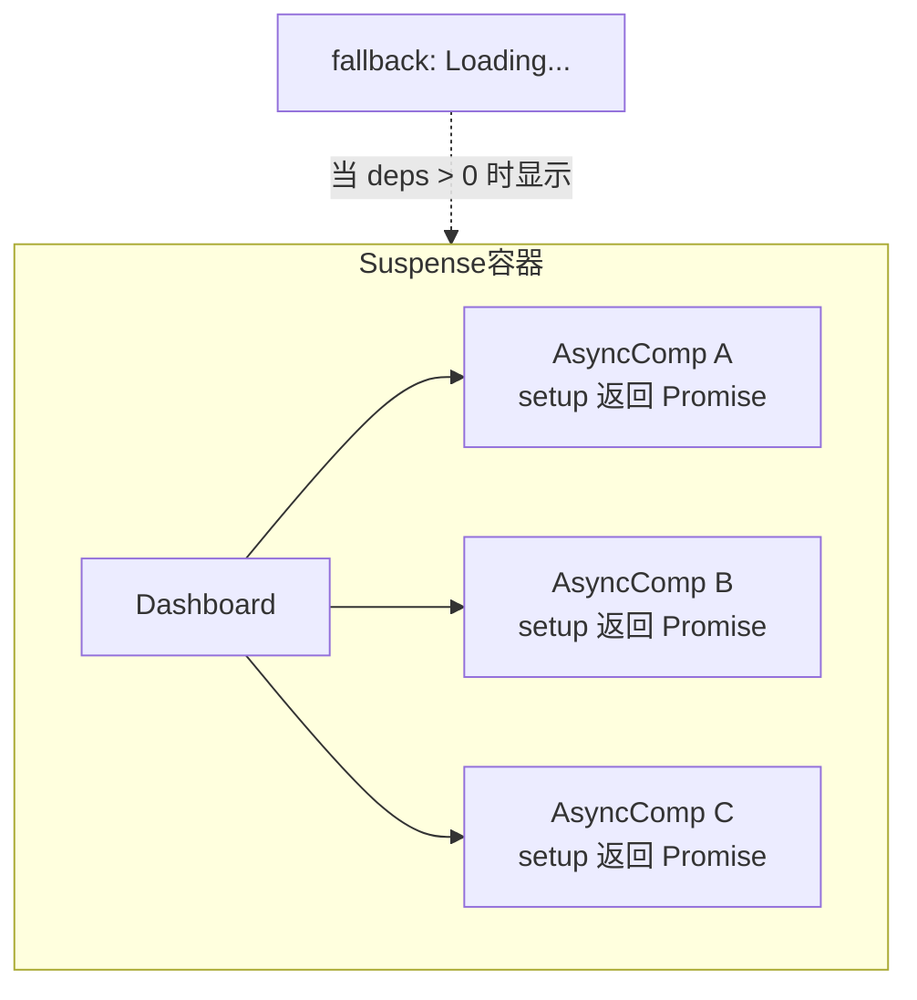
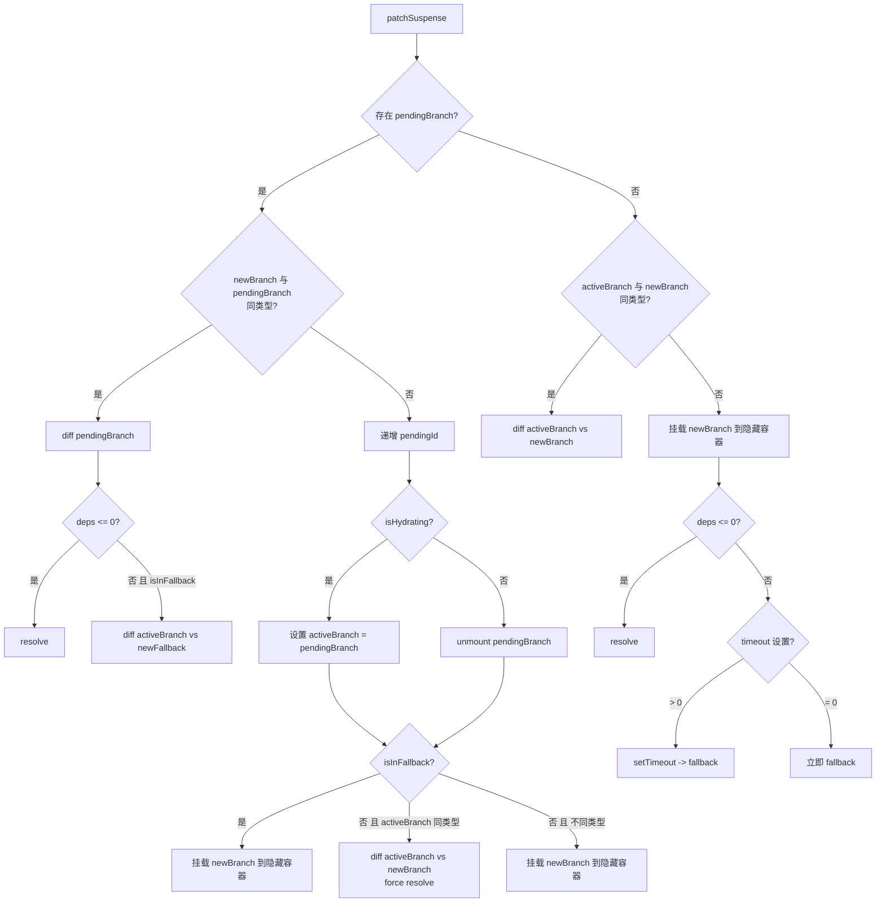

# Suspense源码分析

## 前言

`<Suspense>` 是一个内置组件，用来在组件树中协调对异步依赖的处理。可以帮助我们更好地完成组件树父组件对子组件的多个嵌套异步依赖关系的管理，当父组件处于等待中时，允许我们自定义挂载一个加载中状态。



上图中，`AsyncComp A / B / C` 三个子组件的 `setup()` 均返回 `Promise`（即包含异步依赖）。通过 `<Suspense>` 组件我们可以很容易实现在组件异步加载时统一展示加载中状态，在所有组件完成加载时，再统一展示：

```html
<Suspense>
  <!-- 具有深层异步依赖的组件 -->
  <Dashboard />

  <!-- 在 #fallback 插槽中显示 "正在加载中" -->
  <template #fallback>
    Loading...
  </template>
</Suspense>
```

接下来将深入分析 `<Suspense>` 组件实现的原理。

## Suspense 挂载

`<Suspense>` 组件和所有内置组件一样，也是有初始化挂载的过程，首先来看 `Vue` 对 `<Suspense>` 组件的源码定义：

```js
export const SuspenseImpl = {
  name: 'Suspense',
  // Suspense 组件标识符
  __isSuspense: true,
  process(...) {
    if (n1 == null) {
      // 初始化挂载的逻辑
      mountSuspense(...)
    } else {
      // diff 的逻辑
      patchSuspense(...)
    }
  },
  hydrate: hydrateSuspense,
  normalize: normalizeSuspenseChildren,
}
```

`process` 的执行时机和前面提到的 `<Teleport>` 组件是一致的，会在 `patch` 的时候根据组件的 `shapeFlag` 标志来判断是否需要执行 `process` 函数的调用。

```js
const patch = (n1, n2, container, anchor, ...) => {
  // ...
  const { type, ref, shapeFlag } = n2
  switch (type) {
    case Text:
      processText(n1, n2, container, anchor)
      break
    // ...
    default:
      // ...
      else if (__FEATURE_SUSPENSE__ && shapeFlag & ShapeFlags.SUSPENSE) {
        // 对 Suspense 节点进行处理
        type.process(
          n1,
          n2,
          container,
          anchor,
          parentComponent,
          parentSuspense,
          namespace,
          slotScopeIds,
          optimized,
          internals,
        )
      }
  }
}
```

接下来，我们着重先来看看 `Suspense` 的初始化挂载逻辑，这块的代码集中在 `mountSuspense` 中：

```js
function mountSuspense(vnode, container, anchor, parentComponent, parentSuspense, namespace, slotScopeIds, optimized, rendererInternals) {
  const {
    p: patch,
    o: { createElement }
  } = rendererInternals
  // 创建隐藏容器，用来实例化挂载 default 插槽内的内容
  const hiddenContainer = createElement('div')
  // 构造一个 suspense 对象，并赋值给 vnode.suspense
  const suspense = (vnode.suspense = createSuspenseBoundary(
    vnode,
    parentSuspense,
    parentComponent,
    container,
    hiddenContainer,
    anchor,
    namespace,
    slotScopeIds,
    optimized,
    rendererInternals,
  ))

  // 离线挂载 default 插槽内的内容
  patch(
    null,
    (suspense.pendingBranch = vnode.ssContent!),
    hiddenContainer,
    null,
    parentComponent,
    suspense,
    namespace,
    slotScopeIds,
  )
  // 如果有异步依赖
  if (suspense.deps > 0) {
    // 触发 onPending，onFallback 钩子函数
    triggerEvent(vnode, 'onPending')
    triggerEvent(vnode, 'onFallback')

    // 初始化挂载 fallback 插槽内容
    patch(
      null,
      vnode.ssFallback!,
      container,
      anchor,
      parentComponent,
      // fallback tree 不会有 suspense context
      null,
      namespace,
      slotScopeIds,
    )
    // 将 fallback vnode 设置为 activeBranch
    setActiveBranch(suspense, vnode.ssFallback!)
  } else {
    // 如果 suspense 没有异步依赖，直接调用 resolve
    suspense.resolve(false, true)
  }
}
```

在开始解读源码之前，我们需要提前认识几个关键变量的含义：

1. `ssContent` 代表的是 `default` 插槽内的内容的 `vnode`。
2. `ssFallback` 代表的是 `fallback` 插槽内的内容的 `vnode`。
3. `activeBranch` 代表的是当前激活的分支，就是挂载到页面中的 `vnode`。
4. `pendingBranch` 代表的是正处于 `pending` 状态的分支，一般指还未被激活的 `default` 插槽内的内容中的 `vnode`。

然后分析整个 `mountSuspense` 的过程，首先会创建一个隐藏的 `DOM` 元素，该元素将作为 `default` 插槽内容的初始化挂载容器。然后创建了一个 `suspense` 变量，该变量内部包含了一些对 `<Suspense>` 组件的处理函数：

```js
function createSuspenseBoundary(vnode, parentSuspense, parentComponent, container, hiddenContainer, anchor, namespace, slotScopeIds, optimized, rendererInternals, isHydrating = false) {
  // ...
  const suspense: SuspenseBoundary = {
    vnode,
    parent: parentSuspense,
    parentComponent,
    namespace,
    container,
    hiddenContainer,
    deps: 0,
    pendingId: suspenseId++,
    timeout: typeof timeout === 'number' ? timeout : -1,
    activeBranch: null,
    pendingBranch: null,
    isInFallback: !isHydrating,
    isHydrating,
    isUnmounted: false,
    effects: [],

    resolve(resume = false, sync = false) {
      // ...
    },

    fallback(fallbackVNode) {
      // ...
    },

    move(container, anchor, type) {
      // ...
    },

    next() {
      // ...
    },

    registerDep(instance, setupRenderEffect, optimized) {
      // ...
    },

    unmount(parentSuspense, doRemove) {
      // ...
    },
  }

  return suspense
}
```

可以看到，这个 `createSuspenseBoundary` 函数本身其实并没有做太多的事情，本质上就是为了构造一个 `suspense` 对象。

接下来会进入到对 `default` 容器中的内容进行 `patch` 的过程。在本课程的第二小节中，提到了 `patch` 函数在进行组件实例化的过程中，会执行 `setupStatefulComponent` 这个设置并运行副作用渲染函数的方法，之前只介绍了该方法处理同步 `setup` 的情况，而对于 `<Suspense>` 组件来说，`setup` 会返回一个 `promise`。下面分析对于这种情况的处理：

```js
function setupStatefulComponent(instance, isSSR) {
  // ...
  // 对于 setup 返回是个 promise 的情况
  if (isPromise(setupResult)) {
    setupResult.then(unsetCurrentInstance, unsetCurrentInstance)
    if (__FEATURE_SUSPENSE__) {
      // 在 suspense 模式下，为实例 asyncDep 赋值为 setupResult
      instance.asyncDep = setupResult
    }
  }
}
```

可以看到对于 `Suspense` 组件来说，其中的 `default` 内容的 `setup` 如果返回的是个 `promise` 对象的话，则会将 `setup` 函数执行的结果 `setupResult` 赋值给实例属性 `asyncDep`。那 `asyncDep` 有什么作用？

在渲染器执行 `mountComponent` 的时候，如果存在 `asyncDep` 变量，则会调用 `suspense` 上的 `registerDep` 方法，并为 `default` 中的插槽节点创建了一个占位符：

```js
const mountComponent = (initialVNode, container, anchor, parentComponent, parentSuspense, namespace, optimized) => {
  // ...
  // 依赖于 suspense 的异步 setup
  if (__FEATURE_SUSPENSE__ && instance.asyncDep) {
    parentSuspense && parentSuspense.registerDep(instance, setupRenderEffect, optimized)

    // 为插槽 vnode 创建注释节点
    if (!initialVNode.el) {
      const placeholder = (instance.subTree = createVNode(Comment))
      processCommentNode(null, placeholder, container, anchor)
    }
    return
  }
  // ...
}
```

这里的 `parentSuspense` 就是 `default` 插槽内的第一个父级 `suspense` 对象。接下来看看 `registerDep` 的执行逻辑：

```js
registerDep(instance, setupRenderEffect, optimized) {
  // 是否有异步未处理的分支
  const isInPendingSuspense = !!suspense.pendingBranch
  if (isInPendingSuspense) {
    // deps 这里会被递增，记录依赖的异步数量
    suspense.deps++
  }
  const hydratedEl = instance.vnode.el
  // asyncDep promise 执行
  instance
    .asyncDep!.catch(err => {
      // setup return 的 promise 异常捕获
      handleError(err, instance, ErrorCodes.SETUP_FUNCTION)
    })
    .then(asyncSetupResult => {
      // 处理一些异常结果
      if (
        instance.isUnmounted ||
        suspense.isUnmounted ||
        suspense.pendingId !== instance.suspenseId
      ) {
        return
      }
      // setup 处理完成调用
      instance.asyncResolved = true
      const { vnode } = instance
      handleSetupResult(instance, asyncSetupResult, false)
      // 占位内容，就是 mountComponent 中创建的注释节点
      const placeholder = !hydratedEl && instance.subTree.el
      // 执行 render 挂载节点
      setupRenderEffect(
        instance,
        vnode,
        // 找到注释占位内容的父节点，作为容器节点，也就是我们之前创建的隐藏 dom
        parentNode(hydratedEl || instance.subTree.el!)!,
        // anchor
        hydratedEl ? null : next(instance.subTree),
        suspense,
        namespace,
        optimized,
      )
      // 移除占位符
      if (placeholder) {
        remove(placeholder)
      }
      // 更新 vnode el 属性
      updateHOCHostEl(instance, vnode.el)

      // 当所有的异步依赖处理完成后执行 suspense.resolve()
      if (isInPendingSuspense && --suspense.deps === 0) {
        suspense.resolve()
      }
    })
},
```

这里在执行 `createSuspenseBoundary` 函数的时候，有一个变量需要先了解一下，就是 `suspense.deps`。这个变量记录着需要处理的异步数量，比如我们上面的图例中，`deps = 3`。

然后会对 `instance.asyncDep` 的执行结果进行处理，如果有异常，则进入到 `handleError` 的逻辑，`handleError` 内部会调用 `onErrorCaptured` 钩子，可以让我们监听到组件的错误。

如果正常返回，则会进入到 `then` 的处理逻辑中，这里的处理主要做了以下几件事：

1. 首先对一些异常场景进行降级，这里的异常场景包含了组件实例在异步执行完成后被卸载，或者 `Suspense` 实例被卸载等情况。
2. 然后就是为组件设置 `render` 函数。如果 `setup promise` 返回的是函数，那么这里也会将这个函数设置为渲染函数。
3. 接着就是通过 `setupRenderEffect` 函数的调用，完成渲染函数的调用执行，生成 `DOM` 节点。
4. 最后，根据 `deps` 判断是否所有的异步依赖都已执行完，如果执行完，则进入 `suspense.resolve()` 的逻辑。

介绍完了 `patch` 的过程，再回到 `mountSuspense` 函数体当中，如果存在异步依赖，此时的 `suspense.deps > 0` 会进入到对异步处理的逻辑中：

```js
// 触发 onPending，onFallback 钩子函数
triggerEvent(vnode, 'onPending')
triggerEvent(vnode, 'onFallback')

// 初始化挂载 fallback 插槽内容
patch(
  null,
  vnode.ssFallback!,
  container,
  anchor,
  parentComponent,
  null, // fallback tree 不会有 suspense context
  namespace,
  slotScopeIds,
)
// 将 fallback vnode 设置为 activeBranch
setActiveBranch(suspense, vnode.ssFallback!)
```

这里的核心逻辑就是在 `default` 插槽中的异步未执行完成时，先挂载 `fallback` 的内容。然后将 `activeBranch` 设置为 `fallback`。

如果不存在异步依赖，`suspense.deps = 0` 此时，也会直接执行 `suspense.resolve()`。

接下来，我们看看这个 `resolve` 到底做了哪些事：

```js
resolve(resume = false, sync = false) {
  const {
    vnode,
    activeBranch,
    pendingBranch,
    pendingId,
    effects,
    parentComponent,
    container,
  } = suspense

  // 如果有过渡动画，需要等待过渡完成
  let delayEnter: boolean | null = false
  if (suspense.isHydrating) {
    suspense.isHydrating = false
  } else if (!resume) {
    delayEnter =
      activeBranch &&
      pendingBranch!.transition &&
      pendingBranch!.transition.mode === 'out-in'
    if (delayEnter) {
      activeBranch!.transition!.afterLeave = () => {
        if (pendingId === suspense.pendingId) {
          move(
            pendingBranch!,
            container,
            anchor === initialAnchor ? next(activeBranch!) : anchor,
            MoveType.ENTER,
          )
          queuePostFlushCb(effects)
        }
      }
    }
    // 卸载当前激活分支，即 fallback
    if (activeBranch) {
      // 获取最新的锚点位置
      if (parentNode(activeBranch.el!) === container) {
        anchor = next(activeBranch)
      }
      unmount(activeBranch, parentComponent, suspense, true)
    }
    if (!delayEnter) {
      // 将 default 容器中的内容移动到可视区域
      move(pendingBranch!, container, anchor, MoveType.ENTER)
    }
  }
  // 将 pendingBranch 设置为激活分支
  setActiveBranch(suspense, pendingBranch!)
  suspense.pendingBranch = null
  suspense.isInFallback = false

  // 获取父节点
  let parent = suspense.parent
  // 标记是否还有未处理完成的 suspense
  let hasUnresolvedAncestor = false
  while (parent) {
    if (parent.pendingBranch) {
      // 如果存在还未处理完的父级 suspense，将当前 effect 合并到父级当中
      parent.effects.push(...effects)
      hasUnresolvedAncestor = true
      break
    }
    parent = parent.parent
  }
  // 全部处理完 suspense，一次性 queuePostFlushCb
  if (!hasUnresolvedAncestor && !delayEnter) {
    queuePostFlushCb(effects)
  }
  suspense.effects = []

  // 如果设置了 suspensible，解析父级 suspense
  if (isSuspensible) {
    if (
      parentSuspense &&
      parentSuspense.pendingBranch &&
      parentSuspenseId === parentSuspense.pendingId
    ) {
      parentSuspense.deps--
      if (parentSuspense.deps === 0 && !sync) {
        parentSuspense.resolve()
      }
    }
  }

  // 调用 onResolve 钩子函数
  triggerEvent(vnode, 'onResolve')
},
```

这里要做的事情也是比较明确的，我们也来一一枚举一下：

1. 卸载 `fallback` 的插槽内容，因为已经完成了异步逻辑，所以没必要了。
2. 将之前缓存在内存中的 `default` 节点移动到可视区域。
3. 遍历父节点，找到是否还有未完成的 `suspense` 节点，将当前的渲染 `effects` 合并到父节点上进行统一更新。
4. 如果设置了 `suspensible` 属性，则递减父级 `suspense` 的 `deps`，当父级 `deps` 为 0 时也会 `resolve`。
5. 触发 `onResolve` 钩子函数。

这里我想重点说一下第三点，什么情况下会出现子节点已经完成异步依赖执行但父节点还有未完成的异步依赖？可以来看一个 `demo`：

```javascript
import { createApp, ref, h, onMounted } from 'vue'

// 构造一个异步渲染容器
function defineAsyncComponent(
  comp,
  delay = 0
) {
  return {
    setup(props, { slots }) {
      return new Promise(resolve => {
        setTimeout(() => {
          resolve(() => h(comp, props, slots))
        }, delay)
      })
    }
  }
}
// 定义一个外层异步组件
const AsyncOuter = defineAsyncComponent(
  {
    setup: () => {
      onMounted(() => {
        console.log('outer mounted')
      })
      return () => h('div', 'async outer')
    }
  },
  2000
)
// 定义一个内层异步组件
const AsyncInner = defineAsyncComponent(
  {
    setup: () => {
      onMounted(() => {
        console.log('inner mounted')
      })
      return () => h('div', 'async inner')
    }
  },
  1000
)
// 定义一个内层 Suspense 组件
const Inner = {
  setup() {
    return () =>
      h(Suspense, null, {
        default: h(AsyncInner),
        fallback: h('div', 'fallback inner')
      })
  }
}
createApp({
  setup() {
    return () =>
      // 定义一个外层 Suspense 组件
      h(Suspense, null, {
        default: h('div', [h(AsyncOuter), h(Inner)]),
        fallback: h('div', 'fallback outer')
      })
  },
}).mount('#app')
```

此处，构造了一个包含了 `Suspense` 异步渲染的 `Outer` 组件，`Outer` 中又包含了另一个通过 `Suspense` 渲染的 `Inner` 组件。我们通过 `defineAsyncComponent` 函数来模拟组件的异步过程，此时的 `AsyncInner` 组件是优先于 `AsyncOuter` 组件的异步完成的，对于这种情况，就满足了存在父的 `Suspense` 且父级 `Suspense` 还有 `pendingBranch` 待处理的情况，那么会把子组件的 `suspense.effects` 合入父组件当中。

`suspense.effects` 是个什么？

```js
// queuePostRenderEffect 在 suspense 模式下指的是 queueEffectWithSuspense
export const queuePostRenderEffect = __FEATURE_SUSPENSE__
  ? queueEffectWithSuspense
  : queuePostFlushCb

export function queueEffectWithSuspense(fn, suspense) {
  // 针对 suspense 处理，会将渲染函数推送到 suspense.effects 中
  if (suspense && suspense.pendingBranch) {
    if (isArray(fn)) {
      suspense.effects.push(...fn)
    } else {
      suspense.effects.push(fn)
    }
  } else {
    queuePostFlushCb(fn)
  }
}
```

`suspense.effects` 在 `suspense` 模式下，就是通过 `queuePostRenderEffect` 生成的副作用函数的数组。我们的示例中，会在组件中调用 `onMounted` 钩子函数，在组件被挂载的时候，就会执行通过 `queuePostRenderEffect` 函数，将 `onMounted` 推入 `suspense.effects` 数组中：

```js
// 设置并运行带副作用的渲染函数
const setupRenderEffect = (...) => {
  const componentUpdateFn = () => {
    if (!instance.isMounted) {
      // ...
      const { m } = instance
      // mounted hook 推入到 suspense.effects
      if (m) {
        queuePostRenderEffect(m, parentSuspense)
      }
    } else {
      // ...
      let { u } = instance
      // updated hook 推入到 suspense.effects
      if (u) {
        queuePostRenderEffect(u, parentSuspense)
      }
    }
  }
  // ...
}
```

所以上述的示例中，父子组件的 `onMounted` 钩子将会在父组件异步完成后统一执行。

## Suspense 更新

接下来我们看一下 `Suspense` 更新的逻辑，这块的逻辑都集中在 `patchSuspense` 函数中：

```js
function patchSuspense(n1, n2, container, anchor, parentComponent, namespace, slotScopeIds, optimized, { p: patch, um: unmount, o: { createElement } }) {
  // 初始化赋值操作
  const suspense = (n2.suspense = n1.suspense)!
  suspense.vnode = n2
  n2.el = n1.el
  // 最新的 default 分支
  const newBranch = n2.ssContent!
  // 最新的 fallback 分支
  const newFallback = n2.ssFallback!

  const { activeBranch, pendingBranch, isInFallback, isHydrating } = suspense

  // #8678 如果当前 suspense 需要被 patch 且 parentSuspense 尚未解析
  // 这意味着当前 suspense 和 parentSuspense 都需要被 patch
  // 因为 parentSuspense 的 pendingBranch 包含了当前 suspense
  // 它会被处理两次，需要跳过当前 patch 以避免内部组件的多次挂载
  if (
    parentSuspense &&
    parentSuspense.deps > 0 &&
    !n1.suspense!.isInFallback
  ) {
    n2.suspense = n1.suspense!
    n2.suspense.vnode = n2
    n2.el = n1.el
    return
  }

  if (pendingBranch) {
    suspense.pendingBranch = newBranch
    // 新旧分支是属于 isSameVNodeType
    if (isSameVNodeType(newBranch, pendingBranch)) {
      // 新旧分支进行 diff
      patch(
        pendingBranch,
        newBranch,
        suspense.hiddenContainer,
        null,
        parentComponent,
        suspense,
        namespace,
        slotScopeIds,
        optimized,
      )
      // 没有依赖则直接 resolve
      if (suspense.deps <= 0) {
        suspense.resolve()
      } else if (isInFallback) {
        // 处于 fallback 中，激活分支和 newFallback 进行 diff
        if (!isHydrating) {
          patch(
            activeBranch,
            newFallback,
            container,
            anchor,
            parentComponent,
            null,
            namespace,
            slotScopeIds,
            optimized,
          )
          setActiveBranch(suspense, newFallback)
        }
      }
    } else {
      // toggled before pending tree is resolved
      suspense.pendingId = suspenseId++
      if (isHydrating) {
        // 如果在水合完成前切换，将当前 DOM 树设为 activeBranch
        suspense.isHydrating = false
        suspense.activeBranch = pendingBranch
      } else {
        unmount(pendingBranch, parentComponent, suspense)
      }
      // 重置 suspense 状态
      suspense.deps = 0
      suspense.effects.length = 0
      suspense.hiddenContainer = createElement('div')

      if (isInFallback) {
        // 已经在 fallback 状态
        patch(
          null,
          newBranch,
          suspense.hiddenContainer,
          null,
          parentComponent,
          suspense,
          namespace,
          slotScopeIds,
          optimized,
        )
        if (suspense.deps <= 0) {
          suspense.resolve()
        } else {
          patch(
            activeBranch,
            newFallback,
            container,
            anchor,
            parentComponent,
            null,
            namespace,
            slotScopeIds,
            optimized,
          )
          setActiveBranch(suspense, newFallback)
        }
      } else if (activeBranch && isSameVNodeType(newBranch, activeBranch)) {
        // 切换回当前激活分支
        patch(
          activeBranch,
          newBranch,
          container,
          anchor,
          parentComponent,
          suspense,
          namespace,
          slotScopeIds,
          optimized,
        )
        // 强制 resolve
        suspense.resolve(true)
      } else {
        // 切换到第三个分支
        patch(
          null,
          newBranch,
          suspense.hiddenContainer,
          null,
          parentComponent,
          suspense,
          namespace,
          slotScopeIds,
          optimized,
        )
        if (suspense.deps <= 0) {
          suspense.resolve()
        }
      }
    }
  } else {
    if (activeBranch && isSameVNodeType(newBranch, activeBranch)) {
      // activeBranch 和 newBranch 进行 diff
      patch(
        activeBranch,
        newBranch,
        container,
        anchor,
        parentComponent,
        suspense,
        namespace,
        slotScopeIds,
        optimized,
      )
      setActiveBranch(suspense, newBranch)
    } else {
      // root node toggled
      // 触发 @pending 事件
      triggerEvent(n2, 'onPending')
      // 挂载 pending 分支到隐藏容器
      suspense.pendingBranch = newBranch
      if (newBranch.shapeFlag & ShapeFlags.COMPONENT_KEPT_ALIVE) {
        suspense.pendingId = newBranch.component!.suspenseId!
      } else {
        suspense.pendingId = suspenseId++
      }
      patch(
        null,
        newBranch,
        suspense.hiddenContainer,
        null,
        parentComponent,
        suspense,
        namespace,
        slotScopeIds,
        optimized,
      )
      if (suspense.deps <= 0) {
        // 新分支没有异步依赖，直接 resolve
        suspense.resolve()
      } else {
        const { timeout, pendingId } = suspense
        if (timeout > 0) {
          setTimeout(() => {
            if (suspense.pendingId === pendingId) {
              suspense.fallback(newFallback)
            }
          }, timeout)
        } else if (timeout === 0) {
          suspense.fallback(newFallback)
        }
      }
    }
  }
}
```

这个函数核心作用是通过判断 `ssContent`、`ssFallback`、`pendingBranch`、`activeBranch` 的内容，进行不同条件的 `diff`。`diff` 完成后的工作和上面初始化的过程是大致一样的，会进行异步依赖 `deps` 数目的判断，如果没有依赖 `deps` 则直接进行 `suspense.resolve`。

该函数看起来分支逻辑比较多，我们可以通过下面的流程图捋顺其中的逻辑：



## Vue 3.5 新特性：suspensible 属性

`Vue 3.5` 为 `<Suspense>` 组件新增了 `suspensible` 属性，允许子 `Suspense` 被父级 `Suspense` 捕获。

### 问题背景

在之前的版本中，嵌套的 `Suspense` 组件是相互独立的。子 `Suspense` 的异步依赖不会影响父 `Suspense` 的状态，这导致了一个问题：当子 `Suspense` 还在等待异步依赖时，父 `Suspense` 可能已经 `resolve` 并显示了不完整的内容。

### suspensible 的使用

```html
<ParentSuspense>
  <ChildSuspense suspensible>
    <AsyncComponent />
  </ChildSuspense>
</ParentSuspense>
```

当 `suspensible` 设置为 `true` 时，子 `Suspense` 的异步依赖会被计入父 `Suspense` 的 `deps` 中，父 `Suspense` 会等待子 `Suspense` 完成后才 `resolve`。

### 源码实现

在 `createSuspenseBoundary` 中，`suspensible` 的实现逻辑如下：

```js
function createSuspenseBoundary(...) {
  // ...
  // 如果设置了 suspensible: true，将当前 suspense 设置为父 suspense 的依赖
  let parentSuspenseId: number | undefined
  const isSuspensible = isVNodeSuspensible(vnode)
  if (isSuspensible) {
    if (parentSuspense && parentSuspense.pendingBranch) {
      parentSuspenseId = parentSuspense.pendingId
      parentSuspense.deps++
    }
  }

  const suspense: SuspenseBoundary = {
    // ...
    resolve(resume = false, sync = false) {
      // ...
      // 如果设置了 suspensible，解析父级 suspense
      if (isSuspensible) {
        if (
          parentSuspense &&
          parentSuspense.pendingBranch &&
          parentSuspenseId === parentSuspense.pendingId
        ) {
          parentSuspense.deps--
          if (parentSuspense.deps === 0 && !sync) {
            parentSuspense.resolve()
          }
        }
      }
      // ...
    },
  }
}

function isVNodeSuspensible(vnode: VNode) {
  const suspensible = vnode.props && vnode.props.suspensible
  return suspensible != null && suspensible !== false
}
```

实现要点：

1. 在创建 `suspense boundary` 时，如果检测到 `suspensible` 属性，则递增父 `suspense` 的 `deps`。
2. 当子 `suspense` `resolve` 时，递减父 `suspense` 的 `deps`，如果父 `deps` 为 0，则也 `resolve` 父 `suspense`。
3. 通过 `parentSuspenseId` 来确保只有在父 `suspense` 的 `pendingId` 未变时才递减 `deps`，避免过时的回调影响状态。

## Vue 3.5 新特性：Lazy Hydration（懒水合）

`Vue 3.5` 引入了异步组件的**懒水合**（Lazy Hydration）功能，这是 `SSR` 场景下的一个重要优化。在服务端渲染中，所有组件的 `HTML` 都已经在服务端生成，客户端只需要将其"激活"（hydrate）为可交互的 `Vue` 应用。但对于异步组件，默认情况下会在客户端立即加载并水合，即使这些组件对用户来说还不可见或不需要交互。

### 懒水合策略

`Vue 3.5` 提供了四种懒水合策略，通过 `defineAsyncComponent` 的 `hydrate` 选项来配置：

#### 1. hydrateOnIdle - 空闲时水合

当浏览器空闲时才进行水合，适合低优先级组件：

```js
import { defineAsyncComponent, hydrateOnIdle } from 'vue'

const AsyncComp = defineAsyncComponent({
  loader: () => import('./AsyncComp.vue'),
  hydrate: hydrateOnIdle(/* 最大等待时间，默认 10000ms */)
})
```

源码实现：

```js
export const hydrateOnIdle: HydrationStrategyFactory<number> =
  (timeout = 10000) =>
  hydrate => {
    const id = requestIdleCallback(hydrate, { timeout })
    return () => cancelIdleCallback(id)
  }
```

#### 2. hydrateOnVisible - 可见时水合

当组件进入视口时才进行水合，适合首屏不可见的组件：

```js
import { defineAsyncComponent, hydrateOnVisible } from 'vue'

const AsyncComp = defineAsyncComponent({
  loader: () => import('./AsyncComp.vue'),
  hydrate: hydrateOnVisible(/* 可选的 IntersectionObserver 选项 */)
})
```

源码实现：

```js
export const hydrateOnVisible: HydrationStrategyFactory<
  IntersectionObserverInit
> = opts => (hydrate, forEach) => {
  const ob = new IntersectionObserver(entries => {
    for (const e of entries) {
      if (!e.isIntersecting) continue
      ob.disconnect()
      hydrate()
      break
    }
  }, opts)
  forEach(el => {
    if (!(el instanceof Element)) return
    // 如果元素已经在视口中，直接水合
    if (elementIsVisibleInViewport(el)) {
      hydrate()
      ob.disconnect()
      return false
    }
    ob.observe(el)
  })
  return () => ob.disconnect()
}
```

#### 3. hydrateOnMediaQuery - 媒体查询匹配时水合

当指定的媒体查询条件匹配时才进行水合，适合响应式场景：

```js
import { defineAsyncComponent, hydrateOnMediaQuery } from 'vue'

const AsyncComp = defineAsyncComponent({
  loader: () => import('./AsyncComp.vue'),
  hydrate: hydrateOnMediaQuery('(max-width: 768px)')
})
```

源码实现：

```js
export const hydrateOnMediaQuery: HydrationStrategyFactory<string> =
  query => hydrate => {
    if (query) {
      const mql = matchMedia(query)
      if (mql.matches) {
        hydrate()
      } else {
        mql.addEventListener('change', hydrate, { once: true })
        return () => mql.removeEventListener('change', hydrate)
      }
    }
  }
```

#### 4. hydrateOnInteraction - 交互时水合

当用户与组件发生指定交互时才进行水合，适合需要用户交互才激活的组件：

```js
import { defineAsyncComponent, hydrateOnInteraction } from 'vue'

const AsyncComp = defineAsyncComponent({
  loader: () => import('./AsyncComp.vue'),
  hydrate: hydrateOnInteraction('click') // 或 ['click', 'focus']
})
```

源码实现：

```js
export const hydrateOnInteraction: HydrationStrategyFactory<
  keyof HTMLElementEventMap | Array<keyof HTMLElementEventMap>
> =
  (interactions = []) =>
  (hydrate, forEach) => {
    if (isString(interactions)) interactions = [interactions]
    let hasHydrated = false
    const doHydrate = (e: Event) => {
      if (!hasHydrated) {
        hasHydrated = true
        teardown()
        hydrate()
        // 重放事件，确保交互不会丢失
        e.target!.dispatchEvent(new (e.constructor as any)(e.type, e))
      }
    }
    const teardown = () => {
      forEach(el => {
        for (const i of interactions) {
          el.removeEventListener(i, doHydrate)
        }
      })
    }
    forEach(el => {
      for (const i of interactions) {
        el.addEventListener(i, doHydrate, { once: true })
      }
    })
    return teardown
  }
```

值得注意的是，`hydrateOnInteraction` 在水合后会**重放触发水合的事件**，确保用户的交互不会因为水合延迟而丢失。

### 懒水合的内部机制

懒水合策略在 `defineAsyncComponent` 中通过 `__asyncHydrate` 方法集成：

```js
return defineComponent({
  name: 'AsyncComponentWrapper',
  __asyncLoader: load,

  __asyncHydrate(el, instance, hydrate) {
    const doHydrate = hydrateStrategy
      ? () => {
          const teardown = hydrateStrategy(hydrate, cb =>
            forEachElement(el, cb),
          )
          if (teardown) {
            ;(instance.bum || (instance.bum = [])).push(teardown)
          }
        }
      : hydrate
    if (resolvedComp) {
      doHydrate()
    } else {
      load().then(() => !instance.isUnmounted && doHydrate())
    }
  },
  // ...
})
```

`__asyncHydrate` 的执行逻辑：

1. 如果配置了 `hydrateStrategy`，则将原始 `hydrate` 函数包装为策略驱动的版本。
2. 策略函数接收 `hydrate` 回调和 `forEachElement` 辅助函数（用于遍历组件的根元素，包括 `Fragment` 的情况）。
3. 如果策略返回了 `teardown` 函数，则将其注册到组件的 `beforeUnmount` 钩子中，确保组件卸载时清理资源（如移除事件监听器、断开 `IntersectionObserver` 等）。
4. 如果组件已经加载完成，则立即执行水合；否则等待加载完成后再执行。

### 懒水合策略对比

| 策略 | 触发条件 | 适用场景 | 返回清理函数 |
|------|---------|---------|------------|
| `hydrateOnIdle` | 浏览器空闲时 | 低优先级组件 | `cancelIdleCallback` |
| `hydrateOnVisible` | 元素进入视口 | 首屏不可见组件 | `disconnect Observer` |
| `hydrateOnMediaQuery` | 媒体查询匹配 | 响应式组件 | `removeEventListener` |
| `hydrateOnInteraction` | 用户交互触发 | 需交互才激活的组件 | `removeEventListener` |

## 总结

本小节我们详细介绍了 `<Suspense>` 组件的实现原理，本质上就是通过一个计数器 `deps` 来记录需要被处理的依赖数量，当异步状态执行完成后，相应的计数器进行递减，当所有 `deps` 清空时，则达到统一完成态。与此同时，如果有父子嵌套的情况出现，会根据父节点的 `suspense` 状态来判断是否需要统一处理 `effects`。

此外，`Vue 3.5` 对 `Suspense` 组件做了多项重要改进：

1. **suspensible 属性**：允许子 `Suspense` 被父级 `Suspense` 捕获，子 `Suspense` 的异步依赖会计入父 `Suspense` 的 `deps`，实现父子 `Suspense` 的联动。
2. **Lazy Hydration（懒水合）**：为异步组件提供了四种懒水合策略（`hydrateOnIdle`、`hydrateOnVisible`、`hydrateOnMediaQuery`、`hydrateOnInteraction`），允许在 `SSR` 场景下延迟水合时机，优化页面加载性能。
3. **嵌套 Suspense patch 优化**：修复了嵌套 `Suspense` 在 `patch` 时可能导致内部组件多次挂载的问题（#8678）。
4. **Transition 集成改进**：`resolve` 函数中增加了对 `out-in` 过渡模式的支持，确保 `fallback` 到 `default` 的切换可以配合过渡动画。

最后，`<Suspense>` 组件到目前为止，还是一个实验性的功能，这也意味着这个功能在后续迭代中可能会被随时调整，但 `Vue 3.5` 的这些改进已经使其在生产环境中的可用性大大提升。
