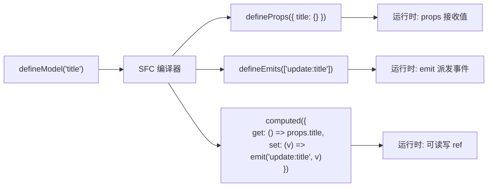
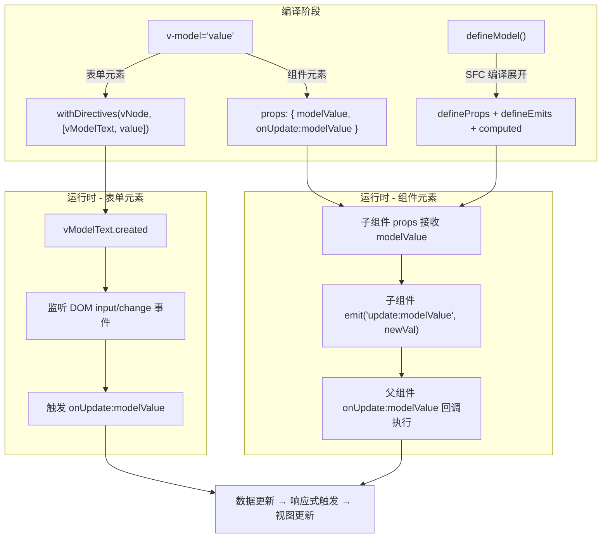

# v-model双向绑定原理

## 前言

部分读者在理解 `Vue` 的响应式原理的时候，可能会认为 `Vue` 的响应式是双向绑定的，但实际上这是不准确的，所谓数据的双向绑定可以体现为以下两部分：

1. 数据流向 `DOM` 的绑定：数据的更新最终映射到对应的视图更新。
2. `DOM` 流向数据的绑定：操作 `DOM` 的变化引起数据的更新。

我们在前面的章节花了不少篇幅介绍了响应式原理，其实这块就是着重在介绍数据流向 `DOM` 的过程。

在 `Vuejs` 中，我们则会经常通过 `v-model` 指令来实现数据的 "双向绑定"。 `v-model` 指令既可以作用在普通表单元素，也可以作用在一些组件上。接下来我们将分别介绍这两种情况的实现原理，并重点介绍 `Vue 3.4` 正式稳定的 `defineModel` 宏是如何简化组件双向绑定开发的。

## 表单元素

在使用 `Vuejs` 编写表单类的 `UI` 控件时，经常会使用 `v-model` 指令来为 `<input>`、`<select>`、`<textarea>` 进行数据的双向绑定。

我们使用 `Vue` 提供的官方[模板转换工具](https://vue-next-template-explorer.netlify.app/)来尝试一下在 `<input>`、`<select>`、`<textarea>` 输入类型的表单中使用 `v-model` 指令会被编译成什么样子：

**模板：**

```html
<input v-model='value1' />
<textarea v-model='value2' />
<select v-model='value3' />
```

**编译结果**

```js
import { vModelText as _vModelText, createElementVNode as _createElementVNode, withDirectives as _withDirectives, vModelSelect as _vModelSelect, Fragment as _Fragment, openBlock as _openBlock, createElementBlock as _createElementBlock } from "vue"

const _hoisted_1 = ["onUpdate:modelValue"]
const _hoisted_2 = ["onUpdate:modelValue"]
const _hoisted_3 = ["onUpdate:modelValue"]

export function render(_ctx, _cache, $props, $setup, $data, $options) {
  return (_openBlock(), _createElementBlock(_Fragment, null, [
    _withDirectives(_createElementVNode("input", {
      "onUpdate:modelValue": $event => ((_ctx.value1) = $event)
    }, null, 8 /* PROPS */, _hoisted_1), [
      [_vModelText, _ctx.value1]
    ]),
    _withDirectives(_createElementVNode("textarea", {
      "onUpdate:modelValue": $event => ((_ctx.value2) = $event)
    }, null, 8 /* PROPS */, _hoisted_2), [
      [_vModelText, _ctx.value2]
    ]),
    _withDirectives(_createElementVNode("select", {
      "onUpdate:modelValue": $event => ((_ctx.value3) = $event)
    }, null, 8 /* PROPS */, _hoisted_3), [
      [_vModelSelect, _ctx.value3]
    ])
  ], 64 /* STABLE_FRAGMENT */))
}
```

可以看到通过 `v-model` 绑定的元素，在转成渲染函数的时候，最外层都被套上了一个 `withDirectives` 函数，这个函数传入了两个变量：一个通过 `createElementVNode` 创建的 `vnode` 节点，另一个是一个数组类型的参数 `directives`。我们先来简单看一下 `withDirectives` 这个函数的实现：

```typescript
export function withDirectives<T extends VNode>(
  vnode: T,
  directives: DirectiveArguments,
): T {
  const internalInstance = currentRenderingInstance
  if (internalInstance === null) {
    return vnode
  }
  const instance = getExposeProxy(internalInstance) || internalInstance.proxy
  // 获取指令集
  const bindings = vnode.dirs || (vnode.dirs = [])
  // 遍历 directives
  for (let i = 0; i < directives.length; i++) {
    let [dir, value, arg, modifiers = EMPTY_OBJ] = directives[i]
    // 如果存在指令
    if (dir) {
      // 指令是个函数，构造 mounted、updated 钩子
      if (isFunction(dir)) {
        dir = {
          mounted: dir,
          updated: dir,
        } as Directive
      }
      // 存在 deep 属性，遍历访问每个属性
      if ((dir as Directive).deep) {
        traverse(value)
      }
      // bindings 中添加构造好的指令元素
      bindings.push({
        dir: dir as Directive,
        instance,
        value,
        oldValue: void 0,
        arg,
        modifiers,
      })
    }
  }
  return vnode
}
```

可以看到 `withDirectives` 函数主要就是为 `vnode` 节点上添加 `dirs` 属性，对于我们示例中的 `<input>` 节点而言，生成的 `dir` 内容大致为（ `select` 节点类似，这里就不再介绍了，有兴趣的可以在源码详细了解）：

```yaml
{
  dir: vModelText,
  value: _ctx.value1,
  ...
}
```

其中 `vModelText` 是一个对象，内置了 `v-model` 指令相关的生命周期的实现：

```typescript
export const vModelText: Directive<HTMLInputElement> = {
  // created 生命周期
  created(el, { modifiers: { lazy, trim, number } }, vnode) {
    // 获取 props 上 onUpdate:modelValue 函数
    el._assign = getModelAssigner(vnode)
    const castToNumber =
      number || (vnode.props && vnode.props.type === 'number')
    // 注册 input/change 事件
    addEventListener(el, lazy ? 'change' : 'input', e => {
      // ...
      let domValue = el.value
      // .trim 修饰符
      if (trim) {
        domValue = domValue.trim()
      }
      if (castToNumber) {
        domValue = looseToNumber(domValue)
      }
      // 执行 onUpdate:modelValue 函数
      el._assign(domValue)
    })
    if (trim) {
      addEventListener(el, 'change', () => {
        el.value = el.value.trim()
      })
    }
    // ...
  },
  mounted(el, { value }) {
    // 赋值
    el.value = value == null ? '' : value
  },
  beforeUpdate(el, { value, modifiers: { lazy, trim, number } }, vnode) {
    // 更新 el._assign
    el._assign = getModelAssigner(vnode)
    if (el.composing) return
    if (document.activeElement === el && el.type !== 'range') {
      if (lazy) {
        return
      }
      if (trim && el.value.trim() === value) {
        return
      }
      if (
        (number || el.type === 'number') &&
        looseToNumber(el.value) === value
      ) {
        return
      }
    }
    // 更新值
    const newValue = value == null ? '' : value
    if (el.value !== newValue) {
      el.value = newValue
    }
  },
}
```

可以看到 `vModelText` 内置了 `created`、`mounted`、`beforeUpdate` 钩子函数。

在 `created` 的时候，会从 `props` 上获取 `onUpdate:modelValue` 函数，这个函数也就是我们在遇到 `v-model` 指令后，`Vue` 的编译器自动转换生成的。然后再监听对应 `DOM` 上的 `change` 或者 `input` 事件，事件触发时再回调执行 `onUpdate:modelValue` 函数。

在 `mounted` 的时候，会将当前的值 `value` 赋值给 `el.value`。

### 指令生命周期的触发

前面我们提到了 `v-model` 注册的指令节点，会生成一个带有 `dirs` 的属性，属性中会包含类似于 `vModelText` 这样的对象，这个对象内部包含了一些生命周期函数，那这些生命周期函数又是在何时执行？再回到我们之前的 `mountElement` 函数内，这次我们着重看一下与指令相关的代码实现：

```typescript
const mountElement = (
  vnode: VNode,
  container: RendererElement,
  anchor: RendererNode | null,
  parentComponent: ComponentInternalInstance | null,
  parentSuspense: SuspenseBoundary | null,
  isSVG: boolean,
  optimized: boolean,
) => {
  // ...
  const { type, props, shapeFlag, transition, dirs } = vnode

  if (dirs) {
    // 执行 created 钩子函数
    invokeDirectiveHook(vnode, null, parentComponent, 'created')
  }
  // ...
  if (props) {
    // 处理 props，比如 class、style、event 等属性
  }
  if (dirs) {
    // 执行 beforeMount 钩子函数
    invokeDirectiveHook(vnode, null, parentComponent, 'beforeMount')
  }
  // 挂载 dom
  hostInsert(el, container, anchor)

  if (
    (vnodeHook = props && props.onVnodeMounted) ||
    needCallTransitionHooks ||
    dirs
  ) {
    queuePostRenderEffect(() => {
      vnodeHook && invokeVNodeHook(vnodeHook, parentComponent, vnode)
      needCallTransitionHooks && transition!.enter(el)
      // 执行 mounted 钩子函数
      dirs && invokeDirectiveHook(vnode, null, parentComponent, 'mounted')
    }, parentSuspense)
  }
}
```

可以看到指令相关的钩子函数在进行 `vnode` 初始化挂载的时候，会在挂载的各个阶段被分别调用，从而完成生命周期函数的执行过程。

## 组件

我们首先来看一下，`v-model` 在组件中一些常规的使用方式：

```html
<Component v-model="value1" />
<Component v-model:title="bookTitle" />
<Component v-model:first-name="first" v-model:last-name="last" />
```

在组件上，`v-model` 不仅仅可以使用 `modelValue` 作为 `prop`，以 `update:modelValue` 作为对应的事件，还支持了给 `v-model` 一个自定义参数来更改这些名字。因为有了自定义参数的功能，所以也就支持了一个组件多个 `v-model` 绑定的功能。

接下来再看看通过 [Vue 3 Template Explorer](https://vue-next-template-explorer.netlify.app/) 将上述模板转出来的渲染函数的表达形式：

```js
import { resolveComponent as _resolveComponent, createVNode as _createVNode, Fragment as _Fragment, openBlock as _openBlock, createElementBlock as _createElementBlock } from "vue"

export function render(_ctx, _cache, $props, $setup, $data, $options) {
  const _component_Component = _resolveComponent("Component")

  return (_openBlock(), _createElementBlock(_Fragment, null, [
    _createVNode(_component_Component, {
      modelValue: _ctx.value1,
      "onUpdate:modelValue": $event => ((_ctx.value1) = $event)
    }, null, 8 /* PROPS */, ["modelValue", "onUpdate:modelValue"]),
    _createVNode(_component_Component, {
      title: _ctx.bookTitle,
      "onUpdate:title": $event => ((_ctx.bookTitle) = $event)
    }, null, 8 /* PROPS */, ["title", "onUpdate:title"]),
    _createVNode(_component_Component, {
      "first-name": _ctx.first,
      "onUpdate:firstName": $event => ((_ctx.first) = $event),
      "last-name": _ctx.last,
      "onUpdate:lastName": $event => ((_ctx.last) = $event)
    }, null, 8 /* PROPS */, ["first-name", "onUpdate:firstName", "last-name", "onUpdate:lastName"])
  ], 64 /* STABLE_FRAGMENT */))
}
```

可以看到，编译器在处理组件带有 `v-model` 指令的时候，会将其根据相关参数进行解析，最后组成一个 `props` 传入组件中。拿一个 `v-model:title = 'bookTitle'` 举例，生成的 `props` 大致是这样的：

```js
{
  title: value,
  "onUpdate:title": $event => _ctx.bookTitle = $event
}
```

所以这也解释了为什么组件内部需要定义一个 `props` 用来承接 `title` 的值；定义一个 `emit`，在 `title` 值变化的时候，用来触发 `onUpdate:title`，并传入更新后的值。

```html
<!-- Component.vue -->
<script setup>
defineProps(['title'])
defineEmits(['update:title'])
</script>

<template>
  <input
    type="text"
    :value="title"
    @input="$emit('update:title', $event.target.value)"
  />
</template>
```

接下来我们再看看这个 `$emit` 是如何触发 `onUpdate:title` 函数的执行的。先来看看 `emit` 函数的实现：

```typescript
export function emit(
  instance: ComponentInternalInstance,
  event: string,
  ...rawArgs: any[]
): any {
  if (instance.isUnmounted) return
  const props = instance.vnode.props || EMPTY_OBJ

  let args = rawArgs

  // 定义事件名称
  let handlerName: string
  // update:xxx => onUpdate:xxx
  let handler =
    props[(handlerName = toHandlerKey(event))] ||
    props[(handlerName = toHandlerKey(camelize(event)))]
  // 找到了 handler 触发调用
  if (handler) {
    callWithAsyncErrorHandling(
      handler,
      instance,
      ErrorCodes.COMPONENT_EVENT_HANDLER,
      args,
    )
  }
  // ...
}
```

其中第一个参数是当前组件实例，`emit` 自动为我们绑定了当前组件，`event` 为事件名称，`rawArgs` 就是传入的一些参数。整个函数逻辑还是很清晰的，就是将传入的 `event` 名称转成 `onUpdate:xxx` 的写法，然后在 `props` 上找对应的函数，也就是我们传入的那个事件函数。找到了后就通过 `callWithAsyncErrorHandling` 方法进行调用，完成事件的执行。

## defineModel 宏

在前面的示例中，我们可以看到在组件中使用 `v-model` 时，需要手动声明 `defineProps` 和 `defineEmits` 来分别接收值和触发更新事件，这种模板代码比较冗余。`Vue 3.4` 中，`defineModel` 宏正式成为稳定 `API`，极大地简化了这一过程。

### 基本用法

`defineModel` 返回一个可读写的 `ref`，它的值是父组件通过 `v-model` 传入的值。当我们在子组件中修改这个 `ref` 的值时，会自动触发父组件中对应 `v-model` 的更新：

```html
<!-- ChildComponent.vue -->
<script setup>
// 声明 modelValue，返回一个 ref
const modelValue = defineModel()
</script>

<template>
  <input type="text" v-model="modelValue" />
</template>
```

对比之前需要手动声明 `props` 和 `emits` 的写法，`defineModel` 将其精简为了一行代码。之前的写法是这样的：

```html
<!-- 之前的写法 -->
<script setup>
const props = defineProps(['modelValue'])
const emit = defineEmits(['update:modelValue'])

// 需要手动 computed 或 emit
const modelValue = computed({
  get: () => props.modelValue,
  set: (val) => emit('update:modelValue', val)
})
</script>
```

### 带参数的 v-model

`defineModel` 同样支持带参数的 `v-model`，通过传入参数名即可：

```html
<!-- 父组件 -->
<ChildComponent v-model:title="bookTitle" />

<!-- ChildComponent.vue -->
<script setup>
const title = defineModel('title')
</script>

<template>
  <input type="text" v-model="title" />
</template>
```

### 多个 v-model 绑定

一个组件支持多个 `v-model` 也变得更加简洁：

```html
<!-- 父组件 -->
<UserForm v-model:first-name="first" v-model:last-name="last" />

<!-- UserForm.vue -->
<script setup>
const firstName = defineModel('firstName')
const lastName = defineModel('lastName')
</script>
```

### 修饰符处理

`v-model` 的修饰符也可以通过 `defineModel` 来获取。`defineModel` 返回值中包含一个 `modelModifiers` 属性（如果带参数则是 `参数名Modifiers`），其中包含了修饰符对象：

```html
<!-- 父组件 -->
<ChildComponent v-model.trim="text" v-model:title.capitalize="title" />

<!-- ChildComponent.vue -->
<script setup>
// 默认 model 的修饰符：v-model.trim → textModifiers 为 { trim: true }
const [text, textModifiers] = defineModel()

// 带参数 model 的修饰符：v-model:title.capitalize → titleModifiers 为 { capitalize: true }
const [title, titleModifiers] = defineModel('title', {
  // 自定义修饰符的处理逻辑
  set(v) {
    if (titleModifiers?.capitalize) {
      return v.charAt(0).toUpperCase() + v.slice(1)
    }
    return v
  },
})
</script>
```

在 `Vue 3.5` 中，`defineModel` 的修饰符处理得到了进一步增强，支持通过解构方式获取修饰符对象：

```html
<!-- ChildComponent.vue (Vue 3.5 写法) -->
<script setup>
const [modelValue, modelModifiers] = defineModel()

// modelModifiers 包含父组件传入的修饰符，如 { trim: true }
</script>
```

### defineModel 编译转换

`defineModel` 是一个编译器宏，它并不是一个运行时函数。在编译阶段，`SFC` 编译器会将 `defineModel()` 调用展开为 `props` 和 `emits` 的声明。例如：

```html
<script setup>
const title = defineModel('title')
</script>
```

编译后等价于：

```html
<script setup>
const props = defineProps({ title: {} })
const emit = defineEmits(['update:title'])
const title = computed({
  get() { return props.title },
  set(value) { emit('update:title', value) }
})
</script>
```

可以看到，`defineModel` 并没有改变 `v-model` 的底层实现机制，它仍然是基于 `props` 接收值、`emit` 派发更新事件的双向绑定模式。`defineModel` 只是在编译阶段帮我们生成了这些模板代码，减轻了开发者的负担。

下面用一张流程图来总结 `defineModel` 的编译转换过程：



### defineModel 的选项

`defineModel` 还支持传入选项对象，用于配置 `prop` 的类型、默认值等：

```typescript
// 带类型和默认值
const count = defineModel<number>({ default: 0 })

// 带参数和选项
const title = defineModel<string>('title', { required: true })

// 带自定义转换
const value = defineModel('value', {
  type: String,
  default: '',
  set(value: string) {
    // 在 emit 之前转换值
    return value.trim()
  },
})
```

## v-model 修饰符

`v-model` 内置了一些修饰符，用于对绑定的值进行特殊处理。下面系统地分析这些修饰符的实现原理。

### 内置修饰符

| 修饰符 | 适用元素 | 作用 |
|--------|---------|------|
| `.lazy` | `<input>`, `<textarea>` | 将事件从 `input` 切换为 `change` |
| `.number` | `<input>` | 输入值自动通过 `parseFloat()` 转数字 |
| `.trim` | `<input>`, `<textarea>` | 自动去除输入值的首尾空白字符 |
| `.custom` | 组件 | 自定义修饰符，由组件内部处理 |

回顾前面 `vModelText` 的源码，我们可以看到这些内置修饰符的实现细节：

```typescript
// vModelText created 钩子中
created(el, { modifiers: { lazy, trim, number } }, vnode) {
  el._assign = getModelAssigner(vnode)
  const castToNumber =
    number || (vnode.props && vnode.props.type === 'number')
  // .lazy 修饰符：将监听事件从 input 改为 change
  addEventListener(el, lazy ? 'change' : 'input', e => {
    let domValue = el.value
    // .trim 修饰符：去除首尾空白
    if (trim) {
      domValue = domValue.trim()
    }
    // .number 修饰符：转为数字
    if (castToNumber) {
      domValue = looseToNumber(domValue)
    }
    el._assign(domValue)
  })
}
```

### 组件自定义修饰符

在组件上使用 `v-model` 时，除了内置修饰符外，还可以自定义修饰符，并在组件内部通过 `defineModel` 的解构方式获取修饰符对象：

```html
<!-- 父组件 -->
<ChildComponent v-model.capitalize="text" />

<!-- ChildComponent.vue -->
<script setup>
// 默认 model + capitalize 自定义修饰符
const [modelValue, modifiers] = defineModel({
  // 在 set 选项中处理自定义修饰符
  set(v) {
    if (modifiers?.capitalize) {
      return v.charAt(0).toUpperCase() + v.slice(1)
    }
    return v
  },
})
</script>
```

## 全景流程

最后，我们用一张流程图来总结 `v-model` 双向绑定的完整实现机制：



## 总结

`v-model` 不管是在表单元素还是在组件元素上都会被编译器转成一个 `props` 对象，在表单元素上是这样的：

```js
{
  "onUpdate:modelValue": $event => _ctx.bookTitle = $event
}
```

而在组件时则会编译成：

```js
{
  title: value,
  "onUpdate:title": $event => _ctx.bookTitle = $event
}
```

那么，所谓的双向数据绑定的 `DOM` 操作触发数据的更新就可以理解为：

在表单元素上，编译器会生成 `onUpdate:modelValue` 回调，并通过 `vModelText` 指令在内部监听 DOM 的 `change`/`input` 事件，实现对数据值的更新操作。

在组件元素上，则是通过组件内部自定义值接收和事件派发机制完成对数据的更新操作。而 `Vue 3.4` 正式稳定的 `defineModel` 宏，本质上是一个编译器宏，在编译阶段自动展开为 `defineProps` + `defineEmits` + `computed` 的组合，在不改变底层双向绑定机制的前提下，大大简化了开发者的编码工作。
