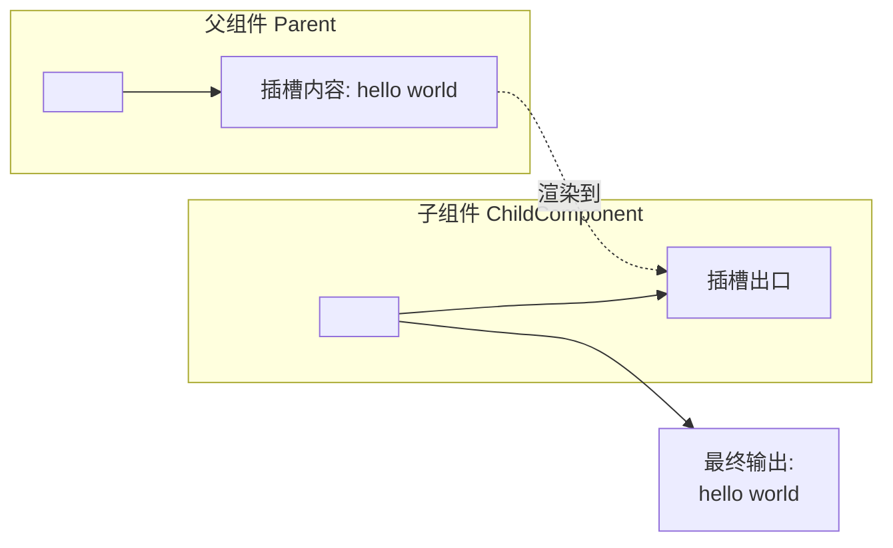
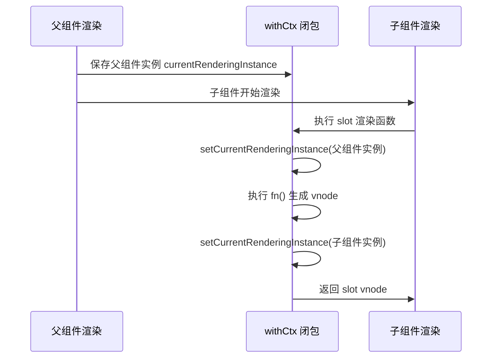
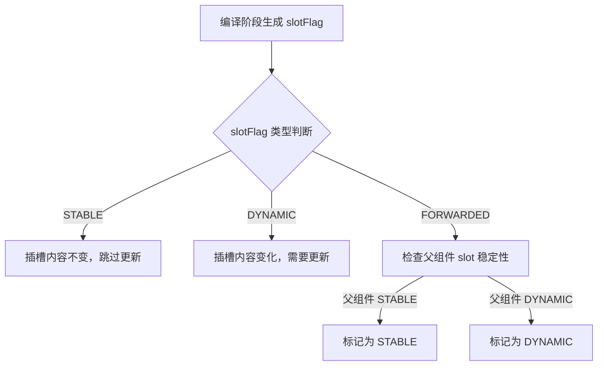
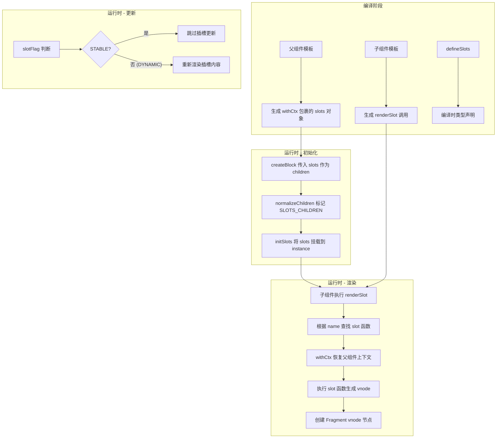

# Slot插槽实现原理

## 前言

`Vue` 提供了一个 `<slot>` 插槽的内置特殊元素，用来实现为子组件传递一些模板片段，然后由子组件完成对这些模板的渲染工作。一个简单的例子，这里有一个父组件，写入了一段插槽模板内容：

```html
<ChildComponent>
  <!-- 插槽内容 -->
  hello world
</ChildComponent>
```

在子组件 `<ChildComponent>` 中则通过 `<slot>` 元素来实现对插槽内容的出口渲染：

```html
<div>
  <!-- 插槽出口 -->
  <slot></slot>
</div>
```

`<slot>` 元素是一个**插槽出口** (slot outlet)，标示了父元素提供的**插槽内容** (slot content) 将在哪里被渲染。



接下来，将深入分析插槽内容是如何被渲染到指定出口的。

## defineSlots 宏

在深入插槽的运行时实现之前，我们先介绍 `Vue 3.3` 新增、`3.5` 中进一步完善稳定性的 `defineSlots` 宏。这个宏用于在 `<script setup>` 中声明组件的插槽类型，提供了更好的 `TypeScript` 支持。

### 基本用法

`defineSlots` 是一个编译器宏，它接收一个类型声明对象，返回一个插槽对象：

```html
<script setup lang="ts">
const slots = defineSlots<{
  header(props: { msg: string }): void
  default(): void
  footer(): void
}>()
</script>

<template>
  <div>
    <slot name="header" :msg="hello" />
    <slot />
    <slot name="footer" />
  </div>
</template>
```

### 编译转换

和 `defineModel` 类似，`defineSlots` 也是一个编译器宏。在编译阶段，`SFC` 编译器会将 `defineSlots` 的调用转换为运行时的插槽对象定义。它本质上并不改变插槽的运行时机制，而是为开发者提供了类型安全的插槽声明方式。

```html
<!-- 编译前 -->
<script setup lang="ts">
const slots = defineSlots<{
  header(props: { msg: string }): void
  default(): void
}>()
</script>
```

编译后，`defineSlots` 的类型信息会被用于生成正确的 `props` 类型推导，而运行时则仍然是标准的插槽渲染流程。

### 与 useSlots 的对比

在 `Vue 3.3` 之前，如果要在 `<script setup>` 中以编程方式使用插槽，需要通过 `useSlots()`：

```html
<script setup>
import { useSlots } from 'vue'
const slots = useSlots()
</script>
```

`defineSlots` 相比 `useSlots` 的优势在于：

| 特性 | `useSlots` | `defineSlots` |
|------|-----------|--------------|
| 类型支持 | 无类型推导 | 完整类型推导 |
| 声明方式 | 运行时获取 | 编译时声明 |
| 作用域插槽类型 | 无法标注 | 可标注 props 类型 |
| 引入方式 | 需要显式 import | 编译器宏，无需 import |

## 插槽内容渲染

一个组件如果携带一些插槽内容，那么这个组件在渲染的时候，会有哪些变化。先来看一个较为常规的 `<slot>` 插槽内容用法：

```html
<ChildComponent>
  <template #header>header</template>
  <template #content>content</template>
  <template #footer>footer</template>
</ChildComponent>
```

经过编译器转换后，生成的渲染函数如下：

```js
import { createTextVNode as _createTextVNode, resolveComponent as _resolveComponent, withCtx as _withCtx, openBlock as _openBlock, createBlock as _createBlock } from "vue"

export function render(_ctx, _cache, $props, $setup, $data, $options) {
  const _component_ChildComponent = _resolveComponent("ChildComponent")

  return (_openBlock(), _createBlock(_component_ChildComponent, null, {
    header: _withCtx(() => [
      _createTextVNode("header")
    ]),
    content: _withCtx(() => [
      _createTextVNode("content")
    ]),
    footer: _withCtx(() => [
      _createTextVNode("footer")
    ]),
    _: 1 /* STABLE */
  }))
}
```

可以看到，`createBlock` 的第三个参数 `children` 相对于普通父子节点来说，由一个数组变成一个对象的形式，这个对象包含了以插槽内容名称命名的函数，以及一个 `_` 属性，这个属性的含义是 `slotFlag`。

下面我们再详细看一下 `createBlock` 这个函数的实现，前面的章节中，我们提到 `createBlock` 函数本质就是调用了 `createVNode` 函数创建 `vnode` 节点，不过会增加一些和编译时优化相关的属性 `dynamicChildren` 罢了。那么核心看一下在创建 `vnode` 的时候产生的一些变化：

```typescript
function _createVNode(
  type: VNodeTypes | ClassComponent,
  props: (Data & VNodeProps) | null = null,
  children: unknown = null,
  patchFlag: number = 0,
  dynamicProps: string[] | null = null,
  isBlockNode = false,
): VNode {
  // ...
  if (isVNode(type)) {
    // clone vnode
    const cloned = cloneVNode(type, props, true /* mergeRef: true */)
    if (children) {
      // 标准化子节点
      normalizeChildren(cloned, children)
    }
    return cloned
  }
  // ...
}
```

`createVNode` 函数在执行的时候，针对 `vnode` 节点如果存在子节点的话，会调用 `normalizeChildren` 函数：

```typescript
export function normalizeChildren(vnode: VNode, children: unknown) {
  let type = 0
  const { shapeFlag } = vnode
  if (children == null) {
    children = null
  } else if (isArray(children)) {
    // 子节点是数组的情况
    type = ShapeFlags.ARRAY_CHILDREN
  } else if (typeof children === 'object') {
    // 针对 children 是对象的处理内容
    // 对于 ELEMENT 或者 TELEPORT slot 的处理
    if (shapeFlag & (ShapeFlags.ELEMENT | ShapeFlags.TELEPORT)) {
      const slot = (children as any).default
      if (slot) {
        slot._c && (slot._d = false)
        normalizeChildren(vnode, slot())
        slot._c && (slot._d = true)
      }
      return
    } else {
      // 标记子节点类型为 SLOTS_CHILDREN
      type = ShapeFlags.SLOTS_CHILDREN
      const slotFlag = (children as RawSlots)._
      if (!slotFlag && !(InternalObjectKey in children!)) {
        // 如果 slots 还没有被标准化，添加上下文实例
        ;(children as RawSlots)._ctx = currentRenderingInstance
      } else if (slotFlag === SlotFlags.FORWARDED && currentRenderingInstance) {
        // 处理 slotFlag 为 FORWARDED 的情况
        // 处理 STABLE slot
        if (
          (currentRenderingInstance.slots as RawSlots)._ === SlotFlags.STABLE
        ) {
          ;(children as RawSlots)._ = SlotFlags.STABLE
        } else {
          // 添加 DYNAMIC slot
          ;(children as RawSlots)._ = SlotFlags.DYNAMIC
          vnode.patchFlag |= PatchFlags.DYNAMIC_SLOTS
        }
      }
    }
  }
  // ...
  vnode.children = children
  vnode.shapeFlag |= type
}
```

这里我们只需要关注，如果传入的子节点类型是个 `Object` 的情况下，会为 `vnode.shapeFlag` 属性添加 `SLOTS_CHILDREN` 类型。那这个 `shapeFlag` 在哪里会被用到了？再回到我们之前的组件挂载过程中的 `setupComponent` 函数中：

```typescript
export function setupComponent(instance: ComponentInternalInstance) {
  // 1. 处理 props
  // 取出存在 vnode 里面的 props
  const { props, children } = instance.vnode
  initProps(instance, props)
  // 2. 处理 slots
  initSlots(instance, children)

  // 3. 调用 setup 并处理 setupResult
  setupStatefulComponent(instance)
}
```

这里我们重点看一下是如何处理 `slots` 的：

```typescript
export const initSlots = (
  instance: ComponentInternalInstance,
  children: VNodeNormalizedChildren,
) => {
  // shapeFlag 有 SLOTS_CHILDREN 类型
  if (instance.vnode.shapeFlag & ShapeFlags.SLOTS_CHILDREN) {
    // 对于我们的示例中，slotFlag 类型是 STABLE
    const type = (children as RawSlots)._
    if (type) {
      // 用户可以使用 this.$slots 来获取 slots 对象的浅拷贝内部实例上的 slots
      // 所以这里应该避免 proxy 对象污染
      // 为 instance slots 属性赋值 children
      instance.slots = toRaw(children)
      // 标记不可枚举
      def(children, '_', type)
    }
    // ...
  } else {
    instance.slots = {}
    // ...
  }
  def(instance.slots, InternalObjectKey, 1)
}
```

针对我们上面的示例，首先 `slots` 渲染的 `slotFlag` 类型为 `STABLE`，所以这里的 `initSlot` 所做的操作就是为 `instance.slots` 赋值为 `toRaw(children)`。

到这里，我们可以认为，对于一个组件中如果包含 `slot` 内容，那么这个组件实例在被渲染的时候，这些内容将会被添加到当前组件实例的 `instance.slots` 属性上：

```js
// ChildComponent 组件实例
{
  type: {
    name: "ChildComponent",
    render: render(_ctx, _cache) { ... },
    // ...
  },
  slots: {
    header: _withCtx(() => [
      _createTextVNode("header")
    ]),
    content: _withCtx(() => [
      _createTextVNode("content")
    ]),
    footer: _withCtx(() => [
      _createTextVNode("footer")
    ]),
  },
  vnode: {...}
  // ...
}
```

> 注意，`slots` 是被挂载到了子组件实例 `ChildComponent` 中，而非父组件中。

## 插槽出口渲染

插槽除了有内容外，还需要指定对象的出口，进一步分析上述示例中对应的出口内容：

```html
<div>
  <slot name="header"></slot>
  <slot name="content"></slot>
  <slot name="footer"></slot>
</div>
```

上面的模板会被编译器编译成如下渲染函数：

```js
import { renderSlot as _renderSlot, openBlock as _openBlock, createElementBlock as _createElementBlock } from "vue"

export function render(_ctx, _cache, $props, $setup, $data, $options) {
  return (_openBlock(), _createElementBlock("div", null, [
    _renderSlot(_ctx.$slots, "header"),
    _renderSlot(_ctx.$slots, "content"),
    _renderSlot(_ctx.$slots, "footer")
  ]))
}
```

可以看到，带有 `<slot>` 内容的元素，会被 `renderSlot` 函数进行包裹，下面分析这个函数的实现：

```typescript
export function renderSlot(
  slots: Slots,
  name: string,
  props: Data = {},
  fallback?: () => VNodeArrayChildren,
  noSlotted?: boolean,
): VNode {
  // ...
  // 根据 name 获取 slot 内容
  let slot = slots[name]
  openBlock()
  const validSlotContent = slot && ensureValidVNode(slot(props))
  // 创建 slot vnode
  const rendered = createBlock(
    Fragment,
    {
      key:
        props.key ||
        (validSlotContent && (validSlotContent as any).key) ||
        `_${name}`,
    },
    validSlotContent || (fallback ? fallback() : []),
    validSlotContent && (slots as RawSlots)._ === SlotFlags.STABLE
      ? PatchFlags.STABLE_FRAGMENT
      : PatchFlags.BAIL,
  )
  // ...
  // 返回 slot vnode
  return rendered
}
```

可以看到，`renderSlot` 函数核心功能就是根据 `slot` 的 `name` 属性去子组件实例上的 `slots` 中查找对应的执行函数，然后创建一个以 `slot` 为子节点的 `Fragment` 类型的 `vnode` 节点。

### fallback 渲染

`renderSlot` 函数中有一个 `fallback` 参数，当插槽内容不存在时会执行 `fallback` 函数来渲染后备内容。这对应了模板中的后备内容写法：

```html
<!-- 子组件 -->
<slot>默认内容</slot>
<slot name="header">默认头部</slot>
```

编译后的渲染函数：

```js
_renderSlot(_ctx.$slots, "default", {}, () => [
  _createTextVNode("默认内容")
])
```

当 `_ctx.$slots.default` 不存在时，`renderSlot` 会执行 `fallback()` 渲染后备内容。

## withCtx 上下文保持

上述 `slot` 容器中的内容是通过 `withCtx(...)` 函数进行封装执行的，那么这个函数的作用是什么？下面分析这个函数的实现：

```typescript
export function withCtx(
  fn: ContextualRenderFn,
  ctx: ComponentInternalInstance | null = currentRenderingInstance,
  isNonScopedSlot = false,
): ContextualRenderFn {
  // ...
  const renderFnWithContext: ContextualRenderFn = (...args: any[]) => {
    if (renderFnWithContext._d) {
      setBlockTracking(-1)
    }
    // 暂存子组件实例
    const prevInstance = setCurrentRenderingInstance(ctx)
    let res
    try {
      // 运行创建 vnode 的函数
      res = fn(...args)
    } finally {
      // 重置回子组件实例
      setCurrentRenderingInstance(prevInstance)
    }
    return res
  }
  // ...
  return renderFnWithContext
}
```

`withCtx` 函数巧妙地利用了闭包的特性，在运行父组件的时候，通过 `withCtx` 保存了父组件的实例到 `currentRenderingInstance` 变量上，然后在子组件执行 `renderFnWithContext` 函数时，先恢复父组件的实例上下文，再执行生成 `vnode` 函数，执行完成后，再重置回子组件的实例。这样做的好处是在做 `<slot>` 渲染内容的时候，让 `slot` 的内容可以访问到父组件的实例，因为 `slot` 内容本身也是在父组件中定义的，只是被渲染到了指定的子组件中而已。



## 作用域插槽

作用域插槽 (`Scoped Slots`) 是插槽的一个重要进阶特性，它允许子组件在渲染插槽内容时向插槽传递数据。这种机制使得插槽内容可以根据子组件提供的数据进行动态渲染。

### 基本用法

```html
<!-- 子组件 -->
<template>
  <ul>
    <li v-for="item in items" :key="item.id">
      <slot name="item" :item="item" :index="item.id">
        {{ item.name }}
      </slot>
    </li>
  </ul>
</template>

<script setup>
defineProps(['items'])
</script>
```

```html
<!-- 父组件 -->
<ItemList :items="list">
  <template #item="{ item, index }">
    <span>{{ index }} - {{ item.name }}</span>
  </template>
</ItemList>
```

### 编译结果

作用域插槽的编译结果与普通插槽类似，但 `withCtx` 包裹的函数会接收 `props` 参数：

```js
// 父组件渲染函数
export function render(_ctx, _cache) {
  const _component_ItemList = _resolveComponent("ItemList")

  return (_openBlock(), _createBlock(_component_ItemList, {
    items: _ctx.list
  }, {
    item: _withCtx(({ item, index }) => [
      _createElementVNode("span", null, `${index} - ${item.name}`)
    ]),
    _: 1 /* STABLE */
  }))
}
```

```js
// 子组件渲染函数
export function render(_ctx, _cache) {
  return (_openBlock(), _createElementVNode("ul", null, [
    (_openBlock(true), _createElementBlock(_Fragment, null, _renderList(_ctx.items, (item) => {
      return (_openBlock(), _createElementBlock("li", { key: item.id }, [
        // 传入 props 对象到 slot 渲染函数
        _renderSlot(_ctx.$slots, "item", { item: item, index: item.id }, () => [
          _createTextVNode(_toDisplayString(item.name), 1)
        ])
      ]))
    }), 128 /* KEYED_FRAGMENT */))
  ]))
}
```

可以看到，`renderSlot` 的第三个参数就是传递给插槽的 `props` 对象，而 `withCtx` 包裹的函数会接收这个 `props` 对象作为参数。在 `renderSlot` 函数中，就是通过 `slot(props)` 将 `props` 传递给插槽渲染函数的：

```typescript
export function renderSlot(slots, name, props = {}, fallback, noSlotted) {
  let slot = slots[name]
  // ...
  // 将 props 传递给 slot 渲染函数
  const validSlotContent = slot && ensureValidVNode(slot(props))
  // ...
}
```

## Dynamic Slots

什么是 `dynamic slots`？我们之前还有一种动态类型叫做 `dynamic children`，在 `DOM` 更新时做靶向更新。而 `dynamic slots` 则是用于判断 `slot` 内容是否需要更新。

那么 `Vue 3` 会为哪些组件添加 `dynamic slots` 属性？

`Vue 3` 中，对于动态的插槽名、条件判断、循环等场景的 `<slot>`，则会被标记为 `dynamic slots`，拿动态的插槽名举例：

```html
<child-component>
  <template #[dynamicSlotName]>header</template>
</child-component>
```

则会被渲染成：

```js
import { createTextVNode as _createTextVNode, resolveComponent as _resolveComponent, withCtx as _withCtx, openBlock as _openBlock, createBlock as _createBlock } from "vue"

export function render(_ctx, _cache, $props, $setup, $data, $options) {
  const _component_child_component = _resolveComponent("child-component")

  return (_openBlock(), _createBlock(_component_child_component, null, {
    [_ctx.dynamicSlotName]: _withCtx(() => [
      _createTextVNode("header")
    ]),
    _: 2 /* DYNAMIC */
  }, 1024 /* DYNAMIC_SLOTS */))
}
```

可以看到，对于动态的插槽名，组件渲染函数会为 `patchFlag` 标记为 `DYNAMIC_SLOTS`。在执行组件更新时，则会根据这个标记来判断当前组件是否需要更新：

```typescript
const updateComponent = (n1: VNode, n2: VNode, optimized: boolean) => {
  if (shouldUpdateComponent(n1, n2, optimized)) {
    // ...
    // 执行更新逻辑
  }
}

function shouldUpdateComponent(
  prevVNode: VNode,
  nextVNode: VNode,
  optimized?: boolean,
): boolean {
  // ...
  const { props: nextProps, children: nextChildren, patchFlag } = nextVNode
  // patchFlag 是 DYNAMIC_SLOTS 的情况，shouldUpdateComponent 返回 true
  if (optimized && patchFlag >= 0) {
    if (patchFlag & PatchFlags.DYNAMIC_SLOTS) {
      return true
    }
  }
}
```

## SlotFlags 优化标记

`Vue 3` 中定义了几种 `SlotFlags`，用于在编译时和运行时对插槽进行优化：

| 标记 | 值 | 含义 |
|------|---|------|
| `STABLE` | 1 | 插槽内容稳定，不会动态变化 |
| `DYNAMIC` | 2 | 插槽内容动态，需要每次更新 |
| `FORWARDED` | 3 | 插槽内容是从父组件转发而来 |

这些标记对于组件更新优化至关重要：



## 全景流程

最后，我们用一张流程图来总结 `<slot>` 插槽的完整实现机制：



## 总结

这里我们介绍了关于 `<slot>` 内置元素的实现原理，本质上就是父组件在渲染的时候，如果遇到了 `<slot>` 内容，则会暂时将其缓存到组件实例上，然后在组件实例化的过程中，从父组件中取出对应的 `slots` 按照名称进行渲染到指定位置。

`withCtx` 函数通过闭包机制，确保插槽内容在渲染时能够正确访问父组件的实例上下文，这也是作用域插槽能够工作的基础。

同时配合 `PatchFlags` 和 `SlotFlags` 属性，可以做到只有在 `DYNAMIC_SLOTS` 的情况下，才去更新含有 `slot` 的组件，减少了不必要的渲染性能负担。

`Vue 3.3` 引入的 `defineSlots` 宏则为插槽声明提供了完整的 `TypeScript` 类型支持，在不改变运行时机制的前提下，提升了开发体验。
