# 响应式系统原理

> Vue 3 使用 Proxy 实现响应式系统，相比 Vue 2 的 Object.defineProperty 有显著优势。理解响应式原理是掌握 Vue 的关键。
>
> **Vue 3.5.42 稳定版** | Vue 3.5 响应式内存优化降低 56% | Vue 3.6 RC Alien Signal 新原语

## Proxy vs Object.defineProperty

### Vue 2 的局限性

```js
// Vue 2 无法检测以下变化
const obj = { a: 1 }

// 1. 对象属性添加
obj.b = 2 // ❌ 不响应

// 2. 对象属性删除
delete obj.a // ❌ 不响应

// 3. 数组索引修改
const arr = [1, 2, 3]
arr[0] = 10 // ❌ 不响应

// 4. 数组长度修改
arr.length = 1 // ❌ 不响应
```

### Vue 3 的 Proxy 解决方案

```js
// Vue 3 使用 Proxy
const reactive = (target) => {
  return new Proxy(target, {
    get(target, key, receiver) {
      track(target, key)
      return Reflect.get(target, key, receiver)
    },
    set(target, key, value, receiver) {
      trigger(target, key)
      return Reflect.set(target, key, value, receiver)
    },
    deleteProperty(target, key) {
      trigger(target, key)
      return Reflect.deleteProperty(target, key)
    }
  })
}

// 以上问题全部解决
const state = reactive({ a: 1 })
state.b = 2 // ✅ 响应
delete state.a // ✅ 响应

const arr = reactive([1, 2, 3])
arr[0] = 10 // ✅ 响应
arr.length = 1 // ✅ 响应
```

### Proxy 的优势对比

| 特性 | Object.defineProperty | Proxy |
|------|----------------------|-------|
| 属性添加 | ❌ 需要额外处理 | ✅ 自动检测 |
| 属性删除 | ❌ 需要额外处理 | ✅ 自动检测 |
| 数组索引 | ❌ 需要变异方法 | ✅ 原生支持 |
| 数组长度 | ❌ 不响应 | ✅ 自动响应 |
| Map/Set | ❌ 不支持 | ✅ 完整支持 |
| 性能 | 初始化时全量遍历 | 惰性代理，按需响应式 |
| 兼容性 | IE8+ | IE不支持 |

## 响应式实现原理

### 核心架构图

```
┌────────────────────────────────────────────────────────────┐
│                      响应式系统架构                         │
├────────────────────────────────────────────────────────────┤
│                                                            │
│  ┌──────────┐     track()      ┌──────────────┐           │
│  │  Proxy   │ ───────────────▶ │  targetMap   │           │
│  │ (代理对象)│                  │  WeakMap     │           │
│  └────┬─────┘                  └──────┬───────┘           │
│       │                               │                    │
│       │ trigger()                     ▼                    │
│       │                        ┌──────────────┐           │
│       └───────────────────────▶│    depsMap   │           │
│                                │   Map<key,   │           │
│                                │   Set<effect>│           │
│                                └──────┬───────┘           │
│                                       │                    │
│                                       ▼                    │
│                                ┌──────────────┐           │
│                                │     dep      │           │
│                                │ Set<effect>  │           │
│                                └──────────────┘           │
│                                                            │
└────────────────────────────────────────────────────────────┘
```

### 简化版 reactive 实现

```js
let activeEffect = null
const targetMap = new WeakMap()

// 依赖收集
function track(target, key) {
  if (!activeEffect) return
  
  let depsMap = targetMap.get(target)
  if (!depsMap) {
    depsMap = new Map()
    targetMap.set(target, depsMap)
  }
  
  let dep = depsMap.get(key)
  if (!dep) {
    dep = new Set()
    depsMap.set(key, dep)
  }
  
  dep.add(activeEffect)
}

// 触发更新
function trigger(target, key) {
  const depsMap = targetMap.get(target)
  if (!depsMap) return
  
  const dep = depsMap.get(key)
  if (dep) {
    dep.forEach(effect => effect())
  }
}

// 副作用函数
function effect(fn) {
  activeEffect = fn
  fn()
  activeEffect = null
}

// 响应式函数
function reactive(target) {
  return new Proxy(target, {
    get(target, key, receiver) {
      track(target, key)
      return Reflect.get(target, key, receiver)
    },
    set(target, key, value, receiver) {
      const result = Reflect.set(target, key, value, receiver)
      trigger(target, key)
      return result
    }
  })
}
```

### 使用示例

```js
const state = reactive({
  count: 0
})

effect(() => {
  console.log('count changed:', state.count)
})

state.count++ // 自动触发 effect
// 输出: count changed: 1
```

## 响应式 API 详解

### reactive

用于创建对象的深层响应式代理。

```js
import { reactive } from 'vue'

// 基本使用
const state = reactive({
  count: 0,
  nested: {
    value: 1
  }
})

// 所有嵌套属性都是响应式的
state.count++
state.nested.value++ // ✅ 触发更新
```

**注意事项：**

```js
// ⚠️ 解构会失去响应性
const { count } = state // count 不是响应式的

// ✅ 使用 toRefs 保持响应性
const { count: countRef } = toRefs(state) // countRef 是 Ref
```

```js
// ⚠️ 直接赋值新对象会断开连接
let state = reactive({ count: 0 })
state = { count: 1 } // ❌ 不再响应式

// ✅ 使用 ref 或修改属性
state.count = 1 // ✅ 正确
```

### ref

用于创建任意类型的响应式引用，常用于基本类型。

```js
import { ref } from 'vue'

// 基本类型
const count = ref(0)
count.value++ // 需要通过 .value 访问

// 对象类型（内部会调用 reactive）
const obj = ref({ a: 1 })
obj.value.a = 2 // ✅ 响应式

// 获取 DOM 元素
const inputRef = ref(null)
onMounted(() => {
  inputRef.value.focus()
})
```

**模板中的自动解包：**

```vue
<template>
  <!-- 模板中自动解包，无需 .value -->
  <div>{{ count }}</div>
  <button @click="count++">Increment</button>
</template>

<script setup>
import { ref } from 'vue'
const count = ref(0)
</script>
```

### 响应式 API 变体对比

| API | 深层响应式 | 只读 | 用途 |
|-----|-----------|------|------|
| `reactive` | ✅ | ❌ | 对象的完整响应式 |
| `shallowReactive` | ❌ | ❌ | 仅顶层响应式 |
| `readonly` | ✅ | ✅ | 只读代理 |
| `shallowReadonly` | ❌ | ✅ | 仅顶层只读 |
| `ref` | ✅ | ❌ | 任意类型响应式 |
| `shallowRef` | ❌ | ❌ | 仅 .value 变化触发更新 |

```js
import { 
  reactive, 
  shallowReactive, 
  readonly, 
  shallowReadonly,
  ref,
  shallowRef 
} from 'vue'

// shallowReactive - 仅顶层响应式
const shallow = shallowReactive({
  a: 1,
  nested: { b: 2 }
})
shallow.a++      // ✅ 触发更新
shallow.nested.b = 3 // ❌ 不触发更新

// readonly - 只读代理
const readonlyState = readonly({ count: 0 })
readonlyState.count++ // ❌ 警告并失败

// shallowRef - 仅 .value 变化触发更新
const shallowCount = shallowRef({ count: 0 })
shallowCount.value.count++ // ❌ 不触发更新
shallowCount.value = { count: 1 } // ✅ 触发更新
```

### computed

创建基于其他响应式数据的派生值，具有缓存特性。

```js
import { ref, computed } from 'vue'

const firstName = ref('John')
const lastName = ref('Doe')

// 只读计算属性
const fullName = computed(() => {
  return `${firstName.value} ${lastName.value}`
})

console.log(fullName.value) // 'John Doe'

// 可写计算属性
const fullNameWritable = computed({
  get() {
    return `${firstName.value} ${lastName.value}`
  },
  set(newValue) {
    const [first, last] = newValue.split(' ')
    firstName.value = first
    lastName.value = last
  }
})

fullNameWritable.value = 'Jane Smith'
console.log(firstName.value) // 'Jane'
console.log(lastName.value) // 'Smith'
```

### watch 与 watchEffect

```js
import { ref, watch, watchEffect } from 'vue'

const count = ref(0)

// watchEffect - 自动追踪依赖
watchEffect(() => {
  console.log(`count is: ${count.value}`)
})

// watch - 显式指定侦听源
watch(count, (newVal, oldVal) => {
  console.log(`count changed from ${oldVal} to ${newVal}`)
})

// 侦听多个源
const a = ref(1)
const b = ref(2)
watch([a, b], ([newA, newB], [oldA, oldB]) => {
  console.log(`a: ${newA}, b: ${newB}`)
})

// 侦听对象的特定属性
const state = reactive({ user: { name: 'John' } })
watch(
  () => state.user.name,
  (newName) => console.log(newName)
)

// 深度侦听
watch(
  () => state.user,
  (newUser) => console.log('user changed'),
  { deep: true }
)

// 立即执行
watch(
  () => count.value,
  (val) => console.log(`count: ${val}`),
  { immediate: true }
)
```

## 工具函数

### 类型检查函数

```js
import { 
  isRef, 
  isReactive, 
  isReadonly, 
  isProxy 
} from 'vue'

const count = ref(0)
const state = reactive({ a: 1 })
const readonlyState = readonly({ b: 2 })

isRef(count)           // true
isReactive(state)      // true
isReadonly(readonlyState) // true
isProxy(state)         // true (reactive 和 readonly 都是 Proxy)
```

### 转换函数

```js
import { 
  unref, 
  toRef, 
  toRefs, 
  toValue,
  toRaw,
  markRaw 
} from 'vue'

// unref - 如果是 ref 则返回 .value，否则返回本身
const count = ref(0)
unref(count) // 0
unref(1)     // 1

// toRef - 为对象的某个属性创建 ref
const state = reactive({ a: 1, b: 2 })
const aRef = toRef(state, 'a')
aRef.value = 10
console.log(state.a) // 10

// toRefs - 将响应式对象转为普通对象，每个属性都是 ref
const { a, b } = toRefs(state)
a.value = 20
console.log(state.a) // 20

// toRaw - 获取原始对象
const raw = toRaw(state)
raw.a = 30 // ⚠️ 不会触发更新

// markRaw - 标记对象永不转为响应式
const obj = markRaw({ a: 1 })
const reactiveObj = reactive(obj) // obj 不会被代理
isReactive(reactiveObj) // false
```

### 高级 API

```js
import { 
  shallowRef, 
  triggerRef,
  customRef,
  effectScope
} from 'vue'

// shallowRef + triggerRef - 手动触发更新
const shallow = shallowRef({ count: 0 })
shallow.value.count++
triggerRef(shallow) // 手动触发更新

// customRef - 自定义 ref 行为
function useDebouncedRef(value, delay = 200) {
  let timeout
  return customRef((track, trigger) => ({
    get() {
      track()
      return value
    },
    set(newValue) {
      clearTimeout(timeout)
      timeout = setTimeout(() => {
        value = newValue
        trigger()
      }, delay)
    }
  }))
}

const debouncedText = useDebouncedRef('hello')

// effectScope - 收集副作用并统一停止
const scope = effectScope()
scope.run(() => {
  watchEffect(() => console.log('effect 1'))
  watchEffect(() => console.log('effect 2'))
})
// 统一停止所有副作用
scope.stop()
```

## 高级特性

### 响应式丢失与恢复

```js
import { reactive, toRaw, markRaw, ref } from 'vue'

// 场景1：解构导致丢失响应性
const state = reactive({ count: 0, name: 'Vue' })

// ❌ 直接解构丢失响应性
let { count, name } = state

// ✅ 使用 toRefs 保持响应性
const { count: countRef, name: nameRef } = toRefs(state)

// 场景2：赋值导致响应性丢失
let user = reactive({ name: 'John' })
user = { name: 'Jane' } // ❌ 原代理被丢弃，user 变成普通对象

// ✅ 正确做法：在原代理上修改属性（须在重新赋值之前）
Object.assign(user, { name: 'Jane' })

// ✅ 或使用 ref 承载需要整体替换的数据
const userRef = ref({ name: 'John' })
userRef.value = { name: 'Jane' } // ✅ 正确
```

### 响应式数据存储结构

```
targetMap: WeakMap {
  [原始对象]: Map {
    '属性名': Set {
      [effect1],
      [effect2],
      ...
    }
  }
}
```

**可视化示例：**

```js
const state = reactive({ a: 1, b: 2 })

effect(() => console.log('effect a:', state.a))
effect(() => console.log('effect a+b:', state.a + state.b))

// 内部结构大致如下：
// targetMap = WeakMap {
//   [原始对象]: Map {
//     'a': Set { [effect a], [effect a+b] },
//     'b': Set { [effect a+b] }
//   }
// }
```

## 常见问题

### Q1: 为什么 ref 需要 .value 而 reactive 不需要？

**A:** `ref` 用于包装任意类型的值，需要一个容器来存储值并跟踪变化。对于对象，`reactive` 更直观，但 `ref` 更通用。

```js
// ref 设计原因
const count = ref(0)
count.value = 1 // .value 确保我们知道在操作响应式引用

// reactive 只能用于对象
const state = reactive({ count: 0 })
state.count = 1 // 直接访问，因为对象本身就是容器
```

### Q2: 何时使用 reactive，何时使用 ref？

**A:** 经验法则：

- **对象类型**：优先使用 `reactive`
- **基本类型**：必须使用 `ref`
- **需要重新赋值**：使用 `ref`
- **组合多个响应式值**：使用 `reactive`

```js
// 推荐：reactive 用于对象
const form = reactive({
  username: '',
  password: ''
})

// 推荐：ref 用于基本类型和需要重新赋值的场景
const isLoading = ref(false)
const user = ref(null) // 需要整体替换
```

### Q3: 为什么解构 reactive 会丢失响应性？

**A:** 解构只是复制了属性的值，而不是响应式引用。

```js
const state = reactive({ count: 0 })

// ❌ 解构后 count 是普通数字
let { count } = state
count = 10 // state.count 仍然是 0

// ✅ 使用 toRefs
const { count } = toRefs(state)
count.value = 10 // state.count 变为 10
```

### Q4: 如何处理 Map 和 Set？

**A:** Vue 3 的 Proxy 可以直接代理 Map 和 Set。

```js
import { reactive, shallowRef } from 'vue'

// Map
const map = reactive(new Map([['a', 1]]))
map.set('b', 2) // ✅ 响应式
map.delete('a') // ✅ 响应式

// Set
const set = reactive(new Set([1, 2, 3]))
set.add(4) // ✅ 响应式
set.delete(1) // ✅ 响应式
```

### Q5: 如何避免不必要的响应式转换？

**A:** 使用 `markRaw` 或 `shallowRef`。

```js
import { markRaw, shallowRef, reactive } from 'vue'

// 大型数据不需要响应式
const bigData = markRaw(heavyData)

// 第三方类实例
const chart = shallowRef(null)
chart.value = new Chart() // 不会被深层响应式

// 配置对象
const config = reactive({
  options: markRaw({ /* 大型配置 */ })
})
```

## 实际调试

```js
import { reactive, effect, isReactive, toRaw } from 'vue'

const state = reactive({
  count: 0
})

// 检查响应式
console.log(isReactive(state)) // true
console.log(isReactive({})) // false

// 获取原始对象
console.log(toRaw(state) === state) // false
console.log(toRaw(state)) // 原始对象

// 使用 Vue DevTools
// 1. 安装 Vue DevTools 浏览器扩展
// 2. 打开开发者工具
// 3. 切换到 Vue 标签页
// 4. 查看 Pinia/组件状态面板
```

## 性能优化建议

1. **避免深层响应式滥用**：大型对象使用 `shallowReactive` 或 `markRaw`
2. **合理使用计算属性**：避免在模板中重复计算
3. **及时清理副作用**：使用 `onUnmounted` 或返回清理函数
4. **批量更新**：多个状态修改放在同一函数中

```js
import { reactive, computed, watchEffect, onUnmounted } from 'vue'

// 1. 避免不必要的深层响应式
const largeList = shallowRef([]) // 而非 ref([])

// 2. 使用计算属性缓存
const filtered = computed(() => {
  return list.value.filter(item => item.active)
})

// 3. 清理副作用
const stop = watchEffect(() => {
  // 副作用逻辑
})
onUnmounted(stop)

// 或使用返回清理函数
watchEffect((onCleanup) => {
  const timer = setInterval(() => {}, 1000)
  onCleanup(() => clearInterval(timer))
})
```


---

## 源码深度解析

> 以下内容基于 Vue 3.5 源码，深入响应式系统的实现细节。

### Proxy 响应式实现

#### Reactive

找到源码中 `reactive` 函数的定义（基于 Vue 3.5.x）：

```ts
export function reactive<T extends object>(target: T): Reactive<T>
export function reactive(target: object) {
  // 如果试图观测一个 readonly 代理，直接返回该 readonly 版本
  if (isReadonly(target)) {
    return target
  }
  return createReactiveObject(
    target,
    false,
    mutableHandlers,
    mutableCollectionHandlers,
    reactiveMap,
  )
}
```

`reactive` 函数的核心逻辑就是通过 `createReactiveObject` 将传入的 `target` 变成响应式代理对象。

#### createReactiveObject

`createReactiveObject` 是整个响应式代理创建的枢纽函数：

```ts
function createReactiveObject(
  target: Target,
  isReadonly: boolean,
  baseHandlers: ProxyHandler<any>,
  collectionHandlers: ProxyHandler<any>,
  proxyMap: WeakMap<Target, any>,
) {
  // 1. 如果目标不是对象，直接返回原值
  if (!isObject(target)) {
    if (__DEV__) {
      warn(
        `value cannot be made ${isReadonly ? 'readonly' : 'reactive'}: ${String(target)}`,
      )
    }
    return target
  }
  // 2. target 已经是一个 Proxy，直接返回
  //    例外：对 reactive 对象调用 readonly() 时需要继续处理
  if (
    target[ReactiveFlags.RAW] &&
    !(isReadonly && target[ReactiveFlags.IS_REACTIVE])
  ) {
    return target
  }
  // 3. proxyMap 中已存在 target 对应的代理，直接返回缓存
  const existingProxy = proxyMap.get(target)
  if (existingProxy) {
    return existingProxy
  }
  // 4. 只有特定类型的值才能被观测
  const targetType = getTargetType(target)
  if (targetType === TargetType.INVALID) {
    return target
  }
  // 5. 创建 Proxy 代理对象
  const proxy = new Proxy(
    target,
    targetType === TargetType.COLLECTION ? collectionHandlers : baseHandlers,
  )
  // 6. 缓存 target -> proxy 映射
  proxyMap.set(target, proxy)
  return proxy
}
```

整个流程可以概括为以下步骤：

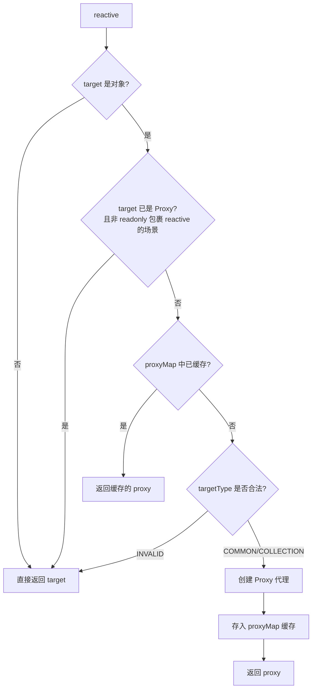

其中涉及几个关键判断：

1. **非对象直接返回**：`reactive` 只能处理对象类型，原始值直接返回。
2. **已代理对象直接返回**：通过 `ReactiveFlags.RAW` 判断目标是否已经是响应式代理，避免重复代理。但有一个例外 -- 对 `reactive` 对象调用 `readonly()` 时需要继续包装。
3. **缓存命中**：`proxyMap` 是一个 `WeakMap`，键为原始对象，值为代理对象。同一个 `target` 只会创建一次代理。
4. **类型合法性**：通过 `getTargetType` 判断目标类型是否可被观测。

#### TargetType 判定

`getTargetType` 决定了 `target` 使用哪种 `handler`：

```ts
function getTargetType(value: Target) {
  return value[ReactiveFlags.SKIP] || !Object.isExtensible(value)
    ? TargetType.INVALID
    : targetTypeMap(toRawType(value))
}

function targetTypeMap(rawType: string) {
  switch (rawType) {
    case 'Object':
    case 'Array':
      return TargetType.COMMON
    case 'Map':
    case 'Set':
    case 'WeakMap':
    case 'WeakSet':
      return TargetType.COLLECTION
    default:
      return TargetType.INVALID
  }
}
```

| TargetType | 值 | 对应类型 | 使用的 Handler |
|---|---|---|---|
| `INVALID` | 0 | 不可扩展对象、标记了 `__v_skip` 的对象、其他类型 | 无（直接返回） |
| `COMMON` | 1 | `Object`、`Array` | `baseHandlers` |
| `COLLECTION` | 2 | `Map`、`Set`、`WeakMap`、`WeakSet` | `collectionHandlers` |

当 `target` 是普通对象或数组时，`targetType` 为 `COMMON`，使用 `baseHandlers`；当 `target` 是 `Map`、`Set` 等集合类型时，`targetType` 为 `COLLECTION`，使用 `collectionHandlers`。

#### reactiveMap 缓存机制

`Vue 3` 定义了四个全局的 `WeakMap` 用于缓存不同类型的代理对象：

```ts
export const reactiveMap: WeakMap<Target, any> = new WeakMap<Target, any>()
export const shallowReactiveMap: WeakMap<Target, any> = new WeakMap<Target, any>()
export const readonlyMap: WeakMap<Target, any> = new WeakMap<Target, any>()
export const shallowReadonlyMap: WeakMap<Target, any> = new WeakMap<Target, any>()
```

| API | 使用的 proxyMap |
|---|---|
| `reactive()` | `reactiveMap` |
| `shallowReactive()` | `shallowReactiveMap` |
| `readonly()` | `readonlyMap` |
| `shallowReadonly()` | `shallowReadonlyMap` |

使用 `WeakMap` 而非 `Map` 的好处在于：当原始对象没有其他引用时，缓存条目可以被垃圾回收，避免内存泄漏。

此外，这四个 `proxyMap` 同时也承担了一个重要职责 -- 在 `getter` 中判断 `ReactiveFlags.RAW` 时，需要验证 `receiver` 是否为对应的 `proxyMap` 中的代理，从而确保只有通过合法代理访问时才会返回原始对象。

#### mutableHandlers -- Proxy 拦截器

对于普通对象和数组，`Vue 3` 使用 `MutableReactiveHandler` 类来创建 `Proxy` 的 `handler`：

```ts
export const mutableHandlers: ProxyHandler<object> =
  /*@__PURE__*/ new MutableReactiveHandler()

export const shallowReactiveHandlers: MutableReactiveHandler =
  /*@__PURE__*/ new MutableReactiveHandler(true)
```

> **注意**：在 `Vue 3.5` 中，`handler` 的实现已从早期版本的对象字面量（`{ get, set, ... }`）重构为基于类的继承体系（`BaseReactiveHandler` -> `MutableReactiveHandler` / `ReadonlyReactiveHandler`），代码结构更加清晰。

`MutableReactiveHandler` 实现了以下 `Proxy` 拦截器：

| 拦截器 | 用途 | 来源 |
|---|---|---|
| `get` | 属性读取的捕捉器 | 继承自 `BaseReactiveHandler` |
| `set` | 属性设置的捕捉器 | 自身实现 |
| `deleteProperty` | `delete` 操作符的捕捉器 | 自身实现 |
| `has` | `in` 操作符的捕捉器 | 自身实现 |
| `ownKeys` | `Object.getOwnPropertyNames` 等方法的捕捉器 | 自身实现 |

响应式的核心逻辑就在 `get`（依赖收集）和 `set`（依赖触发）中。下面逐一分析。

#### get -- 依赖收集

`get` 拦截器定义在 `BaseReactiveHandler` 类中：

```ts
class BaseReactiveHandler implements ProxyHandler<Target> {
  constructor(
    protected readonly _isReadonly = false,
    protected readonly _isShallow = false,
  ) {}

  get(target: Target, key: string | symbol, receiver: object): any {
    // 对 ReactiveFlags 的特殊处理
    if (key === ReactiveFlags.SKIP) return target[ReactiveFlags.SKIP]

    const isReadonly = this._isReadonly,
      isShallow = this._isShallow
    if (key === ReactiveFlags.IS_REACTIVE) {
      return !isReadonly
    } else if (key === ReactiveFlags.IS_READONLY) {
      return isReadonly
    } else if (key === ReactiveFlags.IS_SHALLOW) {
      return isShallow
    } else if (key === ReactiveFlags.RAW) {
      if (
        receiver ===
          (isReadonly
            ? isShallow
              ? shallowReadonlyMap
              : readonlyMap
            : isShallow
              ? shallowReactiveMap
              : reactiveMap
          ).get(target) ||
        // receiver 是 reactive proxy 的用户自定义代理
        Object.getPrototypeOf(target) === Object.getPrototypeOf(receiver)
      ) {
        return target
      }
      return
    }

    const targetIsArray = isArray(target)

    if (!isReadonly) {
      // 数组方法的特殊处理
      let fn: Function | undefined
      if (targetIsArray && (fn = arrayInstrumentations[key])) {
        return fn
      }
      if (key === 'hasOwnProperty') {
        return hasOwnProperty
      }
    }

    // 取值
    const res = Reflect.get(
      target,
      key,
      // 如果是包裹 ref 的 proxy，使用原始 ref 作为 receiver
      isRef(target) ? target : receiver,
    )

    // Symbol 内置 Key 和不可追踪的 Key 不做依赖收集
    if (isSymbol(key) ? builtInSymbols.has(key) : isNonTrackableKeys(key)) {
      return res
    }

    // 依赖收集
    if (!isReadonly) {
      track(target, TrackOpTypes.GET, key)
    }

    // 浅层响应式直接返回，不递归转换
    if (isShallow) {
      return res
    }

    // Ref 自动解包（数组整数索引 key 除外）
    if (isRef(res)) {
      return targetIsArray && isIntegerKey(key) ? res : res.value
    }

    // 深层响应式：递归将对象/数组属性转为响应式
    if (isObject(res)) {
      return isReadonly ? readonly(res) : reactive(res)
    }

    return res
  }
}
```

`get` 拦截器的核心逻辑可以用以下流程图概括：

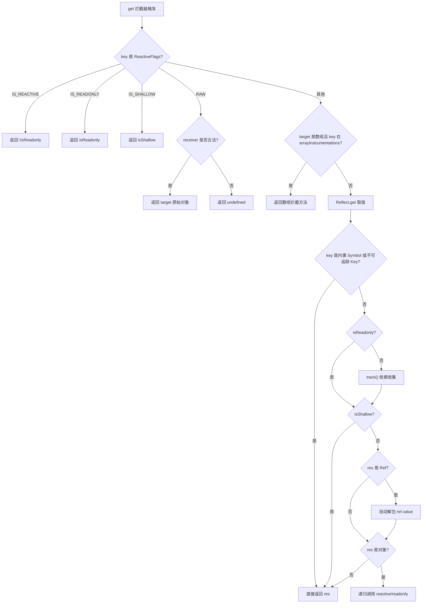

##### 关键点解析

**1. ReactiveFlags 处理**

`ReactiveFlags` 是一组内部使用的 `Symbol`/`String` 键，用于在代理对象上标识其响应式状态：

```ts
export enum ReactiveFlags {
  SKIP = '__v_skip',
  IS_REACTIVE = '__v_isReactive',
  IS_READONLY = '__v_isReadonly',
  IS_SHALLOW = '__v_isShallow',
  RAW = '__v_raw',
  IS_REF = '__v_isRef',
}
```

当访问 `proxy.__v_isReactive` 时返回 `true`，这就是 `isReactive()` 函数的实现原理。访问 `proxy.__v_raw` 时返回原始对象，这是 `toRaw()` 函数的实现基础。

值得注意的是，在 `Vue 3.5` 中，对 `ReactiveFlags.RAW` 的判断增加了一个额外的条件：`Object.getPrototypeOf(target) === Object.getPrototypeOf(receiver)`。这是为了支持用户自定义代理包裹响应式代理的场景。

**2. 懒递归（Lazy Recursion）**

```ts
if (isObject(res)) {
  return isReadonly ? readonly(res) : reactive(res)
}
```

`Proxy` 只在访问对象属性时才递归执行劫持，相比 `Object.defineProperty` 在定义时就遍历所有层级设置响应式，`Proxy` 实现了**懒递归**，在性能上有显著提升 -- 只有被实际访问到的嵌套属性才会被转为响应式。

**3. Ref 自动解包**

```ts
if (isRef(res)) {
  return targetIsArray && isIntegerKey(key) ? res : res.value
}
```

当 `reactive` 对象的属性值是 `ref` 时，会自动解包返回 `ref.value`，但有一个例外：当 `target` 是数组且 `key` 是整数索引时，不做解包。这是因为数组方法（如 `map`、`filter`）需要区分原始 `ref` 和解包后的值。

#### 数组方法拦截 -- arrayInstrumentations

当 `target` 是数组时，`get` 拦截器会优先从 `arrayInstrumentations` 中查找方法：

```ts
if (targetIsArray && (fn = arrayInstrumentations[key])) {
  return fn
}
```

在 `Vue 3.5` 中，`arrayInstrumentations` 被独立为 `arrayInstrumentations.ts` 文件，相比早期版本有了大幅优化。它重写了几乎所有数组方法，分为以下几类：

##### 1. 迭代方法 -- 使用 ARRAY_ITERATE_KEY 优化

```ts
export const arrayInstrumentations: Record<string | symbol, Function> = {
  [Symbol.iterator]() {
    return iterator(this, Symbol.iterator, toReactive)
  },
  forEach(fn, thisArg?) {
    return apply(this, 'forEach', fn, thisArg, undefined, arguments)
  },
  map(fn, thisArg?) {
    return apply(this, 'map', fn, thisArg, undefined, arguments)
  },
  filter(fn, thisArg?) {
    return apply(this, 'filter', fn, thisArg, v => v.map(toReactive), arguments)
  },
  // ... every, some, find, findIndex, findLast, findLastIndex, reduce, reduceRight
}
```

这些方法内部通过 `shallowReadArray` 或 `apply` 辅助函数，对 `ARRAY_ITERATE_KEY` 进行依赖收集，而非对每个数组索引逐一收集。这是 `Vue 3.5` 的一个重大优化，后文会详细分析。

##### 2. 查找方法 -- 身份敏感处理

```ts
includes(...args: unknown[]) {
  return searchProxy(this, 'includes', args)
},
indexOf(...args: unknown[]) {
  return searchProxy(this, 'indexOf', args)
},
lastIndexOf(...args: unknown[]) {
  return searchProxy(this, 'lastIndexOf', args)
},
```

查找方法需要处理响应式代理与原始值之间的身份比较问题：

```ts
function searchProxy(
  self: unknown[],
  method: keyof Array<any>,
  args: unknown[],
) {
  const arr = toRaw(self) as any
  track(arr, TrackOpTypes.ITERATE, ARRAY_ITERATE_KEY)
  // 先用参数本身（可能是响应式数据）尝试查找
  const res = arr[method](...args)
  // 如果查找失败，再把参数转成原始数据重试
  if ((res === -1 || res === false) && isProxy(args[0])) {
    args[0] = toRaw(args[0])
    return arr[method](...args)
  }
  return res
}
```

##### 3. 变异方法 -- 暂停追踪

```ts
push(...args: unknown[]) {
  return noTracking(this, 'push', args)
},
pop() {
  return noTracking(this, 'pop')
},
shift() {
  return noTracking(this, 'shift')
},
unshift(...args: unknown[]) {
  return noTracking(this, 'unshift', args)
},
splice(...args: unknown[]) {
  return noTracking(this, 'splice', args)
},
```

变异方法会改变数组长度，如果在执行过程中触发对 `length` 的依赖收集，可能导致无限循环（参考 [issue #2137](https://github.com/vuejs/core/issues/2137)）。因此在执行这些方法前暂停追踪：

```ts
function noTracking(
  self: unknown[],
  method: keyof Array<any>,
  args: unknown[] = [],
) {
  pauseTracking()
  startBatch()
  const res = (toRaw(self) as any)[method].apply(self, args)
  endBatch()
  resetTracking()
  return res
}
```

##### 4. 转换方法 -- 返回响应式数组

```ts
concat(...args: unknown[]) {
  return reactiveReadArray(this).concat(
    ...args.map(x => (isArray(x) ? reactiveReadArray(x) : x)),
  )
},
join(separator?: string) {
  return reactiveReadArray(this).join(separator)
},
toReversed() {
  return reactiveReadArray(this).toReversed()
},
toSorted(comparer?) {
  return reactiveReadArray(this).toSorted(comparer)
},
```

这些方法通过 `reactiveReadArray` 获取原始数组并确保返回值中的元素是响应式的：

```ts
export function reactiveReadArray<T>(array: T[]): T[] {
  const raw = toRaw(array)
  if (raw === array) return raw     // 非响应式数组直接返回
  track(raw, TrackOpTypes.ITERATE, ARRAY_ITERATE_KEY)
  return isShallow(array) ? raw : raw.map(toReactive)  // 深层响应式需重新包装
}
```

#### track -- 依赖收集

在 `get` 拦截器中调用 `track` 函数进行依赖收集。在 `Vue 3.5` 中，`track` 的实现位于 `dep.ts` 文件，基于全新的版本计数与双向链表机制：

```ts
export const targetMap: WeakMap<object, KeyToDepMap> = new WeakMap()

export function track(target: object, type: TrackOpTypes, key: unknown): void {
  if (shouldTrack && activeSub) {
    let depsMap = targetMap.get(target)
    if (!depsMap) {
      targetMap.set(target, (depsMap = new Map()))
    }
    let dep = depsMap.get(key)
    if (!dep) {
      depsMap.set(key, (dep = new Dep()))
      dep.map = depsMap
      dep.key = key
    }
    if (__DEV__) {
      dep.track({ target, type, key })
    } else {
      dep.track()
    }
  }
}
```

核心数据结构如下：

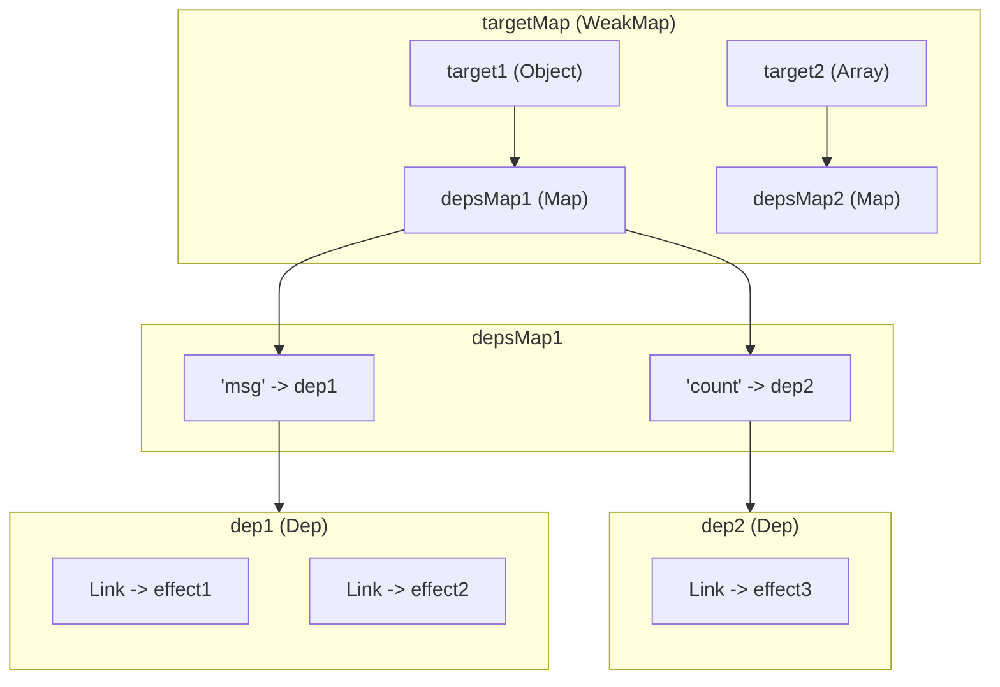

用表格表示更直观：

| 层级 | 数据结构 | 键 | 值 |
|---|---|---|---|
| 第一层 | `targetMap` (WeakMap) | `target` 原始对象 | `depsMap` |
| 第二层 | `depsMap` (Map) | `key` 属性名 | `dep` (Dep 实例) |
| 第三层 | `dep` (Dep) | -- | 订阅者链表 (双向链表) |

##### Dep 与 Link -- 双向链表

在 `Vue 3.5` 中，`Dep` 类和 `Link` 类构成了依赖管理的核心，这是 `Vue 3.5` 引入的全新响应式架构的基础：

```ts
export class Link {
  version: number
  nextDep?: Link
  prevDep?: Link
  nextSub?: Link
  prevSub?: Link
  prevActiveLink?: Link

  constructor(
    public sub: Subscriber,
    public dep: Dep,
  ) {
    this.version = dep.version
    // ...
  }
}

export class Dep {
  version = 0
  activeLink?: Link = undefined
  subs?: Link = undefined       // 订阅者链表尾部
  subsHead?: Link               // 订阅者链表头部（仅 DEV 模式）
  map?: KeyToDepMap = undefined  // 指向所属的 depsMap
  key?: unknown = undefined      // 指向所属的 key
  sc: number = 0                 // 订阅者计数

  constructor(public computed?: ComputedRefImpl | undefined) {}

  track(debugInfo?): Link | undefined {
    if (!activeSub || !shouldTrack || activeSub === this.computed) {
      return
    }

    let link = this.activeLink
    if (link === undefined || link.sub !== activeSub) {
      // 创建新的 Link 节点
      link = this.activeLink = new Link(activeSub, this)

      // 将 link 添加到 activeSub 的依赖链表尾部
      if (!activeSub.deps) {
        activeSub.deps = activeSub.depsTail = link
      } else {
        link.prevDep = activeSub.depsTail
        activeSub.depsTail!.nextDep = link
        activeSub.depsTail = link
      }

      addSub(link)
    } else if (link.version === -1) {
      // 复用上一轮的 Link，同步版本号
      link.version = this.version
      // 将 link 移到 activeSub 的依赖链表尾部（保持访问顺序）
      if (link.nextDep) {
        const next = link.nextDep
        next.prevDep = link.prevDep
        if (link.prevDep) {
          link.prevDep.nextDep = next
        }
        link.prevDep = activeSub.depsTail
        link.nextDep = undefined
        activeSub.depsTail!.nextDep = link
        activeSub.depsTail = link
        if (activeSub.deps === link) {
          activeSub.deps = next
        }
      }
    }

    return link
  }

  trigger(debugInfo?): void {
    this.version++
    globalVersion++
    this.notify(debugInfo)
  }

  notify(debugInfo?): void {
    startBatch()
    try {
      for (let link = this.subs; link; link = link.prevSub) {
        if (link.sub.notify()) {
          // 如果 notify() 返回 true，说明是 computed，同时通知其依赖
          ;(link.sub as ComputedRefImpl).dep.notify()
        }
      }
    } finally {
      endBatch()
    }
  }
}
```

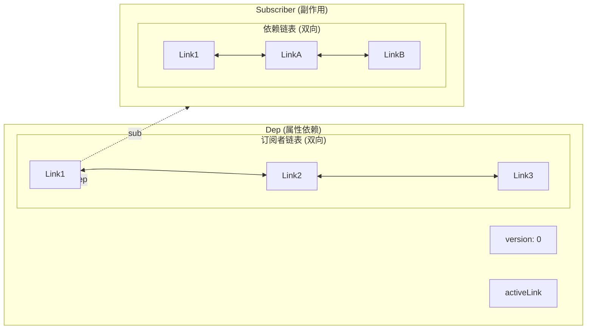

每个 `Link` 节点同时属于两个双向链表：
1. **dep 的订阅者链表**：同一属性的所有订阅者（通过 `prevSub`/`nextSub` 连接）
2. **sub 的依赖链表**：同一订阅者的所有依赖（通过 `prevDep`/`nextDep` 连接）

这种双向链表结构使得依赖的添加、移除和清理操作都是 O(1) 复杂度，相比早期版本使用 `Set` 存储依赖有了本质的性能提升。

> 关于 `Dep.track()` 和 `ReactiveEffect.run()` 中的版本计数与依赖清理机制，我们将在下一节详细介绍。

#### set -- 依赖触发

`set` 拦截器定义在 `MutableReactiveHandler` 类中：

```ts
class MutableReactiveHandler extends BaseReactiveHandler {
  constructor(isShallow = false) {
    super(false, isShallow)
  }

  set(
    target: Record<string | symbol, unknown>,
    key: string | symbol,
    value: unknown,
    receiver: object,
  ): boolean {
    let oldValue = target[key]
    if (!this._isShallow) {
      const isOldValueReadonly = isReadonly(oldValue)
      if (!isShallow(value) && !isReadonly(value)) {
        oldValue = toRaw(oldValue)
        value = toRaw(value)
      }
      // 如果旧值是 Ref 且新值不是 Ref，直接更新 ref.value
      if (!isArray(target) && isRef(oldValue) && !isRef(value)) {
        if (isOldValueReadonly) {
          return false
        } else {
          oldValue.value = value
          return true
        }
      }
    } else {
      // 浅层模式下，直接设置原始值
    }

    const hadKey =
      isArray(target) && isIntegerKey(key)
        ? Number(key) < target.length
        : hasOwn(target, key)
    const result = Reflect.set(
      target,
      key,
      value,
      isRef(target) ? target : receiver,
    )
    // 避免原型链上的 Proxy 触发重复 trigger
    if (target === toRaw(receiver)) {
      if (!hadKey) {
        trigger(target, TriggerOpTypes.ADD, key, value)
      } else if (hasChanged(value, oldValue)) {
        trigger(target, TriggerOpTypes.SET, key, value, oldValue)
      }
    }
    return result
  }
}
```

`set` 拦截器的核心逻辑：

```mermaid
flowchart TD
    A[set 拦截器触发] --> B{isShallow?}
    B -- 否 --> C[toRaw 转换 oldValue 和 value]
    B -- 是 --> D[直接使用原始值]
    C --> E{旧值是 Ref 且新值不是 Ref?}
    E -- 是且非数组 --> F[直接更新 oldValue.value]
    E -- 否 --> G[计算 hadKey]
    D --> G
    G --> H[Reflect.set 设置值]
    H --> I{target === toRaw(receiver)?}
    I -- 否 --> J[不触发，避免原型链重复触发]
    I -- 是 --> K{hadKey?}
    K -- 否 --> L["trigger(ADD)"]
    K -- 是 --> M{hasChanged?}
    M -- 是 --> N["trigger(SET)"]
    M -- 否 --> O[不触发，值未变化]
```

几个关键点：

1. **值去响应式化**：在非浅层模式下，新旧值都通过 `toRaw()` 转为原始值后再比较，避免响应式代理干扰比较逻辑。
2. **Ref 特殊处理**：如果旧值是 `Ref` 且新值不是 `Ref`，直接更新 `ref.value`，实现 `reactive` 对象中 `ref` 属性的透明赋值。
3. **操作类型判断**：通过 `hadKey` 判断是新增（`ADD`）还是修改（`SET`），只有值真正发生变化时（`hasChanged`）才触发 `SET` 类型的更新。
4. **原型链保护**：只有当 `target === toRaw(receiver)` 时才触发，防止原型链上的 `Proxy` 导致重复触发。

#### trigger -- 依赖触发

`trigger` 函数负责找到所有相关的 `dep` 并通知订阅者：

```ts
export function trigger(
  target: object,
  type: TriggerOpTypes,
  key?: unknown,
  newValue?: unknown,
  oldValue?: unknown,
  oldTarget?: Map<unknown, unknown> | Set<unknown>,
): void {
  const depsMap = targetMap.get(target)
  if (!depsMap) {
    // 从未被追踪过，仅递增 globalVersion
    globalVersion++
    return
  }

  const run = (dep: Dep | undefined) => {
    if (dep) {
      if (__DEV__) {
        dep.trigger({ target, type, key, newValue, oldValue, oldTarget })
      } else {
        dep.trigger()
      }
    }
  }

  startBatch()

  if (type === TriggerOpTypes.CLEAR) {
    // 集合被清空，触发所有依赖
    depsMap.forEach(run)
  } else {
    const targetIsArray = isArray(target)
    const isArrayIndex = targetIsArray && isIntegerKey(key)

    if (targetIsArray && key === 'length') {
      const newLength = Number(newValue)
      depsMap.forEach((dep, key) => {
        if (
          key === 'length' ||
          key === ARRAY_ITERATE_KEY ||
          (!isSymbol(key) && key >= newLength)
        ) {
          run(dep)
        }
      })
    } else {
      // SET | ADD | DELETE 操作
      if (key !== void 0 || depsMap.has(void 0)) {
        run(depsMap.get(key))
      }

      // 任意数字索引变化触发 ARRAY_ITERATE
      if (isArrayIndex) {
        run(depsMap.get(ARRAY_ITERATE_KEY))
      }

      // ADD | DELETE | Map.SET 触发迭代相关依赖
      switch (type) {
        case TriggerOpTypes.ADD:
          if (!targetIsArray) {
            run(depsMap.get(ITERATE_KEY))
            if (isMap(target)) {
              run(depsMap.get(MAP_KEY_ITERATE_KEY))
            }
          } else if (isArrayIndex) {
            // 新增数组索引 -> length 变化
            run(depsMap.get('length'))
          }
          break
        case TriggerOpTypes.DELETE:
          if (!targetIsArray) {
            run(depsMap.get(ITERATE_KEY))
            if (isMap(target)) {
              run(depsMap.get(MAP_KEY_ITERATE_KEY))
            }
          }
          break
        case TriggerOpTypes.SET:
          if (isMap(target)) {
            run(depsMap.get(ITERATE_KEY))
          }
          break
      }
    }
  }

  endBatch()
}
```

简化理解，`trigger` 的核心逻辑如下：

```ts
// 简化版
export function trigger(target, type, key) {
  const depsMap = targetMap.get(target)
  const dep = depsMap.get(key)
  dep.trigger()  // 递增 version，通知所有订阅者
}
```

##### 数组响应式的特殊处理

`trigger` 对数组的响应式触发有专门的处理逻辑，我们来理解一下。

先看一个示例：

```js
const state = reactive([])

effect(() => {
  console.log(`state: ${state[1]}`)
})

// 不会触发 effect
state.push(0)

// 触发 effect
state.push(1)
```

上面示例中，我们访问了 `state[1]`，所以对索引 `1` 进行了依赖收集。`state.push(0)` 设置的是索引 `0`，不会触发响应式更新；而第二次 `push` 触发了对 `state[1]` 的更新。这看起来很合理。

再看另一个示例：

```js
const state = reactive([])

effect(() => console.log('state map: ', state.map(item => item)))

state.push(1)
```

`state.map` 执行时，`state` 是空数组，理论上不会对每个索引进行访问，那 `state.push(1)` 为什么能触发 `effect`？我们可以用一个 `Proxy` 的 demo 来验证：

```js
const raw = []
const arr = new Proxy(raw, {
  get(target, key) {
    console.log('get', key)
    return Reflect.get(target, key)
  },
  set(target, key, value) {
    console.log('set', key)
    return Reflect.set(target, key, value)
  }
})

arr.map(v => v)
```

输出如下：

```
get map
get length
get constructor
```

可以看到 `map` 函数的操作会触发对数组 `length` 的访问！因此当访问数组 `length` 时，进行了依赖收集，而数组的 `push` 操作会改变 `length`，所以触发了响应式更新。

同理，`for in`、`forEach`、`map` 等遍历操作都会触发 `length` 的依赖收集，`pop`、`push`、`shift` 等变异操作都会触发响应式更新。

##### ownKeys 与对象遍历

除了数组，对象的 `Object.keys`、`for...of` 等遍历操作也会触发响应式依赖收集，这是通过 `ownKeys` 拦截器实现的：

```ts
ownKeys(target: Record<string | symbol, unknown>): (string | symbol)[] {
  track(
    target,
    TrackOpTypes.ITERATE,
    isArray(target) ? 'length' : ITERATE_KEY,
  )
  return Reflect.ownKeys(target)
}
```

`ownKeys` 函数内部对 `ITERATE_KEY` 进行了依赖收集，当对象的属性被新增或删除时，`trigger` 中会触发 `ITERATE_KEY` 对应的依赖：

```ts
case TriggerOpTypes.ADD:
  if (!targetIsArray) {
    run(depsMap.get(ITERATE_KEY))  // 新增属性触发迭代依赖
  }
  break
case TriggerOpTypes.DELETE:
  if (!targetIsArray) {
    run(depsMap.get(ITERATE_KEY))  // 删除属性触发迭代依赖
  }
  break
```

#### has 和 deleteProperty 拦截器

除了 `get` 和 `set`，`MutableReactiveHandler` 还实现了其他拦截器：

```ts
has(target: Record<string | symbol, unknown>, key: string | symbol): boolean {
  const result = Reflect.has(target, key)
  if (!isSymbol(key) || !builtInSymbols.has(key)) {
    track(target, TrackOpTypes.HAS, key)
  }
  return result
}

deleteProperty(
  target: Record<string |symbol, unknown>,
  key: string | symbol,
): boolean {
  const hadKey = hasOwn(target, key)
  const oldValue = target[key]
  const result = Reflect.deleteProperty(target, key)
  if (result && hadKey) {
    trigger(target, TriggerOpTypes.DELETE, key, undefined, oldValue)
  }
  return result
}
```

- `has`：拦截 `in` 操作符，对 `key` 进行 `HAS` 类型的依赖收集。当属性被新增或删除时触发更新。
- `deleteProperty`：拦截 `delete` 操作，触发 `DELETE` 类型的更新。

#### shallowReactive 的区别

`shallowReactive` 使用 `shallowReactiveHandlers`，它与 `mutableHandlers` 的区别仅在于 `_isShallow = true`：

```ts
export const shallowReactiveHandlers: MutableReactiveHandler =
  /*@__PURE__*/ new MutableReactiveHandler(true)
```

在 `get` 拦截器中：

```ts
// 浅层响应式直接返回，不递归转换
if (isShallow) {
  return res
}
```

`shallowReactive` 只对根层属性做响应式处理，不会递归转换嵌套对象。嵌套属性仍然是原始值，不会被自动解包 `ref`，也不会被转为 `reactive`。

| 特性 | `reactive` | `shallowReactive` |
|---|---|---|
| 根层属性响应式 | 是 | 是 |
| 嵌套对象自动转 reactive | 是 | 否 |
| Ref 自动解包 | 是 | 否 |
| 嵌套属性变更触发更新 | 是 | 否 |

#### Vue 3.4/3.5 响应式系统演进

`Vue 3.4` 和 `3.5` 对响应式系统进行了两次重大重构，从根本上改变了依赖追踪与触发的内部机制，同时保持了对外 API 的完全兼容。

##### Vue 3.4 -- 更高效的响应式系统

`Vue 3.4`（PR [#5912](https://github.com/vuejs/core/pull/5912)）对响应式系统进行了全面重构，解决了大量长期存在的边界问题，主要变化包括：

**1. Computed 精度提升 -- 同值不再重复触发**

在 `Vue 3.4` 之前，`computed` 的实现存在一个已知问题：当 `computed` 的依赖发生变化但计算结果与之前相同时，仍然会触发下游副作用。`Vue 3.4` 通过重构 `computed` 的脏检查机制解决了这个问题：

```ts
// ComputedRefImpl 中的 notify 方法（Vue 3.5）
notify(): true | void {
  this.flags |= EffectFlags.DIRTY
  if (
    !(this.flags & EffectFlags.NOTIFIED) &&
    activeSub !== this
  ) {
    batch(this, true)
    return true  // 返回 true 表示需要通知下游
  }
}
```

```ts
// refreshComputed 中的值比较逻辑
const value = computed.fn(computed._value)
if (dep.version === 0 || hasChanged(value, computed._value)) {
  computed._value = value
  dep.version++  // 只有值真正变化时才递增版本号
}
```

当 `computed` 重新计算后，只有 `hasChanged(value, computed._value)` 为 `true` 时才会递增 `dep.version`，下游的 `effect` 通过 `isDirty` 检查版本号来判断是否需要重新执行，从而避免同值触发。

**2. 全局版本号（globalVersion）快速路径**

`Vue 3.5` 在此基础上进一步引入了全局版本号 `globalVersion`：

```ts
export let globalVersion = 0
```

每次任何响应式属性发生变化时，`globalVersion` 都会递增。`computed` 会记录上次刷新时的 `globalVersion`：

```ts
// refreshComputed 中的快速路径
if (computed.globalVersion === globalVersion) {
  return  // 全局无变化，直接跳过
}
computed.globalVersion = globalVersion
```

这个快速路径使得 `computed` 在没有任何响应式数据变化时，可以 O(1) 地判断无需重新计算，大幅减少了深层 `computed` 链中的重复计算开销。

**3. ReactiveEffect 重构**

`Vue 3.4/3.5` 将原来的 `ReactiveEffect` 类从基于 `Set` 的依赖管理重构为基于双向链表的 `Subscriber` 接口：

```ts
export interface Subscriber extends DebuggerOptions {
  deps?: Link          // 依赖链表头部
  depsTail?: Link      // 依赖链表尾部
  flags: EffectFlags   // 状态标志位
  next?: Subscriber    // 批处理队列中的下一个
  notify(): true | void
}
```

```ts
export class ReactiveEffect<T = any> implements Subscriber {
  deps?: Link = undefined
  depsTail?: Link = undefined
  flags: EffectFlags = EffectFlags.ACTIVE | EffectFlags.TRACKING
  next?: Subscriber = undefined
  cleanup?: () => void = undefined

  // ...
}
```

使用位标志（`EffectFlags`）替代了之前的多个布尔变量：

```ts
export enum EffectFlags {
  ACTIVE = 1 << 0,
  RUNNING = 1 << 1,
  TRACKING = 1 << 2,
  NOTIFIED = 1 << 3,
  DIRTY = 1 << 4,
  ALLOW_RECURSE = 1 << 5,
  PAUSED = 1 << 6,
}
```

这种设计使得状态判断更加高效，同时减少了内存占用。

##### Vue 3.5 -- Lazy Effect 与数组追踪优化

**1. 版本计数与双向链表追踪（PR [#10397](https://github.com/vuejs/core/pull/10397)）**

这是 `Vue 3.5` 响应式系统的核心重构。其核心思想是为每个 `Dep` 维护一个 `version` 计数器：

- 每次 `trigger` 时，`dep.version++`
- 每个 `Link` 节点记录创建时的 `dep.version`
- `effect` 运行前，将所有依赖的 `Link.version` 重置为 `-1`
- `effect` 运行时，访问到的属性会同步 `Link.version = dep.version`
- `effect` 运行后，`version` 仍为 `-1` 的 `Link` 表示未被使用，自动清理

```ts
// prepareDeps：运行前标记所有依赖版本为 -1
function prepareDeps(sub: Subscriber) {
  for (let link = sub.deps; link; link = link.nextDep) {
    link.version = -1
    link.prevActiveLink = link.dep.activeLink
    link.dep.activeLink = link
  }
}

// cleanupDeps：运行后清理未使用的依赖
function cleanupDeps(sub: Subscriber) {
  let head
  let tail = sub.depsTail
  let link = tail
  while (link) {
    const prev = link.prevDep
    if (link.version === -1) {
      // 未被使用，从双向链表中移除
      if (link === tail) tail = prev
      removeSub(link)
      removeDep(link)
    } else {
      head = link
    }
    // 恢复之前的 activeLink
    link.dep.activeLink = link.prevActiveLink
    link.prevActiveLink = undefined
    link = prev
  }
  sub.deps = head
  sub.depsTail = tail
}
```

```mermaid
sequenceDiagram
    participant Effect as ReactiveEffect
    participant Dep as Dep(version)
    participant Link as Link

    Note over Effect: effect.run() 开始
    Effect->>Link: prepareDeps: 所有 link.version = -1
    Effect->>Effect: 执行 fn()
    Note over Dep,Link: fn() 中访问响应式属性
    Dep->>Link: dep.track(): link.version = dep.version
    Note over Effect: fn() 执行完毕
    Effect->>Link: cleanupDeps: 移除 version == -1 的 link
    Note over Effect: effect.run() 结束
```

**2. Lazy Effect -- 计算属性的惰性订阅**

`Vue 3.5` 实现了真正的 `Lazy Effect` 机制，`computed` 只有在被订阅时才会追踪其依赖：

```ts
function addSub(link: Link) {
  link.dep.sc++
  if (link.sub.flags & EffectFlags.TRACKING) {
    const computed = link.dep.computed
    // computed 首次获得订阅者
    // 启用追踪 + 惰性订阅其所有依赖
    if (computed && !link.dep.subs) {
      computed.flags |= EffectFlags.TRACKING | EffectFlags.DIRTY
      for (let l = computed.deps; l; l = l.nextDep) {
        addSub(l)  // 递归订阅 computed 的依赖
      }
    }
    // ...
  }
}
```

当 `computed` 没有任何订阅者时，它的依赖不会被追踪，它自身也不会参与任何依赖链。只有当有 `effect` 读取该 `computed` 的值时，它才会被"激活"，开始追踪依赖。当所有订阅者都被移除后，它又会回到"休眠"状态。

这意味着在大型应用中，大量未被使用的 `computed` 不会产生任何运行时开销。

**3. 深层响应式数组追踪优化（PR [#9511](https://github.com/vuejs/core/pull/9511)） -- 约 10 倍性能提升**

这是 `Vue 3.5` 中对数组响应式性能影响最大的优化。核心变化是引入了 `ARRAY_ITERATE_KEY`：

```ts
export const ARRAY_ITERATE_KEY: unique symbol = Symbol(
  __DEV__ ? 'Array iterate' : '',
)
```

**优化前的问题**

在 `Vue 3.4` 及之前，当对响应式数组调用 `map`、`filter`、`forEach` 等迭代方法时，会对数组中的**每一个索引**逐一进行依赖收集。对于一个包含 1000 个元素的数组，这意味着要创建 1000 个 `dep` 条目：

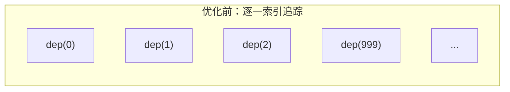

**优化后的方案**

引入 `ARRAY_ITERATE_KEY` 后，迭代方法只对这一个 `key` 进行依赖收集，不再逐一追踪每个索引：

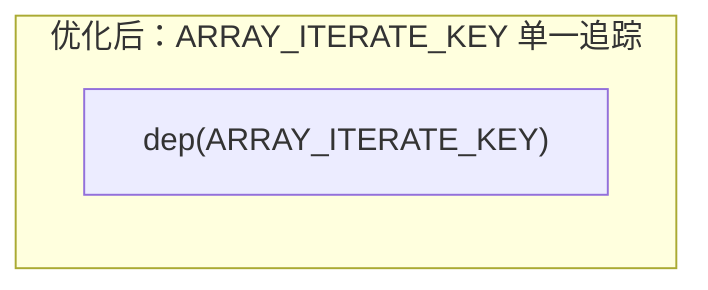

具体实现上，`Vue 3.5` 引入了 `shallowReadArray` 和 `reactiveReadArray` 两个辅助函数：

```ts
// 追踪数组迭代并返回原始数组
export function shallowReadArray<T>(arr: T[]): T[] {
  track((arr = toRaw(arr)), TrackOpTypes.ITERATE, ARRAY_ITERATE_KEY)
  return arr
}

// 追踪数组迭代并返回包含响应式值的数组
export function reactiveReadArray<T>(array: T[]): T[] {
  const raw = toRaw(array)
  if (raw === array) return raw
  track(raw, TrackOpTypes.ITERATE, ARRAY_ITERATE_KEY)
  return isShallow(array) ? raw : raw.map(toReactive)
}
```

同时在 `trigger` 中，当数组索引发生变化时，同时触发 `ARRAY_ITERATE_KEY` 的依赖：

```ts
// trigger 中的数组索引变化处理
if (isArrayIndex) {
  run(depsMap.get(ARRAY_ITERATE_KEY))
}
```

在 `length` 变化时也会触发 `ARRAY_ITERATE_KEY`：

```ts
if (targetIsArray && key === 'length') {
  const newLength = Number(newValue)
  depsMap.forEach((dep, key) => {
    if (
      key === 'length' ||
      key === ARRAY_ITERATE_KEY ||
      (!isSymbol(key) && key >= newLength)
    ) {
      run(dep)
    }
  })
}
```

这种优化带来的性能提升是巨大的。对于大型数组的迭代操作，依赖收集的开销从 O(n) 降低到 O(1)，在实际基准测试中，对包含大量元素的数组进行 `map`、`filter` 等操作的性能可提升约 **10 倍**。

##### 版本演进对比

| 特性 | Vue 3.3 及之前 | Vue 3.4 | Vue 3.5 |
|---|---|---|---|
| 依赖存储结构 | Set | Set（重构了 computed） | 双向链表（Link） |
| 依赖清理 | 全量重建 | 全量重建 | 版本计数增量清理 |
| computed 同值触发 | 可能误触发 | 修复 | 修复 + globalVersion 快速路径 |
| computed 惰性订阅 | 无 | 无 | Lazy Effect |
| 数组迭代追踪 | 逐一索引 | 逐一索引 | ARRAY_ITERATE_KEY 单一追踪 |
| activeEffect | 全局变量 | 全局变量 | activeSub（Subscriber 接口） |
| 状态管理 | 多个布尔变量 | 多个布尔变量 | EffectFlags 位标志 |
| 批处理 | 手动调度 | 手动调度 | startBatch/endBatch 链式通知 |


### 副作用函数与依赖管理

#### 从 effect() 函数出发

先来看 `effect()` 函数的定义（`packages/reactivity/src/effect.ts`）：

```ts
export function effect<T = any>(
  fn: () => T,
  options?: ReactiveEffectOptions,
): ReactiveEffectRunner<T> {
  // 如果 fn 已经是一个 effect runner，则指向其原始函数
  if ((fn as ReactiveEffectRunner).effect instanceof ReactiveEffect) {
    fn = (fn as ReactiveEffectRunner).effect.fn
  }

  // 构造 ReactiveEffect 实例
  const e = new ReactiveEffect(fn)

  // 合并 options
  if (options) {
    extend(e, options)
  }

  // 立即执行一次，完成首次依赖收集
  try {
    e.run()
  } catch (err) {
    e.stop()
    throw err
  }

  // 返回 runner 函数，runner 上挂载了 effect 实例的引用
  const runner = e.run.bind(e) as ReactiveEffectRunner
  runner.effect = e
  return runner
}
```

可以看到，`effect()` 函数内部的核心逻辑非常清晰：

1. 如果传入的 `fn` 已经绑定过 effect，则取其原始函数，避免重复包装。
2. 通过 `new ReactiveEffect(fn)` 创建副作用实例。
3. 合并 `options` 到实例上（如 `scheduler`、`onTrack`、`onTrigger` 等）。
4. **立即调用 `e.run()`**，这会执行 `fn`，并在执行过程中完成首次依赖收集。
5. 返回绑定好 `this` 的 `runner` 函数。

一个最基本的使用示例：

```ts
const state = reactive({ a: 1 })

effect(() => console.log(state.a))
// 立即打印: 1（因为 run() 被调用了）
```

`effect` 传入的 `fn` 在 `e.run()` 内被执行，执行时访问了 `state.a`，触发了 `Proxy getter`，从而完成了依赖收集。接下来我们深入 `ReactiveEffect` 类的内部实现。

#### ReactiveEffect 类：副作用的核心抽象

##### 类定义全貌

Vue 3.5 的 `ReactiveEffect` 类实现了 `Subscriber` 接口，完整定义如下：

```ts
// 当前活跃的订阅者（旧版叫 activeEffect）
export let activeSub: Subscriber | undefined

// 效果标记位枚举
export enum EffectFlags {
  ACTIVE = 1 << 0,     // 是否处于活跃状态
  RUNNING = 1 << 1,    // 是否正在运行
  TRACKING = 1 << 2,   // 是否需要追踪依赖
  NOTIFIED = 1 << 3,   // 是否已被通知（等待执行）
  DIRTY = 1 << 4,      // 是否脏（需要重新计算，computed 用）
  ALLOW_RECURSE = 1 << 5, // 是否允许递归
  PAUSED = 1 << 6,     // 是否暂停
}

// Subscriber 接口
export interface Subscriber extends DebuggerOptions {
  deps?: Link          // 依赖链表头
  depsTail?: Link      // 依赖链表尾
  flags: EffectFlags   // 标记位
  next?: Subscriber    // 下一个待执行的订阅者（批处理用）
  notify(): true | void // 通知方法
}

export class ReactiveEffect<T = any>
  implements Subscriber, ReactiveEffectOptions
{
  deps?: Link = undefined            // 双向链表头指针
  depsTail?: Link = undefined        // 双向链表尾指针
  flags: EffectFlags = EffectFlags.ACTIVE | EffectFlags.TRACKING
  next?: Subscriber = undefined      // 批处理链表
  cleanup?: () => void = undefined   // 清理函数

  scheduler?: EffectScheduler = undefined
  onStop?: () => void
  onTrack?: (event: DebuggerEvent) => void
  onTrigger?: (event: DebuggerEvent) => void

  constructor(public fn: () => T) {
    // 如果当前处于活跃的 effectScope 中，自动注册
    if (activeEffectScope && activeEffectScope.active) {
      activeEffectScope.effects.push(this)
    }
  }
  // ... 其他方法
}
```

##### 关键属性解读

| 属性 | 类型 | 说明 |
|---|---|---|
| `fn` | `() => T` | 用户传入的副作用函数 |
| `deps` / `depsTail` | `Link` | 指向该 effect 订阅的所有 dep 的双向链表的首尾 |
| `flags` | `EffectFlags` | 位标记，控制 effect 的各种状态 |
| `scheduler` | `EffectScheduler` | 调度器，如果设置了则不直接 `run()` 而是走调度 |
| `cleanup` | `() => void` | 清理函数，在下次 `run()` 前执行 |
| `next` | `Subscriber` | 批处理链表中的下一个待执行订阅者 |

##### 与 Vue 3.4 的核心差异

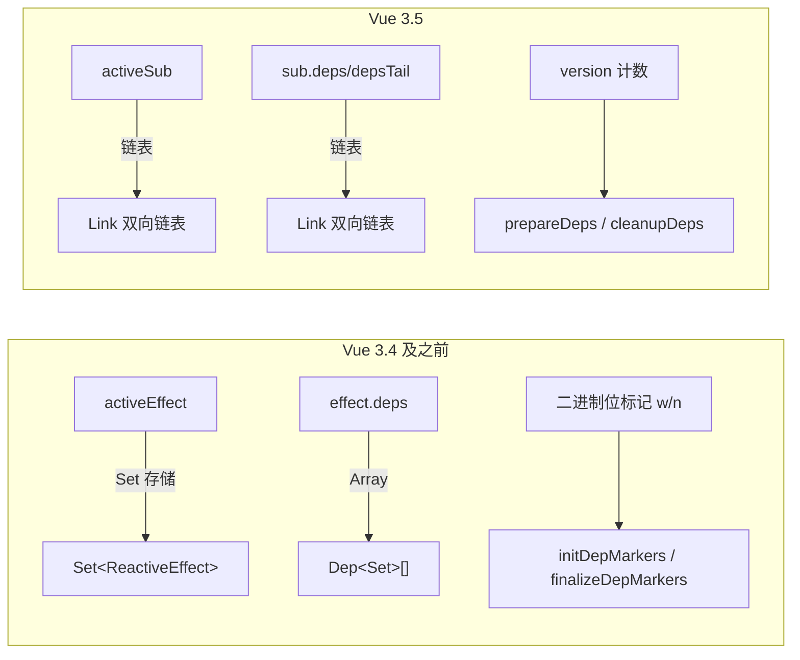

| 对比维度 | Vue 3.4 | Vue 3.5 |
|---|---|---|
| 全局活跃变量 | `activeEffect` | `activeSub` |
| Dep 存储结构 | `Set<ReactiveEffect>` | 双向链表 `Link` |
| Effect 的 deps | `Dep[]` 数组 | `Link` 双向链表 |
| 依赖清理策略 | 二进制位标记 `w`/`n` | 版本计数 `version` |
| 清理函数 | `initDepMarkers` / `finalizeDepMarkers` | `prepareDeps` / `cleanupDeps` |
| Dep 的能力 | 纯数据 | 拥有 `track()` / `trigger()` 方法 |
| 嵌套处理 | `effectTrackDepth` + `trackOpBit` | `prevEffect` 链式回溯 |

#### run() 方法：依赖收集的执行引擎

`run()` 是 `ReactiveEffect` 最核心的方法，它负责执行副作用函数并完成依赖收集与清理：

```ts
run(): T {
  // 如果 effect 已停止，直接执行 fn 但不收集依赖
  if (!(this.flags & EffectFlags.ACTIVE)) {
    return this.fn()
  }

  this.flags |= EffectFlags.RUNNING
  // 1. 执行清理函数（如果有）
  cleanupEffect(this)
  // 2. 准备依赖：将所有已有 Link 的 version 标记为 -1
  prepareDeps(this)

  // 3. 保存上一次的 activeSub，实现嵌套切换
  const prevEffect = activeSub
  const prevShouldTrack = shouldTrack
  activeSub = this
  shouldTrack = true

  try {
    // 4. 执行副作用函数，触发 getter → track → 依赖收集
    return this.fn()
  } finally {
    // 5. 清理无效依赖：version 仍为 -1 的 Link 就是无效的
    cleanupDeps(this)
    // 6. 恢复上下文
    activeSub = prevEffect
    shouldTrack = prevShouldTrack
    this.flags &= ~EffectFlags.RUNNING
  }
}
```

整个 `run()` 的执行流程可以用下图来表示：

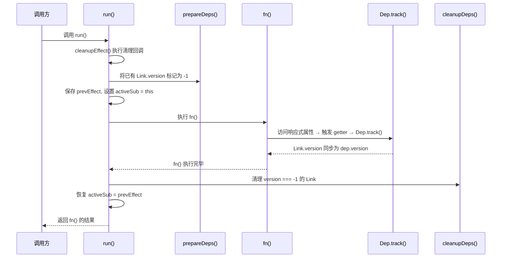

接下来我们逐个剖析其中的关键环节。

#### 嵌套 Effect 与 activeSub 切换

##### 问题场景

考虑如下嵌套 `effect` 的代码：

```ts
const state = reactive({ a: 1, b: 2 })

// ef1
effect(() => {
  // ef2
  effect(() => console.log(`b: ${state.b}`))
  console.log(`a: ${state.a}`)
})

state.a++
```

如果 `run()` 只是简单地设置 `activeSub = this` 而不保存前一个 `activeSub`，流程将变成：

1. 执行 `ef1`，`activeSub = ef1`
2. 遇到内部 `effect`，执行 `ef2`，`activeSub = ef2`
3. `ef2` 的 `fn` 执行，访问 `state.b`，收集到 `ef2` -- 正确
4. 回到 `ef1` 的 `fn` 体，访问 `state.a`，但 `activeSub` 仍然是 `ef2` -- **错误！**

结果 `state.a` 的依赖被错误地收集为 `ef2`，当 `state.a++` 时触发的是 `ef2` 而非 `ef1`。

##### 解决方案：prevEffect 链式回溯

Vue 3.5 通过 `prevEffect` 保存上一次的 `activeSub`，在 `finally` 块中恢复：

```ts
const prevEffect = activeSub   // 保存
activeSub = this                // 设置
try {
  return this.fn()
} finally {
  activeSub = prevEffect        // 恢复
}
```

正确的执行流程：

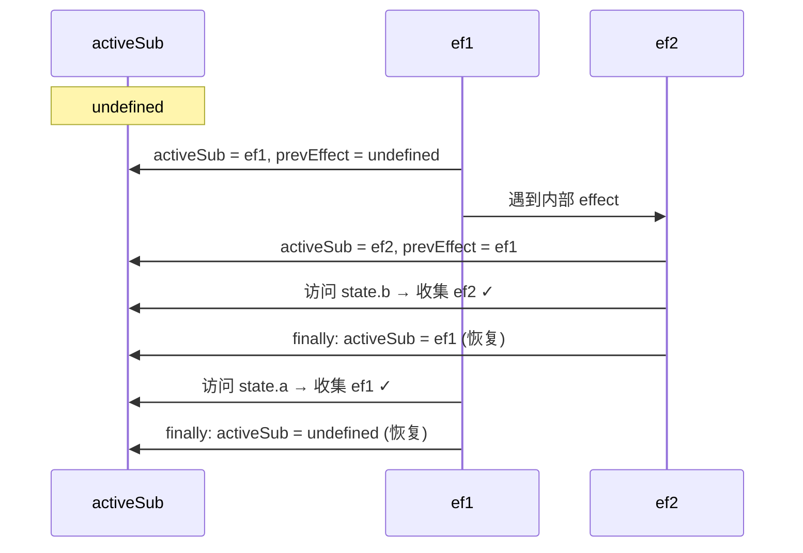

1. 执行 `ef1`，`activeSub = ef1`，`prevEffect = undefined`
2. 遇到 `ef2`，`activeSub = ef2`，`prevEffect = ef1`
3. `ef2` 的 `fn` 执行，访问 `state.b`，收集 `ef2` -- 正确
4. `ef2` 的 `finally`：`activeSub = prevEffect = ef1`
5. 回到 `ef1` 的 `fn`，访问 `state.a`，收集 `ef1` -- 正确
6. `ef1` 的 `finally`：`activeSub = prevEffect = undefined`

这种**栈式保存-恢复**机制确保了嵌套 `effect` 中 `activeSub` 始终指向当前正在执行的 effect。

#### Dep 和 Link：双向链表依赖管理

Vue 3.5 用 `Dep` 和 `Link` 两个类替代了原来的 `Set<ReactiveEffect>` 方案，这是 3.5 响应式重构的核心变化。

##### Dep 类

`Dep` 代表一个响应式属性的所有订阅者集合：

```ts
export class Dep {
  version = 0                    // 版本号，每次 trigger 自增
  activeLink?: Link = undefined  // 指向当前活跃 effect 的 Link
  subs?: Link = undefined        // 订阅者链表尾指针
  subsHead?: Link                // 订阅者链表头指针（DEV only）
  map?: KeyToDepMap = undefined  // 所属的 depsMap（用于属性级清理）
  key?: unknown = undefined      // 属性 key（用于属性级清理）
  sc: number = 0                 // 订阅者计数

  constructor(public computed?: ComputedRefImpl | undefined) {}
}
```

##### Link 类

`Link` 是 `Dep` 和 `Subscriber` 之间的桥梁，每个 Link 同时属于两条双向链表：

```ts
export class Link {
  version: number               // 版本号，用于依赖清理
  nextDep?: Link                // 同一 subscriber 的下一个 dep
  prevDep?: Link                // 同一 subscriber 的上一个 dep
  nextSub?: Link                // 同一 dep 的下一个 subscriber
  prevSub?: Link                // 同一 dep 的上一个 subscriber
  prevActiveLink?: Link         // 保存前一个 activeLink（用于恢复）

  constructor(
    public sub: Subscriber,     // 订阅者（effect 或 computed）
    public dep: Dep,            // 依赖项（响应式属性）
  ) {
    this.version = dep.version  // 初始化版本号
  }
}
```

##### 双向链表结构示意

每个 `Link` 同时维护两个维度的双向链表关系：

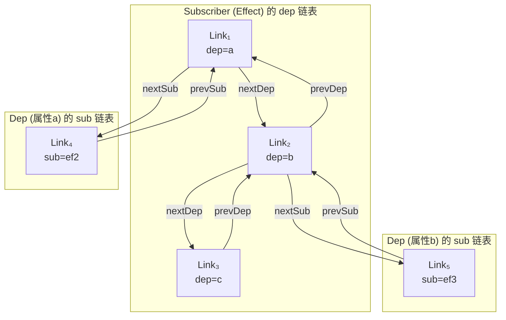

用表格更清晰地展示：

| 维度 | 遍历方向 | 指针 | 含义 |
|---|---|---|---|
| Effect → Deps | 从 deps 到 depsTail | `nextDep` / `prevDep` | 某个 effect 订阅了哪些 dep |
| Dep → Subs | 从 subs 到 subsHead | `nextSub` / `prevSub` | 某个 dep 被哪些 effect 订阅 |

##### 为什么用双向链表替代 Set？

| 维度 | Set 方案（3.4） | 双向链表方案（3.5） |
|---|---|---|
| 内存开销 | 每个 dep 一个 Set 对象 | Link 节点，无额外容器 |
| 删除操作 | `Set.delete()` O(1) 但需哈希 | 指针操作 O(1)，无哈希开销 |
| 遍历顺序 | 无保证 | 按订阅顺序，可预测 |
| 批量清理 | 需遍历整个 Set | 断开链表头尾即可 |
| 与 computed 联动 | 需额外逻辑 | Link 节点天然桥接 |

#### 依赖收集：track 的完整链路

##### 从 Proxy getter 到 Dep.track()

当访问响应式对象的属性时，`Proxy getter` 会调用 `track()`：

```ts
// baseHandlers.ts 中的 getter
get(target, key, receiver) {
  // ...
  if (!isReadonly) {
    track(target, TrackOpTypes.GET, key)
  }
  // ...
}
```

`track()` 函数负责找到或创建对应的 `Dep`，然后调用 `dep.track()`：

```ts
// dep.ts
export function track(target: object, type: TrackOpTypes, key: unknown): void {
  if (shouldTrack && activeSub) {
    let depsMap = targetMap.get(target)
    if (!depsMap) {
      targetMap.set(target, (depsMap = new Map()))
    }
    let dep = depsMap.get(key)
    if (!dep) {
      depsMap.set(key, (dep = new Dep()))
      dep.map = depsMap
      dep.key = key
    }
    // 开发环境下传入调试信息
    dep.track({ target, type, key })
  }
}
```

这里用到了全局的 `targetMap`，其结构为：

```
targetMap: WeakMap<object, Map<key, Dep>>
  └── target → depsMap: Map<key, Dep>
       └── key → Dep { version, subs, activeLink, ... }
```

##### Dep.track()：建立 Link 的核心逻辑

```ts
track(debugInfo?): Link | undefined {
  // 没有 activeSub 或不需要追踪，直接返回
  if (!activeSub || !shouldTrack || activeSub === this.computed) {
    return
  }

  let link = this.activeLink
  if (link === undefined || link.sub !== activeSub) {
    // 情况一：全新的订阅关系，创建新 Link
    link = this.activeLink = new Link(activeSub, this)

    if (!activeSub.deps) {
      // effect 的 deps 链表为空，Link 作为唯一节点
      activeSub.deps = activeSub.depsTail = link
    } else {
      // 追加到 effect 的 deps 链表尾部
      link.prevDep = activeSub.depsTail
      activeSub.depsTail!.nextDep = link
      activeSub.depsTail = link
    }

    // 将 Link 加入 dep 的 subs 链表
    addSub(link)

  } else if (link.version === -1) {
    // 情况二：复用上次 run 的 Link（version 被标记为 -1 后又被访问到）
    link.version = this.version

    // 如果该 Link 不在 deps 链表尾部，将其移动到尾部
    // 这保证了 effect 的 deps 链表顺序与属性访问顺序一致
    if (link.nextDep) {
      const next = link.nextDep
      next.prevDep = link.prevDep
      if (link.prevDep) link.prevDep.nextDep = next

      link.prevDep = activeSub.depsTail
      link.nextDep = undefined
      activeSub.depsTail!.nextDep = link
      activeSub.depsTail = link

      if (activeSub.deps === link) {
        activeSub.deps = next
      }
    }
  }

  return link
}
```

`track()` 的两种情况：

1. **新建 Link**：当 `activeLink` 不存在或 `sub` 不匹配时，创建新的 `Link` 节点，同时将其插入到 effect 的 deps 链表和 dep 的 subs 链表。
2. **复用 Link**：当 `activeLink` 存在且 `sub` 匹配，但 `version === -1`（说明在上次 `prepareDeps` 中被标记为待清理，但本次 `fn()` 又访问了该属性），此时将 `version` 同步回 `dep.version`，表示该依赖仍然有效，并可选地将其移到链表尾部以保持访问顺序。

##### addSub()：将 Link 加入 dep 的订阅链表

```ts
function addSub(link: Link) {
  link.dep.sc++  // 订阅者计数 +1

  if (link.sub.flags & EffectFlags.TRACKING) {
    const computed = link.dep.computed
    // computed 首次获得订阅者时，启用追踪并订阅 computed 自身的所有 deps
    if (computed && !link.dep.subs) {
      computed.flags |= EffectFlags.TRACKING | EffectFlags.DIRTY
      for (let l = computed.deps; l; l = l.nextDep) {
        addSub(l)
      }
    }

    const currentTail = link.dep.subs
    if (currentTail !== link) {
      link.prevSub = currentTail
      if (currentTail) currentTail.nextSub = link
    }

    if (__DEV__ && link.dep.subsHead === undefined) {
      link.dep.subsHead = link
    }

    link.dep.subs = link  // 更新尾指针
  }
}
```

注意 `addSub` 中对 **computed 首次订阅者** 的特殊处理：当一个 computed 属性从"无订阅者"变为"有订阅者"时，需要递归地将 computed 自身依赖的所有 dep 也关联起来。这就是 Vue 3.5 的 **Lazy Effect** 机制 -- computed 在没有订阅者时不进行依赖追踪，只有被其他 effect 订阅时才"激活"。

#### 依赖清理：版本计数机制

##### 问题场景

与旧版相同的问题：条件性的依赖访问可能导致"过期依赖"。

```ts
const state = reactive({ a: 1, show: true })

effect(() => {
  if (state.show) {
    console.log(`a: ${state.a}`)
  }
})

// 此时 effect 同时依赖 show 和 a

setTimeout(() => {
  state.show = false
  // effect 重新执行，fn 内不再访问 state.a
  // 如果不清理，后续 state.a 变化仍会触发 effect
}, 1000)
```

当 `state.show` 变为 `false` 后，`fn` 内不再访问 `state.a`，但 `state.a` 的 dep 中仍然持有该 effect 的引用。如果不清理，后续修改 `state.a` 仍会触发无意义的 effect 重新执行。

##### prepareDeps：标记阶段

在 `run()` 执行 `fn` 之前，`prepareDeps()` 将当前 effect 的所有已有 Link 的 `version` 标记为 `-1`：

```ts
function prepareDeps(sub: Subscriber) {
  for (let link = sub.deps; link; link = link.nextDep) {
    // 标记为 -1，表示"待验证"
    link.version = -1
    // 保存之前的 activeLink，用于后续恢复
    link.prevActiveLink = link.dep.activeLink
    link.dep.activeLink = link
  }
}
```

标记为 `-1` 的含义是：**这个 Link 对应的依赖在上次 run 中被使用过，但本次 run 还未确认是否仍然需要。**

##### track 时的版本同步

在 `fn()` 执行过程中，当访问响应式属性触发 `track()` 时，如果发现 `activeLink` 已存在且 `version === -1`，则将 `version` 同步回 `dep.version`：

```ts
// dep.track() 中
else if (link.version === -1) {
  link.version = this.version  // 从 -1 恢复为当前版本号
  // ... 可选地移动到链表尾部
}
```

这意味着：**被再次访问的依赖，其 Link 的 version 会从 -1 变为 dep.version，证明它仍然有效。**

##### cleanupDeps：清理阶段

`fn()` 执行完毕后，`cleanupDeps()` 清理所有 `version` 仍为 `-1` 的 Link：

```ts
function cleanupDeps(sub: Subscriber) {
  let head
  let tail = sub.depsTail
  let link = tail

  while (link) {
    const prev = link.prevDep
    if (link.version === -1) {
      // version 仍为 -1 → 该依赖未被使用，需要清理
      if (link === tail) tail = prev

      // 从 dep 的 subs 链表中移除该 Link
      removeSub(link)
      // 从 effect 的 deps 链表中移除该 Link
      removeDep(link)
    } else {
      // version 不为 -1 → 该依赖仍在使用，保留
      // 最后一个保留的节点成为新的 head
      head = link
    }

    // 恢复 dep 的 activeLink
    link.dep.activeLink = link.prevActiveLink
    link.prevActiveLink = undefined
    link = prev
  }

  // 更新 effect 的 deps 链表首尾指针
  sub.deps = head
  sub.depsTail = tail
}
```

##### 完整的依赖清理流程演示

以上面的条件依赖示例为例：

```ts
const state = reactive({ a: 1, show: true })

effect(() => {
  if (state.show) {
    console.log(`a: ${state.a}`)
  }
})
```

**第一次 run**（`show = true`）：

| 步骤 | 操作 | effect.deps 链表 | dep.show.subs | dep.a.subs |
|---|---|---|---|---|
| prepareDeps | deps 为空，跳过 | 空 | - | - |
| fn() 执行 | 访问 show → track | Link(show) | [effect] | - |
| fn() 执行 | 访问 a → track | Link(show) → Link(a) | [effect] | [effect] |
| cleanupDeps | 所有 version 有效 | Link(show) → Link(a) | [effect] | [effect] |

**`state.show = false` 触发第二次 run**：

| 步骤 | 操作 | Link(show).version | Link(a).version |
|---|---|---|---|
| prepareDeps | 标记所有为 -1 | -1 | -1 |
| fn() 执行 | 访问 show → track | 1 (恢复) | -1 (未访问) |
| fn() 执行 | if(show)为false，跳过 a | 1 | -1 |
| cleanupDeps | Link(a).version === -1 | 保留 | 删除 |

最终，`state.a` 的 dep 中不再持有该 effect，后续 `state.a++` 不会触发无效的 effect 执行。

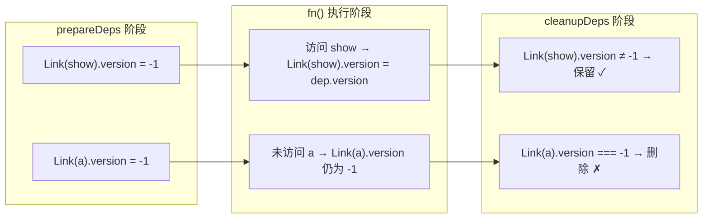

##### 与 Vue 3.4 二进制位标记方案的对比

Vue 3.4 使用 `dep.w`（wasTracked）和 `dep.n`（newTracked）两个属性配合 `trackOpBit` 位运算来标记依赖状态。Vue 3.5 的版本计数方案更简洁：

| 维度 | Vue 3.4 (二进制位) | Vue 3.5 (版本计数) |
|---|---|---|
| 标记位置 | 在 `dep` 对象上 | 在 `Link` 节点上 |
| 标记方式 | `dep.w |= trackOpBit` | `link.version = -1` |
| 判断条件 | `wasTracked(dep) && !newTracked(dep)` | `link.version === -1` |
| 嵌套层级限制 | `maxMarkerBits = 30` | 无限制 |
| 复杂度 | 需要理解位运算 | 直观易懂 |

#### 依赖触发：trigger 的完整链路

##### 从 Proxy setter 到 Dep.trigger()

当修改响应式对象的属性时，`Proxy setter` 会调用 `trigger()`：

```ts
// baseHandlers.ts 中的 setter
set(target, key, value, receiver) {
  // ...
  if (!hadKey) {
    trigger(target, TriggerOpTypes.ADD, key, value)
  } else if (hasChanged(value, oldValue)) {
    trigger(target, TriggerOpTypes.SET, key, value, oldValue)
  }
  // ...
}
```

##### trigger() 函数

```ts
export function trigger(
  target: object,
  type: TriggerOpTypes,
  key?: unknown,
  newValue?: unknown,
  oldValue?: unknown,
  oldTarget?: Map<unknown, unknown> | Set<unknown>,
): void {
  const depsMap = targetMap.get(target)
  if (!depsMap) {
    globalVersion++  // 即使没有 deps，也递增全局版本号
    return
  }

  const run = (dep: Dep | undefined) => {
    if (dep) dep.trigger()
  }

  startBatch()  // 开启批处理

  if (type === TriggerOpTypes.CLEAR) {
    depsMap.forEach(run)
  } else {
    const targetIsArray = isArray(target)
    const isArrayIndex = targetIsArray && isIntegerKey(key)

    if (targetIsArray && key === 'length') {
      const newLength = Number(newValue)
      depsMap.forEach((dep, key) => {
        if (key === 'length' || key === ARRAY_ITERATE_KEY ||
            (!isSymbol(key) && key >= newLength)) {
          run(dep)
        }
      })
    } else {
      // SET | ADD | DELETE：触发指定 key 的 dep
      if (key !== void 0 || depsMap.has(void 0)) {
        run(depsMap.get(key))
      }

      // 数组索引变化还需要触发 ARRAY_ITERATE_KEY
      if (isArrayIndex) {
        run(depsMap.get(ARRAY_ITERATE_KEY))
      }

      // ADD / DELETE 需要触发 ITERATE_KEY
      switch (type) {
        case TriggerOpTypes.ADD:
          if (!targetIsArray) {
            run(depsMap.get(ITERATE_KEY))
            if (isMap(target)) run(depsMap.get(MAP_KEY_ITERATE_KEY))
          } else if (isArrayIndex) {
            run(depsMap.get('length'))
          }
          break
        case TriggerOpTypes.DELETE:
          if (!targetIsArray) {
            run(depsMap.get(ITERATE_KEY))
            if (isMap(target)) run(depsMap.get(MAP_KEY_ITERATE_KEY))
          }
          break
        case TriggerOpTypes.SET:
          if (isMap(target)) run(depsMap.get(ITERATE_KEY))
          break
      }
    }
  }

  endBatch()  // 结束批处理，执行所有待处理的 effect
}
```

##### Dep.trigger() 和 Dep.notify()

```ts
trigger(debugInfo?): void {
  this.version++       // 递增 dep 版本号
  globalVersion++      // 递增全局版本号（computed 快速路径用）
  this.notify(debugInfo)
}

notify(debugInfo?): void {
  startBatch()
  try {
    // 遍历 subs 链表，通知所有订阅者
    for (let link = this.subs; link; link = link.prevSub) {
      if (link.sub.notify() === true) {
        // computed 的 notify 返回 true，需要继续通知 computed 的 dep
        ;(link.sub as ComputedRefImpl).dep.notify()
      }
    }
  } finally {
    endBatch()
  }
}
```

##### 批处理机制：startBatch / endBatch

Vue 3.5 引入了更完善的批处理机制，避免同一轮修改中多次触发同一个 effect：

```ts
let batchDepth = 0
let batchedSub: Subscriber | undefined
let batchedComputed: Subscriber | undefined

export function startBatch(): void {
  batchDepth++
}

export function endBatch(): void {
  if (--batchDepth > 0) return

  // 先处理 computed（computed 优先级高于普通 effect）
  if (batchedComputed) {
    let e = batchedComputed
    batchedComputed = undefined
    while (e) {
      const next = e.next
      e.next = undefined
      e.flags &= ~EffectFlags.NOTIFIED
      e = next
    }
  }

  // 再处理普通 effect
  let error: unknown
  while (batchedSub) {
    let e = batchedSub
    batchedSub = undefined
    while (e) {
      const next = e.next
      e.next = undefined
      e.flags &= ~EffectFlags.NOTIFIED
      if (e.flags & EffectFlags.ACTIVE) {
        try {
          ;(e as ReactiveEffect).trigger()
        } catch (err) {
          if (!error) error = err
        }
      }
      e = next
    }
  }

  if (error) throw error
}
```

##### ReactiveEffect.notify() 和 trigger()

```ts
notify(): void {
  // 如果正在运行且不允许递归，跳过
  if (this.flags & EffectFlags.RUNNING &&
      !(this.flags & EffectFlags.ALLOW_RECURSE)) {
    return
  }
  // 如果还没被通知过，加入批处理队列
  if (!(this.flags & EffectFlags.NOTIFIED)) {
    batch(this)
  }
}

trigger(): void {
  if (this.flags & EffectFlags.PAUSED) {
    pausedQueueEffects.add(this)
  } else if (this.scheduler) {
    // 有调度器（如 watch），交给调度器处理
    this.scheduler()
  } else {
    // 没有调度器，检查是否脏，脏则重新 run
    this.runIfDirty()
  }
}
```

##### 触发链路总览

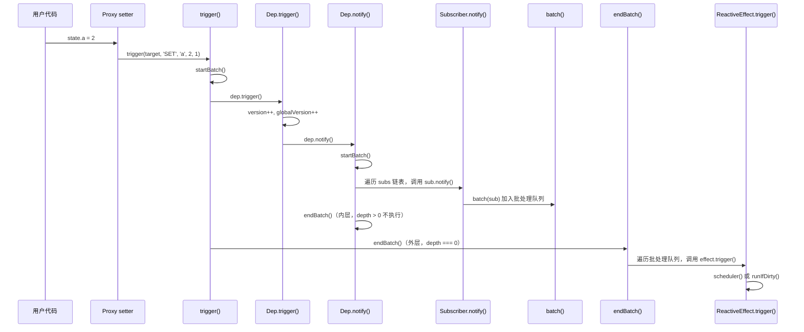

#### cleanupEffect：副作用清理回调

##### onEffectCleanup API

Vue 3.5 提供了 `onEffectCleanup()` API，用于注册在 effect 下次重新执行前需要运行的清理函数：

```ts
export function onEffectCleanup(fn: () => void, failSilently = false): void {
  if (activeSub instanceof ReactiveEffect) {
    activeSub.cleanup = fn
  } else if (__DEV__ && !failSilently) {
    warn(
      `onEffectCleanup() was called when there was no active effect` +
        ` to associate with.`,
    )
  }
}
```

##### cleanupEffect 函数

在 `run()` 开始时，会先执行上一次注册的清理函数：

```ts
function cleanupEffect(e: ReactiveEffect) {
  const { cleanup } = e
  e.cleanup = undefined
  if (cleanup) {
    const prevSub = activeSub
    activeSub = undefined  // 清理期间暂停依赖收集
    try {
      cleanup()
    } finally {
      activeSub = prevSub  // 恢复依赖收集
    }
  }
}
```

注意关键细节：清理函数执行期间 `activeSub` 被临时置为 `undefined`，这意味着清理函数内部的响应式属性访问**不会触发依赖收集**。

##### onWatcherCleanup API

除了 `onEffectCleanup`，Vue 3.5 还新增了专门用于 `watch` 的 `onWatcherCleanup`：

```ts
const cleanupMap: WeakMap<ReactiveEffect, (() => void)[]> = new WeakMap()
let activeWatcher: ReactiveEffect | undefined = undefined

export function onWatcherCleanup(
  cleanupFn: () => void,
  failSilently = false,
  owner: ReactiveEffect | undefined = activeWatcher,
): void {
  if (owner) {
    let cleanups = cleanupMap.get(owner)
    if (!cleanups) cleanupMap.set(owner, (cleanups = []))
    cleanups.push(cleanupFn)
  } else if (__DEV__ && !failSilently) {
    warn(
      `onWatcherCleanup() was called when there was no active watcher` +
        ` to associate with.`,
    )
  }
}
```

与 `onEffectCleanup` 不同，`onWatcherCleanup` 支持注册**多个**清理回调（通过数组存储），并且可以通过第三个参数 `owner` 指定关联的 effect。

使用示例：

```ts
watch(id, (newId, oldId, onCleanup) => {
  const controller = new AbortController()

  fetch(`/api/${newId}`, { signal: controller.signal })
    .then(res => res.json())
    .then(data => {
      // 处理数据
    })

  // 注册清理回调：下次 watch 触发前取消上一次请求
  onCleanup(() => controller.abort())
})
```

#### ReactiveEffect 的其他能力

##### stop()：停止副作用

```ts
stop(): void {
  if (this.flags & EffectFlags.ACTIVE) {
    // 从所有 dep 的 subs 链表中移除自己
    for (let link = this.deps; link; link = link.nextDep) {
      removeSub(link)
    }
    this.deps = this.depsTail = undefined
    // 执行清理回调
    cleanupEffect(this)
    // 执行 onStop 回调
    this.onStop && this.onStop()
    // 移除 ACTIVE 标记
    this.flags &= ~EffectFlags.ACTIVE
  }
}
```

##### pause() / resume()：暂停和恢复

Vue 3.5 新增了 effect 的暂停/恢复能力：

```ts
pause(): void {
  this.flags |= EffectFlags.PAUSED
}

resume(): void {
  if (this.flags & EffectFlags.PAUSED) {
    this.flags &= ~EffectFlags.PAUSED
    if (pausedQueueEffects.has(this)) {
      pausedQueueEffects.delete(this)
      this.trigger()  // 恢复时触发一次
    }
  }
}
```

暂停的 effect 在收到通知时不会立即执行，而是被加入 `pausedQueueEffects` 集合，等 `resume()` 时再统一触发。

##### isDirty()：脏检查

```ts
function isDirty(sub: Subscriber): boolean {
  for (let link = sub.deps; link; link = link.nextDep) {
    if (
      link.dep.version !== link.version ||
      (link.dep.computed &&
        (refreshComputed(link.dep.computed) ||
          link.dep.version !== link.version))
    ) {
      return true
    }
  }
  if (sub._dirty) return true
  return false
}
```

脏检查的核心逻辑：遍历 effect 的所有 deps，如果任何一个 `dep.version !== link.version`（说明 dep 自上次 run 后被修改过），或者关联的 computed 需要刷新，则认为该 effect 是"脏"的，需要重新执行。

#### EffectScope：作用域管理

##### 为什么需要 EffectScope？

在组件卸载或组合式函数清理时，需要统一销毁其内部创建的所有 effect、computed 和 watch。如果手动逐个调用 `stop()`，既繁琐又容易遗漏。`EffectScope` 就是用来解决这个问题。

##### EffectScope 类

```ts
export class EffectScope {
  private _active = true
  effects: ReactiveEffect[] = []
  cleanups: (() => void)[] = []
  private _isPaused = false
  parent: EffectScope | undefined
  scopes: EffectScope[] | undefined
  private index: number | undefined

  constructor(public detached = false) {
    this.parent = activeEffectScope
    // 非独立作用域自动注册到父作用域
    if (!detached && activeEffectScope) {
      this.index =
        (activeEffectScope.scopes || (activeEffectScope.scopes = [])).push(this) - 1
    }
  }

  run<T>(fn: () => T): T | undefined {
    if (this._active) {
      const currentEffectScope = activeEffectScope
      try {
        activeEffectScope = this
        return fn()
      } finally {
        activeEffectScope = currentEffectScope
      }
    }
  }

  stop(fromParent?: boolean): void {
    if (this._active) {
      this._active = false
      // 停止所有 effect
      for (let i = 0; i < this.effects.length; i++) {
        this.effects[i].stop()
      }
      this.effects.length = 0
      // 执行所有清理函数
      for (let i = 0; i < this.cleanups.length; i++) {
        this.cleanups[i]()
      }
      this.cleanups.length = 0
      // 递归停止子作用域
      if (this.scopes) {
        for (let i = 0; i < this.scopes.length; i++) {
          this.scopes[i].stop(true)
        }
        this.scopes.length = 0
      }
      // 从父作用域中移除自己
      if (!this.detached && this.parent && !fromParent) {
        const last = this.parent.scopes!.pop()
        if (last && last !== this) {
          this.parent.scopes![this.index!] = last
          last.index = this.index!
        }
      }
      this.parent = undefined
    }
  }

  pause(): void { /* 暂停所有子 effect */ }
  resume(): void { /* 恢复所有子 effect */ }
}
```

##### EffectScope 的工作流程

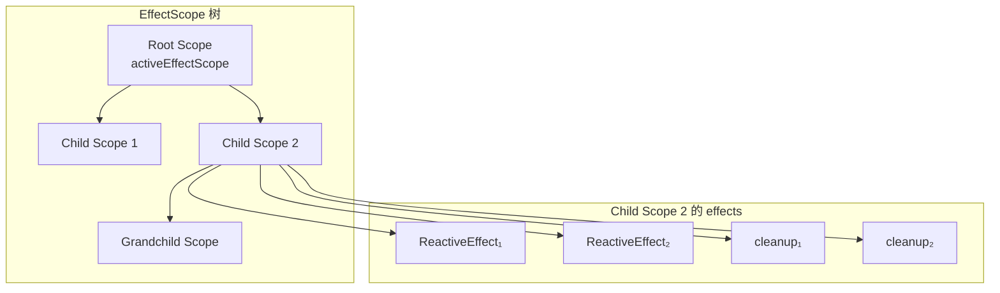

当调用 `childScope2.stop()` 时：

1. 停止 `effects` 数组中的所有 `ReactiveEffect`
2. 执行 `cleanups` 数组中的所有清理函数
3. 递归停止所有子 `scopes`
4. 从父 scope 的 `scopes` 数组中移除自己（O(1) 交换删除）

##### 自动注册机制

在 `ReactiveEffect` 的构造函数中，会自动将自身注册到当前的 `activeEffectScope`：

```ts
constructor(public fn: () => T) {
  if (activeEffectScope && activeEffectScope.active) {
    activeEffectScope.effects.push(this)
  }
}
```

这意味着在 `effectScope.run(fn)` 内创建的所有 `ReactiveEffect`（包括 `watch`、`computed` 底层创建的 effect）都会被自动收集到该 scope 中。

##### 使用示例

```ts
const scope = effectScope()

scope.run(() => {
  // 这些 effect 会自动注册到 scope
  effect(() => console.log('effect 1'))
  effect(() => console.log('effect 2'))

  const sum = computed(() => /* ... */)

  watch(source, () => { /* ... */ })

  onScopeDispose(() => {
    console.log('scope 被销毁了')
  })
})

// 一键清理
scope.stop()
// 所有 effect、computed、watch 都会被停止
// onScopeDispose 注册的回调也会被执行
```

#### 跟踪控制：pauseTracking / enableTracking / resetTracking

Vue 提供了三个工具函数来控制依赖收集的开关：

```ts
export let shouldTrack = true
const trackStack: boolean[] = []

export function pauseTracking(): void {
  trackStack.push(shouldTrack)
  shouldTrack = false
}

export function enableTracking(): void {
  trackStack.push(shouldTrack)
  shouldTrack = true
}

export function resetTracking(): void {
  const last = trackStack.pop()
  shouldTrack = last === undefined ? true : last
}
```

这些函数使用栈来保存/恢复 `shouldTrack` 状态，支持嵌套调用。它们在内部被广泛使用，例如：

- `ref` 的 `value` setter 中会临时暂停追踪
- 数组方法 `includes`/`indexOf`/`lastIndexOf` 的内部查找过程中会暂停追踪
- `cleanupEffect` 中清理函数执行期间不应收集依赖（通过 `activeSub = undefined` 实现）

#### 全景回顾

将本章涉及的所有概念串联起来，Vue 3.5 的响应式副作用系统可以用以下流程图概括：

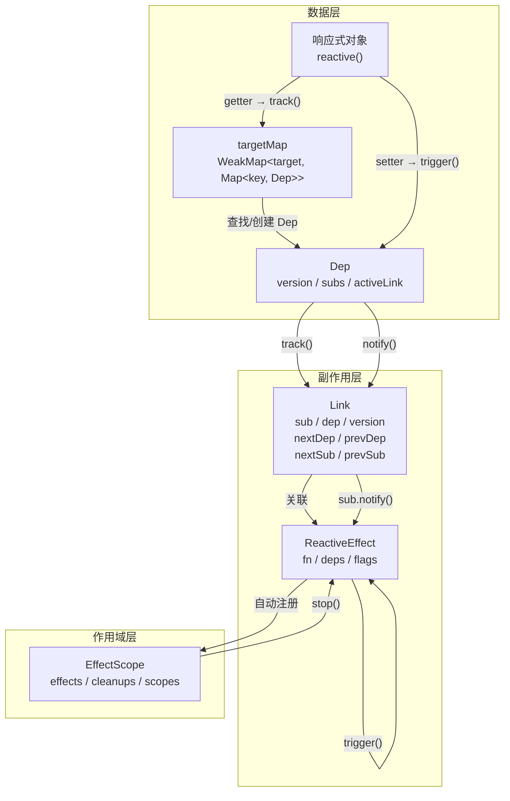

##### Vue 2 vs Vue 3.5 响应式对比

| 维度 | Vue 2 | Vue 3.5 |
|---|---|---|
| 数据劫持 | `Object.defineProperty` | `Proxy` |
| 依赖载体 | `Watcher` 实例 | `ReactiveEffect` / `Subscriber` |
| 依赖存储 | `Dep.subs` (数组) + `Watcher.deps` (数组) | `Dep.subs` (链表) + `Subscriber.deps` (链表) |
| 关联结构 | Dep 和 Watcher 直接引用 | Dep 和 Subscriber 通过 `Link` 双向链表连接 |
| 依赖清理 | 无（不清理过期依赖） | 版本计数 + `prepareDeps` / `cleanupDeps` |
| 嵌套处理 | 无专门处理 | `prevEffect` 栈式保存恢复 |
| 作用域 | 无（组件级 Watcher） | `EffectScope` 树形管理 |
| 批处理 | 队列 + nextTick | `startBatch` / `endBatch` + 链表 |
| computed | 独立 Watcher | `ComputedRefImpl` 实现 `Subscriber` 接口，Lazy Effect |

##### 核心流程总结

1. **创建阶段**：`effect()` → `new ReactiveEffect(fn)` → 自动注册到 `activeEffectScope` → `e.run()`
2. **收集阶段**：`run()` → `prepareDeps()` → `fn()` 执行 → 访问响应式属性 → `track()` → `dep.track()` → 创建/复用 `Link` → `addSub()`
3. **清理阶段**：`fn()` 完成 → `cleanupDeps()` → 移除 `version === -1` 的无效 Link
4. **触发阶段**：修改响应式属性 → `trigger()` → `dep.trigger()` → `dep.notify()` → `sub.notify()` → `batch()` → `endBatch()` → `effect.trigger()` → `run()` / `scheduler()`
5. **销毁阶段**：`effect.stop()` → 从所有 dep 的 subs 链表移除 → `cleanupEffect()` → 或 `scope.stop()` → 批量停止所有 effect

Vue 3.5 的响应式系统通过**版本计数 + 双向链表**的设计，在保持功能完整性的同时，大幅降低了内存开销和操作复杂度，消除了旧版二进制位标记方案对嵌套层级的限制，并引入了 Lazy Effect、批处理优化、暂停/恢复等重要特性，使得整个响应式系统更加健壮和高效。

### 调度器与 nextTick

#### 从 setter 到调度：scheduler 的诞生

我们小册第四节介绍"组件更新策略"时，提到了 `setupRenderEffect` 函数。当时为了方便介绍组件的更新策略，简写了 `instance.update` 的创建过程。在 Vue 3.5.x 中，我们来详细看看它的完整实现：

```ts
const setupRenderEffect = (
  instance,
  initialVNode,
  container,
  anchor,
  parentSuspense,
  isSVG,
  optimized,
) => {
  function componentUpdateFn() {
    if (!instance.isMounted) {
      // 挂载组件
    } else {
      // 更新组件
    }
  }

  // 创建响应式副作用
  const effect = (instance.effect = new ReactiveEffect(
    componentUpdateFn,
    () => queueJob(update),
    instance.scope, // 组件作用域
  ))

  // 生成 instance.update 函数
  const update: SchedulerJob = (instance.update = () => effect.run())
  update.id = instance.uid

  // 允许递归更新
  toggleRecurse(instance, true)

  // 首次执行
  update()
}
```

可以看到，Vue 3.5.x 中直接使用 `new ReactiveEffect()` 创建副作用实例，而不再是早期版本中的 `effect()` 工厂函数。`ReactiveEffect` 构造函数接收三个参数：

| 参数 | 说明 |
|------|------|
| `fn` | 副作用函数，即 `componentUpdateFn` |
| `scheduler` | 调度函数，即 `() => queueJob(update)` |
| `scope` | 效果作用域，即 `instance.scope` |

其中 `scheduler` 是关键——它的存在改变了 `effect` 被触发时的执行路径。当我们触发 `proxy setter` 时，最终会调用 effect 的 `trigger()` 方法（Vue 3.5 中由 `Dep.notify` 触发，见前文批处理机制）：

```ts
// ReactiveEffect 的 trigger 方法（Vue 3.5）
trigger(): void {
  if (this.flags & EffectFlags.PAUSED) {
    pausedQueueEffects.add(this) // 暂停状态：挂起，等待 resume() 统一触发
  } else if (this.scheduler) {
    this.scheduler() // 有调度器（如组件更新的 queueJob），走调度路径
  } else {
    this.runIfDirty() // 无调度器：脏检查后重新 run
  }
}
```

逻辑很清晰：如果 `effect` 上有 `scheduler` 属性，则执行 `scheduler()`，否则经过脏检查后直接执行 `run()` 进行同步更新。因为组件的 `effect` 总是带有 `scheduler`，所以触发 setter 后，不会立即执行 `componentUpdateFn`，而是走了调度路径 `queueJob(update)`。

这正是 Vue 异步更新机制的入口——**把同步的多次触发，转化为异步的一次批量更新**。

#### queueJob：去重与有序的更新队列

```ts
export function queueJob(job: SchedulerJob) {
  // 判断当前 job 是否已经在队列中
  if (
    !queue.length ||
    !queue.includes(
      job,
      isFlushing && job.allowRecurse ? flushIndex + 1 : flushIndex,
    )
  ) {
    if (job.id == null) {
      queue.push(job)
    } else {
      // 按 id 升序插入，保证父组件先于子组件
      queue.splice(findInsertionIndex(job.id), 0, job)
    }
    queueFlush()
  }
}
```

`queueJob` 的职责是向 `queue` 队列中添加 `job`（即前面提到的 `update` 对象）。它有三个核心设计：

##### 1. 去重机制

通过 `queue.includes(job, ...)` 判断当前 `job` 是否已存在于队列中。如果存在则跳过，这就是**为什么循环 1000 次 `setter`，`update` 函数只会被添加一次到队列中**。

去重时有一个细节：当队列正在刷新（`isFlushing = true`）且 `job.allowRecurse = true` 时，搜索起始位置设为 `flushIndex + 1`，这意味着不会搜索到当前正在执行的 job 自身，从而允许递归更新。

什么场景需要递归更新？看下面的例子：

```html
<!-- 父组件 -->
<template>
  <div>{{ msg }}</div>
  <Child />
</template>
<script setup>
import { ref, provide } from 'vue'
import Child from './Child.vue'

const msg = ref('initial')
provide('CONTEXT', { msg })
</script>

<!-- 子组件 Child -->
<template>
  <div>child</div>
</template>
<script setup>
import { inject } from 'vue'

const ctx = inject('CONTEXT')
ctx.msg.value = 'updated' // 子组件内修改父组件状态
</script>
```

父组件先进入队列并开始渲染，然后渲染子组件，但子组件内部修改了父组件的状态 `msg`。此时父组件需要支持递归渲染，即递归更新。

> 注意，这种模式已经打破了单向数据流，**过多的递归更新可能导致性能下降，应尽量避免。**

##### 2. 按 id 有序插入

如果 `job.id` 存在，则通过 `findInsertionIndex` 找到合适的插入位置，保证队列按 `id` 升序排列。因为父组件总是先于子组件创建，所以**父组件的 uid 小于子组件的 uid，从而保证父组件永远比子组件先更新**。

##### 3. 触发队列刷新

每次成功添加 job 后，都会调用 `queueFlush()` 来确保队列会被异步执行。

回到开头的例子：当 `for` 循环 1000 次 `setter` 时，第一次 `setter` 触发 `triggerEffect` -> `scheduler()` -> `queueJob(update)`，`update` 被加入队列；后续 999 次 `setter` 触发同样的流程，但因为去重判断，`update` 不会重复入队。**所以无论循环多少次，同一个组件的渲染更新函数只会执行一次。**

#### queueFlush：微任务调度

上面我们知道了同一组件的 `update` 只会被添加一次到队列中。但细心的读者可能会有疑问：**为什么视图不是从 0 -> 1 而是直接从 0 -> 1000？**

要回答这个问题，就得了解 `queue` 的异步执行机制，也就是 `queueJob` 最后一步调用的 `queueFlush`：

```ts
function queueFlush() {
  if (!isFlushing && !isFlushPending) {
    isFlushPending = true
    currentFlushPromise = resolvedPromise.then(flushJobs)
  }
}
```

这段代码非常精炼，但信息量很大：

- `isFlushing`：队列是否正在刷新中
- `isFlushPending`：是否已经有微任务在等待执行
- `resolvedPromise.then(flushJobs)`：通过 `Promise.then` 创建微任务

Vue 3 完全抛弃了 Vue 2 的降级方案（`Promise > MutationObserver > setImmediate > setTimeout`），只使用 `Promise.then` 这一种微任务方案。这意味着 `flushJobs` 不会在当前同步代码执行期间运行，而是在当前宏任务结束后、下一个宏任务开始前的微任务队列中执行。

整个调度流程可以用下面的时序图来表示：

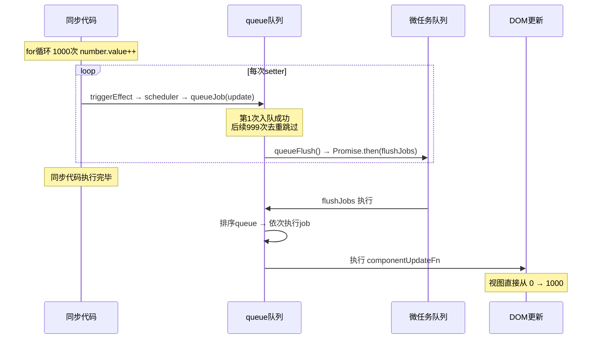

正是因为 `flushJobs` 是微任务，所以在 `for` 循环中的所有 1000 次 `setter` 都会先同步执行完毕，将 `number` 的值从 0 递增到 1000，然后才在微任务中执行更新函数。此时 `number` 的值已经是 1000 了，所以视图直接从 0 更新到 1000。

#### flushJobs：队列刷新的核心

`flushJobs` 是队列刷新的核心函数，负责按序执行队列中的所有任务：

```ts
function flushJobs(seen?: CountMap) {
  isFlushPending = false
  isFlushing = true

  // 排序确保：
  // 1. 父组件先于子组件更新（父组件 id 更小）
  // 2. 如果父组件在更新前卸载了子组件，子组件的更新会被跳过
  queue.sort(comparator)

  try {
    for (flushIndex = 0; flushIndex < queue.length; flushIndex++) {
      const job = queue[flushIndex]
      if (job && job.active !== false) {
        callWithErrorHandling(job, null, ErrorCodes.SCHEDULER)
      }
    }
  } finally {
    flushIndex = 0
    queue.length = 0

    // 执行后置回调队列
    flushPostFlushCbs(seen)

    isFlushing = false
    currentFlushPromise = null

    // 如果在刷新过程中又有新任务入队，继续递归执行
    if (queue.length || pendingPostFlushCbs.length) {
      flushJobs(seen)
    }
  }
}
```

Vue 的更新过程分为三个阶段，每个阶段执行不同类型的任务：

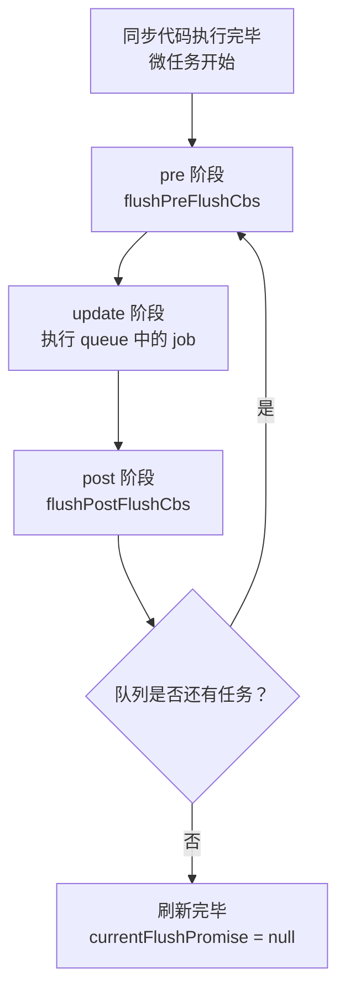

##### pre 阶段：更新前

`pre` 阶段是在组件更新**之前**执行的阶段。默认情况下，`watch` 和 `watchEffect` 的回调函数都在这个阶段执行。我们看看 `watch` 源码中关于调度策略的实现：

```ts
function watch<T>(
  source: T | WatchSource<T>,
  cb: WatchCallback<T>,
  options?: WatchOptions,
): StopHandle {
  // ...
  if (flush === 'sync') {
    // 同步执行
    scheduler = job
  } else if (flush === 'post') {
    // 更新后执行
    scheduler = () => queuePostRenderEffect(job, instance && instance.suspense)
  } else {
    // 默认：更新前执行
    job.pre = true
    if (instance) job.id = instance.uid
    scheduler = () => queueJob(job)
  }
}
```

可以看到 `watch` 的 `job` 默认被打上 `pre` 标签。带 `pre` 标签的 `job` 会在组件渲染前被提前执行：

```ts
export function flushPreFlushCbs(
  seen?: CountMap,
  i = isFlushing ? flushIndex + 1 : 0,
) {
  for (; i < queue.length; i++) {
    const cb = queue[i] as SchedulerJob
    if (cb && cb.pre) {
      queue.splice(i, 1)
      i--
      cb()
    }
  }
}
```

`flushPreFlushCbs` 会遍历 `queue`，找到所有带 `pre` 标记的 `job`，将其从队列中移除并立即执行。

##### update 阶段：更新中

更新中的过程就是 `flushJobs` 函数体的核心逻辑：

1. 通过 `comparator` 对 `queue` 队列排序，保证父组件优先于子组件执行
2. 通过 `callWithErrorHandling` 执行每一个 `job`，该函数包裹了错误处理逻辑：

```ts
export function callWithErrorHandling(
  fn: Function,
  instance: ComponentInternalInstance | null,
  type: ErrorTypes,
  args?: unknown[],
) {
  let res
  try {
    res = args ? fn(...args) : fn()
  } catch (err) {
    handleError(err, instance, type)
  }
  return res
}
```

3. 通过 `job.active !== false` 来跳过已被卸载（`unmount`）的组件

##### post 阶段：更新后

页面更新完成后需要执行的回调存储在 `pendingPostFlushCbs` 中，通过 `flushPostFlushCbs` 统一执行：

```ts
export function flushPostFlushCbs(seen?: CountMap) {
  if (pendingPostFlushCbs.length) {
    // 去重
    const deduped = [...new Set(pendingPostFlushCbs)]
    pendingPostFlushCbs.length = 0

    // 已存在 activePostFlushCbs，嵌套调用直接合并
    if (activePostFlushCbs) {
      activePostFlushCbs.push(...deduped)
      return
    }

    activePostFlushCbs = deduped
    // 按 id 升序排列
    activePostFlushCbs.sort((a, b) => getId(a) - getId(b))

    for (
      postFlushIndex = 0;
      postFlushIndex < activePostFlushCbs.length;
      postFlushIndex++
    ) {
      activePostFlushCbs[postFlushIndex]()
    }

    activePostFlushCbs = null
    postFlushIndex = 0
  }
}
```

一些需要在渲染完成后才执行的钩子都在这个阶段运行，比如 `mounted`、`updated` 等。

#### nextTick：在 DOM 更新后执行回调

理解了上面的调度机制，`nextTick` 的实现就水到渠成了：

```ts
export function nextTick<T = void>(
  this: T,
  fn?: (this: T) => void,
): Promise<void> {
  const p = currentFlushPromise || resolvedPromise
  return fn ? p.then(this ? fn.bind(this) : fn) : p
}
```

`nextTick` 的本质就是将回调函数放入 `currentFlushPromise` 的 `then` 回调中。`currentFlushPromise` 是什么？回顾 `queueFlush`：

```ts
function queueFlush() {
  if (!isFlushing && !isFlushPending) {
    isFlushPending = true
    currentFlushPromise = resolvedPromise.then(flushJobs)
  }
}
```

`currentFlushPromise` 就是 `flushJobs` 微任务的 `Promise`。所以 `nextTick(fn)` 等价于 `Promise.then(fn)`，而 `then` 回调会在 `flushJobs` 执行完毕后触发，也就是在 DOM 更新完成后触发。

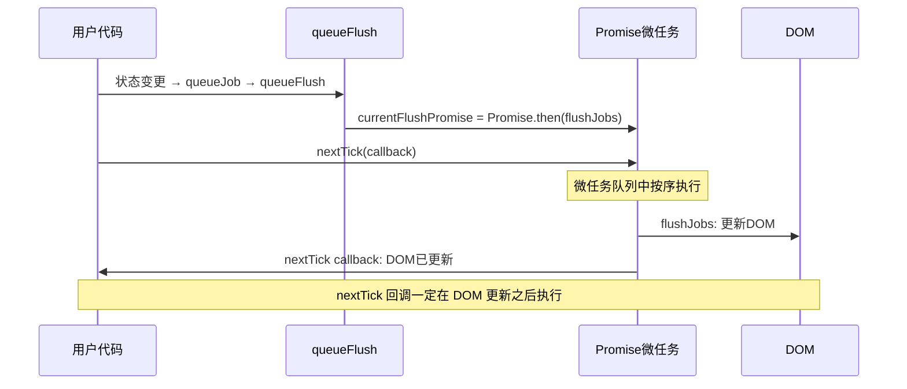

这就是为什么我们可以在 `nextTick` 的回调中安全地访问更新后的 DOM：

```html
<script setup>
import { ref, nextTick } from 'vue'

const count = ref(0)

async function increment() {
  count.value++
  // DOM 还未更新
  console.log(document.querySelector('.count')?.textContent) // 0

  await nextTick()
  // DOM 已更新
  console.log(document.querySelector('.count')?.textContent) // 1
}
</script>
```

#### 完整的更新调度流程

将前面所有的内容串联起来，我们得到了 Vue 3.5.x 中从状态变更到视图更新的完整调度流程：

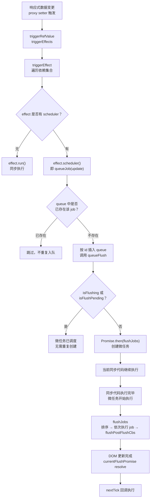


### watch 函数实现

#### 标准化 source

先来看一下 `watch` 函数实现的代码：

```ts
function watch(
  source,
  cb,
  options
) {
  // ...
  return doWatch(source, cb, options)
}

function doWatch(
  source,
  cb,
  { immediate, deep, flush, onTrack, onTrigger } = EMPTY_OBJ
) {
  // ...
}
```

`watch` 函数内部是通过 `doWatch` 来执行的，在分析 `doWatch` 函数实现前，我们先看看前面的示例中，`watch` 监听的 `source` 可以是多种类型，一个函数可以支持多种类型的参数入参，那么实现该函数最好的设计模式就是 `adapter` 代理模式。就是将底层模型设计成一致的，抹平调用差异，这也是 `doWatch` 函数实现的第一步：标准化 `source` 参数。

下面分析其中的实现：

```ts
function doWatch(
  source,
  cb,
  { immediate, deep, flush, onTrack, onTrigger } = EMPTY_OBJ
) {
  // ...
  // source 不合法的时候警告函数
  const warnInvalidSource = (s: unknown) => {
    warn(
      `Invalid watch source: `,
      s,
      `A watch source can only be a getter/effect function, a ref, ` +
        `a reactive object, or an array of these types.`
    )
  }

  const instance = currentInstance
  let getter
  let forceTrigger = false
  let isMultiSource = false

  // 判断是不是 ref 类型
  if (isRef(source)) {
    getter = () => source.value
    forceTrigger = isShallow(source)
  }
  // 判断是不是响应式对象
  else if (isReactive(source)) {
    getter = () => source
    deep = true
  }
  // 判断是不是数组类型
  else if (isArray(source)) {
    isMultiSource = true
    forceTrigger = source.some(s => isShallow(s) || isReactive(s))
    getter = () =>
      source.map(s => {
        if (isRef(s)) {
          return s.value
        } else if (isReactive(s)) {
          return traverse(s)
        } else if (isFunction(s)) {
          return callWithErrorHandling(s, instance, ErrorCodes.WATCH_GETTER)
        } else {
          __DEV__ && warnInvalidSource(s)
        }
      })
  }
  // 判断是不是函数类型
  else if (isFunction(source)) {
    if (cb) {
      // getter with cb
      getter = () =>
        callWithErrorHandling(source, instance, ErrorCodes.WATCH_GETTER)
    } else {
      // 如果只有一个函数作为 source 入参，则执行 watchEffect 的逻辑
      // ...
    }
  }
  // 都不符合，则告警
  else {
    getter = NOOP
    __DEV__ && warnInvalidSource(source)
  }

  // 深度监听
  if (cb && deep) {
    const baseGetter = getter
    getter = () => traverse(baseGetter())
  }

  // ...
}
```

由于 `doWatch` 函数代码量比较多，我们先一部分一部分地来解读，这里我们只关注于标准化 `source` 的逻辑。可以看到 `doWatch` 函数会对入参的 `source` 做不同类型的判断逻辑，然后生成一个统一的 `getter` 函数：

| source 类型 | getter 构造 | 附加行为 |
|---|---|---|
| `ref` | `() => source.value` | `forceTrigger = isShallow(source)` |
| `reactive` 对象 | `() => source` | `deep = true` |
| 数组 | `() => source.map(s => ...)` | `isMultiSource = true` |
| 函数（有 cb） | `() => callWithErrorHandling(source, ...)` | - |
| 函数（无 cb） | 走 `watchEffect` 逻辑 | - |
| 其他 | `NOOP` | 开发环境告警 |

`getter` 函数就是简单地对不同数据类型设置一个访问 `source` 的操作，比如对于 `ref` 就是一个创建了一个访问 `source.value` 的函数。

那么为什么需要**访问**？由之前的响应式原理我们知道，只有在触发 `proxy getter` 的时候，才会进行依赖收集，所以，这里标准化的 `source` 函数中，不管是什么类型的 `source` 都会设计一个访问器函数。

另外，需要注意的是当 `source` 是个响应式对象时，源码中会同时设置 `deep = true`。这是因为对于响应式对象，需要进行深度监听，因为响应式对象中的属性变化时，都需要进行反馈。深度监听是如何实现的？在回答这个问题之前，我们前面说了监听一个对象的属性就是需要先访问对象的属性，触发 `proxy getter`，把副作用 `cb` 收集起来。源码中则是通过 `traverse` 函数来实现对响应式对象属性的遍历访问：

```ts
export function traverse(value: unknown, seen?: Set<unknown>) {
  if (!isObject(value) || (value as any)[ReactiveFlags.SKIP]) {
    return value
  }
  seen = seen || new Set()
  if (seen.has(value)) {
    return value
  }
  seen.add(value)
  if (isRef(value)) {
    // 如果是 ref 类型，继续递归执行 .value 值
    traverse(value.value, seen)
  } else if (isArray(value)) {
    // 如果是数组类型
    for (let i = 0; i < value.length; i++) {
      // 递归调用 traverse 进行处理
      traverse(value[i], seen)
    }
  } else if (isPlainObject(value)) {
    // 如果是对象，使用 for in 读取对象的每一个值，并递归调用 traverse 进行处理
    for (const key in value) {
      traverse((value as any)[key], seen)
    }
  }
  return value
}
```

#### 构造副作用 effect

前面说到，我们通过一系列操作，标准化了用户传入的 `source` 成了一个 `getter` 函数，此时的 `getter` 函数一方面还没有真正执行，也就没有触发对属性的访问操作。

`watch` 的本质是对数据源进行依赖收集，当依赖变化时，回调执行 `cb` 函数并传入新旧值。所以我们需要构造一个副作用函数，完成对数据源的变化追踪：

```ts
function doWatch(
  source,
  cb,
  { immediate, deep, flush, onTrack, onTrigger } = EMPTY_OBJ
) {
  // ...
  const effect = new ReactiveEffect(getter, scheduler)
}
```

这里的 `getter` 就是前面构造的属性访问函数，我们在介绍响应式原理的章节中，介绍过 `ReactiveEffect` 类，这里再来回顾一下它的构造与执行（Vue 3.5 稳定版实现，即前文介绍的基于 `flags` 位标志与 `Link` 双向链表的版本）：

```ts
class ReactiveEffect<T = any> implements Subscriber {
  constructor(
    public fn: () => T,
    public scheduler: EffectScheduler | null = null,
    scope?: EffectScope
  ) {
    recordEffectScope(this, scope)
  }

  run(): T {
    // ...（完整实现见前文 run() 方法解析）
    // 设置 activeSub = this 后执行 this.fn()
    // 此处 fn 即 watch 构造的 getter，完成对 watch source 的访问与依赖收集
  }
}
```

这里细节部分可以详细阅读响应式原理的部分，我们只需要知道这里的 `ReactiveEffect` 的 `run` 函数内部执行了 `this.fn()` 也就是上面传入的 `getter` 函数，所以，本质上是在此时完成了对 `watch source` 的访问。

Vue 3.5 对 `ReactiveEffect` 的依赖管理进行了重要重构：依赖不再存储于 `Dep[]` 数组中全量重建，而是通过 `Link` 双向链表 + 版本计数实现增量清理（`prepareDeps` / `cleanupDeps`，见前文），effect 重跑时只处理实际变化的依赖。这对于 `watch` 的性能也有直接的提升。

然后再看一下 `ReactiveEffect` 的第二个参数 `scheduler`，是如何构造？

#### 构造 scheduler 调度

```ts
function doWatch(
  source,
  cb,
  { immediate, deep, flush, onTrack, onTrigger } = EMPTY_OBJ
) {
  // ...
  let oldValue = isMultiSource
    ? new Array((source as []).length).fill(INITIAL_WATCHER_VALUE)
    : INITIAL_WATCHER_VALUE

  // Vue 3.5：声明 onCleanup 用于清理副作用
  let onCleanup: OnCleanup | undefined

  const job = () => {
    // 被卸载
    if (!effect.active) {
      return
    }
    if (cb) {
      // Vue 3.5：获取新值
      const newValue = effect.run()
      // 如果新值与旧值相同，且不是多数据源也不是深度监听，则跳过回调
      if (
        isMultiSource
          ? (newValue as unknown[]).some(v => v !== oldValue)
          : newValue !== oldValue
      ) {
        // 执行 cb 函数
        callWithAsyncErrorHandling(cb, instance, ErrorCodes.WATCH_CALLBACK, [
          newValue,
          // 第一次更改时传递旧值为 undefined
          oldValue === INITIAL_WATCHER_VALUE
            ? undefined
            : isMultiSource && (oldValue as unknown[])[0] === INITIAL_WATCHER_VALUE
              ? []
              : oldValue,
          onCleanup
        ])
        oldValue = newValue
      }
    } else {
      // watchEffect
      effect.run()
    }
  }

  let scheduler: EffectScheduler
  if (flush === 'sync') {
    scheduler = job as any
  } else if (flush === 'post') {
    scheduler = () => queuePostRenderEffect(job, instance && instance.suspense)
  } else {
    // 默认是渲染更新之前执行
    job.pre = true
    if (instance) job.id = instance.uid
    scheduler = () => queueJob(job)
  }
}
```

> `scheduler` 我们在批量调度更新章节有简单介绍过，本质这里是根据不同的 `watch options` 中的 `flush` 参数来设置不同的调度节点，这里默认是渲染更新前执行，也就是在异步更新队列 `queue` 执行前执行。

`scheduler` 核心就是将 `job` 放入异步执行队列中，但有个特殊，也就是 `flush = 'sync'` 时，是放入同步执行的。那么 `job` 究竟是什么？

上述代码的注释已经很详尽了，`job` 其实就是一个用来执行回调函数 `cb` 的函数而已，在执行 `cb` 的同时，传入了 `source` 的新旧值。

值得注意的是，`job` 函数中有一个优化判断：当新值与旧值相同时，不会触发回调函数的执行。这对于 `computed` 等场景特别重要，避免了不必要的回调执行。

#### cleanup 清理机制与 onWatcherCleanup

在 `watch` 的回调函数中，有时候我们需要执行一些清理操作，比如取消上一个异步请求、清除定时器等。在 Vue 3.5 之前，我们只能通过 `watch` 回调的第三个参数 `onCleanup` 来注册清理函数：

```ts
watch(idRef, (newId, oldId, onCleanup) => {
  const controller = new AbortController()
  fetch(`/api/${newId}`, { signal: controller.signal }).then(() => {
    // ...
  })
  // 注册清理函数，下次回调执行前调用
  onCleanup(() => controller.abort())
})
```

Vue 3.5 新增了 [onWatcherCleanup()](https://cn.vuejs.org/api/reactivity-core.html#onwatchercleanup) API，允许在 `watch` 回调的任意位置（包括异步函数中）注册清理函数，而不仅限于回调参数：

```ts
import { watch, onWatcherCleanup } from 'vue'

watch(idRef, async (newId) => {
  const controller = new AbortController()
  // 在异步函数中也能注册清理
  onWatcherCleanup(() => controller.abort())
  const response = await fetch(`/api/${newId}`, {
    signal: controller.signal
  })
  // ...
})
```

来看看 `onWatcherCleanup` 的源码实现：

```ts
// Vue 3.5 - packages/runtime-core/src/apiWatch.ts
const cleanupMap: WeakMap<ReactiveEffect, (() => void)[]> = new WeakMap()
let activeWatcher: ReactiveEffect | undefined = undefined

export function onWatcherCleanup(
  cleanupFn: () => void,
  failSilently = false,
  owner: ReactiveEffect | undefined = activeWatcher,
): void {
  if (owner) {
    let cleanups = cleanupMap.get(owner)
    if (!cleanups) {
      cleanupMap.set(owner, (cleanups = []))
    }
    cleanups.push(cleanupFn)
  } else if (__DEV__ && !failSilently) {
    warn(
      `onWatcherCleanup() was called when there was no active watcher` +
        ` to associate with.`
    )
  }
}
```

`onWatcherCleanup` 的核心原理是利用 Vue 内部维护的 `currentWatcher` 上下文变量。在 `doWatch` 的 `job` 执行期间，Vue 会设置当前 watcher 上下文，此时调用 `onWatcherCleanup` 就能将清理函数注册到正确的 watcher 上。

再看看 `doWatch` 中清理机制的相关实现：

```ts
function doWatch(
  source,
  cb,
  { immediate, deep, flush, onTrack, onTrigger } = EMPTY_OBJ
) {
  // ...
  let cleanup: (() => void) | undefined
  let onCleanup: OnCleanup = (fn: () => void) => {
    cleanup = effect.onStop = () => {
      callWithErrorHandling(fn, instance, ErrorCodes.WATCH_CLEANUP)
    }
  }

  const job = () => {
    if (!effect.active) return
    if (cb) {
      // 执行回调前先清理上一次的副作用
      if (cleanup) {
        cleanup()
        cleanup = undefined
      }
      const newValue = effect.run()
      // ...
    }
  }
  // ...
}
```

可以看到，每次 `job` 执行回调前，都会先执行上一次注册的 `cleanup` 函数，确保上一次的副作用被正确清理。而 `effect.onStop` 则确保在 watcher 被停止时（如组件卸载），清理函数也会被执行。

#### effect run 函数执行

前面我们说到了，`ReactiveEffect` 内部的 `run` 函数，执行了依赖访问的 `getter` 函数，所以 `run` 函数是如何被执行？

```ts
function doWatch(
  source,
  cb,
  { immediate, deep, flush, onTrack, onTrigger } = EMPTY_OBJ
) {
  // ...
  // 如果存在 cb
  if (cb) {
    // 立即执行
    if (immediate) {
      // 首次直接执行 job
      job()
    } else {
      // 执行 run 函数，获取旧值
      oldValue = effect.run()
    }
  } else {
    // watchEffect：直接执行 run
    effect.run()
  }
}
```

可以看到在执行 `effect.run` 的前面判断了是否是立即执行的模式，如果是立即执行，则直接执行上面的 `job` 函数，而此时的 `job` 函数是没有旧值的，所以此时执行的 `oldValue = undefined`。

#### 返回销毁函数

最后，会返回侦听器销毁函数，也就是 `watch API` 执行后返回的函数。我们可以通过调用它来停止 `watcher` 对数据的侦听。

```ts
function doWatch(
  source,
  cb,
  { immediate, deep, flush, onTrack, onTrigger } = EMPTY_OBJ
) {
  // ...
  const unwatch = () => {
    effect.stop()
    if (instance && instance.scope) {
      remove(instance.scope.effects!, effect)
    }
  }
  // ...
  return unwatch
}
```

销毁函数内部会执行 `effect.stop` 方法，用来停止对数据的 `effect` 响应。并且，如果是在组件中注册的 `watcher`，也会移除组件 `effects` 对这个 `runner` 的引用。

#### Vue 3.5：响应式 Props 解构与 watch

Vue 3.5 正式支持响应式 Props 解构：解构出的变量在编译期会被转换为对 `props.foo` 的属性访问，因此在 `watchEffect` 等运行时上下文中使用时依然保持响应式。

但要注意：**直接把解构后的 prop 变量传给 `watch` 并不会按预期工作**——这等价于 `watch(props.foo, ...)`，传入的是一个静态求值结果而非响应式源，Vue 编译器会捕捉这种情况并发出警告。正确做法是用 getter 包装：

```ts
// Vue 3.5+
const { foo, bar } = defineProps({ foo: String, bar: Number })

// ❌ 等价于 watch(__props.foo, ...)，不会响应变化
watch(foo, (newFoo) => { /* ... */ })

// ✅ 使用 getter 包装
watch(() => foo, (newFoo) => {
  console.log(`foo changed to ${newFoo}`)
})
```

其背后的原理是，Vue 3.5 在编译期将解构 props 的访问转换为 `__props.foo` 的属性访问，`watch(() => foo, ...)` 编译后即 `watch(() => __props.foo, ...)`，getter 每次执行都会重新访问 props 并完成依赖收集，从而正常工作。

#### 整体流程总结

下面用流程图来梳理 `watch` 函数的完整执行流程：

```mermaid
flowchart TD
    A["watch(source, cb, options)"] --> B["调用 doWatch()"]
    B --> C["标准化 source → 构造 getter"]
    C --> D{"source 类型?"}
    D -->|"ref"| E["getter = () => source.value"]
    D -->|"reactive"| F["getter = () => source, deep=true"]
    D -->|"array"| G["getter = () => source.map(...)"]
    D -->|"function"| H["getter = () => callWithErrorHandling(source)"]
    D -->|"其他"| I["getter = NOOP, 告警"]
    E & F & G & H & I --> J{"deep && cb?"}
    J -->|"是"| K["getter = () => traverse(baseGetter())"]
    J -->|"否"| L["保持原 getter"]
    K & L --> M["构造 ReactiveEffect(getter, scheduler)"]
    M --> N["构造 scheduler"]
    N --> O{"flush 值?"}
    O -->|"'sync'"| P["scheduler = job"]
    O -->|"'post'"| Q["scheduler = () => queuePostRenderEffect(job)"]
    O -->|"默认"| R["scheduler = () => queueJob(job)"]
    P & Q & R --> S{"immediate?"}
    S -->|"是"| T["立即执行 job()"]
    S -->|"否"| U["oldValue = effect.run()"]
    T & U --> V["返回 unwatch 销毁函数"]
```

当响应式数据发生变化时，触发流程如下：

```mermaid
flowchart TD
    A["响应式数据变更"] --> B["trigger 触发 effect.scheduler"]
    B --> C["scheduler 将 job 加入队列"]
    C --> D["job 执行"]
    D --> E{"effect.active?"}
    E -->|"否"| F["直接返回"]
    E -->|"是"| G{"有 cb?"}
    G -->|"否（watchEffect）"| H["effect.run()"]
    G -->|"是"| I["执行 cleanup 清理上一次副作用"]
    I --> J["newValue = effect.run()"]
    J --> K{"新旧值是否不同?"}
    K -->|"否"| L["跳过回调"]
    K -->|"是"| M["执行 cb(newValue, oldValue, onCleanup)"]
    M --> N["oldValue = newValue"]
```


### computed 函数实现

#### 构造 setter 和 getter

```ts
export function computed<T>(
  getterOrOptions: ComputedGetter<T> | WritableComputedOptions<T>,
  debugOptions?: DebuggerOptions,
  isSSR = false
) {
  let getter: ComputedGetter<T>
  let setter: ComputedSetter<T>

  // 判断第一个参数是不是一个函数
  const onlyGetter = isFunction(getterOrOptions)

  // 构造 setter 和 getter 函数
  if (onlyGetter) {
    getter = getterOrOptions
    // 如果第一个参数是一个函数，那么就是只读的
    setter = __DEV__
      ? () => {
          console.warn('Write operation failed: computed value is readonly')
        }
      : NOOP
  } else {
    getter = getterOrOptions.get
    setter = getterOrOptions.set
  }

  // 构造 ref 响应式对象
  const cRef = new ComputedRefImpl(getter, setter, onlyGetter || !setter, isSSR)

  // 开发环境下的调试选项
  if (__DEV__ && debugOptions && !isSSR) {
    cRef.effect.onTrack = debugOptions.onTrack
    cRef.effect.onTrigger = debugOptions.onTrigger
  }

  // 返回响应式 ref
  return cRef
}
```

可以看到，这段 `computed` 函数体最初就是需要格式化传入的参数，根据第一个参数入参的类型来构造统一的 `setter` 和 `getter` 函数，并传入 `ComputedRefImpl` 类中，进行实例化 `ref` 响应式对象。

接下来分析 `ComputedRefImpl` 是如何构造 `cRef` 响应式对象的。

#### 构造 cRef 响应式对象

```ts
// 以下为 Vue 3.4 及更早版本 ComputedRefImpl 的教学简化实现
// （Vue 3.5 已重构为 Subscriber 接口 + refreshComputed，见前文，核心思想一致）
class ComputedRefImpl<T> {
  public dep?: Dep = undefined

  private _value!: T
  public readonly effect: ReactiveEffect<T>

  // 表示 ref 类型
  public readonly __v_isRef = true
  // 是否只读
  public readonly [ReactiveFlags.IS_READONLY]: boolean

  // 用于控制是否进行值更新（代表是否脏值）
  public _dirty = true

  // 缓存标记
  public _cacheable: boolean

  constructor(
    getter: ComputedGetter<T>,
    _setter: ComputedSetter<T>,
    isReadonly: boolean,
    isSSR: boolean
  ) {
    // 把 getter 作为响应式依赖函数 fn 参数
    this.effect = new ReactiveEffect(getter, () => {
      if (!this._dirty) {
        this._dirty = true
        // 触发更新
        triggerRefValue(this)
      }
    })
    // 标记 effect 的 computed 属性
    this.effect.computed = this
    this.effect.active = this._cacheable = !isSSR
    this[ReactiveFlags.IS_READONLY] = isReadonly
  }

  get value() {
    const self = toRaw(this)
    // 依赖收集
    trackRefValue(self)
    if (self._dirty || !self._cacheable) {
      self._dirty = false
      // 更新值
      self._value = self.effect.run()!
    }
    return self._value
  }

  // 执行 setter
  set value(newValue: T) {
    this._setter(newValue)
  }
}
```

简单看一下该类的实现：在构造函数的时候，创建了一个副作用对象 `effect`。并为 `effect` 额外定义了一个 `computed` 属性指向当前响应式对象 `cRef`。

另外，定义了一个 `get` 方法，当我们通过 `ref.value` 取值的时候可以进行依赖收集，将定义的 `effect` 收集起来。

其次，定义了一个 `set` 方法，该方法就是执行传入进来的 `setter` 函数。

最后，熟悉 `Vue` 的开发者都知道 `computed` 的特性就在于能够缓存计算的值（提升性能），只有当 `computed` 的依赖发生变化时才会重新计算，否则读取 `computed` 的值则一直是之前的值。在源码这里，实现上述功能相关的变量分别是 `_dirty` 和 `_cacheable` 这 2 个，用来控制缓存的实现。

#### computed 的缓存与脏值机制

`computed` 的缓存机制核心在于 `_dirty` 标志位，下面通过流程图来展示其工作原理：

```mermaid
flowchart TD
    A["访问 computed.value"] --> B["trackRefValue 依赖收集"]
    B --> C{"_dirty === true?"}
    C -->|"是"| D["执行 effect.run() 重新计算"]
    D --> E["_dirty = false"]
    E --> F["返回 _value"]
    C -->|"否"| G{"_cacheable === true?"}
    G -->|"是"| F
    G -->|"否（SSR）"| D

    H["依赖数据变化"] --> I["触发 computed effect 的 scheduler"]
    I --> J{"_dirty === false?"}
    J -->|"是"| K["_dirty = true"]
    K --> L["triggerRefValue 触发下游副作用"]
    J -->|"否（已是脏值）"| M["无需重复触发"]
```

有了上面的介绍，我们来看一个具体的例子，看看 `computed` 是如何执行的：

```html
<template>
  <div>
    {{ plusOne }}
  </div>
  <button @click="plus">plus</button>
</template>
<script>
  import { ref, computed } from 'vue'
  export default {
    setup() {
      const num = ref(0)
      const plusOne = computed(() => {
        return num.value + 1
      })

      function plus() {
        num.value++
      }
      return {
        plusOne,
        plus
      }
    }
  }
</script>
```

**Step 1**：`setup` 函数体内，`computed` 函数执行，初始的过程中，生成了一个 `computed effect`。

**Step 2**：初始化渲染的时候，`render` 函数访问了 `plusOne.value`，触发了收集，此时收集的副作用为 `render effect`，因为是首次访问，所以此时的 `self._dirty = true` 执行 `effect.run()` 也就是执行了 `getter` 函数，得到 `_value = 1`。

**Step 3**：`getter` 函数体内访问了 `num.value` 触发了对 `num` 的依赖收集，此时收集到的依赖为 `computed effect`。

**Step 4**：点击按钮，此时 `num = 1` 触发了 `computed effect` 的 `scheduler` 调度，因为 `_dirty = false`，所以触发了 `triggerRefValue` 的执行，同时，设置 `_dirty = true`。

**Step 5**：`triggerRefValue` 执行过程中，会触发 `render effect.run()` 重新渲染。渲染过程中再次访问 `plusOne.value`，因为此时的 `_dirty = true`，所以 `get value` 会重新计算 `_value` 的值为 `plusOne.value = 2`。

**Step 6**：页面更新完成。

可以看到 `computed` 函数通过 `_dirty` 把 `computed` 的缓存特性表现得淋漓尽致，只有当 `_dirty = true` 的时候，才会进行重新计算求值，而 `_dirty = true` 只有在首次取值或者取值内部依赖发生变化时才会执行。

#### 计算属性的执行顺序

这里，我们介绍完了 `computed` 的核心流程，但是细心的读者可能发现，这里我们还漏了一个小的知识点没有介绍，就是在类 `ComputedRefImpl` 的构造函数中，执行了这样一行代码：

```ts
this.effect.computed = this
```

那么这行代码的作用是什么？在说明这个作用之前，首先分析一个 `demo`：

```js
const { ref, effect, computed } = Vue

const n = ref(0)
const plusOne = computed(() => n.value + 1)
effect(() => {
  n.value
  console.log(plusOne.value)
})
n.value++
```

读者可以分析上述代码的打印结果。

可能有人认为结果应该是：

```
1
1
2
```

首先是 `effect` 函数先执行，触发 `n` 的依赖收集，然后访问了 `plusOne.value`，再收集 `computed effect`。然后执行 `n.value++` 按照顺序触发 `effect` 执行，所以理论上先触发 `effect` 函数内部的回调，再去执行 `computed` 的重新求值。所以输出是上述结果。

但事实却是：

```
1
2
2
```

这就是因为上面那一行代码的作用。`effect.computed` 的标记保障了 `computed effect` 会优先于其他普通副作用函数先执行，关于具体的实现（Vue 3.4 及更早版本；3.5 中由 `Dep.notify` 的批处理机制承担同等职责，见前文），可以看一下 `triggerEffects` 函数体内对 `computed` 的特殊处理：

```ts
function triggerEffects(
  dep: Dep | ReactiveEffect[],
  debuggerEventExtraInfo?: DebuggerEventExtraInfo
) {
  const effects = isArray(dep) ? dep : [...dep]
  // 确保执行完所有的 computed
  for (const effect of effects) {
    if (effect.computed) {
      triggerEffect(effect, debuggerEventExtraInfo)
    }
  }
  // 再执行其他的副作用函数
  for (const effect of effects) {
    if (!effect.computed) {
      triggerEffect(effect, debuggerEventExtraInfo)
    }
  }
}
```

这个执行顺序的保证非常关键：如果 `computed effect` 不优先执行，那么当普通 `effect` 读取 `computed.value` 时，可能拿到的是尚未更新的旧值，导致数据不一致。

#### computed 的重触发优化（Vue 3.4+）

在 Vue 3.4 之前，`computed` 存在一个问题：即使计算属性的值没有发生变化，依赖它的副作用也会被触发。考虑以下场景：

```js
const obj = reactive({ count: 0 })
const isEven = computed(() => obj.count % 2 === 0)

watch(isEven, (newVal) => {
  console.log('isEven changed:', newVal)
})

obj.count++  // 0 → 1, isEven: true → false, 触发 watch ✓
obj.count++  // 1 → 2, isEven: false → true, 触发 watch ✓
obj.count += 2  // 2 → 4, isEven: true → true, 不应触发 watch
```

在 Vue 3.4 之前，第三次修改 `obj.count += 2` 时，虽然 `isEven` 的值仍然是 `true`，但 `watch` 回调仍然会被触发。这是因为旧版 `computed` 的 `scheduler` 在依赖变化时无条件地设置 `_dirty = true` 并调用 `triggerRefValue`，而没有检查值是否真的发生了变化。

Vue 3.4 对此进行了重构（PR [#5912](https://github.com/vuejs/core/pull/5912)），在 `refreshComputed` 中增加了值比较逻辑：

```ts
// refreshComputed 中的值比较逻辑
const value = computed.fn(computed._value)
if (dep.version === 0 || hasChanged(value, computed._value)) {
  computed._value = value
  dep.version++  // 只有值真正变化时才递增版本号
}
```

只有 `hasChanged(value, computed._value)` 为 `true` 时才递增 `dep.version`，下游副作用通过脏检查（`isDirty`）发现版本号未变化，从而跳过执行。这个优化对于频繁更新但计算结果不变的场景（如上面的奇偶判断）有显著的性能提升。

#### Vue 3.5：SSR 下的 Stale Computed 修复

在 Vue 3.5 之前，SSR 环境下 `computed` 存在一个已知问题：由于 SSR 模式下 `computed` 的 `_cacheable` 被设置为 `false`（即 `effect.active = false`），每次访问 `computed.value` 都会重新执行 `getter`，而不会进行缓存。这在某些场景下会导致不一致的行为。

Vue 3.5 对此进行了修复，改进了 SSR 环境下 `computed` 的处理逻辑，确保在 SSR 和客户端环境下行为更加一致。核心改动在于 `computed` 函数的第三个参数 `isSSR` 的处理方式：

```ts
export function computed<T>(
  getterOrOptions: ComputedGetter<T> | WritableComputedOptions<T>,
  debugOptions?: DebuggerOptions,
  isSSR = false
) {
  // ...
  const cRef = new ComputedRefImpl(getter, setter, onlyGetter || !setter, isSSR)
  // ...
}
```

在 SSR 环境下，`computed` 仍然会创建 `ReactiveEffect`，但通过 `isSSR` 标记来控制缓存行为。Vue 3.5 优化了这一逻辑，使得 SSR 下的 `computed` 在组件 hydration 阶段能够正确地与客户端状态同步，避免了 stale computed（过期计算值）的问题。

#### triggerRef：强制触发计算属性更新

在某些特殊场景下，我们可能需要强制触发 `computed` 的重新计算和副作用通知，即使 `computed` 的依赖没有发生变化。Vue 提供了 `triggerRef` 函数来实现这个功能：

```ts
export function triggerRef(ref: Ref) {
  triggerRefValue(ref)
}
```

使用场景通常是在 `computed` 的 `getter` 中使用了非响应式数据源时：

```js
const shallowObj = shallowReactive({ nested: { foo: 1 } })
const computedVal = computed(() => shallowObj.nested.foo)

// 修改深层属性不会自动触发 computed 更新
shallowObj.nested.foo = 2
// 需要手动调用 triggerRef
triggerRef(computedVal)
```

`triggerRef` 的实现非常简单，就是直接调用 `triggerRefValue`，触发所有依赖该 `ref` 的副作用重新执行。


### 依赖注入（provide/inject）实现

#### Provide

`Provide` 顾名思义，就是一个数据提供方，看看源码里面是如何提供的：

```ts
export function provide<T>(key: InjectionKey<T> | string | number, value: T) {
  if (!currentInstance) {
    if (__DEV__) {
      warn(
        `provide() can only be used inside setup().`
      )
    }
  } else {
    // 获取当前组件实例上的 provides 对象
    let provides = currentInstance.provides
    // 获取父组件实例上的 provides 对象
    const parentProvides =
      currentInstance.parent && currentInstance.parent.provides
    // 当前组件的 providers 指向父组件的情况
    if (parentProvides === provides) {
      // 继承父组件再创建一个 provides
      provides = currentInstance.provides = Object.create(parentProvides)
    }
    // 生成 provides 对象
    provides[key as string] = value
  }
}
```

这里稍微回忆一下 `Object.create` 这个函数：这个方法用于创建一个新对象，使用现有的对象来作为新创建对象的原型（`prototype`）。

所以 `provide` 就是通过获取当前组件实例对象上的 `provides`，然后通过 `Object.create` 把父组件的 `provides` 属性设置到当前的组件实例对象的 `provides` 属性的原型对象上。最后再将需要 `provide` 的数据存储在当前的组件实例对象上的 `provides` 上。

这里可能会有疑问，当前组件上实例的 `provides` 为什么会等于父组件上的 `provides`？这是因为在组件实例 `currentInstance` 创建的时候进行了初始化的：

```ts
// 应用上下文
appContext = {
  // ...
  provides: Object.create(null),
}

// 组件实例创建
const instance: ComponentInstance = {
  // 依赖注入相关
  provides: parent ? parent.provides : Object.create(appContext.provides),
  // 其它属性
  // ...
}
```

可以看到，如果父组件定义了 `provide` 那么子组件初始的过程中都会将自己的 `provide` 指向父组件的 `provide`。而根组件因为没有父组件，则被赋值为一个空对象。大致可以表示为：

```mermaid
flowchart TB
    subgraph 根组件
        A["provides: { theme: 'dark' }"]
    end
    
    subgraph 父组件
        B["provides: { user: 'admin' }"]
    end
    
    subgraph 子组件
        C["provides: { locale: 'zh-CN' }"]
    end
    
    subgraph 孙组件
        D["provides: {}"]
    end
    
    A -->|"Object.create 原型链"| B
    B -->|"Object.create 原型链"| C
    C -->|"Object.create 原型链"| D
    
```

当孙组件通过 `inject` 查找 `theme` 时，会沿着原型链依次查找：孙组件的 `provides` → 子组件的 `provides` → 父组件的 `provides` → 根组件的 `provides`，最终找到 `theme: 'dark'`。

#### Inject

`Inject` 顾名思义，就是一个数据注入方，看看源码里面是如何实现注入的：

```ts
export function inject<T>(
  key: InjectionKey<T> | string | number
): T | undefined
export function inject<T>(
  key: InjectionKey<T> | string | number,
  defaultValue: T,
  treatDefaultAsFactory?: boolean
): T
export function inject(
  key: InjectionKey<any> | string | number,
  defaultValue?: unknown,
  treatDefaultAsFactory = false
) {
  // 获取当前组件实例
  const instance = currentInstance || currentRenderingInstance
  if (instance) {
    // 获取父组件上的 provides 对象
    const provides =
      instance.parent == null
        ? instance.vnode.appContext && instance.vnode.appContext.provides
        : instance.parent.provides

    // 如果能取到，则返回值
    if (provides && (key as string | symbol) in provides) {
      return provides[key as string]
    } else if (arguments.length > 1) {
      // 返回默认值
      return treatDefaultAsFactory && isFunction(defaultValue)
        ? // 如果默认内容是个函数的，就执行并且通过 call 方法把组件实例的代理对象绑定到该函数的 this 上
          defaultValue.call(instance.proxy)
        : defaultValue
    } else if (__DEV__) {
      warn(`injection "${String(key)}" not found.`)
    }
  } else if (__DEV__) {
    warn(`inject() can only be used inside setup() or functional components.`)
  }
}
```

这里的实现就显得通俗易懂了，核心也就是从当前组件实例的父组件上取 `provides` 对象，然后再查找父组件 `provides` 上有没有对应的属性。因为父组件的 `provides` 是通过原型链的方式和父组件的父组件进行了关联，如果父组件上没有，那么会通过原型链的方式再向上取，这也实现了不管组件层级多深，总是可以找到对应的 `provide` 的提供方数据。

#### 响应式数据的保持

依赖注入的一个重要特性是能够保持数据的响应式。当 `provide` 一个响应式数据时，`inject` 获取的也是这个响应式数据的引用：

```js
// 父组件
import { provide, ref, reactive } from 'vue'

const count = ref(0)
const state = reactive({ name: 'Vue' })

provide('count', count)
provide('state', state)

// 子组件
import { inject, watch } from 'vue'

const count = inject('count')
const state = inject('state')

// 响应式保持
watch(count, (newVal) => {
  console.log('count changed:', newVal)
})

// 修改会触发响应
count.value++  // 触发 watch
state.name = 'Vue 3'  // 触发响应式更新
```

这是因为 `provide` 和 `inject` 只是传递了数据的引用，并没有对数据进行任何处理。响应式数据的 `ref` 或 `reactive` 包装在传递过程中保持不变，因此响应式特性得以保留。

#### inject 与 ref 的自动解包

历史上存在过一个配置项 `app.config.unwrapInjectedRef`（Vue 3.2 引入，3.3 标记为废弃，3.4 中移除）。需要注意的是，它只影响 **Options API 的 `inject` 选项**：

- Vue 3.2 中，Options API 通过 `inject` 选项注入 `ref` 时默认不做解包，需设置 `app.config.unwrapInjectedRef = true` 才会自动解包。
- Vue 3.3 起，Options API 的 `inject` 选项默认解包注入的 `ref`，该配置项随之废弃。

而组合式 API 的 `inject()` 函数在任何版本中都**不会自动解包**，始终返回 `ref` 对象本身：

```js
// 组合式 API（各版本行为一致）
const count = inject('count')  // 返回 Ref<number>
console.log(count.value)  // 需要使用 .value，保持响应式
```

这样设计的原因是：如果 `inject` 直接解包 `ref` 返回原始值，注入方拿到的是普通值，响应式连接就丢失了，这与依赖注入保持响应式的初衷相矛盾。返回 `ref` 本身使行为一致且可预测。

如果你确实需要在模板中使用注入的 `ref`，可以直接在模板中使用（模板会自动解包）：

```html
<script setup>
import { inject } from 'vue'
const count = inject('count')  // Ref<number>
</script>

<template>
  <!-- 模板中自动解包，无需 .value -->
  <div>{{ count }}</div>
</template>
```

#### 使用 TypeScript 增强类型安全

Vue 3 提供了 `InjectionKey<T>` 类型，用于在 TypeScript 中为依赖注入提供类型安全：

```ts
import { InjectionKey, provide, inject, Ref, ref } from 'vue'

// 定义注入 key 的类型
interface UserInfo {
  name: string
  age: number
}

const userInfoKey: InjectionKey<Ref<UserInfo>> = Symbol('userInfo')

// 父组件 provide
const userInfo = ref<UserInfo>({ name: 'Vue', age: 3 })
provide(userInfoKey, userInfo)

// 子组件 inject - 自动推断类型
const injectedUserInfo = inject(userInfoKey)  // Ref<UserInfo> | undefined
```

使用 `InjectionKey` 可以确保 `provide` 和 `inject` 的类型一致，避免类型错误。

#### 依赖注入的完整流程

下面用流程图来展示依赖注入的完整工作流程：

```mermaid
flowchart TD
    subgraph 初始化阶段
        A[创建组件实例] --> B{"有父组件?"}
        B -->|"是"| C["provides = parent.provides"]
        B -->|"否"| D["provides = Object.create(appContext.provides)"]
        C & D --> E[组件初始化完成]
    end
    
    subgraph provide 阶段
        F[调用 provide] --> G{"parentProvides === provides?"}
        G -->|"是"| H["provides = Object.create(parentProvides)"]
        G -->|"否"| I["provides 已是独立对象"]
        H & I --> J["provides[key] = value"]
    end
    
    subgraph inject 阶段
        K[调用 inject] --> L["获取 parent.provides"]
        L --> M{"key in provides?"}
        M -->|"是"| N["返回 provides[key]"]
        M -->|"否"| O{"有默认值?"}
        O -->|"是"| P["返回默认值"]
        O -->|"否"| Q["返回 undefined"]
    end
    
    E --> F
    J --> K
```

#### 应用级依赖注入

除了组件级的依赖注入，Vue 3 还支持应用级的依赖注入。通过 `app.provide` 可以在整个应用范围内共享数据：

```ts
// main.ts
const app = createApp(App)
app.provide('globalConfig', {
  apiBase: 'https://api.example.com',
  theme: 'dark'
})

// 任意组件中
const config = inject('globalConfig')
```

应用级 `provide` 的实现原理与组件级相同，只是数据存储在 `appContext.provides` 中。当组件没有父组件时（根组件），会从 `appContext.provides` 中查找注入的数据。

## 下一步

- [虚拟DOM与渲染器](02-虚拟DOM与渲染器.md) - 学习虚拟 DOM 如何与响应式系统配合
