# 虚拟 DOM 与渲染器

> Vue 3 的渲染器基于虚拟 DOM，通过 Diff 算法高效更新真实 DOM。Vue 3.6 的 Vapor Mode 提供了无虚拟 DOM 的编译路径。

> 虚拟 DOM 是 Vue 的核心概念，渲染器负责将虚拟 DOM 转换为真实 DOM。Vue 3 对 Diff 算法进行了重大优化，性能显著提升。

## 虚拟 DOM 概述

### 什么是虚拟 DOM？

虚拟 DOM (Virtual DOM) 是真实 DOM 的 JavaScript 对象表示。它是一种编程概念，使得我们可以声明式地描述 UI 结构。

```
┌────────────────────────────────────────────────────────────┐
│                    虚拟 DOM 工作流程                        │
├────────────────────────────────────────────────────────────┤
│                                                            │
│   模板/JSX          渲染函数           VNode              │
│   ┌───────┐        ┌───────┐        ┌───────┐            │
│   │<div>  │ ────── │render │ ────── │VNode  │            │
│   │ ...   │        │ () {} │        │Object │            │
│   └───────┘        └───────┘        └───┬───┘            │
│                                         │                 │
│                                         ▼                 │
│   新旧 VNode ──────────────────▶   Diff 算法              │
│                                        │                  │
│                                        ▼                  │
│   ┌─────────────────────────────────────────────┐        │
│   │              Patch 补丁                      │        │
│   │  - 创建新节点                                │        │
│   │  - 删除旧节点                                │        │
│   │  - 更新属性                                  │        │
│   │  - 移动节点                                  │        │
│   └─────────────────────────────────────────────┘        │
│                         │                                 │
│                         ▼                                 │
│                   ┌───────────┐                          │
│                   │  真实 DOM  │                          │
│                   └───────────┘                          │
│                                                            │
└────────────────────────────────────────────────────────────┘
```

### 为什么需要虚拟 DOM？

| 优势 | 说明 |
|------|------|
| 跨平台 | VNode 是纯 JS 对象，可渲染到 DOM、Canvas、Native 等 |
| 批量更新 | 多次修改合并为一次 DOM 更新 |
| 差异更新 | 只更新变化的部分，减少 DOM 操作 |
| 声明式 | 描述"是什么"而非"怎么做" |

## VNode 结构详解

### 基本 VNode 结构

```js
const vnode = {
  type: 'div',           // 元素类型：标签名、组件、Fragment 等
  props: {               // 属性对象
    id: 'container',
    class: 'wrapper',
    onClick: () => {}    // 事件
  },
  children: [            // 子节点
    { type: 'h1', props: null, children: 'Hello' },
    { type: 'p', props: null, children: 'World' }
  ],
  key: null,             // 用于 Diff 的标识
  ref: null,             // 模板引用
  // 内部属性
  shapeFlag: 0,          // 类型标记（元素/组件/插槽等）
  patchFlag: 0,          // 更新标记（动态属性）
  dynamicProps: null,    // 动态属性名数组
  dirs: null,            // 指令
  // ...
}
```

### VNode 类型

```js
import { 
  createVNode, 
  createTextVNode,
  createCommentVNode,
  createStaticVNode,
  Fragment,
  Text,
  Comment
} from 'vue'

// 元素 VNode
const elementVNode = createVNode('div', { id: 'app' }, 'Hello')

// 文本 VNode
const textVNode = createTextVNode('Hello World')

// 注释 VNode
const commentVNode = createCommentVNode('这是注释')

// 静态 VNode（不会被 Diff）
const staticVNode = createStaticVNode('<div class="static">静态内容</div>')

// Fragment（多个根节点）
const fragmentVNode = createVNode(Fragment, null, [
  createVNode('p', null, '段落1'),
  createVNode('p', null, '段落2')
])

// 组件 VNode
import MyComponent from './MyComponent.vue'
const componentVNode = createVNode(MyComponent, { prop: 'value' })
```

### 使用 h 函数创建 VNode

```js
import { h } from 'vue'

// h(type, props, children)

// 基本用法
const vnode1 = h('div', { id: 'app' }, 'Hello')

// 嵌套结构
const vnode2 = h('div', { class: 'container' }, [
  h('h1', null, '标题'),
  h('p', null, '段落内容'),
  h('button', { onClick: () => console.log('click') }, '点击')
])

// 组件
const vnode3 = h(MyComponent, {
  modelValue: count.value,
  'onUpdate:modelValue': (val) => count.value = val
})

// Fragment
const vnode4 = h(Fragment, null, [
  h('p', null, '段落1'),
  h('p', null, '段落2')
])

// 传插槽
const vnode5 = h(MyComponent, null, {
  default: () => h('span', null, '默认插槽'),
  footer: () => h('div', null, '底部插槽')
})
```

### ShapeFlag 类型标记

```js
// ShapeFlag 用于快速判断 VNode 类型
const ShapeFlags = {
  ELEMENT: 1,           // 普通 HTML 元素
  FUNCTIONAL_COMPONENT: 2, // 函数式组件
  STATEFUL_COMPONENT: 4, // 有状态组件
  TEXT_CHILDREN: 8,     // 子节点是文本
  ARRAY_CHILDREN: 16,   // 子节点是数组
  SLOTS_CHILDREN: 32,   // 子节点是插槽
  TELEPORT: 64,         // Teleport 组件
  SUSPENSE: 128,        // Suspense 组件
  COMPONENT_SHOULD_KEEP_ALIVE: 256,
  COMPONENT_KEPT_ALIVE: 512,
  COMPONENT: 6          // STATEFUL | FUNCTIONAL（组件类型的组合掩码）
}

// 使用位运算判断类型
if (vnode.shapeFlag & ShapeFlags.ELEMENT) {
  // 是元素类型
}
if (vnode.shapeFlag & ShapeFlags.STATEFUL_COMPONENT) {
  // 是组件类型
}
```

## 渲染器原理

### 渲染器核心流程

```
┌──────────────────────────────────────────────────────────┐
│                      渲染器流程                           │
├──────────────────────────────────────────────────────────┤
│                                                          │
│   render(vnode, container)                               │
│         │                                                │
│         ▼                                                │
│   ┌─────────────┐                                       │
│   │  存在旧节点？ │                                       │
│   └──────┬──────┘                                       │
│          │                                              │
│    ┌─────┴─────┐                                        │
│    │           │                                        │
│    ▼           ▼                                        │
│   否           是                                        │
│    │           │                                        │
│    ▼           ▼                                        │
│ mount()    patch()                                      │
│    │           │                                        │
│    │    ┌──────┴──────┐                                 │
│    │    │             │                                 │
│    │    ▼             ▼                                 │
│    │  相同类型      不同类型                              │
│    │    │             │                                 │
│    │    ▼             ▼                                 │
│    │ patchElement  unmount旧节点                         │
│    │                   │                                │
│    │                   ▼                                │
│    │               mount新节点                           │
│    │                                                    │
│    └──────────────────┬──────────────────────────┘      │
│                       │                                 │
│                       ▼                                 │
│                更新 container                           │
│                                                          │
└──────────────────────────────────────────────────────────┘
```

### 基本渲染实现

```js
function render(vnode, container) {
  // 首次渲染或存在旧 vnode
  if (vnode) {
    patch(container._vnode, vnode, container)
  } else {
    // 新 vnode 为 null，卸载
    if (container._vnode) {
      unmount(container._vnode)
    }
  }
  // 保存 vnode 供下次比较
  container._vnode = vnode
}

function patch(oldVNode, newVNode, container) {
  // 类型不同，直接卸载重建
  if (oldVNode && !isSameVNode(oldVNode, newVNode)) {
    unmount(oldVNode)
    oldVNode = null
  }
  
  const { type, shapeFlag } = newVNode
  
  // 根据类型处理
  if (shapeFlag & ShapeFlags.ELEMENT) {
    // HTML 元素
    processElement(oldVNode, newVNode, container)
  } else if (shapeFlag & ShapeFlags.COMPONENT) {
    // 组件
    processComponent(oldVNode, newVNode, container)
  } else if (type === Fragment) {
    // Fragment
    processFragment(oldVNode, newVNode, container)
  }
}

function isSameVNode(n1, n2) {
  return n1.type === n2.type && n1.key === n2.key
}
```

### 挂载元素

```js
function mountElement(vnode, container, anchor = null) {
  const { type, props, children, shapeFlag } = vnode
  
  // 创建 DOM 元素
  const el = document.createElement(type)
  vnode.el = el
  
  // 处理 props
  if (props) {
    for (const [key, value] of Object.entries(props)) {
      patchProp(el, key, null, value)
    }
  }
  
  // 处理 children
  if (shapeFlag & ShapeFlags.TEXT_CHILDREN) {
    el.textContent = children
  } else if (shapeFlag & ShapeFlags.ARRAY_CHILDREN) {
    children.forEach(child => mountElement(child, el))
  }
  
  // 插入容器
  container.insertBefore(el, anchor)
}

function patchProp(el, key, oldValue, newValue) {
  if (key === 'class') {
    el.className = newValue || ''
  } else if (key === 'style') {
    for (const [name, value] of Object.entries(newValue || {})) {
      el.style[name] = value
    }
  } else if (key.startsWith('on')) {
    // 事件处理
    const eventName = key.slice(2).toLowerCase()
    if (oldValue) el.removeEventListener(eventName, oldValue)
    if (newValue) el.addEventListener(eventName, newValue)
  } else {
    // 普通属性
    if (newValue == null) {
      el.removeAttribute(key)
    } else {
      el.setAttribute(key, newValue)
    }
  }
}
```

### 更新元素

```js
function patchElement(oldVNode, newVNode) {
  const el = (newVNode.el = oldVNode.el)
  const oldProps = oldVNode.props || {}
  const newProps = newVNode.props || {}
  
  // 更新 props
  patchProps(el, oldProps, newProps)
  
  // 更新 children
  patchChildren(oldVNode, newVNode, el)
}

function patchProps(el, oldProps, newProps) {
  // 更新/添加新属性
  for (const [key, value] of Object.entries(newProps)) {
    if (value !== oldProps[key]) {
      patchProp(el, key, oldProps[key], value)
    }
  }
  
  // 删除旧属性
  for (const key of Object.keys(oldProps)) {
    if (!(key in newProps)) {
      patchProp(el, key, oldProps[key], null)
    }
  }
}
```

## Diff 算法详解

### Vue 2 双端比较 vs Vue 3 最长递增子序列

**Vue 2 双端比较：**

```
旧子节点: [A, B, C, D]
新子节点: [A, C, B, D]

双端比较: 头-头、尾-尾、头-尾、尾-头
```

**Vue 3 最长递增子序列：**

```
旧子节点: [A, B, C, D, E]
新子节点: [A, C, D, B, E]

1. 头部比较: A 匹配，跳过
2. 尾部比较: E 匹配，跳过
3. 剩余: 旧 [B, C, D]，新 [C, D, B]
4. 构建索引映射
5. 计算最长递增子序列: [C, D] (索引 0, 1)
6. 只需移动 B
```

### Diff 算法完整流程

```
┌──────────────────────────────────────────────────────────┐
│                      Diff 算法流程                        │
├──────────────────────────────────────────────────────────┤
│                                                          │
│  旧: [A, B, C, D, E]                                     │
│  新: [A, C, D, B, F, E]                                  │
│                                                          │
│  步骤1: 头部同步                                          │
│  ─────────────────                                       │
│  i = 0                                                   │
│  A === A ✓ → patch(A) → i++                              │
│                                                          │
│  步骤2: 尾部同步                                          │
│  ─────────────────                                       │
│  E === E ✓ → patch(E) → e1--, e2--                       │
│                                                          │
│  步骤3: 新增节点                                          │
│  ─────────────────                                       │
│  如果 i > e1 && i <= e2，挂载新节点                       │
│                                                          │
│  步骤4: 删除节点                                          │
│  ─────────────────                                       │
│  如果 i > e2 && i <= e1，卸载旧节点                       │
│                                                          │
│  步骤5: 乱序处理                                          │
│  ─────────────────                                       │
│  1. 构建 key -> index 映射                               │
│  2. 遍历新节点，填充 source 数组                          │
│  3. 计算最长递增子序列                                    │
│  4. 根据序列移动/新增节点                                 │
│                                                          │
└──────────────────────────────────────────────────────────┘
```

### 简化版 Diff 实现

```js
function diffChildren(oldChildren, newChildren, container) {
  let i = 0
  let e1 = oldChildren.length - 1
  let e2 = newChildren.length - 1
  
  // 1. 从头部开始比较
  while (i <= e1 && i <= e2) {
    const n1 = oldChildren[i]
    const n2 = newChildren[i]
    if (isSameVNode(n1, n2)) {
      patch(n1, n2, container)
    } else {
      break
    }
    i++
  }
  
  // 2. 从尾部开始比较
  while (i <= e1 && i <= e2) {
    const n1 = oldChildren[e1]
    const n2 = newChildren[e2]
    if (isSameVNode(n1, n2)) {
      patch(n1, n2, container)
    } else {
      break
    }
    e1--
    e2--
  }
  
  // 3. 新增节点
  if (i > e1 && i <= e2) {
    const nextPos = e2 + 1
    const anchor = newChildren[nextPos]?.el || null
    while (i <= e2) {
      mount(newChildren[i++], container, anchor)
    }
  }
  
  // 4. 删除节点
  else if (i > e2 && i <= e1) {
    while (i <= e1) {
      unmount(oldChildren[i++])
    }
  }
  
  // 5. 乱序处理
  else {
    const s1 = i
    const s2 = i
    
    // 5.1 构建 key -> index 映射
    const keyToNewIndexMap = new Map()
    for (i = s2; i <= e2; i++) {
      keyToNewIndexMap.set(newChildren[i].key, i)
    }
    
    // 5.2 遍历旧节点，更新/删除
    let moved = false
    let maxNewIndexSoFar = 0
    const newIndexToOldIndexMap = new Array(e2 - s2 + 1).fill(-1)
    
    for (i = s1; i <= e1; i++) {
      const oldChild = oldChildren[i]
      const newIndex = keyToNewIndexMap.get(oldChild.key)
      
      if (newIndex === undefined) {
        unmount(oldChild)
      } else {
        if (newIndex >= maxNewIndexSoFar) {
          maxNewIndexSoFar = newIndex
        } else {
          moved = true
        }
        newIndexToOldIndexMap[newIndex - s2] = i
        patch(oldChild, newChildren[newIndex], container)
      }
    }
    
    // 5.3 移动/新增
    const increasingNewIndexSequence = moved 
      ? getSequence(newIndexToOldIndexMap) 
      : []
    
    let j = increasingNewIndexSequence.length - 1
    for (i = e2; i >= s2; i--) {
      const newIndex = i
      const newChild = newChildren[i]
      const anchor = newChildren[i + 1]?.el || null
      
      if (newIndexToOldIndexMap[newIndex - s2] === -1) {
        mount(newChild, container, anchor)
      } else if (moved) {
        if (j < 0 || i !== increasingNewIndexSequence[j]) {
          move(newChild, container, anchor)
        } else {
          j--
        }
      }
    }
  }
}

// 最长递增子序列
function getSequence(arr) {
  const result = [0]
  const p = arr.slice()
  
  for (let i = 1; i < arr.length; i++) {
    if (arr[i] === -1) continue
    
    const lastIdx = result[result.length - 1]
    if (arr[i] > arr[lastIdx]) {
      result.push(i)
      p[i] = lastIdx
    } else {
      let left = 0, right = result.length - 1
      while (left < right) {
        const mid = (left + right) >> 1
        if (arr[result[mid]] < arr[i]) {
          left = mid + 1
        } else {
          right = mid
        }
      }
      if (arr[i] < arr[result[left]]) {
        result[left] = i
        // 记录前驱索引（left === 0 时无前驱，置为 -1）
        p[i] = left > 0 ? result[left - 1] : -1
      }
    }
  }
  
  let len = result.length
  let idx = result[len - 1]
  while (len-- > 0) {
    result[len] = idx
    idx = p[idx]
  }
  
  return result
}
```

## 调度器机制

### 调度器架构

```
┌──────────────────────────────────────────────────────────┐
│                      调度器架构                           │
├──────────────────────────────────────────────────────────┤
│                                                          │
│   响应式更新                                             │
│       │                                                  │
│       ▼                                                  │
│   ┌───────────┐                                         │
│   │  trigger  │                                         │
│   └─────┬─────┘                                         │
│         │                                                │
│         ▼                                                │
│   ┌───────────┐                                         │
│   │  queueJob │ ──▶ 加入任务队列                         │
│   └─────┬─────┘                                         │
│         │                                                │
│         ▼                                                │
│   ┌───────────┐                                         │
│   │ flushJobs │ ──▶ 微任务批量执行                       │
│   └─────┬─────┘                                         │
│         │                                                │
│         ▼                                                │
│   ┌───────────────────────────────────────┐             │
│   │           执行顺序                      │             │
│   │  1. pre flush 钩子                     │             │
│   │  2. 组件更新                           │             │
│   │  3. post flush 钩子                    │             │
│   └───────────────────────────────────────┘             │
│                                                          │
└──────────────────────────────────────────────────────────┘
```

### nextTick 原理

```js
import { nextTick } from 'vue'

// nextTick 在 DOM 更新后执行
const count = ref(0)

count.value++
// 此时 DOM 尚未更新

nextTick(() => {
  // DOM 已更新
  console.log(document.getElementById('count').textContent)
})

// 也支持 async/await
async function increment() {
  count.value++
  await nextTick()
  // DOM 已更新
}
```

### 实现原理

```js
const queue = []
let isFlushing = false
let isFlushPending = false
const resolvedPromise = Promise.resolve()

// 加入队列
function queueJob(job) {
  if (!queue.includes(job)) {
    queue.push(job)
    queueFlush()
  }
}

// 调度刷新
function queueFlush() {
  if (!isFlushing && !isFlushPending) {
    isFlushPending = true
    resolvedPromise.then(flushJobs)
  }
}

// 执行队列
function flushJobs() {
  isFlushPending = false
  isFlushing = true
  
  // 按优先级排序执行
  queue.sort((a, b) => a.id - b.id)
  
  try {
    for (let i = 0; i < queue.length; i++) {
      queue[i]()
    }
  } finally {
    queue.length = 0
    isFlushing = false
  }
}

// nextTick
export function nextTick(fn) {
  return fn ? resolvedPromise.then(fn) : resolvedPromise
}
```

## 编译优化

### PatchFlag 详解

PatchFlag 是 Vue 3 编译时优化的核心，用于标记动态内容。

```js
// PatchFlag 枚举（Vue 3.4+ 命名）
export const enum PatchFlags {
  TEXT = 1,           // 动态文本内容
  CLASS = 2,          // 动态 class
  STYLE = 4,          // 动态 style
  PROPS = 8,          // 动态属性（非 class/style）
  FULL_PROPS = 16,    // 有动态 key 的属性
  NEED_HYDRATION = 32,// 需要 hydration 的内容（事件等）
  STABLE_FRAGMENT = 64,           // 稳定的 Fragment
  KEYED_FRAGMENT = 128,           // 有 key 的子节点
  UNKEYED_FRAGMENT = 256,         // 无 key 的子节点
  NEED_PATCH = 512,               // 需要 patch（ref、指令等）
  DYNAMIC_SLOTS = 1024,           // 动态插槽
  DEV_ROOT_FRAGMENT = 2048,       // 开发模式下的根级 Fragment
  CACHED = -1,         // 被缓存的静态 VNode（永不 patch）
  BAIL = -2            // 退出优化模式
}
```

**编译示例：**

```vue
<template>
  <div>
    <p class="static">静态内容</p>
    <p :class="dynamicClass">{{ text }}</p>
    <button @click="handler">点击</button>
  </div>
</template>

<!-- 编译后 -->
<script>
import { createElementVNode as _createElementVNode, 
         toDisplayString as _toDisplayString, 
         normalizeClass as _normalizeClass,
         Fragment as _Fragment, 
         openBlock as _openBlock, 
         createElementBlock as _createElementBlock } from 'vue'

// 静态提升
const _hoisted_1 = /*#__PURE__*/_createElementVNode("p", { class: "static" }, "静态内容", -1 /* CACHED */)

export function render(_ctx, _cache, $props, $setup, $data, $options) {
  return (_openBlock(), _createElementBlock(_Fragment, null, [
    _hoisted_1,
    _createElementVNode("p", {
      class: _normalizeClass(_ctx.dynamicClass)
    }, _toDisplayString(_ctx.text), 3 /* TEXT, CLASS */),
    _createElementVNode("button", {
      onClick: _cache[0] || (_cache[0] = (...args) => (_ctx.handler && _ctx.handler(...args)))
    }, "点击")
  ], 64 /* STABLE_FRAGMENT */))
}
</script>
```

### Block Tree

Block 是特殊的 VNode，收集所有动态子节点。

```js
// Block 结构
const block = {
  type: 'div',
  props: { class: 'container' },
  children: [...],
  dynamicChildren: [
    // 只包含动态子节点，跳过静态节点
    { type: 'p', props: { class: dynamicClass }, patchFlag: 2 }
  ],
  patchFlag: 0
}

// Diff 时只需要比较 dynamicChildren
// 大幅减少比较次数
```

### 静态提升

```js
// 模板
// <div>
//   <p class="static">静态内容</p>
//   <p>{{ dynamic }}</p>
// </div>

// 编译后 - 静态节点提升到渲染函数外
const hoisted = /*#__PURE__*/ h('p', { class: 'static' }, '静态内容')

function render() {
  return h('div', [
    hoisted,  // 复用静态节点
    h('p', dynamic.value)
  ])
}
```

### 缓存事件处理程序

```vue
<template>
  <button @click="count++">{{ count }}</button>
</template>

<!-- 编译后 -->
<script>
export function render(_ctx, _cache) {
  return h('button', {
    onClick: _cache[0] || (_cache[0] = $event => _ctx.count++)
  }, _ctx.count)
}
</script>
```

## 实际应用

### 手动渲染

```js
import { createApp, h, ref } from 'vue'

const App = {
  setup() {
    const count = ref(0)
    
    return () => h('div', [
      h('h1', null, 'Hello Vue 3'),
      h('p', null, `Count: ${count.value}`),
      h('button', { 
        onClick: () => count.value++ 
      }, 'Increment')
    ])
  }
}

createApp(App).mount('#app')
```

### 函数式组件

```js
import { h } from 'vue'

// 函数式组件 - 无状态，渲染性能更好
const FunctionalButton = (props, { slots }) => {
  return h('button', {
    class: ['btn', props.type],
    onClick: props.onClick
  }, slots.default?.())
}

// 使用
h(FunctionalButton, {
  type: 'primary',
  onClick: () => console.log('click')
}, () => '按钮文字')
```

### 动态组件

```vue
<template>
  <component :is="currentComponent" v-bind="currentProps" />
</template>

<script setup>
import { ref, computed, h } from 'vue'
import ComponentA from './ComponentA.vue'
import ComponentB from './ComponentB.vue'

const current = ref('A')
const currentComponent = computed(() => {
  return current.value === 'A' ? ComponentA : ComponentB
})
</script>
```

### 异步组件

```js
import { defineAsyncComponent, h } from 'vue'

const AsyncComponent = defineAsyncComponent({
  loader: () => import('./HeavyComponent.vue'),
  loadingComponent: () => h('div', 'Loading...'),
  errorComponent: () => h('div', 'Error!'),
  delay: 200,
  timeout: 10000
})
```

## 常见问题

### Q1: 为什么需要 key？

**A:** key 用于标识节点身份，帮助 Diff 算法正确复用节点。

```vue
<template>
  <!-- ❌ 无 key - 可能复用错误 -->
  <li v-for="item in list">{{ item.name }}</li>
  
  <!-- ✅ 有 key - 正确复用 -->
  <li v-for="item in list" :key="item.id">{{ item.name }}</li>
</template>
```

### Q2: 何时使用 v-if vs v-show？

**A:** 取决于切换频率和初始渲染成本。

| 场景 | 推荐 | 原因 |
|------|------|------|
| 初始渲染慢，切换少 | `v-if` | 按需渲染 |
| 频繁切换 | `v-show` | 切换开销小 |
| 条件复杂 | `v-if` | 懒加载 |

### Q3: 如何优化大列表渲染？

**A:** 使用虚拟滚动，只渲染可见区域。

```js
import { useVirtualList } from '@vueuse/core'

const { list, containerProps, wrapperProps } = useVirtualList(
  largeList,
  { itemHeight: 50 }
)
```

### Q4: 什么时候强制更新？

**A:** 通常不应该需要，但在某些极端情况下：

```js
import { nextTick } from 'vue'

// 强制更新（不推荐，应避免）
instance.proxy.$forceUpdate()

// 推荐：确保响应式正确
const state = reactive({ list: [] })
state.list = newList // ✅ 触发更新
```

## 性能优化建议

1. **合理使用 key**：稳定且唯一的 key
2. **减少深层嵌套**：扁平化结构
3. **使用 v-once**：静态内容只渲染一次
4. **使用 v-memo**：条件缓存子树
5. **避免不必要的状态**：提取为静态数据

```vue
<template>
  <!-- v-once: 只渲染一次 -->
  <div v-once>
    <h1>{{ staticTitle }}</h1>
  </div>
  
  <!-- v-memo: 条件缓存 -->
  <div v-for="item in list" :key="item.id" v-memo="[item.selected]">
    <!-- 只有 selected 变化时才更新 -->
  </div>
</template>
```


---

## 源码深度解析

> 以下内容基于 Vue 3.5 源码，深入渲染器与虚拟 DOM 的实现细节。

### 组件渲染全链路

#### 初始化一个 Vue 3.5 应用

在开始本章节之前，先简单初始化一个 `Vue 3.5` 的应用：

```shell
# 使用 create-vue 脚手架（Vue 3.5+ 推荐方式）
$ npm create vue@latest vue3-demo

# 或使用 yarn
$ yarn create vue vue3-demo
```

接下来，打开项目，可以看到 `Vue.js` 的入口文件 `main.js` 的内容如下：

```js
import { createApp } from 'vue'
import App from './App.vue'

createApp(App).mount('#app')
```

这里就有一个根组件 `App.vue`。为了更简洁地介绍 `Vue` 根组件的渲染过程，将 `App.vue` 根组件简化如下：

```html
<template>
  <div class="helloWorld">
    hello world
  </div>
</template>
<script>
export default {
  setup() {
    // ...
  }
}
</script>
```

#### 根组件模板编译

我们知道 `.vue` 类型的文件无法在 `Web` 端直接加载，我们通常会在构建阶段（如 `Vite` + `@vue/compiler-sfc`），通过编译器将 `template` 部分编译转换成 `render` 函数添加到组件对象的属性中。

上述的 `App.vue` 文件内的模板其实是会被编译工具在编译时转成一个渲染函数，大致如下：

```js
import { openBlock as _openBlock, createElementBlock as _createElementBlock } from "vue"

const _hoisted_1 = { class: "helloWorld" }

export function render(_ctx, _cache, $props, $setup, $data, $options) {
  return (_openBlock(), _createElementBlock("div", _hoisted_1, " hello world "))
}
```

关于 `<template>` 中的模板字符串是如何被编译成 `render` 函数的，以及 `_hoisted_1` 是什么，我们将在后续章节中详细介绍。

现在我们只需要知道 `<script>` 中的对象内容最终会和编译后的模板内容一起，生成一个 `App` 对象传入 `createApp` 函数中：

```js
{
  render(_ctx, _cache, $props, $setup, $data, $options) {
    // ...
  },
  setup() {
    // ...
  }
}
```

#### 从 createApp 到 DOM：全链路源码剖析

接着回到 `main.js` 的入口文件，整个初始化的过程只剩下如下部分了：

```js
createApp(App).mount('#app')
```

看起来简单的一行代码，背后却隐藏了 `Vue 3.5` 整个渲染器初始化、组件实例化、响应式系统激活的完整链路。接下来我们将逐层深入，揭开这个过程的每一个环节。

##### 第一步：createApp 与渲染器的懒创建

打开源码，看一下 `createApp` 的过程：

```typescript
// packages/runtime-dom/src/index.ts
const rendererOptions = /* @__PURE__ */ extend({ patchProp }, nodeOps);

let renderer: Renderer | null = null;
let enabledHydration = false;

function ensureRenderer() {
  // 如果 renderer 有值的话，那么以后都不会初始化了
  return renderer || (renderer = createRenderer(rendererOptions));
}

function ensureHydrationRenderer() {
  renderer = enabledHydration
    ? renderer
    : createHydrationRenderer(rendererOptions);
  enabledHydration = true;
  return renderer;
}

const createApp = (...args) => {
  const app = ensureRenderer().createApp(...args);
  if (__DEV__) {
    injectNativeTagCheck(app);
    injectCompilerOptionsCheck(app);
  }
  // 重写 mount 方法，增加平台特定的逻辑
  const { mount } = app;
  app.mount = (containerOrSelector) => {
    const container = normalizeContainer(containerOrSelector);
    if (!container) return;
    const component = app._component;
    // 如果组件没有 render 和 template，则使用容器 innerHTML 作为模板
    if (!isFunction(component) && !component.render && !component.template) {
      component.template = container.innerHTML;
    }
    // 清空容器内容
    if (container.nodeType === 1) {
      container.textContent = '';
    }
    const proxy = mount(container, false, resolveRootNamespace(container));
    if (container instanceof Element) {
      container.removeAttribute('v-cloak');
      container.setAttribute('data-v-app', '');
    }
    return proxy;
  };
  return app;
};
```

这里有几个关键的设计模式值得注意：

**1. 懒初始化模式（Lazy Initialization）**

`ensureRenderer` 采用了懒初始化模式——只有在第一次调用 `createApp` 时才会创建渲染器，之后再次调用直接复用。这种模式在 `Vue 3.5` 中被广泛使用，包括 `ReactiveEffect` 的延迟创建（`Lazy Effect`）。懒初始化的核心优势在于：如果应用只使用了 `Vue` 的响应式系统而不需要渲染器（如仅使用 `reactive`/`ref`），那么渲染器相关的代码永远不会被加载和执行，有利于 `Tree-shaking`。

**2. 平台适配器模式（Adapter Pattern）**

`rendererOptions` 是一个平台适配器对象，它封装了所有与平台相关的 `DOM` 操作：

| 操作类别 | 方法名 | 功能说明 |
|---------|--------|---------|
| 节点创建 | `createElement` | 创建 DOM 元素，支持 SVG/MathML 命名空间 |
| 节点创建 | `createText` | 创建文本节点 |
| 节点创建 | `createComment` | 创建注释节点 |
| 文本设置 | `setText` | 设置文本节点的值 |
| 文本设置 | `setElementText` | 设置元素的 textContent |
| 节点操作 | `insert` | 将子节点插入到父节点中 |
| 节点操作 | `remove` | 从父节点移除子节点 |
| 属性操作 | `patchProp` | 更新 DOM 属性 |
| 查询操作 | `parentNode` / `nextSibling` | 获取父节点/下一个兄弟节点 |
| 作用域 | `setScopeId` | 设置 scoped CSS 标识 |
| 静态内容 | `insertStaticContent` | 批量插入静态 HTML |

这种适配器模式让 `Vue` 的核心渲染逻辑与平台完全解耦——只需替换 `rendererOptions`，就可以将 `Vue` 渲染到不同平台。浏览器环境使用上述 `DOM API`，`SSR` 环境使用 `createHydrationRenderer`，而 `Weex`/`UniApp` 等跨端框架则提供原生 `UI` 的适配器。

**3. mount 方法重写（Template Method Pattern）**

注意 `createApp` 内部对 `mount` 方法的重写。内部 `mount` 是平台无关的通用逻辑，而外层 `mount` 包装了浏览器特定的处理：容器标准化、模板回退、`v-cloak` 移除、`data-v-app` 标记。这正是模板方法模式的体现——定义算法骨架，将特定步骤延迟到子类（平台层）实现。

##### 第二步：createRenderer 与渲染器的构建

再来看一下 `createRenderer` 返回的对象：

```typescript
// packages/runtime-core/src/renderer.ts
export function createRenderer(options: RendererOptions) {
  return baseCreateRenderer(options);
}

export function createHydrationRenderer(options: RendererOptions) {
  return baseCreateRenderer(options, createHydrationFunctions);
}
```

`createRenderer` 和 `createHydrationRenderer` 都委托给 `baseCreateRenderer`，后者是一个超过 2000 行的巨型函数，内部定义了所有渲染相关的闭包方法，最终返回：

```typescript
function baseCreateRenderer(options, createHydrationFns?) {
  // 解构平台操作函数
  const {
    insert: hostInsert,
    remove: hostRemove,
    patchProp: hostPatchProp,
    createElement: hostCreateElement,
    createText: hostCreateText,
    createComment: hostCreateComment,
    setText: hostSetText,
    setElementText: hostSetElementText,
    parentNode: hostParentNode,
    nextSibling: hostNextSibling,
    setScopeId: hostSetScopeId = NOOP,
    insertStaticContent: hostInsertStaticContent
  } = options;

  // ... 2000+ 行的闭包函数定义

  return {
    render,
    hydrate,
    createApp: createAppAPI(render, hydrate),
  };
}
```

**设计洞察：闭包工厂模式**

`baseCreateRenderer` 是一个典型的闭包工厂——它接收 `options` 作为闭包变量，内部定义的 `patch`、`mountElement`、`mountComponent` 等数十个函数都通过闭包共享 `hostInsert`、`hostCreateElement` 等平台操作。这种设计的精妙之处在于：

1. **零运行时开销**：闭包变量访问比函数参数传递更快，无需在每次调用时传递 `options`
2. **代码隔离**：不同的 `renderer` 实例拥有各自独立的闭包环境，互不干扰
3. **按需创建**：只有真正需要渲染时才会调用 `ensureRenderer()` 触发构建

##### 第三步：createAppAPI 与 App 上下文的构建

`createAppAPI` 是渲染器构建过程的最后一环，它接收 `render` 和 `hydrate` 函数，返回 `createApp` 工厂函数：

```typescript
// packages/runtime-core/src/apiCreateApp.ts
function createAppAPI<HostElement>(
  render: RootRenderFunction<HostElement>,
  hydrate?: RootHydrateFunction
) {
  return function createApp(rootComponent, rootProps = null) {
    // 防御性检查
    if (!isFunction(rootComponent)) {
      rootComponent = extend({}, rootComponent);
    }
    if (rootProps != null && !isObject(rootProps)) {
      warn(`root props passed to app.mount() must be an object.`);
      rootProps = null;
    }

    // 创建应用上下文
    const context = createAppContext();
    const installedPlugins = new WeakSet();
    const pluginCleanupFns = [];

    let isMounted = false;

    const app = (context.app = {
      _uid: uid++,
      _component: rootComponent,
      _props: rootProps,
      _container: null,
      _context: context,
      _instance: null,
      version,

      get config() { return context.config; },

      use(plugin, ...options) { /* 插件注册 */ },
      mixin(mixin) { /* 混入注册 */ },
      component(name, component) { /* 全局组件注册 */ },
      directive(name, directive) { /* 全局指令注册 */ },

      mount(rootContainer, isHydrate, namespace) {
        if (!isMounted) {
          // ... 核心挂载逻辑，下面详细分析
        }
      },
      unmount() { /* 卸载逻辑 */ },
      provide(key, value) { /* 全局 provide */ },
      // ...
    });

    return app;
  };
}
```

其中 `createAppContext` 创建的应用上下文包含了全局配置、组件注册表、指令注册表、混入列表等：

```typescript
function createAppContext(): AppContext {
  return {
    app: null,
    config: {
      isNativeTag: NO,
      performance: false,
      globalProperties: {},
      optionMergeStrategies: {},
      errorHandler: undefined,
      warnHandler: undefined,
      compilerOptions: {}
    },
    mixins: [],
    components: Object.create(null),
    directives: Object.create(null),
    provides: Object.create(null),
    optionsCache: new WeakMap(),   // Vue 3.5: 选项缓存优化
    propsCache: new WeakMap(),
    emitsCache: new WeakMap()
  };
}
```

> **关于 `optionsCache`**：`optionsCache`/`propsCache`/`emitsCache` 这组 `WeakMap` 缓存用于避免重复解析组件的合并选项（mixins/extends 等），是 Vue 运行时中较早引入的缓存机制，并非 Vue 3.5 新增。

##### 第四步：mount —— 渲染链路的起点

接下来深入 `mount` 的内部实现，这是整个渲染链路的起点：

```typescript
mount(rootContainer, isHydrate, namespace) {
  if (!isMounted) {
    if (rootContainer.__vue_app__) {
      warn(
        `There is already an app instance mounted on the host container.
         If you want to mount another app on the same host container,
         you need to unmount the previous app by calling 'app.unmount()' first.`
      );
    }

    // 1. 创建根组件的 VNode
    const vnode = app._ceVNode || createVNode(rootComponent, rootProps);
    vnode.appContext = context;

    // 处理 namespace（SVG / MathML）
    if (namespace === true) namespace = 'svg';
    else if (namespace === false) namespace = undefined;

    // 2. 根据 isHydrate 选择渲染或水合
    if (isHydrate && hydrate) {
      hydrate(vnode, rootContainer);
    } else {
      render(vnode, rootContainer, namespace);
    }

    isMounted = true;
    app._container = rootContainer;
    rootContainer.__vue_app__ = app;

    return getComponentPublicInstance(vnode.component);
  }
}
```

`mount` 方法清晰地展现了两个核心步骤：**创建 VNode** 和**渲染 VNode**。让我们逐一深入。

##### 第五步：createVNode —— 虚拟节点的创建

什么是 `VNode`？它和 `Virtual DOM` 是同一个概念——将真实的 `DOM` 以普通对象的数据结构来表达，简化了很多 `DOM` 中不必要的属性和方法。

`VNode` 带来的核心优势：

1. **性能优化**：直接操作 `DOM` 开销大，操作普通对象代价低，框架在对比差异后最小化 `DOM` 操作
2. **跨平台**：`VNode` 与平台无关，可以渲染到 `DOM`、原生 `UI`、甚至字符串（`SSR`）
3. **组件抽象**：`VNode` 统一了元素节点和组件节点的表示，`patch` 过程无需区分

上述例子中的 `template` 中的内容用 `VNode` 可以表示为：

```js
const vnode = {
  __v_isVNode: true,
  __v_skip: true,
  type: 'div',
  props: { class: 'helloWorld' },
  key: null,
  ref: null,
  children: 'hello world',
  component: null,
  shapeFlag: ShapeFlags.ELEMENT,  // 1
  patchFlag: 0,
  dynamicProps: null,
  dynamicChildren: null,
  el: null,                        // 渲染后指向真实 DOM
  // ...
}
```

那么根节点是如何被创建成一个 `VNode` ？核心在 `_createVNode` 函数中：

```typescript
// packages/runtime-core/src/vnode.ts
function _createVNode(
  type,
  props = null,
  children = null,
  patchFlag = 0,
  dynamicProps = null,
  isBlockNode = false
) {
  // 防御性处理
  if (!type || type === NULL_DYNAMIC_COMPONENT) {
    if (!type) warn(`Invalid vnode type when creating vnode: ${type}.`);
    type = Comment;
  }

  // 如果 type 已经是 VNode，则克隆
  if (isVNode(type)) {
    const cloned = cloneVNode(type, props, true);
    if (children) normalizeChildren(cloned, children);
    return cloned;
  }

  // 类组件处理
  if (isClassComponent(type)) {
    type = type.__vccOpts;
  }

  // 规范化 props（class/style 的响应式解包）
  if (props) {
    props = guardReactiveProps(props);
    let { class: klass, style } = props;
    if (klass && !isString(klass)) props.class = normalizeClass(klass);
    if (isObject(style)) {
      if (isProxy(style) && !isArray(style)) style = extend({}, style);
      props.style = normalizeStyle(style);
    }
  }

  // 根据 type 推导 shapeFlag（二进制位标记）
  const shapeFlag = isString(type)
    ? ShapeFlags.ELEMENT            // 1    - 普通 DOM 元素
    : isSuspense(type)
    ? ShapeFlags.SUSPENSE           // 128  - Suspense 组件
    : isTeleport(type)
    ? ShapeFlags.TELEPORT           // 64   - Teleport 组件
    : isObject(type)
    ? ShapeFlags.STATEFUL_COMPONENT // 4    - 有状态组件
    : isFunction(type)
    ? ShapeFlags.FUNCTIONAL_COMPONENT // 2  - 函数式组件
    : 0;

  // Vue 3.5: 如果组件对象本身是响应式的，发出警告
  if (shapeFlag & ShapeFlags.STATEFUL_COMPONENT && isProxy(type)) {
    type = toRaw(type);
    warn(
      `Vue received a Component that was made a reactive object...`
    );
  }

  return createBaseVNode(
    type, props, children, patchFlag, dynamicProps, shapeFlag, isBlockNode, true
  );
}
```

**ShapeFlags 二进制位标记体系**

`Vue 3` 使用二进制位标记（Bitmask）来高效判断 `VNode` 的类型，这是一个经典的设计模式：

| 常量名 | 值 | 二进制 | 含义 |
|--------|-----|--------|------|
| `ELEMENT` | 1 | `00000001` | 普通 DOM 元素 |
| `FUNCTIONAL_COMPONENT` | 2 | `00000010` | 函数式组件 |
| `STATEFUL_COMPONENT` | 4 | `00000100` | 有状态组件 |
| `TEXT_CHILDREN` | 8 | `00001000` | 子节点为文本 |
| `ARRAY_CHILDREN` | 16 | `00010000` | 子节点为数组 |
| `SLOTS_CHILDREN` | 32 | `00100000` | 子节点为插槽 |
| `TELEPORT` | 64 | `01000000` | Teleport 组件 |
| `SUSPENSE` | 128 | `10000000` | Suspense 组件 |
| `COMPONENT` | 6 | `00000110` | STATEFUL \| FUNCTIONAL |

位标记的优势在于可以用位运算快速判断类型组合。比如 `shapeFlag & ShapeFlags.COMPONENT`（即 `shapeFlag & 6`）可以同时匹配有状态组件和函数式组件，时间复杂度 O(1)，远优于字符串比较或查表。

当进行根组件渲染时，`createVNode` 的第一个入参 `type` 是 `App` 对象（一个 `Object`），所以 `shapeFlag` 的值为 `STATEFUL_COMPONENT`（4），代表这是一个有状态组件。

`createBaseVNode` 则是真正构建 `VNode` 对象的函数：

```typescript
function createBaseVNode(
  type,
  props = null,
  children = null,
  patchFlag = 0,
  dynamicProps = null,
  shapeFlag = type === Fragment ? 0 : ShapeFlags.ELEMENT,
  isBlockNode = false,
  needFullChildrenNormalization = false
) {
  const vnode = {
    __v_isVNode: true,
    __v_skip: true,
    type,
    props,
    key: props && normalizeKey(props),
    ref: props && normalizeRef(props),
    scopeId: currentScopeId,
    slotScopeIds: null,
    children,
    component: null,
    suspense: null,
    ssContent: null,
    ssFallback: null,
    dirs: null,
    transition: null,
    el: null,
    anchor: null,
    target: null,           // Teleport 目标
    targetStart: null,
    targetAnchor: null,
    staticCount: 0,
    shapeFlag,
    patchFlag,
    dynamicProps,
    dynamicChildren: null,
    appContext: null,
    ctx: currentRenderingInstance
  };

  // 子节点规范化
  if (needFullChildrenNormalization) {
    normalizeChildren(vnode, children);
    if (shapeFlag & ShapeFlags.SUSPENSE) {
      type.normalize(vnode);
    }
  } else if (children) {
    vnode.shapeFlag |= isString(children)
      ? ShapeFlags.TEXT_CHILDREN
      : ShapeFlags.ARRAY_CHILDREN;
  }

  // Block Tree 优化：将动态节点收集到 currentBlock
  if (
    isBlockTreeEnabled > 0 &&
    !isBlockNode &&
    currentBlock &&
    (vnode.patchFlag > 0 || shapeFlag & ShapeFlags.COMPONENT) &&
    vnode.patchFlag !== PatchFlags.HYDRATE_EVENTS
  ) {
    currentBlock.push(vnode);
  }

  return vnode;
}
```

> **Vue 3.5 变化**：`target`、`targetStart`、`targetAnchor` 是 `Teleport` 组件在 `Vue 3.5` 中重构后的新字段，用于支持 `Teleport` 的延迟目标解析（Deferred Teleport），使得 `Teleport` 的目标容器可以在组件挂载后才确定。

##### 第六步：render —— 渲染入口

回到 `mount` 函数，接下来是对 `VNode` 的渲染工作：

```typescript
render(vnode, rootContainer, namespace);
```

`render` 函数在 `baseCreateRenderer` 内部定义：

```typescript
const render = (vnode, container, namespace) => {
  if (vnode == null) {
    // 如果 vnode 不存在，表示需要卸载组件
    if (container._vnode) {
      unmount(container._vnode, null, null, true);
    }
  } else {
    // 否则进入 patch 流程（初始化创建也是特殊的更新）
    patch(
      container._vnode || null,
      vnode,
      container,
      null,       // anchor
      null,       // parentComponent
      null,       // parentSuspense
      namespace
    );
  }
  // 缓存 vnode 到容器上
  container._vnode = vnode;
  // Vue 3.5: 确保刷新队列中的回调被处理
  if (!isFlushing) {
    isFlushing = true;
    flushPreFlushCbs();
    flushPostFlushCbs();
    isFlushing = false;
  }
};
```

对于初始化过程，传入了一个根组件的 `VNode`，所以会执行 `patch`。`render` 函数还负责在 `patch` 完成后刷新回调队列，确保 `onVnodeMounted` 等回调及时执行。

##### 第七步：patch —— 差异比较的核心分发器

`patch` 是 `Vue` 渲染器中最核心的函数，它负责比较新旧 `VNode` 并将差异应用到真实 `DOM` 上：

```typescript
const patch = (
  n1,           // 旧 VNode
  n2,           // 新 VNode
  container,    // 容器
  anchor = null,
  parentComponent = null,
  parentSuspense = null,
  namespace = undefined,
  slotScopeIds = null,
  optimized = isHmrUpdating ? false : !!n2.dynamicChildren
) => {
  // 同一个节点，无需 patch
  if (n1 === n2) return;

  // 类型不同的新老节点，卸载旧节点
  if (n1 && !isSameVNodeType(n1, n2)) {
    anchor = getNextHostNode(n1);
    unmount(n1, parentComponent, parentSuspense, true);
    n1 = null;
  }

  // PatchFlags.BAIL (-2) 时回退到全量 diff
  if (n2.patchFlag === -2) {
    optimized = false;
    n2.dynamicChildren = null;
  }

  const { type, ref, shapeFlag } = n2;

  // 基于 type 进行分发
  switch (type) {
    case Text:
      processText(n1, n2, container, anchor);
      break;
    case Comment:
      processCommentNode(n1, n2, container, anchor);
      break;
    case Static:
      // 静态节点直接整体替换
      if (n1 == null) mountStaticNode(n2, container, anchor, namespace);
      else patchStaticNode(n1, n2, container, namespace);
      break;
    case Fragment:
      processFragment(n1, n2, container, anchor, parentComponent,
        parentSuspense, namespace, slotScopeIds, optimized);
      break;
    default:
      if (shapeFlag & ShapeFlags.ELEMENT) {
        // 1 -> 普通 DOM 元素
        processElement(n1, n2, container, anchor, parentComponent,
          parentSuspense, namespace, slotScopeIds, optimized);
      } else if (shapeFlag & ShapeFlags.COMPONENT) {
        // 6 -> 组件（有状态组件 4 | 函数式组件 2）
        processComponent(n1, n2, container, anchor, parentComponent,
          parentSuspense, namespace, slotScopeIds, optimized);
      } else if (shapeFlag & ShapeFlags.TELEPORT) {
        // 64 -> Teleport
        type.process(n1, n2, container, anchor, parentComponent,
          parentSuspense, namespace, slotScopeIds, optimized, internals);
      } else if (shapeFlag & ShapeFlags.SUSPENSE) {
        // 128 -> Suspense
        type.process(n1, n2, container, anchor, parentComponent,
          parentSuspense, namespace, slotScopeIds, optimized, internals);
      } else {
        warn('Invalid VNode type:', type, `(${typeof type})`);
      }
  }

  // 处理 ref
  if (ref != null && parentComponent) {
    setRef(ref, n1 && n1.ref, parentSuspense, n2 || n1, !n2);
  }
};
```

`patch` 函数的核心设计思路是**策略模式（Strategy Pattern）**——根据 `VNode` 的 `type` 和 `shapeFlag` 将不同类型节点的处理逻辑分发到对应的 `process*` 函数。这种设计保证了 `patch` 本身的简洁性，同时让每种节点类型的处理逻辑高度内聚。

当前场景中，`n2` 的 `type` 是 `App` 组件对象，`shapeFlag` 为 `STATEFUL_COMPONENT`（4），满足 `shapeFlag & ShapeFlags.COMPONENT`（4 & 6 = 4，非零即真），所以逻辑进入 `processComponent`。

> **关于 `isSameVNodeType` 的判断逻辑**：它同时比较 `type` 和 `key`。只有两者都相同才认为是同类型节点，否则即使 `type` 相同但 `key` 不同，也会卸载重建。这是 `Vue` 的 `key` 机制的核心原理。

##### 第八步：processComponent 与 mountComponent

```typescript
const processComponent = (
  n1, n2, container, anchor, parentComponent, parentSuspense,
  namespace, slotScopeIds, optimized
) => {
  n2.slotScopeIds = slotScopeIds;
  if (n1 == null) {
    if (n2.shapeFlag & ShapeFlags.COMPONENT_SHOULD_KEEP_ALIVE) {
      // 512 -> KeepAlive 组件，走 activate 逻辑
      parentComponent.ctx.activate(n2, container, anchor, namespace, optimized);
    } else {
      mountComponent(n2, container, anchor, parentComponent, parentSuspense, namespace, optimized);
    }
  } else {
    updateComponent(n1, n2, optimized);
  }
};
```

初始化时 `n1` 为 `null`，进入 `mountComponent`。值得注意的是，如果组件被 `KeepAlive` 缓存（`shapeFlag & 512`），则走 `activate` 逻辑而非 `mount`，这是 `KeepAlive` 实现的核心入口。

```typescript
const mountComponent = (
  initialVNode, container, anchor, parentComponent, parentSuspense,
  namespace, optimized
) => {
  // 1. 创建组件实例
  const instance = (initialVNode.component = createComponentInstance(
    initialVNode,
    parentComponent,
    parentSuspense
  ));

  // HMR 注册
  if (instance.type.__hmrId) {
    registerHMR(instance);
  }

  // KeepAlive 特殊处理
  if (isKeepAlive(initialVNode)) {
    instance.ctx.renderer = internals;
  }

  // 2. 初始化组件：props、slots、setup 函数
  setupComponent(instance, false, optimized);

  // 3. 异步组件处理
  if (instance.asyncDep) {
    if (isHmrUpdating) initialVNode.el = null;
    parentSuspense && parentSuspense.registerDep(instance, setupRenderEffect, optimized);
    if (!initialVNode.el) {
      const placeholder = (instance.subTree = createVNode(Comment));
      processCommentNode(null, placeholder, container, anchor);
    }
  } else {
    // 4. 设置并运行带副作用的渲染函数
    setupRenderEffect(
      instance, initialVNode, container, anchor, parentSuspense, namespace, optimized
    );
  }
};
```

`mountComponent` 的逻辑分为三步：创建实例 -> 初始化组件 -> 建立响应式渲染。下面逐一深入。

##### 第九步：createComponentInstance —— 组件实例化

组件实例是 `Vue` 运行时的核心数据结构，它承载了组件的所有状态和上下文信息：

```typescript
// packages/runtime-core/src/component.ts
function createComponentInstance(vnode, parent, suspense) {
  const type = vnode.type;
  const appContext =
    (parent ? parent.appContext : vnode.appContext) || emptyAppContext;

  const instance = {
    uid: uid++,
    vnode,
    type,
    parent,
    appContext,
    root: null,          // 稍后设置
    next: null,          // 更新时的新 VNode
    subTree: null,       // 组件渲染生成的子树 VNode
    effect: null,        // 响应式副作用（Vue 3.5 ReactiveEffect）
    update: null,        // effect.run.bind(effect) - 更新函数
    job: null,           // effect.runIfDirty.bind(effect) - 调度任务
    scope: new EffectScope(true),  // 独立的作用域，支持组件卸载时统一清理
    render: null,
    proxy: null,         // 渲染上下文代理（this 访问）
    exposed: null,
    exposeProxy: null,
    withProxy: null,     // setup 上下文代理（<script setup> 的 with 编译优化）
    provides: parent ? parent.provides : Object.create(appContext.provides),
    ids: parent ? parent.ids : ['', 0, 0],  // Vue 3.5: useId 支持
    accessCache: null,
    renderCache: [],

    // 本地已解析的资产
    components: null,
    directives: null,

    // 解析后的 props/emits 选项
    propsOptions: normalizePropsOptions(type, appContext),
    emitsOptions: normalizeEmitsOptions(type, appContext),

    // emit
    emit: null,          // 稍后绑定
    emitted: null,

    // props 默认值
    propsDefaults: EMPTY_OBJ,

    // 继承 attrs
    inheritAttrs: type.inheritAttrs,

    // 状态
    ctx: EMPTY_OBJ,
    data: EMPTY_OBJ,
    props: EMPTY_OBJ,
    attrs: EMPTY_OBJ,
    slots: EMPTY_OBJ,
    refs: EMPTY_OBJ,      // Vue 3.5: 支持 useTemplateRef
    setupState: EMPTY_OBJ,
    setupContext: null,

    // Suspense 相关
    suspense,
    suspenseId: suspense ? suspense.pendingId : 0,
    asyncDep: null,
    asyncResolved: false,

    // 生命周期标记
    isMounted: false,
    isUnmounted: false,
    isDeactivated: false,

    // 生命周期钩子
    bc: null,    // beforeCreate
    c: null,     // created
    bm: null,    // beforeMount
    m: null,     // mounted
    bu: null,    // beforeUpdate
    u: null,     // updated
    um: null,    // unmounted
    bum: null,   // beforeUnmount
    da: null,    // deactivated
    a: null,     // activated
    rtg: null,   // renderTriggered
    rtc: null,   // renderTracked
    ec: null,    // errorCaptured
    sp: null     // serverPrefetch
  };

  instance.root = parent ? parent.root : instance;
  instance.emit = emit.bind(null, instance);

  // 自定义元素支持
  if (vnode.ce) {
    vnode.ce(instance);
  }

  return instance;
}
```

**设计洞察：EffectScope 与组件级副作用管理**

`Vue 3.5` 中每个组件实例都有一个独立的 `EffectScope`（`new EffectScope(true)`，`true` 表示 `detached`）。这个作用域管理着组件内所有的响应式副作用——`computed`、`watch`、`watchEffect` 等。当组件卸载时，只需调用 `scope.stop()` 即可一次性清理所有副作用，避免了手动管理的复杂性和内存泄漏风险。

> **Vue 3.5 变化**：`ids` 字段是 `Vue 3.5` 为 `useId()` `API` 新增的，用于生成 `SSR` 安全的唯一 `ID`，解决 `SSR` 水合时的 `ID` 不匹配问题。`refs` 字段在 `Vue 3.5` 中也配合 `useTemplateRef()` 进行了重构，不再使用 `setupState` 中的 `__temp_refs__`，而是独立管理。

##### 第十步：setupComponent —— 组件初始化

组件实例创建后，需要对其属性进行初始化处理：

```typescript
// packages/runtime-core/src/component.ts
function setupComponent(instance, isSSR = false, optimized = false) {
  isSSR && setInSSRSetupState(isSSR);

  const { props, children } = instance.vnode;
  const isStateful = isStatefulComponent(instance);  // shapeFlag & 4

  // 1. 初始化 props
  initProps(instance, props, isStateful, isSSR);

  // 2. 初始化 slots
  initSlots(instance, children, optimized);

  // 3. 如果是有状态组件，执行 setup
  const setupResult = isStateful
    ? setupStatefulComponent(instance, isSSR)
    : undefined;

  isSSR && setInSSRSetupState(false);
  return setupResult;
}
```

`setupStatefulComponent` 的核心工作是创建渲染上下文代理并执行 `setup` 函数：

```typescript
function setupStatefulComponent(instance, isSSR) {
  const Component = instance.type;

  // 创建渲染上下文代理（this 访问的底层支撑）
  instance.accessCache = Object.create(null);
  instance.proxy = new Proxy(instance.ctx, PublicInstanceProxyHandlers);

  // 解构 setup 函数
  const { setup } = Component;
  if (setup) {
    // 创建 setup 上下文（仅在 setup 接收第二个参数时才创建）
    pauseTracking();
    const setupContext = (instance.setupContext =
      setup.length > 1 ? createSetupContext(instance) : null);

    // 设置当前实例上下文
    const reset = setCurrentInstance(instance);

    // 执行 setup 函数，传入 props 和 context
    const setupResult = callWithErrorHandling(
      setup,
      instance,
      ErrorCodes.SETUP_FUNCTION,
      [shallowReadonly(instance.props), setupContext]
    );

    resetTracking();
    reset();

    // 处理 setup 返回值
    if (isPromise(setupResult)) {
      // 异步 setup（配合 Suspense）
      instance.asyncDep = setupResult;
    } else {
      handleSetupResult(instance, setupResult, isSSR);
    }
  } else {
    finishComponentSetup(instance, isSSR);
  }
}
```

**设计洞察：Proxy 与渲染上下文**

`instance.proxy` 是 `Vue 3` 的一个精妙设计。它通过 `Proxy` 拦截 `this` 上的属性访问，按优先级依次查找 `setupState`、`data`、`props`、`ctx` 等。这样，用户在模板中写 `{{ message }}` 时，`Vue` 会在多个状态源中自动查找，无需关心 `message` 来自 `ref`、`reactive` 还是 `props`。

##### 第十一步：setupRenderEffect —— 响应式渲染引擎

`setupRenderEffect` 是组件渲染与响应式系统的桥梁，也是 `Vue 3.5` 中变化最大的部分之一：

```typescript
const setupRenderEffect = (
  instance, initialVNode, container, anchor, parentSuspense,
  namespace, optimized
) => {
  // 组件更新函数
  const componentUpdateFn = () => {
    if (!instance.isMounted) {
      // ===== 挂载阶段 =====
      let vnodeHook;
      const { el, props } = initialVNode;
      const { bm, m, parent, root, type } = instance;
      const isAsyncWrapperVNode = isAsyncWrapper(initialVNode);

      // 执行 beforeMount 钩子
      toggleRecurse(instance, false);
      if (bm) invokeArrayFns(bm);
      if (!isAsyncWrapperVNode && (vnodeHook = props && props.onVnodeBeforeMount)) {
        invokeVNodeHook(vnodeHook, parent, initialVNode);
      }
      toggleRecurse(instance, true);

      if (el && hydrateNode) {
        // SSR 水合路径
        const hydrateSubTree = () => {
          instance.subTree = renderComponentRoot(instance);
          hydrateNode(el, instance.subTree, instance, parentSuspense, null);
        };
        // ... 异步水合处理
      } else {
        // 客户端渲染路径
        if (root.ce) root.ce._injectChildStyle(type);  // Custom Element 样式注入

        // 渲染子树 VNode
        const subTree = (instance.subTree = renderComponentRoot(instance));

        // 递归 patch 子树
        patch(null, subTree, container, anchor, instance, parentSuspense, namespace);

        // 将子树根 DOM 节点挂到组件 VNode 上
        initialVNode.el = subTree.el;
      }

      // 执行 mounted 钩子（异步，在 DOM 更新完成后）
      if (m) queuePostRenderEffect(m, parentSuspense);
      if (!isAsyncWrapperVNode && (vnodeHook = props && props.onVnodeMounted)) {
        queuePostRenderEffect(() => invokeVNodeHook(vnodeHook, parent, scopedInitialVNode), parentSuspense);
      }

      instance.isMounted = true;
      initialVNode = container = anchor = null;  // 释放引用，避免内存泄漏
    } else {
      // ===== 更新阶段 =====
      // ... 后续章节介绍
    }
  };

  // 创建 ReactiveEffect（Vue 3.5 重构的响应式副作用）
  instance.scope.on();
  const effect = (instance.effect = new ReactiveEffect(componentUpdateFn));
  instance.scope.off();

  // 绑定更新函数和调度任务
  const update = (instance.update = effect.run.bind(effect));
  const job = (instance.job = effect.runIfDirty.bind(effect));
  job.i = instance;
  job.id = instance.uid;

  // 设置调度器：将更新任务放入队列
  effect.scheduler = () => queueJob(job);

  toggleRecurse(instance, true);

  // 设置 track/trigger 回调（开发工具用）
  if (__DEV__) {
    effect.onTrack = instance.rtc ? (e) => invokeArrayFns(instance.rtc, e) : undefined;
    effect.onTrigger = instance.rtg ? (e) => invokeArrayFns(instance.rtg, e) : undefined;
  }

  // 首次执行更新函数
  update();
};
```

**Vue 3.5 核心变化：ReactiveEffect 重构**

`Vue 3.5` 对响应式副作用系统进行了底层重构，这是 `3.4` 以来最重大的内部变化之一：

1. **双链表依赖追踪**：`Vue 3.5` 使用双向链表替代了之前的 `Set` 结构来管理 `dep-subscriber` 关系，大幅降低了内存占用和依赖追踪的时间复杂度。

2. **Lazy Effect（延迟副作用）**：`ReactiveEffect` 的 `flags` 初始值为 `1 | 4`（`active | tracking`），但不会立即执行依赖收集。只有当 `effect.run()` 首次执行时，才进行依赖追踪。这种延迟策略减少了不必要的依赖收集开销。

3. **runIfDirty 智能调度**：`instance.job = effect.runIfDirty.bind(effect)` 意味着响应式数据变化时，调度器会通过 `isDirty` 检查来判断是否真正需要重新渲染，避免无效更新。

```typescript
// Vue 3.5 的 ReactiveEffect 核心结构
class ReactiveEffect {
  constructor(fn) {
    this.fn = fn;
    this.deps = undefined;       // 依赖链表头
    this.depsTail = undefined;   // 依赖链表尾（双向链表）
    this.flags = 1 | 4;         // active | tracking
    this.next = undefined;       // 队列中的下一个 effect
    this.cleanup = undefined;    // 清理函数
    this.scheduler = undefined;  // 调度器
  }

  run() {
    if (!(this.flags & EffectFlags.ACTIVE)) return this.fn();
    this.flags |= EffectFlags.RUNNING;
    cleanupEffect(this);
    prepareDeps(this);           // Vue 3.5: 预处理依赖
    const prevEffect = activeSub;
    activeSub = this;
    try {
      return this.fn();
    } finally {
      cleanupDeps(this);         // Vue 3.5: 清理无效依赖
      activeSub = prevEffect;
      this.flags &= ~EffectFlags.RUNNING;
    }
  }

  runIfDirty() {
    if (isDirty(this)) {         // 智能判断是否需要更新
      this.run();
    }
  }

  trigger() {
    if (this.flags & EffectFlags.PAUSED) {
      pausedQueueEffects.add(this);
    } else if (this.scheduler) {
      this.scheduler();          // 走调度器 -> queueJob
    } else {
      this.runIfDirty();
    }
  }
}
```

> **关于调度器的设计**：`effect.scheduler = () => queueJob(job)` 是 `Vue` 异步更新队列的入口。当响应式数据变化时，`trigger` -> `scheduler` -> `queueJob`，组件更新被加入微任务队列，在下一个 `tick` 统一执行。这就是 `Vue` 的批量异步更新策略，避免了同步更新导致的性能问题。

##### 第十二步：renderComponentRoot —— 子树的渲染

`renderComponentRoot` 负责执行组件的 `render` 函数，生成子树 `VNode`：

```typescript
// packages/runtime-core/src/componentRenderUtils.ts
function renderComponentRoot(instance) {
  const {
    type: Component,
    vnode,
    proxy,
    withProxy,
    propsOptions: [propsOptions],
    slots,
    attrs,
    emit,
    render,
    renderCache,
    props,
    data,
    setupState,
    ctx,
    inheritAttrs
  } = instance;

  const prev = setCurrentRenderingInstance(instance);
  let result;
  let fallthroughAttrs;

  try {
    if (vnode.shapeFlag & ShapeFlags.STATEFUL_COMPONENT) {
      // 有状态组件：使用 proxy 作为 this
      const proxyToUse = withProxy || proxy;
      result = normalizeVNode(
        render.call(
          proxyToUse,     // this
          proxyToUse,     // _ctx
          renderCache,    // _cache
          shallowReadonly(props),
          setupState,
          data,
          ctx
        )
      );
      fallthroughAttrs = attrs;
    } else {
      // 函数式组件：直接调用
      const render2 = Component;
      result = normalizeVNode(
        render2.length > 1
          ? render2(shallowReadonly(props), { attrs, slots, emit })
          : render2(shallowReadonly(props), null)
      );
      fallthroughAttrs = Component.props ? attrs : getFunctionalFallthrough(attrs);
    }
  } catch (err) {
    blockStack.length = 0;
    handleError(err, instance, ErrorCodes.RENDER_FUNCTION);
    result = createVNode(Comment);  // 渲染出错时返回注释节点
  }

  // 处理继承的 attrs
  let root = result;
  // ... fallthrough attrs 处理逻辑

  return result;
}
```

对于有状态组件，`render.call(proxyToUse, ...)` 执行的就是编译器生成的渲染函数：

```js
import { openBlock, createElementBlock } from "vue"

const _hoisted_1 = { class: "helloWorld" }

export function render(_ctx, _cache, $props, $setup, $data, $options) {
  return (openBlock(), createElementBlock("div", _hoisted_1, " hello world "))
}
```

`createElementBlock` 内部最终调用 `createBaseVNode` 创建 `VNode`，但由于 `type = "div"` 是字符串，生成的 `shapeFlag` 为 `ELEMENT`（1）。这就是子树 `VNode` —— 它是组件 `render` 函数产出的 `VNode`，与组件自身的 `VNode` 形成了嵌套关系。

##### 第十三步：processElement 与 mountElement —— DOM 的真实创建

渲染生成子树 `VNode` 后，再次进入 `patch` 递归处理。此时 `subTree` 的 `shapeFlag` 是 `ELEMENT`，进入 `processElement`：

```typescript
const processElement = (
  n1, n2, container, anchor, parentComponent, parentSuspense,
  namespace, slotScopeIds, optimized
) => {
  // SVG / MathML 命名空间处理
  if (n2.type === 'svg') namespace = 'svg';
  else if (n2.type === 'math') namespace = 'mathml';

  if (n1 == null) {
    mountElement(n2, container, anchor, parentComponent, parentSuspense,
      namespace, slotScopeIds, optimized);
  } else {
    patchElement(n1, n2, parentComponent, parentSuspense,
      namespace, slotScopeIds, optimized);
  }
};
```

初始化时 `n1` 为 `null`，进入 `mountElement`：

```typescript
const mountElement = (
  vnode, container, anchor, parentComponent, parentSuspense,
  namespace, slotScopeIds, optimized
) => {
  let el;
  let vnodeHook;
  const { props, shapeFlag, transition, dirs } = vnode;

  // 1. 创建真实 DOM 元素
  el = vnode.el = hostCreateElement(
    vnode.type,
    namespace,
    props && props.is,
    props    // Vue 3.5: 传入 props 用于 select[multiple] 等特殊处理
  );

  // 2. 处理子节点
  if (shapeFlag & ShapeFlags.TEXT_CHILDREN) {
    // 文本子节点：直接设置 textContent
    hostSetElementText(el, vnode.children);
  } else if (shapeFlag & ShapeFlags.ARRAY_CHILDREN) {
    // 数组子节点：递归 mountChildren
    mountChildren(
      vnode.children, el, null, parentComponent, parentSuspense,
      resolveChildrenNamespace(vnode, namespace), slotScopeIds, optimized
    );
  }

  // 3. 处理指令（created 钩子）
  if (dirs) {
    invokeDirectiveHook(vnode, null, parentComponent, 'created');
  }

  // 4. 设置 scopeId
  setScopeId(el, vnode, vnode.scopeId, slotScopeIds, parentComponent);

  // 5. 处理 props 属性
  if (props) {
    for (const key in props) {
      if (key !== 'value' && !isReservedProp(key)) {
        hostPatchProp(el, key, null, props[key], namespace, parentComponent);
      }
    }
    // value 属性需要特殊处理（表单元素）
    if ('value' in props) {
      hostPatchProp(el, 'value', null, props.value, namespace);
    }
    if ((vnodeHook = props.onVnodeBeforeMount)) {
      invokeVNodeHook(vnodeHook, parentComponent, vnode);
    }
  }

  // 6. 开发模式下挂载调试信息
  if (__DEV__) {
    def(el, '__vnode', vnode, true);
    def(el, '__vueParentComponent', parentComponent, true);
  }

  // 7. 指令 beforeMount 钩子
  if (dirs) {
    invokeDirectiveHook(vnode, null, parentComponent, 'beforeMount');
  }

  // 8. 处理过渡动画
  const needCallTransitionHooks = needTransition(parentSuspense, transition);
  if (needCallTransitionHooks) {
    transition.beforeEnter(el);
  }

  // 9. 插入 DOM 到容器中
  hostInsert(el, container, anchor);

  // 10. 异步执行 mounted 相关回调
  if (
    (vnodeHook = props && props.onVnodeMounted) ||
    needCallTransitionHooks ||
    dirs
  ) {
    queuePostRenderEffect(() => {
      vnodeHook && invokeVNodeHook(vnodeHook, parentComponent, vnode);
      needCallTransitionHooks && transition.enter(el);
      dirs && invokeDirectiveHook(vnode, null, parentComponent, 'mounted');
    }, parentSuspense);
  }
};
```

`mountElement` 的执行过程可以归纳为以下步骤：

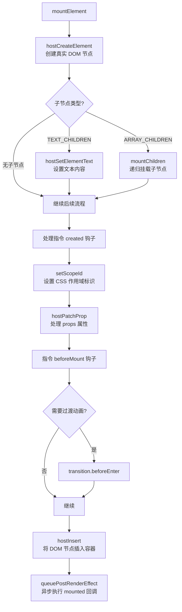

最终，`hostInsert` 将创建好的 `DOM` 元素插入到容器中：

```typescript
// packages/runtime-dom/src/nodeOps.ts
insert: (child, parent, anchor) => {
  parent.insertBefore(child, anchor || null);
}
```

对于嵌套子节点（如数组子节点），`mountChildren` 会递归调用 `patch`，形成深度优先的 `DOM` 树构建。

#### 全链路流程总览

至此，我们已经完整走完了从 `createApp` 到真实 `DOM` 的全部链路。下面用一张完整的流程图来回顾：

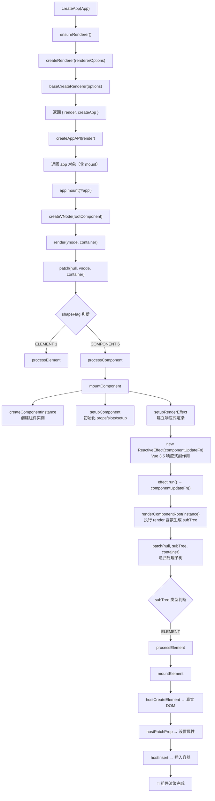

再对照 `Vue` 官方的渲染流程图来理解：

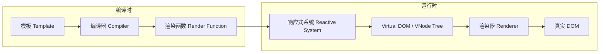

回顾上述过程，整体脉络如下：

1. **编译阶段**：模板被编译成渲染函数
2. **创建 VNode**：`createApp` → `createVNode` 将根组件转化为虚拟节点
3. **组件实例化**：`patch` → `processComponent` → `mountComponent` → `createComponentInstance` 创建组件实例
4. **组件初始化**：`setupComponent` 处理 `props`、`slots`，执行 `setup` 函数
5. **建立响应式渲染**：`setupRenderEffect` 创建 `ReactiveEffect`，将组件更新与响应式系统绑定
6. **渲染子树**：`renderComponentRoot` 执行 `render` 函数，生成子树 `VNode`
7. **递归 Patch**：子树 `VNode` 递归进入 `patch`，根据类型走 `processElement` → `mountElement`
8. **DOM 创建**：`mountElement` 通过平台适配器创建真实 `DOM`，设置属性，插入容器

#### Vue 3.5 渲染器演进总结

`Vue 3.5` 在渲染器层面的核心演进：

| 领域 | 变化 | 影响 |
|------|------|------|
| 响应式系统 | ReactiveEffect 双向链表重构 | 更精准的依赖追踪，更低的内存开销 |
| 副作用调度 | Lazy Effect + runIfDirty | 减少无效渲染，更智能的更新策略 |
| 组件实例 | 新增 `ids` 字段 | 支持 `useId()` 解决 SSR ID 不匹配 |
| 模板引用 | `refs` 字段配合 `useTemplateRef()` | 更安全的模板引用获取方式 |
| Teleport | VNode 新增 `target` 系列字段 | 支持延迟目标解析 |
| SSR | `createHydrationRenderer` 改进 | 更高效的懒水合（Lazy Hydration） |
| Custom Element | `ce` 回调机制增强 | 更好的 Web Components 集成 |
| 性能优化 | `optionsCache` 缓存 | 减少组件选项重复计算 |

> **关于 Vapor Mode**：`Vue 3.5` 实验性支持的 `Vapor Mode` 是渲染器的未来方向。它跳过 `Virtual DOM` 的 `diff` 过程，在编译时直接生成精确的 `DOM` 操作代码，类似于 `Svelte` 的编译策略。`Vapor Mode` 可以与现有 `Virtual DOM` 模式混合使用，为性能关键路径提供更优的渲染性能。目前 `Vapor Mode` 仍处于实验阶段，不影响现有的渲染流程。

#### 总结

本节我们从入口文件 `createApp(App).mount('#app')` 出发，逐步深入 `Vue 3.5` 的渲染器源码，完整梳理了组件从对象到真实 `DOM` 的渲染链路。核心调用链为：

```
createApp → ensureRenderer → createRenderer → createAppAPI → mount →
createVNode → render → patch → processComponent → mountComponent →
createComponentInstance → setupComponent → setupRenderEffect →
renderComponentRoot → patch → processElement → mountElement → 真实 DOM
```

在这个过程中，我们看到了多种设计模式的运用：

- **懒初始化模式**：`ensureRenderer` 延迟创建渲染器
- **适配器模式**：`rendererOptions` 抽象平台差异
- **策略模式**：`patch` 根据 `shapeFlag` 分发处理逻辑
- **模板方法模式**：`mount` 的平台特定重写
- **观察者模式**：`ReactiveEffect` 实现响应式依赖追踪

关于具体的编译器和更新以及响应式的部分将在后续章节继续介绍。本节主要介绍了挂载过程，下一小节将介绍更新策略。

### 数据访问代理

#### 初始化组件实例

我们再来回顾一下 `setupComponent` 在 Vue 3.5.x 源码中的实现：

```js
export function setupComponent(instance, isSSR = false, optimized = false) {
  // SSR 环境下设置标记
  isSSR && setInSSRSetupState(isSSR)

  const { props, children } = instance.vnode

  // 判断组件是否是有状态的组件
  const isStateful = isStatefulComponent(instance)

  // 初始化 props
  initProps(instance, props, isStateful, isSSR)

  // 初始化 slots
  initSlots(instance, children, optimized || isSSR)

  // 如果是有状态组件，那么去设置有状态组件实例
  const setupResult = isStateful
    ? setupStatefulComponent(instance, isSSR)
    : undefined

  // 重置 SSR 标记
  isSSR && setInSSRSetupState(false)

  return setupResult
}
```

`setupComponent` 方法做了什么？

1. 通过 `isStatefulComponent(instance)` 判断是否是有状态的组件；
2. `initProps` 初始化 `props`；
3. `initSlots` 初始化 `slots`；
4. 根据组件是否是有状态的，来决定是否需要执行 `setupStatefulComponent` 函数。

其中，`isStatefulComponent` 判断是否是有状态的组件的函数如下：

```js
function isStatefulComponent(instance) {
  return instance.vnode.shapeFlag & ShapeFlags.STATEFUL_COMPONENT
}
```

前面我们已经说过了，`ShapeFlags` 在遇到组件类型的 `type = Object` 时，`vnode` 的 `shapeFlags = ShapeFlags.STATEFUL_COMPONENT`。所以这里会执行 `setupStatefulComponent` 函数。

```js
function setupStatefulComponent(instance, isSSR) {
  const Component = instance.type

  // 开发环境下进行组件名称、组件注册、指令注册的校验
  if (__DEV__) {
    if (Component.name) {
      validateComponentName(Component.name, instance.appContext.config)
    }
    if (Component.components) {
      const names = Object.keys(Component.components)
      for (let i = 0; i < names.length; i++) {
        validateComponentName(names[i], instance.appContext.config)
      }
    }
    if (Component.directives) {
      const names = Object.keys(Component.directives)
      for (let i = 0; i < names.length; i++) {
        validateDirectiveName(names[i])
      }
    }
    // 运行时编译器选项校验
    if (Component.compilerOptions && isRuntimeOnly()) {
      warn(
        `"compilerOptions" is only supported when using a build of Vue ` +
        `that includes the runtime compiler. Since you are using a ` +
        `runtime-only build, the options should be passed via your ` +
        `build tool config instead.`
      )
    }
  }

  // 1. 创建渲染代理的属性访问缓存
  instance.accessCache = Object.create(null)

  // 2. 创建渲染上下文代理，proxy 对象其实是代理了 instance.ctx 对象
  instance.proxy = new Proxy(instance.ctx, PublicInstanceProxyHandlers)

  // 开发环境下暴露 props 到渲染上下文
  if (__DEV__) {
    exposePropsOnRenderContext(instance)
  }

  // 3. 执行 setup 函数
  const { setup } = Component
  if (setup) {
    // 暂停依赖追踪
    pauseTracking()

    // 如果 setup 函数带参数，则创建一个 setupContext
    const setupContext = (instance.setupContext =
      setup.length > 1 ? createSetupContext(instance) : null)

    // 设置当前实例
    const reset = setCurrentInstance(instance)

    // 执行 setup 函数，获取结果
    const setupResult = callWithErrorHandling(
      setup,
      instance,
      ErrorCodes.SETUP_FUNCTION,
      [
        __DEV__ ? shallowReadonly(instance.props) : instance.props,
        setupContext
      ]
    )

    // 判断是否是异步 setup
    const isAsyncSetup = isPromise(setupResult)

    // 恢复依赖追踪
    resetTracking()
    reset()

    // 处理异步 setup
    if ((isAsyncSetup || instance.sp) && !isAsyncWrapper(instance)) {
      markAsyncBoundary(instance)
    }

    if (isAsyncSetup) {
      setupResult.then(unsetCurrentInstance, unsetCurrentInstance)
      if (isSSR) {
        return setupResult
          .then((resolvedResult) => {
            handleSetupResult(instance, resolvedResult, isSSR)
          })
          .catch((e) => {
            handleError(e, instance, ErrorCodes.SETUP_FUNCTION)
          })
      } else {
        instance.asyncDep = setupResult
        if (__DEV__ && !instance.suspense) {
          const name = formatComponentName(instance, Component)
          warn(
            `Component <${name}>: setup function returned a promise, ` +
            `but no <Suspense> boundary was found in the parent component tree. ` +
            `A component with async setup() must be nested in a <Suspense> ` +
            `in order to be rendered.`
          )
        }
      }
    } else {
      handleSetupResult(instance, setupResult, isSSR)
    }
  } else {
    // 4. 完成组件实例设置
    finishComponentSetup(instance, isSSR)
  }
}
```

`setupStatefulComponent` 字面意思就是设置有状态组件，那么什么是有状态组件？简单而言，就是对于有状态组件，Vue 内部会保留组件状态数据。相对于有状态组件而言，Vue 还存在一种函数组件 `FUNCTIONAL_COMPONENT`，看以下示例：

```js
import { ref } from 'vue';

export default () => {
  let num = ref(0);
  const plusNum = () => {
    num.value ++;
  };
  return (
    <div>
      <button onClick={plusNum}>
        { num.value }
      </button>
    </div>
  )
}
```

这个函数点击按钮时，`num` 的值并不会按照我们预期那样值会一直递增，因为它是一个函数组件，函数组件内部是没有状态保持的，所以 `num` 数据更新时，组件会重新渲染，`num` 的值永远不变一直是 `0`。

因此，为了能符合预期的结果，需要将其设置成有状态的组件。可以通过 `defineComponent` 函数包装：

```js
import { ref, defineComponent } from 'vue';

export default defineComponent(() => {
  let num = ref(0);
  const plusNum = () => {
    num.value ++;
  };

  return () => (
    <div>
      <button onClick={plusNum}>
        { num.value }
      </button>
    </div>
  )
});
```

`defineComponent` 返回的是个对象类型的 `type`，所以就变成了有状态组件。

理解了什么是有状态组件后，回到 `setupStatefulComponent` 实现中，逐步分析其核心原理。

#### 创建渲染上下文代理

首先看 `1-2` 两个步骤，关于第一点：为什么要创建渲染代理的属性访问缓存？此处暂不展开，先看第二步：创建渲染上下文代理，这里为什么要对 `instance.ctx` 做代理？如果熟悉 Vue 2 的读者应该了解，Vue 2 的 Options API 的写法如下：

```html
<template>
  <p>{{ num }}</p>
</template>
<script>
export default {
  data() {
    num: 1
  },
  mounted() {
    this.num = 2
  }
}
</script>
```

Vue 2.x 是如何实现访问 `this.num` 获取到 `num` 的值，而不是通过 `this._data.num` 来获取 `num` 的值？其实 Vue 2.x 版本中，为 `_data` 设置了一层代理：

```js
_proxy(options.data);

function _proxy (data) {
  const that = this;
  Object.keys(data).forEach(key => {
    Object.defineProperty(that, key, {
      configurable: true,
      enumerable: true,
      get: function proxyGetter () {
        return that._data[key];
      },
      set: function proxySetter (val) {
        that._data[key] = val;
      }
    })
  });
}
```

本质就是通过 `Object.defineProperty` 使在访问 `this` 上的某属性时从 `this._data` 中读取（写入）。

而 Vue 3 也在这里做了类似的事情，Vue 3 内部有很多状态属性，存储在不同的对象上，比如 `setupState`、`ctx`、`data`、`props`。这样用户取数据就会考虑具体从哪个对象中获取，这无疑增加了用户的使用负担，所以对 `instance.ctx` 进行代理，然后根据属性优先级关系依次完成从特定对象上获取值。

##### get

了解了代理的功能后，我们来具体看一下是如何实现代理功能的，也就是 `proxy` 的 `PublicInstanceProxyHandlers` 它的实现。先看一下 `get` 函数：

```js
// 判断是否是保留前缀（$ 或 _）
const isReservedPrefix = (key) => key === "_" || key === "$"

// 检查 setupState 中是否存在绑定（排除 __isScriptSetup 标记的情况）
const hasSetupBinding = (state, key) =>
  state !== EMPTY_OBJ && !state.__isScriptSetup && hasOwn(state, key)

export const PublicInstanceProxyHandlers = {
  get({ _: instance }, key) {
    // 跳过响应式标记
    if (key === "__v_skip") {
      return true
    }

    const { ctx, setupState, data, props, accessCache, type, appContext } =
      instance

    // 开发环境下标记 __isVue
    if (__DEV__ && key === "__isVue") {
      return true
    }

    // 非 $ 开头的属性访问
    if (key[0] !== "$") {
      // 从缓存中获取当前 key 存在于哪个属性中
      const n = accessCache[key]
      if (n !== undefined) {
        switch (n) {
          case AccessTypes.SETUP:
            return setupState[key]
          case AccessTypes.DATA:
            return data[key]
          case AccessTypes.CONTEXT:
            return ctx[key]
          case AccessTypes.PROPS:
            return props[key]
        }
      } else if (hasSetupBinding(setupState, key)) {
        // 从 setupState 中取
        accessCache[key] = AccessTypes.SETUP
        return setupState[key]
      } else if (__VUE_OPTIONS_API__ && data !== EMPTY_OBJ && hasOwn(data, key)) {
        // 从 data 中取
        accessCache[key] = AccessTypes.DATA
        return data[key]
      } else if (hasOwn(props, key)) {
        // 从 props 中取
        accessCache[key] = AccessTypes.PROPS
        return props[key]
      } else if (ctx !== EMPTY_OBJ && hasOwn(ctx, key)) {
        // 从 ctx 中取
        accessCache[key] = AccessTypes.CONTEXT
        return ctx[key]
      } else if (!__VUE_OPTIONS_API__ || shouldCacheAccess) {
        // 都取不到
        accessCache[key] = AccessTypes.OTHER
      }
    }

    // 处理 $ 开头的内置属性
    const publicGetter = publicPropertiesMap[key]
    let cssModule, globalProperties

    if (publicGetter) {
      // $attrs 需要追踪依赖
      if (key === "$attrs") {
        track(instance.attrs, TrackOpTypes.GET, "")
        __DEV__ && markAttrsAccessed()
      } else if (__DEV__ && key === "$slots") {
        track(instance, "get", key)
      }
      return publicGetter(instance)
    } else if (
      // css module（由 vue-loader 注入）
      (cssModule = type.__cssModules) && (cssModule = cssModule[key])
    ) {
      return cssModule
    } else if (ctx !== EMPTY_OBJ && hasOwn(ctx, key)) {
      // 用户在 ctx 上的自定义属性
      accessCache[key] = AccessTypes.CONTEXT
      return ctx[key]
    } else if (
      // 全局属性
      ((globalProperties = appContext.config.globalProperties),
      hasOwn(globalProperties, key))
    ) {
      return globalProperties[key]
    } else if (
      __DEV__ &&
      currentRenderingInstance &&
      (!isString(key) ||
        key.indexOf("__v") !== 0)
    ) {
      // 开发环境下的告警
      if (data !== EMPTY_OBJ && isReservedPrefix(key[0]) && hasOwn(data, key)) {
        warn(
          `Property ${JSON.stringify(
            key
          )} must be accessed via $data because it starts with a reserved ` +
          `character ("$" or "_") and is not proxied on the render context.`
        )
      } else if (instance === currentRenderingInstance) {
        warn(
          `Property ${JSON.stringify(key)} was accessed during render ` +
          `but is not defined on instance.`
        )
      }
    }
  }
}
```

这里，可以回答我们的第一步 `创建渲染代理的属性访问缓存` 这个步骤的问题了。如果我们知道 `key` 存在于哪个对象上，那么就可以直接通过对象取值的操作获取属性上的值了。如果我们不知道用户访问的 `key` 存在于哪个属性上，那只能通过 `hasOwn` 的方法先判断存在于哪个属性上，再通过对象取值的操作获取属性值，这无疑是多操作了一步，而且这个判断是比较耗费性能的。如果遇到大量渲染取值的操作，那么这块就是个性能瓶颈，所以这里用了 `accessCache` 来标记缓存 `key` 存在于哪个属性上。这其实也**相当于用一部分空间换时间的优化**。

接下来，函数首先判断 `key[0] !== "$"` 的情况（`$` 开头的一般是 Vue 组件实例上的内置属性），在 Vue 3 源码中，会依次从 `setupState`、`data`、`props`、`ctx` 这几类数据中取状态值。

这里的定义顺序，决定了后续取值的优先级顺序：`setupState` > `data` > `props` > `ctx`。

如果 `key` 是以 `$` 开头，则首先会判断是否是存在于组件实例上的内置属性。内置属性映射表 `publicPropertiesMap` 定义如下：

```js
const publicPropertiesMap = /* @__PURE__ */ extend(
  Object.create(null),
  {
    $: (i) => i,
    $el: (i) => i.vnode.el,
    $data: (i) => i.data,
    $props: (i) => (__DEV__ ? shallowReadonly(i.props) : i.props),
    $attrs: (i) => (__DEV__ ? shallowReadonly(i.attrs) : i.attrs),
    $slots: (i) => (__DEV__ ? shallowReadonly(i.slots) : i.slots),
    $refs: (i) => (__DEV__ ? shallowReadonly(i.refs) : i.refs),
    $parent: (i) => getPublicInstance(i.parent),
    $root: (i) => getPublicInstance(i.root),
    $host: (i) => i.ce,
    $emit: (i) => i.emit,
    $options: (i) => (__VUE_OPTIONS_API__ ? resolveMergedOptions(i) : i.type),
    $forceUpdate: (i) =>
      i.f || (i.f = () => queueJob(i.update)),
    $nextTick: (i) => i.n || (i.n = nextTick.bind(i.proxy)),
    $watch: (i) => (__VUE_OPTIONS_API__ ? instanceWatch.bind(i) : NOOP)
  }
)
```

我们可以用以下表格来展示属性访问的优先级：

```mermaid
flowchart TD
    A[访问属性 key] --> B{key 以 $ 开头?}
    B -->|否| C{检查 accessCache}
    C -->|有缓存| D[直接从缓存标记的对象获取]
    C -->|无缓存| E{检查 setupState}
    E -->|存在| F[缓存为 SETUP<br/>返回 setupState key
    E -->|不存在| G{检查 data}
    G -->|存在| H[缓存为 DATA<br/>返回 data key
    G -->|不存在| I{检查 props}
    I -->|存在| J[缓存为 PROPS<br/>返回 props key
    I -->|不存在| K{检查 ctx}
    K -->|存在| L[缓存为 CONTEXT<br/>返回 ctx key
    K -->|不存在| M[缓存为 OTHER]
    B -->|是| N{检查 publicPropertiesMap}
    N -->|存在| O[调用 publicGetter]
    N -->|不存在| P{检查 cssModule}
    P -->|存在| Q[返回 cssModule]
    P -->|不存在| R{检查 globalProperties}
    R -->|存在| S[返回 globalProperties]
    R -->|不存在| T[开发环境告警]
```

##### set

接着继续看一下设置对象属性的代理函数：

```js
export const PublicInstanceProxyHandlers = {
  set({ _: instance }, key, value) {
    const { data, setupState, ctx } = instance

    // 优先检查 setupState
    if (hasSetupBinding(setupState, key)) {
      setupState[key] = value
      return true
    }
    // 如果是 <script setup> 的绑定，禁止从 Options API 修改
    else if (
      __DEV__ &&
      setupState.__isScriptSetup &&
      hasOwn(setupState, key)
    ) {
      warn(`Cannot mutate <script setup> binding "${key}" from Options API.`)
      return false
    }
    // 检查 data
    else if (__VUE_OPTIONS_API__ && data !== EMPTY_OBJ && hasOwn(data, key)) {
      data[key] = value
      return true
    }
    // 禁止修改 props
    else if (hasOwn(instance.props, key)) {
      __DEV__ && warn(`Attempting to mutate prop "${key}". Props are readonly.`)
      return false
    }

    // 禁止修改 $ 开头的内置属性
    if (key[0] === "$" && key.slice(1) in instance) {
      __DEV__ &&
        warn(
          `Attempting to mutate public property "${key}". ` +
          `Properties starting with $ are reserved and readonly.`
        )
      return false
    } else {
      // 用户自定义数据赋值到 ctx
      if (__DEV__ && key in instance.appContext.config.globalProperties) {
        Object.defineProperty(ctx, key, {
          enumerable: true,
          configurable: true,
          value
        })
      } else {
        ctx[key] = value
      }
    }
    return true
  }
}
```

可以看到这里也是和前面 `get` 函数类似的通过调用顺序来实现对 `set` 函数不同属性设置优先级的，可以直观地看到优先级关系为：`setupState` > `data` > `props`。同时这里也有说明：就是如果直接对 `props` 或者组件实例上的内置属性赋值，则会告警。

值得注意的是，Vue 3.5 引入了一个重要的保护机制：如果 `setupState` 带有 `__isScriptSetup` 标记（表示这是 `<script setup>` 中定义的绑定），则禁止从 Options API 中修改它。这确保了 `<script setup>` 的数据封装性。

##### has

最后，再看一个 `proxy` 属性 `has` 的实现：

```js
export const PublicInstanceProxyHandlers = {
  has(
    { _: { data, setupState, accessCache, ctx, appContext, props, type } },
    key
  ) {
    let cssModules
    return (
      !!accessCache[key] ||
      (__VUE_OPTIONS_API__ && data !== EMPTY_OBJ && key[0] !== "$" && hasOwn(data, key)) ||
      hasSetupBinding(setupState, key) ||
      hasOwn(props, key) ||
      hasOwn(ctx, key) ||
      hasOwn(publicPropertiesMap, key) ||
      hasOwn(appContext.config.globalProperties, key) ||
      ((cssModules = type.__cssModules) && cssModules[key])
    )
  }
}
```

这个函数则是依次判断 `key` 是否存在于 `accessCache` > `data` > `setupState` > `props` > `ctx` > `publicPropertiesMap` > `globalProperties` > `cssModules`，然后返回结果。

`has` 在业务代码的使用定义如下：

```js
export default {
  created () {
    // 这里会触发 has 函数
    console.log('msg' in this)
  }
}
```

##### defineProperty

Vue 3.5 还为 `PublicInstanceProxyHandlers` 添加了 `defineProperty` 拦截器：

```js
defineProperty(target, key, descriptor) {
  if (descriptor.get != null) {
    // 如果定义了 getter，重置缓存
    target._.accessCache[key] = 0
  } else if (hasOwn(descriptor, "value")) {
    // 如果定义了 value，调用 set
    this.set(target, key, descriptor.value, null)
  }
  return Reflect.defineProperty(target, key, descriptor)
}
```

这个拦截器确保了当通过 `Object.defineProperty` 在组件实例上定义属性时，缓存能够正确更新。

##### ownKeys

在开发环境下，Vue 3.5 还实现了 `ownKeys` 拦截器：

```js
if (__DEV__) {
  PublicInstanceProxyHandlers.ownKeys = (target) => {
    warn(
      `Avoid app logic that relies on enumerating keys on a component instance. ` +
      `The keys will be empty in production mode to avoid performance overhead.`
    )
    return Reflect.ownKeys(target)
  }
}
```

这是为了避免开发者依赖枚举组件实例的键，因为在生产环境中这个操作会有性能开销。

至此，创建上下文代理的过程已分析完毕。

#### 调用执行 setup 函数

一个简单的包含 Composition API 的 Vue 3 demo 如下：

```html
<template>
  <p>{{ msg }}</p>
</template>
<script>
  export default {
    props: {
      msg: String
    },
    setup (props, setupContext) {
      // todo
    }
  }
</script>
```

这里的 `setup` 函数，正是在这里被调用执行的：

```js
// 获取 setup 函数
const { setup } = Component

// 存在 setup 函数
if (setup) {
  // 暂停依赖追踪
  pauseTracking()

  // 根据 setup 函数的入参长度，判断是否需要创建 setupContext 对象
  const setupContext = (instance.setupContext =
    setup.length > 1 ? createSetupContext(instance) : null)

  // 设置当前实例
  const reset = setCurrentInstance(instance)

  // 调用 setup
  const setupResult = callWithErrorHandling(
    setup,
    instance,
    ErrorCodes.SETUP_FUNCTION,
    [
      __DEV__ ? shallowReadonly(instance.props) : instance.props,
      setupContext
    ]
  )

  // 恢复依赖追踪
  resetTracking()
  reset()

  // 处理 setup 执行结果
  handleSetupResult(instance, setupResult, isSSR)
}
```

##### createSetupContext

因为 `setupContext` 是 `setup` 中的第二个参数，所以会判断 `setup` 函数参数的长度，如果大于 `1`，则会通过 `createSetupContext` 函数创建 `setupContext` 上下文。

该上下文创建如下：

```js
function createSetupContext(instance) {
  const expose = (exposed) => {
    if (__DEV__) {
      if (instance.exposed) {
        warn(`expose() should be called only once per setup().`)
      }
      if (exposed != null) {
        let exposedType = typeof exposed
        if (exposedType === "object") {
          if (isArray(exposed)) {
            exposedType = "array"
          } else if (isRef(exposed)) {
            exposedType = "ref"
          }
        }
        if (exposedType !== "object") {
          warn(`expose() should be passed a plain object, received ${exposedType}.`)
        }
      }
    }
    instance.exposed = exposed || {}
  }

  if (__DEV__) {
    // 开发环境返回冻结的对象，包含 getter 惰性访问
    let attrsProxy
    let slotsProxy
    return Object.freeze({
      get attrs() {
        return attrsProxy || (attrsProxy = new Proxy(instance.attrs, attrsProxyHandlers))
      },
      get slots() {
        return slotsProxy || (slotsProxy = getSlotsProxy(instance))
      },
      get emit() {
        return (event, ...args) => instance.emit(event, ...args)
      },
      expose
    })
  } else {
    // 生产环境直接返回对象
    return {
      attrs: new Proxy(instance.attrs, attrsProxyHandlers),
      slots: instance.slots,
      emit: instance.emit,
      expose
    }
  }
}
```

可以看到，`setupContext` 中包含了 `attrs`、`slots`、`emit`、`expose` 这些属性。这些属性分别代表着：组件的属性、插槽、派发事件的方法 `emit`、以及所有想从当前组件实例导出的内容 `expose`。

这里有个小的知识点，就是可以通过函数的 `length` 属性来判断函数参数的个数：

```javascript
function foo() {};

foo.length // 0

function bar(a) {};

bar.length // 1
```

##### callWithErrorHandling

第二步，通过 `callWithErrorHandling` 函数来间接执行 `setup` 函数，其实就是执行了以下代码：

```js
const setupResult = setup && setup(shallowReadonly(instance.props), setupContext);
```

只不过增加了对执行过程中 `handleError` 的捕获。

在后续章节的阅读中，你会发现 Vue 3 很多函数的调用都是通过 `callWithErrorHandling` 来包裹的：

```js
export function callWithErrorHandling(
  fn,
  instance,
  type,
  args = []
) {
  let res
  try {
    res = args ? fn(...args) : fn()
  } catch (err) {
    handleError(err, instance, type)
  }
  return res
}
```

这样的好处一方面可以由 Vue 内部统一 `try...catch` 处理用户代码运行可能出现的错误。另一方面这些错误也可以交由用户统一注册的 `errorHandler` 进行处理，比如上报给监控系统。

##### handleSetupResult

最后执行 `handleSetupResult` 函数：

```js
function handleSetupResult(instance, setupResult, isSSR) {
  // 如果 setup 返回渲染函数
  if (isFunction(setupResult)) {
    if (instance.type.__ssrInlineRender) {
      instance.ssrRender = setupResult
    } else {
      instance.render = setupResult
    }
  }
  // 如果 setup 返回对象
  else if (isObject(setupResult)) {
    if (__DEV__ && isVNode(setupResult)) {
      warn(`setup() should not return VNodes directly - return a render function instead.`)
    }
    if (__DEV__ || __VUE_PROD_DEVTOOLS__) {
      instance.devtoolsRawSetupState = setupResult
    }
    // proxyRefs 的作用就是把 setupResult 对象做一层代理
    instance.setupState = proxyRefs(setupResult)
    if (__DEV__) {
      exposeSetupStateOnRenderContext(instance)
    }
  }
  // 其他情况告警
  else if (__DEV__ && setupResult !== undefined) {
    warn(
      `setup() should return an object. Received: ` +
      `${setupResult === null ? "null" : typeof setupResult}`
    )
  }

  finishComponentSetup(instance, isSSR)
}
```

`setup` 返回值不一样的话，会有不同的处理，如果 `setupResult` 是个函数，那么会把该函数绑定到 `render` 上。比如：

```html
<script>
  import { createVNode } from 'vue'
  export default {
    props: {
      msg: String
    },
    setup (props, { emit }) {
      return (ctx) => {
        return [
          createVNode('p', null, ctx.msg)
        ]
      }
    }
  }
</script>
```

当 `setupResult` 是一个对象的时候，我们为 `setupResult` 对象通过 `proxyRefs` 作了一层代理，方便用户直接访问 `ref` 类型的值。比如，在模板中访问 `setupResult` 中的数据，就可以省略 `.value` 的取值，而由代理来默认取 `.value` 的值。

`proxyRefs` 的实现如下：

```js
const shallowUnwrapHandlers = {
  get: (target, key, receiver) =>
    key === "__v_raw" ? target : unref(Reflect.get(target, key, receiver)),
  set: (target, key, value, receiver) => {
    const oldValue = target[key]
    if (isRef(oldValue) && !isRef(value)) {
      oldValue.value = value
      return true
    } else {
      return Reflect.set(target, key, value, receiver)
    }
  }
}

function proxyRefs(objectWithRefs) {
  return isReactive(objectWithRefs)
    ? objectWithRefs
    : new Proxy(objectWithRefs, shallowUnwrapHandlers)
}
```

可以看到，`proxyRefs` 在 `get` 时会自动调用 `unref` 解包 ref 值，在 `set` 时如果原值是 ref 而新值不是 ref，则会更新原 ref 的 `.value`。

> 注意，这里 `instance.setupState = proxyRefs(setupResult);` 之前的 Vue 源码的写法是 `instance.setupState = reactive(setupResult);`，至于为什么改成上面的，Vue 作者也有相关说明：[Template auto ref unwrapping for setup() return object is now applied only to the root level refs.](https://github.com/vuejs/core/pull/1682)

#### 完成组件实例设置

最后，到了 `finishComponentSetup` 这个函数了：

```js
let compile
let installWithProxy

function registerRuntimeCompiler(_compile) {
  compile = _compile
  installWithProxy = (i) => {
    if (i.render._rc) {
      i.withProxy = new Proxy(i.ctx, RuntimeCompiledPublicInstanceProxyHandlers)
    }
  }
}

const isRuntimeOnly = () => !compile

function finishComponentSetup(instance, isSSR, skipOptions) {
  const Component = instance.type

  if (!instance.render) {
    // 如果组件没有 render 函数，那么就需要把 template 编译成 render 函数
    if (!isSSR && compile && !Component.render) {
      const template =
        Component.template ||
        (__VUE_OPTIONS_API__ && resolveMergedOptions(instance).template)

      if (template) {
        if (__DEV__) {
          startMeasure(instance, `compile`)
        }

        const { isCustomElement, compilerOptions } = instance.appContext.config
        const { delimiters, compilerOptions: componentCompilerOptions } = Component

        const finalCompilerOptions = extend(
          extend(
            {
              isCustomElement,
              delimiters
            },
            compilerOptions
          ),
          componentCompilerOptions
        )

        Component.render = compile(template, finalCompilerOptions)

        if (__DEV__) {
          endMeasure(instance, `compile`)
        }
      }
    }

    instance.render = Component.render || NOOP

    if (installWithProxy) {
      installWithProxy(instance)
    }
  }

  // 兼容选项式 API 的调用逻辑
  if (__VUE_OPTIONS_API__ && true) {
    const reset = setCurrentInstance(instance)
    pauseTracking()
    try {
      applyOptions(instance)
    } finally {
      resetTracking()
      reset()
    }
  }

  // 缺少渲染函数的告警
  if (__DEV__ && !Component.render && instance.render === NOOP && !isSSR) {
    if (!compile && Component.template) {
      warn(
        `Component provided template option but runtime compilation is not ` +
        `supported in this build of Vue. Configure your bundler to alias ` +
        `"vue" to "vue/dist/vue.esm-bundler.js".`
      )
    } else {
      warn(`Component is missing template or render function: `, Component)
    }
  }
}
```

这里主要做的就是根据 `instance` 上有没有 `render` 函数来判断是否需要进行运行时渲染，运行时渲染指的是在浏览器运行的过程中，动态编译 `<template>` 标签内的内容，产出渲染函数。对于编译时渲染，则是有渲染函数的，因为模板中的内容会被 `webpack` 中 `vue-loader` 这样的插件进行编译。

另外需要注意的，这里有个 `__VUE_OPTIONS_API__` 变量用来标记是否是兼容选项式 API 调用，如果我们只使用 Composition API 那么就可以通过 `webpack` 静态变量注入的方式关闭此特性。然后交由 Tree-Shaking 删除无用的代码，从而减少引用代码包的体积。

#### Vue 3.5 响应式 Props 解构

Vue 3.5 正式稳定了响应式 Props 解构特性，这是一个重要的变化。在 Vue 3.4 及之前，当我们解构 `defineProps` 的返回值时，解构出的变量会失去响应性：

```html
<script setup>
// Vue 3.4 及之前：解构后失去响应性
const { foo, bar } = defineProps(['foo', 'bar'])
// foo 和 bar 不再是响应式的！
</script>
```

而在 Vue 3.5 中，这种情况得到了改善。SFC 编译器会自动将解构的 props 转换为响应式访问。

##### 编译转换原理

当我们在 `<script setup>` 中解构 `defineProps` 时：

```html
<script setup>
const { foo, bar = 'default value' } = defineProps(['foo', 'bar'])
</script>
```

编译器会进行以下转换：

1. **记录解构绑定信息**：编译器在解析阶段会记录 `propsDestructuredBindings`，包含每个解构属性的本地名称和默认值。

2. **转换属性访问**：在代码中访问解构的变量时，编译器会将其转换为对 `__props` 的访问：

```js
// 编译前
console.log(foo)

// 编译后
console.log(__props.foo)
```

3. **处理默认值**：如果解构时指定了默认值，编译器会使用 `mergeDefaults` 来合并默认值：

```js
// 编译前
const { foo = 'default' } = defineProps(['foo'])

// 编译后
const __props = /*@__PURE__*/ mergeDefaults(['foo'], {
  foo: 'default'
})
```

##### 核心实现代码

编译器中的 `transformDestructuredProps` 函数负责这个转换：

```js
function transformDestructuredProps(ctx, vueImportAliases) {
  if (ctx.options.propsDestructure === false) {
    return
  }

  const rootScope = Object.create(null)
  const scopeStack = [rootScope]
  let currentScope = rootScope
  const excludedIds = new WeakSet()
  const parentStack = []
  const propsLocalToPublicMap = Object.create(null)

  // 记录所有解构的 props 到作用域
  for (const key in ctx.propsDestructuredBindings) {
    const { local } = ctx.propsDestructuredBindings[key]
    rootScope[local] = true
    propsLocalToPublicMap[local] = key
  }

  // 重写标识符访问
  function rewriteId(id, parent, parentStack) {
    if (parent.type === "AssignmentExpression" && id === parent.left ||
        parent.type === "UpdateExpression") {
      ctx.error(`Cannot assign to destructured props as they are readonly.`, id)
    }
    // 将解构的变量名转换为 __props.xxx 访问
    if (isStaticProperty(parent) && parent.shorthand) {
      ctx.s.appendLeft(
        id.end + ctx.startOffset,
        `: ${genPropsAccessExp(propsLocalToPublicMap[id.name])}`
      )
    } else {
      ctx.s.overwrite(
        id.start + ctx.startOffset,
        id.end + ctx.startOffset,
        genPropsAccessExp(propsLocalToPublicMap[id.name])
      )
    }
  }

  // 遍历 AST 并转换
  walk(ast, {
    enter(node, parent) {
      // ... 作用域管理

      if (node.type === "Identifier") {
        if (isReferencedIdentifier(node, parent, parentStack) &&
            !excludedIds.has(node)) {
          if (currentScope[node.name]) {
            rewriteId(node, parent, parentStack)
          }
        }
      }
    }
    // ...
  })
}
```

`genPropsAccessExp` 函数生成属性访问表达式：

```js
function genPropsAccessExp(name) {
  // 如果是合法标识符，使用点号访问
  // 否则使用方括号访问
  return identRE.test(name)
    ? `__props.${name}`
    : `__props[${JSON.stringify(name)}]`
}
```

##### 对代理机制的影响

响应式 Props 解构特性的引入，对组件实例代理机制产生了以下影响：

1. **减少代理访问频率**：由于解构的 props 变量被编译为直接访问 `__props`，不再需要通过组件实例代理来访问，这减少了 `PublicInstanceProxyHandlers.get` 的调用次数。

2. **`hasSetupBinding` 函数的作用**：在 Vue 3.5 中，`hasSetupBinding` 函数会检查 `setupState.__isScriptSetup` 标记：

```js
const hasSetupBinding = (state, key) =>
  state !== EMPTY_OBJ && !state.__isScriptSetup && hasOwn(state, key)
```

当 `setupState` 带有 `__isScriptSetup` 标记时（表示使用 `<script setup>`），`hasSetupBinding` 返回 `false`，这意味着在代理的 `get` 拦截器中，会跳过 `setupState` 的检查，直接进入 `data` 和 `props` 的检查。

3. **模板中的访问路径**：在模板编译阶段，编译器会根据 `bindingMetadata` 来决定如何访问变量。对于解构的 props，模板编译器会生成直接访问 `__props` 的代码，而不是通过 `$props` 或组件代理。

##### 使用注意事项

虽然响应式 Props 解构很方便，但有一些注意事项：

1. **不能对解构的 props 赋值**：解构的 props 是只读的，尝试赋值会触发编译错误。

2. **watch 和 toRef 的特殊处理**：当将解构的 props 传递给 `watch` 或 `toRef` 时，需要传递 getter 函数：

```html
<script setup>
const { foo } = defineProps(['foo'])

// 错误！foo 是一个解构的 prop
watch(foo, (newVal) => { /* ... */ })

// 正确：传递 getter 函数
watch(() => foo, (newVal) => { /* ... */ })
</script>
```

编译器会检测到这种错误用法并给出提示。

3. **配置选项**：可以通过 `propsDestructure` 选项来控制此行为：

```js
// vite.config.js
export default {
  plugins: [
    vue({
      script: {
        propsDestructure: false // 禁用响应式 props 解构
        // 或 'error' // 将解构视为错误
      }
    })
  ]
}
```


### 组件更新机制

#### 组件更新的响应式驱动：从 effect() 到 ReactiveEffect

在早期版本中，`setupRenderEffect` 通过 `effect()` 函数创建副作用渲染函数：

```js
// 早期版本
instance.update = effect(componentUpdateFn, prodEffectOptions)
```

而在 Vue 3.5 中，这一机制被重构为直接使用 `ReactiveEffect` 类：

```ts
// Vue 3.5 - packages/runtime-core/src/renderer.ts
const setupRenderEffect: SetupRenderEffectFn = (
  instance,
  initialVNode,
  container,
  anchor,
  parentSuspense,
  namespace: ElementNamespace,
  optimized,
) => {
  const componentUpdateFn = () => {
    if (!instance.isMounted) {
      // 挂载逻辑...
    } else {
      // 更新逻辑...
    }
  }

  // 创建响应式副作用渲染函数
  instance.scope.on()
  const effect = (instance.effect = new ReactiveEffect(componentUpdateFn))
  instance.scope.off()

  // update 是 effect.run 的绑定版本，用于手动触发
  const update = (instance.update = effect.run.bind(effect))
  // job 是调度器实际执行的任务，使用 runIfDirty 实现惰性执行
  const job: SchedulerJob = (instance.job = effect.runIfDirty.bind(effect))
  job.i = instance
  job.id = instance.uid
  // 设置调度器：当响应式数据变化时，不直接执行更新，而是将 job 入队
  effect.scheduler = () => queueJob(job)

  toggleRecurse(instance, true)
  update()
}
```

这个变化看似只是 API 形式的调整，实则蕴含了 Vue 3.5 响应式系统的核心设计理念。让我们通过一个对比来理解：

| 维度 | 早期版本 `effect()` | Vue 3.5 `ReactiveEffect` |
|------|---------------------|--------------------------|
| 创建方式 | `effect(fn, options)` 工厂函数 | `new ReactiveEffect(fn)` 类实例 |
| 调度执行 | `scheduler` 通过 options 传入 | `effect.scheduler = () => queueJob(job)` |
| 脏检查 | 依赖触发即执行 | `runIfDirty()` 先检查是否真的需要重新执行 |
| 批量更新 | 多个 dep 变化可能多次触发 | 多个 dep 变化只触发一次同步 effect |
| 依赖追踪 | 基于全局 Set 收集 | 基于双向链表 Link 结构 |

其中最关键的变化是 **Lazy Effect** 机制。在 Vue 3.5 中，当响应式数据变化时，调度器入队的不再是直接执行 `componentUpdateFn`，而是执行 `effect.runIfDirty()`：

```ts
// packages/reactivity/src/effect.ts
runIfDirty(): void {
  if (isDirty(this)) {
    this.run()
  }
}
```

`runIfDirty` 会先通过 `isDirty` 检查当前 effect 的依赖是否真的发生了变化，只有确认脏了才会真正执行 `run()`。这意味着如果在同一个微任务中多个响应式数据发生了变化，`componentUpdateFn` 只会被执行一次，而不是多次。

```ts
// packages/reactivity/src/effect.ts
function isDirty(sub: Subscriber): boolean {
  for (let link = sub.deps; link; link = link.nextDep) {
    if (
      link.dep.version !== link.version ||
      (link.dep.computed &&
        (refreshComputed(link.dep.computed) ||
          link.dep.version !== link.version))
    ) {
      return true
    }
  }
  return false
}
```

`isDirty` 通过遍历依赖链表，对比每个 dep 的 `version` 与 link 记录的 `version` 来判断是否有变化。如果某个依赖是 computed，还会通过 `refreshComputed` 来确认 computed 值是否真的变了。这种设计避免了 computed 值未变时的无效更新。

> **设计洞察**：Vue 3.5 的 Lazy Effect 机制本质上是一种"推拉结合"的策略——响应式数据变化时"推"通知 effect（标记为 NOTIFIED 并入队），但 effect 执行时"拉"检查是否真的需要重新运行（isDirty 检查）。这比纯"推"模式更高效，因为它在执行前过滤掉了大量无效更新。

#### 组件更新的核心流程

在前面的小节中，我们说完了关于 `mounted` 的流程。接下来着重看组件更新的逻辑，即 `componentUpdateFn` 的 `else` 分支：

```ts
// Vue 3.5 - packages/runtime-core/src/renderer.ts
const componentUpdateFn = () => {
  if (!instance.isMounted) {
    // 挂载逻辑...
  } else {
    // 更新组件
    let { next, bu, u, parent, vnode } = instance

    // Suspense 异步组件的特殊处理
    if (__FEATURE_SUSPENSE__) {
      const nonHydratedAsyncRoot = locateNonHydratedAsyncRoot(instance)
      if (nonHydratedAsyncRoot) {
        if (next) {
          next.el = vnode.el
          updateComponentPreRender(instance, next, optimized)
        }
        nonHydratedAsyncRoot.asyncDep!.then(() => {
          if (!instance.isUnmounted) {
            componentUpdateFn()
          }
        })
        return
      }
    }

    // updateComponent
    // This is triggered by mutation of component's own state (next: null)
    // OR parent calling processComponent (next: VNode)
    let originNext = next

    // 禁止在 beforeUpdate 生命周期钩子中递归触发组件更新
    toggleRecurse(instance, false)

    if (next) {
      next.el = vnode.el
      // 更新组件实例的 vnode 信息
      updateComponentPreRender(instance, next, optimized)
    } else {
      next = vnode
    }

    // beforeUpdate 生命周期钩子
    if (bu) {
      invokeArrayFns(bu)
    }
    // onVnodeBeforeUpdate 钩子
    if ((vnodeHook = next.props && next.props.onVnodeBeforeUpdate)) {
      invokeVNodeHook(vnodeHook, parent, next, vnode)
    }
    toggleRecurse(instance, true)

    // 渲染新的子树 vnode
    const nextTree = renderComponentRoot(instance)
    // 获取旧的子树 vnode
    const prevTree = instance.subTree
    // 更新子树引用
    instance.subTree = nextTree

    // 比对新旧子树并更新 DOM
    patch(
      prevTree,
      nextTree,
      hostParentNode(prevTree.el!)!,
      getNextHostNode(prevTree),
      instance,
      parentSuspense,
      namespace,
    )

    // 缓存更新后的 DOM 节点
    next.el = nextTree.el

    // 如果是自身状态触发的更新（originNext === null），需要更新 HOC 宿主元素
    if (originNext === null) {
      updateHOCHostEl(instance, nextTree.el)
    }

    // updated 生命周期钩子
    if (u) {
      queuePostRenderEffect(u, parentSuspense)
    }
    // onVnodeUpdated 钩子
    if ((vnodeHook = next.props && next.props.onVnodeUpdated)) {
      queuePostRenderEffect(
        () => invokeVNodeHook(vnodeHook!, parent, next!, vnode),
        parentSuspense,
      )
    }
  }
}
```

整个更新流程可以用下面的时序图来表示：

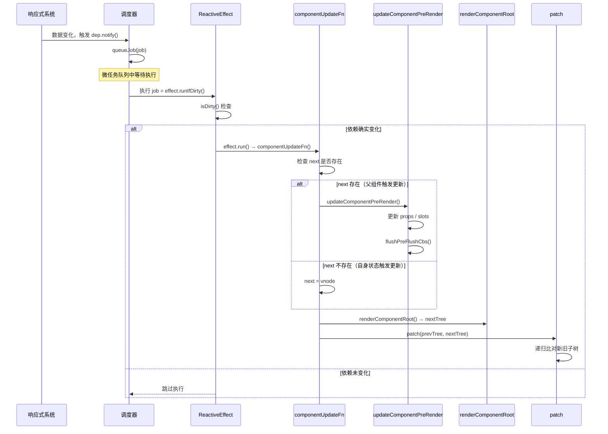

核心流程可以概括为三个阶段：

1. **预处理阶段**：通过 `next` 判断更新来源，如果 `next` 存在则执行 `updateComponentPreRender` 更新组件实例信息
2. **渲染阶段**：调用 `renderComponentRoot` 生成新的子树 vnode
3. **比对阶段**：通过 `patch` 比对新旧子树，完成 DOM 更新

接下来我们深入每个阶段的细节。

#### next 的作用：区分两种更新来源

组件更新有两种触发来源，理解它们的区别是掌握组件更新机制的关键：

| 更新来源 | next 的值 | 触发场景 | 更新内容 |
|----------|-----------|----------|----------|
| 自身状态变化 | `null` | 组件内部响应式数据变化 | 仅重新渲染子树 |
| 父组件传递 | `VNode` | 父组件 patch 遇到子组件 | 先更新 props/slots，再重新渲染 |

当 `next` 为 `null` 时，说明是组件自身的响应式数据变化触发的更新，此时不需要更新 props 和 slots，只需要重新渲染子树即可。当 `next` 为 `VNode` 时，说明是父组件在 patch 过程中触发了子组件的更新，此时需要先通过 `updateComponentPreRender` 更新组件实例上的 props 和 slots 信息。

> **设计洞察**：`next` 机制是 Vue 组件更新粒度控制的核心。它将"自身状态变化"和"外部 props 变化"两种更新场景统一到同一个 `componentUpdateFn` 中处理，避免了为两种场景维护两套更新逻辑。同时，通过 `originNext` 变量记录原始的 next 值，在更新完成后可以判断是否需要更新 HOC 宿主元素——只有自身状态触发的更新才需要。

#### updateComponentPreRender：更新组件实例

当 `next` 存在时，会执行 `updateComponentPreRender` 函数：

```ts
// Vue 3.5 - packages/runtime-core/src/renderer.ts
const updateComponentPreRender = (
  instance: ComponentInternalInstance,
  nextVNode: VNode,
  optimized: boolean,
) => {
  nextVNode.component = instance
  const prevProps = instance.vnode.props
  instance.vnode = nextVNode
  instance.next = null
  updateProps(instance, nextVNode.props, prevProps, optimized)
  updateSlots(instance, nextVNode.children, optimized)

  pauseTracking()
  // props 更新可能触发了 pre-flush 的 watchers
  // 在渲染更新之前先刷新它们
  flushPreFlushCbs(instance)
  resetTracking()
}
```

与早期版本相比，Vue 3.5 的 `updateComponentPreRender` 增加了两个重要细节：

1. **`updateSlots` 增加了 `optimized` 参数**：在编译优化模式下，slots 的更新可以走快速路径
2. **`flushPreFlushCbs(instance)`**：在更新 props 和 slots 之后、渲染之前，先执行所有 pre-flush 的 watch 回调。这确保了 `watch` 中对 props 变化的响应在渲染之前完成，避免渲染出过时的数据

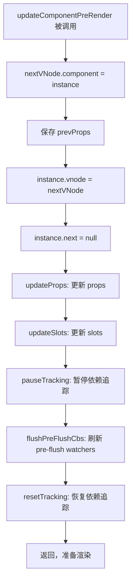

> **设计洞察**：`flushPreFlushCbs` 放在 `updateComponentPreRender` 中是一个精心设计的时序安排。考虑这个场景：父组件传递了一个 prop，子组件通过 `watch(props.xxx, ...)` 监听它。当 prop 变化时，watch 回调需要在渲染之前执行，这样回调中对本地状态的修改才能反映在本次渲染中。如果先渲染再执行 watch，就会导致渲染结果滞后一帧。

#### patch：比对新旧子树

当新的子树 vnode 生成后，就进入了 `patch` 阶段：

```ts
// Vue 3.5 - packages/runtime-core/src/renderer.ts
const patch: PatchFn = (
  n1,
  n2,
  container,
  anchor = null,
  parentComponent = null,
  parentSuspense = null,
  namespace = undefined,
  slotScopeIds = null,
  optimized = __DEV__ && isHmrUpdating ? false : !!n2.dynamicChildren,
) => {
  if (n1 === n2) {
    return
  }

  // 新老节点类型不同，卸载旧节点
  if (n1 && !isSameVNodeType(n1, n2)) {
    anchor = getNextHostNode(n1)
    unmount(n1, parentComponent, parentSuspense, true)
    n1 = null
  }

  // BAIL 优化标记：降级为全量比对
  if (n2.patchFlag === PatchFlags.BAIL) {
    optimized = false
    n2.dynamicChildren = null
  }

  const { type, ref, shapeFlag } = n2
  switch (type) {
    case Text:
      processText(n1, n2, container, anchor)
      break
    case Comment:
      processCommentNode(n1, n2, container, anchor)
      break
    case Static:
      if (n1 == null) {
        mountStaticNode(n2, container, anchor, namespace)
      } else if (__DEV__) {
        patchStaticNode(n1, n2, container, namespace)
      }
      break
    case Fragment:
      processFragment(
        n1, n2, container, anchor, parentComponent,
        parentSuspense, namespace, slotScopeIds, optimized,
      )
      break
    default:
      if (shapeFlag & ShapeFlags.ELEMENT) {
        processElement(
          n1, n2, container, anchor, parentComponent,
          parentSuspense, namespace, slotScopeIds, optimized,
        )
      } else if (shapeFlag & ShapeFlags.COMPONENT) {
        processComponent(
          n1, n2, container, anchor, parentComponent,
          parentSuspense, namespace, slotScopeIds, optimized,
        )
      }
      // ... 其他类型处理
  }
}
```

首先判断当 `n1` 存在（即存在旧节点），但新旧节点不是同类型节点时，执行卸载旧节点、新增新节点。判断是否同类型的逻辑在 `isSameVNodeType` 中：

```ts
// Vue 3.5 - packages/runtime-core/src/vnode.ts
export function isSameVNodeType(n1: VNode, n2: VNode): boolean {
  if (__DEV__ && n2.shapeFlag & ShapeFlags.COMPONENT && n1.component) {
    const dirtyInstances = hmrDirtyComponents.get(n2.type as ConcreteComponent)
    if (dirtyInstances && dirtyInstances.has(n1.component)) {
      // HMR 场景：强制卸载旧组件，重新挂载新组件
      n1.shapeFlag &= ~ShapeFlags.COMPONENT_SHOULD_KEEP_ALIVE
      n2.shapeFlag &= ~ShapeFlags.COMPONENT_KEPT_ALIVE
      return false
    }
  }
  return n1.type === n2.type && n1.key === n2.key
}
```

Vue 3.5 在 `isSameVNodeType` 中增加了 HMR（热模块替换）的特殊处理：当组件被热更新时，即使 type 和 key 相同，也返回 `false`，强制卸载旧组件并重新挂载新组件，确保热更新能正确生效。

如果新旧节点是同类型，则根据 `shapeFlag` 走不同的更新逻辑：普通元素走 `processElement`，组件走 `processComponent`。

##### processElement：普通元素更新

```ts
// Vue 3.5 - packages/runtime-core/src/renderer.ts
const processElement = (
  n1, n2, container, anchor, parentComponent,
  parentSuspense, namespace, slotScopeIds, optimized,
) => {
  if (n1 == null) {
    // 挂载逻辑...
  } else {
    patchElement(
      n1, n2, parentComponent, parentSuspense,
      namespace, slotScopeIds, optimized,
    )
  }
}
```

`patchElement` 是普通元素更新的核心函数：

```ts
// Vue 3.5 - packages/runtime-core/src/renderer.ts
const patchElement = (
  n1, n2, parentComponent, parentSuspense,
  namespace, slotScopeIds, optimized,
) => {
  const el = (n2.el = n1.el!)
  let { patchFlag, dynamicChildren, dirs } = n2

  // #1426 考虑旧节点的 patchFlag，因为用户可能克隆编译器生成的 vnode
  patchFlag |= n1.patchFlag & PatchFlags.FULL_PROPS

  const oldProps = n1.props || EMPTY_OBJ
  const newProps = n2.props || EMPTY_OBJ

  // 禁止在 beforeUpdate 钩子中递归触发更新
  parentComponent && toggleRecurse(parentComponent, false)
  // onVnodeBeforeUpdate 钩子
  if ((vnodeHook = newProps.onVnodeBeforeUpdate)) {
    invokeVNodeHook(vnodeHook, parentComponent, n2, n1)
  }
  // 指令的 beforeUpdate 钩子
  if (dirs) {
    invokeDirectiveHook(n2, n1, parentComponent, 'beforeUpdate')
  }
  parentComponent && toggleRecurse(parentComponent, true)

  // #9135 innerHTML/textContent 清空需要在子节点挂载之前处理
  if (
    (oldProps.innerHTML && newProps.innerHTML == null) ||
    (oldProps.textContent && newProps.textContent == null)
  ) {
    hostSetElementText(el, '')
  }

  if (dynamicChildren) {
    // Block 优化路径：只比对动态子节点
    patchBlockChildren(
      n1.dynamicChildren!, dynamicChildren, el,
      parentComponent, parentSuspense,
      resolveChildrenNamespace(n2, namespace), slotScopeIds,
    )
  } else if (!optimized) {
    // 全量比对子节点
    patchChildren(
      n1, n2, el, null, parentComponent, parentSuspense,
      resolveChildrenNamespace(n2, namespace), slotScopeIds, false,
    )
  }

  // 更新 props
  if (patchFlag > 0) {
    if (patchFlag & PatchFlags.FULL_PROPS) {
      // 动态 key 的 props，需要全量比对
      patchProps(el, oldProps, newProps, parentComponent, namespace)
    } else {
      // class
      if (patchFlag & PatchFlags.CLASS) {
        if (oldProps.class !== newProps.class) {
          hostPatchProp(el, 'class', null, newProps.class, namespace)
        }
      }
      // style
      if (patchFlag & PatchFlags.STYLE) {
        hostPatchProp(el, 'style', oldProps.style, newProps.style, namespace)
      }
      // props
      if (patchFlag & PatchFlags.PROPS) {
        const propsToUpdate = n2.dynamicProps!
        for (let i = 0; i < propsToUpdate.length; i++) {
          const key = propsToUpdate[i]
          const prev = oldProps[key]
          const next = newProps[key]
          if (next !== prev || key === 'value') {
            hostPatchProp(el, key, prev, next, namespace, parentComponent)
          }
        }
      }
    }
    // text
    if (patchFlag & PatchFlags.TEXT) {
      if (n1.children !== n2.children) {
        hostSetElementText(el, n2.children as string)
      }
    }
  } else if (!optimized && dynamicChildren == null) {
    // 非优化模式，全量比对 props
    patchProps(el, oldProps, newProps, parentComponent, namespace)
  }
}
```

Vue 3.5 的 `patchElement` 相比早期版本有几个重要改进：

1. **`resolveChildrenNamespace`**：处理 SVG 命名空间的正确继承，确保在 foreignObject 等场景下子节点的命名空间正确
2. **`#9135` 修复**：当旧节点有 `innerHTML` 或 `textContent` 而新节点没有时，需要先清空文本内容，再挂载新的子节点。这修复了一个边界情况下的渲染 bug
3. **`patchFlag |= n1.patchFlag & PatchFlags.FULL_PROPS`**：考虑旧节点的 patchFlag，处理用户克隆编译器生成 vnode 的场景

> 这里省略了对 `dynamicChildren` 存在时执行 `patchBlockChildren` 的优化 diff 过程，我们直接先看全量 diff 也就是 `patchChildren` 函数。关于 `patchBlockChildren` 我们将在**编译过程中的优化**小节中进行详细介绍。

##### patchChildren：子节点更新

```ts
// Vue 3.5 - packages/runtime-core/src/renderer.ts
const patchChildren = (
  n1, n2, container, anchor, parentComponent,
  parentSuspense, namespace, slotScopeIds, optimized = false,
) => {
  const c1 = n1 && n1.children
  const prevShapeFlag = n1 ? n1.shapeFlag : 0
  const c2 = n2.children
  const { patchFlag, shapeFlag } = n2

  // 快速路径：编译器标记的优化路径
  if (patchFlag > 0) {
    if (patchFlag & PatchFlags.KEYED_FRAGMENT) {
      // 有 key 的子节点 Fragment
      patchKeyedChildren(
        c1 as VNode[], c2 as VNodeArrayChildren, container, anchor,
        parentComponent, parentSuspense, namespace, slotScopeIds, optimized,
      )
      return
    } else if (patchFlag & PatchFlags.UNKEYED_FRAGMENT) {
      // 无 key 的子节点 Fragment
      patchUnkeyedChildren(
        c1 as VNode[], c2 as VNodeArrayChildren, container, anchor,
        parentComponent, parentSuspense, namespace, slotScopeIds, optimized,
      )
      return
    }
  }

  // children 有三种可能：文本、数组、空
  if (shapeFlag & ShapeFlags.TEXT_CHILDREN) {
    // 新子节点是文本
    if (prevShapeFlag & ShapeFlags.ARRAY_CHILDREN) {
      // 旧子节点是数组 → 卸载旧子节点
      unmountChildren(c1 as VNode[], parentComponent, parentSuspense)
    }
    if (c2 !== c1) {
      // 新旧都是文本但内容不同 → 替换文本
      hostSetElementText(container, c2 as string)
    }
  } else {
    // 新子节点不是文本
    if (prevShapeFlag & ShapeFlags.ARRAY_CHILDREN) {
      // 旧子节点是数组
      if (shapeFlag & ShapeFlags.ARRAY_CHILDREN) {
        // 新旧都是数组 → 执行 diff 算法
        patchKeyedChildren(
          c1 as VNode[], c2 as VNodeArrayChildren, container, anchor,
          parentComponent, parentSuspense, namespace, slotScopeIds, optimized,
        )
      } else {
        // 新子节点为空 → 卸载旧子节点
        unmountChildren(c1 as VNode[], parentComponent, parentSuspense, true)
      }
    } else {
      // 旧子节点不是数组（文本或空）
      if (prevShapeFlag & ShapeFlags.TEXT_CHILDREN) {
        // 旧子节点是文本 → 清空
        hostSetElementText(container, '')
      }
      if (shapeFlag & ShapeFlags.ARRAY_CHILDREN) {
        // 新子节点是数组 → 挂载新子节点
        mountChildren(
          c2 as VNodeArrayChildren, container, anchor,
          parentComponent, parentSuspense, namespace, slotScopeIds, optimized,
        )
      }
    }
  }
}
```

Vue 3.5 的 `patchChildren` 相比早期版本增加了编译器优化快速路径：当 `patchFlag > 0` 时，可以直接根据 `KEYED_FRAGMENT` 或 `UNKEYED_FRAGMENT` 标记跳过类型判断，直接进入对应的 diff 算法。

子节点的类型只有三种可能：文本节点、数组节点、空节点。所有 `if-else` 分支覆盖了新旧子节点组合的全部情况：

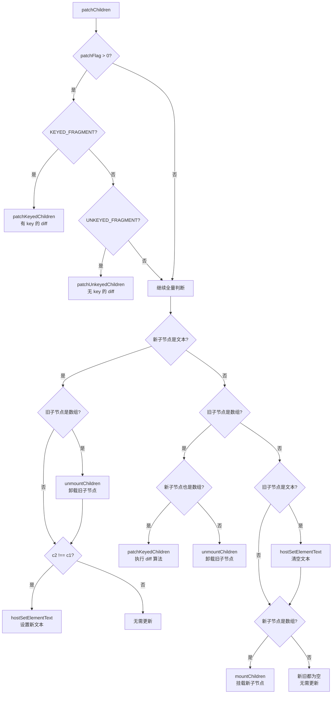

其中新旧子节点都是数组的情况涉及到我们平常所说的 `diff` 算法，会放到后面专门解析。

#### processComponent：组件更新

看完处理 DOM 元素的情况，接下来看处理 Vue 组件：

```ts
// Vue 3.5 - packages/runtime-core/src/renderer.ts
const processComponent = (
  n1, n2, container, anchor, parentComponent,
  parentSuspense, namespace, slotScopeIds, optimized,
) => {
  n2.slotScopeIds = slotScopeIds
  if (n1 == null) {
    // 挂载逻辑...
  } else {
    updateComponent(n1, n2, optimized)
  }
}
```

`processComponent` 更新逻辑调用 `updateComponent` 函数：

```ts
// Vue 3.5 - packages/runtime-core/src/renderer.ts
const updateComponent = (n1: VNode, n2: VNode, optimized: boolean) => {
  const instance = (n2.component = n1.component)!
  if (shouldUpdateComponent(n1, n2, optimized)) {
    if (
      __FEATURE_SUSPENSE__ &&
      instance.asyncDep &&
      !instance.asyncResolved
    ) {
      // 异步组件且尚未解析完成 → 仅更新 props 和 slots
      updateComponentPreRender(instance, n2, optimized)
      return
    } else {
      // 正常更新：将新 vnode 赋值给 next，触发更新
      instance.next = n2
      // instance.update 是 ReactiveEffect.run 的绑定版本
      instance.update()
    }
  } else {
    // 不需要更新，仅复制属性
    n2.el = n1.el
    instance.vnode = n2
  }
}
```

`updateComponent` 的核心逻辑是通过 `shouldUpdateComponent` 判断是否需要更新。如果需要更新，则将新的 vnode 赋值给 `instance.next`，然后调用 `instance.update()` 触发组件的副作用渲染函数重新执行。如果不需要更新，则仅将旧节点的 el 和 vnode 信息复制到新节点上。

注意 Vue 3.5 中 `instance.update()` 的实现——它是 `effect.run.bind(effect)`，直接调用会执行 `componentUpdateFn`。这与通过调度器触发的 `effect.runIfDirty()` 不同：手动调用 `update()` 会无条件执行，而调度器触发时会先进行脏检查。

> **设计洞察**：为什么 `updateComponent` 中直接调用 `instance.update()` 而不是通过调度器？因为当父组件 patch 到子组件时，父组件的更新已经在执行中，子组件的更新应该同步完成，而不是异步排队。这保证了组件树更新的深度优先顺序——父组件更新时，子组件的更新在父组件的 patch 过程中就完成了。

##### shouldUpdateComponent：判断是否需要更新

`shouldUpdateComponent` 是组件更新优化的关键函数，它决定了子组件是否需要因为父组件的变化而重新渲染：

```ts
// Vue 3.5 - packages/runtime-core/src/componentRenderUtils.ts
export function shouldUpdateComponent(
  prevVNode: VNode,
  nextVNode: VNode,
  optimized?: boolean,
): boolean {
  const { props: prevProps, children: prevChildren, component } = prevVNode
  const { props: nextProps, children: nextChildren, patchFlag } = nextVNode
  const emits = component!.emitsOptions

  // HMR 更新时强制子组件更新
  if (__DEV__ && (prevChildren || nextChildren) && isHmrUpdating) {
    return true
  }

  // 有指令或过渡的组件 vnode，强制更新
  if (nextVNode.dirs || nextVNode.transition) {
    return true
  }

  if (optimized && patchFlag >= 0) {
    // 编译器优化路径
    if (patchFlag & PatchFlags.DYNAMIC_SLOTS) {
      // 动态 slots（如 v-for 中的 slot）需要更新
      return true
    }
    if (patchFlag & PatchFlags.FULL_PROPS) {
      // 完整 props 比对
      if (!prevProps) {
        return !!nextProps
      }
      return hasPropsChanged(prevProps, nextProps!, emits)
    } else if (patchFlag & PatchFlags.PROPS) {
      // 仅比对动态 props
      const dynamicProps = nextVNode.dynamicProps!
      for (let i = 0; i < dynamicProps.length; i++) {
        const key = dynamicProps[i]
        if (
          nextProps![key] !== prevProps![key] &&
          !isEmitListener(emits, key)
        ) {
          return true
        }
      }
    }
  } else {
    // 手写渲染函数路径
    // 有子内容（slots）且不稳定 → 需要更新
    if (prevChildren || nextChildren) {
      if (!nextChildren || !(nextChildren as any).$stable) {
        return true
      }
    }
    // props 引用相同 → 不需要更新
    if (prevProps === nextProps) {
      return false
    }
    // 旧 props 为空，新 props 不为空 → 需要更新
    if (!prevProps) {
      return !!nextProps
    }
    // 新 props 为空 → 需要更新
    if (!nextProps) {
      return true
    }
    // 完整 props 比对
    return hasPropsChanged(prevProps, nextProps, emits)
  }

  return false
}

function hasPropsChanged(
  prevProps: Data,
  nextProps: Data,
  emitsOptions: ComponentInternalInstance['emitsOptions'],
): boolean {
  const nextKeys = Object.keys(nextProps)
  if (nextKeys.length !== Object.keys(prevProps).length) {
    return true
  }
  for (let i = 0; i < nextKeys.length; i++) {
    const key = nextKeys[i]
    if (
      nextProps[key] !== prevProps[key] &&
      !isEmitListener(emitsOptions, key)
    ) {
      return true
    }
  }
  return false
}
```

`shouldUpdateComponent` 的判断逻辑可以分为两条路径：

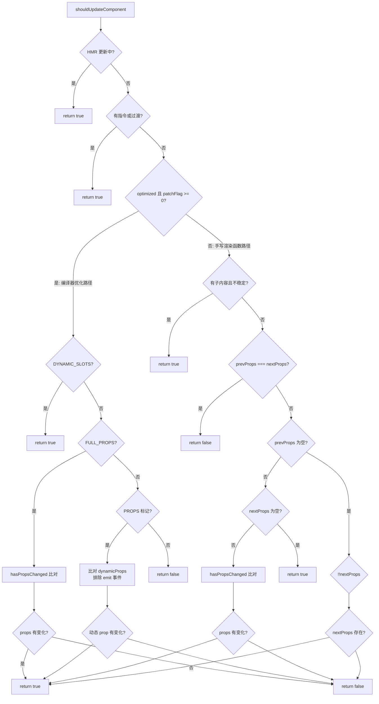

`shouldUpdateComponent` 中有一个精妙的优化：在比对 props 变化时，会通过 `isEmitListener(emitsOptions, key)` 排除掉 emit 事件的监听器。考虑这个场景：

```html
<Child @update:modelValue="handler" />
```

编译后，`onUpdate:modelValue` 会作为 prop 传入子组件。但每次父组件重新渲染时，`handler` 可能是一个新的函数引用（除非用 `@vue/reactivity` 的缓存机制），导致 `prevProps[key] !== nextProps[key]`。然而，emit 监听器的变化不应该触发子组件更新——因为子组件只是"发射"事件，并不"消费"这些监听器。通过 `isEmitListener` 过滤，Vue 避免了大量因事件监听器引用变化导致的无效子组件更新。

> **设计洞察**：`shouldUpdateComponent` 体现了 Vue 更新粒度控制的核心思想——组件级别的细粒度更新。它不是简单地"父组件更新就更新所有子组件"，而是在源码层面帮我们过滤掉了不必要的子组件更新。这种优化在大型组件树中效果尤为显著。

#### 完整流程演示

为了更好地理解整体流程，以下通过一个具体的 demo 进行说明：

```html
<!-- App.vue -->
<template>
  <div>
    hello world
    <hello :msg="msg" />
    <button @click="changeMsg">修改 msg</button>
  </div>
</template>
<script setup>
import { ref } from 'vue'
import Hello from './hello.vue'

const msg = ref('你好')
function changeMsg() {
  msg.value = '你好啊，我变了'
}
</script>

<!-- hello.vue -->
<template>
  <div>{{ msg }}</div>
</template>
<script setup>
defineProps({
  msg: String
})
</script>
```

当点击"修改 msg"按钮后，完整的更新流程如下：

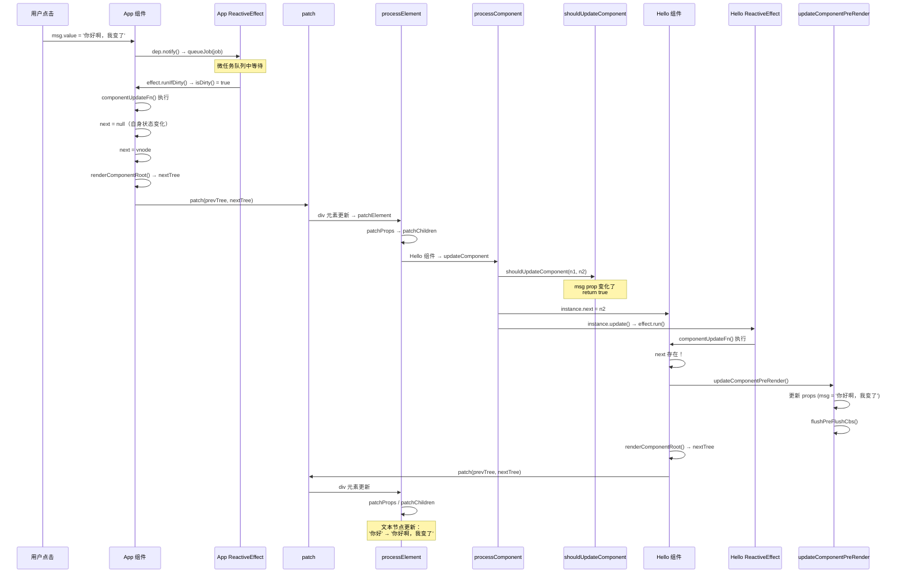

整个流程的关键步骤：

1. **App 组件自身状态变化**：`msg.value` 变化触发 App 的 ReactiveEffect，通过调度器入队 job
2. **App 组件执行更新**：`next` 为 `null`（自身状态变化），直接用当前 vnode 渲染新子树
3. **patch 比对子树**：遇到 div 元素走 `processElement`，遇到 Hello 组件走 `processComponent`
4. **Hello 组件判断更新**：`shouldUpdateComponent` 检测到 `msg` prop 变化，返回 `true`
5. **Hello 组件设置 next**：将新的 vnode 赋值给 `instance.next`，调用 `instance.update()`
6. **Hello 组件执行更新**：`next` 存在，先执行 `updateComponentPreRender` 更新 props，再渲染新子树
7. **Hello 组件 patch 子树**：最终更新 DOM 中的文本内容

> **设计洞察**：注意步骤 5 中 `instance.update()` 是同步调用的，而不是通过调度器异步排队。这保证了组件树的更新是深度优先的——父组件更新时，所有子组件的更新在同一个同步调用栈中完成。而步骤 1 中 App 组件的更新是通过调度器异步触发的，这保证了多个响应式数据变化只会触发一次组件更新。


### Diff 算法实现

#### 0. Block Tree 与靶向更新：diff 的前置优化

##### 0.1 传统 diff 的性能瓶颈

在传统的虚拟 DOM diff 中，即使模板中只有一处动态内容发生变化，框架也必须遍历整棵虚拟 DOM 树进行比对。例如：

```html
<div>
  <p>静态文本</p>
  <p>静态文本</p>
  <p>静态文本</p>
  <p>{{ dynamicText }}</p>
</div>
```

当 `dynamicText` 变化时，传统 diff 仍然需要逐个比对所有 4 个 `<p>` 节点，即使前 3 个节点永远不会变化。

##### 0.2 Block Tree 的核心思想

Vue 3 引入了 **Block Tree** 机制来解决这个问题。Block 是一种特殊的 VNode，它除了自身的信息外，还维护一个 **dynamicChildren** 数组，只收集其内部动态子孙节点的引用。

编译器在编译模板时，会为每个动态节点打上 **PatchFlag**（补丁标志），标识该节点哪些部分是动态的。运行时在创建 VNode 树时，通过 `openBlock` / `createBlock` 将动态节点收集到当前 Block 的 `dynamicChildren` 中。

```typescript
// 编译器生成的渲染函数伪代码
function render() {
  return (
    openBlock(),       // 开启一个新的 Block 上下文
    createBlock('div', null, [
      createVNode('p', null, '静态文本', PatchFlags.HOISTED),   // 静态节点，不收集
      createVNode('p', null, '静态文本', PatchFlags.HOISTED),   // 静态节点，不收集
      createVNode('p', null, '静态文本', PatchFlags.HOISTED),   // 静态节点，不收集
      createVNode('p', null, dynamicText, PatchFlags.TEXT),     // 动态节点，收集到 Block
    ])
  )
}
```

上述渲染函数执行后，Block 的 `dynamicChildren` 只包含最后一个 `<p>` 节点：

```
Block.dynamicChildren = [ VNode<p>{{ dynamicText }}</p> ]
```

##### 0.3 PatchFlags 枚举定义

PatchFlags 是编译器生成的优化提示，定义在 `packages/shared/src/patchFlags.ts` 中：

| 标志 | 值 | 含义 |
|------|-----|------|
| `TEXT` | 1 | 动态文本内容 |
| `CLASS` | 2 | 动态 class 绑定 |
| `STYLE` | 4 | 动态 style 绑定 |
| `PROPS` | 8 | 动态非 class/style 属性 |
| `FULL_PROPS` | 16 | 动态 key 的属性（需全量 diff） |
| `NEED_HYDRATION` | 32 | 需要 hydration 的属性（事件等） |
| `STABLE_FRAGMENT` | 64 | 子节点顺序不变的 Fragment |
| `KEYED_FRAGMENT` | 128 | 带 key 的 Fragment 子节点 |
| `UNKEYED_FRAGMENT` | 256 | 不带 key 的 Fragment 子节点 |
| `NEED_PATCH` | 512 | 需要 patch（ref、指令等） |
| `DYNAMIC_SLOTS` | 1024 | 动态插槽 |
| `DEV_ROOT_FRAGMENT` | 2048 | 开发模式下的根级 Fragment |
| `CACHED` | -1 | 被缓存的静态 VNode |
| `BAIL` | -2 | 退出优化模式 |

##### 0.4 patchBlockChildren：靶向更新路径

当 VNode 拥有 `dynamicChildren` 时，`patchElement` 不会进入全量 diff，而是调用 `patchBlockChildren` 进行靶向更新：

```typescript
// packages/runtime-core/src/renderer.ts
const patchBlockChildren: PatchBlockChildrenFn = (
  oldChildren,
  newChildren,
  fallbackContainer,
  parentComponent,
  parentSuspense,
  namespace: ElementNamespace,
  slotScopeIds,
) => {
  for (let i = 0; i < newChildren.length; i++) {
    const oldVNode = oldChildren[i]
    const newVNode = newChildren[i]
    // 确定容器（父元素）
    const container =
      oldVNode.el &&
      (oldVNode.type === Fragment ||
        !isSameVNodeType(oldVNode, newVNode) ||
        oldVNode.shapeFlag & (ShapeFlags.COMPONENT | ShapeFlags.TELEPORT))
        ? hostParentNode(oldVNode.el)!
        : fallbackContainer
    patch(
      oldVNode,
      newVNode,
      container,
      null,
      parentComponent,
      parentSuspense,
      namespace,
      slotScopeIds,
      true /* optimized */,
    )
  }
}
```

`patchBlockChildren` 的核心逻辑非常简单：**只遍历 `dynamicChildren` 数组中的动态节点，逐一 patch**。由于跳过了所有静态节点，时间复杂度从 O(整棵子树) 降低到 O(动态节点数)。

##### 0.5 何时回退到全量 diff

并非所有场景都能走靶向更新路径。以下情况会回退到全量 diff：

1. **VNode 没有 `dynamicChildren`**：手动编写的渲染函数（h 函数）不会生成 Block 结构
2. **`patchFlag === BAIL (-2)`**：编译器判断无法优化，主动退出
3. **HMR 更新**：开发环境热更新时强制全量 diff
4. **Fragment 包含动态子节点但非 STABLE_FRAGMENT**：子节点顺序可能变化，需要完整 diff

回退路径在 `patchElement` 中体现为：

```typescript
if (dynamicChildren) {
  // 靶向更新路径
  patchBlockChildren(
    n1.dynamicChildren!,
    dynamicChildren,
    el,
    parentComponent,
    parentSuspense,
    resolveChildrenNamespace(n2, namespace),
    slotScopeIds,
  )
} else if (!optimized) {
  // 全量 diff 路径
  patchChildren(
    n1,
    n2,
    el,
    null,
    parentComponent,
    parentSuspense,
    resolveChildrenNamespace(n2, namespace),
    slotScopeIds,
    false,
  )
}
```

##### 0.6 Block Tree 与 diff 算法的关系

理解 Block Tree 优化后，我们可以更清晰地定位 `patchKeyedChildren`（五步 diff 算法）的适用场景：

```mermaid
flowchart TD
    A[组件更新] --> B{VNode 有 dynamicChildren?}
    B -->|是| C[patchBlockChildren<br/>靶向更新]
    B -->|否| D{patchFlag > 0?}
    D -->|KEYED_FRAGMENT| E[patchKeyedChildren<br/>五步 diff]
    D -->|UNKEYED_FRAGMENT| F[patchUnkeyedChildren<br/>无 key diff]
    D -->|否| G{新旧子节点都是数组?}
    G -->|是| E
    G -->|否| H[其他子节点处理逻辑]
    C --> I[仅遍历动态节点<br/>O(动态节点数)]
    E --> J[五步 diff 算法<br/>O(子节点数)]
```

Block Tree 优化使得很多场景根本不需要进入五步 diff，但当子节点是带 key 的列表且顺序可能变化时（如 `v-for` 渲染的列表），仍然需要 `patchKeyedChildren` 进行完整的 diff。接下来，我们就深入分析这个五步 diff 算法。

#### 1. 从头比对

Vue 3 的 diff 算法第一步就是从头比对新老节点，判断是否为同类型节点：

```typescript
// packages/runtime-core/src/renderer.ts
const patchKeyedChildren = (
  c1: VNode[],
  c2: VNodeArrayChildren,
  container: RendererElement,
  parentAnchor: RendererNode | null,
  parentComponent: ComponentInternalInstance | null,
  parentSuspense: SuspenseBoundary | null,
  namespace: ElementNamespace,
  slotScopeIds: string[] | null,
  optimized: boolean,
) => {
  let i = 0
  const l2 = c2.length
  let e1 = c1.length - 1 // 旧节点的尾部索引
  let e2 = l2 - 1         // 新节点的尾部索引

  // 1. sync from start
  // (a b) c
  // (a b) d e
  while (i <= e1 && i <= e2) {
    const n1 = c1[i]
    const n2 = (c2[i] = optimized
      ? cloneIfMounted(c2[i] as VNode)
      : normalizeVNode(c2[i]))
    if (isSameVNodeType(n1, n2)) {
      patch(
        n1,
        n2,
        container,
        null,
        parentComponent,
        parentSuspense,
        namespace,
        slotScopeIds,
        optimized,
      )
    } else {
      break
    }
    i++
  }
}
```

这里有几个关键变量需要说明：

1. **`i`**：头部指针，从 0 开始递增
2. **`e1`**：旧子节点的尾部索引，初始值为 `c1.length - 1`
3. **`e2`**：新子节点的尾部索引，初始值为 `c2.length - 1`

从头比对的核心逻辑：不断移动头部指针 `i`，比较 `c1[i]` 和 `c2[i]` 是否为 `sameVnode`（key 相同且类型相同）。如果是，则递归执行 `patch` 更新节点；如果不满足条件，则退出头部比对，进入从尾比对流程。

`isSameVNodeType` 的判断逻辑如下：

```typescript
export function isSameVNodeType(n1: VNode, n2: VNode): boolean {
  // 类型相同且 key 相同
  return n1.type === n2.type && n1.key === n2.key
}
```

用图示表示从头比对的过程：

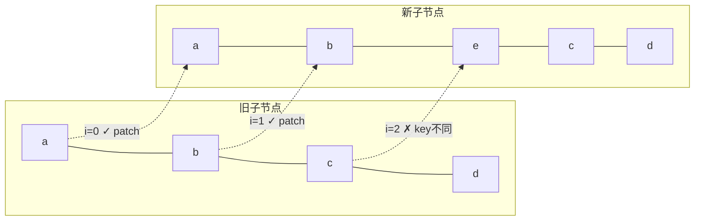

#### 2. 从尾比对

头部比对结束后，进入从尾比对流程：

```typescript
  // 2. sync from end
  // a (b c)
  // d e (b c)
  while (i <= e1 && i <= e2) {
    const n1 = c1[e1]
    const n2 = (c2[e2] = optimized
      ? cloneIfMounted(c2[e2] as VNode)
      : normalizeVNode(c2[e2]))
    if (isSameVNodeType(n1, n2)) {
      patch(
        n1,
        n2,
        container,
        null,
        parentComponent,
        parentSuspense,
        namespace,
        slotScopeIds,
        optimized,
      )
    } else {
      break
    }
    e1--
    e2--
  }
```

从尾比对的核心逻辑：同时移动新旧节点的尾部指针 `e1` 和 `e2`，比较 `c1[e1]` 和 `c2[e2]` 是否为 `sameVnode`。如果是，则递归 `patch`；如果不满足条件，则退出尾部比对。

用图示表示从尾比对的过程（接续上例）：

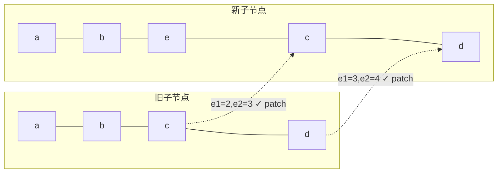

经过步骤 1 和步骤 2 后，指针状态为：`i = 2, e1 = 1, e2 = 2`。此时 `i > e1`，满足新增节点的条件。

#### 3. 新增节点

当头部比对和尾部比对结束后，如果 `i > e1` 且 `i <= e2`，说明新子序列中还有剩余节点需要新增。

假设旧列表为 `[a, b, c, d]`，新列表为 `[a, b, e, c, d]`：

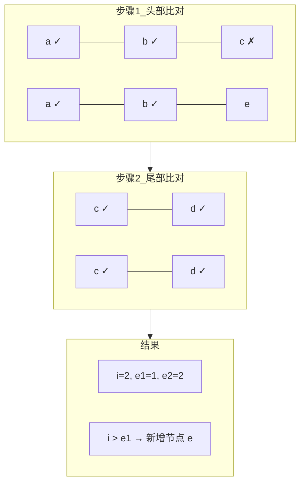

新增节点的源码实现：

```typescript
  // 3. common sequence + mount
  // (a b)
  // (a b) c
  // i = 2, e1 = 1, e2 = 2
  // (a b)
  // c (a b)
  // i = 0, e1 = -1, e2 = 0
  if (i > e1) {
    if (i <= e2) {
      const nextPos = e2 + 1
      // 锚点：如果 nextPos 在新子节点范围内，取其 el 作为插入参照
      // 否则使用 parentAnchor（父容器的末尾锚点）
      const anchor = nextPos < l2 ? (c2[nextPos] as VNode).el : parentAnchor
      while (i <= e2) {
        patch(
          null,
          (c2[i] = optimized
            ? cloneIfMounted(c2[i] as VNode)
            : normalizeVNode(c2[i])),
          container,
          anchor,
          parentComponent,
          parentSuspense,
          namespace,
          slotScopeIds,
          optimized,
        )
        i++
      }
    }
  }
```

**锚点（anchor）的确定逻辑**是新增节点的关键细节：

- `nextPos = e2 + 1`：指向新子序列剩余部分之后的第一个节点
- 如果 `nextPos < l2`，说明后面还有节点，新增的节点应插入到 `c2[nextPos].el` 之前
- 如果 `nextPos >= l2`，说明后面没有节点了，新增的节点追加到父容器末尾

这确保了新增节点被插入到正确的位置。例如，新列表为 `[c, a, b]`、旧列表为 `[a, b]` 时，经过头部比对后 `i = 0, e1 = -1, e2 = 0`，`c` 需要插入到 `a` 之前，此时 `anchor` 就是 `a.el`。

#### 4. 删除节点

类比新增节点的情况，当 `i > e2` 时，说明旧子序列中还有剩余节点需要删除。

假设旧列表为 `[a, b, e, c, d]`，新列表为 `[a, b, c, d]`：

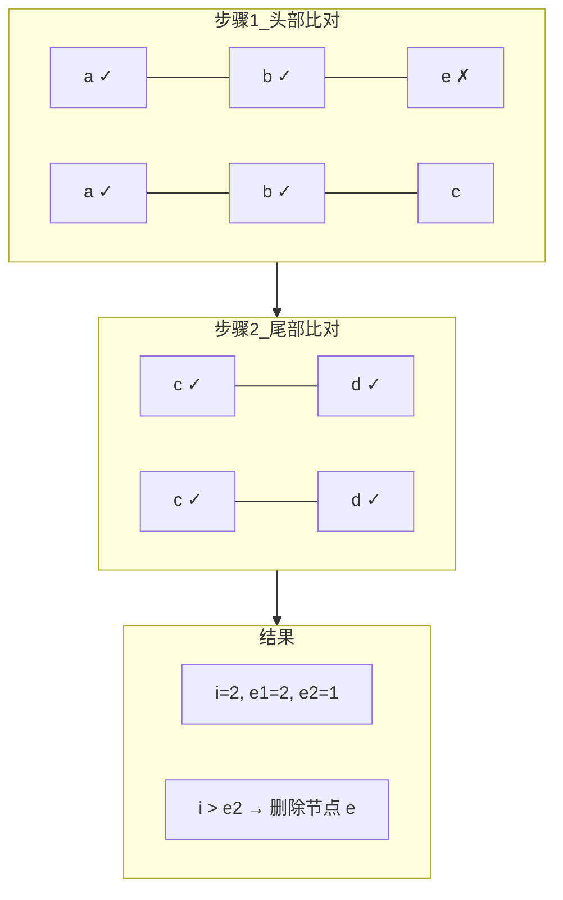

删除节点的源码实现：

```typescript
  // 4. common sequence + unmount
  // (a b) c
  // (a b)
  // i = 2, e1 = 2, e2 = 1
  // a (b c)
  // (b c)
  // i = 0, e1 = 0, e2 = -1
  else if (i > e2) {
    while (i <= e1) {
      unmount(c1[i], parentComponent, parentSuspense, true)
      i++
    }
  }
```

删除逻辑相对简单：遍历旧子序列中从 `i` 到 `e1` 的所有节点，逐一调用 `unmount` 卸载。

#### 5. 未知子序列

经过步骤 1、2 后，如果既不满足 `i > e1`（新增），也不满足 `i > e2`（删除），说明中间存在一个"未知子序列"，需要更复杂的处理。来看一个典型例子：

旧子节点：`[a, b, c, d, e, f, g, h]`

新子节点：`[a, b, e, c, d, i, g, h]`

经过步骤 1、2 后：

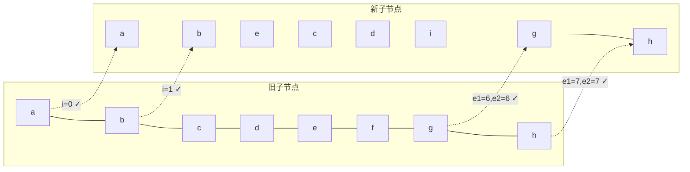

此时指针状态：`i = 2, e1 = 5, e2 = 5`。中间的未知子序列为：

- 旧：`[c, d, e, f]`（索引 2~5）
- 新：`[e, c, d, i]`（索引 2~5）

这种情况既不满足 `i > e1` 也不满足 `i > e2`，需要更精细的 diff 策略。

##### 5.0 性能优化的核心原则

DOM 操作的性能优劣关系大致为：**属性更新 > 位置移动 > 增删节点**。因此，diff 算法的优化目标是：

1. 尽可能复用旧节点，只做属性更新（patch）
2. 减少节点移动次数
3. 减少增删节点的次数

对于上述例子，有两种更新策略：

| 策略 | 操作 | 移动次数 | 新增 | 删除 |
|------|------|----------|------|------|
| 策略 A | c、d 不动只 patch；e patch 后移到 c 前面；删除 f；在 d 后新增 i | 1 | 1 | 1 |
| 策略 B | e 不动只 patch；c、d patch 后移到 e 后面；删除 f；在 d 后新增 i | 2 | 1 | 1 |

策略 A 更优，因为移动次数更少。如何找到最少移动次数？这就需要**最长递增子序列（LIS）**算法。

##### 5.1 构建新节点 key → index 映射

```typescript
  // 5. unknown sequence
  // [i ... e1 + 1]: a b [c d e] f g
  // [i ... e2 + 1]: a b [e d c h] f g
  // i = 2, e1 = 4, e2 = 5
  else {
    const s1 = i // 旧子序列起始索引
    const s2 = i // 新子序列起始索引

    // 5.1 build key:index map for newChildren
    const keyToNewIndexMap: Map<PropertyKey, number> = new Map()
    for (i = s2; i <= e2; i++) {
      const nextChild = (c2[i] = optimized
        ? cloneIfMounted(c2[i] as VNode)
        : normalizeVNode(c2[i]))
      if (nextChild.key != null) {
        if (__DEV__ && keyToNewIndexMap.has(nextChild.key)) {
          warn(
            `Duplicate keys found during update:`,
            JSON.stringify(nextChild.key),
            `Make sure keys are unique.`,
          )
        }
        keyToNewIndexMap.set(nextChild.key, i)
      }
    }
```

这一步构建新子序列的 `key → index` 映射表 `keyToNewIndexMap`，用于后续快速查找旧节点在新子序列中的位置。

对于我们的例子，新子序列 `[e, c, d, i]` 对应的索引为 `[2, 3, 4, 5]`，生成的映射为：

```
keyToNewIndexMap = {
  e → 2,
  c → 3,
  d → 4,
  i → 5
}
```

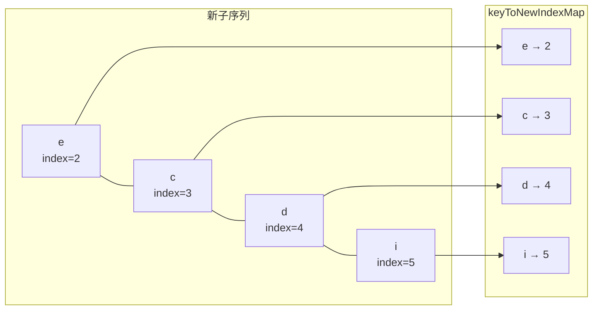

注意：Vue 3.5 在开发环境下增加了**重复 key 检测**，如果发现重复 key 会发出警告，帮助开发者及早发现问题。

##### 5.2 遍历旧节点：更新、删除、构建位置映射

有了 `keyToNewIndexMap`，接下来遍历旧子序列，寻找旧节点在新子序列中的位置：

```typescript
    // 5.2 loop through old children left to be patched and try to patch
    // matching nodes & remove nodes that are no longer present
    let j
    let patched = 0
    const toBePatched = e2 - s2 + 1  // 新子序列中待处理的节点数
    let moved = false                  // 是否需要移动节点
    // used to track whether any node has moved
    let maxNewIndexSoFar = 0           // 追踪遍历过程中遇到的最大新索引
    // works as Map<newIndex, oldIndex>
    // Note that oldIndex is offset by +1
    // and oldIndex = 0 is a special value indicating the new node has
    // no corresponding old node.
    // used for determining longest stable subsequence
    const newIndexToOldIndexMap = new Array(toBePatched)
    for (i = 0; i < toBePatched; i++) newIndexToOldIndexMap[i] = 0

    for (i = s1; i <= e1; i++) {
      const prevChild = c1[i]
      if (patched >= toBePatched) {
        // 所有新节点都已更新，剩余旧节点只能被删除
        unmount(prevChild, parentComponent, parentSuspense, true)
        continue
      }
      let newIndex
      if (prevChild.key != null) {
        // 有 key 的节点，通过 keyToNewIndexMap 快速查找
        newIndex = keyToNewIndexMap.get(prevChild.key)
      } else {
        // 无 key 的节点，遍历新子序列查找同类型节点
        for (j = s2; j <= e2; j++) {
          if (
            newIndexToOldIndexMap[j - s2] === 0 &&
            isSameVNodeType(prevChild, c2[j] as VNode)
          ) {
            newIndex = j
            break
          }
        }
      }
      if (newIndex === undefined) {
        // 旧节点不存在于新子序列中，卸载
        unmount(prevChild, parentComponent, parentSuspense, true)
      } else {
        // 记录新节点在旧子序列中的位置（+1 偏移，0 表示新增）
        newIndexToOldIndexMap[newIndex - s2] = i + 1
        // 判断是否有节点移动
        if (newIndex >= maxNewIndexSoFar) {
          maxNewIndexSoFar = newIndex
        } else {
          moved = true
        }
        // 更新节点
        patch(
          prevChild,
          c2[newIndex] as VNode,
          container,
          null,
          parentComponent,
          parentSuspense,
          namespace,
          slotScopeIds,
          optimized,
        )
        patched++
      }
    }
```

这一步的核心操作可以总结为四个要点：

**要点 1：`newIndexToOldIndexMap` 的设计**

`newIndexToOldIndexMap` 是一个长度为 `toBePatched` 的数组，索引对应新子序列的相对位置，值对应旧子序列中的位置（+1 偏移）。**0 是特殊值，表示该新节点在旧子序列中不存在**（需要新增）。+1 偏移是为了区分"位置 0"和"不存在"两种语义。

**要点 2：`patched >= toBePatched` 的提前终止优化**

如果已更新的节点数 `patched` 达到了新子序列的节点总数 `toBePatched`，说明所有新节点都已找到匹配，剩余的旧节点必然是多余的，直接卸载即可。这是一个重要的提前终止优化。

**要点 3：`moved` 标志的判断逻辑**

遍历旧子序列时，如果旧节点在新子序列中的位置 `newIndex` 始终是递增的，说明节点相对顺序没有变化，不需要移动。一旦出现 `newIndex < maxNewIndexSoFar`（降序），就标记 `moved = true`。

例如，旧节点 `[c, d, e, f]` 依次查找在新子序列 `[e, c, d, i]` 中的位置：

| 旧节点 | newIndex | maxNewIndexSoFar | moved |
|--------|----------|------------------|-------|
| c (i=2) | 3 | 3 | false |
| d (i=3) | 4 | 4 | false |
| e (i=4) | 2 | 4 | **true** |
| f (i=5) | undefined | - | 删除 |

当遍历到 `e` 时，`newIndex = 2 < maxNewIndexSoFar = 4`，说明 `e` 的位置发生了倒退，需要移动。

**要点 4：无 key 节点的回退查找**

对于没有 key 的节点，无法通过 `keyToNewIndexMap` 快速查找，只能遍历新子序列，寻找类型相同且尚未被匹配的节点。这也是为什么不推荐用 `index` 作为 key 的原因之一——当节点没有稳定的 key 时，diff 效率会降低。

经过这一步，我们得到：

```
newIndexToOldIndexMap = [5, 3, 4, 0]
                        ↑  ↑  ↑  ↑
                        e  c  d  i
                        |  |  |  新增节点（0表示旧中不存在）
                        |  |  旧索引3+1=4（d在旧中位置3）
                        |  旧索引2+1=3（c在旧中位置2）
                        旧索引4+1=5（e在旧中位置4）
```

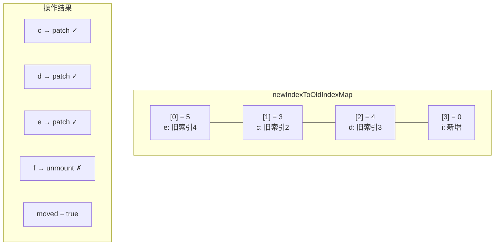

##### 5.3 移动和新增节点

通过前面的操作，我们完成了旧节点的更新和删除。接下来需要处理节点的移动和新节点的添加：

```typescript
    // 5.3 move and mount
    // generate longest stable subsequence only when nodes have moved
    const increasingNewIndexSequence = moved
      ? getSequence(newIndexToOldIndexMap)
      : EMPTY_ARR
    j = increasingNewIndexSequence.length - 1
    // looping backwards so that we can use last patched node as anchor
    for (i = toBePatched - 1; i >= 0; i--) {
      const nextIndex = s2 + i
      const nextChild = c2[nextIndex] as VNode
      const anchor =
        nextIndex + 1 < l2 ? (c2[nextIndex + 1] as VNode).el : parentAnchor
      if (newIndexToOldIndexMap[i] === 0) {
        // mount new
        patch(
          null,
          nextChild,
          container,
          anchor,
          parentComponent,
          parentSuspense,
          namespace,
          slotScopeIds,
          optimized,
        )
      } else if (moved) {
        // move if:
        // There is no stable subsequence (e.g. a reverse)
        // OR current node is not among the stable sequence
        if (j < 0 || i !== increasingNewIndexSequence[j]) {
          move(nextChild, container, anchor, MoveType.REORDER)
        } else {
          j--
        }
      }
    }
  }
```

**要点 1：仅在 `moved = true` 时求 LIS**

如果 `moved = false`，说明所有节点相对顺序没有变化，不需要移动，直接跳过 LIS 计算。这是一个重要的优化——LIS 计算的时间复杂度为 O(n log n)，在不需要移动时可以完全避免。

**要点 2：从尾部向前遍历**

遍历方向从 `toBePatched - 1` 到 `0`（即从后向前），这样每次处理完一个节点后，它自然成为下一个节点的锚点参照。`anchor` 的计算逻辑：

- `nextIndex + 1 < l2`：如果当前节点后面还有节点，取其 `el` 作为插入锚点
- 否则使用 `parentAnchor`（父容器的末尾锚点）

**要点 3：三种操作分支**

| 条件 | 操作 | 含义 |
|------|------|------|
| `newIndexToOldIndexMap[i] === 0` | `patch(null, ...)` | 新增节点 |
| `moved && (j < 0 \|\| i !== LIS[j])` | `move(...)` | 移动节点 |
| `moved && i === LIS[j]` | `j--` | 节点在 LIS 中，不移动 |

**要点 4：LIS 的作用**

最长递增子序列标识了在新子序列中**相对顺序与旧子序列一致**的节点集合。这些节点不需要移动，只需要移动不在 LIS 中的节点。

对于我们的例子：

```
newIndexToOldIndexMap = [5, 3, 4, 0]
```

LIS 为 `[3, 4]`，对应索引 `[1, 2]`，即 `c` 和 `d` 节点不需要移动。

遍历过程如下：

| i | nextIndex | 节点 | newIndexToOldIndexMap[i] | 操作 |
|---|-----------|------|--------------------------|------|
| 3 | 5 | i | 0 | 新增 |
| 2 | 4 | d | 4 | 在 LIS 中，j-- |
| 1 | 3 | c | 3 | 在 LIS 中，j-- |
| 0 | 2 | e | 5 | j < 0，移动到 c 前面 |

最终操作结果：

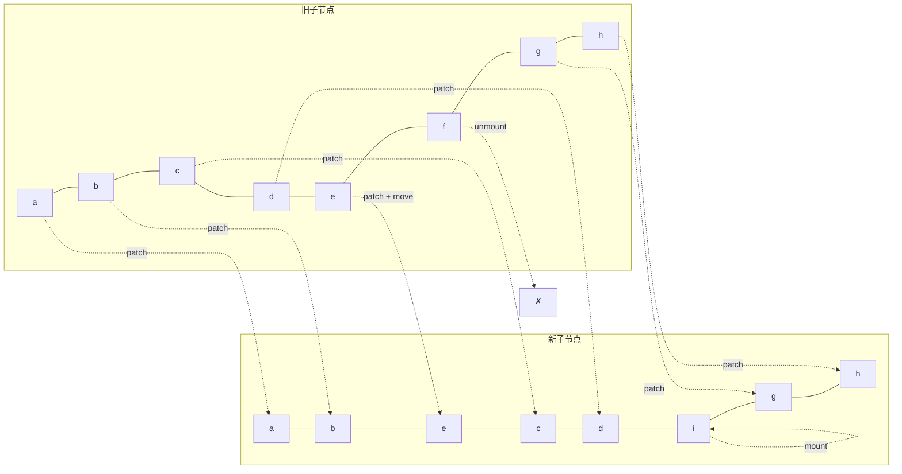

至此，完成了所有节点的增、删、更新、移动操作。

#### 6. 最长递增子序列算法详解

求最长递增子序列（Longest Increasing Subsequence, LIS）是 LeetCode 上的经典算法题（[300. 最长递增子序列](https://leetcode.cn/problems/longest-increasing-subsequence/)）。

##### 6.1 问题定义

给定一个数值序列，找到一个最长的子序列，使得子序列中的所有元素单调递增。注意：子序列不要求连续，但要求保持原序列中的相对顺序。

例如，序列 `[5, 3, 4, 0]` 的最长递增子序列为 `[3, 4]`，长度为 2。

##### 6.2 贪心 + 二分查找算法

Vue 3 使用的是**贪心 + 二分查找**算法，时间复杂度为 O(n log n)，比朴素的动态规划 O(n^2) 更高效。

**贪心思想**：对于同样长度的递增子序列，末尾值越小越好。例如 `[2, 3]` 比 `[2, 5]` 更优，因为末尾值越小，后续能接上的元素越多，潜力更大。

**算法步骤**：

1. 维护一个数组 `result`，存储递增子序列中各位置的最小末尾值的**索引**
2. 遍历输入序列的每个元素：
   - 如果当前元素大于 `result` 末尾对应的值，追加到 `result`
   - 否则，用二分查找在 `result` 中找到第一个大于当前元素的位置并替换
3. 通过回溯数组 `p` 还原正确的索引序列

##### 6.3 完整源码解析

```typescript
// packages/runtime-core/src/renderer.ts
function getSequence(arr: number[]): number[] {
  const p = arr.slice()  // 回溯数组，记录每个元素的前驱索引
  const result = [0]      // result 存储的是索引，不是值
  let i, j, u, v, c
  const len = arr.length

  for (i = 0; i < len; i++) {
    const arrI = arr[i]
    if (arrI !== 0) {  // 0 表示新增节点，跳过
      j = result[result.length - 1]
      if (arr[j] < arrI) {
        // 当前值大于 result 末尾对应的值，可以追加
        p[i] = j           // 记录前驱
        result.push(i)     // 追加当前索引
        continue
      }

      // 二分查找：在 result 中找到第一个 >= arrI 的位置
      u = 0
      v = result.length - 1
      while (u < v) {
        c = (u + v) >> 1  // 等价于 Math.floor((u + v) / 2)
        if (arr[result[c]] < arrI) {
          u = c + 1
        } else {
          v = c
        }
      }
      if (arrI < arr[result[u]]) {
        if (u > 0) {
          p[i] = result[u - 1]  // 记录前驱
        }
        result[u] = i           // 替换
      }
    }
  }

  // 回溯：从 result 的最后一个元素开始，通过 p 数组还原正确的索引序列
  u = result.length
  v = result[u - 1]
  while (u-- > 0) {
    result[u] = v
    v = p[v]
  }
  return result
}
```

##### 6.4 逐步推演

以输入序列 `[1, 4, 5, 2, 8, 7, 6, 0]` 为例，逐步推演算法执行过程：

| 步骤 | 当前值 arrI | 操作 | result | p | 说明 |
|------|------------|------|--------|---|------|
| 1 | 1 | 追加 | [0] | [0, ...] | result 末尾对应值 1 < 当前值，追加 |
| 2 | 4 | 追加 | [0, 1] | [0, 0, ...] | 1 < 4，追加 |
| 3 | 5 | 追加 | [0, 1, 2] | [0, 0, 1, ...] | 4 < 5，追加 |
| 4 | 2 | 替换 | [0, 3, 2] | [0, 0, 1, 0, ...] | 二分查找位置 1，替换；p[3]=0 |
| 5 | 8 | 追加 | [0, 3, 2, 4] | [0, 0, 1, 0, 2, ...] | 5 < 8，追加；p[4]=2 |
| 6 | 7 | 替换 | [0, 3, 2, 5] | [0, 0, 1, 0, 2, 2, ...] | 二分查找位置 3，替换；p[5]=2 |
| 7 | 6 | 替换 | [0, 3, 2, 6] | [0, 0, 1, 0, 2, 2, 2, ...] | 二分查找位置 3，替换；p[6]=2 |
| 8 | 0 | 跳过 | [0, 3, 2, 6] | 不变 | arrI === 0，跳过 |

回溯前：`result = [0, 3, 2, 6]`，`p = [0, 0, 1, 0, 2, 2, 2]`

回溯过程：

```
u = 4, v = result[3] = 6
  result[3] = 6, v = p[6] = 2
  result[2] = 2, v = p[2] = 1
  result[1] = 1, v = p[1] = 0
  result[0] = 0, v = p[0] = 0
```

回溯后：`result = [0, 1, 2, 6]`

对应原序列的值为 `[1, 4, 5, 6]`，这就是最长递增子序列。

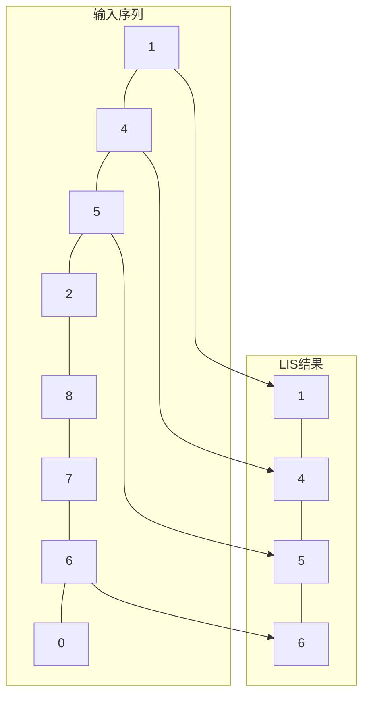

##### 6.5 为什么需要回溯数组 p

单纯使用贪心 + 二分查找，`result` 数组存储的只是"各长度递增子序列的最小末尾值索引"，并不保证是正确的递增子序列。例如步骤 7 后 `result = [0, 3, 2, 6]`，对应的值为 `[1, 2, 5, 6]`，虽然长度正确，但索引 `[0, 3, 2, 6]` 并非递增顺序。

回溯数组 `p` 记录了每个元素被加入/替换时的前驱索引，通过从 `result` 末尾向前回溯，可以还原出正确的递增索引序列 `[0, 1, 2, 6]`。

##### 6.6 算法复杂度分析

| 指标 | 复杂度 | 说明 |
|------|--------|------|
| 时间 | O(n log n) | 遍历 n 个元素，每次二分查找 O(log n) |
| 空间 | O(n) | `result` 和 `p` 数组各 O(n) |

相比朴素动态规划的 O(n^2) 时间复杂度，贪心 + 二分查找在长序列场景下有显著优势。

#### 7. 完整 diff 流程总结

将五步 diff 算法整合，完整的流程如下：

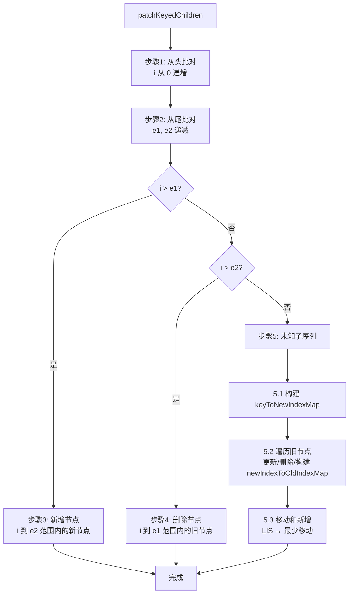

##### 五步 diff 算法的时间复杂度

| 步骤 | 时间复杂度 | 说明 |
|------|-----------|------|
| 1. 从头比对 | O(k) | k 为头部相同节点数 |
| 2. 从尾比对 | O(m) | m 为尾部相同节点数 |
| 3. 新增节点 | O(n) | n 为新增节点数 |
| 4. 删除节点 | O(n) | n 为删除节点数 |
| 5.1 构建 key 映射 | O(n) | n 为未知子序列长度 |
| 5.2 遍历旧节点 | O(n) | 每个旧节点 O(1) 查找 |
| 5.3 移动和新增 | O(n log n) | LIS 计算主导 |
| **总计** | **O(n log n)** | n 为子节点数 |

#### 8. 思考题

1. **为什么 Vue 3 不再沿用 Vue 2 的双端 diff 算法？** Vue 2 的双端 diff 使用四个指针（旧头、旧尾、新头、新尾）同时比对，虽然在某些场景下效率更高，但实现复杂度高，且与 Block Tree 优化体系不兼容。Vue 3 的五步 diff 算法在大多数实际场景中（头部/尾部相同）可以快速完成，且配合 Block Tree 的靶向更新，整体性能更优。

2. **为什么使用 `v-for` 时不建议用 `index` 作为 key？** 当列表发生变化（如插入、删除、排序）时，index 会随位置变化而重新分配，导致 key 与节点的对应关系不稳定。这会使 diff 算法误判节点是否相同，产生不必要的更新甚至渲染错误。例如，在列表头部插入一个元素后，所有元素的 index 都加 1，diff 算法会认为所有节点都需要更新，而不是简单地插入一个新节点。

3. **Block Tree 优化在什么场景下效果最显著？** 当模板中大部分内容是静态的，只有少量动态绑定时，Block Tree 的靶向更新效果最显著。极端情况下，一个包含 1000 个静态节点和 1 个动态节点的模板，传统 diff 需要比对 1001 个节点，而 Block Tree 只需比对 1 个动态节点。

## 下一步

- [模板编译原理](03-模板编译原理.md) - 学习模板如何编译为渲染函数
