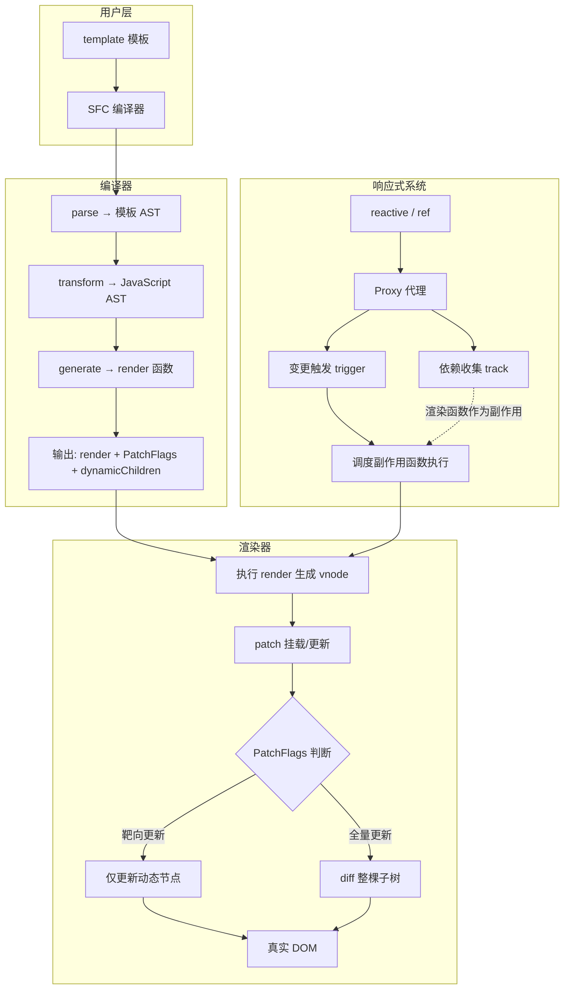
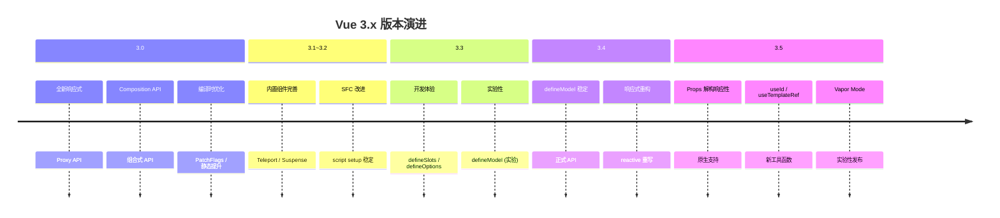
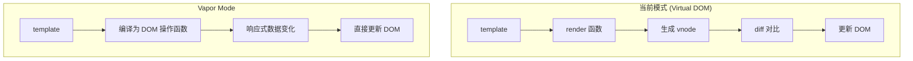
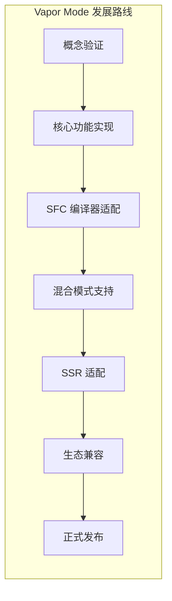

# Vue 3 演进与 Vapor Mode

> Vue 3 自 3.0 发布以来经历了多个重要版本迭代，其中 3.3、3.4、3.5 带来了大量影响深远的改进。本文梳理版本演进路线，并前瞻 Vue 的下一个重大特性——Vapor Mode。

## Vue 3 全景架构

Vue 3 的核心运行机制可以概括为四大模块的协作：



### 三大核心模块

**1. 渲染器** — 通过 `createApp` 创建渲染器，在挂载阶段通过 `patch` 函数将编译器输出的 `render` 函数执行后生成的 `vnode` 渲染为真实 DOM；在更新阶段根据 `PatchFlags` 和 `dynamicChildren` 进行靶向更新。

**2. 编译器** — 将 `template` 编译为渲染函数，核心流程：`parse`（模板 → AST）→ `transform`（AST → JSAST）→ `generate`（JSAST → render 函数）。

**3. 响应式** — 通过 `Proxy API` 实现响应式状态数据的监听，当数据变化时触发相关副作用函数重新执行。对于渲染函数这种副作用，重新执行时会比对新老 vnode 进行 diff。

### 性能优化体系

Vue 3 在编译时和运行时均做了大量性能优化：

**编译时优化：**
- `/*#__PURE__*/` 标记 → 为打包工具提供 Tree-Shaking 信息
- **静态提升（Static Hoisting）** → 静态节点只创建一次，避免重复渲染
- **PatchFlags** → 标记动态节点的更新类型（TEXT、CLASS、PROPS 等），实现靶向 diff
- **Block Tree** → 将模板按结构指令（v-if/v-for）切分为 Block，缩小 diff 范围

**运行时优化：**
- **批量队列更新** → 通过 `queueJob` 和 `nextTick` 机制合并多次更新
- **靶向更新** → 基于 `dynamicChildren` 数组只 diff 动态子节点
- **组件实例缓存** → `accessCache` 避免重复属性访问的类型判断

## Vue 3.3 ~ 3.5 演进之路

### Vue 3.3 "Rurouni"

Vue 3.3 主要聚焦于开发体验的提升，引入了多个重要的新特性：

| 特性 | 说明 |
|------|------|
| `defineSlots` | 新增编译器宏，为插槽提供完整的 TypeScript 类型支持 |
| `defineEmits` 增强 | 支持更灵活的事件类型声明语法 |
| `defineProps` 增强 | 支持从外部导入类型，解构 props 保留响应性（实验性） |
| `defineOptions` | 新增编译器宏，用于在 `<script setup>` 中声明组件选项 |
| `defineModel` (实验性) | 首次引入 defineModel 宏，简化 v-model 组件开发 |
| SFC 改进 | 支持在宏中导入外部类型、泛型组件（实验性）等 |

其中 `defineSlots` 和 `defineModel` 的引入，标志着 Vue 开始通过编译器宏来简化开发者的模板代码，这一思路在后续版本中得到了进一步深化。

### Vue 3.4 "Slam Dunk"

Vue 3.4 是一个重要的里程碑版本，带来了多项底层重构和性能提升：

| 特性 | 说明 |
|------|------|
| `defineModel` 正式稳定 | 从实验性 API 毕业为稳定 API，推荐在生产环境使用 |
| 响应式系统重构 | 重写了 reactive 的实现，优化了计算属性的缓存策略 |
| `v-model` 改进 | 支持多个 v-model 绑定时的修饰符解构 |
| 编译器优化 | 改进了模板编译的性能和输出代码质量 |
| SSR 水合改进 | 修复了多个 SSR 水合不匹配的问题 |
| `watch` 改进 | watch 回调中访问响应式数据不再触发警告 |

`defineModel` 的正式稳定是 3.4 最受关注的特性之一。它将组件中 `v-model` 的实现从手动声明 `props` + `emits` 简化为一行宏调用，极大地减少了模板代码量。

### Vue 3.5 "Tengen Toppa Gurren Lagann"

Vue 3.5 是目前最新的稳定版本线，带来了更多深层次的改进：

| 特性 | 说明 |
|------|------|
| 响应式 Props 解构 | props 解构值保持响应性，无需额外 computed |
| `useId()` | 生成跨 SSR/CSR 一致的唯一 ID |
| `useTemplateRef()` | 替代 ref 绑定模板引用的新方式 |
| Deferred Teleport | 延迟传送门，支持在目标容器之后声明 Teleport |
| `defineModel` 增强 | 修饰符解构方式改进，支持 `[value, modifiers]` 语法 |
| `defineSlots` 稳定 | 插槽类型声明宏进一步完善 |
| Lazy Hydration | 异步组件支持懒水合策略 |
| Custom Element 改进 | 更好的 Web Component 集成支持 |
| Vapor Mode (实验性) | 无虚拟 DOM 的渲染模式首次公开实验 |



## Vapor Mode：无虚拟 DOM 的未来

在 Vue 3.5 的演进中，最令人瞩目的实验性特性莫过于 Vapor Mode。这是 Vue 团队正在积极开发的一种全新渲染模式，它可以在不使用虚拟 DOM 的情况下渲染 Vue 组件。

### 为什么需要 Vapor Mode

Vue 3 当前的渲染流程是：模板编译为渲染函数 → 执行渲染函数生成虚拟 DOM（vnode）→ 对比新旧 vnode 进行 diff → 更新真实 DOM。这个流程虽然通过 PatchFlags 和靶向更新做了大量优化，但虚拟 DOM 的创建和对比仍然存在一定的性能开销。

对于一些对性能要求极高的场景（如大量列表渲染、高频更新），虚拟 DOM 的开销可能成为瓶颈。Vapor Mode 的目标就是消除这部分开销。

### 核心思路

Vapor Mode 的核心思路是：在编译阶段，直接将模板编译为操作真实 DOM 的命令式代码，跳过虚拟 DOM 的创建和 diff 过程。



这种思路与 SolidJS 的渲染模式非常相似，都是通过编译时分析，将模板直接转换为细粒度的 DOM 更新操作。

### 设计约束

Vapor Mode 并非适用于所有场景，它有一些设计约束：

1. **仅支持 SFC**：Vapor Mode 目前仅支持 `.vue` 单文件组件，不支持通过 `h()` 函数手写渲染函数的组件
2. **渐进式采用**：Vapor Mode 组件可以与虚拟 DOM 组件混合使用，支持渐进式迁移
3. **API 兼容**：Vapor Mode 组件仍然使用 Composition API、`defineProps`、`defineEmits` 等标准 API，开发体验与普通 SFC 一致

### 启用方式

在 Vapor Mode 的实验阶段，可以通过在 `<template>` 标签上添加 `vapor` 属性来启用：

```html
<template vapor>
  <div>
    <p>{{ message }}</p>
    <button @click="count++">{{ count }}</button>
  </div>
</template>

<script setup>
import { ref } from 'vue'
const message = ref('Hello Vapor!')
const count = ref(0)
</script>
```

编译后，Vapor Mode 组件不会生成基于虚拟 DOM 的渲染函数，而是生成直接操作 DOM 的更新函数：

```typescript
// Vapor Mode 编译输出（简化示意）
function render(_ctx) {
  // 创建 DOM 节点
  const div = document.createElement('div')
  const p = document.createElement('p')
  const button = document.createElement('button')

  // 设置初始值
  p.textContent = _ctx.message
  button.textContent = _ctx.count

  // 绑定事件
  button.addEventListener('click', () => _ctx.count++)

  // 响应式绑定：数据变化时直接更新 DOM
  watchEffect(() => {
    p.textContent = _ctx.message
    button.textContent = _ctx.count
  })

  div.append(p, button)
  return div
}
```

### Vapor Mode vs 虚拟 DOM 模式对比

| 维度 | 虚拟 DOM 模式 | Vapor Mode |
|------|-------------|------------|
| 渲染流程 | render → vnode → diff → DOM | render → DOM 直接操作 |
| 内存占用 | 需要维护 vnode 树 | 无 vnode 开销 |
| 更新粒度 | 组件级 + 靶向更新 | 细粒度响应式更新 |
| 首次渲染 | 较慢（需创建 vnode） | 较快（直接创建 DOM） |
| 更新性能 | 依赖 diff 算法 | 直接更新，无 diff 开销 |
| 适用范围 | 所有场景 | 仅 SFC 组件 |
| 混合使用 | - | 支持与虚拟 DOM 组件混用 |
| 成熟度 | 生产可用 | 已进入 Vue 3.6 RC，尚未正式发布 |

### 当前状态

截至审校时点（2026-09），Vapor Mode 已随 Vue 3.6 进入 RC（候选发布）阶段，但仍未随正式版发布。Vue 团队正在积极开发中，核心功能已经可以在实验环境中运行。主要挑战包括：

1. **编译器适配**：需要为 Vapor Mode 开发一套全新的编译器输出逻辑
2. **生态兼容**：需要确保与现有 Vue 生态（路由、状态管理、UI 库等）的兼容性
3. **混合渲染**：Vapor Mode 组件与虚拟 DOM 组件的混合使用需要精心设计边界交互
4. **SSR 支持**：服务端渲染的适配工作仍在进行中



## 核心设计理念回顾

回顾 Vue 3 的整体设计，可以提炼出几个核心设计理念：

**1. 渐进式框架** — Vue 3 始终坚持渐进式的设计哲学。从最基础的声明式渲染，到组件化开发，再到路由、状态管理、构建工具，开发者可以根据项目需求逐步引入。Vapor Mode 的设计也遵循了这一理念——它不是替代虚拟 DOM 模式，而是提供了一种可选的高性能渲染方式，支持渐进式采用。

**2. 编译时与运行时的协同优化** — Vue 3 最大的架构优势之一就是编译时和运行时的紧密配合。编译器通过静态分析模板，生成 PatchFlags、dynamicChildren、SlotFlags 等优化标记，运行时则根据这些标记进行靶向更新。`defineModel`、`defineSlots` 等编译器宏也是这一思路的延伸——通过编译时的代码生成，减少运行时的模板代码。

**3. 响应式驱动的细粒度更新** — Vue 3 的响应式系统基于 Proxy API，实现了对状态数据变化的精确追踪。当响应式数据变化时，只会触发与之相关的副作用函数重新执行，而不是全量更新。Vapor Mode 将这一理念推向了极致——完全跳过虚拟 DOM 的 diff 过程，直接在响应式数据变化时更新对应的 DOM 节点。

**4. 开发体验与性能的平衡** — Vue 3 在开发体验和性能之间始终寻求平衡。Composition API 提供了更灵活的逻辑组织方式；`<script setup>` 和编译器宏减少了模板代码；TypeScript 支持让大型项目更加可靠。同时，编译时优化和运行时靶向更新确保了这些便利不会以牺牲性能为代价。

## 总结

Vue 3 的演进从未停止。从 3.0 的全新架构，到 3.3~3.5 的开发体验提升和底层优化，再到 Vapor Mode 的实验性探索，Vue 团队始终在追求更好的性能和更优的开发体验。理解这些设计背后的原理，不仅能帮助我们更好地使用框架，更能启发我们在自己的项目中做出更好的架构决策。
