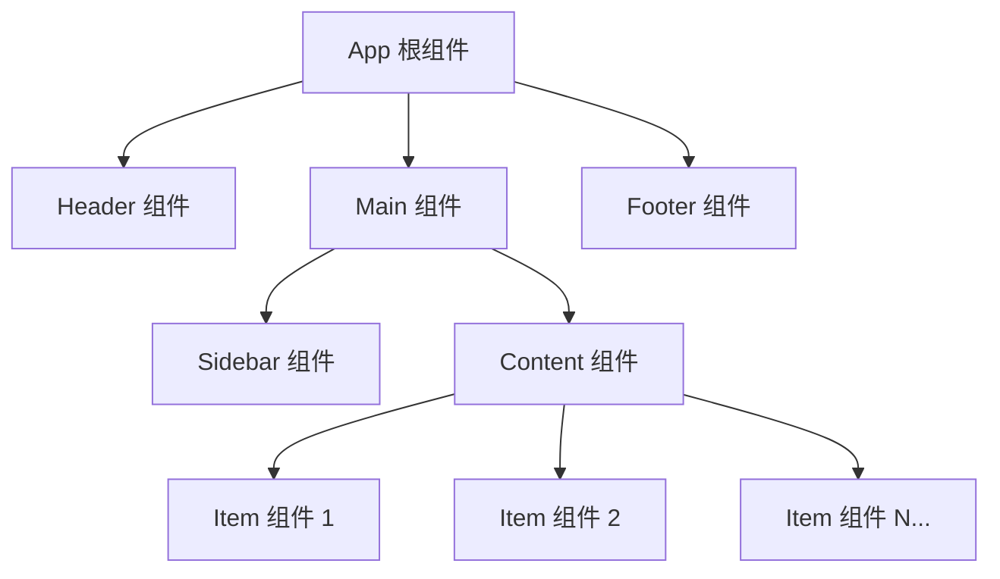
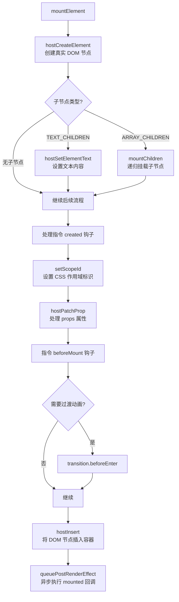
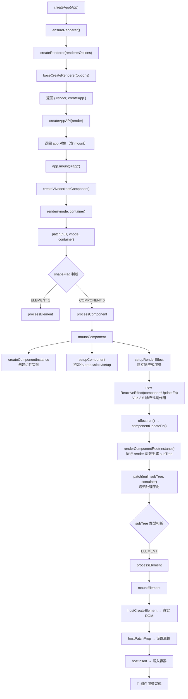
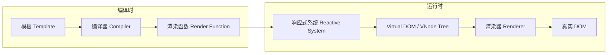

# 渲染器-组件渲染与挂载

## 前言

相对于传统的 `jQuery` 直接操作 DOM 的开发模式，组件化可以帮助我们实现 `视图` 和 `逻辑` 的复用，并且可以对每个部分进行单独的思考。对于一个大型的 `Vue.js` 应用，通常是由一棵组件树组合而成：



但是我们实际访问的页面，是由 `DOM` 元素构成的，而组件的 `<template>` 中的内容只是一个模板字符串而已。那模板字符串是如何被渲染成 `DOM` ？接下来我们将从组件入手，揭秘 `Vue 3.5` 的组件是如何被渲染成真实的 `DOM` 的。

## 初始化一个 Vue 3.5 应用

在开始本章节之前，先简单初始化一个 `Vue 3.5` 的应用：

```shell
# 使用 create-vue 脚手架（Vue 3.5+ 推荐方式）
$ npm create vue@latest vue3-demo

# 或使用 yarn
$ yarn create vue vue3-demo
```

接下来，打开项目，可以看到 `Vue.js` 的入口文件 `main.js` 的内容如下：

```js
import { createApp } from 'vue'
import App from './App.vue'

createApp(App).mount('#app')
```

这里就有一个根组件 `App.vue`。为了更简洁地介绍 `Vue` 根组件的渲染过程，将 `App.vue` 根组件简化如下：

```html
<template>
  <div class="helloWorld">
    hello world
  </div>
</template>
<script>
export default {
  setup() {
    // ...
  }
}
</script>
```

## 根组件模板编译

我们知道 `.vue` 类型的文件无法在 `Web` 端直接加载，我们通常会在构建阶段（如 `Vite` + `@vue/compiler-sfc`），通过编译器将 `template` 部分编译转换成 `render` 函数添加到组件对象的属性中。

上述的 `App.vue` 文件内的模板其实是会被编译工具在编译时转成一个渲染函数，大致如下：

```js
import { openBlock as _openBlock, createElementBlock as _createElementBlock } from "vue"

const _hoisted_1 = { class: "helloWorld" }

export function render(_ctx, _cache, $props, $setup, $data, $options) {
  return (_openBlock(), _createElementBlock("div", _hoisted_1, " hello world "))
}
```

关于 `<template>` 中的模板字符串是如何被编译成 `render` 函数的，以及 `_hoisted_1` 是什么，我们将在后续章节中详细介绍。

现在我们只需要知道 `<script>` 中的对象内容最终会和编译后的模板内容一起，生成一个 `App` 对象传入 `createApp` 函数中：

```js
{
  render(_ctx, _cache, $props, $setup, $data, $options) {
    // ...
  },
  setup() {
    // ...
  }
}
```

## 从 createApp 到 DOM：全链路源码剖析

接着回到 `main.js` 的入口文件，整个初始化的过程只剩下如下部分了：

```js
createApp(App).mount('#app')
```

看起来简单的一行代码，背后却隐藏了 `Vue 3.5` 整个渲染器初始化、组件实例化、响应式系统激活的完整链路。接下来我们将逐层深入，揭开这个过程的每一个环节。

### 第一步：createApp 与渲染器的懒创建

打开源码，看一下 `createApp` 的过程：

```typescript
// packages/runtime-dom/src/index.ts
const rendererOptions = /* @__PURE__ */ extend({ patchProp }, nodeOps);

let renderer: Renderer | null = null;
let enabledHydration = false;

function ensureRenderer() {
  // 如果 renderer 有值的话，那么以后都不会初始化了
  return renderer || (renderer = createRenderer(rendererOptions));
}

function ensureHydrationRenderer() {
  renderer = enabledHydration
    ? renderer
    : createHydrationRenderer(rendererOptions);
  enabledHydration = true;
  return renderer;
}

const createApp = (...args) => {
  const app = ensureRenderer().createApp(...args);
  if (__DEV__) {
    injectNativeTagCheck(app);
    injectCompilerOptionsCheck(app);
  }
  // 重写 mount 方法，增加平台特定的逻辑
  const { mount } = app;
  app.mount = (containerOrSelector) => {
    const container = normalizeContainer(containerOrSelector);
    if (!container) return;
    const component = app._component;
    // 如果组件没有 render 和 template，则使用容器 innerHTML 作为模板
    if (!isFunction(component) && !component.render && !component.template) {
      component.template = container.innerHTML;
    }
    // 清空容器内容
    if (container.nodeType === 1) {
      container.textContent = '';
    }
    const proxy = mount(container, false, resolveRootNamespace(container));
    if (container instanceof Element) {
      container.removeAttribute('v-cloak');
      container.setAttribute('data-v-app', '');
    }
    return proxy;
  };
  return app;
};
```

这里有几个关键的设计模式值得注意：

**1. 懒初始化模式（Lazy Initialization）**

`ensureRenderer` 采用了懒初始化模式——只有在第一次调用 `createApp` 时才会创建渲染器，之后再次调用直接复用。这种模式在 `Vue 3.5` 中被广泛使用，包括 `ReactiveEffect` 的延迟创建（`Lazy Effect`）。懒初始化的核心优势在于：如果应用只使用了 `Vue` 的响应式系统而不需要渲染器（如仅使用 `reactive`/`ref`），那么渲染器相关的代码永远不会被加载和执行，有利于 `Tree-shaking`。

**2. 平台适配器模式（Adapter Pattern）**

`rendererOptions` 是一个平台适配器对象，它封装了所有与平台相关的 `DOM` 操作：

| 操作类别 | 方法名 | 功能说明 |
|---------|--------|---------|
| 节点创建 | `createElement` | 创建 DOM 元素，支持 SVG/MathML 命名空间 |
| 节点创建 | `createText` | 创建文本节点 |
| 节点创建 | `createComment` | 创建注释节点 |
| 文本设置 | `setText` | 设置文本节点的值 |
| 文本设置 | `setElementText` | 设置元素的 textContent |
| 节点操作 | `insert` | 将子节点插入到父节点中 |
| 节点操作 | `remove` | 从父节点移除子节点 |
| 属性操作 | `patchProp` | 更新 DOM 属性 |
| 查询操作 | `parentNode` / `nextSibling` | 获取父节点/下一个兄弟节点 |
| 作用域 | `setScopeId` | 设置 scoped CSS 标识 |
| 静态内容 | `insertStaticContent` | 批量插入静态 HTML |

这种适配器模式让 `Vue` 的核心渲染逻辑与平台完全解耦——只需替换 `rendererOptions`，就可以将 `Vue` 渲染到不同平台。浏览器环境使用上述 `DOM API`，`SSR` 环境使用 `createHydrationRenderer`，而 `Weex`/`UniApp` 等跨端框架则提供原生 `UI` 的适配器。

**3. mount 方法重写（Template Method Pattern）**

注意 `createApp` 内部对 `mount` 方法的重写。内部 `mount` 是平台无关的通用逻辑，而外层 `mount` 包装了浏览器特定的处理：容器标准化、模板回退、`v-cloak` 移除、`data-v-app` 标记。这正是模板方法模式的体现——定义算法骨架，将特定步骤延迟到子类（平台层）实现。

### 第二步：createRenderer 与渲染器的构建

再来看一下 `createRenderer` 返回的对象：

```typescript
// packages/runtime-core/src/renderer.ts
export function createRenderer(options: RendererOptions) {
  return baseCreateRenderer(options);
}

export function createHydrationRenderer(options: RendererOptions) {
  return baseCreateRenderer(options, createHydrationFunctions);
}
```

`createRenderer` 和 `createHydrationRenderer` 都委托给 `baseCreateRenderer`，后者是一个超过 2000 行的巨型函数，内部定义了所有渲染相关的闭包方法，最终返回：

```typescript
function baseCreateRenderer(options, createHydrationFns?) {
  // 解构平台操作函数
  const {
    insert: hostInsert,
    remove: hostRemove,
    patchProp: hostPatchProp,
    createElement: hostCreateElement,
    createText: hostCreateText,
    createComment: hostCreateComment,
    setText: hostSetText,
    setElementText: hostSetElementText,
    parentNode: hostParentNode,
    nextSibling: hostNextSibling,
    setScopeId: hostSetScopeId = NOOP,
    insertStaticContent: hostInsertStaticContent
  } = options;

  // ... 2000+ 行的闭包函数定义

  return {
    render,
    hydrate,
    createApp: createAppAPI(render, hydrate),
  };
}
```

**设计洞察：闭包工厂模式**

`baseCreateRenderer` 是一个典型的闭包工厂——它接收 `options` 作为闭包变量，内部定义的 `patch`、`mountElement`、`mountComponent` 等数十个函数都通过闭包共享 `hostInsert`、`hostCreateElement` 等平台操作。这种设计的精妙之处在于：

1. **零运行时开销**：闭包变量访问比函数参数传递更快，无需在每次调用时传递 `options`
2. **代码隔离**：不同的 `renderer` 实例拥有各自独立的闭包环境，互不干扰
3. **按需创建**：只有真正需要渲染时才会调用 `ensureRenderer()` 触发构建

### 第三步：createAppAPI 与 App 上下文的构建

`createAppAPI` 是渲染器构建过程的最后一环，它接收 `render` 和 `hydrate` 函数，返回 `createApp` 工厂函数：

```typescript
// packages/runtime-core/src/apiCreateApp.ts
function createAppAPI<HostElement>(
  render: RootRenderFunction<HostElement>,
  hydrate?: RootHydrateFunction
) {
  return function createApp(rootComponent, rootProps = null) {
    // 防御性检查
    if (!isFunction(rootComponent)) {
      rootComponent = extend({}, rootComponent);
    }
    if (rootProps != null && !isObject(rootProps)) {
      warn(`root props passed to app.mount() must be an object.`);
      rootProps = null;
    }

    // 创建应用上下文
    const context = createAppContext();
    const installedPlugins = new WeakSet();
    const pluginCleanupFns = [];

    let isMounted = false;

    const app = (context.app = {
      _uid: uid++,
      _component: rootComponent,
      _props: rootProps,
      _container: null,
      _context: context,
      _instance: null,
      version,

      get config() { return context.config; },

      use(plugin, ...options) { /* 插件注册 */ },
      mixin(mixin) { /* 混入注册 */ },
      component(name, component) { /* 全局组件注册 */ },
      directive(name, directive) { /* 全局指令注册 */ },

      mount(rootContainer, isHydrate, namespace) {
        if (!isMounted) {
          // ... 核心挂载逻辑，下面详细分析
        }
      },
      unmount() { /* 卸载逻辑 */ },
      provide(key, value) { /* 全局 provide */ },
      // ...
    });

    return app;
  };
}
```

其中 `createAppContext` 创建的应用上下文包含了全局配置、组件注册表、指令注册表、混入列表等：

```typescript
function createAppContext(): AppContext {
  return {
    app: null,
    config: {
      isNativeTag: NO,
      performance: false,
      globalProperties: {},
      optionMergeStrategies: {},
      errorHandler: undefined,
      warnHandler: undefined,
      compilerOptions: {}
    },
    mixins: [],
    components: Object.create(null),
    directives: Object.create(null),
    provides: Object.create(null),
    optionsCache: new WeakMap(),   // Vue 3.5: 选项缓存优化
    propsCache: new WeakMap(),
    emitsCache: new WeakMap()
  };
}
```

> **关于 `optionsCache`**：`optionsCache`/`propsCache`/`emitsCache` 这组 `WeakMap` 缓存用于避免重复解析组件的合并选项（mixins/extends 等），是 Vue 运行时中较早引入的缓存机制，并非 Vue 3.5 新增。

### 第四步：mount —— 渲染链路的起点

接下来深入 `mount` 的内部实现，这是整个渲染链路的起点：

```typescript
mount(rootContainer, isHydrate, namespace) {
  if (!isMounted) {
    if (rootContainer.__vue_app__) {
      warn(
        `There is already an app instance mounted on the host container.
         If you want to mount another app on the same host container,
         you need to unmount the previous app by calling 'app.unmount()' first.`
      );
    }

    // 1. 创建根组件的 VNode
    const vnode = app._ceVNode || createVNode(rootComponent, rootProps);
    vnode.appContext = context;

    // 处理 namespace（SVG / MathML）
    if (namespace === true) namespace = 'svg';
    else if (namespace === false) namespace = undefined;

    // 2. 根据 isHydrate 选择渲染或水合
    if (isHydrate && hydrate) {
      hydrate(vnode, rootContainer);
    } else {
      render(vnode, rootContainer, namespace);
    }

    isMounted = true;
    app._container = rootContainer;
    rootContainer.__vue_app__ = app;

    return getComponentPublicInstance(vnode.component);
  }
}
```

`mount` 方法清晰地展现了两个核心步骤：**创建 VNode** 和**渲染 VNode**。让我们逐一深入。

### 第五步：createVNode —— 虚拟节点的创建

什么是 `VNode`？它和 `Virtual DOM` 是同一个概念——将真实的 `DOM` 以普通对象的数据结构来表达，简化了很多 `DOM` 中不必要的属性和方法。

`VNode` 带来的核心优势：

1. **性能优化**：直接操作 `DOM` 开销大，操作普通对象代价低，框架在对比差异后最小化 `DOM` 操作
2. **跨平台**：`VNode` 与平台无关，可以渲染到 `DOM`、原生 `UI`、甚至字符串（`SSR`）
3. **组件抽象**：`VNode` 统一了元素节点和组件节点的表示，`patch` 过程无需区分

上述例子中的 `template` 中的内容用 `VNode` 可以表示为：

```js
const vnode = {
  __v_isVNode: true,
  __v_skip: true,
  type: 'div',
  props: { class: 'helloWorld' },
  key: null,
  ref: null,
  children: 'hello world',
  component: null,
  shapeFlag: ShapeFlags.ELEMENT,  // 1
  patchFlag: 0,
  dynamicProps: null,
  dynamicChildren: null,
  el: null,                        // 渲染后指向真实 DOM
  // ...
}
```

那么根节点是如何被创建成一个 `VNode` ？核心在 `_createVNode` 函数中：

```typescript
// packages/runtime-core/src/vnode.ts
function _createVNode(
  type,
  props = null,
  children = null,
  patchFlag = 0,
  dynamicProps = null,
  isBlockNode = false
) {
  // 防御性处理
  if (!type || type === NULL_DYNAMIC_COMPONENT) {
    if (!type) warn(`Invalid vnode type when creating vnode: ${type}.`);
    type = Comment;
  }

  // 如果 type 已经是 VNode，则克隆
  if (isVNode(type)) {
    const cloned = cloneVNode(type, props, true);
    if (children) normalizeChildren(cloned, children);
    return cloned;
  }

  // 类组件处理
  if (isClassComponent(type)) {
    type = type.__vccOpts;
  }

  // 规范化 props（class/style 的响应式解包）
  if (props) {
    props = guardReactiveProps(props);
    let { class: klass, style } = props;
    if (klass && !isString(klass)) props.class = normalizeClass(klass);
    if (isObject(style)) {
      if (isProxy(style) && !isArray(style)) style = extend({}, style);
      props.style = normalizeStyle(style);
    }
  }

  // 根据 type 推导 shapeFlag（二进制位标记）
  const shapeFlag = isString(type)
    ? ShapeFlags.ELEMENT            // 1    - 普通 DOM 元素
    : isSuspense(type)
    ? ShapeFlags.SUSPENSE           // 128  - Suspense 组件
    : isTeleport(type)
    ? ShapeFlags.TELEPORT           // 64   - Teleport 组件
    : isObject(type)
    ? ShapeFlags.STATEFUL_COMPONENT // 4    - 有状态组件
    : isFunction(type)
    ? ShapeFlags.FUNCTIONAL_COMPONENT // 2  - 函数式组件
    : 0;

  // Vue 3.5: 如果组件对象本身是响应式的，发出警告
  if (shapeFlag & ShapeFlags.STATEFUL_COMPONENT && isProxy(type)) {
    type = toRaw(type);
    warn(
      `Vue received a Component that was made a reactive object...`
    );
  }

  return createBaseVNode(
    type, props, children, patchFlag, dynamicProps, shapeFlag, isBlockNode, true
  );
}
```

**ShapeFlags 二进制位标记体系**

`Vue 3` 使用二进制位标记（Bitmask）来高效判断 `VNode` 的类型，这是一个经典的设计模式：

| 常量名 | 值 | 二进制 | 含义 |
|--------|-----|--------|------|
| `ELEMENT` | 1 | `00000001` | 普通 DOM 元素 |
| `FUNCTIONAL_COMPONENT` | 2 | `00000010` | 函数式组件 |
| `STATEFUL_COMPONENT` | 4 | `00000100` | 有状态组件 |
| `TEXT_CHILDREN` | 8 | `00001000` | 子节点为文本 |
| `ARRAY_CHILDREN` | 16 | `00010000` | 子节点为数组 |
| `SLOTS_CHILDREN` | 32 | `00100000` | 子节点为插槽 |
| `TELEPORT` | 64 | `01000000` | Teleport 组件 |
| `SUSPENSE` | 128 | `10000000` | Suspense 组件 |
| `COMPONENT` | 6 | `00000110` | STATEFUL \| FUNCTIONAL |

位标记的优势在于可以用位运算快速判断类型组合。比如 `shapeFlag & ShapeFlags.COMPONENT`（即 `shapeFlag & 6`）可以同时匹配有状态组件和函数式组件，时间复杂度 O(1)，远优于字符串比较或查表。

当进行根组件渲染时，`createVNode` 的第一个入参 `type` 是 `App` 对象（一个 `Object`），所以 `shapeFlag` 的值为 `STATEFUL_COMPONENT`（4），代表这是一个有状态组件。

`createBaseVNode` 则是真正构建 `VNode` 对象的函数：

```typescript
function createBaseVNode(
  type,
  props = null,
  children = null,
  patchFlag = 0,
  dynamicProps = null,
  shapeFlag = type === Fragment ? 0 : ShapeFlags.ELEMENT,
  isBlockNode = false,
  needFullChildrenNormalization = false
) {
  const vnode = {
    __v_isVNode: true,
    __v_skip: true,
    type,
    props,
    key: props && normalizeKey(props),
    ref: props && normalizeRef(props),
    scopeId: currentScopeId,
    slotScopeIds: null,
    children,
    component: null,
    suspense: null,
    ssContent: null,
    ssFallback: null,
    dirs: null,
    transition: null,
    el: null,
    anchor: null,
    target: null,           // Teleport 目标
    targetStart: null,
    targetAnchor: null,
    staticCount: 0,
    shapeFlag,
    patchFlag,
    dynamicProps,
    dynamicChildren: null,
    appContext: null,
    ctx: currentRenderingInstance
  };

  // 子节点规范化
  if (needFullChildrenNormalization) {
    normalizeChildren(vnode, children);
    if (shapeFlag & ShapeFlags.SUSPENSE) {
      type.normalize(vnode);
    }
  } else if (children) {
    vnode.shapeFlag |= isString(children)
      ? ShapeFlags.TEXT_CHILDREN
      : ShapeFlags.ARRAY_CHILDREN;
  }

  // Block Tree 优化：将动态节点收集到 currentBlock
  if (
    isBlockTreeEnabled > 0 &&
    !isBlockNode &&
    currentBlock &&
    (vnode.patchFlag > 0 || shapeFlag & ShapeFlags.COMPONENT) &&
    vnode.patchFlag !== PatchFlags.NEED_HYDRATION
  ) {
    currentBlock.push(vnode);
  }

  return vnode;
}
```

> **Vue 3.5 变化**：`target`、`targetStart`、`targetAnchor` 是 `Teleport` 组件在 `Vue 3.5` 中重构后的新字段，用于支持 `Teleport` 的延迟目标解析（Deferred Teleport），使得 `Teleport` 的目标容器可以在组件挂载后才确定。

### 第六步：render —— 渲染入口

回到 `mount` 函数，接下来是对 `VNode` 的渲染工作：

```typescript
render(vnode, rootContainer, namespace);
```

`render` 函数在 `baseCreateRenderer` 内部定义：

```typescript
const render = (vnode, container, namespace) => {
  if (vnode == null) {
    // 如果 vnode 不存在，表示需要卸载组件
    if (container._vnode) {
      unmount(container._vnode, null, null, true);
    }
  } else {
    // 否则进入 patch 流程（初始化创建也是特殊的更新）
    patch(
      container._vnode || null,
      vnode,
      container,
      null,       // anchor
      null,       // parentComponent
      null,       // parentSuspense
      namespace
    );
  }
  // 缓存 vnode 到容器上
  container._vnode = vnode;
  // Vue 3.5: 确保刷新队列中的回调被处理
  if (!isFlushing) {
    isFlushing = true;
    flushPreFlushCbs();
    flushPostFlushCbs();
    isFlushing = false;
  }
};
```

对于初始化过程，传入了一个根组件的 `VNode`，所以会执行 `patch`。`render` 函数还负责在 `patch` 完成后刷新回调队列，确保 `onVnodeMounted` 等回调及时执行。

### 第七步：patch —— 差异比较的核心分发器

`patch` 是 `Vue` 渲染器中最核心的函数，它负责比较新旧 `VNode` 并将差异应用到真实 `DOM` 上：

```typescript
const patch = (
  n1,           // 旧 VNode
  n2,           // 新 VNode
  container,    // 容器
  anchor = null,
  parentComponent = null,
  parentSuspense = null,
  namespace = undefined,
  slotScopeIds = null,
  optimized = isHmrUpdating ? false : !!n2.dynamicChildren
) => {
  // 同一个节点，无需 patch
  if (n1 === n2) return;

  // 类型不同的新老节点，卸载旧节点
  if (n1 && !isSameVNodeType(n1, n2)) {
    anchor = getNextHostNode(n1);
    unmount(n1, parentComponent, parentSuspense, true);
    n1 = null;
  }

  // PatchFlags.BAIL (-2) 时回退到全量 diff
  if (n2.patchFlag === -2) {
    optimized = false;
    n2.dynamicChildren = null;
  }

  const { type, ref, shapeFlag } = n2;

  // 基于 type 进行分发
  switch (type) {
    case Text:
      processText(n1, n2, container, anchor);
      break;
    case Comment:
      processCommentNode(n1, n2, container, anchor);
      break;
    case Static:
      // 静态节点直接整体替换
      if (n1 == null) mountStaticNode(n2, container, anchor, namespace);
      else patchStaticNode(n1, n2, container, namespace);
      break;
    case Fragment:
      processFragment(n1, n2, container, anchor, parentComponent,
        parentSuspense, namespace, slotScopeIds, optimized);
      break;
    default:
      if (shapeFlag & ShapeFlags.ELEMENT) {
        // 1 -> 普通 DOM 元素
        processElement(n1, n2, container, anchor, parentComponent,
          parentSuspense, namespace, slotScopeIds, optimized);
      } else if (shapeFlag & ShapeFlags.COMPONENT) {
        // 6 -> 组件（有状态组件 4 | 函数式组件 2）
        processComponent(n1, n2, container, anchor, parentComponent,
          parentSuspense, namespace, slotScopeIds, optimized);
      } else if (shapeFlag & ShapeFlags.TELEPORT) {
        // 64 -> Teleport
        type.process(n1, n2, container, anchor, parentComponent,
          parentSuspense, namespace, slotScopeIds, optimized, internals);
      } else if (shapeFlag & ShapeFlags.SUSPENSE) {
        // 128 -> Suspense
        type.process(n1, n2, container, anchor, parentComponent,
          parentSuspense, namespace, slotScopeIds, optimized, internals);
      } else {
        warn('Invalid VNode type:', type, `(${typeof type})`);
      }
  }

  // 处理 ref
  if (ref != null && parentComponent) {
    setRef(ref, n1 && n1.ref, parentSuspense, n2 || n1, !n2);
  }
};
```

`patch` 函数的核心设计思路是**策略模式（Strategy Pattern）**——根据 `VNode` 的 `type` 和 `shapeFlag` 将不同类型节点的处理逻辑分发到对应的 `process*` 函数。这种设计保证了 `patch` 本身的简洁性，同时让每种节点类型的处理逻辑高度内聚。

当前场景中，`n2` 的 `type` 是 `App` 组件对象，`shapeFlag` 为 `STATEFUL_COMPONENT`（4），满足 `shapeFlag & ShapeFlags.COMPONENT`（4 & 6 = 4，非零即真），所以逻辑进入 `processComponent`。

> **关于 `isSameVNodeType` 的判断逻辑**：它同时比较 `type` 和 `key`。只有两者都相同才认为是同类型节点，否则即使 `type` 相同但 `key` 不同，也会卸载重建。这是 `Vue` 的 `key` 机制的核心原理。

### 第八步：processComponent 与 mountComponent

```typescript
const processComponent = (
  n1, n2, container, anchor, parentComponent, parentSuspense,
  namespace, slotScopeIds, optimized
) => {
  n2.slotScopeIds = slotScopeIds;
  if (n1 == null) {
    if (n2.shapeFlag & ShapeFlags.COMPONENT_SHOULD_KEEP_ALIVE) {
      // 512 -> KeepAlive 组件，走 activate 逻辑
      parentComponent.ctx.activate(n2, container, anchor, namespace, optimized);
    } else {
      mountComponent(n2, container, anchor, parentComponent, parentSuspense, namespace, optimized);
    }
  } else {
    updateComponent(n1, n2, optimized);
  }
};
```

初始化时 `n1` 为 `null`，进入 `mountComponent`。值得注意的是，如果组件被 `KeepAlive` 缓存（`shapeFlag & 512`），则走 `activate` 逻辑而非 `mount`，这是 `KeepAlive` 实现的核心入口。

```typescript
const mountComponent = (
  initialVNode, container, anchor, parentComponent, parentSuspense,
  namespace, optimized
) => {
  // 1. 创建组件实例
  const instance = (initialVNode.component = createComponentInstance(
    initialVNode,
    parentComponent,
    parentSuspense
  ));

  // HMR 注册
  if (instance.type.__hmrId) {
    registerHMR(instance);
  }

  // KeepAlive 特殊处理
  if (isKeepAlive(initialVNode)) {
    instance.ctx.renderer = internals;
  }

  // 2. 初始化组件：props、slots、setup 函数
  setupComponent(instance, false, optimized);

  // 3. 异步组件处理
  if (instance.asyncDep) {
    if (isHmrUpdating) initialVNode.el = null;
    parentSuspense && parentSuspense.registerDep(instance, setupRenderEffect, optimized);
    if (!initialVNode.el) {
      const placeholder = (instance.subTree = createVNode(Comment));
      processCommentNode(null, placeholder, container, anchor);
    }
  } else {
    // 4. 设置并运行带副作用的渲染函数
    setupRenderEffect(
      instance, initialVNode, container, anchor, parentSuspense, namespace, optimized
    );
  }
};
```

`mountComponent` 的逻辑分为三步：创建实例 -> 初始化组件 -> 建立响应式渲染。下面逐一深入。

### 第九步：createComponentInstance —— 组件实例化

组件实例是 `Vue` 运行时的核心数据结构，它承载了组件的所有状态和上下文信息：

```typescript
// packages/runtime-core/src/component.ts
function createComponentInstance(vnode, parent, suspense) {
  const type = vnode.type;
  const appContext =
    (parent ? parent.appContext : vnode.appContext) || emptyAppContext;

  const instance = {
    uid: uid++,
    vnode,
    type,
    parent,
    appContext,
    root: null,          // 稍后设置
    next: null,          // 更新时的新 VNode
    subTree: null,       // 组件渲染生成的子树 VNode
    effect: null,        // 响应式副作用（Vue 3.5 ReactiveEffect）
    update: null,        // effect.run.bind(effect) - 更新函数
    job: null,           // effect.runIfDirty.bind(effect) - 调度任务
    scope: new EffectScope(true),  // 独立的作用域，支持组件卸载时统一清理
    render: null,
    proxy: null,         // 渲染上下文代理（this 访问）
    exposed: null,
    exposeProxy: null,
    withProxy: null,     // setup 上下文代理（<script setup> 的 with 编译优化）
    provides: parent ? parent.provides : Object.create(appContext.provides),
    ids: parent ? parent.ids : ['', 0, 0],  // Vue 3.5: useId 支持
    accessCache: null,
    renderCache: [],

    // 本地已解析的资产
    components: null,
    directives: null,

    // 解析后的 props/emits 选项
    propsOptions: normalizePropsOptions(type, appContext),
    emitsOptions: normalizeEmitsOptions(type, appContext),

    // emit
    emit: null,          // 稍后绑定
    emitted: null,

    // props 默认值
    propsDefaults: EMPTY_OBJ,

    // 继承 attrs
    inheritAttrs: type.inheritAttrs,

    // 状态
    ctx: EMPTY_OBJ,
    data: EMPTY_OBJ,
    props: EMPTY_OBJ,
    attrs: EMPTY_OBJ,
    slots: EMPTY_OBJ,
    refs: EMPTY_OBJ,      // Vue 3.5: 支持 useTemplateRef
    setupState: EMPTY_OBJ,
    setupContext: null,

    // Suspense 相关
    suspense,
    suspenseId: suspense ? suspense.pendingId : 0,
    asyncDep: null,
    asyncResolved: false,

    // 生命周期标记
    isMounted: false,
    isUnmounted: false,
    isDeactivated: false,

    // 生命周期钩子
    bc: null,    // beforeCreate
    c: null,     // created
    bm: null,    // beforeMount
    m: null,     // mounted
    bu: null,    // beforeUpdate
    u: null,     // updated
    um: null,    // unmounted
    bum: null,   // beforeUnmount
    da: null,    // deactivated
    a: null,     // activated
    rtg: null,   // renderTriggered
    rtc: null,   // renderTracked
    ec: null,    // errorCaptured
    sp: null     // serverPrefetch
  };

  instance.root = parent ? parent.root : instance;
  instance.emit = emit.bind(null, instance);

  // 自定义元素支持
  if (vnode.ce) {
    vnode.ce(instance);
  }

  return instance;
}
```

**设计洞察：EffectScope 与组件级副作用管理**

`Vue 3.5` 中每个组件实例都有一个独立的 `EffectScope`（`new EffectScope(true)`，`true` 表示 `detached`）。这个作用域管理着组件内所有的响应式副作用——`computed`、`watch`、`watchEffect` 等。当组件卸载时，只需调用 `scope.stop()` 即可一次性清理所有副作用，避免了手动管理的复杂性和内存泄漏风险。

> **Vue 3.5 变化**：`ids` 字段是 `Vue 3.5` 为 `useId()` `API` 新增的，用于生成 `SSR` 安全的唯一 `ID`，解决 `SSR` 水合时的 `ID` 不匹配问题。`refs` 字段在 `Vue 3.5` 中也配合 `useTemplateRef()` 进行了重构，不再使用 `setupState` 中的 `__temp_refs__`，而是独立管理。

### 第十步：setupComponent —— 组件初始化

组件实例创建后，需要对其属性进行初始化处理：

```typescript
// packages/runtime-core/src/component.ts
function setupComponent(instance, isSSR = false, optimized = false) {
  isSSR && setInSSRSetupState(isSSR);

  const { props, children } = instance.vnode;
  const isStateful = isStatefulComponent(instance);  // shapeFlag & 4

  // 1. 初始化 props
  initProps(instance, props, isStateful, isSSR);

  // 2. 初始化 slots
  initSlots(instance, children, optimized);

  // 3. 如果是有状态组件，执行 setup
  const setupResult = isStateful
    ? setupStatefulComponent(instance, isSSR)
    : undefined;

  isSSR && setInSSRSetupState(false);
  return setupResult;
}
```

`setupStatefulComponent` 的核心工作是创建渲染上下文代理并执行 `setup` 函数：

```typescript
function setupStatefulComponent(instance, isSSR) {
  const Component = instance.type;

  // 创建渲染上下文代理（this 访问的底层支撑）
  instance.accessCache = Object.create(null);
  instance.proxy = new Proxy(instance.ctx, PublicInstanceProxyHandlers);

  // 解构 setup 函数
  const { setup } = Component;
  if (setup) {
    // 创建 setup 上下文（仅在 setup 接收第二个参数时才创建）
    pauseTracking();
    const setupContext = (instance.setupContext =
      setup.length > 1 ? createSetupContext(instance) : null);

    // 设置当前实例上下文
    const reset = setCurrentInstance(instance);

    // 执行 setup 函数，传入 props 和 context
    const setupResult = callWithErrorHandling(
      setup,
      instance,
      ErrorCodes.SETUP_FUNCTION,
      [shallowReadonly(instance.props), setupContext]
    );

    resetTracking();
    reset();

    // 处理 setup 返回值
    if (isPromise(setupResult)) {
      // 异步 setup（配合 Suspense）
      instance.asyncDep = setupResult;
    } else {
      handleSetupResult(instance, setupResult, isSSR);
    }
  } else {
    finishComponentSetup(instance, isSSR);
  }
}
```

**设计洞察：Proxy 与渲染上下文**

`instance.proxy` 是 `Vue 3` 的一个精妙设计。它通过 `Proxy` 拦截 `this` 上的属性访问，按优先级依次查找 `setupState`、`data`、`props`、`ctx` 等。这样，用户在模板中写 `{{ message }}` 时，`Vue` 会在多个状态源中自动查找，无需关心 `message` 来自 `ref`、`reactive` 还是 `props`。

### 第十一步：setupRenderEffect —— 响应式渲染引擎

`setupRenderEffect` 是组件渲染与响应式系统的桥梁，也是 `Vue 3.5` 中变化最大的部分之一：

```typescript
const setupRenderEffect = (
  instance, initialVNode, container, anchor, parentSuspense,
  namespace, optimized
) => {
  // 组件更新函数
  const componentUpdateFn = () => {
    if (!instance.isMounted) {
      // ===== 挂载阶段 =====
      let vnodeHook;
      const { el, props } = initialVNode;
      const { bm, m, parent, root, type } = instance;
      const isAsyncWrapperVNode = isAsyncWrapper(initialVNode);

      // 执行 beforeMount 钩子
      toggleRecurse(instance, false);
      if (bm) invokeArrayFns(bm);
      if (!isAsyncWrapperVNode && (vnodeHook = props && props.onVnodeBeforeMount)) {
        invokeVNodeHook(vnodeHook, parent, initialVNode);
      }
      toggleRecurse(instance, true);

      if (el && hydrateNode) {
        // SSR 水合路径
        const hydrateSubTree = () => {
          instance.subTree = renderComponentRoot(instance);
          hydrateNode(el, instance.subTree, instance, parentSuspense, null);
        };
        // ... 异步水合处理
      } else {
        // 客户端渲染路径
        if (root.ce) root.ce._injectChildStyle(type);  // Custom Element 样式注入

        // 渲染子树 VNode
        const subTree = (instance.subTree = renderComponentRoot(instance));

        // 递归 patch 子树
        patch(null, subTree, container, anchor, instance, parentSuspense, namespace);

        // 将子树根 DOM 节点挂到组件 VNode 上
        initialVNode.el = subTree.el;
      }

      // 执行 mounted 钩子（异步，在 DOM 更新完成后）
      if (m) queuePostRenderEffect(m, parentSuspense);
      if (!isAsyncWrapperVNode && (vnodeHook = props && props.onVnodeMounted)) {
        queuePostRenderEffect(() => invokeVNodeHook(vnodeHook, parent, scopedInitialVNode), parentSuspense);
      }

      instance.isMounted = true;
      initialVNode = container = anchor = null;  // 释放引用，避免内存泄漏
    } else {
      // ===== 更新阶段 =====
      // ... 后续章节介绍
    }
  };

  // 创建 ReactiveEffect（Vue 3.5 重构的响应式副作用）
  instance.scope.on();
  const effect = (instance.effect = new ReactiveEffect(componentUpdateFn));
  instance.scope.off();

  // 绑定更新函数和调度任务
  const update = (instance.update = effect.run.bind(effect));
  const job = (instance.job = effect.runIfDirty.bind(effect));
  job.i = instance;
  job.id = instance.uid;

  // 设置调度器：将更新任务放入队列
  effect.scheduler = () => queueJob(job);

  toggleRecurse(instance, true);

  // 设置 track/trigger 回调（开发工具用）
  if (__DEV__) {
    effect.onTrack = instance.rtc ? (e) => invokeArrayFns(instance.rtc, e) : undefined;
    effect.onTrigger = instance.rtg ? (e) => invokeArrayFns(instance.rtg, e) : undefined;
  }

  // 首次执行更新函数
  update();
};
```

**Vue 3.5 核心变化：ReactiveEffect 重构**

`Vue 3.5` 对响应式副作用系统进行了底层重构，这是 `3.4` 以来最重大的内部变化之一：

1. **双链表依赖追踪**：`Vue 3.5` 使用双向链表替代了之前的 `Set` 结构来管理 `dep-subscriber` 关系，大幅降低了内存占用和依赖追踪的时间复杂度。

2. **Lazy Effect（延迟副作用）**：`ReactiveEffect` 的 `flags` 初始值为 `1 | 4`（`active | tracking`），但不会立即执行依赖收集。只有当 `effect.run()` 首次执行时，才进行依赖追踪。这种延迟策略减少了不必要的依赖收集开销。

3. **runIfDirty 智能调度**：`instance.job = effect.runIfDirty.bind(effect)` 意味着响应式数据变化时，调度器会通过 `isDirty` 检查来判断是否真正需要重新渲染，避免无效更新。

```typescript
// Vue 3.5 的 ReactiveEffect 核心结构
class ReactiveEffect {
  constructor(fn) {
    this.fn = fn;
    this.deps = undefined;       // 依赖链表头
    this.depsTail = undefined;   // 依赖链表尾（双向链表）
    this.flags = 1 | 4;         // active | tracking
    this.next = undefined;       // 队列中的下一个 effect
    this.cleanup = undefined;    // 清理函数
    this.scheduler = undefined;  // 调度器
  }

  run() {
    if (!(this.flags & EffectFlags.ACTIVE)) return this.fn();
    this.flags |= EffectFlags.RUNNING;
    cleanupEffect(this);
    prepareDeps(this);           // Vue 3.5: 预处理依赖
    const prevEffect = activeSub;
    activeSub = this;
    try {
      return this.fn();
    } finally {
      cleanupDeps(this);         // Vue 3.5: 清理无效依赖
      activeSub = prevEffect;
      this.flags &= ~EffectFlags.RUNNING;
    }
  }

  runIfDirty() {
    if (isDirty(this)) {         // 智能判断是否需要更新
      this.run();
    }
  }

  trigger() {
    if (this.flags & EffectFlags.PAUSED) {
      pausedQueueEffects.add(this);
    } else if (this.scheduler) {
      this.scheduler();          // 走调度器 -> queueJob
    } else {
      this.runIfDirty();
    }
  }
}
```

> **关于调度器的设计**：`effect.scheduler = () => queueJob(job)` 是 `Vue` 异步更新队列的入口。当响应式数据变化时，`trigger` -> `scheduler` -> `queueJob`，组件更新被加入微任务队列，在下一个 `tick` 统一执行。这就是 `Vue` 的批量异步更新策略，避免了同步更新导致的性能问题。

### 第十二步：renderComponentRoot —— 子树的渲染

`renderComponentRoot` 负责执行组件的 `render` 函数，生成子树 `VNode`：

```typescript
// packages/runtime-core/src/componentRenderUtils.ts
function renderComponentRoot(instance) {
  const {
    type: Component,
    vnode,
    proxy,
    withProxy,
    propsOptions: [propsOptions],
    slots,
    attrs,
    emit,
    render,
    renderCache,
    props,
    data,
    setupState,
    ctx,
    inheritAttrs
  } = instance;

  const prev = setCurrentRenderingInstance(instance);
  let result;
  let fallthroughAttrs;

  try {
    if (vnode.shapeFlag & ShapeFlags.STATEFUL_COMPONENT) {
      // 有状态组件：使用 proxy 作为 this
      const proxyToUse = withProxy || proxy;
      result = normalizeVNode(
        render.call(
          proxyToUse,     // this
          proxyToUse,     // _ctx
          renderCache,    // _cache
          shallowReadonly(props),
          setupState,
          data,
          ctx
        )
      );
      fallthroughAttrs = attrs;
    } else {
      // 函数式组件：直接调用
      const render2 = Component;
      result = normalizeVNode(
        render2.length > 1
          ? render2(shallowReadonly(props), { attrs, slots, emit })
          : render2(shallowReadonly(props), null)
      );
      fallthroughAttrs = Component.props ? attrs : getFunctionalFallthrough(attrs);
    }
  } catch (err) {
    blockStack.length = 0;
    handleError(err, instance, ErrorCodes.RENDER_FUNCTION);
    result = createVNode(Comment);  // 渲染出错时返回注释节点
  }

  // 处理继承的 attrs
  let root = result;
  // ... fallthrough attrs 处理逻辑

  return result;
}
```

对于有状态组件，`render.call(proxyToUse, ...)` 执行的就是编译器生成的渲染函数：

```js
import { openBlock, createElementBlock } from "vue"

const _hoisted_1 = { class: "helloWorld" }

export function render(_ctx, _cache, $props, $setup, $data, $options) {
  return (openBlock(), createElementBlock("div", _hoisted_1, " hello world "))
}
```

`createElementBlock` 内部最终调用 `createBaseVNode` 创建 `VNode`，但由于 `type = "div"` 是字符串，生成的 `shapeFlag` 为 `ELEMENT`（1）。这就是子树 `VNode` —— 它是组件 `render` 函数产出的 `VNode`，与组件自身的 `VNode` 形成了嵌套关系。

### 第十三步：processElement 与 mountElement —— DOM 的真实创建

渲染生成子树 `VNode` 后，再次进入 `patch` 递归处理。此时 `subTree` 的 `shapeFlag` 是 `ELEMENT`，进入 `processElement`：

```typescript
const processElement = (
  n1, n2, container, anchor, parentComponent, parentSuspense,
  namespace, slotScopeIds, optimized
) => {
  // SVG / MathML 命名空间处理
  if (n2.type === 'svg') namespace = 'svg';
  else if (n2.type === 'math') namespace = 'mathml';

  if (n1 == null) {
    mountElement(n2, container, anchor, parentComponent, parentSuspense,
      namespace, slotScopeIds, optimized);
  } else {
    patchElement(n1, n2, parentComponent, parentSuspense,
      namespace, slotScopeIds, optimized);
  }
};
```

初始化时 `n1` 为 `null`，进入 `mountElement`：

```typescript
const mountElement = (
  vnode, container, anchor, parentComponent, parentSuspense,
  namespace, slotScopeIds, optimized
) => {
  let el;
  let vnodeHook;
  const { props, shapeFlag, transition, dirs } = vnode;

  // 1. 创建真实 DOM 元素
  el = vnode.el = hostCreateElement(
    vnode.type,
    namespace,
    props && props.is,
    props    // Vue 3.5: 传入 props 用于 select[multiple] 等特殊处理
  );

  // 2. 处理子节点
  if (shapeFlag & ShapeFlags.TEXT_CHILDREN) {
    // 文本子节点：直接设置 textContent
    hostSetElementText(el, vnode.children);
  } else if (shapeFlag & ShapeFlags.ARRAY_CHILDREN) {
    // 数组子节点：递归 mountChildren
    mountChildren(
      vnode.children, el, null, parentComponent, parentSuspense,
      resolveChildrenNamespace(vnode, namespace), slotScopeIds, optimized
    );
  }

  // 3. 处理指令（created 钩子）
  if (dirs) {
    invokeDirectiveHook(vnode, null, parentComponent, 'created');
  }

  // 4. 设置 scopeId
  setScopeId(el, vnode, vnode.scopeId, slotScopeIds, parentComponent);

  // 5. 处理 props 属性
  if (props) {
    for (const key in props) {
      if (key !== 'value' && !isReservedProp(key)) {
        hostPatchProp(el, key, null, props[key], namespace, parentComponent);
      }
    }
    // value 属性需要特殊处理（表单元素）
    if ('value' in props) {
      hostPatchProp(el, 'value', null, props.value, namespace);
    }
    if ((vnodeHook = props.onVnodeBeforeMount)) {
      invokeVNodeHook(vnodeHook, parentComponent, vnode);
    }
  }

  // 6. 开发模式下挂载调试信息
  if (__DEV__) {
    def(el, '__vnode', vnode, true);
    def(el, '__vueParentComponent', parentComponent, true);
  }

  // 7. 指令 beforeMount 钩子
  if (dirs) {
    invokeDirectiveHook(vnode, null, parentComponent, 'beforeMount');
  }

  // 8. 处理过渡动画
  const needCallTransitionHooks = needTransition(parentSuspense, transition);
  if (needCallTransitionHooks) {
    transition.beforeEnter(el);
  }

  // 9. 插入 DOM 到容器中
  hostInsert(el, container, anchor);

  // 10. 异步执行 mounted 相关回调
  if (
    (vnodeHook = props && props.onVnodeMounted) ||
    needCallTransitionHooks ||
    dirs
  ) {
    queuePostRenderEffect(() => {
      vnodeHook && invokeVNodeHook(vnodeHook, parentComponent, vnode);
      needCallTransitionHooks && transition.enter(el);
      dirs && invokeDirectiveHook(vnode, null, parentComponent, 'mounted');
    }, parentSuspense);
  }
};
```

`mountElement` 的执行过程可以归纳为以下步骤：



最终，`hostInsert` 将创建好的 `DOM` 元素插入到容器中：

```typescript
// packages/runtime-dom/src/nodeOps.ts
insert: (child, parent, anchor) => {
  parent.insertBefore(child, anchor || null);
}
```

对于嵌套子节点（如数组子节点），`mountChildren` 会递归调用 `patch`，形成深度优先的 `DOM` 树构建。

## 全链路流程总览

至此，我们已经完整走完了从 `createApp` 到真实 `DOM` 的全部链路。下面用一张完整的流程图来回顾：



再对照 `Vue` 官方的渲染流程图来理解：



回顾上述过程，整体脉络如下：

1. **编译阶段**：模板被编译成渲染函数
2. **创建 VNode**：`createApp` → `createVNode` 将根组件转化为虚拟节点
3. **组件实例化**：`patch` → `processComponent` → `mountComponent` → `createComponentInstance` 创建组件实例
4. **组件初始化**：`setupComponent` 处理 `props`、`slots`，执行 `setup` 函数
5. **建立响应式渲染**：`setupRenderEffect` 创建 `ReactiveEffect`，将组件更新与响应式系统绑定
6. **渲染子树**：`renderComponentRoot` 执行 `render` 函数，生成子树 `VNode`
7. **递归 Patch**：子树 `VNode` 递归进入 `patch`，根据类型走 `processElement` → `mountElement`
8. **DOM 创建**：`mountElement` 通过平台适配器创建真实 `DOM`，设置属性，插入容器

## Vue 3.5 渲染器演进总结

`Vue 3.5` 在渲染器层面的核心演进：

| 领域 | 变化 | 影响 |
|------|------|------|
| 响应式系统 | ReactiveEffect 双向链表重构 | 更精准的依赖追踪，更低的内存开销 |
| 副作用调度 | Lazy Effect + runIfDirty | 减少无效渲染，更智能的更新策略 |
| 组件实例 | 新增 `ids` 字段 | 支持 `useId()` 解决 SSR ID 不匹配 |
| 模板引用 | `refs` 字段配合 `useTemplateRef()` | 更安全的模板引用获取方式 |
| Teleport | VNode 新增 `target` 系列字段 | 支持延迟目标解析 |
| SSR | `createHydrationRenderer` 改进 | 更高效的懒水合（Lazy Hydration） |
| Custom Element | `ce` 回调机制增强 | 更好的 Web Components 集成 |
| 性能优化 | `optionsCache` 缓存 | 减少组件选项重复计算 |

> **关于 Vapor Mode**：`Vapor Mode` 是 Vue 渲染器的未来方向（随 Vue 3.6 进入 RC 阶段）。它跳过 `Virtual DOM` 的 `diff` 过程，在编译时直接生成精确的 `DOM` 操作代码，类似于 `Svelte` 的编译策略。`Vapor Mode` 可以与现有 `Virtual DOM` 模式混合使用，为性能关键路径提供更优的渲染性能，且不影响现有的渲染流程。

## 总结

本节我们从入口文件 `createApp(App).mount('#app')` 出发，逐步深入 `Vue 3.5` 的渲染器源码，完整梳理了组件从对象到真实 `DOM` 的渲染链路。核心调用链为：

```
createApp → ensureRenderer → createRenderer → createAppAPI → mount →
createVNode → render → patch → processComponent → mountComponent →
createComponentInstance → setupComponent → setupRenderEffect →
renderComponentRoot → patch → processElement → mountElement → 真实 DOM
```

在这个过程中，我们看到了多种设计模式的运用：

- **懒初始化模式**：`ensureRenderer` 延迟创建渲染器
- **适配器模式**：`rendererOptions` 抽象平台差异
- **策略模式**：`patch` 根据 `shapeFlag` 分发处理逻辑
- **模板方法模式**：`mount` 的平台特定重写
- **观察者模式**：`ReactiveEffect` 实现响应式依赖追踪

关于具体的编译器和更新以及响应式的部分将在后续章节继续介绍。本节主要介绍了挂载过程，下一小节将介绍更新策略。
