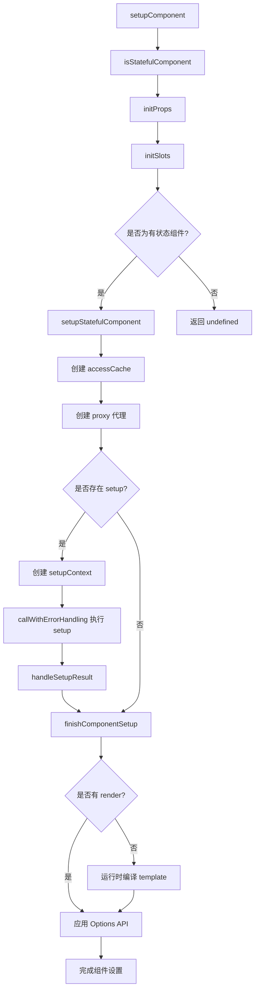

# 渲染器-数据代理机制

## 前言

在开启本小节之前，我们先看一个有意思的示例，组件上有一个动态文本节点 `{{ msg }}`，但是却有 `2` 处定义了 `msg` 响应式数据；另外有一个按钮，点击后会修改响应式数据。

```html
<template>
  <p>{{ msg }}</p>
  <button @click="changeMsg">点击试试</button>
</template>
<script>
  import { ref } from 'vue'
  export default {
    data() {
      return {
        msg: 'msg from data'
      }
    },
    setup() {
      const msg = ref('msg from setup')
      return {
        msg
      }
    },
    methods: {
      changeMsg() {
        this.msg = 'change'
      }
    }
  }
</script>
```

分析以下问题：

1. 界面显示的内容是什么？
2. 点击按钮后，修改的是哪部分的数据？是 `data` 中定义的，还是 `setup` 中？

阅读完本节，即可得到答案。

上一节，我们知道了根组件在初始化渲染的过程中，会执行 `mountComponent` 的函数：

```js
function mountComponent(initialVNode, container, parentComponent) {
  // 1. 先创建一个 component instance
  const instance = (initialVNode.component = createComponentInstance(
    initialVNode,
    parentComponent
  ));

  // 2. 初始化组件实例
  setupComponent(instance);

  // 3. 设置并运行带副作用的渲染函数
  setupRenderEffect(instance, initialVNode, container);
}
```

上文，我们简单介绍了关于 `setupComponent` 函数的作用是为了对实例化后的组件中的属性做一些优化、处理、赋值等操作。本小节我们将重点介绍 `setupComponent` 的内部实现和作用。

## 初始化组件实例

我们再来回顾一下 `setupComponent` 在 Vue 3.5.x 源码中的实现：

```js
export function setupComponent(instance, isSSR = false, optimized = false) {
  // SSR 环境下设置标记
  isSSR && setInSSRSetupState(isSSR)

  const { props, children } = instance.vnode

  // 判断组件是否是有状态的组件
  const isStateful = isStatefulComponent(instance)

  // 初始化 props
  initProps(instance, props, isStateful, isSSR)

  // 初始化 slots
  initSlots(instance, children, optimized || isSSR)

  // 如果是有状态组件，那么去设置有状态组件实例
  const setupResult = isStateful
    ? setupStatefulComponent(instance, isSSR)
    : undefined

  // 重置 SSR 标记
  isSSR && setInSSRSetupState(false)

  return setupResult
}
```

`setupComponent` 方法做了什么？

1. 通过 `isStatefulComponent(instance)` 判断是否是有状态的组件；
2. `initProps` 初始化 `props`；
3. `initSlots` 初始化 `slots`；
4. 根据组件是否是有状态的，来决定是否需要执行 `setupStatefulComponent` 函数。

其中，`isStatefulComponent` 判断是否是有状态的组件的函数如下：

```js
function isStatefulComponent(instance) {
  return instance.vnode.shapeFlag & ShapeFlags.STATEFUL_COMPONENT
}
```

前面我们已经说过了，`ShapeFlags` 在遇到组件类型的 `type = Object` 时，`vnode` 的 `shapeFlags = ShapeFlags.STATEFUL_COMPONENT`。所以这里会执行 `setupStatefulComponent` 函数。

```js
function setupStatefulComponent(instance, isSSR) {
  const Component = instance.type

  // 开发环境下进行组件名称、组件注册、指令注册的校验
  if (__DEV__) {
    if (Component.name) {
      validateComponentName(Component.name, instance.appContext.config)
    }
    if (Component.components) {
      const names = Object.keys(Component.components)
      for (let i = 0; i < names.length; i++) {
        validateComponentName(names[i], instance.appContext.config)
      }
    }
    if (Component.directives) {
      const names = Object.keys(Component.directives)
      for (let i = 0; i < names.length; i++) {
        validateDirectiveName(names[i])
      }
    }
    // 运行时编译器选项校验
    if (Component.compilerOptions && isRuntimeOnly()) {
      warn(
        `"compilerOptions" is only supported when using a build of Vue ` +
        `that includes the runtime compiler. Since you are using a ` +
        `runtime-only build, the options should be passed via your ` +
        `build tool config instead.`
      )
    }
  }

  // 1. 创建渲染代理的属性访问缓存
  instance.accessCache = Object.create(null)

  // 2. 创建渲染上下文代理，proxy 对象其实是代理了 instance.ctx 对象
  instance.proxy = new Proxy(instance.ctx, PublicInstanceProxyHandlers)

  // 开发环境下暴露 props 到渲染上下文
  if (__DEV__) {
    exposePropsOnRenderContext(instance)
  }

  // 3. 执行 setup 函数
  const { setup } = Component
  if (setup) {
    // 暂停依赖追踪
    pauseTracking()

    // 如果 setup 函数带参数，则创建一个 setupContext
    const setupContext = (instance.setupContext =
      setup.length > 1 ? createSetupContext(instance) : null)

    // 设置当前实例
    const reset = setCurrentInstance(instance)

    // 执行 setup 函数，获取结果
    const setupResult = callWithErrorHandling(
      setup,
      instance,
      ErrorCodes.SETUP_FUNCTION,
      [
        __DEV__ ? shallowReadonly(instance.props) : instance.props,
        setupContext
      ]
    )

    // 判断是否是异步 setup
    const isAsyncSetup = isPromise(setupResult)

    // 恢复依赖追踪
    resetTracking()
    reset()

    // 处理异步 setup
    if ((isAsyncSetup || instance.sp) && !isAsyncWrapper(instance)) {
      markAsyncBoundary(instance)
    }

    if (isAsyncSetup) {
      setupResult.then(unsetCurrentInstance, unsetCurrentInstance)
      if (isSSR) {
        return setupResult
          .then((resolvedResult) => {
            handleSetupResult(instance, resolvedResult, isSSR)
          })
          .catch((e) => {
            handleError(e, instance, ErrorCodes.SETUP_FUNCTION)
          })
      } else {
        instance.asyncDep = setupResult
        if (__DEV__ && !instance.suspense) {
          const name = formatComponentName(instance, Component)
          warn(
            `Component <${name}>: setup function returned a promise, ` +
            `but no <Suspense> boundary was found in the parent component tree. ` +
            `A component with async setup() must be nested in a <Suspense> ` +
            `in order to be rendered.`
          )
        }
      }
    } else {
      handleSetupResult(instance, setupResult, isSSR)
    }
  } else {
    // 4. 完成组件实例设置
    finishComponentSetup(instance, isSSR)
  }
}
```

`setupStatefulComponent` 字面意思就是设置有状态组件，那么什么是有状态组件？简单而言，就是对于有状态组件，Vue 内部会保留组件状态数据。相对于有状态组件而言，Vue 还存在一种函数组件 `FUNCTIONAL_COMPONENT`，看以下示例：

```js
import { ref } from 'vue';

export default () => {
  let num = ref(0);
  const plusNum = () => {
    num.value ++;
  };
  return (
    <div>
      <button onClick={plusNum}>
        { num.value }
      </button>
    </div>
  )
}
```

这个函数点击按钮时，`num` 的值并不会按照我们预期那样值会一直递增，因为它是一个函数组件，函数组件内部是没有状态保持的，所以 `num` 数据更新时，组件会重新渲染，`num` 的值永远不变一直是 `0`。

因此，为了能符合预期的结果，需要将其设置成有状态的组件。可以通过 `defineComponent` 函数包装：

```js
import { ref, defineComponent } from 'vue';

export default defineComponent(() => {
  let num = ref(0);
  const plusNum = () => {
    num.value ++;
  };

  return () => (
    <div>
      <button onClick={plusNum}>
        { num.value }
      </button>
    </div>
  )
});
```

`defineComponent` 返回的是个对象类型的 `type`，所以就变成了有状态组件。

理解了什么是有状态组件后，回到 `setupStatefulComponent` 实现中，逐步分析其核心原理。

## 创建渲染上下文代理

首先看 `1-2` 两个步骤，关于第一点：为什么要创建渲染代理的属性访问缓存？此处暂不展开，先看第二步：创建渲染上下文代理，这里为什么要对 `instance.ctx` 做代理？如果熟悉 Vue 2 的读者应该了解，Vue 2 的 Options API 的写法如下：

```html
<template>
  <p>{{ num }}</p>
</template>
<script>
export default {
  data() {
    num: 1
  },
  mounted() {
    this.num = 2
  }
}
</script>
```

Vue 2.x 是如何实现访问 `this.num` 获取到 `num` 的值，而不是通过 `this._data.num` 来获取 `num` 的值？其实 Vue 2.x 版本中，为 `_data` 设置了一层代理：

```js
_proxy(options.data);

function _proxy (data) {
  const that = this;
  Object.keys(data).forEach(key => {
    Object.defineProperty(that, key, {
      configurable: true,
      enumerable: true,
      get: function proxyGetter () {
        return that._data[key];
      },
      set: function proxySetter (val) {
        that._data[key] = val;
      }
    })
  });
}
```

本质就是通过 `Object.defineProperty` 使在访问 `this` 上的某属性时从 `this._data` 中读取（写入）。

而 Vue 3 也在这里做了类似的事情，Vue 3 内部有很多状态属性，存储在不同的对象上，比如 `setupState`、`ctx`、`data`、`props`。这样用户取数据就会考虑具体从哪个对象中获取，这无疑增加了用户的使用负担，所以对 `instance.ctx` 进行代理，然后根据属性优先级关系依次完成从特定对象上获取值。

### get

了解了代理的功能后，我们来具体看一下是如何实现代理功能的，也就是 `proxy` 的 `PublicInstanceProxyHandlers` 它的实现。先看一下 `get` 函数：

```js
// 判断是否是保留前缀（$ 或 _）
const isReservedPrefix = (key) => key === "_" || key === "$"

// 检查 setupState 中是否存在绑定（排除 __isScriptSetup 标记的情况）
const hasSetupBinding = (state, key) =>
  state !== EMPTY_OBJ && !state.__isScriptSetup && hasOwn(state, key)

export const PublicInstanceProxyHandlers = {
  get({ _: instance }, key) {
    // 跳过响应式标记
    if (key === "__v_skip") {
      return true
    }

    const { ctx, setupState, data, props, accessCache, type, appContext } =
      instance

    // 开发环境下标记 __isVue
    if (__DEV__ && key === "__isVue") {
      return true
    }

    // 非 $ 开头的属性访问
    if (key[0] !== "$") {
      // 从缓存中获取当前 key 存在于哪个属性中
      const n = accessCache[key]
      if (n !== undefined) {
        switch (n) {
          case AccessTypes.SETUP:
            return setupState[key]
          case AccessTypes.DATA:
            return data[key]
          case AccessTypes.CONTEXT:
            return ctx[key]
          case AccessTypes.PROPS:
            return props[key]
        }
      } else if (hasSetupBinding(setupState, key)) {
        // 从 setupState 中取
        accessCache[key] = AccessTypes.SETUP
        return setupState[key]
      } else if (__VUE_OPTIONS_API__ && data !== EMPTY_OBJ && hasOwn(data, key)) {
        // 从 data 中取
        accessCache[key] = AccessTypes.DATA
        return data[key]
      } else if (hasOwn(props, key)) {
        // 从 props 中取
        accessCache[key] = AccessTypes.PROPS
        return props[key]
      } else if (ctx !== EMPTY_OBJ && hasOwn(ctx, key)) {
        // 从 ctx 中取
        accessCache[key] = AccessTypes.CONTEXT
        return ctx[key]
      } else if (!__VUE_OPTIONS_API__ || shouldCacheAccess) {
        // 都取不到
        accessCache[key] = AccessTypes.OTHER
      }
    }

    // 处理 $ 开头的内置属性
    const publicGetter = publicPropertiesMap[key]
    let cssModule, globalProperties

    if (publicGetter) {
      // $attrs 需要追踪依赖
      if (key === "$attrs") {
        track(instance.attrs, TrackOpTypes.GET, "")
        __DEV__ && markAttrsAccessed()
      } else if (__DEV__ && key === "$slots") {
        track(instance, "get", key)
      }
      return publicGetter(instance)
    } else if (
      // css module（由 vue-loader 注入）
      (cssModule = type.__cssModules) && (cssModule = cssModule[key])
    ) {
      return cssModule
    } else if (ctx !== EMPTY_OBJ && hasOwn(ctx, key)) {
      // 用户在 ctx 上的自定义属性
      accessCache[key] = AccessTypes.CONTEXT
      return ctx[key]
    } else if (
      // 全局属性
      ((globalProperties = appContext.config.globalProperties),
      hasOwn(globalProperties, key))
    ) {
      return globalProperties[key]
    } else if (
      __DEV__ &&
      currentRenderingInstance &&
      (!isString(key) ||
        key.indexOf("__v") !== 0)
    ) {
      // 开发环境下的告警
      if (data !== EMPTY_OBJ && isReservedPrefix(key[0]) && hasOwn(data, key)) {
        warn(
          `Property ${JSON.stringify(
            key
          )} must be accessed via $data because it starts with a reserved ` +
          `character ("$" or "_") and is not proxied on the render context.`
        )
      } else if (instance === currentRenderingInstance) {
        warn(
          `Property ${JSON.stringify(key)} was accessed during render ` +
          `but is not defined on instance.`
        )
      }
    }
  }
}
```

这里，可以回答我们的第一步 `创建渲染代理的属性访问缓存` 这个步骤的问题了。如果我们知道 `key` 存在于哪个对象上，那么就可以直接通过对象取值的操作获取属性上的值了。如果我们不知道用户访问的 `key` 存在于哪个属性上，那只能通过 `hasOwn` 的方法先判断存在于哪个属性上，再通过对象取值的操作获取属性值，这无疑是多操作了一步，而且这个判断是比较耗费性能的。如果遇到大量渲染取值的操作，那么这块就是个性能瓶颈，所以这里用了 `accessCache` 来标记缓存 `key` 存在于哪个属性上。这其实也**相当于用一部分空间换时间的优化**。

接下来，函数首先判断 `key[0] !== "$"` 的情况（`$` 开头的一般是 Vue 组件实例上的内置属性），在 Vue 3 源码中，会依次从 `setupState`、`data`、`props`、`ctx` 这几类数据中取状态值。

这里的定义顺序，决定了后续取值的优先级顺序：`setupState` > `data` > `props` > `ctx`。

如果 `key` 是以 `$` 开头，则首先会判断是否是存在于组件实例上的内置属性。内置属性映射表 `publicPropertiesMap` 定义如下：

```js
const publicPropertiesMap = /* @__PURE__ */ extend(
  Object.create(null),
  {
    $: (i) => i,
    $el: (i) => i.vnode.el,
    $data: (i) => i.data,
    $props: (i) => (__DEV__ ? shallowReadonly(i.props) : i.props),
    $attrs: (i) => (__DEV__ ? shallowReadonly(i.attrs) : i.attrs),
    $slots: (i) => (__DEV__ ? shallowReadonly(i.slots) : i.slots),
    $refs: (i) => (__DEV__ ? shallowReadonly(i.refs) : i.refs),
    $parent: (i) => getPublicInstance(i.parent),
    $root: (i) => getPublicInstance(i.root),
    $host: (i) => i.ce,
    $emit: (i) => i.emit,
    $options: (i) => (__VUE_OPTIONS_API__ ? resolveMergedOptions(i) : i.type),
    $forceUpdate: (i) =>
      i.f || (i.f = () => queueJob(i.update)),
    $nextTick: (i) => i.n || (i.n = nextTick.bind(i.proxy)),
    $watch: (i) => (__VUE_OPTIONS_API__ ? instanceWatch.bind(i) : NOOP)
  }
)
```

我们可以用以下表格来展示属性访问的优先级：

```mermaid
flowchart TD
    A[访问属性 key] --> B{key 以 $ 开头?}
    B -->|否| C{检查 accessCache}
    C -->|有缓存| D[直接从缓存标记的对象获取]
    C -->|无缓存| E{检查 setupState}
    E -->|存在| F[缓存为 SETUP<br/>返回 setupState key
    E -->|不存在| G{检查 data}
    G -->|存在| H[缓存为 DATA<br/>返回 data key
    G -->|不存在| I{检查 props}
    I -->|存在| J[缓存为 PROPS<br/>返回 props key
    I -->|不存在| K{检查 ctx}
    K -->|存在| L[缓存为 CONTEXT<br/>返回 ctx key
    K -->|不存在| M[缓存为 OTHER]
    B -->|是| N{检查 publicPropertiesMap}
    N -->|存在| O[调用 publicGetter]
    N -->|不存在| P{检查 cssModule}
    P -->|存在| Q[返回 cssModule]
    P -->|不存在| R{检查 globalProperties}
    R -->|存在| S[返回 globalProperties]
    R -->|不存在| T[开发环境告警]
```

### set

接着继续看一下设置对象属性的代理函数：

```js
export const PublicInstanceProxyHandlers = {
  set({ _: instance }, key, value) {
    const { data, setupState, ctx } = instance

    // 优先检查 setupState
    if (hasSetupBinding(setupState, key)) {
      setupState[key] = value
      return true
    }
    // 如果是 <script setup> 的绑定，禁止从 Options API 修改
    else if (
      __DEV__ &&
      setupState.__isScriptSetup &&
      hasOwn(setupState, key)
    ) {
      warn(`Cannot mutate <script setup> binding "${key}" from Options API.`)
      return false
    }
    // 检查 data
    else if (__VUE_OPTIONS_API__ && data !== EMPTY_OBJ && hasOwn(data, key)) {
      data[key] = value
      return true
    }
    // 禁止修改 props
    else if (hasOwn(instance.props, key)) {
      __DEV__ && warn(`Attempting to mutate prop "${key}". Props are readonly.`)
      return false
    }

    // 禁止修改 $ 开头的内置属性
    if (key[0] === "$" && key.slice(1) in instance) {
      __DEV__ &&
        warn(
          `Attempting to mutate public property "${key}". ` +
          `Properties starting with $ are reserved and readonly.`
        )
      return false
    } else {
      // 用户自定义数据赋值到 ctx
      if (__DEV__ && key in instance.appContext.config.globalProperties) {
        Object.defineProperty(ctx, key, {
          enumerable: true,
          configurable: true,
          value
        })
      } else {
        ctx[key] = value
      }
    }
    return true
  }
}
```

可以看到这里也是和前面 `get` 函数类似的通过调用顺序来实现对 `set` 函数不同属性设置优先级的，可以直观地看到优先级关系为：`setupState` > `data` > `props`。同时这里也有说明：就是如果直接对 `props` 或者组件实例上的内置属性赋值，则会告警。

值得注意的是，Vue 源码中有一个重要的保护机制：如果 `setupState` 带有 `__isScriptSetup` 标记（表示这是 `<script setup>` 中定义的绑定），则禁止从 Options API 中修改它。这确保了 `<script setup>` 的数据封装性。

### has

最后，再看一个 `proxy` 属性 `has` 的实现：

```js
export const PublicInstanceProxyHandlers = {
  has(
    { _: { data, setupState, accessCache, ctx, appContext, props, type } },
    key
  ) {
    let cssModules
    return (
      !!accessCache[key] ||
      (__VUE_OPTIONS_API__ && data !== EMPTY_OBJ && key[0] !== "$" && hasOwn(data, key)) ||
      hasSetupBinding(setupState, key) ||
      hasOwn(props, key) ||
      hasOwn(ctx, key) ||
      hasOwn(publicPropertiesMap, key) ||
      hasOwn(appContext.config.globalProperties, key) ||
      ((cssModules = type.__cssModules) && cssModules[key])
    )
  }
}
```

这个函数则是依次判断 `key` 是否存在于 `accessCache` > `data` > `setupState` > `props` > `ctx` > `publicPropertiesMap` > `globalProperties` > `cssModules`，然后返回结果。

`has` 在业务代码的使用定义如下：

```js
export default {
  created () {
    // 这里会触发 has 函数
    console.log('msg' in this)
  }
}
```

### defineProperty

Vue 还为 `PublicInstanceProxyHandlers` 添加了 `defineProperty` 拦截器：

```js
defineProperty(target, key, descriptor) {
  if (descriptor.get != null) {
    // 如果定义了 getter，重置缓存
    target._.accessCache[key] = 0
  } else if (hasOwn(descriptor, "value")) {
    // 如果定义了 value，调用 set
    this.set(target, key, descriptor.value, null)
  }
  return Reflect.defineProperty(target, key, descriptor)
}
```

这个拦截器确保了当通过 `Object.defineProperty` 在组件实例上定义属性时，缓存能够正确更新。

### ownKeys

在开发环境下，Vue 还实现了 `ownKeys` 拦截器：

```js
if (__DEV__) {
  PublicInstanceProxyHandlers.ownKeys = (target) => {
    warn(
      `Avoid app logic that relies on enumerating keys on a component instance. ` +
      `The keys will be empty in production mode to avoid performance overhead.`
    )
    return Reflect.ownKeys(target)
  }
}
```

这是为了避免开发者依赖枚举组件实例的键，因为在生产环境中这个操作会有性能开销。

至此，创建上下文代理的过程已分析完毕。

## 调用执行 setup 函数

一个简单的包含 Composition API 的 Vue 3 demo 如下：

```html
<template>
  <p>{{ msg }}</p>
</template>
<script>
  export default {
    props: {
      msg: String
    },
    setup (props, setupContext) {
      // todo
    }
  }
</script>
```

这里的 `setup` 函数，正是在这里被调用执行的：

```js
// 获取 setup 函数
const { setup } = Component

// 存在 setup 函数
if (setup) {
  // 暂停依赖追踪
  pauseTracking()

  // 根据 setup 函数的入参长度，判断是否需要创建 setupContext 对象
  const setupContext = (instance.setupContext =
    setup.length > 1 ? createSetupContext(instance) : null)

  // 设置当前实例
  const reset = setCurrentInstance(instance)

  // 调用 setup
  const setupResult = callWithErrorHandling(
    setup,
    instance,
    ErrorCodes.SETUP_FUNCTION,
    [
      __DEV__ ? shallowReadonly(instance.props) : instance.props,
      setupContext
    ]
  )

  // 恢复依赖追踪
  resetTracking()
  reset()

  // 处理 setup 执行结果
  handleSetupResult(instance, setupResult, isSSR)
}
```

### createSetupContext

因为 `setupContext` 是 `setup` 中的第二个参数，所以会判断 `setup` 函数参数的长度，如果大于 `1`，则会通过 `createSetupContext` 函数创建 `setupContext` 上下文。

该上下文创建如下：

```js
function createSetupContext(instance) {
  const expose = (exposed) => {
    if (__DEV__) {
      if (instance.exposed) {
        warn(`expose() should be called only once per setup().`)
      }
      if (exposed != null) {
        let exposedType = typeof exposed
        if (exposedType === "object") {
          if (isArray(exposed)) {
            exposedType = "array"
          } else if (isRef(exposed)) {
            exposedType = "ref"
          }
        }
        if (exposedType !== "object") {
          warn(`expose() should be passed a plain object, received ${exposedType}.`)
        }
      }
    }
    instance.exposed = exposed || {}
  }

  if (__DEV__) {
    // 开发环境返回冻结的对象，包含 getter 惰性访问
    let attrsProxy
    let slotsProxy
    return Object.freeze({
      get attrs() {
        return attrsProxy || (attrsProxy = new Proxy(instance.attrs, attrsProxyHandlers))
      },
      get slots() {
        return slotsProxy || (slotsProxy = getSlotsProxy(instance))
      },
      get emit() {
        return (event, ...args) => instance.emit(event, ...args)
      },
      expose
    })
  } else {
    // 生产环境直接返回对象
    return {
      attrs: new Proxy(instance.attrs, attrsProxyHandlers),
      slots: instance.slots,
      emit: instance.emit,
      expose
    }
  }
}
```

可以看到，`setupContext` 中包含了 `attrs`、`slots`、`emit`、`expose` 这些属性。这些属性分别代表着：组件的属性、插槽、派发事件的方法 `emit`、以及所有想从当前组件实例导出的内容 `expose`。

这里有个小的知识点，就是可以通过函数的 `length` 属性来判断函数参数的个数：

```javascript
function foo() {};

foo.length // 0

function bar(a) {};

bar.length // 1
```

### callWithErrorHandling

第二步，通过 `callWithErrorHandling` 函数来间接执行 `setup` 函数，其实就是执行了以下代码：

```js
const setupResult = setup && setup(shallowReadonly(instance.props), setupContext);
```

只不过增加了对执行过程中 `handleError` 的捕获。

在后续章节的阅读中，你会发现 Vue 3 很多函数的调用都是通过 `callWithErrorHandling` 来包裹的：

```js
export function callWithErrorHandling(
  fn,
  instance,
  type,
  args = []
) {
  let res
  try {
    res = args ? fn(...args) : fn()
  } catch (err) {
    handleError(err, instance, type)
  }
  return res
}
```

这样的好处一方面可以由 Vue 内部统一 `try...catch` 处理用户代码运行可能出现的错误。另一方面这些错误也可以交由用户统一注册的 `errorHandler` 进行处理，比如上报给监控系统。

### handleSetupResult

最后执行 `handleSetupResult` 函数：

```js
function handleSetupResult(instance, setupResult, isSSR) {
  // 如果 setup 返回渲染函数
  if (isFunction(setupResult)) {
    if (instance.type.__ssrInlineRender) {
      instance.ssrRender = setupResult
    } else {
      instance.render = setupResult
    }
  }
  // 如果 setup 返回对象
  else if (isObject(setupResult)) {
    if (__DEV__ && isVNode(setupResult)) {
      warn(`setup() should not return VNodes directly - return a render function instead.`)
    }
    if (__DEV__ || __VUE_PROD_DEVTOOLS__) {
      instance.devtoolsRawSetupState = setupResult
    }
    // proxyRefs 的作用就是把 setupResult 对象做一层代理
    instance.setupState = proxyRefs(setupResult)
    if (__DEV__) {
      exposeSetupStateOnRenderContext(instance)
    }
  }
  // 其他情况告警
  else if (__DEV__ && setupResult !== undefined) {
    warn(
      `setup() should return an object. Received: ` +
      `${setupResult === null ? "null" : typeof setupResult}`
    )
  }

  finishComponentSetup(instance, isSSR)
}
```

`setup` 返回值不一样的话，会有不同的处理，如果 `setupResult` 是个函数，那么会把该函数绑定到 `render` 上。比如：

```html
<script>
  import { createVNode } from 'vue'
  export default {
    props: {
      msg: String
    },
    setup (props, { emit }) {
      return (ctx) => {
        return [
          createVNode('p', null, ctx.msg)
        ]
      }
    }
  }
</script>
```

当 `setupResult` 是一个对象的时候，我们为 `setupResult` 对象通过 `proxyRefs` 作了一层代理，方便用户直接访问 `ref` 类型的值。比如，在模板中访问 `setupResult` 中的数据，就可以省略 `.value` 的取值，而由代理来默认取 `.value` 的值。

`proxyRefs` 的实现如下：

```js
const shallowUnwrapHandlers = {
  get: (target, key, receiver) =>
    key === "__v_raw" ? target : unref(Reflect.get(target, key, receiver)),
  set: (target, key, value, receiver) => {
    const oldValue = target[key]
    if (isRef(oldValue) && !isRef(value)) {
      oldValue.value = value
      return true
    } else {
      return Reflect.set(target, key, value, receiver)
    }
  }
}

function proxyRefs(objectWithRefs) {
  return isReactive(objectWithRefs)
    ? objectWithRefs
    : new Proxy(objectWithRefs, shallowUnwrapHandlers)
}
```

可以看到，`proxyRefs` 在 `get` 时会自动调用 `unref` 解包 ref 值，在 `set` 时如果原值是 ref 而新值不是 ref，则会更新原 ref 的 `.value`。

> 注意，这里 `instance.setupState = proxyRefs(setupResult);` 之前的 Vue 源码的写法是 `instance.setupState = reactive(setupResult);`，至于为什么改成上面的，Vue 作者也有相关说明：[Template auto ref unwrapping for setup() return object is now applied only to the root level refs.](https://github.com/vuejs/core/pull/1682)

## 完成组件实例设置

最后，到了 `finishComponentSetup` 这个函数了：

```js
let compile
let installWithProxy

function registerRuntimeCompiler(_compile) {
  compile = _compile
  installWithProxy = (i) => {
    if (i.render._rc) {
      i.withProxy = new Proxy(i.ctx, RuntimeCompiledPublicInstanceProxyHandlers)
    }
  }
}

const isRuntimeOnly = () => !compile

function finishComponentSetup(instance, isSSR, skipOptions) {
  const Component = instance.type

  if (!instance.render) {
    // 如果组件没有 render 函数，那么就需要把 template 编译成 render 函数
    if (!isSSR && compile && !Component.render) {
      const template =
        Component.template ||
        (__VUE_OPTIONS_API__ && resolveMergedOptions(instance).template)

      if (template) {
        if (__DEV__) {
          startMeasure(instance, `compile`)
        }

        const { isCustomElement, compilerOptions } = instance.appContext.config
        const { delimiters, compilerOptions: componentCompilerOptions } = Component

        const finalCompilerOptions = extend(
          extend(
            {
              isCustomElement,
              delimiters
            },
            compilerOptions
          ),
          componentCompilerOptions
        )

        Component.render = compile(template, finalCompilerOptions)

        if (__DEV__) {
          endMeasure(instance, `compile`)
        }
      }
    }

    instance.render = Component.render || NOOP

    if (installWithProxy) {
      installWithProxy(instance)
    }
  }

  // 兼容选项式 API 的调用逻辑
  if (__VUE_OPTIONS_API__ && true) {
    const reset = setCurrentInstance(instance)
    pauseTracking()
    try {
      applyOptions(instance)
    } finally {
      resetTracking()
      reset()
    }
  }

  // 缺少渲染函数的告警
  if (__DEV__ && !Component.render && instance.render === NOOP && !isSSR) {
    if (!compile && Component.template) {
      warn(
        `Component provided template option but runtime compilation is not ` +
        `supported in this build of Vue. Configure your bundler to alias ` +
        `"vue" to "vue/dist/vue.esm-bundler.js".`
      )
    } else {
      warn(`Component is missing template or render function: `, Component)
    }
  }
}
```

这里主要做的就是根据 `instance` 上有没有 `render` 函数来判断是否需要进行运行时渲染，运行时渲染指的是在浏览器运行的过程中，动态编译 `<template>` 标签内的内容，产出渲染函数。对于编译时渲染，则是有渲染函数的，因为模板中的内容会被 `webpack` 中 `vue-loader` 这样的插件进行编译。

另外需要注意的，这里有个 `__VUE_OPTIONS_API__` 变量用来标记是否是兼容选项式 API 调用，如果我们只使用 Composition API 那么就可以通过 `webpack` 静态变量注入的方式关闭此特性。然后交由 Tree-Shaking 删除无用的代码，从而减少引用代码包的体积。

## Vue 3.5 响应式 Props 解构

Vue 3.5 正式稳定了响应式 Props 解构特性，这是一个重要的变化。在 Vue 3.4 及之前，当我们解构 `defineProps` 的返回值时，解构出的变量会失去响应性：

```html
<script setup>
// Vue 3.4 及之前：解构后失去响应性
const { foo, bar } = defineProps(['foo', 'bar'])
// foo 和 bar 不再是响应式的！
</script>
```

而在 Vue 3.5 中，这种情况得到了改善。SFC 编译器会自动将解构的 props 转换为响应式访问。

### 编译转换原理

当我们在 `<script setup>` 中解构 `defineProps` 时：

```html
<script setup>
const { foo, bar = 'default value' } = defineProps(['foo', 'bar'])
</script>
```

编译器会进行以下转换：

1. **记录解构绑定信息**：编译器在解析阶段会记录 `propsDestructuredBindings`，包含每个解构属性的本地名称和默认值。

2. **转换属性访问**：在代码中访问解构的变量时，编译器会将其转换为对 `__props` 的访问：

```js
// 编译前
console.log(foo)

// 编译后
console.log(__props.foo)
```

3. **处理默认值**：如果解构时指定了默认值，编译器会使用 `mergeDefaults` 来合并默认值：

```js
// 编译前
const { foo = 'default' } = defineProps(['foo'])

// 编译后
const __props = /*@__PURE__*/ mergeDefaults(['foo'], {
  foo: 'default'
})
```

### 核心实现代码

编译器中的 `transformDestructuredProps` 函数负责这个转换：

```js
function transformDestructuredProps(ctx, vueImportAliases) {
  if (ctx.options.propsDestructure === false) {
    return
  }

  const rootScope = Object.create(null)
  const scopeStack = [rootScope]
  let currentScope = rootScope
  const excludedIds = new WeakSet()
  const parentStack = []
  const propsLocalToPublicMap = Object.create(null)

  // 记录所有解构的 props 到作用域
  for (const key in ctx.propsDestructuredBindings) {
    const { local } = ctx.propsDestructuredBindings[key]
    rootScope[local] = true
    propsLocalToPublicMap[local] = key
  }

  // 重写标识符访问
  function rewriteId(id, parent, parentStack) {
    if (parent.type === "AssignmentExpression" && id === parent.left ||
        parent.type === "UpdateExpression") {
      ctx.error(`Cannot assign to destructured props as they are readonly.`, id)
    }
    // 将解构的变量名转换为 __props.xxx 访问
    if (isStaticProperty(parent) && parent.shorthand) {
      ctx.s.appendLeft(
        id.end + ctx.startOffset,
        `: ${genPropsAccessExp(propsLocalToPublicMap[id.name])}`
      )
    } else {
      ctx.s.overwrite(
        id.start + ctx.startOffset,
        id.end + ctx.startOffset,
        genPropsAccessExp(propsLocalToPublicMap[id.name])
      )
    }
  }

  // 遍历 AST 并转换
  walk(ast, {
    enter(node, parent) {
      // ... 作用域管理

      if (node.type === "Identifier") {
        if (isReferencedIdentifier(node, parent, parentStack) &&
            !excludedIds.has(node)) {
          if (currentScope[node.name]) {
            rewriteId(node, parent, parentStack)
          }
        }
      }
    }
    // ...
  })
}
```

`genPropsAccessExp` 函数生成属性访问表达式：

```js
function genPropsAccessExp(name) {
  // 如果是合法标识符，使用点号访问
  // 否则使用方括号访问
  return identRE.test(name)
    ? `__props.${name}`
    : `__props[${JSON.stringify(name)}]`
}
```

### 对代理机制的影响

响应式 Props 解构特性的引入，对组件实例代理机制产生了以下影响：

1. **减少代理访问频率**：由于解构的 props 变量被编译为直接访问 `__props`，不再需要通过组件实例代理来访问，这减少了 `PublicInstanceProxyHandlers.get` 的调用次数。

2. **`hasSetupBinding` 函数的作用**：`hasSetupBinding` 函数会检查 `setupState.__isScriptSetup` 标记：

```js
const hasSetupBinding = (state, key) =>
  state !== EMPTY_OBJ && !state.__isScriptSetup && hasOwn(state, key)
```

当 `setupState` 带有 `__isScriptSetup` 标记时（表示使用 `<script setup>`），`hasSetupBinding` 返回 `false`，这意味着在代理的 `get` 拦截器中，会跳过 `setupState` 的检查，直接进入 `data` 和 `props` 的检查。

3. **模板中的访问路径**：在模板编译阶段，编译器会根据 `bindingMetadata` 来决定如何访问变量。对于解构的 props，模板编译器会生成直接访问 `__props` 的代码，而不是通过 `$props` 或组件代理。

### 使用注意事项

虽然响应式 Props 解构很方便，但有一些注意事项：

1. **不能对解构的 props 赋值**：解构的 props 是只读的，尝试赋值会触发编译错误。

2. **watch 和 toRef 的特殊处理**：当将解构的 props 传递给 `watch` 或 `toRef` 时，需要传递 getter 函数：

```html
<script setup>
const { foo } = defineProps(['foo'])

// 错误！foo 是一个解构的 prop
watch(foo, (newVal) => { /* ... */ })

// 正确：传递 getter 函数
watch(() => foo, (newVal) => { /* ... */ })
</script>
```

编译器会检测到这种错误用法并给出提示。

3. **配置选项**：可以通过 `propsDestructure` 选项来控制此行为：

```js
// vite.config.js
export default {
  plugins: [
    vue({
      script: {
        propsDestructure: false // 禁用响应式 props 解构
      }
    })
  ]
}
```

## 总结

有了上面的一些介绍，我们再来回答一下开篇中提到的问题：

1. 初始化渲染的时候，会从实例上获取状态 `msg` 的值，获取的优先级是：`setupState` > `data` > `props` > `ctx`。`setupState` 就是 `setup` 函数执行后返回的状态值，所以这里渲染的是：`msg from setup`。

2. 点击按钮的时候，会更新实例上的状态，更新的优先级是：`setupState` > `data`。所以会更新 `setup` 中的状态数据 `msg`。

最后，我们用一张流程图来总结整个组件实例初始化的过程：



通过本节的学习，我们深入理解了 Vue 3.5 中组件实例的代理机制，包括：

- `accessCache` 作为空间换时间的性能优化
- `PublicInstanceProxyHandlers` 的 `get`、`set`、`has` 拦截器实现
- 属性访问的优先级顺序
- Vue 3.5 新增的响应式 Props 解构特性及其对代理机制的影响
- `<script setup>` 的 `__isScriptSetup` 标记如何影响代理行为

这些机制共同构成了 Vue 3 组件数据访问的核心基础设施，让开发者能够以统一的方式访问不同来源的数据，同时保持了良好的性能表现。
