# 渲染器-组件更新与diff算法

## 前言

上一小节，我们介绍了数据访问代理的过程以及组件实例初始化的过程，接下来，我们将介绍组件的更新逻辑。这部分逻辑主要包含在 `setupRenderEffect` 这个函数中。在 Vue 3.5 中，响应式系统经历了重大重构——从 3.4 的 ReactiveEffect 精确触发改进，到 3.5 的 Lazy Effect 机制，组件更新的底层驱动方式已经发生了根本性变化。理解这些变化，是深入掌握 Vue 3.5 组件更新机制的关键。

## 组件更新的响应式驱动：从 effect() 到 ReactiveEffect

在早期版本中，`setupRenderEffect` 通过 `effect()` 函数创建副作用渲染函数：

```js
// 早期版本
instance.update = effect(componentUpdateFn, prodEffectOptions)
```

而在 Vue 3.5 中，这一机制被重构为直接使用 `ReactiveEffect` 类：

```ts
// Vue 3.5 - packages/runtime-core/src/renderer.ts
const setupRenderEffect: SetupRenderEffectFn = (
  instance,
  initialVNode,
  container,
  anchor,
  parentSuspense,
  namespace: ElementNamespace,
  optimized,
) => {
  const componentUpdateFn = () => {
    if (!instance.isMounted) {
      // 挂载逻辑...
    } else {
      // 更新逻辑...
    }
  }

  // 创建响应式副作用渲染函数
  instance.scope.on()
  const effect = (instance.effect = new ReactiveEffect(componentUpdateFn))
  instance.scope.off()

  // update 是 effect.run 的绑定版本，用于手动触发
  const update = (instance.update = effect.run.bind(effect))
  // job 是调度器实际执行的任务，使用 runIfDirty 实现惰性执行
  const job: SchedulerJob = (instance.job = effect.runIfDirty.bind(effect))
  job.i = instance
  job.id = instance.uid
  // 设置调度器：当响应式数据变化时，不直接执行更新，而是将 job 入队
  effect.scheduler = () => queueJob(job)

  toggleRecurse(instance, true)
  update()
}
```

这个变化看似只是 API 形式的调整，实则蕴含了 Vue 3.5 响应式系统的核心设计理念。让我们通过一个对比来理解：

| 维度 | 早期版本 `effect()` | Vue 3.5 `ReactiveEffect` |
|------|---------------------|--------------------------|
| 创建方式 | `effect(fn, options)` 工厂函数 | `new ReactiveEffect(fn)` 类实例 |
| 调度执行 | `scheduler` 通过 options 传入 | `effect.scheduler = () => queueJob(job)` |
| 脏检查 | 依赖触发即执行 | `runIfDirty()` 先检查是否真的需要重新执行 |
| 批量更新 | 多个 dep 变化可能多次触发 | 多个 dep 变化只触发一次同步 effect |
| 依赖追踪 | 基于全局 Set 收集 | 基于双向链表 Link 结构 |

其中最关键的变化是 **Lazy Effect** 机制。在 Vue 3.5 中，当响应式数据变化时，调度器入队的不再是直接执行 `componentUpdateFn`，而是执行 `effect.runIfDirty()`：

```ts
// packages/reactivity/src/effect.ts
runIfDirty(): void {
  if (isDirty(this)) {
    this.run()
  }
}
```

`runIfDirty` 会先通过 `isDirty` 检查当前 effect 的依赖是否真的发生了变化，只有确认脏了才会真正执行 `run()`。这意味着如果在同一个微任务中多个响应式数据发生了变化，`componentUpdateFn` 只会被执行一次，而不是多次。

```ts
// packages/reactivity/src/effect.ts
function isDirty(sub: Subscriber): boolean {
  for (let link = sub.deps; link; link = link.nextDep) {
    if (
      link.dep.version !== link.version ||
      (link.dep.computed &&
        (refreshComputed(link.dep.computed) ||
          link.dep.version !== link.version))
    ) {
      return true
    }
  }
  return false
}
```

`isDirty` 通过遍历依赖链表，对比每个 dep 的 `version` 与 link 记录的 `version` 来判断是否有变化。如果某个依赖是 computed，还会通过 `refreshComputed` 来确认 computed 值是否真的变了。这种设计避免了 computed 值未变时的无效更新。

> **设计洞察**：Vue 3.5 的 Lazy Effect 机制本质上是一种"推拉结合"的策略——响应式数据变化时"推"通知 effect（标记为 NOTIFIED 并入队），但 effect 执行时"拉"检查是否真的需要重新运行（isDirty 检查）。这比纯"推"模式更高效，因为它在执行前过滤掉了大量无效更新。

## 组件更新的核心流程

在前面的小节中，我们说完了关于 `mounted` 的流程。接下来着重看组件更新的逻辑，即 `componentUpdateFn` 的 `else` 分支：

```ts
// Vue 3.5 - packages/runtime-core/src/renderer.ts
const componentUpdateFn = () => {
  if (!instance.isMounted) {
    // 挂载逻辑...
  } else {
    // 更新组件
    let { next, bu, u, parent, vnode } = instance

    // Suspense 异步组件的特殊处理
    if (__FEATURE_SUSPENSE__) {
      const nonHydratedAsyncRoot = locateNonHydratedAsyncRoot(instance)
      if (nonHydratedAsyncRoot) {
        if (next) {
          next.el = vnode.el
          updateComponentPreRender(instance, next, optimized)
        }
        nonHydratedAsyncRoot.asyncDep!.then(() => {
          if (!instance.isUnmounted) {
            componentUpdateFn()
          }
        })
        return
      }
    }

    // updateComponent
    // This is triggered by mutation of component's own state (next: null)
    // OR parent calling processComponent (next: VNode)
    let originNext = next

    // 禁止在 beforeUpdate 生命周期钩子中递归触发组件更新
    toggleRecurse(instance, false)

    if (next) {
      next.el = vnode.el
      // 更新组件实例的 vnode 信息
      updateComponentPreRender(instance, next, optimized)
    } else {
      next = vnode
    }

    // beforeUpdate 生命周期钩子
    if (bu) {
      invokeArrayFns(bu)
    }
    // onVnodeBeforeUpdate 钩子
    if ((vnodeHook = next.props && next.props.onVnodeBeforeUpdate)) {
      invokeVNodeHook(vnodeHook, parent, next, vnode)
    }
    toggleRecurse(instance, true)

    // 渲染新的子树 vnode
    const nextTree = renderComponentRoot(instance)
    // 获取旧的子树 vnode
    const prevTree = instance.subTree
    // 更新子树引用
    instance.subTree = nextTree

    // 比对新旧子树并更新 DOM
    patch(
      prevTree,
      nextTree,
      hostParentNode(prevTree.el!)!,
      getNextHostNode(prevTree),
      instance,
      parentSuspense,
      namespace,
    )

    // 缓存更新后的 DOM 节点
    next.el = nextTree.el

    // 如果是自身状态触发的更新（originNext === null），需要更新 HOC 宿主元素
    if (originNext === null) {
      updateHOCHostEl(instance, nextTree.el)
    }

    // updated 生命周期钩子
    if (u) {
      queuePostRenderEffect(u, parentSuspense)
    }
    // onVnodeUpdated 钩子
    if ((vnodeHook = next.props && next.props.onVnodeUpdated)) {
      queuePostRenderEffect(
        () => invokeVNodeHook(vnodeHook!, parent, next!, vnode),
        parentSuspense,
      )
    }
  }
}
```

整个更新流程可以用下面的时序图来表示：

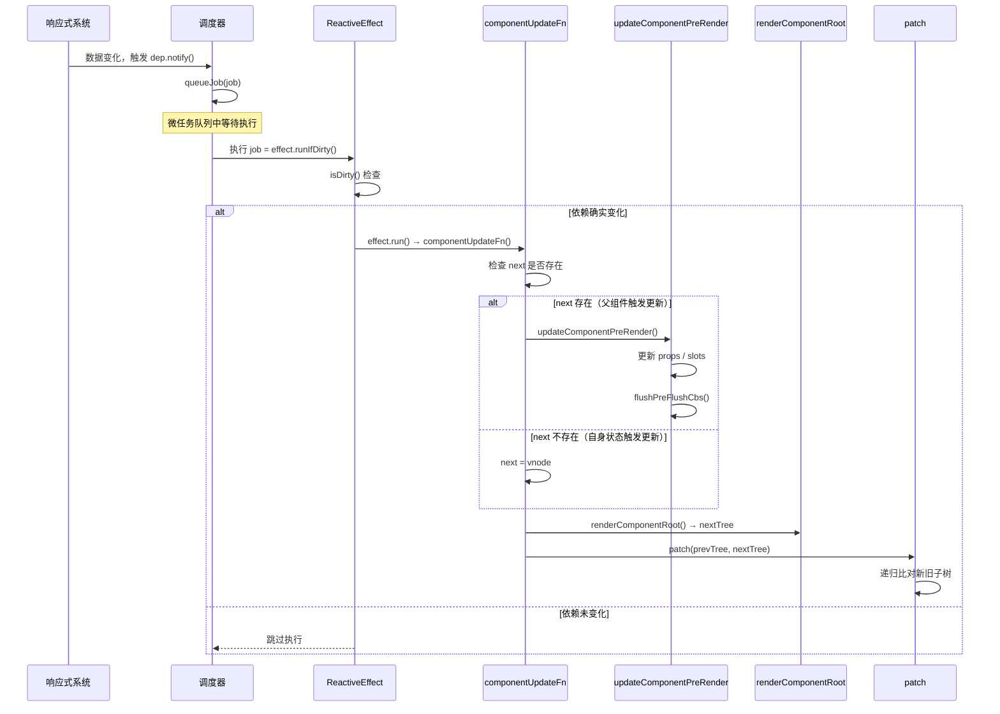

核心流程可以概括为三个阶段：

1. **预处理阶段**：通过 `next` 判断更新来源，如果 `next` 存在则执行 `updateComponentPreRender` 更新组件实例信息
2. **渲染阶段**：调用 `renderComponentRoot` 生成新的子树 vnode
3. **比对阶段**：通过 `patch` 比对新旧子树，完成 DOM 更新

接下来我们深入每个阶段的细节。

## next 的作用：区分两种更新来源

组件更新有两种触发来源，理解它们的区别是掌握组件更新机制的关键：

| 更新来源 | next 的值 | 触发场景 | 更新内容 |
|----------|-----------|----------|----------|
| 自身状态变化 | `null` | 组件内部响应式数据变化 | 仅重新渲染子树 |
| 父组件传递 | `VNode` | 父组件 patch 遇到子组件 | 先更新 props/slots，再重新渲染 |

当 `next` 为 `null` 时，说明是组件自身的响应式数据变化触发的更新，此时不需要更新 props 和 slots，只需要重新渲染子树即可。当 `next` 为 `VNode` 时，说明是父组件在 patch 过程中触发了子组件的更新，此时需要先通过 `updateComponentPreRender` 更新组件实例上的 props 和 slots 信息。

> **设计洞察**：`next` 机制是 Vue 组件更新粒度控制的核心。它将"自身状态变化"和"外部 props 变化"两种更新场景统一到同一个 `componentUpdateFn` 中处理，避免了为两种场景维护两套更新逻辑。同时，通过 `originNext` 变量记录原始的 next 值，在更新完成后可以判断是否需要更新 HOC 宿主元素——只有自身状态触发的更新才需要。

## updateComponentPreRender：更新组件实例

当 `next` 存在时，会执行 `updateComponentPreRender` 函数：

```ts
// Vue 3.5 - packages/runtime-core/src/renderer.ts
const updateComponentPreRender = (
  instance: ComponentInternalInstance,
  nextVNode: VNode,
  optimized: boolean,
) => {
  nextVNode.component = instance
  const prevProps = instance.vnode.props
  instance.vnode = nextVNode
  instance.next = null
  updateProps(instance, nextVNode.props, prevProps, optimized)
  updateSlots(instance, nextVNode.children, optimized)

  pauseTracking()
  // props 更新可能触发了 pre-flush 的 watchers
  // 在渲染更新之前先刷新它们
  flushPreFlushCbs(instance)
  resetTracking()
}
```

与早期版本相比，Vue 3.5 的 `updateComponentPreRender` 增加了两个重要细节：

1. **`updateSlots` 增加了 `optimized` 参数**：在编译优化模式下，slots 的更新可以走快速路径
2. **`flushPreFlushCbs(instance)`**：在更新 props 和 slots 之后、渲染之前，先执行所有 pre-flush 的 watch 回调。这确保了 `watch` 中对 props 变化的响应在渲染之前完成，避免渲染出过时的数据

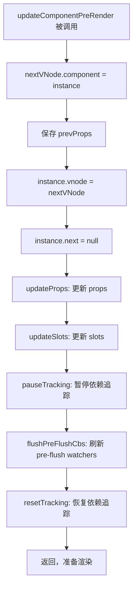

> **设计洞察**：`flushPreFlushCbs` 放在 `updateComponentPreRender` 中是一个精心设计的时序安排。考虑这个场景：父组件传递了一个 prop，子组件通过 `watch(props.xxx, ...)` 监听它。当 prop 变化时，watch 回调需要在渲染之前执行，这样回调中对本地状态的修改才能反映在本次渲染中。如果先渲染再执行 watch，就会导致渲染结果滞后一帧。

## patch：比对新旧子树

当新的子树 vnode 生成后，就进入了 `patch` 阶段：

```ts
// Vue 3.5 - packages/runtime-core/src/renderer.ts
const patch: PatchFn = (
  n1,
  n2,
  container,
  anchor = null,
  parentComponent = null,
  parentSuspense = null,
  namespace = undefined,
  slotScopeIds = null,
  optimized = __DEV__ && isHmrUpdating ? false : !!n2.dynamicChildren,
) => {
  if (n1 === n2) {
    return
  }

  // 新老节点类型不同，卸载旧节点
  if (n1 && !isSameVNodeType(n1, n2)) {
    anchor = getNextHostNode(n1)
    unmount(n1, parentComponent, parentSuspense, true)
    n1 = null
  }

  // BAIL 优化标记：降级为全量比对
  if (n2.patchFlag === PatchFlags.BAIL) {
    optimized = false
    n2.dynamicChildren = null
  }

  const { type, ref, shapeFlag } = n2
  switch (type) {
    case Text:
      processText(n1, n2, container, anchor)
      break
    case Comment:
      processCommentNode(n1, n2, container, anchor)
      break
    case Static:
      if (n1 == null) {
        mountStaticNode(n2, container, anchor, namespace)
      } else if (__DEV__) {
        patchStaticNode(n1, n2, container, namespace)
      }
      break
    case Fragment:
      processFragment(
        n1, n2, container, anchor, parentComponent,
        parentSuspense, namespace, slotScopeIds, optimized,
      )
      break
    default:
      if (shapeFlag & ShapeFlags.ELEMENT) {
        processElement(
          n1, n2, container, anchor, parentComponent,
          parentSuspense, namespace, slotScopeIds, optimized,
        )
      } else if (shapeFlag & ShapeFlags.COMPONENT) {
        processComponent(
          n1, n2, container, anchor, parentComponent,
          parentSuspense, namespace, slotScopeIds, optimized,
        )
      }
      // ... 其他类型处理
  }
}
```

首先判断当 `n1` 存在（即存在旧节点），但新旧节点不是同类型节点时，执行卸载旧节点、新增新节点。判断是否同类型的逻辑在 `isSameVNodeType` 中：

```ts
// Vue 3.5 - packages/runtime-core/src/vnode.ts
export function isSameVNodeType(n1: VNode, n2: VNode): boolean {
  if (__DEV__ && n2.shapeFlag & ShapeFlags.COMPONENT && n1.component) {
    const dirtyInstances = hmrDirtyComponents.get(n2.type as ConcreteComponent)
    if (dirtyInstances && dirtyInstances.has(n1.component)) {
      // HMR 场景：强制卸载旧组件，重新挂载新组件
      n1.shapeFlag &= ~ShapeFlags.COMPONENT_SHOULD_KEEP_ALIVE
      n2.shapeFlag &= ~ShapeFlags.COMPONENT_KEPT_ALIVE
      return false
    }
  }
  return n1.type === n2.type && n1.key === n2.key
}
```

Vue 3.5 在 `isSameVNodeType` 中增加了 HMR（热模块替换）的特殊处理：当组件被热更新时，即使 type 和 key 相同，也返回 `false`，强制卸载旧组件并重新挂载新组件，确保热更新能正确生效。

如果新旧节点是同类型，则根据 `shapeFlag` 走不同的更新逻辑：普通元素走 `processElement`，组件走 `processComponent`。

### processElement：普通元素更新

```ts
// Vue 3.5 - packages/runtime-core/src/renderer.ts
const processElement = (
  n1, n2, container, anchor, parentComponent,
  parentSuspense, namespace, slotScopeIds, optimized,
) => {
  if (n1 == null) {
    // 挂载逻辑...
  } else {
    patchElement(
      n1, n2, parentComponent, parentSuspense,
      namespace, slotScopeIds, optimized,
    )
  }
}
```

`patchElement` 是普通元素更新的核心函数：

```ts
// Vue 3.5 - packages/runtime-core/src/renderer.ts
const patchElement = (
  n1, n2, parentComponent, parentSuspense,
  namespace, slotScopeIds, optimized,
) => {
  const el = (n2.el = n1.el!)
  let { patchFlag, dynamicChildren, dirs } = n2

  // #1426 考虑旧节点的 patchFlag，因为用户可能克隆编译器生成的 vnode
  patchFlag |= n1.patchFlag & PatchFlags.FULL_PROPS

  const oldProps = n1.props || EMPTY_OBJ
  const newProps = n2.props || EMPTY_OBJ

  // 禁止在 beforeUpdate 钩子中递归触发更新
  parentComponent && toggleRecurse(parentComponent, false)
  // onVnodeBeforeUpdate 钩子
  if ((vnodeHook = newProps.onVnodeBeforeUpdate)) {
    invokeVNodeHook(vnodeHook, parentComponent, n2, n1)
  }
  // 指令的 beforeUpdate 钩子
  if (dirs) {
    invokeDirectiveHook(n2, n1, parentComponent, 'beforeUpdate')
  }
  parentComponent && toggleRecurse(parentComponent, true)

  // #9135 innerHTML/textContent 清空需要在子节点挂载之前处理
  if (
    (oldProps.innerHTML && newProps.innerHTML == null) ||
    (oldProps.textContent && newProps.textContent == null)
  ) {
    hostSetElementText(el, '')
  }

  if (dynamicChildren) {
    // Block 优化路径：只比对动态子节点
    patchBlockChildren(
      n1.dynamicChildren!, dynamicChildren, el,
      parentComponent, parentSuspense,
      resolveChildrenNamespace(n2, namespace), slotScopeIds,
    )
  } else if (!optimized) {
    // 全量比对子节点
    patchChildren(
      n1, n2, el, null, parentComponent, parentSuspense,
      resolveChildrenNamespace(n2, namespace), slotScopeIds, false,
    )
  }

  // 更新 props
  if (patchFlag > 0) {
    if (patchFlag & PatchFlags.FULL_PROPS) {
      // 动态 key 的 props，需要全量比对
      patchProps(el, oldProps, newProps, parentComponent, namespace)
    } else {
      // class
      if (patchFlag & PatchFlags.CLASS) {
        if (oldProps.class !== newProps.class) {
          hostPatchProp(el, 'class', null, newProps.class, namespace)
        }
      }
      // style
      if (patchFlag & PatchFlags.STYLE) {
        hostPatchProp(el, 'style', oldProps.style, newProps.style, namespace)
      }
      // props
      if (patchFlag & PatchFlags.PROPS) {
        const propsToUpdate = n2.dynamicProps!
        for (let i = 0; i < propsToUpdate.length; i++) {
          const key = propsToUpdate[i]
          const prev = oldProps[key]
          const next = newProps[key]
          if (next !== prev || key === 'value') {
            hostPatchProp(el, key, prev, next, namespace, parentComponent)
          }
        }
      }
    }
    // text
    if (patchFlag & PatchFlags.TEXT) {
      if (n1.children !== n2.children) {
        hostSetElementText(el, n2.children as string)
      }
    }
  } else if (!optimized && dynamicChildren == null) {
    // 非优化模式，全量比对 props
    patchProps(el, oldProps, newProps, parentComponent, namespace)
  }
}
```

Vue 3.5 的 `patchElement` 相比早期版本有几个重要改进：

1. **`resolveChildrenNamespace`**：处理 SVG 命名空间的正确继承，确保在 foreignObject 等场景下子节点的命名空间正确
2. **`#9135` 修复**：当旧节点有 `innerHTML` 或 `textContent` 而新节点没有时，需要先清空文本内容，再挂载新的子节点。这修复了一个边界情况下的渲染 bug
3. **`patchFlag |= n1.patchFlag & PatchFlags.FULL_PROPS`**：考虑旧节点的 patchFlag，处理用户克隆编译器生成 vnode 的场景

> 这里省略了对 `dynamicChildren` 存在时执行 `patchBlockChildren` 的优化 diff 过程，我们直接先看全量 diff 也就是 `patchChildren` 函数。关于 `patchBlockChildren` 我们将在**编译过程中的优化**小节中进行详细介绍。

### patchChildren：子节点更新

```ts
// Vue 3.5 - packages/runtime-core/src/renderer.ts
const patchChildren = (
  n1, n2, container, anchor, parentComponent,
  parentSuspense, namespace, slotScopeIds, optimized = false,
) => {
  const c1 = n1 && n1.children
  const prevShapeFlag = n1 ? n1.shapeFlag : 0
  const c2 = n2.children
  const { patchFlag, shapeFlag } = n2

  // 快速路径：编译器标记的优化路径
  if (patchFlag > 0) {
    if (patchFlag & PatchFlags.KEYED_FRAGMENT) {
      // 有 key 的子节点 Fragment
      patchKeyedChildren(
        c1 as VNode[], c2 as VNodeArrayChildren, container, anchor,
        parentComponent, parentSuspense, namespace, slotScopeIds, optimized,
      )
      return
    } else if (patchFlag & PatchFlags.UNKEYED_FRAGMENT) {
      // 无 key 的子节点 Fragment
      patchUnkeyedChildren(
        c1 as VNode[], c2 as VNodeArrayChildren, container, anchor,
        parentComponent, parentSuspense, namespace, slotScopeIds, optimized,
      )
      return
    }
  }

  // children 有三种可能：文本、数组、空
  if (shapeFlag & ShapeFlags.TEXT_CHILDREN) {
    // 新子节点是文本
    if (prevShapeFlag & ShapeFlags.ARRAY_CHILDREN) {
      // 旧子节点是数组 → 卸载旧子节点
      unmountChildren(c1 as VNode[], parentComponent, parentSuspense)
    }
    if (c2 !== c1) {
      // 新旧都是文本但内容不同 → 替换文本
      hostSetElementText(container, c2 as string)
    }
  } else {
    // 新子节点不是文本
    if (prevShapeFlag & ShapeFlags.ARRAY_CHILDREN) {
      // 旧子节点是数组
      if (shapeFlag & ShapeFlags.ARRAY_CHILDREN) {
        // 新旧都是数组 → 执行 diff 算法
        patchKeyedChildren(
          c1 as VNode[], c2 as VNodeArrayChildren, container, anchor,
          parentComponent, parentSuspense, namespace, slotScopeIds, optimized,
        )
      } else {
        // 新子节点为空 → 卸载旧子节点
        unmountChildren(c1 as VNode[], parentComponent, parentSuspense, true)
      }
    } else {
      // 旧子节点不是数组（文本或空）
      if (prevShapeFlag & ShapeFlags.TEXT_CHILDREN) {
        // 旧子节点是文本 → 清空
        hostSetElementText(container, '')
      }
      if (shapeFlag & ShapeFlags.ARRAY_CHILDREN) {
        // 新子节点是数组 → 挂载新子节点
        mountChildren(
          c2 as VNodeArrayChildren, container, anchor,
          parentComponent, parentSuspense, namespace, slotScopeIds, optimized,
        )
      }
    }
  }
}
```

Vue 3.5 的 `patchChildren` 相比早期版本增加了编译器优化快速路径：当 `patchFlag > 0` 时，可以直接根据 `KEYED_FRAGMENT` 或 `UNKEYED_FRAGMENT` 标记跳过类型判断，直接进入对应的 diff 算法。

子节点的类型只有三种可能：文本节点、数组节点、空节点。所有 `if-else` 分支覆盖了新旧子节点组合的全部情况：

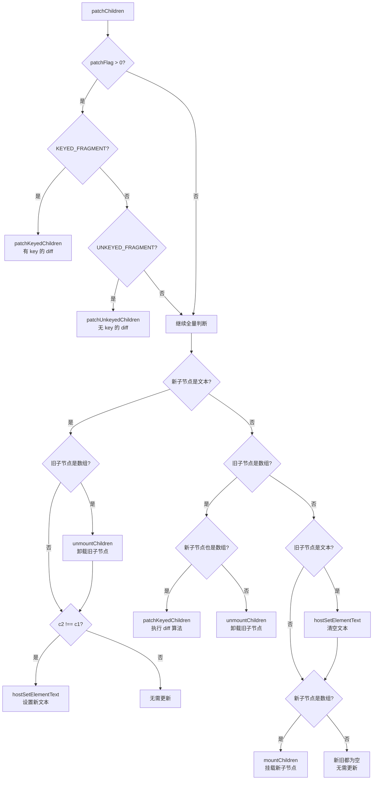

其中新旧子节点都是数组的情况涉及到我们平常所说的 `diff` 算法，会放到后面专门解析。

## processComponent：组件更新

看完处理 DOM 元素的情况，接下来看处理 Vue 组件：

```ts
// Vue 3.5 - packages/runtime-core/src/renderer.ts
const processComponent = (
  n1, n2, container, anchor, parentComponent,
  parentSuspense, namespace, slotScopeIds, optimized,
) => {
  n2.slotScopeIds = slotScopeIds
  if (n1 == null) {
    // 挂载逻辑...
  } else {
    updateComponent(n1, n2, optimized)
  }
}
```

`processComponent` 更新逻辑调用 `updateComponent` 函数：

```ts
// Vue 3.5 - packages/runtime-core/src/renderer.ts
const updateComponent = (n1: VNode, n2: VNode, optimized: boolean) => {
  const instance = (n2.component = n1.component)!
  if (shouldUpdateComponent(n1, n2, optimized)) {
    if (
      __FEATURE_SUSPENSE__ &&
      instance.asyncDep &&
      !instance.asyncResolved
    ) {
      // 异步组件且尚未解析完成 → 仅更新 props 和 slots
      updateComponentPreRender(instance, n2, optimized)
      return
    } else {
      // 正常更新：将新 vnode 赋值给 next，触发更新
      instance.next = n2
      // instance.update 是 ReactiveEffect.run 的绑定版本
      instance.update()
    }
  } else {
    // 不需要更新，仅复制属性
    n2.el = n1.el
    instance.vnode = n2
  }
}
```

`updateComponent` 的核心逻辑是通过 `shouldUpdateComponent` 判断是否需要更新。如果需要更新，则将新的 vnode 赋值给 `instance.next`，然后调用 `instance.update()` 触发组件的副作用渲染函数重新执行。如果不需要更新，则仅将旧节点的 el 和 vnode 信息复制到新节点上。

注意 Vue 3.5 中 `instance.update()` 的实现——它是 `effect.run.bind(effect)`，直接调用会执行 `componentUpdateFn`。这与通过调度器触发的 `effect.runIfDirty()` 不同：手动调用 `update()` 会无条件执行，而调度器触发时会先进行脏检查。

> **设计洞察**：为什么 `updateComponent` 中直接调用 `instance.update()` 而不是通过调度器？因为当父组件 patch 到子组件时，父组件的更新已经在执行中，子组件的更新应该同步完成，而不是异步排队。这保证了组件树更新的深度优先顺序——父组件更新时，子组件的更新在父组件的 patch 过程中就完成了。

### shouldUpdateComponent：判断是否需要更新

`shouldUpdateComponent` 是组件更新优化的关键函数，它决定了子组件是否需要因为父组件的变化而重新渲染：

```ts
// Vue 3.5 - packages/runtime-core/src/componentRenderUtils.ts
export function shouldUpdateComponent(
  prevVNode: VNode,
  nextVNode: VNode,
  optimized?: boolean,
): boolean {
  const { props: prevProps, children: prevChildren, component } = prevVNode
  const { props: nextProps, children: nextChildren, patchFlag } = nextVNode
  const emits = component!.emitsOptions

  // HMR 更新时强制子组件更新
  if (__DEV__ && (prevChildren || nextChildren) && isHmrUpdating) {
    return true
  }

  // 有指令或过渡的组件 vnode，强制更新
  if (nextVNode.dirs || nextVNode.transition) {
    return true
  }

  if (optimized && patchFlag >= 0) {
    // 编译器优化路径
    if (patchFlag & PatchFlags.DYNAMIC_SLOTS) {
      // 动态 slots（如 v-for 中的 slot）需要更新
      return true
    }
    if (patchFlag & PatchFlags.FULL_PROPS) {
      // 完整 props 比对
      if (!prevProps) {
        return !!nextProps
      }
      return hasPropsChanged(prevProps, nextProps!, emits)
    } else if (patchFlag & PatchFlags.PROPS) {
      // 仅比对动态 props
      const dynamicProps = nextVNode.dynamicProps!
      for (let i = 0; i < dynamicProps.length; i++) {
        const key = dynamicProps[i]
        if (
          nextProps![key] !== prevProps![key] &&
          !isEmitListener(emits, key)
        ) {
          return true
        }
      }
    }
  } else {
    // 手写渲染函数路径
    // 有子内容（slots）且不稳定 → 需要更新
    if (prevChildren || nextChildren) {
      if (!nextChildren || !(nextChildren as any).$stable) {
        return true
      }
    }
    // props 引用相同 → 不需要更新
    if (prevProps === nextProps) {
      return false
    }
    // 旧 props 为空，新 props 不为空 → 需要更新
    if (!prevProps) {
      return !!nextProps
    }
    // 新 props 为空 → 需要更新
    if (!nextProps) {
      return true
    }
    // 完整 props 比对
    return hasPropsChanged(prevProps, nextProps, emits)
  }

  return false
}

function hasPropsChanged(
  prevProps: Data,
  nextProps: Data,
  emitsOptions: ComponentInternalInstance['emitsOptions'],
): boolean {
  const nextKeys = Object.keys(nextProps)
  if (nextKeys.length !== Object.keys(prevProps).length) {
    return true
  }
  for (let i = 0; i < nextKeys.length; i++) {
    const key = nextKeys[i]
    if (
      nextProps[key] !== prevProps[key] &&
      !isEmitListener(emitsOptions, key)
    ) {
      return true
    }
  }
  return false
}
```

`shouldUpdateComponent` 的判断逻辑可以分为两条路径：

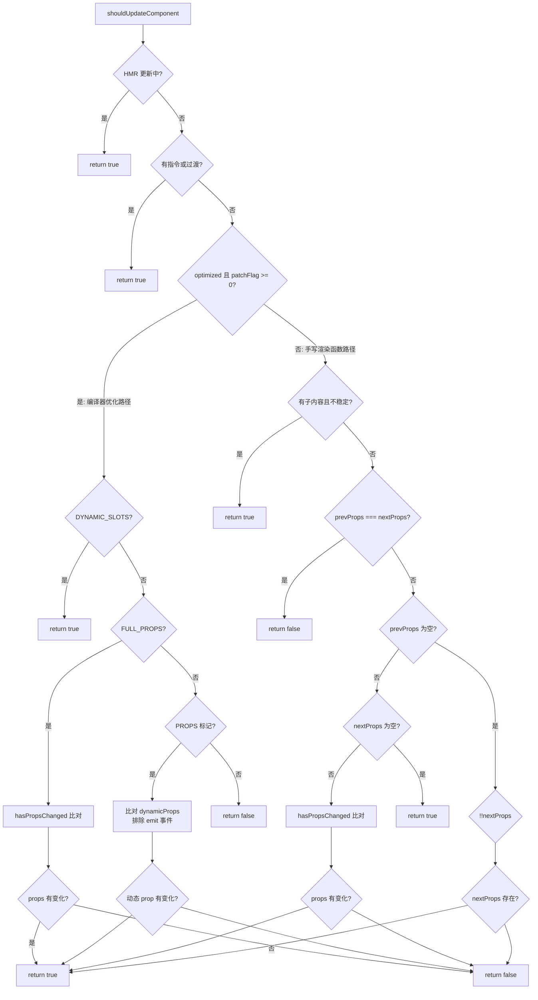

`shouldUpdateComponent` 中有一个精妙的优化：在比对 props 变化时，会通过 `isEmitListener(emitsOptions, key)` 排除掉 emit 事件的监听器。考虑这个场景：

```html
<Child @update:modelValue="handler" />
```

编译后，`onUpdate:modelValue` 会作为 prop 传入子组件。但每次父组件重新渲染时，`handler` 可能是一个新的函数引用（除非编译器通过 cacheHandlers 缓存了事件处理函数），导致 `prevProps[key] !== nextProps[key]`。然而，emit 监听器的变化不应该触发子组件更新——因为子组件只是"发射"事件，并不"消费"这些监听器。通过 `isEmitListener` 过滤，Vue 避免了大量因事件监听器引用变化导致的无效子组件更新。

> **设计洞察**：`shouldUpdateComponent` 体现了 Vue 更新粒度控制的核心思想——组件级别的细粒度更新。它不是简单地"父组件更新就更新所有子组件"，而是在源码层面帮我们过滤掉了不必要的子组件更新。这种优化在大型组件树中效果尤为显著。

## 完整流程演示

为了更好地理解整体流程，以下通过一个具体的 demo 进行说明：

```html
<!-- App.vue -->
<template>
  <div>
    hello world
    <hello :msg="msg" />
    <button @click="changeMsg">修改 msg</button>
  </div>
</template>
<script setup>
import { ref } from 'vue'
import Hello from './hello.vue'

const msg = ref('你好')
function changeMsg() {
  msg.value = '你好啊，我变了'
}
</script>

<!-- hello.vue -->
<template>
  <div>{{ msg }}</div>
</template>
<script setup>
defineProps({
  msg: String
})
</script>
```

当点击"修改 msg"按钮后，完整的更新流程如下：

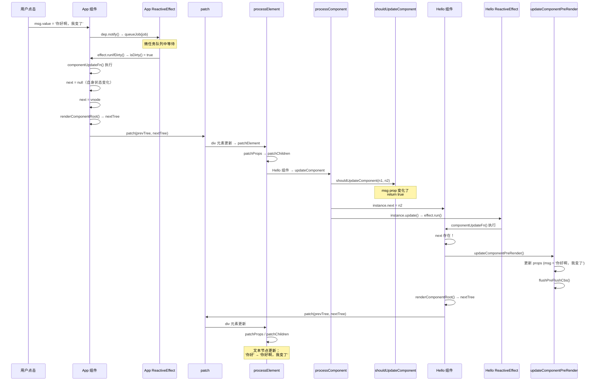

整个流程的关键步骤：

1. **App 组件自身状态变化**：`msg.value` 变化触发 App 的 ReactiveEffect，通过调度器入队 job
2. **App 组件执行更新**：`next` 为 `null`（自身状态变化），直接用当前 vnode 渲染新子树
3. **patch 比对子树**：遇到 div 元素走 `processElement`，遇到 Hello 组件走 `processComponent`
4. **Hello 组件判断更新**：`shouldUpdateComponent` 检测到 `msg` prop 变化，返回 `true`
5. **Hello 组件设置 next**：将新的 vnode 赋值给 `instance.next`，调用 `instance.update()`
6. **Hello 组件执行更新**：`next` 存在，先执行 `updateComponentPreRender` 更新 props，再渲染新子树
7. **Hello 组件 patch 子树**：最终更新 DOM 中的文本内容

> **设计洞察**：注意步骤 5 中 `instance.update()` 是同步调用的，而不是通过调度器异步排队。这保证了组件树的更新是深度优先的——父组件更新时，所有子组件的更新在同一个同步调用栈中完成。而步骤 1 中 App 组件的更新是通过调度器异步触发的，这保证了多个响应式数据变化只会触发一次组件更新。

## 总结

本节着重介绍了组件的更新逻辑，核心要点如下：

1. **ReactiveEffect 驱动更新**：Vue 3.5 使用 `ReactiveEffect` 类替代了早期的 `effect()` 工厂函数，通过 `runIfDirty` 实现了 Lazy Effect 机制，避免无效更新
2. **next 机制**：区分"自身状态变化"和"父组件 props 变化"两种更新来源，统一在 `componentUpdateFn` 中处理
3. **updateComponentPreRender**：在渲染前更新组件实例的 props、slots，并刷新 pre-flush watchers
4. **patchChildren**：根据新旧子节点的类型组合（文本/数组/空）走不同的更新策略
5. **shouldUpdateComponent**：通过编译器优化标记和 props 比对，过滤掉不必要的子组件更新

我们再补齐一下第二节中的流程图，加入 Vue 3.5 的更新机制：

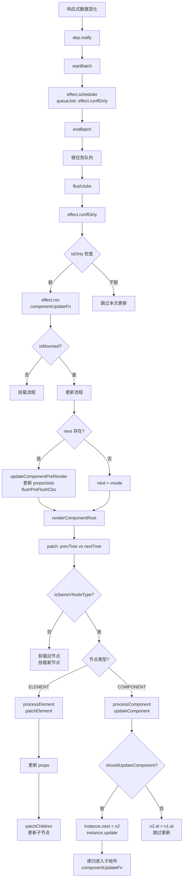

本节介绍了关于普通元素的简单更新过程，那关于复杂的更新过程的逻辑，也就是新老子节点都是数组的普通元素，应该如何进行更新？这就涉及到了 `diff` 算法，我们下节接着介绍。


---

## 前言

上一节，我们介绍了新旧子节点不同为数组的情况下的更新过程。本节将深入介绍当新旧子节点均为数组时的 diff 算法——这是 Vue 3 渲染器中最核心、最精妙的算法部分。

在深入五步 diff 流程之前，我们需要先理解 Vue 3.5 中一个关键的优化机制：**Block Tree + PatchFlags**。这个机制在很多场景下可以完全跳过全量 diff，直接进入靶向更新路径，大幅提升渲染性能。

## 0. Block Tree 与靶向更新：diff 的前置优化

### 0.1 传统 diff 的性能瓶颈

在传统的虚拟 DOM diff 中，即使模板中只有一处动态内容发生变化，框架也必须遍历整棵虚拟 DOM 树进行比对。例如：

```html
<div>
  <p>静态文本</p>
  <p>静态文本</p>
  <p>静态文本</p>
  <p>{{ dynamicText }}</p>
</div>
```

当 `dynamicText` 变化时，传统 diff 仍然需要逐个比对所有 4 个 `<p>` 节点，即使前 3 个节点永远不会变化。

### 0.2 Block Tree 的核心思想

Vue 3 引入了 **Block Tree** 机制来解决这个问题。Block 是一种特殊的 VNode，它除了自身的信息外，还维护一个 **dynamicChildren** 数组，只收集其内部动态子孙节点的引用。

编译器在编译模板时，会为每个动态节点打上 **PatchFlag**（补丁标志），标识该节点哪些部分是动态的。运行时在创建 VNode 树时，通过 `openBlock` / `createBlock` 将动态节点收集到当前 Block 的 `dynamicChildren` 中。

```typescript
// 编译器生成的渲染函数伪代码
function render() {
  return (
    openBlock(),       // 开启一个新的 Block 上下文
    createBlock('div', null, [
      createVNode('p', null, '静态文本', PatchFlags.CACHED),   // 静态节点，不收集
      createVNode('p', null, '静态文本', PatchFlags.CACHED),   // 静态节点，不收集
      createVNode('p', null, '静态文本', PatchFlags.CACHED),   // 静态节点，不收集
      createVNode('p', null, dynamicText, PatchFlags.TEXT),     // 动态节点，收集到 Block
    ])
  )
}
```

上述渲染函数执行后，Block 的 `dynamicChildren` 只包含最后一个 `<p>` 节点：

```
Block.dynamicChildren = [ VNode<p>{{ dynamicText }}</p> ]
```

### 0.3 PatchFlags 枚举定义

PatchFlags 是编译器生成的优化提示，定义在 `packages/shared/src/patchFlags.ts` 中：

| 标志 | 值 | 含义 |
|------|-----|------|
| `TEXT` | 1 | 动态文本内容 |
| `CLASS` | 2 | 动态 class 绑定 |
| `STYLE` | 4 | 动态 style 绑定 |
| `PROPS` | 8 | 动态非 class/style 属性 |
| `FULL_PROPS` | 16 | 动态 key 的属性（需全量 diff） |
| `NEED_HYDRATION` | 32 | 需要 hydration 的属性（事件等） |
| `STABLE_FRAGMENT` | 64 | 子节点顺序不变的 Fragment |
| `KEYED_FRAGMENT` | 128 | 带 key 的 Fragment 子节点 |
| `UNKEYED_FRAGMENT` | 256 | 不带 key 的 Fragment 子节点 |
| `NEED_PATCH` | 512 | 需要 patch（ref、指令等） |
| `DYNAMIC_SLOTS` | 1024 | 动态插槽 |
| `CACHED` | -1 | 被缓存的静态 VNode |
| `BAIL` | -2 | 退出优化模式 |

### 0.4 patchBlockChildren：靶向更新路径

当 VNode 拥有 `dynamicChildren` 时，`patchElement` 不会进入全量 diff，而是调用 `patchBlockChildren` 进行靶向更新：

```typescript
// packages/runtime-core/src/renderer.ts
const patchBlockChildren: PatchBlockChildrenFn = (
  oldChildren,
  newChildren,
  fallbackContainer,
  parentComponent,
  parentSuspense,
  namespace: ElementNamespace,
  slotScopeIds,
) => {
  for (let i = 0; i < newChildren.length; i++) {
    const oldVNode = oldChildren[i]
    const newVNode = newChildren[i]
    // 确定容器（父元素）
    const container =
      oldVNode.el &&
      (oldVNode.type === Fragment ||
        !isSameVNodeType(oldVNode, newVNode) ||
        oldVNode.shapeFlag & (ShapeFlags.COMPONENT | ShapeFlags.TELEPORT))
        ? hostParentNode(oldVNode.el)!
        : fallbackContainer
    patch(
      oldVNode,
      newVNode,
      container,
      null,
      parentComponent,
      parentSuspense,
      namespace,
      slotScopeIds,
      true /* optimized */,
    )
  }
}
```

`patchBlockChildren` 的核心逻辑非常简单：**只遍历 `dynamicChildren` 数组中的动态节点，逐一 patch**。由于跳过了所有静态节点，时间复杂度从 O(整棵子树) 降低到 O(动态节点数)。

### 0.5 何时回退到全量 diff

并非所有场景都能走靶向更新路径。以下情况会回退到全量 diff：

1. **VNode 没有 `dynamicChildren`**：手动编写的渲染函数（h 函数）不会生成 Block 结构
2. **`patchFlag === BAIL (-2)`**：编译器判断无法优化，主动退出
3. **HMR 更新**：开发环境热更新时强制全量 diff
4. **Fragment 包含动态子节点但非 STABLE_FRAGMENT**：子节点顺序可能变化，需要完整 diff

回退路径在 `patchElement` 中体现为：

```typescript
if (dynamicChildren) {
  // 靶向更新路径
  patchBlockChildren(
    n1.dynamicChildren!,
    dynamicChildren,
    el,
    parentComponent,
    parentSuspense,
    resolveChildrenNamespace(n2, namespace),
    slotScopeIds,
  )
} else if (!optimized) {
  // 全量 diff 路径
  patchChildren(
    n1,
    n2,
    el,
    null,
    parentComponent,
    parentSuspense,
    resolveChildrenNamespace(n2, namespace),
    slotScopeIds,
    false,
  )
}
```

### 0.6 Block Tree 与 diff 算法的关系

理解 Block Tree 优化后，我们可以更清晰地定位 `patchKeyedChildren`（五步 diff 算法）的适用场景：

```mermaid
flowchart TD
    A[组件更新] --> B{VNode 有 dynamicChildren?}
    B -->|是| C[patchBlockChildren<br/>靶向更新]
    B -->|否| D{patchFlag > 0?}
    D -->|KEYED_FRAGMENT| E[patchKeyedChildren<br/>五步 diff]
    D -->|UNKEYED_FRAGMENT| F[patchUnkeyedChildren<br/>无 key diff]
    D -->|否| G{新旧子节点都是数组?}
    G -->|是| E
    G -->|否| H[其他子节点处理逻辑]
    C --> I[仅遍历动态节点<br/>O(动态节点数)]
    E --> J[五步 diff 算法<br/>O(子节点数)]
```

Block Tree 优化使得很多场景根本不需要进入五步 diff，但当子节点是带 key 的列表且顺序可能变化时（如 `v-for` 渲染的列表），仍然需要 `patchKeyedChildren` 进行完整的 diff。接下来，我们就深入分析这个五步 diff 算法。

## 1. 从头比对

Vue 3 的 diff 算法第一步就是从头比对新老节点，判断是否为同类型节点：

```typescript
// packages/runtime-core/src/renderer.ts
const patchKeyedChildren = (
  c1: VNode[],
  c2: VNodeArrayChildren,
  container: RendererElement,
  parentAnchor: RendererNode | null,
  parentComponent: ComponentInternalInstance | null,
  parentSuspense: SuspenseBoundary | null,
  namespace: ElementNamespace,
  slotScopeIds: string[] | null,
  optimized: boolean,
) => {
  let i = 0
  const l2 = c2.length
  let e1 = c1.length - 1 // 旧节点的尾部索引
  let e2 = l2 - 1         // 新节点的尾部索引

  // 1. sync from start
  // (a b) c
  // (a b) d e
  while (i <= e1 && i <= e2) {
    const n1 = c1[i]
    const n2 = (c2[i] = optimized
      ? cloneIfMounted(c2[i] as VNode)
      : normalizeVNode(c2[i]))
    if (isSameVNodeType(n1, n2)) {
      patch(
        n1,
        n2,
        container,
        null,
        parentComponent,
        parentSuspense,
        namespace,
        slotScopeIds,
        optimized,
      )
    } else {
      break
    }
    i++
  }
}
```

这里有几个关键变量需要说明：

1. **`i`**：头部指针，从 0 开始递增
2. **`e1`**：旧子节点的尾部索引，初始值为 `c1.length - 1`
3. **`e2`**：新子节点的尾部索引，初始值为 `c2.length - 1`

从头比对的核心逻辑：不断移动头部指针 `i`，比较 `c1[i]` 和 `c2[i]` 是否为 `sameVnode`（key 相同且类型相同）。如果是，则递归执行 `patch` 更新节点；如果不满足条件，则退出头部比对，进入从尾比对流程。

`isSameVNodeType` 的判断逻辑如下：

```typescript
export function isSameVNodeType(n1: VNode, n2: VNode): boolean {
  // 类型相同且 key 相同
  return n1.type === n2.type && n1.key === n2.key
}
```

用图示表示从头比对的过程：

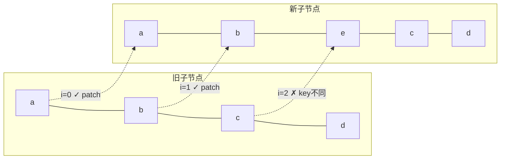

## 2. 从尾比对

头部比对结束后，进入从尾比对流程：

```typescript
  // 2. sync from end
  // a (b c)
  // d e (b c)
  while (i <= e1 && i <= e2) {
    const n1 = c1[e1]
    const n2 = (c2[e2] = optimized
      ? cloneIfMounted(c2[e2] as VNode)
      : normalizeVNode(c2[e2]))
    if (isSameVNodeType(n1, n2)) {
      patch(
        n1,
        n2,
        container,
        null,
        parentComponent,
        parentSuspense,
        namespace,
        slotScopeIds,
        optimized,
      )
    } else {
      break
    }
    e1--
    e2--
  }
```

从尾比对的核心逻辑：同时移动新旧节点的尾部指针 `e1` 和 `e2`，比较 `c1[e1]` 和 `c2[e2]` 是否为 `sameVnode`。如果是，则递归 `patch`；如果不满足条件，则退出尾部比对。

用图示表示从尾比对的过程（接续上例）：

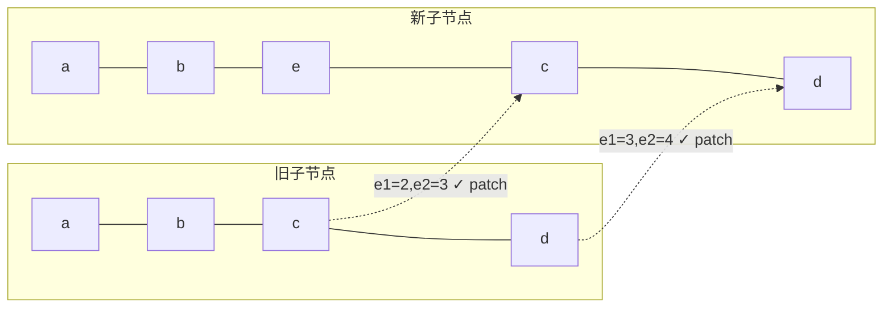

经过步骤 1 和步骤 2 后，指针状态为：`i = 2, e1 = 1, e2 = 2`。此时 `i > e1`，满足新增节点的条件。

## 3. 新增节点

当头部比对和尾部比对结束后，如果 `i > e1` 且 `i <= e2`，说明新子序列中还有剩余节点需要新增。

假设旧列表为 `[a, b, c, d]`，新列表为 `[a, b, e, c, d]`：

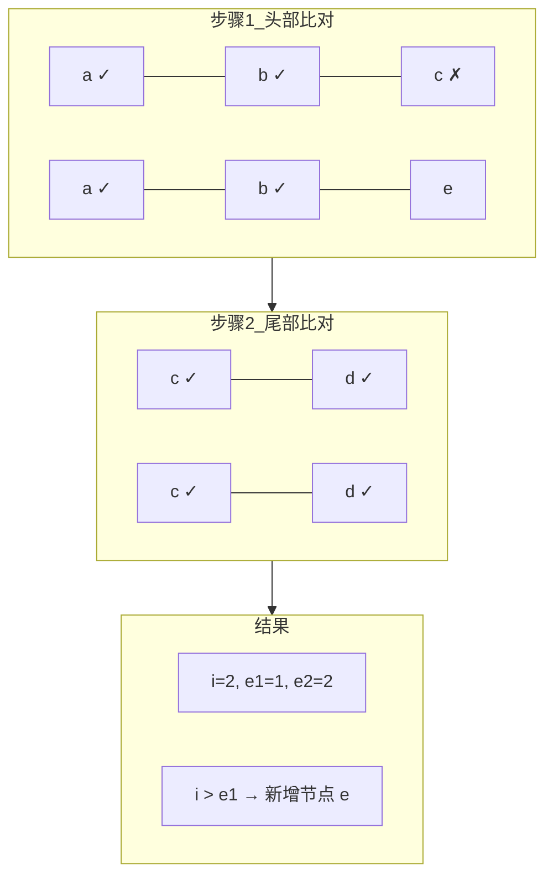

新增节点的源码实现：

```typescript
  // 3. common sequence + mount
  // (a b)
  // (a b) c
  // i = 2, e1 = 1, e2 = 2
  // (a b)
  // c (a b)
  // i = 0, e1 = -1, e2 = 0
  if (i > e1) {
    if (i <= e2) {
      const nextPos = e2 + 1
      // 锚点：如果 nextPos 在新子节点范围内，取其 el 作为插入参照
      // 否则使用 parentAnchor（父容器的末尾锚点）
      const anchor = nextPos < l2 ? (c2[nextPos] as VNode).el : parentAnchor
      while (i <= e2) {
        patch(
          null,
          (c2[i] = optimized
            ? cloneIfMounted(c2[i] as VNode)
            : normalizeVNode(c2[i])),
          container,
          anchor,
          parentComponent,
          parentSuspense,
          namespace,
          slotScopeIds,
          optimized,
        )
        i++
      }
    }
  }
```

**锚点（anchor）的确定逻辑**是新增节点的关键细节：

- `nextPos = e2 + 1`：指向新子序列剩余部分之后的第一个节点
- 如果 `nextPos < l2`，说明后面还有节点，新增的节点应插入到 `c2[nextPos].el` 之前
- 如果 `nextPos >= l2`，说明后面没有节点了，新增的节点追加到父容器末尾

这确保了新增节点被插入到正确的位置。例如，新列表为 `[c, a, b]`、旧列表为 `[a, b]` 时，经过头部比对后 `i = 0, e1 = -1, e2 = 0`，`c` 需要插入到 `a` 之前，此时 `anchor` 就是 `a.el`。

## 4. 删除节点

类比新增节点的情况，当 `i > e2` 时，说明旧子序列中还有剩余节点需要删除。

假设旧列表为 `[a, b, e, c, d]`，新列表为 `[a, b, c, d]`：

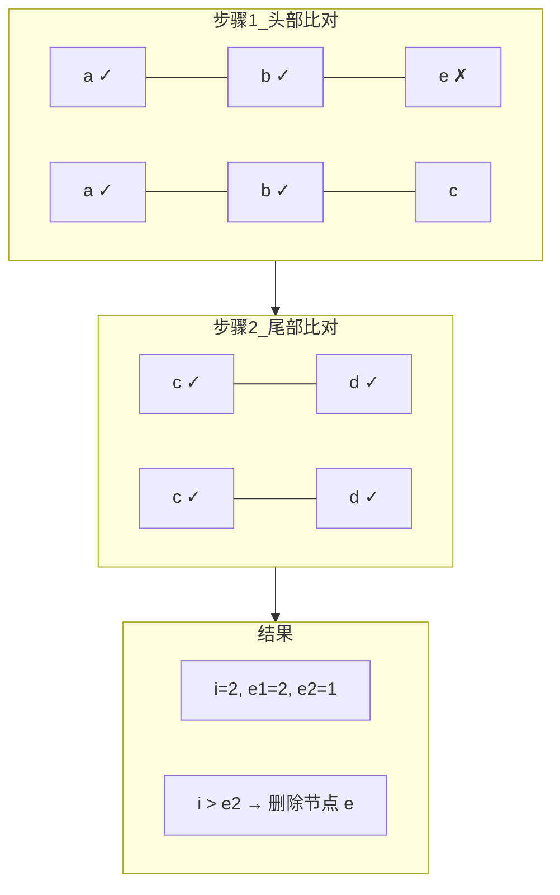

删除节点的源码实现：

```typescript
  // 4. common sequence + unmount
  // (a b) c
  // (a b)
  // i = 2, e1 = 2, e2 = 1
  // a (b c)
  // (b c)
  // i = 0, e1 = 0, e2 = -1
  else if (i > e2) {
    while (i <= e1) {
      unmount(c1[i], parentComponent, parentSuspense, true)
      i++
    }
  }
```

删除逻辑相对简单：遍历旧子序列中从 `i` 到 `e1` 的所有节点，逐一调用 `unmount` 卸载。

## 5. 未知子序列

经过步骤 1、2 后，如果既不满足 `i > e1`（新增），也不满足 `i > e2`（删除），说明中间存在一个"未知子序列"，需要更复杂的处理。来看一个典型例子：

旧子节点：`[a, b, c, d, e, f, g, h]`

新子节点：`[a, b, e, c, d, i, g, h]`

经过步骤 1、2 后：

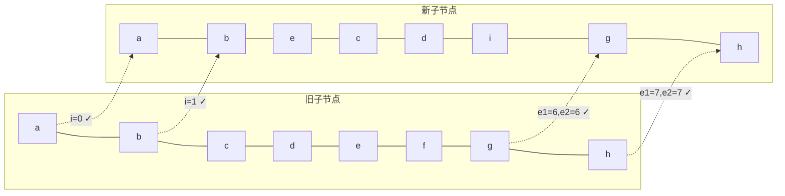

此时指针状态：`i = 2, e1 = 5, e2 = 5`。中间的未知子序列为：

- 旧：`[c, d, e, f]`（索引 2~5）
- 新：`[e, c, d, i]`（索引 2~5）

这种情况既不满足 `i > e1` 也不满足 `i > e2`，需要更精细的 diff 策略。

### 5.0 性能优化的核心原则

DOM 操作的性能优劣关系大致为：**属性更新 > 位置移动 > 增删节点**。因此，diff 算法的优化目标是：

1. 尽可能复用旧节点，只做属性更新（patch）
2. 减少节点移动次数
3. 减少增删节点的次数

对于上述例子，有两种更新策略：

| 策略 | 操作 | 移动次数 | 新增 | 删除 |
|------|------|----------|------|------|
| 策略 A | c、d 不动只 patch；e patch 后移到 c 前面；删除 f；在 d 后新增 i | 1 | 1 | 1 |
| 策略 B | e 不动只 patch；c、d patch 后移到 e 后面；删除 f；在 d 后新增 i | 2 | 1 | 1 |

策略 A 更优，因为移动次数更少。如何找到最少移动次数？这就需要**最长递增子序列（LIS）**算法。

### 5.1 构建新节点 key → index 映射

```typescript
  // 5. unknown sequence
  // [i ... e1 + 1]: a b [c d e] f g
  // [i ... e2 + 1]: a b [e d c h] f g
  // i = 2, e1 = 4, e2 = 5
  else {
    const s1 = i // 旧子序列起始索引
    const s2 = i // 新子序列起始索引

    // 5.1 build key:index map for newChildren
    const keyToNewIndexMap: Map<PropertyKey, number> = new Map()
    for (i = s2; i <= e2; i++) {
      const nextChild = (c2[i] = optimized
        ? cloneIfMounted(c2[i] as VNode)
        : normalizeVNode(c2[i]))
      if (nextChild.key != null) {
        if (__DEV__ && keyToNewIndexMap.has(nextChild.key)) {
          warn(
            `Duplicate keys found during update:`,
            JSON.stringify(nextChild.key),
            `Make sure keys are unique.`,
          )
        }
        keyToNewIndexMap.set(nextChild.key, i)
      }
    }
```

这一步构建新子序列的 `key → index` 映射表 `keyToNewIndexMap`，用于后续快速查找旧节点在新子序列中的位置。

对于我们的例子，新子序列 `[e, c, d, i]` 对应的索引为 `[2, 3, 4, 5]`，生成的映射为：

```
keyToNewIndexMap = {
  e → 2,
  c → 3,
  d → 4,
  i → 5
}
```

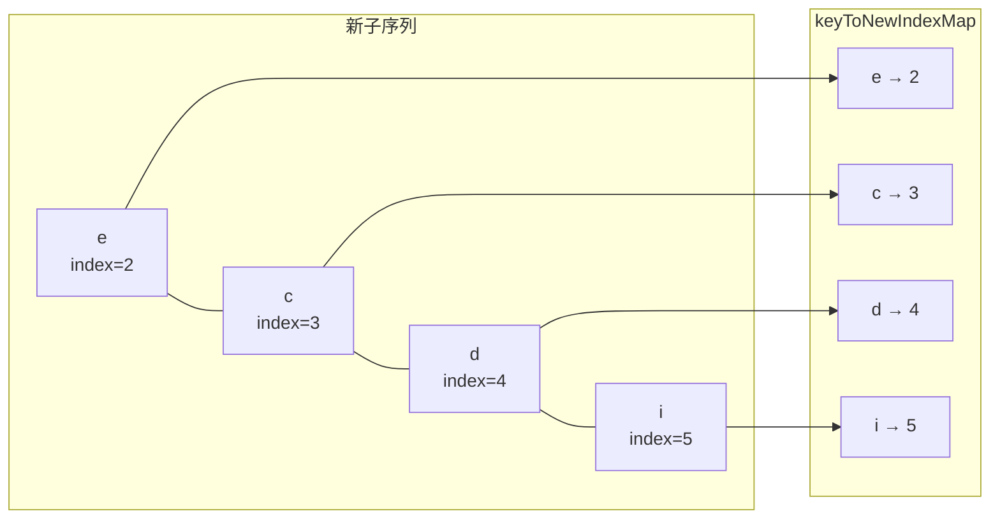

注意：Vue 在开发环境下会对**重复 key 检测**并发出警告，帮助开发者及早发现问题。

### 5.2 遍历旧节点：更新、删除、构建位置映射

有了 `keyToNewIndexMap`，接下来遍历旧子序列，寻找旧节点在新子序列中的位置：

```typescript
    // 5.2 loop through old children left to be patched and try to patch
    // matching nodes & remove nodes that are no longer present
    let j
    let patched = 0
    const toBePatched = e2 - s2 + 1  // 新子序列中待处理的节点数
    let moved = false                  // 是否需要移动节点
    // used to track whether any node has moved
    let maxNewIndexSoFar = 0           // 追踪遍历过程中遇到的最大新索引
    // works as Map<newIndex, oldIndex>
    // Note that oldIndex is offset by +1
    // and oldIndex = 0 is a special value indicating the new node has
    // no corresponding old node.
    // used for determining longest stable subsequence
    const newIndexToOldIndexMap = new Array(toBePatched)
    for (i = 0; i < toBePatched; i++) newIndexToOldIndexMap[i] = 0

    for (i = s1; i <= e1; i++) {
      const prevChild = c1[i]
      if (patched >= toBePatched) {
        // 所有新节点都已更新，剩余旧节点只能被删除
        unmount(prevChild, parentComponent, parentSuspense, true)
        continue
      }
      let newIndex
      if (prevChild.key != null) {
        // 有 key 的节点，通过 keyToNewIndexMap 快速查找
        newIndex = keyToNewIndexMap.get(prevChild.key)
      } else {
        // 无 key 的节点，遍历新子序列查找同类型节点
        for (j = s2; j <= e2; j++) {
          if (
            newIndexToOldIndexMap[j - s2] === 0 &&
            isSameVNodeType(prevChild, c2[j] as VNode)
          ) {
            newIndex = j
            break
          }
        }
      }
      if (newIndex === undefined) {
        // 旧节点不存在于新子序列中，卸载
        unmount(prevChild, parentComponent, parentSuspense, true)
      } else {
        // 记录新节点在旧子序列中的位置（+1 偏移，0 表示新增）
        newIndexToOldIndexMap[newIndex - s2] = i + 1
        // 判断是否有节点移动
        if (newIndex >= maxNewIndexSoFar) {
          maxNewIndexSoFar = newIndex
        } else {
          moved = true
        }
        // 更新节点
        patch(
          prevChild,
          c2[newIndex] as VNode,
          container,
          null,
          parentComponent,
          parentSuspense,
          namespace,
          slotScopeIds,
          optimized,
        )
        patched++
      }
    }
```

这一步的核心操作可以总结为四个要点：

**要点 1：`newIndexToOldIndexMap` 的设计**

`newIndexToOldIndexMap` 是一个长度为 `toBePatched` 的数组，索引对应新子序列的相对位置，值对应旧子序列中的位置（+1 偏移）。**0 是特殊值，表示该新节点在旧子序列中不存在**（需要新增）。+1 偏移是为了区分"位置 0"和"不存在"两种语义。

**要点 2：`patched >= toBePatched` 的提前终止优化**

如果已更新的节点数 `patched` 达到了新子序列的节点总数 `toBePatched`，说明所有新节点都已找到匹配，剩余的旧节点必然是多余的，直接卸载即可。这是一个重要的提前终止优化。

**要点 3：`moved` 标志的判断逻辑**

遍历旧子序列时，如果旧节点在新子序列中的位置 `newIndex` 始终是递增的，说明节点相对顺序没有变化，不需要移动。一旦出现 `newIndex < maxNewIndexSoFar`（降序），就标记 `moved = true`。

例如，旧节点 `[c, d, e, f]` 依次查找在新子序列 `[e, c, d, i]` 中的位置：

| 旧节点 | newIndex | maxNewIndexSoFar | moved |
|--------|----------|------------------|-------|
| c (i=2) | 3 | 3 | false |
| d (i=3) | 4 | 4 | false |
| e (i=4) | 2 | 4 | **true** |
| f (i=5) | undefined | - | 删除 |

当遍历到 `e` 时，`newIndex = 2 < maxNewIndexSoFar = 4`，说明 `e` 的位置发生了倒退，需要移动。

**要点 4：无 key 节点的回退查找**

对于没有 key 的节点，无法通过 `keyToNewIndexMap` 快速查找，只能遍历新子序列，寻找类型相同且尚未被匹配的节点。这也是为什么不推荐用 `index` 作为 key 的原因之一——当节点没有稳定的 key 时，diff 效率会降低。

经过这一步，我们得到：

```
newIndexToOldIndexMap = [5, 3, 4, 0]
                        ↑  ↑  ↑  ↑
                        e  c  d  i
                        |  |  |  新增节点（0表示旧中不存在）
                        |  |  旧索引3+1=4（d在旧中位置3）
                        |  旧索引2+1=3（c在旧中位置2）
                        旧索引4+1=5（e在旧中位置4）
```

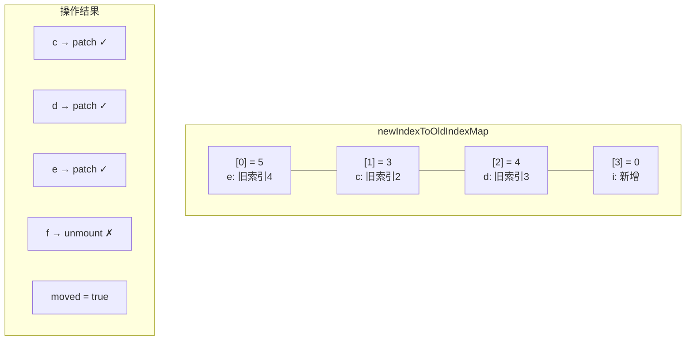

### 5.3 移动和新增节点

通过前面的操作，我们完成了旧节点的更新和删除。接下来需要处理节点的移动和新节点的添加：

```typescript
    // 5.3 move and mount
    // generate longest stable subsequence only when nodes have moved
    const increasingNewIndexSequence = moved
      ? getSequence(newIndexToOldIndexMap)
      : EMPTY_ARR
    j = increasingNewIndexSequence.length - 1
    // looping backwards so that we can use last patched node as anchor
    for (i = toBePatched - 1; i >= 0; i--) {
      const nextIndex = s2 + i
      const nextChild = c2[nextIndex] as VNode
      const anchor =
        nextIndex + 1 < l2 ? (c2[nextIndex + 1] as VNode).el : parentAnchor
      if (newIndexToOldIndexMap[i] === 0) {
        // mount new
        patch(
          null,
          nextChild,
          container,
          anchor,
          parentComponent,
          parentSuspense,
          namespace,
          slotScopeIds,
          optimized,
        )
      } else if (moved) {
        // move if:
        // There is no stable subsequence (e.g. a reverse)
        // OR current node is not among the stable sequence
        if (j < 0 || i !== increasingNewIndexSequence[j]) {
          move(nextChild, container, anchor, MoveType.REORDER)
        } else {
          j--
        }
      }
    }
  }
```

**要点 1：仅在 `moved = true` 时求 LIS**

如果 `moved = false`，说明所有节点相对顺序没有变化，不需要移动，直接跳过 LIS 计算。这是一个重要的优化——LIS 计算的时间复杂度为 O(n log n)，在不需要移动时可以完全避免。

**要点 2：从尾部向前遍历**

遍历方向从 `toBePatched - 1` 到 `0`（即从后向前），这样每次处理完一个节点后，它自然成为下一个节点的锚点参照。`anchor` 的计算逻辑：

- `nextIndex + 1 < l2`：如果当前节点后面还有节点，取其 `el` 作为插入锚点
- 否则使用 `parentAnchor`（父容器的末尾锚点）

**要点 3：三种操作分支**

| 条件 | 操作 | 含义 |
|------|------|------|
| `newIndexToOldIndexMap[i] === 0` | `patch(null, ...)` | 新增节点 |
| `moved && (j < 0 \|\| i !== LIS[j])` | `move(...)` | 移动节点 |
| `moved && i === LIS[j]` | `j--` | 节点在 LIS 中，不移动 |

**要点 4：LIS 的作用**

最长递增子序列标识了在新子序列中**相对顺序与旧子序列一致**的节点集合。这些节点不需要移动，只需要移动不在 LIS 中的节点。

对于我们的例子：

```
newIndexToOldIndexMap = [5, 3, 4, 0]
```

LIS 为 `[3, 4]`，对应索引 `[1, 2]`，即 `c` 和 `d` 节点不需要移动。

遍历过程如下：

| i | nextIndex | 节点 | newIndexToOldIndexMap[i] | 操作 |
|---|-----------|------|--------------------------|------|
| 3 | 5 | i | 0 | 新增 |
| 2 | 4 | d | 4 | 在 LIS 中，j-- |
| 1 | 3 | c | 3 | 在 LIS 中，j-- |
| 0 | 2 | e | 5 | j < 0，移动到 c 前面 |

最终操作结果：

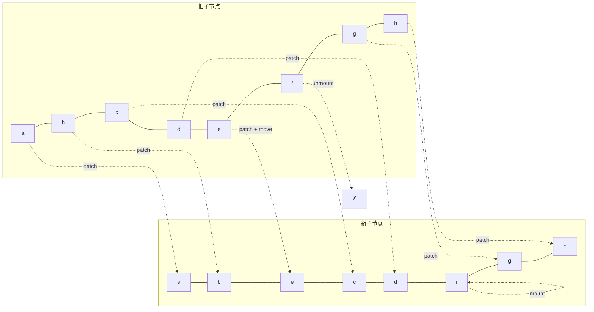

至此，完成了所有节点的增、删、更新、移动操作。

## 6. 最长递增子序列算法详解

求最长递增子序列（Longest Increasing Subsequence, LIS）是 LeetCode 上的经典算法题（[300. 最长递增子序列](https://leetcode.cn/problems/longest-increasing-subsequence/)）。

### 6.1 问题定义

给定一个数值序列，找到一个最长的子序列，使得子序列中的所有元素单调递增。注意：子序列不要求连续，但要求保持原序列中的相对顺序。

例如，序列 `[5, 3, 4, 0]` 的最长递增子序列为 `[3, 4]`，长度为 2。

### 6.2 贪心 + 二分查找算法

Vue 3 使用的是**贪心 + 二分查找**算法，时间复杂度为 O(n log n)，比朴素的动态规划 O(n^2) 更高效。

**贪心思想**：对于同样长度的递增子序列，末尾值越小越好。例如 `[2, 3]` 比 `[2, 5]` 更优，因为末尾值越小，后续能接上的元素越多，潜力更大。

**算法步骤**：

1. 维护一个数组 `result`，存储递增子序列中各位置的最小末尾值的**索引**
2. 遍历输入序列的每个元素：
   - 如果当前元素大于 `result` 末尾对应的值，追加到 `result`
   - 否则，用二分查找在 `result` 中找到第一个大于当前元素的位置并替换
3. 通过回溯数组 `p` 还原正确的索引序列

### 6.3 完整源码解析

```typescript
// packages/runtime-core/src/renderer.ts
function getSequence(arr: number[]): number[] {
  const p = arr.slice()  // 回溯数组，记录每个元素的前驱索引
  const result = [0]      // result 存储的是索引，不是值
  let i, j, u, v, c
  const len = arr.length

  for (i = 0; i < len; i++) {
    const arrI = arr[i]
    if (arrI !== 0) {  // 0 表示新增节点，跳过
      j = result[result.length - 1]
      if (arr[j] < arrI) {
        // 当前值大于 result 末尾对应的值，可以追加
        p[i] = j           // 记录前驱
        result.push(i)     // 追加当前索引
        continue
      }

      // 二分查找：在 result 中找到第一个 >= arrI 的位置
      u = 0
      v = result.length - 1
      while (u < v) {
        c = (u + v) >> 1  // 等价于 Math.floor((u + v) / 2)
        if (arr[result[c]] < arrI) {
          u = c + 1
        } else {
          v = c
        }
      }
      if (arrI < arr[result[u]]) {
        if (u > 0) {
          p[i] = result[u - 1]  // 记录前驱
        }
        result[u] = i           // 替换
      }
    }
  }

  // 回溯：从 result 的最后一个元素开始，通过 p 数组还原正确的索引序列
  u = result.length
  v = result[u - 1]
  while (u-- > 0) {
    result[u] = v
    v = p[v]
  }
  return result
}
```

### 6.4 逐步推演

以输入序列 `[1, 4, 5, 2, 8, 7, 6, 0]` 为例，逐步推演算法执行过程：

| 步骤 | 当前值 arrI | 操作 | result | p | 说明 |
|------|------------|------|--------|---|------|
| 1 | 1 | 追加 | [0] | [0, ...] | result 末尾对应值 1 < 当前值，追加 |
| 2 | 4 | 追加 | [0, 1] | [0, 0, ...] | 1 < 4，追加 |
| 3 | 5 | 追加 | [0, 1, 2] | [0, 0, 1, ...] | 4 < 5，追加 |
| 4 | 2 | 替换 | [0, 3, 2] | [0, 0, 1, 0, ...] | 二分查找位置 1，替换；p[3]=0 |
| 5 | 8 | 追加 | [0, 3, 2, 4] | [0, 0, 1, 0, 2, ...] | 5 < 8，追加；p[4]=2 |
| 6 | 7 | 替换 | [0, 3, 2, 5] | [0, 0, 1, 0, 2, 2, ...] | 二分查找位置 3，替换；p[5]=2 |
| 7 | 6 | 替换 | [0, 3, 2, 6] | [0, 0, 1, 0, 2, 2, 2, ...] | 二分查找位置 3，替换；p[6]=2 |
| 8 | 0 | 跳过 | [0, 3, 2, 6] | 不变 | arrI === 0，跳过 |

回溯前：`result = [0, 3, 2, 6]`，`p = [0, 0, 1, 0, 2, 2, 2]`

回溯过程：

```
u = 4, v = result[3] = 6
  result[3] = 6, v = p[6] = 2
  result[2] = 2, v = p[2] = 1
  result[1] = 1, v = p[1] = 0
  result[0] = 0, v = p[0] = 0
```

回溯后：`result = [0, 1, 2, 6]`

对应原序列的值为 `[1, 4, 5, 6]`，这就是最长递增子序列。

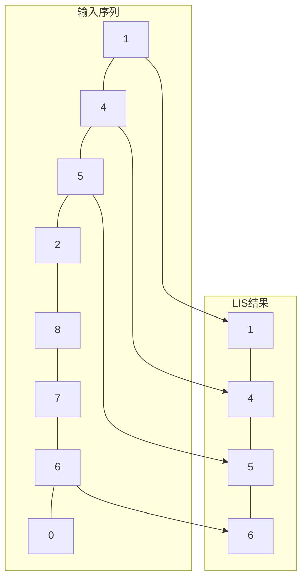

### 6.5 为什么需要回溯数组 p

单纯使用贪心 + 二分查找，`result` 数组存储的只是"各长度递增子序列的最小末尾值索引"，并不保证是正确的递增子序列。例如步骤 7 后 `result = [0, 3, 2, 6]`，对应的值为 `[1, 2, 5, 6]`，虽然长度正确，但索引 `[0, 3, 2, 6]` 并非递增顺序。

回溯数组 `p` 记录了每个元素被加入/替换时的前驱索引，通过从 `result` 末尾向前回溯，可以还原出正确的递增索引序列 `[0, 1, 2, 6]`。

### 6.6 算法复杂度分析

| 指标 | 复杂度 | 说明 |
|------|--------|------|
| 时间 | O(n log n) | 遍历 n 个元素，每次二分查找 O(log n) |
| 空间 | O(n) | `result` 和 `p` 数组各 O(n) |

相比朴素动态规划的 O(n^2) 时间复杂度，贪心 + 二分查找在长序列场景下有显著优势。

## 7. 完整 diff 流程总结

将五步 diff 算法整合，完整的流程如下：

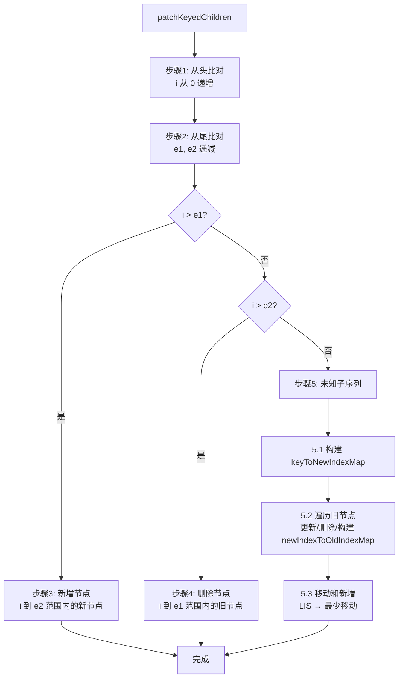

### 五步 diff 算法的时间复杂度

| 步骤 | 时间复杂度 | 说明 |
|------|-----------|------|
| 1. 从头比对 | O(k) | k 为头部相同节点数 |
| 2. 从尾比对 | O(m) | m 为尾部相同节点数 |
| 3. 新增节点 | O(n) | n 为新增节点数 |
| 4. 删除节点 | O(n) | n 为删除节点数 |
| 5.1 构建 key 映射 | O(n) | n 为未知子序列长度 |
| 5.2 遍历旧节点 | O(n) | 每个旧节点 O(1) 查找 |
| 5.3 移动和新增 | O(n log n) | LIS 计算主导 |
| **总计** | **O(n log n)** | n 为子节点数 |

## 8. 思考题

1. **为什么 Vue 3 不再沿用 Vue 2 的双端 diff 算法？** Vue 2 的双端 diff 使用四个指针（旧头、旧尾、新头、新尾）同时比对，虽然在某些场景下效率更高，但实现复杂度高，且与 Block Tree 优化体系不兼容。Vue 3 的五步 diff 算法在大多数实际场景中（头部/尾部相同）可以快速完成，且配合 Block Tree 的靶向更新，整体性能更优。

2. **为什么使用 `v-for` 时不建议用 `index` 作为 key？** 当列表发生变化（如插入、删除、排序）时，index 会随位置变化而重新分配，导致 key 与节点的对应关系不稳定。这会使 diff 算法误判节点是否相同，产生不必要的更新甚至渲染错误。例如，在列表头部插入一个元素后，所有元素的 index 都加 1，diff 算法会认为所有节点都需要更新，而不是简单地插入一个新节点。

3. **Block Tree 优化在什么场景下效果最显著？** 当模板中大部分内容是静态的，只有少量动态绑定时，Block Tree 的靶向更新效果最显著。极端情况下，一个包含 1000 个静态节点和 1 个动态节点的模板，传统 diff 需要比对 1001 个节点，而 Block Tree 只需比对 1 个动态节点。
