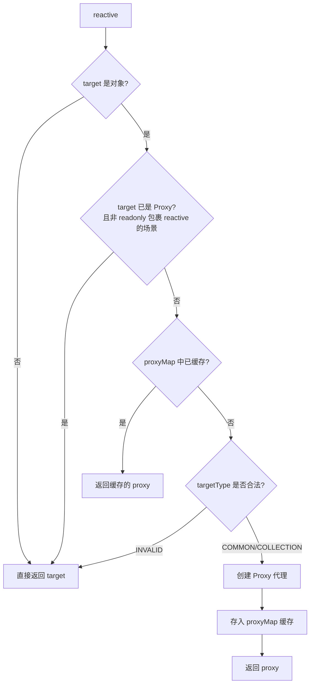
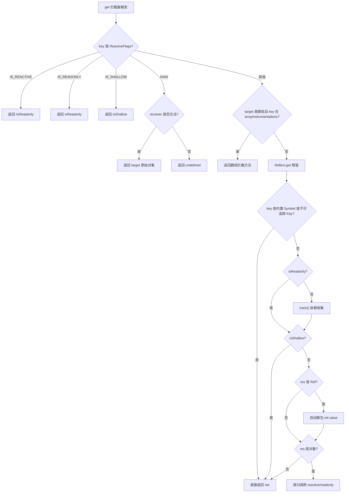
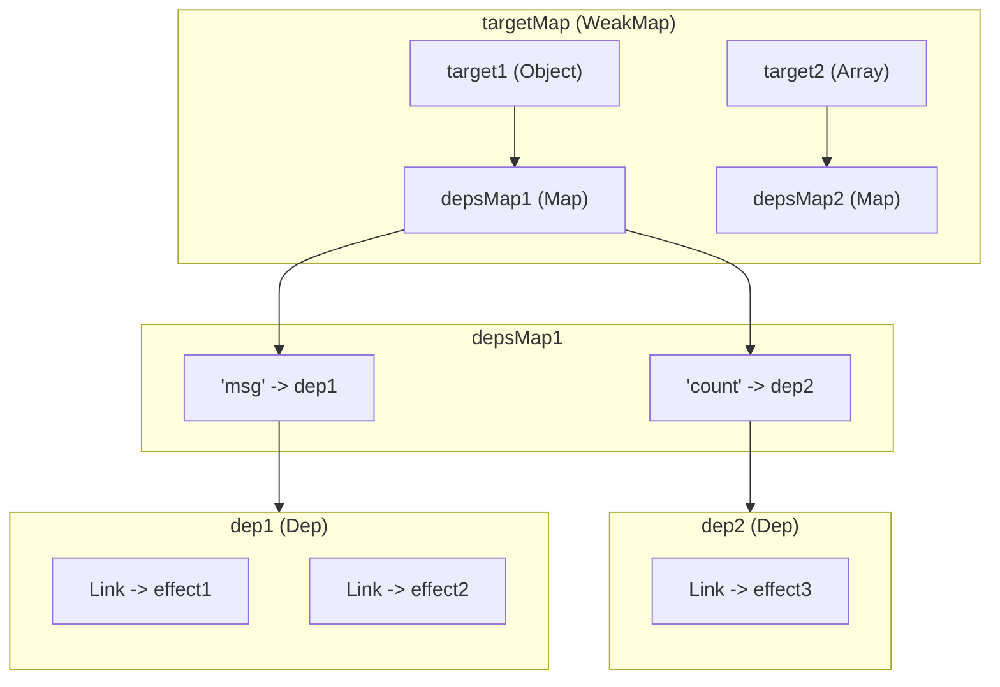
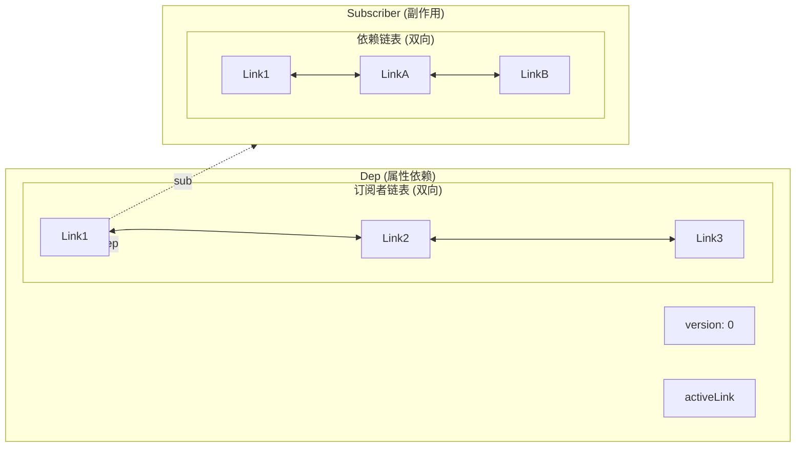
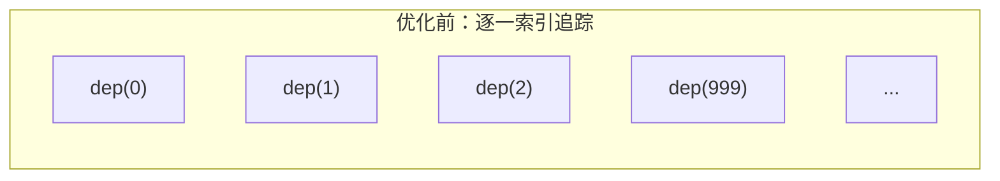
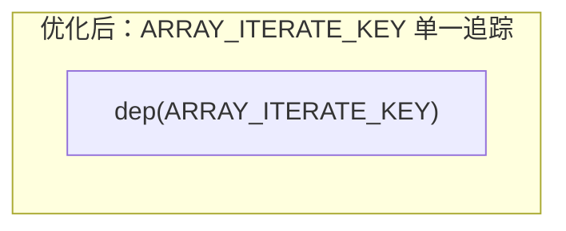

# 响应式-Proxy实现

## 前言

本小节我们开启响应式原理的篇章。在深入源码之前，先来看一个 `Vue 3` 基于 `Composition API` 的响应式应用示例：

```html
<template>
  <div>
    {{ state.msg }} {{ count }}
  </div>
</template>
<script setup>
  import { reactive, ref } from 'vue'

  const state = reactive({
    msg: 'hello world'
  })

  const count = ref(0)

  const changeMsg = () => {
    state.msg = 'world hello'
  }
</script>
```

我们通过 `reactive API` 或 `ref API` 来定义响应式数据。

- `reactive API`：用于定义对象类型（集合类型）的响应式数据，包括普通对象、数组以及 `Map`、`Set`、`WeakMap`、`WeakSet`。
- `ref API`：用于对 `string`、`number`、`boolean` 等原始类型数据进行响应式定义。

关于二者使用上的更多区别和差异，可参考 `Vue 3` 官方文档中[《响应式基础》](https://cn.vuejs.org/guide/essentials/reactivity-fundamentals.html)的介绍。从实现原理来看，二者都依托于 `Vue 3` 的响应式基础设施。本小节以 `reactive API` 作为切入点，深入分析 `Vue 3` 的响应式原理，并覆盖 `Vue 3.4` 和 `3.5` 中响应式系统的重大演进。

## Reactive

找到源码中 `reactive` 函数的定义（基于 Vue 3.5.x）：

```ts
export function reactive<T extends object>(target: T): Reactive<T>
export function reactive(target: object) {
  // 如果试图观测一个 readonly 代理，直接返回该 readonly 版本
  if (isReadonly(target)) {
    return target
  }
  return createReactiveObject(
    target,
    false,
    mutableHandlers,
    mutableCollectionHandlers,
    reactiveMap,
  )
}
```

`reactive` 函数的核心逻辑就是通过 `createReactiveObject` 将传入的 `target` 变成响应式代理对象。

## createReactiveObject

`createReactiveObject` 是整个响应式代理创建的枢纽函数：

```ts
function createReactiveObject(
  target: Target,
  isReadonly: boolean,
  baseHandlers: ProxyHandler<any>,
  collectionHandlers: ProxyHandler<any>,
  proxyMap: WeakMap<Target, any>,
) {
  // 1. 如果目标不是对象，直接返回原值
  if (!isObject(target)) {
    if (__DEV__) {
      warn(
        `value cannot be made ${isReadonly ? 'readonly' : 'reactive'}: ${String(target)}`,
      )
    }
    return target
  }
  // 2. target 已经是一个 Proxy，直接返回
  //    例外：对 reactive 对象调用 readonly() 时需要继续处理
  if (
    target[ReactiveFlags.RAW] &&
    !(isReadonly && target[ReactiveFlags.IS_REACTIVE])
  ) {
    return target
  }
  // 3. proxyMap 中已存在 target 对应的代理，直接返回缓存
  const existingProxy = proxyMap.get(target)
  if (existingProxy) {
    return existingProxy
  }
  // 4. 只有特定类型的值才能被观测
  const targetType = getTargetType(target)
  if (targetType === TargetType.INVALID) {
    return target
  }
  // 5. 创建 Proxy 代理对象
  const proxy = new Proxy(
    target,
    targetType === TargetType.COLLECTION ? collectionHandlers : baseHandlers,
  )
  // 6. 缓存 target -> proxy 映射
  proxyMap.set(target, proxy)
  return proxy
}
```

整个流程可以概括为以下步骤：



其中涉及几个关键判断：

1. **非对象直接返回**：`reactive` 只能处理对象类型，原始值直接返回。
2. **已代理对象直接返回**：通过 `ReactiveFlags.RAW` 判断目标是否已经是响应式代理，避免重复代理。但有一个例外 -- 对 `reactive` 对象调用 `readonly()` 时需要继续包装。
3. **缓存命中**：`proxyMap` 是一个 `WeakMap`，键为原始对象，值为代理对象。同一个 `target` 只会创建一次代理。
4. **类型合法性**：通过 `getTargetType` 判断目标类型是否可被观测。

## TargetType 判定

`getTargetType` 决定了 `target` 使用哪种 `handler`：

```ts
function getTargetType(value: Target) {
  return value[ReactiveFlags.SKIP] || !Object.isExtensible(value)
    ? TargetType.INVALID
    : targetTypeMap(toRawType(value))
}

function targetTypeMap(rawType: string) {
  switch (rawType) {
    case 'Object':
    case 'Array':
      return TargetType.COMMON
    case 'Map':
    case 'Set':
    case 'WeakMap':
    case 'WeakSet':
      return TargetType.COLLECTION
    default:
      return TargetType.INVALID
  }
}
```

| TargetType | 值 | 对应类型 | 使用的 Handler |
|---|---|---|---|
| `INVALID` | 0 | 不可扩展对象、标记了 `__v_skip` 的对象、其他类型 | 无（直接返回） |
| `COMMON` | 1 | `Object`、`Array` | `baseHandlers` |
| `COLLECTION` | 2 | `Map`、`Set`、`WeakMap`、`WeakSet` | `collectionHandlers` |

当 `target` 是普通对象或数组时，`targetType` 为 `COMMON`，使用 `baseHandlers`；当 `target` 是 `Map`、`Set` 等集合类型时，`targetType` 为 `COLLECTION`，使用 `collectionHandlers`。

## reactiveMap 缓存机制

`Vue 3` 定义了四个全局的 `WeakMap` 用于缓存不同类型的代理对象：

```ts
export const reactiveMap: WeakMap<Target, any> = new WeakMap<Target, any>()
export const shallowReactiveMap: WeakMap<Target, any> = new WeakMap<Target, any>()
export const readonlyMap: WeakMap<Target, any> = new WeakMap<Target, any>()
export const shallowReadonlyMap: WeakMap<Target, any> = new WeakMap<Target, any>()
```

| API | 使用的 proxyMap |
|---|---|
| `reactive()` | `reactiveMap` |
| `shallowReactive()` | `shallowReactiveMap` |
| `readonly()` | `readonlyMap` |
| `shallowReadonly()` | `shallowReadonlyMap` |

使用 `WeakMap` 而非 `Map` 的好处在于：当原始对象没有其他引用时，缓存条目可以被垃圾回收，避免内存泄漏。

此外，这四个 `proxyMap` 同时也承担了一个重要职责 -- 在 `getter` 中判断 `ReactiveFlags.RAW` 时，需要验证 `receiver` 是否为对应的 `proxyMap` 中的代理，从而确保只有通过合法代理访问时才会返回原始对象。

## mutableHandlers -- Proxy 拦截器

对于普通对象和数组，`Vue 3` 使用 `MutableReactiveHandler` 类来创建 `Proxy` 的 `handler`：

```ts
export const mutableHandlers: ProxyHandler<object> =
  /*@__PURE__*/ new MutableReactiveHandler()

export const shallowReactiveHandlers: MutableReactiveHandler =
  /*@__PURE__*/ new MutableReactiveHandler(true)
```

> **注意**：在 `Vue 3.5` 中，`handler` 的实现已从早期版本的对象字面量（`{ get, set, ... }`）重构为基于类的继承体系（`BaseReactiveHandler` -> `MutableReactiveHandler` / `ReadonlyReactiveHandler`），代码结构更加清晰。

`MutableReactiveHandler` 实现了以下 `Proxy` 拦截器：

| 拦截器 | 用途 | 来源 |
|---|---|---|
| `get` | 属性读取的捕捉器 | 继承自 `BaseReactiveHandler` |
| `set` | 属性设置的捕捉器 | 自身实现 |
| `deleteProperty` | `delete` 操作符的捕捉器 | 自身实现 |
| `has` | `in` 操作符的捕捉器 | 自身实现 |
| `ownKeys` | `Object.getOwnPropertyNames` 等方法的捕捉器 | 自身实现 |

响应式的核心逻辑就在 `get`（依赖收集）和 `set`（依赖触发）中。下面逐一分析。

## get -- 依赖收集

`get` 拦截器定义在 `BaseReactiveHandler` 类中：

```ts
class BaseReactiveHandler implements ProxyHandler<Target> {
  constructor(
    protected readonly _isReadonly = false,
    protected readonly _isShallow = false,
  ) {}

  get(target: Target, key: string | symbol, receiver: object): any {
    // 对 ReactiveFlags 的特殊处理
    if (key === ReactiveFlags.SKIP) return target[ReactiveFlags.SKIP]

    const isReadonly = this._isReadonly,
      isShallow = this._isShallow
    if (key === ReactiveFlags.IS_REACTIVE) {
      return !isReadonly
    } else if (key === ReactiveFlags.IS_READONLY) {
      return isReadonly
    } else if (key === ReactiveFlags.IS_SHALLOW) {
      return isShallow
    } else if (key === ReactiveFlags.RAW) {
      if (
        receiver ===
          (isReadonly
            ? isShallow
              ? shallowReadonlyMap
              : readonlyMap
            : isShallow
              ? shallowReactiveMap
              : reactiveMap
          ).get(target) ||
        // receiver 是 reactive proxy 的用户自定义代理
        Object.getPrototypeOf(target) === Object.getPrototypeOf(receiver)
      ) {
        return target
      }
      return
    }

    const targetIsArray = isArray(target)

    if (!isReadonly) {
      // 数组方法的特殊处理
      let fn: Function | undefined
      if (targetIsArray && (fn = arrayInstrumentations[key])) {
        return fn
      }
      if (key === 'hasOwnProperty') {
        return hasOwnProperty
      }
    }

    // 取值
    const res = Reflect.get(
      target,
      key,
      // 如果是包裹 ref 的 proxy，使用原始 ref 作为 receiver
      isRef(target) ? target : receiver,
    )

    // Symbol 内置 Key 和不可追踪的 Key 不做依赖收集
    if (isSymbol(key) ? builtInSymbols.has(key) : isNonTrackableKeys(key)) {
      return res
    }

    // 依赖收集
    if (!isReadonly) {
      track(target, TrackOpTypes.GET, key)
    }

    // 浅层响应式直接返回，不递归转换
    if (isShallow) {
      return res
    }

    // Ref 自动解包（数组整数索引 key 除外）
    if (isRef(res)) {
      return targetIsArray && isIntegerKey(key) ? res : res.value
    }

    // 深层响应式：递归将对象/数组属性转为响应式
    if (isObject(res)) {
      return isReadonly ? readonly(res) : reactive(res)
    }

    return res
  }
}
```

`get` 拦截器的核心逻辑可以用以下流程图概括：



### 关键点解析

**1. ReactiveFlags 处理**

`ReactiveFlags` 是一组内部使用的 `Symbol`/`String` 键，用于在代理对象上标识其响应式状态：

```ts
export enum ReactiveFlags {
  SKIP = '__v_skip',
  IS_REACTIVE = '__v_isReactive',
  IS_READONLY = '__v_isReadonly',
  IS_SHALLOW = '__v_isShallow',
  RAW = '__v_raw',
  IS_REF = '__v_isRef',
}
```

当访问 `proxy.__v_isReactive` 时返回 `true`，这就是 `isReactive()` 函数的实现原理。访问 `proxy.__v_raw` 时返回原始对象，这是 `toRaw()` 函数的实现基础。

值得注意的是，在 `Vue 3.5` 中，对 `ReactiveFlags.RAW` 的判断增加了一个额外的条件：`Object.getPrototypeOf(target) === Object.getPrototypeOf(receiver)`。这是为了支持用户自定义代理包裹响应式代理的场景。

**2. 懒递归（Lazy Recursion）**

```ts
if (isObject(res)) {
  return isReadonly ? readonly(res) : reactive(res)
}
```

`Proxy` 只在访问对象属性时才递归执行劫持，相比 `Object.defineProperty` 在定义时就遍历所有层级设置响应式，`Proxy` 实现了**懒递归**，在性能上有显著提升 -- 只有被实际访问到的嵌套属性才会被转为响应式。

**3. Ref 自动解包**

```ts
if (isRef(res)) {
  return targetIsArray && isIntegerKey(key) ? res : res.value
}
```

当 `reactive` 对象的属性值是 `ref` 时，会自动解包返回 `ref.value`，但有一个例外：当 `target` 是数组且 `key` 是整数索引时，不做解包。这是因为数组方法（如 `map`、`filter`）需要区分原始 `ref` 和解包后的值。

## 数组方法拦截 -- arrayInstrumentations

当 `target` 是数组时，`get` 拦截器会优先从 `arrayInstrumentations` 中查找方法：

```ts
if (targetIsArray && (fn = arrayInstrumentations[key])) {
  return fn
}
```

在 `Vue 3.5` 中，`arrayInstrumentations` 被独立为 `arrayInstrumentations.ts` 文件，相比早期版本有了大幅优化。它重写了几乎所有数组方法，分为以下几类：

### 1. 迭代方法 -- 使用 ARRAY_ITERATE_KEY 优化

```ts
export const arrayInstrumentations: Record<string | symbol, Function> = {
  [Symbol.iterator]() {
    return iterator(this, Symbol.iterator, toReactive)
  },
  forEach(fn, thisArg?) {
    return apply(this, 'forEach', fn, thisArg, undefined, arguments)
  },
  map(fn, thisArg?) {
    return apply(this, 'map', fn, thisArg, undefined, arguments)
  },
  filter(fn, thisArg?) {
    return apply(this, 'filter', fn, thisArg, v => v.map(toReactive), arguments)
  },
  // ... every, some, find, findIndex, findLast, findLastIndex, reduce, reduceRight
}
```

这些方法内部通过 `shallowReadArray` 或 `apply` 辅助函数，对 `ARRAY_ITERATE_KEY` 进行依赖收集，而非对每个数组索引逐一收集。这是 `Vue 3.5` 的一个重大优化，后文会详细分析。

### 2. 查找方法 -- 身份敏感处理

```ts
includes(...args: unknown[]) {
  return searchProxy(this, 'includes', args)
},
indexOf(...args: unknown[]) {
  return searchProxy(this, 'indexOf', args)
},
lastIndexOf(...args: unknown[]) {
  return searchProxy(this, 'lastIndexOf', args)
},
```

查找方法需要处理响应式代理与原始值之间的身份比较问题：

```ts
function searchProxy(
  self: unknown[],
  method: keyof Array<any>,
  args: unknown[],
) {
  const arr = toRaw(self) as any
  track(arr, TrackOpTypes.ITERATE, ARRAY_ITERATE_KEY)
  // 先用参数本身（可能是响应式数据）尝试查找
  const res = arr[method](...args)
  // 如果查找失败，再把参数转成原始数据重试
  if ((res === -1 || res === false) && isProxy(args[0])) {
    args[0] = toRaw(args[0])
    return arr[method](...args)
  }
  return res
}
```

### 3. 变异方法 -- 暂停追踪

```ts
push(...args: unknown[]) {
  return noTracking(this, 'push', args)
},
pop() {
  return noTracking(this, 'pop')
},
shift() {
  return noTracking(this, 'shift')
},
unshift(...args: unknown[]) {
  return noTracking(this, 'unshift', args)
},
splice(...args: unknown[]) {
  return noTracking(this, 'splice', args)
},
```

变异方法会改变数组长度，如果在执行过程中触发对 `length` 的依赖收集，可能导致无限循环（参考 [issue #2137](https://github.com/vuejs/core/issues/2137)）。因此在执行这些方法前暂停追踪：

```ts
function noTracking(
  self: unknown[],
  method: keyof Array<any>,
  args: unknown[] = [],
) {
  pauseTracking()
  startBatch()
  const res = (toRaw(self) as any)[method].apply(self, args)
  endBatch()
  resetTracking()
  return res
}
```

### 4. 转换方法 -- 返回响应式数组

```ts
concat(...args: unknown[]) {
  return reactiveReadArray(this).concat(
    ...args.map(x => (isArray(x) ? reactiveReadArray(x) : x)),
  )
},
join(separator?: string) {
  return reactiveReadArray(this).join(separator)
},
toReversed() {
  return reactiveReadArray(this).toReversed()
},
toSorted(comparer?) {
  return reactiveReadArray(this).toSorted(comparer)
},
```

这些方法通过 `reactiveReadArray` 获取原始数组并确保返回值中的元素是响应式的：

```ts
export function reactiveReadArray<T>(array: T[]): T[] {
  const raw = toRaw(array)
  if (raw === array) return raw     // 非响应式数组直接返回
  track(raw, TrackOpTypes.ITERATE, ARRAY_ITERATE_KEY)
  return isShallow(array) ? raw : raw.map(toReactive)  // 深层响应式需重新包装
}
```

## track -- 依赖收集

在 `get` 拦截器中调用 `track` 函数进行依赖收集。在 `Vue 3.5` 中，`track` 的实现位于 `dep.ts` 文件，基于全新的版本计数与双向链表机制：

```ts
export const targetMap: WeakMap<object, KeyToDepMap> = new WeakMap()

export function track(target: object, type: TrackOpTypes, key: unknown): void {
  if (shouldTrack && activeSub) {
    let depsMap = targetMap.get(target)
    if (!depsMap) {
      targetMap.set(target, (depsMap = new Map()))
    }
    let dep = depsMap.get(key)
    if (!dep) {
      depsMap.set(key, (dep = new Dep()))
      dep.map = depsMap
      dep.key = key
    }
    if (__DEV__) {
      dep.track({ target, type, key })
    } else {
      dep.track()
    }
  }
}
```

核心数据结构如下：



用表格表示更直观：

| 层级 | 数据结构 | 键 | 值 |
|---|---|---|---|
| 第一层 | `targetMap` (WeakMap) | `target` 原始对象 | `depsMap` |
| 第二层 | `depsMap` (Map) | `key` 属性名 | `dep` (Dep 实例) |
| 第三层 | `dep` (Dep) | -- | 订阅者链表 (双向链表) |

### Dep 与 Link -- 双向链表

在 `Vue 3.5` 中，`Dep` 类和 `Link` 类构成了依赖管理的核心，这是 `Vue 3.5` 引入的全新响应式架构的基础：

```ts
export class Link {
  version: number
  nextDep?: Link
  prevDep?: Link
  nextSub?: Link
  prevSub?: Link
  prevActiveLink?: Link

  constructor(
    public sub: Subscriber,
    public dep: Dep,
  ) {
    this.version = dep.version
    // ...
  }
}

export class Dep {
  version = 0
  activeLink?: Link = undefined
  subs?: Link = undefined       // 订阅者链表尾部
  subsHead?: Link               // 订阅者链表头部（仅 DEV 模式）
  map?: KeyToDepMap = undefined  // 指向所属的 depsMap
  key?: unknown = undefined      // 指向所属的 key
  sc: number = 0                 // 订阅者计数

  constructor(public computed?: ComputedRefImpl | undefined) {}

  track(debugInfo?): Link | undefined {
    if (!activeSub || !shouldTrack || activeSub === this.computed) {
      return
    }

    let link = this.activeLink
    if (link === undefined || link.sub !== activeSub) {
      // 创建新的 Link 节点
      link = this.activeLink = new Link(activeSub, this)

      // 将 link 添加到 activeSub 的依赖链表尾部
      if (!activeSub.deps) {
        activeSub.deps = activeSub.depsTail = link
      } else {
        link.prevDep = activeSub.depsTail
        activeSub.depsTail!.nextDep = link
        activeSub.depsTail = link
      }

      addSub(link)
    } else if (link.version === -1) {
      // 复用上一轮的 Link，同步版本号
      link.version = this.version
      // 将 link 移到 activeSub 的依赖链表尾部（保持访问顺序）
      if (link.nextDep) {
        const next = link.nextDep
        next.prevDep = link.prevDep
        if (link.prevDep) {
          link.prevDep.nextDep = next
        }
        link.prevDep = activeSub.depsTail
        link.nextDep = undefined
        activeSub.depsTail!.nextDep = link
        activeSub.depsTail = link
        if (activeSub.deps === link) {
          activeSub.deps = next
        }
      }
    }

    return link
  }

  trigger(debugInfo?): void {
    this.version++
    globalVersion++
    this.notify(debugInfo)
  }

  notify(debugInfo?): void {
    startBatch()
    try {
      for (let link = this.subs; link; link = link.prevSub) {
        if (link.sub.notify()) {
          // 如果 notify() 返回 true，说明是 computed，同时通知其依赖
          ;(link.sub as ComputedRefImpl).dep.notify()
        }
      }
    } finally {
      endBatch()
    }
  }
}
```



每个 `Link` 节点同时属于两个双向链表：
1. **dep 的订阅者链表**：同一属性的所有订阅者（通过 `prevSub`/`nextSub` 连接）
2. **sub 的依赖链表**：同一订阅者的所有依赖（通过 `prevDep`/`nextDep` 连接）

这种双向链表结构使得依赖的添加、移除和清理操作都是 O(1) 复杂度，相比早期版本使用 `Set` 存储依赖有了本质的性能提升。

> 关于 `Dep.track()` 和 `ReactiveEffect.run()` 中的版本计数与依赖清理机制，我们将在下一节详细介绍。

## set -- 依赖触发

`set` 拦截器定义在 `MutableReactiveHandler` 类中：

```ts
class MutableReactiveHandler extends BaseReactiveHandler {
  constructor(isShallow = false) {
    super(false, isShallow)
  }

  set(
    target: Record<string | symbol, unknown>,
    key: string | symbol,
    value: unknown,
    receiver: object,
  ): boolean {
    let oldValue = target[key]
    if (!this._isShallow) {
      const isOldValueReadonly = isReadonly(oldValue)
      if (!isShallow(value) && !isReadonly(value)) {
        oldValue = toRaw(oldValue)
        value = toRaw(value)
      }
      // 如果旧值是 Ref 且新值不是 Ref，直接更新 ref.value
      if (!isArray(target) && isRef(oldValue) && !isRef(value)) {
        if (isOldValueReadonly) {
          return false
        } else {
          oldValue.value = value
          return true
        }
      }
    } else {
      // 浅层模式下，直接设置原始值
    }

    const hadKey =
      isArray(target) && isIntegerKey(key)
        ? Number(key) < target.length
        : hasOwn(target, key)
    const result = Reflect.set(
      target,
      key,
      value,
      isRef(target) ? target : receiver,
    )
    // 避免原型链上的 Proxy 触发重复 trigger
    if (target === toRaw(receiver)) {
      if (!hadKey) {
        trigger(target, TriggerOpTypes.ADD, key, value)
      } else if (hasChanged(value, oldValue)) {
        trigger(target, TriggerOpTypes.SET, key, value, oldValue)
      }
    }
    return result
  }
}
```

`set` 拦截器的核心逻辑：

```mermaid
flowchart TD
    A[set 拦截器触发] --> B{isShallow?}
    B -- 否 --> C[toRaw 转换 oldValue 和 value]
    B -- 是 --> D[直接使用原始值]
    C --> E{旧值是 Ref 且新值不是 Ref?}
    E -- 是且非数组 --> F[直接更新 oldValue.value]
    E -- 否 --> G[计算 hadKey]
    D --> G
    G --> H[Reflect.set 设置值]
    H --> I{target === toRaw(receiver)?}
    I -- 否 --> J[不触发，避免原型链重复触发]
    I -- 是 --> K{hadKey?}
    K -- 否 --> L["trigger(ADD)"]
    K -- 是 --> M{hasChanged?}
    M -- 是 --> N["trigger(SET)"]
    M -- 否 --> O[不触发，值未变化]
```

几个关键点：

1. **值去响应式化**：在非浅层模式下，新旧值都通过 `toRaw()` 转为原始值后再比较，避免响应式代理干扰比较逻辑。
2. **Ref 特殊处理**：如果旧值是 `Ref` 且新值不是 `Ref`，直接更新 `ref.value`，实现 `reactive` 对象中 `ref` 属性的透明赋值。
3. **操作类型判断**：通过 `hadKey` 判断是新增（`ADD`）还是修改（`SET`），只有值真正发生变化时（`hasChanged`）才触发 `SET` 类型的更新。
4. **原型链保护**：只有当 `target === toRaw(receiver)` 时才触发，防止原型链上的 `Proxy` 导致重复触发。

## trigger -- 依赖触发

`trigger` 函数负责找到所有相关的 `dep` 并通知订阅者：

```ts
export function trigger(
  target: object,
  type: TriggerOpTypes,
  key?: unknown,
  newValue?: unknown,
  oldValue?: unknown,
  oldTarget?: Map<unknown, unknown> | Set<unknown>,
): void {
  const depsMap = targetMap.get(target)
  if (!depsMap) {
    // 从未被追踪过，仅递增 globalVersion
    globalVersion++
    return
  }

  const run = (dep: Dep | undefined) => {
    if (dep) {
      if (__DEV__) {
        dep.trigger({ target, type, key, newValue, oldValue, oldTarget })
      } else {
        dep.trigger()
      }
    }
  }

  startBatch()

  if (type === TriggerOpTypes.CLEAR) {
    // 集合被清空，触发所有依赖
    depsMap.forEach(run)
  } else {
    const targetIsArray = isArray(target)
    const isArrayIndex = targetIsArray && isIntegerKey(key)

    if (targetIsArray && key === 'length') {
      const newLength = Number(newValue)
      depsMap.forEach((dep, key) => {
        if (
          key === 'length' ||
          key === ARRAY_ITERATE_KEY ||
          (!isSymbol(key) && key >= newLength)
        ) {
          run(dep)
        }
      })
    } else {
      // SET | ADD | DELETE 操作
      if (key !== void 0 || depsMap.has(void 0)) {
        run(depsMap.get(key))
      }

      // 任意数字索引变化触发 ARRAY_ITERATE
      if (isArrayIndex) {
        run(depsMap.get(ARRAY_ITERATE_KEY))
      }

      // ADD | DELETE | Map.SET 触发迭代相关依赖
      switch (type) {
        case TriggerOpTypes.ADD:
          if (!targetIsArray) {
            run(depsMap.get(ITERATE_KEY))
            if (isMap(target)) {
              run(depsMap.get(MAP_KEY_ITERATE_KEY))
            }
          } else if (isArrayIndex) {
            // 新增数组索引 -> length 变化
            run(depsMap.get('length'))
          }
          break
        case TriggerOpTypes.DELETE:
          if (!targetIsArray) {
            run(depsMap.get(ITERATE_KEY))
            if (isMap(target)) {
              run(depsMap.get(MAP_KEY_ITERATE_KEY))
            }
          }
          break
        case TriggerOpTypes.SET:
          if (isMap(target)) {
            run(depsMap.get(ITERATE_KEY))
          }
          break
      }
    }
  }

  endBatch()
}
```

简化理解，`trigger` 的核心逻辑如下：

```ts
// 简化版
export function trigger(target, type, key) {
  const depsMap = targetMap.get(target)
  const dep = depsMap.get(key)
  dep.trigger()  // 递增 version，通知所有订阅者
}
```

### 数组响应式的特殊处理

`trigger` 对数组的响应式触发有专门的处理逻辑，我们来理解一下。

先看一个示例：

```js
const state = reactive([])

effect(() => {
  console.log(`state: ${state[1]}`)
})

// 不会触发 effect
state.push(0)

// 触发 effect
state.push(1)
```

上面示例中，我们访问了 `state[1]`，所以对索引 `1` 进行了依赖收集。`state.push(0)` 设置的是索引 `0`，不会触发响应式更新；而第二次 `push` 触发了对 `state[1]` 的更新。这看起来很合理。

再看另一个示例：

```js
const state = reactive([])

effect(() => console.log('state map: ', state.map(item => item)))

state.push(1)
```

`state.map` 执行时，`state` 是空数组，理论上不会对每个索引进行访问，那 `state.push(1)` 为什么能触发 `effect`？我们可以用一个 `Proxy` 的 demo 来验证：

```js
const raw = []
const arr = new Proxy(raw, {
  get(target, key) {
    console.log('get', key)
    return Reflect.get(target, key)
  },
  set(target, key, value) {
    console.log('set', key)
    return Reflect.set(target, key, value)
  }
})

arr.map(v => v)
```

输出如下：

```
get map
get length
get constructor
```

可以看到 `map` 函数的操作会触发对数组 `length` 的访问！因此当访问数组 `length` 时，进行了依赖收集，而数组的 `push` 操作会改变 `length`，所以触发了响应式更新。

同理，`for in`、`forEach`、`map` 等遍历操作都会触发 `length` 的依赖收集，`pop`、`push`、`shift` 等变异操作都会触发响应式更新。

### ownKeys 与对象遍历

除了数组，对象的 `Object.keys`、`for...of` 等遍历操作也会触发响应式依赖收集，这是通过 `ownKeys` 拦截器实现的：

```ts
ownKeys(target: Record<string | symbol, unknown>): (string | symbol)[] {
  track(
    target,
    TrackOpTypes.ITERATE,
    isArray(target) ? 'length' : ITERATE_KEY,
  )
  return Reflect.ownKeys(target)
}
```

`ownKeys` 函数内部对 `ITERATE_KEY` 进行了依赖收集，当对象的属性被新增或删除时，`trigger` 中会触发 `ITERATE_KEY` 对应的依赖：

```ts
case TriggerOpTypes.ADD:
  if (!targetIsArray) {
    run(depsMap.get(ITERATE_KEY))  // 新增属性触发迭代依赖
  }
  break
case TriggerOpTypes.DELETE:
  if (!targetIsArray) {
    run(depsMap.get(ITERATE_KEY))  // 删除属性触发迭代依赖
  }
  break
```

## has 和 deleteProperty 拦截器

除了 `get` 和 `set`，`MutableReactiveHandler` 还实现了其他拦截器：

```ts
has(target: Record<string | symbol, unknown>, key: string | symbol): boolean {
  const result = Reflect.has(target, key)
  if (!isSymbol(key) || !builtInSymbols.has(key)) {
    track(target, TrackOpTypes.HAS, key)
  }
  return result
}

deleteProperty(
  target: Record<string |symbol, unknown>,
  key: string | symbol,
): boolean {
  const hadKey = hasOwn(target, key)
  const oldValue = target[key]
  const result = Reflect.deleteProperty(target, key)
  if (result && hadKey) {
    trigger(target, TriggerOpTypes.DELETE, key, undefined, oldValue)
  }
  return result
}
```

- `has`：拦截 `in` 操作符，对 `key` 进行 `HAS` 类型的依赖收集。当属性被新增或删除时触发更新。
- `deleteProperty`：拦截 `delete` 操作，触发 `DELETE` 类型的更新。

## shallowReactive 的区别

`shallowReactive` 使用 `shallowReactiveHandlers`，它与 `mutableHandlers` 的区别仅在于 `_isShallow = true`：

```ts
export const shallowReactiveHandlers: MutableReactiveHandler =
  /*@__PURE__*/ new MutableReactiveHandler(true)
```

在 `get` 拦截器中：

```ts
// 浅层响应式直接返回，不递归转换
if (isShallow) {
  return res
}
```

`shallowReactive` 只对根层属性做响应式处理，不会递归转换嵌套对象。嵌套属性仍然是原始值，不会被自动解包 `ref`，也不会被转为 `reactive`。

| 特性 | `reactive` | `shallowReactive` |
|---|---|---|
| 根层属性响应式 | 是 | 是 |
| 嵌套对象自动转 reactive | 是 | 否 |
| Ref 自动解包 | 是 | 否 |
| 嵌套属性变更触发更新 | 是 | 否 |

## Vue 3.4/3.5 响应式系统演进

`Vue 3.4` 和 `3.5` 对响应式系统进行了两次重大重构，从根本上改变了依赖追踪与触发的内部机制，同时保持了对外 API 的完全兼容。

### Vue 3.4 -- 更高效的响应式系统

`Vue 3.4`（PR [#5912](https://github.com/vuejs/core/pull/5912)）对响应式系统进行了全面重构，解决了大量长期存在的边界问题，主要变化包括：

**1. Computed 精度提升 -- 同值不再重复触发**

在 `Vue 3.4` 之前，`computed` 的实现存在一个已知问题：当 `computed` 的依赖发生变化但计算结果与之前相同时，仍然会触发下游副作用。`Vue 3.4` 通过重构 `computed` 的脏检查机制解决了这个问题：

```ts
// ComputedRefImpl 中的 notify 方法（Vue 3.5）
notify(): true | void {
  this.flags |= EffectFlags.DIRTY
  if (
    !(this.flags & EffectFlags.NOTIFIED) &&
    activeSub !== this
  ) {
    batch(this, true)
    return true  // 返回 true 表示需要通知下游
  }
}
```

```ts
// refreshComputed 中的值比较逻辑
const value = computed.fn(computed._value)
if (dep.version === 0 || hasChanged(value, computed._value)) {
  computed._value = value
  dep.version++  // 只有值真正变化时才递增版本号
}
```

当 `computed` 重新计算后，只有 `hasChanged(value, computed._value)` 为 `true` 时才会递增 `dep.version`，下游的 `effect` 通过 `isDirty` 检查版本号来判断是否需要重新执行，从而避免同值触发。

**2. 全局版本号（globalVersion）快速路径**

`Vue 3.5` 在此基础上进一步引入了全局版本号 `globalVersion`：

```ts
export let globalVersion = 0
```

每次任何响应式属性发生变化时，`globalVersion` 都会递增。`computed` 会记录上次刷新时的 `globalVersion`：

```ts
// refreshComputed 中的快速路径
if (computed.globalVersion === globalVersion) {
  return  // 全局无变化，直接跳过
}
computed.globalVersion = globalVersion
```

这个快速路径使得 `computed` 在没有任何响应式数据变化时，可以 O(1) 地判断无需重新计算，大幅减少了深层 `computed` 链中的重复计算开销。

**3. ReactiveEffect 重构**

`Vue 3.4/3.5` 将原来的 `ReactiveEffect` 类从基于 `Set` 的依赖管理重构为基于双向链表的 `Subscriber` 接口：

```ts
export interface Subscriber extends DebuggerOptions {
  deps?: Link          // 依赖链表头部
  depsTail?: Link      // 依赖链表尾部
  flags: EffectFlags   // 状态标志位
  next?: Subscriber    // 批处理队列中的下一个
  notify(): true | void
}
```

```ts
export class ReactiveEffect<T = any> implements Subscriber {
  deps?: Link = undefined
  depsTail?: Link = undefined
  flags: EffectFlags = EffectFlags.ACTIVE | EffectFlags.TRACKING
  next?: Subscriber = undefined
  cleanup?: () => void = undefined

  // ...
}
```

使用位标志（`EffectFlags`）替代了之前的多个布尔变量：

```ts
export enum EffectFlags {
  ACTIVE = 1 << 0,
  RUNNING = 1 << 1,
  TRACKING = 1 << 2,
  NOTIFIED = 1 << 3,
  DIRTY = 1 << 4,
  ALLOW_RECURSE = 1 << 5,
  PAUSED = 1 << 6,
}
```

这种设计使得状态判断更加高效，同时减少了内存占用。

### Vue 3.5 -- Lazy Effect 与数组追踪优化

**1. 版本计数与双向链表追踪（PR [#10397](https://github.com/vuejs/core/pull/10397)）**

这是 `Vue 3.5` 响应式系统的核心重构。其核心思想是为每个 `Dep` 维护一个 `version` 计数器：

- 每次 `trigger` 时，`dep.version++`
- 每个 `Link` 节点记录创建时的 `dep.version`
- `effect` 运行前，将所有依赖的 `Link.version` 重置为 `-1`
- `effect` 运行时，访问到的属性会同步 `Link.version = dep.version`
- `effect` 运行后，`version` 仍为 `-1` 的 `Link` 表示未被使用，自动清理

```ts
// prepareDeps：运行前标记所有依赖版本为 -1
function prepareDeps(sub: Subscriber) {
  for (let link = sub.deps; link; link = link.nextDep) {
    link.version = -1
    link.prevActiveLink = link.dep.activeLink
    link.dep.activeLink = link
  }
}

// cleanupDeps：运行后清理未使用的依赖
function cleanupDeps(sub: Subscriber) {
  let head
  let tail = sub.depsTail
  let link = tail
  while (link) {
    const prev = link.prevDep
    if (link.version === -1) {
      // 未被使用，从双向链表中移除
      if (link === tail) tail = prev
      removeSub(link)
      removeDep(link)
    } else {
      head = link
    }
    // 恢复之前的 activeLink
    link.dep.activeLink = link.prevActiveLink
    link.prevActiveLink = undefined
    link = prev
  }
  sub.deps = head
  sub.depsTail = tail
}
```

```mermaid
sequenceDiagram
    participant Effect as ReactiveEffect
    participant Dep as Dep(version)
    participant Link as Link

    Note over Effect: effect.run() 开始
    Effect->>Link: prepareDeps: 所有 link.version = -1
    Effect->>Effect: 执行 fn()
    Note over Dep,Link: fn() 中访问响应式属性
    Dep->>Link: dep.track(): link.version = dep.version
    Note over Effect: fn() 执行完毕
    Effect->>Link: cleanupDeps: 移除 version == -1 的 link
    Note over Effect: effect.run() 结束
```

**2. Lazy Effect -- 计算属性的惰性订阅**

`Vue 3.5` 实现了真正的 `Lazy Effect` 机制，`computed` 只有在被订阅时才会追踪其依赖：

```ts
function addSub(link: Link) {
  link.dep.sc++
  if (link.sub.flags & EffectFlags.TRACKING) {
    const computed = link.dep.computed
    // computed 首次获得订阅者
    // 启用追踪 + 惰性订阅其所有依赖
    if (computed && !link.dep.subs) {
      computed.flags |= EffectFlags.TRACKING | EffectFlags.DIRTY
      for (let l = computed.deps; l; l = l.nextDep) {
        addSub(l)  // 递归订阅 computed 的依赖
      }
    }
    // ...
  }
}
```

当 `computed` 没有任何订阅者时，它的依赖不会被追踪，它自身也不会参与任何依赖链。只有当有 `effect` 读取该 `computed` 的值时，它才会被"激活"，开始追踪依赖。当所有订阅者都被移除后，它又会回到"休眠"状态。

这意味着在大型应用中，大量未被使用的 `computed` 不会产生任何运行时开销。

**3. 深层响应式数组追踪优化（PR [#9511](https://github.com/vuejs/core/pull/9511)） -- 约 10 倍性能提升**

这是 `Vue 3.5` 中对数组响应式性能影响最大的优化。核心变化是引入了 `ARRAY_ITERATE_KEY`：

```ts
export const ARRAY_ITERATE_KEY: unique symbol = Symbol(
  __DEV__ ? 'Array iterate' : '',
)
```

**优化前的问题**

在 `Vue 3.4` 及之前，当对响应式数组调用 `map`、`filter`、`forEach` 等迭代方法时，会对数组中的**每一个索引**逐一进行依赖收集。对于一个包含 1000 个元素的数组，这意味着要创建 1000 个 `dep` 条目：



**优化后的方案**

引入 `ARRAY_ITERATE_KEY` 后，迭代方法只对这一个 `key` 进行依赖收集，不再逐一追踪每个索引：



具体实现上，`Vue 3.5` 引入了 `shallowReadArray` 和 `reactiveReadArray` 两个辅助函数：

```ts
// 追踪数组迭代并返回原始数组
export function shallowReadArray<T>(arr: T[]): T[] {
  track((arr = toRaw(arr)), TrackOpTypes.ITERATE, ARRAY_ITERATE_KEY)
  return arr
}

// 追踪数组迭代并返回包含响应式值的数组
export function reactiveReadArray<T>(array: T[]): T[] {
  const raw = toRaw(array)
  if (raw === array) return raw
  track(raw, TrackOpTypes.ITERATE, ARRAY_ITERATE_KEY)
  return isShallow(array) ? raw : raw.map(toReactive)
}
```

同时在 `trigger` 中，当数组索引发生变化时，同时触发 `ARRAY_ITERATE_KEY` 的依赖：

```ts
// trigger 中的数组索引变化处理
if (isArrayIndex) {
  run(depsMap.get(ARRAY_ITERATE_KEY))
}
```

在 `length` 变化时也会触发 `ARRAY_ITERATE_KEY`：

```ts
if (targetIsArray && key === 'length') {
  const newLength = Number(newValue)
  depsMap.forEach((dep, key) => {
    if (
      key === 'length' ||
      key === ARRAY_ITERATE_KEY ||
      (!isSymbol(key) && key >= newLength)
    ) {
      run(dep)
    }
  })
}
```

这种优化带来的性能提升是巨大的。对于大型数组的迭代操作，依赖收集的开销从 O(n) 降低到 O(1)，在实际基准测试中，对包含大量元素的数组进行 `map`、`filter` 等操作的性能可提升约 **10 倍**。

### 版本演进对比

| 特性 | Vue 3.3 及之前 | Vue 3.4 | Vue 3.5 |
|---|---|---|---|
| 依赖存储结构 | Set | Set（重构了 computed） | 双向链表（Link） |
| 依赖清理 | 全量重建 | 全量重建 | 版本计数增量清理 |
| computed 同值触发 | 可能误触发 | 修复 | 修复 + globalVersion 快速路径 |
| computed 惰性订阅 | 无 | 无 | Lazy Effect |
| 数组迭代追踪 | 逐一索引 | 逐一索引 | ARRAY_ITERATE_KEY 单一追踪 |
| activeEffect | 全局变量 | 全局变量 | activeSub（Subscriber 接口） |
| 状态管理 | 多个布尔变量 | 多个布尔变量 | EffectFlags 位标志 |
| 批处理 | 手动调度 | 手动调度 | startBatch/endBatch 链式通知 |

## 总结

本节我们从 `reactive()` API 出发，深入分析了 `Vue 3` 响应式系统的核心实现：

1. **reactive** 通过 `createReactiveObject` 创建 `Proxy` 代理对象，根据 `TargetType` 选择 `baseHandlers` 或 `collectionHandlers`。
2. **get 拦截器**负责依赖收集（`track`），处理 `ReactiveFlags`、数组方法拦截、`Ref` 自动解包和深层响应式递归。
3. **set 拦截器**负责依赖触发（`trigger`），区分 `ADD` 和 `SET` 操作类型，保护原型链避免重复触发。
4. **targetMap** 作为全局依赖映射，采用 `WeakMap -> Map -> Dep` 三层结构。
5. **Vue 3.5** 引入了版本计数与双向链表追踪机制，实现了 Lazy Effect 和数组迭代优化，大幅提升了响应式系统的性能和精度。

但有一个关键概念我们尚未深入 -- `ReactiveEffect` 到底是什么，以及它是如何被收集到 `dep` 中的。下一节我们将详细介绍。

## 课外知识

细心的读者可能注意到，源码中出现了 `/*@__PURE__*/` 标识符。这与 `Tree-Shaking` 的副作用相关。

`Tree-Shaking` 可以删除死代码（dead code），但对于有副作用的函数，打包器无法安全地移除。例如：

```js
foo()

function foo(obj) {
  obj?.a
}
```

上述 `foo` 函数本身没有任何实际产出，仅仅是对对象 `obj` 进行了属性 `a` 的读取操作。但 `Tree-Shaking` 无法删除该函数，因为属性读取可能产生副作用 -- `obj` 可能是一个响应式对象，其 `getter` 中可能触发不可预期的操作。

如果确认 `foo` 函数是纯净的、不会产生副作用，`/*@__PURE__*/` 就派上用场了。它的作用是**告诉打包器：该函数调用不会产生副作用，可以安全地进行 Tree-Shaking**。

在 `Vue 3` 源码中，包含了大量的 `/*@__PURE__*/` 标识符，体现了 `Vue 3` 对产物体积控制的极致追求。
