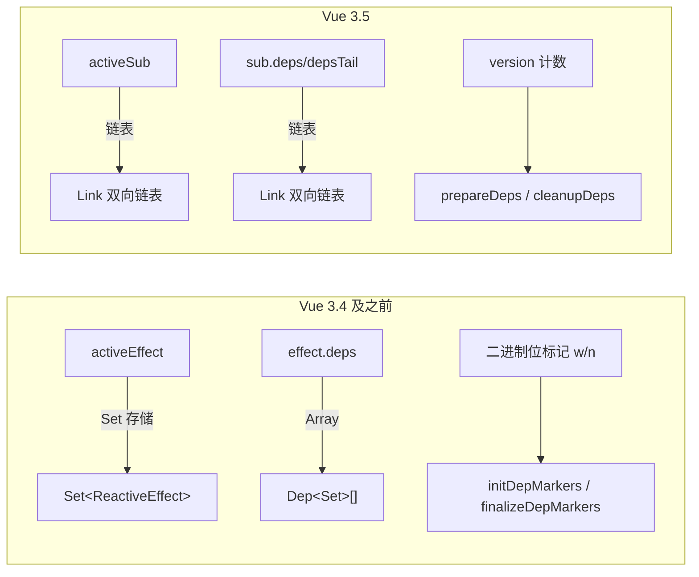
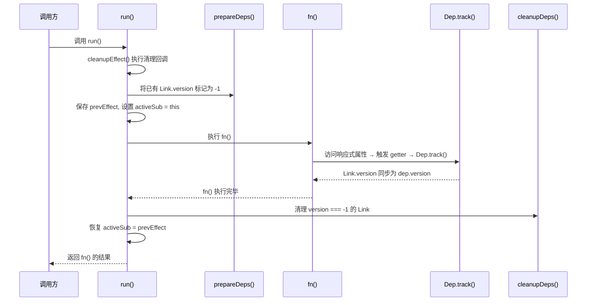
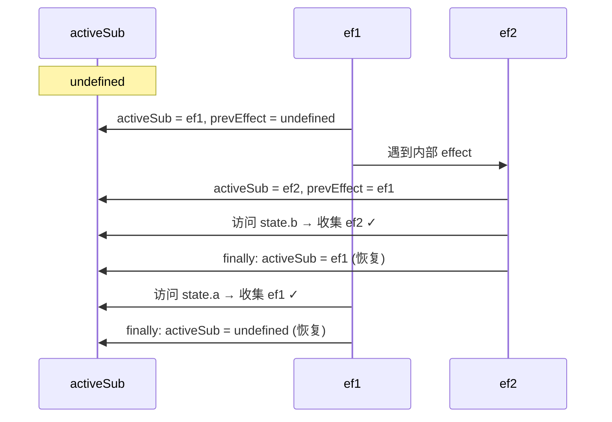
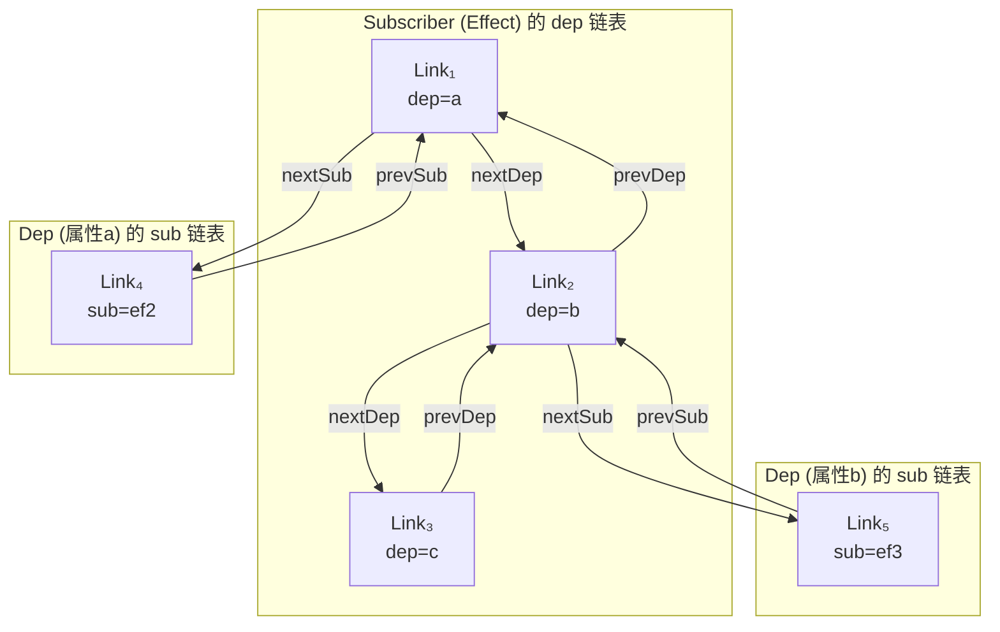
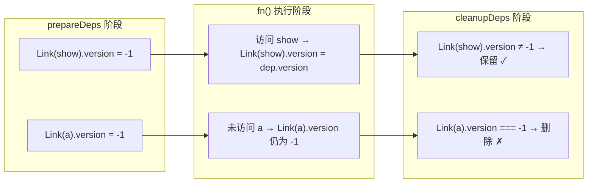
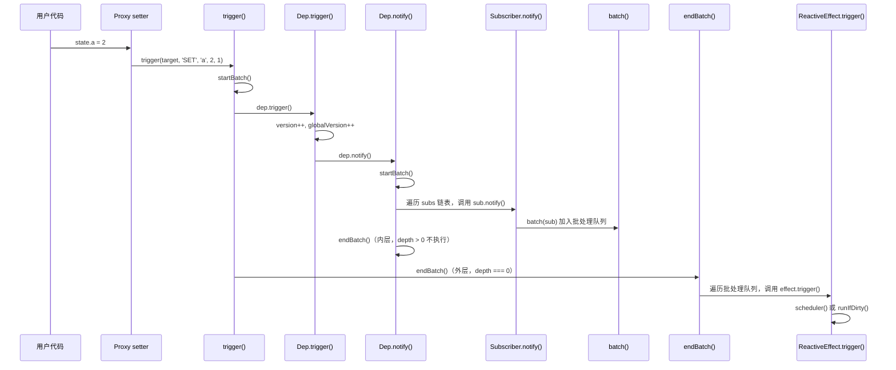
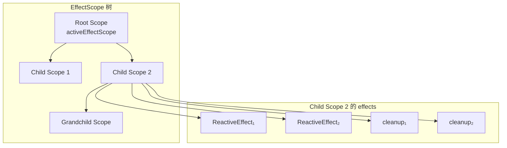
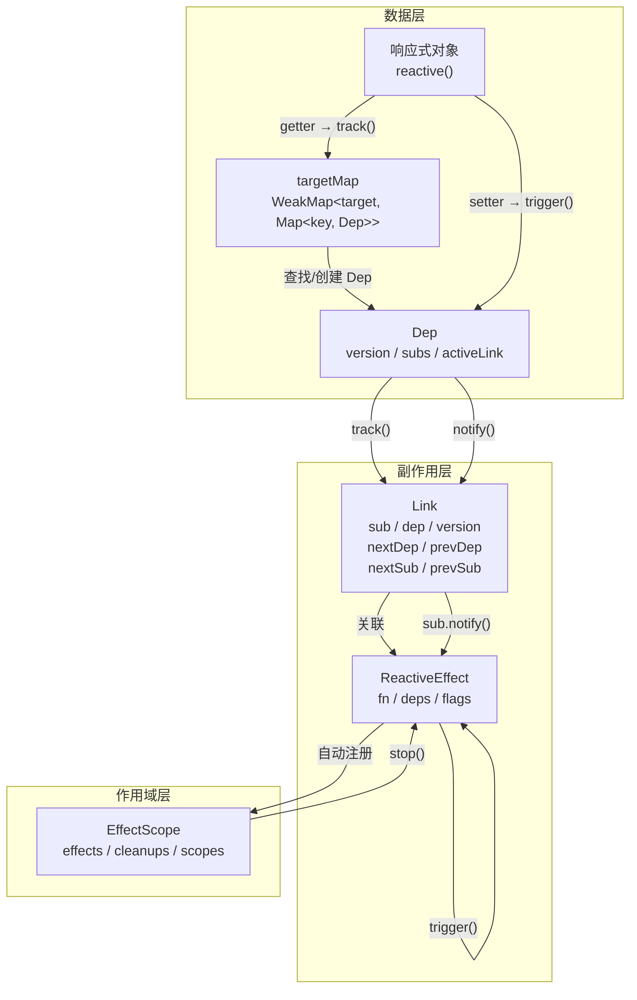

# 响应式-副作用函数与依赖收集

## 前言

上一小节我们说到 `reactive` 会在 `Proxy getter` 的时候收集依赖，在 `Proxy setter` 的时候触发依赖执行。那么这个"依赖"到底是什么？又是如何被收集和管理的？本章将深入 Vue 3.5 的响应式核心，深入剖析副作用函数（Effect）的实现机制。

> 注意：Vue 3.5 对响应式系统进行了重大重构（PR [#10397](https://github.com/vuejs/core/pull/10397)），核心变化包括：用**版本计数 + 双向链表**替代了原来的 `Set<ReactiveEffect>` + 二进制位标记方案，`activeEffect` 更名为 `activeSub`，`Dep` 从纯数据结构升级为拥有 `track/trigger` 方法的一等公民。本章内容完全基于 Vue 3.5.13 的最新源码。

## 从 effect() 函数出发

先来看 `effect()` 函数的定义（`packages/reactivity/src/effect.ts`）：

```ts
export function effect<T = any>(
  fn: () => T,
  options?: ReactiveEffectOptions,
): ReactiveEffectRunner<T> {
  // 如果 fn 已经是一个 effect runner，则指向其原始函数
  if ((fn as ReactiveEffectRunner).effect instanceof ReactiveEffect) {
    fn = (fn as ReactiveEffectRunner).effect.fn
  }

  // 构造 ReactiveEffect 实例
  const e = new ReactiveEffect(fn)

  // 合并 options
  if (options) {
    extend(e, options)
  }

  // 立即执行一次，完成首次依赖收集
  try {
    e.run()
  } catch (err) {
    e.stop()
    throw err
  }

  // 返回 runner 函数，runner 上挂载了 effect 实例的引用
  const runner = e.run.bind(e) as ReactiveEffectRunner
  runner.effect = e
  return runner
}
```

可以看到，`effect()` 函数内部的核心逻辑非常清晰：

1. 如果传入的 `fn` 已经绑定过 effect，则取其原始函数，避免重复包装。
2. 通过 `new ReactiveEffect(fn)` 创建副作用实例。
3. 合并 `options` 到实例上（如 `scheduler`、`onTrack`、`onTrigger` 等）。
4. **立即调用 `e.run()`**，这会执行 `fn`，并在执行过程中完成首次依赖收集。
5. 返回绑定好 `this` 的 `runner` 函数。

一个最基本的使用示例：

```ts
const state = reactive({ a: 1 })

effect(() => console.log(state.a))
// 立即打印: 1（因为 run() 被调用了）
```

`effect` 传入的 `fn` 在 `e.run()` 内被执行，执行时访问了 `state.a`，触发了 `Proxy getter`，从而完成了依赖收集。接下来我们深入 `ReactiveEffect` 类的内部实现。

## ReactiveEffect 类：副作用的核心抽象

### 类定义全貌

Vue 3.5 的 `ReactiveEffect` 类实现了 `Subscriber` 接口，完整定义如下：

```ts
// 当前活跃的订阅者（旧版叫 activeEffect）
export let activeSub: Subscriber | undefined

// 效果标记位枚举
export enum EffectFlags {
  ACTIVE = 1 << 0,     // 是否处于活跃状态
  RUNNING = 1 << 1,    // 是否正在运行
  TRACKING = 1 << 2,   // 是否需要追踪依赖
  NOTIFIED = 1 << 3,   // 是否已被通知（等待执行）
  DIRTY = 1 << 4,      // 是否脏（需要重新计算，computed 用）
  ALLOW_RECURSE = 1 << 5, // 是否允许递归
  PAUSED = 1 << 6,     // 是否暂停
}

// Subscriber 接口
export interface Subscriber extends DebuggerOptions {
  deps?: Link          // 依赖链表头
  depsTail?: Link      // 依赖链表尾
  flags: EffectFlags   // 标记位
  next?: Subscriber    // 下一个待执行的订阅者（批处理用）
  notify(): true | void // 通知方法
}

export class ReactiveEffect<T = any>
  implements Subscriber, ReactiveEffectOptions
{
  deps?: Link = undefined            // 双向链表头指针
  depsTail?: Link = undefined        // 双向链表尾指针
  flags: EffectFlags = EffectFlags.ACTIVE | EffectFlags.TRACKING
  next?: Subscriber = undefined      // 批处理链表
  cleanup?: () => void = undefined   // 清理函数

  scheduler?: EffectScheduler = undefined
  onStop?: () => void
  onTrack?: (event: DebuggerEvent) => void
  onTrigger?: (event: DebuggerEvent) => void

  constructor(public fn: () => T) {
    // 如果当前处于活跃的 effectScope 中，自动注册
    if (activeEffectScope && activeEffectScope.active) {
      activeEffectScope.effects.push(this)
    }
  }
  // ... 其他方法
}
```

### 关键属性解读

| 属性 | 类型 | 说明 |
|---|---|---|
| `fn` | `() => T` | 用户传入的副作用函数 |
| `deps` / `depsTail` | `Link` | 指向该 effect 订阅的所有 dep 的双向链表的首尾 |
| `flags` | `EffectFlags` | 位标记，控制 effect 的各种状态 |
| `scheduler` | `EffectScheduler` | 调度器，如果设置了则不直接 `run()` 而是走调度 |
| `cleanup` | `() => void` | 清理函数，在下次 `run()` 前执行 |
| `next` | `Subscriber` | 批处理链表中的下一个待执行订阅者 |

### 与 Vue 3.4 的核心差异



| 对比维度 | Vue 3.4 | Vue 3.5 |
|---|---|---|
| 全局活跃变量 | `activeEffect` | `activeSub` |
| Dep 存储结构 | `Set<ReactiveEffect>` | 双向链表 `Link` |
| Effect 的 deps | `Dep[]` 数组 | `Link` 双向链表 |
| 依赖清理策略 | 二进制位标记 `w`/`n` | 版本计数 `version` |
| 清理函数 | `initDepMarkers` / `finalizeDepMarkers` | `prepareDeps` / `cleanupDeps` |
| Dep 的能力 | 纯数据 | 拥有 `track()` / `trigger()` 方法 |
| 嵌套处理 | `effectTrackDepth` + `trackOpBit` | `prevEffect` 链式回溯 |

## run() 方法：依赖收集的执行引擎

`run()` 是 `ReactiveEffect` 最核心的方法，它负责执行副作用函数并完成依赖收集与清理：

```ts
run(): T {
  // 如果 effect 已停止，直接执行 fn 但不收集依赖
  if (!(this.flags & EffectFlags.ACTIVE)) {
    return this.fn()
  }

  this.flags |= EffectFlags.RUNNING
  // 1. 执行清理函数（如果有）
  cleanupEffect(this)
  // 2. 准备依赖：将所有已有 Link 的 version 标记为 -1
  prepareDeps(this)

  // 3. 保存上一次的 activeSub，实现嵌套切换
  const prevEffect = activeSub
  const prevShouldTrack = shouldTrack
  activeSub = this
  shouldTrack = true

  try {
    // 4. 执行副作用函数，触发 getter → track → 依赖收集
    return this.fn()
  } finally {
    // 5. 清理无效依赖：version 仍为 -1 的 Link 就是无效的
    cleanupDeps(this)
    // 6. 恢复上下文
    activeSub = prevEffect
    shouldTrack = prevShouldTrack
    this.flags &= ~EffectFlags.RUNNING
  }
}
```

整个 `run()` 的执行流程可以用下图来表示：



接下来我们逐个剖析其中的关键环节。

## 嵌套 Effect 与 activeSub 切换

### 问题场景

考虑如下嵌套 `effect` 的代码：

```ts
const state = reactive({ a: 1, b: 2 })

// ef1
effect(() => {
  // ef2
  effect(() => console.log(`b: ${state.b}`))
  console.log(`a: ${state.a}`)
})

state.a++
```

如果 `run()` 只是简单地设置 `activeSub = this` 而不保存前一个 `activeSub`，流程将变成：

1. 执行 `ef1`，`activeSub = ef1`
2. 遇到内部 `effect`，执行 `ef2`，`activeSub = ef2`
3. `ef2` 的 `fn` 执行，访问 `state.b`，收集到 `ef2` -- 正确
4. 回到 `ef1` 的 `fn` 体，访问 `state.a`，但 `activeSub` 仍然是 `ef2` -- **错误！**

结果 `state.a` 的依赖被错误地收集为 `ef2`，当 `state.a++` 时触发的是 `ef2` 而非 `ef1`。

### 解决方案：prevEffect 链式回溯

Vue 3.5 通过 `prevEffect` 保存上一次的 `activeSub`，在 `finally` 块中恢复：

```ts
const prevEffect = activeSub   // 保存
activeSub = this                // 设置
try {
  return this.fn()
} finally {
  activeSub = prevEffect        // 恢复
}
```

正确的执行流程：



1. 执行 `ef1`，`activeSub = ef1`，`prevEffect = undefined`
2. 遇到 `ef2`，`activeSub = ef2`，`prevEffect = ef1`
3. `ef2` 的 `fn` 执行，访问 `state.b`，收集 `ef2` -- 正确
4. `ef2` 的 `finally`：`activeSub = prevEffect = ef1`
5. 回到 `ef1` 的 `fn`，访问 `state.a`，收集 `ef1` -- 正确
6. `ef1` 的 `finally`：`activeSub = prevEffect = undefined`

这种**栈式保存-恢复**机制确保了嵌套 `effect` 中 `activeSub` 始终指向当前正在执行的 effect。

## Dep 和 Link：双向链表依赖管理

Vue 3.5 用 `Dep` 和 `Link` 两个类替代了原来的 `Set<ReactiveEffect>` 方案，这是 3.5 响应式重构的核心变化。

### Dep 类

`Dep` 代表一个响应式属性的所有订阅者集合：

```ts
export class Dep {
  version = 0                    // 版本号，每次 trigger 自增
  activeLink?: Link = undefined  // 指向当前活跃 effect 的 Link
  subs?: Link = undefined        // 订阅者链表尾指针
  subsHead?: Link                // 订阅者链表头指针（DEV only）
  map?: KeyToDepMap = undefined  // 所属的 depsMap（用于属性级清理）
  key?: unknown = undefined      // 属性 key（用于属性级清理）
  sc: number = 0                 // 订阅者计数

  constructor(public computed?: ComputedRefImpl | undefined) {}
}
```

### Link 类

`Link` 是 `Dep` 和 `Subscriber` 之间的桥梁，每个 Link 同时属于两条双向链表：

```ts
export class Link {
  version: number               // 版本号，用于依赖清理
  nextDep?: Link                // 同一 subscriber 的下一个 dep
  prevDep?: Link                // 同一 subscriber 的上一个 dep
  nextSub?: Link                // 同一 dep 的下一个 subscriber
  prevSub?: Link                // 同一 dep 的上一个 subscriber
  prevActiveLink?: Link         // 保存前一个 activeLink（用于恢复）

  constructor(
    public sub: Subscriber,     // 订阅者（effect 或 computed）
    public dep: Dep,            // 依赖项（响应式属性）
  ) {
    this.version = dep.version  // 初始化版本号
  }
}
```

### 双向链表结构示意

每个 `Link` 同时维护两个维度的双向链表关系：



用表格更清晰地展示：

| 维度 | 遍历方向 | 指针 | 含义 |
|---|---|---|---|
| Effect → Deps | 从 deps 到 depsTail | `nextDep` / `prevDep` | 某个 effect 订阅了哪些 dep |
| Dep → Subs | 从 subs 到 subsHead | `nextSub` / `prevSub` | 某个 dep 被哪些 effect 订阅 |

### 为什么用双向链表替代 Set？

| 维度 | Set 方案（3.4） | 双向链表方案（3.5） |
|---|---|---|
| 内存开销 | 每个 dep 一个 Set 对象 | Link 节点，无额外容器 |
| 删除操作 | `Set.delete()` O(1) 但需哈希 | 指针操作 O(1)，无哈希开销 |
| 遍历顺序 | 无保证 | 按订阅顺序，可预测 |
| 批量清理 | 需遍历整个 Set | 断开链表头尾即可 |
| 与 computed 联动 | 需额外逻辑 | Link 节点天然桥接 |

## 依赖收集：track 的完整链路

### 从 Proxy getter 到 Dep.track()

当访问响应式对象的属性时，`Proxy getter` 会调用 `track()`：

```ts
// baseHandlers.ts 中的 getter
get(target, key, receiver) {
  // ...
  if (!isReadonly) {
    track(target, TrackOpTypes.GET, key)
  }
  // ...
}
```

`track()` 函数负责找到或创建对应的 `Dep`，然后调用 `dep.track()`：

```ts
// dep.ts
export function track(target: object, type: TrackOpTypes, key: unknown): void {
  if (shouldTrack && activeSub) {
    let depsMap = targetMap.get(target)
    if (!depsMap) {
      targetMap.set(target, (depsMap = new Map()))
    }
    let dep = depsMap.get(key)
    if (!dep) {
      depsMap.set(key, (dep = new Dep()))
      dep.map = depsMap
      dep.key = key
    }
    // 开发环境下传入调试信息
    dep.track({ target, type, key })
  }
}
```

这里用到了全局的 `targetMap`，其结构为：

```
targetMap: WeakMap<object, Map<key, Dep>>
  └── target → depsMap: Map<key, Dep>
       └── key → Dep { version, subs, activeLink, ... }
```

### Dep.track()：建立 Link 的核心逻辑

```ts
track(debugInfo?): Link | undefined {
  // 没有 activeSub 或不需要追踪，直接返回
  if (!activeSub || !shouldTrack || activeSub === this.computed) {
    return
  }

  let link = this.activeLink
  if (link === undefined || link.sub !== activeSub) {
    // 情况一：全新的订阅关系，创建新 Link
    link = this.activeLink = new Link(activeSub, this)

    if (!activeSub.deps) {
      // effect 的 deps 链表为空，Link 作为唯一节点
      activeSub.deps = activeSub.depsTail = link
    } else {
      // 追加到 effect 的 deps 链表尾部
      link.prevDep = activeSub.depsTail
      activeSub.depsTail!.nextDep = link
      activeSub.depsTail = link
    }

    // 将 Link 加入 dep 的 subs 链表
    addSub(link)

  } else if (link.version === -1) {
    // 情况二：复用上次 run 的 Link（version 被标记为 -1 后又被访问到）
    link.version = this.version

    // 如果该 Link 不在 deps 链表尾部，将其移动到尾部
    // 这保证了 effect 的 deps 链表顺序与属性访问顺序一致
    if (link.nextDep) {
      const next = link.nextDep
      next.prevDep = link.prevDep
      if (link.prevDep) link.prevDep.nextDep = next

      link.prevDep = activeSub.depsTail
      link.nextDep = undefined
      activeSub.depsTail!.nextDep = link
      activeSub.depsTail = link

      if (activeSub.deps === link) {
        activeSub.deps = next
      }
    }
  }

  return link
}
```

`track()` 的两种情况：

1. **新建 Link**：当 `activeLink` 不存在或 `sub` 不匹配时，创建新的 `Link` 节点，同时将其插入到 effect 的 deps 链表和 dep 的 subs 链表。
2. **复用 Link**：当 `activeLink` 存在且 `sub` 匹配，但 `version === -1`（说明在上次 `prepareDeps` 中被标记为待清理，但本次 `fn()` 又访问了该属性），此时将 `version` 同步回 `dep.version`，表示该依赖仍然有效，并可选地将其移到链表尾部以保持访问顺序。

### addSub()：将 Link 加入 dep 的订阅链表

```ts
function addSub(link: Link) {
  link.dep.sc++  // 订阅者计数 +1

  if (link.sub.flags & EffectFlags.TRACKING) {
    const computed = link.dep.computed
    // computed 首次获得订阅者时，启用追踪并订阅 computed 自身的所有 deps
    if (computed && !link.dep.subs) {
      computed.flags |= EffectFlags.TRACKING | EffectFlags.DIRTY
      for (let l = computed.deps; l; l = l.nextDep) {
        addSub(l)
      }
    }

    const currentTail = link.dep.subs
    if (currentTail !== link) {
      link.prevSub = currentTail
      if (currentTail) currentTail.nextSub = link
    }

    if (__DEV__ && link.dep.subsHead === undefined) {
      link.dep.subsHead = link
    }

    link.dep.subs = link  // 更新尾指针
  }
}
```

注意 `addSub` 中对 **computed 首次订阅者** 的特殊处理：当一个 computed 属性从"无订阅者"变为"有订阅者"时，需要递归地将 computed 自身依赖的所有 dep 也关联起来。这就是 Vue 3.5 的 **Lazy Effect** 机制 -- computed 在没有订阅者时不进行依赖追踪，只有被其他 effect 订阅时才"激活"。

## 依赖清理：版本计数机制

### 问题场景

与旧版相同的问题：条件性的依赖访问可能导致"过期依赖"。

```ts
const state = reactive({ a: 1, show: true })

effect(() => {
  if (state.show) {
    console.log(`a: ${state.a}`)
  }
})

// 此时 effect 同时依赖 show 和 a

setTimeout(() => {
  state.show = false
  // effect 重新执行，fn 内不再访问 state.a
  // 如果不清理，后续 state.a 变化仍会触发 effect
}, 1000)
```

当 `state.show` 变为 `false` 后，`fn` 内不再访问 `state.a`，但 `state.a` 的 dep 中仍然持有该 effect 的引用。如果不清理，后续修改 `state.a` 仍会触发无意义的 effect 重新执行。

### prepareDeps：标记阶段

在 `run()` 执行 `fn` 之前，`prepareDeps()` 将当前 effect 的所有已有 Link 的 `version` 标记为 `-1`：

```ts
function prepareDeps(sub: Subscriber) {
  for (let link = sub.deps; link; link = link.nextDep) {
    // 标记为 -1，表示"待验证"
    link.version = -1
    // 保存之前的 activeLink，用于后续恢复
    link.prevActiveLink = link.dep.activeLink
    link.dep.activeLink = link
  }
}
```

标记为 `-1` 的含义是：**这个 Link 对应的依赖在上次 run 中被使用过，但本次 run 还未确认是否仍然需要。**

### track 时的版本同步

在 `fn()` 执行过程中，当访问响应式属性触发 `track()` 时，如果发现 `activeLink` 已存在且 `version === -1`，则将 `version` 同步回 `dep.version`：

```ts
// dep.track() 中
else if (link.version === -1) {
  link.version = this.version  // 从 -1 恢复为当前版本号
  // ... 可选地移动到链表尾部
}
```

这意味着：**被再次访问的依赖，其 Link 的 version 会从 -1 变为 dep.version，证明它仍然有效。**

### cleanupDeps：清理阶段

`fn()` 执行完毕后，`cleanupDeps()` 清理所有 `version` 仍为 `-1` 的 Link：

```ts
function cleanupDeps(sub: Subscriber) {
  let head
  let tail = sub.depsTail
  let link = tail

  while (link) {
    const prev = link.prevDep
    if (link.version === -1) {
      // version 仍为 -1 → 该依赖未被使用，需要清理
      if (link === tail) tail = prev

      // 从 dep 的 subs 链表中移除该 Link
      removeSub(link)
      // 从 effect 的 deps 链表中移除该 Link
      removeDep(link)
    } else {
      // version 不为 -1 → 该依赖仍在使用，保留
      // 最后一个保留的节点成为新的 head
      head = link
    }

    // 恢复 dep 的 activeLink
    link.dep.activeLink = link.prevActiveLink
    link.prevActiveLink = undefined
    link = prev
  }

  // 更新 effect 的 deps 链表首尾指针
  sub.deps = head
  sub.depsTail = tail
}
```

### 完整的依赖清理流程演示

以上面的条件依赖示例为例：

```ts
const state = reactive({ a: 1, show: true })

effect(() => {
  if (state.show) {
    console.log(`a: ${state.a}`)
  }
})
```

**第一次 run**（`show = true`）：

| 步骤 | 操作 | effect.deps 链表 | dep.show.subs | dep.a.subs |
|---|---|---|---|---|
| prepareDeps | deps 为空，跳过 | 空 | - | - |
| fn() 执行 | 访问 show → track | Link(show) | [effect] | - |
| fn() 执行 | 访问 a → track | Link(show) → Link(a) | [effect] | [effect] |
| cleanupDeps | 所有 version 有效 | Link(show) → Link(a) | [effect] | [effect] |

**`state.show = false` 触发第二次 run**：

| 步骤 | 操作 | Link(show).version | Link(a).version |
|---|---|---|---|
| prepareDeps | 标记所有为 -1 | -1 | -1 |
| fn() 执行 | 访问 show → track | 1 (恢复) | -1 (未访问) |
| fn() 执行 | if(show)为false，跳过 a | 1 | -1 |
| cleanupDeps | Link(a).version === -1 | 保留 | 删除 |

最终，`state.a` 的 dep 中不再持有该 effect，后续 `state.a++` 不会触发无效的 effect 执行。



### 与 Vue 3.4 二进制位标记方案的对比

Vue 3.4 使用 `dep.w`（wasTracked）和 `dep.n`（newTracked）两个属性配合 `trackOpBit` 位运算来标记依赖状态。Vue 3.5 的版本计数方案更简洁：

| 维度 | Vue 3.4 (二进制位) | Vue 3.5 (版本计数) |
|---|---|---|
| 标记位置 | 在 `dep` 对象上 | 在 `Link` 节点上 |
| 标记方式 | `dep.w |= trackOpBit` | `link.version = -1` |
| 判断条件 | `wasTracked(dep) && !newTracked(dep)` | `link.version === -1` |
| 嵌套层级限制 | `maxMarkerBits = 30` | 无限制 |
| 复杂度 | 需要理解位运算 | 直观易懂 |

## 依赖触发：trigger 的完整链路

### 从 Proxy setter 到 Dep.trigger()

当修改响应式对象的属性时，`Proxy setter` 会调用 `trigger()`：

```ts
// baseHandlers.ts 中的 setter
set(target, key, value, receiver) {
  // ...
  if (!hadKey) {
    trigger(target, TriggerOpTypes.ADD, key, value)
  } else if (hasChanged(value, oldValue)) {
    trigger(target, TriggerOpTypes.SET, key, value, oldValue)
  }
  // ...
}
```

### trigger() 函数

```ts
export function trigger(
  target: object,
  type: TriggerOpTypes,
  key?: unknown,
  newValue?: unknown,
  oldValue?: unknown,
  oldTarget?: Map<unknown, unknown> | Set<unknown>,
): void {
  const depsMap = targetMap.get(target)
  if (!depsMap) {
    globalVersion++  // 即使没有 deps，也递增全局版本号
    return
  }

  const run = (dep: Dep | undefined) => {
    if (dep) dep.trigger()
  }

  startBatch()  // 开启批处理

  if (type === TriggerOpTypes.CLEAR) {
    depsMap.forEach(run)
  } else {
    const targetIsArray = isArray(target)
    const isArrayIndex = targetIsArray && isIntegerKey(key)

    if (targetIsArray && key === 'length') {
      const newLength = Number(newValue)
      depsMap.forEach((dep, key) => {
        if (key === 'length' || key === ARRAY_ITERATE_KEY ||
            (!isSymbol(key) && key >= newLength)) {
          run(dep)
        }
      })
    } else {
      // SET | ADD | DELETE：触发指定 key 的 dep
      if (key !== void 0 || depsMap.has(void 0)) {
        run(depsMap.get(key))
      }

      // 数组索引变化还需要触发 ARRAY_ITERATE_KEY
      if (isArrayIndex) {
        run(depsMap.get(ARRAY_ITERATE_KEY))
      }

      // ADD / DELETE 需要触发 ITERATE_KEY
      switch (type) {
        case TriggerOpTypes.ADD:
          if (!targetIsArray) {
            run(depsMap.get(ITERATE_KEY))
            if (isMap(target)) run(depsMap.get(MAP_KEY_ITERATE_KEY))
          } else if (isArrayIndex) {
            run(depsMap.get('length'))
          }
          break
        case TriggerOpTypes.DELETE:
          if (!targetIsArray) {
            run(depsMap.get(ITERATE_KEY))
            if (isMap(target)) run(depsMap.get(MAP_KEY_ITERATE_KEY))
          }
          break
        case TriggerOpTypes.SET:
          if (isMap(target)) run(depsMap.get(ITERATE_KEY))
          break
      }
    }
  }

  endBatch()  // 结束批处理，执行所有待处理的 effect
}
```

### Dep.trigger() 和 Dep.notify()

```ts
trigger(debugInfo?): void {
  this.version++       // 递增 dep 版本号
  globalVersion++      // 递增全局版本号（computed 快速路径用）
  this.notify(debugInfo)
}

notify(debugInfo?): void {
  startBatch()
  try {
    // 遍历 subs 链表，通知所有订阅者
    for (let link = this.subs; link; link = link.prevSub) {
      if (link.sub.notify() === true) {
        // computed 的 notify 返回 true，需要继续通知 computed 的 dep
        ;(link.sub as ComputedRefImpl).dep.notify()
      }
    }
  } finally {
    endBatch()
  }
}
```

### 批处理机制：startBatch / endBatch

Vue 3.5 引入了更完善的批处理机制，避免同一轮修改中多次触发同一个 effect：

```ts
let batchDepth = 0
let batchedSub: Subscriber | undefined
let batchedComputed: Subscriber | undefined

export function startBatch(): void {
  batchDepth++
}

export function endBatch(): void {
  if (--batchDepth > 0) return

  // 先处理 computed（computed 优先级高于普通 effect）
  if (batchedComputed) {
    let e = batchedComputed
    batchedComputed = undefined
    while (e) {
      const next = e.next
      e.next = undefined
      e.flags &= ~EffectFlags.NOTIFIED
      e = next
    }
  }

  // 再处理普通 effect
  let error: unknown
  while (batchedSub) {
    let e = batchedSub
    batchedSub = undefined
    while (e) {
      const next = e.next
      e.next = undefined
      e.flags &= ~EffectFlags.NOTIFIED
      if (e.flags & EffectFlags.ACTIVE) {
        try {
          ;(e as ReactiveEffect).trigger()
        } catch (err) {
          if (!error) error = err
        }
      }
      e = next
    }
  }

  if (error) throw error
}
```

### ReactiveEffect.notify() 和 trigger()

```ts
notify(): void {
  // 如果正在运行且不允许递归，跳过
  if (this.flags & EffectFlags.RUNNING &&
      !(this.flags & EffectFlags.ALLOW_RECURSE)) {
    return
  }
  // 如果还没被通知过，加入批处理队列
  if (!(this.flags & EffectFlags.NOTIFIED)) {
    batch(this)
  }
}

trigger(): void {
  if (this.flags & EffectFlags.PAUSED) {
    pausedQueueEffects.add(this)
  } else if (this.scheduler) {
    // 有调度器（如 watch），交给调度器处理
    this.scheduler()
  } else {
    // 没有调度器，检查是否脏，脏则重新 run
    this.runIfDirty()
  }
}
```

### 触发链路总览



## cleanupEffect：副作用清理回调

### onEffectCleanup API

Vue 3.5 提供了 `onEffectCleanup()` API，用于注册在 effect 下次重新执行前需要运行的清理函数：

```ts
export function onEffectCleanup(fn: () => void, failSilently = false): void {
  if (activeSub instanceof ReactiveEffect) {
    activeSub.cleanup = fn
  } else if (__DEV__ && !failSilently) {
    warn(
      `onEffectCleanup() was called when there was no active effect` +
        ` to associate with.`,
    )
  }
}
```

### cleanupEffect 函数

在 `run()` 开始时，会先执行上一次注册的清理函数：

```ts
function cleanupEffect(e: ReactiveEffect) {
  const { cleanup } = e
  e.cleanup = undefined
  if (cleanup) {
    const prevSub = activeSub
    activeSub = undefined  // 清理期间暂停依赖收集
    try {
      cleanup()
    } finally {
      activeSub = prevSub  // 恢复依赖收集
    }
  }
}
```

注意关键细节：清理函数执行期间 `activeSub` 被临时置为 `undefined`，这意味着清理函数内部的响应式属性访问**不会触发依赖收集**。

### onWatcherCleanup API

除了 `onEffectCleanup`，Vue 3.5 还新增了专门用于 `watch` 的 `onWatcherCleanup`：

```ts
const cleanupMap: WeakMap<ReactiveEffect, (() => void)[]> = new WeakMap()
let activeWatcher: ReactiveEffect | undefined = undefined

export function onWatcherCleanup(
  cleanupFn: () => void,
  failSilently = false,
  owner: ReactiveEffect | undefined = activeWatcher,
): void {
  if (owner) {
    let cleanups = cleanupMap.get(owner)
    if (!cleanups) cleanupMap.set(owner, (cleanups = []))
    cleanups.push(cleanupFn)
  } else if (__DEV__ && !failSilently) {
    warn(
      `onWatcherCleanup() was called when there was no active watcher` +
        ` to associate with.`,
    )
  }
}
```

与 `onEffectCleanup` 不同，`onWatcherCleanup` 支持注册**多个**清理回调（通过数组存储），并且可以通过第三个参数 `owner` 指定关联的 effect。

使用示例：

```ts
watch(id, (newId, oldId, onCleanup) => {
  const controller = new AbortController()

  fetch(`/api/${newId}`, { signal: controller.signal })
    .then(res => res.json())
    .then(data => {
      // 处理数据
    })

  // 注册清理回调：下次 watch 触发前取消上一次请求
  onCleanup(() => controller.abort())
})
```

## ReactiveEffect 的其他能力

### stop()：停止副作用

```ts
stop(): void {
  if (this.flags & EffectFlags.ACTIVE) {
    // 从所有 dep 的 subs 链表中移除自己
    for (let link = this.deps; link; link = link.nextDep) {
      removeSub(link)
    }
    this.deps = this.depsTail = undefined
    // 执行清理回调
    cleanupEffect(this)
    // 执行 onStop 回调
    this.onStop && this.onStop()
    // 移除 ACTIVE 标记
    this.flags &= ~EffectFlags.ACTIVE
  }
}
```

### pause() / resume()：暂停和恢复

Vue 3.5 新增了 effect 的暂停/恢复能力：

```ts
pause(): void {
  this.flags |= EffectFlags.PAUSED
}

resume(): void {
  if (this.flags & EffectFlags.PAUSED) {
    this.flags &= ~EffectFlags.PAUSED
    if (pausedQueueEffects.has(this)) {
      pausedQueueEffects.delete(this)
      this.trigger()  // 恢复时触发一次
    }
  }
}
```

暂停的 effect 在收到通知时不会立即执行，而是被加入 `pausedQueueEffects` 集合，等 `resume()` 时再统一触发。

### isDirty()：脏检查

```ts
function isDirty(sub: Subscriber): boolean {
  for (let link = sub.deps; link; link = link.nextDep) {
    if (
      link.dep.version !== link.version ||
      (link.dep.computed &&
        (refreshComputed(link.dep.computed) ||
          link.dep.version !== link.version))
    ) {
      return true
    }
  }
  if (sub._dirty) return true
  return false
}
```

脏检查的核心逻辑：遍历 effect 的所有 deps，如果任何一个 `dep.version !== link.version`（说明 dep 自上次 run 后被修改过），或者关联的 computed 需要刷新，则认为该 effect 是"脏"的，需要重新执行。

## EffectScope：作用域管理

### 为什么需要 EffectScope？

在组件卸载或组合式函数清理时，需要统一销毁其内部创建的所有 effect、computed 和 watch。如果手动逐个调用 `stop()`，既繁琐又容易遗漏。`EffectScope` 就是用来解决这个问题。

### EffectScope 类

```ts
export class EffectScope {
  private _active = true
  effects: ReactiveEffect[] = []
  cleanups: (() => void)[] = []
  private _isPaused = false
  parent: EffectScope | undefined
  scopes: EffectScope[] | undefined
  private index: number | undefined

  constructor(public detached = false) {
    this.parent = activeEffectScope
    // 非独立作用域自动注册到父作用域
    if (!detached && activeEffectScope) {
      this.index =
        (activeEffectScope.scopes || (activeEffectScope.scopes = [])).push(this) - 1
    }
  }

  run<T>(fn: () => T): T | undefined {
    if (this._active) {
      const currentEffectScope = activeEffectScope
      try {
        activeEffectScope = this
        return fn()
      } finally {
        activeEffectScope = currentEffectScope
      }
    }
  }

  stop(fromParent?: boolean): void {
    if (this._active) {
      this._active = false
      // 停止所有 effect
      for (let i = 0; i < this.effects.length; i++) {
        this.effects[i].stop()
      }
      this.effects.length = 0
      // 执行所有清理函数
      for (let i = 0; i < this.cleanups.length; i++) {
        this.cleanups[i]()
      }
      this.cleanups.length = 0
      // 递归停止子作用域
      if (this.scopes) {
        for (let i = 0; i < this.scopes.length; i++) {
          this.scopes[i].stop(true)
        }
        this.scopes.length = 0
      }
      // 从父作用域中移除自己
      if (!this.detached && this.parent && !fromParent) {
        const last = this.parent.scopes!.pop()
        if (last && last !== this) {
          this.parent.scopes![this.index!] = last
          last.index = this.index!
        }
      }
      this.parent = undefined
    }
  }

  pause(): void { /* 暂停所有子 effect */ }
  resume(): void { /* 恢复所有子 effect */ }
}
```

### EffectScope 的工作流程



当调用 `childScope2.stop()` 时：

1. 停止 `effects` 数组中的所有 `ReactiveEffect`
2. 执行 `cleanups` 数组中的所有清理函数
3. 递归停止所有子 `scopes`
4. 从父 scope 的 `scopes` 数组中移除自己（O(1) 交换删除）

### 自动注册机制

在 `ReactiveEffect` 的构造函数中，会自动将自身注册到当前的 `activeEffectScope`：

```ts
constructor(public fn: () => T) {
  if (activeEffectScope && activeEffectScope.active) {
    activeEffectScope.effects.push(this)
  }
}
```

这意味着在 `effectScope.run(fn)` 内创建的所有 `ReactiveEffect`（包括 `watch`、`computed` 底层创建的 effect）都会被自动收集到该 scope 中。

### 使用示例

```ts
const scope = effectScope()

scope.run(() => {
  // 这些 effect 会自动注册到 scope
  effect(() => console.log('effect 1'))
  effect(() => console.log('effect 2'))

  const sum = computed(() => /* ... */)

  watch(source, () => { /* ... */ })

  onScopeDispose(() => {
    console.log('scope 被销毁了')
  })
})

// 一键清理
scope.stop()
// 所有 effect、computed、watch 都会被停止
// onScopeDispose 注册的回调也会被执行
```

## 跟踪控制：pauseTracking / enableTracking / resetTracking

Vue 提供了三个工具函数来控制依赖收集的开关：

```ts
export let shouldTrack = true
const trackStack: boolean[] = []

export function pauseTracking(): void {
  trackStack.push(shouldTrack)
  shouldTrack = false
}

export function enableTracking(): void {
  trackStack.push(shouldTrack)
  shouldTrack = true
}

export function resetTracking(): void {
  const last = trackStack.pop()
  shouldTrack = last === undefined ? true : last
}
```

这些函数使用栈来保存/恢复 `shouldTrack` 状态，支持嵌套调用。它们在内部被广泛使用，例如：

- `ref` 的 `value` setter 中会临时暂停追踪
- 数组方法 `includes`/`indexOf`/`lastIndexOf` 的内部查找过程中会暂停追踪
- `cleanupEffect` 中清理函数执行期间不应收集依赖（通过 `activeSub = undefined` 实现）

## 全景回顾

将本章涉及的所有概念串联起来，Vue 3.5 的响应式副作用系统可以用以下流程图概括：



### Vue 2 vs Vue 3.5 响应式对比

| 维度 | Vue 2 | Vue 3.5 |
|---|---|---|
| 数据劫持 | `Object.defineProperty` | `Proxy` |
| 依赖载体 | `Watcher` 实例 | `ReactiveEffect` / `Subscriber` |
| 依赖存储 | `Dep.subs` (数组) + `Watcher.deps` (数组) | `Dep.subs` (链表) + `Subscriber.deps` (链表) |
| 关联结构 | Dep 和 Watcher 直接引用 | Dep 和 Subscriber 通过 `Link` 双向链表连接 |
| 依赖清理 | 无（不清理过期依赖） | 版本计数 + `prepareDeps` / `cleanupDeps` |
| 嵌套处理 | 无专门处理 | `prevEffect` 栈式保存恢复 |
| 作用域 | 无（组件级 Watcher） | `EffectScope` 树形管理 |
| 批处理 | 队列 + nextTick | `startBatch` / `endBatch` + 链表 |
| computed | 独立 Watcher | `ComputedRefImpl` 实现 `Subscriber` 接口，Lazy Effect |

### 核心流程总结

1. **创建阶段**：`effect()` → `new ReactiveEffect(fn)` → 自动注册到 `activeEffectScope` → `e.run()`
2. **收集阶段**：`run()` → `prepareDeps()` → `fn()` 执行 → 访问响应式属性 → `track()` → `dep.track()` → 创建/复用 `Link` → `addSub()`
3. **清理阶段**：`fn()` 完成 → `cleanupDeps()` → 移除 `version === -1` 的无效 Link
4. **触发阶段**：修改响应式属性 → `trigger()` → `dep.trigger()` → `dep.notify()` → `sub.notify()` → `batch()` → `endBatch()` → `effect.trigger()` → `run()` / `scheduler()`
5. **销毁阶段**：`effect.stop()` → 从所有 dep 的 subs 链表移除 → `cleanupEffect()` → 或 `scope.stop()` → 批量停止所有 effect

Vue 3.5 的响应式系统通过**版本计数 + 双向链表**的设计，在保持功能完整性的同时，大幅降低了内存开销和操作复杂度，消除了旧版二进制位标记方案对嵌套层级的限制，并引入了 Lazy Effect、批处理优化、暂停/恢复等重要特性，使得整个响应式系统更加健壮和高效。
