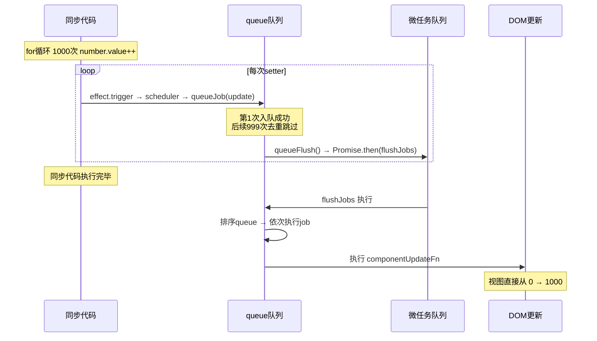
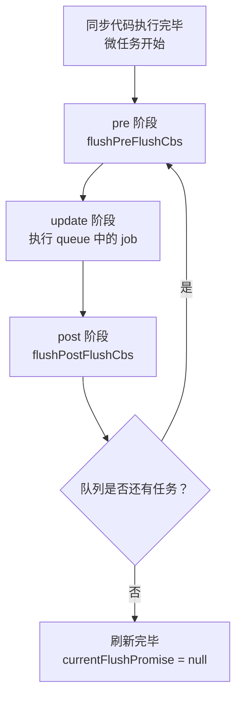
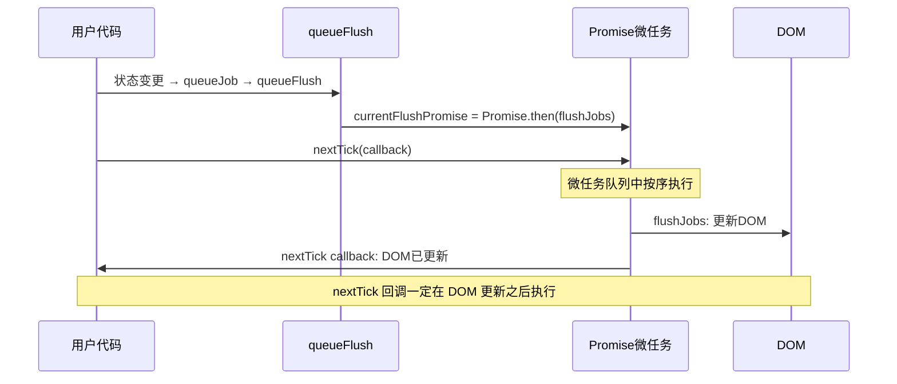
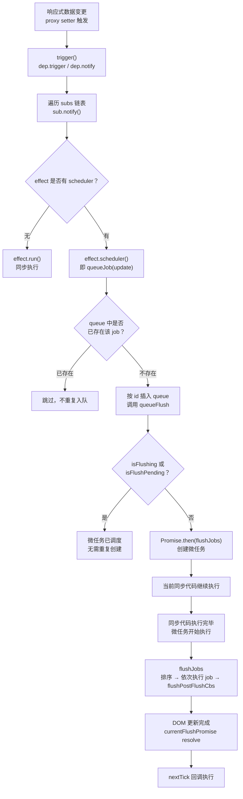

# 响应式-nextTick实现原理

## 前言

通过前面几个章节的学习，我们大致了解了 Vue 3 中的响应式原理：通过对 `state` 数据的响应式拦截，当触发 `proxy setter` 的时候，执行对应状态的 `effect` 函数。接下来看一个经典的例子：

```html
<template>
  <div>{{ number }}</div>
  <button @click="handleClick">click</button>
</template>
<script setup>
import { ref } from 'vue'

const number = ref(0)
function handleClick() {
  for (let i = 0; i < 1000; i++) {
    number.value++
  }
}
</script>
```

当我们按下 `click` 按钮的时候，`number` 会被循环增加 1000 次。那么 Vue 的视图会在点击按钮时，从 1 -> 1000 刷新 1000 次吗？这一小节，我们将深入分析其中的机制。

## 从 setter 到调度：scheduler 的诞生

我们小册第四节介绍"组件更新策略"时，提到了 `setupRenderEffect` 函数。当时为了方便介绍组件的更新策略，简写了 `instance.update` 的创建过程。在 Vue 3.5.x 中，我们来详细看看它的完整实现：

```ts
const setupRenderEffect = (
  instance,
  initialVNode,
  container,
  anchor,
  parentSuspense,
  isSVG,
  optimized,
) => {
  function componentUpdateFn() {
    if (!instance.isMounted) {
      // 挂载组件
    } else {
      // 更新组件
    }
  }

  // 创建响应式副作用
  const effect = (instance.effect = new ReactiveEffect(
    componentUpdateFn,
    () => queueJob(update),
    instance.scope, // 组件作用域
  ))

  // 生成 instance.update 函数
  const update: SchedulerJob = (instance.update = () => effect.run())
  update.id = instance.uid

  // 允许递归更新
  toggleRecurse(instance, true)

  // 首次执行
  update()
}
```

可以看到，Vue 3.5.x 中直接使用 `new ReactiveEffect()` 创建副作用实例，而不再是早期版本中的 `effect()` 工厂函数。`ReactiveEffect` 构造函数接收三个参数：

| 参数 | 说明 |
|------|------|
| `fn` | 副作用函数，即 `componentUpdateFn` |
| `scheduler` | 调度函数，即 `() => queueJob(update)` |
| `scope` | 效果作用域，即 `instance.scope` |

其中 `scheduler` 是关键——它的存在改变了 `effect` 被触发时的执行路径。当我们触发 `proxy setter` 时，最终会调用 effect 的 `trigger()` 方法（Vue 3.5 中由 `Dep.notify` 触发）：

```ts
// ReactiveEffect 的 trigger 方法（Vue 3.5）
trigger(): void {
  if (this.flags & EffectFlags.PAUSED) {
    pausedQueueEffects.add(this) // 暂停状态：挂起，等待 resume() 统一触发
  } else if (this.scheduler) {
    this.scheduler() // 有调度器（如组件更新的 queueJob），走调度路径
  } else {
    this.runIfDirty() // 无调度器：脏检查后重新 run
  }
}
```

逻辑很清晰：如果 `effect` 上有 `scheduler` 属性，则执行 `scheduler()`，否则经过脏检查后执行 `run()` 进行同步更新。因为组件的 `effect` 总是带有 `scheduler`，所以触发 setter 后，不会立即执行 `componentUpdateFn`，而是走了调度路径 `queueJob(update)`。

这正是 Vue 异步更新机制的入口——**把同步的多次触发，转化为异步的一次批量更新**。

## queueJob：去重与有序的更新队列

```ts
export function queueJob(job: SchedulerJob) {
  // 判断当前 job 是否已经在队列中
  if (
    !queue.length ||
    !queue.includes(
      job,
      isFlushing && job.allowRecurse ? flushIndex + 1 : flushIndex,
    )
  ) {
    if (job.id == null) {
      queue.push(job)
    } else {
      // 按 id 升序插入，保证父组件先于子组件
      queue.splice(findInsertionIndex(job.id), 0, job)
    }
    queueFlush()
  }
}
```

`queueJob` 的职责是向 `queue` 队列中添加 `job`（即前面提到的 `update` 对象）。它有三个核心设计：

### 1. 去重机制

通过 `queue.includes(job, ...)` 判断当前 `job` 是否已存在于队列中。如果存在则跳过，这就是**为什么循环 1000 次 `setter`，`update` 函数只会被添加一次到队列中**。

去重时有一个细节：当队列正在刷新（`isFlushing = true`）且 `job.allowRecurse = true` 时，搜索起始位置设为 `flushIndex + 1`，这意味着不会搜索到当前正在执行的 job 自身，从而允许递归更新。

什么场景需要递归更新？看下面的例子：

```html
<!-- 父组件 -->
<template>
  <div>{{ msg }}</div>
  <Child />
</template>
<script setup>
import { ref, provide } from 'vue'
import Child from './Child.vue'

const msg = ref('initial')
provide('CONTEXT', { msg })
</script>

<!-- 子组件 Child -->
<template>
  <div>child</div>
</template>
<script setup>
import { inject } from 'vue'

const ctx = inject('CONTEXT')
ctx.msg.value = 'updated' // 子组件内修改父组件状态
</script>
```

父组件先进入队列并开始渲染，然后渲染子组件，但子组件内部修改了父组件的状态 `msg`。此时父组件需要支持递归渲染，即递归更新。

> 注意，这种模式已经打破了单向数据流，**过多的递归更新可能导致性能下降，应尽量避免。**

### 2. 按 id 有序插入

如果 `job.id` 存在，则通过 `findInsertionIndex` 找到合适的插入位置，保证队列按 `id` 升序排列。因为父组件总是先于子组件创建，所以**父组件的 uid 小于子组件的 uid，从而保证父组件永远比子组件先更新**。

### 3. 触发队列刷新

每次成功添加 job 后，都会调用 `queueFlush()` 来确保队列会被异步执行。

回到开头的例子：当 `for` 循环 1000 次 `setter` 时，第一次 `setter` 触发 `triggerEffect` -> `scheduler()` -> `queueJob(update)`，`update` 被加入队列；后续 999 次 `setter` 触发同样的流程，但因为去重判断，`update` 不会重复入队。**所以无论循环多少次，同一个组件的渲染更新函数只会执行一次。**

## queueFlush：微任务调度

上面我们知道了同一组件的 `update` 只会被添加一次到队列中。但细心的读者可能会有疑问：**为什么视图不是从 0 -> 1 而是直接从 0 -> 1000？**

要回答这个问题，就得了解 `queue` 的异步执行机制，也就是 `queueJob` 最后一步调用的 `queueFlush`：

```ts
function queueFlush() {
  if (!isFlushing && !isFlushPending) {
    isFlushPending = true
    currentFlushPromise = resolvedPromise.then(flushJobs)
  }
}
```

这段代码非常精炼，但信息量很大：

- `isFlushing`：队列是否正在刷新中
- `isFlushPending`：是否已经有微任务在等待执行
- `resolvedPromise.then(flushJobs)`：通过 `Promise.then` 创建微任务

Vue 3 完全抛弃了 Vue 2 的降级方案（`Promise > MutationObserver > setImmediate > setTimeout`），只使用 `Promise.then` 这一种微任务方案。这意味着 `flushJobs` 不会在当前同步代码执行期间运行，而是在当前宏任务结束后、下一个宏任务开始前的微任务队列中执行。

整个调度流程可以用下面的时序图来表示：



正是因为 `flushJobs` 是微任务，所以在 `for` 循环中的所有 1000 次 `setter` 都会先同步执行完毕，将 `number` 的值从 0 递增到 1000，然后才在微任务中执行更新函数。此时 `number` 的值已经是 1000 了，所以视图直接从 0 更新到 1000。

## flushJobs：队列刷新的核心

`flushJobs` 是队列刷新的核心函数，负责按序执行队列中的所有任务：

```ts
function flushJobs(seen?: CountMap) {
  isFlushPending = false
  isFlushing = true

  // 排序确保：
  // 1. 父组件先于子组件更新（父组件 id 更小）
  // 2. 如果父组件在更新前卸载了子组件，子组件的更新会被跳过
  queue.sort(comparator)

  try {
    for (flushIndex = 0; flushIndex < queue.length; flushIndex++) {
      const job = queue[flushIndex]
      if (job && job.active !== false) {
        callWithErrorHandling(job, null, ErrorCodes.SCHEDULER)
      }
    }
  } finally {
    flushIndex = 0
    queue.length = 0

    // 执行后置回调队列
    flushPostFlushCbs(seen)

    isFlushing = false
    currentFlushPromise = null

    // 如果在刷新过程中又有新任务入队，继续递归执行
    if (queue.length || pendingPostFlushCbs.length) {
      flushJobs(seen)
    }
  }
}
```

Vue 的更新过程分为三个阶段，每个阶段执行不同类型的任务：



### pre 阶段：更新前

`pre` 阶段是在组件更新**之前**执行的阶段。默认情况下，`watch` 和 `watchEffect` 的回调函数都在这个阶段执行。我们看看 `watch` 源码中关于调度策略的实现：

```ts
function watch<T>(
  source: T | WatchSource<T>,
  cb: WatchCallback<T>,
  options?: WatchOptions,
): StopHandle {
  // ...
  if (flush === 'sync') {
    // 同步执行
    scheduler = job
  } else if (flush === 'post') {
    // 更新后执行
    scheduler = () => queuePostRenderEffect(job, instance && instance.suspense)
  } else {
    // 默认：更新前执行
    job.pre = true
    if (instance) job.id = instance.uid
    scheduler = () => queueJob(job)
  }
}
```

可以看到 `watch` 的 `job` 默认被打上 `pre` 标签。带 `pre` 标签的 `job` 会在组件渲染前被提前执行：

```ts
export function flushPreFlushCbs(
  seen?: CountMap,
  i = isFlushing ? flushIndex + 1 : 0,
) {
  for (; i < queue.length; i++) {
    const cb = queue[i] as SchedulerJob
    if (cb && cb.pre) {
      queue.splice(i, 1)
      i--
      cb()
    }
  }
}
```

`flushPreFlushCbs` 会遍历 `queue`，找到所有带 `pre` 标记的 `job`，将其从队列中移除并立即执行。

### update 阶段：更新中

更新中的过程就是 `flushJobs` 函数体的核心逻辑：

1. 通过 `comparator` 对 `queue` 队列排序，保证父组件优先于子组件执行
2. 通过 `callWithErrorHandling` 执行每一个 `job`，该函数包裹了错误处理逻辑：

```ts
export function callWithErrorHandling(
  fn: Function,
  instance: ComponentInternalInstance | null,
  type: ErrorTypes,
  args?: unknown[],
) {
  let res
  try {
    res = args ? fn(...args) : fn()
  } catch (err) {
    handleError(err, instance, type)
  }
  return res
}
```

3. 通过 `job.active !== false` 来跳过已被卸载（`unmount`）的组件

### post 阶段：更新后

页面更新完成后需要执行的回调存储在 `pendingPostFlushCbs` 中，通过 `flushPostFlushCbs` 统一执行：

```ts
export function flushPostFlushCbs(seen?: CountMap) {
  if (pendingPostFlushCbs.length) {
    // 去重
    const deduped = [...new Set(pendingPostFlushCbs)]
    pendingPostFlushCbs.length = 0

    // 已存在 activePostFlushCbs，嵌套调用直接合并
    if (activePostFlushCbs) {
      activePostFlushCbs.push(...deduped)
      return
    }

    activePostFlushCbs = deduped
    // 按 id 升序排列
    activePostFlushCbs.sort((a, b) => getId(a) - getId(b))

    for (
      postFlushIndex = 0;
      postFlushIndex < activePostFlushCbs.length;
      postFlushIndex++
    ) {
      activePostFlushCbs[postFlushIndex]()
    }

    activePostFlushCbs = null
    postFlushIndex = 0
  }
}
```

一些需要在渲染完成后才执行的钩子都在这个阶段运行，比如 `mounted`、`updated` 等。

## nextTick：在 DOM 更新后执行回调

理解了上面的调度机制，`nextTick` 的实现就水到渠成了：

```ts
export function nextTick<T = void>(
  this: T,
  fn?: (this: T) => void,
): Promise<void> {
  const p = currentFlushPromise || resolvedPromise
  return fn ? p.then(this ? fn.bind(this) : fn) : p
}
```

`nextTick` 的本质就是将回调函数放入 `currentFlushPromise` 的 `then` 回调中。`currentFlushPromise` 是什么？回顾 `queueFlush`：

```ts
function queueFlush() {
  if (!isFlushing && !isFlushPending) {
    isFlushPending = true
    currentFlushPromise = resolvedPromise.then(flushJobs)
  }
}
```

`currentFlushPromise` 就是 `flushJobs` 微任务的 `Promise`。所以 `nextTick(fn)` 等价于 `Promise.then(fn)`，而 `then` 回调会在 `flushJobs` 执行完毕后触发，也就是在 DOM 更新完成后触发。



这就是为什么我们可以在 `nextTick` 的回调中安全地访问更新后的 DOM：

```html
<script setup>
import { ref, nextTick } from 'vue'

const count = ref(0)

async function increment() {
  count.value++
  // DOM 还未更新
  console.log(document.querySelector('.count')?.textContent) // 0

  await nextTick()
  // DOM 已更新
  console.log(document.querySelector('.count')?.textContent) // 1
}
</script>
```

## 完整的更新调度流程

将前面所有的内容串联起来，我们得到了 Vue 3.5.x 中从状态变更到视图更新的完整调度流程：



## 总结

回到开头的示例，1000 次 `number.value++` 为什么只触发 1 次渲染？答案就在 Vue 的异步更新调度机制中：

1. **同步阶段**：每次 `setter` 触发 `effect.trigger()`，因为 `effect` 上存在 `scheduler`，不会直接执行 `effect.run()`，而是调用 `scheduler()` 即 `queueJob(update)`
2. **去重机制**：`queueJob` 通过 `queue.includes()` 判断去重，同一组件的 `update` 只会入队一次
3. **微任务调度**：`queueFlush` 通过 `Promise.then` 创建微任务，`flushJobs` 不会在同步代码执行期间运行
4. **批量更新**：`for` 循环中所有 1000 次 `setter` 都先同步完成（`number` 已变为 1000），然后微任务中的 `flushJobs` 才开始执行，此时只执行一次 `componentUpdateFn`，视图直接从 0 更新到 1000

另一个值得注意的点是：同一个组件内无论有多少个响应式状态变更，都只会产生一个 `update`。因为同一个组件的 `update` 函数的 `id` 是相同的（都是 `instance.uid`），所以即使同时修改 `number` 和 `msg`，队列中也只有一个 `update`：

```html
<template>
  <div>{{ number }}</div>
  <div>{{ msg }}</div>
  <button @click="handleClick">click</button>
</template>
<script setup>
import { ref } from 'vue'

const number = ref(0)
const msg = ref('init')

function handleClick() {
  for (let i = 0; i < 1000; i++) {
    number.value++
  }
  msg.value = 'hello world'
}
</script>
```

点击按钮时，`number` 和 `msg` 的 `setter` 都会触发同一个 `effect.trigger()`，但它们共享同一个 `update`（同一个 `instance.uid`），所以 `queue` 中只有一个 `update` 函数，只会进行一次统一的组件更新。

最后，用一张表总结 Vue 3.5.x 更新调度的核心概念：

| 概念 | 说明 |
|------|------|
| `ReactiveEffect` | Vue 3.5 中直接通过 `new ReactiveEffect()` 创建组件副作用，scheduler 参数使触发走调度路径 |
| `queueJob` | 维护去重、有序的更新队列，相同 id 的 job 只入队一次 |
| `queueFlush` | 通过 `Promise.then` 创建微任务，确保更新在当前同步代码之后执行 |
| `flushJobs` | 微任务回调，按序执行 pre 任务、queue 任务、post 任务 |
| `nextTick` | 本质是 `currentFlushPromise.then(fn)`，保证回调在 DOM 更新后执行 |
| 微任务调度 | 所有同步变更先完成，微任务中统一刷新，实现批量更新 |
