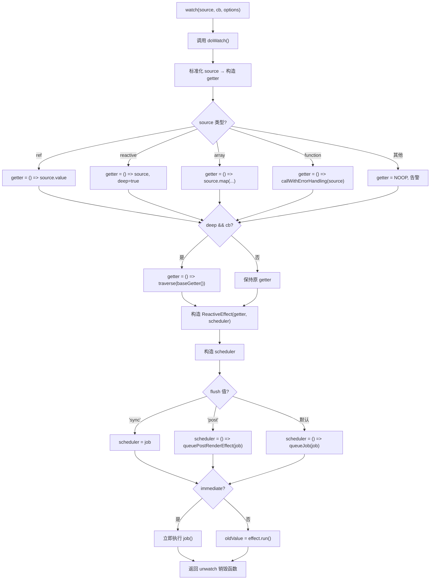
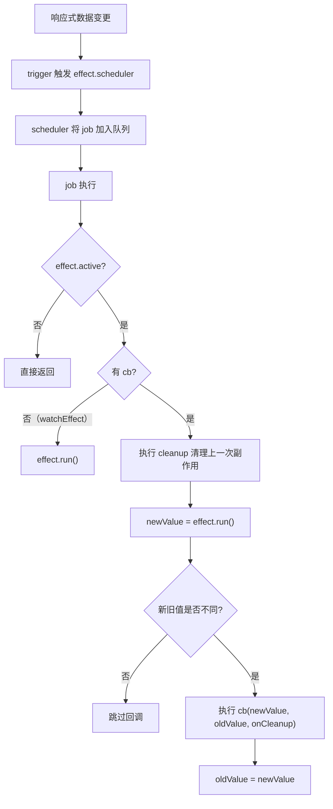

# 响应式-watch实现原理

## 前言

在组合式 API 中，我们可以使用 [watch 函数](https://cn.vuejs.org/api/reactivity-core.html#watch)在每次响应式状态发生变化时触发回调函数，`watch` 的第一个参数可以是不同形式的数据类型：它可以是一个 `ref`（包括计算属性）、一个响应式对象、一个 `getter 函数`、或多个数据源组成的数组。

```js
const x = ref(0)
const y = ref(0)
const state = reactive({ num: 0 })

// 单个 ref
watch(x, (newX) => {
  console.log(`x is ${newX}`)
})

// getter 函数
watch(
  () => x.value + y.value,
  (sum) => {
    console.log(`sum of x + y is: ${sum}`)
  }
)

// 响应式对象
watch(
  state,
  (newState) => {
    console.log(`new state num is: ${newState.num}`)
  }
)

// 多个来源组成的数组
watch([x, () => y.value], ([newX, newY]) => {
  console.log(`x is ${newX} and y is ${newY}`)
})
```

了解了一些基础的 `watch` 使用示例后，我们开始分析 watch 函数的实现原理。

## 标准化 source

先来看一下 `watch` 函数实现的代码：

```ts
function watch(
  source,
  cb,
  options
) {
  // ...
  return doWatch(source, cb, options)
}

function doWatch(
  source,
  cb,
  { immediate, deep, flush, onTrack, onTrigger } = EMPTY_OBJ
) {
  // ...
}
```

`watch` 函数内部是通过 `doWatch` 来执行的，在分析 `doWatch` 函数实现前，我们先看看前面的示例中，`watch` 监听的 `source` 可以是多种类型，一个函数可以支持多种类型的参数入参，那么实现该函数最好的设计模式就是 `adapter` 代理模式。就是将底层模型设计成一致的，抹平调用差异，这也是 `doWatch` 函数实现的第一步：标准化 `source` 参数。

下面分析其中的实现：

```ts
function doWatch(
  source,
  cb,
  { immediate, deep, flush, onTrack, onTrigger } = EMPTY_OBJ
) {
  // ...
  // source 不合法的时候警告函数
  const warnInvalidSource = (s: unknown) => {
    warn(
      `Invalid watch source: `,
      s,
      `A watch source can only be a getter/effect function, a ref, ` +
        `a reactive object, or an array of these types.`
    )
  }

  const instance = currentInstance
  let getter
  let forceTrigger = false
  let isMultiSource = false

  // 判断是不是 ref 类型
  if (isRef(source)) {
    getter = () => source.value
    forceTrigger = isShallow(source)
  }
  // 判断是不是响应式对象
  else if (isReactive(source)) {
    getter = () => source
    deep = true
  }
  // 判断是不是数组类型
  else if (isArray(source)) {
    isMultiSource = true
    forceTrigger = source.some(s => isShallow(s) || isReactive(s))
    getter = () =>
      source.map(s => {
        if (isRef(s)) {
          return s.value
        } else if (isReactive(s)) {
          return traverse(s)
        } else if (isFunction(s)) {
          return callWithErrorHandling(s, instance, ErrorCodes.WATCH_GETTER)
        } else {
          __DEV__ && warnInvalidSource(s)
        }
      })
  }
  // 判断是不是函数类型
  else if (isFunction(source)) {
    if (cb) {
      // getter with cb
      getter = () =>
        callWithErrorHandling(source, instance, ErrorCodes.WATCH_GETTER)
    } else {
      // 如果只有一个函数作为 source 入参，则执行 watchEffect 的逻辑
      // ...
    }
  }
  // 都不符合，则告警
  else {
    getter = NOOP
    __DEV__ && warnInvalidSource(source)
  }

  // 深度监听
  if (cb && deep) {
    const baseGetter = getter
    getter = () => traverse(baseGetter())
  }

  // ...
}
```

由于 `doWatch` 函数代码量比较多，我们先一部分一部分地来解读，这里我们只关注于标准化 `source` 的逻辑。可以看到 `doWatch` 函数会对入参的 `source` 做不同类型的判断逻辑，然后生成一个统一的 `getter` 函数：

| source 类型 | getter 构造 | 附加行为 |
|---|---|---|
| `ref` | `() => source.value` | `forceTrigger = isShallow(source)` |
| `reactive` 对象 | `() => source` | `deep = true` |
| 数组 | `() => source.map(s => ...)` | `isMultiSource = true` |
| 函数（有 cb） | `() => callWithErrorHandling(source, ...)` | - |
| 函数（无 cb） | 走 `watchEffect` 逻辑 | - |
| 其他 | `NOOP` | 开发环境告警 |

`getter` 函数就是简单地对不同数据类型设置一个访问 `source` 的操作，比如对于 `ref` 就是一个创建了一个访问 `source.value` 的函数。

那么为什么需要**访问**？由之前的响应式原理我们知道，只有在触发 `proxy getter` 的时候，才会进行依赖收集，所以，这里标准化的 `source` 函数中，不管是什么类型的 `source` 都会设计一个访问器函数。

另外，需要注意的是当 `source` 是个响应式对象时，源码中会同时设置 `deep = true`。这是因为对于响应式对象，需要进行深度监听，因为响应式对象中的属性变化时，都需要进行反馈。深度监听是如何实现的？在回答这个问题之前，我们前面说了监听一个对象的属性就是需要先访问对象的属性，触发 `proxy getter`，把副作用 `cb` 收集起来。源码中则是通过 `traverse` 函数来实现对响应式对象属性的遍历访问：

```ts
export function traverse(value: unknown, seen?: Set<unknown>) {
  if (!isObject(value) || (value as any)[ReactiveFlags.SKIP]) {
    return value
  }
  seen = seen || new Set()
  if (seen.has(value)) {
    return value
  }
  seen.add(value)
  if (isRef(value)) {
    // 如果是 ref 类型，继续递归执行 .value 值
    traverse(value.value, seen)
  } else if (isArray(value)) {
    // 如果是数组类型
    for (let i = 0; i < value.length; i++) {
      // 递归调用 traverse 进行处理
      traverse(value[i], seen)
    }
  } else if (isPlainObject(value)) {
    // 如果是对象，使用 for in 读取对象的每一个值，并递归调用 traverse 进行处理
    for (const key in value) {
      traverse((value as any)[key], seen)
    }
  }
  return value
}
```

## 构造副作用 effect

前面说到，我们通过一系列操作，标准化了用户传入的 `source` 成了一个 `getter` 函数，此时的 `getter` 函数一方面还没有真正执行，也就没有触发对属性的访问操作。

`watch` 的本质是对数据源进行依赖收集，当依赖变化时，回调执行 `cb` 函数并传入新旧值。所以我们需要构造一个副作用函数，完成对数据源的变化追踪：

```ts
function doWatch(
  source,
  cb,
  { immediate, deep, flush, onTrack, onTrigger } = EMPTY_OBJ
) {
  // ...
  const effect = new ReactiveEffect(getter, scheduler)
}
```

这里的 `getter` 就是前面构造的属性访问函数，我们在介绍响应式原理的章节中，介绍过 `ReactiveEffect` 类，这里再来回顾一下它的构造与执行（Vue 3.5 稳定版实现，基于 `flags` 位标志与 `Link` 双向链表）：

```ts
class ReactiveEffect<T = any> implements Subscriber {
  constructor(
    public fn: () => T,
    public scheduler: EffectScheduler | null = null,
    scope?: EffectScope
  ) {
    recordEffectScope(this, scope)
  }

  run(): T {
    // ...（完整实现见响应式原理章节）
    // 设置 activeSub = this 后执行 this.fn()
    // 此处 fn 即 watch 构造的 getter，完成对 watch source 的访问与依赖收集
  }
}
```

这里细节部分可以详细阅读响应式原理的部分，我们只需要知道这里的 `ReactiveEffect` 的 `run` 函数内部执行了 `this.fn()` 也就是上面传入的 `getter` 函数，所以，本质上是在此时完成了对 `watch source` 的访问。

Vue 3.5 对 `ReactiveEffect` 的依赖管理进行了重要重构：依赖不再存储于 `Dep[]` 数组中全量重建，而是通过 `Link` 双向链表 + 版本计数实现增量清理（`prepareDeps` / `cleanupDeps`，见响应式原理章节），effect 重跑时只处理实际变化的依赖。这对于 `watch` 的性能也有直接的提升。

然后再看一下 `ReactiveEffect` 的第二个参数 `scheduler`，是如何构造？

## 构造 scheduler 调度

```ts
function doWatch(
  source,
  cb,
  { immediate, deep, flush, onTrack, onTrigger } = EMPTY_OBJ
) {
  // ...
  let oldValue = isMultiSource
    ? new Array((source as []).length).fill(INITIAL_WATCHER_VALUE)
    : INITIAL_WATCHER_VALUE

  // Vue 3.5：声明 onCleanup 用于清理副作用
  let onCleanup: OnCleanup | undefined

  const job = () => {
    // 被卸载
    if (!effect.active) {
      return
    }
    if (cb) {
      // Vue 3.5：获取新值
      const newValue = effect.run()
      // 如果新值与旧值相同，且不是多数据源也不是深度监听，则跳过回调
      if (
        isMultiSource
          ? (newValue as unknown[]).some(v => v !== oldValue)
          : newValue !== oldValue
      ) {
        // 执行 cb 函数
        callWithAsyncErrorHandling(cb, instance, ErrorCodes.WATCH_CALLBACK, [
          newValue,
          // 第一次更改时传递旧值为 undefined
          oldValue === INITIAL_WATCHER_VALUE
            ? undefined
            : isMultiSource && (oldValue as unknown[])[0] === INITIAL_WATCHER_VALUE
              ? []
              : oldValue,
          onCleanup
        ])
        oldValue = newValue
      }
    } else {
      // watchEffect
      effect.run()
    }
  }

  let scheduler: EffectScheduler
  if (flush === 'sync') {
    scheduler = job as any
  } else if (flush === 'post') {
    scheduler = () => queuePostRenderEffect(job, instance && instance.suspense)
  } else {
    // 默认是渲染更新之前执行
    job.pre = true
    if (instance) job.id = instance.uid
    scheduler = () => queueJob(job)
  }
}
```

> `scheduler` 我们在批量调度更新章节有简单介绍过，本质这里是根据不同的 `watch options` 中的 `flush` 参数来设置不同的调度节点，这里默认是渲染更新前执行，也就是在异步更新队列 `queue` 执行前执行。

`scheduler` 核心就是将 `job` 放入异步执行队列中，但有个特殊，也就是 `flush = 'sync'` 时，是放入同步执行的。那么 `job` 究竟是什么？

上述代码的注释已经很详尽了，`job` 其实就是一个用来执行回调函数 `cb` 的函数而已，在执行 `cb` 的同时，传入了 `source` 的新旧值。

值得注意的是，`job` 函数中有一个优化判断：当新值与旧值相同时，不会触发回调函数的执行。这对于 `computed` 等场景特别重要，避免了不必要的回调执行。

## cleanup 清理机制与 onWatcherCleanup

在 `watch` 的回调函数中，有时候我们需要执行一些清理操作，比如取消上一个异步请求、清除定时器等。在 Vue 3.5 之前，我们只能通过 `watch` 回调的第三个参数 `onCleanup` 来注册清理函数：

```ts
watch(idRef, (newId, oldId, onCleanup) => {
  const controller = new AbortController()
  fetch(`/api/${newId}`, { signal: controller.signal }).then(() => {
    // ...
  })
  // 注册清理函数，下次回调执行前调用
  onCleanup(() => controller.abort())
})
```

Vue 3.5 新增了 [onWatcherCleanup()](https://cn.vuejs.org/api/reactivity-core.html#onwatchercleanup) API，允许在 `watch` 回调的任意位置（包括异步函数中）注册清理函数，而不仅限于回调参数：

```ts
import { watch, onWatcherCleanup } from 'vue'

watch(idRef, async (newId) => {
  const controller = new AbortController()
  // 在异步函数中也能注册清理
  onWatcherCleanup(() => controller.abort())
  const response = await fetch(`/api/${newId}`, {
    signal: controller.signal
  })
  // ...
})
```

来看看 `onWatcherCleanup` 的源码实现：

```ts
// Vue 3.5 - packages/runtime-core/src/apiWatch.ts
const cleanupMap: WeakMap<ReactiveEffect, (() => void)[]> = new WeakMap()
let activeWatcher: ReactiveEffect | undefined = undefined

export function onWatcherCleanup(
  cleanupFn: () => void,
  failSilently = false,
  owner: ReactiveEffect | undefined = activeWatcher,
): void {
  if (owner) {
    let cleanups = cleanupMap.get(owner)
    if (!cleanups) {
      cleanupMap.set(owner, (cleanups = []))
    }
    cleanups.push(cleanupFn)
  } else if (__DEV__ && !failSilently) {
    warn(
      `onWatcherCleanup() was called when there was no active watcher` +
        ` to associate with.`
    )
  }
}
```

`onWatcherCleanup` 的核心原理是利用 Vue 内部维护的 `activeWatcher` 上下文变量，并通过 `cleanupMap`（`WeakMap`）为每个 watcher 存储多个清理回调。在 `doWatch` 的 `job` 执行期间，Vue 会设置当前 watcher 上下文，此时调用 `onWatcherCleanup` 就能将清理函数注册到正确的 watcher 上。

再看看 `doWatch` 中清理机制的相关实现：

```ts
function doWatch(
  source,
  cb,
  { immediate, deep, flush, onTrack, onTrigger } = EMPTY_OBJ
) {
  // ...
  let cleanup: (() => void) | undefined
  let onCleanup: OnCleanup = (fn: () => void) => {
    cleanup = effect.onStop = () => {
      callWithErrorHandling(fn, instance, ErrorCodes.WATCH_CLEANUP)
    }
  }

  const job = () => {
    if (!effect.active) return
    if (cb) {
      // 执行回调前先清理上一次的副作用
      if (cleanup) {
        cleanup()
        cleanup = undefined
      }
      const newValue = effect.run()
      // ...
    }
  }
  // ...
}
```

可以看到，每次 `job` 执行回调前，都会先执行上一次注册的 `cleanup` 函数，确保上一次的副作用被正确清理。而 `effect.onStop` 则确保在 watcher 被停止时（如组件卸载），清理函数也会被执行。

## effect run 函数执行

前面我们说到了，`ReactiveEffect` 内部的 `run` 函数，执行了依赖访问的 `getter` 函数，所以 `run` 函数是如何被执行？

```ts
function doWatch(
  source,
  cb,
  { immediate, deep, flush, onTrack, onTrigger } = EMPTY_OBJ
) {
  // ...
  // 如果存在 cb
  if (cb) {
    // 立即执行
    if (immediate) {
      // 首次直接执行 job
      job()
    } else {
      // 执行 run 函数，获取旧值
      oldValue = effect.run()
    }
  } else {
    // watchEffect：直接执行 run
    effect.run()
  }
}
```

可以看到在执行 `effect.run` 的前面判断了是否是立即执行的模式，如果是立即执行，则直接执行上面的 `job` 函数，而此时的 `job` 函数是没有旧值的，所以此时执行的 `oldValue = undefined`。

## 返回销毁函数

最后，会返回侦听器销毁函数，也就是 `watch API` 执行后返回的函数。我们可以通过调用它来停止 `watcher` 对数据的侦听。

```ts
function doWatch(
  source,
  cb,
  { immediate, deep, flush, onTrack, onTrigger } = EMPTY_OBJ
) {
  // ...
  const unwatch = () => {
    effect.stop()
    if (instance && instance.scope) {
      remove(instance.scope.effects!, effect)
    }
  }
  // ...
  return unwatch
}
```

销毁函数内部会执行 `effect.stop` 方法，用来停止对数据的 `effect` 响应。并且，如果是在组件中注册的 `watcher`，也会移除组件 `effects` 对这个 `runner` 的引用。

## Vue 3.5：响应式 Props 解构与 watch

Vue 3.5 正式支持响应式 Props 解构：解构出的变量在编译期会被转换为对 `__props.foo` 的属性访问，在运行时上下文中使用时保持响应式。

但要注意：**直接把解构后的 prop 变量传给 `watch` 并不会按预期工作**——这等价于 `watch(__props.foo, ...)`，传入的是一个静态求值结果而非响应式源，Vue 编译器会捕捉这种情况并发出警告。正确做法是用 getter 包装：

```ts
// Vue 3.5+
const { foo, bar } = defineProps({ foo: String, bar: Number })

// ❌ 等价于 watch(__props.foo, ...)，不会响应变化
watch(foo, (newFoo) => { /* ... */ })

// ✅ 使用 getter 包装
watch(() => foo, (newFoo) => {
  console.log(`foo changed to ${newFoo}`)
})
```

其背后的原理是，`watch(() => foo, ...)` 编译后即 `watch(() => __props.foo, ...)`，getter 每次执行都会重新访问 props 并完成依赖收集，从而正常工作。

## 整体流程总结

下面用流程图来梳理 `watch` 函数的完整执行流程：



当响应式数据发生变化时，触发流程如下：



## 总结

所谓 `watch`，就是观测一个响应式数据或者监测一个副作用函数里面的响应式数据，当数据发生变化的时候通知并执行相应的回调函数。而内部实现，就是通过构造一个 `effect` 副作用对象，通过对 `watch` 监听属性的访问触发副作用收集，当修改监听属性时，根据 `flush` 的状态触发 `job` 的不同阶段更新。

Vue 3.5 在 `watch` 的实现上做了多项增强：

1. **`onWatcherCleanup()` API**：允许在回调函数的任意位置（包括异步函数中）注册清理回调，解决了之前 `onCleanup` 参数只能在同步代码中注册的限制。
2. **响应式 Props 解构支持**：解构的 props 配合 getter 写法（`watch(() => foo, ...)`）即可正常监听变化，简化了组件中的监听写法。
3. **`ReactiveEffect` 内部优化**：依赖管理改为 `Link` 双向链表 + 版本计数的增量清理，减少了全量重建 deps 的性能开销。
4. **相同值跳过回调**：当 `watch` 的新值与旧值相同时，不再触发回调函数，避免了不必要的执行。
