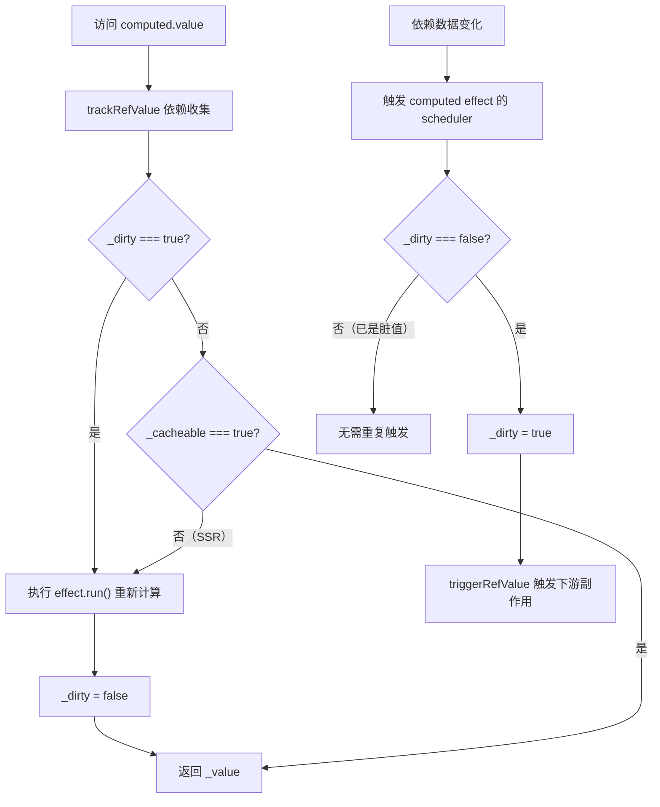
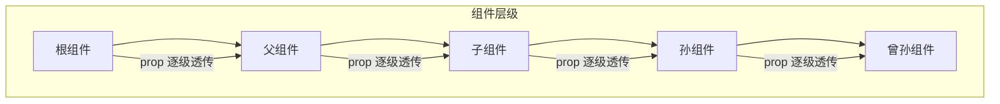
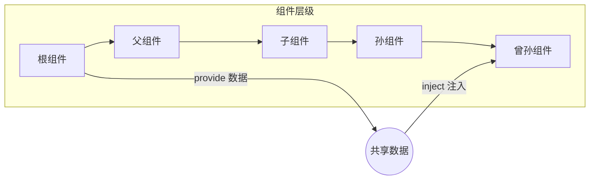
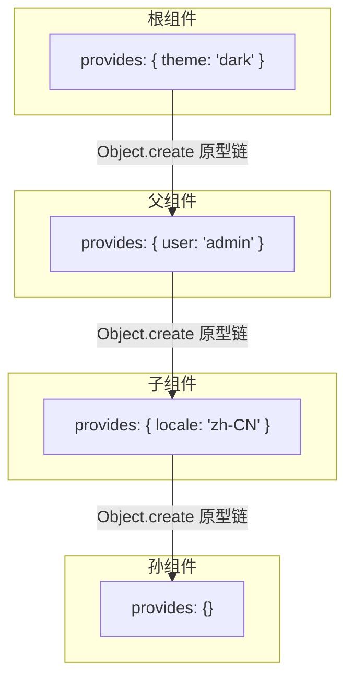
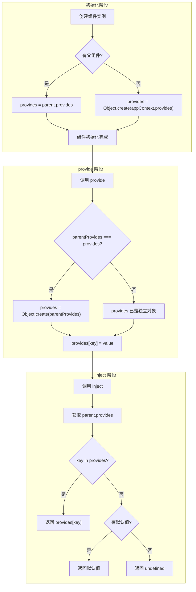

# 响应式-computed与依赖注入

## 前言

计算属性接受一个 `getter` 函数，返回一个只读的响应式 [ref](https://cn.vuejs.org/api/reactivity-core.html#ref) 对象。该 `ref` 通过 `.value` 暴露 `getter` 函数的返回值。

```js
const count = ref(1)
const plusOne = computed(() => count.value + 1)

console.log(plusOne.value) // 2

plusOne.value++ // 错误
```

它也可以接受一个带有 `get` 和 `set` 函数的对象来创建一个可写的 ref 对象。

```js
const count = ref(1)
const plusOne = computed({
  get: () => count.value + 1,
  set: (val) => {
    count.value = val - 1
  }
})

plusOne.value = 1
console.log(count.value) // 0
```

接下来看看源码里是如何实现 `computed` 的 `API`。

## 构造 setter 和 getter

```ts
export function computed<T>(
  getterOrOptions: ComputedGetter<T> | WritableComputedOptions<T>,
  debugOptions?: DebuggerOptions,
  isSSR = false
) {
  let getter: ComputedGetter<T>
  let setter: ComputedSetter<T>

  // 判断第一个参数是不是一个函数
  const onlyGetter = isFunction(getterOrOptions)

  // 构造 setter 和 getter 函数
  if (onlyGetter) {
    getter = getterOrOptions
    // 如果第一个参数是一个函数，那么就是只读的
    setter = __DEV__
      ? () => {
          console.warn('Write operation failed: computed value is readonly')
        }
      : NOOP
  } else {
    getter = getterOrOptions.get
    setter = getterOrOptions.set
  }

  // 构造 ref 响应式对象
  const cRef = new ComputedRefImpl(getter, setter, onlyGetter || !setter, isSSR)

  // 开发环境下的调试选项
  if (__DEV__ && debugOptions && !isSSR) {
    cRef.effect.onTrack = debugOptions.onTrack
    cRef.effect.onTrigger = debugOptions.onTrigger
  }

  // 返回响应式 ref
  return cRef
}
```

可以看到，这段 `computed` 函数体最初就是需要格式化传入的参数，根据第一个参数入参的类型来构造统一的 `setter` 和 `getter` 函数，并传入 `ComputedRefImpl` 类中，进行实例化 `ref` 响应式对象。

接下来分析 `ComputedRefImpl` 是如何构造 `cRef` 响应式对象的。

## 构造 cRef 响应式对象

```ts
// 以下为 Vue 3.4 及更早版本 ComputedRefImpl 的教学简化实现
// （Vue 3.5 已重构为 Subscriber 接口 + refreshComputed，核心思想一致）
class ComputedRefImpl<T> {
  public dep?: Dep = undefined

  private _value!: T
  public readonly effect: ReactiveEffect<T>

  // 表示 ref 类型
  public readonly __v_isRef = true
  // 是否只读
  public readonly [ReactiveFlags.IS_READONLY]: boolean

  // 用于控制是否进行值更新（代表是否脏值）
  public _dirty = true

  // 缓存标记
  public _cacheable: boolean

  constructor(
    getter: ComputedGetter<T>,
    _setter: ComputedSetter<T>,
    isReadonly: boolean,
    isSSR: boolean
  ) {
    // 把 getter 作为响应式依赖函数 fn 参数
    this.effect = new ReactiveEffect(getter, () => {
      if (!this._dirty) {
        this._dirty = true
        // 触发更新
        triggerRefValue(this)
      }
    })
    // 标记 effect 的 computed 属性
    this.effect.computed = this
    this.effect.active = this._cacheable = !isSSR
    this[ReactiveFlags.IS_READONLY] = isReadonly
  }

  get value() {
    const self = toRaw(this)
    // 依赖收集
    trackRefValue(self)
    if (self._dirty || !self._cacheable) {
      self._dirty = false
      // 更新值
      self._value = self.effect.run()!
    }
    return self._value
  }

  // 执行 setter
  set value(newValue: T) {
    this._setter(newValue)
  }
}
```

简单看一下该类的实现：在构造函数的时候，创建了一个副作用对象 `effect`。并为 `effect` 额外定义了一个 `computed` 属性指向当前响应式对象 `cRef`。

另外，定义了一个 `get` 方法，当我们通过 `ref.value` 取值的时候可以进行依赖收集，将定义的 `effect` 收集起来。

其次，定义了一个 `set` 方法，该方法就是执行传入进来的 `setter` 函数。

最后，熟悉 `Vue` 的开发者都知道 `computed` 的特性就在于能够缓存计算的值（提升性能），只有当 `computed` 的依赖发生变化时才会重新计算，否则读取 `computed` 的值则一直是之前的值。在源码这里，实现上述功能相关的变量分别是 `_dirty` 和 `_cacheable` 这 2 个，用来控制缓存的实现。

## computed 的缓存与脏值机制

`computed` 的缓存机制核心在于 `_dirty` 标志位，下面通过流程图来展示其工作原理：



有了上面的介绍，我们来看一个具体的例子，看看 `computed` 是如何执行的：

```html
<template>
  <div>
    {{ plusOne }}
  </div>
  <button @click="plus">plus</button>
</template>
<script>
  import { ref, computed } from 'vue'
  export default {
    setup() {
      const num = ref(0)
      const plusOne = computed(() => {
        return num.value + 1
      })

      function plus() {
        num.value++
      }
      return {
        plusOne,
        plus
      }
    }
  }
</script>
```

**Step 1**：`setup` 函数体内，`computed` 函数执行，初始的过程中，生成了一个 `computed effect`。

**Step 2**：初始化渲染的时候，`render` 函数访问了 `plusOne.value`，触发了收集，此时收集的副作用为 `render effect`，因为是首次访问，所以此时的 `self._dirty = true` 执行 `effect.run()` 也就是执行了 `getter` 函数，得到 `_value = 1`。

**Step 3**：`getter` 函数体内访问了 `num.value` 触发了对 `num` 的依赖收集，此时收集到的依赖为 `computed effect`。

**Step 4**：点击按钮，此时 `num = 1` 触发了 `computed effect` 的 `scheduler` 调度，因为 `_dirty = false`，所以触发了 `triggerRefValue` 的执行，同时，设置 `_dirty = true`。

**Step 5**：`triggerRefValue` 执行过程中，会触发 `render effect.run()` 重新渲染。渲染过程中再次访问 `plusOne.value`，因为此时的 `_dirty = true`，所以 `get value` 会重新计算 `_value` 的值为 `plusOne.value = 2`。

**Step 6**：页面更新完成。

可以看到 `computed` 函数通过 `_dirty` 把 `computed` 的缓存特性表现得淋漓尽致，只有当 `_dirty = true` 的时候，才会进行重新计算求值，而 `_dirty = true` 只有在首次取值或者取值内部依赖发生变化时才会执行。

## 计算属性的执行顺序

这里，我们介绍完了 `computed` 的核心流程，但是细心的读者可能发现，这里我们还漏了一个小的知识点没有介绍，就是在类 `ComputedRefImpl` 的构造函数中，执行了这样一行代码：

```ts
this.effect.computed = this
```

那么这行代码的作用是什么？在说明这个作用之前，首先分析一个 `demo`：

```js
const { ref, effect, computed } = Vue

const n = ref(0)
const plusOne = computed(() => n.value + 1)
effect(() => {
  n.value
  console.log(plusOne.value)
})
n.value++
```

读者可以分析上述代码的打印结果。

可能有人认为结果应该是：

```
1
1
2
```

首先是 `effect` 函数先执行，触发 `n` 的依赖收集，然后访问了 `plusOne.value`，再收集 `computed effect`。然后执行 `n.value++` 按照顺序触发 `effect` 执行，所以理论上先触发 `effect` 函数内部的回调，再去执行 `computed` 的重新求值。所以输出是上述结果。

但事实却是：

```
1
2
2
```

这就是因为上面那一行代码的作用。`effect.computed` 的标记保障了 `computed effect` 会优先于其他普通副作用函数先执行，关于具体的实现（Vue 3.4 及更早版本；3.5 中由 `Dep.notify` 的批处理机制承担同等职责），可以看一下 `triggerEffects` 函数体内对 `computed` 的特殊处理：

```ts
function triggerEffects(
  dep: Dep | ReactiveEffect[],
  debuggerEventExtraInfo?: DebuggerEventExtraInfo
) {
  const effects = isArray(dep) ? dep : [...dep]
  // 确保执行完所有的 computed
  for (const effect of effects) {
    if (effect.computed) {
      triggerEffect(effect, debuggerEventExtraInfo)
    }
  }
  // 再执行其他的副作用函数
  for (const effect of effects) {
    if (!effect.computed) {
      triggerEffect(effect, debuggerEventExtraInfo)
    }
  }
}
```

这个执行顺序的保证非常关键：如果 `computed effect` 不优先执行，那么当普通 `effect` 读取 `computed.value` 时，可能拿到的是尚未更新的旧值，导致数据不一致。

## computed 的重触发优化（Vue 3.4+）

在 Vue 3.4 之前，`computed` 存在一个问题：即使计算属性的值没有发生变化，依赖它的副作用也会被触发。考虑以下场景：

```js
const obj = reactive({ count: 0 })
const isEven = computed(() => obj.count % 2 === 0)

watch(isEven, (newVal) => {
  console.log('isEven changed:', newVal)
})

obj.count++  // 0 → 1, isEven: true → false, 触发 watch ✓
obj.count++  // 1 → 2, isEven: false → true, 触发 watch ✓
obj.count += 2  // 2 → 4, isEven: true → true, 不应触发 watch
```

在 Vue 3.4 之前，第三次修改 `obj.count += 2` 时，虽然 `isEven` 的值仍然是 `true`，但 `watch` 回调仍然会被触发。这是因为旧版 `computed` 的 `scheduler` 在依赖变化时无条件地设置 `_dirty = true` 并调用 `triggerRefValue`，而没有检查值是否真的发生了变化。

Vue 3.4 对此进行了重构（PR [#5912](https://github.com/vuejs/core/pull/5912)），在 `refreshComputed` 中增加了值比较逻辑：

```ts
// refreshComputed 中的值比较逻辑
const value = computed.fn(computed._value)
if (dep.version === 0 || hasChanged(value, computed._value)) {
  computed._value = value
  dep.version++  // 只有值真正变化时才递增版本号
}
```

只有 `hasChanged(value, computed._value)` 为 `true` 时才递增 `dep.version`，下游副作用通过脏检查（`isDirty`）发现版本号未变化，从而跳过执行。这个优化对于频繁更新但计算结果不变的场景（如上面的奇偶判断）有显著的性能提升。

## Vue 3.5：SSR 下的 Stale Computed 修复

在 Vue 3.5 之前，SSR 环境下 `computed` 存在一个已知问题：由于 SSR 模式下 `computed` 的 `_cacheable` 被设置为 `false`（即 `effect.active = false`），每次访问 `computed.value` 都会重新执行 `getter`，而不会进行缓存。这在某些场景下会导致不一致的行为。

Vue 3.5 对此进行了修复，改进了 SSR 环境下 `computed` 的处理逻辑，确保在 SSR 和客户端环境下行为更加一致。核心改动在于 `computed` 函数的第三个参数 `isSSR` 的处理方式：

```ts
export function computed<T>(
  getterOrOptions: ComputedGetter<T> | WritableComputedOptions<T>,
  debugOptions?: DebuggerOptions,
  isSSR = false
) {
  // ...
  const cRef = new ComputedRefImpl(getter, setter, onlyGetter || !setter, isSSR)
  // ...
}
```

在 SSR 环境下，`computed` 仍然会创建 `ReactiveEffect`，但通过 `isSSR` 标记来控制缓存行为。Vue 3.5 优化了这一逻辑，使得 SSR 下的 `computed` 在组件 hydration 阶段能够正确地与客户端状态同步，避免了 stale computed（过期计算值）的问题。

## triggerRef：强制触发计算属性更新

在某些特殊场景下，我们可能需要强制触发 `computed` 的重新计算和副作用通知，即使 `computed` 的依赖没有发生变化。Vue 提供了 `triggerRef` 函数来实现这个功能：

```ts
export function triggerRef(ref: Ref) {
  triggerRefValue(ref)
}
```

使用场景通常是在 `computed` 的 `getter` 中使用了非响应式数据源时：

```js
const shallowObj = shallowReactive({ nested: { foo: 1 } })
const computedVal = computed(() => shallowObj.nested.foo)

// 修改深层属性不会自动触发 computed 更新
shallowObj.nested.foo = 2
// 需要手动调用 triggerRef
triggerRef(computedVal)
```

`triggerRef` 的实现非常简单，就是直接调用 `triggerRefValue`，触发所有依赖该 `ref` 的副作用重新执行。

## 总结

总而言之，计算属性可以**从状态数据中计算出新数据**，`computed` 和 `methods` 的最大差异是它具备缓存性，如果依赖项不变时不会重新计算，而是直接返回缓存的值。

Vue 3.5 对 `computed` 做了以下重要优化：

1. **重触发优化（Vue 3.4+）**：当 `computed` 的值没有发生变化时，不再触发依赖它的副作用，避免了不必要的更新。
2. **SSR Stale Computed 修复**：改进了 SSR 环境下 `computed` 的行为，确保服务端渲染和客户端 hydration 阶段的数据一致性。
3. **ReactiveEffect 内部优化**：`computed` 底层的 `ReactiveEffect` 也受益于 Vue 3.5 的依赖追踪优化，减少了全量清理 deps 的性能开销。

理解了本小节关于 `computed` 函数的介绍后，计算属性相对于普通函数的不同之处的原理已经清晰，在以后的开发中，可以更合理地使用计算属性。


---

## 前言

通常情况下，当我们需要从父组件向子组件传递数据时，会使用 [props](https://cn.vuejs.org/guide/components/props.html)。对于层级不深的父子组件可以通过 `props` 透传数据，但是当父子层级过深时，数据透传将会变得非常麻烦和难以维护，引用 `Vue.js` 官网的一张图：



而依赖注入则是为了解决 `prop 逐级透传` 的问题而诞生的，父组件 `provide` 需要共享给子组件的数据，子组件 `inject` 使用需要的父组件状态数据，而且可以保持响应式。



再来看一个依赖注入的使用示例：

```js
// 父组件
import { provide, ref } from 'vue'
const msg = ref('hello')
provide(/* 注入名 */ 'message', /* 值 */ msg)

// 子组件使用
import { inject } from 'vue'
const message = inject('message')
```

那么，依赖注入的核心实现原理是怎样？接下来分析依赖注入的核心实现原理。

## Provide

`Provide` 顾名思义，就是一个数据提供方，看看源码里面是如何提供的：

```ts
export function provide<T>(key: InjectionKey<T> | string | number, value: T) {
  if (!currentInstance) {
    if (__DEV__) {
      warn(
        `provide() can only be used inside setup().`
      )
    }
  } else {
    // 获取当前组件实例上的 provides 对象
    let provides = currentInstance.provides
    // 获取父组件实例上的 provides 对象
    const parentProvides =
      currentInstance.parent && currentInstance.parent.provides
    // 当前组件的 providers 指向父组件的情况
    if (parentProvides === provides) {
      // 继承父组件再创建一个 provides
      provides = currentInstance.provides = Object.create(parentProvides)
    }
    // 生成 provides 对象
    provides[key as string] = value
  }
}
```

这里稍微回忆一下 `Object.create` 这个函数：这个方法用于创建一个新对象，使用现有的对象来作为新创建对象的原型（`prototype`）。

所以 `provide` 就是通过获取当前组件实例对象上的 `provides`，然后通过 `Object.create` 把父组件的 `provides` 属性设置到当前的组件实例对象的 `provides` 属性的原型对象上。最后再将需要 `provide` 的数据存储在当前的组件实例对象上的 `provides` 上。

这里可能会有疑问，当前组件上实例的 `provides` 为什么会等于父组件上的 `provides`？这是因为在组件实例 `currentInstance` 创建的时候进行了初始化的：

```ts
// 应用上下文
appContext = {
  // ...
  provides: Object.create(null),
}

// 组件实例创建
const instance: ComponentInstance = {
  // 依赖注入相关
  provides: parent ? parent.provides : Object.create(appContext.provides),
  // 其它属性
  // ...
}
```

可以看到，如果父组件定义了 `provide` 那么子组件初始的过程中都会将自己的 `provide` 指向父组件的 `provide`。而根组件因为没有父组件，则被赋值为一个空对象。大致可以表示为：



当孙组件通过 `inject` 查找 `theme` 时，会沿着原型链依次查找：孙组件的 `provides` → 子组件的 `provides` → 父组件的 `provides` → 根组件的 `provides`，最终找到 `theme: 'dark'`。

## Inject

`Inject` 顾名思义，就是一个数据注入方，看看源码里面是如何实现注入的：

```ts
export function inject<T>(
  key: InjectionKey<T> | string | number
): T | undefined
export function inject<T>(
  key: InjectionKey<T> | string | number,
  defaultValue: T,
  treatDefaultAsFactory?: boolean
): T
export function inject(
  key: InjectionKey<any> | string | number,
  defaultValue?: unknown,
  treatDefaultAsFactory = false
) {
  // 获取当前组件实例
  const instance = currentInstance || currentRenderingInstance
  if (instance) {
    // 获取父组件上的 provides 对象
    const provides =
      instance.parent == null
        ? instance.vnode.appContext && instance.vnode.appContext.provides
        : instance.parent.provides

    // 如果能取到，则返回值
    if (provides && (key as string | symbol) in provides) {
      return provides[key as string]
    } else if (arguments.length > 1) {
      // 返回默认值
      return treatDefaultAsFactory && isFunction(defaultValue)
        ? // 如果默认内容是个函数的，就执行并且通过 call 方法把组件实例的代理对象绑定到该函数的 this 上
          defaultValue.call(instance.proxy)
        : defaultValue
    } else if (__DEV__) {
      warn(`injection "${String(key)}" not found.`)
    }
  } else if (__DEV__) {
    warn(`inject() can only be used inside setup() or functional components.`)
  }
}
```

这里的实现就显得通俗易懂了，核心也就是从当前组件实例的父组件上取 `provides` 对象，然后再查找父组件 `provides` 上有没有对应的属性。因为父组件的 `provides` 是通过原型链的方式和父组件的父组件进行了关联，如果父组件上没有，那么会通过原型链的方式再向上取，这也实现了不管组件层级多深，总是可以找到对应的 `provide` 的提供方数据。

## 响应式数据的保持

依赖注入的一个重要特性是能够保持数据的响应式。当 `provide` 一个响应式数据时，`inject` 获取的也是这个响应式数据的引用：

```js
// 父组件
import { provide, ref, reactive } from 'vue'

const count = ref(0)
const state = reactive({ name: 'Vue' })

provide('count', count)
provide('state', state)

// 子组件
import { inject, watch } from 'vue'

const count = inject('count')
const state = inject('state')

// 响应式保持
watch(count, (newVal) => {
  console.log('count changed:', newVal)
})

// 修改会触发响应
count.value++  // 触发 watch
state.name = 'Vue 3'  // 触发响应式更新
```

这是因为 `provide` 和 `inject` 只是传递了数据的引用，并没有对数据进行任何处理。响应式数据的 `ref` 或 `reactive` 包装在传递过程中保持不变，因此响应式特性得以保留。

## inject 与 ref 的自动解包

历史上存在过一个配置项 `app.config.unwrapInjectedRef`（Vue 3.2 引入，3.3 标记为废弃，3.4 中移除）。需要注意的是，它只影响 **Options API 的 `inject` 选项**：

- Vue 3.2 中，Options API 通过 `inject` 选项注入 `ref` 时默认不做解包，需设置 `app.config.unwrapInjectedRef = true` 才会自动解包。
- Vue 3.3 起，Options API 的 `inject` 选项默认解包注入的 `ref`，该配置项随之废弃。

而组合式 API 的 `inject()` 函数在任何版本中都**不会自动解包**，始终返回 `ref` 对象本身：

```js
// 组合式 API（各版本行为一致）
const count = inject('count')  // 返回 Ref<number>
console.log(count.value)  // 需要使用 .value，保持响应式
```

这样设计的原因是：如果 `inject` 直接解包 `ref` 返回原始值，注入方拿到的是普通值，响应式连接就丢失了，这与依赖注入保持响应式的初衷相矛盾。返回 `ref` 本身使行为一致且可预测。

如果你确实需要在模板中使用注入的 `ref`，可以直接在模板中使用（模板会自动解包）：

```html
<script setup>
import { inject } from 'vue'
const count = inject('count')  // Ref<number>
</script>

<template>
  <!-- 模板中自动解包，无需 .value -->
  <div>{{ count }}</div>
</template>
```

## 使用 TypeScript 增强类型安全

Vue 3 提供了 `InjectionKey<T>` 类型，用于在 TypeScript 中为依赖注入提供类型安全：

```ts
import { InjectionKey, provide, inject, Ref, ref } from 'vue'

// 定义注入 key 的类型
interface UserInfo {
  name: string
  age: number
}

const userInfoKey: InjectionKey<Ref<UserInfo>> = Symbol('userInfo')

// 父组件 provide
const userInfo = ref<UserInfo>({ name: 'Vue', age: 3 })
provide(userInfoKey, userInfo)

// 子组件 inject - 自动推断类型
const injectedUserInfo = inject(userInfoKey)  // Ref<UserInfo> | undefined
```

使用 `InjectionKey` 可以确保 `provide` 和 `inject` 的类型一致，避免类型错误。

## 依赖注入的完整流程

下面用流程图来展示依赖注入的完整工作流程：



## 应用级依赖注入

除了组件级的依赖注入，Vue 3 还支持应用级的依赖注入。通过 `app.provide` 可以在整个应用范围内共享数据：

```ts
// main.ts
const app = createApp(App)
app.provide('globalConfig', {
  apiBase: 'https://api.example.com',
  theme: 'dark'
})

// 任意组件中
const config = inject('globalConfig')
```

应用级 `provide` 的实现原理与组件级相同，只是数据存储在 `appContext.provides` 中。当组件没有父组件时（根组件），会从 `appContext.provides` 中查找注入的数据。

## 总结

通过上面的分析，我们知道了依赖注入的实现原理相对还是比较简单的，比较有意思的是它巧妙地利用了原型和原型链的方式进行数据的继承和获取。

在执行 `provide` 的时候，会将父组件的 `provides` 关联成当前组件实例 `provides` 对象原型上的属性，当在 `inject` 获取数据的时候，则会根据原型链的规则进行查找，找不到的话则会返回用户自定义的默认值。

Vue 3.5 对依赖注入的改动：

1. **移除 `app.config.unwrapInjectedRef`**：这个在 Vue 3.3 中被废弃的配置项在 Vue 3.4 中被移除。组合式 API 的 `inject` 始终返回 `ref` 本身，不做自动解包，确保响应式特性不会丢失。
2. **行为更加一致**：移除配置项后，依赖注入的行为更加可预测，开发者不需要担心配置项对行为的影响。

最后，我们知道 `Vue` 通过了依赖注入的方式实现了跨层级组件的状态共享问题。跨层级的状态共享问题这与 `vuex / pinia` 所解决的问题类似。

那思考一下 `Vue 3` 是否可以依托于 `Composition API` + `依赖注入` 实现一个轻量级的状态管理工具？

答案是肯定的。实际上，Pinia 的核心实现就大量使用了 `provide/inject` 机制来管理状态的作用域。通过在应用根组件 `provide` 一个状态容器，所有子组件都可以 `inject` 获取并响应式地使用这些状态，这正是依赖注入在状态管理中的典型应用。
