# 编译器-模板编译全流程

## 前言

通过前面的小节，我们知道，组件渲染成 `vnode` 的过程，其实就是组件的 `render` 函数调用执行的结果。但是我们写 `Vue` 项目时，经常会使用 `<template>` 的模版式写法，很少使用 `render` 函数的写法，那么 `Vue` 是如何实现从模版转成 `render` 函数？

另外，关于模版编译成 `render` 函数的结果，也可以通过官方提供的 [模版导出工具](https://template-explorer.vuejs.org/) 在线调试编译结果。

`Vue 3` 的核心编译源码文件在 `packages/compiler-dom/src/index.ts` 中：

```ts
export function compile(
  template: string,
  options: CompilerOptions = {}
): CodegenResult {
  return baseCompile(
    template,
    extend({}, parserOptions, options, {
      nodeTransforms: [
        ...DOMNodeTransforms,
        ...(options.nodeTransforms || [])
      ],
      directiveTransforms: extend(
        {},
        DOMDirectiveTransforms,
        options.directiveTransforms || {}
      )
    })
  )
}
```

其核心调用的就是 `baseCompile` 函数，接下来分析 `baseCompile` 的实现：

```ts
export function baseCompile(
  template: string | RootNode,
  options: CompilerOptions = {}
): CodegenResult {
  // 如果是字符串模版，则直接进行解析，转成 AST
  const ast = isString(template)
    ? baseParse(template, options)
    : template

  const [nodeTransforms, directiveTransforms] =
    getBaseTransformPreset()

  // AST 转换成 JS AST
  transform(
    ast,
    extend({}, options, {
      nodeTransforms: [
        ...nodeTransforms,
        ...(options.nodeTransforms || []) // 用户自定义 transforms
      ],
      directiveTransforms: extend(
        {},
        directiveTransforms,
        options.directiveTransforms || {} // 用户自定义 transforms
      )
    })
  )

  // JS AST 生成代码
  return generate(
    ast,
    extend({}, options)
  )
}
```

可以看到 `baseCompile` 函数核心就只有 3 步：

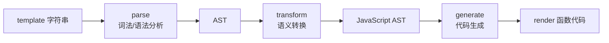

1. 对 `template` 模版进行词法和语法分析，生成 `AST`
2. `AST` 转换成附有 `JS` 语义的 `JavaScript AST`
3. 解析 `JavaScript AST` 生成代码

本小节着重来介绍第一步。

## 解析 template 生成 AST

一个简单的模版如下：

```html
<template>
  <!-- 这是一段注释 -->
  <p>{{ msg }}</p>
</template>
```

这个模版经过 `baseParse` 后转成的 `AST` 结果如下：

```json
{
  "type": 0,
  "children": [
    {
      "type": 3,
      "content": " 这是一段注释 ",
      "loc": {
        "start": { "column": 3, "line": 2, "offset": 3 },
        "end": { "column": 18, "line": 2, "offset": 18 },
        "source": "<!-- 这是一段注释 -->"
      }
    },
    {
      "type": 1,
      "ns": 0,
      "tag": "p",
      "tagType": 0,
      "props": [],
      "isSelfClosing": false,
      "children": [
        {
          "type": 5,
          "content": {
            "type": 4,
            "isStatic": false,
            "constType": 0,
            "content": "msg",
            "loc": {
              "start": { "column": 9, "line": 3, "offset": 27 },
              "end": { "column": 12, "line": 3, "offset": 30 },
              "source": "msg"
            }
          },
          "loc": {
            "start": { "column": 6, "line": 3, "offset": 24 },
            "end": { "column": 15, "line": 3, "offset": 33 },
            "source": "{{ msg }}"
          }
        }
      ],
      "loc": {
        "start": { "column": 3, "line": 3, "offset": 21 },
        "end": { "column": 19, "line": 3, "offset": 37 },
        "source": "<p>{{ msg }}</p>"
      }
    }
  ],
  "helpers": [],
  "components": [],
  "directives": [],
  "hoists": [],
  "imports": [],
  "cached": 0,
  "temps": 0,
  "loc": {
    "start": { "column": 1, "line": 1, "offset": 0 },
    "end": { "column": 1, "line": 4, "offset": 38 },
    "source": "\n  <!-- 这是一段注释 -->\n  <p>{{ msg }}</p>\n"
  }
}
```

其中有一个 `type` 字段，用来标记 `AST` 节点的类型，这里涉及到的枚举如下：

```ts
export const enum NodeTypes {
  ROOT,                  // 0  根节点
  ELEMENT,               // 1  元素节点
  TEXT,                  // 2  文本节点
  COMMENT,               // 3  注释节点
  SIMPLE_EXPRESSION,     // 4  简单表达式
  INTERPOLATION,         // 5  插值节点
  ATTRIBUTE,             // 6  属性节点
  DIRECTIVE,             // 7  指令节点
  COMPOUND_EXPRESSION,   // 8  复合表达式
  IF,                    // 9  v-if 节点
  IF_BRANCH,             // 10 v-if 分支节点
  FOR,                   // 11 v-for 节点
  TEXT_CALL,             // 12 文本调用节点
  VNODE_CALL,            // 13 VNode 调用节点
  // ... 更多 JS 语义节点类型
}
```

另外，`props` 描述的是节点的属性，`loc` 代表的是节点对应的代码相关信息，包括代码的起始位置等等。

有了上面的一些基础知识，接下来分析生成 `AST` 的核心算法：

```ts
export function baseParse(
  content: string,
  options: ParserOptions = {}
): RootNode {
  // 创建解析上下文
  const context = createParserContext(content, options)
  // 获取起点位置
  const start = getCursor(context)
  // 创建 AST
  return createRoot(
    parseChildren(context, TextModes.DATA, []),
    getSelection(context, start)
  )
}
```

其中创建解析上下文得到的 `context` 的过程：

```ts
function createParserContext(
  content: string,
  options: ParserOptions
): ParserContext {
  return {
    options: extend({}, defaultParserOptions, options),
    column: 1,
    line: 1,
    offset: 0,
    // 存储原始模版内容
    originalSource: content,
    source: content,
    inPre: false,
    inVPre: false
  }
}
```

`createParserContext` 本质就是返回了一个 `context` 对象，用来标记解析过程中的上下文内容。

接下来我们核心需要分析的是 `parseChildren` 函数，该函数是生成 `AST` 的核心函数。通过函数调用我们大致清楚该函数传入了初始化生成的 `context` 对象，`context` 对象中包含我们初始的模版内容，存储在 `originalSource` 和 `source` 中。

首先分析 `parseChildren` 对节点内容解析的过程：

```ts
function parseChildren(
  context: ParserContext,
  mode: TextModes,
  ancestors: ElementNode[]
): TemplateChildNode[] {
  // 获取父节点
  const parent = last(ancestors)
  const ns = parent ? parent.ns : Namespaces.HTML
  const nodes: TemplateChildNode[] = []
  // 判断是否到达结束位置，遍历结束
  while (!isEnd(context, mode, ancestors)) {
    // template 中的字符串
    const s = context.source
    let node: TemplateChildNode | TemplateChildNode[] | undefined = undefined
    // 如果 mode 是 DATA 和 RCDATA 模式
    if (mode === TextModes.DATA || mode === TextModes.RCDATA) {
      // 处理 {{ 开头的情况
      if (!context.inVPre && startsWith(s, context.options.delimiters[0])) {
        // '{{'
        node = parseInterpolation(context, mode)
      } else if (mode === TextModes.DATA && s[0] === '<') {
        // 以 < 开头且就一个 < 字符
        if (s.length === 1) {
          emitError(context, ErrorCodes.EOF_BEFORE_TAG_NAME, 1)
        } else if (s[1] === '!') {
          // 以 <! 开头的情况
          if (startsWith(s, '<!--')) {
            // 如果是 <!-- 这种情况，则按照注释节点处理
            node = parseComment(context)
          } else if (startsWith(s, '<!DOCTYPE')) {
            // 如果是 <!DOCTYPE 这种情况
            node = parseBogusComment(context)
          } else if (startsWith(s, '<![CDATA[')) {
            // 如果是 <![CDATA[ 这种情况
            if (ns !== Namespaces.HTML) {
              node = parseCDATA(context, ancestors)
            } else {
              emitError(context, ErrorCodes.CDATA_IN_HTML_CONTENT)
              node = parseBogusComment(context)
            }
          } else {
            // 都不是的话，则报错
            emitError(context, ErrorCodes.INCORRECTLY_OPENED_COMMENT)
            node = parseBogusComment(context)
          }
        } else if (s[1] === '/') {
          // 以 </ 开头，并且只有 </ 的情况
          if (s.length === 2) {
            emitError(context, ErrorCodes.EOF_BEFORE_TAG_NAME, 2)
          } else if (s[2] === '>') {
            // </> 缺少结束标签，报错
            emitError(context, ErrorCodes.MISSING_END_TAG_NAME, 2)
            advanceBy(context, 3)
            continue
          } else if (/[a-z]/i.test(s[2])) {
            // 文本中存在多余的结束标签的情况 </p>
            emitError(context, ErrorCodes.X_INVALID_END_TAG)
            parseTag(context, TagType.End, parent)
            continue
          } else {
            emitError(
              context,
              ErrorCodes.INVALID_FIRST_CHARACTER_OF_TAG_NAME,
              2
            )
            node = parseBogusComment(context)
          }
        } else if (/[a-z]/i.test(s[1])) {
          // 解析标签元素节点
          node = parseElement(context, ancestors)
        } else if (s[1] === '?') {
          emitError(
            context,
            ErrorCodes.UNEXPECTED_QUESTION_MARK_INSTEAD_OF_TAG_NAME,
            1
          )
          node = parseBogusComment(context)
        } else {
          emitError(context, ErrorCodes.INVALID_FIRST_CHARACTER_OF_TAG_NAME, 1)
        }
      }
    }
    if (!node) {
      // 解析普通文本节点
      node = parseText(context, mode)
    }

    if (isArray(node)) {
      for (let i = 0; i < node.length; i++) {
        pushNode(nodes, node[i])
      }
    } else {
      pushNode(nodes, node)
    }
  }
  return nodes
}
```

上述代码量虽然挺多，但整体要做的事情还是比较明确和清晰的。从上述代码中可以看到，`Vue` 在解析模板字符串时，可分为两种情况：以 `<` 开头的字符串和不以 `<` 开头的字符串。

其中，不以 `<` 开头的字符串有两种情况：它是文本节点或 `{{ exp }}` 插值表达式。

而以 `<` 开头的字符串又分为以下几种情况：

| 开头字符 | 类型 | 示例 |
|---------|------|------|
| `<[a-z]` | 元素开始标签 | `<div>` |
| `<!--` | 注释节点 | `<!-- 123 -->` |
| `<!DOCTYPE` | 文档声明 | `<!DOCTYPE html>` |
| `<![CDATA[` | 纯文本标签 | `<![CDATA[<]]>` |
| `</[a-z]` | 元素结束标签 | `</div>` |

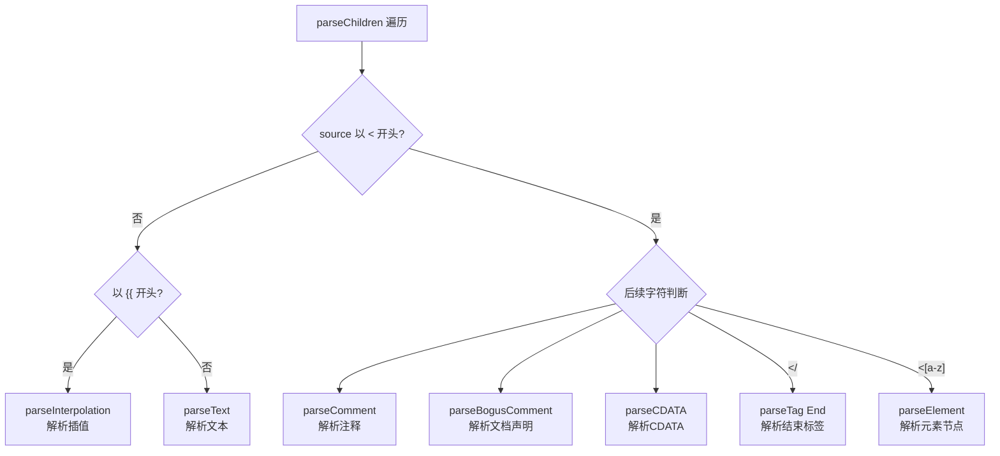

接下来我们介绍几个比较重要的解析器。

### 1. 解析插值

根据前面的描述，我们知道当遇到字符串 `{{msg}}` 的时候，会把当前代码当做是插值节点来解析，进入 `parseInterpolation` 函数体内：

```ts
function parseInterpolation(
  context: ParserContext,
  mode: TextModes
): InterpolationNode | undefined {
  // 从配置中获取插值开始和结束分隔符，默认是 {{ 和 }}
  const [open, close] = context.options.delimiters
  // 获取结束分隔符的位置
  const closeIndex = context.source.indexOf(close, open.length)
  // 如果不存在结束分隔符，则报错
  if (closeIndex === -1) {
    emitError(context, ErrorCodes.X_MISSING_INTERPOLATION_END)
    return undefined
  }

  // 获取开始解析的起点
  const start = getCursor(context)
  // 解析位置移动到插值开始分隔符后
  advanceBy(context, open.length)
  // 获取插值起点位置
  const innerStart = getCursor(context)
  // 获取插值结束位置
  const innerEnd = getCursor(context)
  // 插值原始内容的长度
  const rawContentLength = closeIndex - open.length
  // 插值原始内容
  const rawContent = context.source.slice(0, rawContentLength)
  // 获取插值的内容，并移动位置到插值的内容后
  const preTrimContent = parseTextData(context, rawContentLength, mode)
  const content = preTrimContent.trim()
  // 如果存在空格的情况，需要计算偏移值
  const startOffset = preTrimContent.indexOf(content)
  if (startOffset > 0) {
    // 更新插值起点位置
    advancePositionWithMutation(innerStart, rawContent, startOffset)
  }
  // 如果尾部存在空格的情况
  const endOffset =
    rawContentLength - (preTrimContent.length - content.length - startOffset)
  // 也需要更新尾部的位置
  advancePositionWithMutation(innerEnd, rawContent, endOffset)
  // 移动位置到插值结束分隔符后
  advanceBy(context, close.length)

  return {
    type: NodeTypes.INTERPOLATION,
    content: {
      type: NodeTypes.SIMPLE_EXPRESSION,
      isStatic: false,
      // Set `isConstant` to false by default and will decide in transformExpression
      constType: ConstantTypes.NOT_CONSTANT,
      content,
      loc: getSelection(context, innerStart, innerEnd)
    },
    loc: getSelection(context, start)
  }
}
```

这里大量使用了一个重要函数 `advanceBy(context, numberOfCharacters)`。其功能是更新解析上下文 `context` 中的 `source` 来移动代码解析的位置，同时更新 `offset、line、column` 等和代码位置相关的属性，这样来达到一步步"蚕食"模版字符串的目的，从而达到对整个模版字符串的解析。`context` 是字符串的上下文对象，`numberOfCharacters` 是要前进的字符数。

针对这样一段代码：

```html
<div>{{ msg }}</div>
```

调用 `advanceBy(context, 14)` 函数，得到结果：

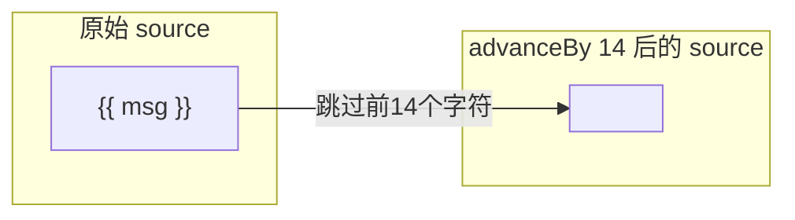

| 属性 | advanceBy 前 | advanceBy 后 |
|------|-------------|-------------|
| source | `<div>{{ msg }}</div>` | `</div>` |
| offset | 0 | 14 |
| line | 1 | 1 |
| column | 1 | 15 |

可以看到，`parseInterpolation` 函数本质就是通过插值的开始标签 `{{` 和结束标签 `}}` 找到插值的内容 `content`。然后再计算插值的起始位置，接着就是前进代码到插值结束分隔符后，表示插值部分代码处理完毕，可以继续解析后续代码了。

最后返回一个描述插值节点的 `AST` 对象，其中，`loc` 记录了插值的代码开头和结束的位置信息，`type` 表示当前节点的类型，`content` 表示当前节点的内容信息。

### 2. 解析文本

针对源代码起点位置的字符不是 `<` 或者 `{{` 时，则当做是文本节点处理，调用 `parseText` 函数：

```ts
function parseText(
  context: ParserContext,
  mode: TextModes
): TextNode {
  // 文本结束符
  const endTokens =
    mode === TextModes.CDATA
      ? [']]>']
      : ['<', context.options.delimiters[0]]

  let endIndex = context.source.length
  // 遍历文本结束符，匹配找到结束的位置
  for (let i = 0; i < endTokens.length; i++) {
    const index = context.source.indexOf(endTokens[i], 1)
    if (index !== -1 && endIndex > index) {
      endIndex = index
    }
  }

  const start = getCursor(context)
  // 获取文本的内容，并前进代码到文本的内容后
  const content = parseTextData(context, endIndex, mode)

  return {
    type: NodeTypes.TEXT,
    content,
    loc: getSelection(context, start)
  }
}
```

`parseText` 函数整体功能还是比较简单的，如果一段文本，在 `CDATA` 模式下，当遇到 `]]>` 即为结束位置，否则，都是在遇到 `<` 或者插值分隔符 `{{` 结束。所以通过遍历这些结束符，匹配并找到文本结束的位置。

找到文本结束位置后，就可以通过 `parseTextData` 函数来获取到文本的内容并前进到文本内容后。

最后返回一个文本节点的 `AST` 对象。

### 3. 解析节点

当起点字符是 `<` 开头，且后续字符串匹配 `/[a-z]/i` 正则表达式，则会进入 `parseElement` 的节点解析函数：

```ts
function parseElement(
  context: ParserContext,
  ancestors: ElementNode[]
): ElementNode | undefined {
  // 开始标签
  // 获取当前元素的父标签节点
  const parent = last(ancestors)
  // 解析开始标签，生成一个标签节点，并前进代码到开始标签后
  const element = parseTag(context, TagType.Start, parent)
  // 如果是自闭合标签，直接返回标签节点
  if (element.isSelfClosing || context.options.isVoidTag(element.tag)) {
    return element
  }

  // 下面是处理子节点的逻辑
  // 先把标签节点添加到 ancestors，入栈
  ancestors.push(element)
  const mode = context.options.getTextMode!(element, parent)
  // 递归解析子节点，传入 ancestors
  const children = parseChildren(context, mode, ancestors)
  // 子节点解析完成 ancestors 出栈
  ancestors.pop()

  element.children = children

  // 结束标签
  if (startsWithEndTagOpen(context.source, element.tag)) {
    // 解析结束标签，并前进代码到结束标签后
    parseTag(context, TagType.End, parent)
  } else {
    // 缺少闭合标签，报错
    emitError(context, ErrorCodes.X_MISSING_END_TAG, 0, element.loc.start)
  }
  // 更新标签节点的代码位置，结束位置到结束标签后
  element.loc = getSelection(context, element.loc.start)

  return element
}
```

可以看到，`parseElement` 主要做了三件事情：解析开始标签，解析子节点，解析闭合标签。

在解析子节点过程中，`Vue` 会用一个栈 `ancestors` 来保存解析到的元素标签。当它遇到开始标签时，会将这个标签推入栈，遇到结束标签时，将刚才的标签弹出栈。它的作用是保存当前已经解析了，但还没解析完的元素标签。这个栈还有另一个作用，在解析到某个子节点时，通过 `ancestors[ancestors.length - 1]` 可以获取它的父元素。

举个例子：

```html
<div class="app">
  <p>{{ msg }}</p>
  一个文本节点
</div>
```

从我们的示例来看，它的出入栈顺序是这样的：

| 操作 | 栈状态 | 说明 |
|------|--------|------|
| 初始 | `[]` | 空栈 |
| div 入栈 | `[div]` | 遇到 `<div>` |
| p 入栈 | `[div, p]` | 遇到 `<p>` |
| p 出栈 | `[div]` | p 节点解析完成 |
| div 出栈 | `[]` | div 节点解析完成 |

另外，在解析开始标签和解析闭合标签时，都用到了一个 `parseTag` 函数，这也是节点标签解析的核心函数：

```ts
function parseTag(
  context: ParserContext,
  type: TagType,
  parent: ElementNode | undefined
): ElementNode | undefined {
  const start = getCursor(context)
  // 匹配标签文本结束的位置
  const match = /^<\/?([a-z][^\t\r\n\f />]*)/i.exec(context.source)!
  const tag = match[1]
  const ns = context.options.getNamespace!(tag, parent)
  // 前进代码到标签文本结束位置
  advanceBy(context, match[0].length)
  // 前进代码到标签文本后面的空白字符后
  advanceSpaces(context)

  // 解析标签中的属性，并前进代码到属性后
  let props = parseAttributes(context, type)

  // 标签闭合
  let isSelfClosing = false
  if (context.source.length === 0) {
    emitError(context, ErrorCodes.EOF_IN_TAG)
  } else {
    // 判断是否自闭合标签
    isSelfClosing = startsWith(context.source, '/>')
    // 结束标签不应该是自闭合标签
    if (type === TagType.End && isSelfClosing) {
      emitError(context, ErrorCodes.END_TAG_WITH_TRAILING_SOLIDUS)
    }
    // 前进代码到闭合标签后
    advanceBy(context, isSelfClosing ? 2 : 1)
  }

  // 闭合标签，则退出
  if (type === TagType.End) {
    return
  }

  let tagType = ElementTypes.ELEMENT
  if (!context.inVPre) {
    // 接下来判断标签类型，是组件、插槽还是模板
    if (tag === 'slot') {
      tagType = ElementTypes.SLOT
    } else if (tag === 'template') {
      if (
        props.some(
          p =>
            p.type === NodeTypes.DIRECTIVE &&
            isSpecialTemplateDirective(p.name)
        )
      ) {
        tagType = ElementTypes.TEMPLATE
      }
    } else if (isComponent(tag, props, context)) {
      tagType = ElementTypes.COMPONENT
    }
  }

  return {
    type: NodeTypes.ELEMENT,
    ns,
    tag,
    tagType,
    props,
    isSelfClosing,
    children: [],
    loc: getSelection(context, start),
    codegenNode: undefined // to be created during transform phase
  }
}
```

`parseTag` 函数首先会匹配标签的文本节点信息，比如 `<div class="test">{{ msg }}</div>` 得到的 `match` 信息如下：

```js
[
  '<div',
  'div',
  index: 0,
  input: '<div class="test">{{ msg }}</div>\n',
  groups: undefined
]
```

然后将代码前进到节点信息后，再通过 `parseAttributes` 函数来解析标签中的 `props` 属性，比如 `class`、`style` 等等。

接下来再去判断是不是一个自闭合标签，并前进代码到闭合标签后。

最后根据 `tag` 判断标签类型，是组件、插槽还是模板。

`parseTag` 完成后，最终就是返回一个节点描述的 `AST` 对象，如果有子节点，会继续进入 `parseChildren` 的递归流程，不断更新节点的 `children` 对象。

## Vue 3.4 解析器重写：从递归下降到状态机

在 Vue 3.4 版本中，编译器的解析器（Parser）进行了完全重写，这是 Vue 3.4 最重大的底层变更之一。重写后的解析器性能提升了约 2 倍，同时改善了 SFC（单文件组件）的解析精度。

### 旧解析器的问题

Vue 3.4 之前的解析器采用的是**基于正则表达式的递归下降解析器**。这种实现方式存在以下问题：

1. **正则表达式开销大**：大量使用正则表达式进行模式匹配，每次匹配都需要编译和执行正则，性能开销显著
2. **递归调用栈深**：`parseChildren` 递归调用自身来处理嵌套结构，深层嵌套的模板会导致调用栈过深
3. **SFC 解析不精确**：旧解析器在处理 SFC 中的 `<script>`、`<style>` 等块时，使用的是简单的正则分割，无法精确处理边界情况

### 新解析器：状态机 Tokenizer

Vue 3.4 重写后的解析器采用了**基于状态机的 Tokenizer** 方案。核心思路是：将整个解析过程建模为一个有限状态自动机（FSM），每个字符的输入都会驱动状态机从一个状态转移到另一个状态。

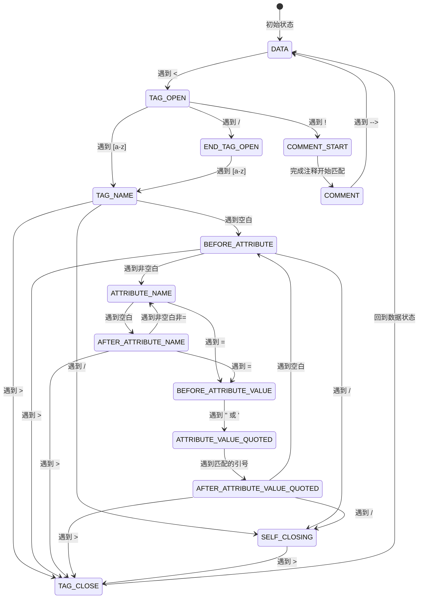

状态机方案的核心优势在于：

| 对比维度 | 旧解析器（递归下降） | 新解析器（状态机 Tokenizer） |
|---------|-------------------|--------------------------|
| 匹配方式 | 正则表达式 | 字符级状态转移 |
| 函数调用 | 递归调用 parseChildren | 线性扫描 + 状态转移 |
| 性能 | 基准 | 约 2x 提升 |
| SFC 解析 | 正则分割，边界不精确 | 精确的 Tokenizer 解析 |
| 错误恢复 | 较弱 | 更强的容错能力 |

### Tokenizer 的核心实现

新解析器的核心是一个 `Tokenizer` 类，它维护了当前的状态和位置信息，通过逐字符扫描来驱动状态转移：

```ts
export class Tokenizer {
  private state: State = State.DATA
  private offset: number = 0
  private line: number = 1
  private column: number = 1
  private source: string

  constructor(source: string) {
    this.source = source
  }

  // 核心扫描方法
  scan(): Token | null {
    while (this.offset < this.source.length) {
      const char = this.source.charCodeAt(this.offset)
      switch (this.state) {
        case State.DATA:
          this.scanData(char)
          break
        case State.TAG_OPEN:
          this.scanTagOpen(char)
          break
        case State.TAG_NAME:
          this.scanTagName(char)
          break
        // ... 更多状态处理
      }
    }
    return null
  }
}
```

在状态机方案中，每个状态对应一个处理函数，处理函数根据当前字符决定是产生一个 Token、转移到新状态、还是继续在当前状态。这种方式避免了正则表达式的开销，也避免了递归调用，使得整个解析过程是一个线性的扫描过程。

### SFC 解析的改进

Vue 3.4 还重写了 SFC 的解析逻辑。旧版本使用 `@vue/compiler-sfc` 中的正则表达式来分割 `<template>`、`<script>`、`<style>` 块，新版本则复用了同一个 Tokenizer 来精确解析 SFC 结构。这意味着：

1. SFC 中 `<script>` 和 `<style>` 块的边界检测更加精确
2. 自定义块（如 `<i18n>`、`<style lang="scss">`）的解析更加可靠
3. SFC 中注释和特殊语法的处理更加准确

## 总结

有了上面的介绍，下面通过一个简单的 `demo` 来理解 `AST` 创建的过程。针对以下模版：

```html
<div class="test">
  {{ msg }}
  <p>这是一段文本</p>
</div>
```

下面演示创建过程：

#### div 标签解析

首先进入 `parseChildren` 遇到 `<div` 标签，进入 `parseElement` 函数，`parseElement` 函数通过 `parseTag` 函数得到 `element` 的数据结构为：

```json
{
  "type": 1,
  "ns": 0,
  "tag": "div",
  "tagType": 0,
  "props": [
    {
      "type": 6,
      "name": "class",
      "value": { /* ... */ },
      "loc": { /* ... */ }
    }
  ],
  "isSelfClosing": false,
  "children": [],
  "loc": {
    "start": { "column": 3, "line": 2, "offset": 3 },
    "end": { "column": 21, "line": 2, "offset": 21 },
    "source": "<div class=\"test\">"
  }
}
```

此时的 `context` 经过 `advanceBy` 操作后，内容为：

```json
{
  "column": 18,
  "line": 1,
  "offset": 18,
  "originalSource": "<div class=\"test\">\n    {{ msg }}\n    <p>这是一段文本</p>\n  </div>\n",
  "source": "\n    {{ msg }}\n    <p>这是一段文本</p>\n  </div>\n",
  "inPre": false,
  "inVPre": false
}
```

#### 插值标签解析

然后再进入 `parseChildren` 流程，此时的 `source` 内容如下：

```html
  {{ msg }}
  <p>这是一段文本</p>
</div>
```

此时的开始标签是 `{{` 所以进入插值解析的函数 `parseInterpolation`，该函数执行完成后得到的 `source` 结果如下：

```html
  <p>这是一段文本</p>
</div>
```

> 这里关于 `AST` 内容就会包含插值节点的信息描述。`context` 内容则会在 `parseInterpolation` 后继续更新，执行后续 `source` 的内容坐标，这里不再赘述。

#### p 标签解析

在完成插值节点解析后，在 `parseChildren` 内存在一个 `while` 判断：`while (!isEnd(context, mode, ancestors))`，因为还未到达闭合标签的位置，所以接着进入 `p` 标签的解析 `parseElement`。解析完成后得到 `source` 内容如下：

```html
  这是一段文本</p>
</div>
```

此时继续进入 `parseChildren` 递归。

#### 解析文本节点

然后遇到了文本开头的内容，会进入 `parseText` 文本解析的流程，完成 `parseText` 后，得到的 `source` 内容如下：

```html
</p>
</div>
```

#### 解析闭合标签

此时 `while` 退出循环，进入 `parseTag` 继续解析闭合标签，首先是 `</p>` 标签，因为不是自闭合标签，则继续更新 `content` 后，然后更新标签节点的代码位置，最后得到的 `source` 如下：

```html
</div>
```

最后再继续解析闭合标签 `</div>` 更新 `content` 和标签节点 `div` 的代码位置，直到结束。

整个解析过程可以用以下流程图来概括：

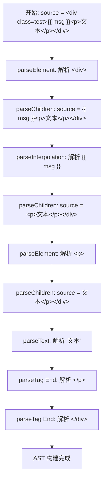

最后，值得一提的是，Vue 3.4 对解析器的重写虽然改变了底层实现（从递归下降到状态机 Tokenizer），但生成的 `AST` 结构保持了完全兼容，这意味着上层的 `transform` 和 `generate` 阶段无需任何修改即可正常工作。这种架构上的分层设计，使得底层优化可以独立进行，而不影响整个编译管线的其他部分。


---

## 前言

上一小节我们介绍完了关于模版是如何编译成 `AST` 的结构的，接下来进入模版编译的第二步 `transform`，`transform` 的目标是为了生成 `JavaScript AST`。因为渲染函数是一堆 `js` 代码构成的，编译器最终产物就是渲染函数，所以理想中的 `AST` 应该是用来描述渲染函数的 `JS` 代码。

下面分析 `transform` 转换的实现细节。

## Transform

```ts
export function baseCompile(
  template: string | RootNode,
  options: CompilerOptions = {}
): CodegenResult {
  const isModuleMode = options.mode === 'module'
  // 用来标记代码生成模式
  const prefixIdentifiers =
    !__BROWSER__ && (options.prefixIdentifiers === true || isModuleMode)
  // 获取节点和指令转换的方法
  const [nodeTransforms, directiveTransforms] = getBaseTransformPreset()
  // AST 转换成 JavaScript AST
  transform(
    ast,
    extend({}, options, {
      prefixIdentifiers,
      nodeTransforms: [
        ...nodeTransforms,
        ...(options.nodeTransforms || [])
      ],
      directiveTransforms: extend(
        {},
        directiveTransforms,
        options.directiveTransforms || {}
      )
    })
  )
}
```

其中第一个参数 `prefixIdentifiers` 是用于标记前缀代码生成模式的。举个例子，以下代码：

```html
<div>
  {{msg}}
</div>
```

在 `function` 模式（浏览器内直接编译，`prefixIdentifiers` 为 false）下，生成的渲染函数是一个通过 `with(this) { ... }` 包裹的，大致为：

```js
return function render(_ctx) {
  with (this) {
    const { toDisplayString, openBlock, createElementBlock } = Vue
    return (openBlock(), createElementBlock("div", null, toDisplayString(msg), 1 /* TEXT */))
  }
}
```

而在 `module` 模式下（ESM 输出，`prefixIdentifiers` 默认为 true，因为 ESM 的严格模式不允许 `with`），生成的渲染函数中的动态内容，则会被转成 `_ctx.msg` 的模式：

```js
import { toDisplayString, openBlock, createElementBlock } from "vue"
export function render(_ctx) {
  return (openBlock(), createElementBlock("div", null, toDisplayString(_ctx.msg), 1 /* TEXT */))
}
```

而参数 `nodeTransforms` 和 `directiveTransforms` 对象则是由 `getBaseTransformPreset` 生成的一系列预设函数：

```ts
function getBaseTransformPreset(
  prefixIdentifiers: boolean
): [NodeTransform[], DirectiveTransforms] {
  return [
    [
      transformOnce,
      transformIf,
      transformFor,
      transformExpression,
      transformSlotOutlet,
      transformElement,
      trackSlotScopes,
      transformText
    ],
    {
      on: transformOn,
      bind: transformBind,
      model: transformModel
    }
  ]
}
```

`nodeTransforms` 涵盖了特殊节点的转换函数，比如文本节点、`v-if` 节点等等，`directiveTransforms` 则包含了一些指令的转换函数。

这些转换函数的细节，不是这里的核心，我们将在下文进行几个重点函数的介绍，如需深入了解其余转换函数，可自行翻阅 `Vue 3` 源码查看实现细节。接下来重点介绍 `transform` 函数的实现：

```ts
export function transform(root: RootNode, options: TransformOptions) {
  // 生成 transform 上下文
  const context = createTransformContext(root, options)
  // 遍历处理 ast 节点
  traverseNode(root, context)
  // 静态提升
  if (options.hoistStatic) {
    hoistStatic(root, context)
  }
  // 创建根代码生成节点
  if (!options.ssr) {
    createRootCodegen(root, context)
  }
  // 最终确定元信息
  root.helpers = [...context.helpers.keys()]
  root.components = [...context.components]
  root.directives = [...context.directives]
  root.imports = context.imports
  root.hoists = context.hoists
  root.temps = context.temps
  root.cached = context.cached
}
```

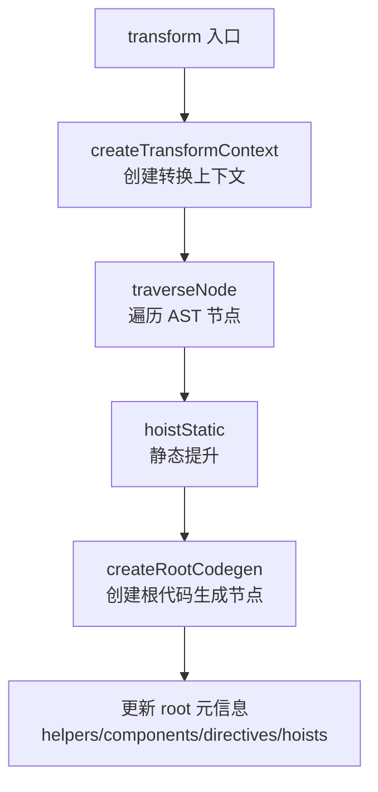

## 1. 生成 transform 上下文

在正式开始 `transform` 前，需要创建生成一个 `TransformContext`，即 `transform` 上下文。

```ts
export function createTransformContext(
  root: RootNode,
  options: TransformOptions
): TransformContext {
  const context: TransformContext = {
    // 选项配置
    hoistStatic: options.hoistStatic ?? false,
    cacheHandlers: options.cacheHandlers ?? false,
    nodeTransforms: options.nodeTransforms || [],
    directiveTransforms: options.directiveTransforms || {},
    transformHoist: options.transformHoist,
    // 状态数据
    root,
    helpers: new Map<symbol, number>(),
    components: new Set<string>(),
    directives: new Set<string>(),
    hoists: (options.hoists as HoistTransform[] | null) || [],
    imports: new Set<string>(),
    temps: 0,
    cached: 0,
    scopes: {
      vFor: 0,
      vSlot: 0,
      vPre: 0,
      vOnce: 0
    },
    parent: null,
    currentNode: null,
    childIndex: 0,
    // 一些函数
    helper(name: symbol) {
      const count = context.helpers.get(name) || 0
      context.helpers.set(name, count + 1)
      return name
    },
    removeHelper(name: symbol) {
      const count = context.helpers.get(name)
      if (count) {
        const currentCount = count - 1
        if (!currentCount) {
          context.helpers.delete(name)
        } else {
          context.helpers.set(name, currentCount)
        }
      }
    },
    helperString(name: symbol) {
      return `_${helperNameMap[context.helper(name)]}`
    },
    replaceNode(node: TemplateChildNode) {
      context.parent!.children[context.childIndex] = context.currentNode = node
    },
    removeNode(node?: TemplateChildNode) {
      const list = context.parent!.children
      const removalIndex = node
        ? list.indexOf(node)
        : context.childIndex
      if (!node || node === context.currentNode) {
        context.currentNode = null
        context.onNodeRemoved()
      } else {
        if (context.childIndex > removalIndex) {
          context.childIndex--
        }
        context.onNodeRemoved()
      }
      list.splice(removalIndex, 1)
    },
    onNodeRemoved: () => {},
    addIdentifiers(exp: ExpressionNode | string) { /* ... */ },
    removeIdentifiers(exp: ExpressionNode | string) { /* ... */ },
    hoist(exp: ExpressionNode | VNodeCall) {
      context.hoists.push(exp as HoistTransform)
      const identifier = createSimpleExpression(
        `_hoisted_${context.hoists.length}`,
        false,
        exp.loc,
        true
      )
      identifier.hoisted = exp
      return identifier
    },
    cache(exp: ExpressionNode, isVNode: boolean = false) { /* ... */ }
  }

  return context
}
```

可以看到这个上下文对象 `context` 内主要包含三部分：

| 类别 | 内容 | 说明 |
|------|------|------|
| 选项配置 | `hoistStatic`, `cacheHandlers`, `nodeTransforms`, `directiveTransforms` | 控制转换行为的配置项 |
| 状态数据 | `root`, `helpers`, `components`, `directives`, `hoists`, `temps`, `cached` | 转换过程中收集的信息 |
| 辅助函数 | `helper`, `replaceNode`, `removeNode`, `hoist` | 转换过程中使用的工具函数 |

## 2. 遍历AST节点

```ts
export function traverseNode(
  node: RootNode | TemplateChildNode,
  context: TransformContext
) {
  context.currentNode = node
  // 节点转换函数
  const { nodeTransforms } = context
  const exitFns: (() => void)[] = []
  for (let i = 0; i < nodeTransforms.length; i++) {
    // 执行节点转换函数，返回得到一个退出函数
    const onExit = nodeTransforms[i](node,%20context)
    // 收集所有退出函数
    if (onExit) {
      if (isArray(onExit)) {
        exitFns.push(...onExit)
      } else {
        exitFns.push(onExit)
      }
    }
    if (!context.currentNode) {
      // 节点被移除
      return
    } else {
      node = context.currentNode
    }
  }

  switch (node.type) {
    case NodeTypes.COMMENT:
      if (!context.ssr) {
        // context 中 helpers 添加 CREATE_COMMENT 辅助函数
        context.helper(CREATE_COMMENT)
      }
      break
    case NodeTypes.INTERPOLATION:
      // context 中 helpers 添加 TO_DISPLAY_STRING 辅助函数
      if (!context.ssr) {
        context.helper(TO_DISPLAY_STRING)
      }
      break
    case NodeTypes.IF:
      // 递归遍历每个分支节点
      for (let i = 0; i < node.branches.length; i++) {
        traverseNode(node.branches[i], context)
      }
      break
    case NodeTypes.IF_BRANCH:
    case NodeTypes.FOR:
    case NodeTypes.ELEMENT:
    case NodeTypes.ROOT:
      // 遍历子节点
      traverseChildren(node, context)
      break
  }

  context.currentNode = node
  // 执行上面收集到的所有退出函数
  let i = exitFns.length
  while (i--) {
    exitFns[i]()
  }
}
```

`traverseNode` 递归地遍历 `AST` 中的每个节点，然后执行一系列转换函数 `nodeTransforms`。这些转换函数就是我们上面介绍的通过 `getBaseTransformPreset` 生成的对象。值得注意的是：`nodeTransforms` 返回的是一个数组，说明这些转换函数是有序的，顺序代表着优先级关系。比如对于 `v-if` 的处理优先级就比 `v-for` 要高，因为如果条件不满足很可能有大部分内容都没必要进行转换。

另外，如果转换函数执行完成后，有返回退出函数 `onExit` 的话，那么会被统一存储到 `exitFns` 当中，在所有子节点处理完成后统一执行调用。这种设计模式被称为"进入-退出"模式，允许转换函数在进入节点时做一些准备工作，在退出节点时（子节点都处理完毕后）执行收尾工作。

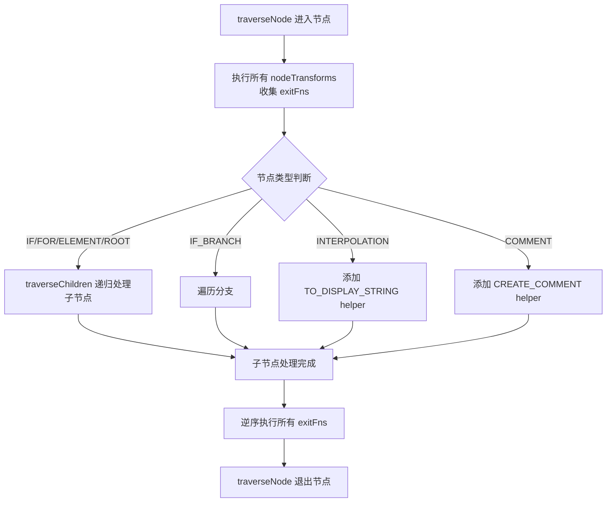

### transformElement

根据上文我们知道了对节点进行处理，就是通过一系列函数对节点的各个部分的内容分别进行处理。鉴于这些函数很多内容也很庞杂，我们拿其中一个函数 `transformElement` 进行分析，理解对 **AST** 的转化过程：

```ts
export const transformElement: NodeTransform = (node, context) => {
  return function postTransformElement() {
    // ...
    node.codegenNode = createVNodeCall(
      context,
      vnodeTag,
      vnodeProps,
      vnodeChildren,
      vnodePatchFlag,
      vnodeDynamicProps,
      vnodeDirectives,
      !!shouldUseBlock,
      false /* disableTracking */,
      isComponent,
      node.loc
    )
  }
}
```

可以看到，`transformElement` 的核心目的就是通过调用 `createVNodeCall` 函数获取 `VNodeCall` 对象，并赋值给 `node.codegenNode`。

到这里，我们就大致明白了，我们前面一直提到需要把 `AST` 转成 `JavaScript AST`，实际上就是给 `AST` 的 `codegenNode` 属性赋值。接下来，我们接着看 `createVNodeCall` 函数的实现：

```ts
export function createVNodeCall(
  context: TransformContext | null,
  tag: VNodeCall['tag'],
  props?: VNodeCall['props'],
  children?: VNodeCall['children'],
  patchFlag?: VNodeCall['patchFlag'],
  dynamicProps?: VNodeCall['dynamicProps'],
  directives?: VNodeCall['directives'],
  isBlock: VNodeCall['isBlock'] = false,
  disableTracking: VNodeCall['disableTracking'] = false,
  isComponent: VNodeCall['isComponent'] = false,
  loc: SourceLocation = locStub
): VNodeCall {
  if (context) {
    if (isBlock) {
      context.helper(OPEN_BLOCK)
      context.helper(getVNodeBlockHelper(context.inSSR, isComponent))
    } else {
      context.helper(getVNodeHelper(context.inSSR, isComponent))
    }
    if (directives) {
      context.helper(WITH_DIRECTIVES)
    }
  }

  return {
    type: NodeTypes.VNODE_CALL,
    tag,
    props,
    children,
    patchFlag,
    dynamicProps,
    directives,
    isBlock,
    disableTracking,
    isComponent,
    loc
  }
}
```

该函数也非常容易理解，本质就是为了返回一个 `VNodeCall` 对象，该对象是用来描述 `JS` 代码的。

这里的函数 `context.helper` 是会把一些 `Symbol` 对象添加到 `context.helpers` 的 `Map` 数据结构当中，在接下来的代码生成阶段，会判断当前 `JS AST` 中是否存在 `helpers` 内容，如果存在，则会根据 `helpers` 中标记的 `Symbol` 对象，来生成辅助函数。

接下来看一下之前的这样一个 `demo`：

```html
<template>
  <!-- 这是一段注释 -->
  <p>{{ msg }}</p>
</template>
```

经过遍历 `AST` 节点 `traverseNode` 函数调用之后的结果大致如下：

```json
{
  "type": 0,
  "children": [
    {
      "type": 1,
      "ns": 0,
      "tag": "p",
      "tagType": 0,
      "props": [],
      "isSelfClosing": false,
      "children": [],
      "loc": {},
      "codegenNode": {
        "type": 13,
        "tag": "\"p\"",
        "children": {
          "type": 5,
          "content": {
            "type": 4,
            "isStatic": false,
            "constType": 0,
            "content": "msg",
            "loc": {
              "start": {},
              "end": {},
              "source": "msg"
            }
          },
          "loc": {
            "start": {},
            "end": {},
            "source": "{{ msg }}"
          }
        },
        "patchFlag": "1 /* TEXT */",
        "isBlock": false,
        "disableTracking": false,
        "isComponent": false,
        "loc": {
          "start": {},
          "end": {},
          "source": "<p>{{ msg }}</p>"
        }
      }
    }
  ],
  "helpers": [],
  "components": [],
  "directives": [],
  "hoists": [],
  "imports": [],
  "cached": 0,
  "temps": 0,
  "loc": {
    "start": {},
    "end": {},
    "source": "\n  <p>{{ msg }}</p>\n"
  }
}
```

可以看到，相比原节点，转换后的节点无论是在语义化还是在信息上，都更加丰富，我们可以依据它在代码生成阶段生成所需的代码。

## 3. 静态提升

经过上一步的遍历 `AST` 节点后，我们接着来看一下静态提升做了哪些工作。

```ts
export function hoistStatic(root: RootNode, context: TransformContext) {
  walk(
    root,
    context,
    // 根节点是不可提升的
    isSingleElementRoot(root, root.children[0])
  )
}
```

`hoistStatic` 核心调用的就是 `walk` 函数：

```ts
function walk(
  node: ParentNode,
  context: TransformContext,
  doNotHoistNode: boolean = false
) {
  const { children } = node
  // 记录那些被静态提升的节点数量
  let hoistedCount = 0

  for (let i = 0; i < children.length; i++) {
    const child = children[i]
    // 普通元素节点可以被提升
    if (
      child.type === NodeTypes.ELEMENT &&
      child.tagType === ElementTypes.ELEMENT
    ) {
      // 根据 doNotHoistNode 判断是否可以提升
      // 设置 constantType 的值
      const constantType = doNotHoistNode
        ? ConstantTypes.NOT_CONSTANT
        : getConstantType(child, context)
      // constantType = CAN_SKIP_PATCH || CAN_HOIST || CAN_STRINGIFY
      if (constantType > ConstantTypes.NOT_CONSTANT) {
        // constantType = CAN_HOIST || CAN_STRINGIFY
        if (constantType >= ConstantTypes.CAN_HOIST) {
          // 可提升状态中，codegenNode.patchFlag = CACHED
          child.codegenNode!.patchFlag =
            PatchFlags.CACHED + (__DEV__ ? ` /* CACHED */` : ``)

          // 提升节点，将节点存储到转换上下文 context 的 hoist 数组中
          child.codegenNode = context.hoist(child.codegenNode!)
          // 提升节点数量自增 1
          hoistedCount++
          continue
        }
      } else {
        // 动态子节点可能存在一些静态可提升的属性
        const codegenNode = child.codegenNode!
        if (codegenNode.type === NodeTypes.VNODE_CALL) {
          // 判断 props 是否可提升
          const flag = getPatchFlag(codegenNode)
          if (
            (!flag ||
              flag === PatchFlags.NEED_PATCH ||
              flag === PatchFlags.TEXT) &&
            getGeneratedPropsConstantType(child, context) >=
              ConstantTypes.CAN_HOIST
          ) {
            // 提升 props
            const props = getNodeProps(child)
            if (props) {
              codegenNode.props = context.hoist(props)
            }
          }
          // 将节点的动态 props 添加到转换上下文对象中
          if (codegenNode.dynamicProps) {
            codegenNode.dynamicProps = context.hoist(codegenNode.dynamicProps)
          }
        }
      }
    }

    if (child.type === NodeTypes.ELEMENT) {
      // 组件是 slot 的情况
      const isComponent = child.tagType === ElementTypes.COMPONENT
      if (isComponent) {
        context.scopes.vSlot++
      }
      // 如果节点类型是组件，则进行递归判断操作
      walk(child, context)
      if (isComponent) {
        context.scopes.vSlot--
      }
    } else if (child.type === NodeTypes.FOR) {
      // 在循环节点中，只有一个子节点的情况下，不需要提升
      walk(child, context, child.children.length === 1)
    } else if (child.type === NodeTypes.IF) {
      for (let i = 0; i < child.branches.length; i++) {
        // 在 v-if 这样的条件节点上，如果也只有一个分支逻辑的情况
        walk(
          child.branches[i],
          context,
          child.branches[i].children.length === 1
        )
      }
    }
  }
  // 预字符串化
  if (hoistedCount && context.transformHoist) {
    context.transformHoist(children, context, node)
  }
}
```

该函数看起来比较复杂，其实就是通过 `walk` 这个递归函数，不断判断节点是否符合可以静态提升的条件：只有普通的元素节点是可以提升的。

如果满足条件，则会给节点的 `codegenNode` 属性中的 `patchFlag` 的值设置成 `PatchFlags.CACHED`。

接着执行转换器上下文中的 `context.hoist` 方法：

```ts
function hoist(exp: ExpressionNode | VNodeCall) {
  // 存储到 hoists 数组中
  context.hoists.push(exp)
  const identifier = createSimpleExpression(
    `_hoisted_${context.hoists.length}`,
    false,
    exp.loc,
    true
  )
  identifier.hoisted = exp
  return identifier
}
```

该函数的作用就是将这个可以被提升的节点存储到转换上下文 `context` 的 `hoists` 数组中。这个数组就是用来存储那些可被提升节点的列表。

接下来，分析为什么要做静态提升。如下模板所示：

```html
<div>
  <p>text</p>
</div>
```

在没有被提升的情况下其渲染函数相当于：

```js
import { createElementVNode as _createElementVNode, openBlock as _openBlock, createElementBlock as _createElementBlock } from "vue"

export function render(_ctx, _cache, $props, $setup, $data, $options) {
  return (_openBlock(), _createElementBlock("div", null, [
    _createElementVNode("p", null, "text")
  ]))
}
```

很明显，`p` 标签是静态的，它不会改变。但是如上渲染函数的问题也很明显，如果组件内存在动态的内容，当渲染函数重新执行时，即使 `p` 标签是静态的，那么它对应的 `VNode` 也会重新创建。

**所谓的"静态提升"，就是将一些静态的节点或属性提升到渲染函数之外**。如下面的代码所示：

```js
import { createElementVNode as _createElementVNode, openBlock as _openBlock, createElementBlock as _createElementBlock } from "vue"

const _hoisted_1 = /*#__PURE__*/_createElementVNode("p", null, "text", -1 /* CACHED */)
const _hoisted_2 = [
  _hoisted_1
]

export function render(_ctx, _cache, $props, $setup, $data, $options) {
  return (_openBlock(), _createElementBlock("div", null, _hoisted_2))
}
```

这就实现了减少 `VNode` 创建的性能消耗。

而这里的静态提升步骤生成的 `hoists`，会在 `codegenNode` 会在生成代码阶段帮助我们生成静态提升的相关代码。

### 预字符串化

注意到在 `walk` 函数结束时，进行了静态提升节点的"预字符串化"。什么是预字符串化？来看一个示例：

```html
<template>
  <p></p>
  ... 共 20+ 节点
  <p></p>
</template>
```

对于这样有大量静态提升的模版场景，如果不考虑"预字符串化"，那么生成的渲染函数将会包含大量的 `createElementVNode` 函数。假设如上模板中有大量连续的静态的 `p` 标签，此时渲染函数生成的结果如下：

```js
const _hoisted_1 = /*#__PURE__*/_createElementVNode("p", null, null, -1 /* CACHED */)
// ...
const _hoisted_20 = /*#__PURE__*/_createElementVNode("p", null, null, -1 /* CACHED */)
const _hoisted_21 = [
  _hoisted_1,
  // ...
  _hoisted_20,
]

export function render(_ctx, _cache, $props, $setup, $data, $options) {
  return (_openBlock(), _createElementBlock("div", null, _hoisted_21))
}
```

`createElementVNode` 大量连续性创建 `vnode` 也是挺影响性能的，所以可以通过"预字符串化"来一次性创建这些静态节点。采用预字符串化后，生成的渲染函数如下：

```js
const _hoisted_1 = /*#__PURE__*/_createStaticVNode("<p></p>...<p></p>", 20)
const _hoisted_21 = [
  _hoisted_1
]

export function render(_ctx, _cache, $props, $setup, $data, $options) {
  return (_openBlock(), _createElementBlock("div", null, _hoisted_21))
}
```

这样一方面降低了 `createElementVNode` 连续创建带来的性能损耗，也侧面减少了代码体积。关于 **预字符串化** 实现的细节函数 `transformHoist`，如需深入了解可自行查阅源码。

## 4. 创建根代码生成节点

介绍完了静态提升后，还剩最后一个 `createRootCodegen` 创建根代码生成节点，接下来分析 `createRootCodegen` 函数的实现：

```ts
function createRootCodegen(root: RootNode, context: TransformContext) {
  const { helper } = context
  const { children } = root
  if (children.length === 1) {
    const child = children[0]
    // 如果子节点是单个元素节点，则将其转换成一个 block
    if (isSingleElementRoot(root, child) && child.codegenNode) {
      const codegenNode = child.codegenNode
      if (codegenNode.type === NodeTypes.VNODE_CALL) {
        makeBlock(codegenNode, context)
      }
      root.codegenNode = codegenNode
    } else {
      root.codegenNode = child
    }
  } else if (children.length > 1) {
    // 如果子节点是多个节点，则返回一个 fragment 的代码生成节点
    let patchFlag = PatchFlags.STABLE_FRAGMENT
    let patchFlagText = PatchFlagNames[PatchFlags.STABLE_FRAGMENT]

    root.codegenNode = createVNodeCall(
      context,
      helper(FRAGMENT),
      undefined,
      root.children,
      patchFlag + (__DEV__ ? ` /* ${patchFlagText} */` : ``),
      undefined,
      undefined,
      true,
      undefined,
      false /* isComponent */
    )
  } else {
    // no children = noop. codegen will return null.
  }
}
```

我们知道，`Vue 3` 中是可以在 `template` 中写多个子节点的：

```html
<template>
  <p>1</p>
  <p>2</p>
</template>
```

`createRootCodegen`，核心就是创建根节点的 `codegenNode` 对象。所以当有多个子节点时，也就是 `children.length > 1` 时，调用 `createVNodeCall` 来创建一个新的 `fragment` 根节点 `codegenNode`。

否则，就代表着只有一个根节点，直接让根节点的 `codegenNode` 等于第一个子节点的 `codegenNode` 即可。

`createRootCodegen` 完成之后，接着把 `transform` 上下文在转换 `AST` 节点过程中创建的一些变量赋值给 `root` 节点对应的属性，这样方便在后续代码生成的过程中访问到这些变量。

```ts
root.helpers = [...context.helpers.keys()]
root.components = [...context.components]
root.directives = [...context.directives]
root.imports = context.imports
root.hoists = context.hoists
root.temps = context.temps
root.cached = context.cached
```

## Vue 3.4/3.5 Transform 阶段的新特性

虽然 `transform` 阶段的核心逻辑在 Vue 3.4/3.5 中没有发生重大变化，但一些新特性的引入影响了 SFC 的编译结果。

### v-bind 同名简写（Vue 3.4）

Vue 3.4 引入了 `v-bind` 的同名简写语法，当属性名和绑定的变量名相同时，可以省略属性值：

```html
<!-- 之前 -->
<div :id="id" :class="class" :style="style"></div>

<!-- Vue 3.4+ 同名简写 -->
<div :id :class :style></div>
```

这个特性在 `transformBind` 转换函数中得到了支持。编译后的结果：

```js
import { normalizeClass as _normalizeClass, normalizeStyle as _normalizeStyle, openBlock as _openBlock, createElementBlock as _createElementBlock } from "vue"

export function render(_ctx, _cache) {
  return (_openBlock(), _createElementBlock("div", {
    id: _ctx.id,
    class: _normalizeClass(_ctx.class),
    style: _normalizeStyle(_ctx.style)
  }, null, 14 /* CLASS, STYLE, PROPS */, ["id"]))
}
```

### defineOptions、defineSlots、defineModel（Vue 3.3+）

这些编译器宏在 SFC 编译阶段会被处理，它们会影响 `transform` 阶段的行为：

| 宏 | 功能 | 编译时处理 |
|---|------|----------|
| `defineOptions` | 定义组件选项（如 `name`、`inheritAttrs`） | 提取到组件定义中 |
| `defineSlots` | 类型安全的插槽定义 | 生成插槽类型声明 |
| `defineModel` | 双向绑定的语法糖 | 生成 `props` + `emit` 代码 |

`defineModel` 的编译示例：

```html
<script setup>
const modelValue = defineModel()
const title = defineModel('title', { required: true, default: '' })
</script>

<template>
  <input v-model="modelValue" />
  <input v-model="title" />
</template>
```

编译后生成的代码大致为：

```js
// 编译器生成的 props 定义
const props = defineProps({
  modelValue: {},
  title: { required: true, default: '' }
})

// 编译器生成的 emit 定义
const emit = defineEmits(['update:modelValue', 'update:title'])

// defineModel 返回的是一个可写的 computed
const modelValue = computed({
  get: () => props.modelValue,
  set: (val) => emit('update:modelValue', val)
})

const title = computed({
  get: () => props.title,
  set: (val) => emit('update:title', val)
})
```

这些宏的处理发生在 SFC 的 `<script setup>` 编译阶段，与模板的 `transform` 阶段协同工作，确保生成的渲染函数能正确引用这些编译器生成的变量。

## 总结

这里我们介绍了关于 `transform` 相关的知识，再来回顾一下，`transform` 节点的核心功能就是语法分析阶段，把 `AST` 节点做进一步转换，构造出语义化更强、信息更加丰富的 `codegenNode`。便于在下一小节 `generate` 中使用。

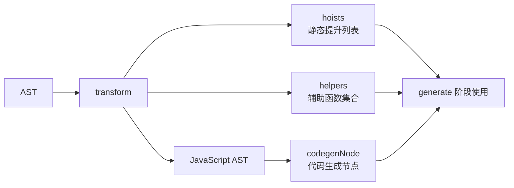

`transform` 阶段的核心产出：

| 产出 | 说明 |
|------|------|
| `codegenNode` | 每个节点的代码生成描述，包含 `tag`、`props`、`children`、`patchFlag` 等 |
| `helpers` | 需要从 Vue 运行时导入的辅助函数列表 |
| `hoists` | 可静态提升的节点列表，用于减少运行时 VNode 创建 |
| `components/directives` | 组件和指令的引用列表 |


---

## 前言

本小节，我们将进入模版编译的最后一步：**代码生成器 generate**。

```ts
generate(
  ast,
  extend({}, options, {
    prefixIdentifiers
  })
)
```

下面分析 `generate` 的核心实现：

```ts
export function generate(
  ast: RootNode,
  options: CodegenOptions = {}
): CodegenResult {
  // 创建代码生成上下文
  const context = createCodegenContext(ast, options)
  const {
    mode,
    push,
    prefixIdentifiers,
    indent,
    deindent,
    newline,
    scopeId,
    ssr
  } = context

  const hasHelpers = ast.helpers.length > 0
  const useWithBlock = !prefixIdentifiers && mode !== 'module'
  const genScopeId = !__BROWSER__ && scopeId != null && mode === 'module'
  const isSetupInlined = !__BROWSER__ && !!options.inline

  // 生成预设代码
  const preambleContext = isSetupInlined
    ? createCodegenContext(ast, options)
    : context
  // 不在浏览器的环境且 mode 是 module
  if (!__BROWSER__ && mode === 'module') {
    genModulePreamble(ast, preambleContext, genScopeId, isSetupInlined)
  } else {
    genFunctionPreamble(ast, preambleContext)
  }
  // 进入 render 函数构造
  const functionName = `render`
  const args = ['_ctx', '_cache']

  const signature = args.join(', ')

  push(`function ${functionName}(${signature}) {`)

  indent()

  if (useWithBlock) {
    // 处理带 with 的情况，Web 端运行时编译
    push(`with (_ctx) {`)
    indent()
    if (hasHelpers) {
      push(`const { ${ast.helpers.map(aliasHelper).join(', ')} } = _Vue`)
      push(`\n`)
      newline()
    }
  }

  // 生成自定义组件声明代码
  if (ast.components.length) {
    genAssets(ast.components, 'component', context)
    if (ast.directives.length || ast.temps > 0) {
      newline()
    }
  }
  // 生成自定义指令声明代码
  if (ast.directives.length) {
    genAssets(ast.directives, 'directive', context)
    if (ast.temps > 0) {
      newline()
    }
  }
  // 生成临时变量代码
  if (ast.temps > 0) {
    push(`let `)
    for (let i = 0; i < ast.temps; i++) {
      push(`${i > 0 ? `, ` : ``}_temp${i}`)
    }
  }
  if (ast.components.length || ast.directives.length || ast.temps) {
    push(`\n`)
    newline()
  }

  if (!ssr) {
    push(`return `)
  }

  // 生成创建 VNode 树的表达式
  if (ast.codegenNode) {
    genNode(ast.codegenNode, context)
  } else {
    push(`null`)
  }

  if (useWithBlock) {
    deindent()
    push(`}`)
  }

  deindent()
  push(`}`)

  return {
    ast,
    code: context.code,
    preamble: isSetupInlined ? preambleContext.code : ``,
    map: context.map ? (context.map as any).toJSON() : undefined
  }
}
```

这个函数看起来有些复杂，首先简要分析：`generate` 函数，接收两个参数，分别是经过转换器处理的 `ast` 抽象语法树，以及 `options` 代码生成选项。最终返回一个 `CodegenResult` 类型的对象：

```ts
interface CodegenResult {
  ast: RootNode           // 抽象语法树
  code: string            // render 函数代码字符串
  preamble: string        // 代码字符串的前置部分
  map?: RawSourceMap      // 可选的 sourceMap
}
```

接下来开始深入了解一下该函数的核心功能。

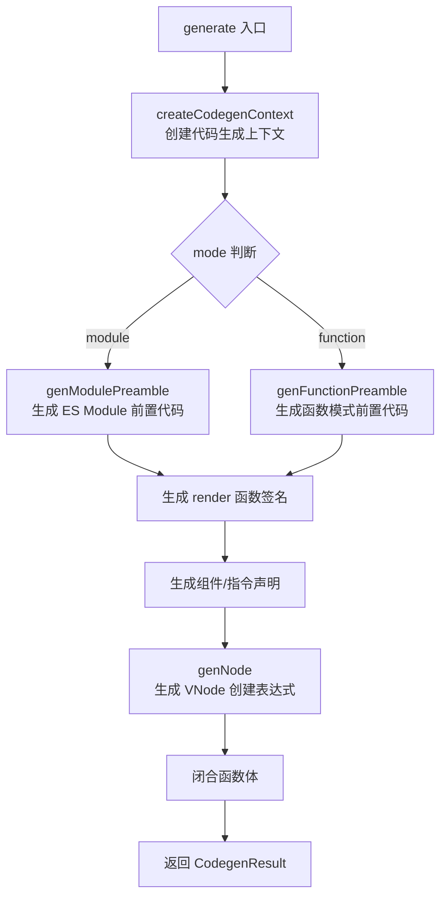

## 1. 创建代码生成上下文

`generate` 函数的第一步是通过 `createCodegenContext` 来创建 `CodegenContext` 上下文对象。下面分析其核心实现：

```ts
function createCodegenContext(
  ast: RootNode,
  {
    mode = 'function',
    prefixIdentifiers = mode === 'module',
    sourceMap = false,
    filename = `template.vue.html`,
    scopeId = null,
    optimizeBindings = false,
    runtimeGlobalName = `Vue`,
    runtimeModuleName = `vue`,
    ssr = false
  }: CodegenOptions
): CodegenContext {
  const context: CodegenContext = {
    mode,
    prefixIdentifiers,
    sourceMap,
    filename,
    scopeId,
    optimizeBindings,
    runtimeGlobalName,
    runtimeModuleName,
    ssr,
    source: ast.loc.source,
    code: ``,
    column: 1,
    line: 1,
    offset: 0,
    indentLevel: 0,
    pure: false,
    map: undefined,
    helper(key: symbol) {
      return `_${helperNameMap[key]}`
    },
    push(code: string, node?: SourceLocation) {
      context.code += code
      // ... 省略非浏览器环境下的 addMapping
    },
    indent() {
      newline(++context.indentLevel)
    },
    deindent(withoutNewLine = false) {
      if (withoutNewLine) {
        --context.indentLevel
      } else {
        newline(--context.indentLevel)
      }
    },
    newline() {
      newline(context.indentLevel)
    }
  }

  function newline(n: number) {
    context.push('\n' + `  `.repeat(n))
  }

  return context
}
```

可以看出 `createCodegenContext` 创建的 `context` 中，核心维护了一些基础配置变量和一些工具函数，下面列出几个比较常用的函数：

| 函数 | 功能 |
|------|------|
| `push(code)` | 将传入的字符串拼接入上下文中的 `code` 属性，并生成对应的 `sourceMap` |
| `indent()` | 增加缩进 |
| `deindent()` | 回退缩进 |
| `newline()` | 插入新的一行 |

其中，`indent`、`deindent`、`newline` 是用来辅助生成的代码字符串格式化的，让生成的代码字符串非常直观，就像在 IDE 中敲入的制表符、换行、格式化代码块一样。

在创建上下文变量完成后，接着进入生成预设代码的流程。

## 2. 生成预设代码

```ts
// 不在浏览器的环境且 mode 是 module
if (!__BROWSER__ && mode === 'module') {
  // 使用 ES module 标准的 import 来导入 helper 的辅助函数，处理生成代码的前置部分
  genModulePreamble(ast, preambleContext, genScopeId, isSetupInlined)
} else {
  // 否则生成的代码前置部分是一个单一的 const { helpers... } = Vue 处理代码前置部分
  genFunctionPreamble(ast, preambleContext)
}
```

`mode` 有两个选项：

| 模式 | 说明 |
|------|------|
| `module` | 通过 `ES module` 的 `import` 来导入 `ast` 中的 `helpers` 辅助函数，并用 `export` 默认导出 `render` 函数 |
| `function` | 生成一个单一的 `const { helpers... } = Vue` 声明，并且 `return` 返回 `render` 函数 |

先看一下 `genModulePreamble` 的实现：

```ts
function genModulePreamble(
  ast: RootNode,
  context: CodegenContext,
  genScopeId: boolean,
  inline: boolean
) {
  const {
    push,
    newline,
    optimizeImports,
    runtimeModuleName,
    ssrRuntimeModuleName
  } = context

  // ...

  if (ast.helpers.length) {
    if (optimizeImports) {
      // 生成 import 声明代码
      push(
        `import { ${ast.helpers
          .map(s => helperNameMap[s])
          .join(', ')} } from ${JSON.stringify(runtimeModuleName)}\n`
      )
      push(
        `\n// Binding optimization for webpack code-split\nconst ${ast.helpers
          .map(s => `_${helperNameMap[s]} = ${helperNameMap[s]}`)
          .join(', ')}\n`
      )
    } else {
      push(
        `import { ${ast.helpers
          .map(s => `${helperNameMap[s]} as _${helperNameMap[s]}`)
          .join(', ')} } from ${JSON.stringify(runtimeModuleName)}\n`
      )
    }
  }
  // 提升静态节点
  genHoists(ast.hoists, context)
  newline()

  if (!inline) {
    push(`export `)
  }
}
```

其中 `ast.helpers` 是在 `transform` 阶段通过 `context.helper` 方法添加的，它的值如下：

```js
[
  Symbol(createElementVNode),
  Symbol(toDisplayString),
  Symbol(Fragment),
  Symbol(openBlock),
  Symbol(createElementBlock)
]
```

所以这一步结束后，得到的代码为：

```js
import { createElementVNode as _createElementVNode, toDisplayString as _toDisplayString, Fragment as _Fragment, openBlock as _openBlock, createElementBlock as _createElementBlock } from "vue"
```

然后执行 `genHoists`：

```ts
function genHoists(hoists: (HoistTransform | null)[], context: CodegenContext) {
  if (!hoists.length) {
    return
  }
  context.pure = true
  const { push, newline } = context

  newline()
  hoists.forEach((exp, i) => {
    if (exp) {
      push(`const _hoisted_${i + 1} = `)
      genNode(exp, context)
      newline()
    }
  })

  context.pure = false
}
```

核心功能就是遍历 `ast.hoists` 数组，该数组是我们在 `transform` 的时候构造的，然后生成静态提升变量定义的方法。在进行 `hoists` 数组遍历的时候，这里有个 `genNode` 函数，是用来生成节点的创建字符串的，一起来看一下其实现：

```ts
function genNode(node: CodegenNode | string | symbol, context: CodegenContext) {
  if (isString(node)) {
    context.push(node)
    return
  }
  if (isSymbol(node)) {
    context.push(context.helper(node))
    return
  }
  // 根据 node 节点类型不同，调用不同的生成函数
  switch (node.type) {
    case NodeTypes.ELEMENT:
    case NodeTypes.IF:
    case NodeTypes.FOR:
      genNode(node.codegenNode!, context)
      break
    case NodeTypes.TEXT:
      genText(node, context)
      break
    case NodeTypes.SIMPLE_EXPRESSION:
      genExpression(node, context)
      break
    case NodeTypes.INTERPOLATION:
      genInterpolation(node, context)
      break
    case NodeTypes.TEXT_CALL:
      genNode(node.codegenNode, context)
      break
    case NodeTypes.COMPOUND_EXPRESSION:
      genCompoundExpression(node, context)
      break
    case NodeTypes.COMMENT:
      genComment(node, context)
      break
    case NodeTypes.VNODE_CALL:
      genVNodeCall(node, context)
      break

    case NodeTypes.JS_CALL_EXPRESSION:
      genCallExpression(node, context)
      break
    case NodeTypes.JS_OBJECT_EXPRESSION:
      genObjectExpression(node, context)
      break
    case NodeTypes.JS_ARRAY_EXPRESSION:
      genArrayExpression(node, context)
      break
    case NodeTypes.JS_FUNCTION_EXPRESSION:
      genFunctionExpression(node, context)
      break
    case NodeTypes.JS_CONDITIONAL_EXPRESSION:
      genConditionalExpression(node, context)
      break
    case NodeTypes.JS_CACHE_EXPRESSION:
      genCacheExpression(node, context)
      break
    case NodeTypes.JS_BLOCK_STATEMENT:
      genNodeList(node.body, context, true, false)
      break

    /* istanbul ignore next */
    case NodeTypes.IF_BRANCH:
      // noop
      break
    default:
  }
}
```

根据上一小节的 `demo`：

```html
<template>
  <p>hello world</p>
  <p>{{ msg }}</p>
</template>
```

我们经过 `transform` 后得到的 `AST` 内容大致如下：

| 属性 | 值 | 说明 |
|------|-----|------|
| `type` | `0` | ROOT 节点 |
| `children` | `[p节点, p节点]` | 两个子节点 |
| `helpers` | `[TO_DISPLAY_STRING, ...]` | 辅助函数列表 |
| `hoists` | `[静态p节点]` | 静态提升列表 |
| `codegenNode` | `VNODE_CALL` | 根节点的代码生成节点 |

其中 `hoists` 内容中存储的是 `<p>hello world</p>` 节点的信息，其中 `type = 13` 表示的是 `VNODE_CALL` 类型，进入 `genVNodeCall` 函数中：

```ts
function genVNodeCall(node: VNodeCall, context: CodegenContext) {
  const { push, helper, pure } = context
  const {
    tag,
    props,
    children,
    patchFlag,
    dynamicProps,
    directives,
    isBlock,
    disableTracking,
    isComponent
  } = node
  if (directives) {
    push(helper(WITH_DIRECTIVES) + `(`)
  }
  if (isBlock) {
    push(`(${helper(OPEN_BLOCK)}(${disableTracking ? `true` : ``}), `)
  }
  if (pure) {
    push(PURE_ANNOTATION)
  }
  const callHelper = isBlock
    ? getVNodeBlockHelper(context.inSSR, isComponent)
    : getVNodeHelper(context.inSSR, isComponent)
  push(helper(callHelper) + `(`, node)
  genNodeList(
    genNullableArgs([tag, props, children, patchFlag, dynamicProps]),
    context
  )
  push(`)`)
  if (isBlock) {
    push(`)`)
  }
  if (directives) {
    push(`, `)
    genNode(directives, context)
    push(`)`)
  }
}
```

在执行 `genVNodeCall` 函数时，因为 `directives` 不存在，`isBlock = false`，此时我们生成的代码内容如下：

```js
import { createElementVNode as _createElementVNode, toDisplayString as _toDisplayString, Fragment as _Fragment, openBlock as _openBlock, createElementBlock as _createElementBlock } from "vue"

const _hoisted_1 = /*#__PURE__*/_createElementVNode("p", null, "hello world", -1 /* CACHED */)
```

`genModulePreamble` 函数的最后，执行 `push('export')` 完成 `genModulePreamble` 的所有逻辑，得到以下内容：

```js
import { createElementVNode as _createElementVNode, toDisplayString as _toDisplayString, Fragment as _Fragment, openBlock as _openBlock, createElementBlock as _createElementBlock } from "vue"

const _hoisted_1 = /*#__PURE__*/_createElementVNode("p", null, "hello world", -1 /* CACHED */)

export
```

然后再看一下 `genFunctionPreamble` 函数，该函数的功能和 `genModulePreamble` 类似，就不再赘述，直接来看一下生成的结果：

```js
const _Vue = Vue
const { createElementVNode: _createElementVNode } = _Vue

const _hoisted_1 = /*#__PURE__*/_createElementVNode("p", null, "hello world", -1 /* CACHED */)

return
```

要注意以上代码仅仅是代码前置部分，还没有开始解析其他资源和节点，所以仅仅是到了 `export` 或者 `return` 就结束了。

## 3. 生成渲染函数

```ts
// 进入 render 函数构造
const functionName = `render`
const args = ['_ctx', '_cache']

const signature = args.join(', ')

push(`function ${functionName}(${signature}) {`)

indent()
```

这些代码还是比较好理解的，核心也是通过 `push` 函数，继续生成 `code` 字符串。看一下经过这个步骤后，我们的代码字符串变成的内容：

```js
import { createElementVNode as _createElementVNode, toDisplayString as _toDisplayString, Fragment as _Fragment, openBlock as _openBlock, createElementBlock as _createElementBlock } from "vue"

const _hoisted_1 = /*#__PURE__*/_createElementVNode("p", null, "hello world", -1 /* CACHED */)

export function render(_ctx, _cache) {
```

到这里，后面的内容也就不言而喻了，就是生成 `render` 函数的主体内容代码。我们先忽略对 `components`、`directives`、`temps` 代码块的生成，如需深入了解可在源码中调试。

我们知道之前的 `transform` 在处理节点内容时，会生成 `codegenNode` 对象，这个对象就是在这里被使用转换成代码字符串的：

```ts
if (ast.codegenNode) {
  genNode(ast.codegenNode, context)
} else {
  push(`null`)
}
```

上面的例子中，我们生产的模版节点的 `codegenNode` 内容如下：

| 属性 | 值 | 说明 |
|------|-----|------|
| `type` | `13` | VNODE_CALL 类型 |
| `tag` | `Symbol(Fragment)` | Fragment 标签 |
| `children` | `[静态p节点, 动态p节点]` | 子节点数组 |
| `patchFlag` | `64` | STABLE_FRAGMENT |
| `isBlock` | `true` | 是 Block 节点 |

其中 `type = 13` 表示的是 `VNODE_CALL` 类型，也进入 `genVNodeCall` 函数中。这里需要注意的是，因为我们 `template` 下包含了 2 个同级的标签，所以在 `transform` 阶段会创建一个 `patchFlag = STABLE_FRAGMENT` 这样一个根 `fragment` 的 `ast` 节点来包含 2 个 `p` 标签节点。

针对我们上面的示例，`directives` 没有，`isBlock` 是 `true`。那么经过 `genVNodeCall` 后生成的代码如下：

```javascript
import { createElementVNode as _createElementVNode, toDisplayString as _toDisplayString, Fragment as _Fragment, openBlock as _openBlock, createElementBlock as _createElementBlock } from "vue"

const _hoisted_1 = /*#__PURE__*/_createElementVNode("p", null, "hello world", -1 /* CACHED */)

export function render(_ctx, _cache) {
  return (_openBlock(), _createElementBlock(_Fragment, null, [
    _hoisted_1,
    _createElementVNode("p", null, _toDisplayString(_ctx.msg), 1 /* TEXT */)
  ], 64 /* STABLE_FRAGMENT */))
```

那么至此，根节点 `vnode` 树的表达式就创建好了。我们再回到 `generate` 函数，`generate` 函数的最后就是添加右括号 `}` 来闭合渲染函数，最终生成如下代码：

```js
import { createElementVNode as _createElementVNode, toDisplayString as _toDisplayString, Fragment as _Fragment, openBlock as _openBlock, createElementBlock as _createElementBlock } from "vue"

const _hoisted_1 = /*#__PURE__*/_createElementVNode("p", null, "hello world", -1 /* CACHED */)

export function render(_ctx, _cache) {
  return (_openBlock(), _createElementBlock(_Fragment, null, [
    _hoisted_1,
    _createElementVNode("p", null, _toDisplayString(_ctx.msg), 1 /* TEXT */)
  ], 64 /* STABLE_FRAGMENT */))
}
```

通过上述流程我们大致清楚了 `generate` 是 `compile` 阶段的最后一步，它的作用是将 `transform` 转换后的 `AST` 生成对应的可执行代码，从而在之后 `Runtime` 的 `Render` 阶段时，就可以通过可执行代码生成对应的 `VNode Tree`，然后最终映射为真实的 `DOM Tree` 在页面上。其中我们也省略了一些细节的介绍，但整体流程还是很容易理解的。

## 辅助函数详解

在代码生成过程中，会用到一系列辅助函数（helpers）。这些辅助函数在运行时提供了创建 VNode、处理文本显示等功能。以下是常用的辅助函数：

| 辅助函数 | 说明 | 使用场景 |
|---------|------|---------|
| `createElementVNode` | 创建元素 VNode | 静态/动态元素节点 |
| `createElementBlock` | 创建 Block VNode | 动态元素作为 Block |
| `createVNode` | 通用 VNode 创建 | 组件、Fragment 等 |
| `createBlock` | 创建 Block | v-if/v-for 等结构 |
| `openBlock` | 开启一个 Block | 每个 Block 开始时调用 |
| `toDisplayString` | 转换为显示字符串 | 插值表达式 |
| `Fragment` | Fragment 类型 | 多根节点模板 |
| `resolveComponent` | 解析组件 | 动态组件引用 |
| `resolveDirective` | 解析指令 | 自定义指令 |
| `withDirectives` | 应用指令 | 带指令的元素 |
| `createTextVNode` | 创建文本 VNode | 静态文本 |
| `createCommentVNode` | 创建注释 VNode | 注释节点 |

### genNode 各类型处理

`genNode` 函数根据节点类型分发到不同的生成函数：

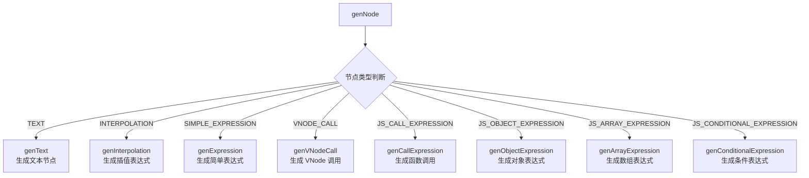

#### genText - 文本节点生成

```ts
function genText(node: TextNode, context: CodegenContext) {
  context.push(JSON.stringify(node.content), node)
}
```

对于文本节点 `hello world`，生成 `"hello world"`。

#### genInterpolation - 插值表达式生成

```ts
function genInterpolation(node: InterpolationNode, context: CodegenContext) {
  const { push, helper } = context
  push(`${helper(TO_DISPLAY_STRING)}(`)
  genNode(node.content, context)
  push(`)`)
}
```

对于插值 `{{ msg }}`，生成 `_toDisplayString(_ctx.msg)`。

#### genExpression - 表达式生成

```ts
function genExpression(node: SimpleExpressionNode, context: CodegenContext) {
  const { content, isStatic } = node
  if (isStatic) {
    context.push(JSON.stringify(content), node)
  } else {
    context.push(content, node)
  }
}
```

静态表达式直接输出字符串，动态表达式直接输出变量名。

#### genObjectExpression - 对象表达式生成

```ts
function genObjectExpression(node: ObjectExpression, context: CodegenContext) {
  const { push, indent, deindent, newline } = context
  const { properties } = node
  if (!properties.length) {
    push(`{}`, node)
    return
  }
  push(`{`)
  indent()
  for (let i = 0; i < properties.length; i++) {
    const { key, value } = properties[i]
    // gen key
    genNode(key, context)
    push(`: `)
    // gen value
    genNode(value, context)
    if (i < properties.length - 1) {
      push(`,`)
    }
    newline()
  }
  deindent()
  push(`}`)
}
```

对于 `{ class: cls, style: sty }`，生成：

```js
{
  class: _ctx.cls,
  style: _ctx.sty
}
```

## 总结

这里我们花了三个小节，整体介绍了一个模版字符串是如何一步步编译成 `render` 函数的。

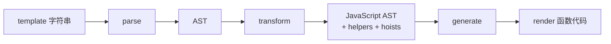

整个编译流程的三个阶段：

| 阶段 | 输入 | 输出 | 核心功能 |
|------|------|------|---------|
| `parse` | template 字符串 | AST | 词法分析 + 语法分析 |
| `transform` | AST | JavaScript AST | 语义转换 + 静态提升 |
| `generate` | JavaScript AST | render 函数代码 | 代码字符串生成 |

我们知道 `Vue` 相对于 `React` 的不同之处也是其支持 `<template>` 模版字符串的写法，虽然最终也是会被编译成渲染函数，也正是因为这个特性，可以让 `Vue` 在编译成渲染函数的期间做很多优化的事情。具体做了哪些优化，下一章节将详细介绍。


---

## 前言

在开启本篇章之前，我们先来思考一个问题，假设有以下模板：

```html
<template>
  <p>hello world</p>
  <p>{{ msg }}</p>
</template>
```

其中一个 `p` 标签的节点是一个静态的节点，第二个 `p` 标签的节点是一个动态的节点，如果当 `msg` 的值发生了变化，那么理论上最优的更新方案应该是只做第二个动态节点的 `diff`，而无需进行第一个 `p` 标签节点的 `diff`。

熟悉 `Vue 2.x` 的读者可能了解，在 `Vue 2.x` 版本中在编译过程中有一个叫做 `optimize` 的阶段，会进行标记静态根节点的操作，被标记为静态根节点的节点，一方面会生成一个 `staticRenderFns`，首次渲染会以这个静态根节点 `vnode` 进行缓存，后续渲染会直接取缓存中的，从而避免重复渲染；另一方面生成的 `vnode` 会带有 `isStatic = true` 的属性，将会在 `diff` 过程中被跳过。但 `Vue 2.x` 对静态节点进行缓存就是一种空间换时间的优化策略，为了避免过度优化，在 `Vue 2.x` 中，识别静态根节点是需要满足：

1. 子节点是静态节点；
2. 子节点不是只有一个静态文本节点的节点。

所以，上面的示例第一个 `p` 标签在 `Vue 2.x` 中不会被判定为静态根节点，也就无法进行优化。

> 关于 `Vue 2.x` 如何做的编译时优化，这里只是简单进行了介绍，如需深入了解可参考相关资料。

那么 `Vue 3` 是否也是如此？答案显然是否定的，首先前面介绍了对于静态的节点，`Vue 3` 首先会进行静态提升，也就是相当于缓存了静态节点的 `vnode`，那 `diff` 过程是否会跳过？本小节将深入分析。

## PatchFlags

### 是什么

首先，需要认识 `PatchFlags` 这个属性，它是一个枚举类型，里面是一些二进制操作的值，用来标记节点的 `patch` 类型。具体的枚举内容如下：

```ts
export const enum PatchFlags {
  // 动态文本的元素
  TEXT = 1,

  // 动态 class 的元素
  CLASS = 1 << 1,

  // 动态 style 的元素
  STYLE = 1 << 2,

  // 动态 props 的元素（非 class/style）
  PROPS = 1 << 3,

  // 动态 props 且有 key 值绑定的元素（需要全量 diff props）
  FULL_PROPS = 1 << 4,

  // 有事件绑定的元素
  NEED_HYDRATION = 1 << 5,

  // children 顺序确定的 fragment
  STABLE_FRAGMENT = 1 << 6,

  // children 中有带有 key 的节点的 fragment
  KEYED_FRAGMENT = 1 << 7,

  // 没有 key 的 children 的 fragment
  UNKEYED_FRAGMENT = 1 << 8,

  // 带有 ref、指令的元素
  NEED_PATCH = 1 << 9,

  // 动态的插槽
  DYNAMIC_SLOTS = 1 << 10,

  // 静态节点（被提升的）
  CACHED = -1,

  // 不是 render 函数生成的元素，如 renderSlot
  BAIL = -2,
}
```

这些二进制的值是通过左移操作符 `<<` 生成的，关于左移操作符，在[《响应式原理：副作用函数探秘》](https://juejin.cn/book/7146465352120008743/section/7147530994017370127)篇章中已经介绍过，此处也是一种二进制操作的体现：

```js
TEXT = 0000000001;
CLASS = 0000000010;
STYLE = 0000000100;
```

这里通过二进制来表示 `PatchFlags` 可以方便我们做很多属性的判断，比如 `TEXT | STYLE` 来得到 `0000000101`，表示 `patchFlag` 既有 `TEXT` 属性也有 `STYLE` 属性，当需要进行判断有没有 `STYLE` 属性时，只需要 `FLAG & STYLE > 0` 就行。

### 何时生成

在了解 `PatchFlags` 的一些定义和使用基础后，分析它是什么时候被赋值到 `vnode` 节点上的。前言中的模板字符串在 `compiler` 阶段会被转成一个 `render` 函数的字符串代码：

```js
import { createElementVNode as _createElementVNode, toDisplayString as _toDisplayString, Fragment as _Fragment, openBlock as _openBlock, createElementBlock as _createElementBlock } from "vue"

const _hoisted_1 = /*#__PURE__*/_createElementVNode("p", null, "hello world", -1 /* CACHED */)

export function render(_ctx, _cache) {
  return (_openBlock(), _createElementBlock(_Fragment, null, [
    _hoisted_1,
    _createElementVNode("p", null, _toDisplayString(_ctx.msg), 1 /* TEXT */)
  ], 64 /* STABLE_FRAGMENT */))
}
```

这里可以看出，`render` 函数内是通过 `createElementVNode` 方法来创建 `vnode` 的，该函数的第四个参数就代表着 `patchFlag`。对于我们上面的示例，其中 `<p>hello world</p>` 是 `hoisted`，对应的 `patchFlag = -1`，`<p>{{ msg }}</p>` 是动态文字节点，对应的 `patchFlag = 1`。

### 有什么用？

接下来看看其实际使用案例，还是拿之前的 `patchElement` 函数来说：

```ts
const patchElement = (
  n1: VNode,
  n2: VNode,
  parentComponent: ComponentInternalInstance | null,
  parentSuspense: SuspenseBoundary | null,
  isSVG: boolean,
  slotScopeIds: string[] | null,
  optimized: boolean
) => {
  let { patchFlag, dynamicChildren, dirs } = n2
  // 如果 patchFlag 不存在，那么就设置成 FULL_PROPS，意味着要全量 props 比对
  patchFlag |= n1.patchFlag & PatchFlags.FULL_PROPS
  const oldProps = n1.props || EMPTY_OBJ
  const newProps = n2.props || EMPTY_OBJ

  const areChildrenSVG = isSVG && n2.type !== 'foreignObject'
  if (dynamicChildren) {
    patchBlockChildren(
      n1.dynamicChildren!,
      dynamicChildren,
      n2.el as string,
      parentComponent,
      parentSuspense,
      areChildrenSVG,
      slotScopeIds
    )
  } else if (!optimized) {
    // full diff
    patchChildren(
      n1,
      n2,
      n2.el as string,
      null,
      parentComponent,
      parentSuspense,
      areChildrenSVG,
      slotScopeIds,
      false
    )
  }

  if (patchFlag > 0) {
    if (patchFlag & PatchFlags.FULL_PROPS) {
      // 如果元素的 props 中含有动态的 key，则需要全量比较
      patchProps(
        n2.el as string,
        n2,
        oldProps,
        newProps,
        parentComponent,
        parentSuspense,
        isSVG
      )
    } else {
      // class
      if (patchFlag & PatchFlags.CLASS) {
        if (oldProps.class !== newProps.class) {
          hostPatchProp(n2.el as string, 'class', null, newProps.class, isSVG)
        }
      }
      // style
      if (patchFlag & PatchFlags.STYLE) {
        hostPatchProp(n2.el as string, 'style', oldProps.style, newProps.style, isSVG)
      }

      // props
      if (patchFlag & PatchFlags.PROPS) {
        const propsToUpdate = n2.dynamicProps!
        for (let i = 0; i < propsToUpdate.length; i++) {
          const key = propsToUpdate[i]
          const prev = oldProps[key]
          const next = newProps[key]
          // #1471 force patch value
          if (next !== prev || key === 'value') {
            hostPatchProp(
              n2.el as string,
              key,
              prev,
              next,
              isSVG,
              n1.children as VNode[],
              parentComponent,
              parentSuspense,
              unmountChildren
            )
          }
        }
      }
    }

    // text
    if (patchFlag & PatchFlags.TEXT) {
      if (n1.children !== n2.children) {
        hostSetElementText(n2.el as string, n2.children as string)
      }
    }
  } else if (!optimized && dynamicChildren == null) {
    patchProps(
      n2.el as string,
      n2,
      oldProps,
      newProps,
      parentComponent,
      parentSuspense,
      isSVG
    )
  }
}
```

这里涉及到两个比较重点的事，一个是和 `dynamicChildren` 相关，另一个是和动态 `props` 相关。我们先看和动态 `props` 相关的内容。

之前的章节我们跳过了对 `PatchFlags` 内容的理解，到了这里，我们通过代码可以知道 `Vue` 在更新子节点时，首先也是利用 `patchFlag` 的能力，对子节点进行分类做出不同的处理，比如针对以下例子：

```html
<template>
  <div :class="classNames" id='test'>
    hello world
  </div>
</template>
```

得到的编译结果：

```js
import { normalizeClass as _normalizeClass, openBlock as _openBlock, createElementBlock as _createElementBlock } from "vue"

export function render(_ctx, _cache) {
  return (_openBlock(), _createElementBlock("div", {
    class: _normalizeClass(_ctx.classNames),
    id: "test"
  }, " hello world ", 2 /* CLASS */))
}
```

此时 `patchFlag & PatchFlags.CLASS > 0` 则在 `diff` 过程中，只需要进行 `class` 属性的 `diff`，从而减少了对 `id` 属性的不必要 `diff`，提升了 `props diff` 过程中的性能。

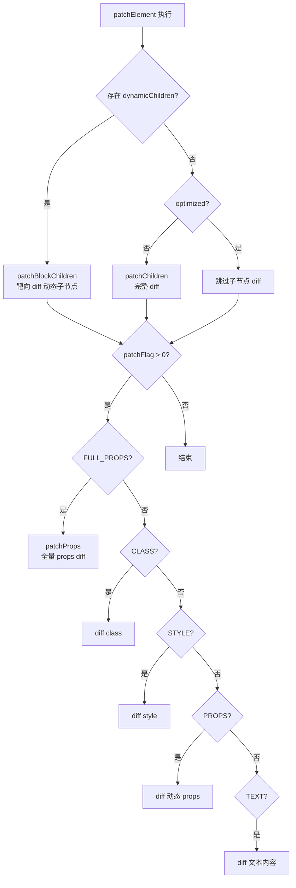

## dynamicChildren 与 Block Tree

另外，注意到在编译后的 `render` 函数中会有一个 `_openBlock()` 函数的执行，下面分析其实现：

```ts
export const blockStack: (VNode[] | null)[] = []
export let currentBlock: VNode[] | null = null

export function openBlock(disableTracking = false) {
  blockStack.push((currentBlock = disableTracking ? null : []))
}
```

`openBlock` 实现比较通俗易懂，就是向 `blockStack` 中 `push` `currentBlock`。其中 `currentBlock` 是一个数组，用于存储动态节点。`blockStack` 则是存储 `currentBlock` 的一个 Block Tree。

然后我们接着看 `createElementBlock` 的实现：

```ts
export function createElementBlock(
  type: string | VNodeTypes,
  props: Record<string, any> | null,
  children: VNodeTypes | VNodeTypes[],
  patchFlag: number,
  dynamicProps?: string[] | null,
  shapeFlag?: number
): VNode {
  return setupBlock(
    createBaseVNode(
      type,
      props,
      children,
      patchFlag,
      dynamicProps,
      shapeFlag,
      true /* isBlock */
    )
  )
}

function createBaseVNode(
  type: string | VNodeTypes,
  props: Record<string, any> | null = null,
  children: VNodeTypes | VNodeTypes[] | null = null,
  patchFlag: number = 0,
  dynamicProps: string[] | null = null,
  shapeFlag: number = type === Fragment ? 0 : ShapeFlags.ELEMENT,
  isBlockNode: boolean = false,
  needFullChildrenNormalization: boolean = false
): VNode {
  // ...
  // 添加动态 vnode 节点到 currentBlock 中
  if (
    isBlockTreeEnabled > 0 &&
    !isBlockNode &&
    currentBlock &&
    (vnode.patchFlag > 0 || shapeFlag & ShapeFlags.COMPONENT) &&
    vnode.patchFlag !== PatchFlags.NEED_HYDRATION
  ) {
    currentBlock.push(vnode)
  }

  return vnode
}

function setupBlock(vnode: VNode): VNode {
  // 在 vnode 上保留当前 Block 收集的动态子节点
  vnode.dynamicChildren =
    isBlockTreeEnabled > 0 ? currentBlock || EMPTY_ARR : null
  // 当前 Block 恢复到父 Block
  closeBlock()
  // 节点本身作为父 Block 收集的子节点
  if (isBlockTreeEnabled > 0 && currentBlock) {
    currentBlock.push(vnode)
  }
  return vnode
}
```

`createElementBlock` 内部首先通过 `createBaseVNode` 创建 `vnode` 节点，在创建的过程中，会根据 `patchFlag` 的值进行判断是否是动态节点，如果发现 `vnode` 是一个动态节点，那么会被添加到 `currentBlock` 当中，然后在执行 `setupBlock` 函数的时候，将 `currentBlock` 赋值给 `vnode.dynamicChildren` 属性。

我们前面看 `patchElement` 的时候，有注意到函数体内部会进行是否有 `dynamicChildren` 属性进行不同的逻辑执行，前面的章节，我们只介绍了 `patchChildren` 完整的子节点 `diff` 算法，当 `dynamicChildren` 存在时，这里只会进行 `patchBlockChildren` 的动态节点 `diff`：

```ts
const patchBlockChildren = (
  oldChildren: VNode[],
  newChildren: VNode[],
  fallbackContainer: string,
  parentComponent: ComponentInternalInstance | null,
  parentSuspense: SuspenseBoundary | null,
  isSVG: boolean
) => {
  for (let i = 0; i < newChildren.length; i++) {
    const oldVNode = oldChildren[i]
    const newVNode = newChildren[i]
    // 确定待更新节点的容器
    const container =
      // 对于 Fragment，我们需要提供正确的父容器
      oldVNode.type === Fragment ||
      // 在不同节点的情况下，将有一个替换节点，我们也需要正确的父容器
      !isSameVNodeType(oldVNode, newVNode) ||
      // 组件的情况，我们也需要提供一个父容器
      oldVNode.shapeFlag & ShapeFlags.COMPONENT
        ? hostParentNode(oldVNode.el!)
        :
        // 在其他情况下，父容器实际上并没有被使用，所以这里只传递 Block 元素即可
        fallbackContainer
    patch(oldVNode, newVNode, container, null, parentComponent, parentSuspense, isSVG, true)
  }
}
```

`patchBlockChildren` 的实现很简单，遍历新的动态子节点数组，拿到对应的新旧动态子节点，并执行 `patch` 更新子节点即可。

这样一来，更新的复杂度就变成和动态节点的数量正相关，而不与模板大小正相关。这也是 `Vue 3` 做的一个重要的编译时优化的一部分。

### Block Tree 的构建过程

为了更好地理解 Block Tree 的工作机制，来看一个更复杂的例子：

```html
<template>
  <div class="container">
    <h1>静态标题</h1>
    <p>{{ message }}</p>
    <div v-if="show">
      <span>{{ text }}</span>
    </div>
    <ul>
      <li v-for="item in list" :key="item.id">{{ item.name }}</li>
    </ul>
  </div>
</template>
```

编译后的渲染函数大致为：

```js
import { createElementVNode as _createElementVNode, createCommentVNode as _createCommentVNode, toDisplayString as _toDisplayString, Fragment as _Fragment, renderList as _renderList, openBlock as _openBlock, createElementBlock as _createElementBlock, createBlock as _createBlock } from "vue"

const _hoisted_1 = { class: "container" }
const _hoisted_2 = /*#__PURE__*/_createElementVNode("h1", null, "静态标题", -1 /* CACHED */)

export function render(_ctx, _cache) {
  return (_openBlock(), _createElementBlock("div", _hoisted_1, [
    _hoisted_2,
    _createElementVNode("p", null, _toDisplayString(_ctx.message), 1 /* TEXT */),
    _ctx.show
      ? (_openBlock(), _createBlock("div", { key: 0 }, [
          _createElementVNode("span", null, _toDisplayString(_ctx.text), 1 /* TEXT */)
        ]))
      : _createCommentVNode("v-if", true),
    _createElementVNode("ul", null, [
      (_openBlock(true), _createElementBlock(_Fragment, null, _renderList(_ctx.list, (item) => {
        return (_openBlock(), _createElementBlock("li", { key: item.id }, _toDisplayString(item.name), 1 /* TEXT */))
      }), 128 /* KEYED_FRAGMENT */))
    ])
  ]))
}
```

在这个例子中，Block Tree 的结构如下：

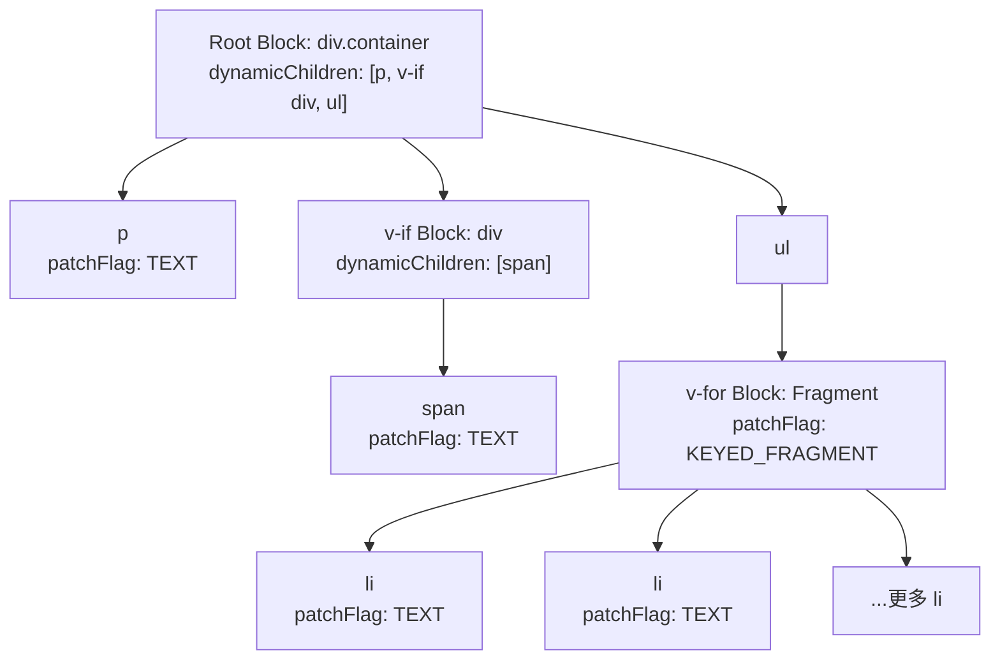

| 层级 | Block | 收集的 dynamicChildren | 说明 |
|------|-------|----------------------|------|
| 根 | `div.container` | `[p, v-if div, ul]` | 只收集直接动态子节点 |
| v-if | `div` | `[span]` | v-if 创建新的 Block |
| v-for | `Fragment` | `[li, li, ...]` | v-for 创建新的 Block |

关键点在于：每个 `v-if` 和 `v-for` 都会创建一个新的 Block，形成 Block Tree。每个 Block 只收集自己内部的动态子节点，不会跨 Block 收集。这样在 `diff` 时，每个 Block 只需要处理自己内部的动态节点。

## 靶向更新的完整流程

让我们把整个靶向更新的流程串起来，从前言的简单示例出发：

```html
<template>
  <p>hello world</p>
  <p>{{ msg }}</p>
</template>
```

### 编译阶段

编译器在 `transform` 阶段会为动态节点标记 `patchFlag`，在 `generate` 阶段生成带有 `_openBlock()` 和 `patchFlag` 的渲染函数代码。

### 运行时阶段

渲染函数执行时，`_openBlock()` 开启一个新的 Block 收集上下文，随后创建的每个 VNode 如果是动态的（`patchFlag > 0`），就会被收集到 `currentBlock` 中。当 Block 创建完成时，`setupBlock` 将收集到的动态节点列表赋值给 `vnode.dynamicChildren`。

转成 `vnode` 后的结果大致为：

```ts
const vnode = {
  type: Symbol(Fragment),
  children: [
    { type: 'p', children: 'hello world' },
    { type: 'p', children: ctx.msg, patchFlag: 1 /* TEXT */ },
  ],
  dynamicChildren: [
    { type: 'p', children: ctx.msg, patchFlag: 1 /* TEXT */ },
  ]
}
```

### 更新阶段

当 `msg` 发生变化触发更新时，`patchElement` 检测到 `dynamicChildren` 存在，直接进入 `patchBlockChildren`，只对 `dynamicChildren` 中的动态节点进行 `patch`，完全跳过静态节点 `<p>hello world</p>`。

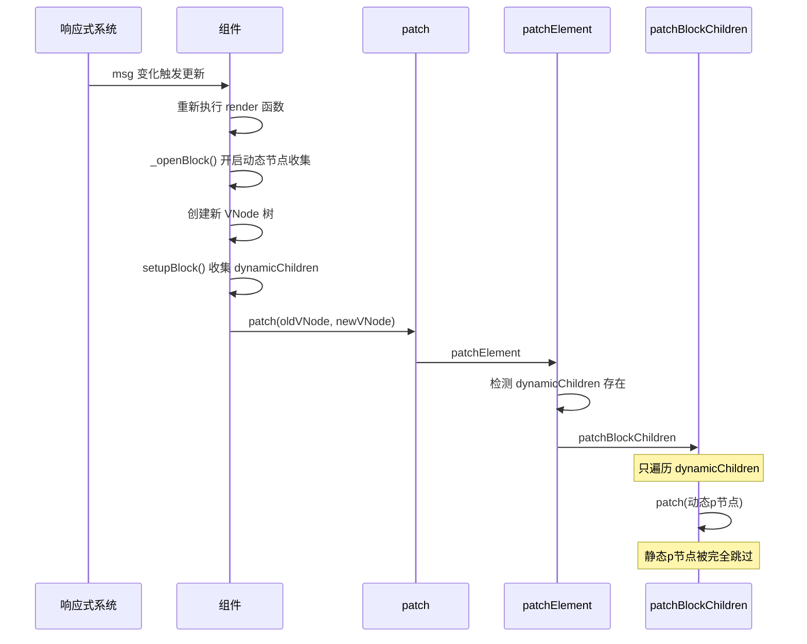

此时组件内存在了一个静态的节点 `<p>hello world</p>`，在传统的 `diff` 算法里，还是需要对该静态节点进行不必要的 `diff`。所以 `Vue 3` 先通过 `patchFlag` 来标记动态节点 `<p>{{ msg }}</p>`，然后配合 `dynamicChildren` 将动态节点进行收集，从而完成在 `diff` 阶段只做**靶向更新**的目的。

## Vue 3.5 编译优化的增强

Vue 3.5 在编译优化方面也做了一些重要的改进，进一步提升了运行时性能。

### 响应式 Props 解构

Vue 3.5 中最显著的编译优化之一是响应式 Props 解构。在 `<script setup>` 中解构的 `props` 现在是响应式的，不再需要使用 `toRefs` 或 `computed` 来保持响应性：

```html
<script setup>
// Vue 3.5+：解构的 props 是响应式的
const { count, msg } = defineProps(['count', 'msg'])
// 直接在模板中使用，保持响应性
</script>

<template>
  <p>{{ count }} - {{ msg }}</p>
</template>
```

编译器会将解构的 `props` 转换为编译时优化代码：

```js
// 编译器生成的代码（示意）
export default {
  props: ['count', 'msg'],
  setup(__props) {
    // 解构的 count/msg 在使用处被编译为对 __props 的属性访问
    // 模板/逻辑中每次访问 count，实际访问的都是 __props.count，从而保持响应性
    return (_ctx, _cache) => {
      return (_openBlock(), _createElementBlock("p", null,
        _toDisplayString(__props.count) + " - " + _toDisplayString(__props.msg),
        1 /* TEXT */
      ))
    }
  }
}
```

### 编译器生成的更精确的 PatchFlags

Vue 3.5 的编译器在生成 `patchFlag` 时更加精确，能够识别更多的优化场景：

| 场景 | Vue 3.4 patchFlag | Vue 3.5 patchFlag | 优化效果 |
|------|-------------------|-------------------|---------|
| 纯文本插值 `{{ msg }}` | `TEXT (1)` | `TEXT (1)` | 无变化 |
| class 绑定 `:class="cls"` | `CLASS (2)` | `CLASS (2)` | 无变化 |
| 多属性绑定 `:class :style` | `CLASS | STYLE (6)` | `CLASS | STYLE (6)` | 无变化 |
| v-bind 同名简写 `:id` | `PROPS (8)` | `PROPS (8)` | 更简洁的模板写法 |
| 纯静态属性 + 动态 class | `CLASS (2)` | `CLASS (2)` | 跳过静态属性 diff |

### 更高效的 Block 收集

Vue 3.5 对 Block 的动态节点收集机制进行了优化，减少了不必要的 Block 嵌套。在某些场景下，编译器能够识别出不需要创建新 Block 的情况，从而减少 `dynamicChildren` 数组的层级，降低 `patchBlockChildren` 的遍历开销。

## 编译优化的整体架构

让我们从全局视角来理解 Vue 3 编译优化的整体架构：

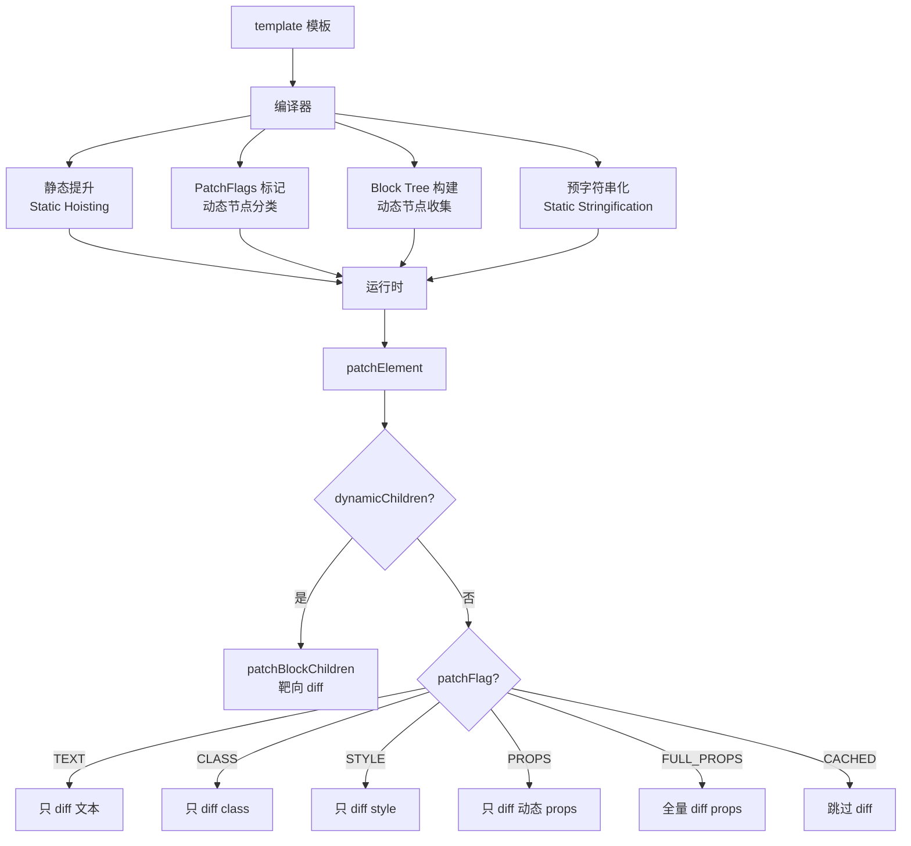

| 优化策略 | 编译时行为 | 运行时收益 |
|---------|----------|----------|
| 静态提升 | 将静态节点/属性提升到渲染函数外 | 避免重复创建 VNode |
| PatchFlags | 为动态节点标记具体的变更类型 | diff 时只比对标记的属性 |
| Block Tree | 收集动态子节点到 `dynamicChildren` | 跳过静态节点的 diff |
| 预字符串化 | 将连续静态节点合并为字符串 | 减少 VNode 创建和内存占用 |

## 总结

有了上面的一些介绍，我们还是回到前言的例子中：

```html
<template>
  <p>hello world</p>
  <p>{{ msg }}</p>
</template>
```

转成 `vnode` 后的结果大致为：

```ts
const vnode = {
  type: Symbol(Fragment),
  children: [
    { type: 'p', children: 'hello world' },
    { type: 'p', children: ctx.msg, patchFlag: 1 /* TEXT */ },
  ],
  dynamicChildren: [
    { type: 'p', children: ctx.msg, patchFlag: 1 /* TEXT */ },
  ]
}
```

此时组件内存在了一个静态的节点 `<p>hello world</p>`，在传统的 `diff` 算法里，还是需要对该静态节点进行不必要的 `diff`。所以 `Vue 3` 先通过 `patchFlag` 来标记动态节点 `<p>{{ msg }}</p>`，然后配合 `dynamicChildren` 将动态节点进行收集，从而完成在 `diff` 阶段只做**靶向更新**的目的。

Vue 3 的编译优化体系可以总结为三个核心层次：

1. **静态提升**：将静态节点和属性提升到渲染函数之外，避免每次渲染都重新创建 VNode
2. **PatchFlags**：为动态节点标记具体的变更类型（TEXT、CLASS、STYLE、PROPS 等），使得 diff 过程可以精确到属性级别
3. **Block Tree**：通过 `_openBlock()` / `setupBlock()` 构建动态节点收集树，使得 diff 过程可以完全跳过静态节点，只对 `dynamicChildren` 中的动态节点进行靶向更新

这三层优化相互配合，使得 Vue 3 的更新性能与模板中动态节点的数量成正比，而非与模板的整体大小成正比。这正是 Vue 3 相比 Vue 2 在性能上取得巨大提升的关键所在。
