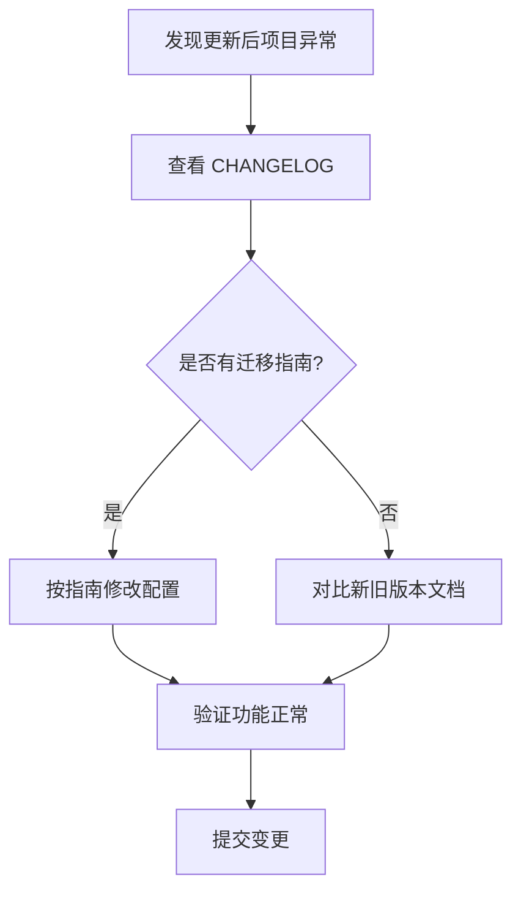

# NPM 包更新实践

## 概述

依赖更新是项目维护的常规工作，涉及安全修复、功能增强和兼容性保持。本文讲解语义化版本规则、主流更新工具的使用，以及版本更新导致项目异常时的排查与回退策略。

## 学习目标

- 掌握语义化版本号（SemVer）规则与版本范围符号
- 熟练使用 npm-check 进行交互式依赖更新
- 掌握版本更新导致异常时的回退与适配方案

---

## 一、语义化版本规则

### 1.1 版本号结构

```
MAJOR.MINOR.PATCH（如 3.4.2）

MAJOR：不兼容的 API 变更
MINOR：向后兼容的新功能
PATCH：向后兼容的 Bug 修复
```

### 1.2 版本范围符号

| 符号 | 含义 | 示例 |
|------|------|------|
| `^` | 允许 MINOR + PATCH 更新 | `^1.2.3` → `>=1.2.3 <2.0.0` |
| `~` | 仅允许 PATCH 更新 | `~1.2.3` → `>=1.2.3 <1.3.0` |
| 无符号 | 精确锁定 | `1.2.3` → 仅 1.2.3 |
| `*` | 任意版本 | 不推荐 |

---

## 二、更新工具对比

| 工具 | 特点 | 适用场景 |
|------|------|---------|
| npm-check | 交互式选择、直观 | 单项目手动更新 |
| npm-check-updates | 批量更新、可脚本化 | CI/CD 集成 |
| pnpm update | 官方命令、语义化更新 | 日常维护 |
| pnpm outdated | 仅查看不更新 | 检查现状 |

---

## 三、npm-check 实战

### 3.1 安装与使用

```bash
# 全局安装
pnpm add -g npm-check

# 查看可更新的包
npm-check

# 交互式更新
npm-check -u
```

### 3.2 交互操作

- 空格键：选中/取消选中要更新的包
- 回车键：确认更新选中的包
- Ctrl+C：取消操作

### 3.3 pnpm 内置命令

```bash
# 查看过期依赖
pnpm outdated

# 更新所有依赖（遵循 package.json 范围）
pnpm update

# 更新到最新版本（忽略 package.json 范围）
pnpm update --latest
```

---

## 四、版本更新问题处理

### 4.1 典型问题

MINOR 版本更新（如 0.13 → 0.18）可能导致：
- 配置文件格式变更
- API 不兼容
- 依赖树冲突

### 4.2 方案一：回退到稳定版本

```bash
# 安装指定版本
pnpm install -D package-name@0.13.0

# 锁定版本（去掉 ^ 前缀）
# package.json: "package-name": "0.13.0"
```

### 4.3 方案二：适配新版本



### 4.4 预防措施

| 策略 | 说明 |
|------|------|
| lock 文件 | 始终提交 pnpm-lock.yaml |
| 渐进更新 | 一次只更新一个 MAJOR 版本 |
| CI 验证 | 更新后跑完整测试套件 |
| 分支操作 | 在独立分支上执行更新 |

---

## 常见问题

**Q: `^0.x.y` 和 `^1.x.y` 的更新范围为什么不同？**

当 MAJOR 为 0 时（初始开发阶段），MINOR 变更被视为可能不兼容。`^0.13.0` 实际只允许 PATCH 更新（`>=0.13.0 <0.14.0`），这是 SemVer 规范的特殊约定。

**Q: pnpm update 和 npm-check -u 有什么区别？**

`pnpm update` 在 package.json 声明的范围内更新；`npm-check -u` 可以突破范围限制直接更新到最新版本，并修改 package.json 中的版本声明。

---

## 延伸阅读

- 上一篇：[前端项目初始化实践](01-前端项目初始化实践.md) — 项目搭建基础
- 下一篇：[Vue Router 基础回顾与改造思考](03-Vue-Router基础回顾与改造思考.md) — 路由系统
- 相关：[模块化](../../../03-JavaScript/07-ES6+新特性/08-模块化.md) — ESM/CJS 模块系统
