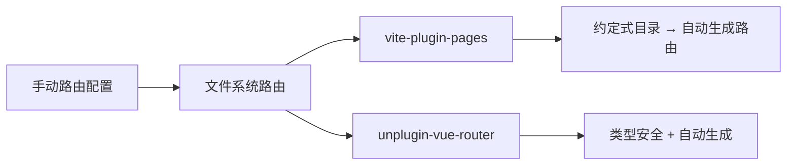

# Vue Router 基础回顾与改造思考

## 概述

Vue Router 是 Vue3 官方路由方案，支持动态匹配、嵌套路由、导航守卫等核心能力。本文回顾路由基础用法，并引出工程化改造的思考：当页面数量增长后，手动维护路由配置的成本如何优化。

## 学习目标

- 回顾 Vue Router 核心 API（动态路由、嵌套路由、导航守卫）
- 理解手动路由配置在大型项目中的痛点
- 了解文件系统路由的改造方向

---

## 一、基础配置回顾

### 1.1 核心组件

| 组件/API | 作用 |
|---------|------|
| `<router-link>` | 声明式导航，渲染为 `<a>` |
| `<router-view>` | 路由出口，渲染匹配组件 |
| `createRouter()` | 创建路由实例 |
| `createWebHistory()` | HTML5 History 模式 |

### 1.2 基本配置

```typescript
// router/index.ts
import { createRouter, createWebHistory } from 'vue-router'

const routes = [
  { path: '/', name: 'Home', component: () => import('@/views/Home.vue') },
  { path: '/about', name: 'About', component: () => import('@/views/About.vue') },
]

const router = createRouter({
  history: createWebHistory(),
  routes
})

export default router
```

---

## 二、动态路由匹配

### 2.1 路径参数

```typescript
{ path: '/user/:id', component: () => import('@/views/User.vue') }
```

```vue
<script setup lang="ts">
import { computed } from 'vue'
import { useRoute } from 'vue-router'
const route = useRoute()
const userId = computed(() => route.params.id)
</script>
```

### 2.2 匹配语法

| 语法 | 说明 | 示例 |
|------|------|------|
| `:param` | 匹配单段 | `/user/:id` → `/user/123` |
| `:param?` | 可选参数 | `/user/:id?` → `/user` 或 `/user/123` |
| `:param+` | 匹配一段或多段 | `/files/:path+` → `/files/a/b/c` |
| `:param*` | 匹配零段或多段 | `/files/:path*` → `/files` 或 `/files/a` |
| `(.*)` | 匹配所有（404） | `/:pathMatch(.*)*` |

---

## 三、嵌套路由

```typescript
{
  path: '/dashboard',
  component: () => import('@/layouts/Dashboard.vue'),
  children: [
    { path: '', component: () => import('@/views/dashboard/Index.vue') },
    { path: 'settings', component: () => import('@/views/dashboard/Settings.vue') },
  ]
}
```

父组件中需要包含 `<router-view />` 作为子路由出口。

---

## 四、导航守卫

### 4.1 全局前置守卫

```typescript
router.beforeEach((to, from, next) => {
  const isAuthenticated = !!localStorage.getItem('token')
  if (to.meta.requiresAuth && !isAuthenticated) {
    next('/login')
  } else {
    next()
  }
})
```

### 4.2 路由独享守卫

```typescript
{
  path: '/admin',
  component: Admin,
  beforeEnter: (to, from, next) => {
    if (!isAdmin()) next('/403')
    else next()
  }
}
```

### 4.3 组件内守卫

```vue
<script setup lang="ts">
import { onBeforeRouteLeave } from 'vue-router'

onBeforeRouteLeave((to, from, next) => {
  if (hasUnsavedChanges.value) {
    next(window.confirm('确定离开？未保存的更改将丢失。'))
  } else {
    next()
  }
})
</script>
```

---

## 五、工程化改造思考

### 5.1 手动配置的痛点

| 问题 | 说明 |
|------|------|
| 维护成本 | 每新增页面需手动添加路由记录 |
| 命名不一致 | 路径、组件名容易拼写错误 |
| 协作冲突 | 多人同时修改 router/index.ts |
| 懒加载遗漏 | 忘记使用动态 import 导致首屏过大 |

### 5.2 改造方向



后续两篇将分别讲解这两种自动化路由方案。

---

## 常见问题

**Q: History 模式和 Hash 模式如何选择？**

History 模式（`createWebHistory`）URL 更美观，但需要服务器配置 fallback；Hash 模式（`createWebHashHistory`）无需服务器配置，适合静态部署或无法修改服务器配置的场景。

**Q: 路由懒加载的 `/* webpackChunkName */` 注释在 Vite 中还有效吗？**

无效。Vite 使用 Rollup 打包，不解析 webpack 魔法注释。分包策略应通过 `build.rollupOptions.output.manualChunks` 配置，chunk 命名可用 `chunkFileNames`；`/* @vite-ignore */` 与分包无关，仅用于标注不希望 Vite 分析的动态 import。

---

## 延伸阅读

- 上一篇：[NPM 包更新实践](02-NPM包更新实践.md) — 依赖管理
- 下一篇：[vite-plugin-pages 自动路由方案](04-vite-plugin-pages自动路由方案.md) — 文件系统路由
- 相关：[路由基础与动态匹配](../06-生态系统/01-Vue-Router/01-路由基础与动态匹配.md) — Vue Router 完整教程
