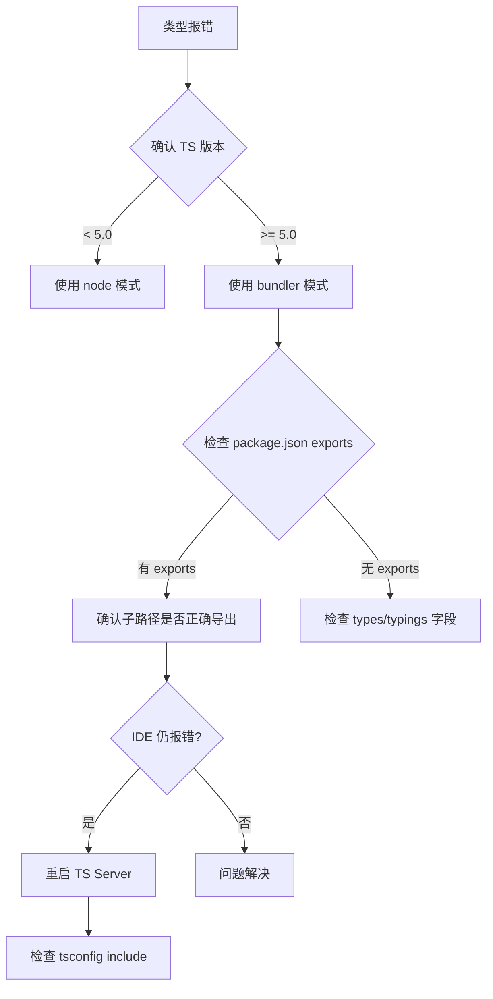

# 第三方库 TypeScript 集成问题排查

## 概述

集成第三方库时，TypeScript 模块解析策略（moduleResolution）的差异是类型报错的首要原因。本文以 unplugin-vue-router 的类型识别问题为案例，系统讲解 Classic / Node / Bundler 三种解析策略的原理与排查方法。

## 学习目标

- 理解 TypeScript 三种模块解析策略的工作原理
- 掌握 moduleResolution 配置对类型查找的影响
- 建立第三方库类型问题的系统排查方法论

---

## 一、问题场景

集成 unplugin-vue-router 后出现：
- `vue-router/auto` 导入路径红色波浪线
- 类型提示不生效
- 编译通过但 IDE 报错

根因：项目启用了 TypeScript 5.0 引入的 `bundler` 解析模式，而库的类型定义按 `node` 模式组织，两者对 `exports` 子路径的解析行为不一致。

---

## 二、Module Resolution 策略

### 2.1 三种策略对比

| 对比项 | Classic | Node | Bundler |
|--------|---------|------|---------|
| 非相对路径查找 | 向上遍历目录 | 查找 node_modules | 交给打包工具 |
| package.json exports | 不支持 | 不支持（node10 按主字段查找） | 完全支持 |
| TypeScript 版本 | 已废弃 | 4.x 推荐 | 5.0+ 推荐 |
| 适用场景 | 旧项目 | Node.js 项目 | Vite/Webpack 项目 |

### 2.2 Bundler 模式（TS 5.0+）

```json
{
  "compilerOptions": {
    "module": "ESNext",
    "moduleResolution": "bundler"
  }
}
```

特点：
- 支持 package.json 的 `exports` 和 `imports` 字段
- 不要求文件扩展名
- 模拟打包工具（Vite/Webpack）的解析行为
- 不支持 `require()`，仅 ESM

### 2.3 Node 模式

```json
{
  "compilerOptions": {
    "module": "ESNext",
    "moduleResolution": "node"
  }
}
```

特点：
- 模拟 Node.js 的 CommonJS 解析
- 按 `main` → `types` 字段查找
- 不支持 `exports` 子路径导出

---

## 三、排查方法论

### 3.1 排查流程



### 3.2 常见解决方案

| 问题 | 解决方案 |
|------|---------|
| 子路径导入报错 | 切换 `moduleResolution: "bundler"` |
| 类型文件找不到 | 安装 `@types/xxx` 或检查 `types` 字段 |
| IDE 报错但编译通过 | 重启 TS Server（Cmd+Shift+P） |
| 版本冲突 | 检查 `pnpm why typescript` 确认唯一版本 |

### 3.3 手动声明兜底

当库确实缺少类型定义时：

```typescript
// src/types/shims.d.ts
declare module 'some-untyped-lib' {
  const content: any
  export default content
}
```

---

## 四、预防措施

| 策略 | 说明 |
|------|------|
| 统一 TS 版本 | 团队锁定同一 TypeScript 版本 |
| 提交 tsconfig | 确保所有人使用相同解析策略 |
| 优先选有类型的库 | 查看是否有 `types` 字段或 `@types` 包 |
| 使用 bundler 模式 | 新项目统一使用 TS 5.0+ bundler 模式 |

---

## 常见问题

**Q: 为什么编译通过但 IDE 报错？**

IDE 使用的 TypeScript 版本可能与项目不同。确认 VS Code 右下角显示的 TS 版本，通过 `typescript.tsdk` 设置指向项目的 `node_modules/typescript/lib`。

**Q: bundler 模式和 node16 模式有什么区别？**

`node16` 模拟 Node.js 16+ 的 ESM/CJS 双模式解析，根据 package.json 的 `type` 字段区分模块类型，且要求相对导入显式写文件扩展名；`bundler` 模拟打包工具行为，不要求扩展名，更适合前端项目。

---

## 延伸阅读

- 上一篇：[unplugin-vue-router 类型安全路由方案](05-unplugin-vue-router类型安全路由方案.md) — 类型安全路由
- 下一篇：[UI 框架与 CSS 框架选型实践](07-UI框架与CSS框架选型实践.md) — UnoCSS 集成
- 相关：[TypeScript 集成](../04-原理与工程化/06-TypeScript集成.md) — Vue3 中的 TS 配置
