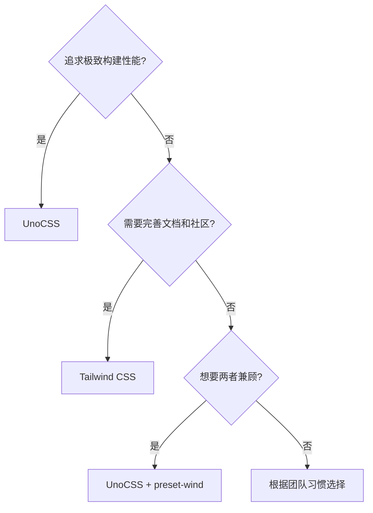

# UI 框架与 CSS 框架选型实践

## 概述

CSS 框架选型直接影响开发效率和产物性能。本文对比 Tailwind CSS、UnoCSS、Windi CSS 等主流方案，重点讲解 UnoCSS 的安装配置、预设系统和样式重置集成。

## 学习目标

- 理解原子化 CSS 的核心理念与各框架差异
- 掌握 UnoCSS 的安装、预设配置和自定义规则
- 学会根据项目需求进行 CSS 框架选型

---

## 一、主流 CSS 框架对比

| 框架 | 特点 | 构建速度 | 适用场景 |
|------|------|---------|---------|
| Tailwind CSS | 生态最完善、文档丰富 | 较慢 | 大型团队项目 |
| UnoCSS | 即时引擎、高度可定制 | 极快 | 性能敏感项目 |
| Windi CSS | Tailwind 兼容、更快 | 快 | 旧项目迁移（已停止维护） |
| Bootstrap | 组件化、预设样式 | - | 后台管理系统 |

### UnoCSS 核心优势

- **极速构建**：按需生成，无预编译扫描
- **零依赖**：核心引擎轻量，无运行时
- **高度可定制**：自定义规则、预设、主题
- **框架无关**：Vue / React / Svelte 通用
- **预设兼容**：`preset-wind` 兼容 Tailwind 语法

---

## 二、UnoCSS 安装与配置

### 2.1 安装

```bash
pnpm add -D unocss
pnpm add -D @unocss/reset  # 样式重置（可选）
```

### 2.2 Vite 插件

```typescript
// vite.config.ts
import UnoCSS from 'unocss/vite'

export default defineConfig({
  plugins: [
    vue(),
    UnoCSS(),
  ],
})
```

### 2.3 配置文件

```typescript
// uno.config.ts
import { defineConfig, presetUno, presetAttributify, presetIcons } from 'unocss'

export default defineConfig({
  presets: [
    presetUno(),          // 默认预设（类 Tailwind）
    presetAttributify(),  // 属性化模式
    presetIcons(),        // 图标支持
  ],
  shortcuts: {
    'btn': 'px-4 py-2 rounded bg-blue-500 text-white hover:bg-blue-600',
    'card': 'p-4 bg-white rounded shadow',
  },
  theme: {
    colors: {
      primary: '#3498db',
    }
  }
})
```

### 2.4 入口引入

```typescript
// main.ts
import 'virtual:uno.css'
import '@unocss/reset/tailwind.css'
```

---

## 三、使用方式

### 3.1 类名模式

```vue
<template>
  <div class="p-4 text-center">
    <h1 class="text-2xl font-bold text-primary">Hello</h1>
    <button class="btn mt-4">Click</button>
  </div>
</template>
```

### 3.2 属性化模式

```vue
<template>
  <div p-4 text-center>
    <h1 text-2xl font-bold>Hello</h1>
    <button class="btn" mt-4>Click</button>
  </div>
</template>
```

---

## 四、选型决策



---

## 常见问题

**Q: UnoCSS 和 Tailwind CSS 的类名兼容吗？**

使用 `presetWind()` 预设后，UnoCSS 兼容绝大部分 Tailwind CSS 类名。现有 Tailwind 项目可以较低成本迁移到 UnoCSS。

**Q: UnoCSS 如何处理未使用的样式？**

UnoCSS 是即时生成引擎，只生成代码中实际使用的类名对应 CSS。不存在"未使用样式"问题，天然实现 Tree-shaking。

---

## 延伸阅读

- 上一篇：[第三方库 TypeScript 集成问题排查](06-第三方库TypeScript集成问题排查.md) — 模块解析
- 下一篇：[VueUse 与自动导入配置实践](08-VueUse与自动导入配置实践.md) — 组合式工具库
- 官方文档：[UnoCSS](https://unocss.dev/)
