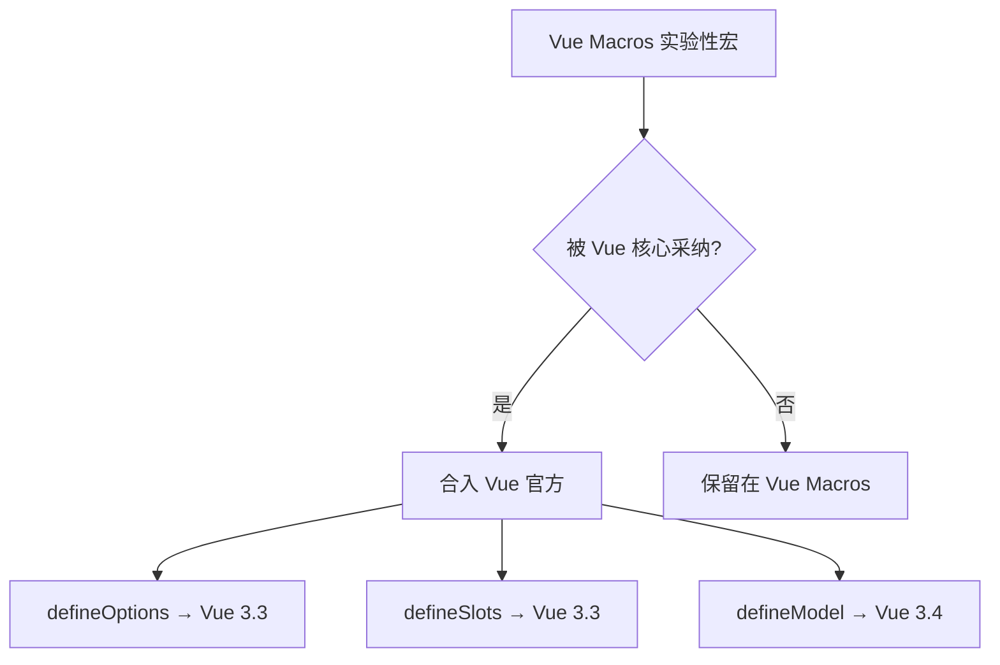

# Vue Macros 宏与语法糖扩展实践

## 概述

Vue Macros 是一个扩展 Vue SFC 语法的插件集合，提供 `defineModels`、`defineProp`、`defineRender` 等实验性宏，让组件编写更简洁。本文介绍核心宏的用法及集成方式。

## 学习目标

- 了解 Vue Macros 提供的语法扩展能力
- 掌握常用宏（defineModels、defineProp）的使用
- 理解实验性宏与 Vue 官方宏的关系

---

## 一、Vue Macros 概述

### 1.1 定位

Vue Macros 扩展了 Vue 编译器的宏系统，在 `<script setup>` 中提供更多编译时语法糖：

| 宏 | 作用 | 状态 |
|------|------|------|
| `defineModels` | 双向绑定模型声明 | 实验性 |
| `defineProp` | 单个 prop 声明（响应式） | 实验性 |
| `defineRender` | 渲染函数简写 | 实验性 |
| `defineOptions` | 组件选项声明 | 已合入 Vue 3.3 |
| `defineSlots` | 插槽类型声明 | 已合入 Vue 3.3 |

### 1.2 安装

```bash
pnpm add -D unplugin-vue-macros
```

### 1.3 Vite 配置

```typescript
// vite.config.ts
import VueMacros from 'unplugin-vue-macros/vite'
import vue from '@vitejs/plugin-vue'

export default defineConfig({
  plugins: [
    VueMacros({
      plugins: {
        vue: vue(),
      },
    }),
  ],
})
```

注意：使用 Vue Macros 时，`vue()` 需作为子插件传入，不再单独注册。

---

## 二、核心宏用法

### 2.1 defineModels

```vue
<script setup lang="ts">
const { modelValue, count } = defineModels<{
  modelValue: string
  count: number
}>()
</script>

<template>
  <input v-model="modelValue" />
  <button @click="count++">{{ count }}</button>
</template>
```

等价于 Vue 3.4 的 `defineModel()`：

```vue
<script setup>
const modelValue = defineModel<string>()
const count = defineModel<number>('count')
</script>
```

### 2.2 defineProp（Kevin 方案）

```vue
<script setup lang="ts">
// 声明单个 prop，返回响应式引用
const count = defineProp(0)  // 默认值 0
const title = defineProp<string>('Hello')
</script>

<template>
  <p>{{ title }}: {{ count }}</p>
</template>
```

### 2.3 defineRender

```vue
<script setup lang="ts">
const count = ref(0)

defineRender(() => (
  <button onClick={() => count.value++}>
    Count: {count.value}
  </button>
))
</script>
<!-- 无需 <template> 块 -->
```

---

## 三、与官方宏的关系



使用建议：
- Vue 3.4+ 项目优先使用官方 `defineModel`
- 需要更多实验性语法时引入 Vue Macros
- 生产项目谨慎使用实验性宏（API 可能变更）

---

## 常见问题

**Q: Vue Macros 和 Vue 官方宏冲突吗？**

不冲突。Vue Macros 会检测 Vue 版本，已合入官方的宏自动禁用，避免重复定义。

**Q: 是否适合生产环境使用？**

`defineOptions`、`defineSlots` 已稳定（合入官方）。其他实验性宏建议在小范围试用，关注版本更新日志。

---

## 延伸阅读

- 上一篇：[vite-plugin-vue-layouts 布局系统实践](12-vite-plugin-vue-layouts布局系统实践.md) — 布局系统
- 下一篇：[PWA 渐进式 Web 应用基础](14-PWA渐进式Web应用基础.md) — PWA 概念
- 官方文档：[Vue Macros](https://vue-macros.dev/)
