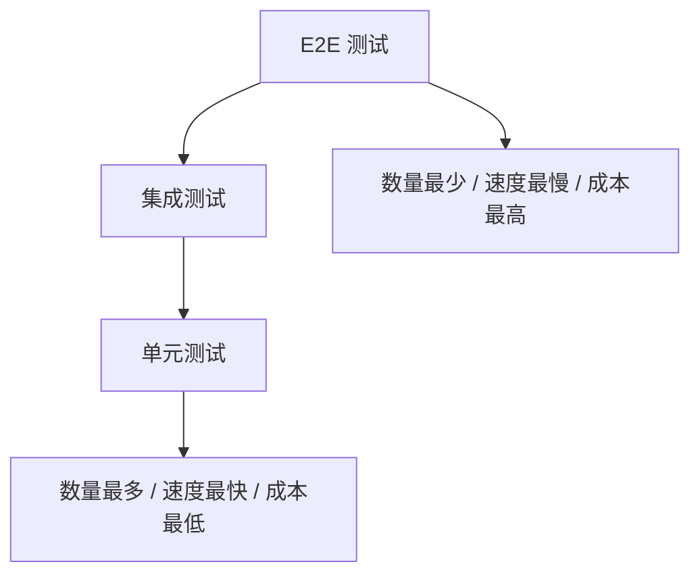

# 前端项目测试基础与工具选型

## 概述

前端测试是保障代码质量、支撑持续重构的自动化验证手段。本文梳理测试金字塔模型、单元测试与 E2E 测试的定位差异，并对主流测试框架（Vitest / Jest / Cypress / Playwright）进行选型分析。

## 学习目标

- 理解测试金字塔模型与各层测试的职责边界
- 掌握单元测试框架（Vitest / Jest / Mocha）的特点与适用场景
- 掌握 E2E 测试框架（Cypress / Playwright）的核心差异
- 能够为 Vite + Vue3 项目制定合理的测试策略

---

## 一、为什么需要前端测试

### 1.1 测试解决的核心问题

| 痛点 | 测试带来的价值 |
|------|---------------|
| 代码修改后手动验证耗时耗力 | 自动化验证，秒级反馈 |
| 重构担心破坏现有功能 | 回归保障，重构更自信 |
| 团队协作代码质量难以保证 | 统一质量标准，CI 门禁 |
| 边界情况难以全面覆盖 | 系统化用例设计 |
| 代码行为缺乏文档 | 测试用例即行为文档 |

### 1.2 测试金字塔模型



| 层级 | 测试对象 | 运行速度 | 数量占比 |
|------|---------|---------|---------|
| 单元测试 | 函数、组件、工具模块 | 毫秒级 | 70% |
| 集成测试 | 模块间交互、API 调用 | 秒级 | 20% |
| E2E 测试 | 完整用户流程 | 十秒级 | 10% |

### 1.3 测试分类

| 类型 | 说明 | 典型场景 |
|------|------|---------|
| 单元测试 | 测试最小可测试单元 | 工具函数、Vue 组件、Store |
| 集成测试 | 测试模块间交互 | 组件 + API、路由守卫 |
| E2E 测试 | 模拟用户真实操作 | 登录流程、表单提交 |
| 快照测试 | 对比 UI 输出变化 | 组件渲染结果回归 |

---

## 二、单元测试框架对比

### 2.1 主流框架一览

| 工具 | 核心特点 | 适用场景 |
|------|---------|---------|
| Vitest | Vite 原生、极速、兼容 Jest API | Vite 项目（推荐） |
| Jest | 成熟稳定、开箱即用、生态丰富 | React / 通用项目 |
| Mocha | 高度可配置、灵活组合 | 需要自定义配置的团队 |

### 2.2 Vitest vs Jest

| 特性 | Vitest | Jest |
|------|--------|------|
| Vite 配置共享 | 自动共享（插件、别名） | 需单独配置 transform |
| 启动速度 | 极快（< 1s） | 较慢（5-10s） |
| Watch 反馈 | 毫秒级（基于 Vite HMR） | 秒级（传统 watch 模式） |
| TypeScript | 开箱即用 | 需 babel/ts-jest |
| ESM 支持 | 原生 | 需实验性配置 |
| API 兼容性 | 兼容 Jest API | — |
| 生态成熟度 | 快速发展中 | 非常成熟 |

### 2.3 Jest 核心能力

```javascript
// 断言
expect(value).toBe(expected)            // 严格相等
expect(value).toEqual(expected)         // 深度相等
expect(value).toBeTruthy()              // 真值判断
expect(value).toBeCloseTo(0.3)          // 浮点近似
expect(arr).toContain(item)             // 包含
expect(fn).toThrow()                    // 抛出异常
expect(fn).toHaveBeenCalledWith(args)   // 调用参数

// Mock
jest.fn()                               // Mock 函数
jest.mock('./module')                   // Mock 模块
jest.useFakeTimers()                    // 定时器模拟
```

### 2.4 Mocha 组合模式

Mocha 本身只提供测试运行器，断言和 Mock 需自行组合：

```javascript
const chai = require('chai')      // 断言库
const sinon = require('sinon')    // Mock/Stub/Spy
const expect = chai.expect
```

适合对测试架构有特殊定制需求的团队，普通项目不推荐。

---

## 三、E2E 测试框架对比

### 3.1 主流框架一览

| 工具 | 核心特点 | 适用场景 |
|------|---------|---------|
| Cypress | 调试体验极佳、时间旅行、实时重载 | 单浏览器 Web 应用 |
| Playwright | 跨浏览器、多上下文隔离、Codegen | 多浏览器/跨平台测试 |
| Nightwatch | 基于 Selenium WebDriver | 遗留项目兼容 |
| Puppeteer | Chrome DevTools Protocol | Chrome 专项测试 |

### 3.2 Cypress vs Playwright

| 特性 | Cypress | Playwright |
|------|---------|------------|
| 浏览器支持 | Chromium 系为主 | Chromium + Firefox + WebKit |
| 架构 | In-browser（注入页面） | Out-of-process（CDP 控制） |
| 多标签/多域 | 不支持 | 原生支持 |
| 移动端模拟 | 有限 | 内置设备描述符 |
| 调试体验 | 时间旅行 + 实时重载 | Trace Viewer + Codegen |
| 自动等待 | 内置 | 内置 |
| 网络拦截 | 强大 | 强大 |
| 并行执行 | 需付费 Dashboard 或 CI 分片 | 内置 workers 并行 |

### 3.3 Cypress 示例

```javascript
// cypress/e2e/login.cy.js
describe('登录功能测试', () => {
  it('用户可以成功登录', () => {
    cy.visit('/login')
    cy.get('[data-cy=username]').type('user@example.com')
    cy.get('[data-cy=password]').type('password123')
    cy.get('[data-cy=login-button]').click()

    cy.url().should('include', '/home')
    cy.contains('欢迎回来').should('be.visible')
  })
})
```

---

## 四、Vite + Vue3 项目测试策略

### 4.1 推荐工具组合

```mermaid
graph LR
    A[Vite + Vue3 项目] --> B[Vitest 单元测试]
    A --> C[Playwright E2E 测试]
    B --> D[@vue/test-utils 组件测试]
    B --> E[happy-dom 轻量 DOM]
    C --> F[多浏览器覆盖]
```

| 层级 | 工具 | 说明 |
|------|------|------|
| 单元测试 | Vitest + @vue/test-utils | 共享 Vite 配置，零额外 transform |
| DOM 环境 | happy-dom | 比 jsdom 更轻量快速 |
| E2E | Playwright | 跨浏览器、内置并行、CI 友好 |
| 覆盖率 | v8 provider | Vitest 内置，无需额外依赖 |

### 4.2 测试目录规划

```
src/
├── utils/
│   ├── format.ts
│   └── format.test.ts        # 就近放置
├── components/
│   ├── Button.vue
│   └── __tests__/
│       └── Button.test.ts    # 或 __tests__ 目录
tests/
└── e2e/
    └── login.spec.ts         # E2E 独立目录
```

### 4.3 CI 集成要点

```yaml
# .github/workflows/test.yml
- name: Unit Tests
  run: pnpm vitest run --coverage

- name: E2E Tests
  run: npx playwright test

- name: Upload Coverage
  uses: codecov/codecov-action@v4
```

---

## 常见问题

**Q: Vitest 能完全替代 Jest 吗？**

对于 Vite 项目，Vitest 是更优选择。Jest 的优势在于生态成熟度和极端场景的稳定性。如果项目使用 webpack 构建，Jest 仍是稳妥方案。

**Q: E2E 测试应该覆盖多少场景？**

遵循测试金字塔原则：E2E 只覆盖核心用户路径（登录、下单、支付等），约占总用例 10%。细节逻辑由单元测试保障，避免 E2E 过多导致维护成本失控。

**Q: happy-dom 和 jsdom 怎么选？**

happy-dom 更轻量、启动更快，适合绝大多数组件测试。jsdom 的 DOM API 实现更完整，遇到 happy-dom 不支持的 API（如某些 SVG 操作）时切换。

---

## 延伸阅读

- 上一篇：[unplugin-vue-markdown Markdown 组件化实践](../08-Vite工程化实战/21-unplugin-vue-markdown-Markdown组件化实践.md) — Markdown 渲染
- 下一篇：[Vitest 单元测试实战](02-Vitest单元测试实战.md) — 单元测试落地
- 相关：[Vitest 现代测试](../../../03-JavaScript/15-前端测试/02-Vitest现代测试.md) — JavaScript 测试体系
