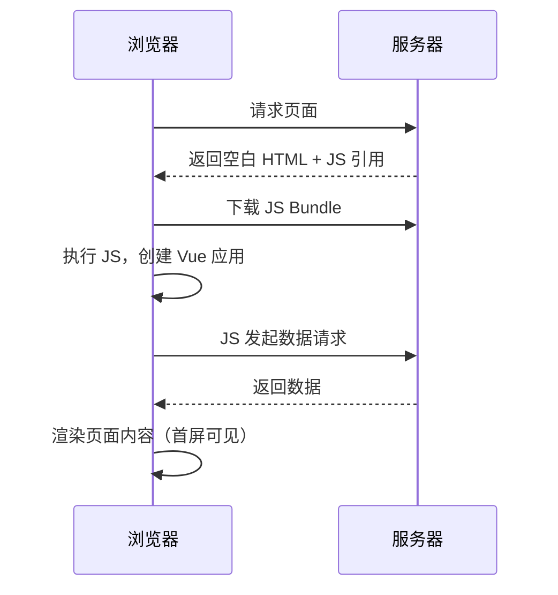
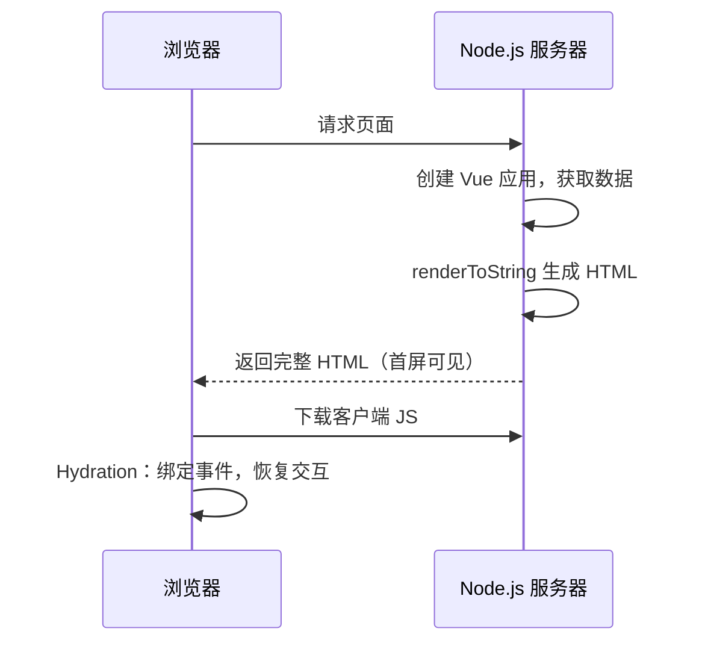
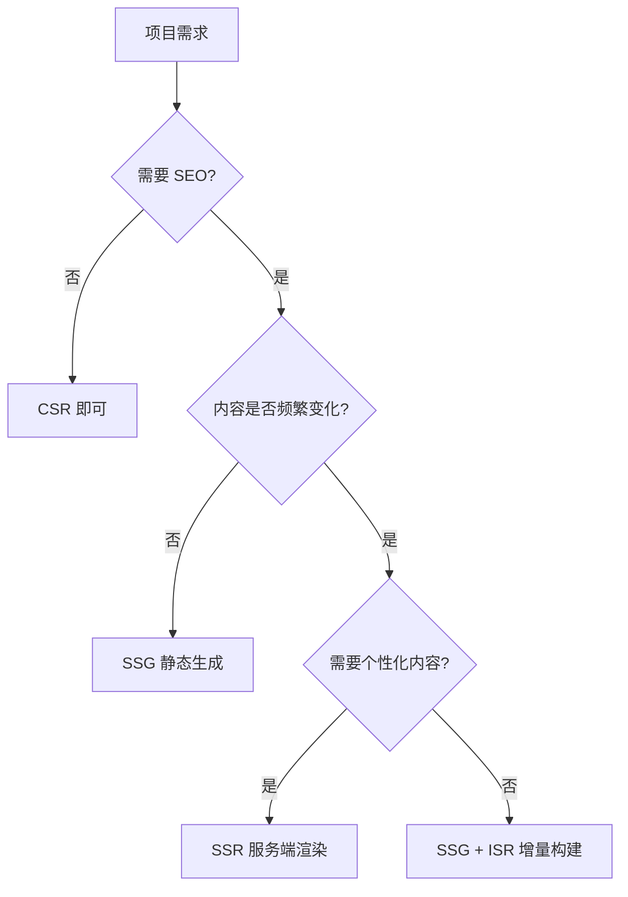

# 服务端渲染 SSR 基础概念

## 概述

服务端渲染（Server-Side Rendering）指 HTML 在服务器端生成并返回给浏览器，解决 CSR 应用首屏白屏和 SEO 不友好两大痛点。本文梳理 CSR / SSR / SSG 三种渲染模式的原理、优劣与选型依据。

## 学习目标

- 理解 CSR 与 SSR 的渲染流程差异
- 掌握 SSR 的优缺点及适用场景
- 了解 Hydration（注水）机制的含义
- 能够根据业务特征选择渲染方案

---

## 一、渲染模式对比

### 1.1 CSR 客户端渲染流程

问题：首屏白屏时间长、SEO 不友好、弱网体验差。

### 1.2 SSR 服务端渲染流程

优势：首屏直出、SEO 友好、弱网环境内容仍可见。

### 1.3 三种模式对比

| 特性 | CSR | SSR | SSG |
|------|-----|-----|-----|
| 渲染时机 | 浏览器运行时 | 每次请求时 | 构建时 |
| 首屏速度 | 慢（白屏） | 快 | 极快 |
| SEO | 不友好 | 友好 | 友好 |
| 服务器要求 | 静态服务器 | Node.js 服务器 | 静态服务器/CDN |
| 服务器压力 | 低 | 高 | 低 |
| 内容实时性 | 实时 | 实时 | 需重新构建 |
| 部署要求 | 简单 | 复杂 | 简单 |
| 典型框架 | Vite SPA | Nuxt3 | VitePress / Astro |

---

## 二、SSR 的优缺点

### 2.1 核心优势

| 维度 | 说明 |
|------|------|
| 首屏性能 | 用户立即看到完整内容，无白屏等待 |
| SEO | 搜索引擎可抓取完整 HTML，提升排名 |
| 社交分享 | Open Graph 标签正确渲染，平台预览正常 |
| 弱网体验 | 即使 JS 加载失败，内容仍可见 |
| 低端设备 | 渲染压力在服务器端，客户端负担小 |

### 2.2 核心代价

| 维度 | 说明 |
|------|------|
| 学习曲线 | 需掌握服务端开发、Hydration 机制、生命周期差异 |
| 服务器压力 | 每次请求都需 CPU 渲染页面 |
| 运维成本 | 需部署 Node.js 服务器，处理监控、日志、缓存 |
| 开发限制 | 服务端无 DOM/BOM API，第三方库兼容性问题 |
| TTFB | 服务器渲染耗时导致首字节时间变长 |

### 2.3 Hydration 机制

Hydration（注水/水合）是 SSR 的关键环节：

1. 服务器返回的 HTML 是"静态"的，无法响应用户交互
2. 浏览器加载客户端 JS 后，Vue 接管已有 DOM
3. 绑定事件监听器、恢复响应式状态
4. 页面从"可看"变为"可交互"

Hydration 完成前的时间窗口内，用户可见内容但无法操作（TTI 延迟）。

---

## 三、渲染方案选型

### 3.1 选型决策树

### 3.2 场景推荐

| 场景 | 推荐方案 | 理由 |
|------|---------|------|
| 后台管理系统 | CSR | 无 SEO 需求，交互密集 |
| 技术文档/博客 | SSG | 内容固定，构建时生成即可 |
| 企业官网 | SSG | 页面少、更新频率低 |
| 电商首页/商品详情 | SSR | 需 SEO + 实时库存价格 |
| 新闻资讯站 | SSR | 内容实时更新 + SEO |
| 社交平台 Feed | CSR | 强个性化，无 SEO 需求 |

---

## 四、Vue 生态 SSR 方案

| 方案 | 定位 | 特点 |
|------|------|------|
| vue/server-renderer | 底层 API | createSSRApp + renderToString |
| Vite SSR | Vite 原生支持 | 需自行实现服务端逻辑 |
| vite-plugin-ssr (Vike) | 类 Next.js 插件 | 约定式路由 + 数据获取 |
| Nuxt3 | 全功能框架 | 开箱即用，生态完善 |

学习路径建议：底层 API → Vite SSR → vite-plugin-ssr → Nuxt3，逐层理解原理后再使用高层框架。

---

## 常见问题

**Q: SSR 一定比 CSR 快吗？**

不一定。SSR 的"快"指首屏内容可见时间（FCP），但 TTFB 通常更长（服务器渲染耗时），且 Hydration 完成前页面不可交互。衡量标准应结合 LCP、TTI 等指标综合评估。

**Q: 为什么服务端不能使用 window/document？**

Node.js 环境没有浏览器 API。访问 `window`、`document`、`localStorage` 等会直接报错。需将这些操作放在 `onMounted` 或客户端专属代码路径中。

**Q: 所有页面都需要 SSR 吗？**

不需要。可以混合使用：公开页面（首页、详情）用 SSR 保证 SEO，登录后的功能页面用 CSR 降低服务器压力。Nuxt3 支持按路由配置渲染模式。

---

## 延伸阅读

- 上一篇：[Playwright 端到端测试框架](../09-前端测试实战/04-Playwright端到端测试框架.md) — E2E 测试
- 下一篇：[SSR 工作原理代码实现](02-SSR工作原理代码实现.md) — 手写 SSR
- 相关：Next.js — React 生态 SSR 框架
