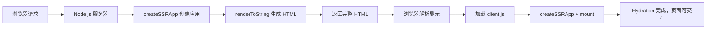
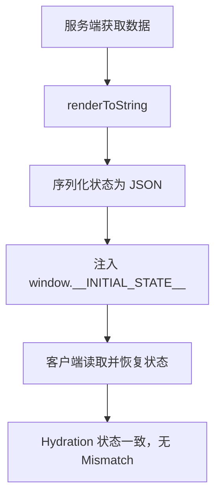

# SSR 工作原理代码实现

## 概述

本文从零实现一个最小 Vue3 SSR 应用：Node.js 服务器 + createSSRApp + renderToString + 客户端 Hydration，完整展示服务端渲染的代码级工作流程。

## 学习目标

- 掌握 createSSRApp 与 renderToString 的用法
- 理解服务端入口与客户端入口的职责划分
- 实现完整的 SSR → Hydration 闭环
- 理解服务端状态传递到客户端的机制

---

## 一、SSR 核心流程



---

## 二、服务端实现

### 2.1 项目结构

```
ssr-demo/
├── server.js       # 服务端入口（Node.js HTTP 服务器）
├── client.js       # 客户端入口（Hydration）
└── package.json    # type: "module"
```

### 2.2 服务端渲染 HTML

```javascript
// server.js
import { createSSRApp } from 'vue'
import { renderToString } from 'vue/server-renderer'
import { createServer } from 'http'
import fs from 'fs'
import path from 'path'
import { fileURLToPath } from 'url'

const __dirname = path.dirname(fileURLToPath(import.meta.url))

// 每次请求创建新实例，避免状态污染
function createApp() {
  return createSSRApp({
    data: () => ({ count: 1 }),
    template: `<button @click="count++">{{ count }}</button>`,
  })
}

createServer(async (req, res) => {
  if (req.url === '/') {
    // 1. 创建 Vue 应用实例
    const app = createApp()

    // 2. 渲染为 HTML 字符串
    const html = await renderToString(app)

    // 3. 返回完整 HTML 文档
    res.writeHead(200, { 'Content-Type': 'text/html' })
    res.end(`
      <!DOCTYPE html>
      <html>
        <head><title>SSR Demo</title></head>
        <body>
          <div id="app">${html}</div>
          <script type="module" src="/client.js"></script>
        </body>
      </html>
    `)
  } else if (req.url === '/client.js') {
    // 4. 响应客户端 JS 文件
    const filePath = path.join(__dirname, 'client.js')
    fs.readFile(filePath, 'utf-8', (err, data) => {
      if (err) {
        res.writeHead(404)
        res.end('Not Found')
        return
      }
      res.writeHead(200, { 'Content-Type': 'text/javascript' })
      res.end(data)
    })
  }
}).listen(3000, () => {
  console.log('Server running at http://localhost:3000/')
})
```

### 2.3 关键点解析

| 要点 | 说明 |
|------|------|
| createSSRApp | 创建支持 SSR 的应用实例（区别于 createApp） |
| renderToString | 将组件树序列化为 HTML 字符串 |
| 每请求新实例 | 避免跨请求状态污染（服务端单例问题） |
| `<div id="app">` | HTML 占位符，客户端 Hydration 的挂载点 |

---

## 三、客户端 Hydration

### 3.1 客户端入口

```javascript
// client.js
import { createSSRApp } from 'vue'

// 与服务端相同的组件定义
const app = createSSRApp({
  data: () => ({ count: 1 }),
  template: `<button @click="count++">{{ count }}</button>`,
})

// mount 时不重新渲染 DOM，而是"接管"已有 HTML
app.mount('#app')
```

> 注意：浏览器无法直接解析 `import { createSSRApp } from 'vue'` 这类裸模块导入。实际运行时需要用构建工具（如 esbuild / Vite）打包 client.js，或通过 import map 将 `vue` 指向 CDN 上的全量构建产物。

### 3.2 Hydration 的行为

1. Vue 发现 `#app` 内已有服务端渲染的 DOM
2. 不销毁重建，而是复用现有 DOM 节点
3. 绑定事件监听器（`@click="count++"`）
4. 建立响应式系统，页面变为可交互

如果客户端渲染结果与服务端 HTML 不匹配，Vue 会在开发环境发出 Hydration Mismatch 警告。

---

## 四、状态传递

### 4.1 问题：服务端数据如何到达客户端

服务端获取的数据（如 API 响应）渲染进了 HTML，但客户端 Hydration 时若重新初始化状态，会导致数据丢失或 Mismatch。

### 4.2 解决方案：序列化注入

```javascript
// server.js — 服务端
const app = createApp()
const store = createStore()          // 获取数据
await store.fetchData()

const html = await renderToString(app)
const stateScript = `<script>
  window.__INITIAL_STATE__ = ${JSON.stringify(store.state)}
</script>`

res.end(`
  <html>
    <body>
      <div id="app">${html}</div>
      ${stateScript}
      <script type="module" src="/client.js"></script>
    </body>
  </html>
`)
```

```javascript
// client.js — 客户端恢复状态
const initialState = window.__INITIAL_STATE__
const store = createStore()
store.replaceState(initialState)      // 恢复服务端状态

app.mount('#app')
```

### 4.3 流程总结



---

## 五、原始方案的局限

| 问题 | 说明 |
|------|------|
| 无路由系统 | 需手动匹配 URL 渲染不同组件 |
| 无构建流程 | 不支持 .vue SFC、TypeScript |
| 状态管理原始 | 手动序列化/反序列化 |
| 无 HMR | 服务端代码修改需重启 |
| 组件复用困难 | 每个页面独立创建实例 |

这些局限正是 Vite SSR 和 vite-plugin-ssr / Nuxt3 等方案要解决的问题。

---

## 常见问题

**Q: createSSRApp 和 createApp 有什么区别？**

`createSSRApp` 创建的实例在客户端 mount 时执行 Hydration（复用 DOM），而 `createApp` 会清空目标容器重新渲染。服务端渲染必须使用 `createSSRApp`。

**Q: 为什么每次请求都要创建新的应用实例？**

Node.js 服务器是长期运行的单进程。如果复用同一个实例，前一个请求的状态会泄漏到下一个请求（如用户 A 的数据出现在用户 B 的页面中）。

**Q: Hydration Mismatch 常见原因有哪些？**

- 使用了 `Date.now()`、`Math.random()` 等不确定值
- 服务端无 `window` 导致条件分支不同
- 浏览器扩展修改了 DOM 结构
- 服务端与客户端时区不一致

---

## 延伸阅读

- 上一篇：[服务端渲染 SSR 基础概念](01-服务端渲染SSR基础概念.md) — 渲染模式概览
- 下一篇：[Vite SSR 与 vite-plugin-ssr 方案](03-Vite-SSR与vite-plugin-ssr方案.md) — 工程化 SSR
- 官方文档：[Vue SSR 指南](https://cn.vuejs.org/guide/scaling-up/ssr.html)
