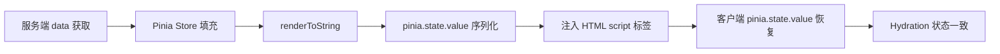

# vite-plugin-ssr 实战集成

## 概述

本文以 Pinia 状态管理为例，讲解 vite-plugin-ssr 项目中的状态集成：服务端创建 Store、渲染后序列化状态、通过 passToClient 传递、客户端恢复状态，完成 SSR 状态闭环。

## 学习目标

- 掌握 vite-plugin-ssr 项目中 Pinia 的集成方式
- 理解 SSR 状态传递的完整链路（服务端 → HTML → 客户端）
- 学会配置 passToClient 避免状态丢失
- 掌握 Layout 布局与页面组合的实践模式

---

## 一、Pinia Store 定义

### 1.1 创建 Store

```typescript
// stores/useCounter.ts
import { defineStore } from 'pinia'

export const useCounterStore = defineStore('counter', {
  state: () => ({
    count: 0,
  }),
  actions: {
    increment() {
      this.count++
    },
    decrement() {
      this.count--
    },
  },
  getters: {
    doubleCount: (state) => state.count * 2,
  },
})
```

### 1.2 组件中使用

```vue
<!-- components/Counter.vue -->
<template>
  <div>
    <p>Count: {{ counter.count }}</p>
    <p>Double: {{ counter.doubleCount }}</p>
    <button @click="counter.increment()">+1</button>
    <button @click="counter.decrement()">-1</button>
  </div>
</template>

<script setup lang="ts">
import { useCounterStore } from '@/stores/useCounter'

const counter = useCounterStore()
</script>
```

---

## 二、SSR 状态传递

### 2.1 问题：状态丢失

Pinia 状态在服务端创建并渲染进 HTML，但客户端 Hydration 时重新初始化 Store，导致：

- 计数器归零，与服务端 HTML 不一致
- 触发 Hydration Mismatch 警告
- 错误提示：`initial store state is missing in the passToClient list`

### 2.2 服务端：序列化状态

```javascript
// renderer/_default.page.server.js
import { renderToString } from 'vue/server-renderer'
import { escapeInject } from 'vite-plugin-ssr/server'
import { createPinia } from 'pinia'
import { createApp } from './app'

// 声明需要传递到客户端的 pageContext 属性
export const passToClient = ['initialState', 'pageProps']

export { render }

async function render(pageContext) {
  const pinia = createPinia()
  // 应用工厂返回 { app, router }
  const { app } = createApp(pageContext)
  app.use(pinia)

  const pageHtml = await renderToString(app)

  return {
    documentHtml: escapeInject`<!DOCTYPE html>
      <html>
        <body>
          <div id="app">${pageHtml}</div>
        </body>
      </html>`,
    pageContext: {
      // 渲染完成后，Pinia 中已有服务端数据
      initialState: pinia.state.value,
    },
  }
}
```

### 2.3 客户端：恢复状态

```javascript
// renderer/_default.page.client.js
import { createPinia } from 'pinia'
import { createApp } from './app'

export { onRenderClient }

async function onRenderClient(pageContext) {
  const pinia = createPinia()

  // 恢复服务端序列化的状态
  if (pageContext.initialState) {
    pinia.state.value = pageContext.initialState
  }

  // 应用工厂返回 { app, router }
  const { app } = createApp(pageContext)
  app.use(pinia)
  app.mount('#app')
}
```

### 2.4 状态传递链路



---

## 三、应用工厂

### 3.1 共享入口

```typescript
// renderer/app.ts
import { createSSRApp } from 'vue'
import { createRouter } from './router'
import App from './App.vue'

export function createApp(pageContext: { Page: any; pageProps?: any }) {
  const app = createSSRApp(App)
  const router = createRouter()

  app.use(router)
  app.provide('pageContext', pageContext)

  return { app, router }
}
```

### 3.2 根组件

```vue
<!-- renderer/App.vue -->
<template>
  <Layout>
    <Page />
  </Layout>
</template>

<script setup lang="ts">
import { inject, computed } from 'vue'
import Layout from './Layout.vue'

const pageContext = inject('pageContext') as any
const Page = computed(() => pageContext.Page)
</script>
```

---

## 四、数据获取实践

### 4.1 页面级 data()

```typescript
// pages/index.page.server.ts

export { data }

async function data(pageContext: any) {
  // 服务端数据预取
  const articles = await fetchArticles()
  return { articles }
}
```

### 4.2 页面组件消费

```vue
<!-- pages/index.page.vue -->
<template>
  <div>
    <h1>首页</h1>
    <Counter />
    <ul>
      <li v-for="article in articles" :key="article.id">
        {{ article.title }}
      </li>
    </ul>
  </div>
</template>

<script setup lang="ts">
import Counter from '@/components/Counter.vue'

defineProps<{ articles: any[] }>()
</script>
```

---

## 五、项目脚本

```json
{
  "scripts": {
    "dev": "vite",
    "build": "vite build && vite build --ssr",
    "preview": "vite preview"
  }
}
```

| 命令 | 说明 |
|------|------|
| `vite` | 开发模式，SSR + HMR |
| `vite build` | 构建客户端 bundle |
| `vite build --ssr` | 构建服务端 bundle |

---

## 常见问题

**Q: 为什么 passToClient 不默认传递所有数据？**

安全设计。服务端 pageContext 可能包含数据库连接、API 密钥等敏感信息，默认不传递可防止意外泄漏到浏览器。只显式声明客户端需要的属性。

**Q: Pinia 状态恢复必须在 mount 之前吗？**

是的。必须在 `app.mount()` 之前执行 `pinia.state.value = initialState`，否则组件初始化时读到的是空状态，导致 Hydration Mismatch。

**Q: 如何处理客户端导航后的数据更新？**

客户端导航不经过服务端 render，需在路由守卫或组件 `onMounted` 中发起客户端数据请求，或使用 Vike 的 `onBeforeRender` 客户端钩子。

---

## 延伸阅读

- 上一篇：[Vite SSR 与 vite-plugin-ssr 方案](03-Vite-SSR与vite-plugin-ssr方案.md) — 方案对比
- 下一篇：[SSG 静态站点生成方案扩展](05-SSG静态站点生成方案扩展.md) — 静态生成
- 相关：Pinia 状态管理 — Pinia 完整教程
