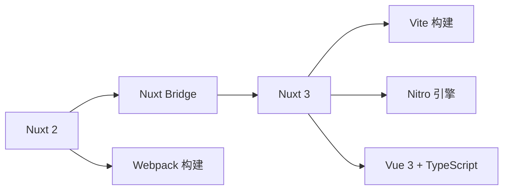

# Nuxt3 框架概览与核心概念

## 概述

Nuxt 是基于 Vue 的全栈框架，提供 SSR / SSG / CSR / 混合渲染等多种模式，内置文件路由、自动导入、服务端引擎（Nitro）等能力。本文梳理 Nuxt3 的定位、渲染模式与核心架构。

## 学习目标

- 理解 Nuxt3 在 Vue SSR 生态中的定位
- 掌握五种渲染模式的特点与页面级控制方式
- 了解 Nitro 服务引擎的跨平台部署能力
- 理解 Nuxt3 的目录约定与核心概念

---

## 一、Nuxt 的定位

### 1.1 Vue SSR 方案谱系

| 方案 | 层级 | 特点 |
|------|------|------|
| vue/server-renderer | 底层 API | 纯渲染能力 |
| Vite SSR | 构建工具层 | 需自行搭建架构 |
| vite-plugin-ssr (Vike) | 插件层 | 约定式，多框架 |
| Nuxt3 | 全功能框架 | 开箱即用，Vue 专属 |

### 1.2 版本演进



Nuxt3 基于 Vue3、Vite、Nitro 完全重构，原生 TypeScript 支持。

### 1.3 核心能力

| 能力 | 说明 |
|------|------|
| 文件路由 | `pages/` 目录自动生成路由 |
| 自动导入 | 组件、组合式函数、Vue API 免 import |
| 数据获取 | useFetch / useAsyncData 服务端数据预取 |
| 服务端 API | `server/api/` 目录创建 API 端点 |
| 布局系统 | `layouts/` 目录 + definePageMeta |
| 模块生态 | 200+ 官方/社区模块 |

---

## 二、渲染模式

### 2.1 五种模式

| 模式 | 渲染时机 | 适用场景 |
|------|---------|---------|
| SSR | 每次请求时服务端渲染 | 内容型网站、SEO 要求高 |
| SSG | 构建时预渲染 | 博客、文档站 |
| CSR | 浏览器端渲染 | 管理后台、私有页面 |
| Hybrid | 按路由混合 | 复杂应用不同页面不同策略 |
| ESR | CDN 边缘节点渲染 | 全球化应用 |

### 2.2 页面级渲染控制

```typescript
// nuxt.config.ts — 全局路由规则
export default defineNuxtConfig({
  routeRules: {
    '/': { ssr: true },              // 首页 SSR
    '/admin/**': { ssr: false },     // 后台纯 CSR
    '/blog/**': { prerender: true }, // 博客预渲染（SSG）
    '/api/**': { cors: true },       // API 开启跨域
  },
})
```

```vue
<!-- pages/admin/index.vue — 页面级禁用 SSR -->
<script setup lang="ts">
definePageMeta({
  // 此页面纯客户端渲染
})
</script>
```

### 2.3 边缘端渲染（ESR）

传统 SSR 的服务器可能远离用户，ESR 将渲染逻辑部署到 CDN 边缘节点：

- 用户访问物理距离最近的节点
- 渲染在边缘完成，延迟大幅降低
- Nuxt3 通过 Nitro 引擎支持 Cloudflare Workers / Vercel Edge 等平台

---

## 三、Nitro 服务引擎

### 3.1 定位

Nitro 是 Nuxt3 的底层服务端引擎，独立于 Nuxt 使用，核心特点：

| 特点 | 说明 |
|------|------|
| 跨平台 | Node.js、Cloudflare Workers、Vercel、Deno、Bun |
| 统一 API | 一套代码部署到任意平台 |
| 内置能力 | 缓存、存储、任务调度、WebSocket |
| 自动优化 | Tree Shaking、按需加载 |

### 3.2 服务端 API

```typescript
// server/api/users.get.ts
export default defineEventHandler(async (event) => {
  const users = await db.query('SELECT * FROM users')
  return users
})
```

```vue
<!-- 页面中使用 -->
<script setup lang="ts">
const { data } = await useFetch('/api/users')
</script>
```

---

## 四、目录结构约定

```
my-nuxt-app/
├── app.vue              # 根组件
├── nuxt.config.ts       # 框架配置
├── pages/               # 页面（自动路由）
├── components/          # 组件（自动导入）
├── composables/         # 组合式函数（自动导入）
├── layouts/             # 布局
├── middleware/          # 路由中间件
├── plugins/             # 插件
├── server/              # 服务端代码（Nitro）
│   ├── api/             # API 端点
│   └── middleware/      # 服务端中间件
├── assets/              # 需编译的静态资源
├── public/              # 原样输出的静态资源
└── stores/              # Pinia Store
```

---

## 常见问题

**Q: Nuxt3 和纯 Vite + Vue3 项目怎么选？**

需要 SEO / SSR / 服务端 API 时选 Nuxt3；纯后台管理系统、无 SEO 需求的工具型应用，Vite SPA 更轻量。Nuxt3 也可以整体关闭 SSR（`ssr: false`）当 SPA 用，但会引入额外框架开销。

**Q: Nuxt3 必须用 TypeScript 吗？**

不强制，但 Nuxt3 本身用 TypeScript 编写，类型推断完善。使用 TypeScript 能获得完整的 API 类型提示和配置校验，强烈建议启用。

**Q: Nuxt 模块和 Vue 插件有什么区别？**

Nuxt 模块在构建时介入框架配置（注入插件、修改 Vite 配置、扩展 Nitro），能力远超运行时 Vue 插件。如 `@pinia/nuxt` 会自动处理 SSR 状态序列化，手动集成 Pinia 则需要自行处理。

---

## 延伸阅读

- 上一篇：[SSG 静态站点生成方案扩展](../10-SSR服务端渲染/05-SSG静态站点生成方案扩展.md) — SSG 方案
- 下一篇：[Nuxt3 项目初始化与代码规范配置](02-Nuxt3项目初始化与代码规范配置.md) — 项目搭建
- 官方文档：[Nuxt3](https://nuxt.com/)
