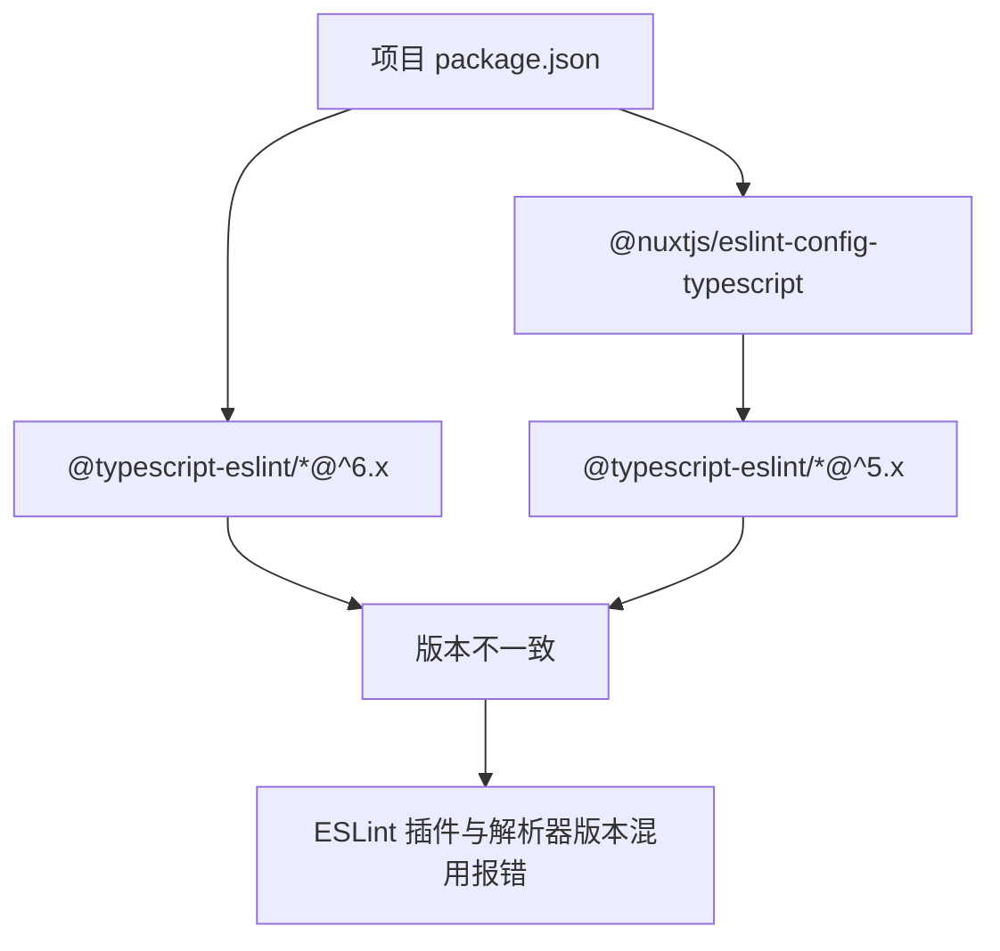

# ESLint 版本冲突问题排查与解决

## 概述

Nuxt 项目配置 ESLint 时，`@nuxtjs/eslint-config-typescript` 内部依赖的 `@typescript-eslint` 版本可能与项目手动安装的版本冲突，导致 ESLint 无法加载配置。本文记录完整的排查思路与解决方案。

## 学习目标

- 掌握 ESLint 依赖版本冲突的排查流程
- 学会通过 VS Code Output 面板定位 ESLint 错误
- 理解 npm/pnpm 依赖树中版本冲突的产生机制
- 掌握 overrides / 版本对齐等解决手段

---

## 一、问题现象

### 1.1 典型错误

```
ESLint: Cannot read config: @typescript-eslint/eslint-plugin
Conflict between different versions of TypeScript ESLint packages
```

或：

```
Error: Cannot find module '@typescript-eslint/eslint-plugin'
Require stack:
  - @nuxtjs/eslint-config-typescript
```

### 1.2 冲突根源



`@typescript-eslint/eslint-plugin` 和 `@typescript-eslint/parser` 必须版本一致，跨大版本混用会触发内部 API 不兼容。

---

## 二、排查流程

### 2.1 标准排查步骤

| 步骤 | 操作 | 工具 |
|------|------|------|
| 1 | 查看 ESLint 错误日志 | VS Code Output → ESLint |
| 2 | 逐步注释 extends 定位问题配置 | .eslintrc.js |
| 3 | 检查配置库的依赖版本 | node_modules 中的 package.json |
| 4 | 对比项目与库的版本差异 | pnpm ls / npm ls |
| 5 | 对齐版本或分离配置 | package.json overrides |

### 2.2 查看 ESLint 日志

1. VS Code → 查看 → 输出（View → Output）
2. 下拉选择「ESLint」通道
3. 查看完整错误堆栈

### 2.3 注释法定位

```javascript
// .eslintrc.js — 逐步注释缩小范围
module.exports = {
  extends: [
    'plugin:vue/vue3-recommended',
    '@nuxtjs/eslint-config-typescript',
    // 'plugin:@typescript-eslint/recommended',  // 注释后测试
    'plugin:prettier/recommended',
  ],
}
```

### 2.4 检查依赖版本

```bash
# pnpm 查看依赖树
pnpm ls @typescript-eslint/eslint-plugin
pnpm ls @typescript-eslint/parser

# 或直接查看配置库的声明
cat node_modules/@nuxtjs/eslint-config-typescript/package.json
```

---

## 三、解决方案

### 3.1 方案一：版本对齐（推荐）

将项目安装的版本降级/升级到与配置库一致：

```bash
# 查看 @nuxtjs/eslint-config-typescript 要求的版本
# 假设其依赖 ^5.62.0

pnpm remove @typescript-eslint/eslint-plugin @typescript-eslint/parser
pnpm add -D @typescript-eslint/eslint-plugin@^5.62.0 @typescript-eslint/parser@^5.62.0
```

### 3.2 方案二：不手动安装，交给配置库管理

```bash
# 移除项目根目录的手动安装
pnpm remove @typescript-eslint/eslint-plugin @typescript-eslint/parser
```

`@nuxtjs/eslint-config-typescript` 会自动携带匹配版本，无需重复安装。

### 3.3 方案三：pnpm overrides 强制统一

```json
// package.json
{
  "pnpm": {
    "overrides": {
      "@typescript-eslint/eslint-plugin": "^6.21.0",
      "@typescript-eslint/parser": "^6.21.0"
    }
  }
}
```

强制所有依赖路径使用同一版本。注意：需确认配置库兼容目标版本。

### 3.4 方案四：迁移 Flat Config（ESLint 9+）

ESLint 9 的 Flat Config 模式下，Nuxt 官方提供 `@nuxt/eslint` 模块：

```bash
pnpm add -D @nuxt/eslint
```

```typescript
// nuxt.config.ts
export default defineNuxtConfig({
  modules: ['@nuxt/eslint'],
})
```

```javascript
// eslint.config.mjs
import { createConfigForNuxt } from '@nuxt/eslint-config/flat'

export default createConfigForNuxt({
  features: { tooling: true },
})
```

Flat Config 不再有 extends 链的版本耦合问题，是长期解决方向。

---

## 四、预防措施

| 措施 | 说明 |
|------|------|
| 统一安装来源 | 要么全手动安装，要么全交给配置库 |
| 锁定 lockfile | 提交 pnpm-lock.yaml，CI 使用 --frozen-lockfile |
| 升级前查 changelog | 大版本升级前确认生态兼容性 |
| 定期审计 | `pnpm outdated` 检查过期依赖 |

---

## 常见问题

**Q: 为什么 pnpm 比 npm 更容易暴露版本冲突？**

pnpm 的严格依赖隔离（非扁平化 node_modules）使得包只能访问自己声明的依赖。npm 的扁平化会"意外"提升依赖，掩盖版本不一致问题（但可能引发更隐蔽的 bug）。

**Q: ESLint 报错但命令行 lint 正常，是什么原因？**

VS Code ESLint 扩展使用的工作目录或 Node 版本可能与终端不同。检查扩展设置中的 `eslint.workingDirectories` 和 `eslint.nodePath` 配置。

---

## 延伸阅读

- 上一篇：[Nuxt3 项目初始化与代码规范配置](02-Nuxt3项目初始化与代码规范配置.md) — 规范配置
- 下一篇：[Nuxt DevTools 开发工具详解](04-Nuxt-DevTools开发工具详解.md) — 开发工具
- 相关：ESLint 配置 — 工具链配置
