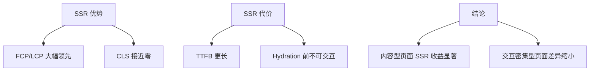

# SSR 与 CSR 性能对比测试实践

## 概述

本文通过 Lighthouse 对同一应用的 SSR 和 CSR 版本进行性能对比测试，用 FCP / LCP / TTI 等量化指标验证 SSR 的首屏优势，并记录测试环境搭建中的跨域问题解决方案。

## 学习目标

- 掌握 Lighthouse 性能测试的核心指标（FCP / LCP / TTI / CLS）
- 学会搭建公平的 SSR vs CSR 对比测试环境
- 掌握 Preview 环境的跨域代理配置
- 理解测试数据的解读方式与结论边界

---

## 一、测试指标与工具

### 1.1 核心性能指标

| 指标 | 全称 | 含义 |
|------|------|------|
| FCP | First Contentful Paint | 首次内容绘制时间 |
| LCP | Largest Contentful Paint | 最大内容绘制时间 |
| TTI | Time to Interactive | 页面可交互时间 |
| CLS | Cumulative Layout Shift | 累积布局偏移 |
| TTFB | Time to First Byte | 首字节到达时间 |

### 1.2 测试工具

| 工具 | 场景 |
|------|------|
| Lighthouse（Chrome DevTools） | 本地标准化测试 |
| WebPageTest | 多地域、多设备线上测试 |
| Chrome Performance 面板 | 细粒度瀑布流分析 |

---

## 二、测试环境搭建

### 2.1 公平对比原则

| 原则 | 说明 |
|------|------|
| 同一页面内容 | SSR 和 CSR 渲染相同的 UI 和数据 |
| 同一网络条件 | Lighthouse 统一模拟 Slow 4G |
| 生产构建 | 使用 build + preview，非 dev 模式 |
| 多次采样 | 每组至少 3 次取中位数 |

### 2.2 CSR 版本环境

```bash
# CSR 项目构建并预览
pnpm build
pnpm preview    # localhost:4173
```

### 2.3 SSR 版本环境

```bash
# Nuxt SSR 项目构建并运行
pnpm build
node .output/server/index.mjs    # localhost:3000
```

### 2.4 跨域问题处理

CSR Preview 环境（4173）请求 Dev Server（5173）的 Mock API 时存在跨域：

```typescript
// vite.config.ts — Preview 代理配置
export default defineConfig({
  preview: {
    port: 4173,
    proxy: {
      '/api': {
        target: 'http://localhost:5173',
        changeOrigin: true,
      },
    },
  },
})
```

或为 Preview 环境单独启动 Mock 服务，避免依赖 Dev Server。

---

## 三、Lighthouse 测试流程

### 3.1 执行步骤

1. Chrome 无痕模式打开目标页面
2. DevTools → Lighthouse 面板
3. 选择 Performance，设备选 Mobile
4. 清除缓存，执行分析
5. 记录指标，重复 3 次

### 3.2 典型对比结果

| 指标 | CSR | SSR | 差异 |
|------|-----|-----|------|
| FCP | 2.8s | 1.2s | SSR 快 57% |
| LCP | 3.5s | 1.6s | SSR 快 54% |
| TTI | 3.8s | 2.1s | SSR 快 45% |
| TTFB | 0.3s | 0.6s | CSR 快（服务器无渲染开销） |
| CLS | 0.25 | 0.02 | SSR 布局稳定 |

注：以上为示例数据，实际结果取决于页面复杂度和数据量。

### 3.3 结果解读



---

## 四、测试注意事项

| 注意点 | 说明 |
|--------|------|
| 关闭扩展 | 浏览器扩展注入脚本影响指标 |
| 无痕模式 | 避免缓存干扰 |
| 固定硬件 | 同一设备对比，CPU 节流一致 |
| 数据量一致 | Mock 数据条数相同 |
| 排除冷启动 | 首次运行预热后再采样 |

---

## 常见问题

**Q: 为什么 SSR 的 TTFB 反而更慢？**

CSR 的服务器只返回静态 HTML 文件（几乎零耗时），SSR 需要执行 Vue 渲染 + 数据获取后才响应。TTFB 慢不代表体验差——用户感知的关键是 FCP/LCP。

**Q: 本地测试和线上结果差异大怎么办？**

本地网络延迟接近零，放大了渲染耗时占比。线上测试使用 WebPageTest 选择真实地域节点，或部署到预发布环境后用 Lighthouse CI 持续监控。

**Q: Hydration 时间如何测量？**

Chrome Performance 面板录制页面加载过程，观察主线程中 Vue 的 `hydrate` 调用耗时。Nuxt DevTools 的 Navigation 指标也可作为参考。

---

## 延伸阅读

- 上一篇：[Nuxt3 环境变量与 Runtime 配置实践](06-Nuxt3环境变量与Runtime配置实践.md) — 环境配置
- 下一篇：[Nuxt3 PWA 配置问题排查与修复实践](08-Nuxt3-PWA配置问题排查与修复实践.md) — PWA 排查
- 相关：性能优化 — 前端性能体系
