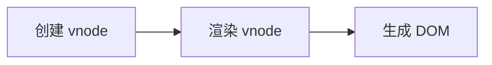
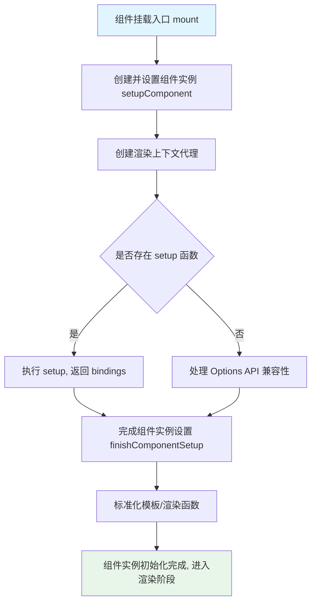

# Setup：组件渲染前的初始化过程
Vue.js 3.0 允许在组件中添加一个 setup 启动函数，它是 Composition API 逻辑组织的入口。本文分析 setup 的执行时机，以及 setup 返回结果如何与模板渲染建立联系。

先通过一个 button 组件认识它：

```html
<template>
  <button @click="increment">
    Count is: {{ state.count }}, double is: {{ state.double }}
  </button>
</template>
<script>
import { reactive, computed } from 'vue'
export default {
  setup() {
    const state = reactive({
      count: 0,
      double: computed(() => state.count * 2)
    })
    function increment() {
      state.count++
    }
    return {
      state,
      increment
    }
  }
}
</script>
```

与 Vue.js 2.x 组件的写法相比，这段代码多了一个 setup 启动函数，组件中也没有定义 props、data、computed 等 options。

在 setup 函数内部，定义了一个响应式对象 state，它是通过 reactive API 创建的。state 对象有 count 和 double 两个属性，其中 count 对应一个数字属性的值；而 double 通过 computed API 创建，对应一个计算属性的值。reactive API 和 computed API 的实现在后续响应式章节详细介绍。

**核心问题**：模板中引用到的变量 state 和 increment 包含在 setup 函数的返回对象中，它们是如何建立联系的？

回顾 Vue.js 2.x：组件会在 props、data、methods、computed 等 options 中定义变量，在组件初始化阶段，Vue.js 内部处理这些 options，把定义的变量添加到组件实例上；模板编译成 render 函数后，内部通过 `with(this){}` 语法访问组件实例中的变量。

在 Vue.js 3.0 中既支持定义 setup 函数，模板 render 时又能访问 setup 函数返回的值，这是如何实现的？下面的分析给出答案。

### 创建和设置组件实例

组件的渲染流程分为三步：创建 vnode、渲染 vnode、生成 DOM。



其中「渲染 vnode」的过程主要就是挂载组件：

```js
const mountComponent = (initialVNode, container, anchor, parentComponent, parentSuspense, isSVG, optimized) => {
  // 创建组件实例
  const instance = (initialVNode.component = createComponentInstance(initialVNode, parentComponent, parentSuspense))
  // 设置组件实例
  setupComponent(instance)
  // 设置并运行带副作用的渲染函数
  setupRenderEffect(instance, initialVNode, container, anchor, parentSuspense, isSVG, optimized)
}
```

挂载组件做了三件事：创建组件实例、设置组件实例、设置并运行带副作用的渲染函数。其中前两步与 setup 函数的处理直接相关，本文重点分析它们。

#### 创建组件实例

`createComponentInstance` 创建组件实例，在实例上挂载了组件生命周期所需的全部状态：

```js
function createComponentInstance (vnode, parent, suspense) {
  // 继承父组件实例上的 appContext，如果是根组件，则直接从根 vnode 中取。
  const appContext = (parent ? parent.appContext : vnode.appContext) || emptyAppContext;
  const instance = {
    // 组件唯一 id
    uid: uid++,
    // 组件 vnode
    vnode,
    // 父组件实例
    parent,
    // app 上下文
    appContext,
    // vnode 节点类型
    type: vnode.type,
    // 根组件实例
    root: null,
    // 新的组件 vnode
    next: null,
    // 子节点 vnode
    subTree: null,
    // 带副作用更新函数
    update: null,
    // 渲染函数
    render: null,
    // 渲染上下文代理
    proxy: null,
    // 带有 with 区块的渲染上下文代理
    withProxy: null,
    // 响应式相关对象
    effects: null,
    // 依赖注入相关
    provides: parent ? parent.provides : Object.create(appContext.provides),
    // 渲染代理的属性访问缓存
    accessCache: null,
    // 渲染缓存
    renderCache: [],
    // 渲染上下文
    ctx: EMPTY_OBJ,
    // data 数据
    data: EMPTY_OBJ,
    // props 数据
    props: EMPTY_OBJ,
    // 普通属性
    attrs: EMPTY_OBJ,
    // 插槽相关
    slots: EMPTY_OBJ,
    // 组件或者 DOM 的 ref 引用
    refs: EMPTY_OBJ,
    // setup 函数返回的响应式结果
    setupState: EMPTY_OBJ,
    // setup 函数上下文数据
    setupContext: null,
    // 注册的组件
    components: Object.create(appContext.components),
    // 注册的指令
    directives: Object.create(appContext.directives),
    // suspense 相关
    suspense,
    // suspense 异步依赖
    asyncDep: null,
    // suspense 异步依赖是否都已处理
    asyncResolved: false,
    // 是否挂载
    isMounted: false,
    // 是否卸载
    isUnmounted: false,
    // 是否激活
    isDeactivated: false,
    // 生命周期，before create
    bc: null,
    // 生命周期，created
    c: null,
    // 生命周期，before mount
    bm: null,
    // 生命周期，mounted
    m: null,
    // 生命周期，before update
    bu: null,
    // 生命周期，updated
    u: null,
    // 生命周期，unmounted
    um: null,
    // 生命周期，before unmount
    bum: null,
    // 生命周期, deactivated
    da: null,
    // 生命周期 activated
    a: null,
    // 生命周期 render triggered
    rtg: null,
    // 生命周期 render tracked
    rtc: null,
    // 生命周期 error captured
    ec: null,
    // 派发事件方法
    emit: null
  }
  // 初始化渲染上下文
  instance.ctx = { _: instance }
  // 初始化根组件指针
  instance.root = parent ? parent.root : instance
  // 初始化派发事件方法
  instance.emit = emit.bind(null, instance)
  return instance
}
```

组件实例 instance 上定义了很多属性，部分属性是为特定场景或功能定义的，通过代码注释即可了解其用途。

Vue.js 2.x 使用 `new Vue()` 初始化组件实例，Vue.js 3.0 直接通过创建对象创建组件实例。两种方式并无本质区别，都是持有一个对象，在组件整个生命周期中维护状态数据和上下文环境。

创建好 instance 后完成上下文、根组件指针、派发事件方法的设置。后续会继续分析更多 instance 属性的设置逻辑。

#### 设置组件实例

对 setup 函数的处理在「设置组件实例」阶段完成，入口是 `setupComponent`：

```js
function setupComponent (instance, isSSR = false) {
  const { props, children, shapeFlag } = instance.vnode
  // 判断是否是一个有状态的组件
  const isStateful = shapeFlag & 4
  // 初始化 props
  initProps(instance, props, isStateful, isSSR)
  // 初始化插槽
  initSlots(instance, children)
  // 设置有状态的组件实例
  const setupResult = isStateful
    ? setupStatefulComponent(instance, isSSR)
    : undefined
  return setupResult
}
```

从组件 vnode 中获取 props、children、shapeFlag 等属性，分别对 props 和插槽初始化（这两部分逻辑在后续章节详细分析）。根据 shapeFlag 判断是否为有状态组件，若是则进一步设置组件实例。

`setupStatefulComponent` 做了三件事：创建渲染上下文代理、判断并处理 setup 函数、完成组件实例设置。

```js
function setupStatefulComponent (instance, isSSR) {
  const Component = instance.type
  // 创建渲染代理的属性访问缓存
  instance.accessCache = {}
  // 创建渲染上下文代理
  instance.proxy = new Proxy(instance.ctx, PublicInstanceProxyHandlers)
  // 判断处理 setup 函数
  const { setup } = Component
  if (setup) {
    // 如果 setup 函数带参数，则创建一个 setupContext
    const setupContext = (instance.setupContext =
      setup.length > 1 ? createSetupContext(instance) : null)
    // 执行 setup 函数，获取结果
    const setupResult = callWithErrorHandling(setup, instance, 0 /* SETUP_FUNCTION */, [instance.props, setupContext])
    // 处理 setup 执行结果
    handleSetupResult(instance, setupResult)
  }
  else {
    // 完成组件实例设置
    finishComponentSetup(instance)
  }
}
```

### 创建渲染上下文代理

首先是创建渲染上下文代理的流程，它对 `instance.ctx` 做代理。需要先理解为什么需要代理。

Vue.js 2.x 已有类似的数据代理逻辑，例如 props 求值后的数据存储在 `this._props` 上，data 中定义的数据存储在 `this._data` 上。模板渲染时访问 `this.msg`，实际访问的是 `this._data.msg`，原因在于 Vue.js 2.x 初始化 data 时做了一层 proxy 代理。

在 Vue.js 3.0 中，为了便于维护，把组件中不同状态的数据存储到不同属性中（如 setupState、ctx、data、props）。执行组件渲染函数时，为了方便用户使用，直接访问渲染上下文 `instance.ctx` 中的属性，于是也做了一层 proxy：对 `instance.ctx` 属性的访问和修改，代理到对 setupState、ctx、data、props 中数据的访问和修改。

明确了代理需求后，分析 proxy 的 get、set、has 三个方法。

#### get：访问渲染上下文属性

访问 `instance.ctx` 中的属性时进入 get 函数：

```js
const PublicInstanceProxyHandlers = {
  get ({ _: instance }, key) {
    const { ctx, setupState, data, props, accessCache, type, appContext } = instance
    if (key[0] !== '$') {
      // setupState / data / props / ctx
      // 渲染代理的属性访问缓存中
      const n = accessCache[key]
      if (n !== undefined) {
        // 从缓存中取
        switch (n) {
          case 0: /* SETUP */
            return setupState[key]
          case 1 :/* DATA */
            return data[key]
          case 3 :/* CONTEXT */
            return ctx[key]
          case 2: /* PROPS */
            return props[key]
        }
      }
      else if (setupState !== EMPTY_OBJ && hasOwn(setupState, key)) {
        accessCache[key] = 0
        // 从 setupState 中取数据
        return setupState[key]
      }
      else if (data !== EMPTY_OBJ && hasOwn(data, key)) {
        accessCache[key] = 1
        // 从 data 中取数据
        return data[key]
      }
      else if (
        type.props &&
        hasOwn(normalizePropsOptions(type.props)[0], key)) {
        accessCache[key] = 2
        // 从 props 中取数据
        return props[key]
      }
      else if (ctx !== EMPTY_OBJ && hasOwn(ctx, key)) {
        accessCache[key] = 3
        // 从 ctx 中取数据
        return ctx[key]
      }
      else {
        // 都取不到
        accessCache[key] = 4
      }
    }
    const publicGetter = publicPropertiesMap[key]
    let cssModule, globalProperties
    // 公开的 $xxx 属性或方法
    if (publicGetter) {
      return publicGetter(instance)
    }
    else if (
      // css 模块，通过 vue-loader 编译的时候注入
      (cssModule = type.__cssModules) &&
      (cssModule = cssModule[key])) {
      return cssModule
    }
    else if (ctx !== EMPTY_OBJ && hasOwn(ctx, key)) {
      // 用户自定义的属性，也用 `$` 开头
      accessCache[key] = 3
      return ctx[key]
    }
    else if (
      // 全局定义的属性
      ((globalProperties = appContext.config.globalProperties),
        hasOwn(globalProperties, key))) {
      return globalProperties[key]
    }
    else if ((process.env.NODE_ENV !== 'production') &&
      currentRenderingInstance && key.indexOf('__v') !== 0) {
      if (data !== EMPTY_OBJ && key[0] === '$' && hasOwn(data, key)) {
        // 如果在 data 中定义的数据以 $ 开头，会报警告，因为 $ 是保留字符，不会做代理
        warn(`Property ${JSON.stringify(key)} must be accessed via $data because it starts with a reserved ` +
          `character and is not proxied on the render context.`)
      }
      else {
        // 在模板中使用的变量如果没有定义，报警告
        warn(`Property ${JSON.stringify(key)} was accessed during render ` +
          `but is not defined on instance.`)
      }
    }
  }
}
```

当 key 不以 `$` 开头时，数据可能来自 setupState、data、props、ctx 中的一种。`accessCache` 是渲染代理的属性访问缓存：组件渲染时频繁访问数据会触发 get 函数，其中最昂贵的操作是多次调用 `hasOwn` 判断 key 属于哪类数据；普通对象的简单属性访问相对更快，因此在第一次获取 key 后缓存结果，下次直接通过 `accessCache[key]` 取值，避免重复 `hasOwn` 判断——这是一个性能优化手段。

**判断顺序决定数据获取优先级**。依次判断 setupState、data、props、ctx 是否包含该 key，包含则返回对应值：

```html
<template>
  <p>{{msg}}</p>
</template>
<script>
  import { ref } from 'vue'
  export default {
    data() {
      return {
        msg: 'msg from data'
      }
    },
    setup() {
      const msg = ref('msg from setup')
      return {
        msg
      }
    }
  }
</script>
```

data 和 setup 中都定义了 msg，最终界面输出「msg from setup」，原因是 setupState 的判断优先级高于 data。

若 key 以 `$` 开头，则依次判断：是否为 Vue.js 内部公开的 `$xxx` 属性或方法（如 `$parent`）；是否为 vue-loader 编译注入的 css 模块 key；是否为用户自定义以 `$` 开头的 key；是否为全局属性。都不满足时，在非生产环境下报两类警告：data 中以 `$` 开头的数据（保留字符不做代理）、模板中使用但未定义的变量。

#### set：修改渲染上下文属性

修改 `instance.ctx` 中的属性时进入 set 函数：

```js
const PublicInstanceProxyHandlers = {
  set ({ _: instance }, key, value) {
    const { data, setupState, ctx } = instance
    if (setupState !== EMPTY_OBJ && hasOwn(setupState, key)) {
      // 给 setupState 赋值
      setupState[key] = value
    }
    else if (data !== EMPTY_OBJ && hasOwn(data, key)) {
      // 给 data 赋值
      data[key] = value
    }
    else if (key in instance.props) {
      // 不能直接给 props 赋值
      (process.env.NODE_ENV !== 'production') &&
      warn(`Attempting to mutate prop "${key}". Props are readonly.`, instance)
      return false
    }
    if (key[0] === '$' && key.slice(1) in instance) {
      // 不能给 Vue 内部以 $ 开头的保留属性赋值
      (process.env.NODE_ENV !== 'production') &&
      warn(`Attempting to mutate public property "${key}". ` +
        `Properties starting with $ are reserved and readonly.`, instance)
      return false
    }
    else {
      // 用户自定义数据赋值
      ctx[key] = value
    }
    return true
  }
}
```

set 函数同样代理到对应的数据类型完成赋值，且与 get 一致优先判断 setupState、data、props。

对前面的示例添加一个方法：

```html
<template>
  <p>{{ msg }}</p>
  <button @click="random">Random msg</button>
</template>
<script>
  import { ref } from 'vue'
  export default {
    data() {
      return {
        msg: 'msg from data'
      }
    },
    setup() {
      const msg = ref('msg from setup')
      return {
        msg
      }
    },
    methods: {
      random() {
        this.msg = Math.random()
      }
    }
  }
</script>
```

点击按钮执行 random 函数，`this` 指向 `instance.ctx`，修改 `this.msg` 触发 set 函数，最终修改的是 setupState 中的 msg 值。

直接给 props 中的数据赋值，在非生产环境会收到警告——直接修改 props 不符合数据单向流动的设计；给 Vue.js 内部以 `$` 开头的保留属性赋值同样会收到警告。

用户自定义数据（如在 created 生命周期内定义、仅用于组件上下文共享的数据）会保留到 ctx 中：

```js
export default {
  created() {
    this.userMsg = 'msg from user'
  }
}
```

#### has：判断属性是否存在

判断属性是否存在于 `instance.ctx` 时进入 has 函数，在日常项目中较少使用。例如执行 created 钩子中的 `'msg' in this` 时会触发：

```js
export default {
  created () {
    console.log('msg' in this)
  }
}
```

has 函数的实现：

```js
const PublicInstanceProxyHandlers = {
  has
    ({ _: { data, setupState, accessCache, ctx, type, appContext } }, key) {
    // 依次判断
    return (accessCache[key] !== undefined ||
      (data !== EMPTY_OBJ && hasOwn(data, key)) ||
      (setupState !== EMPTY_OBJ && hasOwn(setupState, key)) ||
      (type.props && hasOwn(normalizePropsOptions(type.props)[0], key)) ||
      hasOwn(ctx, key) ||
      hasOwn(publicPropertiesMap, key) ||
      hasOwn(appContext.config.globalProperties, key))
  }
}
```

依次判断 key 是否存在于 accessCache、data、setupState、props、用户数据、公开属性以及全局属性中，返回结果。

至此完成创建上下文代理的过程，回到 `setupStatefulComponent`，分析第二个流程——判断处理 setup 函数。

### 判断处理 setup 函数

处理 setup 函数的代码：

```js
// 判断处理 setup 函数
const { setup } = Component
if (setup) {
  // 如果 setup 函数带参数，则创建一个 setupContext
  const setupContext = (instance.setupContext =
    setup.length > 1 ? createSetupContext(instance) : null)
  // 执行 setup 函数获取结果
  const setupResult = callWithErrorHandling(setup, instance, 0 /* SETUP_FUNCTION */, [instance.props, setupContext])
  // 处理 setup 执行结果
  handleSetupResult(instance, setupResult)
}
```

若组件定义了 setup 函数，则进入处理流程，分三步：创建 setup 函数上下文、执行 setup 函数并获取结果、处理 setup 函数的执行结果。

#### 创建 setupContext

判断 setup 函数的参数长度，大于 1 时创建 setupContext 上下文：

```js
const setupContext = (instance.setupContext =
    setup.length > 1 ? createSetupContext(instance) : null)
```

HelloWorld 子组件示例：

```html
<template>
  <p>{{ msg }}</p>
  <button @click="onClick">Toggle</button>
</template>
<script>
  export default {
    props: {
      msg: String
    },
    setup (props, { emit }) {
      function onClick () {
        emit('toggle')
      }
      return {
        onClick
      }
    }
  }
</script>
```

在父组件中引用：

```html
<template>
  <HelloWorld @toggle="toggle" :msg="msg"></HelloWorld>
</template>
<script>
  import { ref } from 'vue'
  import HelloWorld from "./components/HelloWorld";
  export default {
    components: { HelloWorld },
    setup () {
      const msg = ref('Hello World')
      function toggle () {
        msg.value = msg.value === 'Hello World' ? 'Hello Vue' : 'Hello World'
      }
      return {
        toggle,
        msg
      }
    }
  }
</script>
```

HelloWorld 子组件的 setup 函数接收两个参数：第一个参数 props 对应父组件传入的 props 数据，第二个参数 emit 即 setupContext。

`createSetupContext` 创建 setupContext：

```plain
function createSetupContext (instance) {
  return {
    attrs: instance.attrs,
    slots: instance.slots,
    emit: instance.emit
  }
}
```

返回对象包含 attrs、slots、emit 三个属性，使 setup 函数内部可获取组件属性、插槽以及派发事件的方法 emit。该对象即对应 setup 函数的第二个参数。

#### 执行 setup 函数

执行 setup 函数并获取结果：

```js
const setupResult = callWithErrorHandling(setup, instance, 0 /* SETUP_FUNCTION */, [instance.props, setupContext])
```

`callWithErrorHandling` 的实现：

```js
function callWithErrorHandling (fn, instance, type, args) {
  let res
  try {
    res = args ? fn(...args) : fn()
  }
  catch (err) {
    handleError(err, instance, type)
  }
  return res
}
```

它是对 fn 的一层包装，在有参数时透传参数，因此 setup 的第一个参数是 `instance.props`，第二个参数是 setupContext。函数执行过程中若出现 JavaScript 运行时错误则捕获并执行 `handleError`。

#### 处理 setup 结果

用 `handleSetupResult` 处理 setup 返回结果：

```js
handleSetupResult(instance, setupResult)
```

```js
function handleSetupResult(instance, setupResult) {
  if (isFunction(setupResult)) {
    // setup 返回渲染函数
    instance.render = setupResult
  }
  else if (isObject(setupResult)) {
    // 把 setup 返回结果变成响应式
    instance.setupState = reactive(setupResult)
  }
  finishComponentSetup(instance)
}
```

当 setupResult 是对象时，把它变为响应式并赋值给 `instance.setupState`。依据前面的代理规则，模板渲染时 `instance.ctx` 可从 `instance.setupState` 获取数据，从而在 setup 函数与模板渲染之间建立联系。

setup 也可以返回一个函数作为组件的渲染函数：

```html
<script>
  import { h } from 'vue'
  export default {
    props: {
      msg: String
    },
    setup (props, { emit }) {
      function onClick () {
        emit('toggle')
      }
      return (ctx) => {
        return [
          h('p', null, ctx.msg),
          h('button', { onClick: onClick }, 'Toggle')
        ]
      }
    }
  }
</script>
```

删除 HelloWorld 子组件的 template 部分，把 setup 返回结果改为函数，它将作为组件渲染函数，运行正常。

`handleSetupResult` 最后执行 `finishComponentSetup` 完成组件实例设置；当组件未定义 setup 时，同样会执行该函数。

### 完成组件实例设置

`finishComponentSetup` 的实现：

```js
function finishComponentSetup (instance) {
  const Component = instance.type
  // 对模板或者渲染函数的标准化
  if (!instance.render) {
    if (compile && Component.template && !Component.render) {
      // 运行时编译
      Component.render = compile(Component.template, {
        isCustomElement: instance.appContext.config.isCustomElement || NO
      })
      Component.render._rc = true
    }
    if ((process.env.NODE_ENV !== 'production') && !Component.render) {
      if (!compile && Component.template) {
        // 只编写了 template 但使用了 runtime-only 的版本
        warn(`Component provided template option but ` +
          `runtime compilation is not supported in this build of Vue.` +
          (` Configure your bundler to alias "vue" to "vue/dist/vue.esm-bundler.js".`
          ) /* should not happen */)
      }
      else {
        // 既没有写 render 函数，也没有写 template 模板
        warn(`Component is missing template or render function.`)
      }
    }
    // 组件对象的 render 函数赋值给 instance
    instance.render = (Component.render || NOOP)
    if (instance.render._rc) {
      // 对于使用 with 块的运行时编译的渲染函数，使用新的渲染上下文的代理
      instance.withProxy = new Proxy(instance.ctx, RuntimeCompiledPublicInstanceProxyHandlers)
    }
  }
  // 兼容 Vue.js 2.x Options API
  {
    currentInstance = instance
    applyOptions(instance, Component)
    currentInstance = null
  }
}
```

函数主要做两件事：标准化模板或渲染函数、兼容 Options API。

#### 标准化模板或渲染函数

组件最终通过运行 render 函数生成子树 vnode，但通常不直接编写 render 函数，而是用两种方式开发组件：

- **SFC（Single File Components）单文件开发**：编写 template 描述组件 DOM 结构。`.vue` 文件无法在 Web 端直接加载，webpack 编译阶段通过 vue-loader 把 template 转换为 render 函数并添加到组件对象。
- **直接引入 Vue.js 开箱即用**：在组件对象的 template 属性中编写模板，运行阶段编译生成 render 函数，常用于有历史包袱的旧项目。

因此 Web 端有两个版本：runtime-only 与 runtime-compiled。推荐使用 runtime-only，体积更小且运行时不编译，耗时更少、性能更优；runtime-compiled 用于不得已的旧项目场景。两者的主要区别在于是否注册了 compile 方法。Vue.js 3.0 中 compile 通过外部注册：

```js
let compile;
function registerRuntimeCompiler(_compile) {
    compile = _compile;
}
```

回到标准化逻辑，先判断 `instance.render` 是否存在，不存在则进入标准化流程，需处理三种情况：

1. compile 与组件 template 存在、render 方法不存在：runtime-compiled 版本在运行时编译模板，生成 render 函数。
2. compile 与 render 方法不存在、组件 template 存在：使用 runtime-only 版本，应报警告提示用户需使用 runtime-compiled 版本才能运行时编译。
3. 组件既无 render 函数也无 template 模板：报警告提示组件缺少 render 函数或 template 模板。

处理完后把组件 render 函数赋值给 `instance.render`，组件渲染时即可运行 `instance.render` 生成子树 vnode。

对于使用 with 块运行时编译的渲染函数，渲染上下文代理为 `RuntimeCompiledPublicInstanceProxyHandlers`，在 `PublicInstanceProxyHandlers` 基础上扩展，主要优化 has 实现：

```js
const RuntimeCompiledPublicInstanceProxyHandlers = {
  ...PublicInstanceProxyHandlers,
  get(target, key) {
    if (key === Symbol.unscopables) {
      return
    }
    return PublicInstanceProxyHandlers.get(target, key, target)
  },
  has(_, key) {
    // 如果 key 以 _ 开头或者 key 在全局变量白名单内，则 has 为 false
    const has = key[0] !== '_' && !isGloballyWhitelisted(key)
    if ((process.env.NODE_ENV !== 'production') && !has && PublicInstanceProxyHandlers.has(_, key)) {
      warn(`Property ${JSON.stringify(key)} should not start with _ which is a reserved prefix for Vue internals.`)
    }
    return has
  }
}
```

若 key 以 `_` 开头或位于全局变量白名单内，has 直接为 false 并命中警告，无需再走之前的一系列判断。

#### Options API：兼容 Vue.js 2.x

Vue.js 2.x 通过组件对象描述组件，Vue.js 3.0 仍支持 Options API 写法，由 `applyOptions` 实现：

```js
function applyOptions(instance, options, deferredData = [], deferredWatch = [], asMixin = false) {
  const {
    // 组合
    mixins, extends: extendsOptions,
    // 数组状态
    props: propsOptions, data: dataOptions, computed: computedOptions, methods, watch: watchOptions, provide: provideOptions, inject: injectOptions,
    // 组件和指令
    components, directives,
    // 生命周期
    beforeMount, mounted, beforeUpdate, updated, activated, deactivated, beforeUnmount, unmounted, renderTracked, renderTriggered, errorCaptured } = options;

  // instance.proxy 作为 this
  const publicThis = instance.proxy;
  const ctx = instance.ctx;

  // 处理全局 mixin
  // 处理 extend
  // 处理本地 mixins
  // props 已经在外面处理过了
  // 处理 inject
  // 处理方法
  // 处理 data
  // 处理计算属性
  // 处理 watch
  // 处理 provide
  // 处理组件
  // 处理指令
  // 处理生命周期 option
}
```

## 总结

本文分析了渲染上下文的代理过程，以及 Composition API 中 setup 启动函数的执行时机、setup 返回结果如何与模板渲染建立联系；说明了组件模板或渲染函数的标准化过程，以及如何兼容 Vue.js 2.x 的 Options API。

Vue.js 3.0 组件的初始化流程如下：



> setup 是 Composition API 的入口，组件初始化按「实例化 → 渲染代理 → 处理 setup → 完成设置 → 标准化」的顺序完成。

> **本文的相关代码在源代码中的位置如下：**
> packages/runtime-core/src/renderer.ts
> packages/runtime-core/src/component.ts
> packages/runtime-core/src/componentPublicInstance.ts
> packages/runtime-core/src/errorHandling.ts
