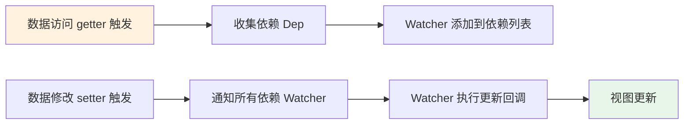
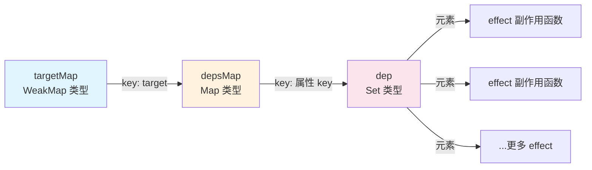
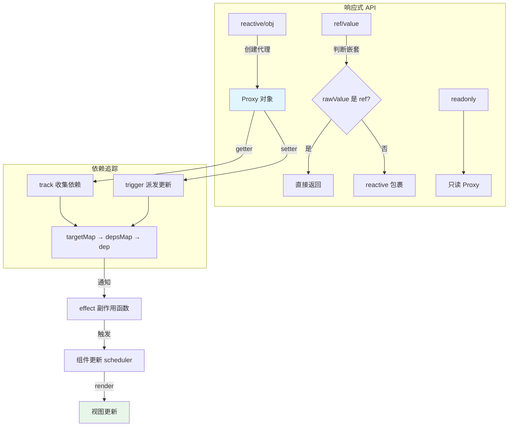

# 响应式：内部实现原理
在 Composition API 中，setup 函数是组织逻辑的入口，setup 内部多次使用 reactive、ref 等 API 让数据变成响应式。本文分析响应式内部的实现原理。

除了组件化，Vue.js 另一个核心设计思想就是**响应式**：当数据变化后会自动执行某个函数，映射到组件实现就是数据变化后自动触发组件的重新渲染。**响应式是 Vue.js 组件化更新渲染的核心机制**。

在介绍 Vue.js 3.0 响应式实现之前，先回顾 Vue.js 2.x 的实现：内部通过 `Object.defineProperty` API 劫持数据的变化，在数据被访问时收集依赖，在数据被修改时通知依赖更新。



> Vue 2.x 通过 `Object.defineProperty` 劫持 getter/setter；Vue 3.0 改为基于 `Proxy` 实现，原理相同但能力更强。

在 Vue.js 2.x 中，Watcher 就是依赖，有专门针对组件渲染的 render watcher。存在两个流程：一是**依赖收集流程**，组件 render 时访问模板中的数据，触发 getter 把 render watcher 作为依赖收集，并与数据建立联系；二是派发通知流程，修改数据时触发 setter，通知 render watcher 更新，进而触发组件重新渲染。

`Object.defineProperty` 的缺点：不能监听对象属性的新增和删除；初始化阶段递归执行 `Object.defineProperty` 带来性能负担。

Vue.js 3.0 使用 Proxy API 重写了响应式部分，并独立维护、发布整个 reactivity 库。

### 响应式对象的实现差异

在 **Vue.js 2.x** 中构建组件时，只要在 data、props、computed 中定义数据，它就是响应式的：

```html
<template>
  <div>
    <p>{{ msg }}</p>
    <button @click="random">Random msg</button>
  </div>
</template>
<script>
  export default {
    data() {
      return {
        msg: 'msg reactive'
      }
    },
    methods: {
      random() {
        this.msg = Math.random()
      }
    }
  }
</script>
```

初次渲染显示「msg reactive」，点击按钮执行 random 函数修改 `this.msg`，组件重新渲染。

把 msg 的定义移到 created 钩子：

```js
export default {
  created() {
    this.msg = 'msg not reactive'
  },
  methods: {
    random() {
      this.msg = Math.random()
    }
  }
}
```

此时初次渲染显示「msg not reactive」，再次点击按钮组件并未重新渲染。

根本原因是 created 中定义的 `this.msg` 不是响应式对象，Vue.js 内部不会对它做额外处理；而 data 中定义的数据在组件初始化过程中被变成响应式，这是一个相对黑盒的过程。

在 data 中定义数据最终也会挂载到组件实例 this 上，与在 created 中通过 `this.xxx` 定义的数据唯一区别是：data 中定义的数据**是响应式的**。若仅想在组件上下文中共享变量而不监测变化，适合在 created 中定义——创建响应式有性能代价，这是一种性能优化手段。

在 **Vue.js 3.0** 中可使用 Composition API 改写示例：

```html
<template>
  <div>
    <p>{{ state.msg }}</p>
    <button @click="random">Random msg</button>
  </div>
</template>
<script>
  import { reactive } from 'vue'
  export default {
    setup() {
      const state = reactive({
        msg: 'msg reactive'
      })

      const random = function() {
        state.msg = Math.random()
      }

      return {
        random,
        state
      }
    }
  }
</script>
```

通过 setup 函数实现与前面示例同样的功能。这里引入 **reactive API，它把一个对象数据变成响应式**。Composition API 更推荐用户主动定义响应式对象，而非内部黑盒处理——明确哪些数据是响应式的，不想变成响应式就定义成原始类型即可。

Vue.js 3.0 中用 reactive 把数据变成响应式，下面分析其内部实现。

### Reactive API

reactive 函数的实现：

```js
function reactive (target) {
   // 如果尝试把一个 readonly proxy 变成响应式，直接返回这个 readonly proxy
  if (target && target.__v_isReadonly) {
     return target
  }
  return createReactiveObject(target, false, mutableHandlers, mutableCollectionHandlers)
}
function createReactiveObject(target, isReadonly, baseHandlers, collectionHandlers) {
  if (!isObject(target)) {
    // 目标必须是对象或数组类型
    if ((process.env.NODE_ENV !== 'production')) {
      console.warn(`value cannot be made reactive: ${String(target)}`)
    }
    return target
  }
  if (target.__v_raw && !(isReadonly && target.__v_isReactive)) {
    // target 已经是 Proxy 对象，直接返回
    // 有个例外，如果是 readonly 作用于一个响应式对象，则继续
    return target
  }
  if (hasOwn(target, isReadonly ? "__v_readonly" /* readonly */ : "__v_reactive" /* reactive */)) {
    // target 已经有对应的 Proxy 了
    return isReadonly ? target.__v_readonly : target.__v_reactive
  }
  // 只有在白名单里的数据类型才能变成响应式
  if (!canObserve(target)) {
    return target
  }
  // 利用 Proxy 创建响应式
  const observed = new Proxy(target, collectionTypes.has(target.constructor) ? collectionHandlers : baseHandlers)
  // 给原始数据打个标识，说明它已经变成响应式，并且有对应的 Proxy 了
  def(target, isReadonly ? "__v_readonly" /* readonly */ : "__v_reactive" /* reactive */, observed)
  return observed
}
```

`reactive` 内部通过 `createReactiveObject` 把 target 变成响应式对象，该函数主要做六件事：

1. 判断 target 是否为数组或对象类型，不是则直接返回。**原始数据 target 必须是对象或数组**。
2. 若对已是响应式的对象再次执行 reactive，应返回该响应式对象：

```js
import { reactive } from 'vue'
const original = { foo: 1 }
const observed = reactive(original)
const observed2 = reactive(observed)
observed === observed2
```

observed 已是响应式结果，再执行 reactive 返回的 observed2 与 observed 是同一个引用。reactive 通过 `target.__v_raw` 判断是否已是响应式对象（`__v_raw` 指向自身），是则直接返回。

3. 对同一原始数据多次执行 reactive，返回相同的响应式对象：

```js
import { reactive } from 'vue'
const original = { foo: 1 }
const observed = reactive(original)
const observed2 = reactive(original)
observed === observed2
```

reactive 通过 `target.__v_reactive` 判断是否已有对应响应式对象（创建后会给原始对象打 `__v_reactive` 标识），有则返回。

4. 通过 `canObserve` 进一步限制：

```js
const canObserve = (value) => {
  return (!value.__v_skip &&
   isObservableType(toRawType(value)) &&
   !Object.isFrozen(value))
}
const isObservableType = /*#__PURE__*/ makeMap('Object,Array,Map,Set,WeakMap,WeakSet')
```

带有 `__v_skip` 的对象、被冻结的对象，以及不在白名单内（如 Date 实例）的对象不能变成响应式。

5. 通过 Proxy API 劫持 target 变成响应式。Proxy 对应的处理器对象按数据类型不同而不同，基本数据类型使用 `mutableHandlers`。

6. 给原始数据打标识：

```js
target.__v_reactive = observed
```

这是「同一原始数据多次执行 reactive 返回相同响应式对象」的判断依据。

响应式的实现方式本质就是劫持数据。Vue.js 3.0 的 reactive API 通过 Proxy 劫持数据，由于 Proxy 劫持的是整个对象，可以检测任何对对象的修改，弥补了 `Object.defineProperty` 的不足。

`mutableHandlers` 的实现：

```js
const mutableHandlers = {
  get,
  set,
  deleteProperty,
  has,
  ownKeys
}
```

它劫持对 observed 对象的部分操作：

- 访问对象属性触发 get 函数；
- 设置对象属性触发 set 函数；
- 删除对象属性触发 deleteProperty 函数；
- in 操作符触发 has 函数；
- 通过 Object.getOwnPropertyNames 访问对象属性名触发 ownKeys 函数。

无论命中哪个处理器函数，都会执行依赖收集或派发通知中的一件，因此只需分析常用的 get 和 set 函数。

#### 依赖收集：get 函数

**依赖收集发生在数据访问阶段**。Proxy 劫持数据对象后，响应式对象属性被访问时执行 get 函数（即 `createGetter` 的返回值，此处省略分支逻辑，isReadonly 默认为 false）：

```js
function createGetter(isReadonly = false) {
  return function get(target, key, receiver) {
    if (key === "__v_isReactive" /* isReactive */) {
      // 代理 observed.__v_isReactive
      return !isReadonly
    }
    else if (key === "__v_isReadonly" /* isReadonly */) {
      // 代理 observed.__v_isReadonly
      return isReadonly;
    }
    else if (key === "__v_raw" /* raw */) {
      // 代理 observed.__v_raw
      return target
    }
    const targetIsArray = isArray(target)
    // arrayInstrumentations 包含对数组一些方法修改的函数
    if (targetIsArray && hasOwn(arrayInstrumentations, key)) {
      return Reflect.get(arrayInstrumentations, key, receiver)
    }
    // 求值
    const res = Reflect.get(target, key, receiver)
    // 内置 Symbol key 不需要依赖收集
    if (isSymbol(key) && builtInSymbols.has(key) || key === '__proto__') {
      return res
    }
    // 依赖收集
    !isReadonly && track(target, "get" /* GET */, key)
    return isObject(res)
      ? isReadonly
        ?
        readonly(res)
        // 如果 res 是个对象或者数组类型，则递归执行 reactive 函数把 res 变成响应式
        : reactive(res)
      : res
  }
}
```

get 函数主要做四件事：

1. **对特殊 key 做代理**：这正是 `createReactiveObject` 中判断 `__v_raw` 属性的依据——若存在则返回响应式对象本身。
2. **通过 Reflect.get 求值**：若 target 是数组且 key 命中 `arrayInstrumentations`，执行对应函数。`arrayInstrumentations` 的实现：

```js
const arrayInstrumentations = {}
['includes', 'indexOf', 'lastIndexOf'].forEach(key => {
  arrayInstrumentations[key] = function (...args) {
    // toRaw 可以把响应式对象转成原始数据
    const arr = toRaw(this)
    for (let i = 0, l = this.length; i < l; i++) {
      // 依赖收集
      track(arr, "get" /* GET */, i + '')
    }
    // 先尝试用参数本身，可能是响应式数据
    const res = arr[key](...args)
    if (res === -1 || res === false) {
      // 如果失败，再尝试把参数转成原始数据
      return arr[key](...args.map(toRaw))
    }
    else {
      return res
    }
  }
})
```

当 target 是数组、访问 `includes` / `indexOf` / `lastIndexOf` 时执行代理函数，除调用数组方法求值外，对数组每个元素做依赖收集——数组元素被修改时这几个 API 的结果可能变化，因此需要跟踪每个元素。

3. **通过 Reflect.get 求值后执行 track 收集依赖**（详见后文）。
4. **对计算值 res 判断**：若为数组或对象，递归执行 reactive 把 res 变成响应式。Proxy 劫持的是对象本身，不能劫持子对象变化（与 `Object.defineProperty` 一致）。区别在于 `Object.defineProperty` 在初始化阶段就递归定义，而 Proxy 在属性被访问时才递归执行下一步 reactive，是延时定义子对象响应式的实现，性能更优。

get 函数最核心的部分是**执行 track 收集依赖**。

track 函数的实现：

```js
// 是否应该收集依赖
let shouldTrack = true
// 当前激活的 effect
let activeEffect
// 原始数据对象 map
const targetMap = new WeakMap()
function track(target, type, key) {
  if (!shouldTrack || activeEffect === undefined) {
    return
  }
  let depsMap = targetMap.get(target)
  if (!depsMap) {
    // 每个 target 对应一个 depsMap
    targetMap.set(target, (depsMap = new Map()))
  }
  let dep = depsMap.get(key)
  if (!dep) {
    // 每个 key 对应一个 dep 集合
    depsMap.set(key, (dep = new Set()))
  }
  if (!dep.has(activeEffect)) {
    // 收集当前激活的 effect 作为依赖
    dep.add(activeEffect)
   // 当前激活的 effect 收集 dep 集合作为依赖
    activeEffect.deps.push(dep)
  }
}
```

收集的依赖是**数据变化后执行的副作用函数**。代码以 target 为原始数据、key 为访问的属性，用全局 `targetMap`（WeakMap 类型）组织依赖：`targetMap` 的键是 target，值是 `depsMap`；`depsMap` 的键是 target 的 key，值是 `dep` 集合（Set 类型），存储依赖的副作用函数。



> 三层 Map 嵌套：`targetMap(target → depsMap)` → `depsMap(key → dep)` → `dep(多个 effect)`，是 Vue3 响应式依赖收集的核心数据结构。

每次 track 把当前激活的副作用函数 `activeEffect` 收集到 target 对应 depsMap 下 key 的依赖集合 dep 中。

> **本文的相关代码在源代码中的位置如下：**
> packages/reactivity/src/baseHandlers.ts
> packages/reactivity/src/effect.ts
> packages/reactivity/src/reactive.ts

### 派发通知：set 函数

**派发通知发生在数据更新阶段**。响应式对象属性更新时执行 set 函数（即 `createSetter` 的返回值）：

```js
function createSetter() {
  return function set(target, key, value, receiver) {
    const oldValue = target[key]
    value = toRaw(value)
    const hadKey = hasOwn(target, key)
    const result = Reflect.set(target, key, value, receiver)
    // 如果目标的原型链也是一个 proxy，通过 Reflect.set 修改原型链上的属性会再次触发 setter，这种情况下就没必要触发两次 trigger 了
    if (target === toRaw(receiver)) {
      if (!hadKey) {
        trigger(target, "add" /* ADD */, key, value)
      }
      else if (hasChanged(value, oldValue)) {
        trigger(target, "set" /* SET */, key, value, oldValue)
      }
    }
    return result
  }
}
```

set 函数主要做两件事：**通过 Reflect.set 求值**，**通过 trigger 派发通知**，并依据 key 是否存在于 target 上确定通知类型（ADD 或 SET）。

核心是**执行 trigger 派发通知**。trigger 函数的实现（省略分支逻辑）：

```js
// 原始数据对象 map
const targetMap = new WeakMap()
function trigger(target, type, key, newValue) {
  // 通过 targetMap 拿到 target 对应的依赖集合
  const depsMap = targetMap.get(target)
  if (!depsMap) {
    // 没有依赖，直接返回
    return
  }
  // 创建运行的 effects 集合
  const effects = new Set()
  // 添加 effects 的函数
  const add = (effectsToAdd) => {
    if (effectsToAdd) {
      effectsToAdd.forEach(effect => {
        effects.add(effect)
      })
    }
  }
  // SET | ADD | DELETE 操作之一，添加对应的 effects
  if (key !== void 0) {
    add(depsMap.get(key))
  }
  const run = (effect) => {
    // 调度执行
    if (effect.options.scheduler) {
      effect.options.scheduler(effect)
    }
    else {
      // 直接运行
      effect()
    }
  }
  // 遍历执行 effects
  effects.forEach(run)
}
```

trigger 函数主要做四件事：

1. 通过 targetMap 拿到 target 对应的依赖集合 depsMap；
2. 创建运行的 effects 集合；
3. 根据 key 从 depsMap 中找到对应的 effects 添加到 effects 集合；
4. 遍历 effects 执行相关的副作用函数。

每次 trigger 根据 target 和 key，从 targetMap 中找到相关所有副作用函数遍历执行。

依赖收集和派发通知都提到了「副作用函数」：track 把 `activeEffect` 作为依赖收集，下面看副作用函数的实现。

#### 副作用函数

响应式的原始需求是修改数据自动执行某个函数。简单示例：

```js
import { reactive } from 'vue'
const counter = reactive({
  num: 0
})
function logCount() {
  console.log(counter.num)
}
function count() {
  counter.num++
}
logCount()
count()
```

定义响应式对象 counter，在 logCount 中访问 `counter.num`，期望执行 count 修改 `counter.num` 时自动执行 logCount。

按依赖收集过程分析，若 logCount 是 activeEffect 即可实现需求，但代码执行到 `console.log(counter.num)` 时，它并不知道自己在 logCount 中运行。

解决思路：运行 logCount 前把 logCount 赋值给 activeEffect：

```js
activeEffect = logCount
logCount()
```

利用高阶函数思想对 logCount 封装：

```js
function wrapper(fn) {
  const wrapped = function(...args) {
    activeEffect = fn
    fn(...args)
  }
  return wrapped
}
const wrappedLog = wrapper(logCount)
wrappedLog()
```

wrapper 接受 fn，返回新函数 wrapped，维护全局 activeEffect，wrapped 执行时把 activeEffect 设为 fn 再执行 fn。执行 wrappedLog 后修改 `counter.num` 就会自动执行 logCount。

Vue.js 3.0 采用类似做法，内部有 effect 副作用函数：

```js
// 全局 effect 栈
const effectStack = []
// 当前激活的 effect
let activeEffect
function effect(fn, options = EMPTY_OBJ) {
  if (isEffect(fn)) {
    // 如果 fn 已经是一个 effect 函数了，则指向原始函数
    fn = fn.raw
  }
  // 创建一个 wrapper，它是一个响应式的副作用的函数
  const effect = createReactiveEffect(fn, options)
  if (!options.lazy) {
    // lazy 配置，计算属性会用到，非 lazy 则直接执行一次
    effect()
  }
  return effect
}
function createReactiveEffect(fn, options) {
  const effect = function reactiveEffect(...args) {
    if (!effect.active) {
      // 非激活状态，则判断如果非调度执行，则直接执行原始函数。
      return options.scheduler ? undefined : fn(...args)
    }
    if (!effectStack.includes(effect)) {
      // 清空 effect 引用的依赖
      cleanup(effect)
      try {
        // 开启全局 shouldTrack，允许依赖收集
        enableTracking()
        // 压栈
        effectStack.push(effect)
        activeEffect = effect
        // 执行原始函数
        return fn(...args)
      }
      finally {
        // 出栈
        effectStack.pop()
        // 恢复 shouldTrack 开启之前的状态
        resetTracking()
        // 指向栈最后一个 effect
        activeEffect = effectStack[effectStack.length - 1]
      }
    }
  }
  effect.id = uid++
  // 标识是一个 effect 函数
  effect._isEffect = true
  // effect 自身的状态
  effect.active = true
  // 包装的原始函数
  effect.raw = fn
  // effect 对应的依赖，双向指针，依赖包含对 effect 的引用，effect 也包含对依赖的引用
  effect.deps = []
  // effect 的相关配置
  effect.options = options
  return effect
}
```

effect 内部通过 `createReactiveEffect` 创建新的 effect 函数（称 `reactiveEffect`），并添加额外属性（见注释）。effect 还支持配置参数以支持更多 feature（后续章节分析）。

reactiveEffect 是响应式的副作用函数，trigger 派发通知时执行的 effect 就是它。按前述分析，reactiveEffect 只需做两件事：**把全局 activeEffect 指向它**，**执行被包装的原始函数 fn**。

实际实现更复杂：先判断 effect 是否 active，这是一种控制手段，允许在非 active 且非调度执行时直接执行原始函数 fn 并返回（学完侦听器后理解更深）；接着判断 `effectStack` 是否包含 effect，没有则压栈。

为何设计栈结构？考虑嵌套 effect 场景：

```js
import { reactive} from 'vue'
import { effect } from '@vue/reactivity'
const counter = reactive({
  num: 0,
  num2: 0
})
function logCount() {
  effect(logCount2)
  console.log('num:', counter.num)
}
function count() {
  counter.num++
}
function logCount2() {
  console.log('num2:', counter.num2)
}
effect(logCount)
count()
```

每次执行 effect 仅把 reactiveEffect 赋值给 activeEffect，针对嵌套场景，执行 `effect(logCount2)` 后 activeEffect 仍是它返回的 reactiveEffect，后续访问 `counter.num` 时依赖收集对应的 activeEffect 就不对了，外部执行 count 修改 `counter.num` 后执行的不是 logCount 而是 logCount2，输出：

```plain
num2: 0
num: 0
num2: 0
```

期望结果应是：

```plain
num2: 0
num: 0
num2: 0
num: 1
```

因此针对嵌套 effect，不能简单赋值 activeEffect，而把函数执行本身视为入栈出栈操作，设计 `effectStack`：每次进入 reactiveEffect 先入栈，activeEffect 指向它，fn 执行完毕出栈，activeEffect 指回栈最后一个元素（外层 effect 对应的 reactiveEffect）。

入栈前会执行 cleanup 清空 reactiveEffect 对应的依赖。track 时除收集 activeEffect 作为依赖，还通过 `activeEffect.deps.push(dep)` 把 dep 作为 activeEffect 的依赖，cleanup 时从 dep 中删除 effect：

```js
function cleanup(effect) {
  const { deps } = effect
  if (deps.length) {
    for (let i = 0; i < deps.length; i++) {
      deps[i].delete(effect)
    }
    deps.length = 0
  }
}
```

为何需要 cleanup？考虑场景：

```html
<template>
  <div v-if="state.showMsg">
    {{ state.msg }}
  </div>
  <div v-else>
    {{ Math.random()}}
  </div>
  <button @click="toggle">Toggle Msg</button>
  <button @click="switchView">Switch View</button>
</template>
<script>
  import { reactive } from 'vue'

  export default {
    setup() {
      const state = reactive({
        msg: 'Hello World',
        showMsg: true
      })

      function toggle() {
        state.msg = state.msg === 'Hello World' ? 'Hello Vue' : 'Hello World'
      }

      function switchView() {
        state.showMsg = !state.showMsg
      }

      return {
        toggle,
        switchView,
        state
      }
    }
  }
</script>
```

视图根据 showMsg 显示 msg 或随机数，点击 Switch View 修改该变量。假设没有 cleanup：首次渲染时 activeEffect 是组件的副作用渲染函数，访问 `state.msg` 执行依赖收集，把渲染函数作为 `state.msg` 的依赖（render effect）。点击 Switch View 切换为随机数后，再点击 Toggle Msg，修改 `state.msg` 派发通知找到 render effect 并执行，又触发组件重新渲染——这不符合预期，因为切换视图后并未渲染 `state.msg`，对其改动不应影响重新渲染。

因此 render effect 执行前通过 cleanup 清理依赖，删除之前 `state.msg` 收集的 render effect 依赖。修改 `state.msg` 时已无依赖，不会触发重新渲染，符合预期。

至此从 reactive API 入手了解了响应式对象的实现原理。除了 reactive，Vue.js 3.0 还提供其他响应式 API，下面分析常用的。

### readonly API

用 const 声明对象变量不能直接赋值，但可修改其属性。若希望创建只读对象（不能修改属性、添加删除属性），Vue.js 3.0 在 reactive 基础上设计并实现 readonly API：

```js
const original = {
  foo: 1
}
const wrapped = readonly(original)
wrapped.foo = 2
// warn: Set operation on key "foo" failed: target is readonly.
```

readonly 的实现：

```js
function readonly(target) {
    return createReactiveObject(target, true, readonlyHandlers, readonlyCollectionHandlers)
}

function createReactiveObject(target, isReadonly, baseHandlers, collectionHandlers) {
  if (!isObject(target)) {
    // 目标必须是对象或数组类型
    if ((process.env.NODE_ENV !== 'production')) {
      console.warn(`value cannot be made reactive: ${String(target)}`)
    }
    return target
  }
  if (target.__v_raw && !(isReadonly && target.__v_isReactive)) {
    // target 已经是 Proxy 对象，直接返回
    // 有个例外，如果是 readonly 作用于一个响应式对象，则继续
    return target
  }
  if (hasOwn(target, isReadonly ? "__v_readonly" /* readonly */ : "__v_reactive" /* reactive */)) {
    // target 已经有对应的 Proxy 了
    return isReadonly ? target.__v_readonly : target.__v_reactive
  }
  // 只有在白名单里的数据类型才能变成响应式
  if (!canObserve(target)) {
    return target
  }
  // 利用 Proxy 创建响应式
  const observed = new Proxy(target, collectionTypes.has(target.constructor) ? collectionHandlers : baseHandlers)
  // 给原始数据打个标识，说明它已经变成响应式，并且有对应的 Proxy 了
  def(target, isReadonly ? "__v_readonly" /* readonly */ : "__v_reactive" /* reactive */, observed)
  return observed
}
```

readonly 与 reactive 的区别是执行 `createReactiveObject` 时 `isReadonly` 参数不同：isReadonly 为 true，创建过程给原始对象打 `__v_readonly` 标识；若 target 已是 reactive 对象，则继续变成 readonly 响应式对象。

baseHandlers 与 collectionHandlers 也不同。readonly 的 baseHandlers 是 `readonlyHandlers`：

```js
const readonlyHandlers = {
  get: readonlyGet,
  has,
  ownKeys,
  set(target, key) {
    if ((process.env.NODE_ENV !== 'production')) {
      console.warn(`Set operation on key "${String(key)}" failed: target is readonly.`, target)
    }
    return true
  },
  deleteProperty(target, key) {
    if ((process.env.NODE_ENV !== 'production')) {
      console.warn(`Delete operation on key "${String(key)}" failed: target is readonly.`, target)
    }
    return true
  }
}
```

readonlyHandlers 与 mutableHandlers 的区别在 get、set、deleteProperty。只读响应式对象不允许修改或删除属性，非生产环境下 set 和 deleteProperty 都报警告提示 target 是 readonly。

readonlyGet 即 `createGetter(true)` 的返回值：

```js
function createGetter(isReadonly = false) {
  return function get(target, key, receiver) {
    // ...
    // isReadonly 为 true 则不需要依赖收集
    !isReadonly && track(target, "get" /* GET */, key)
    return isObject(res)
      ? isReadonly
        ?
        // 如果 res 是个对象或者数组类型，则递归执行 readonly 函数把 res readonly
        readonly(res)
        : reactive(res)
      : res
  }
}
```

与 reactive API 最大的区别是**不做依赖收集**——属性不会被修改，无需跟踪变化。

### ref API

reactive API 对 target 类型有限制，必须是对象或数组，基础类型（String、Number、Boolean）不支持。有时只想把一个字符串变成响应式却要封装成对象，使用不便，于是 Vue.js 3.0 设计并实现 ref API：

```js
const msg = ref('Hello World')
msg.value = 'Hello Vue'
```

ref 的实现：

```js
function ref(value) {
  return createRef(value)
}

const convert = (val) => isObject(val) ? reactive(val) : val

function createRef(rawValue) {
  if (isRef(rawValue)) {
    // 如果传入的就是一个 ref，那么返回自身即可，处理嵌套 ref 的情况。
    return rawValue
  }
  // 如果是对象或者数组类型，则转换一个 reactive 对象。
  let value = convert(rawValue)
  const r = {
    __v_isRef: true,
    get value() {
      // getter
      // 依赖收集，key 为固定的 value
      track(r, "get" /* GET */, 'value')
      return value
    },
    set value(newVal) {
      // setter，只处理 value 属性的修改
      if (hasChanged(toRaw(newVal), rawValue)) {
        // 判断有变化后更新值
        rawValue = newVal
        value = convert(newVal)
        // 派发通知
        trigger(r, "set" /* SET */, 'value', void 0)
      }
    }
  }
  return r
}
```

首先处理嵌套 ref：若 rawValue 本身就是 ref，直接返回。接着对 rawValue 转换，若为对象或数组则转为 reactive 对象。最后定义对 value 属性做 getter/setter 劫持的对象并返回：get 执行 track 收集依赖并返回值；set 设置新值并执行 trigger 派发通知。

## 总结

响应式 API（`reactive`/`ref`/`readonly`）最终都通过 `Proxy` 代理，getter 触发 `track` 收集依赖，setter 触发 `trigger` 派发更新，最终驱动组件重新渲染。这与 Vue.js 2.x 响应式原理图的结构接近——Vue.js 3.0 与 2.x 的实现思路差别不大，主要变化是**劫持数据方式改为 Proxy**，**收集的依赖由 watcher 实例变为组件副作用渲染函数**。



> **本文的相关代码在源代码中的位置如下：**
> packages/reactivity/src/baseHandlers.ts
> packages/reactivity/src/effect.ts
> packages/reactivity/src/reactive.ts
> packages/reactivity/src/ref.ts
