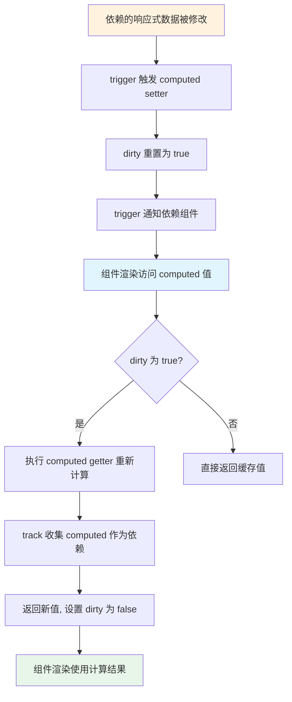

# 计算属性：实现原理与优势
计算属性是 Vue.js 开发中实用的 API，它允许用户定义一个计算方法，根据依赖的响应式数据计算新值并返回。当依赖变化时，计算属性自动重新计算获取新值。

在 Vue.js 2.x 中，可在组件对象中定义 computed 属性。Vue.js 3.0 仍支持沿用 2.x 的使用方式，也可以单独使用计算属性 API。

计算属性本质是对依赖的计算，那么为什么不直接用函数？Vue.js 3.0 中计算属性 API 如何实现？

### 计算属性 API：computed

Vue.js 3.0 提供 computed 函数作为计算属性 API。

简单示例：

```js
const count = ref(1)
const plusOne = computed(() => count.value + 1)
console.log(plusOne.value) // 2
plusOne.value++ // error
count.value++
console.log(plusOne.value) // 3
```

先用 ref API 创建响应式对象 count，再用 computed API 创建响应式对象 plusOne，其值为 `count.value + 1`。修改 `count.value` 时 `plusOne.value` 自动变化。

直接修改 `plusOne.value` 会报错，因为传入的是函数（getter），只能获取值而不能直接修改。

getter 函数根据响应式对象重新计算新值，这就是它被称作计算属性的原因，该响应式对象即计算属性的依赖。

有时希望直接修改 computed 返回值，可给 computed 传入一个对象：

```js
const count = ref(1)
const plusOne = computed({
  get: () => count.value + 1,
  set: val => {
    count.value = val - 1
  }
})
plusOne.value = 1
console.log(count.value) // 0
```

传入拥有 getter 和 setter 的对象：getter 返回 `count.value + 1`；修改 `plusOne.value` 触发 setter，setter 内部根据传入参数修改依赖值 `count.value`，依赖值被修改后再次获取计算属性会重新执行 getter，值随之变化。

computed API 的两种使用方式已清楚，下面看实现：

```js
function computed(getterOrOptions) {
  // getter 函数
  let getter
  // setter 函数
  let setter
  // 标准化参数
  if (isFunction(getterOrOptions)) {
    // 表明传入的是 getter 函数，不能修改计算属性的值
    getter = getterOrOptions
    setter = (process.env.NODE_ENV !== 'production')
      ? () => {
        console.warn('Write operation failed: computed value is readonly')
      }
      : NOOP
  }
  else {
    getter = getterOrOptions.get
    setter = getterOrOptions.set
  }
  // 数据是否脏的
  let dirty = true
  // 计算结果
  let value
  let computed
  // 创建副作用函数
  const runner = effect(getter, {
    // 延时执行
    lazy: true,
    // 标记这是一个 computed effect 用于在 trigger 阶段的优先级排序
    computed: true,
    // 调度执行的实现
    scheduler: () => {
      if (!dirty) {
        dirty = true
        // 派发通知，通知运行访问该计算属性的 activeEffect
        trigger(computed, "set" /* SET */, 'value')
      }
    }
  })
  // 创建 computed 对象
  computed = {
    __v_isRef: true,
    // 暴露 effect 对象以便计算属性可以停止计算
    effect: runner,
    get value() {
      // 计算属性的 getter
      if (dirty) {
        // 只有数据为脏的时候才会重新计算
        value = runner()
        dirty = false
      }
      // 依赖收集，收集运行访问该计算属性的 activeEffect
      track(computed, "get" /* GET */, 'value')
      return value
    },
    set value(newValue) {
      // 计算属性的 setter
      setter(newValue)
    }
  }
  return computed
}
```

computed 函数流程主要做三件事：标准化参数、创建副作用函数、创建 computed 对象。

**标准化参数**：computed 接受两种类型参数，一是 getter 函数，二是拥有 getter 和 setter 的对象。通过判断参数类型初始化内部的 getter 和 setter。

**创建副作用函数 runner**：computed 内部通过 effect 创建副作用函数，封装了 getter 函数。第二个参数（effect 配置对象）需注意：`lazy` 为 true 表示 runner 不会立即执行；`computed` 为 true 表示这是 computed effect，用于 trigger 阶段优先级排序（稍后分析）；`scheduler` 表示调度运行方式（稍后分析）。

**创建并返回 computed 对象**：对象拥有 getter 和 setter。访问对象触发 getter，判断 dirty，为 true 则执行 runner 然后做依赖收集；设置对象触发 setter，即执行内部定义的 setter 函数。

#### 计算属性的运行机制

computed 逻辑较绕，结合应用示例理解运行机制。需记住两个关键变量：`dirty` 表示计算属性的值是否「脏」（是否需要重新计算），`value` 表示每次计算后的结果。

示例：

```html
<template>
  <div>
    {{ plusOne }}
  </div>
  <button @click="plus">plus</button>
</template>
<script>
  import { ref, computed } from 'vue'
  export default {
    setup() {
      const count = ref(0)
      const plusOne = computed(() => {
        return count.value + 1
      })

      function plus() {
        count.value++
      }
      return {
        plusOne,
        plus
      }
    }
  }
</script>
```

用 computed API 创建计算属性对象 plusOne，传入 getter 函数（称 computed getter）。组件模板引用 plusOne 和 plus 函数。

组件渲染阶段访问 plusOne，触发 plusOne 的 getter：

```js
get value() {
  // 计算属性的 getter
  if (dirty) {
    // 只有数据为脏的时候才会重新计算
    value = runner()
    dirty = false
  }
  // 依赖收集，收集运行访问该计算属性的 activeEffect
  track(computed, "get" /* GET */, 'value')
  return value
}
```

默认 dirty 为 true，执行 runner，进一步执行 computed getter（即 `count.value + 1`）。访问 count 值且 count 是响应式对象，触发 count 的依赖收集。

需注意：runner 执行时访问 count，此时 activeEffect 是 runner 函数。runner 执行完毕把 dirty 设为 false，再执行 `track(computed, "get", 'value')`，此时 runner 已执行完，activeEffect 是组件副作用渲染函数。

因此有两个依赖收集过程：对 plusOne，收集的依赖是组件副作用渲染函数；对 count，收集的依赖是 plusOne 内部的 runner 函数。

点击按钮执行 plus 函数，`count.value++` 修改 count 值并派发通知。注意这不是直接调用 runner，而是把 runner 作为参数执行 scheduler。回顾 trigger 内部对 effect 的执行方式：

```js
const run = (effect) => {
  // 调度执行
  if (effect.options.scheduler) {
    effect.options.scheduler(effect)
  }
  else {
    // 直接运行
    effect()
  }
}
```

computed 内部创建副作用函数时已配置 scheduler：

```js
scheduler: () => {
  if (!dirty) {
    dirty = true
    // 派发通知，通知运行访问该计算属性的 activeEffect
    trigger(computed, "set" /* SET */, 'value')
  }
}
```

它不计算新值，仅把 dirty 设为 true，再执行 `trigger(computed, "set", 'value')` 通知 plusOne 依赖的组件渲染副作用函数，触发组件重新渲染。

组件重新渲染时再次访问 plusOne，此时 dirty 为 true，执行 computed getter 求得新值。这就是组件未直接访问 count，但修改 count 值后组件仍重新渲染的原因。



> computed 通过 `dirty` 标志实现「惰性求值 + 缓存」：只有 dirty 为 true 时才重新计算，依赖变化时只把 dirty 置为 true 并通知组件更新，真正计算延后到下次访问。

computed 计算属性有两个特点：

1. **延时计算**：只有访问计算属性时才真正运行 computed getter 计算；
2. **缓存**：内部缓存上次计算结果 value，只有 dirty 为 true 才重新计算；访问时 dirty 为 false 直接返回 value。

由此回答开头的问题：相比普通函数，计算属性的优势是**只要依赖不变化，就能使用缓存的 value，而不必每次渲染组件都执行函数计算**——典型的空间换时间优化。

#### 嵌套计算属性

计算属性支持嵌套，修改示例，不在渲染函数中访问 plusOne，而在另一个计算属性中访问：

```js
const count = ref(0)
const plusOne = computed(() => {
  return count.value + 1
})
const plusTwo = computed(() => {
  return plusOne.value + 1
})
console.log(plusTwo.value)
```

访问 plusTwo 时过程与前面类似，同样是两次依赖收集：对 plusOne，收集的依赖是 plusTwo 内部的 runner；对 count，收集的依赖是 plusOne 内部的 runner。

修改 count 值派发通知，先运行 plusOne 的 scheduler 把 dirty 置为 true，再 trigger 派发通知运行 plusTwo 的 scheduler 把 dirty 置为 true。再次访问 plusTwo 时 dirty 为 true，执行 plusTwo 的 computed getter（`plusOne.value + 1`），进而执行 plusOne 的 computed getter（`count.value + 1 + 1`），求得最终值 2。

得益于这种巧妙设计，无论嵌套多少层计算属性都能正常工作。

#### 计算属性的执行顺序

前面提到 computed 内部创建副作用函数时配置 `computed: true`，标识这是 computed effect，用于 trigger 阶段优先级排序。回顾 trigger 执行 effects 的过程：

```js
const add = (effectsToAdd) => {
  if (effectsToAdd) {
    effectsToAdd.forEach(effect => {
      if (effect !== activeEffect || !shouldTrack) {
        if (effect.options.computed) {
          computedRunners.add(effect)
        }
        else {
          effects.add(effect)
        }
      }
    })
  }
}
const run = (effect) => {
  if (effect.options.scheduler) {
    effect.options.scheduler(effect)
  }
  else {
    effect()
  }
}
computedRunners.forEach(run)
effects.forEach(run)
```

前面分析 trigger 时为简化主干省略了 computedRunners 分支。实际添加待运行 effects 时会判断是否为 computed effect，是则加入 computedRunners，后续优先执行 computedRunners，再执行普通 effects。

为何如此设计？考虑特殊场景：

```js
import { ref, computed } from 'vue'
import { effect } from '@vue/reactivity'
const count = ref(0)
const plusOne = computed(() => {
  return count.value + 1
})
effect(() => {
  console.log(plusOne.value + count.value)
})
function plus() {
  count.value++
}
plus()
```

运行结果输出：

```plain
1
3
3
```

执行 effect 时运行 `console.log(plusOne.value + count.value)`，第一次输出 1（count.value 为 0，plusOne.value 为 1）。

连续两次输出 3 的原因：plusOne 和 count 的依赖都是这个 effect，执行 plus 修改 count 会触发并执行该 effect；plusOne 的 runner 也是 count 的依赖，count 修改也会执行 plusOne 的 runner，再次执行 plusOne 的依赖即 effect，因此输出两次。

为何两次都输出 3？这与先执行 computed runner 有关。plusOne 的 runner 和 effect 都是 count 的依赖，修改 count 时二者都会执行，执行顺序很关键。

先执行 plusOne 的 runner，把 dirty 设为 true，通知其依赖 effect 执行 `plusOne.value + count.value`。此时 dirty 为 true，再次执行 plusOne 的 getter 计算新值（2），加 1 得 3。执行完 plusOne 的 runner 及依赖更新后，再执行 count 的普通 effect 依赖，执行 `plusOne.value + count.value`，此时 plusOne dirty 为 false，直接返回上次结果 2，加 1 又得 3。

若交换顺序（先 effect 后 computed runner），输出变为：

```plain
1
2
3
```

第一次输出 1 好理解。第二次为何输出 2？执行 plus 修改 count，触发 plusOne 的 runner 和 effect 执行，这次先让 effect 执行 `plusOne.value + count.value`，访问 `plusOne.value` 时 plusOne 的 runner 尚未执行，dirty 为 false，得到上次结果 1，加 1 得 2。再执行 plusOne 的 runner 把 dirty 置为 true 并通知 effect，`plusOne.value + count.value` 此时 dirty 为 true 重新计算新值 2，加 1 得 3。

因此 effect 依赖 plusOne 和 count 时，让 plusOne 先计算更合理，这就是 computed runner 要优先于普通 effect 的原因。

### 总结

> **本文的相关代码在源代码中的位置如下：**
> packages/reactivity/src/computed.ts
