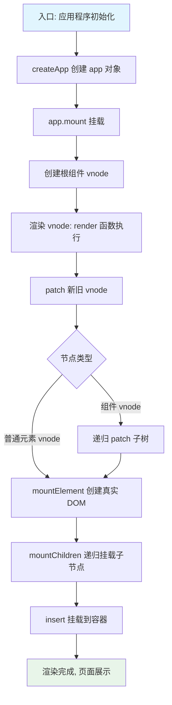

# 组件渲染：vnode 到真实 DOM
组件是对一棵 DOM 树的抽象。在页面中写一个组件节点：

```html
<hello-world></hello-world>
```

这段代码并不会在页面上渲染一个 `<hello-world>` 标签，具体渲染成什么取决于怎么编写 HelloWorld 组件的模板。例如 HelloWorld 组件内部的模板定义：

```html
<template>
  <div>
    <p>Hello World</p>
  </div>
</template>
```

模板内部最终会在页面上渲染一个 div，内部包含一个 p 标签，用来显示 Hello World 文本。

从表现上看，组件的模板决定了组件生成的 DOM 标签；在 Vue.js 内部，一个组件真正渲染生成 DOM，要经历「创建 vnode → 渲染 vnode → 生成 DOM」几个步骤：


> 组件模板决定了生成的 DOM 标签结构，而 VNode（虚拟节点）是描述组件信息的 JavaScript 对象，整个渲染过程就是「模板 → VNode → 真实 DOM」的转换。

### 应用程序初始化

组件通过「模板加对象描述」的方式创建。组件树从根组件开始渲染，要找到根组件的渲染入口，需要从应用程序的初始化过程分析。

```js
// 在 Vue.js 2.x 中，初始化一个应用的方式如下
import Vue from 'vue'
import App from './App'
const app = new Vue({
  render: h => h(App)
})
app.$mount('#app')
```

```js
// 在 Vue.js 3.0 中，初始化一个应用的方式如下
import { createApp } from 'vue'
import App from './app'
const app = createApp(App)
app.mount('#app')
```

Vue.js 3.0 初始化应用的方式与 2.x 差别不大，本质上都是把 App 组件挂载到 id 为 app 的 DOM 节点上。

Vue.js 3.0 还引入了 `createApp` 入口函数，它是 Vue.js 对外暴露的函数，下面看其内部实现：

```js
const createApp = ((...args) => {
  // 创建 app 对象
  const app = ensureRenderer().createApp(...args)
  const { mount } = app
  // 重写 mount 方法
  app.mount = (containerOrSelector) => {
    // ...
  }
  return app
})
```

`createApp` 主要做两件事：创建 app 对象、重写 app.mount 方法。

#### 1. 创建 app 对象

通过 `ensureRenderer().createApp()` 创建 app 对象：

```js
 const app = ensureRenderer().createApp(...args)
```

`ensureRenderer()` 用来延时创建渲染器对象：

```js
// 渲染相关的一些配置，比如更新属性的方法，操作 DOM 的方法
const rendererOptions = {
  patchProp,
  ...nodeOps
}
let renderer
// 延时创建渲染器，当用户只依赖响应式包的时候，可以通过 tree-shaking 移除核心渲染逻辑相关的代码
function ensureRenderer() {
  return renderer || (renderer = createRenderer(rendererOptions))
}
function createRenderer(options) {
  return baseCreateRenderer(options)
}
function baseCreateRenderer(options) {
  function render(vnode, container) {
    // 组件渲染的核心逻辑
  }
  return {
    render,
    createApp: createAppAPI(render)
  }
}
function createAppAPI(render) {
  // createApp 方法接受的两个参数：根组件的对象和 prop
  return function createApp(rootComponent, rootProps = null) {
    const app = {
      _component: rootComponent,
      _props: rootProps,
      mount(rootContainer) {
        // 创建根组件的 vnode
        const vnode = createVNode(rootComponent, rootProps)
        // 利用渲染器渲染 vnode
        render(vnode, rootContainer)
        app._container = rootContainer
        return vnode.component.proxy
      }
    }
    return app
  }
}
```

`ensureRenderer()` 延时创建渲染器，当用户只依赖响应式包时就不会创建渲染器，从而可以通过 tree-shaking 移除核心渲染逻辑相关的代码。

这里涉及渲染器的概念，它是为跨平台渲染做准备的，之后会在自定义渲染器的相关内容中详细说明。可简单地把渲染器理解为包含平台渲染核心逻辑的 JavaScript 对象。

Vue.js 3.0 内部通过 `createRenderer` 创建一个渲染器，其内部的 `createApp` 方法是执行 `createAppAPI` 返回的函数，接受 `rootComponent` 和 `rootProps` 两个参数。在应用层面执行 `createApp(App)` 时，会把 App 组件对象作为根组件传递给 `rootComponent`，从而创建出提供 `mount` 方法的 app 对象。

整个 app 对象创建过程中，Vue.js 利用闭包和函数柯里化很好地实现了参数保留。例如执行 `app.mount` 时无需再传入渲染器 `render`，因为在执行 `createAppAPI` 时 `render` 参数已经被保留。

#### 2. 重写 app.mount 方法

`createApp` 返回的 app 对象已拥有 `mount` 方法，但入口函数又重写了它。思考一下：为什么不在 app 对象的 `mount` 方法内部实现相关逻辑，而要在此处重写？

原因是 Vue.js 不仅服务于 Web 平台，目标是支持跨平台渲染。而 `createApp` 内部的 `app.mount` 是一个标准的可跨平台组件渲染流程：

```js
mount(rootContainer) {
  // 创建根组件的 vnode
  const vnode = createVNode(rootComponent, rootProps)
  // 利用渲染器渲染 vnode
  render(vnode, rootContainer)
  app._container = rootContainer
  return vnode.component.proxy
}
```

标准跨平台渲染流程先创建 vnode 再渲染 vnode。参数 `rootContainer` 也可以是不同类型的值：Web 平台中是 DOM 对象，其他平台（如 Weex、小程序）中可以是其他类型。因此这部分代码不应包含任何平台相关逻辑，执行逻辑都与平台无关。需要在外部重写该方法，完善 Web 平台下的渲染逻辑。

看 `app.mount` 重写做了哪些事情：

```js
app.mount = (containerOrSelector) => {
  // 标准化容器
  const container = normalizeContainer(containerOrSelector)
  if (!container)
    return
  const component = app._component
   // 如组件对象没有定义 render 函数和 template 模板，则取容器的 innerHTML 作为组件模板内容
  if (!isFunction(component) && !component.render && !component.template) {
    component.template = container.innerHTML
  }
  // 挂载前清空容器内容
  container.innerHTML = ''
  // 真正的挂载
  return mount(container)
}
```

先通过 `normalizeContainer` 标准化容器（可传字符串选择器或 DOM 对象；若为字符串选择器则转成 DOM 对象作为最终挂载容器）。然后判断：若组件对象没有定义 render 函数和 template 模板，则取容器的 innerHTML 作为组件模板内容；挂载前清空容器内容，最终调用 `app.mount` 走标准组件渲染流程。

重写的逻辑都与 Web 平台相关，因此放在外部实现，既让用户使用 API 时更灵活，也兼容了 Vue.js 2.x 的写法（`app.mount` 的第一个参数同时支持选择器字符串和 DOM 对象两种类型）。

从 `app.mount` 开始才真正进入组件渲染流程，下面重点看核心渲染流程做的两件事：创建 vnode 和渲染 vnode。

### 核心渲染流程：创建 vnode 和渲染 vnode

#### 1. 创建 vnode

vnode 本质上是描述 DOM 的 JavaScript 对象，在 Vue.js 中可以描述不同类型的节点，如普通元素节点、组件节点等。

**普通元素节点**示例，在 HTML 中使用 `<button>` 标签写按钮：

```html
<button class="btn" style="width:100px;height:50px">click me</button>
```

用 vnode 表示 `<button>` 标签：

```js
const vnode = {
  type: 'button',
  props: {
    'class': 'btn',
    style: {
      width: '100px',
      height: '50px'
    }
  },
  children: 'click me'
}
```

`type` 表示 DOM 的标签类型，`props` 表示 style、class 等附加信息，`children` 表示 DOM 的子节点（也可以是 vnode 数组，简单的文本用字符串表示）。

**组件节点**示例，在模板中引入组件标签 `<custom-component>`：

```html
<custom-component msg="test"></custom-component>
```

用 vnode 表示 `<custom-component>` 组件标签：

```js
const CustomComponent = {
  // 在这里定义组件对象
}
const vnode = {
  type: CustomComponent,
  props: {
    msg: 'test'
  }
}
```

组件 vnode 是对抽象事物的描述——页面上并不会真正渲染 `<custom-component>` 标签，而是渲染组件内部定义的 HTML 标签。

除这两种类型外，还有纯文本 vnode、注释 vnode 等，本文主线只研究组件 vnode 和普通元素 vnode，其余不赘述。

Vue.js 3.0 内部还针对 vnode 的 type 做了更详尽的分类（Suspense、Teleport 等），并把 vnode 的类型信息做了编码，以便后续 patch 阶段根据不同类型执行相应处理逻辑：

```js
const shapeFlag = isString(type)
  ? 1 /* ELEMENT */
  : isSuspense(type)
    ? 128 /* SUSPENSE */
    : isTeleport(type)
      ? 64 /* TELEPORT */
      : isObject(type)
        ? 4 /* STATEFUL_COMPONENT */
        : isFunction(type)
          ? 2 /* FUNCTIONAL_COMPONENT */
          : 0
```

**vnode 的优势**在于：

- **抽象**：引入 vnode 把渲染过程抽象化，提升组件的抽象能力；
- **跨平台**：patch vnode 的过程不同平台可有自己的实现，基于 vnode 做服务端渲染、Weex、小程序等平台的渲染都更容易。

需注意：使用 vnode 并不意味着不用操作 DOM，性能也未必优于手动操作原生 DOM。基于 vnode 的 MVVM 框架在每次 render to vnode 时有 JavaScript 耗时，大组件（如 1000×10 的 Table）遍历创建内部 cell vnode 的耗时较长，加上 patch 过程的耗时，更新时用户会感觉到明显卡顿。即便 diff 算法在减少 DOM 操作方面足够优秀，最终仍免不了操作 DOM，因此性能并不是 vnode 的优势。

**vnode 的创建**通过 `createVNode` 函数。回顾 `app.mount`，内部通过它创建根组件 vnode：

```js
 const vnode = createVNode(rootComponent, rootProps)
```

`createVNode` 的大致实现：

```js
function createVNode(type, props = null
,children = null) {
  if (props) {
    // 处理 props 相关逻辑，标准化 class 和 style
  }
  // 对 vnode 类型信息编码
  const shapeFlag = isString(type)
    ? 1 /* ELEMENT */
    : isSuspense(type)
      ? 128 /* SUSPENSE */
      : isTeleport(type)
      ? 64 /* TELEPORT */
      : isObject(type)
        ? 4 /* STATEFUL_COMPONENT */
        : isFunction(type)
          ? 2 /* FUNCTIONAL_COMPONENT */
          : 0
  const vnode = {
    type,
    props,
    shapeFlag,
    // 一些其他属性
  }
  // 标准化子节点，把不同数据类型的 children 转成数组或者文本类型
  normalizeChildren(vnode, children)
  return vnode
}
```

`createVNode` 做的事很简单：对 props 做标准化处理、对 vnode 的类型信息编码、创建 vnode 对象、标准化子节点 children。

创建好 vnode 对象后，接下来把它渲染到页面中。

#### 2. 渲染 vnode

回顾 `app.mount`，内部通过执行以下代码渲染创建好的 vnode：

```js
render(vnode, rootContainer)
const render = (vnode, container) => {
  if (vnode == null) {
    // 销毁组件
    if (container._vnode) {
      unmount(container._vnode, null, null, true)
    }
  } else {
    // 创建或者更新组件
    patch(container._vnode || null, vnode, container)
  }
  // 缓存 vnode 节点，表示已经渲染
  container._vnode = vnode
}
```

`render` 的实现很简单：第一个参数 vnode 为空则执行销毁组件的逻辑，否则执行创建或更新组件的逻辑。

看 `patch` 函数的实现：

```js
const patch = (n1, n2, container, anchor = null, parentComponent = null, parentSuspense = null, isSVG = false, optimized = false) => {
  // 如果存在新旧节点, 且新旧节点类型不同，则销毁旧节点
  if (n1 && !isSameVNodeType(n1, n2)) {
    anchor = getNextHostNode(n1)
    unmount(n1, parentComponent, parentSuspense, true)
    n1 = null
  }
  const { type, shapeFlag } = n2
  switch (type) {
    case Text:
      // 处理文本节点
      break
    case Comment:
      // 处理注释节点
      break
    case Static:
      // 处理静态节点
      break
    case Fragment:
      // 处理 Fragment 元素
      break
    default:
      if (shapeFlag & 1 /* ELEMENT */) {
        // 处理普通 DOM 元素
        processElement(n1, n2, container, anchor, parentComponent, parentSuspense, isSVG, optimized)
      }
      else if (shapeFlag & 6 /* COMPONENT */) {
        // 处理组件
        processComponent(n1, n2, container, anchor, parentComponent, parentSuspense, isSVG, optimized)
      }
      else if (shapeFlag & 64 /* TELEPORT */) {
        // 处理 TELEPORT
      }
      else if (shapeFlag & 128 /* SUSPENSE */) {
        // 处理 SUSPENSE
      }
  }
}
```

patch 意为「打补丁」，有两个功能：根据 vnode 挂载 DOM、根据新旧 vnode 更新 DOM。初次渲染只分析创建过程，更新过程在后面的章节分析。

创建过程中，patch 接受多个参数，重点关注前三个：

1. `n1` 表示旧的 vnode，为 null 时表示是一次挂载过程；
2. `n2` 表示新的 vnode 节点，后续根据其类型执行不同处理逻辑；
3. `container` 表示 DOM 容器，vnode 渲染生成的 DOM 会挂载到 container 下。

渲染的节点重点关注两类：对组件的处理、对普通 DOM 元素的处理。

**先分析对组件的处理**。初始化渲染的是 App 组件（组件 vnode），看处理组件的逻辑 `processComponent`：

```js
const processComponent = (n1, n2, container, anchor, parentComponent, parentSuspense, isSVG, optimized) => {
  if (n1 == null) {
   // 挂载组件
   mountComponent(n2, container, anchor, parentComponent, parentSuspense, isSVG, optimized)
  }
  else {
    // 更新组件
    updateComponent(n1, n2, parentComponent, optimized)
  }
}
```

逻辑很简单：n1 为 null 执行挂载组件的逻辑，否则执行更新组件的逻辑。

看挂载组件的 `mountComponent`：

```js
const mountComponent = (initialVNode, container, anchor, parentComponent, parentSuspense, isSVG, optimized) => {
  // 创建组件实例
  const instance = (initialVNode.component = createComponentInstance(initialVNode, parentComponent, parentSuspense))
  // 设置组件实例
  setupComponent(instance)
  // 设置并运行带副作用的渲染函数
  setupRenderEffect(instance, initialVNode, container, anchor, parentSuspense, isSVG, optimized)
}
```

`mountComponent` 主要做三件事：创建组件实例、设置组件实例、设置并运行带副作用的渲染函数。

创建组件实例：Vue.js 3.0 虽不像 2.x 那样通过类实例化组件，但内部也通过对象方式创建当前渲染的组件实例。

设置组件实例：`instance` 保留很多组件相关数据，维护组件上下文，包括 props、插槽及其他实例属性的初始化。

创建和设置组件实例这两个流程在后续章节详细分析。最后看运行带副作用的渲染函数 `setupRenderEffect`：

```js
const setupRenderEffect = (instance, initialVNode, container, anchor, parentSuspense, isSVG, optimized) => {
  // 创建响应式的副作用渲染函数
  instance.update = effect(function componentEffect() {
    if (!instance.isMounted) {
      // 渲染组件生成子树 vnode
      const subTree = (instance.subTree = renderComponentRoot(instance))
      // 把子树 vnode 挂载到 container 中
      patch(null, subTree, container, anchor, instance, parentSuspense, isSVG)
      // 保留渲染生成的子树根 DOM 节点
      initialVNode.el = subTree.el
      instance.isMounted = true
    }
    else {
      // 更新组件
    }
  }, prodEffectOptions)
}
```

该函数利用响应式库的 `effect` 函数创建副作用渲染函数 `componentEffect`（effect 的实现在响应式章节具体说明）。**副作用**可简单理解为：当组件的数据发生变化时，effect 包裹的内部渲染函数 `componentEffect` 会重新执行，从而达到重新渲染组件的目的。

渲染函数内部也会判断是初始渲染还是组件更新。这里只分析初始渲染流程。

**初始渲染主要做两件事：渲染组件生成 subTree、把 subTree 挂载到 container 中。**

渲染组件生成 subTree，它也是一个 vnode 对象。注意别把 subTree 和 initialVNode 弄混（Vue.js 3.0 中按命名即可区分；2.x 中分别命名为 `_vnode` 和 `$vnode`）。举例：在父组件 App 中引入 Hello 组件：

```html
<template>
  <div class="app">
    <p>This is an app.</p>
    <hello></hello>
  </div>
</template>
```

Hello 组件中是 `<div>` 标签包裹一个 `<p>` 标签：

```html
<template>
  <div class="hello">
    <p>Hello, Vue 3.0!</p>
  </div>
</template>
```

App 组件中 `<hello>` 节点渲染生成的 vnode，对应 Hello 组件的 initialVNode（组件 vnode）；Hello 组件内部整个 DOM 节点对应的 vnode，是执行 `renderComponentRoot` 渲染生成的 subTree（子树 vnode）。

每个组件都有对应的 render 函数（即使写 template 也会编译成 render 函数），`renderComponentRoot` 就是去执行 render 函数创建整个组件树内部的 vnode，再经一层标准化得到返回值：子树 vnode。

渲染生成子树 vnode 后，继续调用 patch 把子树 vnode 挂载到 container 中。

再次回到 patch 函数，继续对子树 vnode 类型判断。上述例子中 App 组件的根节点是 `<div>` 标签，对应子树 vnode 也是普通元素 vnode，下面分析**对普通 DOM 元素的处理流程**。

先看处理普通 DOM 元素的 `processElement`：

```js
const processElement = (n1, n2, container, anchor, parentComponent, parentSuspense, isSVG, optimized) => {
  isSVG = isSVG || n2.type === 'svg'
  if (n1 == null) {
    //挂载元素节点
    mountElement(n2, container, anchor, parentComponent, parentSuspense, isSVG, optimized)
  }
  else {
    //更新元素节点
    patchElement(n1, n2, parentComponent, parentSuspense, isSVG, optimized)
  }
}
```

逻辑很简单：n1 为 null 走挂载元素节点逻辑，否则走更新元素节点逻辑。

看挂载元素的 `mountElement`：

```js
const mountElement = (vnode, container, anchor, parentComponent, parentSuspense, isSVG, optimized) => {
  let el
  const { type, props, shapeFlag } = vnode
  // 创建 DOM 元素节点
  el = vnode.el = hostCreateElement(vnode.type, isSVG, props && props.is)
  if (props) {
    // 处理 props，比如 class、style、event 等属性
    for (const key in props) {
      if (!isReservedProp(key)) {
        hostPatchProp(el, key, null, props[key], isSVG)
      }
    }
  }
  if (shapeFlag & 8 /* TEXT_CHILDREN */) {
    // 处理子节点是纯文本的情况
    hostSetElementText(el, vnode.children)
  }
  else if (shapeFlag & 16 /* ARRAY_CHILDREN */) {
    // 处理子节点是数组的情况
    mountChildren(vnode.children, el, null, parentComponent, parentSuspense, isSVG && type !== 'foreignObject', optimized || !!vnode.dynamicChildren)
  }
  // 把创建的 DOM 元素节点挂载到 container 上
  hostInsert(el, container, anchor)
}
```

`mountElement` 主要做四件事：创建 DOM 元素节点、处理 props、处理 children、挂载 DOM 元素到 container 上。

创建 DOM 元素节点通过 `hostCreateElement`，这是平台相关的方法，看 Web 环境下的定义：

```js
function createElement(tag, isSVG, is) {
  return isSVG ? document.createElementNS(svgNS, tag)
    : document.createElement(tag, is ? { is } : undefined)
}
```

它调用底层 DOM API `document.createElement` 创建元素。Vue.js 强调不操作 DOM，只是希望用户不直接碰触 DOM，底层仍会操作 DOM。

若是其他平台（如 Weex），`hostCreateElement` 不再是操作 DOM，而是平台相关 API，这些平台方法在创建渲染器阶段作为参数传入。

创建完 DOM 节点后，若有 props，给该 DOM 节点添加 class、style、event 等属性，逻辑在 `hostPatchProp` 内部，此处不展开。

子节点处理：DOM 是一棵树，vnode 同样是一棵树，且和 DOM 结构一一映射。

子节点是纯文本时执行 `hostSetElementText`，Web 环境下通过设置 DOM 元素的 textContent 属性设置文本：

```js
function setElementText(el, text) {
  el.textContent = text
}
```

子节点是数组时执行 `mountChildren`：

```js
const mountChildren = (children, container, anchor, parentComponent, parentSuspense, isSVG, optimized, start = 0) => {
  for (let i = start; i < children.length; i++) {
    // 预处理 child
    const child = (children[i] = optimized
      ? cloneIfMounted(children[i])
      : normalizeVNode(children[i]))
    // 递归 patch 挂载 child
    patch(null, child, container, anchor, parentComponent, parentSuspense, isSVG, optimized)
  }
}
```

子节点挂载逻辑很简单：遍历 children 获取每个 child，递归执行 patch 挂载。注意对 child 有预处理的情况（编译优化章节详细分析）。

`mountChildren` 的第二个参数是 container，调用时传入的第二个参数是 `mountElement` 创建的 DOM 节点，由此建立父子关系。

通过递归 patch 这种深度优先遍历树的方式，可以构造完整的 DOM 树，完成组件渲染。

处理完所有子节点后，最后通过 `hostInsert` 把创建的 DOM 元素节点挂载到 container 上，Web 环境下定义：

```js
function insert(child, parent, anchor) {
  if (anchor) {
    parent.insertBefore(child, anchor)
  }
  else {
    parent.appendChild(child)
  }
}
```

有参考元素 anchor 时执行 `parent.insertBefore`，否则执行 `parent.appendChild` 把 child 添加到 parent 下，完成节点挂载。

`insert` 在执行处理子节点之后，因此挂载顺序是先子节点后父节点，最终挂载到最外层容器上。

> **知识延伸：嵌套组件**
> `mountChildren` 时递归执行的是 patch 函数而非 `mountElement`，因为子节点可能有其他类型的 vnode（如组件 vnode）。
> 嵌套组件是真实开发中的常见场景。组件 vnode 主要维护组件定义对象、组件上的各种 props，组件本身是抽象节点，其渲染通过执行组件定义的 render 函数生成子树 vnode，再 patch。通过这种递归方式，无论组件嵌套层级多深，都可以完成整个组件树的渲染。

### 总结



> 渲染采用「先子后父」的挂载顺序，子节点递归通过 patch 完成，最终挂载到最外层容器上。

> **本文的相关代码在源代码中的位置如下：**
> packages/runtime-dom/src/index.ts
> packages/runtime-core/src/apiCreateApp.ts
> packages/runtime-core/src/vnode.ts
> packages/runtime-core/src/renderer.ts
> packages/runtime-dom/src/nodeOps.ts
