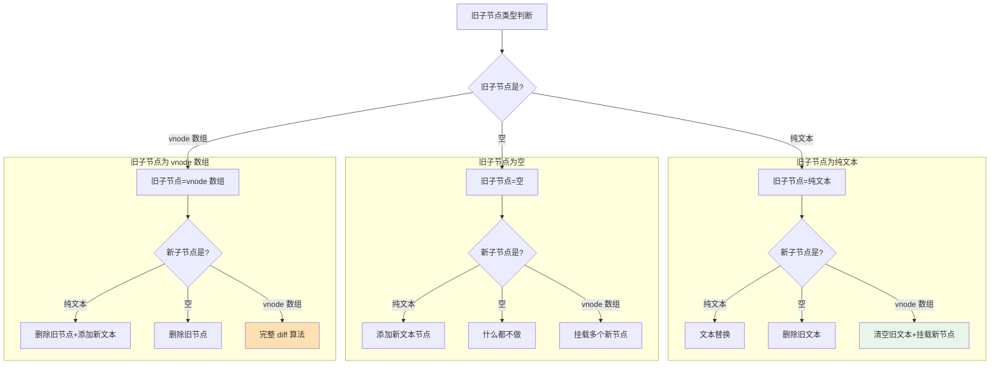
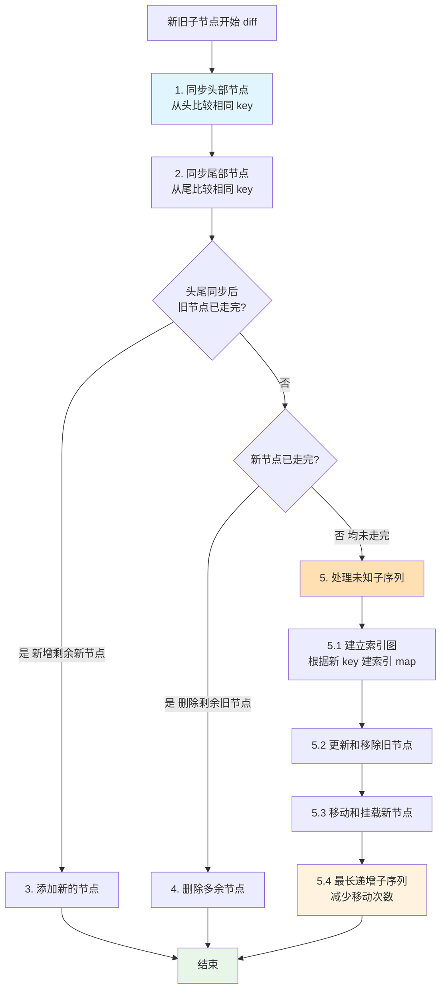

# 组件更新：DOM diff 流程

组件由模板、组件描述对象和数据构成，数据变化会驱动组件更新。渲染阶段创建的副作用渲染函数（effect）会在数据变化时再次执行，从而触发组件更新。本文分析从副作用渲染函数到最终 DOM 更新的完整链路。

### 副作用渲染函数触发更新

`setupRenderEffect` 创建的副作用渲染函数，在组件挂载后（`instance.isMounted` 为 true）再次执行时进入更新分支：

```js
const setupRenderEffect = (instance, initialVNode, container, anchor, parentSuspense, isSVG, optimized) => {
  // 创建响应式的副作用渲染函数
  instance.update = effect(function componentEffect() {
    if (!instance.isMounted) {
      // 渲染组件
    }
    else {
      // 更新组件
      let { next, vnode } = instance
      // next 表示新的组件 vnode
      if (next) {
        // 更新组件 vnode 节点信息
        updateComponentPreRender(instance, next, optimized)
      }
      else {
        next = vnode
      }
      // 渲染新的子树 vnode
      const nextTree = renderComponentRoot(instance)
      // 缓存旧的子树 vnode
      const prevTree = instance.subTree
      // 更新子树 vnode
      instance.subTree = nextTree
      // 组件更新核心逻辑，根据新旧子树 vnode 做 patch
      patch(prevTree, nextTree,
        // 如果在 teleport 组件中父节点可能已经改变，所以容器直接找旧树 DOM 元素的父节点
        hostParentNode(prevTree.el),
        // 参考节点在 fragment 的情况可能改变，所以直接找旧树 DOM 元素的下一个节点
        getNextHostNode(prevTree),
        instance,
        parentSuspense,
        isSVG)
      // 缓存更新后的 DOM 节点
      next.el = nextTree.el
    }
  }, prodEffectOptions)
}
```

更新分支主要做三件事：

1. **更新组件 vnode 节点**：通过判断 `instance.next` 是否存在决定用新 vnode 还是当前 vnode（原因见后文"组件更新策略"）。
2. **渲染新的子树 vnode**：数据变化使模板重新求值，子树 vnode 随之改变。
3. **执行核心 patch 逻辑**：对比新旧子树 vnode，找出差异并以合适方式更新 DOM。

#### 核心逻辑：patch 流程

```js
const patch = (n1, n2, container, anchor = null, parentComponent = null, parentSuspense = null, isSVG = false, optimized = false) => {
  // 如果存在新旧节点, 且新旧节点类型不同，则销毁旧节点
  if (n1 && !isSameVNodeType(n1, n2)) {
    anchor = getNextHostNode(n1)
    unmount(n1, parentComponent, parentSuspense, true)
    // n1 设置为 null 保证后续都走 mount 逻辑
    n1 = null
  }
  const { type, shapeFlag } = n2
  switch (type) {
    case Text:
      // 处理文本节点
      break
    case Comment:
      // 处理注释节点
      break
    case Static:
      // 处理静态节点
      break
    case Fragment:
      // 处理 Fragment 元素
      break
    default:
      if (shapeFlag & 1 /* ELEMENT */) {
        // 处理普通 DOM 元素
        processElement(n1, n2, container, anchor, parentComponent, parentSuspense, isSVG, optimized)
      }
      else if (shapeFlag & 6 /* COMPONENT */) {
        // 处理组件
        processComponent(n1, n2, container, anchor, parentComponent, parentSuspense, isSVG, optimized)
      }
      else if (shapeFlag & 64 /* TELEPORT */) {
        // 处理 TELEPORT
      }
      else if (shapeFlag & 128 /* SUSPENSE */) {
        // 处理 SUSPENSE
      }
  }
}
function isSameVNodeType (n1, n2) {
  // n1 和 n2 节点的 type 和 key 都相同，才是相同节点
  return n1.type === n2.type && n1.key === n2.key
}
```

patch 首先判断新旧节点是否为相同 vnode 类型：若不同（如 `div` 更新为 `ul`），直接删除旧节点再挂载新节点；若相同，则进入 diff 更新流程，按 vnode 类型分派。本文重点分析普通元素与组件两类。

##### 1. 处理组件

以父组件 `App` 引入 `Hello` 组件为例：

```html
<template>
  <div class="app">
    <p>This is an app.</p>
    <hello :msg="msg"></hello>
    <button @click="toggle">Toggle msg</button>
  </div>
</template>
<script>
  export default {
    data() {
      return {
        msg: 'Vue'
      }
    },
    methods: {
      toggle() {
        this.msg = this.msg === 'Vue' ? 'World' : 'Vue'
      }
    }
  }
</script>
```

`Hello` 组件的根节点是 `<div>`：

```html
<template>
  <div class="hello">
    <p>Hello, {{msg}}</p>
  </div>
</template>
<script>
  export default {
    props: {
      msg: String
    }
  }
</script>
```

点击按钮修改 `msg` 会触发 `App` 重新渲染。由于 `App` 根节点是普通元素，子树 vnode 先进入 `processElement`；组件更新最终要落到真实 DOM 的更新，而普通元素的处理才是真正执行 DOM 更新的地方，因此先跳过组件分支，待分析完普通元素后再回看。

更新过程是树的深度优先遍历：更新完当前节点后递归更新子节点，遍历到 `hello` 组件 vnode 时进入 `processComponent`：

```js
const processComponent = (n1, n2, container, anchor, parentComponent, parentSuspense, isSVG, optimized) => {
  if (n1 == null) {
    // 挂载组件
  }
  else {
    // 更新子组件
    updateComponent(n1, n2, parentComponent, optimized)
  }
}
const updateComponent = (n1, n2, parentComponent, optimized) => {
  const instance = (n2.component = n1.component)
  // 根据新旧子组件 vnode 判断是否需要更新子组件
  if (shouldUpdateComponent(n1, n2, parentComponent, optimized)) {
    // 新的子组件 vnode 赋值给 instance.next
    instance.next = n2
    // 子组件也可能因为数据变化被添加到更新队列里了，移除它们防止对一个子组件重复更新
    invalidateJob(instance.update)
    // 执行子组件的副作用渲染函数
    instance.update()
  }
  else {
    // 不需要更新，只复制属性
    n2.component = n1.component
    n2.el = n1.el
  }
}
```

`processComponent` 通过 `updateComponent` 更新子组件。该函数先调用 `shouldUpdateComponent`，依据新旧子组件 vnode 的 `props`、`children`、`dirs`、`transition` 等属性判断是否需要更新。

> 要点：Vue 的更新粒度是组件级别的——组件自身数据变化只触发当前组件更新；但在父组件更新过程中，仍会对子组件做检查，通过 `invalidateJob` 避免子组件因自身数据变化被重复加入更新队列，再主动执行 `instance.update()` 触发子组件更新。

回到副作用渲染函数，更新 DOM 前需先更新组件 vnode 节点信息：

```js
// 更新组件
let { next, vnode } = instance
// next 表示新的组件 vnode
if (next) {
  // 更新组件 vnode 节点信息
  updateComponentPreRender(instance, next, optimized)
}
else {
  next = vnode
}
const updateComponentPreRender = (instance, nextVNode, optimized) => {
  // 新组件 vnode 的 component 属性指向组件实例
  nextVNode.component = instance
  // 旧组件 vnode 的 props 属性
  const prevProps = instance.vnode.props
  // 组件实例的 vnode 属性指向新的组件 vnode
  instance.vnode = nextVNode
  // 清空 next 属性，为了下一次重新渲染准备
  instance.next = null
  // 更新 props
  updateProps(instance, nextVNode.props, prevProps, optimized)
  // 更新插槽
  updateSlots(instance, nextVNode.children)
}
```

更新 DOM 前要先同步组件 vnode（指向新 vnode、更新 props 与插槽），因为后续的 `renderComponentRoot` 依赖更新后的 props 与 slots 重新生成子树 vnode。

组件重新渲染存在两种场景：

- **自身数据变化**：`next` 为 `null`，使用当前 `vnode`。
- **父组件更新时遇到子组件节点**：经 `shouldUpdateComponent` 判断需更新，则主动执行子组件 `instance.update()`，此时 `next` 为新的子组件 vnode。

新子组件 vnode 在父组件 `renderComponentRoot` 生成子树 vnode 时创建（子树是树形结构，遍历子节点即可访问到对应组件 vnode）。例如 `App` 重新渲染时，会一并生成 `hello` 对应的新组件 vnode。

##### 2. 处理普通元素

去掉 `Hello` 组件，仅保留普通元素的示例：

```html
<template>
  <div class="app">
    <p>This is {{msg}}.</p>
    <button @click="toggle">Toggle msg</button>
  </div>
</template>
<script>
  export default {
    data() {
      return {
        msg: 'Vue'
      }
    },
    methods: {
      toggle() {
        this.msg = this.msg === 'Vue' ? 'World' : 'Vue'
      }
    }
  }
</script>
```

点击按钮修改 `msg` 触发 `App` 重新渲染，子树 vnode 为普通元素，进入 `processElement`：

```js
const processElement = (n1, n2, container, anchor, parentComponent, parentSuspense, isSVG, optimized) => {
  isSVG = isSVG || n2.type === 'svg'
  if (n1 == null) {
    // 挂载元素
  }
  else {
    // 更新元素
    patchElement(n1, n2, parentComponent, parentSuspense, isSVG, optimized)
  }
}
const patchElement = (n1, n2, parentComponent, parentSuspense, isSVG, optimized) => {
  const el = (n2.el = n1.el)
  const oldProps = (n1 && n1.props) || EMPTY_OBJ
  const newProps = n2.props || EMPTY_OBJ
  // 更新 props
  patchProps(el, n2, oldProps, newProps, parentComponent, parentSuspense, isSVG)
  const areChildrenSVG = isSVG && n2.type !== 'foreignObject'
  // 更新子节点
  patchChildren(n1, n2, el, null, parentComponent, parentSuspense, areChildrenSVG)
}
```

元素更新做两件事：**更新 props**（`patchProps` 处理 class、style、event 等 DOM 属性）与**更新子节点**（`patchChildren`）。

```js
const patchChildren = (n1, n2, container, anchor, parentComponent, parentSuspense, isSVG, optimized = false) => {
  const c1 = n1 && n1.children
  const prevShapeFlag = n1 ? n1.shapeFlag : 0
  const c2 = n2.children
  const { shapeFlag } = n2
  // 子节点有 3 种可能情况：文本、数组、空
  if (shapeFlag & 8 /* TEXT_CHILDREN */) {
    if (prevShapeFlag & 16 /* ARRAY_CHILDREN */) {
      // 数组 -> 文本，则删除之前的子节点
      unmountChildren(c1, parentComponent, parentSuspense)
    }
    if (c2 !== c1) {
      // 文本对比不同，则替换为新文本
      hostSetElementText(container, c2)
    }
  }
  else {
    if (prevShapeFlag & 16 /* ARRAY_CHILDREN */) {
      // 之前的子节点是数组
      if (shapeFlag & 16 /* ARRAY_CHILDREN */) {
        // 新的子节点仍然是数组，则做完整地 diff
        patchKeyedChildren(c1, c2, container, anchor, parentComponent, parentSuspense, isSVG, optimized)
      }
      else {
        // 数组 -> 空，则仅仅删除之前的子节点
        unmountChildren(c1, parentComponent, parentSuspense, true)
      }
    }
    else {
      // 之前的子节点是文本节点或者为空
      // 新的子节点是数组或者为空
      if (prevShapeFlag & 8 /* TEXT_CHILDREN */) {
        // 如果之前子节点是文本，则把它清空
        hostSetElementText(container, '')
      }
      if (shapeFlag & 16 /* ARRAY_CHILDREN */) {
        // 如果新的子节点是数组，则挂载新子节点
        mountChildren(c2, container, anchor, parentComponent, parentSuspense, isSVG, optimized)
      }
    }
  }
}
```

子节点 vnode 有纯文本、vnode 数组、空三种情况，新旧组合共九种。下面用决策流程图整体呈现分支逻辑：



> 九种情况中，只有"旧子节点是 vnode 数组且新子节点也是 vnode 数组"时，才走最复杂的核心 diff 算法（见下一节）。其余情况都属于简单的增删改。

下面分别说明旧子节点为**纯文本、空、vnode 数组**三种情况的处理细节。

**旧子节点是纯文本**：

- 新子节点也是纯文本：直接文本替换；
- 新子节点是空：删除旧子节点；
- 新子节点是 vnode 数组：清空旧文本，再挂载多个新节点。


**旧子节点是空**：

- 新子节点是纯文本：添加新文本节点；
- 新子节点也是空：不做任何操作；
- 新子节点是 vnode 数组：挂载多个新节点。


**旧子节点是 vnode 数组**：

- 新子节点是纯文本：删除旧节点，再添加新文本；
- 新子节点是空：删除旧节点；
- 新子节点也是 vnode 数组：执行完整 diff，这是最复杂的情况，内部使用核心 diff 算法。


> **本文相关源码位置：**
> packages/runtime-core/src/renderer.ts
> packages/runtime-core/src/componentRenderUtils.ts

### 核心 diff 算法

新子节点数组相对旧子节点数组的变化，本质是更新、删除、添加、移动节点的组合。核心 diff 算法在已知旧子节点 DOM 结构、新旧 vnode 的前提下，以较低成本求解出生成新子节点 DOM 的系列操作。

先以列表插入为例建立直观认知：

```html
<ul>
  <li key="a">a</li>
  <li key="b">b</li>
  <li key="c">c</li>
  <li key="d">d</li>
</ul>
```

在中间插入一行得到新列表：

```html
<ul>
  <li key="a">a</li>
  <li key="b">b</li>
  <li key="e">e</li>
  <li key="c">c</li>
  <li key="d">d</li>
</ul>
```

插入前后对应的 vnode 结构如下：


差异主要在新子节点中 `b` 之后多了一个 `e` 节点。

再修改示例，删除中间一项：

```html
<ul>
  <li key="a">a</li>
  <li key="b">b</li>
  <li key="c">c</li>
  <li key="d">d</li>
  <li key="e">e</li>
</ul>
```

删除中间项得到：

```html
<ul>
  <li key="a">a</li>
  <li key="b">b</li>
  <li key="d">d</li>
  <li key="e">e</li>
</ul>
```

删除前后的 vnode 结构：


差异主要在新子节点中 `b` 之后少了一个 `c` 节点。

两个例子共同的特征是：**新旧 children 拥有相同的头尾节点**，这些相同节点只需对比更新。因此 diff 的第一步是**从头部开始同步**。在进入每一步前，先用流程图建立对整体算法的认知：



> diff 核心优化：头尾先同步（复用已有 DOM），剩余中间部分通过 key 索引 + 最长递增子序列减少节点移动次数。

### 同步头部节点

```js
const patchKeyedChildren = (c1, c2, container, parentAnchor, parentComponent, parentSuspense, isSVG, optimized) => {
  let i = 0
  const l2 = c2.length
  // 旧子节点的尾部索引
  let e1 = c1.length - 1
  // 新子节点的尾部索引
  let e2 = l2 - 1
  // 1. 从头部开始同步
  // i = 0, e1 = 3, e2 = 4
  // (a b) c d
  // (a b) e c d
  while (i <= e1 && i <= e2) {
    const n1 = c1[i]
    const n2 = c2[i]
    if (isSameVNodeType(n1, n2)) {
      // 相同的节点，递归执行 patch 更新节点
      patch(n1, n2, container, parentAnchor, parentComponent, parentSuspense, isSVG, optimized)
    }
    else {
      break
    }
    i++
  }
}
```

diff 过程维护三个索引：头部索引 `i`、旧子节点尾部索引 `e1`、新子节点尾部索引 `e2`。同步头部节点从头部依次对比新旧节点，相同则递归 `patch` 更新；一旦不同或索引越界，同步结束。

以插入 `e` 为例，同步头部后的结果：


同步后：`i = 2`，`e1 = 3`，`e2 = 4`。

### 同步尾部节点

```js
const patchKeyedChildren = (c1, c2, container, parentAnchor, parentComponent, parentSuspense, isSVG, optimized) => {
  let i = 0
  const l2 = c2.length
  // 旧子节点的尾部索引
  let e1 = c1.length - 1
  // 新子节点的尾部索引
  let e2 = l2 - 1
  // 1. 从头部开始同步
  // i = 0, e1 = 3, e2 = 4
  // (a b) c d
  // (a b) e c d
  // 2. 从尾部开始同步
  // i = 2, e1 = 3, e2 = 4
  // (a b) (c d)
  // (a b) e (c d)
  while (i <= e1 && i <= e2) {
    const n1 = c1[e1]
    const n2 = c2[e2]
    if (isSameVNodeType(n1, n2)) {
      patch(n1, n2, container, parentAnchor, parentComponent, parentSuspense, isSVG, optimized)
    }
    else {
      break
    }
    e1--
    e2--
  }
}
```

同步尾部节点从尾部依次对比新旧节点，相同则递归 `patch` 更新；一旦不同或索引越界，同步结束。

同步尾部后的结果：


同步后：`i = 2`，`e1 = 1`，`e2 = 2`。

头尾同步后仅剩三种情况：新子节点有剩余（添加）、旧子节点有剩余（删除）、未知子序列（移动 + 增删）。

### 添加新的节点

```js
const patchKeyedChildren = (c1, c2, container, parentAnchor, parentComponent, parentSuspense, isSVG, optimized) => {
  let i = 0
  const l2 = c2.length
  // 旧子节点的尾部索引
  let e1 = c1.length - 1
  // 新子节点的尾部索引
  let e2 = l2 - 1
  // 1. 从头部开始同步
  // i = 0, e1 = 3, e2 = 4
  // (a b) c d
  // (a b) e c d
  // 2. 从尾部开始同步
  // i = 2, e1 = 3, e2 = 4
  // (a b) (c d)
  // (a b) e (c d)
  // 3. 挂载剩余的新节点
  // i = 2, e1 = 1, e2 = 2
  if (i > e1) {
    if (i <= e2) {
      const nextPos = e2 + 1
      const anchor = nextPos < l2 ? c2[nextPos].el : parentAnchor
      while (i <= e2) {
        // 挂载新节点
        patch(null, c2[i], container, anchor, parentComponent, parentSuspense, isSVG)
        i++
      }
    }
  }
}
```

若 `i > e1` 且 `i <= e2`，说明旧节点已消费完而新节点仍有剩余，从 `i` 到 `e2` 之间直接 `patch(null, ...)` 挂载新子树。

对插入 `e` 的例子，同步尾部后 `i = 2`、`e1 = 1`、`e2 = 2`，满足条件，挂载结果：


挂载 `e` 后，旧子节点 DOM 与新子节点 vnode 映射一致，更新完成。

### 删除多余节点

```js
const patchKeyedChildren = (c1, c2, container, parentAnchor, parentComponent, parentSuspense, isSVG, optimized) => {
  let i = 0
  const l2 = c2.length
  // 旧子节点的尾部索引
  let e1 = c1.length - 1
  // 新子节点的尾部索引
  let e2 = l2 - 1
  // 1. 从头部开始同步
  // i = 0, e1 = 4, e2 = 3
  // (a b) c d e
  // (a b) d e
  // 2. 从尾部开始同步
  // i = 2, e1 = 4, e2 = 3
  // (a b) c (d e)
  // (a b) (d e)
  // 3. 普通序列挂载剩余的新节点
  // i = 2, e1 = 2, e2 = 1
  // 不满足
  if (i > e1) {
  }
  // 4. 普通序列删除多余的旧节点
  // i = 2, e1 = 2, e2 = 1
  else if (i > e2) {
    while (i <= e1) {
      // 删除节点
      unmount(c1[i], parentComponent, parentSuspense, true)
      i++
    }
  }
}
```

若 `i > e2`，说明新节点已消费完而旧节点仍有剩余，从 `i` 到 `e1` 之间直接 `unmount` 删除。

以删除 `c` 为例，从头部同步：


结果：`i = 2`，`e1 = 4`，`e2 = 3`。

再从尾部同步：


结果：`i = 2`，`e1 = 2`，`e2 = 1`，满足删除条件，删除多余节点：


删除 `c` 后，旧子节点 DOM 与新子节点 vnode 映射一致，更新完成。

### 处理未知子序列

添加与删除属于理想情况，操作直接；当节点顺序发生混合变化时，会出现未知子序列。仍以字母列表为例：

```html
<ul>
  <li key="a">a</li>
  <li key="b">b</li>
  <li key="c">c</li>
  <li key="d">d</li>
  <li key="e">e</li>
  <li key="f">f</li>
  <li key="g">g</li>
  <li key="h">h</li>
</ul>
```

打乱顺序得到新列表：

```html
<ul>
  <li key="a">a</li>
  <li key="b">b</li>
  <li key="e">e</li>
  <li key="c">c</li>
  <li key="d">d</li>
  <li key="i">i</li>
  <li key="g">g</li>
  <li key="h">h</li>
</ul>
```

操作前对应的 vnode 结构：


同步头部节点：


结果：`i = 2`，`e1 = 7`，`e2 = 7`。

同步尾部节点：


结果：`i = 2`，`e1 = 5`，`e2 = 5`。既不满足添加也不满足删除条件。要将旧子节点的 `c、d、e、f` 转换为新子节点的 `e、c、d、i`，做法是：把 `e` 移到 `c` 前、删除 `f`、在 `d` 后添加 `i`。

任何复杂情况最终都归结为更新、删除、添加、移动的组合，目标是求相对优的解：节点类型相同则更新；新子节点缺失旧节点则删除；新子节点多出旧节点则添加；顺序变化则需要移动。其中最复杂的是**移动**——既要判断哪些节点需移动，也要确定如何移动。

#### 移动子节点

当子节点排列顺序变化时触发移动。以数组为例：

```js
var prev = [1, 2, 3, 4, 5, 6]
var next = [1, 3, 2, 6, 4, 5]
```

从 `prev` 变为 `next` 时元素顺序发生变化。问题可简化为：用最少的移动使元素顺序从 `prev` 变为 `next`。

一种思路是在 `next` 中找递增子序列（如 `[1, 3, 6]`、`[1, 2, 4, 5]`），再对 `next` 倒序遍历，移动所有不在递增序列中的元素。

若选 `[1, 3, 6]` 为递增子序列，倒序遍历时 `6、3、1` 不动，`5、4、2` 移动：


若选 `[1, 2, 4, 5]`，倒序遍历时 `5、4、2、1` 不动，`6、3` 移动：


第一种移动 3 次，第二种仅移动 2 次。递增子序列越长，需要移动的元素越少，因此移动问题转化为**求解最长递增子序列**。

未知子序列的完整处理还需在新旧子序列中找出相同节点并更新、找出多余节点删除、找出新节点添加、判断是否移动及如何移动。遍历新旧子序列若用双重循环复杂度为 O(n²)，可用空间换时间建立索引图，将复杂度降为 O(n)。

#### 建立索引图

处理未知子序列的第一步是建立索引图。`v-for` 列表项的 `key` 在 diff 中起关键作用：key 相同即视为同一节点，直接 `patch` 更新。

根据 `key` 建立新子序列的索引图：

```js
const patchKeyedChildren = (c1, c2, container, parentAnchor, parentComponent, parentSuspense, isSVG, optimized) => {
  let i = 0
  const l2 = c2.length
  // 旧子节点的尾部索引
  let e1 = c1.length - 1
  // 新子节点的尾部索引
  let e2 = l2 - 1
  // 1. 从头部开始同步
  // i = 0, e1 = 7, e2 = 7
  // (a b) c d e f g h
  // (a b) e c d i g h
  // 2. 从尾部开始同步
  // i = 2, e1 = 7, e2 = 7
  // (a b) c d e f (g h)
  // (a b) e c d i (g h)
  // 3. 普通序列挂载剩余的新节点， 不满足
  // 4. 普通序列删除多余的旧节点，不满足
  // i = 2, e1 = 4, e2 = 5
  // 旧子序列开始索引，从 i 开始记录
  const s1 = i
  // 新子序列开始索引，从 i 开始记录
  const s2 = i
  // 5.1 根据 key 建立新子序列的索引图
  const keyToNewIndexMap = new Map()
  for (i = s2; i <= e2; i++) {
    const nextChild = c2[i]
    keyToNewIndexMap.set(nextChild.key, i)
  }
}
```

新旧子序列均从 `i` 开始，用 `s1`、`s2` 记录起始索引，再建立 `Map<key, index>` 结构遍历新子序列，将节点 `key` 与 `index` 写入 Map（此处假设所有节点均带 `key`）。

示例处理后得到的索引图为 `{e:2, c:3, d:4, i:5}`：


#### 更新和移除旧节点

遍历旧子序列，对相同节点执行 `patch` 更新，移除不在新子序列中的节点，并检测是否需要移动：

```js
const patchKeyedChildren = (c1, c2, container, parentAnchor, parentComponent, parentSuspense, isSVG, optimized) => {
  let i = 0
  const l2 = c2.length
  // 旧子节点的尾部索引
  let e1 = c1.length - 1
  // 新子节点的尾部索引
  let e2 = l2 - 1
  // 1. 从头部开始同步
  // i = 0, e1 = 7, e2 = 7
  // (a b) c d e f g h
  // (a b) e c d i g h
  // 2. 从尾部开始同步
  // i = 2, e1 = 7, e2 = 7
  // (a b) c d e f (g h)
  // (a b) e c d i (g h)
  // 3. 普通序列挂载剩余的新节点，不满足
  // 4. 普通序列删除多余的旧节点，不满足
  // i = 2, e1 = 4, e2 = 5
  // 旧子序列开始索引，从 i 开始记录
  const s1 = i
  // 新子序列开始索引，从 i 开始记录
  const s2 = i
  // 5.1 根据 key 建立新子序列的索引图
  // 5.2 正序遍历旧子序列，找到匹配的节点更新，删除不在新子序列中的节点，判断是否有移动节点
  // 新子序列已更新节点的数量
  let patched = 0
  // 新子序列待更新节点的数量，等于新子序列的长度
  const toBePatched = e2 - s2 + 1
  // 是否存在要移动的节点
  let moved = false
  // 用于跟踪判断是否有节点移动
  let maxNewIndexSoFar = 0
  // 这个数组存储新子序列中的元素在旧子序列节点的索引，用于确定最长递增子序列
  const newIndexToOldIndexMap = new Array(toBePatched)
  // 初始化数组，每个元素的值都是 0
  // 0 是一个特殊的值，如果遍历完了仍有元素的值为 0，则说明这个新节点没有对应的旧节点
  for (i = 0; i < toBePatched; i++)
    newIndexToOldIndexMap[i] = 0
  // 正序遍历旧子序列
  for (i = s1; i <= e1; i++) {
    // 拿到每一个旧子序列节点
    const prevChild = c1[i]
    if (patched >= toBePatched) {
      // 所有新的子序列节点都已经更新，剩余的节点删除
      unmount(prevChild, parentComponent, parentSuspense, true)
      continue
    }
    // 查找旧子序列中的节点在新子序列中的索引
    let newIndex = keyToNewIndexMap.get(prevChild.key)
    if (newIndex === undefined) {
      // 找不到说明旧子序列已经不存在于新子序列中，则删除该节点
      unmount(prevChild, parentComponent, parentSuspense, true)
    }
    else {
      // 更新新子序列中的元素在旧子序列中的索引，这里加 1 偏移，是为了避免 i 为 0 的特殊情况，影响对后续最长递增子序列的求解
      newIndexToOldIndexMap[newIndex - s2] = i + 1
      // maxNewIndexSoFar 始终存储的是上次求值的 newIndex，如果不是一直递增，则说明有移动
      if (newIndex >= maxNewIndexSoFar) {
        maxNewIndexSoFar = newIndex
      }
      else {
        moved = true
      }
      // 更新新旧子序列中匹配的节点
      patch(prevChild, c2[newIndex], container, null, parentComponent, parentSuspense, isSVG, optimized)
      patched++
    }
  }
}
```

`newIndexToOldIndexMap` 存储新旧子序列索引的映射关系，长度为新子序列长度，初始值全为 `0`。`0` 是特殊标记：遍历结束仍有 `0`，说明该新节点无对应旧节点（即新增节点）。

处理过程：正序遍历旧子序列，通过 `keyToNewIndexMap` 查找旧节点在新子序列中的索引；找不到则删除；找得到则写入 `newIndexToOldIndexMap`。索引加 `1` 偏移是为了规避 `i` 为 `0` 的歧义，否则会影响后续最长递增子序列求解。

变量 `maxNewIndexSoFar` 跟踪上一轮 `newIndex`，一旦本轮 `newIndex` 小于它，说明顺序遍历旧子序列时其在新子序列中的索引并非一直递增，即存在移动。此外，此过程还会 `patch` 匹配节点；若新子序列已全部更新而旧子序列仍有剩余，则剩余节点为多余，直接删除。

处理后得到 `newIndexToOldIndexMap`，并建立新旧索引映射、判定 `moved`：


结果为 `c、d、e` 节点被更新，`f` 节点被删除，`newIndexToOldIndexMap = [5, 3, 4, 0]`，`moved = true`（存在移动）。

#### 移动和挂载新节点

```js
const patchKeyedChildren = (c1, c2, container, parentAnchor, parentComponent, parentSuspense, isSVG, optimized) => {
  let i = 0
  const l2 = c2.length
  // 旧子节点的尾部索引
  let e1 = c1.length - 1
  // 新子节点的尾部索引
  let e2 = l2 - 1
  // 1. 从头部开始同步
  // i = 0, e1 = 6, e2 = 7
  // (a b) c d e f g
  // (a b) e c d h f g
  // 2. 从尾部开始同步
  // i = 2, e1 = 6, e2 = 7
  // (a b) c (d e)
  // (a b) (d e)
  // 3. 普通序列挂载剩余的新节点， 不满足
  // 4. 普通序列删除多余的节点，不满足
  // i = 2, e1 = 4, e2 = 5
  // 旧子节点开始索引，从 i 开始记录
  const s1 = i
  // 新子节点开始索引，从 i 开始记录
  const s2 = i
  // 5.1 根据 key 建立新子序列的索引图
  // 5.2 正序遍历旧子序列，找到匹配的节点更新，删除不在新子序列中的节点，判断是否有移动节点
  // 5.3 移动和挂载新节点
  // 仅当节点移动时生成最长递增子序列
  const increasingNewIndexSequence = moved
    ? getSequence(newIndexToOldIndexMap)
    : EMPTY_ARR
  let j = increasingNewIndexSequence.length - 1
  // 倒序遍历以便我们可以使用最后更新的节点作为锚点
  for (i = toBePatched - 1; i >= 0; i--) {
    const nextIndex = s2 + i
    const nextChild = c2[nextIndex]
    // 锚点指向上一个更新的节点，如果 nextIndex 超过新子节点的长度，则指向 parentAnchor
    const anchor = nextIndex + 1 < l2 ? c2[nextIndex + 1].el : parentAnchor
    if (newIndexToOldIndexMap[i] === 0) {
      // 挂载新的子节点
      patch(null, nextChild, container, anchor, parentComponent, parentSuspense, isSVG)
    }
    else if (moved) {
      // 没有最长递增子序列（reverse 的场景）或者当前的节点索引不在最长递增子序列中，需要移动
      if (j < 0 || i !== increasingNewIndexSequence[j]) {
        move(nextChild, container, anchor, 2)
      }
      else {
        // 倒序递增子序列
        j--
      }
    }
  }
}
```

若 `moved` 为 true，通过 `getSequence(newIndexToOldIndexMap)` 求解最长递增子序列（算法见后文）。

采用倒序遍历新子序列，便于用最后更新的节点作为锚点。锚点指向上一个更新的节点；若 `newIndexToOldIndexMap[i] === 0`，说明是新节点，需挂载；若 `moved` 为 true，则判断该节点索引是否位于最长递增子序列中——在则倒序推进子序列（`j--`），否则将其移动到锚点之前。

以上例说明：`toBePatched = 4`，`j = 1`，最长递增子序列 `increasingNewIndexSequence = [1, 2]`。倒序遍历先遇节点 `i`，其在 `newIndexToOldIndexMap` 中为 `0`，挂载；接着遇 `d`，`moved` 为 true 且索引在子序列中，`j--`（变为 `0`）；遇 `c`，同理 `j--`（变为 `-1`）；遇 `e`，`j = -1` 且索引不在子序列中，执行一次移动，将 `e` 移到上一个更新节点（即 `c`）之前。

倒序完成后，新节点插入与旧节点移动结束，核心 diff 算法对节点的更新也随之完成：


新子序列中的新节点 `i` 被挂载，旧子序列中的 `e` 移动到 `c` 之前。至此，在已知旧子节点 DOM 结构与 vnode、新子节点 vnode 的前提下，求解出更新、移动、删除、新增等系列操作，以较低成本完成 DOM 更新。子节点更新同样调用 `patch`，Vue 通过递归完成整棵组件树的更新。

#### 最长递增子序列

求解最长递增子序列是经典算法题。常见动态规划解法时间复杂度为 O(n²)，Vue 内部采用维基百科的"贪心 + 二分查找"算法：贪心部分 O(n)，二分查找 O(logn)，总复杂度 O(nlogn)。

以数组 `arr = [2, 1, 5, 3, 6, 4, 8, 9, 7]` 为例，求解过程如下：


最终最长递增子序列为 `[1, 3, 4, 8, 9]`。

算法核心思路：遍历数组，依次求解长度为 `i` 时的最长递增子序列；当元素 `i` 大于 `i-1` 时追加并更新子序列；否则向前查找直到找到比 `i` 小的元素，插在其后并更新对应子序列。该做法让递增序列的差尽可能小，从而获得更长的递增子序列——这正是贪心思想。

源码实现：

```js
function getSequence (arr) {
  const p = arr.slice()
  const result = [0]
  let i, j, u, v, c
  const len = arr.length
  for (i = 0; i < len; i++) {
    const arrI = arr[i]
    if (arrI !== 0) {
      j = result[result.length - 1]
      if (arr[j] < arrI) {
        // 存储在 result 更新前的最后一个索引的值
        p[i] = j
        result.push(i)
        continue
      }
      u = 0
      v = result.length - 1
      // 二分搜索，查找比 arrI 小的节点，更新 result 的值
      while (u < v) {
        c = ((u + v) / 2) | 0
        if (arr[result[c]] < arrI) {
          u = c + 1
        }
        else {
          v = c
        }
      }
      if (arrI < arr[result[u]]) {
        if (u > 0) {
          p[i] = result[u - 1]
        }
        result[u] = i
      }
    }
  }
  u = result.length
  v = result[u - 1]

  // 回溯数组 p，找到最终的索引
  while (u-- > 0) {
    result[u] = v
    v = p[v]
  }
  return result
}
```

`result` 存储长度为 `i` 的递增子序列的最小末尾值索引。以上例第九步、回溯 `p` 之前，`result = [1, 3, 5, 8, 7]`（对应数组值 `[1, 3, 4, 7, 9]`）——这不是最终子序列，只是对应长度递增子序列的最小末尾。遍历过程中额外用数组 `p` 存储每次更新 `result` 前的最后一个索引值，其 key 为本次要更新的 `result` 值：

```js
j = result[result.length - 1]
p[i] = j
result.push(i)
```

`result` 新增值 `i` 作为 `p` 存储旧 `result` 末尾值 `j` 的 key。遍历后 `p` 的结果：


从 `result` 最后一个元素 `9`（对应索引 `7`）回溯：`p[7] = 6`，`p[6] = 5`，`p[5] = 3`，`p[3] = 1`，得到最终 `result = [1, 3, 5, 6, 7]`，即最长递增子序列的索引。注意求解的是**索引值**，每个元素对应原数组下标。对 `[2, 1, 5, 3, 6, 4, 8, 9, 7]`，最长子序列是 `[1, 3, 4, 8, 9]`，而 `[1, 3, 5, 6, 7]` 正是这些元素在原数组中的下标。

## 总结

组件更新由副作用渲染函数触发，Vue 更新粒度是组件级别：组件数据变化只影响当前组件，但 patch 抽象节点（组件）时，在特定条件下会递归触发子组件更新。

普通元素节点的更新主要是更新属性与子节点。子节点更新分多种情况，最复杂的是数组到数组的更新，内部按头尾同步、添加、删除、未知子序列几个流程 diff；遇到移动时求解最长递增子序列以减少移动次数。

整个更新过程基于树的深度优先遍历，递归执行 `patch`，最终完成整棵组件树的更新。组件更新的整体流程如下：


> **本文相关源码位置：**
> packages/runtime-core/src/renderer.ts
