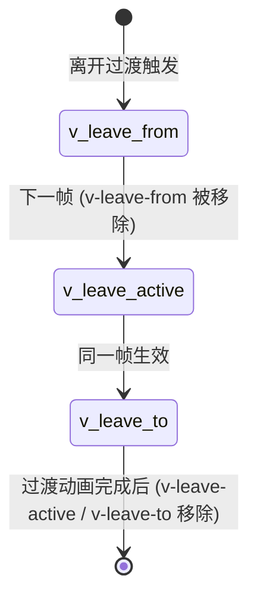

# Transition：过渡动画原理
平时开发页面少不了要写一些过渡动画，通常可以用 CSS 脚本来实现，当然一些时候也会使用 JavaScript 操作 DOM 来实现动画。那么，如果我们使用 Vue.js 技术栈，有没有好的实现动画的方式呢？

答案是肯定的——有，Vue.js 提供了内置的 Transition 组件，它可以让我们轻松实现动画过渡效果。

### Transition 组件的用法

> 若还不熟悉 Transition 组件的使用，建议先阅读[官网文档](https://vuejs.org/guide/built-ins/transition.html)。

Transition 组件通常有三类用法：CSS 过渡、CSS 动画和 JavaScript 钩子。下面分别用示例说明，建议结合代码运行体会效果。

首先来看 CSS 过渡：

```html
<template>
  <div class="app">
    <button @click="show = !show">
      Toggle render
    </button>
    <transition name="fade">
      <p v-if="show">hello</p>
    </transition>
  </div>
</template>
<script>
  export default {
    data() {
      return {
        show: true
      }
    }
  }
</script>
<style>
  .fade-enter-active,
  .fade-leave-active {
    transition: opacity 0.5s ease;
  }
  .fade-enter-from,
  .fade-leave-to {
    opacity: 0;
  }
</style>
```

CSS 过渡主要定义了一些过渡的 CSS 样式，当我们点击按钮切换文本显隐的时候，就会应用这些 CSS 样式，实现过渡效果。

接着来看 CSS 动画：

```html
<template>
  <div class="app">
    <button @click="show = !show">Toggle show</button>
    <transition name="bounce">
      <p v-if="show">Vue is an awesome front-end MVVM framework. We can use it to build multiple apps.</p>
    </transition>
  </div>
</template>
<script>
  export default {
    data() {
      return {
        show: true
      }
    }
  }
</script>
<style>
  .bounce-enter-active {
    animation: bounce-in 0.5s;
  }
  .bounce-leave-active {
    animation: bounce-in 0.5s reverse;
  }
  @keyframes bounce-in {
    0% {
      transform: scale(0);
    }
    50% {
      transform: scale(1.5);
    }
    100% {
      transform: scale(1);
    }
  }
</style>
```

和 CSS 过渡类似，CSS 动画主要定义了一些动画的 CSS 样式，当我们去点击按钮切换文本显隐的时候，就会应用这些 CSS 样式，实现动画效果。

最后，是 JavaScript 钩子：

```html
<template>
  <div class="app">
    <button @click="show = !show">
      Toggle render
    </button>
    <transition
      @before-enter="beforeEnter"
      @enter="enter"
      @before-leave="beforeLeave"
      @leave="leave"
      css="false"
    >
      <p v-if="show">hello</p>
    </transition>
  </div>
</template>
<script>
  export default {
    data() {
      return {
        show: true
      }
    },
    methods: {
      beforeEnter(el) {
        el.style.opacity = 0
        el.style.transition = 'opacity 0.5s ease'
      },
      enter(el) {
        this.$el.offsetHeight
        el.style.opacity = 1
      },
      beforeLeave(el) {
        el.style.opacity = 1
      },
      leave(el) {
        el.style.transition = 'opacity 0.5s ease'
        el.style.opacity = 0
      }
    }
  }
</script>
```

Transition 组件也允许在一个过渡组件中定义它过渡生命周期的 JavaScript 钩子函数，我们可以在这些钩子函数中编写 JavaScript 操作 DOM 来实现过渡动画效果。

### Transition 组件的核心思想

通过前面三个示例，我们不难发现都是在点击按钮时，通过修改 v-if 的条件值来触发过渡动画的。

其实 Transition 组件过渡动画的触发条件有以下四点：

- 条件渲染 (使用 v-if)；

- 条件展示 (使用 v-show)；

- 动态组件；

- 组件根节点。

所以你只能在上述四种情况中使用 Transition 组件，在进入/离开过渡的时候会有 6 个 class 切换。

1. **v-enter-from**：定义进入过渡的开始状态。在元素被插入之前生效，在元素被插入之后的下一帧移除。

2. **v-enter-active**：定义进入过渡生效时的状态。在整个进入过渡的阶段中应用，在元素被插入之前生效，在过渡动画完成之后移除。这个类可以被用来定义进入过渡的过程时间，延迟和曲线函数。

3. **v-enter-to**：定义进入过渡的结束状态。在元素被插入之后下一帧生效 (与此同时 v-enter-from 被移除)，在过渡动画完成之后移除。

4. **v-leave-from**：定义离开过渡的开始状态。在离开过渡被触发时立刻生效，下一帧被移除。

5. **v-leave-active**：定义离开过渡生效时的状态。在整个离开过渡的阶段中应用，在离开过渡被触发时立刻生效，在过渡动画完成之后移除。这个类可以被用来定义离开过渡的过程时间，延迟和曲线函数。

6. **v-leave-to**：定义离开过渡的结束状态。在离开过渡被触发之后下一帧生效 (与此同时 v-leave-from 被删除)，在过渡动画完成之后移除。


下面以 `v-leave`（离开过渡）为例，用状态图表示各 class 的生命周期：



> 进入过渡（v-enter）的状态机结构相同：`v-enter-from → v-enter-active → v-enter-to`，中间通过下一帧切换。

其实说白了 Transition 组件的核心思想就是，**Transition 包裹的元素插入删除时**，**在适当的时机插入这些 CSS 样式**，而这些 CSS 的实现则决定了元素的过渡动画。

大致了解了 Transition 组件的用法和核心思想后，下面探究 Transition 组件的实现原理。

### Transition 组件的实现原理

为便于理解，结合示例分析：

```html
<template>
  <div class="app">
    <button @click="show = !show">
      Toggle render
    </button>
    <transition name="fade">
      <p v-if="show">hello</p>
    </transition>
  </div>
</template>
```

先来看模板编译后生成的 render 函数：

```js
import { createVNode as _createVNode, openBlock as _openBlock, createBlock as _createBlock, createCommentVNode as _createCommentVNode, Transition as _Transition, withCtx as _withCtx } from "vue"
export function render(_ctx, _cache, $props, $setup, $data, $options) {
  return (_openBlock(), _createBlock("div", { class: "app" }, [
    _createVNode("button", {
      onClick: $event => (_ctx.show = !_ctx.show)
    }, " Toggle render ", 8 /* PROPS */, ["onClick"]),
    _createVNode(_Transition, { name: "fade" }, {
      default: _withCtx(() => [
        (_ctx.show)
          ? (_openBlock(), _createBlock("p", { key: 0 }, "hello"))
          : _createCommentVNode("v-if", true)
      ]),
      _: 1
    })
  ]))
}
```

对于 Transition 组件部分，生成的 render 函数主要创建了 Transition 组件 vnode，并且有一个默认插槽。

看 Transition 组件的定义：

```js
const Transition = (props, { slots }) => h(BaseTransition, resolveTransitionProps(props), slots)
const BaseTransition = {
  name: `BaseTransition`,
  props: {
    mode: String,
    appear: Boolean,
    persisted: Boolean,
    // enter
    onBeforeEnter: TransitionHookValidator,
    onEnter: TransitionHookValidator,
    onAfterEnter: TransitionHookValidator,
    onEnterCancelled: TransitionHookValidator,
    // leave
    onBeforeLeave: TransitionHookValidator,
    onLeave: TransitionHookValidator,
    onAfterLeave: TransitionHookValidator,
    onLeaveCancelled: TransitionHookValidator,
    // appear
    onBeforeAppear: TransitionHookValidator,
    onAppear: TransitionHookValidator,
    onAfterAppear: TransitionHookValidator,
    onAppearCancelled: TransitionHookValidator
  },
  setup(props, { slots }) {
    const instance = getCurrentInstance()
    const state = useTransitionState()
    let prevTransitionKey
    return () => {
      const children = slots.default && getTransitionRawChildren(slots.default(), true)
      if (!children || !children.length) {
        return
      }
      // Transition 组件只允许一个子元素节点，多个报警告，提示使用 TransitionGroup 组件
      if ((process.env.NODE_ENV !== 'production') && children.length > 1) {
        warn('<transition> can only be used on a single element or component. Use ' +
          '<transition-group> for lists.')
      }
      // 不需要追踪响应式，所以改成原始值，提升性能
      const rawProps = toRaw(props)
      const { mode } = rawProps
      // 检查 mode 是否合法
      if ((process.env.NODE_ENV !== 'production') && mode && !['in-out', 'out-in', 'default'].includes(mode)) {
        warn(`invalid <transition> mode: ${mode}`)
      }
      // 获取第一个子元素节点
      const child = children[0]
      if (state.isLeaving) {
        return emptyPlaceholder(child)
      }
      // 处理 <transition><keep-alive/></transition> 的情况
      const innerChild = getKeepAliveChild(child)
      if (!innerChild) {
        return emptyPlaceholder(child)
      }
      const enterHooks = resolveTransitionHooks(innerChild, rawProps, state, instance)
        setTransitionHooks(innerChild, enterHooks)
      const oldChild = instance.subTree
      const oldInnerChild = oldChild && getKeepAliveChild(oldChild)
      let transitionKeyChanged = false
      const { getTransitionKey } = innerChild.type
      if (getTransitionKey) {
        const key = getTransitionKey()
        if (prevTransitionKey === undefined) {
          prevTransitionKey = key
        }
        else if (key !== prevTransitionKey) {
          prevTransitionKey = key
          transitionKeyChanged = true
        }
      }
      if (oldInnerChild &&
        oldInnerChild.type !== Comment &&
        (!isSameVNodeType(innerChild, oldInnerChild) || transitionKeyChanged)) {
        const leavingHooks = resolveTransitionHooks(oldInnerChild, rawProps, state, instance)
        // 更新旧树的钩子函数
        setTransitionHooks(oldInnerChild, leavingHooks)
        // 在两个视图之间切换
        if (mode === 'out-in') {
          state.isLeaving = true
          // 返回空的占位符节点，当离开过渡结束后，重新渲染组件
          leavingHooks.afterLeave = () => {
            state.isLeaving = false
            instance.update()
          }
          return emptyPlaceholder(child)
        }
        else if (mode === 'in-out') {
          leavingHooks.delayLeave = (el, earlyRemove, delayedLeave) => {
            const leavingVNodesCache = getLeavingNodesForType(state, oldInnerChild)
            leavingVNodesCache[String(oldInnerChild.key)] = oldInnerChild
            // early removal callback
            el._leaveCb = () => {
              earlyRemove()
              el._leaveCb = undefined
              delete enterHooks.delayedLeave
            }
            enterHooks.delayedLeave = delayedLeave
          }
        }
      }
      return child
    }
  }
}
```

Transition 组件是在 BaseTransition 基础上封装的高阶函数式组件。由于 Transition 实现代码较多，下面挑重点讲清整体实现思路。

我把 Transition 组件的实现分成组件的渲染、钩子函数的执行、模式的应用三个部分去详细说明。

#### 组件的渲染

先来看 Transition 组件是如何渲染的。我们重点看 setup 函数部分的逻辑。

Transition 组件和前面学习的 KeepAlive 组件一样，是一个抽象组件，组件本身不渲染任何实体节点，只渲染第一个子元素节点。

> 注意，Transition 组件内部只能嵌套一个子元素节点，如果有多个节点需要用 TransitionGroup 组件。

如果 Transition 组件内部嵌套的是 KeepAlive 组件，那么它会继续查找 KeepAlive 组件嵌套的第一个子元素节点，来作为渲染的元素节点。

如果 Transition 组件内部没有嵌套任何子节点，那么它会渲染空的注释节点。

在渲染的过程中，Transition 组件还会通过 resolveTransitionHooks 去定义组件创建和删除阶段的钩子函数对象，然后再通过 setTransitionHooks函数去把这个钩子函数对象设置到 vnode.transition 上。

渲染过程中，还会判断这是否是一次更新渲染，如果是会对不同的模式执行不同的处理逻辑，我会在后续介绍模式的应用时详细说明。

以上就是 Transition 组件渲染做的事情，你需要记住的是**Transition 渲染的是组件嵌套的第一个子元素节点**。

但是 Transition 是如何在节点的创建和删除过程中设置那些与过渡动画相关的 CSS 的呢？这些都与钩子函数相关，下面看 setTransitionHooks 的实现，看看它定义的钩子函数对象是怎样的：

```js
function resolveTransitionHooks(vnode, props, state, instance) {
  const { appear, mode, persisted = false, onBeforeEnter, onEnter, onAfterEnter, onEnterCancelled, onBeforeLeave, onLeave, onAfterLeave, onLeaveCancelled, onBeforeAppear, onAppear, onAfterAppear, onAppearCancelled } = props
  const key = String(vnode.key)
  const leavingVNodesCache = getLeavingNodesForType(state, vnode)
  const callHook = (hook, args) => {
    hook &&
    callWithAsyncErrorHandling(hook, instance, 9 /* TRANSITION_HOOK */, args)
  }
  const hooks = {
    mode,
    persisted,
    beforeEnter(el) {
      let hook = onBeforeEnter
      if (!state.isMounted) {
        if (appear) {
          hook = onBeforeAppear || onBeforeEnter
        }
        else {
          return
        }
      }
      if (el._leaveCb) {
        el._leaveCb(true /* cancelled */)
      }
      const leavingVNode = leavingVNodesCache[key]
      if (leavingVNode &&
        isSameVNodeType(vnode, leavingVNode) &&
        leavingVNode.el._leaveCb) {
        leavingVNode.el._leaveCb()
      }
      callHook(hook, [el])
    },
    enter(el) {
      let hook = onEnter
      let afterHook = onAfterEnter
      let cancelHook = onEnterCancelled
      if (!state.isMounted) {
        if (appear) {
          hook = onAppear || onEnter
          afterHook = onAfterAppear || onAfterEnter
          cancelHook = onAppearCancelled || onEnterCancelled
        }
        else {
          return
        }
      }
      let called = false
      const done = (el._enterCb = (cancelled) => {
        if (called)
          return
        called = true
        if (cancelled) {
          callHook(cancelHook, [el])
        }
        else {
          callHook(afterHook, [el])
        }
        if (hooks.delayedLeave) {
          hooks.delayedLeave()
        }
        el._enterCb = undefined
      })
      if (hook) {
        hook(el, done)
        if (hook.length <= 1) {
          done()
        }
      }
      else {
        done()
      }
    },
    leave(el, remove) {
      const key = String(vnode.key)
      if (el._enterCb) {
        el._enterCb(true /* cancelled */)
      }
      if (state.isUnmounting) {
        return remove()
      }
      callHook(onBeforeLeave, [el])
      let called = false
      const done = (el._leaveCb = (cancelled) => {
        if (called)
          return
        called = true
        remove()
        if (cancelled) {
          callHook(onLeaveCancelled, [el])
        }
        else {
          callHook(onAfterLeave, [el])
        }
        el._leaveCb = undefined
        if (leavingVNodesCache[key] === vnode) {
          delete leavingVNodesCache[key]
        }
      })
      leavingVNodesCache[key] = vnode
      if (onLeave) {
        onLeave(el, done)
        if (onLeave.length <= 1) {
          done()
        }
      }
      else {
        done()
      }
    },
    clone(vnode) {
      return resolveTransitionHooks(vnode, props, state, instance)
    }
  }
  return hooks
}
```

钩子函数对象定义了 4 个钩子函数，分别是 beforeEnter，enter，leave 和 clone，它们的执行时机是什么，又是怎么处理我们给 Transition 组件传递的一些 Prop 的？其中，beforeEnter、enter 和 leave 发生在元素的插入和删除阶段，下面来分析这几个钩子函数的执行过程。

### 钩子函数的执行

下面看 beforeEnter 钩子函数。

在 patch 阶段的 mountElement 函数中，在插入元素节点前且存在过渡的条件下会执行 vnode.transition 中的 beforeEnter 函数，看它的定义：

```js
beforeEnter(el) {
  let hook = onBeforeEnter
  if (!state.isMounted) {
    if (appear) {
      hook = onBeforeAppear || onBeforeEnter
    }
    else {
      return
    }
  }
  if (el._leaveCb) {
    el._leaveCb(true /* cancelled */)
  }
  const leavingVNode = leavingVNodesCache[key]
  if (leavingVNode &&
    isSameVNodeType(vnode, leavingVNode) &&
    leavingVNode.el._leaveCb) {
    leavingVNode.el._leaveCb()
  }
  callHook(hook, [el])
}
```

beforeEnter 钩子函数主要做的事情就是根据 appear 的值和 DOM 是否挂载，来执行 onBeforeEnter 函数或者是 onBeforeAppear 函数，其他的逻辑我们暂时先不看。

appear、onBeforeEnter、onBeforeAppear 这些变量都是从 props 中获取的，那么这些 props 是怎么初始化的呢？回到 Transition 组件的定义：

```js
const Transition = (props, { slots }) => h(BaseTransition, resolveTransitionProps(props), slots)
```

传递的 props 经过了 resolveTransitionProps 函数的封装，看它的定义：

```js
function resolveTransitionProps(rawProps) {
  let { name = 'v', type, css = true, duration, enterFromClass = `${name}-enter-from`, enterActiveClass = `${name}-enter-active`, enterToClass = `${name}-enter-to`, appearFromClass = enterFromClass, appearActiveClass = enterActiveClass, appearToClass = enterToClass, leaveFromClass = `${name}-leave-from`, leaveActiveClass = `${name}-leave-active`, leaveToClass = `${name}-leave-to` } = rawProps
  const baseProps = {}
  for (const key in rawProps) {
    if (!(key in DOMTransitionPropsValidators)) {
      baseProps[key] = rawProps[key]
    }
  }
  if (!css) {
    return baseProps
  }
  const durations = normalizeDuration(duration)
  const enterDuration = durations && durations[0]
  const leaveDuration = durations && durations[1]
  const { onBeforeEnter, onEnter, onEnterCancelled, onLeave, onLeaveCancelled, onBeforeAppear = onBeforeEnter, onAppear = onEnter, onAppearCancelled = onEnterCancelled } = baseProps
  const finishEnter = (el, isAppear, done) => {
    removeTransitionClass(el, isAppear ? appearToClass : enterToClass)
    removeTransitionClass(el, isAppear ? appearActiveClass : enterActiveClass)
    done && done()
  }
  const finishLeave = (el, done) => {
    removeTransitionClass(el, leaveToClass)
    removeTransitionClass(el, leaveActiveClass)
    done && done()
  }
  const makeEnterHook = (isAppear) => {
    return (el, done) => {
      const hook = isAppear ? onAppear : onEnter
      const resolve = () => finishEnter(el, isAppear, done)
      hook && hook(el, resolve)
      nextFrame(() => {
        removeTransitionClass(el, isAppear ? appearFromClass : enterFromClass)
        addTransitionClass(el, isAppear ? appearToClass : enterToClass)
        if (!(hook && hook.length > 1)) {
          if (enterDuration) {
            setTimeout(resolve, enterDuration)
          }
          else {
            whenTransitionEnds(el, type, resolve)
          }
        }
      })
    }
  }
  return extend(baseProps, {
    onBeforeEnter(el) {
      onBeforeEnter && onBeforeEnter(el)
      addTransitionClass(el, enterActiveClass)
      addTransitionClass(el, enterFromClass)
    },
    onBeforeAppear(el) {
      onBeforeAppear && onBeforeAppear(el)
      addTransitionClass(el, appearActiveClass)
      addTransitionClass(el, appearFromClass)
    },
    onEnter: makeEnterHook(false),
    onAppear: makeEnterHook(true),
    onLeave(el, done) {
      const resolve = () => finishLeave(el, done)
      addTransitionClass(el, leaveActiveClass)
      addTransitionClass(el, leaveFromClass)
      nextFrame(() => {
        removeTransitionClass(el, leaveFromClass)
        addTransitionClass(el, leaveToClass)
        if (!(onLeave && onLeave.length > 1)) {
          if (leaveDuration) {
            setTimeout(resolve, leaveDuration)
          }
          else {
            whenTransitionEnds(el, type, resolve)
          }
        }
      })
      onLeave && onLeave(el, resolve)
    },
    onEnterCancelled(el) {
      finishEnter(el, false)
      onEnterCancelled && onEnterCancelled(el)
    },
    onAppearCancelled(el) {
      finishEnter(el, true)
      onAppearCancelled && onAppearCancelled(el)
    },
    onLeaveCancelled(el) {
      finishLeave(el)
      onLeaveCancelled && onLeaveCancelled(el)
    }
  })
}
```

resolveTransitionProps 函数主要作用是，在我们给 Transition 传递的 Props 基础上做一层封装，然后返回一个新的 Props 对象，由于它包含了所有的 Props 处理，你不需要一下子了解所有的实现，按需分析即可。

看 onBeforeEnter 函数，它的内部执行了基础 props 传入的 onBeforeEnter 钩子函数，并且给 DOM 元素 el 添加了 enterActiveClass 和 enterFromClass 样式。

其中，props 传入的 onBeforeEnter 函数就是我们写 Transition 组件时添加的 beforeEnter 钩子函数。enterActiveClass 默认值是 v-enter-active，enterFromClass 默认值是 v-enter-from，如果给 Transition 组件传入了 name 的 prop，比如 fade，那么 enterActiveClass 的值就是 fade-enter-active，enterFromClass 的值就是 fade-enter-from。

原来这就是在 DOM 元素对象在创建后，插入到页面前做的事情：**执行 beforeEnter 钩子函数**，**以及给元素添加相应的 CSS 样式**。

onBeforeAppear 和 onBeforeEnter 的逻辑类似，就不赘述了，它是在我们给 Transition 组件传入 appear 的 Prop，且首次挂载的时候执行的。

执行完 beforeEnter 钩子函数，接着插入元素到页面，然后会执行 vnode.transition 中的 enter 钩子函数，看它的定义：

```js
enter(el) {
  let hook = onEnter
  let afterHook = onAfterEnter
  let cancelHook = onEnterCancelled
  if (!state.isMounted) {
    if (appear) {
      hook = onAppear || onEnter
      afterHook = onAfterAppear || onAfterEnter
      cancelHook = onAppearCancelled || onEnterCancelled
    }
    else {
      return
    }
  }
  let called = false
  const done = (el._enterCb = (cancelled) => {
    if (called)
      return
    called = true
    if (cancelled) {
      callHook(cancelHook, [el])
    }
    else {
      callHook(afterHook, [el])
    }
    if (hooks.delayedLeave) {
      hooks.delayedLeave()
    }
    el._enterCb = undefined
  })
  if (hook) {
    hook(el, done)
    if (hook.length <= 1) {
      done()
    }
  }
  else {
    done()
  }
}
```

enter 钩子函数主要做的事情就是根据 appear 的值和 DOM 是否挂载，执行 onEnter 函数或者是 onAppear 函数，并且这个函数的第二个参数是一个 done 函数，表示过渡动画完成后执行的回调函数，它是异步执行的。

> 注意，当 onEnter 或者 onAppear 函数的参数长度小于等于 1 的时候，done 函数在执行完 hook 函数后同步执行。

在 done 函数的内部，我们会执行 onAfterEnter 函数或者是 onEnterCancelled 函数，其它的逻辑我们也暂时先不看。

同理，onEnter、onAppear、onAfterEnter 和 onEnterCancelled 函数也是从 Props 传入的，我们重点看 onEnter 的实现，它是 makeEnterHook(false) 函数执行后的返回值，如下：

```js
const makeEnterHook = (isAppear) => {
  return (el, done) => {
    const hook = isAppear ? onAppear : onEnter
    const resolve = () => finishEnter(el, isAppear, done)
    hook && hook(el, resolve)
    nextFrame(() => {
      removeTransitionClass(el, isAppear ? appearFromClass : enterFromClass)
      addTransitionClass(el, isAppear ? appearToClass : enterToClass)
      if (!(hook && hook.length > 1)) {
        if (enterDuration) {
          setTimeout(resolve, enterDuration)
        }
        else {
          whenTransitionEnds(el, type, resolve)
        }
      }
    })
  }
}
```

在函数内部，首先执行基础 props 传入的 onEnter 钩子函数，然后在下一帧给 DOM 元素 el 移除了 enterFromClass，同时添加了 enterToClass 样式。

其中，props 传入的 onEnter 函数就是我们写 Transition 组件时添加的 enter 钩子函数，enterFromClass 是我们在 beforeEnter 阶段添加的，会在当前阶段移除，新增的 enterToClass 值默认是 v-enter-to，如果给 Transition 组件传入了 name 的 prop，比如 fade，那么 enterToClass 的值就是 fade-enter-to。

注意，当我们添加了 enterToClass 后，这个时候浏览器就开始根据我们编写的 CSS 进入过渡动画了，那么动画何时结束呢？

Transition 组件允许我们传入 enterDuration 这个 prop，它会指定进入过渡的动画时长，当然如果你不指定，Vue.js 内部会监听动画结束事件，然后在动画结束后，执行 finishEnter 函数，来看它的实现：

```js
const finishEnter = (el, isAppear, done) => {
  removeTransitionClass(el, isAppear ? appearToClass : enterToClass)
  removeTransitionClass(el, isAppear ? appearActiveClass : enterActiveClass)
  done && done()
}
```

其实就是给 DOM 元素移除 enterToClass 以及 enterActiveClass，同时执行 done 函数，进而执行 onAfterEnter 钩子函数。

至此，元素进入的过渡动画逻辑就分析完了，下面分析元素离开的过渡动画逻辑。

当元素被删除的时候，会执行 remove 方法，在真正从 DOM 移除元素前且存在过渡的情况下，会执行 vnode.transition 中的 leave 钩子函数，并且把移动 DOM 的方法作为第二个参数传入，看它的定义：

```js
leave(el, remove) {
  const key = String(vnode.key)
  if (el._enterCb) {
    el._enterCb(true /* cancelled */)
  }
  if (state.isUnmounting) {
    return remove()
  }
  callHook(onBeforeLeave, [el])
  let called = false
  const done = (el._leaveCb = (cancelled) => {
    if (called)
      return
    called = true
    remove()
    if (cancelled) {
      callHook(onLeaveCancelled, [el])
    }
    else {
      callHook(onAfterLeave, [el])
    }
    el._leaveCb = undefined
    if (leavingVNodesCache[key] === vnode) {
      delete leavingVNodesCache[key]
    }
  })
  leavingVNodesCache[key] = vnode
  if (onLeave) {
    onLeave(el, done)
    if (onLeave.length <= 1) {
      done()
    }
  }
  else {
    done()
  }
}
```

leave 钩子函数主要做的事情就是执行 props 传入的 onBeforeLeave 钩子函数和 onLeave 函数，onLeave 函数的第二个参数是一个 done 函数，它表示离开过渡动画结束后执行的回调函数。

done 函数内部主要做的事情就是执行 remove 方法移除 DOM，然后执行 onAfterLeave 钩子函数或者是 onLeaveCancelled 函数，其它的逻辑我们也先不看。

下面重点看一下 onLeave 函数的实现，看看离开过渡动画是如何执行的。

```js
onLeave(el, done) {
  const resolve = () => finishLeave(el, done)
  addTransitionClass(el, leaveActiveClass)
  addTransitionClass(el, leaveFromClass)
  nextFrame(() => {
    removeTransitionClass(el, leaveFromClass)
    addTransitionClass(el, leaveToClass)
    if (!(onLeave && onLeave.length > 1)) {
      if (leaveDuration) {
        setTimeout(resolve, leaveDuration)
      }
      else {
        whenTransitionEnds(el, type, resolve)
      }
    }
  })
  onLeave && onLeave(el, resolve)
}
```

onLeave 函数首先给 DOM 元素添加 leaveActiveClass 和 leaveFromClass，并执行基础 props 传入的 onLeave 钩子函数，然后在下一帧移除 leaveFromClass，并添加 leaveToClass。

其中，leaveActiveClass 的默认值是 v-leave-active，leaveFromClass 的默认值是 v-leave-from，leaveToClass 的默认值是 v-leave-to。如果给 Transition 组件传入了 name 的 prop，比如 fade，那么 leaveActiveClass 的值就是 fade-leave-active，leaveFromClass 的值就是 fade-leave-from，leaveToClass 的值就是 fade-leave-to。

注意，当我们添加 leaveToClass 时，浏览器就开始根据我们编写的 CSS 执行离开过渡动画了，那么动画何时结束呢？

和进入动画类似，Transition 组件允许我们传入 leaveDuration 这个 prop，指定过渡的动画时长，当然如果你不指定，Vue.js 内部会监听动画结束事件，然后在动画结束后，执行 resolve 函数，它是执行 finishLeave 函数的返回值，来看它的实现：

```js
const finishLeave = (el, done) => {
  removeTransitionClass(el, leaveToClass)
  removeTransitionClass(el, leaveActiveClass)
  done && done()
}
```

其实就是给 DOM 元素移除 leaveToClass 以及 leaveActiveClass，同时执行 done 函数，进而执行 onAfterLeave 钩子函数。

至此，元素离开的过渡动画逻辑就分析完了，可以看出离开过渡动画和进入过渡动画的思路差不多，本质上都是在添加和移除一些 CSS 去执行动画，并且在过程中执行用户传入的钩子函数。

### 模式的应用

前面我们在介绍 Transition 的渲染过程中提到过模式的应用，模式有什么用呢，通过示例说明，把前面的例子稍加修改：

```html
<template>
  <div class="app">
    <button @click="show = !show">
      Toggle render
    </button>
    <transition name="fade">
      <p v-if="show">hello</p>
      <p v-else>hi</p>
    </transition>
  </div>
</template>
<script>
  export default {
    data() {
      return {
        show: true
      }
    }
  }
</script>
<style>
  .fade-enter-active,
  .fade-leave-active {
    transition: opacity 0.5s ease;
  }
  .fade-enter-from,
  .fade-leave-to {
    opacity: 0;
  }
</style>
```

我们在 show 条件为 false 的情况下，显示字符串 hi，你可以运行这个示例，然后会发现这个过渡效果有点生硬，并不理想。

然后，我们给这个 Transition 组件加一个 out-in 的 mode：

```html
<transition mode="out-in" name="fade">
  <p v-if="show">hello</p>
  <p v-else>hi</p>
</transition>
```

我们会发现这个过渡效果好多了，hello 文本先完成离开的过渡后，hi 文本开始进入过渡动画。

模式非常适合这种两个元素切换的场景，Vue.js 给 Transition 组件提供了两种模式：in-out 和 out-in，它们有什么区别呢？

- 在 in-out 模式下，新元素先进行过渡，完成之后当前元素过渡离开。

- 在 out-in 模式下，当前元素先进行过渡，完成之后新元素过渡进入。

在实际工作中，你大部分情况都是在使用 out-in 模式，而 in-out 模式很少用到，所以下面来分析 out-in 模式的实现原理。

我们先不妨思考一下，为什么在不加模式的情况下，会出现示例那样的过渡效果。

当我们点击按钮，show 变量由 true 变成 false，会触发当前元素 hello 文本的离开动画，也会同时触发新元素 hi 文本的进入动画。由于动画是同时进行的，而且在离开动画结束之前，当前元素 hello 是没有被移除 DOM 的，所以它还会占位，就把新元素 hi 文本挤到下面去了。当 hello 文本的离开动画执行完毕从 DOM 中删除后，hi 文本才能回到之前的位置。

那么，我们怎么做才能做到当前元素过渡动画执行完毕后，再执行新元素的过渡呢？

看 out-in 模式的实现：

```js
const leavingHooks = resolveTransitionHooks(oldInnerChild, rawProps, state, instance)
setTransitionHooks(oldInnerChild, leavingHooks)
if (mode === 'out-in') {
  state.isLeaving = true
  leavingHooks.afterLeave = () => {
    state.isLeaving = false
    instance.update()
  }
  return emptyPlaceholder(child)
}
```

当模式为 out-in 的时候，会标记 state.isLeaving 为 true，然后返回一个空的注释节点，同时更新当前元素的钩子函数中的 afterLeave 函数，内部执行 instance.update 重新渲染组件。

这样做就保证了在当前元素执行离开过渡的时候，新元素只渲染成一个注释节点，这样页面上看上去还是只执行当前元素的离开过渡动画。

离开动画执行完毕后触发 Transition 组件重新渲染，即可如期渲染新元素并执行进入过渡动画。

### 总结

> 思考：Transition 组件在 beforeEnter 钩子函数中会判断 el._leaveCb 是否存在，存在则执行；在 leave 钩子函数中会判断 el._enterCb 是否存在，存在则执行。这么做的原因是什么？

> 本文的相关代码在源代码中的位置如下：
> packages/runtime-core/src/components/BaseTransition.ts
> packages/runtime-core/src/renderer.ts
> packages/runtime-dom/src/components/Transition.ts
