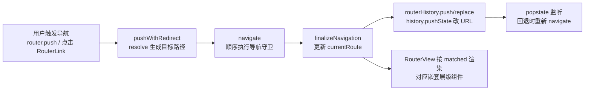
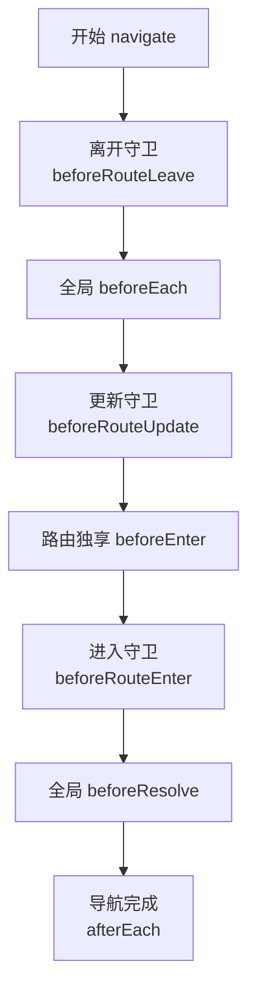

# Vue Router：实现一个前端路由
路由最初源于服务端，在服务端中路由描述的是 URL 与处理函数之间的映射关系。

在 Web 前端单页应用 SPA 中，路由描述的是 URL 与视图之间的映射关系，这种映射是单向的，即 URL 变化会引起视图的更新。

相比于后端路由，前端路由的好处是无须刷新页面，减轻了服务器的压力，提升了用户体验。目前主流支持单页应用的前端框架，基本都有配套的或第三方的路由系统。

> Vue.js 3.0 配套的 Vue Router 源码在[这里](https://github.com/vuejs/vue-router-next)，建议你学习前先把源码 clone 下来。如果你还不会使用路由，建议你先看它的[官网文档](https://next.router.vuejs.org/)，会使用后再来学习本文。

### 路由的基本用法

下面通过一个简单示例看路由的基本用法，也可以用 Vue CLI 脚手架创建 Vue.js 3.0 项目，并安装 4.x 版本的 Vue Router 把项目跑起来。

注意，为了让 Vue.js 可以在线编译模板，你需要在根目录下配置 vue.config.js，并且设置 runtimeCompiler 为 true：

```js
module.exports = {
  runtimeCompiler: true
}
```

然后我们修改页面的 HTML 模板，加上如下代码：

```html
<div id="app">
  <h1>Hello App!</h1>
  <p>
    <router-link to="/">Go to Home</router-link>
    <router-link to="/about">Go to About</router-link>
  </p>
  <router-view></router-view>
</div>
```

其中，RouterLink 和 RouterView 是 Vue Router 内置的组件。

RouterLink 表示路由的导航组件，我们可以配置 to 属性来指定它跳转的链接，它最终会在页面上渲染生成 a 标签。

RouterView 表示路由的视图组件，它会渲染路径对应的 Vue 组件，也支持嵌套。

RouterLink 和 RouterView 的具体实现，我们会放到后面去分析。

有了模板之后，接下来看如何初始化路由：

```js
import { createApp } from 'vue'
import { createRouter, createWebHistory } from 'vue-router'
// 1. 定义路由组件
const Home = { template: '<div>Home</div>' }
const About = { template: '<div>About</div>' }
// 2. 定义路由配置，每个路径映射一个路由视图组件
const routes = [
  { path: '/', component: Home },
  { path: '/about', component: About },
]
// 3. 创建路由实例，可以指定路由模式，传入路由配置对象
const router = createRouter({
  history: createWebHistory(),
  routes
})
// 4. 创建 app 实例
const app = createApp({
})
// 5. 在挂载页面之前先安装路由
app.use(router)
// 6. 挂载页面
app.mount('#app')
```

路由的初始化过程很简单：先定义一个路由配置，描述路径和组件的映射关系，即什么路径下 RouterView 渲染什么路由组件。

接着创建路由对象实例，传入路由配置对象，并且也可以指定路由模式，Vue Router 目前支持三种模式，hash 模式，HTML5 模式和 memory 模式，我们常用的是前两种模式。

最后在挂载页面前，我们需要安装路由，这样可以在各个组件中访问路由对象以及使用路由的内置组件 RouterLink 和 RouterView 了。

### 路由的实现原理

从用户使用的角度分析，先由路由对象的创建过程开始。

整体来看，一次前端路由切换的核心链路如下：



下面分模块拆解这条链路。

#### 路由对象的创建

Vue Router 提供 `createRouter` API 来创建路由对象，看它的实现：

```js
function createRouter(options) {
  // 定义一些辅助方法和变量

  // ...

  // 创建 router 对象
  const router = {
    // 当前路径
    currentRoute,
    addRoute,
    removeRoute,
    hasRoute,
    getRoutes,
    resolve,
    options,
    push,
    replace,
    go,
    back: () => go(-1),
    forward: () => go(1),
    beforeEach: beforeGuards.add,
    beforeResolve: beforeResolveGuards.add,
    afterEach: afterGuards.add,
    onError: errorHandlers.add,
    isReady,
    install(app) {
      // 安装路由函数
    }
  }
  return router
}
```

省略了大部分代码，只保留路由对象相关的部分。路由对象 `router` 就是一个对象，维护了当前路径 `currentRoute`，并拥有很多辅助方法。

目前你只需要了解这么多，创建完路由对象后，我们现在来安装它。

#### 路由的安装

Vue Router 作为 Vue 的插件，执行 `app.use(router)` 实际是在执行 router 的 `install` 方法安装路由，并把 `app` 作为参数传入，看它的定义：

```js
const router = {
  install(app) {
    const router = this
    // 注册路由组件
    app.component('RouterLink', RouterLink)
    app.component('RouterView', RouterView)
    // 全局配置定义 $router 和 $route
    app.config.globalProperties.$router = router
    Object.defineProperty(app.config.globalProperties, '$route', {
      get: () => unref(currentRoute),
    })
    // 在浏览器端初始化导航
    if (isBrowser &&
      !started &&
      currentRoute.value === START_LOCATION_NORMALIZED) {
      // see above
      started = true
      push(routerHistory.location).catch(err => {
        warn('Unexpected error when starting the router:', err)
      })
    }
    // 路径变成响应式
    const reactiveRoute = {}
    for (let key in START_LOCATION_NORMALIZED) {
      reactiveRoute[key] = computed(() => currentRoute.value[key])
    }
    // 全局注入 router 和 reactiveRoute
    app.provide(routerKey, router)
    app.provide(routeLocationKey, reactive(reactiveRoute))
    let unmountApp = app.unmount
    installedApps.add(app)
    // 应用卸载的时候，需要做一些路由清理工作
    app.unmount = function () {
      installedApps.delete(app)
      if (installedApps.size < 1) {
        removeHistoryListener()
        currentRoute.value = START_LOCATION_NORMALIZED
        started = false
        ready = false
      }
      unmountApp.call(this, arguments)
    }
  }
}
```

路由的安装过程我们需要记住以下两件事情。

1. 全局注册 RouterView 和 RouterLink 组件——这是你安装了路由后，可以在任何组件中去使用这两个组件的原因，如果你使用 RouterView 或者 RouterLink 的时候收到提示不能解析  router-link 和 router-view，这说明你压根就没有安装路由。

2. 通过 provide 方式全局注入 router 对象和 reactiveRoute 对象，其中 router 表示用户通过 createRouter 创建的路由对象，我们可以通过它去动态操作路由，reactiveRoute 表示响应式的路径对象，它维护着路径的相关信息。

至此已了解路由对象的创建与安装。但前端路由的实现还需解决两个核心问题：路径如何管理，以及路径与路由组件渲染如何映射。

下面依次分析这两个问题。

#### 路径的管理

路由的基础结构就是一个路径对应一种视图，当我们切换路径的时候对应的视图也会切换，因此一个很重要的方面就是对路径的管理。

首先，我们需要维护当前的路径 currentRoute，可以给它一个初始值 START_LOCATION_NORMALIZED，如下：

```js
const START_LOCATION_NORMALIZED = {
  path: '/',
  name: undefined,
  params: {},
  query: {},
  hash: '',
  fullPath: '/',
  matched: [],
  meta: {},
  redirectedFrom: undefined
}
```

路径对象包含非常丰富的路径信息，具体含义可参考 [官方文档](https://next.router.vuejs.org/api/#meta-3)。

路由变化通过改变路径完成。路由对象提供 `router.push`、`router.replace` 等改变路径的方法，其底层最终都通过 `pushWithRedirect` 完成路径切换，看它的实现：

```js
function pushWithRedirect(to, redirectedFrom) {
  const targetLocation = (pendingLocation = resolve(to))
  const from = currentRoute.value
  const data = to.state
  const force = to.force
  const replace = to.replace === true
  const toLocation = targetLocation
  toLocation.redirectedFrom = redirectedFrom
  let failure
  if (!force && isSameRouteLocation(stringifyQuery$1, from, targetLocation)) {
    failure = createRouterError(16 /* NAVIGATION_DUPLICATED */, { to: toLocation, from })
    handleScroll(from, from, true, false)
  }
  return (failure ? Promise.resolve(failure) : navigate(toLocation, from))
    .catch((error) => {
      if (isNavigationFailure(error, 4 /* NAVIGATION_ABORTED */ |
        8 /* NAVIGATION_CANCELLED */ |
        2 /* NAVIGATION_GUARD_REDIRECT */)) {
        return error
      }
      return triggerError(error)
    })
    .then((failure) => {
      if (failure) {
        // 处理错误
      }
      else {
        failure = finalizeNavigation(toLocation, from, true, replace, data)
      }
      triggerAfterEach(toLocation, from, failure)
      return failure
    })
}
```

我省略了一部分代码的实现，这里主要来看 pushWithRedirect 的核心思路，首先参数 to 可能有多种情况，可以是一个表示路径的字符串，也可以是一个路径对象，所以要先经过一层 resolve 返回一个新的路径对象，它比前面提到的路径对象多了一个 matched 属性，它的作用我们后续会介绍。

得到目标路径后，执行 `navigate` 方法运行路由切换过程中的一系列导航守卫函数（后续介绍）。`navigate` 成功后执行 `finalizeNavigation` 完成导航，在这里完成真正的路径切换，看它的实现：

```js
function finalizeNavigation(toLocation, from, isPush, replace, data) {
  const error = checkCanceledNavigation(toLocation, from)
  if (error)
    return error
  const isFirstNavigation = from === START_LOCATION_NORMALIZED
  const state = !isBrowser ? {} : history.state
  if (isPush) {
    if (replace || isFirstNavigation)
      routerHistory.replace(toLocation.fullPath, assign({
        scroll: isFirstNavigation && state && state.scroll,
      }, data))
    else
      routerHistory.push(toLocation.fullPath, data)
  }
  currentRoute.value = toLocation
  handleScroll(toLocation, from, isPush, isFirstNavigation)
  markAsReady()
}
```

这里的 finalizeNavigation 函数，我们重点关注两个逻辑，一个是更新当前的路径 currentRoute 的值，一个是执行 routerHistory.push 或者是 routerHistory.replace 方法更新浏览器的 URL 的记录。

切换路由时浏览器 URL 发生变化，但页面并不刷新，这是如何做到的？

在我们创建 router 对象的时候，会创建一个 history 对象，前面提到 Vue Router 支持三种模式，这里我们重点分析 HTML5 的 history 的模式：

```js
function createWebHistory(base) {
  base = normalizeBase(base)
  const historyNavigation = useHistoryStateNavigation(base)
  const historyListeners = useHistoryListeners(base, historyNavigation.state, historyNavigation.location, historyNavigation.replace)
  function go(delta, triggerListeners = true) {
    if (!triggerListeners)
      historyListeners.pauseListeners()
    history.go(delta)
  }
  const routerHistory = assign({
    // it's overridden right after
    location: '',
    base,
    go,
    createHref: createHref.bind(null, base),
  }, historyNavigation, historyListeners)
  Object.defineProperty(routerHistory, 'location', {
    get: () => historyNavigation.location.value,
  })
  Object.defineProperty(routerHistory, 'state', {
    get: () => historyNavigation.state.value,
  })
  return routerHistory
}
```

对于 routerHistory 对象而言，它有两个重要的作用，一个是路径的切换，一个是监听路径的变化。

路径切换主要通过 `historyNavigation` 完成，它是 `useHistoryStateNavigation` 函数的返回值，看它的实现：

```js
function useHistoryStateNavigation(base) {
  const { history, location } = window
  let currentLocation = {
    value: createCurrentLocation(base, location),
  }
  let historyState = { value: history.state }
  if (!historyState.value) {
    changeLocation(currentLocation.value, {
      back: null,
      current: currentLocation.value,
      forward: null,
      position: history.length - 1,
      replaced: true,
      scroll: null,
    }, true)
  }
  function changeLocation(to, state, replace) {
    const url = createBaseLocation() +
      // preserve any existing query when base has a hash
      (base.indexOf('#') > -1 && location.search
        ? location.pathname + location.search + '#'
        : base) +
      to
    try {
      history[replace ? 'replaceState' : 'pushState'](state,%20'',%20url)
      historyState.value = state
    }
    catch (err) {
      warn('Error with push/replace State', err)
      location[replace ? 'replace' : 'assign'](url)
    }
  }
  function replace(to, data) {
    const state = assign({}, history.state, buildState(historyState.value.back,
      // keep back and forward entries but override current position
      to, historyState.value.forward, true), data, { position: historyState.value.position })
    changeLocation(to, state, true)
    currentLocation.value = to
  }
  function push(to, data) {
    const currentState = assign({},
      historyState.value, history.state, {
        forward: to,
        scroll: computeScrollPosition(),
      })
    if (!history.state) {
      warn(`history.state seems to have been manually replaced without preserving the necessary values. Make sure to preserve existing history state if you are manually calling history.replaceState:\n\n` +
        `history.replaceState(history.state, '', url)\n\n` +
        `You can find more information at https://next.router.vuejs.org/guide/migration/#usage-of-history-state.`)
    }
    changeLocation(currentState.current, currentState, true)
    const state = assign({}, buildState(currentLocation.value, to, null), { position: currentState.position + 1 }, data)
    changeLocation(to, state, false)
    currentLocation.value = to
  }
  return {
    location: currentLocation,
    state: historyState,
    push,
    replace
  }
}
```

该函数返回的 push 和 replace 函数，会添加给 routerHistory 对象上，因此当我们调用 routerHistory.push 或者是 routerHistory.replace 方法的时候实际上就是在执行这两个函数。

push 和 replace 方法内部都是执行了 changeLocation 方法，该函数内部执行了浏览器底层的 history.pushState 或者 history.replaceState 方法，会向当前浏览器会话的历史堆栈中添加一个状态，这样就在不刷新页面的情况下修改了页面的 URL。

我们使用这种方法修改了路径，这个时候假设我们点击浏览器的回退按钮回到上一个 URL，这需要恢复到上一个路径以及更新路由视图，因此我们还需要监听这种 history 变化的行为，做一些相应的处理。

History 变化的监听主要通过 `historyListeners` 完成，它是 `useHistoryListeners` 函数的返回值，看它的实现：

```js
function useHistoryListeners(base, historyState, currentLocation, replace) {
  let listeners = []
  let teardowns = []
  let pauseState = null
  const popStateHandler = ({ state, }) => {
    const to = createCurrentLocation(base, location)
    const from = currentLocation.value
    const fromState = historyState.value
    let delta = 0
    if (state) {
      currentLocation.value = to
      historyState.value = state
      if (pauseState && pauseState === from) {
        pauseState = null
        return
      }
      delta = fromState ? state.position - fromState.position : 0
    }
    else {
      replace(to)
    }
    listeners.forEach(listener => {
      listener(currentLocation.value, from, {
        delta,
        type: NavigationType.pop,
        direction: delta
          ? delta > 0
            ? NavigationDirection.forward
            : NavigationDirection.back
          : NavigationDirection.unknown,
      })
    })
  }
  function pauseListeners() {
    pauseState = currentLocation.value
  }
  function listen(callback) {
    listeners.push(callback)
    const teardown = () => {
      const index = listeners.indexOf(callback)
      if (index > -1)
        listeners.splice(index, 1)
    }
    teardowns.push(teardown)
    return teardown
  }
  function beforeUnloadListener() {
    const { history } = window
    if (!history.state)
      return
    history.replaceState(assign({}, history.state, { scroll: computeScrollPosition() }), '')
  }
  function destroy() {
    for (const teardown of teardowns)
      teardown()
    teardowns = []
    window.removeEventListener('popstate', popStateHandler)
    window.removeEventListener('beforeunload', beforeUnloadListener)
  }
  window.addEventListener('popstate', popStateHandler)
  window.addEventListener('beforeunload', beforeUnloadListener)
  return {
    pauseListeners,
    listen,
    destroy
  }
}
```

该函数返回了 listen 方法，允许你添加一些侦听器，侦听 history 的变化，同时这个方法也被挂载到了 routerHistory 对象上，这样外部就可以访问到了。

该函数内部还监听了浏览器底层 Window 的 popstate 事件，当我们点击浏览器的回退按钮或者是执行了 history.back 方法的时候，会触发事件的回调函数 popStateHandler，进而遍历侦听器 listeners，执行每一个侦听器函数。

Vue Router 添加这些侦听器的时机：安装路由时会执行一次初始化导航，调用 `push` 方法进而执行 `finalizeNavigation` 方法。

在 finalizeNavigation 的最后，会执行 markAsReady 方法，看它的实现：

```js
function markAsReady(err) {
  if (ready)
    return
  ready = true
  setupListeners()
  readyHandlers
    .list()
    .forEach(([resolve, reject]) => (err ? reject(err) : resolve()))
  readyHandlers.reset()
}
```

`markAsReady` 内部执行 `setupListeners` 初始化侦听器，且保证只初始化一次。看 `setupListeners` 的实现：

```js
function setupListeners() {
  removeHistoryListener = routerHistory.listen((to, _from, info) => {
    const toLocation = resolve(to)
    pendingLocation = toLocation
    const from = currentRoute.value
    if (isBrowser) {
      saveScrollPosition(getScrollKey(from.fullPath, info.delta), computeScrollPosition())
    }
    navigate(toLocation, from)
      .catch((error) => {
        if (isNavigationFailure(error, 4 /* NAVIGATION_ABORTED */ | 8 /* NAVIGATION_CANCELLED */)) {
          return error
        }
        if (isNavigationFailure(error, 2 /* NAVIGATION_GUARD_REDIRECT */)) {
          if (info.delta)
            routerHistory.go(-info.delta, false)
          pushWithRedirect(error.to, toLocation
          ).catch(noop)
          // avoid the then branch
          return Promise.reject()
        }
        if (info.delta)
          routerHistory.go(-info.delta, false)
        return triggerError(error)
      })
      .then((failure) => {
        failure =
          failure ||
          finalizeNavigation(
            toLocation, from, false)
        if (failure && info.delta)
          routerHistory.go(-info.delta, false)
        triggerAfterEach(toLocation, from, failure)
      })
      .catch(noop)
  })
}
```

侦听器函数也是执行 navigate 方法，执行路由切换过程中的一系列导航守卫函数，在 navigate 成功后执行 finalizeNavigation 完成导航，完成真正的路径切换。这样就保证了在用户点击浏览器回退按钮后，可以恢复到上一个路径以及更新路由视图。

至此，完成了路径管理，在内存中通过 currentRoute 维护记录当前的路径，通过浏览器底层 API 实现了路径的切换和 history 变化的监听。

### 路径和路由组件的渲染的映射

前面的示例表明，路由组件通过 `RouterView` 组件渲染。`RouterView` 的渲染过程如下：

```js
const RouterView = defineComponent({
  name: 'RouterView',
  props: {
    name: {
      type: String,
      default: 'default',
    },
    route: Object,
  },
  setup(props, { attrs, slots }) {
    warnDeprecatedUsage()
    const injectedRoute = inject(routeLocationKey)
    const depth = inject(viewDepthKey, 0)
    const matchedRouteRef = computed(() => (props.route || injectedRoute).matched[depth])
    provide(viewDepthKey, depth + 1)
    provide(matchedRouteKey, matchedRouteRef)
    const viewRef = ref()
    watch(() => [viewRef.value, matchedRouteRef.value, props.name], ([instance, to, name], [oldInstance, from, oldName]) => {
      if (to) {
        to.instances[name] = instance
        if (from && instance === oldInstance) {
          to.leaveGuards = from.leaveGuards
          to.updateGuards = from.updateGuards
        }
      }
      if (instance &&
        to &&
        (!from || !isSameRouteRecord(to, from) || !oldInstance)) {
        (to.enterCallbacks[name] || []).forEach(callback => callback(instance))
      }
    })
    return () => {
      const route = props.route || injectedRoute
      const matchedRoute = matchedRouteRef.value
      const ViewComponent = matchedRoute && matchedRoute.components[props.name]
      const currentName = props.name
      if (!ViewComponent) {
        return slots.default
          ? slots.default({ Component: ViewComponent, route })
          : null
      }
      const routePropsOption = matchedRoute.props[props.name]
      const routeProps = routePropsOption
        ? routePropsOption === true
          ? route.params
          : typeof routePropsOption === 'function'
            ? routePropsOption(route)
            : routePropsOption
        : null
      const onVnodeUnmounted = vnode => {
        if (vnode.component.isUnmounted) {
          matchedRoute.instances[currentName] = null
        }
      }
      const component = h(ViewComponent, assign({}, routeProps, attrs, {
        onVnodeUnmounted,
        ref: viewRef,
      }))
      return (
        slots.default
          ? slots.default({ Component: component, route })
          : component)
    }
  },
})
```

RouterView 组件也是基于 composition API 实现的，我们重点看它的渲染部分，由于 setup 函数的返回值是一个函数，那这个函数就是它的渲染函数。

我们从后往前看，通常不带插槽的情况下，会返回 component 变量，它是根据 ViewComponent 渲染出来的，而 ViewComponent 是根据 matchedRoute.components[props.name] 求得的，而 matchedRoute 是 matchedRouteRef 对应的 value。

matchedRouteRef 一个计算属性，在不考虑 prop 传入 route 的情况下，它的 getter 是由 injectedRoute.matched[depth] 求得的，而 injectedRoute，就是我们在前面在安装路由时候，注入的响应式 currentRoute 对象，而 depth 就是表示这个 RouterView 的嵌套层级。

所以 RouterView 渲染的路由组件和当前路径 currentRoute 的 matched 对象相关，也和 RouterView 自身的嵌套层级相关。

下面看路径对象中的 `matched` 的值是如何在路径切换时更新的。

仍用示例说明，对前面的示例稍作修改，加上嵌套路由的场景：

```js
import { createApp } from 'vue'
import { createRouter, createWebHashHistory } from 'vue-router'
const Home = { template: '<div>Home</div>' }
const About = {
  template: `<div>About
  <router-link to="/about/user">Go User</router-link>
  <router-view></router-view>
  </div>`
}
const User = {
  template: '<div>User</div>'
}
const routes = [
  { path: '/', component: Home },
  {
    path: '/about',
    component: About,
    children: [
      {
        path: 'user',
        component: User
      }
    ]
  }
]
const router = createRouter({
  history: createWebHashHistory(),
  routes
})
const app = createApp({})
app.use(router)
app.mount('#app')
```

它和前面示例的区别在于，我们在 About 路由组件中又嵌套了一个 RouterView 组件，然后对 routes 数组中 path 为 /about 的路径配置扩展了 children 属性，对应的就是 About 组件嵌套路由的配置。

当我们执行 createRouter 函数创建路由的时候，内部会执行如下代码来创建一个 matcher 对象：

```js
const matcher = createRouterMatcher(options.routes, options)
```

执行了 createRouterMatcher 函数，并传入 routes 路径配置数组，它的目的就是根据路径配置对象创建一个路由的匹配对象，再来看它的实现：

```js
function createRouterMatcher(routes, globalOptions) {
  const matchers = []
  const matcherMap = new Map()
  globalOptions = mergeOptions({ strict: false, end: true, sensitive: false }, globalOptions)

  function addRoute(record, parent, originalRecord) {
    let isRootAdd = !originalRecord
    let mainNormalizedRecord = normalizeRouteRecord(record)
    mainNormalizedRecord.aliasOf = originalRecord && originalRecord.record
    const options = mergeOptions(globalOptions, record)
    const normalizedRecords = [
      mainNormalizedRecord,
    ]
    let matcher
    let originalMatcher
    for (const normalizedRecord of normalizedRecords) {
      let { path } = normalizedRecord
      if (parent && path[0] !== '/') {
        let parentPath = parent.record.path
        let connectingSlash = parentPath[parentPath.length - 1] === '/' ? '' : '/'
        normalizedRecord.path =
          parent.record.path + (path && connectingSlash + path)
      }
      matcher = createRouteRecordMatcher(normalizedRecord, parent, options)
      if ( parent && path[0] === '/')
        checkMissingParamsInAbsolutePath(matcher, parent)
      if (originalRecord) {
        originalRecord.alias.push(matcher)
        {
          checkSameParams(originalRecord, matcher)
        }
      }
      else {
        originalMatcher = originalMatcher || matcher
        if (originalMatcher !== matcher)
          originalMatcher.alias.push(matcher)
        if (isRootAdd && record.name && !isAliasRecord(matcher))
          removeRoute(record.name)
      }
      if ('children' in mainNormalizedRecord) {
        let children = mainNormalizedRecord.children
        for (let i = 0; i < children.length; i++) {
          addRoute(children[i], matcher, originalRecord && originalRecord.children[i])
        }
      }
      originalRecord = originalRecord || matcher
      insertMatcher(matcher)
    }
    return originalMatcher
      ? () => {
        removeRoute(originalMatcher)
      }
      : noop
  }

  function insertMatcher(matcher) {
    let i = 0
    while (i < matchers.length &&
    comparePathParserScore(matcher, matchers[i]) >= 0)
      i++
    matchers.splice(i, 0, matcher)
    if (matcher.record.name && !isAliasRecord(matcher))
      matcherMap.set(matcher.record.name, matcher)
  }

  // 定义其它一些辅助函数

  // 添加初始路径
  routes.forEach(route => addRoute(route))
  return { addRoute, resolve, removeRoute, getRoutes, getRecordMatcher }
}
```

createRouterMatcher 函数内部定义了一个 matchers 数组和一些辅助函数，我们先重点关注 addRoute 函数的实现，我们只关注核心流程。

在 createRouterMatcher 函数的最后，会遍历 routes 路径数组调用 addRoute 方法添加初始路径。

在 addRoute 函数内部，首先会把 route 对象标准化成一个 record，其实就是给路径对象添加更丰富的属性。

然后再执行createRouteRecordMatcher 函数，传入标准化的 record 对象，再看它的实现：

```js
function createRouteRecordMatcher(record, parent, options) {
  const parser = tokensToParser(tokenizePath(record.path), options)
  {
    const existingKeys = new Set()
    for (const key of parser.keys) {
      if (existingKeys.has(key.name))
        warn(`Found duplicated params with name "${key.name}" for path "${record.path}". Only the last one will be available on "$route.params".`)
      existingKeys.add(key.name)
    }
  }
  const matcher = assign(parser, {
    record,
    parent,
    children: [],
    alias: []
  })
  if (parent) {
    if (!matcher.record.aliasOf === !parent.record.aliasOf)
      parent.children.push(matcher)
  }
  return matcher
}
```

其实 createRouteRecordMatcher 创建的 matcher 对象不仅仅拥有 record 属性来存储 record，还扩展了一些其他属性，需要注意，如果存在 parent matcher，那么会把当前 matcher 添加到 parent.children 中去，这样就维护了父子关系，构造了树形结构。

那么什么情况下会有 parent matcher 呢？让我们先回到 addRoute 函数，在创建了 matcher 对象后，接着判断 record 中是否有 children 属性，如果有则遍历 children，递归执行 addRoute 方法添加路径，并把创建 matcher 作为第二个参数 parent 传入，这也就是 parent matcher 存在的原因。

所有 children 处理完毕后，再执行 insertMatcher 函数，把创建的 matcher 存入到 matchers 数组中。

至此，根据用户配置的 routes 路径数组，初始化好了 matchers 数组。

回到前面的问题：路径对象中的 `matched` 值是如何在路径切换时更新的。

前面提到，切换路径会执行 `pushWithRedirect` 方法，内部执行这段代码：

```js
const targetLocation = (pendingLocation = resolve(to))
```

这里会执行 resolve 函数解析生成 targetLocation，这个 targetLocation 最后也会在 finalizeNavigation 的时候赋值 currentRoute 更新当前路径。看 resolve 函数的实现：

```js
function resolve(location, currentLocation) {
  let matcher
  let params = {}
  let path
  let name
  if ('name' in location && location.name) {
    matcher = matcherMap.get(location.name)
    if (!matcher)
      throw createRouterError(1 /* MATCHER_NOT_FOUND */, {
        location,
      })
    name = matcher.record.name
    params = assign(
      paramsFromLocation(currentLocation.params,
        matcher.keys.filter(k => !k.optional).map(k => k.name)), location.params)
    path = matcher.stringify(params)
  }
  else if ('path' in location) {
    path = location.path
    if (!path.startsWith('/')) {
      warn(`The Matcher cannot resolve relative paths but received "${path}". Unless you directly called \`matcher.resolve("${path}")\`, this is probably a bug in vue-router. Please open an issue at https://new-issue.vuejs.org/?repo=vuejs/vue-router-next.`)
    }
    matcher = matchers.find(m => m.re.test(path))

    if (matcher) {
      params = matcher.parse(path)
      name = matcher.record.name
    }
  }
  else {
    matcher = currentLocation.name
      ? matcherMap.get(currentLocation.name)
      : matchers.find(m => m.re.test(currentLocation.path))
    if (!matcher)
      throw createRouterError(1 /* MATCHER_NOT_FOUND */, {
        location,
        currentLocation,
      })
    name = matcher.record.name
    params = assign({}, currentLocation.params, location.params)
    path = matcher.stringify(params)
  }
  const matched = []
  let parentMatcher = matcher
  while (parentMatcher) {
    matched.unshift(parentMatcher.record)
    parentMatcher = parentMatcher.parent
  }
  return {
    name,
    path,
    params,
    matched,
    meta: mergeMetaFields(matched),
  }
}
```

resolve 函数主要做的事情就是根据 location 的 name 或者 path 从我们前面创建的 matchers 数组中找到对应的 matcher，然后再顺着 matcher 的 parent 一直找到链路上所有匹配的 matcher，然后获取其中的 record 属性构造成一个 matched 数组，最终返回包含 matched 属性的新的路径对象。

这么做的目的就是让 matched 数组完整记录 record 路径，它的顺序和嵌套的 RouterView 组件顺序一致，也就是 matched 数组中的第 n 个元素就代表着 RouterView 嵌套的第 n 层。

因此 targetLocation 和 to 相比，其实就是多了一个 matched 对象，这样再回到我们的 RouterView 组件，就可以从`injectedRoute.matched[depth] [props.name]`中拿到对应的组件对象定义，去渲染对应的组件了。

至此，搞清楚路径和路由组件的渲染是如何映射的了。

前面的分析过程中，我们提到过在路径切换过程中，会执行 navigate 方法，它包含了一系列的导航守卫钩子函数的执行，下面来分析这部分的实现原理。

### 导航守卫的实现

导航守卫主要是让用户在路径切换的生命周期中可以注入钩子函数，执行一些自己的逻辑，也可以取消和重定向导航，举个应用的例子：

```js
router.beforeEach((to, from, next) => {
  if (to.name !== 'Login' && !isAuthenticated) {
    next({ name: 'Login' })
  } else {
    next()
  }
})
```

这里大致含义就是进入路由前检查用户是否登录，如果没有则跳转到登录的视图组件，否则继续。

router.beforeEach 传入的参数是一个函数，我们把这类函数就称为导航守卫。

这些导航守卫如何执行？这里不展开 `navigate` 的完整流程，只讲清执行原理；导航守卫的执行顺序可对照 [官网文档](https://next.router.vuejs.org/guide/advanced/navigation-guards.html) 再看实现细节。

看 `navigate` 函数的实现：

```js
function navigate(to, from) {
  let guards
  const [leavingRecords, updatingRecords, enteringRecords,] = extractChangingRecords(to, from)
  guards = extractComponentsGuards(leavingRecords.reverse(), 'beforeRouteLeave', to, from)
  for (const record of leavingRecords) {
    for (const guard of record.leaveGuards) {
      guards.push(guardToPromiseFn(guard, to, from))
    }
  }
  const canceledNavigationCheck = checkCanceledNavigationAndReject.bind(null, to, from)
  guards.push(canceledNavigationCheck)
  return (runGuardQueue(guards)
    .then(() => {
      guards = []
      for (const guard of beforeGuards.list()) {
        guards.push(guardToPromiseFn(guard, to, from))
      }
      guards.push(canceledNavigationCheck)
      return runGuardQueue(guards)
    })
    .then(() => {
      guards = extractComponentsGuards(updatingRecords, 'beforeRouteUpdate', to, from)
      for (const record of updatingRecords) {
        for (const guard of record.updateGuards) {
          guards.push(guardToPromiseFn(guard, to, from))
        }
      }
      guards.push(canceledNavigationCheck)
      return runGuardQueue(guards)
    })
    .then(() => {
      guards = []
      for (const record of to.matched) {
        if (record.beforeEnter && from.matched.indexOf(record) < 0) {
          if (Array.isArray(record.beforeEnter)) {
            for (const beforeEnter of record.beforeEnter)
              guards.push(guardToPromiseFn(beforeEnter, to, from))
          }
          else {
            guards.push(guardToPromiseFn(record.beforeEnter, to, from))
          }
        }
      }
      guards.push(canceledNavigationCheck)
      return runGuardQueue(guards)
    })
    .then(() => {
      to.matched.forEach(record => (record.enterCallbacks = {}))
      guards = extractComponentsGuards(enteringRecords, 'beforeRouteEnter', to, from)
      guards.push(canceledNavigationCheck)
      return runGuardQueue(guards)
    })
    .then(() => {
      guards = []
      for (const guard of beforeResolveGuards.list()) {
        guards.push(guardToPromiseFn(guard, to, from))
      }
      guards.push(canceledNavigationCheck)
      return runGuardQueue(guards)
    })
    .catch(err => isNavigationFailure(err, 8 /* NAVIGATION_CANCELLED */)
      ? err
      : Promise.reject(err)))
}
```

`navigate` 执行导航守卫的方式是先构造 `guards` 数组，数组中每个元素都是一个返回 Promise 对象的函数。

然后通过 runGuardQueue 去执行这些 guards，来看它的实现：

```js
function runGuardQueue(guards) {
  return guards.reduce((promise, guard) => promise.then(() => guard()), Promise.resolve())
}
```

其实就是通过数组的 reduce 方法，链式执行 guard 函数，每个 guard 函数都会返回一个 Promise 对象。

但是从我们的例子看，我们添加的是一个普通函数，并不是一个返回 Promise 对象的函数，那是怎么做的呢？

原来在把 guard 添加到 guards 数组前，都会执行 guardToPromiseFn 函数把普通函数 Promise化，来看它的实现：

```js
import { warn as warn$1 } from "vue/dist/vue"
function guardToPromiseFn(guard, to, from, record, name) {
  const enterCallbackArray = record &&
    (record.enterCallbacks[name] = record.enterCallbacks[name] || [])
  return () => new Promise((resolve, reject) => {
    const next = (valid) => {
      if (valid === false)
        reject(createRouterError(4 /* NAVIGATION_ABORTED */, {
          from,
          to,
        }))
      else if (valid instanceof Error) {
        reject(valid)
      }
      else if (isRouteLocation(valid)) {
        reject(createRouterError(2 /* NAVIGATION_GUARD_REDIRECT */, {
          from: to,
          to: valid
        }))
      }
      else {
        if (enterCallbackArray &&
          record.enterCallbacks[name] === enterCallbackArray &&
          typeof valid === 'function')
          enterCallbackArray.push(valid)
        resolve()
      }
    }
    const guardReturn = guard.call(record && record.instances[name], to, from, next)
    let guardCall = Promise.resolve(guardReturn)
    if (guard.length < 3)
      guardCall = guardCall.then(next)
    if (guard.length > 2) {
      const message = `The "next" callback was never called inside of ${guard.name ? '"' + guard.name + '"' : ''}:\n${guard.toString()}\n. If you are returning a value instead of calling "next", make sure to remove the "next" parameter from your function.`
      if (typeof guardReturn === 'object' && 'then' in guardReturn) {
        guardCall = guardCall.then(resolvedValue => {
          // @ts-ignore: _called is added at canOnlyBeCalledOnce
          if (!next._called) {
            warn$1(message)
            return Promise.reject(new Error('Invalid navigation guard'))
          }
          return resolvedValue
        })
      }
      else if (guardReturn !== undefined) {
        if (!next._called) {
          warn$1(message)
          reject(new Error('Invalid navigation guard'))
          return
        }
      }
    }
    guardCall.catch(err => reject(err))
  })
}
```

guardToPromiseFn 函数返回一个新的函数，这个函数内部会执行 guard 函数。

这里我们要注意 next 方法的设计，当我们在导航守卫中执行 next 时，实际上就是执行这里定义的 next 函数。

在执行 next 函数时，如果不传参数，那么则直接 resolve，执行下一个导航守卫；如果参数是 false，则创建一个导航取消的错误 reject 出去；如果参数是一个 Error 实例，则直接执行 reject，并把错误传递出去；如果参数是一个路径对象，则创建一个导航重定向的错误传递出去。

有些时候我们写导航守卫不使用 next 函数，而是直接返回 true 或 false，这种情况则先执行如下代码：

```js
guardCall = Promise.resolve(guardReturn)
```

把导航守卫的返回值 Promise化，然后再执行 guardCall.then(next)，把导航守卫的返回值传给 next 函数。

当然，如果你在导航守卫中定义了第三个参数 next，但是你没有在函数中调用它，这种情况也会报警告。

所以，对于导航守卫而言，经过 Promise化后添加到 guards 数组中，然后再通过 runGuardQueue 以及 Promise 的方式链式调用，最终依次顺序执行这些导航守卫。

导航守卫的整体执行顺序可由下图概括：



### 总结

Vue Router 的核心链路可归纳为三条主线：

1. **路由对象与安装**：`createRouter` 创建路由对象，`app.use(router)` 触发 `install`，全局注册 `RouterLink`/`RouterView` 并通过 `provide` 注入 `router` 与响应式 `route`。
2. **路径管理**：`currentRoute` 在内存中维护当前路径；切换路径经 `pushWithRedirect → navigate → finalizeNavigation` 完成，底层通过 `history.pushState`/`replaceState` 修改 URL 而不刷新页面，并监听 `popstate` 回退行为。
3. **组件映射与守卫**：`createRouterMatcher` 根据 `routes` 构建 matcher 树，`resolve` 在路径切换时生成带 `matched` 数组的路径对象；`RouterView` 按 `matched[depth]` 渲染对应嵌套层级的组件；导航守卫经 `guardToPromiseFn` 封装后由 `runGuardQueue` 链式顺序执行。

路由实现的细节还有很多，学完后可对照官网文档的 feature 自行分析其余实现原理。
