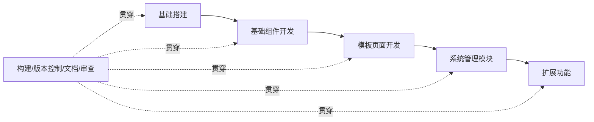

# 需求分析与开发规划

## 概述

本篇面向一个**通用管理后台组件库**的立项阶段：如何用 AI 辅助完成需求分析、技术选型与开发排期。组件库服务对象覆盖 Web、移动端及其他需要后台管理的终端，目标是沉淀可复用的业务组件、统一视觉与交互，并降低长期维护成本。

重点不在于产出一份"完美文档"，而在于建立一套可迭代的需求分析方法：通过结构化的 Prompt 把模糊想法逐步收敛成功能清单、技术决策与可执行计划，同时清醒识别 AI 输出的偏差并加以纠偏。

## 学习目标

- 掌握用 AI 辅助需求分析的 Prompt 结构与迭代技巧
- 能从功能、技术、性能、安全、扩展五个维度拆解技术需求
- 能制定合理的开发路径，并理解"贯穿型工作"为何不能放到最后
- 识别核心难点与项目风险，建立可落地的应对策略

---

## 一、项目定位与需求拆解

通用管理后台组件库的本质是"业务组件的复用层"，它介于基础 UI 库（Button、Input）和业务系统（用户管理、订单中心）之间。立项时先澄清三件事：

- **服务对象**：Web 项目、移动端、桌面端等多终端，统一接入同一套后台能力。
- **价值主张**：提升开发效率、统一视觉与交互规范、降低维护与升级成本。
- **功能边界**：明确"做什么"与"不做什么"——基础 UI 能力交由 Element Plus / Naive UI 等成熟库，组件库聚焦布局、权限、数据展示、表单等可复用业务模块。

需求拆解建议从业务场景倒推组件分类，例如知识付费场景会衍生出用户管理、内容管理、交易管理、评论管理四类模块，再据此归纳出菜单、表格、表单、权限指令等通用组件。

## 二、用 AI 辅助需求分析

AI 不会一次性给出完美答案，关键在于"会提问"。一个有效的需求分析 Prompt 应包含四个部分：

- **角色设定**：明确 AI 扮演的经验身份（如"资深前端组件库架构师"）。
- **背景上下文**：项目定位、技术栈、目标场景。
- **任务指令**：本轮要解决的问题（组件分类、功能清单、技术选型等）。
- **输出要求**：格式（表格 / 列表）、详细程度、是否要优先级标注。

实践中三类迭代技巧最常用：

1. **逐步细化**：先要大类，再补业务场景，最后收敛组件清单。
2. **提供参考案例**：让 AI 对标 vue-antd-admin、Vben Admin、Soybean Admin 等成熟方案，避免凭空发挥。
3. **要求联网检索**：明确要求"只返回 Admin 类型而非基础 UI 库"，并限定技术栈（Vue 3 + TS + Vite）与维护活跃度。

需要警惕的偏差：AI 极易返回 Ant Design、Element Plus 这类**基础 UI 库**而非**业务管理后台模板**，必须在多轮对话中反复纠偏，把"业务场景 + 完整模块"作为硬约束。

## 三、技术需求分析的五个维度

技术需求分析应系统回答以下问题，并落到文档：

| 维度 | 要回答的问题 |
|------|--------------|
| 功能模块 | 系统包含哪些模块，每个模块的具体功能是什么 |
| 技术实现 | 每个功能如何实现，需要哪些技术栈支撑 |
| 性能要求 | 性能指标是什么，如何保证（虚拟滚动、按需引入等） |
| 安全要求 | 安全策略是什么，如何保证数据与权限安全 |
| 扩展性 | 如何支撑未来功能扩展，组件与模块如何解耦 |

把五个维度铺开，就能从"我想要一个后台"变成"后台由哪些可验证的能力组成"，后续排期与分工才有依据。

## 四、开发路径规划

AI 初版计划常犯三个错误：把风格定制放在基础组件之后、把模板页放在系统管理之后、把构建与版本控制当作收尾工作。修正后的合理顺序如下，其中构建优化、Git、代码审查、文档编写应**贯穿全程**而非最后补：

- **第一阶段 基础搭建**：项目初始化、基础配置、UI 库集成、开发规范。
- **第二阶段 基础组件**：基础组件、布局组件（Layout/Menu/Tabs）、风格定制、反馈组件。
- **第三阶段 模板页面**：表单、列表、详情、结果四类页面模板。
- **第四阶段 系统管理**：用户、角色、菜单、部门、字典、日志。
- **第五阶段 扩展功能**：首页看板、图表、富文本、导入导出。

## 五、核心难点与风险管理

| 难点 | 描述 | 应对策略 |
|------|------|----------|
| 动态路由 | 按权限动态生成路由 | 清晰路由配置规范 + 用 meta 管理权限 + 路由守卫统一校验 |
| 权限管理 | RBAC 模型落地与性能 | 合理权限数据结构 + 缓存策略 + 菜单/按钮/API 三级细粒度控制 |
| 数据可视化 | ECharts 集成与性能 | 组件化封装 + 按需引入图表类型 + 响应式适配 + 更新优化 |
| 组件复用 | 业务组件抽象 | 设计规范 + Composition API 抽逻辑 + 文档 + 单测 |
| 多语言 | 国际化落地 | vue-i18n + 语言包规范 + 动态切换 + 日期数字格式化 |

项目风险同样要前置管理：

- **时间风险**：预留约 20% 缓冲、敏捷分阶段交付、建立需求变更评估流程。
- **质量风险**：ESLint + Prettier 规范、PR 必审、单测覆盖率目标、Lighthouse CI 监控性能。
- **成本风险**：技术选型前做 POC 验证、建立技术债务管理机制、定期重构。

## 六、多角色协作与排期

典型团队配置为 7 人：1 名产品经理、1–2 名 UI 设计、4 名前端。职责在时间轴上交错：产品前期做需求与 PRD、中期跟踪协调、后期验收；UI 前期定规范与基础设计、中期页面设计走查；前端从初始化贯穿到系统管理与扩展功能。

让 AI 生成甘特图时，务必纠偏三点：构建与版本控制从第一天开始、基础配置在前端开发前完成、时间预估需结合团队实际而非理想值。这些"贯穿型工作"被忽略是 AI 排期最常见的失真来源。

## 七、AI 辅助需求分析的最佳实践

三条经验最值得记住：

1. **背景知识决定上限**：大模型"遇强则强，遇弱则弱"。你具备产品规划、前端技术栈、项目管理（敏捷 / 风险 / 甘特图）知识时，输出质量显著更高；反之即使 Prompt 详细也容易笼统或出错。
2. **迭代优于一次成型**：指出具体问题（"风格定制应在基础组件之前"）→ 给优化方向 → 加约束条件（"按 7 人团队重排"）→ 要求可视化（"输出甘特图"）。四步循环比单轮长 Prompt 更有效。
3. **领域知识需人工校验**：AI 训练数据有截止点，对最新技术版本可能过时。解法是用联网模型获取新信息，再对技术栈版本、API 用法、最佳实践做人工验证，结合经验判断取舍。

## 常见问题

| 问题 | 原因 | 解决方案 |
|------|------|----------|
| AI 生成的开发计划不合理 | 对依赖关系理解不足 | 明确任务依赖，把风格定制 / 模板前置 |
| 甘特图角色分工不清 | Prompt 未说明团队配置 | 详细给出团队组成与角色职责 |
| 技术方案过时 | 训练数据截止 | 用联网模型检索，人工校验技术栈 |
| 风险识别不全 | 缺少项目管理框架 | 提供风险维度引导（时间 / 质量 / 成本） |
| 文档过于理论化 | 缺实战约束 | 要求给出具体技术实现与代码示例 |

## 延伸阅读

- 下一篇：[文档站与项目初始化](02-文档站与项目初始化.md) — 从 0 搭建组件库工程与文档站点
- 相关：[自研组件库](..) — 组件库模块总览
- 相关：[Vue 官方文档](https://cn.vuejs.org/) · [Vite 官方文档](https://vite.dev/) · [Pinia 官方文档](https://pinia.vuejs.org/zh/)
