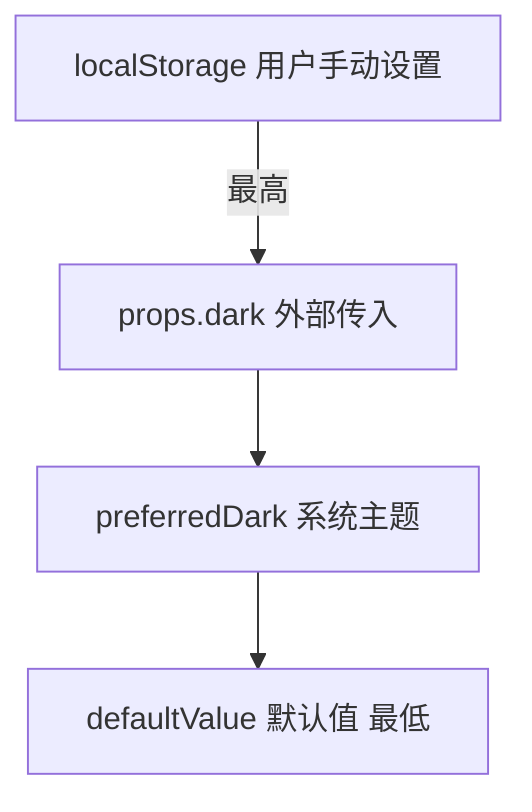

# 主题切换与全屏控制

## 概述

主题切换与全屏控制是后台项目头部最常出现的两个"工具型"功能。它们交互模式稳定、复用率极高，最适合沉淀成通用功能组件。本文以 DarkModeToggle 与 FullScreenToggle 为例，讲清楚两件事：如何用 VueUse 把"状态—样式—持久化"串成闭环，以及动态类名、动态组件、属性透传这几个高频工程细节怎么落地。

## 学习目标

- 理解"通用功能组件"的定位：高复用、职责单一、最终统一接入头部工具区
- 掌握 UnoCSS `dark:` 前缀与 VueUse `useDark` / `useToggle` 的暗黑模式闭环
- 能用 `useStorage` 持久化主题、`usePreferredDark` 跟随系统，并理清优先级
- 用 `useFullscreen` 封装全屏切换，理解全屏必须由用户交互触发
- 处理动态类名（UnoCSS safelist）、动态组件（`<component :is>`）与属性透传（`inheritAttrs:false` + `v-bind="$attrs"`）

---

## 一、为什么沉淀为通用功能组件

后台系统的头部工具区往往固定出现这几类能力：

- 主题切换（Light / Dark）
- 全屏控制（看板、编辑器常用）
- 语言切换（国际化）

它们的共同特征是：交互模式稳定、在多个项目反复出现、与具体业务无关。把这类功能抽成独立组件，价值在于复用率与一致性——任何新项目只要把组件放进头部工具区即可，不必重写一遍切换逻辑。每个组件职责应尽量聚焦单一交互，最终在真实布局里统一接入验证，而不是散落在页面各处。

## 二、DarkModeToggle：状态、样式与持久化闭环

暗黑模式切换的关键，不是"换个 class"，而是把三件事串起来：**状态来源、样式联动、本地持久化**。

### 2.1 UnoCSS 的 `dark:` 前缀

样式层用 UnoCSS 的 `dark:` 前缀声明暗黑态样式，编译后会生成 `.dark .bg-gray-900` 这样的选择器：

```vue
<div class="bg-white dark:bg-gray-900 text-black dark:text-white">
  自动适配暗黑模式
</div>
```

只要 `html` 元素上有 `dark` class，所有 `dark:` 样式就自动生效。切忌在组件里写死颜色——一切跟随统一状态源。

### 2.2 VueUse 三件套

```ts
import { useDark, useToggle, useStorage, usePreferredDark } from '@vueuse/core'

// 响应式暗黑状态，默认把 dark class 加到 html
const isDark = useDark()
// 一行切换
const toggleDark = useToggle(isDark)
// 持久化：刷新后不丢，替代 ref(false)
const stored = useStorage('dark-mode-flag', false)
// 系统主题偏好，等价于 matchMedia('(prefers-color-scheme: dark)')
const preferredDark = usePreferredDark()
```

`useDark` 默认就处理好了 selector / attribute / valueDark / valueLight，并把状态同步到 `html` 元素的 class 上；`useStorage` 则把状态落到 localStorage，刷新后仍在。

### 2.3 四层优先级

当一个主题可能被"用户手动设置、外部 props、系统主题、默认值"多方影响时，需要明确的优先级。本文采用：



落地纪律是：**用户手动设置过就永远优先**；只有没设置过时，才依次降级到 props、系统主题、默认值。这样既能跟随系统，又不会被系统主题覆盖掉用户的选择。

### 2.4 接入 Element Plus Switch

`@vueuse/core` 负责状态，UI 上常用 Element Plus 的 `el-switch` 承载，并给它配上图标：

```vue
<template>
  <el-switch v-model="isDark" :active-icon="MoonIcon" :inactive-icon="SunIcon" />
</template>

<script setup lang="ts">
import { h } from 'vue'
// active-icon 为 true 时显示月亮，inactive-icon 为 false 时显示太阳
const MoonIcon = () => h('i', { class: 'i-carbon-moon' })
const SunIcon = () => h('i', { class: 'i-carbon-sun' })
</script>
```

注意图标方向与状态对应：`isDark=true` 显示月亮，`false` 显示太阳。若图标来自 UnoCSS 图标类（如 `i-carbon-moon`），需确保对应图标集已安装（如 `@iconify-json/carbon`），否则图标不显示。

### 2.5 抽成 composable

把上述逻辑收口到 `useDarkMode`，页面与组件都不再关心优先级细节：

```ts
export const useDarkMode = (options = {}) => {
  const { storageKey = 'dark-mode', followSystem = true } = options
  const isDark = useStorage(storageKey, false)
  const preferredDark = usePreferredDark()
  const toggle = () => (isDark.value = !isDark.value)
  // ...监听变化 applyTheme，followSystem 时监听 preferredDark
  return { isDark, toggle, preferredDark }
}
```

## 三、FullScreenToggle：动态组件与样式安全

全屏切换的 API 很简单，难点在"动态渲染图标"带来的两个工程问题。

### 3.1 useFullscreen

```ts
import { useFullscreen } from '@vueuse/core'
// 不传 target 即整页全屏；传 ref<HTMLElement> 则指定元素全屏
const { isFullscreen, toggle, enter, exit } = useFullscreen()
```

关键约束：**全屏必须由用户交互（如点击）触发**，不能在 `onMounted` 里自动 `enter()`，否则浏览器会拒绝。按钮文案与图标也应绑定 `isFullscreen` 响应式状态，保证显示与真实状态一致。

### 3.2 动态组件 `<component :is>`

为了让调用方自定义标签类型（`<i>` / `<span>` / `<div>`），用动态组件而非写死标签：

```vue
<template>
  <component :is="tag" :class="iconClass" @click="toggle" />
</template>

<script setup lang="ts">
import { computed } from 'vue'
const props = withDefaults(defineProps<{ tag?: 'i' | 'span' | 'div' }>(), { tag: 'i' })
const { isFullscreen, toggle } = useFullscreen()
const iconClass = computed(() => [
  isFullscreen.value ? 'i-ep-full-screen-exit' : 'i-ep-full-screen',
  'cursor-pointer'
])
</script>
```

### 3.3 UnoCSS safelist：救回动态类名

`iconClass` 里拼接的类名（如 `i-ep-full-screen-exit`）是运行时才确定的，UnoCSS 静态扫描不到，会被丢弃导致图标不显示。解决方式是在 `uno.config.ts` 用 `safelist` 强制包含：

```ts
export default defineConfig({
  safelist: [
    'i-ep-full-screen',
    'i-ep-full-screen-exit',
    // 或用正则一次性覆盖整个图标集
    /^i-ep-/
  ]
})
```

`safelist` 支持字符串与正则两种写法（类型为 `(string | RegExp)[]`），动态类名场景优先用正则批量覆盖。

### 3.4 属性透传

外部传入的 `style` / `class` 应原样落到根元素上。Vue 默认会把未声明 props 的属性自动继承到根节点，但若根节点是动态组件，需手动接管：

```vue
<template>
  <component :is="tag" v-bind="$attrs" :class="iconClass" @click="toggle" />
</template>

<script setup lang="ts">
defineOptions({ inheritAttrs: false }) // 关闭自动继承，手动透传
</script>
```

`inheritAttrs:false` 关闭默认行为后，用 `v-bind="$attrs"` 显式把外部属性绑定到目标节点，避免透传丢失。

## 四、组合到头部工具区

两个组件职责清晰后，统一放进头部工具区即可复用：

```vue
<template>
  <div class="toolbar">
    <DarkModeToggle />
    <FullScreenToggle style="font-size: 1.25rem; margin-left: 8px" />
  </div>
</template>

<script setup lang="ts">
import DarkModeToggle from '@/components/behaviors/DarkModeToggle.vue'
import FullScreenToggle from '@/components/behaviors/FullScreenToggle.vue'
</script>

<style scoped>
.toolbar { display: flex; align-items: center; gap: 8px; }
</style>
```

先固定工具区的布局结构（通常是 flex 横向排列），再逐个接入功能组件，能避免"功能能跑但接进布局后很乱"的问题。

---

## 常见问题

| 问题 | 原因 | 解决方案 |
|------|------|----------|
| 暗黑切换了但局部样式没变 | 样式未跟随统一状态、写死颜色 | 用 `dark:` 前缀，避免局部写死 |
| 刷新后主题丢失 | 用了 `ref` 而非持久化 | 改用 `useStorage` |
| 图标显示反了 | active/inactive 图标与状态对应错 | `isDark=true` 配月亮，`false` 配太阳 |
| 全屏图标不显示 | 动态类名未被 UnoCSS 扫描 | `safelist` 强制包含 |
| 全屏不生效 | 在 `onMounted` 自动 enter | 改为点击等用户交互触发 |
| 外部 style/class 不生效 | 动态组件未透传 `$attrs` | `inheritAttrs:false` + `v-bind="$attrs"` |
| 跟随系统不生效 | 未判断用户是否手动设置过 | 监听 `preferredDark` 时先查 localStorage |

## 延伸阅读

- 上一篇：[IconPicker 封装与动态加载优化](../02-图标体系/02-IconPicker封装与动态加载优化.md) — 图标选择器与按需加载
- 下一篇：[语言切换与基础国际化接入](../04-国际化方案/01-语言切换与基础国际化接入.md) — 进入国际化方案模块
- 相关：[自研组件库](..) — 组件库模块总览
- 相关：[VueUse](https://vueuse.org/) · [UnoCSS](https://unocss.dev/) · [MDN Fullscreen API](https://developer.mozilla.org/zh-CN/docs/Web/API/Fullscreen_API)
