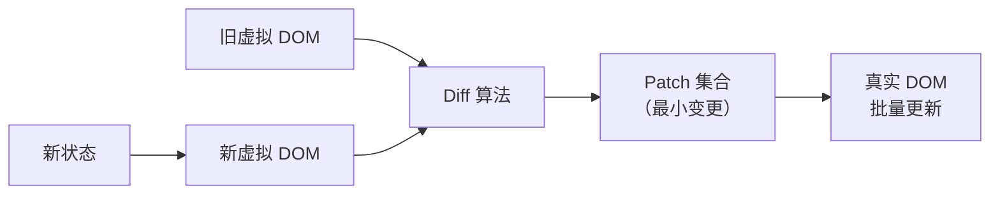

# 虚拟 DOM：设计动机与实现机制

## 学习目标

- 掌握 为什么需要虚拟 DOM
- 掌握 直接操作 DOM 的问题
- 掌握 虚拟 DOM 的实现与 Diff 策略

## 概述

虚拟 DOM（Virtual DOM）是 React 等框架的核心渲染机制。本文将分析虚拟 DOM 的设计动机、实现原理，并与现代框架的编译时优化进行对比。

---

## 1 为什么需要虚拟 DOM

### 1.1 直接操作 DOM 的问题

| 问题 | 说明 |
|------|------|
| 性能开销 | DOM 操作触发重排/重绘，频繁操作代价高 |
| 开发效率 | 手动管理 DOM 状态与数据同步，代码复杂 |
| 跨平台限制 | DOM API 仅在浏览器环境可用 |

### 1.2 虚拟 DOM 的设计思路

虚拟 DOM 在 JavaScript 层面维护一份轻量的 DOM 树副本，通过 **diff 算法** 计算最小变更集，批量更新真实 DOM：



---

## 2 虚拟 DOM 的实现

### 2.1 虚拟节点结构

```javascript
// 虚拟 DOM 节点
const vnode = {
    type: 'div',
    props: { className: 'container', id: 'app' },
    children: [
        { type: 'h1', props: {}, children: [{ type: 'TEXT', value: 'Hello' }] },
        { type: 'p', props: {}, children: [{ type: 'TEXT', value: 'World' }] }
    ]
};
```

### 2.2 Diff 算法的核心策略

React 的 Reconciliation 算法基于三个假设：

1. **同层比较**：只比较同一层级的节点，不跨层
2. **类型相同可复用**：同类型节点保留 DOM 元素，仅更新属性
3. **Key 标识身份**：列表中使用 `key` 标识节点身份，避免不必要的重建

| 场景 | 策略 | 时间复杂度 |
|------|------|------------|
| 同类型节点 | 更新属性 + 递归比较子节点 | O(n) |
| 不同类型节点 | 销毁旧树 + 创建新树 | O(n) |
| 列表子节点 | 基于 key 的匹配 + 移动 | O(n) |

---

## 3 虚拟 DOM 的代价与演进

### 3.1 运行时开销

| 开销 | 说明 |
|------|------|
| 内存 | 维护完整的虚拟 DOM 树副本 |
| 计算 | 每次状态变更执行 diff 算法 |
| GC 压力 | 频繁创建/销毁虚拟节点对象 |

### 3.2 编译时与运行时优化（React / Vue 3 / Svelte / Solid）

现代框架通过编译时分析与运行时调度优化，减少虚拟 DOM 的运行时开销：

| 框架 | 优化策略 | 效果 |
|------|----------|------|
| **React** | React Compiler（编译时自动 Memoization）+ 运行时并发特性 | 减少不必要的重渲染 |
| **Vue 3** | 编译时静态提升 + PatchFlags | 跳过静态节点的 diff |
| **Svelte** | 无虚拟 DOM，编译为命令式 DOM 操作 | 零运行时开销 |
| **Solid.js** | 细粒度响应式 + 真实 DOM 绑定 | 无 diff，精确更新 |

### 3.3 Svelte 的编译时方案

Svelte 在编译阶段将模板转换为直接操作 DOM 的命令式代码，完全消除虚拟 DOM：

```javascript
// Svelte 编译输出（简化）
function create_fragment(ctx) {
    let h1;
    let t;

    return {
        c() {            // create
            h1 = element('h1');
            t = text(ctx[0]);  // ctx[0] = name
            append(h1, t);
        },
        m(target, anchor) {  // mount
            insert(target, h1, anchor);
        },
        p(ctx, dirty) {     // update
            if (dirty & 1) set_data(t, ctx[0]); // 仅更新变化的部分
        },
        d(detaching) {      // destroy
            if (detaching) detach(h1);
        }
    };
}
```

---

## 4 虚拟 DOM vs 真实 DOM：何时使用

| 场景 | 推荐方案 | 原因 |
|------|----------|------|
| 大型 SPA | React/Vue（虚拟 DOM） | 声明式 UI + 生态系统 |
| 性能敏感应用 | Svelte/Solid（无虚拟 DOM） | 零运行时开销 |
| 简单交互 | 原生 DOM API | 无框架开销 |
| 跨平台渲染 | React（虚拟 DOM → 多目标） | React Native / SSR |

---

## 5 总结

虚拟 DOM 的核心价值不在于"比真实 DOM 快"——直接操作 DOM 在理论上更快。虚拟 DOM 的价值在于**提供声明式 UI 编程模型，同时通过 diff 算法保证合理的性能下限**。随着编译时优化技术的发展，虚拟 DOM 的运行时开销正在被逐步消除，但其声明式编程模型的价值将持续存在。

---

## 参考文献

1. React: [Preserving and Resetting State](https://react.dev/learn/preserving-and-resetting-state)
2. Vue: [Virtual DOM](https://vuejs.org/guide/extras/rendering-mechanism.html)
3. Svelte: [Compiler](https://svelte.dev/docs/svelte-compiler)
4. Solid.js: [Reactivity](https://www.solidjs.com/guides/reactivity)

## 继续阅读

- 上一篇：[02-React服务端渲染-从SSR到hydrate](02-React服务端渲染-从SSR到hydrate)
- 下一篇：[04-调度与时间片](04-调度与时间片)
