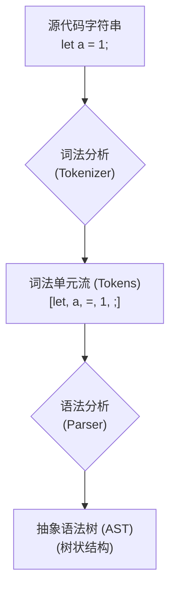

# 一次搞懂 AST 抽象语法树

理解 AST 抽象语法树是开发代码分析工具的前提，本篇我们将学习 AST 相关的基础知识，主要内容包括 AST 是什么？常见节点有哪些？AST 可视化工具有什么用？AST 有哪些具体用途？以及如何生成 AST。通过这一小节的学习，大家可以一次性搞懂抽象语法树的所有知识，为后续开发分析工具打下坚实基础。

## 第一章：初识 AST —— 代码的骨架

### 1.1 什么是抽象语法树 (AST)？

> **抽象语法树** (Abstract Syntax Tree)，简称 **AST**，是源代码语法结构的一种抽象表示。它以树状的形式表现编程语言的语法结构，树上的每个节点都表示源代码中的一种结构。

如果说源代码是建筑的最终实体，那么 AST 就是这座建筑的**设计蓝图**。它精确地描绘了代码的结构和意图——哪里是变量声明，哪里是函数调用，循环体包含了哪些语句——但忽略了那些与结构无关的细节，比如代码缩进、空格或注释。

正是因为 AST 的这种“抽象”性，它成为了程序化理解和操作代码的基石。

### 1.2 AST 的诞生之旅：从代码到树

为了更好地理解这个过程，我们可以将其分为两个核心阶段：

1.  **词法分析 (Lexical Analysis, or Tokenization)**
2.  **语法分析 (Syntactic Analysis, or Parsing)**

下面，我们用一个流程图来直观地展示这个过程：



举个例子，对于这行代码：`const iceman = 'good boy';`

- **词法分析**会产生类似这样的 Token 序列：
  `[`
  `{ "type": "Keyword", "value": "const" },`
  `{ "type": "Identifier", "value": "iceman" },`
  `{ "type": "Punctuator", "value": "=" },`
  `{ "type": "String", "value": "'good boy'" },`
  `{ "type": "Punctuator", "value": ";" }`
  `]`

- **语法分析**则会根据这些 Token 构建出如下的 AST 结构（简化版）：

  ```json
  {
    "type": "VariableDeclaration",
    "kind": "const",
    "declarations": [
      {
        "type": "VariableDeclarator",
        "id": {
          "type": "Identifier",
          "name": "iceman"
        },
        "init": {
          "type": "StringLiteral",
          "value": "good boy"
        }
      }
    ]
  }
  ```

### 1.3 探索 AST 的基本单元：节点 (Node)

AST 由一个个**节点 (Node)** 构成。每个节点都是一个 JavaScript 对象，它包含了描述代码中某个部分所需的所有信息。

#### 通用属性

虽然节点类型繁多，但它们通常都包含一些通用属性，用于定位和识别：

- `type`: 一个字符串，表示节点的类型，例如 `"FunctionDeclaration"` (函数声明)。
- `start` / `end`: 数字，表示该节点在源代码字符串中的起始和结束索引。
- `loc`: 一个对象，包含 `start` 和 `end` 两个子对象，分别记录了节点在源代码中的起始和结束行列号。
- `kind` (TypeScript AST 特有): 一个数字枚举值，同样用于标记节点类型，是 `ts.SyntaxKind` 的成员。

#### 核心节点类型

下面我们介绍一些最核心、最常见的节点类型，理解它们是读懂 AST 的关键。

##### 1. Identifier (标识符)

变量名、函数名、属性名、参数名等各种“名字”。

_代码示例:_

```typescript
function sayHi(name) {
  let message = "Hello"
  console.log(message, name)
}
```

_AST 中的 `Identifier` 节点:_ `sayHi`, `name`, `message`, `console`, `log`

##### 2. Literal (字面量)

表示一个固定的值，如字符串、数字、布尔值、正则表达式等。

_代码示例:_

```typescript
let name = "iceman" // StringLiteral
let age = 30 // NumericLiteral
const isMan = true // BooleanLiteral
const reg = /\d+/ // RegExpLiteral
```

##### 3. Statement (语句)

代码中可独立执行的最小单元，通常对应代码中的一行或一个代码块。

_代码示例:_

```typescript
return "iceman" // ReturnStatement
if (age > 35) {
} // IfStatement
throw new Error("oops") // ThrowStatement
```

##### 4. Declaration (声明)

一种特殊的语句，用于引入新的标识符（变量、函数、类等）。

_代码示例:_

```typescript
const version = "1.0" // VariableDeclaration
function getInfo() {} // FunctionDeclaration
class Car {} // ClassDeclaration
```

##### 5. Expression (表达式)

执行后会产生一个值的代码片段。这是它与“语句”最本质的区别。

_代码示例:_

```typescript
// 都是表达式
age = 1 // AssignmentExpression (赋值表达式)
1 + 2 // BinaryExpression (二元表达式)
isMan ? "男" : "女" // ConditionalExpression (条件表达式)
getInfo() // CallExpression (调用表达式)
```

##### 6. Import/Export (模块语法)

用于处理 ES 模块的导入和导出，它们也是一种特殊的声明。

_代码示例:_

```typescript
import api from "./utils" // ImportDeclaration
export const name = "iceman" // ExportNamedDeclaration
export default function () {} // ExportDefaultDeclaration
```

## 第二章：工欲善其事 —— AST 可视化与生成

要高效地使用 AST，我们必须先学会如何观察它、生成它。本章将介绍两款强大的在线可视化工具，并详细讲解在项目中通过编程方式生成 AST 的核心方法。

### 2.1 在线探索工具

#### AST Explorer

[AST Explorer](https://astexplorer.net/) 是一个功能强大的多语言 AST 可视化工具。它不仅仅是一个查看器，更是一个学习和调试的利器。

**核心价值：**

- **多解析器支持**: 你可以自由切换不同的解析器（Parser），如 `@babel/parser`, `typescript`, `esprima` 等，直观地看到不同解析器生成的 AST 结构差异。
- **实时同步**: 左侧代码区域的任何改动都会实时反映在右侧的 AST 树上，光标在代码和 AST 节点之间可以双向同步定位，非常便于学习。
- **转换功能**: 它还集成了代码转换功能，你可以在下方的转换区编写代码（例如 Babel 插件），实时查看代码被转换后的效果。


#### TypeScript AST Viewer

[TypeScript AST Viewer](https://ts-ast-viewer.com/) 是专门为 TypeScript 设计的 AST 可视化工具。

**核心价值：**

- **深度集成 TS 编译信息**: 与 AST Explorer 不同，它不仅展示 AST 节点信息，还会关联显示 TypeScript 编译器在编译过程中为每个节点计算出的 `Type` (类型) 和 `Symbol` (符号) 信息。
- **类型分析利器**: 当你需要进行基于类型的代码分析时（例如，检查某个函数调用的返回值类型是否正确），这个工具是不可或缺的。后续的章节中，我们会频繁使用它。


### 2.2 通过编程生成 AST

在实际的代码分析工具中，我们需要通过调用解析器 (Parser) 的 API 来生成 AST。

#### JavaScript 生态: @babel/parser

Babel 是现代前端工具链的核心，其解析器 `@babel/parser` (前身为 `babylon`) 是解析 JavaScript (包括 JSX、Flow 等方言) 的事实标准。

_安装:_

```bash
npm install @babel/parser
```

_使用示例:_

```javascript
const parser = require("@babel/parser")

const code = `function square(n) {
  return n * n;
}`

const ast = parser.parse(code, {
  sourceType: "module", // 支持 ES Modules
  plugins: ["jsx"] // 支持 JSX
})

console.log(ast)
```

#### TypeScript 生态: typescript

TypeScript 编译器本身就提供了强大的 API 来解析 TS 和 JS 代码。这是我们本次实战文档选择的工具。它主要提供两种生成 AST 的方式。

##### 方式一: `createSourceFile` (快速但信息有限)

这个 API 可以直接将一段代码字符串解析成 AST，无需创建完整的编译上下文。它速度快，使用简单，非常适合那些**不需要类型信息**的场景，例如代码格式化、简单的语法检查等。

`AST Explorer` 的底层就是利用这个 API 来快速生成 AST 的。

_使用示例:_

```typescript
const ts = require("typescript")

const tsCode = `let name: string = 'iceman';`

// 参数：文件名，源代码，语言版本，是否链接 parent 节点
const sourceFile = ts.createSourceFile(
  "my-file.ts",
  tsCode,
  ts.ScriptTarget.Latest,
  true // setParentNodes
)

// sourceFile 就是这棵树的根节点
console.log(sourceFile)
```

##### 方式二: `createProgram` (功能强大，包含完整编译信息)

这种方式会创建一个 `Program` 对象，它模拟了 `tsc` 命令的一次完整编译过程。通过 `Program`，我们不仅能获取到指定文件的 AST (`SourceFile`)，还能访问到强大的**类型检查器 (TypeChecker)**。

`TypeChecker` 是 TS 编译器的核心，它能告诉你：

- 一个变量的**具体类型**是什么。
- 一个标识符**指向哪个声明** (Symbol)。
- 一个函数调用的**签名**是什么。

这对于开发深度代码分析工具至关重要。因此，**这是我们后续开发依赖分析工具所采用的方式**。

_使用示例:_

```typescript
const ts = require("typescript")

// 假设我们有一个 tsconfig.json 和一些 ts 文件
const filePaths = ["/path/to/your/file.ts"]
const options = {
  // 你的 tsconfig.json 中的 compilerOptions
  target: ts.ScriptTarget.ES5,
  module: ts.ModuleKind.CommonJS
}

// 1. 创建 Program
const program = ts.createProgram(filePaths, options)

// 2. 从 Program 中获取指定文件的 AST (SourceFile)
const sourceFile = program.getSourceFile("/path/to/your/file.ts")

// 3. 获取类型检查器 (TypeChecker)
const typeChecker = program.getTypeChecker()

// 现在，你可以结合 sourceFile (AST) 和 typeChecker (类型信息) 进行深度分析了
console.log(sourceFile)
```

#### 小结：如何选择？

| 方式                   | 优点                           | 缺点                         | 适用场景                                         |
| :--------------------- | :----------------------------- | :--------------------------- | :----------------------------------------------- |
| **`createSourceFile`** | 速度快、内存占用小、API 简单   | **无法获取类型信息**         | 代码格式化、无类型依赖的语法检查、简单的重构     |
| **`createProgram`**    | **可获取完整的类型和符号信息** | 速度慢、内存占用大、API 复杂 | **需要类型的代码分析**、复杂的重构、依赖关系分析 |

现在，我们已经了解了 AST 的基本概念和生成方法，但这仅仅是第一步。真正强大的地方在于，我们可以像操作一个普通 JavaScript 对象一样，去遍历、分析、甚至修改这棵树，从而实现对代码的程序化处理。

## 第三章：掌控 AST —— 遍历、修改与生成

一旦我们将源代码解析为 AST，就开启了程序化理解和操作代码的大门。无论是想检查代码是否符合规范、自动修复错误、转换代码语法，还是注入新的功能，第一步总是**遍历**这棵树，找到我们需要操作的目标节点。

在这一章，我们将深入探讨操作 AST 的三大核心环节：

1.  **遍历 (Traverse)**：如何高效地访问 AST 中的每一个节点？我们将重点学习强大的**访问者模式 (Visitor Pattern)**。
2.  **修改 (Transform)**：找到目标节点后，如何安全地进行增、删、改、换？
3.  **生成 (Generate)**：当 AST 被修改后，如何将其转换回我们熟悉的、可读可执行的代码字符串？

掌握了这三项技能，您就具备了开发各类代码分析与转换工具的核心能力。

### 1. AST 遍历：强大的访问者模式 (Visitor Pattern)

想象一下，你想在一棵巨大的家谱树中，找到所有名字叫“John”的人。你该怎么做？

- **笨方法**：从根节点（最老的祖先）开始，检查他是不是“John”，然后看他的第一个孩子，再看这个孩子的孩子……直到这条分支结束，再回到上一个节点看他的第二个孩子。这需要你手动管理复杂的递归逻辑，非常繁琐且容易出错。

- **聪明的方法**：你雇佣一个“访问者”（Visitor）。你告诉他：“你的任务是，访问家谱里的每一个人，如果他叫‘John’，就通知我。” 于是，这个访问者自己去搞定遍历的所有工作（深度优先搜索，Depth-First-Search），你只需要坐在原地，等待他把所有叫“John”的人带到你面前。

这就是**访问者模式**的核心思想：**将“数据结构”（AST）和“对数据的操作”（你的业务逻辑）解耦**。遍历的复杂工作由工具库（如 Babel, TypeScript）完成，我们只需要在一个“访问者”对象里，声明我们对哪些类型的节点感兴趣，以及找到它们后想做什么。

**访问者模式的工作流程：**

1.  从根节点开始，进行深度优先的遍历。
2.  进入一个节点时，检查“访问者”对象里是否有处理该类型节点的方法。如果有，就执行它（这被称为 **Enter** 阶段）。
3.  继续遍历该节点的所有子节点。
4.  当所有子节点都访问完毕，离开该节点时，再次检查“访问者”对象是否有处理离开阶段的方法。如果有，就执行它（这被称为 **Exit** 阶段）。

这种模式极其强大，因为我们几乎可以在遍历过程中的任何精确时刻介入，执行我们的逻辑。

#### Babel 中的遍历：`@babel/traverse`

Babel 全家桶提供了 `@babel/traverse` 模块，它是专门用来遍历 AST 的。

首先，安装它：

```bash
npm install @babel/traverse
```

现在，让我们用它来遍历之前 `square` 函数的 AST，并打印出所有标识符（Identifier）的名称：

```javascript
const parser = require("@babel/parser")
const traverse = require("@babel/traverse").default // 注意 `default`

const code = `function square(n) {
  return n * n;
}`

const ast = parser.parse(code)

// 定义我们的“访问者”
const visitor = {
  // key 是我们感兴趣的节点类型
  Identifier(path) {
    // path 是一个非常重要的对象，它包含了节点信息、父节点、作用域等
    console.log("Found Identifier:", path.node.name)
  }
}

// 开始遍历
traverse(ast, visitor)

// 输出:
// Found Identifier: square
// Found Identifier: n
// Found Identifier: n
// Found Identifier: n
```

**核心概念：`path` 对象**

在上面的例子中，传递给 `Identifier(path)` 的 `path` 参数，而不是 `node`，是 Babel Traverse 的精髓所在。`path` 对象是对节点的一层封装，它记录了节点在树中的位置、作用域等上下文信息，并提供了大量用于操作节点的方法。

- `path.node`: 当前的 AST 节点。
- `path.parent`: 父节点。
- `path.parentPath`: 父节点的 `path` 对象。
- `path.scope`: 当前节点所在的作用域信息，可以用来查找变量绑定等。
- `path.replaceWith(newNode)`: 用一个新节点替换当前节点。
- `path.remove()`: 删除当前节点。
- `path.insertBefore(newNodes)`: 在当前节点前插入节点。
- ... 等等

通过 `path`，我们不仅能“看”，还能轻松地“改”，这使得代码转换变得异常简单。

#### TypeScript 中的遍历

TypeScript 的编译器 API 没有像 Babel 那样提供一个独立的 `@ts/traverse` 包，但它内置了遍历功能。

**基础遍历：`ts.forEachChild`**

最基础的方法是 `ts.forEachChild`，它接受一个节点，然后会遍历该节点的所有 **直接** 子节点。

```typescript
const ts = require("typescript")

const tsCode = `let name: string = 'iceman';`
const sourceFile = ts.createSourceFile(
  "temp.ts",
  tsCode,
  ts.ScriptTarget.Latest,
  true
)

function visit(node) {
  console.log("Visiting Node Kind:", ts.SyntaxKind[node.kind]) // 打印节点类型
  // 关键：手动递归调用，继续遍历子节点
  ts.forEachChild(node, visit)
}

// 从根节点开始遍历
visit(sourceFile)
```

这种方式非常灵活，但缺点也显而易见：你需要自己手动递归调用 `visit` 函数来保证整棵树被完整遍历，这和我们之前提到的“笨方法”很像。

**实现一个“访问者”**

我们可以基于 `ts.forEachChild` 封装一个更接近“访问者模式”的函数：

```typescript
const ts = require("typescript")

function createVisitor(visitor) {
  return function visit(node) {
    // 1. 对当前节点执行 visitor 中定义的逻辑
    if (visitor[node.kind]) {
      visitor[node.kind](node)
    }
    // 2. 递归遍历子节点
    ts.forEachChild(node, visit)
  }
}

const tsCode = `let name: string = 'iceman';`
const sourceFile = ts.createSourceFile(
  "temp.ts",
  tsCode,
  ts.ScriptTarget.Latest,
  true
)

// 使用我们封装的 createVisitor
const myVisitor = createVisitor({
  [ts.SyntaxKind.Identifier]: (node) => {
    console.log("Found Identifier:", node.text)
  },
  [ts.SyntaxKind.StringLiteral]: (node) => {
    console.log("Found String Literal:", node.text)
  }
})

myVisitor(sourceFile)

// 输出：
// Found Identifier: name
// Found String Literal: iceman
```

这个例子更好地体现了访问者模式的解耦思想。我们把“做什么”（`myVisitor` 对象）和“怎么做”（`createVisitor` 函数）分开了。在实际开发中，我们可以构建更复杂的 `visitor` 来完成我们的分析任务。

对比 Babel 和 TypeScript：

- **Babel**: 提供了功能完备、高度封装的 `@babel/traverse`，`path` 对象功能强大，非常适合做代码转换。
- **TypeScript**: 提供的 API 更底层，需要我们手动进行更多的工作来实现完整的遍历。但它的优势在于，结合 `Program` 和 `TypeChecker`，我们可以获取到丰富的**类型信息**，这是 Babel 无法做到的。

### 2. AST 修改：外科手术式的代码改造

遍历让我们能够“定位病灶”，而修改则是真正“动手术”的环节。修改 AST 的基本原则是：**不要直接修改原始节点对象，而是创建新的节点来替换它**。这能确保数据流的清晰和可预测性，避免在复杂的转换中产生意外的副作用。

#### Babel 中的修改

在 Babel 中，修改 AST 非常直观，这都归功于 `path` 对象提供的一系列 API。

**示例：将所有变量 `n` 重命名为 `x`**

```javascript
const parser = require("@babel/parser")
const traverse = require("@babel/traverse").default
const generator = require("@babel/generator").default // 引入生成器

const code = `function square(n) {
  return n * n;
}`
const ast = parser.parse(code)

traverse(ast, {
  // 我们只关心作用域内的变量，函数名 square 不算
  Identifier(path) {
    if (path.node.name === "n") {
      // 直接在 path 上下达“换人”指令
      path.node.name = "x"
    }
  }
})

// 从修改后的 AST 生成新代码
const newCode = generator(ast).code

console.log(newCode)
// 输出:
// function square(x) {
//   return x * x;
// }
```

在这个例子中，我们直接修改了 `path.node.name`。对于简单的值修改，这是可以的。但对于结构性的改变，比如替换整个节点，我们应该使用 `path.replaceWith`。

#### TypeScript 中的修改：转换器 (Transformer)

TypeScript 的 AST 节点被设计为**不可变 (Immutable)** 的。如果你想修改一个节点，你不能直接在原节点上改，而是需要创建一个全新的节点，并用它来替换旧节点在树中的位置。

这个过程相对 Babel 要复杂一些，它引入了一个核心概念：**转换器 (Transformer)**。一个 Transformer 是一个函数，它接收一个 AST 节点，并返回一个新的（可能被修改的）AST 节点。

TS 编译器通过 `ts.transform` 方法来应用这些转换器。

**示例：同样是将 `n` 重命名为 `x`**

```typescript
const ts = require("typescript")

const tsCode = `function square(n: number): number {
  return n * n;
}`
const sourceFile = ts.createSourceFile(
  "temp.ts",
  tsCode,
  ts.ScriptTarget.Latest,
  true
)

// 1. 定义一个 Transformer Factory
const transformerFactory = (context) => {
  // 2. 返回一个真正的 Transformer 函数，它处理每个节点
  return (node) => {
    // 3. 定义一个 visitor 函数来遍历和修改节点
    function visit(node) {
      // 如果是标识符 'n'
      if (ts.isIdentifier(node) && node.text === "n") {
        // 创建并返回一个全新的标识符 'x'
        return ts.factory.createIdentifier("x")
      }
      // 对于其他节点，继续深度遍历
      return ts.visitEachChild(node, visit, context)
    }
    // 4. 从根节点开始应用 visitor
    return ts.visitNode(node, visit)
  }
}

// 5. 使用 ts.transform 应用我们的 transformer
const result = ts.transform(sourceFile, [transformerFactory])

// 6. 从转换结果中获取修改后的 AST
const newSourceFile = result.transformed[0]

// 7. 打印新代码
const printer = ts.createPrinter()
const newCode = printer.printFile(newSourceFile)

console.log(newCode)
// 输出:
// function square(x: number): number {
//     return x * x;
// }
```

这个过程看起来步骤繁多，但它体现了函数式编程和不可变性的思想，使得转换过程非常严谨和可控。`ts.factory` 对象是创建新节点的工厂，提供了如 `createIdentifier`, `createStringLiteral` 等方法。

### 3. AST 生成：从骨架到代码

最后一步，当我们的 AST “手术”完成后，需要将这副新的“骨架”重新渲染成代码字符串。

#### Babel 中的生成：`@babel/generator`

Babel 的生成器同样是一个独立的包。

```bash
npm install @babel/generator
```

它的使用非常简单，接收一个 AST，返回一个包含 `code` 和 `map` (SourceMap) 的对象。

```javascript
const generator = require("@babel/generator").default

// 假设 ast 是我们已经修改完毕的 AST
const output = generator(
  ast,
  {
    sourceMaps: true, // 是否生成 SourceMap
    comments: false, // 是否保留注释
    compact: false // 是否压缩代码
  },
  code
) // 传入原始代码可以更好地生成 SourceMap

console.log(output.code)
```

#### TypeScript 中的生成：`ts.createPrinter`

在 TypeScript 中，我们使用 `ts.createPrinter` 来创建一个打印机实例。

```typescript
const ts = require("typescript")

// 假设 newSourceFile 是我们通过 Transformer 得到的新的 AST
const printer = ts.createPrinter({
  newLine: ts.NewLineKind.LineFeed, // 设置换行符
  removeComments: false // 不移除注释
})

// 使用 printer 的 printFile 或 printNode 方法
const newCode = printer.printFile(newSourceFile)

console.log(newCode)
```

`createPrinter` 和 `printFile` 的组合，就是 TS 生态中将 AST 还原为代码的标准方式。

---

至此，我们已经完整地走过了“**解析 -> 遍历 -> 修改 -> 生成**”这一 AST 操作的全流程。掌握了这些，就等于掌握了所有 AST 工具的底层工作原理。

## 第四章：AST 的威力 —— 真实世界应用

理论的价值在于指导实践。现在，是时候将我们手中的“手术刀”应用到真实的“手术”中了。本章将向您展示，AST 是如何在现代前端开发中大放异彩，成为无数强大工具的基石。

我们将探索三大领域：

1.  **代码质量保障**：揭秘 ESLint 如何通过 AST “阅读”并理解你的代码。
2.  **前端工程化**：手把手带你编写一个实用的 Babel 插件，实现代码的自动转换。
3.  **框架底层原理**：窥探 Vue / React 等现代框架如何利用 AST 将模板或 JSX 编译成高效的 JavaScript 代码。

### 1. 代码质量保障：ESLint 的“火眼金睛”

你是否想过，ESLint 是如何做到如此精准地发现代码中的问题？比如，它如何知道你调用了 `console.log`（对应 `no-console` 规则），或者在代码里留下了 `debugger` 语句（对应 `no-debugger` 规则）？

答案是：**ESLint 的每一条规则，本质上都是一个 AST 的访问者**。

当 ESLint 运行时，它首先将你的代码解析成 AST，然后将这个 AST 交给所有启用的规则去“检查”。

- 对于 `no-debugger` 规则，它的访问者极其简单，只关心一种节点：

  ```javascript
  // 规则实现的核心
  visitor: {
    // 当遍历器遇到 DebuggerStatement 节点时，就会调用这个函数
    DebuggerStatement(node) {
      // 上报一个错误
      context.report({ node, message: "Unexpected 'debugger' statement." });
    }
  }
  ```

- 对于 `no-console` 规则，它的访问者会更复杂一点，它需要检查**函数调用表达式 (CallExpression)**：
  ```javascript
  visitor: {
    CallExpression(node) {
      // 检查被调用的是不是一个成员表达式，如 a.b
      if (node.callee.type === 'MemberExpression' &&
          node.callee.object.type === 'Identifier' &&
          node.callee.object.name === 'console') {
        // 如果是 console.log, console.error 等，就报错
        context.report({ node, message: "Unexpected console statement." });
      }
    }
  }
  ```

通过 AST，ESLint 能够精确地理解代码的**语法结构**和**上下文**，而不是简单地进行文本搜索。这就是为什么它能区分作为对象键的 `console` 和作为调用者的 `console`，这是正则表达式无法企及的精度。

### 2. 前端工程化：亲手打造一个 Babel 插件

Babel 是现代前端的“翻译官”，它能将高版本的 JavaScript 语法转换为低版本浏览器兼容的语法。而 Babel 的核心，就是建立在 AST 转换之上的一系列**插件 (Plugin)**。

**每一个 Babel 插件，就是一个返回“访问者”对象的函数。**

现在，让我们来编写一个实用的 Babel 插件。**目标：自动为项目中的所有 `console.log` 调用，添加其在源代码中的位置信息（文件名、行号、列号），方便调试。**

**转换前：**

```javascript
console.log("some message")
```

**转换后：**

```javascript
console.log("[/path/to/file.js:10:5]", "some message")
```

**实现步骤：**

1.  **创建插件文件**

    一个 Babel 插件是一个 Node.js 模块，它导出一个函数。这个函数接收 `babel` 作为参数，并返回一个包含 `visitor` 属性的对象。

    ```javascript
    // my-babel-plugin-log-location.js
    module.exports = function (babel) {
      const t = babel.types // babel.types 是一个包含了所有 AST 节点构造函数的工具集

      return {
        visitor: {
          // 在这里定义我们的访问者
        }
      }
    }
    ```

2.  **锁定目标节点：`CallExpression`**

    我们的目标是 `console.log()`，这是一个函数调用表达式，所以我们需要访问 `CallExpression` 节点。

    ```javascript
    // ...
    visitor: {
      CallExpression(path, state) {
        // path: 节点路径，我们操作 AST 的主要入口
        // state: 插件的状态，可以用来获取文件名等信息
      }
    }
    // ...
    ```

3.  **精确识别 `console.log`**

    不是所有的 `CallExpression` 都是我们要找的。我们需要判断其 `callee` (被调用者) 是不是 `console.log`。

```javascript
// ...
const callee = path.get("callee")

// 使用 Babel 提供的 matchesPattern API，更健壮
if (callee.matchesPattern("console.log")) {
  // 找到了！
}
// ...
```

4.  **获取位置信息并创建新节点**

    `path` 对象包含了节点的所有信息，包括其在源代码中的位置 `loc`。

    ```javascript
    // ...
    // 获取文件名
    const filename = state.file.opts.filename || "unknown_file"
    // 获取行列号
    const { line, column } = path.node.loc.start
    const locationStr = `[${filename}:${line}:${column}]`

    // 使用 babel.types (t) 创建一个新的字符串字面量节点
    const locationNode = t.stringLiteral(locationStr)
    // ...
    ```

5.  **将新节点插入到参数列表**

    这是最关键的一步：修改 AST。

    ```javascript
    // ...
    // 在参数列表的开头插入我们新创建的位置节点
    path.node.arguments.unshift(locationNode)
    // ...
    ```

**完整插件代码：**

```javascript
// my-babel-plugin-log-location.js
module.exports = function ({ types: t }) {
  // 解构获取 types
  return {
    visitor: {
      CallExpression(path, state) {
        const callee = path.get("callee")

        // 如果不是 console.log，或者已经插入过位置信息，则跳过
        if (!callee.matchesPattern("console.log") || path.node.isAdded) {
          return
        }

        const filename = state.file.opts.filename || "unknown_file"
        const { line, column } = path.node.loc.start
        const locationStr = `[${filename}:${line}:${column}]`

        const locationNode = t.stringLiteral(locationStr)

        // 插入新节点
        path.node.arguments.unshift(locationNode)
        // 打个标记，防止重复插入
        path.node.isAdded = true
      }
    }
  }
}
```

通过这个例子，你可以看到，编写一个 Babel 插件就是**用代码去描述一个代码的转换规则**。这正是 AST 的威力所在：它将模糊的、非结构化的代码文本，变成了清晰的、可编程的、结构化的数据。

### 3. 框架底层原理：从模板到渲染函数

现代前端框架如 Vue 和 React，都离不开 AST。

- **Vue**: 当你编写一个 `.vue` 文件时，`vue-loader` 会将 `<template>` 部分的内容解析成一个“模板 AST”。接着，Vue 的编译器会遍历这个 AST，将指令（如 `v-if`, `v-for`）、插值（`{{ message }}`）等转换为可执行的 JavaScript 代码，这个过程最终生成一个 `render` 函数。这个函数被调用时，会返回描述 UI 的“虚拟 DOM”树。AST 在这里扮演了从“声明式”的模板到“指令式”的 JavaScript 代码的桥梁。

- **React**: 当你编写 JSX 时，例如 `<MyComponent name="Tom" />`，Babel（通过 `@babel/preset-react`）会介入。它会将这段看起来像 HTML 的语法解析成 AST，然后将其转换为一个普通的 JavaScript 函数调用：`React.createElement(MyComponent, { name: "Tom" })`（React 17+ 的 automatic runtime 默认编译为 `jsx()` 函数调用，classic 模式下才是 `React.createElement`）。你写的每一个 JSX 标签，都会经历这个“AST 转换”的过程，变成浏览器可以理解的 JS 代码。

在这两个场景中，AST 都充当了“中间语言”的角色，让开发者可以用更高效、更直观的方式（模板或 JSX）来声明 UI，而将生成最终优化代码的复杂工作交给了编译器。

---

通过本章的学习，我们看到了 AST 在代码检查、工程化转换、框架编译等领域的巨大能量。它赋予了我们前所未有的能力，去程序化地、深入地理解和改造我们的代码。

## 第五章：总结与展望

恭喜您！至此，我们已经完成了一次穿越代码“内部宇宙”的深度旅行。从抽象语法树（AST）的基本概念，到如何像一位外科医生一样精准地操作它，再到见证它在真实世界工具中的巨大威力，您已经掌握了开启“元编程”大门的钥匙。

### 知识点回顾

让我们快速回顾一下本次旅程的核心站点：

1.  **初识 AST**：我们理解了 AST 是源代码的结构化表示，是代码的“骨架”。我们厘清了从代码到 AST 需要经历**词法分析 (Tokenization)** 和**语法分析 (Parsing)** 两个阶段。

2.  **AST 的可视化与生成**：我们学会了使用 AST Explorer 和 TypeScript AST Viewer 这两大利器来观察和学习 AST 的结构。同时，我们掌握了在 JavaScript 和 TypeScript 生态中生成 AST 的核心方法，并重点对比了 `ts.createSourceFile` 和 `ts.createProgram` 的差异与适用场景。

3.  **掌控 AST**：我们掌握了操作 AST 的全流程：

    - **遍历 (Traverse)**：学习了强大的**访问者模式**，以及它在 `@babel/traverse` 和 TypeScript 中的实现。
    - **修改 (Transform)**：理解了通过 `path` 对象（Babel）和 `Transformer`（TypeScript）安全修改 AST 的原则。
    - **生成 (Generate)**：学会了使用 `@babel/generator` 和 `ts.createPrinter` 将修改后的 AST 还原为代码。

4.  **AST 的威力**：我们通过 ESLint、Babel 插件和现代框架的例子，真切地感受到了 AST 在代码质量保障、前端工程化和框架底层实现中的核心作用。

### 下一步：从这里走向哪里？

掌握了 AST，您就拥有了成为一名“代码建筑师”的潜力。您可以不再仅仅是代码的使用者，更可以成为代码的创造者和改造者。以下是一些您可以尝试的进阶方向：

1.  **构建你自己的 Linter 规则**：尝试为 ESLint 编写一条自定义规则。比如，检查项目中是否使用了某个被废弃的函数，或者某个组件的 prop 是否符合特定规范。这是巩固 AST 遍历和分析能力的最佳实践。

2.  **编写一个 Codemod (代码修改器)**：当项目需要进行大规模、重复性的代码重构时（例如 API 升级、函数重命名），手动修改既繁琐又容易出错。此时，您可以编写一个 Codemod 脚本，自动完成这些修改。`jscodeshift` 是一个非常流行的工具，它同样基于 AST。

3.  **开发一个简单的代码分析工具**：以我们后续文档的目标为例，您可以尝试分析一个项目中所有文件之间的 `import` 和 `export` 关系，构建项目的依赖图。这需要您遍历所有相关文件的 AST，并从中提取出模块导入导出的信息。

4.  **深入理解框架和工具源码**：带着您对 AST 的新知识，再去阅读 Babel、ESLint、Vue Compiler、Webpack 等工具的源码，您会发现许多曾经晦涩难懂的部分，如今都变得清晰起来。

### 补充参考资料

- **[AST Explorer](https://astexplorer.net/)**: 不可或缺的在线工具，探索不同语言、不同解析器生成的 AST。
- **[Babel 插件手册](https://github.com/jamiebuilds/babel-handbook/blob/master/translations/zh-Hans/plugin-handbook.md)**: Babel 官方的插件开发指南，从入门到进阶，非常详尽。
- **[TypeScript Compiler API 文档](https://github.com/microsoft/TypeScript/wiki/Using-the-Compiler-API)**: 学习如何使用 TypeScript 编译器进行程序化分析的官方文档。
- **[ts-morph](https://github.com/dsherret/ts-morph)**: 一个对 TypeScript Compiler API 进行了封装的库，提供了更简单、更面向对象的 API 来操作 AST，非常适合上手实践。

---

学习 AST 的过程，本质上是学习如何“与代码对话”。当您不再将代码仅仅看作一堆字符，而是看作一个可以被程序理解和操作的结构化对象时，您解决问题的思路和维度将被极大地拓宽。希望这篇文档能成为您探索这个奇妙世界的起点。
