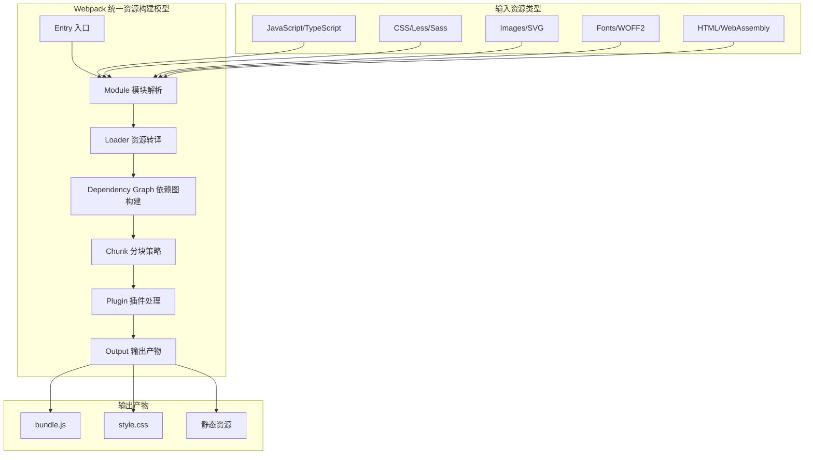
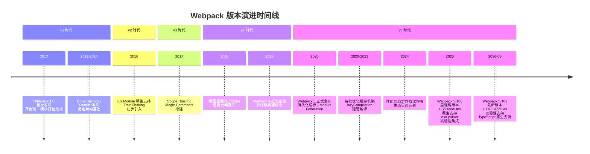

# 重新认识 Webpack：旧时代的破局者

如果你已经是一名前端工程师，相信你之前或多或少听过、用过 Webpack 这一构建工具，它能够融合多种工程化工具，将开发阶段的应用代码编译、打包成适合网络分发、客户端运行的应用产物。如今，Webpack 已经深深渗入到前端工程的方方面面，几乎已经成为我们日常工作绕不过去的必备基础设施之一。

问题是，**我们为什么需要使用这种非常复杂的构建工具**？我认为最大的原因是：时代变了。

在远古时代，我们只能用原生 JavaScript(ES5)、CSS、HTML 方式编写页面代码，开发与生产环境代码基本一致，开发与运行效率都非常低；其次，页面的图片、代码、CSS 等资源都能且只能通过 `img`、 `script`、`link` 等标签插入到页面中，我们需要非常精细地管理、设计各个标签出现的位置、顺序，这也会占用我们非常多的精力与注意力。

直到 2009年 Node 与 [RequireJS](https://requirejs.org/) 的出现才打破这一僵局，让我们在代码被放到浏览器运行起来之前，有机会做一些预处理工作 —— 开发与生产环境终于有了隔离管理的实现方案。再往后，出现了越来越多解决具体问题的效率工具，我们开始尝试使用 Babel、TypeScript、CoffeeScript 等，绕过 ES5 诸多低效语言特性、陷阱；尝试通过 Less、Sass、Stylus 等工具，为页面样式开发引入逻辑运算、数学运算、嵌套、继承等结构化语言特性，等等。

这些工程化工具能不同程度弥补浏览器、语言、规范本身的设计缺陷，我们终于不需要再关注一些低效的技术细节、Trick，将更多注意力放在业务代码上，以更高效的方式方法编写出越来越复杂、庞大的 Web 应用。

这个阶段前端领域可谓蓬勃发展，前端工程师的能力边界也在不断扩大，但却引来了另一个问题：如何管理这些工具与工具背后的工程化逻辑？**我们需要一套足够开放，能融合诸多工程化工具，彻底抹平开发与生产环境差异的一体化工程方案**，这也正是 Webpack 需要解决的问题。

## 为什么是 Webpack？

Webpack 是一种用于构建 JavaScript 应用程序的静态模块打包器（Static Module Bundler），它能够以一种相对一致且开放的处理方式，加载应用中的所有资源文件（图片、CSS、视频、字体文件等），并将其合并打包成浏览器兼容的 Web 资源文件。

注意，上面说的"**一致且开放**"的加载模型，这在当时算得上是非常 Breaking Change 的设计！



Webpack 之前社区虽然已经实现了许多构建工具与模块打包器，例如 [Gulp](https://gulpjs.com/)、[Grunt](https://gruntjs.com/)、[RequireJS](https://requirejs.org/)、[Browserify](https://browserify.org/)、[Closure Compiler](https://developers.google.com/closure/compiler) 等，但它们或简单合并执行多种构建任务；或聚焦于模块化方案的兼容处理；或仅仅实现 JavaScript 层面的工程化（合并、压缩、混淆）能力，都缺乏一个能够兼容处理所有资源、普适的抽象思维框架 —— 这意味着应对不同资源，需要使用不同的特化处理逻辑，且不同类型文件之间无法信息互通。

而 Webpack 则忽略具体资源类型之间的差异，将所有代码/非代码文件都统一看作 Module —— 模块对象，以相同的加载、解析、依赖管理、优化、合并流程实现打包，并借助 Loader、Plugin 两种开放接口将资源差异处理逻辑转交由社区实现，实现**统一资源构建模型**（Unified Resource Build Model），这种设计有很多优点：

- 所有资源都是 Module，所以可以用同一套代码实现诸多特性，包括：代码压缩、Hot Module Replacement、缓存等；
- 打包时，资源与资源之间非常容易实现信息互换，例如可以轻易在 HTML 插入 Base64 格式的图片；
- 借助 Loader，Webpack 几乎可以用任意方式处理任意类型的资源，例如可以用 Less、Stylus、Sass 等预编译 CSS 代码。
- **Everything is a Module** 的哲学使得 Webpack 能够以一种声明式的方式描述复杂的依赖关系，为后续的 Tree Shaking、Code Splitting 等优化提供坚实基础。

甚至在 Webpack 之后出现的许多新打包工具，例如 [Rollup](https://rollupjs.org/guide/en/)、[Parcel](https://parceljs.org/)、[Snowpack](https://www.snowpack.dev/)、[Vite](https://vitejs.dev/)、[Rspack](https://rspack.dev/)、[Turbopack](https://turbo.build/pack) 等，都或多或少受这种设计影响。其中 Rspack 更是直接复用了 Webpack 的 Loader/Plugin 架构，证明了这一设计的持久生命力。

其次，Webpack 极强的开放性，也让它得以成为前端工程化环境的 **基座**，我们可以围绕 Webpack 轻易接入一系列工程化工具，例如 TypeScript、CoffeeScript、Babel 一类的 JavaScript 编译工具；或者 Less、Sass、Stylus、PostCSS 等 CSS 预处理器；或者 Jest、Karma 等测试框架，等等。

这些工具都不同程度上补充了 Webpack 不同方面的工程化能力，使得它能够成为一个大一统的资源处理框架，满足现代 Web 工程在效率、质量、性能等方面的诉求，甚至能够应对小程序、微前端、SSR、SSG、桌面应用程序、NPM 包等诸多应用场景。也因此，即使在当下百花齐放的 Web 工程化领域中，Webpack 依然是最为广泛使用的构建工具之一。

### Webpack 版本演进时间线

截止本 v2 版本更新时，Webpack 已经演进至 **v5.107.0**（2026-05-19 发布），经过 5 个大版本迭代以及社区的持续努力，现如今的 Webpack 已经非常成熟：



### 当前版本核心能力一览

基于最新的 **v5.107.0**，Webpack 在基础构建能力之外还提供了诸多锦上添花的工程化工具，包括：

#### 经典核心能力（持续增强）

| 能力领域 | 核心功能 | 当前状态 |
|---------|---------|---------|
| 微前端 | 基于 Module Federation 的微前端方案 | 成熟稳定，广泛采用 |
| 开发体验 | 基于 `webpack-dev-server` 的 Hot Module Replacement | 与 webpack-dev-middleware 8.x 协同 |
| 代码优化 | Terser / Tree-shaking / SplitChunks | CJS 解构赋值 TS 增强（5.106+） |
| 构建性能 | lazyCompilation 延迟编译 / 持久化缓存 | 持续优化 |
| 运行时性能 | 异步模块加载（动态 import） | ES Module 动态导入原生支持 |
| 资源处理 | 内置 JS/JSON/二进制/WASM 解析 | WASM Source Phase Imports（5.106+ 实验） |

#### 5.106+ 新增亮点能力

| 特性 | 版本 | 说明 |
|-----|------|------|
| **CSS Modules 原生支持** | 5.106 | `exportType: "style"` ，不再依赖 style-loader |
| **compiler.hooks.validate** | 5.106 | 插件验证钩子，提升插件生态系统健壮性 |
| **oxc-parser 集成** | 5.106 | 实验性支持，基于 Rust 的超快 JS 解析器 |
| **create-webpack-app** | 5.106 | 官方脚手架工具，替代 `webpack init` |
| **VirtualUrlPlugin context** | 5.106 | 虚拟 URL 插件上下文支持 |
| **HTML Modules 支持** | 5.107 | 实验性（`experiments.html`），替代 html-loader |
| **TypeScript 原生支持** | 5.107 | 实验性（`experiments.typescript`），无需 ts-loader（需 Node.js 22.6+） |
| **CSS Modules Scope Hoisting** | 5.107 | CSS Modules 作用域提升优化 |
| **`#__NO_SIDE_EFFECTS__` 注解** | 5.107 | 细粒度副作用标记，辅助 Tree Shaking |

#### 工具链配套升级

- **webpack-cli 7.0.0**：最低要求 Node.js 20.9.0，带来更现代化的 CLI 体验
- **webpack-dev-middleware 8.0.0**：中间件层全面升级，与最新 Webpack 内核深度协同

并且，自 2012 年首次发布至今，Webpack 还处于快速迭代成长阶段，社区依然保持极大活力，算是真真正正经得起时间考验的开源项目。根据官方 Roadmap 2026 规划，未来方向包括：

- **Universal Target**：跨运行时构建目标（浏览器 / Node.js / Worker / WASM 统一抽象）
- **多线程 API**：官方层面的并行构建支持
- **Webpack 6 准备**：下一代架构的预研与过渡方案

在可预期的未来，Webpack 依然会占据极大市场份额，依然是我们手头上几乎万能的瑞士军刀。

## Webpack 还有学习价值吗？

如今，Webpack 已经发展得几乎无所不能，但代价则是上手学习成本非常高，学习曲线非常陡峭！

这一方面是因为 Webpack 确实是一个极度复杂的构建系统，应用层面、实现层面都有非常多不明觉厉的名词、概念、逻辑模型。另一方面是缺少特别优质的学习资料，Webpack 官方虽然也提供了许多说明文档，但基本上都停留在应用层面；国内外社区也有一些优质文章、视频教程，但数量偏少，缺乏体系化与深度。

**那么，问题来了，这么难的一件事情，我们真的有必要学吗？**

非常有必要！正是因为 Webpack 很难，静得下心来深挖的人少，所以 **深入学习 Webpack，不仅能帮助你更快解决具体的工程技术问题，还能形成属于你个人的，极具区分度的核心竞争力！**

以我为例，我从 15 年开始接触 Webpack，之后很长时间都停留在极其浅层的应用阶段 —— 所谓的配置工程师，每次启动一个新的 Web 项目时，都会优先选用 [Vue CLI](https://cli.vuejs.org/)、[Create-React-App](https://create-react-app.dev/)、[Yeoman](https://yeoman.io/) 等工具先搭好项目脚手架，这个阶段不需要关心怎么写 Webpack 配置，用哪些 Plugin、Loader 等。

但在项目后期需要添加一些针对性的功能，或解决疑难杂症，或做一些构建性能优化时，往往就需要不断翻阅资料，花大量时间才找到正确答案。问题是，这种方式只能解决眼下具体问题，下一个问题出现时，还是得重复花费大量时间翻阅资料，学习效率极低。

终于有天，我实在受不了这种重复浪费时间的行为，沉下心来翻阅资料，甚至研读源码之后，才算是理解了内里的许多乾坤，能够通过调整配置、自定义 Loader/Plugin 等方式，迅速解决许多业务中出现的问题。这种能力持续沉淀，茁壮发展之后，逐渐成了我个人区分于其他同学的非常重要的竞争力。

### 在新一代工具百花齐放的背景下

**其次，在当下 Vite、Rspack、Turbopack、WMR、Snowpack 等新一代构建工具百花齐放的背景下，我们还有必要花这么大力气学 Webpack 吗？**

那必然也是非常有必要的。理由如下：

**第一，市场份额依然稳固。**

虽然不同年份的调查数据会有波动，但 Webpack 在企业级生产环境中依然占据绝对主导地位。这得益于其：
- 十余年的技术积累与稳定性验证
- 庞大的插件生态系统（数千种 Loader/Plugin）
- 企业级项目的惯性迁移成本

**第二，功能覆盖面依然最广。**

Vite、Turbopack 等 Unbundle / Bundle-on-demand 工具定位于解决特定场景下的开发体验问题，而 Webpack 则几乎无所不能，功能覆盖：

| 应用场景 | Webpack 支持度 | 备注 |
|---------|--------------|------|
| 单页应用 (SPA) | ★★★★★ | 成熟稳定 |
| 多页应用 (MPA) | ★★★★★ | 原生支持多入口 |
| 微前端 | ★★★★★ | Module Federation 业界标杆 |
| NPM 包/库开发 | ★★★★★ | externals / library 配置完善 |
| 桌面应用 (Electron) | ★★★★★ | target: 'electron-main/renderer' |
| 小程序 | ★★★★☆ | community loader 支持 |
| SSR / SSG | ★★★★☆ | 与 Next.js/Nuxt.js 深度集成 |
| WebAssembly | ★★★★☆ | 5.106+ WASM Source Phase Imports |
| Rust-based 构建 | ★★★☆☆ | oxc-parser 实验性集成 |

许多情况下，尤其是在复杂的企业级项目中，Webpack 依然是**最优解甚至唯一解**。

**第三，知识可迁移性强。**

同类工具或多或少都有借鉴 Webpack 之处：
- **Rspack**：直接兼容 Webpack 的 Loader/Plugin API，配置高度一致
- **Turbopack**：采用了类似的依赖图（Dependency Graph）概念
- **Vite**：生产环境底层依然可选用 Rollup，而 Rollup 的插件体系与 Webpack 有相通之处
- **Parcel**：同样遵循"Everything is a Module"的理念

虽然具体实现差异很大，但解决工程化问题的思路基本一致，所谓一通百通，深入理解 Webpack 底层逻辑，以及处理具体问题的方式方法后，相同的知识必然也能套用到同类工具中。

**第四，Webpack 自身仍在快速进化。**

V5 之后推出的多项特性已经显著缩小了与 Unbundle 方案的性能差距：
- **持久化缓存（Persistent Cache）**：二次构建速度提升 10x+
- **lazyCompilation（延迟编译）**：按需编译入口及动态 import，减少不必要的计算
- **oxc-parser 实验性集成**：基于 Rust 的解析器，JS 解析速度数量级提升
- **Filesystem Cache 持久化缓存**：配置 `cache.type: 'filesystem'`（或在 `futureDefaults` 预设下默认启用）

未来虽不大可能超越原生 ESM 方案的开发服务器启动速度，但在**构建产物的优化深度、稳定性、生态兼容性**方面，Webpack 依然具有不可替代的优势。

**第五，重大架构变更带来的学习契机。**

Webpack 5 引入了若干**Breaking Change**，其中最具影响力的是 **Node.js Polyfills 不再自动注入**。这意味着：
- 旧版项目中大量使用的 `process`、`Buffer`、`__dirname` 等 Node.js 全局变量将不可用
- 需要显式配置 `resolve.fallback` 或使用 `node-polyfill-webpack-plugin`
- 这迫使开发者真正理解"什么是 Polyfill"、"为什么需要它"、"正确的迁移路径是什么"

表面上看这是"麻烦"，但从学习角度，这正是深入理解前端工程化底层逻辑的最佳契机。

所以，**Webpack 依然是一个值得长期投入学习，对个人、团队都极具成长意义的技术方向。**

## 如何高效学习 Webpack？

既然 Webpack 应用范围这么广，学习价值这么高，为何社区相关的技术讨论热度却一直不温不火呢？我认为最主要的原因还是在于 **Webpack 实在太复杂了**：上百种内置配置项，数万行核心代码（仅 webpack/lib 目录下就有数万行），以及几乎数不清的开源/闭源组件，涉及的知识点**多、杂、深**，已经不能仅仅停留在单一构建工具层面，而是需要扩展开来学习一整套工程化思维与方法论。

在这种背景下，我们该如何学透这么复杂繁琐的内容，深度掌握 Webpack 应用方法与实现原理呢？答案是：**由浅入深、循序渐进，有章法有体系地学**！

具体怎么个"由浅入深"、"有体系"法？我认为比较高效的学习路径应该是：

**第一步：上手实践各种场景下的构建配置方法，捋清楚最基本的使用规则。**

Webpack 始终是一个工具，就像一把瑞士军刀，无论你多了解它的组成结构，有多精深的理论知识，没有经过大量实战应用，你就始终还是停留在门外汉水平。

不过，即使只是考虑"怎么用"，问题已经很复杂了，毕竟光 Webpack 内置的就有上百种配置项，且许多配置规则 —— 如 `devtool`、`module`、`resolve` 、`experiments`（5.106+ 新增多个实验性开关），背后都隐含一套自洽但晦涩的工程逻辑 —— 即使你已经是一个比较资深的前端，也大概率需要花费不少时间才能理解这些工程逻辑。延展开来，为了应对各种场景下特化的资源处理需求，社区还实现了数千种 Loader、Plugin 组件，这些组件本身各自解决了什么问题？怎么用？怎么串联起来放一起用？等等。

这里的重点是，**通过各种应用场景摸清使用规律，结构化地理解各基础配置项与常见组件的用法。**

特别需要注意的是，从 Webpack 5 开始，你需要额外关注以下**关键配置变更**：
- `experiments` 字段：控制实验性特性的开关（如 `css`、`html`、`typescript`、`futureDefaults`）
- `resolve.fallback`：Node.js polyfills 的显式配置
- `cache.type`：持久化缓存的配置方式

**第二步：初步理解底层构建流程，学会分析性能卡点并据此做出正确性能优化。**

只会用还不行，你还得学会怎么用好，怎么用尽可能少的时间构建出性能足够好的应用。这部分涉及内容比较广，纵向可以深挖到操作系统、计算机网络原理等，横向可以扩展到 ECMAScript 规范、多媒体资源编解码等，**关键在于掌握分析方法，理解底层机制，做到融会贯通，举一反三。**

在当前版本中，性能优化的关注点包括：
- **构建速度**：持久化缓存命中率、lazyCompilation 配置、loader 范围限制（exclude/include）
- **产物体积**：Tree Shaking 有效性（sideEffects 配置、`#__NO_SIDE_EFFECTS__` 注解）、SplitChunks 策略
- **加载性能**：Code Splitting 粒度、预加载/预获取（prefetch/preload）、CSS 提取策略

**第三步：深入 Webpack 扩展规则，理解 Loader 与 Plugin 能做什么，怎么做。**

在会用且用的比较好的基础上，我们就该开始琢磨琢磨 Loader 与 Plugin 这两种扩展方式了。实际上，Webpack 主体只是实现了最核心的构建工具流与 Loader、Plugin 架构，大部分具体功能都是通过具体插件与 Loader 实现的，所以，学习这两种扩展组件的开发方法，进而理解两者能做什么、怎么做等，一是能帮助我们更深层次理解 Webpack 的构建过程；二是在遇到疑难杂症时能帮助我们迅速定位问题位置；三是必要时可以自己上手实现一些定制需求。

在 5.106+ 版本中，还需要特别关注：
- **compiler.hooks.validate**：新的插件验证钩子，可用于编写更健壮的插件
- **VirtualUrlPlugin**：虚拟 URL 处理的新范式
- **oxc-parser**：如果追求极致解析性能，可以尝试基于此编写自定义 parser 集成

**第四步：深挖源码，理解 Webpack 底层工作原理，加强应用与扩展能力。**

经过上面三个步骤，相信你已经成为一个非常成熟的 Webpack 使用者，但知其然还需知其所以然，接下来我们还是得深入 Webpack 源码，学习从启动构建，到递归编译模块代码，到封装打包，再到代码优化最终输出资产文件整个过程，只有理解了这个过程我们才算是真正吃透 Webpack 应用到原理整个知识体系，才能更深入理解各个配置项到底作用在哪些位置；哪些步骤容易造成性能卡点，我们要怎么优化；各个 Hook 到底在什么时间点，怎么触发等等。

源码阅读建议关注的重点模块（基于 v5.107 架构）：
- `webpack/lib/Compiler.js`：编译器主流程
- `webpack/lib/Compilation.js`：单次编译的核心逻辑
- `webpack/lib/NormalModuleFactory.js`：模块工厂
- `webpack/lib/Parser.js` / `webpack/lib/javascript/JavascriptParser.js`：AST 解析（或 oxc-parser 替代路径）
- `webpack/lib/dependencies/`：依赖管理系统

## 本系列讲什么？

本系列内容也将沿着上述四个方向展开：

- **基础用法篇**：首先，我会聚焦在应用层面，先简要讲解 Webpack 基本配置规则；之后针对具体场景、技术栈介绍更具体的方法、工具与技巧，例如：如何搭建完备的 JavaScript、CSS 开发环境；如何搭建微前端、NPM 包、桌面应用等，帮助你成为 **纯熟的 Webpack 使用者**。本篇将涵盖 5.106+ 新增的 `create-webpack-app` 脚手架用法、CSS Modules 原生配置、实验性特性开启方法等内容。
- **性能优化篇**：熟练基本使用方法后，我们会开始关注构建与应用性能方面，这部分我打算先介绍如何分析构建性能，以及若干实用性能分析工具；之后从 Webpack 底层原理以及诸多计算机原理出发，倒推 Webpack 构建以及 Web 应用性能优化方法与理论依据，让你 **能够应对各种各式各样的性能问题**。本篇将纳入 oxc-parser 性能对比、Scope Hoisting 对 CSS Modules 的优化效果、持久化缓存最佳实践等前沿话题。
- **扩展能力篇**：会用且知道怎么更好应用之后，我们会开始关注 Webpack 扩展技巧，我会首先解释 Loader、Plugin 两种组件的作用、形态与基本设计逻辑，让你对两种组件有一个感性认知；其次我会从若干知名开源项目中提炼出一些常见的功能用例，实例剖析如何在 Loader 与 Plugin 实现各式各样的功能需求；最后，我还会介绍如何借助若干开发工具实现一些非功能需求，包括：调试、测试、日志、参数校验等等。最终，必然能让你深度理解这两种扩展方式，**有能力开发出足够健壮、优雅的功能组件**。本篇将新增 `compiler.hooks.validate` 使用示例、VirtualUrlPlugin 集成案例等。
- **核心原理篇**：最后，我会抽丝剥茧，用尽可能通俗易懂的话语带你过一遍 Webpack 的主要构建流程，之后介绍源码中一些非常重要的设计概念，包括 Dependency Graph、Chunk、Runtime 等，帮你在脑海中架构起 Webpack 底层运行模型。在此基础上，再深入剖析 Webpack 体系下如何实现 Tree-Shaking、HMR、Sourcemap 这几个特别有代表性的功能，务必让你能串起整个构建框架，**成为 Webpack 资深玩家**。本篇将补充 5.107 中 HTML Modules / TypeScript 原生支持的底层实现原理分析。

最后，学习 Webpack 是一件小众、难度大，需要付出大量精力与耐心的事情，但它能帮助你沉淀更深层次的前端工程技能，让你在日常业务开发技能之外积累更有竞争力的技术能力。而本系列预定的这些内容、步骤定能帮助你在学习 Webpack 的路上少走弯路，高效学习，彻底掌握核心原理。

---

## 附录 A：与旧版（v1）差异对照表

| 维度 | v1（原版） | v2（本版） |
|------|-----------|-----------|
| **文档元信息** | 无 | 新增 YAML frontmatter 元信息 |
| **Webpack 版本引用** | v5.73.0 | **v5.107.0**（2026-05-19） |
| **生态竞品提及** | Vite、WMR、Snowpack | Vite、**Rspack**、**Turbopack**、WMR、Snowpack |
| **市场数据来源** | State-of-JS 2021 | 移除过时数据，改用定性分析 |
| **新特性覆盖** | Module Federation、lazyCompilation、持久化缓存 | 以上全部保留 + **5.106/5.107 全部新特性** |
| **Node.js Polyfills** | 未提及 | **新增专门章节强调这一 Breaking Change** |
| **Roadmap 内容** | 无 | **新增 Roadmap 2026 三大方向** |
| **工具链版本** | 未明确 | **webpack-cli 7.0.0 / webpack-dev-middleware 8.0.0** |
| **图表** | 外链图片（掘金 CDN） | **内联 Mermaid 图表**（时间线 + 架构图） |
| **差异对照表** | 无 | **新增附录 A 差异对照表** |
| **技术深度** | 基础层面 | **加强**：实验性特性细节、源码模块指引、性能优化新维度 |
| **CSS 相关** | style-loader 依赖 | **CSS Modules 原生支持（exportType: "style"）** |
| **TypeScript 处理** | ts-loader 依赖 | **新增 experiments.typescript 原生支持说明** |
| **HTML 处理** | html-loader | **新增 experiments.html / HTML Modules 说明** |
| **JS 解析器** | acorn /Parser.js | **新增 oxc-parser 实验性集成说明** |
| **脚手架工具** | webpack init / 第三方 CLI | **新增 create-webpack-app 官方脚手架** |

---

## 附录 B：Webpack 5.106 ~ 5.107 关键变更速查

### 5.106 里程碑特性（2026 年初发布）

```bash
特性名称                        类型        默认状态    说明
─────────────────────────────────────────────────────────────
compiler.hooks.validate         Hook        新增       插件验证钩子
CSS Modules (exportType)        Feature     实验性     原生支持，无需 style-loader
CJS Destructuring TS            Optimization 增强      CommonJS 解构赋值的 Tree Shaking
WASM Source Phase Imports       Feature     实验性     WebAssembly 新导入语法
oxc-parser                      Parser      实验性     Rust-based JS 解析器
create-webpack-app              CLI Tool    新增       官方脚手架
VirtualUrlPlugin.context        Plugin API  扩展       虚拟 URL 上下文支持
webpack-cli 7.0.0               Toolchain   破坏性变更  最低 Node.js 20.9.0
webpack-dev-middleware 8.0.0    Toolchain   主要升级    中间件层重构
```

### 5.107 最新特性（2026-05-19 发布）

```text
特性名称                        类型        默认状态    说明
─────────────────────────────────────────────────────────────
HTML Modules                    Feature     实验性     experiments.html，替代 html-loader
TypeScript Native Support       Feature     实验性     experiments.typescript，需 Node.js 22.6+
CSS Modules Scope Hoisting      Optimization 增强      CSS Modules 作用域提升
#__NO_SIDE_EFFECTS__            Annotation  新增       细粒度副作用标记
```

### 实验性特性开启示例

```javascript
// webpack.config.js (v5.107)
module.exports = {
  experiments: {
    // HTML Modules — 替代 html-loader
    html: true,

    // TypeScript 原生支持 — 替代 ts-loader/babel-loader
    typescript: true,  // 需要 Node.js >= 22.6.0

    // 未来默认值预览
    futureDefaults: true,
  },
};
```
