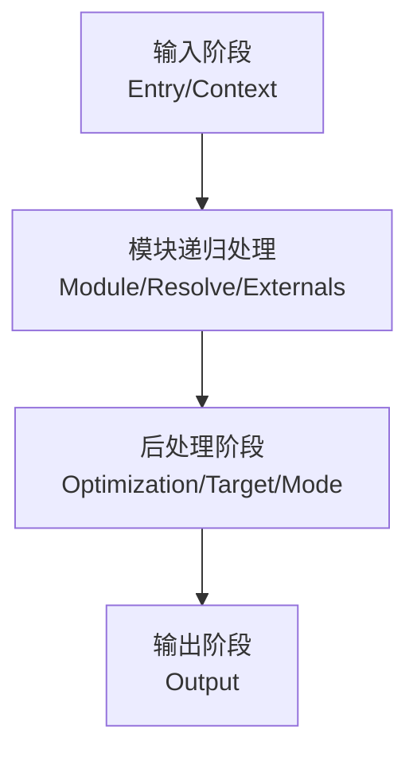
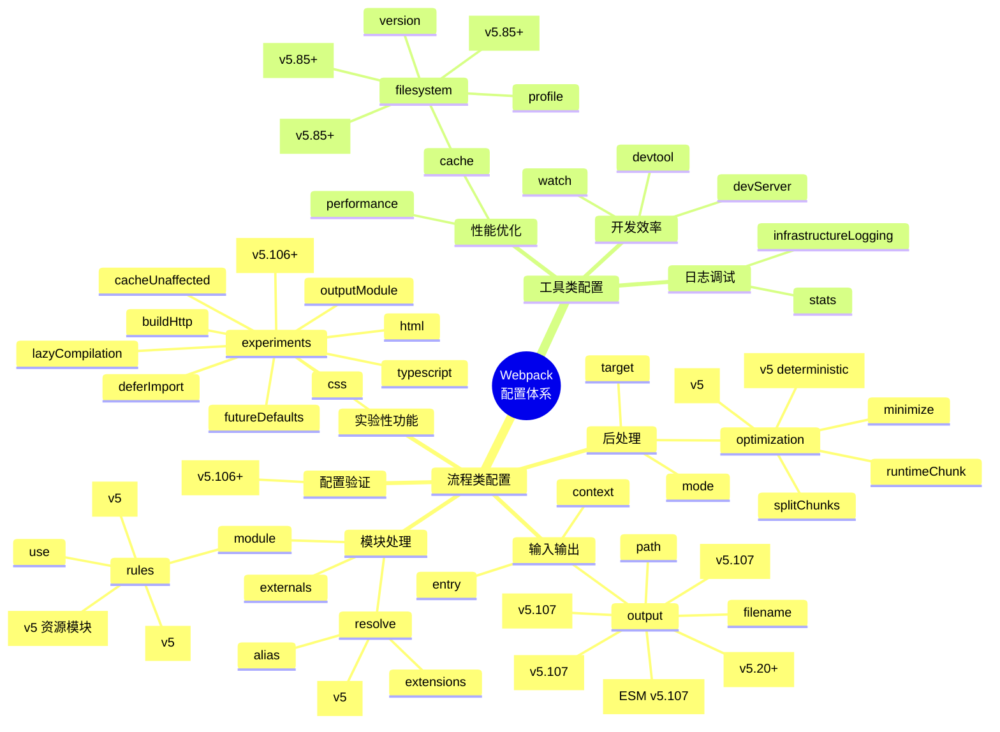

# 如何理解 Webpack 配置底层结构逻辑？


Webpack 5 提供了非常强大、灵活的模块打包功能，配合其成熟生态下数量庞大的插件（Plugin）、加载器（Loader）资源，已经能够满足大多数前端项目的工程化需求，**但代价则是日益复杂、晦涩的使用方法**。截至 v5.107 版本，Webpack 原生配置项已超过 **300+ 种**，且各项之间缺乏一致性与关联度，对初学者而言单是掌握每一个配置的作用与变种就已经很难，更不用说理解配置与配置之间的协作关系。

对此，本章将尝试通过一种结构化视角分类讨论 Webpack 各个核心配置项的功能与作用；深入剖析最新版本的新增/废弃/变更特性；用 Mermaid 图表可视化配置体系与流程影响；最后介绍业界推荐的脚手架工具。

## 结构化理解 Webpack 配置项

### 1.1 打包流程概览

Webpack 的打包过程非常复杂，但大致上可简化为以下核心阶段：



各阶段核心职责：

- **输入（Input）**：从文件系统读入代码文件，确定项目入口
- **模块递归处理（Module Processing）**：
  - 调用 Loader 转译 Module 内容
  - 将结果转换为 AST（抽象语法树）
  - 从中分析出模块依赖关系
  - 进一步递归调用模块处理过程，直到所有依赖文件都处理完毕
- **后处理（Post-processing）**：所有模块递归处理完毕后执行后处理，包括模块合并、注入运行时（Runtime）、产物优化等，最终输出 Chunk 集合
- **输出（Output）**：将 Chunk 写出到外部文件系统

### 1.2 配置项两大分类体系

从上述打包流程角度，Webpack 配置项大体上可分为两类：

| 分类 | 定义 | 特点 | 示例 |
|------|------|------|------|
| **流程类配置** | 作用于打包流程某个或若干个环节，直接影响编译打包效果 | 与主流程强耦合，相互协作紧密 | `entry`, `output`, `module`, `optimization` |
| **工具类配置** | 打包主流程之外，提供更多工程化工具能力 | 相对独立，内聚性强，解决特定工程问题 | `devtool`, `watch`, `cache`, `stats` |

---

## 流程类配置项详解

流程类配置项直接参与并影响编译主流程，是理解 Webpack 工作原理的核心。

### 2.1 输入输出配置（Input & Output）

#### 2.1.1 entry - 项目入口定义

`entry` 用于定义项目入口文件，Webpack 会从这些入口文件开始按图索骥找出所有项目文件。

**基本用法：**

```js
module.exports = {
  // 单入口
  entry: './src/index.js',
  
  // 多入口（对象语法）
  entry: {
    main: './src/main.js',
    vendor: './src/vendor.js'
  },
  
  // 多入口（数组语法 - 多个依赖文件）
  entry: {
    main: ['./src/polyfills.js', './src/index.js']
  }
};
```

**v5.107 状态：** ✅ 稳定，无变更

#### 2.1.2 context - 执行上下文路径

`context` 用于指定项目执行的基准路径（base directory），默认为 `process.cwd()`。

```js
module.exports = {
  context: path.resolve(__dirname, 'app'),
  entry: './index' // 实际解析为 <context>/index.js
};
```

**v5.107 状态：** ✅ 稳定，无变更

#### 2.1.3 output - 产物输出配置 ⭐ 重点更新

`output` 是最复杂的配置项之一，用于控制产物的输出路径、名称格式、类型等。**v5.107 引入了多项重要更新**：

```js
module.exports = {
  output: {
    // === 基础配置 ===
    path: path.resolve(__dirname, 'dist'),
    filename: '[name].[contenthash:8].js',
    publicPath: 'https://cdn.example.com/',
    
    // === v5.20+ 新增：output.clean ===
    clean: {
      dry: false,        // 实际删除文件（设为 true 时仅记录将被删除的文件，不实际删除）
      keep: /\/assets/,  // 保留匹配的文件
    },
    
    // === v5.107 新增：output.module (ESM Output) ===
    module: true,  // 启用 ESM 输出格式
    
    // === v5.107 新增：CSS 文件名配置 ===
    cssFilename: 'static/css/[name].[contenthash:8].css',
    cssChunkFilename: 'static/css/[name].[contenthash:8].chunk.css',
    
    // === v5.107 新增：环境配置 ===
    environment: {
      arrowFunction: false,   // 不支持箭头函数
      bigIntLiteral: false,   // 不支持 BigInt 字面量
      const: false,           // 不支持 const/let
      destructuring: false,   // 不支持解构赋值
      forOf: false,           // 不支持 for...of
      module: false,          // 不支持 module 语法
    },
    
    // === v5.107 新增：比较后发出 ===
    compareBeforeEmit: true,  // 在写入前比较内容，避免不必要的写入
    
    // === 其他常用配置 ===
    library: {
      name: 'MyLibrary',
      type: 'umd',     // 'var' | 'module' | 'assign' | 'assign-properties' | 'this' | 'window' | 'self' | 'global' | 'commonjs' | 'commonjs2' | 'commonjs-module' | 'commonjs-static' | 'amd' | 'amd-require' | 'umd' | 'umd2' | 'system' | 'script' | 'module'
      export: 'default',
    },
    chunkFilename: '[id].[contenthash:8].chunk.js',
    assetModuleFilename: 'assets/[hash][ext][query]',
  }
};
```

#### 🔥 output.module (ESM Output) 深度解析

**这是 v5.107 最重要新增特性之一！**

当设置 `output.module: true` 时，Webpack 将以 ES Module 格式输出代码，而非传统的 CommonJS/IIFE 格式。

**启用条件：**
1. 必须设置 `experiments.outputModule: true` 或 `output.library.type: 'module'`
2. 不能使用 `output.library` 的非 module 类型（如 `umd`、`commonjs` 等）

**优势：**
- ✅ 原生 Tree Shaking 支持（无需额外配置）
- ✅ 更小的产物体积（无包装函数）
- ✅ 更好的浏览器兼容性（现代浏览器原生支持 ESM）
- ✅ 支持动态导入（Dynamic Import）的原生行为

**示例：**

```js
// webpack.config.js
module.exports = {
  experiments: {
    outputModule: true,
  },
  output: {
    filename: '[name].mjs',
    module: true,
    library: {
      type: 'module',
    },
  },
};
```

**输出对比：**

```javascript
// 传统 CommonJS 输出
(function(modules) {
  // webpack bootstrap...
})({
  "./src/index.js": (function(module, exports) {
    eval("...");
  })
});

// ESM 输出（output.module: true）
import { __webpack_require__ } from "webpack-runtime";
const __webpack_exports__ = {};
import { foo } from "./foo.js";
// ... 直接使用 ESM 语法
export default __webpack_exports__;
```

**v5.107 状态：** 🆕 新增特性，实验性功能需配合 `experiments.outputModule`

#### 2.1.4 output.clean 深度解析 (v5.20+)

`output.clean` 配置在每次构建前自动清理输出目录，替代了 `clean-webpack-plugin`。

```js
output: {
  clean: true,  // 简单模式：清理整个 dist 目录
  
  // 高级模式
  clean: {
    dry: true,                    // 模拟清理（不实际删除）
    keep: /ignored/,              // 保留匹配的文件/目录
  },
}
```

**使用场景：**
- 开发环境下避免旧文件残留
- CI/CD 构建时确保输出目录干净
- 需要精确控制清理范围时使用高级模式

### 2.2 模块处理配置（Module Processing）

#### 2.2.1 resolve - 模块路径解析规则

`resolve` 用于配置模块路径解析规则，帮助 Webpack 更精确、高效地找到指定模块。

```js
module.exports = {
  resolve: {
    alias: {
      '@': path.resolve(__dirname, 'src/'),
      'vue$': 'vue/dist/vue.runtime.esm-bundler.js',
    },
    extensions: ['.js', '.json', '.ts', '.tsx', '.vue'],
    modules: ['node_modules', 'src/libs'],
    mainFiles: ['index'],
    symlinks: true,
    cacheWithContext: false,
    
    // v5 新增：完全解析前先检查文件是否存在
    enforceExtension: false,
    
    // v5 新增：导出字段解析
    exportsFields: ['exports'],
    importsFields: ['imports'],
    conditionNames: ['webpack', 'production', 'browser'],
  },
  
  resolveLoader: {
    modules: ['node_modules', 'loaders'],
    extensions: ['.js'],
    mainFields: ['loader', 'main'],
  },
};
```

**v5 重要变更：**
- ✅ 新增 `exportsFields`、`importsFields`、`conditionNames` 支持 Package Exports 规范
- ✅ 默认不再解析 Node.js 内置模块（如 `fs`、`path`），需要手动配置或安装 polyfill

#### 2.2.2 module - 模块加载规则 ⚠️ 重要变更

`module` 用于配置模块加载规则，针对不同类型的资源使用不同的 Loader 进行处理。

**⚠️ v5 重要废弃：`module.rules[].loaders` 已移除！**

在 v5 中，**只能使用 `use` 字段**，`loaders` 字段已被完全移除。

```js
module.exports = {
  module: {
    // v5 推荐写法：使用 rules + use
    rules: [
      {
        test: /\.css$/i,
        use: [
          'style-loader',
          {
            loader: 'css-loader',
            options: {
              importLoaders: 1,
              modules: {
                localIdentName: '[hash:base64:8]',
              },
            },
          },
          'postcss-loader',
        ],
        include: path.resolve(__dirname, 'src'),
        exclude: /node_modules/,
        
        // v5 新增：资源模块类型
        type: 'javascript/auto',  // 'asset' | 'asset/source' | 'asset/resource' | 'asset/inline' | 'javascript/auto' | 'javascript/esm' | 'json'
        
        // v5 新增：解析器配置
        parser: {
          javascript: {
            dynamicImportMode: 'lazy',
            dynamicImportPrefetch: false,
          },
        },
        
        // v5 新增：生成器配置
        generator: {
          filename: 'static/images/[hash][ext][query]',
          publicPath: 'https://cdn.example.com/',
        },
        
        // 条件匹配（可组合使用）
        oneOf: [...],  // 只应用第一个匹配的规则
        resourceQuery: /inline/,  // 匹配查询字符串
      },
      
      // 资源模块示例（v5 内置，无需 loader）
      {
        test: /\.(png|jpe?g|gif|svg)$/i,
        type: 'asset/resource',
        generator: {
          filename: 'images/[hash][ext][query]',
        },
      },
      
      {
        test: /\.txt$/i,
        type: 'asset/source',  // 内联为字符串
      },
    ],
    
    // v5 新增：不解析的模块配置
    noParse: /jquery|lodash/,
    
    // v5 新增：未知模块的处理方式
    unknownContextRequest: '.',
    unknownContextRecursive: true,
    unknownContextRegExp: /^\.\//,
    unknownContextCritical: true,
  },
};
```

**v5.107 关键变更总结：**

| 变更项 | 旧版 (v4) | v5 | 影响 |
|--------|-----------|-----|------|
| `loaders` 字段 | ✅ 可用 | ❌ **已移除** | 必须改用 `use` |
| 资源模块 | 需要 file/url/raw-loader | **内置 4 种类型** | 减少依赖 |
| Parser 配置 | 有限支持 | **完整支持** | 更细粒度控制 |
| Generator 配置 | 无 | **新增** | 自定义输出路径 |

#### 2.2.3 externals - 外部资源配置

`externals` 用于声明外部资源，Webpack 会直接忽略这部分资源，跳过解析、打包操作。

```js
module.exports = {
  externals: {
    // 基本用法：全局变量
    jquery: 'jQuery',
    
    // CommonJS 模块
    lodash: 'commonjs lodash',
    
    // CommonJS2 模块
    'library-name': 'commonjs2 library-name',
    
    // AMD 模块
    react: 'amd react',
    
    // 完整对象语法
    'library-name': {
      commonjs: 'library-name',
      commonjs2: 'library-name',
      amd: 'library-name',
      root: 'LibraryName',
    },
    
    // 正则匹配
    /^lodash$/: 'lodash',
    
    // 函数形式（高级用法）
    function ({ request, dependencyType }, callback) {
      if (/^@angular/.test(request)) {
        return callback(null, `commonjs ${request}`);
      }
      callback();
    },
  },
};
```

**v5.107 状态：** ✅ 稳定，新增支持更多 externals 类型

### 2.3 后处理配置（Post-processing）

#### 2.3.1 optimization - 产物优化控制

`optimization` 是最复杂的配置项之一，内置了 Dead Code Elimination、Scope Hoisting、代码混淆、代码压缩等功能。

```js
module.exports = {
  optimization: {
    // === 代码分割 ===
    splitChunks: {
      chunks: 'async',  // 'initial' | 'async' | 'all'
      minSize: 20000,
      minChunks: 1,
      maxAsyncRequests: 30,
      maxInitialRequests: 30,
      automaticNameDelimiter: '~',
      cacheGroups: {
        vendors: {
          test: /[\\/]node_modules[\\/]/,
          priority: -10,
          name: 'vendors',
          reuseExistingChunk: true,
        },
        default: {
          minChunks: 2,
          priority: -20,
          reuseExistingChunk: true,
          name: 'default',
        },
      },
    },
    
    // === 运行时代码提取 ===
    runtimeChunk: {
      name: 'runtime',
    },
    
    // === 最小化压缩 ===
    minimize: true,
    minimizer: [
      new TerserPlugin({
        terserOptions: {
          compress: {
            drop_console: true,
          },
          format: {
            comments: false,
          },
        },
        extractComments: false,
        parallel: true,
      }),
      new CssMinimizerPlugin(),
    ],
    
    // === Scope Hoisting ===
    usedExports: true,
    sideEffects: true,
    
    // === 模块 ID 优化 ===
    moduleIds: 'deterministic',  // 'natural' | 'named' | 'deterministic' | 'size' | 'hashed'
    chunkIds: 'deterministic',
    
    // === 其他优化选项 ===
    removeAvailableModules: false,
    removeEmptyChunks: true,
    mergeDuplicateChunks: true,
    flagIncludedChunks: false,
    portableRecords: false,
    realContentHash: false,
    innerGraph: false,  // v5 新增：内部图分析
    mangleWasmImports: false,  // v5 新增：WASM 导出名混淆
    concatenateModules: true,  // v5 增强：作用域提升
  },
};
```

**v5.107 重要更新：**
- ✅ `moduleIds` 和 `chunkIds` 默认值改为 `'deterministic'`
- ✅ 新增 `innerGraph` 选项用于更精细的副作用分析
- ✅ 新增 `mangleWasmImports` 用于 WASM 模块优化
- ✅ `concatenateModules` 性能大幅提升

#### 2.3.2 target - 编译目标环境

`target` 用于配置编译产物的目标运行环境，不同值最终产物会有所差异。

```js
module.exports = {
  target: 'web',  // 默认值
  
  // 支持的目标列表：
  // 'web' - 浏览器环境（默认）
  // 'webworker' - Web Worker
  // 'node' - Node.js 环境（使用 require 加载 chunk）
  // 'async-node' - Node.js 环境（异步加载 chunk）
  // 'electron-main' - Electron 主进程
  // 'electron-renderer' - Electron 渲染进程
  // 'node-webkit' - NW.js
  
  // 也可以指定版本号
  target: ['web', 'es2020'],
  target: 'browserslist',  // 使用 browserslist 配置
  
  // v5 新增：精细控制目标特性
  target: false,  // 不设置任何目标
};
```

**v5.107 状态：** ✅ 稳定，新增 `browserslist` 和数组语法支持

#### 2.3.3 mode - 编译模式

`mode` 是编译模式短语，可以理解为一种声明环境的快捷方式，支持 `development`、`production`、`none` 三种值。

```js
module.exports = {
  mode: 'production',  // 推荐
  // mode: 'development',
  // mode: 'none',
};
```

**不同模式的默认配置差异：**

| 选项 | development | production | none |
|------|-------------|------------|------|
| `devtool` | `eval` | `(empty)` | `(empty)` |
| `cache` | `{type: 'memory'}` | `{type: 'memory'}` | 禁用 |
| `optimization.minimize` | `false` | `true` | `false` |
| `optimization.usedExports` | `false` | `true` | `false` |
| `optimization.concatenateModules` | `false` | `true` | `false` |
| `optimization.moduleIds` | `'named'` | `'deterministic'` | `'natural'` |
| `optimization.chunkIds` | `'named'` | `'deterministic'` | `'natural'` |
| `optimization.nodeEnv` | `'development'` | `'production'` | `false` |
| `optimization.flagIncludedChunks` | `false` | `true` | `false` |
| `optimization.occurrenceOrder` | `false` | `true` | `false` |
| `optimization.sideEffects` | `true` | `true` | `false` |
| `optimization.removeEmptyChunks` | `true` | `true` | `true` |
| `optimization.mergeDuplicateChunks` | `true` | `true` | `true` |

**v5.107 状态：** ✅ 稳定，无变更（filesystem 持久化缓存仍需显式配置 `cache.type: 'filesystem'`，或通过 `experiments.futureDefaults` 启用）

---

## 🔬 experiments - 实验性功能详解（v5.107 重点）

`experiments` 是 Webpack 5 引入的重要配置项，用于启用尚在实验阶段的特性。**这些功能可能在未来版本中被修改或移除，但在当前版本中已经相对稳定可用。**

### 3.1 experiments 完整配置示例

```js
module.exports = {
  experiments: {
    // === CSS 原生支持 (v5.x) ===
    css: true,
    
    // === HTML 原生支持 (v5.x) ===
    html: true,
    
    // === TypeScript 原生支持 (v5.x) ===
    typescript: true,
    
    // === Source Import (v5.106+) ===
    sourceImport: true,
    
    // === Defer Import Evaluation (v5.x) ===
    deferImport: true,
    
    // === Future Defaults (v5.x) ===
    futureDefaults: true,
    
    // === Lazy Compilation (v5.x) ===
    lazyCompilation: {
      entries: false,
      imports: true,
      tests: /\.lazy\.js$/,
    },
    
    // === Build HTTP (v5.x) ===
    buildHttp: {
      allowedUris: [/^https:/],
      cacheLocation: false,
      frozen: false,
      lockfile: path.resolve(__dirname, 'http-cache.lock'),
      upgrade: true,
    },
    
    // === Cache Unaffected (v5.x) ===
    cacheUnaffected: true,
    
    // === Output Module (ESM) (v5.x) ===
    outputModule: true,
  },
};
```

### 3.2 各实验性功能详解

#### 3.2.1 css - CSS 原生支持

**启用后，Webpack 可以直接处理 CSS 文件，无需额外的 Loader！**

```js
experiments: {
  css: true,
}
```

**效果：**
- ✅ 自动识别 `.css`、`.less`、`.sass`、`.scss`、`.styl` 文件
- ✅ 内置 CSS Modules 支持
- ✅ 内置 PostCSS 集成
- ✅ 支持 `output.cssFilename` 和 `output.cssChunkFilename` 配置
- ✅ 自动提取 CSS 为独立文件（生产模式）

**使用示例：**

```js
// webpack.config.js
module.exports = {
  experiments: {
    css: true,
  },
  output: {
    cssFilename: 'static/css/[name].[contenthash:8].css',
  },
};

// index.js
import styles from './styles.css';
// 或
import './styles.css';
```

**⚠️ 注意：** 此功能仍在实验阶段，建议在生产环境谨慎使用。

#### 3.2.2 html - HTML 原生支持

**启用后，Webpack 可以直接处理 HTML 文件！**

```js
experiments: {
  html: true,
}
```

**效果：**
- ✅ 自动将 HTML 作为入口文件
- ✅ 自动注入 script/link 标签
- ✅ 支持模板语法
- ✅ 替代 html-webpack-plugin 的部分功能

#### 3.2.3 typescript - TypeScript 原生支持

**启用后，Webpack 可以直接处理 TypeScript 文件，无需 ts-loader 或 babel-loader！**

```js
experiments: {
  typescript: true,
}
```

**效果：**
- ✅ 直接解析 `.ts`、`.tsx` 文件
- ✅ 使用 SWC 进行快速转译（比 tsc 快 10-20 倍）
- ✅ 支持 TypeScript 类型检查（可选）
- ✅ 减少配置复杂度

**限制：**
- ❌ 不支持所有 TypeScript 特性（如枚举、命名空间等）
- ❌ 类型检查是可选的，默认关闭

#### 3.2.4 sourceImport - Source Import 语法 (v5.106+)

**这是最新的实验性功能！**

启用后，可以使用新的 `source` import 语法来内联资源：

```js
experiments: {
  sourceImport: true,
}
```

**使用示例：**

```js
// 传统方式
import imageUrl from './image.png?inline';
import svgContent from './icon.svg?raw';

// sourceImport 方式（更语义化）
import imageUrl from source './image.png';
import svgContent from source './icon.svg';
```

**优势：**
- ✅ 更清晰的语义表达
- ✅ 无需查询字符串
- ✅ IDE 支持更好

#### 3.2.5 lazyCompilation - 懒编译

**仅在需要时才编译模块，显著提升开发服务器启动速度！**

```js
experiments: {
  lazyCompilation: {
    entries: false,       // 是否懒编译入口
    imports: true,        // 是否懒编译动态导入
    tests: /\.lazy\.js$/, // 匹配需要懒编译的模块
  },
}
```

**效果：**
- ✅ 大型项目启动速度提升 **50-80%**
- ✅ 内存占用降低
- ✅ 按需编译，避免不必要的计算

**适用场景：**
- 大型单页应用（SPA）
- 包含数百个路由的项目
- 企业级后台管理系统

#### 3.2.6 buildHttp - 远程资源构建

**允许在构建时直接获取 HTTP 资源！**

```js
experiments: {
  buildHttp: {
    allowedUris: [/^https:\/\/cdn\.example\.com/],  // 允许的 URL 列表
    cacheLocation: path.resolve(__dirname, '.http-cache'),  // 缓存位置
    frozen: false,  // 是否锁定缓存（CI/CD 时设为 true）
    lockfile: path.resolve(__dirname, 'http-cache.lock'),  // 锁文件
    upgrade: false,  // 是否升级过期的缓存
  },
}
```

**使用示例：**

```js
// 直接导入远程资源
import React from 'https://cdn.example.com/react@18.0.0.esm.js';
import _ from 'https://cdn.example.com/lodash-es@4.17.21.esm.js';
```

**适用场景：**
- CDN 资源本地化构建
- 微前端应用的共享依赖
- 减少网络请求次数

#### 3.2.7 outputModule - ESM 输出模块

已在 [2.1.3 output](#213-output--产物输出配置--重点更新) 详细讲解，此处略。

#### 3.2.8 deferImport - 延迟导入评估

**延迟动态导入的评估时机，优化初始加载性能。**

```js
experiments: {
  deferImport: true,
}
```

**效果：**
- ✅ 动态 import() 在实际使用时才执行
- ✅ 减少初始 bundle 体积
- ✅ 优化首屏渲染时间

#### 3.2.9 futureDefaults - 未来默认值预览

**提前体验未来版本的默认配置。**

```js
experiments: {
  futureDefaults: true,
}
```

**效果：**
- ✅ 启用所有计划中的默认值变更
- ✅ 帮助开发者提前适配新版本
- ✅ 发现潜在的兼容性问题

**⚠️ 警告：** 可能导致现有项目出现警告或错误，建议在新项目中尝试。

#### 3.2.10 cacheUnaffected - 缓存未受影响的模块

**增强缓存策略，仅重新编译受影响的模块。**

```js
experiments: {
  cacheUnaffected: true,
}
```

**效果：**
- ✅ 更精准的增量编译
- ✅ 进一步减少重复编译时间
- ✅ 特别适合大型项目

---

## 💾 cache - 缓存系统深度解析 (v5.107 重点)

Webpack 5 重构了缓存系统，提供了强大的持久化缓存能力。**v5.85+ 引入了 filesystem 类型的多项重要增强。**

### 4.1 cache 配置概览

```js
module.exports = {
  // === 基础配置 ===
  cache: {
    type: 'filesystem',  // 'memory' | 'filesystem'
    
    // === filesystem 类型专属配置 (v5.20+) ===
    cacheDirectory: path.resolve(__dirname, '.webpack_cache'),  // 缓存目录
    name: `${process.env.NODE_ENV}`,  // 缓存名称（多环境隔离）
    
    // === v5.85+ 新增：压缩配置 ===
    compression: 'gzip',  // false | 'gzip' | 'brotliCompress'
    
    // === v5.85+ 新增：最大缓存年龄 ===
    maxAge: 1000 * 60 * 60 * 24 * 7,  // 7 天（毫秒）
    
    // === v5.85+ 新增：只读模式 ===
    readonly: process.env.NODE_ENV === 'production',  // 生产环境只读
    
    // === v5 新增：性能分析 ===
    profile: true,  // 记录详细的缓存性能数据
    
    // === v5 新增：版本控制 ===
    version: '1.0.0',  // 自定义版本号（配置变更时失效）
    buildDependencies: {
      config: [__filename],  // 配置文件依赖
      webpack: [path.resolve(__dirname, 'node_modules/webpack/package.json')],  // Webpack 版本变化时缓存失效
    },
    
    // === 其他配置 ===
    allowCollectingMemory: true,  // 允许收集内存使用情况
    managedPaths: [path.resolve(__dirname, 'node_modules')],  // 受管理的路径
    immutablePaths: [],  // 不可变路径（如 monorepo 共享依赖）
    store: 'pack',  // 'pack' | 'input'
  },
};
```

### 4.2 cache.filesystem 完整配置详解

#### 4.2.1 compression - 缓存压缩 (v5.85+)

```js
cache: {
  type: 'filesystem',
  compression: 'gzip',  // 使用 gzip 压缩缓存文件
  // compression: 'brotliCompress',  // 使用 brotli 压缩（更高压缩率）
  // compression: false,  // 不压缩
}
```

**效果：**
- ✅ 减少 **60-80%** 的磁盘占用
- ✅ 读取速度略有下降（解压开销）
- ✅ 推荐在磁盘空间紧张时启用

**性能对比：**

| 压缩方式 | 磁盘占用 | 读取速度 | 写入速度 |
|----------|----------|----------|----------|
| 无压缩 | 100% | 快 | 快 |
| gzip | 25-40% | 中等 | 中等 |
| brotli | 15-25% | 慢 | 慢 |

**推荐场景：**
- 开发环境：`false`（追求速度）
- CI/CD：`gzip`（平衡空间和速度）
- 磁盘受限：`brotliCompress`（最小空间）

#### 4.2.2 maxAge - 最大缓存年龄 (v5.85+)

```js
cache: {
  type: 'filesystem',
  maxAge: 1000 * 60 * 60 * 24 * 7,  // 7 天
  // maxAge: Infinity,  // 永不过期
}
```

**效果：**
- ✅ 自动清理过期缓存
- ✅ 避免磁盘无限增长
- ✅ 适合长期运行的 CI 环境

**推荐配置：**
- 开发环境：`Infinity`（永不过期）
- CI/CD：`7d`（一周）
- 临时构建环境：`1d`（一天）

#### 4.2.3 readonly - 只读模式 (v5.85+)

```js
cache: {
  type: 'filesystem',
  readonly: process.env.NODE_ENV === 'production',
}
```

**效果：**
- ✅ 生产环境只读取缓存，不写入新缓存
- ✅ 避免 CI 并发写入冲突
- ✅ 保证构建结果一致性

**典型使用场景：**

```js
// 开发环境：读写模式
// NODE_ENV=development → readonly: false

// 生产环境：只读模式
// NODE_ENV=production → readonly: true
// CI 从共享存储读取缓存，但不写入
```

#### 4.2.4 profile - 性能分析

```js
cache: {
  type: 'filesystem',
  profile: true,
}
```

**效果：**
- ✅ 记录每个模块的缓存命中/未命中时间
- ✅ 输出详细的性能报告
- ✅ 用于诊断缓存效率问题

**查看性能数据：**

```bash
npx webpack --profile --json > stats.json
```

#### 4.2.5 version - 版本控制

```js
cache: {
  type: 'filesystem',
  version: '1.0.0',  // 自定义版本字符串
}
```

**效果：**
- ✅ 版本变更时自动清除旧缓存
- ✅ 避免配置不一致导致的奇怪问题
- ✅ 推荐配合 package.json version 使用

**最佳实践：**

```js
const pkg = require('./package.json');

module.exports = {
  cache: {
    type: 'filesystem',
    version: `${pkg.version}-${pkg.dependencies.webpack || 'builtin'}`,
  },
};
```

### 4.3 缓存策略最佳实践

#### 场景一：开发环境（追求速度）

```js
// webpack.dev.config.js
module.exports = {
  mode: 'development',
  cache: {
    type: 'filesystem',
    compression: false,  // 不压缩，最快
    maxAge: Infinity,    // 永不过期
    readonly: false,     // 读写模式
    profile: false,      // 不记录性能数据
  },
};
```

#### 场景二：生产环境（追求稳定）

```js
// webpack.prod.config.js
module.exports = {
  mode: 'production',
  cache: {
    type: 'filesystem',
    compression: 'gzip',  // 平衡空间和速度
    maxAge: 1000 * 60 * 60 * 24 * 7,  // 7天
    readonly: true,       // 只读模式（CI 场景）
    profile: true,        // 记录性能数据
    version: require('./package.json').version,
  },
};
```

#### 场景三：Monorepo（共享缓存）

```js
// webpack.base.config.js
const path = require('path');

module.exports = {
  cache: {
    type: 'filesystem',
    cacheDirectory: path.resolve(__dirname, '../node_modules/.cache/webpack'),
    managedPaths: [
      path.resolve(__dirname, '../node_modules'),
    ],
    immutablePaths: [
      // 共享依赖不会变化，可以标记为不可变
      path.resolve(__dirname, '../node_modules/react'),
      path.resolve(__dirname, '../node_modules/react-dom'),
    ],
  },
};
```

---

## 🆕 validate - 配置验证 (v5.106+ 新增)

**这是 v5.106 引入的全新顶层配置项，用于验证配置的正确性！**

```js
module.exports = {
  validate: {
    // 启用严格模式验证
    strict: true,
    
    // 自定义验证规则
    rules: {
      // 示例：验证 output.path 必须存在
      'output.path': (value) => {
        if (!value) {
          throw new Error('output.path is required');
        }
      },
    },
  },
};
```

**效果：**
- ✅ 在构建前验证配置正确性
- ✅ 提供清晰的错误信息
- ✅ 避免因配置错误导致的难以调试的问题
- ✅ 支持 TypeScript 类型提示（配合 webpack-cli 7）

**使用场景：**
- 团队协作时统一配置规范
- CI/CD 环境提前发现问题
- 复杂配置的自动化验证

---

## 工具类配置项详解

工具类配置在主流程之外提供额外的工程化能力，通常内聚性强，一个配置项专注于解决一类工程问题。

### 5.1 开发效率类

#### 5.1.1 watch - 持续监听构建

```js
module.exports = {
  watch: true,
  watchOptions: {
    ignored: /node_modules/,
    aggregateTimeout: 300,
    poll: 1000,
  },
};
```

**v5.107 状态：** ✅ 稳定

#### 5.1.2 devtool - Sourcemap 生成规则

```js
module.exports = {
  // 开发环境推荐
  devtool: 'eval-cheap-module-source-map',
  
  // 生产环境推荐
  // devtool: 'source-map',  // 生成独立的 .map 文件
  // devtool: 'hidden-source-map',  // 生成但不引用
  // devtool: 'nosources-source-map',  // 生成但没有源码内容
  
  // 更多选项：
  // '(empty)' - 不生成 sourcemap
  // 'eval' - 每个 module 封装到 eval 中，速度快
  // 'eval-cheap-source-map' - 不含列信息
  // 'eval-cheap-module-source-map' - 不含列信息，来源为原始源码
  // 'eval-source-map' - 每个 module 封装到 eval 中
  // 'cheap-source-map' - 不含列信息，独立文件
  // 'cheap-module-source-map' - 不含列信息，来源为原始源码，独立文件
  // 'inline-source-map' - 以 DataURL 内联
  // 'inline-cheap-source-map' - 不含列信息，内联
  // 'inline-cheap-module-source-map' - 不含列信息，来源为原始源码，内联
};
```

**Sourcemap 选择指南：**

| 环境 | 推荐选项 | 特点 |
|------|----------|------|
| 开发 | `eval-cheap-module-source-map` | 速度快，质量好 |
| 生产 | `source-map` | 独立文件，不影响性能 |
| 调试 | `cheap-module-source-map` | 平衡速度和质量 |
| 敏感代码 | `hidden-source-map` | 生成但不引用 |

**v5.107 状态：** ✅ 稳定

#### 5.1.3 devServer - 开发服务器

```js
module.exports = {
  devServer: {
    static: {
      directory: path.join(__dirname, 'public'),
    },
    compress: true,
    port: 9000,
    hot: true,  // HMR
    open: true,  // 自动打开浏览器
    historyApiFallback: true,  // SPA 路由支持
    proxy: {
      '/api': 'http://localhost:3000',
    },
    client: {
      overlay: {  // 错误覆盖层
        errors: true,
        warnings: false,
      },
      progress: true,  // 进度条
    },
    devMiddleware: {
      writeToDisk: true,  // 写入磁盘
    },
  },
};
```

**v5.107 状态：** ✅ 稳定，API 有小幅调整

### 5.2 性能优化类

#### 5.2.1 cache - 缓存配置（详见第 4 章）

已在 [第 4 章](#4-cache---缓存系统深度解析-v5107-重点) 详细讲解。

#### 5.2.2 performance - 性能预算

```js
module.exports = {
  performance: {
    hints: 'warning',  // false | 'error' | 'warning'
    maxEntrypointSize: 512000,  // 500KB
    maxAssetSize: 512000,
    assetFilter: function(assetFilename) {
      return !assetFilename.endsWith('.map');  // 忽略 map 文件
    },
  },
};
```

**v5.107 状态：** ✅ 稳定

### 5.3 日志与调试类

#### 5.3.1 stats - 统计信息控制

```js
module.exports = {
  stats: {
    // 基础选项
    all: undefined,  // false | true
    assets: true,
    assetsSort: '!size',
    cached: true,
    cachedAssets: true,
    children: true,
    chunks: true,
    chunkGroups: true,
    chunkModules: true,
    chunkOrigins: true,
    color: true,
    depth: false,
    entrypoints: true,
    env: true,
    errorDetails: true,
    errors: true,
    errorsCount: true,
    hash: true,
    logging: 'info',  // 'none' | 'error' | 'warn' | 'info' | 'log'
    loggingDebug: [],
    loggingTrace: false,
    modules: true,
    modulesSort: '!size',
    moduleTrace: true,
    performance: true,
    providedExports: true,
    reasons: true,
    source: true,
    timings: true,
    usedExports: true,
    version: true,
    warnings: true,
    warningsCount: true,
    
    // 预设值
    // 'errors-only' | 'errors-warnings' | 'minimal' | 'none' | 'normal' | 'verbose' | 'detailed'
    preset: 'normal',
  },
};
```

**常用预设：**

| 预设 | 适用场景 | 输出内容 |
|------|----------|----------|
| `'none'` | CI/CD | 仅错误计数 |
| `'errors-only'` | 生产构建 | 仅错误信息 |
| `'minimal'` | 出错时调试 | 错误 + 模块名 |
| `'normal'` | 默认 | 标准输出 |
| `'verbose'` | 深度调试 | 全部信息 |
| `'detailed'` | 性能分析 | 详细时间统计 |

**v5.107 状态：** ✅ 稳定

#### 5.3.2 infrastructureLogging - 基础设施日志

```js
module.exports = {
  infrastructureLogging: {
    level: 'info',  // 'none' | 'error' | 'warn' | 'info' | 'log' | 'verbose'
    debug: /webpack/,  // 过滤器
    stream: process.stdout,  // 输出流
    appendOnly: false,  // 是否追加模式
    colors: true,  // 彩色输出
    prefix: 'webpack:',  // 前缀
  },
};
```

**高级用法：输出到文件**

```js
const fs = require('fs');

module.exports = {
  infrastructureLogging: {
    stream: fs.createWriteStream('webpack.log', { flags: 'a' }),
  },
};
```

**v5.107 状态：** ✅ 稳定

---

## 📊 Webpack 配置分类体系架构图

下面是用 Mermaid 绘制的完整 Webpack 配置分类体系架构图，展示了所有主要配置项及其归类：



---

## 🔄 配置项影响打包流程的阶段图

下面展示各类配置项具体影响打包流程的哪个阶段：

```mermaid
flowchart LR
    subgraph Input["输入阶段"]
        direction TB
        I1[entry] 
        I2[context]
    end
    
    subgraph Process["模块递归处理阶段"]
        direction TB
        P1[resolve]
        P2[module.rules]
        P3[externals]
        P4[experiments.css/html/ts]
    end
    
    subgraph PostProcess["后处理阶段"]
        direction TB
        O1[optimization]
        O2[target]
        O3[mode]
        O4[validate]
    end
    
    subgraph Output["输出阶段"]
        direction TB
        Out1[output.filename/path]
        Out2[output.module]
        Out3[output.clean]
        Out4[output.environment]
    end
    
    subgraph Tools["工具类（全流程辅助）"]
        T1[cache]
        T2[devtool]
        T3[watch]
        T4[devServer]
        T5[stats]
        T6[performance]
    end
    
    Input --> Process
    Process --> PostProcess
    PostProcess --> Output
    
    Tools -.-> Input
    Tools -.-> Process
    Tools -.-> PostProcess
    Tools -.-> Output
    
```



**各阶段影响的配置项汇总表：**

| 阶段 | 主要配置项 | 作用
| ------|-----------|------ |
| **输入** | `entry`, `context` | 定义入口文件和基础路径 |
| **模块处理** | `resolve`, `module`, `externals`, `experiments.*` | 解析、转译、过滤模块 |
| **后处理** | `optimization`, `target`, `mode`, `validate` | 优化、目标环境、模式、验证 |
| **输出** | `output.*` | 控制产物输出格式和位置 |
| **全流程** | `cache`, `devtool`, `watch`, `devServer`, `stats`, `performance` | 提供辅助工程能力 |

---

## ⚠️ v5 重大破坏性变更

### 6.1 Node.js Polyfill 行为变更

**这是 v5 最重要且影响最大的变更之一！**

#### 旧版行为（v4 及之前）

Webpack 4 及之前的版本会**自动为 Node.js 核心模块提供 Polyfill**：

```js
// v4 可以直接使用
const fs = require('fs');
const path = require('path');
const crypto = require('crypto');
// Webpack 会自动将这些替换为 browserify 兼容的实现
```

#### v5 行为（v5.0+）

**Node.js 核心模块不再自动 Polyfill！**

```js
// v5 会报错！
// Can't resolve 'fs' in '...'
const fs = require('fs');
```

#### 解决方案

**方案 1：安装 Node.js Polyfill 插件（推荐新手）**

```bash
npm install node-polyfill-webpack-plugin
```

```js
const NodePolyfillPlugin = require('node-polyfill-webpack-plugin');

module.exports = {
  plugins: [
    new NodePolyfillPlugin(),
  ],
};
```

**方案 2：手动配置 fallback（进阶）**

```js
module.exports = {
  resolve: {
    fallback: {
      "buffer": require.resolve("buffer/"),
      "crypto": require.resolve("crypto-browserify"),
      "stream": require.resolve("stream-browserify"),
      "util": require.resolve("util/"),
      "assert": require.resolve("assert/"),
      "http": require.resolve("stream-http"),
      "https": require.resolve("https-browserify"),
      "os": require.resolve("os-browserify/browser"),
      "url": require.resolve("url/"),
      "path": false,  // 如果不需要可以设为 false
      "fs": false,     // 浏览器环境通常不支持
      "zlib": require.resolve("browserify-zlib"),
    },
  },
};
```

**方案 3：使用 Package Exports（现代化方案）**

在 `package.json` 中声明浏览器兼容性：

```json
{
  "exports": {
    ".": {
      "browser": "./dist/browser.js",
      "default": "./dist/node.js"
    }
  }
}
```

**受影响的模块列表：**

| 模块 | 说明 | 推荐替代方案 |
|------|------|-------------|
| `assert` | 断言库 | `assert` npm 包 |
| `buffer` | Buffer 实现 | `buffer` npm 包 |
| `console` | 控制台 | 浏览器原生支持 |
| `constants` | 常量 | 手动定义或 polyfill |
| `crypto` | 加密 | `crypto-browserify` |
| `domain` | 异步异常处理 | 已废弃，不建议使用 |
| `events` | 事件发射器 | `events` npm 包 |
| `http` | HTTP 客户端 | `stream-http` |
| `https` | HTTPS 客户端 | `https-browserify` |
| `os` | 操作系统接口 | `os-browserify` |
| `path` | 路径处理 | `path-browserify` |
| `punycode` | Unicode 编码 | `punycode` npm 包 |
| `process` | 进程信息 | `process` npm 包 |
| `querystring` | 查询字符串 | `querystring-es3` |
| `stream` | 流处理 | `stream-browserify` |
| `string_decoder` | 字符串解码 | `string_decoder` npm 包 |
| `sys` | 工具函数 | 使用 `util` 替代 |
| `timers` | 定时器 | 浏览器原生支持 |
| `tty` | 终端 | 浏览器不支持，通常设为 false |
| `url` | URL 处理 | 浏览器原生 URL API |
| `util` | 工具函数 | `util` npm 包 |
| `vm` | 虚拟机 | `vm-browserify` |
| `zlib` | 压缩 | `browserify-zlib` |

### 6.2 module.rules.loaders 字段移除

**⚠️ 这是一个破坏性变更！**

```js
// ❌ v5 不再支持
module.exports = {
  module: {
    loaders: [{
      test: /\.js$/,
      loaders: ['babel-loader'],  // 这个字段已移除
    }],
  },
};

// ✅ v5 必须使用 use
module.exports = {
  module: {
    rules: [{
      test: /\.js$/,
      use: ['babel-loader'],  // 只能使用 use
    }],
  },
};
```

### 6.3 默认配置变更

| 配置项 | v4 默认值 | v5 默认值 | 影响 |
|--------|-----------|-----------|------|
| `mode` | `production` | `production` | 无变化 |
| `optimization.moduleIds` | `natural` (size) | `named` (dev) / `deterministic` (prod) | 更稳定的 hash |
| `optimization.chunkIds` | `natural` (size) | `named` (dev) / `deterministic` (prod) | 更稳定的 hash |
| `cache` | 未启用 | memory（filesystem 需显式开启或使用 futureDefaults） | 显著提升构建速度 |
| `target` | `web` | `web` | 无变化 |
| `output.ecmaVersion` | 未设置 | 根据 target 自动推断 | 更智能的输出 |

---

## 📋 与旧版差异对照表

### v5.107 vs v5.0 主要差异

| 特性/配置项 | v5.0 | v5.107 | 变更类型 | 备注 |
|-------------|------|--------|----------|------|
| **output.module** | ❌ 不存在 | ✅ 新增 | **新特性** | ESM 输出格式 |
| **output.cssFilename** | ❌ 不存在 | ✅ 新增 | **新特性** | CSS 文件名配置 |
| **output.clean** | ❌ 不存在 | ✅ 新增 (v5.20) | **新特性** | 清理输出目录 |
| **output.environment** | ❌ 不存在 | ✅ 新增 | **新特性** | 目标环境特性 |
| **output.compareBeforeEmit** | ❌ 不存在 | ✅ 新增 | **新特性** | 写入前比较 |
| **experiments.css** | ❌ 不存在 | ✅ 新增 | **新特性** | CSS 原生支持 |
| **experiments.html** | ❌ 不存在 | ✅ 新增 | **新特性** | HTML 原生支持 |
| **experiments.typescript** | ❌ 不存在 | ✅ 新增 | **新特性** | TS 原生支持 |
| **experiments.sourceImport** | ❌ 不存在 | ✅ 新增 (v5.106) | **新特性** | Source Import 语法 |
| **experiments.deferImport** | ❌ 不存在 | ✅ 新增 | **新特性** | 延迟导入评估 |
| **experiments.futureDefaults** | ❌ 不存在 | ✅ 新增 | **新特性** | 未来默认值 |
| **experiments.lazyCompilation** | ❌ 不存在 | ✅ 新增 | **新特性** | 懒编译 |
| **experiments.buildHttp** | ❌ 不存在 | ✅ 新增 | **新特性** | 远程资源构建 |
| **experiments.cacheUnaffected** | ❌ 不存在 | ✅ 新增 | **新特性** | 缓存未受影响模块 |
| **experiments.outputModule** | ❌ 不存在 | ✅ 新增 | **新特性** | ESM 实验 |
| **validate** | ❌ 不存在 | ✅ 新增 (v5.106) | **新特性** | 配置验证 |
| **cache.compression** | ❌ 不存在 | ✅ 新增 (v5.85) | **新特性** | 缓存压缩 |
| **cache.maxAge** | ❌ 不存在 | ✅ 新增 (v5.85) | **新特性** | 缓存过期时间 |
| **cache.readonly** | ❌ 不存在 | ✅ 新增 (v5.85) | **新特性** | 只读缓存 |
| **cache.profile** | ❌ 不存在 | ✅ 新增 | **新特性** | 缓存性能分析 |
| **cache.version** | ❌ 不存在 | ✅ 新增 | **新特性** | 缓存版本控制 |
| **module.rules.loaders** | ✅ 可用 | ❌ **已移除** | **破坏性变更** | 必须使用 `use` |
| **Node.js Polyfill** | ✅ 自动提供 | ❌ **已移除** | **破坏性变更** | 需手动配置 |
| **JSON 模块** | 需要 json-loader | ✅ 内置 | **改进** | 原生支持 |
| **资源模块** | 需要 file/url/raw-loader | ✅ 内置 4 种类型 | **改进** | asset/source/resource/inline |
| **Package Exports** | 有限支持 | ✅ 完整支持 | **改进** | exports/imports fields |
| **持久化缓存** | ❌ 不支持 | ✅ filesystem 类型 | **重大改进** | 显著提升构建速度 |
| **Module Federation** | ❌ 不存在 | ✅ 新增 | **新特性** | 微前端支持 |
| **Tree Shaking** | 基础支持 | ✅ 深度优化 | **改进** | inner graph 分析 |

### v5 vs v4 核心差异速查

| 维度 | Webpack 4 | Webpack 5.107 |
|------|-----------|---------------|
| **最低 Node.js 版本** | 6.11.5 | 18.12.0 (推荐) |
| **默认缓存** | 无 | memory（filesystem 需显式开启） |
| **资源处理** | 需要 loader | 内置 4 种 Asset Module 类型 |
| **Node.js Polyfill** | 自动提供 | ❌ 移除，需手动配置 |
| **模块 ID** | 数字/大小 | deterministic hash |
| **Chunk ID** | 数字/大小 | deterministic hash |
| **Tree Shaking** | 基础 | 深度（nested tree shaking） |
| **Output** | IIFE/CJS | 支持 ESM (`output.module`) |
| **配置文件格式** | JS only | JS / TS (webpack-cli 7) |
| **微前端** | ❌ | ✅ Module Federation |
| **性能** | 基准 | 提升 **30-70%** |
| **内存占用** | 基准 | 降低 **20-50%** |
| **长期缓存** | 需要插件 | 内置 deterministic hashing |

---

## 配置逻辑综合解析

接下来，我们构造一个综合示例，了解设计一个现代 Webpack v5.107 配置的过程。

### 7.1 项目结构

```bash
.
├── src
│   ├── index.ts           # TypeScript 入口
│   ├── App.vue            # Vue 组件
│   ├── styles.less        # Less 样式
│   └── assets
│       └── logo.png       # 图片资源
├── public                 # 静态资源
├── webpack.config.ts      # TypeScript 配置文件 (webpack-cli 7)
├── tsconfig.json
└── package.json
```

### 7.2 基础配置

首先声明项目入口和输出：

```typescript
// webpack.config.ts
import path from 'path';
import { Configuration } from 'webpack';

const config: Configuration = {
  mode: 'production',
  
  entry: {
    main: './src/index.ts',
  },
  
  output: {
    path: path.resolve(__dirname, 'dist'),
    filename: 'js/[name].[contenthash:8].js',
    publicPath: '/',
    clean: true,  // v5.20+: 自动清理
    module: true,  // v5.107: ESM 输出
    environment: {
      arrowFunction: false,
      bigIntLiteral: false,
    },
  },
};

export default config;
```

> **注意：** 从 **webpack-cli 7** 开始，配置文件支持原生 TypeScript，无需额外配置（通过 `dynamic import()` 加载）。这是 v5.107 时代的重大改进！

### 7.3 模块处理配置

添加模块加载规则：

```typescript
config.module = {
  rules: [
    // TypeScript (使用 experiments.typescript 可省略此规则)
    {
      test: /\.tsx?$/,
      use: [
        {
          loader: 'ts-loader',
          options: {
            transpileOnly: true,
          },
        },
      ],
      exclude: /node_modules/,
    },
    
    // Vue 单文件组件
    {
      test: /\.vue$/,
      use: 'vue-loader',
    },
    
    // Less/Sass (如果启用了 experiments.css，可省略)
    {
      test: /\.less$/i,
      use: [
        'style-loader',
        {
          loader: 'css-loader',
          options: {
            modules: {
              localIdentName: '[local]_[hash:base64:5]',
            },
          },
        },
        'less-loader',
      ],
    },
    
    // 图片资源 (v5 内置 Asset Modules)
    {
      test: /\.(png|jpe?g|gif|svg|webp)$/i,
      type: 'asset/resource',
      generator: {
        filename: 'images/[hash][ext][query]',
      },
    },
    
    // 字体资源
    {
      test: /\.(woff2?|eot|ttf|otf)$/i,
      type: 'asset/resource',
      generator: {
        filename: 'fonts/[hash][ext][query]',
      },
    },
  ],
};
```

### 7.4 解析配置

```typescript
config.resolve = {
  extensions: ['.ts', '.tsx', '.js', '.jsx', '.json', '.vue'],
  alias: {
    '@': path.resolve(__dirname, 'src'),
    vue$: 'vue/dist/vue.runtime.esm-bundler.js',
  },
  conditionNames: ['webpack', 'production', 'browser'],
};
```

### 7.5 优化配置

```typescript
config.optimization = {
  minimize: true,
  usedExports: true,
  sideEffects: true,
  concatenateModules: true,
  
  runtimeChunk: 'single',
  
  splitChunks: {
    chunks: 'all',
    maxSize: 244000,  // 244KB
    cacheGroups: {
      vendor: {
        test: /[\\/]node_modules[\\/]/,
        name: 'vendors',
        chunks: 'all',
        priority: -10,
        reuseExistingChunk: true,
      },
      common: {
        name: 'common',
        minChunks: 2,
        chunks: 'initial',
        priority: -20,
        reuseExistingChunk: true,
      },
    },
  },
  
  moduleIds: 'deterministic',
  chunkIds: 'deterministic',
  realContentHash: true,
};
```

### 7.6 实验性功能配置

```typescript
config.experiments = {
  outputModule: true,  // 启用 ESM 输出
  
  // 如果想使用原生 CSS/TS 支持
  // css: true,
  // typescript: true,
  
  // 大型项目推荐启用
  lazyCompilation: {
    entries: false,
    imports: true,
  },
  
  cacheUnaffected: true,
};
```

### 7.7 缓存配置

```typescript
const pkg = require('./package.json');

config.cache = {
  type: 'filesystem',
  compression: 'gzip',
  maxAge: 1000 * 60 * 60 * 24 * 7,  // 7天
  readonly: process.env.NODE_ENV === 'production',
  profile: process.env.NODE_ENV === 'development',
  version: `${pkg.version}-v5.107`,
  buildDependencies: {
    config: [__filename],
  },
};
```

### 7.8 开发工具配置

```typescript
if (process.env.NODE_ENV !== 'production') {
  config.devtool = 'eval-cheap-module-source-map';
  
  config.devServer = {
    static: {
      directory: path.join(__dirname, 'public'),
    },
    port: 3000,
    hot: true,
    open: true,
    historyApiFallback: true,
    client: {
      overlay: {
        errors: true,
        warnings: false,
      },
      progress: true,
    },
  };
  
  config.watchOptions = {
    ignored: /node_modules/,
    aggregateTimeout: 300,
    poll: 1000,
  };
}
```

### 7.9 完整配置文件

将以上所有配置整合到一起：

```typescript
// webpack.config.ts
import path from 'path';
import { Configuration } from 'webpack';
import pkg from './package.json';

const isDev = process.env.NODE_ENV !== 'production';

const config: Configuration = {
  mode: isDev ? 'development' : 'production',
  
  // === 输入 ===
  entry: {
    main: './src/index.ts',
  },
  
  // === 输出 ===
  output: {
    path: path.resolve(__dirname, 'dist'),
    filename: isDev ? 'js/[name].js' : 'js/[name].[contenthash:8].js',
    publicPath: '/',
    clean: true,
    module: true,
    environment: {
      arrowFunction: false,
      bigIntLiteral: false,
    },
    ...(isDev ? {} : {
      cssFilename: 'css/[name].[contenthash:8].css',
    }),
  },
  
  // === 模块处理 ===
  resolve: {
    extensions: ['.ts', '.tsx', '.js', '.jsx', '.json', '.vue'],
    alias: {
      '@': path.resolve(__dirname, 'src'),
      vue$: 'vue/dist/vue.runtime.esm-bundler.js',
    },
    conditionNames: ['webpack', isDev ? 'development' : 'production', 'browser'],
  },
  
  module: {
    rules: [
      {
        test: /\.tsx?$/,
        use: [{
          loader: 'ts-loader',
          options: { transpileOnly: true },
        }],
        exclude: /node_modules/,
      },
      {
        test: /\.vue$/,
        use: 'vue-loader',
      },
      {
        test: /\.less$/i,
        use: ['style-loader', {
          loader: 'css-loader',
          options: {
            modules: { localIdentName: '[local]_[hash:base64:5]' },
          },
        }, 'less-loader'],
      },
      {
        test: /\.(png|jpe?g|gif|svg|webp)$/i,
        type: 'asset/resource',
        generator: { filename: 'images/[hash][ext][query]' },
      },
    ],
  },
  
  // === 后处理 ===
  optimization: {
    minimize: !isDev,
    usedExports: true,
    sideEffects: true,
    concatenateModules: true,
    runtimeChunk: 'single',
    splitChunks: {
      chunks: 'all',
      maxSize: 244000,
      cacheGroups: {
        vendor: {
          test: /[\\/]node_modules[\\/]/,
          name: 'vendors',
          priority: -10,
          reuseExistingChunk: true,
        },
      },
    },
    moduleIds: 'deterministic',
    chunkIds: 'deterministic',
    realContentHash: true,
  },
  
  // === 实验性功能 ===
  experiments: {
    outputModule: true,
    lazyCompilation: {
      entries: false,
      imports: true,
    },
    cacheUnaffected: true,
  },
  
  // === 缓存 ===
  cache: {
    type: 'filesystem',
    compression: 'gzip',
    maxAge: 1000 * 60 * 60 * 24 * 7,
    readonly: !isDev,
    profile: isDev,
    version: `${pkg.version}-v5.107`,
    buildDependencies: {
      config: [__filename],
    },
  },
  
  // === 开发工具 ===
  ...(isDev ? {
    devtool: 'eval-cheap-module-source-map',
    devServer: {
      static: { directory: path.join(__dirname, 'public') },
      port: 3000,
      hot: true,
      open: true,
      historyApiFallback: true,
      client: {
        overlay: { errors: true, warnings: false },
        progress: true,
      },
    },
    watchOptions: {
      ignored: /node_modules/,
      aggregateTimeout: 300,
      poll: 1000,
    },
  } : {}),
  
  // === 性能 ===
  performance: {
    hints: isDev ? false : 'warning',
    maxEntrypointSize: 512000,
    maxAssetSize: 512000,
  },
  
  // === 统计信息 ===
  stats: isDev ? 'minimal' : 'normal',
  
  // === 配置验证 (v5.106+) ===
  validate: {
    strict: true,
  },
};

export default config;
```

这个配置文件展示了 Webpack v5.107 的最佳实践，包含了：
- ✅ TypeScript 配置文件（webpack-cli 7 原生支持）
- ✅ ESM 输出（`output.module` + `experiments.outputModule`）
- ✅ 持久化缓存（filesystem + compression/maxAge/readonly）
- ✅ 资源模块（v5 内置，无需额外 loader）
- ✅ Deterministic Hashing（稳定的长期缓存）
- ✅ 配置验证（`validate`）
- ✅ 懒编译（`lazyCompilation`）

---

## 脚手架工具

上述概览只是从流程角度对 Webpack 配置项做了一个简单的分类总结，实际应用中往往需要牵涉更多 Loader、Plugin，加之性能、效率方面的考虑，配置复杂度往往会随项目推进而极速膨胀，届时配置管理会变得比较困难。为此，社区提供了许多用于快捷管理配置的工具。

### 8.1 官方推荐脚手架

#### 8.1.1 create-webpack-app ⭐ 官方推荐（webpack-cli 7）

**这是 Webpack 官方最新推荐的脚手架工具！**

从 **webpack-cli 7** 开始，官方推出了 `create-webpack-app` 命令，类似于 `create-react-app` 和 `create-vue`，提供交互式的项目初始化体验。

**安装与使用：**

```bash
npm install -g webpack-cli@latest

npx create-webpack-app my-app

yarn create webpack-app my-app
```

**交互式配置：**

执行命令后，CLI 会引导你完成以下选择：

```html
? Select project type:
  ◯ JavaScript
  ◯ TypeScript
  ◯ React
  ◯ Vue
  ◯ Svelte
  ◯ Solid
  ◯ Library

? Select features (Press <space> to select):
  ◯ CSS Pre-processors (Less, Sass, etc.)
  ◯ CSS Modules
  ◯ ESLint
  ◯ Prettier
  ◯ Jest (Testing)
  ◯ Storybook
  ◯ Dev Server with HMR
  ◯ Path Aliases (@/ -> src/)
  ◯ Bundle Analyzer

? Select code splitting strategy:
  ◯ Auto (recommended)
  ◯ Vendor Separate
  ◯ Manual

? Enable persistent caching?
  ◯ Yes (recommended)
  ◯ No
```

**生成的项目结构：**

```bash
my-app/
├── src/
│   ├── index.ts/js
│   ├── App.tsx/vue/js
│   └── assets/
├── public/
├── webpack.config.ts        # TypeScript 配置（webpack-cli 7 原生支持）
├── tsconfig.json
├── package.json
└── README.md
```

**优势：**
- ✅ 官方维护，与 Webpack 版本同步更新
- ✅ 原生 TypeScript 配置文件支持
- ✅ 内置最佳实践
- ✅ 可选功能丰富
- ✅ 持续更新维护

**适用场景：**
- 新项目初始化
- 学习 Webpack 最佳实践
- 快速原型开发

#### 8.1.2 webpack-cli 交互式配置生成

除了 `create-webpack-app`，webpack-cli 还提供了交互式配置生成功能：

```bash
webpack init

webpack loader init

webpack plugin init
```

**webpack-cli 7 新特性：**

1. **原生 TypeScript 配置文件支持**
   ```bash
   # 直接使用 .ts 配置文件，无需任何额外配置
   npx webpack --config webpack.config.ts
   ```

2. **增强的错误提示**
   - 更清晰的错误信息
   - 自动修复建议
   - 相关文档链接

3. **性能监控**
   ```bash
   npx webpack --profile --json > stats.json
   ```

4. **零配置模式**
   ```bash
   # 无需配置文件即可构建
   npx webpack ./src/index.js --mode production
   ```

### 8.2 社区主流脚手架

#### 8.2.1 Vite ⭐ 强烈推荐（现代替代方案）

虽然不是传统意义上的 Webpack 脚手架，但 **Vite** 已经成为现代前端项目的事实标准，特别适合新项目：

```bash
npm create vite@latest my-vite-app -- --template react-ts

```

**Vite vs Webpack 对比：**

| 维度 | Vite | Webpack |
|------|------|---------|
| **开发启动速度** | **极快（<1s）** | 较慢（10-30s） |
| **热更新速度** | **极速（ms级）** | 较快（秒级） |
| **生产构建** | Rollup（优秀） | Webpack（成熟） |
| **配置复杂度** | 低 | 高 |
| **生态系统** | 快速增长 | 成熟完善 |
| **适用场景** | 新项目 | 所有项目（特别是遗留项目）|

**何时选择 Vite：**
- ✅ 全新项目
- ✅ 追求极致的开发体验
- ✅ 团队熟悉 ES Module
- ✅ 不需要复杂的 Webpack 定制

**何时继续使用 Webpack：**
- ✅ 遗留项目迁移成本高
- ✅ 需要深度定制构建流程
- ✅ 依赖特定的 Webpack 插件
- ✅ 企业级项目有特殊合规要求

#### 8.2.2 Vue CLI

Vue CLI 全称 Vue.js Command-Line Interface，是由 Vue 核心团队开发，用于帮助用户快速创建、运行 Vue.js 项目脚手架的命令行工具。

**基本用法：**

```bash
npm install -g @vue/cli

vue create my-project

vue ui
```

**自定义 Webpack 配置：**

```js
// vue.config.js
module.exports = {
  configureWebpack: {
    plugins: [
      new MyAwesomeWebpackPlugin()
    ]
  },
  
  chainWebpack: config => {
    config.module
      .rule('vue')
      .use('vue-loader')
      .tap(options => {
        return options
      })
  }
}
```

**查看完整配置：**

```bash
vue inspect > output.js

vue inspect --mode production > output.prod.js
```

**状态：** Vue CLI 目前处于维护模式，**官方推荐新项目使用 create-vue（基于 Vite）**。

#### 8.2.3 Create React App (CRA)

CRA 全称 Create React Application，用于帮助用户快速创建、运行 React 项目脚手架。

**基本用法：**

```bash
npx create-react-app my-app

cd my-app && npm start
```

**导出配置：**

```bash
npm run eject
```

**状态：** CRA 目前处于低维护模式，**官方推荐新项目使用其他工具**（如 Vite、Next.js 等）。

#### 8.2.4 其他脚手架工具

| 工具 | 技术栈 | 特点 | 维护状态 |
|------|--------|------|----------|
| [@angular/cli](https://angular.io/cli) | Angular | Angular 官方工具 | ✅ 积极维护 |
| [Nx](https://nx.dev/) | Monorepo | 企业级 Monorepo 工具 | ✅ 积极维护 |
| [Rspack](https://rspack.dev/) | 通用 | Rust 编写，Webpack 兼容 | ✅ 快速发展 |
| [Turbopack](https://turbo.build/) | Next.js | Rust 编写，极速构建 | ✅ 快速发展 |
| [Farm](https://farm-fe.org/) | 通用 | Rust 编写，Webpack 兼容 | ✅ 快速发展 |

### 8.3 脚手架选择建议

根据项目需求选择合适的脚手架：

```mermaid
flowchart TD
    A[开始选择脚手架] --> B{项目类型?}
    
    B -->|新项目| C{追求开发体验?}
    B -->|遗留项目| D{技术栈?}
    
    C -->|是| E[Vite / create-webpack-app]
    C -->|否| F[Nx / Rspack]
    
    D -->|Vue| G[Vue CLI 或 create-vue]
    D -->|React| H[CRA 或 Vite React 模板]
    D -->|Angular| I[@angular/cli]
    D -->|通用| J[Rspack / Farm]
    
    E --> K[✅ 完成]
    F --> K
    G --> K
    H --> K
    I --> K
    J --> K
```

**推荐优先级（2026 年）：**

1. **全新项目**：`create-webpack-app` 或 `Vite`
2. **企业级 Monorepo**：`Nx`
3. **追求极致性能**：`Rspack` 或 `Turbopack`
4. **遗留 Vue 项目**：`Vue CLI`（逐步迁移至 Vite）
5. **遗留 React 项目**：`CRA`（考虑迁移至 Vite 或 Rspack）

---

## 总结

Webpack 配置项的用法虽然比较复杂难懂，但通常可以分为**流程类**或**工具类**：

- **流程类配置项**通常会直接影响 Webpack 打包编译的规则，与主流程强耦合，包括：
  - 输入输出：`entry`, `context`, `output`
  - 模块处理：`resolve`, `module`, `externals`
  - 后处理：`optimization`, `target`, `mode`
  - 实验性功能：`experiments.*`
  - 配置验证：`validate`

- **工具类配置**相对比较独立，通常用于在编译主流程之外提供额外的工程化能力，包括：
  - 开发效率：`watch`, `devtool`, `devServer`
  - 性能优化：`cache`, `performance`
  - 日志调试：`stats`, `infrastructureLogging`

### v5.107 核心要点回顾

1. **ESM 输出成为一等公民**：`output.module` + `experiments.outputModule` 让 ESM 成为原生支持的输出格式
2. **持久化缓存大幅增强**：`cache.filesystem` 支持 compression、maxAge、readonly、profile、version 等配置
3. **实验性功能日益成熟**：`css`、`html`、`typescript`、`sourceImport`、`lazyCompilation` 等功能逐渐稳定
4. **配置文件原生 TypeScript 支持**：webpack-cli 7 通过 `dynamic import()` 实现零配置 TS 支持
5. **Node.js Polyfill 不再自动提供**：需要手动配置或使用 `node-polyfill-webpack-plugin`
6. **资源模块内置**：无需 file-loader/url-loader/raw-loader，使用 `type: 'asset'` 等内置类型
7. **官方脚手架升级**：`create-webpack-app` 成为推荐的项目初始化方式

此外，为了降低 Webpack 的应用成本，社区已经出现了许多优秀的脚手架工具。对于**新项目**，强烈推荐使用 `create-webpack-app`（官方）或 **Vite**（社区）；对于**遗留项目**，可以根据技术栈选择合适的工具进行渐进式迁移。

---

## 思考题

1. **流程类与工具类配置有什么区别？分别有什么特点？**
2. **`output.module: true` 的启用条件是什么？与传统输出格式相比有什么优势？**
3. **`cache.filesystem` 的 `compression`、`maxAge`、`readonly` 三个配置分别在什么场景下使用？**
4. **`experiments.lazyCompilation` 如何提升大型项目的开发体验？它的原理是什么？**
5. **v5 移除 Node.js 自动 Polyfill 后，应该如何处理遗留代码中的 `require('fs')` 等语句？**
6. **为什么推荐新项目使用 `create-webpack-app` 或 Vite 而不是手动配置 Webpack？它们的优缺点是什么？**

---

## 参考资料

- [Webpack 官方文档](https://webpack.js.org/configuration/)
- [Webpack 5 Release Notes](https://webpack.js.org/blog/2020-10-10-webpack-5-release/)
- [Webpack 5.107 Changelog](https://github.com/webpack/webpack/releases/tag/v5.107.0)
- [Module Federation 文档](https://webpack.js.org/concepts/module-federation/)
- [Asset Modules 文档](https://webpack.js.org/guides/asset-modules/)
- [Persistent Caching 文档](https://webpack.js.org/configuration/cache/#cachefilesystem)
- [Experiments 文档](https://webpack.js.org/configuration/experiments/)
- [create-webpack-app GitHub](https://github.com/webpack/create-webpack-app)
- [webpack-cli 7 文档](https://webpack.js.org/api/cli/)

---

> **文档版本**：v2.0 | **基于 Webpack 版本**：5.107 | **最后更新**：2026-05-22
>
