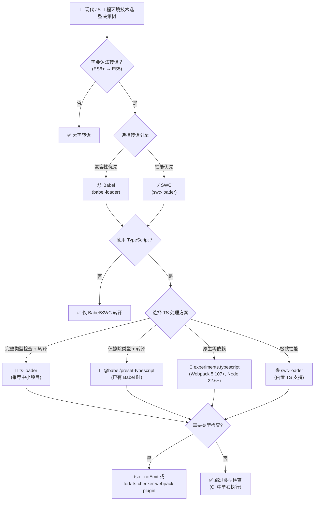
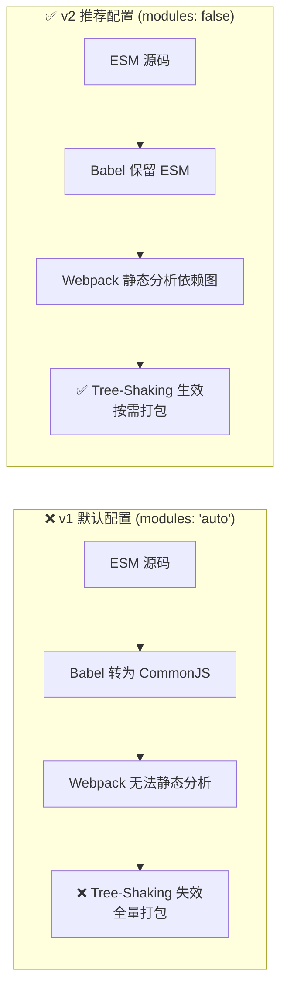
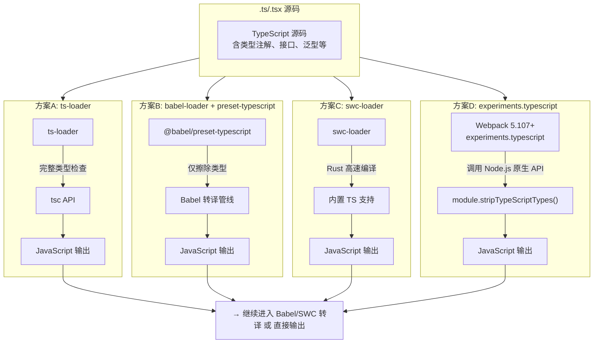
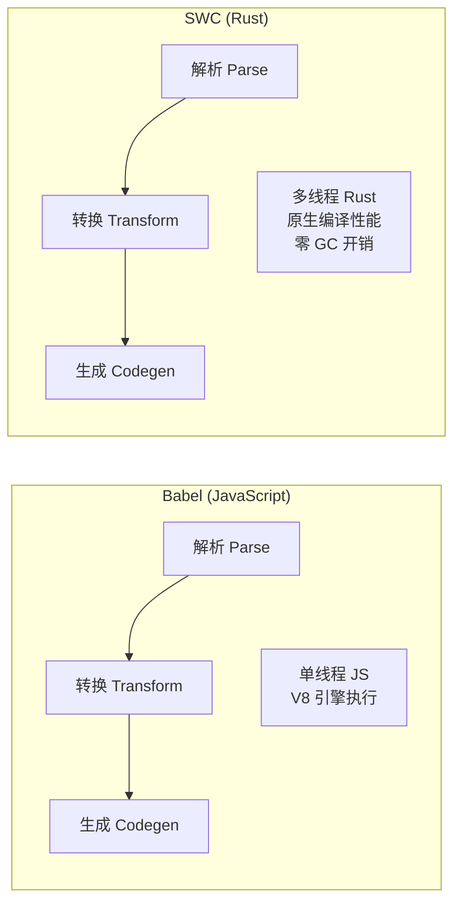
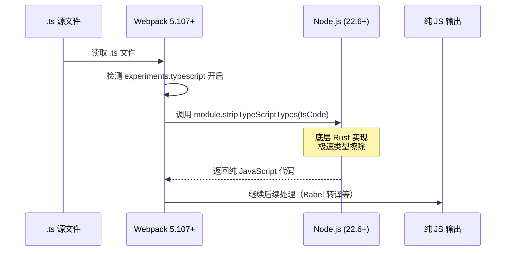
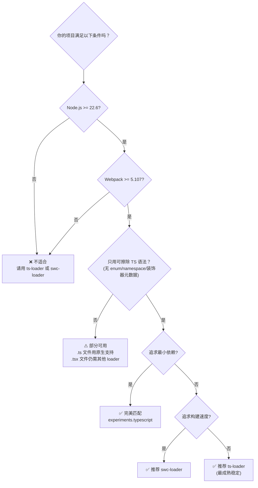
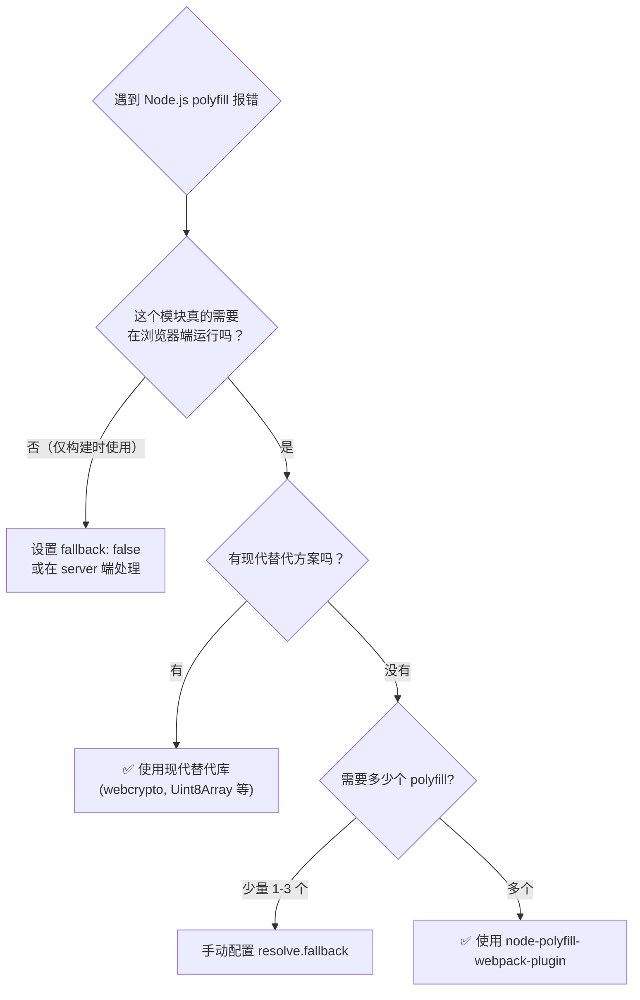

# 如何借助 Babel+TS+ESLint 构建现代 JS 工程环境？

> **v1 → v2 差异对照表**

| 维度 | v1 原版 | v2 本版 |
|------|---------|---------|
| **TypeScript 方案** | 仅介绍 ts-loader + @babel/preset-typescript | 新增 `experiments.typescript`（Webpack 5.107+ 原生支持），三种方案深度对比 |
| **Babel 配置** | 基础 preset-env 用法 | 强调 `modules: false`（Tree-Shaking 必需）、`browserslist` 集成、`useBuiltIns` 最佳实践 |
| **SWC** | 未涉及 | 完整介绍 swc-loader 替代方案，含性能数据与迁移指南 |
| **ESLint 插件** | eslint-webpack-plugin 基础用法 | 更新至最新 API，补充 Flat Config 迁移提示 |
| **Node.js Polyfill** | 未涉及 | Webpack 5 不再自动注入，详解 node-polyfill-webpack-plugin 等方案 |
| **可视化** | 无 | 新增 Mermaid 技术选型决策树 + Babel/Webpack/TS 代码流转图 |
| **综合示例** | babel-loader + preset-typescript | 提供三种 TS 方案的完整配置模板 |

---

上一节我们聊到如何用结构化思维理解 Webpack 核心配置项，按惯例很多教程接下来会开始罗列各个配置项的作用，但这种方式记忆成本比较高，学习效率偏低。为此，接下来几章我会换一种思维模式，场景化介绍 Webpack 处理各种代码资源的工具与方法。

本章我们先来聊聊 Webpack 场景下处理 JavaScript 的三种常用工具：Babel、TypeScript、ESLint 的历史背景、功能以及接入 Webpack 的步骤，并在此基础上引入 **SWC 高性能替代方案** 与 **Webpack 5.107+ 原生 TypeScript 支持**等最新实践，借助这些工具，我们能构建出更健壮、优雅的 JavaScript 应用。



## 使用 Babel

ECMAScript 6.0(简称 ES6) 版本补充了大量提升 JavaScript 开发效率的新特性，包括 `class` 关键字、块级作用域、ES Module 方案、代理与反射等，使得 JavaScript 可以真正被用于编写复杂的大型应用程序，但直到现在浏览器、Node 等 JavaScript 引擎都或多或少存在兼容性问题。为此，现代 Web 开发流程中通常会引入 Babel 等转译工具。

Babel 是一个开源 JavaScript 转编译器，它能将高版本（如 ES6）代码等价转译为向后兼容、能直接在旧版 JavaScript 引擎运行的低版本代码，例如：

```js
// 使用 Babel 转译前
arr.map(item => item + 1)

// 转译后
arr.map(function (item){
  return item + 1;
})
```

示例中高版本的箭头函数语法经过 Babel 处理后被转译为低版本 `function` 语法，从而能在不支持箭头函数的 JavaScript 引擎中正确执行。借助 Babel 我们既可以始终使用最新版本 ECMAScript 语法编写 Web 应用，又能确保产物在各种环境下正常运行。

> 提示：Babel 还提供了一个在线版的 REPL 页面，读者可在 [babeljs.io/repl](https://babeljs.io/repl) 实时体验功能效果。

### 接入 babel-loader

Webpack 场景下，只需使用 `babel-loader` 即可接入 Babel 转译功能：

**1. 安装依赖**

```bash
npm i -D @babel/core @babel/preset-env babel-loader
```

**2. 添加模块处理规则**

```js
module.exports = {
  /* ... */
  module: {
    rules: [
      {
        test: /\.js$/,
        use: ['babel-loader'],
      },
    ],
  },
};
```

示例中，`module` 属性用于声明模块处理规则，`module.rules` 子属性则用于定义针对什么类型的文件使用哪些 Loader 处理器，上例可解读为：

- `test: /\.js$/`：用于声明该规则的过滤条件，只有路径名命中该正则的文件才会应用这条规则，示例中的 `/\.js$/` 表示对所有 `.js` 后缀的文件生效
- `use`：用于声明这条规则的 Loader 处理器序列，所有命中该规则的文件都会被传入 Loader 序列做转译处理

**3. 执行编译命令**

```bash
npx webpack
```

### Babel 配置最佳实践（v2 更新）

接入后，可以使用 `.babelrc`、`babel.config.js` 文件或 `rule.options` 属性配置 Babel 功能逻辑。以下是 **2024-2026 年推荐的最佳实践配置**：

```js
module.exports = {
  /* ... */
  module: {
    rules: [
      {
        test: /\.m?js$/,
        exclude: /node_modules/,
        use: {
          loader: 'babel-loader',
          options: {
            presets: [
              ['@babel/preset-env', {
                // ⚠️ 关键：保留 ES Modules，使 Tree-Shaking 生效
                modules: false,
                // 按目标环境智能注入 polyfill
                useBuiltIns: 'usage',
                // 指定 core-js 版本
                corejs: { version: '3', proposals: true },
                // 指定目标浏览器（也可通过 .browserslistrc 配置）
                targets: '> 0.25%, not dead',
              }],
            ],
          },
        },
      },
    ],
  },
};
```

#### ⚡ 关键配置项详解

| 配置项 | v1 默认行为 | v2 推荐值 | 原因 |
|--------|------------|----------|------|
| `modules` | `'auto'`（转为 CommonJS） | **`false`** | **Tree-Shaking 的前提条件！** 转为 CJS 会破坏 ESM 的静态分析结构，导致无法消除死代码 |
| `useBuiltIns` | `false`（不注入 polyfill） | `'usage'` | 按需按实际使用的 API 注入 polyfill，减小产物体积 |
| `corejs` | 未指定 | `{ version: '3', proposals: true }` | core-js 3 支持更多新 API，proposals 包含提案阶段特性 |
| `targets` | 默认空（转译所有） | `'> 0.25%, not dead'` | 基于 browserslist 只转译真正需要的语法，大幅提升构建速度 |
| `exclude` | 未设置 | `/node_modules/` | 排除第三方库，避免无谓转译 |

#### 🎯 为什么 `modules: false` 如此重要？

这是 **v2 版本最重要的更新点之一**。当 `modules` 设为默认值 `'auto'` 时，Babel 会将 `import/export` 转换为 `require/module.exports`（CommonJS 格式）。这会带来两个严重问题：

1. **Tree-Shaking 失效**：Webpack 的 Tree-Shaking 依赖于 ESM 的静态结构（`import`/`export` 是静态可分析的），而 CommonJS 的 `require()` 是动态的，Webpack 无法静态分析哪些导出被使用
2. **产物体积膨胀**：即使你只 import 了某个库的一个函数，整个模块（包括未使用的部分）都会被打包进去



### Preset 生态

特别提一下，示例中的 `@babel/preset-env` 是一种 Babel 预设规则集 —— Preset，这种设计能按需将一系列复杂、数量庞大的配置、插件、Polyfill 等打包成一个单一的资源包，从而简化 Babel 的应用、学习成本。Preset 是 Babel 的主要应用方式之一，社区已经针对不同应用场景打包了各种 Preset 资源，例如：

- [`@babel/preset-react`](https://www.npmjs.com/package/babel-preset-react)：包含 React 常用插件的规则集，支持 `preset-flow`、`syntax-jsx`、`transform-react-jsx` 等；
- [`@babel/preset-typescript`](https://babeljs.io/docs/en/babel-preset-typescript)：用于转译 TypeScript 代码的规则集（仅做类型擦除，不做类型检查）
- [`@babel/preset-flow`](https://babeljs.io/docs/en/babel-preset-flow/)：用于转译 [Flow](https://flow.org/en/docs/getting-started/) 代码的规则集

> 提示：关于 Babel 的功能、用法、原理还有非常大的学习空间，感兴趣的同学可以前往阅读官方文档：[babeljs.io/docs](https://babeljs.io/docs/) ，这里点到为止，把注意力放回 Webpack + Babel 协作上。

## 使用 TypeScript

从 1999年 ECMAScript 发布第二个版本到 2015年发布 ES6 之间十余年时间内，JavaScript 语言本身并没有发生太大变化，语言本身许多老旧特性、不合理设计、功能缺失已经很难满足日益复杂的 Web 应用场景。为了解决这一问题，社区陆续推出了一些 JavaScript 超集方言，例如 TypeScript、CoffeeScript、Flow。

其中，TypeScript 借鉴 C# 语言，在 JavaScript 基础上提供了一系列类型约束特性，例如：

```ts
const num: number = 100;
const str: string = 'foo';

const result = num - str; // 编译报错：'-' 运算符不能用于 string 与 number 类型
```

示例中，用一个数字类型的变量 `num` 减去字符串类型的变量 `str`，这在 TypeScript 的代码编译过程就能提前发现问题，而 JavaScript 环境下则需要到启动运行后才报错。这种类型检查特性虽然一定程度上损失了语言本身的灵活性，但能够让问题在编译阶段提前暴露，确保运行阶段的类型安全性，**特别适合用于构建多人协作的大型 JavaScript 项目**，也因此，时至今日 TypeScript 依然是一项应用广泛的 JavaScript 超集语言。

### TypeScript 处理方案全景对比（v2 重写）

Webpack 生态中处理 TypeScript 的方案经历了多次演进。截至 2026 年，主流方案有以下四种，它们各有优劣：



#### 方案对比总览

| 维度 | **ts-loader** | **babel-loader**<br/>+ preset-typescript | **swc-loader** | **experiments.typescript**<br/>(Webpack 5.107+) |
|------|--------------|----------------------------------------|----------------|------------------------------------------------|
| **本质** | 封装 tsc CLI/API | Babel 插件，仅做类型擦除 | Rust 编写的超快编译器 | Webpack 内置，调用 Node.js 原生 API |
| **类型检查** | ✅ 内置完整类型检查 | ❌ 仅擦除类型，不检查 | ❌ 仅擦除类型，不检查 | ❌ 仅擦除类型，不检查 |
| **转译速度** | 慢（tsc 是单线程 JS） | 中等 | **极快（10-70x 比 Babel）** | 快（底层基于 Rust 实现） |
| **额外依赖** | typescript | @babel/preset-typescript | swc | **无需任何 loader 依赖** |
| **Node 版本要求** | 无特殊要求 | 无特殊要求 | 无特殊要求 | **Node.js 22.6+** |
| **Webpack 版本** | 全版本 | 全版本 | 全版本 | **≥ 5.107** |
| **支持 TS 特性** | 完整（enum、装饰器、namespace 等） | 完整（纯转换） | 完整 | **有限（见下方限制）** |
| **适合场景** | 需要 IDE 级别类型检查的项目 | 已有 Babel 管线的项目 | 大型项目追求极致构建速度 | 最小化依赖、快速原型 |
| **Tree-Shaking** | 需配合配置 | ✅ 天然支持（ESM） | ✅ 天然支持 | ✅ 天然支持 |

---

### 方案一：ts-loader（传统方案）

`ts-loader` 是最经典、最成熟的 TypeScript Webpack 加载器，它封装了 TypeScript 编译器（tsc），能同时完成类型检查和代码转译。

**1. 安装依赖**

```bash
npm i -D typescript ts-loader
```

**2. 配置 Webpack**

```js
const path = require('path');

module.exports = {
  /* xxx */
  module: {
    rules: [
      {
        test: /\.ts$/,
        use: 'ts-loader'
      },
    ],
  },
  resolve: {
    extensions: ['.ts', '.js'],
  }
};
```

- 使用 `module.rules` 声明对所有符合 `/\.ts$/` 正则 —— 即 `.ts` 结尾的文件应用 `ts-loader` 加载器
- 使用 `resolve.extensions` 声明自动解析 `.ts` 后缀文件，这意味着代码如 `import './a'` 可以省略后缀，自动解析为 `./a.ts` 文件

**3. 创建 `tsconfig.json` 配置文件**

```json
{
  "compilerOptions": {
    "target": "ES2020",
    "module": "ESNext",
    "moduleResolution": "node",
    "strict": true,
    "noImplicitAny": true,
    "esModuleInterop": true,
    "skipLibCheck": true,
    "forceConsistentCasingInFileNames": true
  },
  "include": ["src/**/*"],
  "exclude": ["node_modules"]
}
```

**4. 执行编译**

```bash
npx webpack
```

#### ts-loader 进阶优化：transpileOnly 模式

对于大型项目，`ts-loader` 默认的全量类型检查可能成为构建瓶颈。可以通过 `transpileOnly: true` 跳过类型检查，再搭配 `fork-ts-checker-webpack-plugin` 在独立进程中执行：

```js
const ForkTsCheckerWebpackPlugin = require('fork-ts-checker-webpack-plugin');

module.exports = {
  module: {
    rules: [
      {
        test: /\.ts$/,
        use: [
          {
            loader: 'ts-loader',
            options: {
              transpileOnly: true, // 仅转译，不检查类型
            },
          },
        ],
      },
    ],
  },
  plugins: [
    new ForkTsCheckerWebpackPlugin(), // 在独立进程中进行类型检查
  ],
};
```

这样可以将构建速度提升 **2-5 倍**，同时不丢失类型安全保障。

---

### 方案二：babel-loader + @babel/preset-typescript

如果项目中已经使用 `babel-loader` 处理 JavaScript，可以复用同一套管线来处理 TypeScript，只需添加 `@babel/preset-typescript` 预设即可。

**1. 安装依赖**

```bash
npm i -D @babel/preset-typescript
```

**2. 配置 Webpack**

```js
module.exports = {
  /* ... */
  module: {
    rules: [
      {
        test: /\.tsx?$/,
        exclude: /node_modules/,
        use: {
          loader: 'babel-loader',
          options: {
            presets: [
              ['@babel/preset-env', { modules: false }],
              '@babel/preset-typescript',
            ],
          },
        },
      },
    ],
  },
  resolve: {
    extensions: ['.ts', '.tsx', '.js'],
  },
};
```

**关键特点：**
- `@babel/preset-typescript` **仅做类型擦除**（移除类型注解、接口、type 别名等），不做类型检查
- 不需要安装 TypeScript 编译器本体（除非你想单独运行 `tsc --noEmit`）
- 代码转译能力由 `@babel/preset-env` 提供

**⚠️ 重要提醒：** 由于不进行类型检查，你需要在以下方式中选择一种进行类型校验：
- 在 `package.json` 的 scripts 中添加 `"typecheck": "tsc --noEmit"`
- 在 CI/CD 流水线中执行 `tsc --noEmit`
- 使用 VS Code 的 TypeScript 插件获得实时类型反馈

---

### 方案三：swc-loader（高性能替代）（v2 新增）

[SWC](https://swc.rs/)（Speedy Web Compiler）是用 **Rust** 编写的高性能 JavaScript/TypeScript 编译器，在转译速度上相比 Babel 有 **10-70 倍**的提升，已成为大型前端项目的首选方案（Next.js、Vite 等均已集成或支持）。

#### 为什么 SWC 这么快？



| 对比维度 | Babel | SWC |
|---------|-------|-----|
| 语言 | JavaScript | Rust |
| 单文件转译 | ~50-200ms | ~1-5ms |
| 大项目全量构建 | 数十秒到数分钟 | 数秒 |
| 并行能力 | 单线程（Worker 线程池可选） | 原生多核并行 |
| 内存占用 | 较高（V8 JIT + GC） | 极低 |
| 启动开销 | 较大（加载大量插件） | 极小 |
| 生态成熟度 | ⭐⭐⭐⭐⭐ | ⭐⭐⭐⭐（快速追赶） |

#### swc-loader 接入步骤

**1. 安装依赖**

```bash
npm i -D swc-loader @swc/core

npm i -D @swc/cli typescript
```

**2. 配置 Webpack**

```js
module.exports = {
  mode: 'production',
  module: {
    rules: [
      {
        test: /\.tsx?$/,
        exclude: /node_modules/,
        use: {
          loader: 'swc-loader',
          options: {
            jsc: {
              parser: {
                syntax: 'typescript',
                tsx: true,           // 支持 JSX/TSX
                decorators: true,     // 支持装饰器
                dynamicImport: true,  // 支持 dynamic import()
              },
              transform: {
                react: {
                  runtime: 'automatic', // React 17+ 自动 JSX runtime
                },
              },
              target: 'es2020',       // 目标环境
              loose: false,
            },
            // 保留 ESM 以支持 Tree-Shaking
            module: {
              type: 'es6',
            },
          },
        },
      },
    ],
  },
  resolve: {
    extensions: ['.ts', '.tsx', '.js', '.jsx'],
  },
};
```

**3. 类型检查策略（与 babel 类似）**

SWC 同样只做类型擦除不做类型检查。推荐组合：

```json
{
  "scripts": {
    "build": "webpack",
    "typecheck": "tsc --noEmit",
    "dev": "webpack serve",
    "ci": "tsc --noEmit && webpack"
  }
}
```

或者使用 [`fork-ts-checker-webpack-plugin`](https://github.com/TypeStrong/fork-ts-checker-webpack-plugin) 在后台并行检查：

```js
const ForkTsCheckerWebpackPlugin = require('fork-ts-checker-webpack-plugin');

module.exports = {
  // ...
  plugins: [
    new ForkTsCheckerWebpackPlugin({
      typescript: {
        mode: 'write-references', // 写入 .tsbuildinfo 缓存
      },
    }),
  ],
};
```

#### SWC vs Babel 迁移建议

如果你正在考虑从 Babel 迁移到 SWC：

| 场景 | 建议 |
|------|------|
| 新项目 | **直接选择 SWC**，性能收益立竿见影 |
| 已有 Babel 小项目 | 可保持不变，迁移成本 > 收益 |
| 已有 Babel 大型项目 | **强烈建议迁移**，构建时间可缩短 50%-80% |
| 严重依赖 Babel 插件生态 | 先确认 SWC 是否有对应插件（大部分已覆盖），否则暂缓 |
| 使用 Next.js/Vite | 已内置 SWC 支持，无需额外配置 |

---

### 方案四：experiments.typescript（Webpack 5.107+ 原生支持）（v2 重点新增）

> **这是 2024 年底 Webpack 生态最重要的更新之一。**

从 Webpack **v5.107** 开始，引入了实验性的 `experiments.typescript` 功能。它利用 **Node.js 22.6+** 新增的 `module.stripTypeScriptTypes()` 原生 API，实现 **零依赖** 的 TypeScript 类型擦除——不需要安装 ts-loader、不需要 swc-loader、不需要 @babel/preset-typescript。

#### 工作原理



#### 接入步骤

**前置要求：**
- Webpack ≥ 5.107
- Node.js ≥ 22.6.0
- 仅处理 **可擦除语法**（erasable syntax）

**1. 安装依赖（无需 TS 相关 loader！）**

```bash
npm i -D webpack webpack-cli
```

**2. 配置 Webpack**

```js
// webpack.config.js
const path = require('path');

module.exports = {
  mode: 'development',
  // 🔑 开启实验性 TypeScript 支持
  experiments: {
    typescript: true,
  },
  entry: './src/index.ts',
  output: {
    filename: '[name].js',
    path: path.resolve(__dirname, 'dist'),
  },
  // 注意：开启 experiments.typescript 后，Webpack 会自动配置：
  // - .ts / .cts / .mts 文件的 loader 规则
  // - resolve.extensions 自动添加 .ts/.cts/.mts
  // - 自动读取 tsconfig.json
};
```

就这么简单！Webpack 会自动：
- 为 `.ts`、`.cts`、`.mts` 文件注册处理规则
- 将 `resolve.extensions` 补充 TypeScript 后缀
- 解析项目中的 `tsconfig.json` 配置

**3. 创建 `tsconfig.json`**

```json
{
  "compilerOptions": {
    "target": "ES2022",
    "module": "ESNext",
    "moduleResolution": "bundler",
    "strict": true,
    "skipLibCheck": true,
    "esModuleInterop": true
  }
}
```

**4. 类型检查（必须单独配置）**

由于 `experiments.typescript` **只做类型擦除，不做类型检查**，你需要单独配置类型检查：

```bash
npx tsc --noEmit

```

或者在 Webpack 中结合插件：

```js
const ForkTsCheckerWebpackPlugin = require('fork-ts-checker-webpack-plugin');

module.exports = {
  experiments: { typescript: true },
  plugins: [
    new ForkTsCheckerWebpackPlugin(),
  ],
};
```

#### ⚠️ 限制与注意事项

| 限制项 | 说明 | 解决方案 |
|--------|------|---------|
| **不支持 enum** | enum（含 const enum）语法不可擦除，无法通过 stripTypeScriptTypes 处理 | 使用对象字面量（`as const`）代替 |
| **不支持 namespace** | TypeScript namespace 语法 | 使用 ES Module 代替 |
| **不支持装饰器元数据** | `emitDecoratorMetadata` 相关 | 使用 swc-loader 或 ts-loader |
| **不支持 JSX/.tsx** | 无法处理 TSX 文件 | 对 .tsx 文件继续使用 babel-loader/swc-loader |
| **Node.js 22.6+** | 依赖较新的 Node.js API | 升级 Node.js 或使用 nvm 管理 |
| **实验性功能** | API 可能变动 | 关注 Webpack changelog |

#### 适用场景判断



---

### 四种方案如何选择？（总结）

根据你的项目特征，快速决策：

| 项目特征 | 推荐方案 | 理由
| ---------|---------|------ |
| **全新小项目，想最快上手** | `experiments.typescript` | 零依赖，配置最少 |
| **已有 Babel 管线** | `@babel/preset-typescript` | 复用现有配置，改动最小 |
| **大型项目，构建慢** | `swc-loader` | 性能提升最显著 |
| **需要完整的 TS 类型检查集成** | `ts-loader` + `fork-ts-checker-webpack-plugin` | 最成熟、IDE 体验最好 |
| **混合 .ts + .tsx（React）** | `swc-loader` 或 `babel-loader` + preset-typescript | 原生方案不支持 TSX |
| **CI/CD 环境严格** | 任意方案 + `tsc --noEmit` | 类型检查不应依赖构建流程 |

## 使用 ESLint

JavaScript 被设计成一种高度灵活的动态、弱类型脚本语言，这使得语言本身的上手成本极低，开发者只需要经过短暂学习就可以开始构建简单应用。但与其它编译语言相比，JavaScript 很难在编译过程发现语法、类型，或其它可能影响稳定性的错误，特别在多人协作的复杂项目下，语言本身的弱约束可能会对开发效率与质量产生不小的影响，ESLint 的出现正是为了解决这一问题。

ESLint 是一种扩展性极佳的 JavaScript 代码风格检查工具，它能够自动识别违反风格规则的代码并予以修复，例如对于下面的示例：

| 源码 | ESLint 修复后 |
| ------------------------------------------------------------ | ------------------------------------------------------------ |
| `const foo ='foo'; let  bar='bar';  console.log(foo,bar) `   | `const foo = 'foo' const bar = 'bar'  console.log(foo, bar) ` |

使用的 ESLint 配置为：`module.exports = { "extends": "standard" }`。


这里先忽略 ESLint 配置的具体规则，样例源码存在诸多风格不统一的地方，例如 1、2 行以 `;` 结尾，而第 3 行没有 `;`；第一行变量以 `const` 声明，第二行变量以 `let` 声明，等等。ESLint 会找出这些风格不一致的地方，并予以告警，甚至自动修复，生成如上表右上角的代码。

### eslint-webpack-plugin 接入（v2 更新）

Webpack 下，可以使用 `eslint-webpack-plugin` 接入 ESLint 工具。以下是最新用法：

**1. 安装依赖**

```bash
yarn add -D webpack webpack-cli

yarn add -D eslint eslint-webpack-plugin

yarn add -D eslint-config-standard eslint-plugin-promise eslint-plugin-import eslint-plugin-node
```

**2. 在项目根目录添加 ESLint 配置文件**

> **v2 注意：** ESLint 9.x 引入了新的 **Flat Config**（`eslint.config.js`），与传统 `.eslintrc` 格式并存。如果你的项目使用 ESLint 9+，建议迁移到 Flat Config。

**传统格式（.eslintrc / .eslintrc.json）：**

```json
{
  "extends": "standard"
}
```

**Flat Config 格式（eslint.config.js，ESLint 9+ 推荐）：**

```js
// eslint.config.js
const js = require('@eslint/js');
const standard = require('eslint-config-standard');

module.exports = [
  js.configs.recommended,
  ...standard,
  {
    languageOptions: {
      ecmaVersion: 2022,
      sourceType: 'module',
      globals: {
        window: 'readonly',
        document: 'readonly',
      },
    },
    rules: {
      // 自定义规则覆盖
    },
  },
];
```

**3. 添加 `webpack.config.js` 配置**

```js
// webpack.config.js
const path = require('path');
const ESLintPlugin = require('eslint-webpack-plugin');

module.exports = {
  entry: './src/index',
  mode: 'development',
  devtool: false,
  output: {
    filename: '[name].js',
    path: path.resolve(__dirname, 'dist'),
  },
  plugins: [
    new ESLintPlugin({
      extensions: ['.js', '.ts', '.tsx'],  // 检查的文件扩展名
      exclude: /node_modules/,               // 排除目录
      failOnError: false,                    // 开发模式不阻断构建
      failOnWarning: false,
    }),
  ],
};
```

**4. 执行编译命令**

```bash
npx webpack
```

配置完毕后，就可以在 Webpack 编译过程实时看到代码风格错误提示：

### ESLint + TypeScript

如果项目中使用了 TypeScript，需要额外的解析器和插件：

```bash
npm i -D @typescript-eslint/parser @typescript-eslint/eslint-plugin
```

**.eslintrc 配置：**

```json
{
  "parser": "@typescript-eslint/parser",
  "plugins": ["@typescript-eslint"],
  "extends": [
    "standard",
    "plugin:@typescript-eslint/recommended"
  ]
}
```

**Flat Config 格式（eslint.config.js）：**

```js
const tseslint = require('typescript-eslint');

module.exports = [
  ...tseslint.configs.recommended,
  {
    rules: {
      '@typescript-eslint/no-unused-vars': 'error',
      '@typescript-eslint/no-explicit-any': 'warn',
    },
  },
];
```

### ESLint 推荐扩展

除常规 JavaScript 代码风格检查外，我们还可以使用适当的 ESLint 插件、配置集实现更丰富的检查、格式化功能，这里推荐几种使用率较高的第三方扩展：

| 扩展包 | 说明 | 适用场景
| --------|------|--------- |
| [`eslint-config-airbnb`](https://github.com/airbnb/javascript/tree/master/packages/eslint-config-airbnb) | Airbnb 提供的代码风格规则集 | 通用 JS 项目，规则严格全面 |
| [`eslint-config-standard`](https://github.com/standard/eslint-config-standard) | Standard.js 代码风格规则集 | 追求快速统一风格的团队 |
| [`eslint-plugin-vue`](https://eslint.vuejs.org/) | Vue SFC 文件代码风格检查 | Vue 项目 |
| [`eslint-plugin-react`](https://www.npmjs.com/package/eslint-plugin-react) | React 代码风格检查 | React 项目 |
| [`@typescript-eslint/eslint-plugin`](https://typescript-eslint.io/docs/architecture/packages/) | TypeScript 代码风格检查 | TS 项目必备 |
| [`eslint-plugin-sonarjs`](https://github.com/SonarSource/eslint-plugin-sonarjs) | 基于 Sonar 的代码质量检查 | 圈复杂度、代码重复率检测 |

## Node.js Polyfill 处理（v2 新增）

> **这是一个 v2 版本新增的关键章节。** Webpack 5 不再自动注入 Node.js 内置模块的 polyfill，这是从 Webpack 4 迁移到 Webpack 5 时最常见的"坑"之一。

### 背景

在 Webpack 4 及之前的版本中，当你使用 Node.js 内置模块（如 `fs`、`crypto`、`stream`、`buffer`、`process` 等）在前端代码中引用时，Webpack 会自动提供 polyfill。但从 **Webpack 5 开始，这一行为已被移除**，目的是：

1. 减少不必要的产物体积（很多项目根本用不到这些 polyfill）
2. 让开发者显式控制需要什么 polyfill
3. 避免 security issues（自动 polyfill 可能包含过时的实现）

### 常见报错信息

如果你在升级到 Webpack 5 后遇到类似以下错误，就是 Node.js polyfill 问题：

```bash
BREAKING CHANGE: webpack < 5 used to include polyfills for node.js core modules by default.
This is no longer the case. Verify if you need this module and configure a polyfill for it.
```

常见触发模块包括：`buffer`、`crypto`、`stream`、`assert`、`http`、`https`、`os`、`path`、`process`、`util` 等。

### 解决方案

#### 方案一：node-polyfill-webpack-plugin（推荐）

这是目前最流行的解决方案，一键补齐所有常用 Node.js polyfill：

```bash
npm i -D node-polyfill-webpack-plugin
```

```js
const NodePolyfillPlugin = require('node-polyfill-webpack-plugin');

module.exports = {
  // ...
  plugins: [
    new NodePolyfillPlugin(),
  ],
  resolve: {
    alias: {
      // 如果还需要手动指定某些 fallback
      buffer: 'buffer',
      stream: 'stream-browserify',
    },
    fallback: {
      "fs": false,
      "tls": false,
      "net": false,
      "http": require.resolve("stream-http"),
      "https": require.resolve("https-browserify"),
      "crypto": require.resolve("crypto-browserify"),
    },
  },
};
```

#### 方案二：按需手动配置（精细化控制）

如果你知道具体需要哪些 polyfill，可以手动配置 `resolve.fallback`：

```js
module.exports = {
  resolve: {
    fallback: {
      buffer: require.resolve('buffer/'),
      stream: require.resolve('stream-browserify'),
      crypto: require.resolve('crypto-browserify'),
      util: require.resolve('util/'),
      assert: require.resolve('assert/'),
      process: require.resolve('process/browser'),
    },
  },
  plugins: [
    // 提供 process 和 Buffer 全局变量
    new (require('webpack')).ProvidePlugin({
      process: 'process/browser',
      Buffer: ['buffer', 'Buffer'],
    }),
  ],
};
```

#### 方案三：使用现代替代库

很多情况下，你并不真的需要 Node.js 原生模块的完整 polyfill。可以考虑使用专门的现代化替代品：

| 原始模块 | 现代替代 | 安装 |
|---------|---------|------|
| `crypto` | `webcrypto`（浏览器原生）或 `@noble/hashes` | `npm i @noble/hashes` |
| `buffer` | 原生 `Uint8Array` 或 `buffer` 包 | `npm i buffer` |
| `stream` | 原生 `ReadableStream` / `TransformStream` | 浏览器原生支持 |
| `process.env.NODE_ENV` | Webpack 的 `DefinePlugin` | 内置 |
| `path` | `pathe` 或 `node:path`（仅路径拼接） | `npm i pathe` |
| `fs` | 不应在前端使用 | 重构架构 |

#### 最佳实践建议



## 综合示例

最后，我们串联上述所有工具，构建一套功能完备的 JavaScript 应用开发环境。以下提供 **三种不同技术栈的完整配置模板**，你可以根据上一节的选型决策选择适合自己项目的方案。

### 模板 A：Babel + TypeScript（经典方案）

适用于已有 Babel 管线、追求稳定性的项目。

**1. 安装依赖**

```bash
npm i -D webpack webpack-cli \
    # babel 依赖
    @babel/core @babel/cli @babel/preset-env babel-loader \
    # TypeScript 依赖（通过 Babel 处理）
    @babel/preset-typescript \
    # ESLint 依赖
    eslint eslint-webpack-plugin \
    @typescript-eslint/parser @typescript-eslint/eslint-plugin \
    # Node.js polyfill（如需要）
    node-polyfill-webpack-plugin
```

**2. `webpack.config.js`**

```js
const path = require('path');
const ESLintPlugin = require('eslint-webpack-plugin');
const NodePolyfillPlugin = require('node-polyfill-webpack-plugin');

module.exports = {
  entry: './src/index.ts',
  mode: 'production',
  devtool: 'source-map',
  output: {
    filename: '[name].[contenthash].js',
    path: path.resolve(__dirname, 'dist'),
    clean: true,
  },
  module: {
    rules: [
      {
        test: /\.tsx?$/,
        exclude: /node_modules/,
        use: {
          loader: 'babel-loader',
          options: {
            presets: [
              ['@babel/preset-env', {
                modules: false,         // ⚠️ 保留 ESM，Tree-Shaking 需要
                useBuiltIns: 'usage',
                corejs: { version: '3', proposals: true },
                targets: '> 0.25%, not dead',
              }],
              '@babel/preset-typescript', // 类型擦除
            ],
          },
        },
      },
    ],
  },
  resolve: {
    extensions: ['.ts', '.tsx', '.js'],
  },
  plugins: [
    new ESLintPlugin({
      extensions: ['.ts', '.tsx'],
      exclude: /node_modules/,
      failOnError: true, // 生产构建时报错阻断
    }),
    new NodePolyfillPlugin(), // 如需 Node.js polyfill
  ],
};
```

**3. `.eslintrc`**

```json
{
  "parser": "@typescript-eslint/parser",
  "plugins": ["@typescript-eslint"],
  "extends": ["plugin:@typescript-eslint/recommended"]
}
```

**4. `tsconfig.json`**

```json
{
  "compilerOptions": {
    "target": "ES2020",
    "module": "ESNext",
    "moduleResolution": "bundler",
    "strict": true,
    "esModuleInterop": true,
    "skipLibCheck": true,
    "forceConsistentCasingInFileNames": true,
    "isolatedModules": true
  },
  "include": ["src/**/*"],
  "exclude": ["node_modules", "dist"]
}
```

**5. `package.json` scripts**

```json
{
  "scripts": {
    "dev": "webpack serve --mode development",
    "build": "webpack --mode production",
    "typecheck": "tsc --noEmit",
    "lint": "eslint src/",
    "lint:fix": "eslint src/ --fix",
    "ci": "tsc --noEmit && webpack --mode production"
  }
}
```

---

### 模板 B：SWC + TypeScript（高性能方案）

适用于大型项目、追求极致构建速度的场景。

**1. 安装依赖**

```bash
npm i -D webpack webpack-cli \
    # SWC 依赖
    swc-loader @swc/core \
    # TypeScript 类型检查
    fork-ts-checker-webpack-plugin typescript \
    # ESLint
    eslint eslint-webpack-plugin \
    @typescript-eslint/parser @typescript-eslint/eslint-plugin
```

**2. `webpack.config.js`**

```js
const path = require('path');
const ESLintPlugin = require('eslint-webpack-plugin');
const ForkTsCheckerWebpackPlugin = require('fork-ts-checker-webpack-plugin');

module.exports = {
  entry: './src/index.ts',
  mode: 'production',
  devtool: 'source-map',
  output: {
    filename: '[name].[contenthash].js',
    path: path.resolve(__dirname, 'dist'),
    clean: true,
  },
  module: {
    rules: [
      {
        test: /\.tsx?$/,
        exclude: /node_modules/,
        use: {
          loader: 'swc-loader',
          options: {
            jsc: {
              parser: {
                syntax: 'typescript',
                tsx: true,
                decorators: true,
                dynamicImport: true,
              },
              target: 'es2020',
              transform: {
                react: {
                  runtime: 'automatic',
                },
              },
            },
            module: {
              type: 'es6', // 保留 ESM
            },
          },
        },
      },
    ],
  },
  resolve: {
    extensions: ['.ts', '.tsx', '.js'],
  },
  plugins: [
    new ESLintPlugin({ extensions: ['.ts', '.tsx'] }),
    // 独立进程类型检查，不影响构建速度
    new ForkTsCheckerWebpackPlugin({
      typescript: {
        mode: 'write-references',
      },
    }),
  ],
};
```

---

### 模板 C：experiments.typescript（原生零依赖方案）

适用于满足前置条件（Webpack 5.107+、Node 22.6+）、追求最小依赖的项目。

**1. 安装依赖**

```bash
npm i -D webpack webpack-cli \
    # Babel 用于语法转译（如需降级）
    @babel/core @babel/preset-env babel-loader \
    # ESLint
    eslint eslint-webpack-plugin \
    @typescript-eslint/parser @typescript-eslint/eslint-plugin \
    # 类型检查
    typescript fork-ts-checker-webpack-plugin
```

**2. `webpack.config.js`**

```js
const path = require('path');
const ESLintPlugin = require('eslint-webpack-plugin');
const ForkTsCheckerWebpackPlugin = require('fork-ts-checker-webpack-plugin');

module.exports = {
  entry: './src/index.ts',
  mode: 'production',
  // 🔑 核心：开启原生 TypeScript 支持
  experiments: {
    typescript: true,
  },
  output: {
    filename: '[name].[contenthash].js',
    path: path.resolve(__dirname, 'dist'),
    clean: true,
  },
  module: {
    rules: [
      // .ts 文件由 experiments.typescript 自动处理
      // 这里只需要处理 .js 文件的 Babel 转译（如需要）
      {
        test: /\.m?js$/,
        exclude: /node_modules/,
        use: {
          loader: 'babel-loader',
          options: {
            presets: [
              ['@babel/preset-env', {
                modules: false,
                targets: '> 0.25%, not dead',
              }],
            ],
          },
        },
      },
    ],
  },
  plugins: [
    new ESLintPlugin({ extensions: ['.ts'] }),
    // 类型检查仍然需要单独配置
    new ForkTsCheckerWebpackPlugin(),
  ],
};
```

> **注意：** 开启 `experiments.typescript` 后，Webpack 会自动为 `.ts`、`.cts`、`.mts` 文件配置 loader 规则和 resolve.extensions，**无需手动编写对应的 rule**。你只需要关注 `.js` 文件的 Babel 转译规则（如果需要的话）。

### 构建结果验证

以模板 A 为例，执行 `npx webpack` 后的输入输出对照：

**`src/index.ts` 源码：**

```typescript
interface Greeting {
  message: string;
}

const say = (statements: string): void => {
  console.log(statements);
};

say("Hello from TypeScript!");
```

**编译产物（简化展示）：**

```javascript
// 类型注解被完全擦除
const say = (statements) => {
  console.log(statements);
};
say("Hello from TypeScript!");
```

至此，我们就搭建了一套支持 **Babel/SWC + TypeScript + ESLint + Node.js Polyfill** 的现代化开发环境，读者可根据上一节的技术选型决策，选择最适合自己项目的配置模板。

## 总结

本文介绍了 Babel、TypeScript、ESLint 三类工程化工具的历史背景、功能以及在 Webpack 中接入这些工具的具体步骤，并在 v2 版本中进行了重要更新：

- **Babel** 提供的语言转译能力，能在确保产物兼容性的同时让我们大胆使用 ECMAScript 新特性。**v2 重点强调了 `modules: false` 配置的重要性**——这是 Tree-Shaking 生效的前提条件
- **TypeScript** 提供的类型检查能力能有效提升应用代码的健壮性。**v2 全面重写了这部分内容**，提供了四种方案（ts-loader / babel-loader + preset-typescript / swc-loader / experiments.typescript）的深度对比，帮助读者根据项目规模、性能需求、依赖偏好做出合理选择
- **ESLint** 提供的风格检查能力能确保多人协作时的代码一致性。**v2 更新了 eslint-webpack-plugin 最新用法**，并补充了 Flat Config 迁移提示
- **Node.js Polyfill** 是 **v2 新增章节**，解决了 Webpack 5 迁移中最常见的坑，提供了多种解决方案
- **SWC** 作为 **v2 新增的高性能替代方案**，为大型项目提供了数量级的构建速度提升

它们已成为构建现代 JavaScript 应用的基础设施，建议读者遵循文章提及的学习建议，扩展学习各个工具的功能细节。

## 思考题

1. **ESLint、TypeScript、Babel 三种工具都分别提供了独立 CLI 形态的使用方法，为何还需要被接入到 Webpack 工作流程中？这种做法有什么收益？**

2. **（v2 新增）在你的实际项目中，你会选择哪种 TypeScript 处理方案？请结合项目规模、团队习惯、构建速度需求说明理由。**

3. **（v2 新增）为什么 `modules: false` 对 Tree-Shaking 至关重要？如果设置为默认的 `'auto'`，Webpack 的依赖图会发生什么变化？请画图说明。**

4. **（v2 新增）`experiments.typescript` 的"零依赖"优势在实际项目中意味着什么？它的限制条件（不支持 enum、namespace、TSX 等）会影响你的项目吗？**
