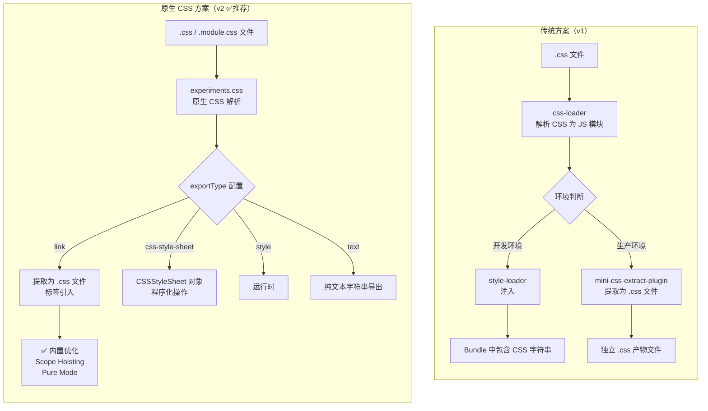
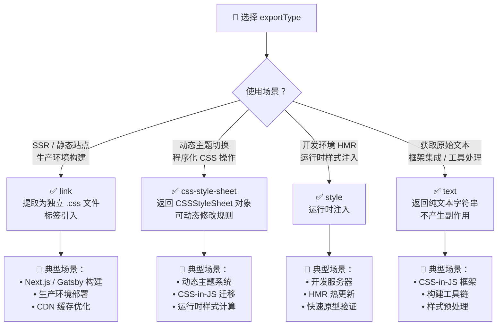
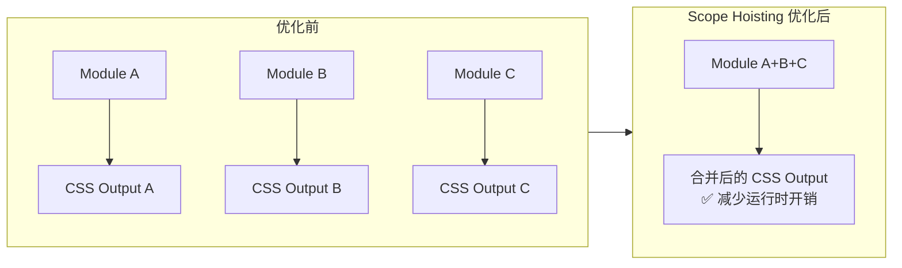

# 如何借助预处理器、PostCSS 等构建现代 CSS 工程环境？

> **文档元信息**
>
> | 属性       | 内容                                                         |
> | ---------- | ------------------------------------------------------------ |
> | **版本**   | v2.0（基于 Webpack v5.107+ 原生 CSS 支持更新）              |
> | **更新日期** | 2026-05-22                                                   |
> | **适用范围** | Webpack ≥ 5.107                                              |
> | **核心变更** | 新增 `experiments.css` 原生 CSS 支持、CSS Modules 增强、Asset Modules 替代方案 |
> | **废弃警告** | `css-loader` + `style-loader` + `mini-css-extract-plugin` 组合计划于 2026 年废弃 |

---

## v1 → v2 差异对照表

| 章节/特性                | v1（传统方案）                                                | v2（原生 CSS 方案）                                           |
| ------------------------ | ------------------------------------------------------------- | ------------------------------------------------------------- |
| **CSS 处理核心**         | `css-loader` + `style-loader` + `mini-css-extract-plugin`     | `experiments.css`（内置原生支持）                              |
| **CSS Modules**          | 通过 `css-loader` 的 `modules` 选项启用                       | `.module.css` 自动识别，原生支持                               |
| **CSS 提取**             | `mini-css-extract-plugin`                                     | 内置 CSS extraction，无需额外插件                              |
| **HMR**                  | `style-loader` 提供                                            | 原生 HMR 支持                                                 |
| **运行时注入**           | `style-loader` 运行时注入 `<style>` 标签                      | `exportType: "style"` 运行时样式注入                           |
| **资源处理**             | `file-loader` / `url-loader` / `raw-loader`                   | Asset Modules（`asset/resource` 等）                           |
| **配置复杂度**           | 需要多个 Loader + Plugin 协同                                 | 统一配置，简化流程                                             |
| **性能优化**             | 依赖第三方插件优化                                             | Scope Hoisting、Pure Mode 等内置优化                          |
| **未来兼容性**           | ⚠️ 计划废弃                                                    | ✅ 官方推荐方案                                                |

---

在开发 Web 应用时，我们通常需要编写大量 JavaScript 代码 —— 用于控制页面逻辑；编写大量 CSS 代码 —— 用于调整页面呈现形式。问题在于，CSS 语言在过去若干年中一直在追求样式表现力方面的提升，工程化能力薄弱，例如缺乏成熟的模块化机制、依赖处理能力、逻辑判断能力等。为此，在开发现代大型 Web 应用时，通常会使用 Webpack 配合其它预处理器编写样式代码。

本章主要介绍 Webpack 中如何使用 CSS 代码处理工具，包括：

- **传统方案**：如何使用 `css-loader`、`style-loader`、`mini-css-extract-plugin` 处理原生 CSS 文件？
- **原生 CSS 方案（推荐）**：如何使用 Webpack v5.107+ 的 `experiments.css` 原生支持？
- 如何使用 Less/Sass/Stylus 预处理器？
- 如何使用 PostCSS ？
- 如何使用 Asset Modules 处理静态资源？

---

## Webpack 如何处理 CSS 资源？

### 📊 CSS 处理流水线全景对比



### 传统方案回顾（了解即可）

> ⚠️ **重要提示**：以下传统方案计划于 2026 年废弃，建议新项目直接使用[原生 CSS 方案](#原生-css-方案推荐)。

原生 Webpack 并不能识别 CSS 语法，假如不做额外配置直接导入 `.css` 文件，会导致编译失败。为此，在 Webpack 中处理 CSS 文件，传统上需要用到：

- [`css-loader`](https://webpack.js.org/loaders/css-loader/)：该 Loader 会将 CSS 等价翻译为形如 `module.exports = "${css}"` 的 JavaScript 代码，使得 Webpack 能够如同处理 JS 代码一样解析 CSS 内容与资源依赖；
- [`style-loader`](https://webpack.js.org/loaders/style-loader/)：该 Loader 将在产物中注入一系列 runtime 代码，这些代码会将 CSS 内容注入到页面的 `<style>` 标签，使得样式生效；
- [`mini-css-extract-plugin`](https://webpack.js.org/plugins/mini-css-extract-plugin)：该插件会将 CSS 代码抽离到单独的 `.css` 文件，并将文件通过 `<link>` 标签方式插入到页面中。

三种组件各司其职：`css-loader` 让 Webpack 能够正确理解 CSS 代码、分析资源依赖；`style-loader`、`mini-css-extract-plugin` 则通过适当方式将 CSS 插入到页面，对页面样式产生影响。

#### css-loader 基础用法

接入时首先需要安装依赖：

```bash
yarn add -D css-loader
```

之后修改 Webpack 配置，定义 `.css` 规则：

```js
module.exports = {
  module: {
    rules: [
      {
        test: /\.css$/i,
        use: ["css-loader"],
      },
    ],
  },
};
```

经过 `css-loader` 处理后，样式代码最终会被转译成一段 JS 字符串：

| 源码 | 转译后 |
| ------------------------------------ | ------------------------------------------------------------ |
| `.main-hd { font-size: 10px; } ` | `//... var ___CSS_LOADER_EXPORT___ = ... // Module ___CSS_LOADER_EXPORT___.push([module.id, ".main-hd {\n font-size: 10px;\n}", ""]); // Exports const __WEBPACK_DEFAULT_EXPORT__ = (___CSS_LOADER_EXPORT___); //... ` |

但这段字符串只是被当作普通 JS 模块处理，并不会实际影响到页面样式，后续还需要：
1. **开发环境**：使用 `style-loader` 将样式代码注入到页面 `<style>` 标签；
2. **生产环境**：使用 `mini-css-extract-plugin` 将样式代码抽离到单独产物文件，并以 `<link>` 标签方式引入到页面中。

#### style-loader 开发环境用法

与其它 Loader 不同，`style-loader` 并不会对代码内容做任何修改，而是简单注入一系列运行时代码，用于将 `css-loader` 转译出的 JS 字符串插入到页面的 `style` 标签。接入时同样需要安装依赖：

```bash
yarn add -D style-loader css-loader
```

之后修改 Webpack 配置：

```js
module.exports = {
  module: {
    rules: [
      {
        test: /\.css$/i,
        use: ["style-loader", "css-loader"],
      },
    ],
  },
};
```

> PS：注意保持 `style-loader` 在前，`css-loader` 在后

上述配置语义上相当于 `style-loader(css-loader(css))` 链式调用，执行后样式代码会被转译为类似下面这样的代码：

```js
// Part1: css-loader 处理结果，对标到原始 CSS 代码
const __WEBPACK_DEFAULT_EXPORT__ = (
"body {\n background: yellow;\n font-weight: bold;\n}"
);
// Part2: style-loader 处理结果，将 CSS 代码注入到 `style` 标签
injectStylesIntoStyleTag(__WEBPACK_DEFAULT_EXPORT__)
```

经过 `style-loader` + `css-loader` 处理后，样式代码最终会被写入 Bundle 文件，并在运行时通过 `style` 标签注入到页面。这种将 JS、CSS 代码合并进同一个产物文件的方式有几个问题：

- JS、CSS 资源无法并行加载，从而降低页面性能；
- 资源缓存粒度变大，JS、CSS 任意一种变更都会致使缓存失效。

#### mini-css-extract-plugin 生产环境用法

因此，生产环境中通常会用 `mini-css-extract-plugin` 替代 `style-loader`，将样式代码抽离成单独的 CSS 文件。使用时，首先需要安装依赖：

```bash
yarn add -D mini-css-extract-plugin
```

之后，添加配置信息：

```js
const MiniCssExtractPlugin = require('mini-css-extract-plugin')
const HTMLWebpackPlugin = require('html-webpack-plugin')

module.exports = {
    module: {
        rules: [{
            test: /\.css$/,
            use: [
                (process.env.NODE_ENV === 'development' ?
                    'style-loader' :
                    MiniCssExtractPlugin.loader),
                'css-loader'
            ]
        }]
    },
    plugins: [
        new MiniCssExtractPlugin(),
        new HTMLWebpackPlugin()
    ]
}
```

这里需要注意几个点：
- `mini-css-extract-plugin` 库同时提供 Loader、Plugin 组件，需要同时使用
- `mini-css-extract-plugin` 不能与 `style-loader` 混用，否则报错
- `mini-css-extract-plugin` 需要与 `html-webpack-plugin` 同时使用，才能将产物路径以 `link` 标签方式插入到 html 中

---

## 原生 CSS 方案（推荐）✅

从 Webpack v5.107 开始，官方引入了**实验性原生 CSS 支持**（`experiments.css`），这是一项重大更新，旨在替代传统的 `css-loader` + `style-loader` + `mini-css-extract-plugin` 组合。

### 🔥 为什么选择原生 CSS？

| 特性                | 传统方案                                                     | 原生 CSS 方案                                               |
| ------------------- | ------------------------------------------------------------ | ------------------------------------------------------------ |
| **依赖数量**        | 3+ 个包（css-loader、style-loader、mini-css-extract-plugin） | 零额外依赖，Webpack 内置                                      |
| **配置复杂度**      | 需要协调多个 Loader 和 Plugin                                | 统一配置，开箱即用                                           |
| **CSS Modules**     | 需要手动配置 `modules: true`                                 | `.module.css` 自动识别                                        |
| **HMR**             | 依赖 style-loader                                            | 原生支持                                                     |
| **性能优化**        | 依赖第三方工具                                               | Scope Hoisting、Pure Mode 内置优化                           |
| **维护成本**        | 需要同步更新多个包版本                                       | 跟随 Webpack 版本更新                                         |
| **未来兼容性**      | ⚠️ 计划废弃                                                  | ✅ 官方长期支持路线图                                         |
| **Tree Shaking**    | 有限支持                                                     | 完整支持未使用的 CSS 规则移除                                 |

### 快速开始

#### 1️⃣ 启用原生 CSS 支持

在 `webpack.config.js` 中启用实验性功能：

```js
// webpack.config.js
module.exports = {
  experiments: {
    css: true,
  },
};
```

就这么简单！现在 Webpack 可以原生理解 `.css` 文件了。

#### 2️⃣ 基础示例

**index.css：**
```css
body {
  background: yellow;
  font-weight: bold;
}
```

**index.js：**
```js
import './index.css';

const node = document.createElement('span');
node.textContent = 'Hello world';
document.body.appendChild(node);
```

**webpack.config.js：**
```js
module.exports = {
  experiments: {
    css: true,
  },
  entry: './index.js',
};
```

无需任何 Loader 或 Plugin，Webpack 会自动处理 CSS 文件！

---

### 📖 experiments.css 完整配置指南

#### 核心配置选项

```js
module.exports = {
  experiments: {
    css: {
      // === 导出类型（核心选项）===
      exportType: "link", // "link" | "css-style-sheet" | "text" | "style"

      // === CSS Modules 配置 ===
      modules: {
        // 模式："local" | "global" | "pure"
        mode: "local",
        // 本地类名生成器
        localIdentName: "[path][name]__[local]--[hash:base64:5]",
        // 自定义类名前缀
        localIdentPrefix: "",
        // Context 路径
        context: null,
        // Hash 前缀
        hashPrefix: "",
        // 是否启用 Scope Hoisting（v5.107+）
        scopeHoisting: false,
        // 是否启用 Pure Mode（v5.107+）
        pureMode: false,
        // 导出格式
        exportLocalsConvention: "asIs", // "asIs" | "camelCase" | "camelCaseOnly" | "dashes" | "dashesOnly"
        // 命名导出（v5.103+ composes）
        namedExport: false,
        // 是否导出仅声明
        exportOnlyLocals: false,
      },

      // === 全局配置 ===
      // 是否自动导入（用于全局样式）
      auto: true,

      // === URL 处理 ===
      url: {
        filter: (url, resourcePath) => {
          return true; // 返回 false 可过滤掉某些 URL
        },
      },

      // === Import 处理 ===
      import: {
        filter: (url, resourcePath) => {
          return true;
        },
        // @value 支持（v5.107+）
        support: true,
      },

      // === 运行时代码插入位置 ===
      insert: "head", // "head" | "body" | 自定义函数

      // === Hooks（v5.107+）===
      // linkInsert hook - 控制 <link> 标签插入
      linkInsert: undefined,
      // orderModules hook - 控制模块顺序
      orderModules: undefined,

      // === Source Map ===
      sourceMap: false,

      // === ES Module ===
      esModule: true,
    },
  },
};
```

---

### 🎯 exportType 详解（核心概念）

`exportType` 是原生 CSS 最核心的配置选项，决定了 CSS 如何被导出和使用。不同场景应选择不同的 exportType：

#### 📊 CSS Modules exportType 决策矩阵



#### 1️⃣ `exportType: "link"` （默认值，推荐生产环境）

**行为**：将 CSS 提取为独立的 `.css` 文件，并通过 `<link>` 标签引入。

**特点**：
- ✅ 浏览器并行加载 JS/CSS，性能最优
- ✅ 独立缓存策略，CSS 变更不影响 JS 缓存
- ✅ 支持 HTTP/2 多路复用
- ✅ 内置 Scope Hoisting 优化
- ❌ 不支持运行时动态修改

**配置示例：**
```js
// webpack.config.js
module.exports = {
  experiments: {
    css: {
      exportType: "link", // 默认值
    },
  },
};

// index.js
import styles from './styles.module.css';

console.log(styles.className); // "_className_abc123"

// HTML 输出
// <link rel="stylesheet" href="styles.css">
```

**输出文件结构：**
```text
dist/
├── main.js
└── styles.css  ← 独立的 CSS 文件
```

#### 2️⃣ `exportType: "css-style-sheet"`

**行为**：返回 `CSSStyleSheet` 对象，允许程序化操作 CSS 规则。

**特点**：
- ✅ 运行时可动态添加/删除/修改规则
- ✅ 支持动态主题切换
- ✅ 适合构建高级样式系统
- ⚠️ 性能开销略高于 `"link"`
- ⚠️ 需要理解 CSSOM API

**配置示例：**
```js
// webpack.config.js
module.exports = {
  experiments: {
    css: {
      exportType: "css-style-sheet",
    },
  },
};

// index.js
import sheet from './theme.css';

// sheet 是一个 CSSStyleSheet 对象
console.log(sheet instanceof CSSStyleSheet); // true

// 动态插入规则
sheet.insertRule('.dark-mode { background: #1a1a1a; }', 0);

// 删除规则
sheet.deleteRule(0);

// 应用到 document
document.adoptedStyleSheets = [...document.adoptedStyleSheets, sheet];
```

**典型应用场景 - 动态主题系统：**
```js
// theme-manager.js
import lightTheme from './themes/light.css';
import darkTheme from './themes/dark.css';

class ThemeManager {
  constructor() {
    this.themes = { light: lightTheme, dark: darkTheme };
    this.currentTheme = null;
  }

  setTheme(name) {
    if (this.currentTheme) {
      document.adoptedStyleSheets = document.adoptedStyleSheets.filter(
        s => s !== this.currentTheme
      );
    }
    this.currentTheme = this.themes[name];
    document.adoptedStyleSheets = [...document.adoptedStyleSheets, this.currentTheme];
  }
}

const themeManager = new ThemeManager();
themeManager.setTheme('dark'); // 切换暗色主题
```

#### 3️⃣ `exportType: "style"` （v5.106+）

**行为**：运行时将 CSS 注入到 `<style>` 标签，类似于传统的 `style-loader`。

**特点**：
- ✅ 开发环境 HMR 友好
- ✅ 无需额外的网络请求
- ✅ 适合单页应用快速原型
- ❌ CSS 包含在 JS bundle 中
- ❌ 无法并行加载
- ❌ 影响缓存策略

**配置示例：**
```js
// webpack.config.js (开发环境)
module.exports = {
  mode: 'development',
  experiments: {
    css: {
      exportType: "style",
    },
  },
};

// index.js
import './app.css';

// 页面中会自动创建:
// <style>
//   .app-container { ... }
// </style>
```

**结合环境变量使用：**
```js
// webpack.config.js
module.exports = {
  experiments: {
    css: {
      exportType: process.env.NODE_ENV === 'production'
        ? 'link'
        : 'style',
    },
  },
};
```

#### 4️⃣ `exportType: "text"`

**行为**：返回纯文本字符串，不产生任何副作用（不注入样式）。

**特点**：
- ✅ 完全可控的后续处理
- ✅ 适合框架集成（如 CSS-in-JS）
- ✅ 适合构建工具链
- ❌ 需要手动处理样式注入
- ❌ 不支持 HMR（除非自行实现）

**配置示例：**
```js
// webpack.config.js
module.exports = {
  experiments: {
    css: {
      exportType: "text",
    },
  },
};

// index.js
import cssText from './styles.css';

console.log(typeof cssText); // "string"
console.log(cssText); // ".container { color: red; } ..."

// 手动注入
const style = document.createElement('style');
style.textContent = cssText;
document.head.appendChild(style);

// 或者发送到服务端渲染
sendToServer({ css: cssText });
```

**典型应用场景 - CSS-in-JS 集成：**
```js
// styled-components-like.js
function createStyled(tag, cssText) {
  return function(props) {
    const className = generateClassName();
    injectCSS(`.${className} { ${cssText} }`);
    return React.createElement(tag, { className }, props.children);
  };
}

import buttonStyles from './button.css';
const StyledButton = createStyled('button', buttonStyles);
```

---

### 🎨 CSS Modules 原生支持

Webpack v5.107+ 对 CSS Modules 提供了一等公民级别的支持，相比传统 `css-loader` 的 modules 选项有显著增强。

#### 自动识别

只需将文件命名为 `.module.css`（或 `.module.less`、`.module.scss` 等），Webpack 会自动将其作为 CSS Modules 处理：

```css
/* Button.module.css */
.baseButton {
  padding: 12px 24px;
  border-radius: 8px;
  border: none;
  cursor: pointer;
}

.primary {
  background-color: #007bff;
  color: white;
}

.secondary {
  background-color: #6c757d;
  color: white;
}
```

```jsx
// Button.jsx
import styles from './Button.module.css';

export function Button({ variant = 'primary', children }) {
  return (
    <button className={`${styles.baseButton} ${styles[variant]}`}>
      {children}
    </button>
  );
}

// 编译后的 className 类似于:
// "baseButton_abc123 primary_def456"
```

#### 高级配置

**Scope Hoisting for CSS Modules（v5.107+）：**

Scope Hoisting 可以将多个 CSS Modules 合并为单个作用域，减少运行时开销：

```js
// webpack.config.js
module.exports = {
  experiments: {
    css: {
      modules: {
        scopeHoisting: true, // 启用模块提升
      },
    },
  },
};
```

**Pure Mode for CSS Modules（v5.107+）：**

Pure Mode 强制检查所有选择器是否都是局部的，防止全局样式泄漏：

```js
// webpack.config.js
module.exports = {
  experiments: {
    css: {
      modules: {
        mode: "pure", // 纯模式
        pureMode: true, // 强制局部选择器
      },
    },
  },
};
```

在 Pure Mode 下，如果使用了全局选择器（如 `body`、`:global()`），将会抛出错误：

```css
/* ❌ Pure Mode 下会报错：使用了全局选择器 */
body {
  margin: 0;
}

/* ✅ 所有选择器都必须是局部的 */
.localStyle {
  color: blue;
}
```

**@value 支持（v5.107+）：**

`@value` 指令现在可以用于 `@import` 和 `url()` 路径：

```css
/* colors.module.css */
@value primary: #007bff;
@value secondary: #6c757d;
@value background: #f8f9fa;
```

```css
/* Button.module.css */
@value primary, secondary from './colors.module.css';

.button {
  background-color: primary;
  color: white;
}

.button-secondary {
  background-color: secondary;
}
```

**composes 属性支持（v5.103+）：**

```css
/* base.module.css */
.base {
  padding: 12px;
  border-radius: 8px;
}
```

```css
/* Button.module.css */
.composes-base {
  composes: base from './base.module.css';
  background-color: #007bff;
  color: white;
}
```

```jsx
import styles from './Button.module.css';
// styles.composesBase 会同时包含 base 和 Button 的类名
```

---

### ⚡ 性能优化特性

#### Scope Hoisting（作用域提升）



**配置：**
```js
module.exports = {
  experiments: {
    css: {
      modules: {
        scopeHoisting: true,
      },
    },
  },
};
```

**优势：**
- 减少生成的 CSS 规则数量
- 降低浏览器样式计算开销
- 改善首次绘制时间（FCP）

#### Pure Mode（纯模式）

强制所有选择器必须是局部的，避免全局样式污染：

```js
module.exports = {
  experiments: {
    css: {
      modules: {
        pureMode: true,
      },
    },
  },
};
```

**优势：**
- 编译时检测全局样式泄漏
- 提高组件隔离性
- 便于大型团队协作

---

### 🔌 Hooks 系统（v5.107+）

Webpack v5.107 引入了两个新的 Hook，允许开发者深度定制 CSS 处理流程：

#### linkInsert Hook

控制 `<link>` 标签的插入方式和位置：

```js
module.exports = {
  experiments: {
    css: {
      linkInsert: (tag, assetInfo) => {
        // 自定义 link 标签属性
        tag.setAttribute('data-css-module', assetInfo.name);
        tag.setAttribute('preload', '');

        // 可以决定插入位置或是否插入
        document.head.appendChild(tag);
      },
    },
  },
};
```

**典型用例：**
- 添加自定义属性用于监控
- 实现 CSS 加载优先级控制
- 集成第三方加载状态管理

#### orderModules Hook

控制 CSS 模块的加载顺序：

```js
module.exports = {
  experiments: {
    css: {
      orderModules: (modules) => {
        // 自定义排序逻辑
        return modules.sort((a, b) => {
          // 确保 vendor CSS 优先加载
          if (a.includes('vendor')) return -1;
          if (b.includes('vendor')) return 1;
          return 0;
        });
      },
    },
  },
};
```

**典型用例：**
- 确保基础样式优先加载
- 实现样式层叠顺序控制
- 优化关键渲染路径

---

### 🔄 从传统方案迁移指南

如果你正在使用传统的 `css-loader` + `style-loader` + `mini-css-extract-plugin`，可以按照以下步骤迁移到原生 CSS：

#### 步骤 1：安装 Webpack ≥ 5.107

```bash
yarn add webpack@latest -D
npm install webpack@latest --save-dev
```

#### 步骤 2：移除旧依赖

```bash
yarn remove css-loader style-loader mini-css-extract-plugin
```

#### 步骤 3：更新配置

**Before（传统方案）：**
```js
const MiniCssExtractPlugin = require('mini-css-extract-plugin');

module.exports = {
  module: {
    rules: [{
      test: /\.css$/,
      use: [
        process.env.NODE_ENV === 'development'
          ? 'style-loader'
          : MiniCssExtractPlugin.loader,
        'css-loader',
      ],
    }],
  },
  plugins: [
    new MiniCssExtractPlugin(),
  ],
};
```

**After（原生 CSS）：**
```js
module.exports = {
  experiments: {
    css: {
      exportType: process.env.NODE_ENV === 'production'
        ? 'link'
        : 'style',
    },
  },
};
```

#### 步骤 4：更新 import 语句

如果你的代码依赖于 `css-loader` 的特殊导出（如 `locals`），可能需要调整：

```js
// Before
import styles from './styles.css?module'; // 需要 css-loader 特殊语法
import cssString from '!raw-loader!./styles.css';

// After
import styles from './styles.module.css'; // 原生支持
import cssString from './styles.css'; // 使用 exportType: "text"
```

#### 迁移检查清单

- [ ] Webpack 版本 ≥ 5.107
- [ ] 移除 `css-loader`、`style-loader`、`mini-css-extract-plugin`
- [ ] 启用 `experiments.css`
- [ ] 选择合适的 `exportType`
- [ ] 更新 `.css` 文件为 `.module.css`（如需 CSS Modules）
- [ ] 测试开发环境 HMR
- [ ] 测试生产环境构建
- [ ] 验证 CSS 加载顺序
- [ ] 检查 Source Map 是否正常工作

---

## Asset Modules（静态资源处理）

从 Webpack 5.0 开始，引入了 **Assets Modules**（资源模块），用于替代传统的 `file-loader`、`url-loader` 和 `raw-loader`。

### 📊 Asset Modules 类型对比

| 类型               | 行为                        | 对应旧 Loader        | 适用场景                     |
| ------------------ | --------------------------- | -------------------- | ---------------------------- |
| `asset/resource`  | 发送单独文件并导出 URL      | `file-loader`        | 图片、字体、视频等大文件       |
| `asset/inline`    | 导出为 Data URL             | `url-loader`         | 小图标、SVG 等               |
| `asset/source`    | 导出原始源码                | `raw-loader`         | 文本文件、HTML 片段等         |
| `asset`           | 自动选择 inline 或 resource | `url-loader` + limit | 通用场景，根据大小自动选择    |

### 配置示例

#### 1. asset/resource（发送单独文件）

```js
module.exports = {
  output: {
    assetModuleFilename: 'images/[hash][ext][query]',
  },
  module: {
    rules: [
      {
        test: /\.(png|jpg|gif|svg)$/i,
        type: 'asset/resource',
      },
    ],
  },
};
```

**使用：**
```js
import logo from './logo.png';

// logo 是文件的 URL 路径
// 例如: "/images/abc123.png"

```

**输出：**
```text
dist/
├── main.js
└── images/
    └── abc123.png
```

#### 2. asset/inline（Data URL）

```js
module.exports = {
  module: {
    rules: [
      {
        test: /\.svg$/i,
        type: 'asset/inline',
      },
    ],
  },
};
```

**使用：**
```js
import icon from './icon.svg';

// icon 是 Data URL
// 例如: "data:image/svg+xml;base64,PHN2ZyB..."

```

#### 3. asset/source（原始源码）

```js
module.exports = {
  module: {
    rules: [
      {
        test: /\.txt$/i,
        type: 'asset/source',
      },
    ],
  },
};
```

**使用：**
```js
import content from './example.txt';

// content 是文件内容的字符串
console.log(content); // "这是文件内容..."
```

#### 4. asset（自动选择）

```js
module.exports = {
  module: {
    rules: [
      {
        test: /\.(png|jpg|gif)$/i,
        type: 'asset',
        parser: {
          dataUrlCondition: {
            maxSize: 8 * 1024, // 8kb
          },
        },
      },
    ],
  },
};
```

**行为逻辑：**
- 文件 ≤ 8kb → 导出为 Data URL（`asset/inline`）
- 文件 > 8kb → 发送单独文件（`asset/resource`）

### 与原生 CSS 配合使用

当使用 `experiments.css` 时，CSS 中的 `url()` 引用会自动由 Asset Modules 处理：

```css
/* styles.css */
.background {
  background-image: url('./images/bg.png');
}

.icon {
  background-image: url('./icons/small-icon.svg');
}
```

```js
// webpack.config.js
module.exports = {
  experiments: {
    css: true,
  },
  module: {
    rules: [
      {
        test: /\.png$/i,
        type: 'asset/resource',
      },
      {
        test: /\.svg$/i,
        type: 'asset/inline', // 小 SVG 内联
      },
    ],
  },
};
```

**输出结果：**
- `bg.png` → 单独文件 `/images/bg-abc123.png`
- `small-icon.svg` → Data URL 内联

### 自定义输出路径

```js
module.exports = {
  output: {
    // 全局配置
    assetModuleFilename: 'assets/[name].[hash][ext][query]',
  },
  module: {
    rules: [
      {
        test: /\.(png|jpg|gif)$/i,
        type: 'asset/resource',
        generator: {
          // 规则级别覆盖
          filename: 'images/[hash][ext]',
        },
      },
      {
        test: /\.svg$/i,
        type: 'asset/resource',
        generator: {
          filename: 'icons/[name][ext]',
        },
      },
      {
        test: /\.woff2?$/i,
        type: 'asset/resource',
        generator: {
          filename: 'fonts/[name][hash][ext]',
        },
      },
    ],
  },
};
```

---

## 使用预处理器

CSS（Cascading Style Sheets，级联样式表）最初是一种用于描述 Web 界面样式的语言，经过这么多年的发展其样式表现力已经突飞猛进，但核心功能、基本语法没有发生太大变化，至今依然没有提供诸如循环、分支判断、扩展复用、函数、嵌套之类的特性，以至于原生 CSS 已经难以应对当代复杂 Web 应用的开发需求。

为此，社区在 CSS 原生语法基础上扩展出一些更易用，功能更强大的 CSS 预处理器(Preprocessor)，比较知名的有 [Less](https://lesscss.org/)、[Sass](https://sass-lang.com/)、[Stylus](https://stylus-lang.com/) 。这些工具各有侧重，但都在 CSS 之上补充了一些逻辑判断、数学运算、嵌套封装等特性，基于这些特性，我们能写出复用性、可读性、可维护性更强，条理与结构更清晰的样式代码，以 Less 为例：

```less
// 变量
@size: 12px;
@color: #006633;

// 混合
.mx-bordered() {
    border: 1px solid #000;
}

// 嵌套
body {
    // 函数计算
    background: spin(lighten(@color, 25%), 8);
    font-weight: bold;
    padding: @size;

    .main {
        // 数学运算
        font-size: @size * 2;
        .mx-bordered;
        color: darken(@color, 10%);
        padding: @size * 0.6;
    }
}
```

### 预处理器 + 原生 CSS 配置

在 Webpack 中只需使用适当 Loader 即可接入预处理器，以 Less 为例，首先安装依赖：

```bash
yarn add -D less less-loader
```

其次，修改 Webpack 配置，添加 `.less` 处理规则：

```js
module.exports = {
  experiments: {
    css: true,
  },
  module: {
    rules: [
      {
        test: /\.less$/,
        use: ['less-loader'],
      },
    ],
  },
};
```

可以看到这里只需要一个 Loader！因为 `experiments.css` 已经接管了 CSS 解析和注入的工作，`less-loader` 只负责将 Less 编译为标准 CSS。

**处理流程：**
```text
.less 文件 → less-loader（编译为 CSS）→ experiments.css（原生处理）
```

目前，社区比较流行的预处理器框架接入方式非常相似：

| 预处理器 | 安装依赖                                    | Loader 配置                                                  |
| -------- | ------------------------------------------- | ------------------------------------------------------------ |
| **Less** | `yarn add -D less less-loader`              | `{ test: /\.less$/, use: ['less-loader'] }`                 |
| **Sass** | `yarn add -D sass sass-loader`              | `{ test: /\.s(ac)ss$/, use: ['sass-loader'] }`              |
| **Stylus** | `yarn add -D stylus stylus-loader`          | `{ test: /\.styl$/, use: ['stylus-loader'] }`               |

大家可根据项目背景选择接入适当的预处理器框架。

### 预处理器 + CSS Modules

预处理器同样支持 CSS Modules，只需使用 `.module.less`、`.module.scss` 等命名：

```less
/* Button.module.less */
@primary-color: #007bff;

.button {
  padding: 12px 24px;
  background-color: @primary-color;
  border-radius: 8px;
}
```

```jsx
import styles from './Button.module.less';

<button className={styles.button}>Click me</button>
// 编译后: <button class="button_abc123">Click me</button>
```

---

## 使用 PostCSS

与上面介绍的 Less/Sass/Stylus 这一类预处理器类似，PostCSS 也能在原生 CSS 基础上增加更多表达力、可维护性、可读性更强的语言特性。两者主要区别在于预处理器通常定义了一套 CSS 之上的超集语言；PostCSS 并没有定义一门新的语言，而是与 `@babel/core` 类似，只是实现了一套将 CSS 源码解析为 AST 结构，并传入 PostCSS 插件做处理的流程框架，具体功能都由插件实现。

> 预处理器之于 CSS，就像 TypeScript 与 JavaScript 的关系；而 PostCSS 之于 CSS，则更像 Babel 与 JavaScript。

### PostCSS 8.x 最新配置方式

从 PostCSS 8.x 开始，推荐使用独立的 `postcss.config.js` 配置文件：

#### 1️⃣ 安装依赖

```bash
yarn add -D postcss postcss-loader autoprefixer
```

#### 2️⃣ 创建 postcss.config.js

```javascript
// postcss.config.js
module.exports = {
  plugins: [
    // 自动添加浏览器前缀
    require('autoprefixer')({
      overrideBrowserslist: [
        '> 1%',
        'last 2 versions',
        'not dead',
      ],
    }),

    // 使用最新的 CSS 特性（可选）
    require('postcss-preset-env')({
      stage: 3,
      features: {
        'nesting-rules': true,
        'custom-media-queries': true,
      },
    }),

    // CSS 压缩（生产环境）
    ...(process.env.NODE_ENV === 'production'
      ? [require('cssnano')({ preset: 'default' })]
      : []),
  ],
};
```

#### 3️⃣ Webpack 配置（配合原生 CSS）

```js
// webpack.config.js
module.exports = {
  experiments: {
    css: true,
  },
  module: {
    rules: [
      {
        test: /\.css$/,
        use: ['postcss-loader'],
      },
    ],
  },
};
```

**处理流程：**
```text
.css 文件 → postcss-loader（AST 转换）→ experiments.css（原生处理）
```

### PostCSS 常用插件生态

PostCSS 最大的优势在于其简单、易用、丰富的插件生态，基本上已经能够覆盖样式开发的方方面面。实践中，经常使用的插件有：

| 插件 | 功能说明 | 推荐度 |
| ---- | -------- | ------ |
| [autoprefixer](https://github.com/postcss/autoprefixer) | 基于 Can I Use 数据自动添加浏览器前缀 | ⭐⭐⭐⭐⭐ 必备 |
| [postcss-preset-env](https://github.com/jonathantneal/postcss-preset-env) | 将最新 CSS 特性转译为兼容代码 | ⭐⭐⭐⭐⭐ 强烈推荐 |
| [cssnano](https://cssnano.co/) | CSS 压缩和优化 | ⭐⭐⭐⭐⭐ 生产必备 |
| [postcss-import](https://github.com/postcss/postcss-import) | 支持 `@import` 内联 | ⭐⭐⭐⭐ 推荐 |
| [postcss-nested](https://github.com/postcss/postcss-nested) | 嵌套语法支持 | ⭐⭐⭐⭐ 推荐 |
| [postcss-custom-properties](https://github.com/postcss/postcss-custom-properties) | CSS 自定义属性（变量）降级 | ⭐⭐⭐ 推荐 |
| [postcss-extend-rule](https://github.com/julien-c/postcss-extend-rule) | `@extend` 规则继承 | ⭐⭐⭐ 可选 |
| [stylelint](https://github.com/stylelint/stylelint) | CSS 代码风格检查 | ⭐⭐⭐⭐ 团队协作必备 |
| [rtl-css](https://github.com/vkrol/rtlcss) | RTL（从右到左）布局转换 | ⭐⭐ 国际化项目 |
| [postcss-pxtorem](https://github.com/michaelcintra/postcss-pxtorem) | px 转 rem 单位 | ⭐⭐⭐ 移动端适配 |

### PostCSS + 预处理器协同工作

PostCSS 与预处理器并非互斥关系，我们完全可以在同一个项目中同时使用两者：

```js
// webpack.config.js
module.exports = {
  experiments: {
    css: true,
  },
  module: {
    rules: [
      {
        test: /\.less$/,
        use: [
          'postcss-loader',
          'less-loader',
        ],
      },
    ],
  },
};
```

**处理流水线：**
```text
.less 文件 → less-loader（编译为 CSS）→ postcss-loader（AST 转换）→ experiments.css（原生处理）
```

**postcss.config.js（配合 Less）：**
```javascript
module.exports = {
  plugins: [
    require('autoprefixer'),
    require('postcss-preset-env')({
      features: {
        'nesting-rules': true, // 即使 Less 也支持嵌套
      },
    }),
  ],
};
```

基于这一特性，我们既能复用预处理语法特性，又能应用 PostCSS 丰富的插件能力处理诸如雪碧图、浏览器前缀等问题。

### 完整配置示例

下面是一个生产就绪的完整配置示例，整合了原生 CSS、预处理器、PostCSS：

```javascript
// webpack.config.js
const path = require('path');
const isProduction = process.env.NODE_ENV === 'production';

module.exports = {
  mode: isProduction ? 'production' : 'development',

  experiments: {
    css: {
      // 生产环境提取为独立文件，开发环境注入 style 标签
      exportType: isProduction ? 'link' : 'style',

      // CSS Modules 配置
      modules: {
        localIdentName: isProduction
          ? '[hash:base64:8]'
          : '[path][name]__[local]',
        scopeHoisting: isProduction,
        pureMode: true,
      },

      // Source Map
      sourceMap: !isProduction,
    },
  },

  entry: './src/index.js',

  output: {
    path: path.resolve(__dirname, 'dist'),
    filename: isProduction ? '[name].[contenthash].js' : '[name].js',
    clean: true,
    assetModuleFilename: 'assets/[hash][ext][query]',
  },

  module: {
    rules: [
      // CSS / CSS Modules
      {
        test: /\.css$/i,
        use: ['postcss-loader'],
      },

      // Less
      {
        test: /\.less$/i,
        use: ['postcss-loader', 'less-loader'],
      },

      // Sass
      {
        test: /\.s[ac]ss$/i,
        use: ['postcss-loader', 'sass-loader'],
      },

      // 图片资源
      {
        test: /\.(png|jpg|gif|webp)$/i,
        type: 'asset',
        parser: {
          dataUrlCondition: {
            maxSize: 8 * 1024,
          },
        },
      },

      // 字体资源
      {
        test: /\.(woff2?|eot|ttf|otf)$/i,
        type: 'asset/resource',
        generator: {
          filename: 'fonts/[name][hash][ext]',
        },
      },

      // SVG（内联小图标）
      {
        test: /\.svg$/i,
        oneOf: [
          {
            resourceQuery: /inline/,
            type: 'asset/inline',
          },
          {
            type: 'asset/resource',
            generator: {
              filename: 'icons/[name][ext]',
            },
          },
        ],
      },
    ],
  },

  // 开发服务器
  devServer: {
    hot: true, // 原生 HMR 支持
    open: true,
  },
};
```

**postcss.config.js：**
```javascript
module.exports = {
  plugins: [
    // 处理 @import
    require('postcss-import'),

    // 预设环境（包含 autoprefixer）
    require('postcss-preset-env')({
      stage: 3,
      browsers: '> 1%, last 2 versions, not dead',
      features: {
        'nesting-rules': true,
        'custom-media-queries': true,
      },
    }),

    // 生产环境压缩
    ...(process.env.NODE_ENV === 'production'
      ? [
          require('cssnano')({
            preset: ['default', {
              discardComments: { removeAll: true },
              normalizeWhitespace: false,
            }],
          }),
        ]
      : []),

    // 开发环境报告
    ...(process.env.NODE_ENV !== 'production'
      ? [require('postcss-reporter')]
      : []),
  ],
};
```

---

## 总结

本文全面介绍了 Webpack 中 CSS 处理的传统方案和最新原生方案，重点内容包括：

### 核心要点

1. **传统方案（即将废弃）**：
   - `css-loader` + `style-loader`（开发环境）
   - `css-loader` + `mini-css-extract-plugin`（生产环境）
   - 需要多个 Loader/Plugin 协同工作

2. **原生 CSS 方案（推荐）**：
   - Webpack v5.107+ 的 `experiments.css` 内置支持
   - 四种 `exportType`：`link`、`css-style-sheet`、`style`、`text`
   - CSS Modules 一等公民支持（`.module.css`）
   - Scope Hoisting、Pure Mode 等性能优化
   - 原生 HMR 支持

3. **预处理器集成**：
   - Less/Sass/Stylus 只需对应的 loader
   - 与原生 CSS 无缝配合

4. **PostCSS 生态**：
   - 强大的插件生态系统
   - 与预处理器协同工作
   - 8.x 推荐使用 `postcss.config.js` 配置

5. **Asset Modules**：
   - 替代 file-loader/url-loader/raw-loader
   - 四种类型：`asset/resource`、`asset/inline`、`asset/source`、`asset`

### 技术选型建议

| 场景 | 推荐方案 |
| ---- | -------- |
| 新项目 | ✅ 直接使用 `experiments.css` |
| 现有项目迁移 | 逐步迁移，先在非关键路径尝试 |
| SSR 应用 | `exportType: "link"` 或 `"text"` |
| SPA 应用 | 开发环境 `"style"`，生产环境 `"link"` |
| 动态主题系统 | `exportType: "css-style-sheet"` |
| 大型团队协作 | 启用 `pureMode` + CSS Modules |
| 性能敏感场景 | 启用 `scopeHoisting` + `"link"` |

### 未来展望

随着 Webpack 原生 CSS 支持的成熟，CSS 工程化正在迎来重大变革：
- 更简洁的配置
- 更好的性能优化
- 更强的类型安全
- 更深度的 Tree Shaking

这些工具几乎已经成为现代 Web 应用开发的标配，能够帮助我们写出更清晰简洁、可复用的样式代码，帮助我们解决诸多与样式有关的工程化问题。

---

## 思考题

1. **对比题**：`exportType: "link"` 与 `exportType: "style"` 分别适用于什么场景？对页面性能会产生什么影响？

2. **实践题**：如何在一个项目中同时使用 Less 预处理器和 PostCSS？请写出完整的 Loader 链配置。

3. **进阶题**：假设你需要实现一个支持亮色/暗色主题切换的系统，应该选择哪种 `exportType`？请给出完整的实现思路。

4. **迁移题**：如果你有一个使用 `css-loader` + `mini-css-extract-plugin` 的项目，列出迁移到原生 CSS 的具体步骤和注意事项。

5. **优化题**：在生产环境中，如何利用 `scopeHoisting` 和 `pureMode` 优化 CSS Modules 的性能？

---

> **参考资源**
>
> - [Webpack 官方文档 - CSS](https://webpack.js.org/guides/asset-modules/)
> - [Webpack 官方文档 - Experiments](https://webpack.js.org/configuration/experiments/)
> - [PostCSS 官方网站](https://postcss.org/)
> - [Can I Use](https://caniuse.com/)
> - [CSS Modules 规范](https://github.com/css-modules/css-modules)
