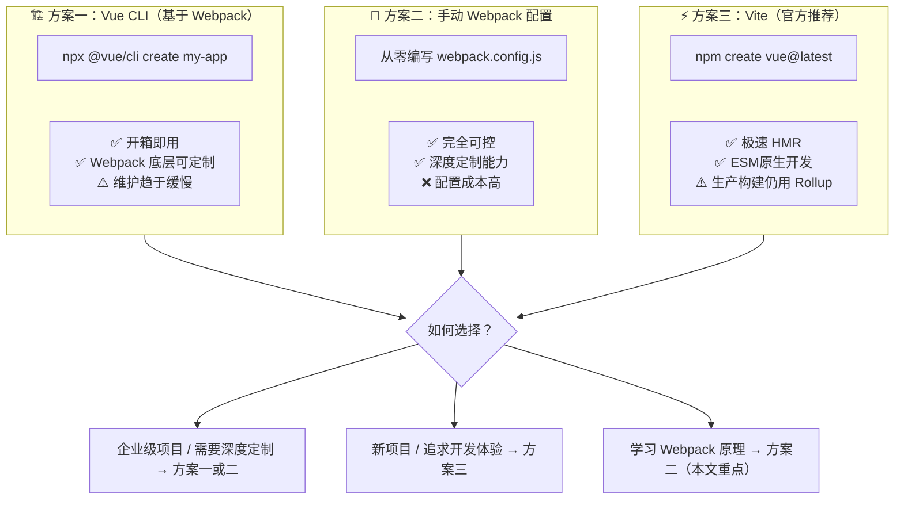
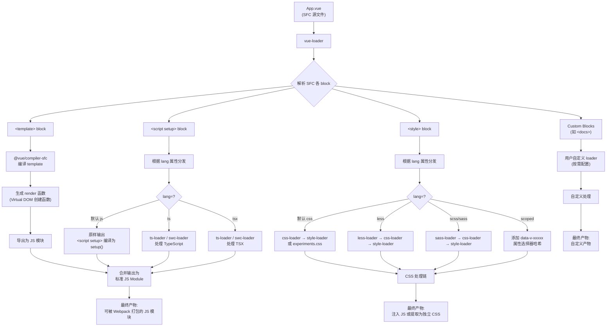
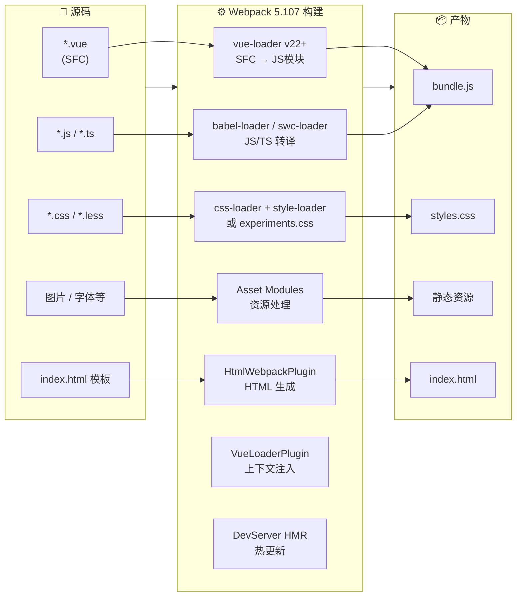
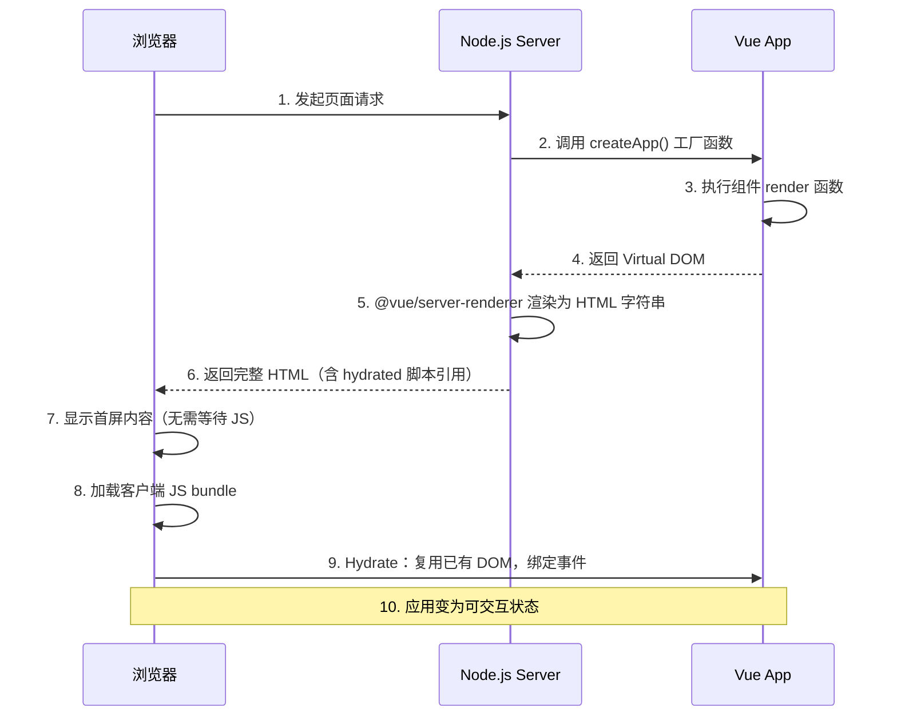

# 如何搭建 Vue 全栈开发环境？

<!--
  title: 如何搭建 Vue 全栈开发环境？
  version: v2
  updateDate: 2026-05-22
  techStack:
    webpack: "5.107"
    vue: "3.4+"
    vueLoader: "22+"
    compilerSfc: "@vue/compiler-sfc (替代 vue-template-compiler)"
    devServer: "webpack-dev-server v5 + webpack-cli 7"
    node: ">=18"
  changelog:
    - 全面升级至 Vue 3.4+ / Webpack 5.107 最佳实践
    - 引入 `<script setup>` 语法糖与 Composition API 示例
    - 使用 `@vue/compiler-sfc` 替代已废弃的 `vue-template-compiler`
    - 新增 Webpack 5 原生 CSS/TypeScript 实验特性（experiments.css / experiments.typescript）
    - 升级 webpack-dev-server v5 配置方式
    - 新增 Vue CLI / 手动 Webpack / Vite 三种方案深度对比
    - 新增 Mermaid 构建流水线图与 SFC 编译流程图
    - 新增 create-webpack-app 脚手架方案介绍
    - SSR 章节适配 Vue 3.4+ API 变更
    - 补充 swc-loader 作为 TypeScript 高性能替代方案
-->


## 📋 v1 → v2 差异对照表

| 维度 | v1（原始版） | v2（当前版） |
|------|-------------|-------------|
| **Webpack** | v5.x（通用配置） | **v5.107**（含 experiments.css / experiments.typescript） |
| **Vue** | Vue 3（Options API 示例） | **Vue 3.4+**（`<script setup>` + Composition API） |
| **vue-loader** | v15.x | **v22+**（CSS Modules 自定义注入选项） |
| **模板编译器** | `vue-template-compiler` | **`@vue/compiler-sfc`**（Vue 3 官方推荐） |
| **TypeScript** | ts-loader | **ts-loader / swc-loader / experiments.typescript** 三选一 |
| **CSS 处理** | css-loader + style-loader | **experiments.css（原生）或传统 Loader 链** |
| **devServer** | webpack-dev-server v4 | **webpack-dev-server v5 + webpack-cli 7** |
| **脚手架** | Vue CLI | **Vue CLI / create-vue(Vite) / create-webpack-app** |
| **流程图** | 无 | **Mermaid 构建流水线图 + SFC 编译流程图** |
| **方案对比** | 仅提及 Vite | **三种方案深度对比（决策矩阵）** |

---

## 引言

传统 Web 开发通常会强调将页面的 HTML、CSS、JavaScript 代码分开用不同文件承载，这种思维本质上是将页面层级的结构、样式、逻辑分离成不同关注点；而现代 MVVM 框架，包括 React、Vue、Angular，则强调在组件内完成所有结构、样式、逻辑定义，从而进一步缩小关注点粒度，降低开发者心智负担。

以 Vue 3.4+ 为例，通常可以选择使用 **Vue SFC（Single File Component）** 形式编写组件代码，并使用 `<script setup>` 语法糖：

```html
<template>
  <div class="hello">
    <h3>{{ message }}</h3>
    <button @click="increment">count: {{ count }}</button>
  </div>
</template>

<script setup>
import { ref } from 'vue'

const message = ref('Hello World')
const count = ref(0)
const increment = () => count.value++
</script>

<style scoped>
h3 {
  margin: 40px 0 0;
  color: #42b983;
}
</style>
```

> **v2 更新说明**：上述示例已从 v1 的 Options API（`export default { data() {...} }`）升级为 Vue 3.4+ 推荐的 **`<script setup>` + Composition API** 写法。`<script setup>` 是编译时宏，相比普通 `<script>` 具有更好的类型推导性能、更少的样板代码，且是当前 Vue 社区的最佳实践。

这种将整个页面拆解成组件的开发方式能够极大降低页面开发的复杂度，提升开发效率，但代价则是需要搭建一套适用的工程化环境，将 MVVM 框架组件转换为能够被普通浏览器兼容、运行的 HTML、CSS、JavaScript 代码。

本文将递进介绍使用 **Webpack 5.107** 搭建 **Vue 3.4+** 应用开发环境的主要方法，包括：

- 如何使用 `vue-loader` v22+ 处理 Vue SFC 文件？
- 如何使用 `html-webpack-plugin`、`webpack-dev-server` v5 运行 Vue 应用？
- 如何在 Vue SFC 中复用 TypeScript、Less、Pug 等编译工具？
- 如何利用 Webpack 5 原生 CSS / TypeScript 实验特性简化配置？
- 如何搭建 Vue SSR 环境（适配 Vue 3.4+ API）？
- **Vue CLI / 手动 Webpack / Vite 三种方案如何选择？**

---

## 方案总览：三条路线

在正式深入配置细节之前，我们先从宏观层面理解搭建 Vue 开发环境的三条主流路线：



### 三种方案详细对比

| 对比维度 | Vue CLI（Webpack 底层） | 手动 Webpack 配置 | Vite（create-vue） |
|---------|----------------------|------------------|-------------------|
| **底层构建工具** | Webpack 5 | Webpack 5.107 | 开发：esbuild；生产：Rollup |
| **配置难度** | ⭐ 低（交互式选择） | ⭐⭐⭐⭐⭐ 高（全手写） | ⭐ 低（交互式选择） |
| **HMR 速度** | 较慢（秒级） | 取决于优化程度 | **极快（毫秒级）** |
| **生产构建稳定性** | ✅ 成熟稳定 | ✅ 完全可控 | ✅ 稳定（Rollup） |
| **插件生态丰富度** | ⭐⭐⭐⭐⭐ 最丰富 | ⭐⭐⭐⭐⭐ 最丰富 | ⭐⭐⭐ 快速增长中 |
| **深度定制灵活性** | ⭐⭐⭐ 中等（受限于 CLI 抽象） | ⭐⭐⭐⭐⭐ 最高 | ⭐⭐⭐ 中等（插件 API） |
| **学习价值** | ⭐⭐ 偏黑盒 | ⭐⭐⭐⭐⭐ 最高 | ⭐⭐⭐ 较高 |
| **维护状态** | **默认进入维护模式**（Vue 官方推荐转向 Vite） | 持续演进（Webpack 5.107+） | **活跃开发（Vue 官方首推）** |
| **适用场景** | 遗留项目迁移、团队已有 CLI 规范 | 需要极致定制、学习原理、monorepo 统一构建 | 新项目首选、原型开发、中小型应用 |

> **核心结论**：虽然 Vite 已成为 Vue 官方推荐的构建工具，但 **Webpack 在以下场景仍具有不可替代的价值**：
> 1. 大型企业应用的深度构建优化（code splitting 策略、module federation）
> 2. Monorepo 下统一构建工具链的需求
> 3. 需要与公司内部 Webpack 插件生态集成的场景
> 4. 对构建产物有精细控制需求的场景
> 5. 学习前端工程化原理的必经之路

---

## 使用 vue-loader v22+ 处理 SFC 代码

### Vue SFC 文件结构

形态上，Vue SFC(Single File Component) 文件(`*.vue`)是使用类 HTML 语法描述 Vue 组件的自定义文件格式，文件由四种类型的顶层语法块组成：

- **`<template>`**：用于指定 Vue 组件模板内容，支持类 HTML、Pug 等语法，其内容会被预编译为 JavaScript 渲染函数；
- **`<script>` / `<script setup>`**：用于定义组件逻辑。Vue 3.4+ 推荐 `<script setup>` 语法糖，编译时会自动将内容包装为 `setup()` 函数；也支持传统的 Options API 写法；
- **`<style>`**：用于定义组件样式，通过配置适当 Loader 可实现 Less、Sass、Stylus 等预处理器语法支持；也可通过添加 `scoped`、`module` 属性将样式封装在当前组件内；
- **Custom Block**：用于满足领域特定需求而预留的 SFC 扩展模块，例如 `<docs>`；Custom Block 通常需要搭配特定工具使用，详情可参考 [Custom Blocks \| Vue Loader](https://vue-loader.vuejs.org/guide/custom-blocks.html)。

### 安装依赖

> **v2 重要变更**：Vue 3 不再使用 `vue-template-compiler`，而是使用 **`@vue/compiler-sfc`** 作为模板编译器。这是 Vue 3 的架构性变更——编译器与运行时完全解耦。

```bash
yarn add -D webpack webpack-cli vue-loader@^22 @vue/compiler-sfc

npm install -D webpack webpack-cli vue-loader@^22 @vue/compiler-sfc
```

### 基础 Webpack 配置

```js
// webpack.config.js
const { VueLoaderPlugin } = require('vue-loader')

module.exports = {
  mode: 'development',
  module: {
    rules: [
      {
        test: /\.vue$/,
        use: ['vue-loader'],
      },
    ],
  },
  plugins: [
    // vue-loader v22+ 必须配合此插件使用
    new VueLoaderPlugin(),
  ],
}
```

> **提示**：`vue-loader` 库同时提供用于处理 SFC 代码转译的 Loader 组件，与用于处理上下文兼容性的 Plugin 组件，两者需要同时配置才能正常运行。这是 vue-loader 的经典"Loader + Plugin"配对模式——Plugin 负责把配置中的其它模块处理规则（如 CSS、预处理器规则）关联应用到 SFC 拆分出的各个语言块上，这是二者必须同时配置的原因。

### Vue SFC 编译流程详解

经过 `vue-loader` 处理后，SFC 各个模块会被等价转译为普通 JavaScript 模块。下面用 Mermaid 图详细展示这一过程：



**关键要点解析**：

1. **`<template>` 编译路径**：`vue-loader` 将 `<template>` 内容提取后，交给 `@vue/compiler-sfc` 编译为 `render` 函数。这个 `render` 函数返回 Virtual DOM 的创建指令（即 `h()` / `createElement()` 调用），而非 HTML 字符串。
2. **`<script setup>` 编译路径**：`<script setup>` 是编译时宏，`vue-loader` + `@vue/compiler-sfc` 会将其内容自动包装为 `setup()` 函数，并在编译阶段自动处理 `ref`、`reactive` 等响应式 API 的导入，无需手动 `import`。
3. **`<style>` 编译路径**：CSS 内容会根据 `lang` 属性分发给对应的预处理 Loader 链，最终通过 `css-loader` 解析 `@import` / `url()`，再由 `style-loader` 注入到页面中（开发模式）或由 `MiniCssExtractPlugin` 提取为独立文件（生产模式）。

### CSS 处理配置

注意，上例 Webpack 配置还无法处理 CSS 代码，若此时添加 `<style>` 模块将导致报错。为此需要添加处理 CSS 的规则：

#### 方案 A：传统 Loader 链（兼容性最好）

```js
const { VueLoaderPlugin } = require('vue-loader')

module.exports = {
  mode: 'development',
  module: {
    rules: [
      { test: /\.vue$/, use: ['vue-loader'] },
      {
        test: /\.css$/,
        use: ['style-loader', 'css-loader'],
      },
    ],
  },
  plugins: [new VueLoaderPlugin()],
}
```

#### 方案 B：Webpack 5 原生 CSS 支持（experiments.css）

> **v2 新增**：Webpack 5.107+ 提供了实验性的原生 CSS 支持，无需 css-loader 和 style-loader：

```js
const { VueLoaderPlugin } = require('vue-loader')

module.exports = {
  mode: 'development',
  experiments: {
    // 启用原生 CSS 支持（Webpack 5.107+ 实验特性）
    css: true,
  },
  module: {
    rules: [
      { test: /\.vue$/, use: ['vue-loader'] },
    ],
  },
  plugins: [new VueLoaderPlugin()],
}
```

> **注意**：`experiments.css` 目前仍是实验性功能，生产环境建议继续使用方案 A 的传统 Loader 链以确保稳定性。启用后，Webpack 会原生解析 CSS 的 `@import` 和 `url()` 语法，并将 CSS 作为独立的 asset module 类型处理。

---

## 运行页面

上例接入的 `vue-loader` 使得 Webpack 能够正确理解、翻译 Vue SFC 文件的内容，接下来我们还需要让页面真正运行起来，这里会用到：

- 使用 `html-webpack-plugin` 自动生成 HTML 页面；
- 使用 **webpack-dev-server v5** 让页面真正运行起来，并具备热更新能力。

### html-webpack-plugin 配置

`html-webpack-plugin` 是一款根据编译产物自动生成 HTML 文件的 Webpack 插件，借助这一插件我们无需手动维护产物数量、路径、hash 值更新等问题。

```bash
yarn add -D html-webpack-plugin
```

```js
// webpack.config.js
const path = require('path')
const { VueLoaderPlugin } = require('vue-loader')
const HtmlWebpackPlugin = require('html-webpack-plugin')

module.exports = {
  mode: 'development',
  entry: './src/main.js',
  output: {
    path: path.resolve(__dirname, 'dist'),
    clean: true,
  },
  module: {
    rules: [{ test: /\.vue$/, use: ['vue-loader'] }],
  },
  plugins: [
    new VueLoaderPlugin(),
    new HtmlWebpackPlugin({
      title: 'Vue + Webpack App',
      templateContent: `
<!DOCTYPE html>
<html>
  <head>
    <meta charset="utf-8">
    <meta name="viewport" content="width=device-width, initial-scale=1.0">
    <title>Webpack App</title>
  </head>
  <body>
    <div id="app" />
  </body>
</html>
      `,
    }),
  ],
  resolve: {
    extensions: ['.js', '.vue', '.json'],
  },
}
```

### webpack-dev-server v5 配置

> **v2 重要变更**：webpack-dev-server v5 配置方式有显著变化，且需要配合 **webpack-cli v7** 使用。

```bash
yarn add -D webpack-dev-server@^5 webpack-cli@^7
```

```js
// webpack.config.js（追加 devServer 配置）
const path = require('path')
const { VueLoaderPlugin } = require('vue-loader')
const HtmlWebpackPlugin = require('html-webpack-plugin')

module.exports = {
  mode: 'development',
  entry: './src/main.js',
  output: {
    path: path.resolve(__dirname, 'dist'),
    clean: true,
  },
  devServer: {
    // webpack-dev-server v5 配置
    port: 3000,
    hot: true,
    open: true,
    // 开发服务器静态文件目录
    static: {
      directory: path.join(__dirname, 'public'),
    },
    // 历史模式 SPA fallback
    historyApiFallback: true,
    // 客户端日志级别
    client: {
      logging: 'info',
      overlay: {
        errors: true,
        warnings: false,
      },
    },
  },
  module: {
    rules: [
      { test: /\.vue$/, use: ['vue-loader'] },
      { test: /\.css$/, use: ['style-loader', 'css-loader'] },
    ],
  },
  plugins: [
    new VueLoaderPlugin(),
    new HtmlWebpackPlugin({
      templateContent: `
<!DOCTYPE html>
<html>
  <head>
    <meta charset="utf-8">
    <title>Webpack App</title>
  </head>
  <body>
    <div id="app" />
  </body>
</html>
      `,
    }),
  ],
  resolve: {
    extensions: ['.js', '.vue', '.json'],
  },
}
```

**v5 主要配置变化说明**：

| 配置项 | v4 用法 | v5 用法 | 说明 |
|-------|--------|--------|------|
| `contentBase` | `contentBase: './public'` | **已移除**，改用 `static.directory` | 静态文件目录配置重构 |
| `overlay` | `overlay: true` | **移入** `client.overlay` | 错误遮罩层配置位置变更 |
| `publicPath` | 顶层配置 | **移入** `client` 或 `devMiddleware` | 公共路径配置重构 |
| `historyApiFallback` | 顶层布尔值 | 顶层对象或布尔值 | 支持更精细的 rewrite 规则 |
| 启动命令 | `npx webpack serve` | `npx webpack serve`（需 webpack-cli 7） | 命令不变，但依赖版本要求更高 |

之后，运行 `npx webpack serve` 命令，即可自动打开带热更新功能的开发服务器页面。

### 入口文件（main.js）

不要忘记创建 Vue 应用的入口文件：

```js
// src/main.js
import { createApp } from 'vue'
import App from './App.vue'

createApp(App).mount('#app')
```

### 完整 Vue + Webpack 构建流水线



---

## 复用其它编译工具

到这里，我们还是在用原生 JavaScript、CSS 编写 Vue 组件代码，在现代 Web 开发中，我们通常还会搭配其它工程化工具力求提升开发效率、质量。好消息是经过精妙的设计，`vue-loader` 能够复合使用其它 Webpack Loader 的能力处理各个模块内容，包括：

- 使用 `swc-loader`、`ts-loader` 等处理 SFC 的 `<script>` / `<script setup>` 模块；
- 使用 `less-loader`、`sass-loader` 等处理 `<style>` 模块；
- 使用 `pug-plain-loader` 等处理 `<template>` 模块。

为了达到这种效果，用法上我们需要为每种模块配置相应的 Webpack 处理规则，并正确设置模块的 `lang` 属性值。

### TypeScript 支持（三种方案）

#### 方案 A：ts-loader（传统方案）

```bash
npm install -D typescript ts-loader
```

```js
module.exports = {
  module: {
    rules: [
      { test: /\.vue$/, use: ['vue-loader'] },
      {
        test: /\.ts$/,
        use: ['ts-loader'],
        exclude: /node_modules/,
      },
    ],
  },
  resolve: {
    extensions: ['.ts', '.js', '.vue', '.json'],
  },
}
```

```vue
<script setup lang="ts">
import { ref } from 'vue'

interface MessageProps {
  text: string
  count: number
}

const message = ref<string>('Hello World')
const count = ref<number>(0)

const props = defineProps<MessageProps>()
</script>
```

#### 方案 B：swc-loader（高性能方案，推荐）

> **v2 新增**：[swc](https://swc.rs/) 是基于 Rust 编写的 JavaScript/TypeScript 编译器，比 ts-loader 快 **20 倍以上**，是当前主流的高性能替代方案。

```bash
npm install -D swc-loader @swc/core
```

```js
module.exports = {
  module: {
    rules: [
      { test: /\.vue$/, use: ['vue-loader'] },
      {
        test: /\.(tsx?|jsx?)$/,
        use: {
          loader: 'swc-loader',
          options: {
            jsc: {
              parser: {
                syntax: 'typescript',
                tsx: true,
              },
              target: 'es2020',
            },
          },
        },
        exclude: /node_modules/,
      },
    ],
  },
}
```

#### 方案 C：experiments.typescript（Webpack 5.107+ 实验特性）

> **v2 新增**：Webpack 5.107+ 内置了实验性的 TypeScript 支持，无需额外安装 Loader：

```js
module.exports = {
  experiments: {
    // Webpack 5.107+ 原生 TypeScript 支持
    typescript: {
      // 配置选项（可选）
      configFile: path.resolve(__dirname, 'tsconfig.json'),
    },
  },
  module: {
    rules: [
      { test: /\.vue$/, use: ['vue-loader'] },
    ],
  },
}
```

> **三种 TS 方案对比**：
>
> | 方案 | 编译速度 | 类型检查 | 成熟度 | 推荐场景 |
> |-----|---------|---------|-------|---------|
> | ts-loader | 慢（tsc 基准） | ✅ 完整 | ⭐⭐⭐⭐⭐ | 需要完整类型检查的项目 |
> | **swc-loader** | **极快（20x+）** | ⚠️ 仅擦除类型 | ⭐⭐⭐⭐ | **追求构建速度的首选** |
> | experiments.ts | 快（内置） | ⚠️ 仅擦除类型 | ⭐⭐（实验中） | 尝试新特性的前沿项目 |

### Less / Sass / Stylus 支持

以 Less 为例，首先安装依赖：

```bash
yarn add -D less less-loader css-loader style-loader
```

其次，修改 Webpack 配置，添加 Less 文件相关处理规则：

```js
module.exports = {
  module: {
    rules: [
      { test: /\.vue$/, use: ['vue-loader'] },
      {
        test: /\.less$/,
        use: ['style-loader', 'css-loader', 'less-loader'],
      },
    ],
  },
  plugins: [new VueLoaderPlugin()],
}
```

之后，设置 `<style>` 标签的 `lang="less"`：

```vue
<style lang="less" scoped>
h3 {
  margin: 40px 0 0;
  color: #42b983;
  span {
    font-weight: normal;
  }
}
</style>
```

> **v2 补充**：`scoped` 属性会为当前组件的样式添加 `data-v-xxxxx` 哈希属性选择器，实现样式隔离。此外还可以使用 `module` 属性启用 **CSS Modules**：

```vue
<!-- CSS Modules 模式 -->
<style lang="less" module>
.title {
  color: #42b983;
  & .subtitle {
    font-weight: normal;
  }
}
</style>

<script setup>
import { useCssModule } from 'vue'
// 默认样式模块
const style = useCssModule()
</script>

<template>
  <h3 :class="style.title">{{ message }}</h3>
</template>
```

### Pug 模板支持

`<template>` 的处理规则会稍微不同，因为绝大部分 Webpack 模板类 Loader 都会返回一个模板函数，而不是编译好的 HTML 片段，这与 Vue SFC 将 `<template>` 编译为 `render` 函数的规则相冲突，此时通常需要使用一个返回原始的 HTML 字符串的 loader，例如使用 **`pug-plain-loader`**，而不是 `pug-loader`。

```bash
yarn add -D pug pug-plain-loader
```

```js
module.exports = {
  module: {
    rules: [
      { test: /\.pug$/, use: ['pug-plain-loader'] },
      { test: /\.vue$/, use: ['vue-loader'] },
    ],
  },
  plugins: [new VueLoaderPlugin()],
}
```

```vue
<template lang="pug">
div.hello
  h3 {{ message }}
  button(@click="increment") count: {{ count }}
</template>
```

### 完整综合配置示例

```js
// webpack.config.js — 完整版
const path = require('path')
const { VueLoaderPlugin } = require('vue-loader')
const HtmlWebpackPlugin = require('html-webpack-plugin')
const MiniCssExtractPlugin = require('mini-css-extract-plugin')

module.exports = {
  mode: 'production',
  entry: './src/main.js',
  output: {
    path: path.resolve(__dirname, 'dist'),
    filename: '[name].[contenthash:8].js',
    clean: true,
  },
  resolve: {
    extensions: ['.js', '.ts', '.vue', '.json', '.less'],
  },
  module: {
    rules: [
      // Vue SFC 处理
      {
        test: /\.vue$/,
        use: ['vue-loader'],
      },

      // TypeScript（swc-loader 高性能方案）
      {
        test: /\.ts$/,
        use: {
          loader: 'swc-loader',
          options: {
            jsc: {
              parser: { syntax: 'typescript', tsx: false },
              target: 'es2020',
            },
          },
        },
        exclude: /node_modules/,
      },

      // Less 样式处理（生产模式提取为独立文件）
      {
        test: /\.less$/,
        use: [
          MiniCssExtractPlugin.loader,
          'css-loader',
          {
            loader: 'less-loader',
            options: {
              lessOptions: {
                javascriptEnabled: true,
              },
            },
          },
        ],
      },

      // Pug 模板处理
      {
        test: /\.pug$/,
        use: ['pug-plain-loader'],
      },

      // 静态资源处理（Webpack 5 Asset Modules）
      {
        test: /\.(png|jpe?g|gif|svg|webp)$/i,
        type: 'asset',
        parser: {
          dataUrlCondition: {
            maxSize: 8 * 1024, // 8KB 以下转为 base64 inline
          },
        },
        generator: {
          filename: 'images/[name].[contenthash:8][ext]',
        },
      },
    ],
  },
  plugins: [
    new VueLoaderPlugin(),
    new HtmlWebpackPlugin({
      title: 'Vue 3 + Webpack 5 App',
      template: './public/index.html',
    }),
    new MiniCssExtractPlugin({
      filename: 'styles/[name].[contenthash:8].css',
    }),
  ],

  // 优化配置
  optimization: {
    splitChunks: {
      chunks: 'all',
      cacheGroups: {
        vendor: {
          test: /[\\/]node_modules[\\/]/,
          name: 'vendor',
          chunks: 'all',
        },
      },
    },
  },
}
```

---

## 使用 Server Side Render (SSR)

通常，Vue.js 程序会被构建为一套纯客户端运行的 SPA(Single Page Application) 应用，相比于传统的服务端渲染技术，SPA 已经能解决许多前后端协作的开发效率、性能问题，但却很自然地引入一些新的问题：

- **SEO 不友好**：大多数搜索引擎对网页内容的解读都依赖于同步 HTML 内容 —— SPA 应用初始加载时往往只是一个空壳，爬虫无法获取有意义的内容；
- **Time-To-Content 更长**：由于客户端需要等待所有 JavaScript 资源都加载完毕后，才会开始渲染页面真正有意义的内容，所以 TTC 时间相对更长。

**SSR (Server Side Render)** 正是为了解决这些问题而出现的技术。本质上，SSR 是一种在服务端将组件渲染为 HTML 字符串并发送到浏览器，最后在浏览器上将这些 HTML 片段 **"激活(Hydrate)"** 为可交互应用的技术。

### SSR 原理概览



在 Vue 场景下，通常可以选择 [Nuxt](https://nuxt.com/)、[Quasar](https://quasar.dev/)、[`@vue/server-renderer`](https://vuejs.org/guide/scaling-up/ssr) 等方案实现 SSR。

### 手动搭建 SSR 环境

接下来，我们使用 **Webpack 5.107**、**Vue 3.4+**、Express、`@vue/server-renderer` 搭建一套完备的 Vue SSR 应用。

#### 项目目录结构

```bash
├─ package.json
├─ server.js                          # Express 服务端入口
├─ src/
│  ├─ App.vue                         # 根组件
│  ├─ main.js                         # 客户端入口
│  └─ entry-server.js                 # 服务端入口
├─ webpack.base.js                    # 公共 Webpack 配置
├─ webpack.client.js                  # 客户端构建配置
└─ webpack.server.js                  # 服务端构建配置
```

#### 步骤一：准备 Entry 文件

需要为客户端、服务端环境分别准备项目 Entry 文件：

**`src/main.js`（客户端入口）：**

```js
import { createApp } from 'vue'
import App from './App.vue'

createApp(App).mount('#app')
```

**`src/entry-server.js`（服务端入口）：**

```js
import { createSSRApp } from 'vue'
import App from './App.vue'

export default function () {
  const app = createSSRApp(App)
  return { app }
}
```

> **关键区别**：客户端使用 `createApp` 并立即 `mount`；服务端使用 `createSSRApp` 并返回工厂函数（不执行 mount）。`createSSRApp` 会禁用客户端特有的激活逻辑（如 `beforeMount` / `mounted` 中对 `window` / `document` 的直接访问），使组件在 Node.js 环境安全运行。

#### 步骤二：公共 Webpack 配置

```js
// webpack.base.js
const path = require('path')
const { VueLoaderPlugin } = require('vue-loader')

module.exports = {
  mode: 'production',
  module: {
    rules: [
      {
        test: /\.vue$/,
        use: ['vue-loader'],
      },
      {
        test: /\.js$/,
        exclude: /node_modules/,
        use: 'swc-loader',
      },
      {
        test: /\.css$/,
        use: ['vue-style-loader', 'css-loader'],
      },
    ],
  },
  plugins: [new VueLoaderPlugin()],
  resolve: {
    extensions: ['.js', '.vue', '.json'],
  },
}
```

#### 步骤三：客户端构建配置

```js
// webpack.client.js
const path = require('path')
const { merge } = require('webpack-merge') // 或 webpack-merge v6+
const HtmlWebpackPlugin = require('html-webpack-plugin')
const { WebpackManifestPlugin } = require('webpack-manifest-plugin')
const base = require('./webpack.base')

module.exports = merge(base, {
  entry: {
    client: path.join(__dirname, './src/main.js'),
  },
  output: {
    path: path.resolve(__dirname, './dist'),
    publicPath: '/',
    filename: '[name].[contenthash:8].js',
  },
  plugins: [
    new WebpackManifestPlugin({ fileName: 'manifest-client.json' }),
    new HtmlWebpackPlugin({
      templateContent: `
<!DOCTYPE html>
<html>
<head>
  <meta charset="utf-8">
  <title>Vue SSR Example</title>
</head>
<body>
  <div id="app"></div>
</body>
</html>
      `,
    }),
  ],
})
```

#### 步骤四：服务端构建配置

```js
// webpack.server.js
const path = require('path')
const { merge } = require('webpack-merge')
const { WebpackManifestPlugin } = require('webpack-manifest-plugin')
const base = require('./webpack.base')

module.exports = merge(base, {
  entry: {
    server: path.join(__dirname, './src/entry-server.js'),
  },
  target: 'node',
  output: {
    path: path.resolve(__dirname, './dist'),
    filename: '[name].js',
    libraryTarget: 'commonjs2',
    clean: true,
  },
  module: {
    rules: [
      {
        test: /\.css$/,
        use: [
          // 服务端必须使用 vue-style-loader（而非 style-loader）
          // 因为 vue-style-loader 能在 SSR 模式下收集 CSS 字符串
          'vue-style-loader',
          {
            loader: 'css-loader',
            options: {
              esModule: false, // SSR 模式下必须关闭 ES Module 化
            },
          },
        ],
      },
    ],
  },
  plugins: [
    new WebpackManifestPlugin({ fileName: 'manifest-server.json' }),
  ],
})
```

> **为什么服务端要用 `vue-style-loader`？**
>
> `style-loader` 在浏览器环境下通过动态插入 `<style>` 标签来注入样式，但在 Node.js 环境中没有 DOM，无法工作。`vue-style-loader` 是专为 SSR 设计的变体，它在服务端渲染时会将 CSS 收集为字符串（配合 `@vue/server-renderer` 使用时可自动收集并注入到 HTML 中），方便后续做样式注入或 CSS 外链处理。

#### 步骤五：Express 服务端代码

```js
// server.js
const express = require('express')
const path = require('path')
const { renderToString } = require('@vue/server-renderer')

const clientManifest = require('./dist/manifest-client.json')
const serverManifest = require('./dist/manifest-server.json')
const serverBundle = path.join(
  __dirname,
  './dist',
  serverManifest['server.js']
)
const createApp = require(serverBundle).default

const server = express()

server.use(express.static('./dist'))

server.get('/', async (req, res) => {
  const { app } = createApp()

  try {
    const html = await renderToString(app)
    const clientBundle = clientManifest['client.js']

    res.send(`
<!DOCTYPE html>
<html>
  <head>
    <title>Vue SSR Example</title>
  </head>
  <body>
    <!-- 服务端渲染的 HTML -->
    <div id="app">${html}</div>
    <!-- 客户端 Hydrate 脚本 -->
    <script src="${clientBundle}"></script>
  </body>
</html>
    `)
  } catch (err) {
    console.error(err)
    res.status(500).send('Internal Server Error')
  }
})

server.listen(3000, () => {
  console.log('SSR server running at http://localhost:3000')
})
```

#### 步骤六：构建并运行

```bash
yarn add express @vue/server-renderer
yarn add -D webpack-merge webpack-manifest-plugin vue-style-loader

npx webpack --config ./webpack.client.js
npx webpack --config ./webpack.server.js

node server.js
```

#### Vue SFC 示例（App.vue）

```vue
<template>
  <div :class="['main', cls]">
    <h3>{{ message }}</h3>
    <button @click="toggle">Toggle</button>
  </div>
</template>

<script setup>
import { ref, computed } from 'vue'

const isActive = ref(false)
const message = ref('Hello World')
const cls = computed(() => (isActive.value ? 'activate' : 'deactivate'))

function toggle() {
  isActive.value = !isActive.value
}
</script>

<style>
h3 {
  color: #42b983;
}
.main {
  position: fixed;
  top: 0;
  left: 0;
  bottom: 0;
  right: 0;
  padding: 20px 12px;
  transition: background 0.3s linear;
}
.activate {
  background: #000;
  color: #fff;
}
.deactivate {
  background: #fff;
}
</style>
```

> **提示**：
> - 这里选择 `@vue/server-renderer` 仅出于演示目的，实际生产环境建议使用更成熟、完备的框架方案，如 **Nuxt 3**、**Quasar**。
> - SSR 不是银弹，带来了更高的架构复杂度和服务端负载压力。对于 SEO 需求但不要求实时动态内容的场景（如官网、文档站），可以考虑 **SSG（Static Site Generation）** 方案。

---

## 使用 Static Site Generation (SSG)

SSR 不是银弹，依然带来了不少新问题：

- 更高的架构复杂度，意味着更高的维护、扩展、学习成本；
- Node 与浏览器环境不完全匹配，部分浏览器特定的代码只能在特定生命周期钩子中使用；
- 一些外部库可能需要特殊处理才能在 SSR 中运行；
- 服务端负载更高，需要在 Node 进程中执行大量 CPU 运算以渲染 HTML。

因此，对于内容相对静态的应用（如公司官网、营销活动页、文档站等），可以使用 **SSG（Static Site Generation）** 方式，在编译构建阶段提前生成各页面的静态 HTML 代码，既能满足 SEO 需求，又能尽可能降低架构复杂度。

### SSG 方案选择

| 方案 | 底层 | 适用场景 | 备注 |
|-----|------|---------|------|
| **Nuxt 3** (nitro) | Rollup / Webpack | 全栈 Vue 应用 | **最推荐**，内置 SSG/SSR/SPA 模式切换 |
| **Vite SSG** (`vite-plugin-ssg`) | Vite (esbuild) | 轻量级静态站点 | 基于 Vite，构建速度极快 |
| **prerender-spa-plugin** | Puppeteer | 遗留 SPA 项目预渲染 | **不兼容 Webpack 5**，不推荐新项目使用 |
| **自定义脚本** | `@vue/server-renderer` | 完全自定义需求 | 参考 SSR 章节，在构建时遍历路由批量渲染 |

> **v2 说明**：在 Webpack 4 时代常用的 `prerender-spa-plugin` 由于依赖 Puppeteer 且内部机制与 Webpack 5 的 chunk 图不兼容，目前无法正常工作。对于 Webpack 5 项目，建议迁移到 Nuxt 3 或自行基于 `@vue/server-renderer` 实现 SSG 脚本。

---

## 脚手架工具

综上，手动配置 Vue + Webpack 开发环境的过程是非常复杂且繁琐的。社区已经将大量重复、被验证有效的模式封装成开箱即用的脚手架工具：

### 1. Vue CLI（基于 Webpack）

```bash
npx @vue/cli create my-app
```

Vue CLI 是基于 Webpack 搭建的 Vue 项目脚手架工具，提供多媒体资源处理、SFC 文件处理、dev-server、HMR、自动化测试、ESLint、Babel 等功能。

> **重要提示**：Vue CLI 已于 **2024 年底正式进入维护模式**（Maintenance Mode），Vue 官方明确推荐新项目使用 **create-vue（Vite）** 作为脚手架。但现有的大量企业项目仍然运行在 Vue CLI + Webpack 技术栈上，理解和掌握其底层 Webpack 配置仍有重要价值。

通过 `vue.config.js` 可以修改底层 Webpack 配置：

```js
// vue.config.js
module.exports = {
  chainWebpack: (config) => {
    config.module
      .rule('vue')
      .use('vue-loader')
      .tap((options) => {
        // 自定义 vue-loader 选项
        return options
      })
  },
  configureWebpack: {
    // 直接合并 Webpack 配置
    resolve: {
      alias: {
        '@': path.resolve(__dirname, 'src'),
      },
    },
  },
}
```

### 2. create-vue（基于 Vite，官方推荐）

```bash
npm create vue@latest my-app
```

这是 Vue 官方目前主推的脚手架工具，基于 **Vite** 构建，提供：

- ⚡ 极速的冷启动（基于原生 ESM，无需打包）
- ⚡ 即时的热模块替换（HMR）
- 🔧 真正的按需编译（无论应用大小）
- 📦 优化的构建输出（Rollup 打包）

### 3. create-webpack-app（Webpack 官方脚手架）

> **v2 新增**：Webpack 官方提供了自己的脚手架工具，可以快速创建包含 Vue 支持的 Webpack 项目：

```bash
npm create webpack-app@latest my-app -- --template vue
```

这会生成一个开箱即用的 Webpack 5 + Vue 3 项目，包含：
- vue-loader v22+ 配置
- webpack-dev-server v5
- 基础的 CSS / TypeScript 支持
- 生产构建优化配置

生成的项目结构清晰，适合作为手动定制的基础起点。

---

## 总结

本文详细介绍了如何使用 **Webpack 5.107** 开发 **Vue 3.4+** 应用，涵盖以下核心内容：

| 主题 | 关键技术点 |
|------|----------|
| **SFC 编译** | vue-loader v22+ + `@vue/compiler-sfc` + VueLoaderPlugin |
| **开发服务器** | webpack-dev-server v5 + webpack-cli 7 + HMR |
| **TypeScript** | ts-loader / swc-loader / experiments.typescript 三选一 |
| **CSS 处理** | 传统 Loader 链 或 experiments.css（实验特性） |
| **预处理器集成** | Less / Sass / Pug 通过 `lang` 属性 + 对应 Loader |
| **SSR** | 双 Entry + `@vue/server-renderer` + Express + vue-style-loader |
| **方案选择** | Vue CLI / 手动 Webpack / Vite 三者各有适用场景 |

**核心观点**：

1. 虽然 **Vite 已成为 Vue 官方推荐的构建工具**，凭借极速的 HMR 和优秀的开发体验赢得了大量用户，但 **Webpack 在企业级应用、深度定制、monorepo 统一构建等场景下仍有不可替代的优势**。
2. 理解 vue-loader 的 SFC 编译流程（template→render 函数、script→setup()、style→CSS 处理链），是掌握 Vue 工程化的基础。
3. 从零搭建 Vue + Webpack 环境的过程虽然繁琐，但能帮助你深入理解前端工程化的每一个环节，这对于解决复杂的构建问题和进行深层次优化至关重要。

---

## 思考题

1. 同样用于构建 Vue 应用时，与 Vite 相比，Webpack 有哪些明显优势？在什么场景下你会优先选择 Webpack？
2. `vue-loader` 的 `VueLoaderPlugin` 为什么是必须的？如果去掉它会发生什么？尝试从源码角度分析其作用。
3. SSR 场景下，为什么服务端构建配置要使用 `vue-style-loader` 替代 `style-loader`？两者的实现机制有何不同？
4. 对于 TypeScript 支持，你会在 ts-loader、swc-loader、experiments.typescript 中如何选择？请结合项目规模和团队情况说明理由。
5. 如果让你为一个大型 monorepo 项目统一构建工具（包含 Vue 应用、React 组件库、Node.js 包），你会选择 Webpack 还是 Vite？为什么？

---

## 参考资源

- [Vue 3 官方文档](https://vuejs.org/)
- [vue-loader v22+ 文档](https://vue-loader.vuejs.org/)
- [Webpack 5 官方文档](https://webpack.js.org/)
- [@vue/compiler-sfc GitHub](https://github.com/vuejs/core/tree/main/packages/compiler-sfc)
- [Vite 官方文档](https://vite.dev/)
- [Nuxt 3 文档](https://nuxt.com/)
- [SWC 官方文档](https://swc.rs/)
