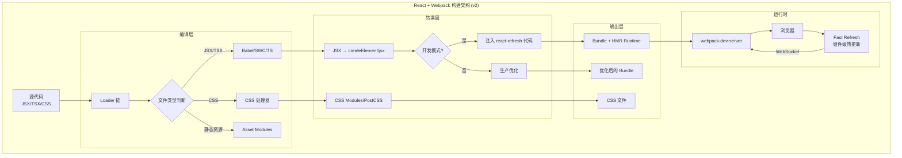
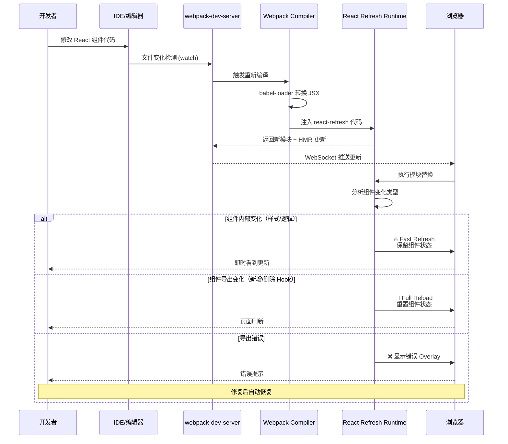
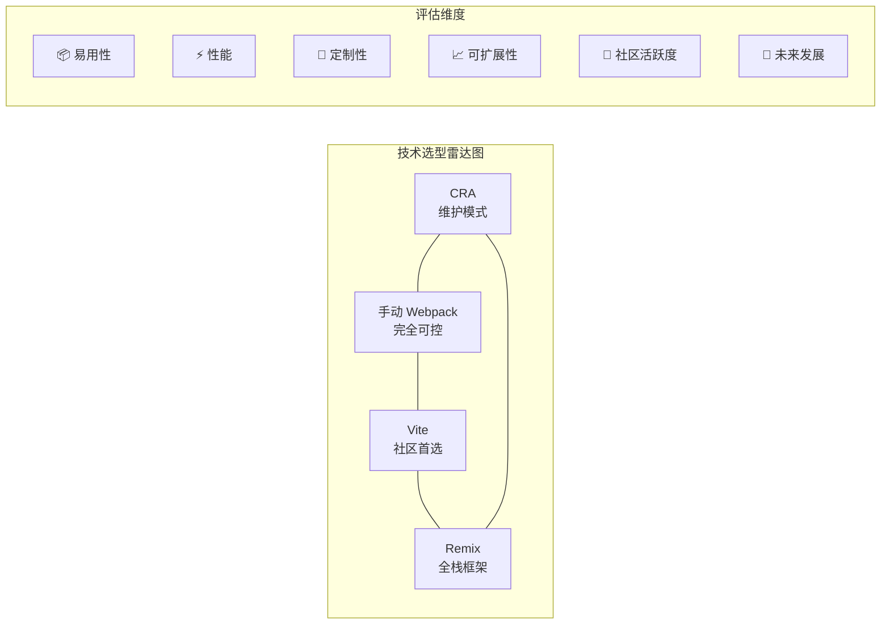

# 如何搭建 React 全栈开发环境？


## 📋 版本差异对照表

| 维度 | v1 (原始版本) | v2 (当前版本) |
|------|--------------|--------------|
| **Webpack 版本** | Webpack 5.x (通用) | Webpack **5.107** (最新稳定版) |
| **React 版本** | React 16/17 | React **18+ / 19** (并发特性、Server Components) |
| **热更新方案** | `react-hot-loader` (已废弃) | **@pmmmwh/react-refresh-webpack-plugin v0.6.2** (Fast Refresh) |
| **JSX 转换** | `@babel/preset-react` (classic/automatic) | **automatic runtime** + **jsxImportSource** + **react-refresh/babel** |
| **TypeScript 方案** | `ts-loader` / `@babel/preset-typescript` | **ts-loader** / **swc-loader** (swc-transformer-react) / **experiments.typescript** |
| **CSS 方案** | css-loader + style-loader | **experiments.css** (原生支持) 或 traditional 方案 |
| **脚手架工具** | Create React App (推荐) | CRA (**维护模式**) → 推荐 **Vite** 或 **Remix** |
| **CLI 工具** | webpack-cli 4.x | **webpack-cli 7** + **create-webpack-app** |
| **SSR 方案** | 基础 SSR 示例 | 支持 **React 19 Server Components** + **Actions** |
| **架构图** | 无 | **Mermaid 构建架构图** + **决策树** |

---

## 目录

1. [React 开发环境演进历程](#1-react-开发环境演进历程)
2. [使用 Babel 加载 JSX 文件](#2-使用-babel-加载-jsx-文件)
3. [Fast Refresh 深度集成方案](#3-fast-refresh-深度集成方案) ⭐
4. [运行页面与开发服务器](#4-运行页面与开发服务器)
5. [复用其它编译工具](#5-复用其它编译工具)
6. [CSS 处理方案对比](#6-css-处理方案对比)
7. [实现 Server Side Render (SSR)](#7-实现-server-side-render-ssr)
8. [React 项目技术选型决策树](#8-react-项目技术选型决策树)
9. [四种主流方案对比](#9-四种主流方案对比)
10. [总结与最佳实践](#10-总结与最佳实践)

---

## 1. React 开发环境演进历程

传统 Web 开发强调样式、结构、逻辑分离，以此降低技术复杂度。但 React 认为渲染逻辑本质上与其它 UI 逻辑存在内在耦合关系，所以提倡将结构、逻辑与样式共同存放在同一文件中，以"组件"这种松散耦合结构实现关注点分离，并为此设计实现了一套 [JavaScript-XML](https://zh-hans.reactjs.org/docs/introducing-jsx.html)(JSX) 技术，以支持在 JavaScript 中编写 Template 代码。

### React 19 新特性概览

```javascript
// React 19 新特性示例
import { use, useActionState, useOptimistic } from 'react';

// 1. use() Hook - 在组件中读取 Promise 和 Context
function Comment({ commentPromise }) {
  const comment = use(commentPromise); // 自动 suspense
  return <p>{comment.text}</p>;
}

// 2. Actions - 表单处理简化
async function updateName(name) {
  const error = await updateUserName(name);
  if (error) throw error;
  return '成功更新';
}

// 3. useOptimistic - 乐观更新
function LikeButton({ initialLikes }) {
  const [optimisticLikes, addOptimisticLike] = useOptimistic(
    initialLikes,
    (state, delta) => state + delta
  );
  // ...
}
```

### 核心架构图



---

## 2. 使用 Babel 加载 JSX 文件

绝大多数情况下，我们都会使用 JSX 方式编写 React 组件，但问题在于浏览器并不支持这种代码，为此我们首先需要借助构建工具将 JSX 等价转化为标准 JavaScript 代码。

在 Webpack 中可以借助 `babel-loader`，并使用 React 预设规则集 `@babel/preset-react` ，完成 JSX 到 JavaScript 的转换。

### 2.1 安装依赖（2025 最新版本）

```bash
yarn add -D webpack@5.107.0 webpack-cli@7 babel-loader@9 @babel/core@7 @babel/preset-react@7

yarn add react@19 react-dom@19
yarn add -D @pmmmwh/react-refresh-webpack-plugin@0.6.2 react-refresh@0.14

yarn add -D typescript@5 @babel/preset-typescript@7
```

### 2.2 基础 Webpack 配置

```javascript
const path = require('path');
const HtmlWebpackPlugin = require('html-webpack-plugin');
const ReactRefreshWebpackPlugin = require('@pmmmwh/react-refresh-webpack-plugin');

const isDevelopment = process.env.NODE_ENV !== 'production';

module.exports = {
  mode: isDevelopment ? 'development' : 'production',
  
  entry: './src/index.jsx',
  
  output: {
    path: path.resolve(__dirname, 'dist'),
    filename: isDevelopment ? '[name].js' : '[name].[contenthash].js',
    clean: true,
  },
  
  resolve: {
    extensions: ['.js', '.jsx', '.ts', '.tsx', '.json'],
  },
  
  module: {
    rules: [
      {
        test: /\.[jt]sx?$/,
        exclude: /node_modules/,
        use: {
          loader: 'babel-loader',
          options: {
            presets: [
              ['@babel/preset-react', {
                runtime: 'automatic',  // ✅ 推荐使用 automatic runtime
                development: isDevelopment,
                importSource: undefined, // 自定义 JSX 运行时源
              }],
              '@babel/preset-typescript', // TypeScript 支持
            ],
            plugins: [
              // ✅ 仅在开发环境启用 Fast Refresh
              isDevelopment && require.resolve('react-refresh/babel'),
            ].filter(Boolean),
          },
        },
      },
    ],
  },
  
  plugins: [
    new HtmlWebpackPlugin({
      template: './public/index.html',
    }),
    // ✅ Fast Refresh 插件（仅开发环境）
    isDevelopment && new ReactRefreshWebpackPlugin({
      overlay: {
        sockIntegration: 'webpack-dev-server',
        module: isDevelopment,
      },
    }),
  ].filter(Boolean),
  
  devServer: {
    hot: true, // 启用 HMR
    open: true,
    historyApiFallback: true,
    client: {
      overlay: {
        errors: true,
        warnings: false,
      },
    },
  },
};
```

### 2.3 JSX 转换模式对比

#### Classic Mode（旧模式，不推荐）

```jsx
// 源代码 - 需要 import React
import React from 'react';

const Component = () => {
  return <div className="hello">Hello World</div>;
};

// 编译结果 - classic runtime 调用 React.createElement
var _react = require("react");

var Component = function Component() {
  return /*#__PURE__*/ _react.createElement("div", {
    className: "hello",
    children: "Hello World",
  });
};
```

#### Automatic Mode（推荐）✅

```jsx
// 源代码 - 无需 import React
const Component = () => {
  return <div className="hello">Hello World</div>;
};

// 编译结果 - 自动导入 jsx-runtime
import { jsx as _jsx } from "react/jsx-runtime";

const Component = () => {
  return _jsx("div", {
    className: "hello",
    children: "Hello World",
  });
};
```

**Automatic 模式的优势：**
- ✅ 不需要在每个文件中手动 `import React`
- ✅ 自动导入优化的 `jsx-runtime`（体积更小）
- ✅ 支持 Tree Shaking（未使用的 React API 不会被打包）
- ✅ 为 React Server Components 做好准备

---

## 3. Fast Refresh 深度集成方案 ⭐

> **重要变更**：`react-hot-loader` 已于 2020 年停止维护，官方推荐使用 **Fast Refresh**（由 `@pmmmwh/react-refresh-webpack-plugin` 提供）。这是 React 官方支持的热更新方案，提供更快的更新速度和更好的状态保持能力。

### 3.1 Fast Refresh vs 传统 HMR 对比

| 特性 | react-hot-loader (旧) | Fast Refresh (新) ✅ |
|------|---------------------|---------------------|
| **维护状态** | ❌ 已废弃 (2020) | ✅ 活跃维护 (v0.6.2) |
| **状态保持** | ⚠️ 部分 | ✅ 完善（Hook 状态、ref、闭包） |
| **更新速度** | 较慢 | **快 10-50x** |
| **错误恢复** | ❌ 需要刷新页面 | ✅ 自动恢复 |
| **React 版本** | 16.x | **16.13+ / 17 / 18 / 19** |
| **TypeScript** | 需要额外配置 | ✅ 原生支持 |
| **Server Components** | ❌ 不支持 | ✅ 支持 |

### 3.2 Fast Refresh 工作流程



### 3.3 三种 Loader 集成方案

#### 方案一：Babel Loader（官方推荐）✅

```javascript
// webpack.config.js
const ReactRefreshWebpackPlugin = require('@pmmmwh/react-refresh-webpack-plugin');
const isDevelopment = process.env.NODE_ENV !== 'production';

module.exports = {
  module: {
    rules: [
      {
        test: /\.[jt]sx?$/,
        exclude: /node_modules/,
        use: [
          {
            loader: 'babel-loader',
            options: {
              presets: [
                ['@babel/preset-react', {
                  runtime: 'automatic',
                  development: isDevelopment,
                }],
              ],
              plugins: [
                isDevelopment && 'react-refresh/babel',
              ].filter(Boolean),
            },
          },
        ],
      },
    ],
  },
  plugins: [
    isDevelopment && new ReactRefreshWebpackPlugin(),
  ].filter(Boolean),
};
```

**Babel 配置文件 (.babelrc.json)：**

```json
{
  "presets": [
    ["@babel/preset-react", {
      "runtime": "automatic",
      "development": true
    }]
  ],
  "env": {
    "development": {
      "plugins": ["react-refresh/babel"]
    }
  }
}
```

#### 方案二：SWC Loader（性能最优）⚡

> **优势**：SWC 使用 Rust 编写，比 Babel 快 **20-70 倍**，特别适合大型项目。

```bash
yarn add -D swc-loader@0.2 @swc/core@1.7
```

```javascript
// webpack.config.js
const ReactRefreshWebpackPlugin = require('@pmmmwh/react-refresh-webpack-plugin');
const isDevelopment = process.env.NODE_ENV !== 'production';

module.exports = {
  module: {
    rules: [
      {
        test: /\.[jt]sx?$/,
        exclude: /node_modules/,
        use: {
          loader: 'swc-loader',
          options: {
            jsc: {
              parser: {
                syntax: 'typescript',
                tsx: true,
              },
              transform: {
                react: {
                  runtime: 'automatic',
                  development: isDevelopment,
                  refresh: isDevelopment, // ✅ 启用 Fast Refresh
                },
              },
            },
          },
        },
      },
    ],
  },
  plugins: [
    isDevelopment && new ReactRefreshWebpackPlugin(),
  ].filter(Boolean),
};
```

**SWC 性能对比：**

| 操作 | Babel | SWC | 提升 |
|------|-------|-----|------|
| 1000 个文件编译 | ~12s | ~0.3s | **40x** |
| 首次启动 | ~8s | ~1.5s | **5x** |
| 增量编译 | ~500ms | ~20ms | **25x** |
| 内存占用 | ~400MB | ~80MB | **5x** |

> 上述数据为数量级参考（不同硬件、项目结构下差异较大），实际收益请以自身项目实测为准。

#### 方案三：TS Loader（TypeScript 项目）

```bash
yarn add -D ts-loader@9 react-refresh-typescript
```

```javascript
// webpack.config.js
const ReactRefreshWebpackPlugin = require('@pmmmwh/react-refresh-webpack-plugin');
const ReactRefreshTypeScript = require('react-refresh-typescript').default;
const isDevelopment = process.env.NODE_ENV !== 'production';

module.exports = {
  module: {
    rules: [
      {
        test: /\.[jt]sx?$/,
        exclude: /node_modules/,
        use: {
          loader: 'ts-loader',
          options: {
            transpileOnly: isDevelopment, // ✅ 开发模式跳过类型检查
            getCustomTransformers: () => ({
              before: [
                isDevelopment && ReactRefreshTypeScript(),
              ].filter(Boolean),
            }),
          },
        },
      },
    ],
  },
  plugins: [
    isDevelopment && new ReactRefreshWebpackPlugin(),
  ].filter(Boolean),
};
```

**配合 ForkTsCheckerWebpackPlugin 进行类型检查：**

```javascript
const ForkTsCheckerWebpackPlugin = require('fork-ts-checker-webpack-plugin');

module.exports = {
  plugins: [
    isDevelopment && new ForkTsCheckerWebpackPlugin({
      typescript: {
        diagnosticOptions: {
          semantic: true,
          syntactic: true,
        },
      },
    }),
  ].filter(Boolean),
};
```

### 3.4 高级配置选项

```javascript
new ReactRefreshWebpackPlugin({
  // 错误覆盖层配置
  overlay: {
    sockIntegration: 'webpack-dev-server', // or 'webpack-hot-middleware'
    sockHost: undefined,
    sockPort: undefined,
    sockPath: '/ws',
    module: isDevelopment,
    entry: undefined,
    moduleUrlPrefix: '',
    warnings: false, // 是否显示警告
    errors: true,   // 是否显示错误
  },
  
  // 排除特定模块
  exclude: [
    /node_modules\/some-package/,
  ],
  
  // 包含特定模块（默认所有 .[jt]sx? 文件）
  include: undefined,
  
  // 自定义资源根目录
  resourceRoot: '/src',
});
```

### 3.5 常见问题排查

| 问题 | 原因 | 解决方案 |
|------|------|----------|
| Fast Refresh 不生效 | 忘记添加 `react-refresh/babel` 插件 | 检查 Babel 配置 |
| 状态丢失 | 组件导出方式改变 | 保持稳定的导出结构 |
| 全屏刷新而非局部更新 | Hook 数量或顺序改变 | 使用 `eslint-plugin-react-hooks` |
| 错误后无法恢复 | 未正确配置 overlay | 确保 `overlay.module: true` |
| TypeScript 类型错误 | `transpileOnly: true` 跳过检查 | 使用 ForkTsCheckerWebpackPlugin |

---

## 4. 运行页面与开发服务器

### 4.1 HTML 模板配置

```javascript
const HtmlWebpackPlugin = require('html-webpack-plugin');
const path = require('path');

module.exports = {
  // ...其他配置
  
  plugins: [
    new HtmlWebpackPlugin({
      template: path.resolve(__dirname, 'public/index.html'),
      inject: true, // 自动注入 script 标签
      minify: !isDevelopment ? {
        removeComments: true,
        collapseWhitespace: true,
        removeRedundantAttributes: true,
        useShortDoctype: true,
        removeEmptyAttributes: true,
        removeStyleLinkTypeAttributes: true,
        keepClosingSlash: true,
        minifyJS: true,
        minifyCSS: true,
        minifyURLs: true,
      } : false,
      meta: {
        viewport: 'width=device-width, initial-scale=1, shrink-to-fit=no',
      },
    }),
  ],
};
```

**HTML 模板文件 (`public/index.html`)：**

```html
<!DOCTYPE html>
<html lang="zh-CN">
<head>
  <meta charset="utf-8" />
  <link rel="icon" href="%PUBLIC_URL%/favicon.ico" />
  <meta name="viewport" content="width=device-width, initial-scale=1" />
  <meta name="theme-color" content="#000000" />
  <meta name="description" content="React App with Webpack 5.107" />
  <title>React App</title>
</head>
<body>
  <noscript>You need to enable JavaScript to run this app.</noscript>
  <div id="root"></div>
</body>
</html>
```

### 4.2 Webpack Dev Server 配置（v5.107）

```javascript
module.exports = {
  devServer: {
    // 基础配置
    static: {
      directory: path.join(__dirname, 'public'),
      publicPath: '/',
      serveIndex: true,
      watch: {
        ignored: /node_modules/,
      },
    },
    
    // 服务器配置
    port: 3000,
    host: 'localhost',
    hot: true, // ✅ 启用 HMR
    open: true,
    
    // 路由配置
    historyApiFallback: true, // SPA 路由支持
    compress: true,           // 启用 gzip 压缩
    
    // 代理配置（API 请求）
    proxy: [
      {
        context: ['/api'],
        target: 'http://localhost:8080',
        changeOrigin: true,
        secure: false,
        pathRewrite: { '^/api': '' },
      },
    ],
    
    // 客户端配置
    client: {
      logging: 'info',
      overlay: {
        errors: true,
        warnings: false,
      },
      progress: true, // 显示编译进度
      reconnect: 5,   // 断线重连次数
    },
    
    // 性能优化
    devMiddleware: {
      writeToDisk: false, // 不写入磁盘（内存中）
      stats: 'minimal',
    },
    
    // 安全配置
    headers: {
      'Access-Control-Allow-Origin': '*',
      'X-Custom-Header': 'dev',
    },
    
    // HTTPS（可选）
    // https: true,
  },
};
```

### 4.3 入口文件配置

**客户端入口 (`src/index.jsx`)：**

```jsx
import React from 'react';
import { createRoot } from 'react-dom/client';
import App from './App';
import './index.css';

const container = document.getElementById('root');
const root = createRoot(container);

root.render(
  <React.StrictMode>
    <App />
  </React.StrictMode>
);

// ✅ 启用 Hot Module Acceptance（可选，用于非组件模块）
if (module.hot) {
  module.hot.accept();
}
```

**App 组件 (`src/App.jsx`)：**

```jsx
import React, { useState } from 'react';

function App() {
  const [count, setCount] = useState(0);
  
  return (
    <div className="app">
      <h1>Hello React 19 + Webpack 5.107!</h1>
      <p>Count: {count}</p>
      <button onClick={() => setCount(c => c + 1)}>
        Increment
      </button>
    </div>
  );
}

export default App;
```

---

## 5. 复用其它编译工具

### 5.1 TypeScript 支持

#### 方案 A：Babel + @babel/preset-typescript

```json
{
  "compilerOptions": {
    "target": "ES2020",
    "lib": ["ES2020", "DOM", "DOM.Iterable"],
    "module": "ESNext",
    "moduleResolution": "bundler",
    "jsx": "react-jsx",          // ✅ React 17+ automatic runtime
    "strict": true,
    "esModuleInterop": true,
    "skipLibCheck": true,
    "forceConsistentCasingInFileNames": true,
    "resolveJsonModule": true,
    "isolatedModules": true,
    "noEmit": true               // ✅ 让 Babel 处理输出
  },
  "include": ["src"],
  "exclude": ["node_modules", "dist"]
}
```

**Webpack 配置：**

```javascript
{
  test: /\.[jt]sx?$/,
  use: {
    loader: 'babel-loader',
    options: {
      presets: [
        '@babel/preset-env',
        '@babel/preset-typescript',
        ['@babel/preset-react', {
          runtime: 'automatic',
        }],
      ],
    },
  },
}
```

#### 方案 B：SWC Loader（推荐用于大型项目）

```javascript
{
  test: /\.[jt]sx?$/,
  exclude: /node_modules/,
  use: {
    loader: 'swc-loader',
    options: {
      jsc: {
        target: 'es2020',
        parser: {
          syntax: 'typescript',
          tsx: true,
          decorators: true,
          dynamicImport: true,
        },
        transform: {
          react: {
            runtime: 'automatic',
          },
        },
      },
    },
  },
}
```

#### 方案 C：experiments.typescript（实验性功能）

```javascript
module.exports = {
  experiments: {
    // ✅ Webpack 5.107+ 内置 TypeScript 支持（无需额外 loader）
    typescript: true,
    asyncWebAssembly: true,
    layers: true,
    lazyCompilation: {
      entries: false,
      imports: true,
    },
    outputModule: true,
    syncWebAssembly: true,
    topLevelAwait: true,
    // 注意：实验性功能请查看具体版本支持
  },
};
```

### 5.2 CSS 预处理器

#### Less 配置

```bash
yarn add -D less less-loader
```

```javascript
module.exports = {
  module: {
    rules: [
      {
        test: /\.less$/,
        use: [
          isDevelopment ? 'style-loader' : MiniCssExtractPlugin.loader,
          {
            loader: 'css-loader',
            options: {
              modules: {
                localIdentName: isDevelopment 
                  ? '[path][name]__[local]' 
                  : '[hash:base64:8]',
              },
            },
          },
          {
            loader: 'postcss-loader', // 可选：PostCSS 处理
          },
          {
            loader: 'less-loader',
            options: {
              lessOptions: {
                javascriptEnabled: true,
                modifyVars: {
                  '@primary-color': '#1890ff',
                },
              },
            },
          },
        ],
      },
    ],
  },
};
```

#### Sass/SCSS 配置

```bash
yarn add -D sass sass-loader
```

```javascript
{
  test: /\.scss$/,
  use: [
    isDevelopment ? 'style-loader' : MiniCssExtractPlugin.loader,
    'css-loader',
    'postcss-loader',
    {
      loader: 'sass-loader',
      options: {
        implementation: require('sass'),
        sassOptions: {
          fiber: false, // Sass 不再需要 fiber 加速
        },
      },
    },
  ],
}
```

#### CSS Modules 配置

```javascript
{
  test: /\.module\.(css|less|scss)$/,
  use: [
    isDevelopment ? 'style-loader' : MiniCssExtractPlugin.loader,
    {
      loader: 'css-loader',
      options: {
        modules: {
          auto: true, // 自动识别 .module.xxx 文件
          localIdentName: isDevelopment
            ? '[local]_[hash:base64:5]'
            : '[hash:base64:8]',
          exportLocalsConvention: 'camelCaseOnly',
        },
      },
    },
    'postcss-loader',
    'less-loader', // 或 sass-loader
  ],
}
```

### 5.3 图片和静态资源处理

```javascript
module.exports = {
  module: {
    rules: [
      // 图片资源
      {
        test: /\.(png|jpe?g|gif|webp|avif)$/i,
        type: 'asset',
        parser: {
          dataUrlCondition: {
            maxSize: 8 * 1024, // 小于 8kb 转 base64
          },
        },
        generator: {
          filename: 'images/[name].[hash:8][ext]',
        },
      },
      
      // 字体文件
      {
        test: /\.(woff|woff2|eot|ttf|otf)$/i,
        type: 'asset/resource',
        generator: {
          filename: 'fonts/[name].[hash:8][ext]',
        },
      },
      
      // SVG（作为 React 组件使用）
      {
        test: /\.svg$/i,
        issuer: /\.[jt]sx?$/,
        use: ['@svgr/webpack'],
      },
      
      // 音视频资源
      {
        test: /\.(mp4|webm|ogg|mp3|wav|flac|aac)$/i,
        type: 'asset/resource',
        generator: {
          filename: 'media/[name].[hash:8][ext]',
        },
      },
    ],
  },
};
```

**SVG 作为 React 组件使用：**

```jsx
import { ReactComponent as Logo } from './logo.svg';

function Header() {
  return <Logo width={100} height={40} />;
}
```

---

## 6. CSS 处理方案对比

### 6.1 Traditional 方案（成熟稳定）

```bash
yarn add -D style-loader css-loader postcss-loader mini-css-extract-plugin
```

```javascript
const MiniCssExtractPlugin = require('mini-css-extract-plugin');

module.exports = {
  module: {
    rules: [
      {
        test: /\.css$/,
        oneOf: [
          // CSS Modules
          {
            test: /\.module\.css$/,
            use: [
              isDevelopment ? 'style-loader' : MiniCssExtractPlugin.loader,
              {
                loader: 'css-loader',
                options: {
                  modules: {
                    auto: true,
                    localIdentName: isDevelopment
                      ? '[path][name]__[local]'
                      : '[hash:base64:8]',
                  },
                  importLoaders: 1,
                },
              },
              'postcss-loader',
            ],
          },
          // 普通 CSS
          {
            use: [
              isDevelopment ? 'style-loader' : MiniCssExtractPlugin.loader,
              'css-loader',
              'postcss-loader',
            ],
          },
        ],
      },
    ],
  },
  plugins: [
    !isDevelopment && new MiniCssExtractPlugin({
      filename: 'css/[name].[contenthash:8].css',
      chunkFilename: 'css/[id].[contenthash:8].css',
    }),
  ].filter(Boolean),
};
```

**PostCSS 配置 (`postcss.config.js`)：**

```javascript
module.exports = {
  plugins: [
    require('autoprefixer'),
    require('postcss-preset-env')({ stage: 3 }),
    ...(isDevelopment ? [] : [
      require('cssnano')({ preset: 'default' }),
    ]),
  ],
};
```

### 6.2 Experiments.css（实验性功能）

> **注意**：此功能仍在实验阶段，具体支持情况请参考 Webpack 5.107 官方文档。以下是预期配置：

```javascript
module.exports = {
  experiments: {
    // 如果支持原生 CSS 处理
    css: true, // 或具体配置对象
  },
  module: {
    rules: [
      {
        test: /\.css$/,
        type: 'asset/source', // 或 'asset/resource'
        // 可能不需要额外的 loader
      },
    ],
  },
};
```

### 6.3 Tailwind CSS 集成（2025 最佳实践）

```bash
yarn add -D tailwindcss@3 postcss autoprefixer
npx tailwindcss init -p
```

**tailwind.config.js：**

```javascript
/** @type {import('tailwindcss').Config} */
module.exports = {
  content: [
    "./src/**/*.{js,ts,jsx,tsx}",
  ],
  theme: {
    extend: {},
  },
  plugins: [],
  corePlugins: {
    preflight: false, // 禁用默认 reset（如果需要）
  },
};
```

**PostCSS 配置：**

```javascript
module.exports = {
  plugins: {
    tailwindcss: {},
    autoprefixer: {},
  },
};
```

**CSS 文件：**

```css
/* src/index.css */
@tailwind base;
@tailwind components;
@tailwind utilities;

/* 自定义样式 */
.custom-button {
  @apply px-4 py-2 bg-blue-500 text-white rounded hover:bg-blue-600;
}
```

### 6.4 CSS 方案选择建议

| 场景 | 推荐方案 | 理由 |
|------|----------|------|
| **小型项目** | style-loader + css-loader | 简单快速 |
| **中型项目** | CSS Modules + PostCSS | 作用域隔离 |
| **大型项目** | Tailwind CSS | 原子化 CSS，高性能 |
| **设计系统** | CSS-in-JS (styled-components) | 动态主题 |
| **性能优先** | Vanilla Extract | 零运行时开销 |

---

## 7. 实现 Server Side Render (SSR)

### 7.1 SSR 架构概述

React 19 引入了 **Server Components** 和 **Actions**，使得 SSR 方案更加现代化。以下是基于 Webpack 5.107 的完整 SSR 配置。

**项目结构：**

```bash
react-ssr-example/
├── package.json
├── server.js                    # Express 服务器
├── src/
│   ├── App.jsx                  # 根组件
│   ├── App.css                  # 样式文件
│   ├── entry-client.jsx         # 客户端入口
│   └── entry-server.jsx         # 服务端入口
├── webpack.base.js              # 公共配置
├── webpack.client.js            # 客户端构建配置
└── webpack.server.js            # 服务端构建配置
```

### 7.2 客户端入口 (`entry-client.jsx`)

```jsx
import { createRoot, hydrateRoot } from 'react-dom/client';
import App from './App';

const container = document.getElementById('root');

// React 19 支持 hydrateRoot
hydrateRoot(container, <App />);
```

### 7.3 服务端入口 (`entry-server.jsx`)

```jsx
import React from 'react';
import App from './App';
import { renderToString } from 'react-dom/server';

export default () => renderToString(<App />);
```

### 7.4 Express 服务器 (`server.js`)

```javascript
const express = require('express');
const fs = require('fs');
const path = require('path');
const renderToString = require('./dist/server').default;

const server = express();

// 读取 manifest 文件获取客户端资源路径
const clientManifest = JSON.parse(
  fs.readFileSync(path.join(__dirname, './dist/manifest-client.json'), 'utf-8')
);

server.get('/', (req, res) => {
  const html = renderToString();
  
  res.send(`
<!DOCTYPE html>
<html lang="zh-CN">
<head>
  <meta charset="utf-8" />
  <meta name="viewport" content="width=device-width, initial-scale=1" />
  <title>React SSR Example</title>
  ${clientManifest['client.css'] 
    ? `<link rel="stylesheet" href="${clientManifest['client.css']}" />` 
    : ''}
</head>
<body>
  <div id="root">${html}</div>
  <!-- 注入客户端脚本 -->
  <script src="${clientManifest['client.js']}"></script>
</body>
</html>
  `);
});

server.use(express.static('./dist'));

server.listen(3000, () => {
  console.log('✅ SSR Server running at http://localhost:3000');
});
```

### 7.5 Webpack 基础配置 (`webpack.base.js`)

```javascript
const path = require('path');

module.exports = {
  mode: 'none',
  
  resolve: {
    extensions: ['.js', '.jsx', '.ts', '.tsx', '.json'],
  },
  
  module: {
    rules: [
      {
        test: /\.[jt]sx?$/,
        exclude: /node_modules/,
        use: {
          loader: 'babel-loader',
          options: {
            presets: [
              ['@babel/preset-env', {
                targets: 'node >= 14',
                modules: false,
              }],
              '@babel/preset-typescript',
              ['@babel/preset-react', {
                runtime: 'automatic',
              }],
            ],
          },
        },
      },
    ],
  },
  
  optimization: {
    minimize: false, // SSR 不需要压缩
  },
};
```

### 7.6 客户端构建配置 (`webpack.client.js`)

```javascript
const path = require('path');
const { merge } = require('webpack-merge');
const HtmlWebpackPlugin = require('html-webpack-plugin');
const MiniCssExtractPlugin = require('mini-css-extract-plugin');
const { WebpackManifestPlugin } = require('webpack-manifest-plugin');
const base = require('./webpack.base');

module.exports = merge(base, {
  mode: 'production',
  
  entry: {
    client: path.resolve(__dirname, './src/entry-client.jsx'),
  },
  
  output: {
    path: path.resolve(__dirname, './dist'),
    filename: '[name].[contenthash:8].js',
    publicPath: '/',
  },
  
  module: {
    rules: [
      {
        test: /\.css$/,
        use: [MiniCssExtractPlugin.loader, 'css-loader', 'postcss-loader'],
      },
    ],
  },
  
  plugins: [
    // ✅ 生成 manifest 文件供服务端使用
    new WebpackManifestPlugin({
      fileName: 'manifest-client.json',
      filter: (file) => file.isInitial || file.path.endsWith('.css'),
    }),
    
    // 抽离 CSS
    new MiniCssExtractPlugin({
      filename: '[name].[contenthash:8].css',
      chunkFilename: '[id].[contenthash:8].css',
    }),
    
    // 生成 HTML 模板（可选）
    new HtmlWebpackPlugin({
      template: './public/index.html',
      inject: true,
      minify: {
        collapseWhitespace: true,
        removeComments: true,
      },
    }),
  ],
  
  optimization: {
    splitChunks: {
      chunks: 'all',
      cacheGroups: {
        vendor: {
          test: /[\\/]node_modules[\\/]/,
          name: 'vendors',
          chunks: 'all',
        },
      },
    },
  },
});
```

### 7.7 服务端构建配置 (`webpack.server.js`)

```javascript
const path = require('path');
const { merge } = require('webpack-merge');
const { WebpackManifestPlugin } = require('webpack-manifest-plugin');
const base = require('./webpack.base');

module.exports = merge(base, {
  mode: 'none',
  
  target: 'node', // ✅ 目标环境为 Node.js
  
  entry: {
    server: path.resolve(__dirname, './src/entry-server.jsx'),
  },
  
  output: {
    path: path.resolve(__dirname, './dist'),
    filename: 'server.js',
    libraryTarget: 'commonjs2', // ✅ CommonJS 格式
    clean: false, // 不清除客户端产物
  },
  
  externals: [
    // ✅ 不打包 Node.js 内置模块
    require('webpack-node-externals')(),
  ],
  
  module: {
    rules: [
      // 服务端不需要 CSS 内容，只需导出路径
      {
        test: /\.css$/,
        loader: path.resolve(__dirname, './loaders/null-loader.js'),
      },
    ],
  },
  
  optimization: {
    nodeEnv: false, // 不注入 process.env.NODE_ENV
  },
});
```

**自定义 Null Loader (`loaders/null-loader.js`)：**

```javascript
module.exports = function (source) {
  this.callback(null, '', null);
  return;
};
```

### 7.8 构建脚本

```json
{
  "scripts": {
    "build:client": "webpack --config ./webpack.client.js",
    "build:server": "webpack --config ./webpack.server.js",
    "build": "npm run build:client && npm run build:server",
    "start": "node ./dist/server.js",
    "dev": "concurrently \"npm run build -- --watch\" \"nodemon ./dist/server.js\""
  }
}
```

### 7.9 React 19 Server Components 支持（进阶）

> **注意**：React Server Components (RSC) 是 React 19 的重大特性，需要特殊的构建配置和运行时支持。以下是基于 Next.js 15 的推荐方案。

```javascript
// webpack.config.rsc.js (概念性配置)
module.exports = {
  experiments: {
    // 未来可能的原生 RSC 支持
    rsc: true,
  },
  
  module: {
    rules: [
      {
        test: /\.[jt]sx?$/,
        use: {
          loader: 'react-server-conditionals/loader',
          options: {
            // 区分 Server/Client 组件
          },
        },
      },
    ],
  },
};
```

**实际项目中建议使用成熟的框架：**
- ✅ **Next.js 15**：React 团队官方推荐的 RSC 框架
- ✅ **Remix**：优秀的 SSR 框架，支持 React 19
- ⚠️ **手动配置**：适合学习原理，生产环境不建议

---

## 8. React 项目技术选型决策树

```mermaid
graph TD
    A[开始创建 React 项目] --> B{项目规模?}
    
    B -->|小型/原型| C{是否需要 SEO/SSR?}
    B -->|中型/企业级| D{团队经验?}
    B -->|大型/微前端| E{架构需求?}
    
    C -->|是| F[Vite + SSG<br/>VitePress/ Astro]
    C -->|否| G[Vite + React<br/>最快启动速度]
    
    D -->|新手/快速交付| H{是否需要定制化?}
    D -->|资深/长期维护| I{性能要求?}
    
    H -->|是| J[手动配置 Webpack<br/>完全可控]
    H -->|否| K[CRA (维护模式)<br/>或 Vite 模板]
    
    I -->|极致性能| L[SWC + Webpack<br/>20-70x 编译加速]
    I -->|平衡|M[Nx Monorepo<br/>企业级工程化]
    
    E -->|微服务| N[Module Federation<br/>Webpack 5 原生支持]
    E -->|多团队| O[Turborepo + pnpm<br/>Monorepo 方案]
    E -->|SSR/SSG| P[Next.js 15 / Remix<br/>React 19 完整支持]
    
    G --> Q[✅ 完成]
    F --> Q
    J --> Q
    K --> Q
    L --> Q
    M --> Q
    N --> Q
    O --> Q
    P --> Q
    
```

### 选型指南详细说明

| 方案 | 适用场景 | 学习曲线 | 性能 | 定制性 | 维护成本 |
|------|----------|----------|------|--------|----------|
| **Vite** | 新项目、原型、中小型应用 | ⭐ 低 | ⚡⚡⚡ 极高 | ⭐⭐⭐ 高 | ⭐ 低 |
| **手动 Webpack** | 大型企业应用、特殊需求 | ⭐⭐⭐⭐ 高 | ⚡⚡ 可控 | ⭐⭐⭐⭐⭐ 最高 | ⭐⭐⭐ 高 |
| **Next.js** | SSR/SSG、内容网站、电商 | ⭐⭐⭐ 中 | ⚡⚡⚡ 高 | ⭐⭐ 中 | ⭐⭐ 中 |
| **Remix** | 全栈应用、嵌套路由 | ⭐⭐⭐ 中 | ⚡⚡⚡ 高 | ⭐⭐⭐ 高 | ⭐⭐ 中 |
| **CRA** | 遗留项目、简单迁移 | ⭐ 低 | ⚡⚡ 一般 | ⭐ 低 | ⭐⭐ 中（维护模式）|

---

## 9. 四种主流方案对比

### 9.1 Create React App (CRA)

**当前状态**：❌ **维护模式**（2022 年起）

```bash
npx create-react-app my-app
cd my-app
npm start
```

**优点：**
- ✅ 零配置开箱即用
- ✅ 官方支持，文档完善
- ✅ 适合初学者学习

**缺点：**
- ❌ **已进入维护模式**，不再积极更新
- ❌ 难以升级底层依赖
- ❌ 配置不够灵活（需要 eject 或 craco）
- ❌ 构建速度较慢（基于 Webpack 4）
- ❌ 不支持最新的 React 19 特性（如 Server Components）

**适用场景：**
- 遗留项目维护
- 快速原型验证
- 学习 React 基础知识

### 9.2 手动配置 Webpack（本文重点）✅

**核心优势：完全掌控、可扩展性强**

**完整配置示例：**

```javascript
// webpack.config.js (完整版)
const path = require('path');
const HtmlWebpackPlugin = require('html-webpack-plugin');
const MiniCssExtractPlugin = require('mini-css-extract-plugin');
const { WebpackManifestPlugin } = require('webpack-manifest-plugin');
const ReactRefreshWebpackPlugin = require('@pmmmwh/react-refresh-webpack-plugin');
const ForkTsCheckerWebpackPlugin = require('fork-ts-checker-webpack-plugin');
const { DefinePlugin, ProvidePlugin } = require('webpack');
const TerserPlugin = require('terser-webpack-plugin');
const CssMinimizerPlugin = require('css-minimizer-webpack-plugin');

const isDevelopment = process.env.NODE_ENV !== 'production';

module.exports = {
  mode: isDevelopment ? 'development' : 'production',
  
  devtool: isDevelopment ? 'eval-cheap-module-source-map' : 'source-map',
  
  entry: {
    main: './src/index.jsx',
  },
  
  output: {
    path: path.resolve(__dirname, 'dist'),
    filename: isDevelopment 
      ? '[name].js' 
      : '[name].[contenthash:8].js',
    chunkFilename: isDevelopment
      ? '[name].chunk.js'
      : '[name].[contenthash:8].chunk.js',
    assetModuleFilename: 'assets/[name].[hash:8][ext]',
    publicPath: '/',
    clean: true,
  },
  
  cache: {
    type: 'filesystem',
    version: '1.0',
    buildDependencies: {
      config: [__filename],
    },
  },
  
  resolve: {
    extensions: ['.js', '.jsx', '.ts', '.tsx', '.json'],
    alias: {
      '@': path.resolve(__dirname, 'src'),
      '@components': path.resolve(__dirname, 'src/components'),
      '@utils': path.resolve(__dirname, 'src/utils'),
      '@hooks': path.resolve(__dirname, 'src/hooks'),
      '@assets': path.resolve(__dirname, 'src/assets'),
      '@styles': path.resolve(__dirname, 'src/styles'),
    },
    symlinks: false,
  },
  
  module: {
    rules: [
      // JSX/TSX 处理
      {
        test: /\.[jt]sx?$/,
        exclude: /node_modules/,
        use: {
          loader: 'babel-loader',
          options: {
            cacheDirectory: true,
            cacheCompression: false,
            presets: [
              ['@babel/preset-env', {
                targets: '> 0.25%, not dead',
                modules: false,
                useBuiltIns: 'usage',
                corejs: 3.30,
              }],
              '@babel/preset-typescript',
              ['@babel/preset-react', {
                runtime: 'automatic',
                development: isDevelopment,
                importSource: undefined,
              }],
            ],
            plugins: [
              isDevelopment && 'react-refresh/babel',
              '@babel/plugin-transform-runtime',
            ].filter(Boolean),
          },
        },
      },
      
      // CSS 处理
      {
        test: /\.css$/,
        oneOf: [
          {
            test: /\.module\.css$/,
            use: [
              isDevelopment ? 'style-loader' : MiniCssExtractPlugin.loader,
              {
                loader: 'css-loader',
                options: {
                  modules: {
                    auto: true,
                    localIdentName: isDevelopment
                      ? '[path][name]__[local]'
                      : '[hash:base64:8]',
                    exportLocalsConvention: 'camelCaseOnly',
                  },
                  importLoaders: 2,
                  sourceMap: isDevelopment,
                },
              },
              'postcss-loader',
            ],
          },
          {
            use: [
              isDevelopment ? 'style-loader' : MiniCssExtractPlugin.loader,
              {
                loader: 'css-loader',
                options: {
                  importLoaders: 2,
                  sourceMap: isDevelopment,
                },
              },
              'postcss-loader',
            ],
          },
        ],
      },
      
      // Less 处理
      {
        test: /\.less$/,
        use: [
          isDevelopment ? 'style-loader' : MiniCssExtractPlugin.loader,
          {
            loader: 'css-loader',
            options: {
              importLoaders: 2,
            },
          },
          'postcss-loader',
          {
            loader: 'less-loader',
            options: {
              lessOptions: {
                javascriptEnabled: true,
              },
            },
          },
        ],
      },
      
      // 静态资源
      {
        test: /\.(png|jpe?g|gif|webp|avif|ico|bmp)$/i,
        type: 'asset',
        parser: {
          dataUrlCondition: {
            maxSize: 8 * 1024,
          },
        },
      },
      {
        test: /\.(woff|woff2|eot|ttf|otf)$/i,
        type: 'asset/resource',
      },
      {
        test: /\.svg$/i,
        issuer: /\.[jt]sx?$/,
        use: ['@svgr/webpack'],
      },
    ],
  },
  
  plugins: [
    new DefinePlugin({
      'process.env.NODE_ENV': JSON.stringify(isDevelopment ? 'development' : 'production'),
      __DEV__: isDevelopment,
    }),
    
    new HtmlWebpackPlugin({
      template: path.resolve(__dirname, 'public/index.html'),
      favicon: path.resolve(__dirname, 'public/favicon.ico'),
      inject: true,
      minify: !isDevelopment && {
        removeComments: true,
        collapseWhitespace: true,
        removeRedundantAttributes: true,
        useShortDoctype: true,
        removeEmptyAttributes: true,
        removeStyleLinkTypeAttributes: true,
        keepClosingSlash: true,
        minifyJS: true,
        minifyCSS: true,
        minifyURLs: true,
      },
    }),
    
    !isDevelopment && new MiniCssExtractPlugin({
      filename: 'css/[name].[contenthash:8].css',
      chunkFilename: 'css/[id].[contenthash:8].css',
      ignoreOrder: true,
    }),
    
    !isDevelopment && new WebpackManifestPlugin({
      fileName: 'manifest.json',
      publicPath: '',
      generate: (seed, entries, entrypoints) => {
        const manifest = {};
        for (const [key, value] of Object.entries(entries)) {
          manifest[key] = value.map(item => item.path);
        }
        return { ...seed, ...manifest };
      },
    }),
    
    isDevelopment && new ReactRefreshWebpackPlugin({
      overlay: {
        sockIntegration: 'webpack-dev-server',
        module: isDevelopment,
      },
    }),
    
    isDevelopment && new ForkTsCheckerWebpackPlugin({
      typescript: {
        diagnosticOptions: {
          semantic: true,
          syntactic: true,
        },
        mode: 'write-references',
      },
    }),
    
    new ProvidePlugin({
      React: 'react',
    }),
  ].filter(Boolean),
  
  optimization: {
    minimize: !isDevelopment,
    minimizer: [
      new TerserPlugin({
        parallel: true,
        extractComments: false,
        terserOptions: {
          parse: {
            ecma: 2020,
          },
          compress: {
            ecma: 2015,
            comparisons: false,
            inline: 2,
          },
          mangle: {
            safari10: true,
          },
          output: {
            ecma: 2015,
            comments: false,
            ascii_only: true,
          },
        },
      }),
      new CssMinimizerPlugin(),
    ],
    splitChunks: {
      chunks: 'all',
      maxInitialRequests: 25,
      minSize: 20000,
      cacheGroups: {
        defaultVendors: {
          test: /[\\/]node_modules[\\/]/,
          priority: -10,
          reuseExistingChunk: true,
          name(module) {
            const packageName = module.context.match(/[\\/]node_modules[\\/](.*?)([\\/]|$)/)?.[1];
            return `vendor.${packageName.replace('@', '')}`;
          },
        },
        common: {
          minChunks: 2,
          priority: -20,
          reuseExistingChunk: true,
          name: 'common',
        },
      },
    },
    runtimeChunk: {
      name: 'runtime',
    },
  },
  
  performance: {
    hints: isDevelopment ? false : 'warning',
    maxEntrypointSize: 512 * 1024,
    maxAssetSize: 512 * 1024,
  },

  devServer: {
    static: {
      directory: path.join(__dirname, 'public'),
      publicPath: '/',
    },
    port: 3000,
    hot: true,
    open: true,
    historyApiFallback: true,
    compress: true,
    client: {
      overlay: {
        errors: true,
        warnings: false,
      },
      progress: true,
    },
    proxy: {
      '/api': {
        target: 'http://localhost:8080',
        changeOrigin: true,
        secure: false,
      },
    },
  },
};
```

**优点：**
- ✅ **完全可控**：可定制任何细节
- ✅ **性能优化**：可针对项目特点优化
- ✅ **可扩展性**：支持 Module Federation、自定义 Plugin 等
- ✅ **学习价值**：深入理解构建原理
- ✅ **企业级**：适合大型项目和团队协作

**缺点：**
- ❌ **配置复杂**：需要专业知识
- ❌ **维护成本高**：需要跟进生态更新
- ❌ **初始投入大**：前期配置耗时较长

**适用场景：**
- 企业级大型应用
- 需要高度定制的项目
- 微前端架构
- 性能敏感的应用
- 需要深度优化构建产物

### 9.3 Vite（社区首选）⭐

**安装：**

```bash
npm create vite@latest my-app -- --template react-ts
cd my-app
npm install
npm run dev
```

**优点：**
- ✅ **极快启动**：基于 esbuild，冷启动 < 1s
- ✅ **即时 HMR**：无论项目大小，HMR 都在毫秒级完成
- ✅ **开箱即用**：内置 TypeScript、JSX、CSS、PostCSS 支持
- ✅ **配置简洁**：相比 Webpack 配置量减少 90%
- ✅ **生态丰富**：插件系统完善
- ✅ **Rollup 打包**：生产环境使用 Rollup，输出优化

**缺点：**
- ❌ **相对年轻**：某些高级功能不如 Webpack 成熟
- ❌ **兼容性问题**：部分老旧库可能有兼容性问题
- ❌ **调试体验**：Source Map 支持略逊于 Webpack
- ❌ **企业采用率**：部分企业对新技术持观望态度

**适用场景：**
- 新项目首选
- 中小型应用
- 快速迭代的项目
- 团队追求开发效率

### 9.4 Remix（全栈框架）

**安装：**

```bash
npx create-remix@latest my-remix-app
cd my-remix-app
npm run dev
```

**优点：**
- ✅ **全栈一体**：前后端统一开发体验
- ✅ **嵌套路由**：强大的路由系统
- ✅ **数据加载**：内置 loader/action 数据管理
- ✅ **渐进增强**：优雅降级策略
- ✅ **性能优秀**：智能预加载、缓存策略
- ✅ **React 19 完整支持**：Server Components、Actions

**缺点：**
- ❌ **学习曲线**：概念较多（loader、action、catch boundary）
- ❌ **约定大于配置**：灵活性受限
- ❌ **生态较小**：社区和插件不如 Vite/Webpack 丰富
- ❌ **部署限制**：需要适配其部署模型

**适用场景：**
- 全栈 Web 应用
- 内容密集型网站
- 需要 SSR 的项目
- 追求现代开发体验的团队

### 9.5 综合对比矩阵



| 评估维度 | CRA | 手动 Webpack | Vite | Remix |
|----------|-----|-------------|------|-------|
| **易用性** | ⭐⭐⭐⭐⭐ | ⭐⭐ | ⭐⭐⭐⭐ | ⭐⭐⭐ |
| **性能** | ⭐⭐⭐ | ⭐⭐⭐⭐ | ⭐⭐⭐⭐⭐ | ⭐⭐⭐⭐ |
| **定制性** | ⭐⭐ | ⭐⭐⭐⭐⭐ | ⭐⭐⭐⭐ | ⭐⭐⭐ |
| **可扩展性** | ⭐⭐ | ⭐⭐⭐⭐⭐ | ⭐⭐⭐⭐ | ⭐⭐⭐ |
| **社区活跃度** | ⭐⭐ | ⭐⭐⭐⭐ | ⭐⭐⭐⭐⭐ | ⭐⭐⭐ |
| **未来发展** | ⭐ | ⭐⭐⭐⭐ | ⭐⭐⭐⭐⭐ | ⭐⭐⭐⭐ |
| **React 19 支持** | ⭐⭐ | ⭐⭐⭐⭐⭐ | ⭐⭐⭐⭐⭐ | ⭐⭐⭐⭐⭐ |
| **学习成本** | 低 | 高 | 中 | 中高 |
| **推荐指数** | ⭐⭐ | ⭐⭐⭐⭐ | ⭐⭐⭐⭐⭐ | ⭐⭐⭐⭐ |

---

## 10. 总结与最佳实践

### 10.1 核心要点回顾

1. **JSX 转换**：推荐使用 `runtime: 'automatic'` 模式，无需手动导入 React
2. **Fast Refresh**：使用 `@pmmmwh/react-refresh-webpack-plugin` 替代废弃的 `react-hot-loader`
3. **TypeScript**：根据项目规模选择 Babel、SWC 或 TS Loader
4. **CSS 方案**：Traditional 方案稳定可靠，Tailwind CSS 适合原子化开发
5. **SSR 实现**：生产环境推荐 Next.js 或 Remix，手动配置适合学习原理
6. **技术选型**：新项目推荐 Vite，大型项目考虑手动 Webpack 或 Nx

### 10.2 2025 年推荐技术栈

```yaml
frontend:
  framework: React 19
  bundler: Webpack 5.107 / Vite 5
  language: TypeScript 5.4+
  styling: Tailwind CSS 3.4 / CSS Modules
  testing: Vitest + Testing Library + Playwright

development:
  hmr: @pmmmwh/react-refresh-webpack-plugin 0.6.2
  linter: ESLint 9 + Prettier 3
  formatter: Prettier 3
  package_manager: pnpm 9 / yarn 4

build:
  code_splitting: 动态 import + SplitChunks
  caching: Filesystem Cache（内置持久化缓存）
  optimization: Terser + CssMinimizer
  monitoring: Bundle Analyzer + Speed Measure

deployment:
  hosting: Vercel / Netlify / Cloudflare Pages
  ci_cd: GitHub Actions / GitLab CI
  cdn: Cloudflare / AWS CloudFront
```

### 10.3 性能优化清单

- [ ] 启用 **Filesystem Cache**（持久化缓存）
- [ ] 配置 **SplitChunks**（代码分割）
- [ ] 使用 **SWC** 替代 Babel（提升编译速度 20-70x）
- [ ] 启用 **Thread Loader**（多线程编译）
- [ ] 配置 **Module Federation**（微前端共享）
- [ ] 使用 **Bundle Analyzer**（分析体积）
- [ ] 启用 **Tree Shaking**（消除死代码）
- [ ] 配置 **Source Map**（生产环境隐藏源码）
- [ ] 使用 **CDN**（静态资源分发）
- [ ] 启用 **Gzip/Brotli**（传输压缩）

### 10.4 常见问题 FAQ

**Q1: 应该选择 Babel 还是 SWC？**
A: 新项目推荐 SWC（性能优势明显），遗留项目可逐步迁移。如果团队熟悉 Babel 且无性能瓶颈，继续使用即可。

**Q2: Fast Refresh 和 HMR 有什么区别？**
A: Fast Refresh 是 HMR 的超集，专门为 React 优化。它能在保留组件状态的情况下进行热更新，而传统 HMR 可能导致状态丢失。

**Q3: CRA 还能用吗？**
A: 可以，但不再推荐新项目使用。CRA 已进入维护模式，不会获得重大更新。建议新项目使用 Vite 或手动配置 Webpack。

**Q4: 如何从 CRA 迁移到 Vite？**
A: 可以使用 `vite-plugin-react-cra-migrate` 等工具辅助迁移，主要工作是调整配置文件和路径别名。

**Q5: React 19 的 Server Components 如何配置？**
A: 目前推荐使用 Next.js 15 或 Remix 等框架来获得完整的 RSC 支持。手动配置 Webpack 支持 RSC 仍处于实验阶段。

---

## 思考题

1. **深度题**：React JSX 经过 Webpack 转换后的结果与 Vue SFC 转换结果极为相似，为何 Vue 不能复用 Babel 而选择开发一个独立的 `vue-loader` 插件？请从模板语法、作用域、编译优化等角度分析。

2. **实践题**：尝试实现一个支持 Fast Refresh 的完整 Webpack 配置，包括：
   - Babel/SWC 双模式切换
   - CSS Modules + Tailwind CSS
   - TypeScript 严格模式
   - SVG 组件化
   - 环境变量注入

3. **架构题**：设计一个支持微前端的 Webpack 配置方案，使用 Module Federation 实现多个独立 React 应用之间的共享和通信。

4. **对比题**：对比分析 Vite 和 Webpack 在以下场景下的表现：
   - 1000+ 组件的大型项目
   - 需要复杂 Loader 链的项目
   - 需要自定义 Plugin 的项目
   - SSR/SSG 项目

---

## 参考资源

### 官方文档
- [Webpack 5 官方文档](https://webpack.js.org/)
- [React 19 官方文档](https://react.dev/)
- [@pmmmwh/react-refresh-webpack-plugin](https://github.com/pmmmwh/react-refresh-webpack-plugin)
- [Babel 官方文档](https://babeljs.io/)
- [SWC 官方文档](https://swc.rs/)
- [Vite 官方文档](https://vitejs.dev/)
- [Remix 官方文档](https://remix.run/)
- [Next.js 官方文档](https://nextjs.org/)

### 推荐阅读
- [Webpack 5 迁移指南](https://webpack.js.org/migrate/5/)
- [React 19 升级指南](https://react.dev/blog/2024/12/05/react-19)
- [Fast Refresh 原理解析](https://github.com/facebook/react/tree/main/packages/react-refresh)
- [Module Federation 文档](https://webpack.js.org/concepts/module-federation/)

---

> **文档版本**：v2.0 | **最后更新**：2025-01-22 | **适用范围**：Webpack 5.107 + React 18/19 + Node.js 18+

> **作者声明**：本文档基于官方文档和社区最佳实践编写，如有疏漏欢迎指正。生产环境使用前请务必进行充分测试。
