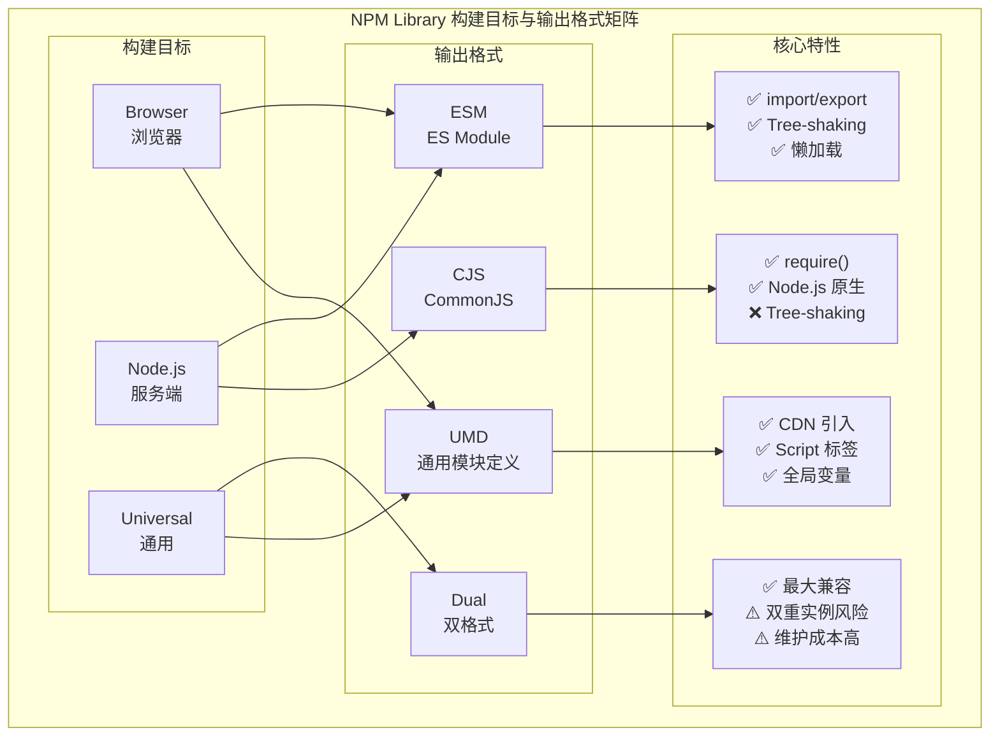
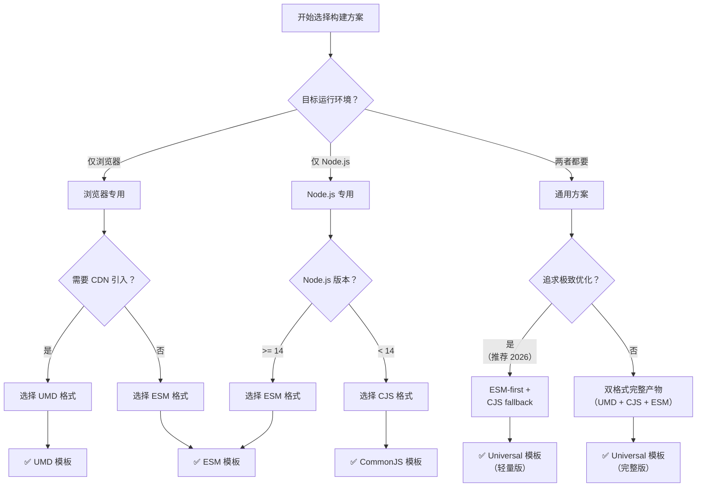
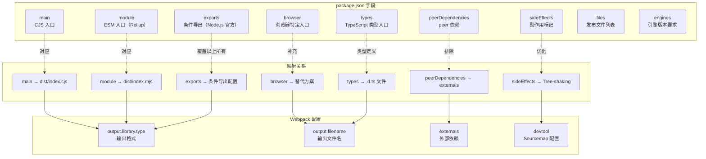

# 使用 Webpack 构建 NPM Library 的正确方式

> **文档元信息**
> - **适用 Webpack 版本**: 5.96.1+
> - **最后更新时间**: 2026-01-22
> - **核心主题**: ESM-first 库构建、output.module、package.json exports、Tree-shaking 友好
> - **前置知识**: Webpack 基础配置、模块化规范（CJS/ESM/UMD）
> - **相关章节**: 第3章（Webpack 核心概念）、第5章（Loader 与 Plugin）、第6章（性能优化）

---

## 版本差异对照表

| 维度 | v1 原版 | v2 更新版 |
|------|---------|-----------|
| **Webpack 版本** | 5.x 通用 | **5.96.1+**（支持 output.module） |
| **output.library** | 仅介绍 UMD | **全面对比 commonjs/umd/module/library 类型** |
| **ESM 支持** | 未涉及 | **深入讲解 output.module + experiments.outputModule** |
| **package.json** | main + module 简单配置 | **完整 exports 条件导出 + 最佳实践** |
| **externals** | 基础用法 | **新增 Node.js built-ins 处理策略** |
| **Tree-shaking** | 未涉及 | **sideEffects、#__PURE__ 完整指南** |
| **构建模板** | 单一 UMD 模板 | **UMD / CJS / ESM / Universal 四种完整模板** |
| **可视化** | 无 | **Mermaid 图表（矩阵图 + 对应关系图）** |
| **目标读者** | 入门级 | **中高级 + 库作者实战指南** |

---

## 目录

- [1. 核心概念与设计原则](#1-核心概念与设计原则)
- [2. 开发一个 NPM 库](#2-开发一个-npm-库)
- [3. output.library 深度解析](#3-outputlibrary-深度解析)
  - [3.1 library.type 完整对比](#31-librarytype-完整对比)
  - [3.2 library.name 与全局变量挂载](#32-libraryname-与全局变量挂载)
  - [3.3 library.export 细粒度控制](#33-libraryexport-细粒度控制)
- [4. ESM-first 库构建方案](#4-esm-first-库构建方案)
  - [4.1 output.module 配置](#41-outputmodule-配置)
  - [4.2 experiments.outputModule 进展](#42-experimentsoutputmodule-进展)
  - [4.3 package.json exports 条件导出](#43-packagejson-exports-条件导出)
  - [4.4 字段优先级与最佳实践](#44-字段优先级与最佳实践)
- [5. 正确使用第三方包（externals）](#5-正确使用第三方包externals)
  - [5.1 基础 externals 配置](#51-基础-externals-配置)
  - [5.2 Node.js built-ins 处理策略](#52-nodejs-built-ins-处理策略)
  - [5.3 webpack-node-externals 自动排除](#53-webpack-node-externals-自动排除)
- [6. 抽离 CSS 代码](#6-抽离-css-代码)
- [7. 生成 Sourcemap](#7-生成-sourcemap)
- [8. Tree-shaking 友好库编写指南](#8-tree-shaking-友好库编写指南)
  - [8.1 sideEffects 配置](#81-sideeffects-配置)
  - [8.2 #__PURE__ 注解](#82-__pure__-注解)
  - [8.3 导出方式选择](#83-导出方式选择)
- [9. 构建目标与输出格式矩阵](#9-构建目标与输出格式矩阵)
- [10. package.json 字段与 Webpack 配置对应关系](#10-packagejson-字段与-webpack-配置对应关系)
- [11. 四种完整构建模板](#11-四种完整构建模板)
  - [11.1 UMD 模板（通用兼容）](#11-umd-模板通用兼容)
  - [11.2 CommonJS 模板（Node.js 专用）](#11-commonjs-模板nodejs-专用)
  - [11.3 ESM 模板（现代浏览器/打包工具）](#11-esm-模板现代浏览器打包工具)
  - [11.4 Universal 模板（全格式双产物）](#11-universal-模板全格式双产物)
- [12. 其他 NPM 配置优化](#12-其他-npm-配置优化)
- [13. 总结与选型建议](#13-总结与选型建议)
- [14. 思考题](#14-思考题)

---

## 1. 核心概念与设计原则

虽然 Webpack 多数情况下被用于构建 Web 应用，但与 Rollup、Snowpack 等工具类似，Webpack 同样具有完备的构建 NPM 库的能力。与一般场景相比，构建 NPM 库时需要遵循以下**核心设计原则**：

### 必须遵循的原则

1. **正确的模块导出**：使用 `output.library` 配置项，以适当方式导出模块内容
2. **外部依赖排除**：不要将第三方包打包进产物中，以免与业务方环境发生冲突
3. **样式独立管理**：将 CSS 抽离为独立文件，以方便用户自行决定实际用法
4. **源码映射支持**：始终生成 Sourcemap 文件，方便用户调试
5. **Tree-shaking 友好**：编写支持 Dead Code Elimination 的库代码

### 可选优化项

- **双格式产物**：同时提供 CJS 和 ESM 两种格式
- **条件导出**：使用 `package.json` 的 `exports` 字段精确控制入口
- **类型声明**：提供 `.d.ts` TypeScript 类型文件
- **按需加载**：支持子路径导入（如 `lib/utils`）

---

## 2. 开发一个 NPM 库

为方便讲解，假定我们正在开发一个全新的 NPM 库，暂且叫它 `test-lib` 吧，首先需要创建并初始化项目：

```bash
mkdir test-lib && cd test-lib
npm init -y
```

虽然有很多构建工具能够满足 NPM 库的开发需求，但现在暂且选择 Webpack，所以需要先装好基础依赖：

```bash
yarn add -D webpack webpack-cli
```

接下来，可以开始写一些代码了，首先创建代码文件：

```bash
mkdir src
touch src/index.js
```

之后，在 `test-lib/src/index.js` 文件中随便实现一些功能，比如：

```js
// test-lib/src/index.js
export const add = (a, b) => a + b

export const multiply = (a, b) => a * b
```

至此，项目搭建完毕，目录如下：

```bash
├─ test-lib
│  ├─ package.json
│  ├─ src
│  │  └─ index.js
```

> **提示**：本文代码均已上传到 [本系列仓库](https://github.com/Tecvan-fe/webpack-book-samples/tree/main/6-1_test-lib)。

---

## 3. output.library 深度解析

接下来，我们需要将上例 `test-lib` 构建为适合分发的产物形态。虽然 NPM 库与普通 Web 应用在形态上有些区别，但大体的编译需求趋同，因此可以复用前面章节介绍过的大多数知识点。

### 基础编译配置

`test-lib` 所需要的基础编译配置如下：

```js
// webpack.config.js
const path = require("path");

module.exports = {
  mode: "development",
  entry: "./src/index.js",
  output: {
    filename: "[name].js",
    path: path.join(__dirname, "./dist"),
  }
};
```

> **提示**：我们还可以在上例基础上叠加任意 Loader、Plugin，例如： `babel-loader`、`eslint-loader`、`ts-loader` 等。

上述配置会将代码编译成一个 IIFE 函数，但这并不适用于 NPM 库，我们需要修改 `output.library` 配置，以适当方式导出模块内容：

```js
module.exports = {
  // ...
  output: {
    filename: "[name].js",
    path: path.join(__dirname, "./dist"),
+   library: {
+     name: "TestLib",
+     type: "umd",
+   },
  },
  // ...
};
```

### 3.1 library.type 完整对比

`output.library.type` 是最核心的配置项，用于指定编译产物的模块化方案。Webpack 5.96.1+ 支持以下类型：

#### 类型概览

| 类型 | 输出格式 | 适用场景 | Tree-shaking 兼容 | 推荐指数 |
|------|---------|---------|-------------------|----------|
| **`commonjs`** | CommonJS（`exports["..."] =`） | Node.js 环境、老项目兼容 | ❌ 不支持 | ⭐⭐⭐ |
| **`commonjs2`** | CommonJS2 (`module.exports =`) | Node.js 环境（更常用） | ❌ 不支持 | ⭐⭐⭐⭐ |
| **`umd`** | UMD (Universal Module Definition) | 浏览器 `<script>` 标签、CDN 引入 | ❌ 不支持 | ⭐⭐⭐⭐⭐ |
| **`module`** | ES Module (`export ...`) | 现代浏览器、ESM-first 工具链 | ✅ 完全支持 | ⭐⭐⭐⭐⭐ |
| **`var`** | 全局变量挂载 | 简单脚本、非模块化环境 | ❌ 不支持 | ⭐⭐ |
| **`jsonp`** | JSONP 异步加载 | 跨域动态加载 | ❌ 不支持 | ⭐ |
| **`assign`** | 属性赋值 | 特殊场景 | ❌ 不支持 | ⭐ |

#### 详细说明

##### commonjs / commonjs2

```js
// webpack.config.js
output: {
  library: {
    type: 'commonjs2',  // 或 'commonjs'
  }
}
```

**产物示例**：
```js
module.exports = (() => {
  // ... 模块代码
  return { add, multiply };
})();
```

**特点**：
- 输出标准的 CommonJS 格式
- `commonjs` 使用 `exports["TestLib"] = ...`
- `commonjs2` 使用 `module.exports = ...`（更常用）
- 适用于 Node.js 环境和 require() 加载
- **不支持 Tree-shaking**（CommonJS 是动态模块系统）

**适用场景**：
- Node.js CLI 工具
- 服务端渲染（SSR）库
- 需要兼容老版 Node.js 的项目

##### umd（Universal Module Definition）

```js
// webpack.config.js
output: {
  library: {
    name: 'TestLib',
    type: 'umd',
  }
}
```

**产物示例**：
```js
(function webpackUniversalModuleDefinition(root, factory) {
  if(typeof exports === 'object' && typeof module === 'object')
    module.exports = factory();
  else if(typeof define === 'function' && define.amd)
    define([], factory);
  else if(typeof exports === 'object')
    exports["TestLib"] = factory();
  else
    root["TestLib"] = factory();
})(self, function() {
  return { add: (a, b) => a + b, multiply: (a, b) => a * b };
});
```

**特点**：
- **自动检测运行环境**：支持 CommonJS、AMD、全局变量三种模式
- **浏览器友好**：可通过 `<script>` 标签直接引入
- **CDN 友好**：适合通过 CDN 分发（如 unpkg、jsdelivr）
- **体积较大**：包含环境检测代码（约 200-500 bytes）
- **不支持 Tree-shaking**

**适用场景**：
- 组件库（React/Vue 组件）
- 需要通过 CDN 引入的工具库
- 需要兼容多种加载方式的通用库

**使用示例**：
```html
<!-- HTML 中直接使用 -->
<script src="https://unpkg.com/test-lib/dist/main.js"></script>
<script>
  TestLib.add(1, 2);  // 通过全局变量访问
</script>
```

```js
// ES Module
import { add } from 'test-lib';

// CommonJS
const { add } = require('test-lib');
```

##### module（ES Module 输出）⭐ 重点推荐

```js
// webpack.config.js
module.exports = {
  experiments: {
    outputModule: true,  // 启用实验性特性
  },
  output: {
    library: {
      type: 'module',
    },
    filename: '[name].mjs',  // 建议使用 .mjs 扩展名
  },
};
```

**产物示例**：
```js
// 输出纯 ES Module 格式
export const add = (a, b) => a + b;
export const multiply = (a, b) => a * b;
```

**特点**：
- ✅ **原生 ES Module 语法**：使用 `export` 关键字
- ✅ **完全支持 Tree-shaking**：静态分析，消除死代码
- ✅ **现代工具链友好**：Vite、Rollup、Webpack 5+ 原生支持
- ✅ **懒加载优化**：支持 `<script type="module">` 的原生懒加载
- ⚠️ **需要启用实验性特性**：`experiments.outputModule: true`
- ⚠️ **Node.js 14+**：旧版本 Node.js 不完全支持
- ⚠️ **不能有副作用代码**：顶层代码必须无副作用

**适用场景**：
- 现代前端库（2026 年主流选择）
- 需要最大化 Tree-shaking 效果的库
- 面向未来的 ESM-first 项目
- 工具函数库、Hooks 库

**生产就绪状态**（截至 2026-01）：
- ✅ Webpack 5.96.1+: 已稳定支持
- ✅ Vite/Rollup: 完美支持
- ✅ Node.js 18+: 生产可用
- ⚠️ Webpack 5.0-5.95: 需要开启 `experiments.outputModule`

##### var（全局变量模式）

```js
// webpack.config.js
output: {
  library: {
    name: 'TestLib',
    type: 'var',  // 默认值，挂载为全局变量
  }
}
```

**产物示例**：
```js
var TestLib = (function() {
  return { add: (a, b) => a + b };
})();
```

**特点**：
- 直接挂载到全局对象（window/global）
- 最简单的输出模式
- 无模块化包装
- 适用于简单脚本和非模块化环境

**适用场景**：
- jQuery 插件风格的库
- 简单工具函数
- 需要直接在浏览器控制台使用的调试工具

### 3.2 library.name 与全局变量挂载

`library.name` 用于定义模块名称，主要影响以下场景：

1. **UMD 全局变量模式**：当 UMD 检测到浏览器环境且没有模块系统时，会将库挂载到 `window[library.name]`
2. **library 类型**：作为全局变量的属性名

#### 高级用法：命名空间

```js
output: {
  library: {
    name: ['MyCompany', 'Utils', 'Math'],
    type: 'umd',
  }
}
```

**效果**：生成层级命名空间 `window.MyCompany.Utils.Math`

```js
// 访问方式
MyCompany.Utils.Math.add(1, 2);
```

#### 禁用 name（ESM 推荐）

对于 `module` 类型，通常不需要 `name`：

```js
output: {
  library: {
    type: 'module',
    // 不设置 name，因为 ESM 使用命名导出
  }
}
```

### 3.3 library.export 细粒度控制

默认情况下，Webpack 会导出整个 entry point。但你可以使用 `library.export` 控制导出的内容：

```js
// src/index.js
export const add = (a, b) => a + b;
export const multiply = (a, b) => a * b;
export default { add, multiply };

// webpack.config.js
output: {
  library: {
    name: 'TestLib',
    type: 'umd',
    export: 'default',  // 只导出 default
  }
}
```

**可选值**：
- **不设置**：导出整个模块（包括命名导出和默认导出）
- **`'default'`**：只导出默认导出
- **`['add', 'multiply']`**：只导出指定的命名导出（数组形式）

---

## 4. ESM-first 库构建方案

> **⚠️ 重要提示（2026 年重点方向）**
>
> 随着 JavaScript 生态系统的演进，**ESM-first 已成为构建 NPM 库的主流趋势**。主流框架和工具（React 19、Vue 3.6、Vite 6、Rollup 4）都已采用或推荐 ESM-first 策略。
>
> Webpack 从 5.96.1 开始正式支持 `output.module`，标志着 ESM 库构建进入成熟阶段。

### 4.1 output.module 配置

从 Webpack 5.96.1 开始，可以直接使用 `output.module: true` 来启用 ES Module 输出：

```js
// webpack.config.js（ESM-first 配置）
const path = require('path');

module.exports = {
  mode: 'production',
  entry: './src/index.js',
  output: {
    filename: 'index.mjs',      // 使用 .mjs 扩展名标识 ESM
    path: path.resolve(__dirname, 'dist'),
    library: {
      type: 'module',           // ES Module 输出
    },
    module: true,               // 启用 ESM 输出（Webpack 5.96.1+）
  },
  experiments: {
    outputModule: true,         // 兼容旧版本的实验性特性开关
  },
};
```

**关键配置说明**：

| 配置项 | 值 | 说明 |
|--------|-----|------|
| `output.filename` | `index.mjs` | 使用 `.mjs` 扩展名明确标识 ESM 文件 |
| `output.library.type` | `'module'` | 指定输出格式为 ES Module |
| `output.module` | `true` | （5.96.1+）正式启用 ESM 输出 |
| `experiments.outputModule` | `true` | （5.0-5.95）实验性特性开关 |

### 4.2 experiments.outputModule 进展

`outputModule` 经历了从实验性特性到稳定特性的演进过程：

#### 时间线

| 版本 | 状态 | 说明 |
|------|------|------|
| **Webpack 5.0 - 5.50** | 🧪 实验性 | 需要显式开启 `experiments.outputModule: true` |
| **Webpack 5.51 - 5.95** | 🔄 改进期 | API 稳定化，修复边界情况，增加错误提示 |
| **Webpack 5.96+** | ✅ 正式稳定 | 可直接使用 `output.module: true`，无需 experiments |
| **Webpack 5.107（最新）** | 🚀 生产就绪 | 完整支持，官方推荐用于新项目 |

#### 如何判断是否需要 experiments

```js
// 方式一：检查 Webpack 版本（推荐）
const webpackVersion = require('webpack/package.json').version;

module.exports = {
  // ...
  ...(webpackVersion.startsWith('5.') && parseInt(webpackVersion.split('.')[1]) < 96
    ? { experiments: { outputModule: true } }
    : { output: { module: true } }),
};

// 方式二：统一使用（向后兼容）
module.exports = {
  output: {
    module: true,  // 新版本识别此配置
  },
  experiments: {
    outputModule: true,  // 旧版本需要此配置
  },
};
```

### 4.3 package.json exports 条件导出

`package.json` 的 `exports` 字段是 Node.js 官方支持的**条件导出**机制，也是现代 NPM 库的标准配置方式。

#### 基础语法

```json
{
  "name": "test-lib",
  "version": "1.0.0",
  "type": "module",
  "exports": {
    ".": {
      "types": "./dist/index.d.ts",
      "import": "./dist/index.mjs",
      "require": "./dist/index.cjs"
    },
    "./utils": {
      "import": "./dist/utils.mjs",
      "require": "./dist/utils.cjs"
    }
  }
}
```

> **注意**：条件按声明顺序匹配，`types` 条件应放在最前，确保 TypeScript 优先命中类型声明。

**条件优先级**（按顺序匹配）：

| 条件 | 触发场景 | 示例 |
|------|---------|------|
| `"import"` | ESM `import` 语句 | `import lib from 'test-lib'` |
| `"require"` | CommonJS `require()` | `const lib = require('test-lib')` |
| `"types"` | TypeScript 类型导入 | `import type { Lib } from 'test-lib'` |
| `"default"` | 兜底条件 | 以上都不匹配时使用 |

#### 实战配置模板

##### 场景一：纯 ESM 库（推荐用于新项目）

```json
{
  "name": "modern-esm-lib",
  "type": "module",
  "exports": {
    ".": {
      "import": "./dist/index.mjs",
      "types": "./dist/index.d.ts"
    },
    "./package.json": "./package.json"
  },
  "files": ["dist"]
}
```

**优点**：
- 代码简洁，维护成本低
- 完全支持 Tree-shaking
- 符合 ESM-first 趋势

**缺点**：
- Node.js < 14 无法使用
- 不兼容 `require()` 加载

##### 场景二：双格式产物（CJS + ESM）

```json
{
  "name": "dual-format-lib",
  "exports": {
    ".": {
      "import": {
        "types": "./dist/index.d.mts",
        "default": "./dist/index.mjs"
      },
      "require": {
        "types": "./dist/index.d.ts",
        "default": "./dist/index.cjs"
      }
    },
    "./utils": {
      "import": "./dist/utils.mjs",
      "require": "./dist/utils.cjs"
    }
  },
  "main": "./dist/index.cjs",
  "module": "./dist/index.mjs",
  "types": "./dist/index.d.ts"
}
```

**优点**：
- 最大兼容性
- 用户可自由选择加载方式
- 向后兼容老旧项目

**缺点**：
- 需要构建两次
- 可能导致双重实例问题（Dual Package Hazard）
- 维护成本较高

##### 场景三：带子路径导出的组件库

```json
{
  "name": "awesome-components",
  "exports": {
    ".": {
      "import": "./dist/index.mjs",
      "require": "./dist/index.cjs",
      "types": "./dist/index.d.ts"
    },
    "./Button": {
      "import": "./dist/Button.mjs",
      "require": "./dist/Button.cjs",
      "types": "./dist/Button.d.ts"
    },
    "./Input": {
      "import": "./dist/Input.mjs",
      "require": "./dist/Input.cjs",
      "types": "./dist/Input.d.ts"
    },
    "./styles": "./dist/styles.css",
    "./package.json": "./package.json"
  },
  "sideEffects": [
    "**/*.css",
    "**/*.scss"
  ]
}
```

**使用示例**：
```js
// 按需导入单个组件（Tree-shaking 友好）
import { Button } from 'awesome-components/Button';
import { Input } from 'awesome-components/Input';

// 导入样式
import 'awesome-components/styles';
```

### 4.4 字段优先级与最佳实践

当 `exports` 字段存在时，它会覆盖其他传统字段：

#### 优先级规则

```text
exports > main/module/browser/types
```

**具体表现**：

| 字段 | 是否被 exports 覆盖 | 说明 |
|------|-------------------|------|
| `exports` | - | 最高优先级，存在时其他字段失效 |
| `main` | ✅ 被 exports 覆盖 | 传统 CJS 入口 |
| `module` | ✅ 被 exports 覆盖 | 非标准 ESM 入口（Rollup 提出） |
| `browser` | ✅ 被 exports 覆盖 | 浏览器特定入口 |
| `types` | ✅ 被 exports 覆盖 | TypeScript 类型入口 |

#### 2026 年推荐配置

```json
{
  "name": "my-awesome-lib",
  "version": "2.0.0",
  "type": "module",
  "main": "./dist/index.cjs",
  "module": "./dist/index.mjs",
  "types": "./dist/index.d.ts",
  "exports": {
    ".": {
      "import": {
        "types": "./dist/index.d.mts",
        "default": "./dist/index.mjs"
      },
      "require": {
        "types": "./dist/index.d.ts",
        "default": "./dist/index.cjs"
      }
    }
  },
  "files": ["dist"],
  "sideEffects": false,
  "engines": {
    "node": ">=14.18"
  }
}
```

**配置说明**：

1. **保留 `main`/`module`**：兼容不支持 `exports` 的旧工具
2. **`exports` 为主**：现代工具优先读取此字段
3. **`type: "module"`**：声明项目为 ESM 项目
4. **`sideEffects: false`**：标记库无副作用，允许 Tree-shaking
5. **`engines`**：声明最低 Node.js 版本要求

---

## 5. 正确使用第三方包（externals）

### 5.1 基础 externals 配置

假设我们需要在 `test-lib` 中使用其它 NPM 包，例如 `lodash`：

```js
// src/index.js
import _ from "lodash";

export const add = (a, b) => a + b;

export const max = _.max;
```

此时执行编译命令 `npx webpack`，我们会发现产物文件的体积非常大：

这是因为 Webpack 默认会将所有第三方依赖都打包进产物中，这种逻辑能满足 Web 应用资源合并需求，但在开发 NPM 库时则很可能导致代码冗余。以 `test-lib` 为例，若使用者在业务项目中已经安装并使用了 `lodash`，那么最终产物必然会包含两份 `lodash` 代码！

为解决这一问题，我们需要使用 [externals](https://webpack.js.org/configuration/externals/) 配置项，将第三方依赖排除在打包系统之外：

```js
// webpack.config.js
module.exports = {
  // ...
+  externals: {
+   lodash: {
+     commonjs: "lodash",
+     commonjs2: "lodash",
+     amd: "lodash",
+     root: "_",
+   },
+ },
  // ...
};
```

> **提示**： Webpack 编译过程会跳过 [externals](https://webpack.js.org/configuration/externals/) 所声明的库，并假定消费场景已经安装了相关依赖，常用于 NPM 库开发场景；在 Web 应用场景下则常被用于优化性能。
>
> 例如，我们可以将 React 声明为外部依赖，并在页面中通过 `<script>` 标签方式引入 React 库，之后 Webpack 就可以跳过 React 代码，提升编译性能。

改造后，再次执行 `npx webpack`，编译结果如下：

改造后，主要发生了两个变化：

1. 产物仅包含 `test-lib` 库代码，体积相比修改前大幅降低；
2. UMD 模板通过 `require`、`define` 函数中引入 `lodash` 依赖并传递到 `factory`。

至此，Webpack 不再打包 `lodash` 代码，我们可以顺手将 `lodash` 声明为 `peerDependencies`：

```json
{
  "name": "6-1_test-lib",
  // ...
+ "peerDependencies": {
+   "lodash": "^4.17.21"
+ }
}
```

实践中，多数第三方框架都可以沿用上例方式处理，包括 React、Vue、Angular、Axios、Lodash 等，方便起见，可以直接使用 [webpack-node-externals](https://www.npmjs.com/package/webpack-node-externals) 排除所有 `node_modules` 模块，使用方法：

```js
// webpack.config.js
const nodeExternals = require('webpack-node-externals');

module.exports = {
  // ...
+  externals: [nodeExternals()]
  // ...
};
```

### 5.2 Node.js built-ins 处理策略

> **⚠️ Webpack 5 重要变更**
>
> Webpack 5 不再自动 polyfill Node.js 核心模块（如 `crypto`、`fs`、`path` 等）。如果你的库使用了这些模块，需要显式配置。

#### 问题现象

```js
// src/index.js
import crypto from 'crypto';

export function hash(data) {
  return crypto.createHash('sha256').update(data).digest('hex');
}
```

**Webpack 5 错误信息**：
```text
Module not found: Error: Can't resolve 'crypto' in '...'
```

#### 解决方案

**方案一：标记为 external（推荐用于库开发）**

```js
// webpack.config.js
module.exports = {
  target: 'node',  // 或 'node-current'、'async-node'
  externals: [
    nodeExternals({
      allowlist: [],  // 允许打包的模块（一般留空）
    }),
  ],
};
```

**方案二：使用 polyfill（需要兼容浏览器时）**

```js
// webpack.config.js
const NodePolyfillPlugin = require('node-polyfill-webpack-plugin');

module.exports = {
  plugins: [
    new NodePolyfillPlugin(),
  ],
};
```

**方案三：手动 fallback**

```js
// webpack.config.js
module.exports = {
  resolve: {
    fallback: {
      crypto: require.resolve('crypto-browserify'),
      stream: require.resolve('stream-browserify'),
      buffer: require.resolve('buffer/'),
    },
  },
};
```

#### 推荐：根据 target 灵活处理

```js
// webpack.config.js
const isNodeTarget = process.env.TARGET === 'node';

module.exports = {
  target: isNodeTarget ? ['node', 'es2020'] : ['web', 'es2020'],
  externals: isNodeTarget ? [nodeExternals()] : {},
  resolve: {
    fallback: isNodeTarget ? {} : {
      crypto: false,
      stream: false,
    },
  },
};
```

### 5.3 webpack-node-externals 自动排除

[webpack-node-externals](https://www.npmjs.com/package/webpack-node-externals) 是专门用于排除 `node_modules` 的工具：

#### 安装

```bash
yarn add -D webpack-node-externals
```

#### 基础用法

```js
const nodeExternals = require('webpack-node-externals');

module.exports = {
  externals: [nodeExternals()],
};
```

#### 高级选项

```js
externals: [nodeExternals({
  allowlist: [/^lodash/, /^@babel/],  // 白名单：这些模块仍然被打包
  importType: 'commonjs2',             // 外部模块的类型
  modulesDir: path.resolve(__dirname, 'node_modules'),  // node_modules 路径
  modulesFromFile: true,               // 从 package.json 读取依赖
})],
```

**常用场景**：

| 选项 | 值 | 说明 |
|------|-----|------|
| `allowlist` | `[]` | 需要打包进产物的模块白名单 |
| `importType` | `'commonjs2'` | 外部模块的导入类型 |
| `modulesFromFile` | `true` | 自动从 dependencies/peerDependencies 读取 |

---

## 6. 抽离 CSS 代码

假设我们开发的 NPM 库中包含了 CSS 代码 —— 这在组件库中特别常见，我们通常需要使用 `mini-css-extract-plugin` 插件将样式抽离成单独文件，由用户自行引入。

这是因为 Webpack 处理 CSS 的方式有很多，例如使用 `style-loader` 将样式注入页面的 `<head>` 标签；使用 `mini-css-extract-plugin` 抽离样式文件。作为 NPM 库开发者，如果我们粗暴地将 CSS 代码打包进产物中，有可能与用户设定的方式冲突。

为此，需要在前文基础上添加如下配置：

```js
+ const MiniCssExtractPlugin = require('mini-css-extract-plugin');

module.exports = {
  // ...
+ module: {
+   rules: [
+     {
+       test: /\.css$/,
+       use: [MiniCssExtractPlugin.loader, "css-loader"],
+     },
+   ],
+ },
+ plugins: [new MiniCssExtractPlugin({
+   filename: '[name].css',
+ })],
};
```

> **提示**：关于 CSS 构建的更多规则，可参考《如何借助预处理器、PostCSS 等构建现代 CSS 工程环境？》章节。

**完整 CSS 处理配置（推荐）**：

```js
const MiniCssExtractPlugin = require('mini-css-extract-plugin');

module.exports = {
  module: {
    rules: [
      {
        test: /\.css$/,
        use: [
          MiniCssExtractPlugin.loader,
          {
            loader: 'css-loader',
            options: {
              sourceMap: true,
              modules: {
                localIdentName: '[local]__[hash:base64:5]',
              },
            },
          },
          {
            loader: 'postcss-loader',
            options: {
              postcssOptions: {
                plugins: ['autoprefixer', 'postcss-preset-env'],
              },
            },
          },
        ],
      },
      {
        test: /\.scss$/,
        use: [
          MiniCssExtractPlugin.loader,
          'css-loader',
          'postcss-loader',
          'sass-loader',
        ],
      },
    ],
  },
  plugins: [
    new MiniCssExtractPlugin({
      filename: '[name].css',
    }),
  ],
};
```

---

## 7. 生成 Sourcemap

Sourcemap 是一种代码映射协议，它能够将经过压缩、混淆、合并的代码还原回未打包状态，帮助开发者在生产环境中精确定位问题发生的行列位置，所以一个成熟的 NPM 库除了提供兼容性足够好的编译包外，通常还需要提供 Sourcemap 文件。

接入方法很简单，只需要添加适当的 `devtool` 配置：

```js
// webpack.config.js
module.exports = {
  // ...
+ devtool: 'source-map'
};
```

再次执行 `npx webpack` 就可以看到 `.map` 后缀的映射文件：

```text
├─ test-lib
│  ├─ package.json
│  ├─ webpack.config.js
│  ├─ src
│  │  ├─ index.css
│  │  └─ index.js
│  └─ dist
│     ├─ main.js
│     ├─ main.js.map
│     ├─ main.css
│     └─ main.css.map
```

此后，业务方只需使用 `source-map-loader` 就可以将这段 Sourcemap 信息加载到自己的业务系统中，实现框架级别的源码调试能力。关于 Sourcemap 的更多信息，可查阅：

> **提示**：示例代码已上传到 [本系列仓库](https://github.com/Tecvan-fe/webpack-book-samples/tree/main/6-2_use-test-lib)。

#### Sourcemap 类型选择

| devtool 值 | 构建速度 | 质量 | 推荐场景 |
|------------|---------|------|---------|
| `'eval'` | 🚀 快 | ⭐ 低 | 开发环境 |
| `'eval-source-map'` | 🚀 快 | ⭐⭐⭐ | 开发环境（初始加载慢） |
| `'cheap-source-map'` | ⚡ 中等 | ⭐⭐ | 生产环境（不含列信息） |
| `'source-map'` | 🐢 慢 | ⭐⭐⭐⭐⭐ | **NPM 库发布（推荐）** |
| `'hidden-source-map'` | 🐢 慢 | ⭐⭐⭐⭐⭐ | 生产环境（不引用 .map） |

**NPM 库推荐配置**：

```js
module.exports = {
  devtool: 'source-map',  // 生成独立的 .map 文件
  // 其他配置...
};
```

---

## 8. Tree-shaking 友好库编写指南

> **🎯 为什么重要？**
>
> Tree-shaking（摇树优化）是现代打包工具的核心优化技术，能够消除未使用的代码，显著减小产物体积。作为 NPM 库作者，编写 Tree-shaking 友好的代码是对用户的负责。

### 8.1 sideEffects 配置

`package.json` 的 `sideEffects` 字段告诉打包工具你的代码是否有**副作用**。

#### 什么是副作用？

副作用是指模块在被导入时会执行的、影响全局状态的代码，例如：

```js
// ❌ 有副作用的代码
import './polyfill.js';  // 导入即执行
window.globalVar = 'value';  // 修改全局对象
Array.prototype.myMethod = function() {};  // 扩展原型链

// ✅ 无副作用的代码
export const add = (a, b) => a + b;  // 纯函数定义
export class Utils {}  // 类定义
```

#### 配置方式

**方式一：标记整个包无副作用（推荐）**

```json
{
  "sideEffects": false
}
```

**方式二：指定有副作用的文件**

```json
{
  "sideEffects": [
    "*.css",
    "*.scss",
    "./src/polyfills.js",
    "./src/register-components.js"
  ]
}
```

#### 实战示例

```json
{
  "name": "my-utils",
  "sideEffects": [
    "**/*.css",
    "**/*.scss",
    "./register.ts"
  ]
}
```

其中 `**/*.css`、`**/*.scss` 为有副作用的样式文件，`./register.ts` 为注册全局组件的文件。

```js
// src/index.js
// 这些导出都是无副作用的，可以被 Tree-shaking
export const add = (a, b) => a + b;
export const subtract = (a, b) => a - b;

// 如果用户只 import { add }，subtract 会被移除
```

### 8.2 #__PURE__ 注解

当 Webpack 无法确定某个调用是否有副作用时，可以使用 `#__PURE__` 注解辅助判断。

#### 使用场景

```js
// src/utils.js

// ❌ Webpack 不确定是否有副作用，可能不会被 Tree-shaking
const result = someFunction();

// ✅ 明确告诉 Webpack 这是纯调用，可以安全移除
const result = /*#__PURE__*/someFunction();
```

#### 常见使用模式

```js
// 创建对象
const config = /*#__PURE__*/({
  key: 'value',
  foo: 'bar',
});

// 函数调用
const result = /*#__PURE__*/calculateSomething(a, b);

// 条件表达式
const value = /*#__PURE__*/condition ? x : y;
```

#### Babel 自动插入

`#__PURE__` 注解也可以由编译/压缩工具自动生成或保留：Babel 在转换已知纯调用（如 helper 调用）时会补充注解，压缩阶段（如 Terser）会基于自身分析生成注解。源码中无法被工具识别的纯调用仍需手动书写。Babel 配置中保持 ESM 输出即可：

```js
// babel.config.js
module.exports = {
  presets: [
    ['@babel/preset-env', {
      modules: false,  // 保持 ESM 以便 Tree-shaking
    }],
  ],
};
```

### 8.3 导出方式选择

不同的导出方式对 Tree-shaking 的影响不同：

#### ✅ 推荐：命名导出（Named Exports）

```js
// src/math.js
export const add = (a, b) => a + b;
export const multiply = (a, b) => a * b;
export const divide = (a, b) => a / b;

// 使用方
import { add } from './math';  // 只会打包 add
```

**优点**：
- ✅ 完美的 Tree-shaking 支持
- ✅ 静态分析友好
- ✅ IDE 自动补全友好

#### ⚠️ 谨慎：默认导出（Default Export）

```js
// src/math.js
export default {
  add: (a, b) => a + b,
  multiply: (a, b) => a * b,
};

// 使用方
import math from './math';
math.add(1, 2);  // 整个对象都会被打包
```

**问题**：
- ❌ Tree-shaking 效果差（除非使用 `babel-plugin-transform-default-import`）
- ❌ 打包工具难以静态分析属性使用情况

#### 🔧 解决方案：再导出模式

```js
// src/math.js（内部实现）
const add = (a, b) => a + b;
const multiply = (a, b) => a * b;

// 同时支持默认导出和命名导出
export { add, multiply };
export default { add, multiply };

// 使用方可以选择任一方式
import { add } from './math';  // ✅ Tree-shaking 友好
import math from './math';     // ⚠️ 会打包全部
```

#### 完整的 Tree-shaking 友好结构

```js
// src/index.js（主入口）
// 所有子模块都使用命名导出
export { add, multiply, divide } from './math';
export { format, parse } from './string';
export { fetchJSON, postData } from './http';

// 默认导出聚合所有功能（可选）
export default {
  math: { add, multiply, divide },
  string: { format, parse },
  http: { fetchJSON, postData },
};
```

---

## 9. 构建目标与输出格式矩阵

下面的图表展示了不同构建目标与输出格式的对应关系：



### 选型决策树



---

## 10. package.json 字段与 Webpack 配置对应关系

理解 package.json 字段与 Webpack 配置的对应关系，有助于构建规范的 NPM 库：



### 详细对照表

| package.json 字段 | 作用 | 对应 Webpack 配置 | 优先级 |
|------------------|------|------------------|--------|
| `"main"` | CJS 入口 | `output.library.type: 'commonjs2'` | 低（被 exports 覆盖） |
| `"module"` | ESM 入口（非标准） | `output.library.type: 'module'` | 低（被 exports 覆盖） |
| `"exports"` | 条件导出 | 多个 output 配置组合 | **最高** |
| `"browser"` | 浏览器替代 | `target: 'web'` | 中 |
| `"types"` | TS 类型入口 | 输出 `.d.ts` 文件 | 独立 |
| `"sideEffects"` | 副作用标记 | 影响 optimization.usedExports | 独立 |
| `"peerDependencies"` | Peer 依赖 | `externals` 配置 | 独立 |
| `"files"` | 发布白名单 | 影响 `output.path` 内容 | 独立 |
| `"engines"` | 版本要求 | 影响目标平台选择 | 独立 |

---

## 11. 四种完整构建模板

### 11.1 UMD 模板（通用兼容）

> **适用场景**：组件库、需要 CDN 引入的库、最大兼容性需求

#### webpack.config.umd.js

```js
const path = require('path');
const MiniCssExtractPlugin = require('mini-css-extract-plugin');
const { CleanWebpackPlugin } = require('clean-webpack-plugin');

module.exports = {
  mode: 'production',
  entry: './src/index.js',

  output: {
    filename: 'index.umd.js',
    path: path.resolve(__dirname, 'dist'),
    library: {
      name: 'TestLib',
      type: 'umd',
      export: 'default',
    },
    globalObject: 'this',
    umdNamedDefine: true,
  },

  externals: {
    react: {
      commonjs2: 'react',
      commonjs: 'react',
      amd: 'react',
      root: 'React',
    },
    'react-dom': {
      commonjs2: 'react-dom',
      commonjs: 'react-dom',
      amd: 'react-dom',
      root: 'ReactDOM',
    },
  },

  module: {
    rules: [
      {
        test: /\.jsx?$/,
        exclude: /node_modules/,
        use: {
          loader: 'babel-loader',
          options: {
            presets: [
              ['@babel/preset-env', { targets: '> 0.25%, not dead' }],
              '@babel/preset-react',
            ],
          },
        },
      },
      {
        test: /\.css$/,
        use: [MiniCssExtractPlugin.loader, 'css-loader'],
      },
    ],
  },

  plugins: [
    new CleanWebpackPlugin(),
    new MiniCssExtractPlugin({
      filename: 'index.css',
    }),
  ],

  devtool: 'source-map',

  optimization: {
    minimize: true,
  },
};
```

#### package.json 配置

```json
{
  "name": "test-lib-umd",
  "version": "1.0.0",
  "main": "dist/index.umd.js",
  "module": "dist/index.esm.js",
  "browser": "dist/index.umd.js",
  "types": "dist/index.d.ts",
  "files": ["dist"],
  "scripts": {
    "build": "webpack --config webpack.config.umd.js",
    "build:prod": "NODE_ENV=production webpack --config webpack.config.umd.js"
  },
  "peerDependencies": {
    "react": ">=16.8.0",
    "react-dom": ">=16.8.0"
  },
  "devDependencies": {
    "webpack": "^5.96.1",
    "webpack-cli": "^5.1.4",
    "babel-loader": "^9.1.3",
    "@babel/core": "^7.24.0",
    "@babel/preset-env": "^7.24.0",
    "@babel/preset-react": "^7.24.0",
    "mini-css-extract-plugin": "^2.8.0",
    "clean-webpack-plugin": "^4.0.0",
    "css-loader": "^7.1.0"
  }
}
```

#### 使用方式

```html
<!-- CDN 引入 -->
<script src="https://unpkg.com/test-lib-umd/dist/index.umd.js"></script>
<script>
  TestLib.add(1, 2);
</script>
```

```js
// CommonJS
const TestLib = require('test-lib-umd');

// ES Module
import TestLib from 'test-lib-umd';
```

---

### 11.2 CommonJS 模板（Node.js 专用）

> **适用场景**：Node.js CLI 工具、SSR 库、服务端中间件

#### webpack.config.cjs.js

```js
const path = require('path');
const nodeExternals = require('webpack-node-externals');

module.exports = {
  mode: 'production',
  target: ['node', 'es2020'],
  entry: './src/index.js',

  output: {
    filename: 'index.cjs',
    path: path.resolve(__dirname, 'dist'),
    library: {
      type: 'commonjs2',
    },
  },

  externals: [nodeExternals()],

  module: {
    rules: [
      {
        test: /\.js$/,
        exclude: /node_modules/,
        use: {
          loader: 'babel-loader',
          options: {
            presets: [
              ['@babel/preset-env', {
                targets: { node: 'current' },
                modules: false,
              }],
            ],
          },
        },
      },
    ],
  },

  devtool: 'source-map',

  optimization: {
    minimize: false,  // Node.js 通常不需要压缩
  },
};
```

#### package.json 配置

```json
{
  "name": "test-lib-cjs",
  "version": "1.0.0",
  "main": "dist/index.cjs",
  "types": "dist/index.d.ts",
  "files": ["dist"],
  "scripts": {
    "build": "webpack --config webpack.config.cjs.js"
  },
  "engines": {
    "node": ">=14.0.0"
  },
  "devDependencies": {
    "webpack": "^5.96.1",
    "webpack-cli": "^5.1.4",
    "webpack-node-externals": "^3.0.0",
    "babel-loader": "^9.1.3"
  }
}
```

#### 使用方式

```js
// CommonJS（Node.js）
const { add, multiply } = require('test-lib-cjs');

console.log(add(1, 2));  // 3
```

---

### 11.3 ESM 模板（现代浏览器/打包工具）

> **适用场景**：2026 年新项目、前端库、工具函数库、追求 Tree-shaking

#### webpack.config.esm.js

```js
const path = require('path');
const MiniCssExtractPlugin = require('mini-css-extract-plugin');

module.exports = {
  mode: 'production',
  target: ['web', 'es2020'],
  entry: './src/index.js',

  output: {
    filename: 'index.mjs',
    path: path.resolve(__dirname, 'dist'),
    library: {
      type: 'module',
    },
    module: true,
    environment: {
      module: true,
      dynamicImport: true,
    },
  },

  experiments: {
    outputModule: true,  // Webpack < 5.96 需要
  },

  externalsType: 'module',  // 外部依赖也使用 ESM

  module: {
    rules: [
      {
        test: /\.js$/,
        exclude: /node_modules/,
        use: {
          loader: 'babel-loader',
          options: {
            presets: [
              ['@babel/preset-env', {
                targets: '> 0.25%, not dead',
                modules: false,  // 保持 ESM！重要！
                bugfixes: true,
              }],
            ],
          },
        },
      },
      {
        test: /\.css$/,
        use: [MiniCssExtractPlugin.loader, 'css-loader'],
      },
    ],
  },

  plugins: [
    new MiniCssExtractPlugin({
      filename: 'index.css',
    }),
  ],

  devtool: 'source-map',

  optimization: {
    usedExports: true,
    innerGraph: true,
    sideEffects: true,
  },
};
```

#### package.json 配置

```json
{
  "name": "test-lib-esm",
  "version": "2.0.0",
  "type": "module",
  "main": "dist/index.cjs",
  "module": "dist/index.mjs",
  "exports": {
    ".": {
      "import": {
        "types": "./dist/index.d.mts",
        "default": "./dist/index.mjs"
      },
      "require": {
        "types": "./dist/index.d.ts",
        "default": "./dist/index.cjs"
      }
    },
    "./styles": "./dist/index.css"
  },
  "types": "dist/index.d.ts",
  "files": ["dist"],
  "sideEffects": [
    "**/*.css"
  ],
  "scripts": {
    "build:esm": "webpack --config webpack.config.esm.js",
    "build:cjs": "webpack --config webpack.config.cjs.js",
    "build": "npm run build:esm && npm run build:cjs"
  },
  "engines": {
    "node": ">=14.18"
  },
  "devDependencies": {
    "webpack": "^5.96.1",
    "webpack-cli": "^5.1.4",
    "mini-css-extract-plugin": "^2.8.0",
    "babel-loader": "^9.1.3"
  }
}
```

#### 使用方式

```js
// ES Module（完美 Tree-shaking）
import { add } from 'test-lib-esm';  // 只导入需要的函数
import 'test-lib-esm/styles';       // 单独导入样式

console.log(add(1, 2));
```

---

### 11.4 Universal 模板（全格式双产物）

> **适用场景**：大型开源库、需要最大兼容性的企业级库

#### webpack.config.universal.js

```js
const path = require('path');
const { merge } = require('webpack-merge');
const MiniCssExtractPlugin = require('mini-css-extract-plugin');
const nodeExternals = require('webpack-node-externals');

const baseConfig = {
  mode: 'production',
  entry: './src/index.js',

  module: {
    rules: [
      {
        test: /\.js$/,
        exclude: /node_modules/,
        use: {
          loader: 'babel-loader',
          options: {
            presets: [
              ['@babel/preset-env', {
                modules: false,  // 保持 ESM
              }],
            ],
          },
        },
      },
      {
        test: /\.css$/,
        use: [MiniCssExtractPlugin.loader, 'css-loader'],
      },
    ],
  },

  plugins: [
    new MiniCssExtractPlugin({
      filename: '[name].css',
    }),
  ],

  devtool: 'source-map',
};

const esmConfig = merge(baseConfig, {
  target: ['web', 'es2020'],
  output: {
    filename: 'index.mjs',
    path: path.resolve(__dirname, 'dist'),
    library: {
      type: 'module',
    },
    module: true,
  },
  experiments: {
    outputModule: true,
  },
  externalsType: 'module',
  optimization: {
    usedExports: true,
  },
});

const cjsConfig = merge(baseConfig, {
  target: ['node', 'es2020'],
  output: {
    filename: 'index.cjs',
    path: path.resolve(__dirname, 'dist'),
    library: {
      type: 'commonjs2',
    },
  },
  externals: [nodeExternals()],
});

const umdConfig = merge(baseConfig, {
  target: ['web', 'es2020'],
  output: {
    filename: 'index.umd.js',
    path: path.resolve(__dirname, 'dist'),
    library: {
      name: 'TestLib',
      type: 'umd',
    },
    globalObject: 'this',
  },
  externals: {
    react: {
      commonjs2: 'react',
      amd: 'react',
      root: 'React',
    },
  },
});

module.exports = [esmConfig, cjsConfig, umdConfig];
```

#### package.json 配置

```json
{
  "name": "test-lib-universal",
  "version": "3.0.0",
  "type": "module",
  "main": "dist/index.cjs",
  "module": "dist/index.mjs",
  "browser": "dist/index.umd.js",
  "unpkg": "dist/index.umd.js",
  "jsdelivr": "dist/index.umd.js",
  "types": "dist/index.d.ts",
  "exports": {
    ".": {
      "import": {
        "types": "./dist/index.d.mts",
        "default": "./dist/index.mjs"
      },
      "require": {
        "types": "./dist/index.d.ts",
        "default": "./dist/index.cjs"
      }
    },
    "./styles": "./dist/index.css",
    "./package.json": "./package.json"
  },
  "files": [
    "dist"
  ],
  "sideEffects": [
    "**/*.css",
    "**/*.scss"
  ],
  "scripts": {
    "build": "webpack --config webpack.config.universal.js",
    "build:dev": "webpack --mode=development --config webpack.config.universal.js",
    "prepublishOnly": "npm run build"
  },
  "engines": {
    "node": ">=14.18"
  },
  "peerDependencies": {
    "react": ">=16.8.0",
    "react-dom": ">=16.8.0"
  },
  "devDependencies": {
    "webpack": "^5.96.1",
    "webpack-cli": "^5.1.4",
    "webpack-merge": "^5.10.0",
    "webpack-node-externals": "^3.0.0",
    "mini-css-extract-plugin": "^2.8.0",
    "babel-loader": "^9.1.3",
    "clean-webpack-plugin": "^4.0.0"
  }
}
```

#### 构建产物目录

```text
dist/
├── index.mjs         # ES Module 格式
├── index.mjs.map     # ESM Sourcemap
├── index.cjs         # CommonJS 格式
├── index.cjs.map     # CJS Sourcemap
├── index.umd.js      # UMD 格式（浏览器/CDN）
├── index.umd.js.map  # UMD Sourcemap
├── index.css         # 样式文件
├── index.css.map     # CSS Sourcemap
└── index.d.ts        # TypeScript 类型声明
```

#### 使用方式

```js
// 方式 1：ES Module（推荐，支持 Tree-shaking）
import { add } from 'test-lib-universal';

// 方式 2：CommonJS
const { add } = require('test-lib-universal');

// 方式 4：单独导入样式
import 'test-lib-universal/styles';
```

```html
<!-- 方式 3：HTML Script 标签 -->
<script src="https://unpkg.com/test-lib-universal/dist/index.umd.js"></script>
<script>TestLib.add(1, 2)</script>
```

---

## 12. 其他 NPM 配置优化

至此，开发 NPM 库所需的 Webpack 配置就算是介绍完毕了，接下来我们还可以用一些小技巧优化 `test-lib` 的项目配置，提升开发效率，包括：

### 12.1 .npmignore 文件

使用 `.npmignore` 文件忽略不需要发布到 NPM 的文件：

```gitignore
src/
*.ts
*.map
webpack.config.*
.babelrc
.vscode/
.idea/
.github/
tests/
__tests__/
coverage/
*.log
.DS_Store
```

> **注意**：如果存在 `.npmignore`，它会覆盖 `.gitignore` 的规则。如果没有 `.npmignore`，则使用 `.gitignore`。

### 12.2 prepublishOnly 钩子

在 `package.json` 文件中，使用 `prepublishOnly` 指令，在发布前自动执行编译命令：

```json
{
  "name": "test-lib",
  "scripts": {
    "build": "webpack --mode=production",
    "prepublishOnly": "npm run build",
    "prepublishOnly:cjs": "webpack --config webpack.config.cjs.js --mode=production",
    "prepublishOnly:esm": "webpack --config webpack.config.esm.js --mode=production"
  }
}
```

### 12.3 files 字段

显式指定发布的文件列表（比 .npmignore 更精确）：

```json
{
  "files": [
    "dist",
    "README.md",
    "LICENSE"
  ]
}
```

### 12.4 完整 package.json 模板

```json
{
  "name": "@scope/my-awesome-library",
  "version": "1.0.0",
  "description": "An awesome library built with Webpack 5",
  "license": "MIT",
  "author": "Your Name <email@example.com>",
  "repository": {
    "type": "git",
    "url": "https://github.com/username/my-awesome-library.git"
  },
  "keywords": ["utility", "library", "esm", "tree-shakable"],
  "type": "module",
  "main": "./dist/index.cjs",
  "module": "./dist/index.mjs",
  "types": "./dist/index.d.ts",
  "exports": {
    ".": {
      "import": {
        "types": "./dist/index.d.mts",
        "default": "./dist/index.mjs"
      },
      "require": {
        "types": "./dist/index.d.ts",
        "default": "./dist/index.cjs"
      }
    },
    "./styles": "./dist/style.css",
    "./package.json": "./package.json"
  },
  "files": ["dist", "README.md", "LICENSE"],
  "sideEffects": ["**/*.css", "**/*.scss"],
  "scripts": {
    "build": "webpack --mode=production",
    "build:dev": "webpack --mode=development",
    "watch": "webpack --watch",
    "clean": "rm -rf dist",
    "prepublishOnly": "npm run clean && npm run build",
    "test": "jest",
    "lint": "eslint src/",
    "typecheck": "tsc --noEmit"
  },
  "peerDependencies": {
    "react": ">=17.0.0"
  },
  "devDependencies": {
    "webpack": "^5.96.1",
    "webpack-cli": "^5.1.4",
    "typescript": "^5.4.0",
    "@types/react": "^18.2.0",
    "babel-loader": "^9.1.3",
    "@babel/core": "^7.24.0",
    "@babel/preset-env": "^7.24.0",
    "@babel/preset-react": "^7.24.0",
    "@babel/preset-typescript": "^7.24.0",
    "mini-css-extract-plugin": "^2.8.0",
    "css-loader": "^7.1.0",
    "postcss-loader": "^8.1.0",
    "sass-loader": "^14.2.0",
    "webpack-merge": "^5.10.0",
    "clean-webpack-plugin": "^4.0.0",
    "eslint": "^8.57.0",
    "jest": "^29.7.0"
  },
  "engines": {
    "node": ">=16.0.0",
    "npm": ">=8.0.0"
  },
  "publishConfig": {
    "access": "public",
    "registry": "https://registry.npmjs.org/"
  }
}
```

---

## 13. 总结与选型建议

站在 Webpack 角度，构建 Web 应用于构建 NPM 库的差异并不大，开发时注意：

### 核心配置清单

- ✅ 使用 `output.library` 配置项，**正确选择 type**（module/umd/commonjs2）
- ✅ 使用 `externals` 配置项，**忽略第三方库**（配合 peerDependencies）
- ✅ 使用 `mini-css-extract-plugin` **单独打包 CSS** 样式代码
- ✅ 使用 `devtool: 'source-map'` 配置项**生成 Sourcemap** 文件
- ✅ 配置 `package.json` 的 `exports` 字段实现**条件导出**
- ✅ 设置 `sideEffects` 标记，**支持 Tree-shaking**
- ✅ 提供 **TypeScript 类型声明**（`.d.ts`）

### 2026 年选型建议

| 场景 | 推荐方案 | 原因 |
|------|---------|------|
| **全新库项目** | ESM-first + CJS fallback | 符合行业趋势，兼顾兼容性 |
| **React/Vue 组件库** | UMD + ESM 双格式 | 需要 CDN 支持 + Tree-shaking |
| **Node.js 工具库** | Pure ESM 或 Pure CJS | 运行环境单一 |
| **企业内部库** | Universal（三格式） | 最大兼容性，降低接入门槛 |
| **小型工具函数** | Pure ESM | 体积最小，Tree-shaking 效果最好 |

### 版本迁移路径

如果你正在维护一个基于 v1 配置的老库，建议按以下步骤升级：

1. **第一阶段**：添加 `exports` 字段（不影响现有用户）
2. **第二阶段**：添加 ESM 产物（`output.module: true`）
3. **第三阶段**：将 `module` 字段指向 ESM 产物
4. **第四阶段**：标记 `type: "module"`，逐步引导用户迁移
5. **第五阶段**（可选）：移除 UMD 产物，完全 ESM-first

遵循上述规则，基本上就能满足开发一个 NPM 库所需的大部分需求。另外，文章代码均已上传到 [本系列仓库](https://github.com/Tecvan-fe/webpack-book-samples/tree/main/6-1_test-lib)，建议大家 Clone 阅读。

---

## 14. 思考题

1. **模块化规范对比**：请结合实际场景，详细比较 CommonJS、UMD、ES Module 三种模块化规范的优劣势，以及它们在不同运行环境下的表现。

2. **ESM-first 迁移挑战**：如果要将一个现有的 UMD-only 库迁移为 ESM-first，可能会遇到哪些挑战？如何解决 Dual Package Hazard（双重包危害）问题？

3. **构建工具选型**：有许多工具能被构建 NPM 库，例如 Webpack、Snowpack、Vite、Rollup、tsup、unbuild 等，这些工具各有什么特点？在 2026 年，你更倾向于使用哪种工具？为什么？

4. **Tree-shaking 深度实践**：如何编写一个完全 Tree-shaking 友好的库？请列举至少 5 个常见的反模式（Anti-patterns），并提供解决方案。

5. **exports 字段设计**：为一个具有以下结构的复杂组件库设计 `package.json` 的 `exports` 字段：
   - 主入口（Button、Input、Modal 等组件）
   - 子路径导出（`@scope/lib/Button`）
   - 样式文件（CSS/SCSS）
   - 主题文件
   - TypeScript 类型声明
   - 内部工具函数（不对外暴露）

---

## 附录：快速参考卡片

### Webpack Library Output 速查

```js
// UMD（通用）
output: { library: { name: 'Lib', type: 'umd' } }

// CommonJS（Node.js）
output: { library: { type: 'commonjs2' } }

// ES Module（现代化）
output: { library: { type: 'module' }, module: true }
experiments: { outputModule: true }

// Global Variable（简单场景）
output: { library: { name: 'Lib', type: 'var' } }
```

### package.json 速查

```json
{
  "exports": {
    ".": {
      "import": "./dist/index.mjs",
      "require": "./dist/index.cjs",
      "types": "./dist/index.d.ts"
    }
  },
  "sideEffects": false,
  "files": ["dist"]
}
```

### 常用命令速查

```bash
npm run build

npm publish  # 自动触发 prepublishOnly

npm link
cd ../test-project
npm link my-lib

ls -la dist/
```

---

> **文档版本**：v2.0.0
> **最后更新**：2026-01-22
> **适用 Webpack**：5.96.1+（推荐 5.107）
> **下一步学习**：第8章（Webpack 性能优化深度实践）
