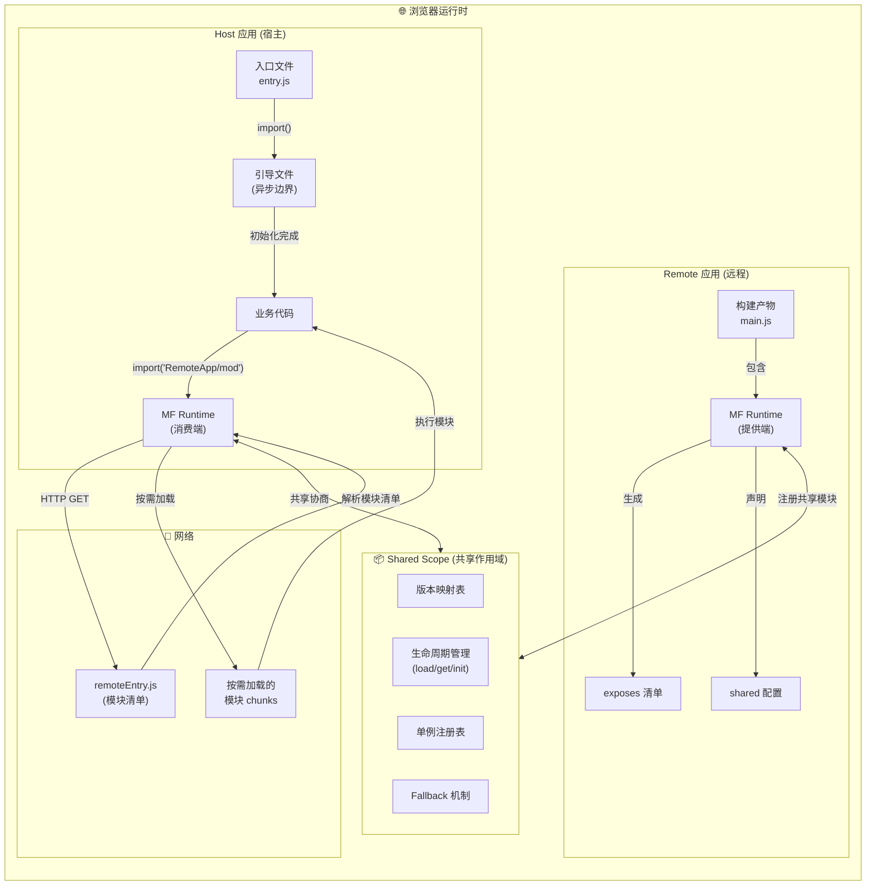
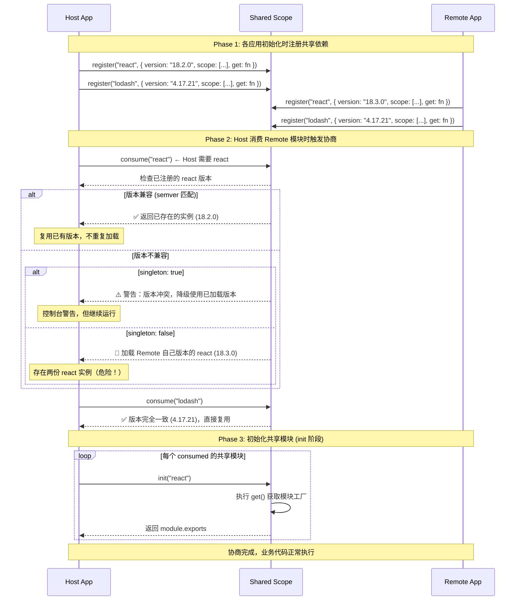
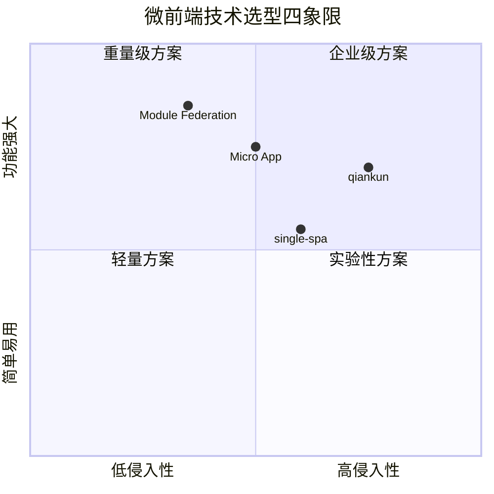

# 使用 Webpack 构建微前端应用

> Module Federation 通常译作"**模块联邦**"，是 Webpack 5 新引入的一种远程模块动态加载与运行时技术。MF 允许我们将原本单个巨大应用按理想方式拆分成多个体积更小、职责更内聚的小应用形式，理想情况下各个应用能够实现**独立部署、独立开发**（不同应用甚至允许使用不同技术栈）、团队自治，从而降低系统与团队协作的复杂度 —— 这正是所谓的**微前端架构**。
>
> *An architectural style where independently deliverable frontend applications are composed into a greater whole —— 摘自《**[Micro Frontends](https://martinfowler.com/articles/micro-frontends.html)**》。*

自 Webpack 5 发布以来，Module Federation 经历了从实验性特性到生产级方案的演进。**2024 年，字节跳动与 Module Federation 原作者 Zack Jackson 联合推出了 Module Federation 2.0**，在原版基础上解决了大量边界问题，大幅提升了稳定性和开发体验。本章将系统性地介绍 Module Federation 的核心原理、MF 2.0 的新特性，以及如何在实际项目中构建可靠的微前端应用。

---

## 一、Module Federation 核心概念与架构

### 1.1 三角色模型

Module Federation 的架构围绕三个核心角色展开：

| 角色 | 英文 | 职责 | 类比 |
|------|------|------|------|
| **容器** | Container | 提供模块清单与运行时环境 | 图书馆 |
| **宿主** | Host | 消费远程模块的应用 | 读者 |
| **远程** | Remote | 暴露模块供其他应用使用 | 书籍提供者 |

关键点在于：**在 MF 中，一个应用可以同时扮演多个角色**。一个应用既可以作为 Remote 暴露模块，也可以作为 Host 消费其他应用的模块。这种去中心化的对等关系是 MF 区别于 qiankun 等传统方案的核心特征。

### 1.2 运行时架构全景

下图展示了 Module Federation 在运行时的完整数据流与组件交互关系：



**架构要点解析：**

1. **Remote Entry File（`remoteEntry.js`）**：这是整个 MF 的枢纽文件，由 `ModuleFederationPlugin` 自动生成，包含：
   - 所有 `exposes` 模块的索引信息（模块名 → chunk 文件路径的映射）
   - `shared` 依赖的元数据（包名、版本、共享策略）
   - MF Runtime 的初始化代码

2. **Shared Scope（共享作用域）**：所有参与 MF 的应用通过一个全局的共享作用域来协商依赖复用。这是一个类似 Map 的数据结构，key 为包名，value 为模块加载/初始化的 Promise 链。

3. **异步边界（Async Boundary）**：Host 应用的入口必须被包裹在异步操作中（通常使用动态 `import()`），确保 Shared Scope 初始化完成后才执行业务代码。

### 1.3 ModuleFederationPlugin 核心配置项

```js
new ModuleFederationPlugin({
  // === 身份标识 ===
  name: "appName",           // 应用唯一名称
  
  // === 入口文件 ===
  filename: "remoteEntry.js", // 远程入口文件名
  
  // === Remote 端：暴露模块 ===
  exposes: {
    "./moduleName": "./src/path/to/module",
    // 支持多种格式:
    // "./Button": "./src/Button",          // 相对路径
    // "./utils": { import: "./src/utils", name: "utils" }, // 对象形式（MF 2.0 增强）
  },
  
  // === Host 端：消费远程模块 ===
  remotes: {
    // 格式: <别名>: <name>@<url>
    RemoteApp: "app1@http://localhost:8081/remoteEntry.js",
    
    // MF 2.0 支持 Promise 形式（动态加载）
    DynamicRemote: "promise new Promise(resolve => { ... })",
  },
  
  // === 共享依赖 ===
  shared: {
    react: {
      singleton: true,         // 强制单例（React 必须开启）
      requiredVersion: "^18.2",// 版本要求（semver）
      eager: false,            // 是否同步打包
      shareKey: "react",       // 自定义共享 key
      shareScope: "default",   // 共享作用域名称
    },
    // 简写形式: 'lodash' → 等同于 { lodash: { requiredVersion: '*' } }
  },
  
  // === MF 2.0 新增配置 ===
  sharedScope: "default",     // 默认共享作用域名
  remoteType: "var",          // 远程模块类型: var | module | script
  implementation: undefined,  // 自定义 MF runtime 实现
})
```

---

## 二、基础示例：Host + Remote 双向通信

下面我们搭建一个完整的 MF 示例，展示 Host 与 Remote 之间的**双向模块共享**能力 —— 这是 MF 区别于传统主子架构的核心优势。

### 2.1 项目结构

```text
MF-bidirectional
├─ app-host          # 宿主应用 (端口 8082)
│  ├─ src
│  │  ├─ bootstrap.js     # 异步入口（关键！）
│  │  └─ main.js          # 业务入口
│  ├─ webpack.config.js
│  └─ package.json
├─ app-remote         # 远程应用 (端口 8081)
│  ├─ src
│  │  ├── utils.js        # 导出给 Host 的工具函数
│  │  ├── Button.jsx      # 导出给 Host 的 UI 组件
│  │  └── main.js          # 业务入口（也消费 Host 的模块）
│  ├─ webpack.config.js
│  └─ package.json
├─ lerna.json
└─ package.json
```

### 2.2 Remote 应用配置（app-remote）

```js
const path = require("path");
const { ModuleFederationPlugin } = require("webpack").container;

module.exports = {
  mode: "development",
  devtool: "source-map",
  entry: path.resolve(__dirname, "./src/main.js"),
  output: {
    path: path.resolve(__dirname, "./dist"),
    publicPath: "http://localhost:8081/dist/",
    clean: true,
  },
  plugins: [
    new ModuleFederationPlugin({
      name: "appRemote",
      filename: "remoteEntry.js",
      
      // === 暴露模块给其他应用 ===
      exposes: {
        "./utils": "./src/utils",
        "./Button": "./src/Button",
      },
      
      // === 同时也作为 Host，消费其他应用的模块 ===
      remotes: {
        HostApp: "appHost@http://localhost:8082/dist/remoteEntry.js",
      },
      
      // === 共享依赖 ===
      shared: {
        react: {
          singleton: true,
          requiredVersion: "^18.2.0",
        },
        "react-dom": {
          singleton: true,
          requiredVersion: "^18.2.0",
        },
        lodash: {
          singleton: false,
          requiredVersion: "^4.17.0",
        },
      },
    }),
  ],
  devServer: {
    port: 8081,
    hot: true,
    headers: {
      "Access-Control-Allow-Origin": "*",  // CORS 必须！
    },
  },
};
```

### 2.3 Host 应用配置（app-host）

```js
const path = require("path");
const HtmlWebpackPlugin = require("html-webpack-plugin");
const { ModuleFederationPlugin } = require("webpack").container;

module.exports = {
  mode: "development",
  devtool: "source-map",
  entry: path.resolve(__dirname, "./src/main.js"),
  output: {
    path: path.resolve(__dirname, "./dist"),
    publicPath: "auto",  // MF 推荐设置
    clean: true,
  },
  plugins: [
    new ModuleFederationPlugin({
      name: "appHost",
      filename: "remoteEntry.js",
      
      // === Host 也暴露模块（双向！） ===
      exposes: {
        "./theme": "./src/theme",
        "./store": "./src/store",
      },
      
      // === 消费 Remote 的模块 ===
      remotes: {
        RemoteApp: "appRemote@http://localhost:8081/dist/remoteEntry.js",
      },
      
      // === 共享依赖（必须与 Remote 保持一致） ===
      shared: {
        react: {
          singleton: true,
          requiredVersion: "^18.2.0",
        },
        "react-dom": {
          singleton: true,
          requiredVersion: "^18.2.0",
        },
        lodash: {
          singleton: false,
          requiredVersion: "^4.17.0",
        },
      },
    }),
    new HtmlWebpackPlugin({
      template: "./public/index.html",
    }),
  ],
  devServer: {
    port: 8082,
    hot: true,
    open: true,
    headers: {
      "Access-Control-Allow-Origin": "*",
    },
  },
};
```

### 2.4 异步入口（关键步骤）

⚠️ **这是 MF 最容易踩坑的地方**：Host 和 Remote 的入口文件都必须是异步的，以确保 Shared Scope 在业务代码执行前完成初始化。

**Host 端 — `bootstrap.js` + `main.js` 模式：**

```js
// app-host/src/main.js（真正的入口）
import("./bootstrap");

// app-host/src/bootstrap.js（异步边界）
import React from "react";
import ReactDOM from "react-dom/client";
import App from "./App";

ReactDOM.createRoot(document.getElementById("root")).render(
  <React.StrictMode>
    <App />
  </React.StrictMode>
);
```

**Remote 端同样需要异步入口：**

```js
// app-remote/src/main.js
import("./bootstrap");
```

### 2.5 双向模块消费

**Host 消费 Remote 的模块：**

```jsx
// app-host/src/App.jsx
import React, { Suspense, lazy } from "react";

// 异步导入远程模块
const RemoteButton = lazy(() => import("RemoteApp/Button"));
const { formatMessage } = await import("RemoteApp/utils");  // 顶层 await 或在 useEffect 中

function App() {
  return (
    <div className="app">
      <h1>Host Application</h1>
      
      <Suspense fallback={<div>Loading Remote Button...</div>}>
        <RemoteButton 
          label="来自 Remote 的按钮"
          onClick={() => console.log(formatMessage("Hello from Remote!"))}
        />
      </Suspense>
    </div>
  );
}

export default App;
```

**Remote 消费 Host 的模块（反向调用）：**

```jsx
// app-remote/src/Button.jsx
import React from "react";
import { useTheme } from "HostApp/theme";  // 消费 Host 的主题！

export default function Button({ label, onClick }) {
  const theme = useTheme();
  
  return (
    <button 
      onClick={onClick}
      style={{
        padding: "8px 16px",
        backgroundColor: theme.primaryColor,
        color: "#fff",
        border: "none",
        borderRadius: 4,
        cursor: "pointer",
      }}
    >
      {label}
    </button>
  );
}
```

这个示例展示了 MF 的核心价值：**没有主从之分，每个应用都是平等的参与者**。Remote 可以调用 Host 的主题系统，Host 也可以调用 Remote 的 UI 组件和工具函数。

---

## 三、依赖共享机制深度解析

依赖共享是 Module Federation 最精妙的设计之一，它解决了一个根本性问题：**如何在多个独立部署的应用之间避免重复加载同一份依赖？**

### 3.1 共享策略详解

`shared` 配置支持以下策略选项：

| 选项 | 类型 | 默认值 | 说明 |
|------|------|--------|------|
| `singleton` | boolean | false | **强制单例模式**：整个应用生命周期中只存在一份该模块实例。React/Vue/Angular 等框架**必须**设为 true，否则会出现多实例导致的 hooks/context 失效等严重 bug |
| `eager` | boolean | false | **同步打包**：将共享依赖直接打入初始 chunk，而非异步加载。适用于必须在入口同步执行的库 |
| `requiredVersion` | string/false | `*`（匹配任意版本） | 版本约束，支持 [semver](https://semver.org/) 语法（如 `^18.2.0`、`~4.17.21`）。设为 `false` 可禁用该共享 |
| `shareKey` | string | 包名 | 自定义共享作用域中的 key，用于处理同一包的不同构建场景 |
| `shareScope` | string | `"default"` | 共享作用域命名空间，可用于隔离不同团队的共享依赖 |
| `version` | string | auto（从 package.json 读取） | 手动指定版本号，用于无法自动识别的场景 |

### 3.2 共享依赖协商流程

当 Host 加载 Remote 模块时，双方会对共享依赖进行一轮**版本协商**。以下是完整的协商时序：



**关键阶段说明：**

1. **register（注册阶段）**：各应用启动时将自己的共享依赖元数据注册到 Shared Scope，此时**不会真正加载模块**
2. **consume（消费阶段）**：当某个应用实际需要使用共享依赖时触发版本协商
3. **init（初始化阶段）**：协商通过后，调用模块的 `get()` 函数获取真正的模块实例。所有消费者共享同一个 init 结果（Promise 缓存）

### 3.3 最佳实践配置模板

```js
shared: {
  // ===== 框架级依赖：必须 singleton =====
  react: {
    singleton: true,          // React 必须单例！
    requiredVersion: "^18.2.0",
    eager: false,             // React 不需要 eager
  },
  "react-dom": {
    singleton: true,
    requiredVersion: "^18.2.0",
  },
  "react-router-dom": {
    singleton: true,
    requiredVersion: "^6.8.0",
  },
  
  // ===== 工具库：推荐 singleton 但允许版本容差 =====
  lodash: {
    singleton: true,
    requiredVersion: "^4.17.0",  // 允许 4.17.x 范围内的任意版本
  },
  dayjs: {
    singleton: false,          // dayjs 无状态，允许多实例
    requiredVersion: "^1.11.0",
  },
  
  // ===== 特殊场景：必须 eager =====
  "core-js": {
    singleton: true,
    eager: true,              // polyfill 必须在入口同步加载
  },
  "regenerator-runtime": {
    singleton: true,
    eager: true,
  },
}
```

### 3.4 常见陷阱与解决方案

#### 陷阱 1：忘记异步入口导致共享失效

❌ **错误做法**：直接同步导入

```js
// main.js — 同步入口（错误！）
import React from "react";  // 此时 Shared Scope 尚未初始化
import App from "./App";

ReactDOM.createRoot(document.getElementById("root")).render(<App />);
```

✅ **正确做法**：异步边界

```js
// main.js
import("./bootstrap");  // 先让 MF Runtime 初始化 Shared Scope

// bootstrap.js
import React from "react";  // 现在 Shared Scope 已就绪
import App from "./App";
ReactDOM.createRoot(document.getElementById("root")).render(<App />);
```

#### 陷阱 2：React 多实例导致 Hooks 失效

如果两个应用的 React 版本不兼容且 `singleton: false`，会导致页面中出现**两份 React 实例**，此时 Hooks、Context 等跨组件通信机制全部失效。

**诊断方法**：在浏览器控制台执行：

```js
// 如果返回两个不同的对象，说明存在多实例
window.__REACT_DEVTOOLS_GLOBAL_HOOK__.renderers
```

**解决方案**：确保所有应用对 React 设置 `singleton: true` + 合理的 `requiredVersion`。

#### 陷阱 3：publicPath 配置错误导致资源 404

MF 的 Remote Entry 和后续 chunk 都是通过 HTTP(S) 加载的，`output.publicPath` 必须指向可访问的 URL：

```js
// 开发环境
output: {
  publicPath: "http://localhost:8081/dist/",
}

// 生产环境（建议使用变量或自动推断）
output: {
  publicPath: "auto",  // Webpack 5 支持根据当前脚本 URL 自动推导
}
```

---

## 四、Module Federation 2.0 新特性详解

Module Federation 2.0 由**字节跳动前端团队**与 MF原作者 **Zack Jackson** 联合推出，解决了 1.x 版本在生产环境中遇到的诸多痛点。

### 4.1 MF 2.0 核心改进一览

| 改进领域 | 1.x 问题 | 2.0 解决方案
| ----------|----------|-------------- |
| **动态远程加载** | remotes 只能静态配置 | 支持 Promise-based 动态 Remotes |
| **错误恢复** | 远程加载失败后无法恢复 | Error Boundary 集成支持 |
| **类型安全** | 无 TypeScript 支持 | 完整的类型推导支持 |
| **共享策略** | singleton/eager 配置复杂 | 更智能的默认值与策略推断 |
| **边界情况** | 循环依赖、重复初始化等 | 大量边界 bug 修复 |
| **开发体验** | HMR 不稳定 | 显著改善的热更新体验 |
| **构建性能** | 大型项目构建慢 | 优化后的依赖图分析算法 |

### 4.2 动态远程加载（Dynamic Remotes）

这是 MF 2.0 最实用的特性之一。在 1.x 中，remotes 必须在编译时确定；2.0 允许你在**运行时**决定加载哪个远程应用。

**使用场景**：
- A/B 测试：动态切换不同版本的微应用
- 多环境：dev/stage/prod 使用不同的远程地址
- 权限控制：根据用户角色动态加载功能模块
- 灰度发布：渐进式发布新版本

**实现方式一：webpack 配置中的 Promise 形式**

```js
// webpack.config.js
module.exports = {
  plugins: [
    new ModuleFederationPlugin({
      name: "host",
      remotes: {
        // 动态决定远程应用地址
        microFrontend: `promise new Promise((resolve, reject) => {
          const remoteUrl = window.APP_CONFIG?.REMOTE_URL
            || "http://localhost:8081/remoteEntry.js";
          
          const script = document.createElement("script");
          script.src = remoteUrl;
          script.type = "text/javascript";
          script.async = true;
          
          script.onload = () => {
            // 脚本执行后会注册全局变量
            const scope = window.appRemote;  // 对应 Remote 的 name
            resolve(scope);
          };
          
          script.onerror = () => {
            reject(new Error(\`Failed to load remote: \${remoteUrl}\`));
          };
          
          document.head.appendChild(script);
        })`,
      },
    }),
  ],
};
```

**实现方式二：代码中使用 `getRemote`（推荐）**

```tsx
import React, { useState, useEffect, Suspense } from "react";

function DynamicMicroFrontend() {
  const [RemoteComponent, setRemoteComponent] = useState(null);
  
  useEffect(() => {
    async function loadRemote() {
      // 动态获取远程入口 URL
      const remoteUrl = `${process.env.REMOTE_BASE_URL}/remoteEntry.js`;
      
      // 使用 import() 动态加载
      const scope = await import(/* webpackIgnore: true */ remoteUrl);
      const module = await scope.default.loadRemote("./Dashboard");
      setRemoteComponent(() => module.default);
    }
    
    loadRemote().catch(console.error);
  }, []);
  
  if (!RemoteComponent) return <div>Loading...</div>;
  
  return (
    <ErrorBoundary fallback={<div>Micro frontend error</div>}>
      <Suspense fallback={<div>Loading component...</div>}>
        <RemoteComponent />
      </Suspense>
    </ErrorBoundary>
  );
}
```

### 4.3 错误边界（Error Boundary）

微前端环境中，某个子应用崩溃不应影响整体系统。MF 2.0 与 React Error Boundary 天然契合：

```tsx
class MicroFrontendErrorBoundary extends React.Component<
  { children: React.ReactNode; fallback?: React.ReactNode },
  { hasError: boolean; error: Error | null }
> {
  state = { hasError: false, error: null };
  
  static getDerivedStateFromError(error: Error) {
    return { hasError: true, error };
  }
  
  componentDidCatch(error: Error, errorInfo: React.ErrorInfo) {
    console.error("[MF Error Boundary]", error, errorInfo);
    // 上报监控
    reportErrorToService(error, { type: "micro-frontend", ...errorInfo });
  }
  
  render() {
    if (this.state.hasError) {
      return this.props.fallback || (
        <div style={{ padding: 20, textAlign: "center" }}>
          <h3>⚠️ 子应用加载异常</h3>
          <p>{this.state.error?.message}</p>
          <button onClick={() => this.setState({ hasError: false, error: null })}>
            重试
          </button>
        </div>
      );
    }
    return this.props.children;
  }
}

// 使用
<MicroFrontendErrorBoundary>
  <Suspense fallback={<Skeleton />}>
    <RemoteDashboard />
  </Suspense>
</MicroFrontendErrorBoundary>
```

### 4.4 MF 2.0 的 exposes 增强

```js
// MF 2.0 支持更丰富的 exposes 格式
exposes: {
  // 原有格式（保持兼容）
  "./Button": "./src/Button",
  
  // 对象形式（新增）
  "./Dialog": {
    import: "./src/Dialog",
    name: "Dialog",        // 用于调试和错误提示
  },
  
  // 多入口导出
  "./components/*": "./src/components/*.js",
}
```

---

## 五、微前端技术选型对比

在落地微前端架构时，技术选型是最关键的决策之一。下面对比当前主流的四套方案：

### 5.1 方案总览



### 5.2 详细对比矩阵

| 维度 | **Module Federation** | **qiankun** | **single-spa** | **Micro App** |
|------|-----------------------|-------------|----------------|---------------|
| **底层原理** | Webpack 5 运行时模块加载 | HTML Entry + Sandbox | 路由分发 + 生命周期 | WebComponent + Sandbox |
| **技术栈限制** | ⚠️ 强依赖 Webpack 5 | 无限制（框架无关） | 无限制（框架无关） | 无限制（框架无关） |
| **沙箱机制** | ❌ 无内置沙箱 | ✅ JS 沙箱 + 样式隔离 | ❌ 无（需自行实现） | ✅ JS/CSS 沙箱 |
| **应用关系** | 🔥 **对等（P2P）** | 主子（Master-Slave） | 主子（Main-Parcel） | 主子（Base-Micro） |
| **双向通信** | ✅ 原生支持 | ⚠️ 需借助 init/global | ⚠️ 需借助 custom props | ✅ 数据响应式通信 |
| **依赖共享** | 🔥 **原生 Shared Scope** | ❌ 无（各自打包） | ❌ 无 | ❌ 无 |
| **样式隔离** | ❌ 无（需 CSS Modules 等） | ✅ Shadow DOM / 严格模式 | ❌ 无 | ✅ Scoped CSS |
| **预加载** | ✅ 按需加载 | ✅ 预加载 | ✅ 手动管理 | ✅ 自动预加载 |
| **TypeScript** | ✅ MF 2.0 完整支持 | ✅ 良好 | ✅ 良好 | ✅ 良好 |
| **社区成熟度** | 🌟🌟🌟🌟 快速增长 | 🌟🌟🌟🌟🌟 国内主流 | 🌟🌟🌟🌟 成熟稳定 | 🌟🌟🌟🌟 京东出品 |
| **上手难度** | 🟢 中等（需理解 MF 概念） | 🟢 较低 | 🟡 中高 | 🟢 较低 |
| **适用场景** | 全栈统一 Webpack 5 的团队 | 已有 legacy 系统改造 | 高度定制化需求 | 快速接入、京东生态 |
| **维护方** | Webpack 官方 + 字节跳动 | 蚂蚁集团 | single-spa 社区 | 京东 |

### 5.3 选型决策树

```text
你的团队是否全员使用 Webpack 5？
├─ 是 → Module Federation（首选）
│       ├─ 需要沙箱？→ MF + 手动 CSS Modules / Shadow DOM
│       └─ 不需要 → 直接用 MF
└─ 否 → 是否需要强沙箱隔离？
        ├─ 是 → qiankun（国内）/ Micro App（京东生态）
        └─ 否 → single-spa（高度灵活）或 Micro App
```

### 5.4 ESM-shared-stack：新兴方案

除了上述四大方案外，社区还涌现了一些基于 **Native ESM（原生 ES Modules）** 的新兴微前端方案：

- **[ESM-shared-stack](https://github.com/esm-dev/esm-shared-stack)**：利用浏览器原生 ESM 的 import map 能力实现模块共享，无需构建工具
- **native-fetch**：纯运行时方案，零构建依赖
- 优势：极致轻量、无构建步骤、天然 tree-shaking
- 劣势：浏览器兼容性要求高（需支持 Import Maps）、生态尚不成熟

> 💡 **趋势判断**：随着浏览器对 ESM 和 Import Maps 支持的完善，基于 Native ESM 的微前端方案可能会在未来成为重要补充，但短期内 Module Federation 仍是 Webpack 生态下的最优解。

---

## 六、进阶话题

### 6.1 路由集成

在微前端架构中，路由管理是一个核心挑战。以下是几种常见的集成模式：

#### 模式 A：集中式路由（推荐用于 MF）

由 Host 统一管理路由，Remote 只负责暴露路由配置或页面组件：

```jsx
// host/src/App.jsx
import { HashRouter, Routes, Route, Navigate } from "react-router-dom";
import { lazy, Suspense } from "react";
import Navigation from "./Navigation";

// 远程路由配置（由各 Remote 应用暴露）
const remoteRoutes = await import("order/routes");
const remoteUserRoutes = await import("user/routes");

const allRoutes = [
  { path: "/", element: <HomePage /> },
  ...remoteRoutes.default,      // 订单模块的路由
  ...remoteUserRoutes.default,  // 用户模块的路由
];

function App() {
  return (
    <HashRouter>
      <Navigation />
      <Routes>
        {allRoutes.map(({ path, element }) => (
          <Route
            key={path}
            path={path}
            element={
              <Suspense fallback={<PageSkeleton />}>
                {element}
              </Suspense>
            }
          />
        ))}
      </Routes>
    </HashRouter>
  );
}
```

```jsx
// order/src/routes.js — Remote 暴露路由配置
import OrderList from "./OrderList";
import OrderDetail from "./OrderDetail";

export default [
  { path: "/orders", element: <OrderList /> },
  { path: "/orders/:id", element: <OrderDetail /> },
];
```

#### 模式 B：分布式路由

各 Remote 应用自主管理内部路由，Host 通过 `<iframe>` 或 Web Component 容器嵌套：

```jsx
function MicroRouteContainer({ remoteName, basePath }) {
  const RemoteApp = lazy(() => import(`${remoteName}/App`));
  
  return (
    <BrowserRouter basename={basePath}>
      <Suspense fallback={<Loading />}>
        <RemoteApp />
      </Suspense>
    </BrowserRouter>
  );
}
```

### 6.2 状态共享

微前端间的状态共享有多种粒度的方案：

#### 方案一：通过共享模块传递 Store

```js
// host/src/store.js — 暴露共享状态
import { createStore } from "redux";

const store = createStore(rootReducer);

export default store;
export const dispatch = store.dispatch;
export const getState = store.getState;

// remote/src/UserProfile.jsx — 消费共享状态
import store from "HostApp/store";

function UserProfile() {
  const [user, setUser] = useState(store.getState().user);
  
  useEffect(() => {
    const unsub = store.subscribe(() => {
      setUser(store.getState().user);
    });
    return unsub;
  }, []);
  
  return <div>Hello, {user.name}</div>;
}
```

#### 方案二：自定义事件总线（Event Bus）

```js
// shared/eventBus.js — 轻量级事件总线
class EventBus {
  constructor() {
    this.events = new Map();
  }
  
  on(event, callback) {
    if (!this.events.has(event)) {
      this.events.set(event, []);
    }
    this.events.get(event).push(callback);
  }
  
  off(event, callback) {
    const callbacks = this.events.get(event);
    if (callbacks) {
      this.events.set(event, callbacks.filter(cb => cb !== callback));
    }
  }
  
  emit(event, data) {
    const callbacks = this.events.get(event);
    if (callbacks) {
      callbacks.forEach(cb => cb(data));
    }
  }
}

export const eventBus = new EventBus();

// 将 eventBus 加入 shared 配置即可在所有应用间使用
```

#### 方案三：共享模块 + Context（React 生态）

对于 React 技术栈，可以通过 MF 共享 Context Provider：

```js
// host/src/SharedContext.jsx
import { createContext, useContext } from "react";

const ThemeContext = createContext({ primaryColor: "#1890ff" });
const AuthContext = createContext(null);

export function useTheme() { return useContext(ThemeContext); }
export function useAuth() { return useContext(AuthContext); }

export function SharedProviders({ children }) {
  return (
    <ThemeContext.Provider value={themeConfig}>
      <AuthContext.Provider value={authInfo}>
        {children}
      </AuthContext.Provider>
    </ThemeContext.Provider>
  );
}
```

### 6.3 样式隔离

Module Federation 本身不提供样式隔离能力，但可以结合以下方案使用：

| 方案 | 实现方式 | 优点 | 缺点 |
|------|----------|------|------|
| **CSS Modules** | 编译时生成唯一类名 | 零运行时开销 | 需构建工具配合 |
| **CSS-in-JS** | 运行时生成样式 | 动态样式能力强 | 性能开销、包体积增大 |
| **Shadow DOM** | 浏览器原生隔离 | 完全隔离 | 事件冒泡受影响、兼容性 |
| **BEM 规范** | 命名约定 | 简单可靠 | 依赖团队纪律 |
| **scoped-css（Vue）** | Vue 编译器添加属性选择器 | Vue 原生支持 | 仅限 Vue |

**推荐实践**：CSS Modules + 统一的设计 Token（Design Tokens），并通过 MF 共享：

```js
// design-tokens.js — 共享设计令牌
export const tokens = {
  colors: {
    primary: "#1890ff",
    success: "#52c41a",
    warning: "#faad14",
    error: "#ff4d4f",
  },
  spacing: {
    xs: "4px",
    sm: "8px",
    md: "16px",
    lg: "24px",
    xl: "32px",
  },
  borderRadius: {
    sm: "2px",
    md: "4px",
    lg: "8px",
  },
};

// 将此文件加入 shared 配置，所有应用共享同一套设计规范
```

### 6.4 性能优化策略

#### 策略一：预加载 Remote Entry

```html
<!-- 在 Host 的 index.html 中预加载 -->
<link rel="preload" href="http://localhost:8081/remoteEntry.js" as="script" />
<link rel="prefetch" href="http://localhost:8082/remoteEntry.js" as="script" />
```

#### 策略二：共享依赖 eager 化关键路径

```js
shared: {
  react: { singleton: true, eager: true },  // 关键路径依赖 eager 化
  "react-dom": { singleton: true, eager: true },
}
```

#### 策略三：细粒度 Exposes

避免暴露过大的模块，按需拆分：

```js
// ❌ 粗粒度：一次加载整个组件库
exposes: {
  "./UI": "./src/components/index",  // 包含几十个组件
}

// ✅ 细粒度：按需加载
exposes: {
  "./Button": "./src/components/Button",
  "./Input": "./src/components/Input",
  "./Modal": "./src/components/Modal",
  "./Table": "./src/components/Table",
}
```

---

## 七、完整微前端实战案例

下面构建一个包含订单管理和用户中心两大模块的微前端系统，展示 MF 在真实项目中的应用。

### 7.1 项目结构

```text
MF-micro-fe-v2
├─ packages
│  ├─ host/                    # 主应用（布局 + 路由）
│  │  ├─ public/
│  │  │  └─ index.html
│  │  ├─ src/
│  │  │  ├─ bootstrap.js       # 异步入口
│  │  │  ├─ main.js
│  │  │  ├─ App.jsx
│  │  │  ├─ Layout.jsx         # 主布局
│  │  │  ├─ Navigation.jsx     # 导航栏
│  │  │  ├─ ErrorBoundary.jsx  # 错误边界
│  │  │  ├─ store/             # 共享状态
│  │  │  └─ theme/             # 设计令牌
│  │  ├─ webpack.config.js
│  │  └─ package.json
│  │
│  ├─ order/                   # 订单微应用
│  │  ├─ src/
│  │  │  ├─ bootstrap.js
│  │  │  ├─ main.js
│  │  │  ├─ routes.js          # 暴露路由配置
│  │  │  ├─ OrderList.jsx
│  │  │  ├─ OrderDetail.jsx
│  │  │  └─ OrderForm.jsx
│  │  ├─ webpack.config.js
│  │  └─ package.json
│  │
│  └─ user/                    # 用户微应用
│     ├─ src/
│     │  ├─ bootstrap.js
│     │  ├─ main.js
│     │  ├─ routes.js
│     │  ├─ Profile.jsx
│     │  ├─ Settings.jsx
│     │  └─ AvatarUpload.jsx
│     ├─ webpack.config.js
│     └─ package.json
│
├─ lerna.json
└─ package.json
```

### 7.2 Host 应用完整配置

```js
// packages/host/webpack.config.js
const path = require("path");
const HtmlWebpackPlugin = require("html-webpack-plugin");
const { ModuleFederationPlugin } = require("webpack").container;

module.exports = {
  mode: "development",
  devtool: "source-map",
  entry: path.resolve(__dirname, "./src/main.js"),
  output: {
    path: path.resolve(__dirname, "./dist"),
    publicPath: "auto",
    clean: true,
  },
  resolve: {
    extensions: [".js", ".jsx"],
  },
  plugins: [
    new ModuleFederationPlugin({
      name: "host",
      filename: "remoteEntry.js",
      
      // Host 暴露共享资源
      exposes: {
        "./store": "./src/store",
        "./theme": "./src/theme/tokens",
        "./EventBus": "./src/eventBus",
      },
      
      // 消费远程微应用
      remotes: {
        order: "order@http://localhost:8081/remoteEntry.js",
        user: "user@http://localhost:8083/remoteEntry.js",
      },
      
      // 共享依赖
      shared: {
        react: { singleton: true, requiredVersion: "^18.2.0" },
        "react-dom": { singleton: true, requiredVersion: "^18.2.0" },
        "react-router-dom": { singleton: true, requiredVersion: "^6.8.0" },
        lodash: { singleton: true, requiredVersion: "^4.17.0" },
        antd: { singleton: false, requiredVersion: "^5.0.0" },
      },
    }),
    new HtmlWebpackPlugin({
      template: "./public/index.html",
    }),
  ],
  devServer: {
    port: 8082,
    hot: true,
    open: true,
    headers: { "Access-Control-Allow-Origin": "*" },
  },
};
```

### 7.3 Host 应用核心代码

```jsx
// packages/host/src/bootstrap.js
import React from "react";
import ReactDOM from "react-dom/client";
import { HashRouter } from "react-router-dom";
import App from "./App";
import { SharedProviders } from "./context";

ReactDOM.createRoot(document.getElementById("root")).render(
  <SharedProviders>
    <HashRouter>
      <App />
    </HashRouter>
  </SharedProviders>
);
```

```jsx
// packages/host/src/App.jsx
import React, { useState, useEffect, Suspense } from "react";
import { Routes, Route, Navigate } from "react-router-dom";
import Layout from "./Layout";
import Navigation from "./Navigation";
import ErrorBoundary from "./ErrorBoundary";
import PageSkeleton from "./PageSkeleton";

function App() {
  const [remoteRoutes, setRemoteRoutes] = useState([]);
  const [loading, setLoading] = useState(true);
  const [error, setError] = useState(null);
  
  useEffect(() => {
    async function loadRemoteRoutes() {
      try {
        const [orderRoutes, userRoutes] = await Promise.all([
          import("order/routes").then(m => m.default),
          import("user/routes").then(m => m.default),
        ]);
        setRemoteRoutes([...orderRoutes, ...userRoutes]);
      } catch (err) {
        console.error("Failed to load remote routes:", err);
        setError(err);
      } finally {
        setLoading(false);
      }
    }
    
    loadRemoteRoutes();
  }, []);
  
  if (loading) return <PageSkeleton />;
  if (error) {
    return (
      <ErrorBoundary>
        <div>部分微应用加载失败，但本地功能仍可用</div>
        <Navigate to="/" replace />
      </ErrorBoundary>
    );
  }
  
  const localRoutes = [
    { path: "/", element: <HomePage /> },
  ];
  
  const allRoutes = [...localRoutes, ...remoteRoutes];
  
  return (
    <Layout>
      <Navigation />
      <ErrorBoundary>
        <Routes>
          {allRoutes.map((route) => (
            <Route
              key={route.path}
              path={route.path}
              element={
                <Suspense fallback={<PageSkeleton />}>
                  <ErrorBoundary>
                    {route.element}
                  </ErrorBoundary>
                </Suspense>
              }
            />
          ))}
        </Routes>
      </ErrorBoundary>
    </Layout>
  );
}

function HomePage() {
  return (
    <div style={{ padding: 24 }}>
      <h2>🏠 首页</h2>
      <p>欢迎来到微前端演示系统</p>
    </div>
  );
}

export default App;
```

### 7.4 Order 微应用

```js
// packages/order/webpack.config.js
const path = require("path");
const { ModuleFederationPlugin } = require("webpack").container;

module.exports = {
  mode: "development",
  devtool: "source-map",
  entry: path.resolve(__dirname, "./src/main.js"),
  output: {
    path: path.resolve(__dirname, "./dist"),
    publicPath: "http://localhost:8081/dist/",
    clean: true,
  },
  resolve: { extensions: [".js", ".jsx"] },
  plugins: [
    new ModuleFederationPlugin({
      name: "order",
      filename: "remoteEntry.js",
      exposes: {
        "./routes": "./src/routes",
        "./OrderList": "./src/OrderList",
        "./OrderDetail": "./src/OrderDetail",
      },
      remotes: {
        host: "host@http://localhost:8082/remoteEntry.js",
      },
      shared: {
        react: { singleton: true, requiredVersion: "^18.2.0" },
        "react-dom": { singleton: true, requiredVersion: "^18.2.0" },
        "react-router-dom": { singleton: true, requiredVersion: "^6.8.0" },
        antd: { singleton: false, requiredVersion: "^5.0.0" },
        lodash: { singleton: true, requiredVersion: "^4.17.0" },
      },
    }),
  ],
  devServer: {
    port: 8081,
    hot: true,
    headers: { "Access-Control-Allow-Origin": "*" },
  },
};
```

```jsx
// packages/order/src/routes.js
import OrderList from "./OrderList";
import OrderDetail from "./OrderDetail";

const routes = [
  {
    path: "/orders",
    element: <OrderList />,
    label: "订单列表",
  },
  {
    path: "/orders/:id",
    element: <OrderDetail />,
    label: "订单详情",
  },
];

export default routes;
```

```jsx
// packages/order/src/OrderList.jsx
import React, { useState } from "react";
import { Table, Button, Tag, Space } from "antd";
import { tokens } from "host/theme";  // 消费 Host 的设计令牌！

const mockOrders = [
  { id: "ORD-001", product: "MacBook Pro 16\"", amount: 19999, status: "completed" },
  { id: "ORD-002", product: "iPhone 15 Pro", amount: 8999, status: "pending" },
  { id: "ORD-003", product: "AirPods Pro 2", amount: 1899, status: "shipped" },
];

export default function OrderList() {
  const [orders, setOrders] = useState(mockOrders);
  
  const columns = [
    { title: "订单号", dataIndex: "id", key: "id" },
    { title: "商品", dataIndex: "product", key: "product" },
    {
      title: "金额",
      dataIndex: "amount",
      key: "amount",
      render: (v) => `¥${v.toLocaleString()}`,
    },
    {
      title: "状态",
      dataIndex: "status",
      key: "status",
      render: (status) => {
        const map = {
          completed: { color: "green", text: "已完成" },
          pending: { color: "orange", text: "待付款" },
          shipped: { color: "blue", text: "配送中" },
        };
        const s = map[status] || { color: "default", text: status };
        return <Tag color={s.color}>{s.text}</Tag>;
      },
    },
  ];
  
  return (
    <div style={{ padding: 24 }}>
      <h2 style={{ marginBottom: tokens.spacing.lg, color: tokens.colors.primary }}>
        📦 订单管理
      </h2>
      <Table
        dataSource={orders}
        columns={columns}
        rowKey="id"
        pagination={{ pageSize: 10 }}
      />
    </div>
  );
}
```

### 7.5 启动与验证

```bash
npm install

npx webpack serve --config packages/order/webpack.config.js

npx webpack serve --config packages/user/webpack.config.js

npx webpack serve --config packages/host/webpack.config.js
```

访问 `http://localhost:8082` 即可看到完整的微前端系统，其中：
- `/orders` 和 `/orders/:id` 由 **order** 微应用渲染
- `/profile` 和 `/settings` 由 **user** 微应用渲染
- `/` 由 **host** 本地渲染
- 所有应用共享同一份 React、React-DOM、Lodash

打开 DevTools → Network 面板，可以观察到：
1. `remoteEntry.js` 仅加载一次（每个 Remote 应用一份）
2. 共享依赖（如 React）只加载一份到 Shared Scope
3. 各微应用的业务 chunk 按需加载

---

## 八、总结

Module Federation 是 Webpack 5 引入的一项革命性特性，它从根本上改变了前端应用的组织方式和部署形态。通过本章的学习，我们梳理了以下核心知识点：

### 核心要点回顾

1. **三角色架构**：Container（容器）、Host（宿主）、Remote（远程端）构成了 MF 的基本骨架，一个应用可以同时承担多个角色
2. **运行时加载**：MF 通过 `remoteEntry.js` 作为枢纽，实现了编译时独立构建、运行时动态组合的能力
3. **依赖共享**：Shared Scope 机制通过 register → consume → init 三阶段流程，在保证功能正确的前提下最大化减少冗余下载
4. **MF 2.0 进化**：动态远程加载、错误边界集成、类型安全支持等新特性使 MF 从实验走向生产可用
5. **技术选型**：在全栈 Webpack 5 团队中，MF 是微前端的首选方案；在异构技术栈场景下，qiankun/Micro App 等方案更为合适

### 适用场景

✅ **适合使用 Module Federation 的场景：**
- 大型单体前端应用的拆分与渐进式重构
- 多团队并行开发、独立交付的大型项目
- 需要在应用间共享组件库/工具函数
- 全栈统一使用 Webpack 5 的组织

⚠️ **需要慎重考虑的场景：**
- 遗留系统改造（老项目可能难以升级至 Webpack 5）
- 需要强沙箱隔离的安全敏感场景
- 对首屏加载性能极度敏感的场景（MF 有额外的网络请求开销）

### 学习路线建议

```text
入门：理解三角色模型 + Hello World 示例
  ↓
掌握：shared 配置 + 异步入口 + 双向通信
  ↓
进阶：MF 2.0 动态加载 + 错误边界 + 性能优化
  ↓
实战：完整微前端项目 + 路由集成 + 状态共享 + 样式策略
  ↓
精通：源码级理解 MF Runtime + 自定义共享策略 + 监控体系
```

---

## 思考题

1. **沙箱缺失问题**：Module Federation 并未提供 JavaScript 沙箱能力，这在什么场景下可能导致问题？有哪些补偿方案？

2. **版本回退策略**：当 Remote 应用的共享依赖版本高于 Host 时，`singleton: true` 会强制使用 Host 的低版本。这种"向下兼容"策略是否总是合理的？有没有更好的方案？

3. **失败降级**：如果某个 Remote 应用完全不可用（服务器宕机），Host 应用应该如何优雅降级？请设计一套完整的故障转移方案。

4. **构建缓存**：在 Monorepo + MF 的项目中，如何利用 Webpack 的持久化缓存（filesystem cache）加速构建？有哪些需要注意的坑？

5. **ESM 未来**：随着浏览器原生 ESM 和 Import Maps 的普及，你认为 Module Federation 这类基于 Bundle 的方案会被取代吗？为什么？

---

## 参考资源

- [Webpack 官方文档 - ModuleFederationPlugin](https://webpack.js.org/plugins/module-federation-plugin/)
- [Module Federation 2.0 GitHub](https://github.com/module-federation/core)
- [Module Federation Examples（官方示例集）](https://github.com/module-federation/module-federation-examples)
- [Zack Jackson - Module Federation 原理解析](https://zackarychapple.gitee.io/en/)
- [字节跳动 - Module Federation 在字节跳动的实践](https://www.bytedance.com/tag/MF)
- [qiankun 微前端框架](https://qiankun.umijs.org/)
- [Micro App 京东微前端框架](https://micro-zoe.github.io/micro-app/)
- [single-spa 文档](https://single-spa.js.org/)
