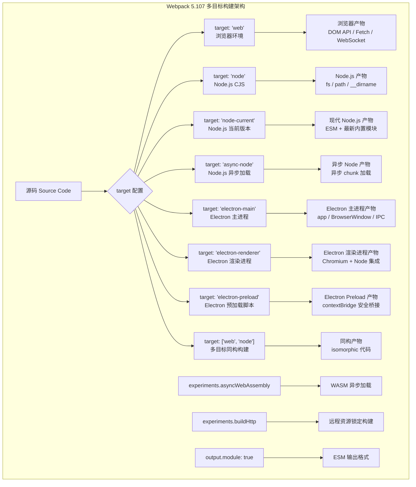
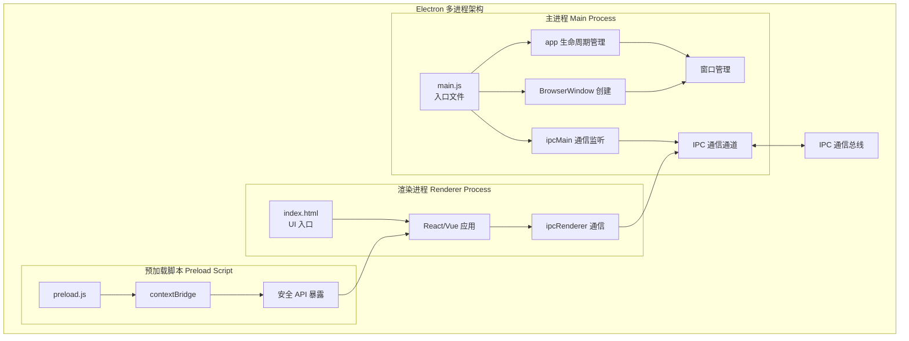
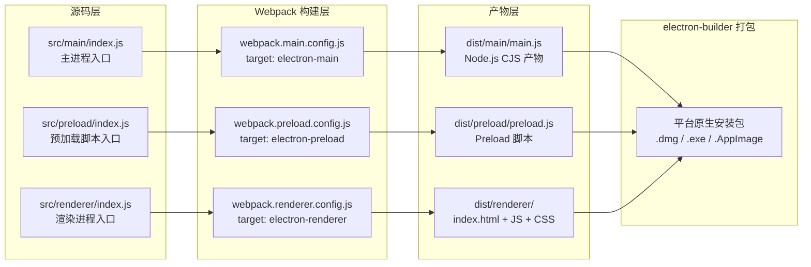

# 如何借助 Webpack 开发 PWA、Node、Electron 应用？

> **v1 → v2 差异对照表**

| 维度 | v1（原始版本） | v2（当前版本） |
|------|---------------|---------------|
| **Webpack 版本** | 5.x 通用 | **5.107** |
| **PWA 插件** | workbox-webpack-plugin v6 + webpack-pwa-manifest | **workbox-webpack-plugin v7 (Workbox 7)**，GenerateSW / InjectManifest 双模式详解 |
| **Node 目标** | target: 'node'，基础配置 | **target: 'node' / 'node-current' / 'async-node' 三种模式**，新增 `output.module` ESM 支持 |
| **Electron 集成** | 基础主/渲染进程分离 | **electron-builder 深度集成**，Preload 脚本完整配置，安全沙箱策略 |
| **WebAssembly** | 未涉及 | **experiments.asyncWebAssembly（默认 futureDefaults=true）、sourceImport（v5.106+）** |
| **多目标构建** | 单一 target | **target: ['web', 'node'] 数组语法**，同构应用构建方案 |
| **远程资源** | 未涉及 | **experiments.buildHttp 远程资源锁定与构建** |
| **架构图** | 外部图片引用 | **Mermaid 原生绘制：多目标架构图 + Electron 流程图** |
| **代码示例** | CommonJS 为主 | **ESM + CommonJS 双范式，覆盖更多实战场景** |

---


毋庸置疑，对前端开发者而言，当下正是一个日升月恒的美好时代！在久远的过去，Web 页面的开发技术链条非常原始而粗糙，那时候的 JavaScript 更多用来点缀 Web 页面交互而不是用来构建一个完整的应用。直到 2009 年 5 月 [Ryan Dahl](https://en.wikipedia.org/wiki/Ryan_Dahl) 正式发布 Node.js，JavaScript 终于有机会脱离 Web 浏览器独立运行，随之而来的是，基于 JavaScript 构建应用程序的能力被扩展到越来越多场景，我们得以用相同的语言、技术栈、工具独立开发桌面端、服务端、命令行、微前端、PWA 等应用形态。

相应地，我们需要更好的构建、模块化以及打包能力来应对不同形态的工程化需求，所幸 Webpack 5.107 提供的功能特性，能够充分支撑这些场景。

前面章节我们已经详细介绍了如何使用 Webpack 构建 NPM Library，以及如何基于 Module Federation 搭建微前端架构。本章将继续汇总这些特化场景需求，包括：

- 如何使用 Webpack 5.107 + Workbox 7 构建 Progressive Web Apps 应用；
- 如何使用 Webpack 5.107 构建 Node.js 应用（含 ESM 支持）；
- 如何使用 Webpack 5.107 + electron-builder 构建 Electron 应用；
- 如何利用 WebAssembly 实验特性与多目标构建能力扩展边界。

## 多目标构建总览

在深入各具体场景之前，我们先从宏观视角理解 Webpack 的多目标构建体系。Webpack 5.107 通过 `target` 配置项与 `experiments` 实验特性，实现了对多种运行环境的统一构建支持：



上图展示了 Webpack 5.107 的完整多目标构建能力矩阵。接下来我们逐一深入每个场景的具体实践。

---

## 一、构建 PWA 应用

### 1.1 PWA 核心概念

PWA 全称 Progressive Web Apps（渐进式 Web 应用），可以简单理解为 **一系列将网页如同独立 APP 般安装到本地的技术集合**，借此，我们可以保留普通网页轻量级、可链接（SEO 友好）、低门槛（只要有浏览器就能访问）等优秀特点，同时具备独立 APP 离线运行、可安装等优势。

实现上，PWA 与普通 Web 应用的开发方法大致相同，都是用 CSS、JS、HTML 定义应用的样式、逻辑、结构，两者主要区别在于 PWA 需要用一些新技术实现离线与安装功能：

- **ServiceWorker**：一种介于网页与服务器之间的本地代理，主要实现 PWA 应用的离线运行功能。ServiceWorker 可以将页面静态资源缓存到本地，用户再次访问时拦截请求并直接返回缓存副本，即使离线也能正常使用页面；

- **Web App Manifest**：描述 PWA 应用信息的 JSON 格式文件，用于实现本地安装功能，通常包含应用名、图标、URL 等内容：

```json
{
  "icons": [
    {
      "src": "/icon_120x120.png",
      "sizes": "120x120",
      "type": "image/png",
      "purpose": "any maskable"
    }
  ],
  "name": "My Progressive Web App",
  "short_name": "MyPWA",
  "display": "standalone",
  "start_url": ".",
  "description": "My awesome Progressive Web App!",
  "theme_color": "#ffffff",
  "background_color": "#ffffff",
  "scope": "/"
}
```

### 1.2 Workbox 7 集成方案

我们可以选择自行开发维护 ServiceWorker 及 Manifest 文件，也可以使用 Google 开源的 [Workbox 7](https://developer.chrome.com/docs/workbox) 套件自动生成 PWA 应用壳。Workbox 7 是目前最新的稳定版本，带来了更精细的缓存控制策略和更好的 Tree-shaking 支持。

#### 安装依赖

```bash
npm install -D workbox-webpack-plugin@7

npm install -D webapp-manifest-webpack-plugin
```

**Workbox 7 核心插件说明：**

| 插件 | 用途 | 适用场景 |
|------|------|---------|
| `GenerateSW` | 自动生成完整的 ServiceWorker 文件 | 快速集成，标准缓存策略 |
| `InjectManifest` | 将自定义 SW 源码注入构建流程 | 需要高度定制缓存逻辑 |

#### 配置方式一：GenerateSW（推荐快速集成）

`GenerateSW` 是最简单的集成方式，它会根据 Webpack 构建产物自动生成 ServiceWorker 文件，内置智能的缓存策略：

```javascript
// webpack.config.js
const path = require("path");
const HtmlWebpackPlugin = require("html-webpack-plugin");
const { GenerateSW } = require("workbox-webpack-plugin");
const { WebappManifestWebpackPlugin } = require("webapp-manifest-webpack-plugin");

module.exports = {
  mode: "production",
  entry: "./src/index.js",
  output: {
    path: path.resolve(__dirname, "dist"),
    filename: "[name].[contenthash].js",
    clean: true,
  },
  plugins: [
    new HtmlWebpackPlugin({
      title: "Progressive Web Application",
      meta: {
        // 自动注入 manifest 引用
        "theme-color": { content: "#1976d2" },
      },
    }),

    // 生成 Web App Manifest
    new WebappManifestWebpackPlugin({
      logo: path.resolve(__dirname, "src/assets/logo.png"),
      outputPath: "/",
      name: "My Progressive Web App",
      short_name: "MyPWA",
      description: "My awesome Progressive Web App!",
      background: "#ffffff",
      display: "standalone",
      orientation: "portrait",
      start_url: "/",
      icons: {
        android: true,              // 生成 Android 图标
        appleIcon: true,            // 生成 Apple touch icon
        favicons: true,             // 生成浏览器 favicon
      },
    }),

    // Workbox 7 GenerateSW —— 自动生成 ServiceWorker
    new GenerateSW({
      // ====== 核心行为配置 ======
      clientsClaim: true,           // SW 激活后立即接管所有页面
      skipWaiting: true,            // 跳过等待，立即激活新版本 SW
      swDest: "service-worker.js",  // SW 输出文件名

      // ====== 缓存策略配置 ======
      runtimeCaching: [
        {
          // 缓存 Google Fonts
          urlPattern: /^https:\/\/fonts\.googleapis\.com\/.*/i,
          handler: "CacheFirst",
          options: {
            cacheName: "google-fonts-cache",
            expiration: {
              maxEntries: 10,
              maxAgeSeconds: 60 * 60 * 24 * 365,
            },
            cacheableResponse: {
              statuses: [0, 200],
            },
          },
        },
        {
          // 缓存图片资源
          urlPattern: ({ request }) => request.destination === "image",
          handler: "StaleWhileRevalidate",
          options: {
            cacheName: "images-cache",
            expiration: {
              maxEntries: 50,
              maxAgeSeconds: 60 * 60 * 24 * 30,
            },
          },
        },
        {
          // 缓存 API 请求
          urlPattern: ({ url }) => url.pathname.startsWith("/api/"),
          handler: "NetworkFirst",
          options: {
            cacheName: "api-cache",
            networkTimeoutSeconds: 10,
            expiration: {
              maxEntries: 100,
              maxAgeSeconds: 60 * 60 * 24,
            },
            cacheableResponse: {
              statuses: [0, 200],
            },
          },
        },
      ],

      // ====== Workbox 7 新增选项 ======
      ignoreURLParametersMatching: [/^utm_/, /^ref/],  // 忽略 URL 参数进行缓存匹配
      navigateFallback: "/index.html",                  // 离线回退页面
      navigateFallbackAllowlist: [/^(?!\/api).*/],     // 排除 API 请求的回退

      // ====== 最大/最小化配置 ======
      maximumFileSizeToCacheInBytes: 5 * 1024 * 1024,  // 最大缓存文件 5MB
    }),
  ],
};
```

执行编译后生成的产物结构：

```text
dist/
├── index.html                    # HTML 入口（内含 manifest 引用）
├── main.[hash].js                # 应用 JS
├── main.[hash].css               # 应用 CSS（如有）
├── service-worker.js             # Workbox 生成的 SW 文件
├── manifest.webmanifest          # Web App Manifest
├── icons/
│   ├── android-chrome-192x192.png
│   ├── android-chrome-512x512.png
│   ├── apple-touch-icon.png
│   └── favicon-32x32.png
└── [其他静态资源...]
```

#### 配置方式二：InjectManifest（高级定制）

当需要完全掌控 ServiceWorker 缓存逻辑时，使用 `InjectManifest` 模式。你需要自行编写 SW 源码，Workbox 只负责将预缓存清单（precache manifest）注入其中：

```javascript
// webpack.config.js — InjectManifest 模式
const { InjectManifest } = require("workbox-webpack-plugin");

module.exports = {
  // ... 其他配置
  plugins: [
    new InjectManifest({
      swSrc: "./src/service-worker.js",       // 你的自定义 SW 源文件
      swDest: "service-worker.js",            // 输出文件路径
      maximumFileSizeToCacheInBytes: 5 * 1024 * 1024,
      // Workbox 7: 可传入额外参数给 swSrc 编译
      compileSrc: true,                        // 使用 esbuild 编译 swSrc（支持 TS）
    }),
  ],
};
```

对应的自定义 ServiceWorker 源码：

```javascript
// src/service-worker.js — 使用 Workbox 7 API
import { precacheAndRoute, cleanupOutdatedCaches } from "workbox-precaching";
import { registerRoute } from "workbox-routing";
import { CacheFirst, NetworkFirst, StaleWhileRevalidate } from "workbox-strategies";
import { ExpirationPlugin } from "workbox-expiration";

// Workbox 会自动注入 PRECACHE_MANIFEST 到 self.__WB_MANIFEST
precacheAndRoute(self.__WB_MANIFEST);

// 清理旧版本缓存
cleanupOutdatedCaches();

// 自定义缓存路由
registerRoute(
  ({ url }) => url.origin === "https://api.example.com",
  new NetworkFirst({
    cacheName: "api-cache",
    plugins: [
      new ExpirationPlugin({
        maxEntries: 100,
        maxAgeSeconds: 60 * 60 * 24,
      }),
    ],
  })
);

registerRoute(
  ({ request }) => request.destination === "image",
  new CacheFirst({
    cacheName: "images",
    plugins: [
      new ExpirationPlugin({
        maxEntries: 60,
        maxAgeSeconds: 30 * 24 * 60 * 60,
      }),
    ],
  })
);

// SW 激活后立即接管
self.addEventListener("activate", (event) => {
  event.waitUntil(self.clients.claim());
});
```

### 1.3 Workbox 7 vs v6 关键变更

| 特性 | Workbox 6 | Workbox 7 |
|------|----------|----------|
| **包体积** | 较大（~150KB gzip） | 更优 Tree-shaking（按需引入） |
| **TypeScript** | 需要 `workbox-types` | 内置原生 TS 类型导出 |
| **compileSrc** | 不支持 | ✅ 支持 esbuild 编译 swSrc |
| **导航预缓存** | navigateFallback | 增强：navigateFallbackDenylist 等 |
| **DevTools 集成** | 基础 | 增强 DevTools 面板集成 |
| **Node.js 兼容性** | Node 14+ | Node 16+ |

---

## 二、构建 Node.js 应用

### 2.1 前置说明：何时真正需要 Webpack 构建 Node？

⚠️ **重要提示：在开发 Node 程序时使用 Webpack 的必要性并不大**，因为 Node 本身已经有完备的模块化系统（CommonJS / ESM），并不需要像 Web 页面那样把所有代码打包成一个（或几个）产物文件！即使是为了兼容低版本 Node 环境，也可以使用更简单的方式解决——例如 Babel/swc，引入 Webpack 反而增加了系统复杂度以及不少技术隐患。

不过，以下场景确实有理由使用 Webpack 构建 Node 应用：

1. **同构（Isomorphic）应用**：前后端共享代码，需要统一的构建管线
2. **TypeScript 项目**：需要统一的 TS 编译 + 产物优化
3. **AWS Lambda / Serverless**：需要将依赖打包为单文件部署
4. **CLI 工具发布**：需要打包为单分发的可执行文件
5. **代码保护**：混淆/压缩源码

### 2.2 target 配置详解

Webpack 5.107 为 Node.js 构建提供了三种 `target` 模式，各有适用场景：

#### target: 'node'

经典的 Node.js 目标，兼容性最好，生成 CommonJS 格式产物：

```javascript
const path = require("path");
const nodeExternals = require("webpack-node-externals");

module.exports = {
  target: "node",
  entry: "./src/index.js",
  output: {
    filename: "bundle.cjs.js",
    path: path.resolve(__dirname, "dist"),
    library: { type: "commonjs2" },
  },
  // 排除 node_modules，避免将依赖打入 bundle
  externals: [nodeExternals()],
  // 保持 Node.js 全局变量不变
  node: {
    __filename: false,
    __dirname: false,
  },
  // Node.js 环境不需要 polyfill 浏览器 API
  resolve: {
    fallback: false,
  },
};
```

#### target: 'node-current'（推荐用于现代 Node 项目）

针对**当前运行版本的 Node.js** 进行构建，不会添加不必要的 polyfill，产物更精简：

```javascript
module.exports = {
  target: "node-current",
  entry: "./src/index.js",
  output: {
    filename: "bundle.cjs.js",
    path: path.resolve(__dirname, "dist"),
  },
  externals: [nodeExternals()],
  // node-current 下 __filename/__dirname 默认保持原值
  // 无需显式设置 node.__filename: false
};
```

**`'node'` vs `'node-current'` 对比：**

| 特性 | `'node'` | `'node-current'` |
|------|---------|-----------------|
| **兼容性** | 兼容较旧 Node 版本 | 仅兼容当前及更新版本 |
| **Polyfill** | 可能注入不必要的 shim | 最小化 polyfill |
| **__dirname 处理** | 可能被 mock 为 `/` | 保持真实文件系统路径 |
| **产物体积** | 较大 | 更精简 |
| **适用场景** | 需要广泛兼容 | 现代 Node 16+ / 18+ / 20+ 项目 |

#### target: 'async-node'

支持异步 chunk 加载的 Node.js 目标，适用于需要动态 `import()` 或代码分割的场景：

```javascript
module.exports = {
  target: "async-node",
  entry: "./src/index.js",
  output: {
    filename: "bundle.js",
    path: path.resolve(__dirname, "dist"),
    chunkFilename: "chunks/[name].[contenthash].js",
    library: { type: "commonjs2" },
  },
  externals: [nodeExternals()],
  // async-node 需要正确处理动态导入
  experiments: {
    outputModule: false, // async-node 暂不完全支持 ESM 输出
  },
};
```

### 2.3 Node.js ESM 支持（output.module）

Webpack 5.107 通过 `output.module: true` 支持输出 ES Module 格式的产物，这对 modern Node.js 项目尤为重要：

```javascript
module.exports = {
  target: "node-current",
  output: {
    filename: "bundle.mjs",
    path: path.resolve(__dirname, "dist"),
    module: true,           // 启用 ESM 输出
    library: { type: "module" },
  },
  externals: [nodeExternals()],
  experiments: {
    outputModule: true,     // 实验特性：启用 ESM 输出
  },
};
```

**注意事项：**

- `output.module: true` 需配合 `experiments.outputModule: true` 使用（Webpack 5.107 中仍标记为实验特性）
- ESM 输出与部分插件存在兼容性问题，需逐一验证
- `target: 'async-node'` 与 `output.module` 同时使用时可能遇到限制

### 2.4 动态 require 的陷阱

在 Node 代码中请务必慎用动态 `require` 语句，你很可能会得到预期之外的效果！

例如对于下面的目录结构：

```bash
example/
├── src/
│   ├── foo.js
│   ├── bar.js
│   ├── unused.js
│   └── main.js
├── package.json
└── webpack.config.js
```

其中 `main.js` 包含动态 require：

```javascript
const modules = ["foo", "bar"].map((r) => require(`./${r}.js`));
```

可以看到在 `main.js` 中并没有引用 `unused.js`，但打包产物中却包含了 `src` 目录下所有文件。这是因为 Webpack 遇到动态 `require` 时，无法通过静态分析推断实际依赖情况，只能退而求其次将所有可能匹配的文件一股脑合并进来。

**解决方案：**

1. **使用 `RequireContext` 显式约束范围**：
   ```javascript
   const req = require.context("./", false, /^(foo|bar)\.js$/);
   const modules = req.keys().map(req);
   ```

2. **改用静态 import + 对象映射**：
   ```javascript
   import * as foo from "./foo.js";
   import * as bar from "./bar.js";
   const modules = { foo, bar };
   ```

3. **使用 `webpack.IgnorePlugin` 排除无关文件**

综上，除非有明确的同构/打包需求，否则建议尽量不要使用 Webpack 构建 Node 应用。

---

## 三、构建 Electron 应用

### 3.1 Electron 进程模型回顾

Electron 是一种使用 JavaScript、HTML、CSS 等技术构建跨平台桌面应用的开发框架，这意味着我们能用熟悉的大部分 Web 技术（React、Vue、Webpack 等）开发桌面级应用程序。实际上，许多知名应用如 VSCode、Discord、Slack、Figma 都是基于 Electron 实现的。

与普通 Web 页面不同，Electron 应用由三类进程组成，进程之间以 IPC（Inter-Process Communication）方式通讯：

| 进程类型 | 运行环境 | 职责 | 技术特点 |
|---------|---------|------|---------|
| **Main Process**（主进程） | Node.js | 应用生命周期管理、窗口创建/销毁、系统级 API 调用 | 可访问全部 Node.js API + Electron Native API |
| **Renderer Process**（渲染进程） | Chromium | UI 渲染、用户交互 | 类似浏览器环境，可通过 preload 桥接受限 Node 能力 |
| **Preload Script**（预加载脚本） | 渲染进程上下文 | 安全桥梁，通过 contextBridge 暴露特定 API 给渲染进程 | 运行在渲染进程中，拥有 Node 权限但受 contextIsolation 保护 |



### 3.2 Electron + Webpack 分离打包架构

Electron 这种多进程结构要求我们在同一个项目中同时支持主进程、渲染进程、预加载脚本的构建，三者打包需求各有侧重。以下是推荐的完整项目结构与构建配置：

```bash
my-electron-app/
├── package.json
├── electron-builder.yml          # electron-builder 配置
├── webpack.base.config.js         # 公共配置
├── webpack.main.config.js         # 主进程构建配置
├── webpack.renderer.config.js     # 渲染进程构建配置
├── webpack.preload.config.js      # 预加载脚本构建配置
├── src/
│   ├── main/                      # 主进程代码
│   │   └── index.js
│   ├── preload/                   # 预加载脚本
│   │   └── index.js
│   └── renderer/                  # 渲染进程代码
│       ├── index.html
│       ├── index.js
│       └── pages/
│           ├── home/
│           │   └── index.jsx
│           └── login/
│               └── index.jsx
└── resources/                     # 应用图标等资源
    └── icon.png
```

### 3.3 主进程打包配置

主进程负责应用窗口的创建销毁以及跨进程通讯逻辑，是 Electron 应用的控制中心：

```javascript
// src/main/index.js
const { app, BrowserWindow, ipcMain } = require("electron");
const path = require("path");

function createWindow() {
  const win = new BrowserWindow({
    width: 1200,
    height: 800,
    webPreferences: {
      // 安全最佳实践
      contextIsolation: true,       // 启用上下文隔离
      nodeIntegration: false,       // 禁止渲染进程直接访问 Node
      sandbox: true,                // 启用沙箱
      preload: path.join(__dirname, "../preload/index.js"),
    },
  });

  if (process.env.NODE_ENV === "development") {
    win.loadURL("http://localhost:3000");
    win.webContents.openDevTools();
  } else {
    win.loadFile(path.join(__dirname, "../renderer/index.html"));
  }

  return win;
}

app.whenReady().then(() => {
  createWindow();

  // macOS 点击 dock 图标重新打开窗口
  app.on("activate", () => {
    if (BrowserWindow.getAllWindows().length === 0) createWindow();
  });
});

app.on("window-all-closed", () => {
  if (process.platform !== "darwin") app.quit();
});

// IPC 通信示例
ipcMain.handle("get-app-version", () => app.getVersion());
```

对应的主进程 Webpack 配置：

```javascript
// webpack.main.config.js
const path = require("path");
const nodeExternals = require("webpack-node-externals");

module.exports = {
  target: "electron-main",
  mode: process.env.NODE_ENV || "development",
  devtool: process.env.NODE_ENV === "production" ? false : "source-map",
  entry: {
    main: path.join(__dirname, "./src/main/index.js"),
  },
  output: {
    filename: "[name].js",
    path: path.join(__dirname, "./dist/main"),
    clean: true,
  },
  // 排除 node_modules
  externals: [nodeExternals()],
  // 保持 Node.js 全局变量
  node: {
    __filename: false,
    __dirname: false,
  },
  resolve: {
    extensions: [".js", ".json"],
  },
  optimization: {
    minimize: process.env.NODE_ENV === "production",
  },
};
```

### 3.4 预加载脚本打包配置

预加载脚本（Preload Script）是 Electron 安全模型的关键组件，它运行在渲染进程中，拥有 Node.js 权限，但通过 `contextBridge` 仅暴露安全的 API 给渲染进程：

```javascript
// src/preload/index.js
const { contextBridge, ipcRenderer } = require("electron");

// 通过 contextBridge 安全地暴露 API
contextBridge.exposeInMainWorld("electronAPI", {
  // 平台信息
  platform: process.platform,

  // IPC 通信封装
  getAppVersion: () => ipcRenderer.invoke("get-app-version"),

  // 事件监听
  onAppUpdate: (callback) =>
    ipcRenderer.on("app-update", (_event, value) => callback(value)),
});
```

对应的 Webpack 配置：

```javascript
// webpack.preload.config.js
const path = require("path");

module.exports = {
  target: "electron-preload",
  mode: process.env.NODE_ENV || "development",
  devtool: process.env.NODE_ENV === "production" ? false : "source-map",
  entry: {
    preload: path.join(__dirname, "./src/preload/index.js"),
  },
  output: {
    filename: "[name].js",
    path: path.join(__dirname, "./dist/preload"),
    clean: true,
  },
  // Preload 脚本通常不需要外部依赖
  externals: [],
  resolve: {
    extensions: [".js"],
  },
};
```

### 3.5 渲染进程打包配置

渲染进程本质上就是运行在 Chromium 浏览器上的网页，开发方法等同于日常 Web 开发。可以使用 React/Vue/Svelte 等任意前端框架：

```javascript
// webpack.renderer.config.js
const path = require("path");
const HtmlWebpackPlugin = require("html-webpack-plugin");
const MiniCssExtractPlugin = require("mini-css-extract-plugin");

module.exports = {
  target: "electron-renderer",
  mode: process.env.NODE_ENV || "development",
  devtool: process.env.NODE_ENV === "production" ? false : "eval-source-map",
  entry: {
    renderer: path.join(__dirname, "./src/renderer/index.js"),
  },
  output: {
    filename: "[name].[contenthash].js",
    path: path.join(__dirname, "./dist/renderer"),
    clean: true,
  },
  devServer: {
    port: 3000,
    hot: true,
    // 开发环境下通过 HTTP 服务提供页面（支持 HMR）
    headers: {
      "Content-Security-Policy":
        "default-src 'self'; script-src 'self' 'unsafe-eval'; connect-src 'self'",
    },
  },
  module: {
    rules: [
      {
        test: /\.jsx?$/,
        exclude: /node_modules/,
        use: "babel-loader",
      },
      {
        test: /\.css$/,
        use: [MiniCssExtractPlugin.loader, "css-loader", "postcss-loader"],
      },
    ],
  },
  plugins: [
    new HtmlWebpackPlugin({
      template: path.join(__dirname, "./src/renderer/index.html"),
      filename: "index.html",
      chunks: ["renderer"],
    }),
    new MiniCssExtractPlugin({
      filename: "[name].[contenthash].css",
    }),
  ],
  resolve: {
    extensions: [".js", ".jsx", ".json"],
  },
};
```

### 3.6 完整打包流程



### 3.7 统一构建脚本

在 `package.json` 中配置统一的构建命令：

```json
{
  "scripts": {
    "dev:main": "webpack -c webpack.main.config.js --watch",
    "dev:preload": "webpack -c webpack.preload.config.js --watch",
    "dev:renderer": "webpack serve -c webpack.renderer.config.js",
    "dev": "npm run dev:main & npm run dev:preload & npm run dev:renderer",
    "build:main": "webpack -c webpack.main.config.js",
    "build:preload": "webpack -c webpack.preload.config.js",
    "build:renderer": "webpack -c webpack.renderer.config.js",
    "build": "npm run build:main && npm run build:preload && npm run build:renderer",
    "package": "npm run build && electron-builder",
    "package:win": "npm run build && electron-builder --win",
    "package:mac": "npm run build && electron-builder --mac",
    "package:linux": "npm run build && electron-builder --linux"
  },
  "build": {
    "appId": "com.myapp.electron",
    "productName": "My Electron App",
    "directories": {
      "output": "release"
    },
    "files": [
      "dist/**/*",
      "!dist/renderer/**/*"
    ],
    "extraResources": [
      {
        "from": "dist/renderer",
        "to": "renderer"
      }
    ],
    "mac": {
      "category": "public.app-category.productivity"
    },
    "win": {
      "target": "nsis"
    }
  }
}
```

### 3.8 Electron 安装镜像加速

安装 Electron 过程中可能会遇到网络超时问题（二进制文件下载源被墙），可使用国内镜像解决：

```bash
ELECTRON_MIRROR="https://npmmirror.com/mirrors/electron/" npm install -D electron

echo 'electron_mirror=https://npmmirror.com/mirrors/electron/' >> .npmrc
```

---

## 四、进阶特性

### 4.1 WebAssembly 支持

Webpack 5.107 对 WebAssembly 提供了增强支持，主要通过实验特性开启：

#### 异步 WASM 加载（asyncWebAssembly）

从 Webpack 5 开始，`asyncWebAssembly` 已默认启用（`experiments.futureDefaults` 需显式开启，并非默认值）。这意味着 `.wasm` 文件会以异步方式加载，不会阻塞主线程：

```javascript
module.exports = {
  experiments: {
    // asyncWebAssembly 在 Webpack 5 中已默认启用
    // 如需显式声明意图，可保留：
    asyncWebAssembly: true,
  },
};
```

使用方式：

```javascript
// 异步导入（不阻塞主线程初始化）
import initWasm from "./module.wasm";

initWasm().then((wasmModule) => {
  console.log(wasmModule.compute(42));
});

// 或在 async 函数中使用
const { compute } = await import("./module.wasm");
console.log(compute(42));
```

#### WASM sourceImport（v5.106+）

Webpack 5.106+ 引入了 `sourceImport` 实验，允许直接以 ES Module 方式导入 WASM：

```javascript
module.exports = {
  experiments: {
    asyncWebAssembly: true,
    sourceImport: true,  // v5.106+: 启用 WASM ESM 导入
  },
};

// 使用 sourceImport 后可直接解构导入
import { compute, memory } from "./module.wasm";
console.log(compute(42));
```

### 4.2 多目标同构构建（target 数组）

Webpack 5 支持将 `target` 设置为数组，实现**同构（Isomorphic）构建**——同一份源码同时生成适用于浏览器和 Node.js 的产物：

```javascript
module.exports = {
  // 同时面向浏览器和 Node.js
  target: ["web", "node"],
  entry: "./src/isomorphic.js",
  output: {
    filename: "bundle.[fullhash].js",
    path: path.resolve(__dirname, "dist"),
  },
  // 关键：需要明确哪些模块是外部的
  externals: [
    // 排除 node_modules 依赖（示意，多目标构建需按环境细化拆分）
    nodeExternals(),
  ],
  // 同构代码中的条件分支
  resolve: {
    alias: {
      // 根据目标环境切换实现
      "@platform-specific$": process.env.WEBPACK_TARGET === "node"
        ? "./platform/node.js"
        : "./platform/web.js",
    },
  },
};
```

**典型应用场景：**

- **SSR（服务端渲染）框架**：Next.js / Nuxt.js 底层即采用类似策略
- **库的双格式发布**：同时生成 CJS 和 ESM 产物
- **测试工具**：同一份代码在 Node 和浏览器环境中运行测试

### 4.3 远程资源构建（buildHttp）

Webpack 5.107 的 `experiments.buildHttp` 允许在构建过程中引入远程 HTTP 资源，并将其纳入依赖追踪和哈希计算：

```javascript
module.exports = {
  experiments: {
    buildHttp: {
      // 锁定远程资源版本
      locked: true,
      // 缓存远程资源
      cacheLocation: path.resolve(__dirname, ".http-cache"),
    },
  },
  module: {
    rules: [
      {
        // 直接导入远程 URL 作为模块
        test: /https?:/,
        type: "asset/source",
      },
    ],
  },
};
```

使用方式：

```javascript
// 直接导入远程资源
import remoteConfig from "https://config.example.com/app-config.json";
import remoteStyles from "https://cdn.example.com/styles/global.css?inline";

console.log(remoteConfig.apiEndpoint);
```

**`buildHttp` 工作原理：**

1. 首次构建时下载远程资源并存入本地缓存（`.http-cache/`）
2. 后续构建优先使用缓存，避免网络请求
3. 远程资源变化会触发缓存失效和重新下载
4. 资源内容参与最终产物的 content hash 计算

**适用场景：**
- 从 CDN 引入第三方库的特定版本
- 动态配置文件的构建时拉取
- 微前端远程模块的构建时解析

---

## 五、总结

Webpack 5.107 不仅能构建一般的 Web 应用，理论上还适用于一切以 JavaScript 为主要编程语言的场景，包括 PWA、Node 程序、Electron 桌面应用等。不同场景下的核心构建要点如下：

### 场景配置速查表

| 场景 | target | 关键配置 | 核心插件 |
|------|--------|---------|---------|
| **PWA** | `'web'` | output.module 可选 | `workbox-webpack-plugin` v7 (GenerateSW / InjectManifest) |
| **Node.js CJS** | `'node'` | externals + node config | `webpack-node-externals` |
| **Node.js Modern** | `'node-current'` | 最小化 polyfill | `webpack-node-externals` |
| **Node.js Async** | `'async-node'` | 动态 import 支持 | `webpack-node-externals` |
| **Node.js ESM** | `'node-current'` | output.module + experiments.outputModule | `webpack-node-externals` |
| **Electron Main** | `'electron-main'` | externals + node config | `webpack-node-externals` |
| **Electron Renderer** | `'electron-renderer'` | 多页面 + HMR | `HtmlWebpackPlugin` + `MiniCssExtractPlugin` |
| **Electron Preload** | `'electron-preload'` | contextBridge 安全桥接 | 无需特殊插件 |
| **同构应用** | `['web', 'node']` | 条件 externals | `webpack-node-externals` |
| **WASM 应用** | `'web'` | experiments.asyncWebAssembly | 无需特殊插件 |
| **远程资源** | 任意 | experiments.buildHttp | 无需特殊插件 |

这种强大、普适的构建能力正是 Webpack 的核心优势之一。站在学习的角度，你可以将主要精力放在 Webpack 基础构建逻辑、配置规则、常用组件上，遇到特殊场景时再灵活查找相应 Loader、Plugin 以及生态工具，就可以搭建出适用的工程化环境。

---

## 思考题

1. **对比调研**：Rollup、Parcel、esbuild 等同类工具能否用于构建 PWA、Node、Electron 应用？各自的优劣是什么？
2. **Workbox 策略设计**：对于一个频繁更新的内容型 PWA（如新闻客户端），应该如何设计 ServiceWorker 的缓存策略以保证新鲜度和离线体验的平衡？
3. **Electron 安全加固**：在 Electron 渲染进程中禁用 `nodeIntegration` 后，如果需要调用 Node.js 的 `fs` 模块读写用户文件，应该如何通过 Preload Script + contextBridge 安全地实现？
4. **同构构建挑战**：在使用 `target: ['web', 'node']` 进行同构构建时，如何优雅地处理浏览器 API 与 Node.js API 的差异？请给出至少两种方案。
5. **WASM 性能边界**：在什么场景下引入 WebAssembly 能带来显著的性能提升？又有哪些场景下 WASM 反而可能成为瓶颈？

---

## 扩展阅读

- [Workbox 7 官方文档](https://developer.chrome.com/docs/workbox)
- [Webpack 5 Experiments 文档](https://webpack.js.org/configuration/experiments/)
- [Webpack 5 Target 文档](https://webpack.js.org/configuration/target/)
- [Electron 安全最佳实践](https://www.electronjs.org/docs/latest/tutorial/security)
- [electron-builder 官方文档](https://www.electron.build/)
- [WebAssembly MDN 文档](https://developer.mozilla.org/docs/WebAssembly)
