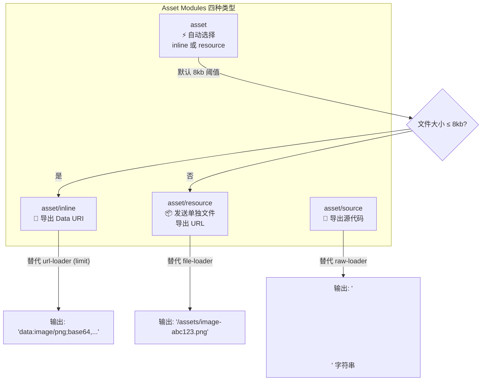
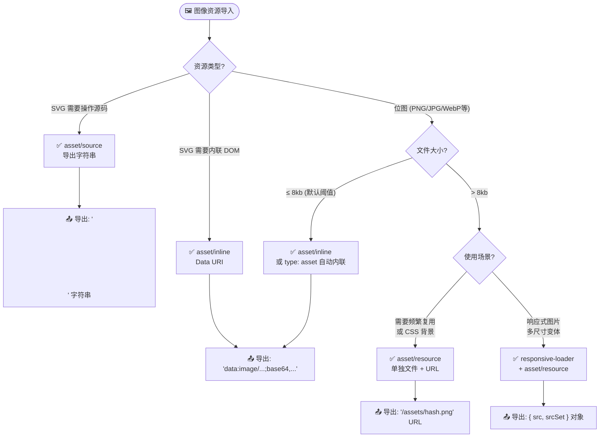
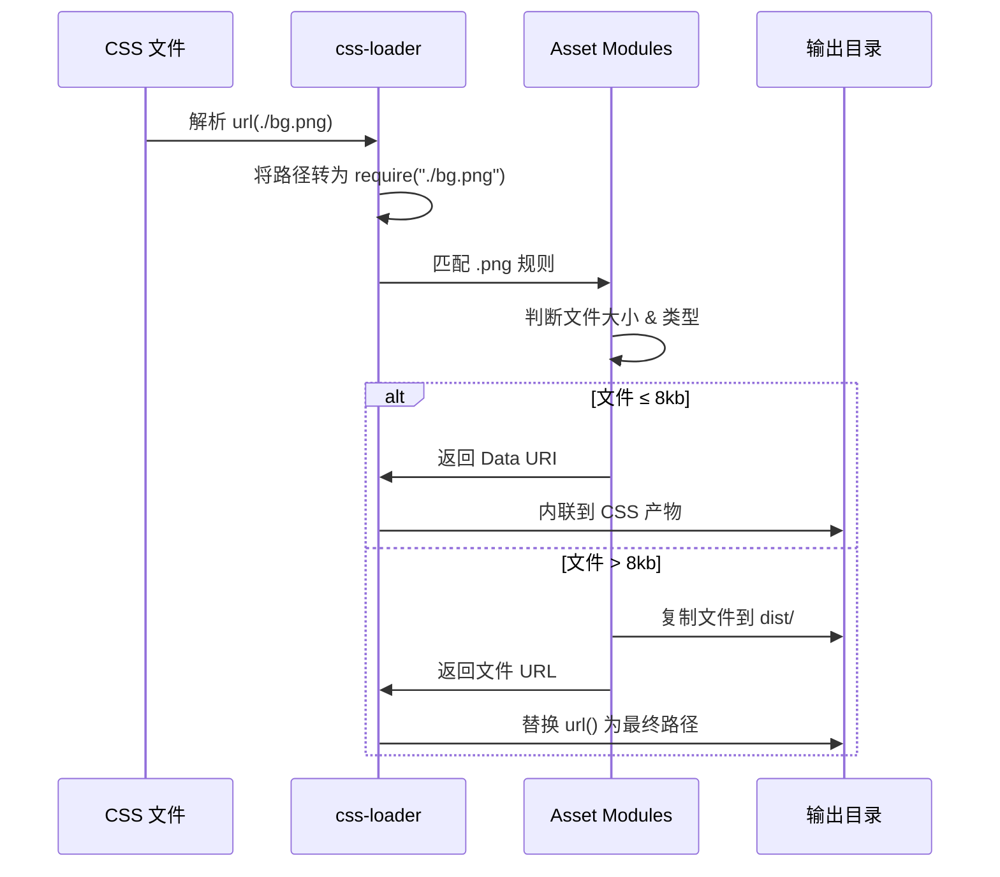

# 深入理解图像加载原理与最佳实践

---


图形图像资源是当代 Web 应用最常用、最直观的内容与装饰元素之一。在 Webpack 出现之前，对图像资源的处理复杂度极高——需要借助一系列工具（甚至 Photoshop）完成压缩、雪碧图、Hash 命名、CDN 部署等操作，流程割裂且难以自动化。

而在 Webpack 中，图像以及其它多媒体资源被提升为**一等公民**——能够像引用普通 JavaScript 模块一样通过 `import/require` 语句导入资源模块。这种开发模式允许我们将图像相关的处理合入统一的心智模型中，极大提升开发效率。

**本章将集中介绍 Webpack 5 体系下处理图像资源的完整方案**，包括：

- **Asset Modules 四种类型**的原理、配置与使用场景
- **新旧方案对比**：file-loader/url-loader vs Asset Modules
- **CSS 中 `url()` 引用图片**的处理流程
- **图像优化**：压缩、现代格式转换（WebP/AVIF）
- **响应式图片**：srcset / `<picture>` / `image-set()`
- **SVG 特殊处理**：内联、组件化、优化
- **图片资源处理决策树**：如何根据场景选择最优策略

---

## 差异对照表：旧方案 vs 新方案

在深入学习之前，先通过一张总览表了解 Webpack 4（Loader 方案）与 Webpack 5（Asset Modules）的核心差异：

| 维度 | Webpack 4（旧方案） | Webpack 5（Asset Modules） |
|------|---------------------|---------------------------|
| **核心依赖** | 需安装 `file-loader`、`url-loader`、`raw-loader` | **零依赖**，内置开箱即用 |
| **配置方式** | `module.rules.use` 指定 Loader | `module.rules.type` 指定资源类型 |
| **发送单独文件** | `file-loader` | `type: "asset/resource"` |
| **内联为 Data URI** | `url-loader` + `limit` 选项 | `type: "asset/inline"` 或 `type: "asset"` + `parser.dataUrlCondition` |
| **导出源代码** | `raw-loader` | `type: "asset/source"` |
| **自动选择策略** | 需手动配置 `url-loader` 的 `limit` + fallback | `type: "asset"` 内置自动判断（默认 8kb 阈值） |
| **输出文件名控制** | Loader 的 `name` 选项 | `generator.outputFilename` 或 `output.assetModuleFilename` |
| **大小阈值配置** | `url-loader` 的 `limit` | `parser.dataUrlCondition.maxSize` |
| **维护状态** | ⚠️ 已标记 deprecated | ✅ 官方推荐，持续演进 |

---

## 一、Asset Modules 核心原理

### 1.1 什么是 Asset Modules？

Asset Modules 是 Webpack 5 引入的一种**内置资源处理模块**，用于替代 `file-loader`、`url-loader`、`raw-loader` 三个常用 Loader。它通过 `module.rules.type` 字段声明资源类型，Webpack 会根据类型自动选择适当的处理策略。

引入 Asset Modules 不仅是为了取代 Loader，更重要的目的是**在 JavaScript Module 之外增加对其他资源的原生支持**——让 Webpack 有机会介入多媒体资源的解析、生成过程，从而实现更标准、高效的资源处理模型。

### 1.2 四种 Asset Module 类型

Asset Modules 提供四种类型，覆盖所有图像资源使用场景：



#### 类型一：`asset/resource`

**作用**：将资源文件发送到输出目录，并导出其 URL（公共路径）。

**对标旧方案**：`file-loader`

```js
// webpack.config.js
module.exports = {
  module: {
    rules: [
      {
        test: /\.(png|jpe?g|gif|webp|avif)$/i,
        type: 'asset/resource',
      },
    ],
  },
};
```

**使用示例**：

```js
import logo from './logo.png';

// logo 的值为输出文件的 URL：
// "/assets/logo-abc123456.png"

const img = new Image();
img.src = logo;
document.body.appendChild(img);
```

**自定义输出文件名**：

```js
module.exports = {
  module: {
    rules: [
      {
        test: /\.(png|jpe?g|gif|webp|avif)$/i,
        type: 'asset/resource',
        generator: {
          // 输出到 images/ 目录，保留原始文件名 + hash + 扩展名
          filename: 'images/[hash][ext][query]',
          // 或者使用占位符自定义
          // filename: 'images/[name].[hash:8][ext]',
        },
      },
    ],
  },
};
```

可用的文件名占位符：

| 占位符 | 说明 | 示例 |
|--------|------|------|
| `[ext]` | 资源扩展名 | `.png` |
| `[name]` | 资源原始名称 | `logo` |
| `[path]` | 相对于 context 的路径 | `assets/images/` |
| `[hash]` | 内容哈希值 | `abc123456` |
| `[hash:<n>]` | 截断的哈希值 | `abc12345` |
| `[contenthash]` | 与 `[hash]` 相同 | - |
| `[fullhash]` | 构建 hash | - |

#### 类型二：`asset/inline`

**作用**：将资源作为 Data URI（Base64 编码）内联到代码中。

**对标旧方案**：`url-loader`（当文件大小 ≤ limit 时）

```js
module.exports = {
  module: {
    rules: [
      {
        test: /\.svg$/i,
        type: 'asset/inline',
      },
    ],
  },
};
```

**使用示例**：

```js
import icon from './icon.svg';

// icon 的值为 Data URI：
// "data:image/svg+xml;base64,PHN2ZyB4bWxucz0..."

console.log(icon); // "data:image/svg+xml;base64,..."
```

**适用场景**：
- 极小的图标（< 10KB）
- 减少 HTTP 请求数（HTTP/1.1 场景）
- 需要避免额外网络请求的资源

#### 类型三：`asset/source`

**作用**：将资源的原始源代码作为字符串导出。

**对标旧方案**：`raw-loader`

```js
module.exports = {
  module: {
    rules: [
      {
        test: /\.txt$/i,
        type: 'asset/source',
      },
    ],
  },
};
```

**使用示例**：

```js
import content from './example.txt';

// content 为文件的文本内容字符串
console.log(content); // "这是文件的内容..."
```

**SVG 特殊应用**：可以将 SVG 作为字符串导入后动态插入 DOM：

```js
import svgContent from './illustration.svg';

// 直接操作 SVG 字符串
const container = document.getElementById('svg-container');
container.innerHTML = svgContent;
```

#### 类型四：`asset`（智能选择）

**作用**：根据文件大小**自动选择** `asset/inline` 或 `asset/resource`。默认阈值为 **8KB**。

**对标旧方案**：`url-loader`（带 `limit` 和 fallback 配置）

```js
module.exports = {
  module: {
    rules: [
      {
        test: /\.(png|jpe?g|gif)$/i,
        type: 'asset',
      },
    ],
  },
};
```

**自定义大小阈值**：

```js
module.exports = {
  module: {
    rules: [
      {
        test: /\.(png|jpe?g|gif)$/i,
        type: 'asset',
        parser: {
          dataUrlCondition: {
            maxSize: 4 * 1024, // 4kb — 小于 4kb 则内联
          },
        },
      },
    ],
  },
};
```

**高级条件判断**：除了基于大小的判断，还可以使用函数进行更复杂的逻辑：

```js
module.exports = {
  module: {
    rules: [
      {
        test: /\.(png|jpe?g|gif)$/i,
        type: 'asset',
        parser: {
          dataUrlCondition: (source, { filename, module }) => {
            // 自定义条件：例如只对特定目录的小文件内联
            if (filename.includes('/icons/')) {
              return source.length < 10 * 1024; // icons 目录 10kb 阈值
            }
            return source.length < 4 * 1024; // 其他 4kb 阈值
          },
        },
      },
    ],
  },
};
```

---

## 二、图片资源处理决策树

面对不同的图像资源和使用场景，如何选择最合适的 Asset Module 类型？下图提供了完整的决策指引：



### 决策要点总结

| 场景 | 推荐类型 | 理由 |
|------|---------|------|
| 大型背景图、Banner | `asset/resource` | 文件独立加载，可缓存 |
| 小图标、Logo（< 8kb） | `asset` 或 `asset/inline` | 减少请求，内联开销小 |
| SVG 需要动态修改 | `asset/source` | 可操作 SVG 源码 |
| 响应式多尺寸图 | `responsive-loader` | 自动生成多分辨率变体 |
| ICO/Favicon | `asset/resource` | 必须以独立文件存在 |

---

## 三、全格式图片配置指南

### 3.1 通用配置（推荐）

以下是一个生产就绪的通用图片资源配置，涵盖主流格式：

```js
// webpack.config.js
const path = require('path');

module.exports = {
  entry: './src/index.js',
  output: {
    path: path.resolve(__dirname, 'dist'),
    filename: '[name].[contenthash].js',
    clean: true,
    // 全局 Asset Module 默认文件名
    assetModuleFilename: 'assets/[hash][ext][query]',
  },
  module: {
    rules: [
      {
        // 位图：PNG / JPG / JPEG / GIF / WebP / AVIF / BMP / ICO
        test: /\.(png|jpe?g|gif|webp|avif|bmp|ico)$/i,
        type: 'asset',
        parser: {
          dataUrlCondition: {
            maxSize: 8 * 1024, // 8kb
          },
        },
        generator: {
          filename: 'images/[name].[hash:8][ext]',
        },
      },
      {
        // 矢量图：SVG（默认作为 resource 处理）
        test: /\.svg$/i,
        oneOf: [
          {
            // 带查询参数 ?raw 时导出源码
            resourceQuery: /raw/,
            type: 'asset/source',
          },
          {
            // 带 ?inline 时强制内联
            resourceQuery: /inline/,
            type: 'asset/inline',
          },
          {
            // 默认：作为资源文件输出
            type: 'asset/resource',
            generator: {
              filename: 'icons/[name].[hash:8][ext]',
            },
          },
        ],
      },
    ],
  },
};
```

### 3.2 各格式特性说明

| 格式 | MIME 类型 | 透明通道 | 动画支持 | 推荐用途 | 推荐处理方式 |
|------|-----------|----------|----------|----------|-------------|
| **PNG** | `image/png` | ✅ 支持 | ❌ | 截图、透明图、UI 元素 | `asset`（自动选择） |
| **JPG/JPEG** | `image/jpeg` | ❌ 不支持 | ❌ | 照片、渐变图像 | `asset/resource` |
| **GIF** | `image/gif` | ✅ 支持 | ✅ | 简单动画 | `asset/resource` |
| **WebP** | `image/webp` | ✅ 支持 | ✅ | 现代浏览器优化格式 | `asset/resource` |
| **AVIF** | `image/avif` | ✅ 支持 | ✅ | 下一代高压缩格式 | `asset/resource` |
| **SVG** | `image/svg+xml` | ✅ 支持 | ✅ | 图标、插图、Logo | `asset/resource` 或 `asset/source` |
| **ICO** | `image/x-icon` | ✅ 支持 | ❌ | 网站图标 | `asset/resource` |
| **BMP** | `image/bmp` | 部分支持 | ❌ | 兼容性需求 | `asset/resource` |

### 3.3 在代码中使用不同格式的图片

```js
// ===== 位图导入 =====
import heroImage from './hero.jpg';           // JPG 照片
import avatar from './avatar.webp';            // WebP 格式
import bannerAvif from './banner.avif';        // AVIF 高压缩格式
import sticker from './sticker.gif';           // GIF 动画
import favicon from './favicon.ico';           // 网站图标

// ===== SVG 导入（多种方式）=====
import iconSvg from './icon.svg';              // 默认 → URL
import iconRaw from './icon.svg?raw';          // 导出源码字符串
import iconInline from './icon.svg?inline';    // 强制内联 Data URI

// ===== 使用示例 =====

// 1. 在 JS 中创建  元素
const img = document.createElement('img');
img.src = heroImage;
img.alt = 'Hero Image';
document.body.appendChild(img);

// 2. 在 CSS 中使用（见下一节）
// background-image: url('./hero.jpg');

// 3. React 组件中使用
function Avatar() {
  return ;
}

// 4. SVG 操作源码
function renderIcon() {
  const container = document.getElementById('icon-container');
  container.innerHTML = iconRaw; // 直接插入 SVG 字符串
}
```

---

## 四、CSS 中 url() 引用图片的处理流程

### 4.1 处理流程概览

当在 CSS 文件中使用 `url()` 引用图片时，Webpack 的处理流程如下：



### 4.2 完整配置示例

```js
// webpack.config.js
module.exports = {
  module: {
    rules: [
      {
        // 处理 CSS 文件
        test: /\.css$/i,
        use: ['style-loader', 'css-loader'],
      },
      {
        // 处理 CSS 中引用的图片
        test: /\.(png|jpe?g|gif|webp|avif|svg)$/i,
        type: 'asset',
        parser: {
          dataUrlCondition: {
            maxSize: 8 * 1024,
          },
        },
      },
    ],
  },
};
```

### 4.3 CSS 使用示例

```css
/* styles.css */

/* 大背景图 → 输出为单独文件 */
.hero-background {
  background-image: url('./images/hero-bg.jpg');
  background-size: cover;
}

/* 小图标 → 可能内联为 Data URI */
.icon-home {
  background-image: url('./icons/home.png');
  width: 16px;
  height: 16px;
}

/* SVG 图标 */
.logo {
  background-image: url('./logo.svg');
  width: 120px;
  height: 40px;
}

/* WebP 格式（配合回退方案） */
.banner {
  background-image: image-set(
    './banner.avif' type('image/avif'),
    './banner.webp' type('image/webp'),
    './banner.jpg' type('image/jpeg')
  );
}
```

### 4.4 experiments.css 原生解析（实验性功能）

Webpack 5 提供了 `experiments.css` 实验性选项，启用后可在不借助 `css-loader` 的情况下原生解析 CSS 中的 `url()` 引用：

```js
// webpack.config.js
module.exports = {
  experiments: {
    css: true, // 启用原生 CSS 支持
  },
  module: {
    rules: [
      {
        test: /\.css$/i,
        type: 'asset/resource', // 或 'asset/source'
      },
      {
        test: /\.(png|jpe?g|gif|webp|avif|svg)$/i,
        type: 'asset',
      },
    ],
  },
};
```

> **注意**：`experiments.css` 仍处于实验阶段，API 可能发生变化。生产环境建议继续使用 `css-loader` + `style-loader`（或 `mini-css-extract-plugin`）的成熟方案。

---

## 五、图像优化方案

### 5.1 图像压缩

#### 方案一：image-minimizer-webpack-plugin（推荐）

[image-minimizer-webpack-plugin](https://github.com/webpack-contrib/image-minimizer-webpack-plugin) 是 Webpack 社区维护的官方推荐图像压缩插件，支持无损和有损压缩。

**安装依赖**：

```bash
npm install --save-dev image-minimizer-webpack-plugin

npm install --save-dev imagemin-optipng   # PNG 无损压缩
npm install --save-dev imagemin-mozjpeg   # JPEG 有损压缩
npm install --save-dev imagemin-svgo       # SVG 优化

npm install --save-dev sharp
```

**配置示例**：

```js
// webpack.config.js
const ImageMinimizerPlugin = require('image-minimizer-webpack-plugin');

module.exports = {
  module: {
    rules: [
      {
        test: /\.(png|jpe?g|gif|webp|avif|svg)$/i,
        type: 'asset/resource',
      },
    ],
  },
  plugins: [
    new ImageMinimizerPlugin({
      minimizer: {
        implementation: ImageMinimizerPlugin.imageminGenerate,
        options: {
          plugins: [
            ['imagemin-optipng', { optimizationLevel: 7 }],
            ['imagemin-mozjpeg', { quality: 80 }],
            ['imagemin-svgo', {
              plugins: [
                { name: 'removeViewBox', active: false },
                { name: 'removeEmptyAttrs', active: true },
              ],
            }],
          ],
        },
      },
      // 仅在生产环境压缩
      disable: process.env.NODE_ENV === 'development',
    }),
  ],
};
```

**使用 sharp 引擎（推荐，速度更快）**：

```js
const ImageMinimizerPlugin = require('image-minimizer-webpack-plugin');

module.exports = {
  plugins: [
    new ImageMinimizerPlugin({
      minimizer: {
        implementation: ImageMinimizerPlugin.sharpGenerate,
        options: {
          encodeOptions: {
            jpeg: { quality: 80 },
            webp: { quality: 80, effort: 6 },
            avif: { quality: 60, effort: 9 },
            png: { effort: 7, palette: true },
          },
        },
      },
    }),
  ],
};
```

#### 各压缩工具对比

| 工具 | 支持格式 | 压缩类型 | 特点 |
|------|---------|----------|------|
| **imagemin-optipng** | PNG | 无损 | 反复迭代优化，效果好但较慢 |
| **imagemin-mozjpeg** | JPEG/JPG | 有损 | 由 Mozilla 开发，质量/体积平衡优秀 |
| **imagemin-svgo** | SVG | 无损 | 移除冗余属性、优化结构 |
| **sharp** | 全格式 | 有损/无损 | 高性能 libvips 绑定，速度快 |
| **imagemin-gifsicle** | GIF | 有损/无损 | GIF 专用优化 |
| **imagemin-webp** | PNG→WebP | 有损 | 格式转换 + 压缩 |

### 5.2 现代格式支持：WebP / AVIF

现代图片格式（WebP、AVIF）相比传统 PNG/JPG 能提供更好的压缩率，通常能减少 **25%-50%** 的文件体积。

#### 方案一：构建时自动转换

使用 `image-minimizer-webp` 或 sharp 在构建时将 PNG/JPG 转换为 WebP：

```js
const ImageMinimizerPlugin = require('image-minimizer-webpack-plugin');

module.exports = {
  plugins: [
    new ImageMinimizerPlugin({
      minimizer: {
        implementation: ImageMinimizerPlugin.sharpGenerate,
        options: {
          encodeOptions: {
            webp: { quality: 80, effort: 6 },
            avif: { quality: 60, effort: 9 },
          },
        },
      },
      // 生成 WebP 变体
      generate: [
        {
          type: 'webp',
          extension: 'webp',
          test: /\.(jpe?g|png)$/i,
        },
        {
          type: 'avif',
          extension: 'avif',
          test: /\.(jpe?g|png)$/i,
        },
      ],
    }),
  ],
});
```

#### 方案二：运行时使用 `<picture>` 标签

```html
<picture>
  <!-- 浏览器优先选择支持的格式 -->
  <source srcset="hero.avif" type="image/avif">
  <source srcset="hero.webp" type="image/webp">
  <!-- 回退到传统格式 -->
  
</picture>
```

#### 方案三：CSS image-set()

```css
.hero-banner {
  background-image: image-set(
    'hero.avif' type('image/avif'),
    'hero.webp' type('image/webp'),
    'hero.jpg' type('image/jpeg')
  );
}
```

---

## 六、响应式图片实现

### 6.1 使用 responsive-loader

[responsive-loader](https://www.npmjs.com/package/responsive-loader) 可以自动生成多个分辨率的图片变体。

**安装**：

```bash
npm install --save-dev responsive-loader sharp
```

**配置**：

```js
// webpack.config.js
module.exports = {
  module: {
    rules: [
      {
        test: /\.(png|jpe?g|webp)$/i,
        oneOf: [
          {
            // 带尺寸参数时使用 responsive-loader
            resourceQuery: /sizes?/,
            type: 'javascript/auto',
            use: [
              {
                loader: 'responsive-loader',
                options: {
                  adapter: require('responsive-loader/sharp'),
                  sizes: [300, 600, 1024, 1920],
                  format: 'webp', // 输出 WebP 格式
                  quality: 80,
                  placeholder: true, // 生成低质量占位图
                  placeholderSize: 50,
                },
              },
            ],
          },
          {
            // 默认使用 Asset Modules
            type: 'asset/resource',
          },
        ],
      },
    ],
  },
};
```

**使用方法**：

```js
// JS 中使用
import responsiveImg from './photo.jpg?sizes[]=400,sizes[]=800,sizes[]=1200';

function Photo() {
  return (
    
  );
}
```

### 6.2 手动实现 srcset

如果不想引入额外的 loader，可以手动准备多张图片并通过 Asset Modules 导入：

```js
import src1x from './photo-320w.jpg';
import src2x from './photo-640w.jpg';
import src3x from './photo-1280w.jpg';


```

### 6.3 CSS 中的响应式图片

```css
/* 使用 media query + 不同尺寸图片 */
.hero {
  background-image: url('./hero-small.jpg'); /* 默认小图 */
}

@media (min-width: 768px) {
  .hero {
    background-image: url('./hero-medium.jpg');
  }
}

@media (min-width: 1200px) {
  .hero {
    background-image: url('./hero-large.jpg');
  }
}

/* 使用 image-set()（现代浏览器） */
.modern-hero {
  background-image: image-set(
    './hero-small.jpg' 1x,
    './hero-large.jpg' 2x
  );
}
```

---

## 七、SVG 特殊处理

SVG（Scalable Vector Graphics）作为一种矢量格式，具有独特的处理需求。以下是几种常见场景的解决方案：

### 7.1 SVG 作为图片引用

```js
// webpack.config.js
{
  test: /\.svg$/i,
  type: 'asset/resource',
  generator: {
    filename: 'icons/[name].[hash:8][ext]',
  },
}

// 使用
import icon from './search.svg';
// icon → "/icons/search.abc12345.svg"
```

### 7.2 SVG 内联（Data URI）

```js
{
  test: /\.svg$/i,
  type: 'asset/inline',
}

// 使用
import icon from './menu.svg';
// icon → "data:image/svg+xml;base64,PHN2ZyB..."
```

### 7.3 SVG 导出为字符串（可操作源码）

```js
{
  test: /\.svg$/i,
  type: 'asset/source',
}

// 使用
import svgString from './illustration.svg';
// svgString → "<svg xmlns='...' viewBox='...'>...</svg>"

// 可以动态修改后插入 DOM
const container = document.getElementById('app');
container.innerHTML = svgString;
```

### 7.4 SVG 优化（SVGO）

使用 `svgo-loader` 或 `image-minimizer-webpack-plugin` 的 SVGO 插件优化 SVG：

```bash
npm install --save-dev svgo-loader
```

```js
// webpack.config.js
module.exports = {
  module: {
    rules: [
      {
        test: /\.svg$/i,
        oneOf: [
          {
            resourceQuery: /raw/,
            type: 'asset/source',
            use: [
              {
                loader: 'svgo-loader',
                options: {
                  plugins: [
                    { name: 'removeViewBox', active: false },
                    { name: 'removeEmptyAttrs', active: true },
                    { name: 'convertColors', params: { currentColor: true } },
                  ],
                },
              },
            ],
          },
          {
            type: 'asset/resource',
          },
        ],
      },
    ],
  },
};
```

### 7.5 SVG 转 React/Vue 组件

使用 [@svgr/webpack](https://www.npmjs.com/package/@svgr/webpack) 将 SVG 转换为 React 组件：

```bash
npm install --save-dev @svgr/webpack
```

```js
// webpack.config.js
module.exports = {
  module: {
    rules: [
      {
        test: /\.svg$/i,
        issuer: /\.[jt]sx?$/,
        use: [{ loader: '@svgr/webpack', options: { svgo: false } }],
      },
      // 非 JS/TS 导入的 SVG 仍走 Asset Modules
      {
        test: /\.svg$/i,
        type: 'asset/resource',
        issuer: { not: /\.[jt]sx?$/ },
      },
    ],
  },
};
```

```jsx
// 使用 —— SVG 变成 React 组件！
import IconSearch from './search.svg';

function SearchButton() {
  return (
    <button>
      <IconSearch width={24} height={24} color="currentColor" />
      搜索
    </button>
  );
}
```

---

## 八、雪碧图（Sprite Sheet）

> **重要提示**：雪碧图曾是 HTTP/1.1 时代的重要优化手段，但随着 HTTP/2 多路复用的普及，其优化效果已大幅减弱甚至变为反优化。**新项目不建议使用雪碧图**，此处仅作知识留存。

### 8.1 传统雪碧图方案

```bash
npm install --save-dev webpack-spritesmith
```

```js
// webpack.config.js
const SpritesmithPlugin = require('webpack-spritesmith');
const path = require('path');

module.exports = {
  plugins: [
    new SpritesmithPlugin({
      src: {
        cwd: path.resolve(__dirname, 'src/icons'),
        glob: '*.png',
      },
      target: {
        image: path.resolve(__dirname, 'src/assets/sprite.png'),
        css: path.resolve(__dirname, 'src/assets/sprite.less'),
      },
      apiOptions: {
        cssImageRef: '../sprite.png',
      },
    }),
  ],
};
```

### 8.2 现代 SVG Sprite 方案（推荐替代）

相比位图雪碧图，**SVG Symbol Sprite** 是更现代的方案：

```html
<!-- sprite.svg 中的 <symbol> 需以内联方式写入 HTML 才能被同文档 <use> 引用 -->
<!-- （通过  加载的 SVG 是独立文档，其中的 symbol 无法被页面 <use> 引用；
     也可通过 ajax 获取 sprite.svg 后注入 DOM） -->
<svg xmlns="http://www.w3.org/2000/svg" style="display:none">
  <symbol id="icon-search" viewBox="0 0 24 24">
    <circle cx="11" cy="11" r="8"/>
    <path d="M21 21l-4.35-4.35"/>
  </symbol>
  <symbol id="icon-menu" viewBox="0 0 24 24">
    <line x1="3" y1="6" x2="21" y2="6"/>
    <line x1="3" y1="12" x2="21" y2="12"/>
    <line x1="3" y1="18" x2="21" y2="18"/>
  </symbol>
</svg>

<!-- 多次复用 -->
<svg><use href="#icon-search"/></svg>
<svg><use href="#icon-menu"/></svg>
```

---

## 九、生产环境最佳实践配置

以下是一份经过生产验证的完整图片处理配置：

```js
// webpack.prod.js
const path = require('path');
const ImageMinimizerPlugin = require('image-minimizer-webpack-plugin');
const isProduction = process.env.NODE_ENV === 'production';

module.exports = {
  mode: isProduction ? 'production' : 'development',
  output: {
    path: path.resolve(__dirname, 'dist'),
    filename: isProduction ? '[name].[contenthash:8].js' : '[name].js',
    assetModuleFilename: 'assets/[name].[hash:8][ext]',
    publicPath: '/',
    clean: true,
  },

  module: {
    rules: [
      // === 位图处理 ===
      {
        test: /\.(png|jpe?g|gif|webp|avif|bmp|ico)$/i,
        type: 'asset',
        parser: {
          dataUrlCondition: {
            maxSize: 8 * 1024, // 8kb 阈值
          },
        },
        generator: {
          filename: 'images/[name].[hash:8][ext]',
        },
      },

      // === SVG 处理 ===
      {
        test: /\.svg$/i,
        oneOf: [
          {
            // React/Vue 组件化导入
            issuer: /\.[jt]sx?$/,
            use: [{ loader: '@svgr/webpack', options: { svgo: false, titleProp: true } }],
          },
          {
            // 源码字符串导入
            resourceQuery: /raw/,
            type: 'asset/source',
            use: isProduction ? [{
              loader: 'svgo-loader',
              options: {
                multipass: true,
                plugins: [
                  { name: 'preset-default', params: { overrides: { removeViewBox: false } } },
                  { name: 'removeEmptyContainers', active: true },
                  { name: 'sortAttrs', active: true },
                ],
              },
            }] : [],
          },
          {
            // 默认：资源文件
            type: 'asset/resource',
            generator: {
              filename: 'icons/[name].[hash:8][ext]',
            },
          },
        ],
      },
    ],
  },

  // === 图像优化插件 ===
  ...(isProduction ? [
    new ImageMinimizerPlugin({
      minimizer: {
        implementation: ImageMinimizerPlugin.sharpGenerate,
        options: {
          encodeOptions: {
            mozjpeg: { progressive: true, quality: 80 },
            optipng: { optimizationLevel: 7 },
            svgo: {
              plugins: [
                { name: 'preset-default', params: { overrides: { removeViewBox: false } } },
              ],
            },
            webp: { quality: 80, effort: 6 },
            avif: { quality: 60, effort: 9 },
            png: { effort: 7, palette: true },
          },
        },
      },
      // 并行处理
      parallel: true,
    }),
  ] : []),
};
```

---

## 十、性能优化建议

### 10.1 图像加载性能清单

| 优化项 | 方法 | 预期收益 |
|--------|------|----------|
| **选择合适格式** | 照片用 JPG/WebP，截图用 PNG，图标用 SVG | 减少 30-70% 体积 |
| **使用现代格式** | 提供 WebP/AVIF 回退方案 | 再减少 25-50% |
| **压缩图像** | image-minimizer-webpack-plugin | 减少 20-60% 体积 |
| **小图内联** | asset/inline 或 type: asset（≤8kb） | 减少请求 |
| **懒加载** | `loading="lazy"` 或 IntersectionObserver | 减少首屏请求数 |
| **响应式图片** | srcset + sizes | 减少传输数据量 |
| **CDN 分发** | publicPath 指向 CDN | 减少延迟 |
| **缓存策略** | content hash + 长缓存 | 减少重复下载 |
| **预加载关键图片** | `<link rel="preload" as="image">` | 加快首屏渲染 |

### 10.2 关键图片预加载

```html
<!-- 预加载首屏 Hero 图片 -->
<link rel="preload" as="image" href="/images/hero.webp" type="image/webp">

<!-- 或在 Webpack 中配置 -->
```

```js
// webpack.config.js
module.exports = {
  plugins: [
    // 使用 html-webpack-plugin 注入 preload
    new HtmlWebpackPlugin({
      template: './index.html',
    }),
  ],
};
```

---

## 总结

本章系统介绍了 Webpack 5 中图像资源处理的完整方案，核心要点如下：

1. **Asset Modules 是 Webpack 5 处理图像的唯一推荐方案**，四种类型（`asset/resource`、`asset/inline`、`asset/source`、`asset`）覆盖所有使用场景，无需安装任何 Loader。

2. **`type: "asset"` 是大多数情况下的最佳选择**，它内置了基于文件大小的智能判断逻辑（默认 8kb 阈值），小文件自动内联、大文件单独输出。

3. **CSS 中的 `url()` 引用会经过完整的 Asset Modules 处理链路**，css-loader 负责将其转换为 require 语句，再由 Asset Modules 决定最终处理方式。

4. **图像优化应分层实施**：先选对格式（照片→JPG/WebP，矢量→SVG），再用 `image-minimizer-webpack-plugin` 压缩，最后考虑现代格式（WebP/AVIF）和响应式方案。

5. **SVG 具有特殊性**，可根据需求选择作为图片引用、内联 Data URI、导出源码字符串、甚至转换为 React/Vue 组件。

6. **雪碧图已成为历史**，HTTP/2 时代不应再使用，SVG Symbol Sprite 是更现代的图标复用方案。

---

## 思考题

1. 如何在同一个项目中同时支持 PNG/JPG 原始格式和 WebP/AVIF 现代格式，并在运行时按浏览器能力自动选择？
2. 对于一个包含 200+ 个 SVG 图标的项目，你会选择哪种 Asset Module 类型？为什么？如何进一步优化？
3. `type: "asset"` 的默认 8kb 阈值是否适合所有项目？什么情况下应该调整这个值？
4. 如何实现一套完整的响应式图片方案，同时兼顾 `` 标签和 CSS `background-image`？
5. 除了本文提到的优化措施外，还有哪些图像优化手段可以通过 Webpack 实现？（提示：渐进式 JPEG、模糊占位符、Placeholder 生成等）

---

> **参考资源**
>
> - [Webpack 官方文档 - Asset Modules](https://webpack.js.org/guides/asset-modules/)
> - [image-minimizer-webpack-plugin](https://github.com/webpack-contrib/image-minimizer-webpack-plugin)
> - [MDN - Responsive Images](https://developer.mozilla.org/en-US/docs/Learn/HTML/Multimedia_and_embedding/Responsive_images)
> - [SVGO 官方文档](https://github.com/svg/svgo)
> - [Sharp 高性能图像处理库](https://sharp.pixelplumbing.com/)
