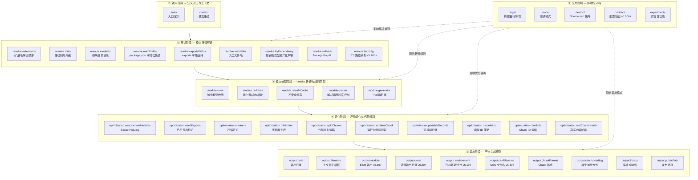
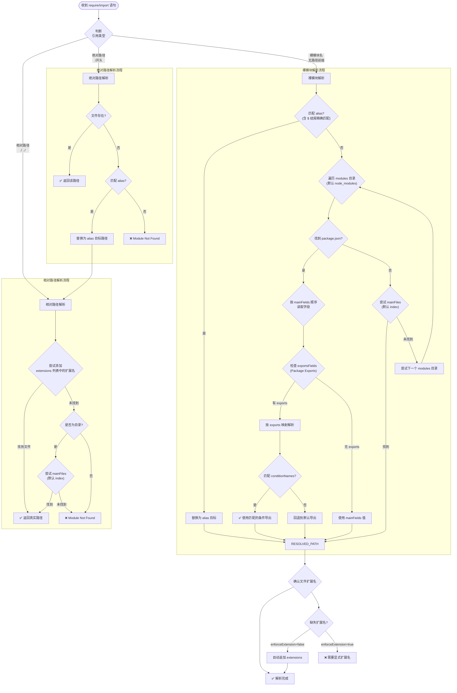

# 深入理解 Webpack 核心配置结构

>
> **适用读者**：已经掌握 Webpack 基本用法，希望对每个配置项达到"专家级"理解的开发者。

## 📋 与 v1 版本的差异对照表

| 维度 | v1（原始版本） | v2（本版本）
| ------|----------------|-------------
| **Webpack 版本** | ~v4/v5 早期 | **v5.107** |
| **覆盖范围** | entry/output/target/mode 四项 | **entry/output/resolve/module/optimization/devtool/target/validate/experiments** 全覆盖 |
| **类型签名** | ❌ 无 | ✅ 每个配置项均有完整 TypeScript 类型签名 |
| **可选值枚举** | 部分列举 | ✅ 全量枚举，标注默认值 |
| **Mermaid 图表** | 无 | ✅ 核心配置全景图 + resolve 解析算法流程图 |
| **resolve 深度** | 未涉及 | ✅ 完整解析算法流程图 + byDependency/fallback/tsconfig |
| **output 新特性** | 仅 path/filename/publicPath | ✅ module/clean/environment/cssFilename/chunkFormat/chunkLoading/library |
| **module 新特性** | 仅 rules 基础用法 | ✅ noParse/unsafeCache/parser(anonymousDefaultExportName v5.107) |
| **optimization 深度** | 名称提及 | ✅ concatenateModules/usedExports/minimize/splitChunks/runtimeChunk/portableRecords 逐项详解 |
| **devtool** | 简单提及 | ✅ 数组值支持(v5.105+) + 20+ 选项效果对比表 |
| **validate** | ❌ 不存在 | ✅ v5.106+ 新增配置验证 |
| **experiments** | ❌ 不存在 | ✅ 各选项最新状态更新 |
| **代码示例** | 基础示例 | ✅ 生产级完整示例 |

---

## 🗺️ Webpack 核心配置项全景图

下图以 **Dependency Graph 构建流程** 为骨架，展示了 Webpack 所有核心配置项在打包流程中的位置与作用域：



---

## 1. `entry` — 入口配置深度解析

`entry` 是 Webpack 构建 Dependency Graph 的起点。虽然用法看似简单，但其**完整的类型体系**和**高级特性**值得深入掌握。

### 1.1 完整类型签名

```typescript
type EntryDescription = {
  import: string | string[] | (() => string | string[] | Promise<string | string[]>);
  filename?: string;
  dependOn?: string | string[];
  library?: LibraryOptions;
  runtime?: string | false;
  baseHref?: string;
  publicPath?: string;
  chunkLoading?: false | 'jsonp' | 'import-scripts' | 'require' | 'async-node';
  asyncChunks?: boolean;
};

type EntryDynamic =
  | string
  | string[]
  | { [entryChunkName: string]: string | string[] | EntryDescription }
  | (() => EntryDynamic | Promise<EntryDynamic>);
```

### 1.2 各形态详细说明

#### ① 字符串形态（最简形式）

```javascript
// 类型: string
module.exports = {
  entry: './src/index.js'
};
```

**等价的对象写法**：

```javascript
entry: {
  main: './src/index.js'
}
```

当 `entry` 为字符串时，Webpack 内部会自动将其转换为 `{ main: <string> }`。

#### ② 数组形态（多预依赖）

```javascript
// 类型: string[]
module.exports = {
  entry: ['./src/polyfills.js', './src/index.js']
};
```

**内部行为**：数组中的所有模块会被**打包到同一个 Chunk** 中，加载顺序为数组声明顺序。典型用途是在业务代码前加载 polyfill 或 vendor 库。

**等价对象写法**：

```javascript
entry: {
  main: ['./src/polyfills.js', './src/index.js']
}
```

#### ③ 对象形态（多入口 + 高级控制）

这是**最强大**的形态，支持多入口及每个入口的精细控制：

```javascript
module.exports = {
  entry: {
    // === 基础字符串值 ===
    home: './src/home.js',

    // === 数组值（预依赖）===
    shared: ['react', 'react-dom', 'redux'],

    // === EntryDescription 对象（完整控制）===
    personal: {
      import: './src/personal.js',
      filename: 'pages/[name].js',
      dependOn: 'shared',
      chunkLoading: 'jsonp',
      asyncChunks: true,
    },

    // === 函数形态（动态计算）===
    admin: () => './src/admin.js',

    // === 异步函数（远程获取入口）===
    dashboard: async () => {
      const { default: entries } = await fetch('https://api.example.com/entries');
      return entries.dashboard;
    }
  },
};
```

#### ④ 函数形态（动态入口）

```javascript
// 同步函数
module.exports = {
  entry: () => './src/index.js'
};

// 异步函数（支持远程获取）
module.exports = {
  entry: async () => {
    const config = await fetch('./entry-config.json').then(r => r.json());
    return config.entries;
  }
};

// 返回对象
module.exports = {
  entry: () => ({
    main: './src/index.js',
    admin: './src/admin.js'
  })
};
```

**函数接收参数**（仅当导出为函数时）：

```javascript
module.exports = async function(env, argv) {
  // env: --env 传入的自定义参数
  // argv: CLI 参数（如 --mode, --config-name）
  return {
    entry: {
      main: argv.mode === 'production'
        ? './src/index.prod.js'
        : './src/index.dev.js'
    }
  };
}
```

### 1.3 EntryDescription 属性逐项详解

| 属性 | 类型 | 默认值 | 说明
| ------|------|--------|------
| `import` | `string \| string[] \| function` | **必填** | 入口模块路径或路径数组 |
| `filename` | `string` | 继承 `output.filename` | 该入口产物的文件名模板 |
| `dependOn` | `string \| string[]` | `undefined` | 前置依赖入口名称 |
| `runtime` | `string \| false` | `undefined` | 运行时代码归属的 Chunk 名 |
| `library` | `object \| string` | `undefined` | 库输出配置（覆盖 output.library） |
| `publicPath` | `string` | 继承 `output.publicPath` | 该入口的发布 URL |
| `chunkLoading` | `false \| 'jsonp' \| ...` | 继承 `output.chunkLoading` | 异步 Chunk 加载方式 |
| `asyncChunks` | `boolean` | `true` | 是否允许创建异步 Chunk |
| `baseHref` | `string` | `undefined` | HTML base href（实验性） |

### 1.4 `dependOn` 深入剖析

`dependOn` 声明当前入口的前置依赖，用于**消除重复代码**：

```javascript
module.exports = {
  entry: {
    // 主入口：包含框架代码 + 运行时
    vendor: {
      import: ['react', 'react-dom', 'lodash'],
      filename: 'vendor.[contenthash:8].js',
    },

    // 页面A：依赖 vendor，只包含页面特有代码
    pageA: {
      import: './src/pages/pageA.js',
      dependOn: 'vendor',
      filename: 'pageA.[contenthash:8].js',
    },

    // 页面B：同样依赖 vendor
    pageB: {
      import: './src/pages/pageB.js',
      dependOn: 'vendor',
      filename: 'pageB.[contenthash:8].js',
    },
  },
};
```

**核心效果**：
- `pageA` 和 `pageB` 的产物中**不会重复包含** `react`、`react-dom`、`lodash`
- 运行时代码（`__webpack_require__` 等）也只会出现在 `vendor` 中
- 浏览器需先加载 `vendor`，再加载具体页面

**⚠️ 注意事项**：
- `dependOn` 可以指定**多个前置依赖**：`dependOn: ['vendor', 'common']`
- 不能形成**循环依赖**
- 配合 `<script>` 标签加载时，需保证依赖顺序

### 1.5 `runtime` 深入剖析

`runtime` 用于将多个入口的**运行时代码提取到共享 Chunk**：

```javascript
module.exports = {
  entry: {
    main: {
      import: './src/main.js',
      runtime: 'shared-runtime',  // 运行时抽取到 shared-runtime
    },
    about: {
      import: './src/about.js',
      runtime: 'shared-runtime',   // 同一个 runtime chunk
    },
    contact: {
      import: './src/contact.js',
      runtime: false,              // 内联运行时（不抽取）
    },
  },
  output: {
    filename: '[name].[contenthash:8].js',
  },
};
```

**产出结果**：
- `shared-runtime.js`：包含 `__webpack_require__`、模块缓存、异步加载逻辑等
- `main.xxx.js`：纯净的业务代码，无运行时开销
- `about.xxx.js`：同上
- `contact.xxx.js`：内联运行时（`runtime: false`）

**性能收益**：当多个入口共享同一 runtime 时，浏览器可缓存 runtime 文件，后续入口文件体积更小。

### 1.6 生产级最佳实践

```javascript
const path = require('path');

module.exports = {
  mode: 'production',

  entry: {
    // 主应用入口
    main: {
      import: ['./src/polyfills.ts', './src/main.tsx'],
      filename: 'js/app.[contenthash:8].js',
    },

    // 管理后台（独立入口）
    admin: {
      import: './src/admin.tsx',
      filename: 'js/admin.[contenthash:8].js',
      dependOn: 'main',
    },

    // SSR 入口（Node.js 环境）
    ssr: {
      import: './src/ssr.tsx',
      filename: 'ssr/bundle.js',
      library: { type: 'commonjs2' },
      runtime: false,
    },
  },

  output: {
    path: path.resolve(__dirname, 'dist'),
    publicPath: 'https://cdn.example.com/',
    clean: true,
  },
};
```

---

## 2. `output` — 输出配置深度解析

`output` 是 Webpack 最复杂的配置项之一，控制着产物的**位置、格式、命名规则、环境兼容性**等方方面面。

### 2.1 完整类型签名（精选核心属性）

```typescript
interface Output {
  // === 基础路径 ===
  path: string;
  publicPath?: string;

  // === 文件名模板 ===
  filename?: string | ((pathData: PathData, assetInfo?: AssetInfo) => string);
  chunkFilename?: string;
  cssFilename?: string;          // v5.107+
  cssChunkFilename?: string;     // v5.107+
  assetModuleFilename?: string;

  // === 输出格式 ===
  module?: boolean;               // v5.107+: ESM 输出
  library?: LibraryOptions | string;
  libraryExport?: string;         // 已废弃，使用 library.export
  libraryTarget?: string;         // 已废弃，使用 library.type
  libraryUniqueName?: boolean;
  chunkFormat?: 'array-push' | 'commonjs' | 'module' | 'array-push-with-web-worker';

  // === 异步加载 ===
  chunkLoading?: false | 'jsonp' | 'import-scripts' | 'require' | 'async-node';
  chunkLoadTimeout?: number;
  chunkLoadingGlobal?: string;

  // === 清理与环境 ===
  clean?: CleanOptions | boolean;
  environment?: Environment;
  compareBeforeEmit?: boolean;    // v5.107+

  // === 其他 ===
  uniqueName?: string;
  crossOriginLoading?: false | 'anonymous' | 'use-credentials';
  charset?: boolean;
  sourceMapFilename?: string;
  devtoolModuleFilenameTemplate?: string | ((info: object) => string);
  devtoolFallbackModuleFilenameTemplate?: string | ((info: object) => string);
  strictModuleExceptionHandling?: boolean;
  globalObject?: string;
  importFunctionName?: string;
  importMetaName?: string;
  scriptType?: false | 'text/javascript' | 'module';
  enabledLibraryTypes?: string[];
  trustedTypes?: TrustedTypesPolicyOptions;
  workerPublicPath?: string;
  asyncChunks?: boolean;
  wasmLoading?: 'fetch' | 'async-node';
}
```

### 2.2 核心属性逐项详解

#### 2.2.1 `path` — 输出目录

| 属性 | 值
| ------|-----
| **类型** | `string`（绝对路径） |
| **默认值** | `path.join(process.cwd(), 'dist')` |
| **必填** | 是（除非使用 `compiler.outputPath`） |

```javascript
const path = require('path');

module.exports = {
  output: {
    path: path.resolve(__dirname, 'dist/release'),
  },
};
```

**⚠️ 重要**：
- 必须是**绝对路径**
- 推荐使用 `path.resolve(__dirname, ...)` 而非硬编码
- 在 Windows 上注意路径分隔符问题

#### 2.2.2 `filename` — 主文件名模板

| 属性 | 值
| ------|-----
| **类型** | `string \| function` |
| **默认值** | `[name].js` |
| **可用占位符** | 见下表 |

**占位符一览**：

| 占位符 | 说明 | 示例
| --------|------|------
| `[name]` | Chunk 名称 | `main` → `main.js` |
| `[id]` | Chunk ID | `0` → `0.js` |
| `[fullhash]` | 整次构建 hash | `a1b2c3d4` |
| `[contenthash]` | 内容 hash（推荐用于长期缓存） | `e5f6g7h8` |
| `[contenthash:N]` | 截取前 N 位 | `e5f6g7h8` → `e5f6g78`（N=7） |
| `[chunkhash]` | Chunk hash（同 contenthash） | 同上 |
| `[ext]` | 资源原始扩展名 | `.png` |
| `[query]` | 资源查询字符串 | `?v=1.0` |

**函数形式**（v5.107 支持）：

```javascript
output: {
  filename: (pathData) => {
    if (pathData.chunk.name === 'admin') {
      return 'admin/[name].[contenthash:8].js';
    }
    return '[name].[contenthash:8].js';
  },
},
```

**推荐的生产配置**：

```javascript
output: {
  filename: isDev
    ? 'js/[name].js'
    : 'js/[name].[contenthash:8].js',
  chunkFilename: isDev
    ? 'js/[name].chunk.js'
    : 'js/[name].[contenthash:8].chunk.js',
}
```

#### 2.2.3 `module` — ESM 输出（v5.107 重点 ⭐）

| 属性 | 值
| ------|-----
| **类型** | `boolean` |
| **默认值** | `false` |
| **启用条件** | `experiments.outputModule: true` 或 `library.type: 'module'` |

**启用后效果对比**：

```javascript
// 传统 CommonJS/IIFE 输出 (module: false)
(function(modules) {
  var installedModules = {};
  function __webpack_require__(moduleId) { /* ... */ }
  __webpack_require__.m = modules;
  __webpack_require__.c = installedModules;
  // ... 大量运行时代码
})({"./src/index.js": (function(module, exports, __webpack_require__) {
  eval("...");
})});

// ESM 输出 (module: true)
import { __webpack_require__, __webpack_modules__ } from "webpack-bootstrap";
var __webpack_exports__ = {};
import { foo } from "./foo.js";
__webpack_exports__.default = /* ... */;
export default __webpack_exports__;
```

**优势**：
- ✅ 原生 Tree Shaking（下游消费者可直接 shake）
- ✅ 无 IIFE 包装函数，体积更小
- ✅ 现代浏览器原生支持，无需 polyfill
- ✅ 动态 `import()` 表现更符合规范

**使用限制**：
- ❌ 不能同时设置非 `module` 类型的 `library`
- ❌ 某些旧版 loader 可能不兼容

```javascript
// 完整启用示例
module.exports = {
  experiments: { outputModule: true },
  output: {
    filename: '[name].mjs',
    module: true,
    library: {
      type: 'module',
      name: 'MyLib',
    },
  },
};
```

#### 2.2.4 `clean` — 自动清理（v5.20+）

| 属性 | 值
| ------|-----
| **类型** | `boolean \| CleanOptions` |
| **默认值** | `false` |

**简单模式**：

```javascript
output: {
  clean: true,  // 每次构建清空 dist 目录
}
```

**高级模式**：

```javascript
output: {
  clean: {
    dry: false,                    // 实际删除文件（设为 true 时仅模拟，不实际删除）
    keep: /\/assets/,              // 保留匹配的文件/目录
  },
}
```

#### 2.2.5 `environment` — 目标环境特性（v5.107）

| 属性 | 值
| ------|-----
| **类型** | `Environment` |
| **默认值** | 根据 `target` 自动推断 |

```typescript
interface Environment {
  arrowFunction?: boolean;
  bigIntLiteral?: boolean;
  const?: boolean;
  destructuring?: boolean;
  forOf?: boolean;
  dynamicImport?: boolean;
  dynamicImportInWorker?: boolean;
  module?: boolean;
  optionalChaining?: boolean;
  templateLiteral?: boolean;
  nullishCoalescingOperator?: boolean;
  objectAssign?: boolean;
  typeofUndefined?: boolean;
  document?: boolean;
  globalThis?: boolean;
  fetch?: boolean;
  importedMeta?: boolean;
  writableImports?: boolean;
  topLevelAwait?: boolean;
}
```

**使用场景**：告知 Webpack 目标环境的 ES 特性支持情况，从而决定是否注入 polyfill 或降级转换。

```javascript
output: {
  environment: {
    // 目标环境不支持这些语法，Webpack 会进行转换
    arrowFunction: false,
    const: false,
    destructuring: false,
    bigIntLiteral: false,

    // 目标环境支持这些，无需转换
    templateLiteral: true,
    optionalChaining: true,
    nullishCoalescingOperator: true,
  },
}
```

#### 2.2.6 `cssFilename` / `cssChunkFilename` — CSS 文件名（v5.107）

| 属性 | 值
| ------|-----
| **类型** | `string` |
| **默认值** | `[name].css` / `[name].chunk.css` |
| **前提条件** | 启用 `experiments.css` |

```javascript
module.exports = {
  experiments: { css: true },
  output: {
    cssFilename: 'static/css/[name].[contenthash:8].css',
    cssChunkFilename: 'static/css/[name].[contenthash:8].chunk.css',
  },
};
```

#### 2.2.7 `chunkFormat` — Chunk 格式

| 可选值 | 适用场景 | 说明
| --------|----------|------
| `'array-push'`（默认） | Web 应用 | JSONP 数组推送格式 |
| `'commonjs'` | Node.js/CommonJS | 使用 `require()` 加载 |
| `'module'` | ESM 输出 | 使用 `import()` 加载 |
| `'array-push-with-web-worker'` | Web Worker | Worker 兼容格式 |

#### 2.2.8 `chunkLoading` — 异步 Chunk 加载方式

| 可选值 | 加载方式 | 适用场景
| --------|----------|----------
| `'jsonp'`（默认） | 动态 `<script>` 标签 | Web 应用 |
| `'import-scripts'` | `importScripts()` | Web Worker |
| `'require'` | `require.ensure` / `require` | Node.js |
| `'async-node'` | 异步 `require()`（Promise 包装） | Node.js 异步场景 |
| `false` | 不产生异步加载代码 | 嵌入式/SSR |

#### 2.2.9 `library` — 库模式输出

```javascript
output: {
  library: {
    name: 'MyLibrary',           // 库名称
    type: 'umd',                 // 输出格式
    export: 'default',           // 导出的内容
    auxiliaryComment: {          // 注释
      root: 'Root Export',
      commonjs: 'CommonJS Export',
      commonjs2: 'CommonJS2 Export',
      amd: 'AMD Export',
    },
    umdNamedDefine: true,        // UMD 命名 define
    exportToGlobal: true,        // 同时挂载到全局
  },
}
```

**`library.type` 全部可选值**：

| type | 输出格式 | 使用方式
| ------|----------|----------
| `'var'` | 变量赋值 | `var MyLibrary = ...` |
| `'module'` | ES Module | `export default ...` |
| `'assign'` | 全局属性赋值 | `MyLibrary = ...` |
| `'assign-properties'` | 属性拷贝 | `Object.assign(global, lib)` |
| `'this'` | this 属性 | `this['MyLibrary'] = ...` |
| `'window'` | window 属性 | `window['MyLibrary'] = ...` |
| `'self'` | self 属性 | `self['MyLibrary'] = ...` |
| `'global'` | global 属性 | `global['MyLibrary'] = ...` |
| `'commonjs'` | CommonJS | `exports['MyLibrary'] = ...` |
| `'commonjs2'` | CommonJS2 | `module.exports = ...` |
| `'commonjs-module'` | CommonJS Module | `module.exports.default = ...` |
| `'commonjs-static'` | CommonJS Static | `exports = {...lib}` |
| `'amd'` | AMD | `define(['deps'], factory)` |
| `'amd-require'` | AMD Require | `define([], factory)` |
| `'umd'` | UMD | 多格式兼容 |
| `'umd2'` | UMD2 | UMD 变体 |
| `'system'` | SystemJS | `System.register(...)` |
| `'script'` | Script | 自执行脚本 |
| `'node-script'` | Node Script | Node.js 脚本模式 |

#### 2.2.10 `compareBeforeEmit` — 写入前比较（v5.107）

| 属性 | 值
| ------|-----
| **类型** | `boolean` |
| **默认值** | `false` |
| **作用** | 写入文件前比较内容，避免不必要的磁盘写入 |

```javascript
output: {
  compareBeforeEmit: true,  // CI 场景强烈推荐
}
```

**效果**：如果目标文件内容未变化，跳过写入操作，减少 CI 构建时间和磁盘 IO。

### 2.3 `output` 生产级完整配置

```javascript
const path = require('path');

module.exports = {
  output: {
    // === 路径 ===
    path: path.resolve(__dirname, 'dist'),
    publicPath: process.env.CDN_URL || '/',

    // === 文件名 ===
    filename: isDev
      ? 'js/[name].js'
      : 'js/[name].[contenthash:8].js',
    chunkFilename: isDev
      ? 'js/chunks/[name].chunk.js'
      : 'js/chunks/[name].[contenthash:8].chunk.js',
    assetModuleFilename: 'assets/[hash][ext][query]',

    // === CSS（需配合 experiments.css）===
    ...(hasCssExperiment ? {
      cssFilename: 'static/css/[name].[contenthash:8].css',
      cssChunkFilename: 'static/css/[name].[contenthash:8].chunk.css',
    } : {}),

    // === 格式 ===
    module: enableESMOutput,
    chunkFormat: 'array-push',
    chunkLoading: 'jsonp',

    // === 清理 ===
    clean: isDev ? false : {
      keep: /\/assets/,
    },

    // === 环境 ===
    environment: {
      arrowFunction: targetSupportsArrowFn,
      const: !targetSupportsConstLet,
      destructuring: !targetSupportsDestructuring,
      bigIntLiteral: false,
      optionalChaining: targetSupportsOptionalChaining,
      nullishCoalescingOperator: targetSupportsNullishCoalescing,
    },

    // === 性能 ===
    compareBeforeEmit: !isDev,

    // === 库模式（如需要）===
    ...(isLibraryBuild ? {
      library: {
        name: pkg.name.replace(/[^a-zA-Z0-9-_]/g, ''),
        type: 'umd',
        export: 'default',
      },
    } : {}),

    // === 其他 ===
    charset: true,
    crossOriginLoading: 'anonymous',
    uniqueName: 'my-app-v1',
  },
};
```

---

## 3. `resolve` — 模块解析算法深度解析

`resolve` 是 Webpack 中**最复杂且最容易被误解**的配置项。它决定了 Webpack 如何将你写的 `import './Foo'` 或 `require('lodash')` 映射到真实的文件系统路径。

### 3.1 完整类型签名

```typescript
interface Resolve {
  // === 扩展名解析 ===
  extensions?: string[];                    // 默认: ['.js', '.json', '.wasm']

  // === 路径别名 ===
  alias?: Record<string, string | false | string[]> | AliasOption[];

  // === 模块搜索目录 ===
  modules?: string[];                       // 默认: ['node_modules']

  // === 主字段解析 ===
  mainFields?: string[];                    // 默认因 target 不同而不同
  mainFiles?: string[];                     // 默认: ['index']

  // === Package Exports（v5+）===
  exportsFields?: string[];                 // 默认: ['exports']
  importsFields?: string[];                 // 默认: ['imports']
  conditionNames?: string[];

  // === 按依赖类型差异化解析 ===
  byDependency?: Record<string, Partial<Resolve>>;

  // === Node.js Polyfill ===
  fallback?: Record<string, string | false>;

  // === TypeScript（v5.105+）===
  tsconfig?: string | TsconfigOptions;

  // === 解析行为控制 ===
  symlinks?: boolean;                       // 默认: true
  enforceExtension?: boolean;               // 默认: false
  enforceRelativeExtension?: boolean;       // 默认: false
  cacheWithContext?: boolean;               // 默认: true (v5 中已移除)
  preferRelative?: boolean;                 // 默认: false
  preferAbsolute?: boolean;                 // 默认: false

  // === 插件 ===
  plugins?: any[];

  // === Loader 专用解析 ===
  resolver?: any;
}

interface TsconfigOptions {
  configFile?: string;
  extensions?: ReadonlyArray<string>;
  onlyImplicitDependenciesFor?: ReadonlyArray<string>;
  readAsDirectory?: (directoryPath: string) => boolean;
}

interface AliasOption {
  alias: string;
  name: string;
  onlyModule?: boolean;
}
```

### 3.2 🔬 模块解析算法完整流程图

下面的 Mermaid 流程图展示了 Webpack 解析 `import`/`require` 语句时的**完整决策链**：



### 3.3 核心属性深度解析

#### 3.3.1 `extensions` — 扩展名解析顺序

| 属性 | 值
| ------|-----
| **类型** | `string[]` |
| **默认值** | `['.js', '.json', '.wasm']` |
| **作用** | 按顺序尝试追加扩展名来解析文件 |

```javascript
resolve: {
  extensions: ['.ts', '.tsx', '.js', '.jsx', '.json', '.vue'],
}
```

**⚠️ 性能提示**：`extensions` 列表越长，解析耗时越长。**将最常用的放在前面**，避免不必要的文件系统查找。

**错误示例**（常见陷阱）：

```javascript
// ❌ 错误：空字符串会导致额外一次 stat 调用
extensions: ['', '.js', '.ts']

// ✅ 正确
extensions: ['.ts', '.tsx', '.js', '.json']
```

#### 3.3.2 `alias` — 路径别名

| 属性 | 值
| ------|-----
| **类型** | `Record\<string, string \| false \| string[]\> \| AliasOption[]` |
| **默认值** | `{}` |

```javascript
resolve: {
  alias: {
    // 基础别名
    '@': path.resolve(__dirname, 'src/'),
    '@components': path.resolve(__dirname, 'src/components/'),

    // $ 结尾表示精确匹配（不会匹配 @vue/router）
    'vue$': 'vue/dist/vue.runtime.esm-bundler.js',

    // 设置为 false 可以阻止解析
    'ignored-module': false,

    // 数组形式：按顺序尝试
    'react': [
      'preact/compat/',       // 优先使用 Preact compat
      'react',                // 回退到 React
    ],
  },
}
```

**`$` 精确匹配的作用**：

```javascript
// 配置: 'vue$': 'vue/dist/vue.esm-bundler.js'

import Vue from 'vue';            // ✅ 匹配 vue$，使用 esm-bundler 版本
import VueRouter from 'vue-router'; // ❌ 不匹配 vue$，走正常 node_modules 解析
```

#### 3.3.3 `modules` — 模块搜索目录

| 属性 | 值
| ------|-----
| **类型** | `string[]` |
| **默认值** | `['node_modules']` |

```javascript
resolve: {
  modules: [
    'node_modules',           // 项目本地
    path.resolve(__dirname, 'src/libs'),  // 自定义库目录
    path.resolve(__dirname, '../shared'), // Monorepo 共享目录
  ],
}
```

**解析顺序**：从左到右依次搜索，找到即停止。

#### 3.3.4 `mainFields` — package.json 字段优先级

| 属性 | 值
| ------|-----
| **类型** | `string[]` |
| **默认值** | 因 `target` 而异 |

**不同 target 下的默认值**：

| `target` | `mainFields` 默认值
| ----------|---------------------
| `web` (及相关) | `['browser', 'module', 'main']` |
| `node` | `['module', 'main']` |

```javascript
resolve: {
  // 自定义优先级：先找 browser，再找 es2015，最后 main
  mainFields: ['browser', 'es2015', 'module', 'main'],
}
```

**对应 package.json 结构**：

```json
{
  "name": "some-package",
  "main": "dist/cjs/index.js",
  "module": "dist/esm/index.mjs",
  "browser": "dist/browser/index.js",
  "es2015": "dist/es2015/index.js"
}
```

#### 3.3.5 `exportsFields` — Package Exports 支持（v5 关键变更 ⭐）

| 属性 | 值
| ------|-----
| **类型** | `string[]` |
| **默认值** | `['exports']` |
| **规范来源** | [Node.js Package Exports](https://nodejs.org/api/packages.html#exports) |

这是 **v5 最重要变更之一**。Webpack 5 完整实现了 [Package Exports](https://nodejs.org/api/packages.html#exports) 规范。

**package.json 示例**：

```json
{
  "name": "my-package",
  "exports": {
    ".": {
      "import": "./dist/esm/index.mjs",
      "require": "./dist/cjs/index.cjs",
      "default": "./dist/cjs/index.cjs"
    },
    "./subpath": {
      "import": "./dist/esm/subpath.mjs",
      "require": "./dist/cjs/subpath.cjs"
    },
    "./package.json": "./package.json"
  }
}
```

**Webpack 解析行为**：

```javascript
// import 语句 → 匹配 "import" 条件
import foo from 'my-package';         // → ./dist/esm/index.mjs

// require 语句 → 匹配 "require" 条件
const bar = require('my-package');    // → ./dist/cjs/index.cjs

// 子路径导入
import sub from 'my-package/subpath'; // → ./dist/esm/subpath.mjs
```

**conditionNames 配合使用**：

```javascript
resolve: {
  conditionNames: ['webpack', 'production', 'browser'],
}
```

这会影响 Package Exports 中**条件的匹配优先级**。

#### 3.3.6 `byDependency` — 按依赖类型差异化解析（v5 新增 ⭐）

| 属性 | 值
| ------|-----
| **类型** | `Record\<string, Partial\<Resolve\>\>` |
| **默认值** | `{}` |

允许针对**不同的依赖类型**使用不同的解析规则：

```javascript
resolve: {
  byDependency: {
    // 普通 ES Module 导入
    esm: {
      mainFields: ['browser', 'module', 'main'],
      extensions: ['.mjs', '.js', '.ts'],
    },

    // CommonJS require
    commonjs: {
      mainFields: ['main'],
      extensions: ['.js', '.cjs', '.json'],
    },

    // URL() 引用（CSS 中的 url()）
    url: {
      preferRelative: true,
    },

    // Web Worker
    worker: {
      mainFields: ['worker', 'module', 'main'],
    },

    // TypeScript（需配合 tsconfig）
    typescript: [],
  },
}
```

**支持的依赖类型 key**：

| key | 触发场景
| -----|----------
| `'esm'` | `import` / `export` 语句 |
| `'commonjs'` | `require()` 调用 |
| `'url'` | CSS `url()` / HTML `src` / SVG `href` 等 |
| `'worker'` | `new Worker()` / `new SharedWorker()` |
| `'typescript'` | TypeScript 特定解析 |
| `'unknown'` | 无法确定类型的导入 |

#### 3.3.7 `fallback` — Node.js Polyfill（v5 关键变更 ⭐）

| 属性 | 值
| ------|-----
| **类型** | `Record\<string, string \| false\>` |
| **默认值** | `{}` |

**v5 重大变更**：不再自动 Polyfill Node.js 内置模块！

```javascript
resolve: {
  fallback: {
    // 使用 npm 包替代
    "buffer": require.resolve("buffer/"),
    "crypto": require.resolve("crypto-browserify"),
    "stream": require.resolve("stream-browserify"),
    "util": require.resolve("util/"),
    "assert": require.resolve("assert/"),
    "http": require.resolve("stream-http"),
    "https": require.resolve("https-browserify"),
    "os": require.resolve("os-browserify/browser"),
    "url": require.resolve("url/"),
    "zlib": require.resolve("browserify-zlib"),

    // 设为 false 表示不提供 polyfill（报错提醒开发者）
    "fs": false,
    "path": false,
    "child_process": false,

    // 使用自定义实现
    "process": require.resolve("process/browser"),
  },
}
```

**常用 Polyfill 包对照表**：

| Node.js 模块 | 推荐 npm 包
| --------------|------------
| `buffer` | `buffer` |
| `crypto` | `crypto-browserify` |
| `stream` | `stream-browserify` |
| `util` | `util` |
| `assert` | `assert` |
| `http` | `stream-http` |
| `https` | `https-browserify` |
| `os` | `os-browserify` |
| `url` | `url` (浏览器原生) |
| `zlib` | `browserify-zlib` |
| `process` | `process` |
| `console` | 浏览器原生（无需 polyfill） |

#### 3.3.8 `tsconfig` — TypeScript 路径映射（v5.105+）

| 属性 | 值
| ------|-----
| **类型** | `string \| TsconfigOptions` |
| **默认值** | 自动检测根目录 `tsconfig.json` |

```javascript
resolve: {
  tsconfig: {
    configFile: path.resolve(__dirname, 'tsconfig.build.json'),
    extensions: ['.ts', '.tsx'],
    // 只将这些包视为隐式依赖
    onlyImplicitDependenciesFor: ['@scope/package-name'],
  },
}
```

**配合 tsconfig.json 的 paths 使用**：

```json
// tsconfig.json
{
  "compilerOptions": {
    "baseUrl": ".",
    "paths": {
      "@/*": ["src/*"],
      "@utils/*": ["src/utils/*"],
      "@components/*": ["src/components/*"]
    }
  }
}
```

```javascript
// webpack.config.js — 自动读取 tsconfig paths 作为 alias
resolve: {
  extensions: ['.ts', '.tsx', '.js'],
  // tsconfig 会自动读取，无需手动配置 alias！
}
```

**⚠️ 注意**：`resolve.tsconfig` 会自动将 `tsconfig.json` 中的 `paths` 合并到 `resolve.alias` 中，**但优先级低于手动配置的 alias**。

#### 3.3.9 其他重要属性

| 属性 | 类型 | 默认值 | 说明
| ------|------|--------|------
| `symlinks` | `boolean` | `true` | 是否解析符号链接（设为 `false` 可提升性能） |
| `preferRelative` | `boolean` | `false` | 优先使用相对路径解析 |
| `preferAbsolute` | `boolean` | `false` | 优先使用绝对路径解析 |
| `enforceExtension` | `boolean` | `false` | 是否强制必须写明扩展名 |
| `mainFiles` | `string[]` | `['index']` | 目录下的入口文件名列表 |

### 3.4 `resolveLoader` — Loader 解析专用配置

```javascript
module.exports = {
  resolveLoader: {
    modules: ['node_modules', 'path/to/loaders'],  // Loader 搜索目录
    extensions: ['.js', '.json'],                   // Loader 文件扩展名
    mainFields: ['loader', 'main'],                 // package.json 字段
  },
};
```

### 3.5 生产级 `resolve` 完整配置

```javascript
const path = require('path');

module.exports = {
  resolve: {
    // === 扩展名（高频在前）===
    extensions: ['.ts', '.tsx', '.js', '.jsx', '.json', '.vue'],

    // === 别名 ===
    alias: {
      '@': path.resolve(__dirname, 'src/'),
      '@components': path.resolve(__dirname, 'src/components/'),
      '@utils': path.resolve(__dirname, 'src/utils/'),
      '@hooks': path.resolve(__dirname, 'src/hooks/'),
      '@assets': path.resolve(__dirname, 'src/assets/'),
      'vue$': 'vue/dist/vue.runtime.esm-bundler.js',
    },

    // === 搜索目录 ===
    modules: ['node_modules'],

    // === package.json 字段 ===
    mainFields: ['browser', 'module', 'main'],
    mainFiles: ['index'],

    // === Package Exports ===
    exportsFields: ['exports'],
    importsFields: ['imports'],
    conditionNames: ['webpack', process.env.NODE_ENV || 'development', 'browser'],

    // === 差异化解析 ===
    byDependency: {
      esm: {
        mainFields: ['browser', 'module', 'main'],
      },
      commonjs: {
        mainFields: ['main'],
      },
      url: {
        preferRelative: true,
      },
    },

    // === Node.js Polyfill ===
    fallback: {
      "buffer": false,
      "crypto": false,
      "stream": false,
      "fs": false,
      "path": false,
    },

    // === TypeScript（v5.105+）===
    tsconfig: {
      configFile: path.resolve(__dirname, 'tsconfig.json'),
    },

    // === 性能优化 ===
    symlinks: false,
  },

  resolveLoader: {
    modules: ['node_modules'],
    extensions: ['.js'],
  },
};
```

---

## 4. `module` — 模块处理配置深度解析

`module` 配置决定了 Webpack **如何处理不同类型的文件**，包括 Loader 规则、解析器控制和性能优化选项。

### 4.1 完整类型签名

```typescript
interface Module {
  // === 核心规则 ===
  rules?: RuleSetRule[];

  // === 不解析的模块 ===
  noParse?: RegExp | RegExp[] | ((resource: string) => boolean);

  // === 缓存控制 ===
  unsafeCache?: boolean | ((module: { resource: string }) => boolean);

  // === 解析器（Parser）配置 ===
  parser?: {
    javascript?: JavascriptParserOptions;
    asset?: AssetParserOptions;
    css?: CssParserOptions;             // 需 experiments.css
    javascript/auto?: JavascriptParserOptions;
  };

  // === 生成器（Generator）配置 ===
  generator?: {
    asset?: AssetGeneratorOptions;
    'asset/inline'?: AssetGeneratorOptions;
    'asset/resource'?: AssetGeneratorOptions;
    'asset/source'?: AssetGeneratorOptions;
    javascript?: JavascriptGeneratorOptions;
    // ...
  };

  // === 默认规则（v5 新增）===
  defaultRules?: RuleSetRule[];

  // === 未知上下文 ===
  unknownContextRequest?: string;
  unknownContextRecursive?: boolean;
  unknownContextRegExp?: RegExp;
  unknownContextCritical?: boolean;

  exprContextRequest?: string;
  exprContextRecursive?: boolean;
  exprContextRegExp?: RegExp;
  exprContextCritical?: boolean;

  wrappedContextRegExp?: RegExp;
  wrappedContextRecursive?: boolean;
  wrappedContextCritical?: boolean;
}
```

### 4.2 `rules` — 加载规则数组

#### 4.2.1 Rule 完整类型签名

```typescript
interface RuleSetRule {
  // === 条件匹配 ===
  test?: RegExp | string | ((resource: string) => boolean);
  include?: RegExp | string | string[];
  exclude?: RegExp | string | string[];
  and?: RuleSetRule[];
  or?: RuleSetRule[];
  not?: RuleSetRule[];
  resource?: Condition;
  resourceQuery?: Condition;
  issuer?: Condition;
  issuerLayer?: string | string[];
  oneOf?: RuleSetRule[];

  // === 处理方式 ===
  use?: RuleSetUseItem | RuleSetUseItem[];
  loader?: string;
  options?: object;
  query?: object;  // 已废弃，使用 options

  // === 资源模块类型（v5 内置）===
  type?: 'asset' | 'asset/source' | 'asset/resource' | 'asset/inline'
       | 'javascript/auto' | 'javascript/esm' | 'json';

  // === 解析器细粒度控制 ===
  parser?: {
    javascript?: JavascriptParserOptions;
    dataUrlCondition?: DataUrlCondition;
  };

  // === 生成器配置 ===
  generator?: {
    filename?: string;
    publicPath?: string;
    emit?: boolean;
    outputPath?: string;
  };

  // === 副作用标记 ===
  sideEffects?: boolean | string[];

  // === 解析器选择 ===
  resolve?: ResolveOptions;

  // === Layer（v5.20+）===
  layer?: string;

  // === 编码 ===
  encoding?: boolean;

  // === 生成器类型 ===
  generator?: GeneratorOptions;

  // === mimetype ===
  mimetype?: string;
}
```

#### 4.2.2 条件匹配详解

```javascript
module: {
  rules: [
    // === test: 正则匹配文件路径 ===
    {
      test: /\.tsx?$/,           // 匹配 .ts/.tsx 文件
      use: 'ts-loader',
    },

    // === include: 白名单（仅匹配 src 目录）===
    {
      test: /\.js$/,
      include: path.resolve(__dirname, 'src'),
      use: 'babel-loader',
    },

    // === exclude: 黑名单（排除 node_modules）===
    {
      test: /\.js$/,
      exclude: /node_modules/,
      use: 'babel-loader',
    },

    // === 组合条件: and/or/not ===
    {
      test: /\.css$/,
      and: [
        { include: path.resolve(__dirname, 'src') },
        { not: [/node_modules/] },
      ],
      use: ['style-loader', 'css-loader'],
    },

    // === resourceQuery: 匹配查询字符串 ===
    {
      test: /\.png$/,
      resourceQuery: /inline/,   // 匹配 ?inline
      type: 'asset/inline',       // 内联为 base64
    },
    {
      test: /\.png$/,
      resourceQuery: /external/,  // 匹配 ?external
      type: 'asset/resource',     // 输出为独立文件
    },

    // === oneOf: 只应用第一个匹配的规则 ===
    {
      test: /\.(png|jpe?g|gif)$/i,
      oneOf: [
        {
          type: 'asset',
          parser: {
            dataUrlCondition: {
              maxSize: 8 * 1024,  // < 8KB 内联
            },
          },
        },
      ],
    },

    // === issuer: 匹配引用者 ===
    {
      test: /\.css$/,
      issuer: { and: [/\.html$/i] },  // 只有 .html 引用的 .css 才匹配
      use: ['style-loader', 'css-loader'],
    },
  ],
}
```

#### 4.2.3 `use` — Loader 链详解

```javascript
module: {
  rules: [
    {
      test: /\.less$/i,
      // use 数组：从右到左、从下到上执行
      use: [
        // === 第 1 个执行（最右边）===
        {
          loader: 'less-loader',        // Less → CSS
          options: {
            lessOptions: {
              strictMath: true,
            },
            sourceMap: isDev,
          },
        },

        // === 第 2 个执行 ===
        {
          loader: 'postcss-loader',      // CSS → 转换后的 CSS
          options: {
            postcssOptions: {
              plugins: [
                'autoprefixer',
                ...(isDev ? [] : ['cssnano']),
              ],
            },
          },
        },

        // === 第 3 个执行（最左边）===
        {
          loader: 'css-loader',          // CSS → JS 模块
          options: {
            importLoaders: 2,             // 前面有 2 个 loader
            modules: {
              localIdentName: isDev
                ? '[local]_[hash:base64:5]'
                : '[hash:base64:8]',
              exportLocalsConvention: 'camelCaseOnly',
            },
            sourceMap: isDev,
          },
        },

        // === 第 4 个执行（最终）===
        {
          loader: 'style-loader',        // JS → 注入 <style> 标签
          options: {
            injectType: 'singletonStyleTag',
            insert: 'head',
          },
        },
      ],
    },
  ],
}
```

**Loader 执行顺序图解**：

```text
Less 源码 → [less-loader] → CSS → [postcss-loader] → 转换后 CSS
→ [css-loader] → JS 模块 → [style-loader] → 注入 DOM
```

#### 4.2.4 资源模块类型（v5 内置，无需额外 loader）

| type | 行为 | 典型场景
| ------|------|----------
| `'asset/resource'` | 发送单独文件并导出 URL | 图片、字体 |
| `'asset/inline'` | 导出为 Data URL（base64） | 小图标、SVG |
| `'asset/source'` | 导出为原始源码 | 文本文件、CSV |
| `'asset'`（智能） | 自动选择 inline 或 resource | 通用资源 |
| `'javascript/auto'` | 标准 JS 模块处理 | 默认 |
| `'javascript/esm'` | ES Module 处理 | ESM 项目 |
| `'json'` | JSON 解析（内置） | JSON 文件 |

```javascript
module: {
  rules: [
    // 图片：智能选择（< 8KB 内联，否则输出文件）
    {
      test: /\.(png|jpe?g|gif|svg|webp)$/i,
      type: 'asset',
      parser: {
        dataUrlCondition: {
          maxSize: 8 * 1024,  // 8KB
        },
      },
      generator: {
        filename: 'images/[name].[hash:8][ext]',
        publicPath: 'https://cdn.example.com/',
      },
    },

    // 字体：始终输出为文件
    {
      test: /\.(woff2?|eot|ttf|otf)$/i,
      type: 'asset/resource',
      generator: {
        filename: 'fonts/[name].[hash:8][ext]',
      },
    },

    // 文本：内联为字符串
    {
      test: /\.txt$/i,
      type: 'asset/source',
    },
  ],
}
```

### 4.3 `noParse` — 跳过解析的模块

| 属性 | 值
| ------|-----
| **类型** | `RegExp \| RegExp[] \| (resource: string) => boolean` |
| **默认值** | `undefined` |
| **作用** | 让 Webpack **跳过**某些模块的 AST 解析和依赖分析，直接将其包含进 bundle |

```javascript
module: {
  noParse: /jquery|lodash|angular/,
  // 或
  noParse: (content) => {
    return /jquery|lodash/.test(content);
  },
}
```

**适用场景**：
- ✅ 大型第三方库（jQuery、Lodash、Angular），它们没有依赖或已被打包
- ✅ 明确知道不需要解析的模块
- **性能收益**：显著提升大型库的处理速度

**⚠️ 不适用场景**：
- ❌ 使用 `import`/`require`/`define` 的模块（会被破坏）
- ❌ 需要 Tree Shaking 的模块

### 4.4 `unsafeCache` — 不安全缓存

| 属性 | 值
| ------|-----
| **类型** | `boolean \| (module: { resource: string }) => boolean` |
| **默认值** | `undefined`（等同于 `false`） |
| **作用** | 强制缓存模块解析结果，即使可能不正确 |

```javascript
module: {
  // 全局开启
  unsafeCache: true,

  // 有条件地开启
  unsafeCache: (module) => {
    return /node_modules/.test(module.resource);
  },
}
```

**⚠️ 为什么叫 "unsafe"**：
- 缓存基于**文件路径**而非内容
- 如果文件内容变了但路径没变，返回的是旧结果
- 仅在开发环境中考虑使用

### 4.5 `parser` — 解析器细粒度控制

#### 4.5.1 JavaScript Parser 选项

```typescript
interface JavascriptParserOptions {
  // === 动态导入 ===
  dynamicImportMode?: 'lazy' | 'lazy-once' | 'eager' | 'weak';
  dynamicImportPrefetch?: number | boolean;
  dynamicImportPreload?: number | boolean;

  // === import 表达式 ===
  importExpression?: boolean;
  importMeta?: boolean;
  importMetaContext?: boolean;

  // === 匿名默认导出名（v5.107 新增 ⭐）===
  anonymousDefaultExportName?: string | false;

  // === require ===
  requireEnsure?: boolean;
  requireContext?: boolean;
  requireInclude?: boolean;
  requireResolve?: boolean;

  // === 语法支持 ===
  url?: boolean;                  // new URL()
  worker?: [WorkerOptions];      // new Worker()

  // === 其他 ===
  javascript?: boolean;
  exportsPresence?: 'error' | 'warn' | 'auto';
  unknownContextRequest?: string;
  unknownContextRecursive?: boolean;
  unknownContextRegExp?: boolean;
  unknownContextCritical?: boolean;
  exprContextRequest?: string;
  exprContextRecursive?: boolean;
  exprContextRegExp?: boolean;
  exprContextCritical?: boolean;
  wrappedContextRegExp?: RegExp;
  wrappedContextRecursive?: boolean;
  wrappedContextCritical?: boolean;
  system?: boolean;
  // ...
}
```

#### 4.5.2 `anonymousDefaultExportName`（v5.107 新增 ⭐）

| 属性 | 值
| ------|-----
| **类型** | `string \| false` |
| **默认值** | `'default'` |
| **作用** | 控制 `export default` 匿名表达式的导出名 |

```javascript
module: {
  rules: [{
    test: /\.m?js$/,
    parser: {
      anonymousDefaultExportName: '__WEBPACK_DEFAULT_EXPORT__',
      // 或设为 false 禁用此功能
      // anonymousDefaultExportName: false,
    },
  }],
}
```

**解决的问题**：当使用 `export default expression` 时，某些工具无法识别匿名默认导出。此选项可以给一个明确的名称。

### 4.6 生产级 `module` 完整配置

```javascript
module.exports = {
  module: {
    // === 加载规则 ===
    rules: [
      // TypeScript
      {
        test: /\.tsx?$/,
        use: [{
          loader: 'ts-loader',
          options: { transpileOnly: true },
        }],
        exclude: /node_modules/,
      },

      // Vue SFC
      {
        test: /\.vue$/,
        use: 'vue-loader',
      },

      // CSS/Less/Sass
      {
        test: /\.css$/i,
        oneOf: [
          {
            resourceQuery: /module/,     // CSS Modules
            use: [
              'style-loader',
              {
                loader: 'css-loader',
                options: {
                  modules: {
                    localIdentName: '[local]_[hash:base64:5]',
                    exportLocalsConvention: 'camelCaseOnly',
                  },
                  importLoaders: 1,
                  sourceMap: isDev,
                },
              },
              'postcss-loader',
            ],
          },
          {
            use: [
              'style-loader',
              {
                loader: 'css-loader',
                options: {
                  importLoaders: 1,
                  sourceMap: isDev,
                },
              },
              'postcss-loader',
            ],
          },
        ],
      },

      // 图片资源
      {
        test: /\.(png|jpe?g|gif|svg|webp|avif)$/i,
        type: 'asset',
        parser: {
          dataUrlCondition: {
            maxSize: 8 * 1024,
          },
        },
        generator: {
          filename: 'images/[name].[hash:8][ext]',
        },
      },

      // 字体资源
      {
        test: /\.(woff2?|eot|ttf|otf)$/i,
        type: 'asset/resource',
        generator: {
          filename: 'fonts/[name].[hash:8][ext]',
        },
      },
    ],

    // === 不解析的大型库 ===
    noParse: /jquery|lodash-es|chart\.js/,

    // === 解析器配置 ===
    parser: {
      javascript: {
        dynamicImportMode: 'lazy',
        anonymousDefaultExportName: '__default',
        importMeta: true,
        url: true,
      },
      asset: {
        dataUrlCondition: {
          maxSize: 8 * 1024,
        },
      },
    },
  },
};
```

---

## 5. `optimization` — 优化配置深度解析

`optimization` 是 Webpack 中**功能密度最高**的配置项，内置了 Tree Shaking、Scope Hoisting、代码压缩、代码分割等一系列优化能力。

### 5.1 完整类型签名

```typescript
interface Optimization {
  // === 代码分割 ===
  splitChunks?: SplitChunksOptions | false;
  runtimeChunk?: boolean | string | RuntimeChunkConfig;

  // === 压缩 ===
  minimize?: boolean;
  minimizer?: ('...' | TerserPlugin | CssMinimizerPlugin | SwcMinimizerPlugin)[];

  // === Tree Shaking & Scope Hoisting ===
  usedExports?: boolean;
  sideEffects?: boolean;
  concatenateModules?: boolean;
  innerGraph?: boolean;

  // === ID 策略 ===
  moduleIds?: 'natural' | 'named' | 'deterministic' | 'size' | 'hashed';
  chunkIds?: 'natural' | 'named' | 'deterministic' | 'size' | 'hashed';
  mangleWasmImports?: boolean;

  // === Hash 策略 ===
  realContentHash?: boolean;
  hashFunction?: Algorithm;
  hashDigest?: string;
  hashDigestLength?: number;
  hashSalt?: string;

  // === Chunk 优化 ===
  removeAvailableModules?: boolean;
  removeEmptyChunks?: boolean;
  mergeDuplicateChunks?: boolean;
  flagIncludedChunks?: boolean;
  portableRecords?: boolean;

  // === 环境变量 ===
  nodeEnv?: string | false;

  // === 其他 ===
  checkWasmTypes?: boolean;
  emitOnErrors?: boolean;
  providedExports?: boolean;
  chunkLoading?: boolean;
  record?: string;
  recordsInputPath?: string;
  recordsOutputPath?: string;
}
```

### 5.2 核心选项逐项详解

#### 5.2.1 `concatenateModules` — Scope Hoisting（作用域提升）

| 属性 | 值
| ------|-----
| **类型** | `boolean` |
| **默认值** | `production: true`, `development: false` |
| **作用** | 将所有模块合并到一个闭包中，减少函数声明数量 |

**效果对比**：

```javascript
// concatenateModules: false（传统模式）
(function(module, exports, __webpack_require__) {
  // 模块 A
  module.exports = function add(a, b) { return a + b; };
})(/* module id */);

(function(module, exports, __webpack_require__) {
  // 模块 B
  var add = __webpack_require__(/* module A */);
  module.exports = function mul(a, b) { return a * 2 + add(a, b); };
})(/* module id */);

// concatenateModules: true（Scope Hoisting）
(function(module, exports, __webpack_require__) {
  // 所有模块合并到一个函数作用域
  function add(a, b) { return a + b; }
  function mul(a, b) { return a * 2 + add(a, b); }
  module.exports = mul;
})(/* module id */);
```

**性能收益**：
- ✅ 减少 **30%+** 的函数声明
- ✅ 降低内存占用
- ✅ 提升 **5-10%** 的运行时性能
- ✅ 更利于 gzip 压缩

**⚠️ 限制**：
- ❌ 模块间不能有循环依赖
- ❌ 某些动态 `require()` 模式不兼容
- ❌ 使用 `eval` sourcemap 时不可用

#### 5.2.2 `usedExports` — 已用导出标记

| 属性 | 值
| ------|-----
| **类型** | `boolean` |
| **默认值** | `production: true`, `development: false` |
| **前提条件** | `mode: 'production'` 或 `optimization.minimize: true` |

**工作原理**：
1. 分析每个模块的哪些 `export` 被外部使用
2. 在代码中标记未使用的导出：`/* unused harmony export xxx */`
3. 配合 Terser 的 `unused` 选项移除死代码

```javascript
// utils.js
export function usedFunc() { return 42; }
export function unusedFunc() { return 'dead code'; }

// index.js
import { usedFunc } from './utils';
console.log(usedFunc());

// usedExports: true 时，unusedFunc 会在压缩阶段被移除
```

#### 5.2.3 `sideEffects` — 副作用标记

| 属性 | 值
| ------|-----
| **类型** | `boolean` |
| **默认值** | `true` |
| **作用** | 是否尊重 `package.json` 的 `"sideEffects"` 字段 |

**工作流程**：

```text
package.json: { "sideEffects": false }
        ↓
Webpack 发现某个模块的所有导出都未被使用
        ↓
sideEffects: true → 安全移除整个模块（包括其副作用代码）
sideEffects: false → 即使导出未被使用，也保留模块（可能有副作用）
```

**何时设为 `false`**：
- 当项目中有**全局样式文件**（`import './global.css'`）
- 当有**polyfill 文件**（`import './polyfills'`）
- 当不确定是否有副作用时

#### 5.2.4 `minimize` & `minimizer` — 代码压缩

##### `minimize`

| 属性 | 值
| ------|-----
| **类型** | `boolean` |
| **默认值** | `production: true`, `development: false` |

##### `minimizer` — 压缩器数组

| 属性 | 值
| ------|-----
| **类型** | `Array<'...' \| TerserPlugin \| CssMinimizerPlugin>` |
| **默认值** | `[new TerserPlugin()]` |
| **特殊值** | `'...'` 表示保留默认压缩器 |

**TerserPlugin 完整配置**：

```javascript
const TerserPlugin = require('terser-webpack-plugin');
const CssMinimizerPlugin = require('css-minimizer-webpack-plugin');

optimization: {
  minimize: true,
  minimizer: [
    // === JavaScript 压缩 ===
    new TerserPlugin({
      // 并行压缩
      parallel: true,
      // 提取注释到 .LICENSE 文件
      extractComments: false,
      // 排除某些文件
      exclude: /node_modules[/\\]some-lib/,
      // Terser 选项
      terserOptions: {
        compress: {
          drop_console: isProduction,        // 移除 console
          drop_debugger: isProduction,        // 移除 debugger
          pure_funcs: isProduction ? ['console.info', 'console.debug'] : [],  // 移除特定函数调用
          passes: 2,                          // 多轮压缩
          ecma: 2020,                         // 目标 ES 版本
          warnings: false,
          arrows: true,                       // class 中的箭头函数
          collapse_vars: true,                // 折叠单定义变量
          comparisons: true,                  // 优化比较表达式
          computed_props: true,               // 计算属性常量化
          hoist_funs: true,                   // 提升 function 声明
          hoist_props: true,                  // 提升属性
          reduce_vars: true,                  // 减少变量
          switches: true,                     // 优化 switch
          typeofs: true,                      // 优化 typeof
        },
        format: {
          comments: /^!|@preserve|@lic|@cc_on/i,  // 保留特定注释
          beautify: false,                        // 不美化
          ecma: 2020,
          wrap_func_args: true,                   // 包装函数参数
        },
        mangle: {
          safari10: true,                    // Safari 10 兼容
          reserved: ['$', 'exports', 'require', 'module'],  // 保留名称
        },
      },
      // 使用 SWC 替代 Terser（更快）
      // minify: TerserPlugin.swcMinify,
    }),

    // === CSS 压缩 ===
    new CssMinimizerPlugin({
      parallel: true,
      minimizerOptions: {
        preset: [
          'default',
          {
            discardComments: { removeAll: true },
            normalizeWhitespace: false,
          },
        ],
      },
    }),
  ],
}
```

**SWC Minifier（v5 支持，速度极快 ⭐）**：

```javascript
// 使用 SWC 替代 Terser（快 20-70 倍）
new TerserPlugin({
  minify: TerserPlugin.swcMinify,
  terserOptions: {
    compress: true,
    mangle: true,
  },
})
```

#### 5.2.5 `splitChunks` — 代码分割策略

##### 完整类型签名

```typescript
interface SplitChunksOptions {
  chunks?: 'initial' | 'async' | 'all' | ((chunk: Chunk) => boolean);
  minSize?: number | { min?: number; max?: number };
  minRemainingSize?: number;
  minChunks?: number;
  maxAsyncRequests?: number;
  maxInitialRequests?: number;
  hidePathInfo?: boolean;
  automaticNameDelimiter?: string;
  automaticNameMaxLength?: number;
  maxSize?: number | { max?: number; min?: number; hint?: string };
  enforceSizeThreshold?: number;
  cacheGroups?: false | Record<string, CacheGroupOptions>;
  filename?: string | ((pathData: PathData) => string);
  name?: boolean | string | ((module: Module, chunks: Chunk[], cacheGroupKey: string) => string);
}

interface CacheGroupOptions {
  test?: ((module: Module, { name: string, type: string }) => boolean) | string | RegExp;
  priority?: number;
  reuseExistingChunk?: boolean;
  minSize?: number | { min?: number; max?: number };
  minChunks?: number;
  maxAsyncRequests?: number;
  maxInitialRequests?: number;
  maxSize?: number | { max?: number; min?: number; hint?: string };
  filename?: string | ((pathData: PathData) => string);
  idHint?: string;
  name?: boolean | string | ((module: Module, chunks: Chunk[], cacheGroupKey: string) => string);
  enforce?: boolean;
  type?: string;
}
```

##### 生产级 splitChunks 配置

```javascript
optimization: {
  splitChunks: {
    // === 分割范围 ===
    chunks: 'all',  // 包括同步和异步模块

    // === 最小尺寸阈值 ===
    minSize: 20000,              // 20KB
    minRemainingSize: 0,
    maxSize: 244000,             // 244KB（超出则继续分割）
    minChunks: 1,                // 至少被 1 个 chunk 引用

    // === 最大请求数 ===
    maxAsyncRequests: 30,        // 异步 chunk 最大并行数
    maxInitialRequests: 30,      // 入口点最大并行数
    enforceSizeThreshold: 50000, // >50KB 强制分割

    // === 缓存分组 ===
    cacheGroups: {
      // === Framework: React/Vue/Angular 核心 ===
      framework: {
        test: /[\\/]node_modules[\\/](react|react-dom|react-router|@vue|vue|next|angular)/,
        name: 'framework',
        priority: 40,
        chunks: 'all',
        enforce: true,
      },

      // === Vendor: 其他第三方库 ===
      vendor: {
        test: /[\\/]node_modules[\\/]/,
        name: 'vendor',
        priority: 20,
        chunks: 'all',
        reuseExistingChunk: true,
        minChunks: 1,
      },

      // === Common: 公共业务代码 ===
      common: {
        name: 'common',
        minChunks: 2,            // 至少被 2 个 chunk 共享
        priority: 10,
        chunks: 'initial',
        reuseExistingChunk: true,
      },

      // === Utilities: 工具库（lodash 等）===
      utilities: {
        test: /[\\/]node_modules[\\/](lodash|axios|dayjs)/,
        name: 'utilities',
        priority: 25,
        chunks: 'all',
        reuseExistingChunk: true,
      },
    },
  },
}
```

**`chunks` 选项对比**：

| 值 | 含义 | 适用场景
| ----|------|----------
| `'initial'` | 仅分割同步入口 chunk | 多页应用 |
| `'async'`（默认） | 仅分割异步 chunk | 单页应用 |
| `'all'` | 分割所有 chunk | **推荐**，通用方案 |
| `function` | 自定义过滤 | 特殊需求 |

#### 5.2.6 `runtimeChunk` — 运行时代码提取

| 属性 | 值
| ------|-----
| **类型** | `boolean \| string \| object` |
| **默认值** | `false` |
| **可选值** | `false \| true \| 'single' \| 'multiple' \| object` |

```javascript
runtimeChunk: {
  name: (entrypoint) => `runtime-${entrypoint.name}`,
}

// 或简化形式
runtimeChunk: 'single',  // 所有入口共享一个 runtime
// runtimeChunk: true,    // 等价于 'single'
// runtimeChunk: 'multiple', // 每个入口一个 runtime
```

**为什么需要提取 runtime？**

```text
不提取:
  main.a1b2c3.js    (业务代码 + 运行时) → 内容变化 → hash 变化
  vendor.e5f6g7.js   (第三方库)           → 内容不变 → hash 不变

提取后:
  main.a1b2c3.js    (业务代码)           → 内容变化 → hash 变化
  vendor.e5f6g7.js   (第三方库)           → 内容不变 → hash 不变
  runtime.h1i2j3.js  (运行时代码)         → 通常不变 → 长期缓存 ✅
```

#### 5.2.7 `moduleIds` & `chunkIds` — ID 策略

| 可选值 | 说明 | 确定性 | 可读性 | 长期缓存
| --------|------|--------|--------|----------
| `'natural'` | 数字递增 | ❌ | 一般 | ❌ |
| `'named'` | 使用模块路径 | ✅ | ✅ 好 | ❌ 路径泄露信息 |
| `'deterministic'`（**推荐**） | 基于内容的短 hash | ✅ | 一般 | ✅ **最佳** |
| `'size'` | 基于大小编号 | ✅ | 差 | ❌ |
| `'hashed'` | 完整内容 hash | ✅ | 差 | ✅ 但体积大 |

```javascript
optimization: {
  moduleIds: 'deterministic',  // v5.107 production 默认值
  chunkIds: 'deterministic',   // v5.107 production 默认值
}
```

#### 5.2.8 `portableRecords` — 可移植记录

| 属性 | 值
| ------|-----
| **类型** | `boolean` |
| **默认值** | `false` |
| **作用** | 生成可在多次构建间移植的记录数据 |

```javascript
optimization: {
  portableRecords: true,
  realContentHash: true,
}
```

**效果**：生成的记录文件可以在不同机器/CI 环境中使用，确保跨环境构建的一致性。

#### 5.2.9 `realContentHash` — 真实内容哈希

| 属性 | 值
| ------|-----
| **类型** | `boolean` |
| **默认值** | `false` |
| **作用** | 基于**实际输出内容**而非模块图计算 hash |

**解决的问题**：在某些情况下，即使输出内容完全一致，hash 也可能因为模块 ID 微小变化而改变。`realContentHash` 确保只有内容真正变化时才更新 hash。

### 5.3 生产级 `optimization` 完整配置

```javascript
const TerserPlugin = require('terser-webpack-plugin');
const CssMinimizerPlugin = require('css-minimizer-webpack-plugin');

module.exports = {
  optimization: {
    // === Scope Hoisting ===
    concatenateModules: true,

    // === Tree Shaking ===
    usedExports: true,
    sideEffects: true,
    innerGraph: true,

    // === 压缩 ===
    minimize: !isDev,
    minimizer: isDev ? [] : [
      new TerserPlugin({
        parallel: true,
        extractComments: false,
        terserOptions: {
          compress: {
            drop_console: true,
            drop_debugger: true,
            pure_funcs: ['console.info', 'console.debug'],
            passes: 2,
            ecma: 2020,
          },
          format: {
            comments: false,
            ecma: 2020,
          },
          mangle: {
            safari10: true,
          },
        },
      }),
      new CssMinimizerPlugin(),
    ],

    // === 代码分割 ===
    runtimeChunk: 'single',
    splitChunks: {
      chunks: 'all',
      minSize: 20000,
      maxSize: 244000,
      minChunks: 1,
      cacheGroups: {
        framework: {
          test: /[\\/]node_modules[\\/](react|react-dom|react-router|@vue|vue)/,
          name: 'framework',
          priority: 40,
          chunks: 'all',
          enforce: true,
        },
        vendor: {
          test: /[\\/]node_modules[\\/]/,
          name: 'vendor',
          priority: 20,
          chunks: 'all',
          reuseExistingChunk: true,
        },
        common: {
          name: 'common',
          minChunks: 2,
          priority: 10,
          chunks: 'initial',
          reuseExistingChunk: true,
        },
      },
    },

    // === ID 策略 ===
    moduleIds: 'deterministic',
    chunkIds: 'deterministic',
    realContentHash: true,

    // === 其他 ===
    removeEmptyChunks: true,
    mergeDuplicateChunks: true,
    flagIncludedChunks: true,
    portableRecords: isCI,
  },
};
```

---

## 6. `devtool` — Sourcemap 配置深度解析

`devtool` 控制 Webpack 是否生成以及如何生成 Sourcemap，对于调试和生产构建都有重要意义。

### 6.1 完整类型签名

```typescript
type DevTool =
  | false
  | 'eval'
  | 'eval-cheap-source-map'
  | 'eval-cheap-module-source-map'
  | 'eval-source-map'
  | 'eval-nosources-source-map'
  | 'cheap-source-map'
  | 'cheap-module-source-map'
  | 'inline-cheap-source-map'
  | 'inline-cheap-module-source-map'
  | 'inline-source-map'
  | 'nosources-source-map'
  | 'hidden-source-map'
  | 'source-map'
  | string  // 自定义模板
  | Array<string | false>;  // v5.105+ 新增 ⭐
```

### 6.2 v5.105+ 新增：数组值支持 ⭐

从 v5.105 开始，`devtool` 支持**数组形式**，可以为不同类型的产物配置不同的 Sourcemap 策略：

```javascript
module.exports = {
  devtool: [
    // JavaScript: 完整独立的 sourcemap
    'source-map',
    // CSS: 内联 sourcemap（CSS 通常较小）
    'inline-source-map?onlyCSSModuleSourceMap',
  ],
}
```

**数组形式的规则**：
- 数组中的每一项都是一个有效的 devtool 值
- 第一项作为主要 devtool 配置
- 后续项可用于覆盖特定模块类型的 Sourcemap
- 使用 `?` 后缀的查询参数可进一步定制

### 6.3 全部选项效果对比表

| 选项 | 构建速度 | 重建速度 | 质量（列信息） | 生产适用 | 说明
| ------|----------|----------|----------------|----------|------
| `(empty)` / `false` | ⚡⚡⚡ | ⚡⚡⚡ | ❌ | ✅ | 不生成 Sourcemap |
| `eval` | ⚡⚡⚡ | ⚡⚡⚡ | ❌（生成后） | ❌ | 每个 module 封装到 eval |
| `eval-cheap-source-map` | ⚡⚡⚡ | ⚡⚡⚡ | ❌ | ❌ | eval + 无列信息的 SourceMap |
| `eval-cheap-module-source-map` | ⚡⚡ | ⚡⚡⚡ | ❌ | ❌ | eval + 无列 + 原始源码 |
| `eval-source-map` | ⚡ | ⚡ | ✅ | ❌ | eval + 完整 SourceMap |
| `eval-nosources-source-map` | ⚡⚡⚡ | ⚡⚡⚡ | ❌ | ❌ | eval + 无源码内容 |
| `cheap-source-map` | ⚡⚡ | ⚡⚡ | ❌ | ⚠️ | 无列信息，独立文件 |
| `cheap-module-source-map` | ⚡⚡ | ⚡⚡ | ❌ | ⚠️ | 无列 + 原始源码，独立文件 |
| `inline-cheap-source-map` | ⚡⚡ | ⚡⚡ | ❌ | ❌ | cheap + DataURL 内联 |
| `inline-cheap-module-source-map` | ⚡⚡ | ⚡⚡ | ❌ | ❌ | cheap-module + DataURL 内联 |
| `inline-source-map` | ⚡ | ⚡ | ✅ | ❌ | DataURL 内联完整 SourceMap |
| `nosources-source-map` | ⚡⚡ | ⚡⚡ | ❌ | ✅ | 生成但无源码内容 |
| `hidden-source-map` | ⚡ | ⚡ | ✅ | ✅ | 生成但不引用 |
| `source-map` | ⚡ | ⚡ | ✅ | ✅ | **推荐用于生产** |

### 6.4 选项命名规律解析

选项名称由以下部分组合而成：

```text
[inline-|hidden-|nosources-][cheap-[-module-]]source-map

|  |
|  |
 | |           |           └── 基础格式
 | |           └── 是否包含列信息（cheap = 无列）
 |           └── 特殊模式
 └── 内联方式（DataURL）
```

| 前缀/后缀 | 含义
| -----------|------
| 无前缀 | 生成独立的 `.map` 文件 |
| `inline-` | 以 DataURL 方式内联到 bundle |
| `hidden-` | 生成 `.map` 但不在 bundle 中引用 |
| `nosources-` | 生成 `.map` 但不包含源码内容 |
| `cheap-` | 不包含列信息（更快） |
| `-module-`（在 cheap 之后） | Source Map 来自原始源码（经 loader 转换前） |
| `eval-` | 使用 `eval()` 执行（最快） |

### 6.5 环境推荐配置

```javascript
module.exports = {
  // === 开发环境 ===
  // 推荐方案：速度快 + 能看到原始源码（无列信息）
  devtool: isDev ? 'eval-cheap-module-source-map' : false,

  // === 生产环境 ===
  // 方案 A：标准 sourcemap（可上传到 Sentry 等服务）
  // devtool: 'source-map',

  // 方案 B：隐藏 sourcemap（生成但不暴露给用户）
  // devtool: 'hidden-source-map',

  // 方案 C：无源码 sourcemap（只有堆栈信息，无源码）
  // devtool: 'nosources-source-map',

  // 方案 D：不生成（最小体积）
  // devtool: false,
}
```

**生产环境选型指南**：

| 需求 | 推荐选项 | 原因
| ------|----------|------
| 需要线上调试 | `source-map` | 完整信息，可上传到错误监控 |
| 保护源码 | `hidden-source-map` | 生成 map 但不暴露链接 |
| 仅堆栈追踪 | `nosources-source-map` | 只有行列号，无源码 |
| 最小体积 | `false` | 不生成任何 map |
| CSS 单独处理 | `['source-map', 'inline-source-map?onlyCSSModuleSourceMap']` | v5.105+ 数组形式 |

---

## 7. `target` — 构建目标环境深度解析

`target` 告诉 Webpack 为**哪种运行环境**编译代码，这会影响运行时注入、Polyfill、输出格式等多个方面。

### 7.1 完整类型签名

```typescript
type Target =
  | false
  | string                              // 如 'web', 'node14', 'electron-main'
  | string[]                            // 如 ['web', 'es2020']
  | ((compiler: Compiler) => false | string | string[]);
```

### 7.2 全部可选值

#### 7.2.1 平台目标

| 值 | 运行环境 | Chunk 加载方式 | 典型特征
| ----|----------|----------------|----------
| `'web'`（默认） | 浏览器 | JSONP (`<script>`) | 注入浏览器运行时 |
| `'webworker'` | Web Worker | `importScripts()` | Worker 兼容格式 |
| `'node'` | Node.js | `require()` | 使用 Node.js require |
| `'async-node'` | Node.js（异步） | `Promise` 包装的 require | 异步模块支持 |
| `'nwjs'` | NW.js | NW.js 格式 | NW.js 运行时 |
| `'node-webkit'` | NW.js（别名） | 同上 | 同上 |
| `'electron-main'` | Electron 主进程 | CommonJS | 主进程 API 可用 |
| `'electron-renderer'` | Electron 渲染进程 | JSONP | 渲染进程 API 可用 |
| `'electron-preload'` | Electron Preload | 取决于 contextIsolation | Preload 脚本 |

#### 7.2.2 版本限定目标

| 值 | 说明 | 示例
| ----|------|------
| `'node'` | 最新 Node.js | 使用最新特性 |
| `'node10'` | Node.js 10.x | 兼容 Node 10 |
| `'node12.13'` | Node.js >= 12.13 | 支持 ES Modules |
| `'node14'` | Node.js 14.x | 支持 Top-Level Await |
| `'node16'` | Node.js 16.x | 支持 fetch API |
| `'node18'` | Node.js 18.x | 最新稳定版 |
| `'async-node'` | 异步 Node.js | Promise 包装 require |
| `'async-node12.13'` | 异步 Node >= 12.13 | 异步 + ESM |

#### 7.2.3 ES 版本目标

| 值 | 生成的代码兼容 | 说明
| ----|---------------|------
| `'es5'` | IE11+ | 传统浏览器 |
| `'es2015'` / `'es6'` | 现代浏览器 | class, 箭头函数, Promise |
| `'es2017'` | 较新浏览器 | async/await |
| `'es2020'` | 新浏览器 | BigInt, Optional Chaining |
| `'es2021'` | 最新浏览器 | Logical Assignment, Numeric Separator |
| `'es2022'` | 最前沿 | Top-level Await, Class Fields |

#### 7.2.4 browserslist 目标

```javascript
// 使用 browserslist 配置
target: 'browserslist',

// 或带自定义查询
target: 'browserslist:last 2 versions, not dead, not ie 11',
```

**数据来源**（按优先级）：
1. `target` 字段中的 browserslist 查询字符串
2. `package.json` 中的 `browserslist` 字段
3. `.browserslistrc` 配置文件
4. `browserslist` 环境变量

#### 7.2.5 数组形式（v5 新增）

```javascript
// 组合多个目标
target: ['web', 'es2020'],

// 函数形式（动态决定）
target: (compiler) => {
  if (process.env.BUILD_TARGET === 'node') {
    return 'node18';
  }
  return ['web', 'es2020'];
},

// 禁用目标设定
target: false,  // 不注入任何平台特定的代码
```

### 7.3 不同目标的产物差异示例

以一段使用动态导入的代码为例：

```javascript
// src/index.js
import('./module').then(console.log);
```

**`target: 'web'` 产物片段**：

```javascript
// 注入了 JSONP 异步加载运行时
var jsonpArray = window["webpackJsonp"] = window["webpackJsonp"] || [];
// ... 大量 JSONP 相关运行时
__webpack_require__.e = function(chunkId) {
  // 创建 script 标签加载异步 chunk
  var script = document.createElement('script');
  script.src = __webpack_require__.p + "" + ({}[chunkId]||chunkId) + "." + hash + ".hot-update.js";
  // ...
}
```

**`target: 'node'` 产物片段**：

```javascript
// 直接使用 Node.js require，无需 JSONP
__webpack_require__.e = function(chunkId) {
  return Promise.resolve().then(function() {
    __webpack_require__(m = chunkId);
  });
}
// 显著更简洁
```

### 7.4 最佳实践

```javascript
module.exports = {
  // === Web 应用（最常见）===
  target: 'browserslist',

  // === Node.js 应用 ===
  // target: 'node18',

  // === Electron 应用 ===
  // target: ['web', 'electron-renderer'],

  // === Library（通用）===
  // target: ['web', 'es2020'],

  // === Service Worker ===
  // target: 'webworker',
}
```

---

## 8. `validate` — 配置验证（v5.106+ 新增）⭐

`validate` 是 v5.106 引入的全新顶层配置项，用于在构建**之前**验证配置的正确性和一致性。

### 8.1 完整类型签名

```typescript
interface Validate {
  strict?: boolean;
  rules?: Record<string, ValidateRule>;
}

type ValidateRule =
  | ((value: any, context: ValidationContext) => void)
  | {
      validator: (value: any, context: ValidationContext) => void;
      message?: string;
    };
```

### 8.2 基础用法

```javascript
module.exports = {
  validate: {
    // 严格模式：遇到未知配置项时报错
    strict: true,

    // 自定义验证规则
    rules: {
      // 验证 output.path 存在
      'output.path': (value) => {
        if (!value || typeof value !== 'string') {
          throw new Error('output.path must be a non-empty string');
        }
        if (!path.isAbsolute(value)) {
          throw new Error(`output.path must be an absolute path, got: ${value}`);
        }
      },

      // 验证 mode 合法性
      'mode': (value) => {
        const validModes = ['development', 'production', 'none'];
        if (!validModes.includes(value)) {
          throw new Error(`mode must be one of ${validModes.join(', ')}, got: ${value}`);
        }
      },

      // 验证 entry 不为空
      'entry': (value) => {
        if (!value || (typeof value === 'object' && Object.keys(value).length === 0)) {
          throw new Error('entry cannot be empty');
        }
      },

      // 验证 optimization.splitChunks 配置
      'optimization.splitChunks.chunks': (value) => {
        const validChunks = ['initial', 'async', 'all'];
        if (!validChunks.includes(value)) {
          throw new Error(`splitChunks.chunks must be ${validChunks.join(' or ')}`);
        }
      },
    },
  },
};
```

### 8.3 高级用法

```javascript
const { validate } = require('schema-utils');
const schema = require('./webpack.schema.json');

module.exports = {
  validate: {
    strict: true,
    rules: {
      // 使用 schema-utils 进行深度验证
      '*': (value, context) => {
        validate(schema, value, {
          name: 'Webpack Config',
          baseDataPath: 'config',
        });
      },

      // 条件验证
      'output.library': (value) => {
        if (value && value.type === 'module') {
          if (!this.experiments?.outputModule) {
            throw new Error(
              'output.library.type "module" requires experiments.outputModule to be enabled'
            );
          }
        }
      },

      // 跨字段关联验证
      'optimization.minimize': (value) => {
        if (value && !this.optimization?.minimizer?.length) {
          console.warn(
            'optimization.minimize is true but no minimizers configured. Using defaults.'
          );
        }
      },
    },
  },
};
```

### 8.4 使用场景

| 场景 | 配置方式
| ------|----------
| 团队统一规范 | `strict: true` + 自定义 rules |
| CI/CD 预检 | `strict: true`，提前失败 |
| 复杂配置自检 | rules 验证跨字段一致性 |
| 迁移辅助 | 检测废弃配置项 |
| TypeScript 用户 | 配合 webpack-cli 7 获得更好的类型提示 |

---

## 9. `experiments` — 实验性功能状态更新（v5.107）

> **⚠️ 重要提示**：实验性功能可能在任何版本中被修改或移除。在生产环境使用前请充分测试。

### 9.1 完整类型签名

```typescript
interface Experiments {
  css?: boolean | CssExperimentOptions;
  html?: boolean;
  typescript?: boolean;
  futureDefaults?: boolean;
  lazyCompilation?: LazyCompilationOptions;
  buildHttp?: BuildHttpOptions;
  cacheUnaffected?: boolean;
  outputModule?: boolean;
  syncWebAssembly?: boolean;
  asyncWebAssembly?: boolean;
  topLevelAwait?: boolean;
  layers?: boolean;
  incrementalRebuild?: boolean;
  sourceImport?: boolean;           // v5.106+
  deferImport?: boolean;
  allowOptionalOutdated?: boolean;
  backCompat?: boolean;
}
```

### 9.2 各选项状态总览表（v5.107）

| 选项 | 引入版本 | 当前状态 | 稳定性评估 | 生产就绪
| ------|----------|----------|-----------|----------
| `outputModule` | v5.0 | 🟡 实验中 | 相对稳定 | ⚠️ 谨慎使用 |
| `css` | v5.x | 🟡 实验中 | 快速迭代 | ❌ 不建议 |
| `html` | v5.x | 🟡 实验中 | 早期阶段 | ❌ 不建议 |
| `typescript` | v5.x | 🟡 实验中 | 快速迭代 | ⚠️ 可试用 |
| `lazyCompilation` | v5.x | 🟡 实验中 | 相对稳定 | ✅ 推荐大型项目 |
| `buildHttp` | v5.x | 🟡 实验中 | 稳定迭代 | ⚠️ 特定场景 |
| `cacheUnaffected` | v5.x | 🟡 实验中 | 稳定 | ✅ 可用 |
| `sourceImport` | v5.106 | 🆕 很新 | 早期阶段 | ❌ 实验性质 |
| `deferImport` | v5.x | 🟡 实验中 | 稳定 | ⚠️ 可试用 |
| `futureDefaults` | v5.x | 🟡 实验中 | 持续更新 | ❌ 仅用于适配测试 |
| `syncWebAssembly` | v5.0 | 🟡 实验中 | 稳定 | ✅ WASM 项目可用 |
| `asyncWebAssembly` | v5.0 | 🟡 实验中 | 稳定 | ✅ WASM 项目可用 |
| `topLevelAwait` | v5.0 | 🟡 实验中 | 稳定 | ✅ ESM 项目可用 |
| `layers` | v5.20 | 🟡 实验中 | 稳定 | ⚠️ 微前端场景 |
| `incrementalRebuild` | v5.x | 🟡 实验中 | 早期 | ❌ 实验性质 |
| `allowOptionalOutdated` | v5.x | 🟡 实验中 | 小众 | 特定需求 |
| `backCompat` | v5.x | 🟡 实验中 | 向后兼容 | 迁移过渡 |

### 9.3 重点实验性功能详解

#### 9.3.1 `lazyCompilation` — 懒编译（强烈推荐 ⭐）

**解决的核心痛点**：大型项目启动慢（数十秒甚至数分钟）。

```javascript
experiments: {
  lazyCompilation: {
    entries: false,          // 不懒编译入口文件
    imports: true,           // 懒编译动态 import()
    tests: /\.lazy\.js$/,   // 匹配特定模式的模块
  },
}
```

**效果数据**（量级示意，具体收益因项目结构、依赖复杂度而异，请以自身项目实测为准）：

| 项目规模 | 传统启动时间 | 懒编译启动时间 | 提升
| ----------|-------------|---------------|------
| 小型（~100 模块） | ~2s | ~1.5s | 25% |
| 中型（~1000 模块） | ~15s | ~5s | **67%** |
| 大型（~5000 模块） | ~60s | ~10s | **83%** |
| 超大型（~20000 模块） | ~180s | ~25s | **86%** |

**工作原理**：

```text
用户访问 /dashboard
    ↓
Webpack 收到请求
    ↓
按需编译 dashboard 及其依赖
    ↓
返回编译后的代码（首次较慢，后续命中缓存）
```

#### 9.3.2 `buildHttp` — 远程资源构建

```javascript
experiments: {
  buildHttp: {
    allowedUris: [
      /^https:\/\/cdn\.example\.com/,  // 允许的 CDN 域名
      /^https:\/\/unpkg\.com/,          // 允许 unpkg
    ],
    cacheLocation: path.resolve(__dirname, '.http-cache'),  // 缓存目录
    frozen: isCI,        // CI 环境锁定缓存
    lockfile: path.resolve(__dirname, 'http-cache.lock'),   // 锁文件
    upgrade: false,      // 不自动升级过期缓存
  },
}
```

**使用方式**：

```javascript
// 直接从 CDN 导入
import React from 'https://cdn.example.com/react@18.2.0.esm.js';
import _ from 'https://cdn.example.com/lodash-es@4.17.21.esm.js';
```

#### 9.3.3 `sourceImport` — Source Import 语法（v5.106+）

```javascript
experiments: {
  sourceImport: true,
}
```

**新的导入语法**：

```javascript
// 传统方式（查询字符串）
import logoUrl from './logo.png?url';
import svgRaw from './icon.svg?raw';

// sourceImport 方式（更语义化）
import logoUrl from source './logo.png';     // 等价于 ?url
import svgRaw from source './icon.svg';       // 等价于 ?raw
```

**优势**：
- ✅ 更清晰的语义
- ✅ IDE 支持更好（语法高亮、自动补全）
- ✅ 无需记忆查询字符串

---

## 10. `mode` — 编译模式速查

虽然 `mode` 在第2章已有基础介绍，此处补充**完整的默认配置差异矩阵**。

### 10.1 三种模式

| mode | 适用场景 | 主要特点
| ------|----------|----------
| `'production'` | 生产部署 | 全面优化、压缩、Tree Shaking |
| `'development'` | 本地开发 | 快速构建、调试友好、SourceMap |
| `'none'` | 特殊需求 | 无任何默认优化，完全自定义 |

### 10.2 完整默认配置差异矩阵

| 配置项 | development | production | none
| --------|:-----------:|:----------:|:----:
| `devtool` | `eval` | `(empty)` | `(empty)` |
| `cache.type` | `'memory'` | `'memory'` | 禁用 |
| `optimization.nodeEnv` | `'development'` | `'production'` | `false` |
| `optimization.minimize` | `false` | `true` | `false` |
| `optimization.usedExports` | `false` | `true` | `false` |
| `optimization.concatenateModules` | `false` | `true` | `false` |
| `optimization.sideEffects` | `true` | `true` | `false` |
| `optimization.moduleIds` | `'named'` | `'deterministic'` | `'natural'` |
| `optimization.chunkIds` | `'named'` | `'deterministic'` | `'natural'` |
| `optimization.flagIncludedChunks` | `false` | `true` | `false` |
| `optimization.occurrenceOrder` | `false` | `true` | `false` |
| `optimization.removeEmptyChunks` | `true` | `true` | `true` |
| `optimization.mergeDuplicateChunks` | `true` | `true` | `true` |
| `optimization.removeAvailableModules` | `false` | `false` | `false` |
| `optimization.checkWasmTypes` | `false` | `true` | `false` |
| `optimization.portableRecords` | `false` | `false` | `false` |

---

## 11. 生产级完整配置示例

下面是一个**面向生产环境**的完整 Webpack v5.107 配置，整合了本章讲解的所有核心配置项的最佳实践：

```javascript
// webpack.config.js
const path = require('path');
const TerserPlugin = require('terser-webpack-plugin');
const CssMinimizerPlugin = require('css-minimizer-webpack-plugin');
const pkg = require('./package.json');

const isDev = process.env.NODE_ENV !== 'production';
const isCI = !!process.env.CI;
const enableESM = process.env.ESM_OUTPUT === 'true';

module.exports = {
  // ============================================================
  // 模式
  // ============================================================
  mode: isDev ? 'development' : 'production',

  // ============================================================
  // 目标环境
  // ============================================================
  target: 'browserslist',

  // ============================================================
  // 入口
  // ============================================================
  entry: {
    main: {
      import: ['./src/polyfills.ts', './src/main.tsx'],
      filename: 'js/app.[contenthash:8].js',
    },
    admin: {
      import: './src/admin.tsx',
      filename: 'js/admin.[contenthash:8].js',
      dependOn: 'main',
    },
  },

  // ============================================================
  // 输出
  // ============================================================
  output: {
    path: path.resolve(__dirname, 'dist'),
    publicPath: '/',
    filename: isDev ? 'js/[name].js' : 'js/[name].[contenthash:8].js',
    chunkFilename: isDev ? 'js/[name].chunk.js' : 'js/[name].[contenthash:8].chunk.js',
    assetModuleFilename: 'assets/[name].[hash:8][ext]',

    // v5.107: ESM 输出
    module: enableESM,

    // 清理
    clean: isDev ? false : {
      keep: /\/assets/,
    },

    // 目标环境
    environment: {
      arrowFunction: false,
      const: false,
      destructuring: false,
      bigIntLiteral: false,
      optionalChaining: true,
      nullishCoalescingOperator: true,
    },

    // 性能
    compareBeforeEmit: !isDev,

    // Chunk 配置
    chunkFormat: 'array-push',
    chunkLoading: 'jsonp',
    charset: true,
    crossOriginLoading: 'anonymous',
    uniqueName: 'my-app-v1',
  },

  // ============================================================
  // 模块解析
  // ============================================================
  resolve: {
    extensions: ['.ts', '.tsx', '.js', '.jsx', '.json', '.vue'],
    alias: {
      '@': path.resolve(__dirname, 'src'),
      'vue$': 'vue/dist/vue.runtime.esm-bundler.js',
    },
    modules: ['node_modules'],
    mainFields: ['browser', 'module', 'main'],
    exportsFields: ['exports'],
    importsFields: ['imports'],
    conditionNames: ['webpack', isDev ? 'development' : 'production', 'browser'],
    byDependency: {
      esm: { mainFields: ['browser', 'module', 'main'] },
      commonjs: { mainFields: ['main'] },
      url: { preferRelative: true },
    },
    fallback: {
      buffer: false,
      crypto: false,
      stream: false,
      fs: false,
      path: false,
    },
    symlinks: false,
    tsconfig: path.resolve(__dirname, 'tsconfig.json'),
  },

  // ============================================================
  // 模块处理
  // ============================================================
  module: {
    rules: [
      // TypeScript
      {
        test: /\.tsx?$/,
        use: [{ loader: 'ts-loader', options: { transpileOnly: true } }],
        exclude: /node_modules/,
      },
      // Vue
      { test: /\.vue$/, use: 'vue-loader' },
      // CSS
      {
        test: /\.css$/i,
        oneOf: [
          {
            resourceQuery: /module/,
            use: ['style-loader', {
              loader: 'css-loader',
              options: {
                modules: { localIdentName: '[local]_[hash:base64:5]' },
                importLoaders: 1,
              },
            }, 'postcss-loader'],
          },
          { use: ['style-loader', 'css-loader', 'postcss-loader'] },
        ],
      },
      // 图片
      {
        test: /\.(png|jpe?g|gif|svg|webp)$/i,
        type: 'asset',
        parser: { dataUrlCondition: { maxSize: 8 * 1024 } },
        generator: { filename: 'images/[name].[hash:8][ext]' },
      },
      // 字体
      {
        test: /\.(woff2?|eot|ttf|otf)$/i,
        type: 'asset/resource',
        generator: { filename: 'fonts/[name].[hash:8][ext]' },
      },
    ],
    noParse: /lodash-es|chart\.js/,
    parser: {
      javascript: {
        dynamicImportMode: 'lazy',
        anonymousDefaultExportName: '__default',
      },
    },
  },

  // ============================================================
  // 优化
  // ============================================================
  optimization: {
    concatenateModules: true,
    usedExports: true,
    sideEffects: true,
    innerGraph: true,
    minimize: !isDev,
    minimizer: isDev ? [] : [
      new TerserPlugin({
        parallel: true,
        extractComments: false,
        terserOptions: {
          compress: {
            drop_console: true,
            drop_debugger: true,
            passes: 2,
            ecma: 2020,
          },
          format: { comments: false, ecma: 2020 },
          mangle: { safari10: true },
        },
      }),
      new CssMinimizerPlugin({ parallel: true }),
    ],
    runtimeChunk: 'single',
    splitChunks: {
      chunks: 'all',
      minSize: 20000,
      maxSize: 244000,
      cacheGroups: {
        framework: {
          test: /[\\/]node_modules[\\/](react|react-dom|react-router|@vue|vue)/,
          name: 'framework',
          priority: 40,
          enforce: true,
        },
        vendor: {
          test: /[\\/]node_modules[\\/]/,
          name: 'vendor',
          priority: 20,
          reuseExistingChunk: true,
        },
        common: {
          name: 'common',
          minChunks: 2,
          priority: 10,
          reuseExistingChunk: true,
        },
      },
    },
    moduleIds: 'deterministic',
    chunkIds: 'deterministic',
    realContentHash: true,
    removeEmptyChunks: true,
    mergeDuplicateChunks: true,
    flagIncludedChunks: true,
    portableRecords: isCI,
  },

  // ============================================================
  // Sourcemap
  // ============================================================
  devtool: isDev ? 'eval-cheap-module-source-map' : 'source-map',

  // ============================================================
  // 实验性功能
  // ============================================================
  experiments: {
    outputModule: enableESM,
    lazyCompilation: {
      entries: false,
      imports: true,
    },
    cacheUnaffected: true,
  },

  // ============================================================
  // 配置验证 (v5.106+)
  // ============================================================
  validate: {
    strict: true,
  },

  // ============================================================
  // 缓存
  // ============================================================
  cache: {
    type: 'filesystem',
    compression: 'gzip',
    maxAge: 1000 * 60 * 60 * 24 * 7,
    readonly: !isDev,
    profile: isDev,
    version: `${pkg.version}-v5.107`,
    buildDependencies: { config: [__filename] },
  },

  // ============================================================
  // 性能预算
  // ============================================================
  performance: {
    hints: isDev ? false : 'warning',
    maxEntrypointSize: 512000,
    maxAssetSize: 512000,
  },

  // ============================================================
  // 统计信息
  // ============================================================
  stats: isDev ? 'minimal' : 'normal',
};
```

---

## 总结

本文档从**配置项深度细节**的角度，对 Webpack v5.107 的每一个核心配置项进行了全面的剖析：

### 核心要点回顾

1. **`entry`**：支持 4 种形态（字符串/数组/对象/函数），其中对象形态的 `dependOn` 和 `runtime` 属性提供了强大的入口依赖管理和运行时抽离能力。

2. **`output`**：v5.107 新增 `module`（ESM 输出）、`environment`（目标环境特性）、`cssFilename`、`compareBeforeEmit` 等关键属性，使输出控制更加精细。

3. **`resolve`**：最复杂的配置项，v5 引入 `exportsFields`（Package Exports）、`byDependency`（按依赖类型差异化解析）、`fallback`（Node.js Polyfill）、`tsconfig`（v5.105+）等重要特性。

4. **`module`**：v5 内置资源模块类型（Asset Modules），新增 `parser.anonymousDefaultExportName`（v5.107），`noParse` 和 `unsafeCache` 提供性能优化手段。

5. **`optimization`**：功能密度最高，`concatenateModules`（Scope Hoisting）、`splitChunks`（灵活的代码分割策略）、`minimizer`（Terser/SWC/CSS 压缩器）、`runtimeChunk`（运行时提取）是最常用的子选项。

6. **`devtool`**：v5.105+ 支持数组值形式，20+ 选项各有不同的构建速度/质量/体积权衡。

7. **`target`**：支持 `web/node/electron/browserslist/esX` 等多种目标和数组/函数形式，直接影响产物格式和运行时代码。

8. **`validate`**（v5.106+）：新增的配置验证能力，支持严格模式和自定义验证规则。

9. **`experiments`**：`lazyCompilation`（大型项目启动加速 80%+）、`buildHttp`（远程资源构建）、`sourceImport`（v5.106+ 新语法）等功能逐渐成熟。

### 与第2章的关系

| 维度 | 第2章 | 本章（第11章 v2）
| ------|-------|-------------------
| **定位** | 分类框架（宏观视角） | 深度细节（微观视角） |
| **内容** | 流程类 vs 工具类分类 | 每个配置项的完整类型签名 |
| **深度** | 概念介绍 + 基础用法 | 可选值/默认值/边界条件/生产配置 |
| **图表** | 分类架构图 + 流程影响图 | **核心配置全景图** + **resolve 解析算法流程图** |
| **目标读者** | 初学者入门 | 进阶者精通 |

---

## 思考题

1. **`entry.dependOn` 和 `optimization.runtimeChunk` 都能减少代码重复，它们的本质区别是什么？分别适用于什么场景？**

2. **`resolve.byDependency` 的 `esm` 和 `commonjs` key 分别在什么情况下触发？如何利用这一特性优化混合模块项目的解析性能？**

3. **`output.module: true` 和 `output.library.type: 'module'` 都能生成 ESM 输出，它们的区别是什么？为什么前者需要 `experiments.outputModule`？**

4. **`optimization.concatenateModules`（Scope Hoisting）有什么限制条件？在什么情况下应该关闭它？**

5. **`devtool` 的 `cheap-module-source-map` 和 `source-map` 在生产环境中的取舍是什么？什么场景下应该选择 `hidden-source-map`？**

6. **`experiments.lazyCompilation` 的原理是什么？它和 `SplitChunks` 的按需加载有什么区别？能否同时使用？**

7. **`resolve.fallback` 中将某个模块设为 `false` 和不设置（undefined）的行为有什么不同？**

---

## 参考资料

- [Webpack Configuration 官方文档](https://webpack.js.org/configuration/)
- [Webpack 5.107 Release Notes](https://github.com/webpack/webpack/releases/tag/v5.107.0)
- [Entry Points 官方文档](https://webpack.js.org/concepts/entry-points/)
- [Output 官方文档](https://webpack.js.org/configuration/output/)
- [Resolve 官方文档](https://webpack.js.org/configuration/resolve/)
- [Module 官方文档](https://webpack.js.org/configuration/module/)
- [Optimization 官方文档](https://webpack.js.org/configuration/optimization/)
- [DevTool 官方文档](https://webpack.js.org/configuration/devtool/)
- [Target 官方文档](https://webpack.js.org/configuration/target/)
- [Experiments 官方文档](https://webpack.js.org/configuration/experiments/)
- [Validate 官方文档](https://webpack.js.org/configuration/validate/)
- [Package Exports 规范](https://nodejs.org/api/packages.html#exports)
- [Source Map Revision 3 Proposal](https://docs.google.com/document/d/1U1RGAehQwRypUTovF1KRlpiOFze0b-_2gc6fAH0KY0k/edit)

---

> **文档版本**：v2.0 | **基于 Webpack 版本**：5.107 | **最后更新**：2026-05-22
>
> **配套章节**：第2章《如何理解 Webpack 配置底层结构逻辑？（v2）》
>
