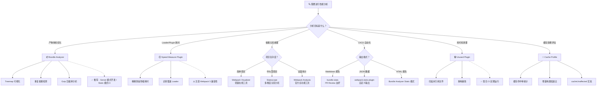
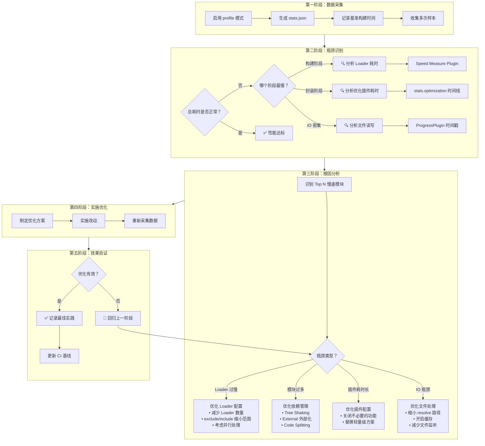

# 构建性能：分享 7 款常用的性能分析工具


## 📊 版本差异对照表

| 维度 | v1 原版 | v2 更新版
| ------|---------|-----------
| **Webpack 版本** | 5.36.x | **5.107** |
| **官方内置工具** | 简要提及 `--json` | **深度解析 stats/ProgressPlugin/webpack-dashboard** |
| **Bundle Analyzer** | 基础用法 | **三种模式（static/server/JSON）+ 最新 API** |
| **Speed Measure Plugin** | 基础用法 | **增加 Webpack 5 兼容性警告** |
| **新增工具** | 无 | **webpack-stats-plugin / bundle-stats** |
| **缓存分析** | 未涉及 | **cache.profile / cacheUnaffected 实验特性** |
| **方法论** | 工具罗列 | **识别瓶颈→定位原因→验证效果 完整流程** |
| **可视化** | 截图展示 | **Mermaid 决策树 + 瓶颈定位流程图** |
| **过时工具** | Webpack Visualizer（已标记废弃） | **移除或降级为参考** |

---

## 引言

Webpack 最大的优势在于它的功能非常强大、全面，加之繁荣活跃的组件生态，已经足够应对几乎所有 Web 构建需求，包括：SPA、MPA、SSR、桌面应用、Node 程序、WebAssembly、PWA、微前端等等，所以即使在近几年工程化领域异军突起、百花齐放的背景下，Webpack 也依然能保持老大哥的位置。

但软件世界没有银弹！Webpack 在大型项目中通常性能表现不佳，这一方面是因为 JavaScript 语言的单线程架构决定了 Webpack 的运算效率就不可能很高；另一方面则是因为在大型项目中，Webpack 通常需要借助许多组件（插件、Loader）完成大量的文件读写、代码编译操作。

幸运的是，站在开发者视角，我们有许多行之有效的性能优化方法，包括缓存、并发、优化文件处理步骤等，但在着手优化之前，有必要先简单了解一下 Webpack 打包的核心流程；了解哪些步骤比较耗时，可能会造成性能卡点；以及，如何借助一些可视化工具分析 Webpack 的编译性能。

## 核心流程

Webpack 最最核心的功能，一是使用适当 Loader 将任意类型文件转译为 JavaScript 代码，例如将 CSS 代码转译为 JS 字符串，将多媒体文件转译为 Base64 代码等；二是将这些经过 Loader 处理的文件资源合并、打包成向下兼容的产物文件。

为了实现这些功能，Webpack 底层的工作流程大致可以总结为这么几个阶段：

### 1. 初始化阶段

- **初始化参数**：从配置文件、配置对象、Shell 参数中读取，与默认配置结合得出最终的参数；
- **创建编译器对象**：用上一步得到的参数创建 Compiler 对象；
- **初始化编译环境**：包括注入内置插件、注册各种模块工厂、初始化 RuleSet 集合、加载配置的插件等；
- **开始编译**：执行 compiler 对象的 run 方法，创建 Compilation 对象；
- **确定入口**：根据配置中的 `entry` 找出所有的入口文件，调用 `compilation.addEntry` 将入口文件转换为 `dependence` 对象。

### 2. 构建阶段

- **编译模块(make)**：从 `entry` 文件开始，调用 `loader` 将模块转译为标准 JS 内容，调用 JS 解析器将内容转换为 AST 对象，从中找出该模块依赖的模块，再 **递归** 处理这些依赖模块，直到所有入口依赖的文件都经过了本步骤的处理；
- **完成模块编译**：上一步递归处理所有能触达到的模块后，得到了每个模块被翻译后的内容以及它们之间的`依赖关系图`。

### 3. 封装阶段

- **合并(seal)**：根据入口和模块之间的依赖关系，组装成一个个包含多个模块的 `Chunk`；
- **优化(optimization)**：对上述 `Chunk` 施加一系列优化操作，包括：tree-shaking、terser、scope-hoisting、压缩、Code Split 等；
- **写入文件系统(emitAssets)**：在确定好输出内容后，根据配置确定输出的路径和文件名，把文件内容写入到文件系统。

### 性能瓶颈点分析

在这个过程中有不少可能造成性能问题的地方：

**构建阶段：**
- 首先需要将文件的相对引用路径转换为绝对路径，这个过程可能涉及多次 IO 操作，执行效率取决于 **文件层次深度**；
- 找到具体文件后，需要读入文件内容并调用 [loader-runner](https://github.com/webpack/loader-runner/blob/main/lib/LoaderRunner.js) 遍历 Loader 数组完成内容转译，这个过程需要执行较密集的 CPU 操作，执行效率取决于 **Loader 的数量与复杂度**；
- 需要将模块内容解析为 AST 结构，并遍历 AST 找出模块的依赖资源，这个过程同样需要较密集的 CPU 操作，执行效率取决于 **代码复杂度**；
- 递归处理依赖资源，执行效率取决于 **模块数量**。

**封装阶段：**
- 根据 `splitChunks` 配置、`entry` 配置、动态模块引用语句等，确定模块与 Chunk 的映射关系，其中 `splitChunks` 相关的分包算法非常复杂，涉及大量 CPU 计算；
- 根据 `optimization` 配置执行一系列产物优化操作，特别是 [Terser](https://github.com/webpack-contrib/terser-webpack-plugin) 插件需要执行大量 AST 相关的运算，执行效率取决于 **产物代码量**。

可以看出，Webpack 需要执行非常密集的 IO 与 CPU 操作，计算成本高，再加上 Webpack 以及大多数组件都使用 JavaScript 编写，无法充分利用多核 CPU 能力，所以在中大型项目性能通常表现较差。

不过，这些性能问题是可以被优化的！

## 性能分析基础

有许多被反复实践、行之有效的构建性能优化手段，包括并行编译、缓存、缩小资源搜索范围等等，但在介绍这些具体的优化方法之前，有必要先聊聊：如何收集、分析 Webpack 打包过程的性能数据。

### 官方内置分析工具

Webpack 从 v5 开始提供了更完善的内置分析能力，主要包括三大工具：

#### 1. Stats 配置项 —— 详尽控制日志输出

Stats 是 Webpack 内置的统计接口，专门用于收集模块构建耗时、模块依赖关系等信息。在 Webpack 5.107 中，stats 配置项得到了极大增强：

**基本用法：**

```js
// webpack.config.js
module.exports = {
  // 方式一：开启 profile 模式收集详细耗时数据
  profile: true,

  // 方式二：精细控制 stats 输出（推荐）
  stats: {
    // 基础选项
    all: false, // 先关闭所有默认输出
    assets: true,
    errors: true,
    warnings: true,
    modules: true,
    timings: true,

    // 高级选项（v5 新增）
    performance: true, // 显示性能提示
    relatedAssets: true, // 显示关联资源
    moduleTrace: true, // 显示模块追踪
    dependencies: true, // 显示依赖关系

    // 自定义输出格式
    colors: true,
    logging: 'warn', // 日志级别：'error' | 'warn' | 'info' | 'log' | 'verbose'
    loggingDebug: [/webpack/], // 正则匹配需要详细日志的模块
  }
}
```

**生成 stats.json 文件：**

```bash
npx webpack --json=stats.json --profile
```

也可以通过 Node API 获取 stats 数据：

```js
const webpack = require('webpack');
const fs = require('fs');
const config = require('./webpack.config');

const compiler = webpack(config);

compiler.run((err, stats) => {
  // 写入 JSON 文件
  fs.writeFileSync('stats.json', JSON.stringify(stats.toJson({ source: false }), null, 2));
});
```

**stats.json 核心字段说明（v5.107）：**

```json
{
  "hash": "2c0b66247db00e494ab8",
  "version": "5.107.0",
  "time": 81,
  "builtAt": 1620401092814,
  "publicPath": "",
  "outputPath": "/Users/project/dist",

  "assetsByChunkName": { "main": ["index.js"] },
  "assets": [
    {
      "name": "index.js",
      "size": 12345,
      "chunks": ["main"],
      "emitted": true
    }
  ],

  "modules": [
    {
      "name": "./src/index.js",
      "size": 1234,
      "chunks": ["main"],
      "reasons": [{ "moduleName": "main" }],
      "profile": {
        "factory": 10,       // 模块工厂创建耗时(ms)
        "building": 50,      // Loader 编译耗时(ms)
        "dependencies": 20,  // 依赖解析耗时(ms)
        "total": 80          // 总耗时(ms)
      }
    }
  ],

  "chunks": [
    {
      "id": "main",
      "names": ["main"],
      "files": ["index.js"],
      "size": 12345,
      "modules": [...],
      "origins": [...],
      "rendered": true,
      "initial": true,
      "entry": true
    }
  ],

  "entrypoints": {
    "main": {
      "chunks": ["main"],
      "assets": ["index.js"]
    }
  },

  "timing": {
    "building": 1000,
    "dependencies": 500,
    "total": 1500
  },

  "children": [
    // 子 Compiler 数据（如 mini-css-extract-plugin）
  ],

  // v5 新增字段
  "namedChunkGroups": {},
  "logging": {}
}
```

**关键洞察点：**
- `modules[].profile`：每个模块在各阶段的详细耗时，是性能优化的核心数据源
- `chunks[].modules`：Chunk 与 Module 的映射关系，用于分析分包策略
- `assets[].size`：最终产物体积，用于评估压缩效果
- `children`：子 Compiler 性能数据（如 CSS 抽取插件的独立编译过程）

#### 2. ProgressPlugin —— 构建进度条

ProgressPlugin 是 Webpack 内置的进度显示插件，能够在编译过程中实时展示各阶段的进度：

```js
const webpack = require('webpack');

module.exports = {
  // ...
  plugins: [
    new webpack.ProgressPlugin({
      // 基础配置
      activeModules: false, // 显示活跃模块计数
      entries: true,        // 显示入口计数
      modules: true,        // 显示模块计数
      modulesCount: 5000,   // 模块最小显示阈值
      dependencies: true,   // 显示依赖计数
      dependenciesCount: 10000, // 依赖最小显示阈值

      // 进度回调（自定义输出）
      handler: (percentage, message, ...args) => {
        console.log(`${Math.round(percentage * 100)}% ${message}`);
      },

      // v5.107 新增选项
      profile: false,       // 收集性能剖析数据（用于后续分析）
    }),
  ],
};
```

**典型输出示例：**

```text
0% compiling
10% building 0/1 entries 1/3 modules 0/3 dependencies
30% building 1/3 entries 5/15 modules 10/25 dependencies
60% building 1/3 entries 20/50 modules 30/80 dependencies
90% sealing 1/1 entries optimization
95% emitting
100% after emitting
```

**应用场景：**
- CI/CD 流水线中监控构建进度
- 大型项目快速判断卡顿阶段
- 与自定义日志系统集成

#### 3. webpack-dashboard —— 终端仪表盘

[webpack-dashboard](https://github.com/FormidableLabs/webpack-dashboard) 是一个增强版的终端 UI 工具，比 ProgressPlugin 提供更丰富的实时信息：

**安装与配置：**

```bash
yarn add -D webpack-dashboard
```

```js
const DashboardPlugin = require('webpack-dashboard/plugin');

module.exports = {
  plugins: [
    new DashboardPlugin({
      // v5.107 支持的配置选项
      port: 9838,           // WebSocket 端口（用于远程监控）
      host: 'localhost',
      handler: undefined,    // 自定义数据处理函数

      // 传输层配置
      transport: {
        host: 'localhost',
        port: 9838
      }
    }),
  ],
};
```

**启动方式：**

```bash
npx webpack-dashboard -- webpack

npx webpack-dashboard -- webpack-dev-server

npx webpack
```

**功能特性：**
- 📊 实时模块统计（已编译/待编译/总模块数）
- 📦 资产清单（产物列表、大小、类型）
- ⚠️ 警告与错误高亮显示
- 🔌 插件系统状态
- 📈 构建时间线（各阶段耗时）

### 第三方可视化工具生态

基于 stats 数据，社区提供了众多优秀的可视化分析工具。下面我们按场景分类详细介绍：

---

## 🛠️ 工具一：Webpack Bundle Analyzer（产物体积可视化）

**⭐ 推荐指数：★★★★★（最常用）**

[webpack-bundle-analyzer](https://github.com/webpack-contrib/webpack-bundle-analyzer) 是社区使用率最高的性能分析工具之一，能够以交互式 Treemap 展示模块体积分布。

### 安装

```bash
yarn add -D webpack-bundle-analyzer
npm install --save-dev webpack-bundle-analyzer
```

### 三种使用模式

#### 模式 1：Server 模式（开发调试首选）

```js
// webpack.config.js
const BundleAnalyzerPlugin = require('webpack-bundle-analyzer').BundleAnalyzerPlugin;

module.exports = {
  plugins: [
    new BundleAnalyzerPlugin({
      analyzerMode: 'server',  // 默认值
      analyzerHost: '127.0.0.1',
      analyzerPort: 8888,

      // 自动打开浏览器
      openAnalyzer: true,

      // 生成报告文件（可选）
      generateStatsFile: false,
      statsFilename: 'stats.json',

      // 其他选项
      reportTitle: 'Bundle Analysis',
      defaultSizes: 'parsed', // parsed | gzip | brotli
      logLevel: 'info',
    }),
  ],
};
```

**特点：**
- ✅ 启动本地 HTTP 服务器
- ✅ 实时交互式探索
- ✅ 适合开发环境调试

#### 模式 2：Static 模式（CI/CD & 文档）

```js
new BundleAnalyzerPlugin({
  analyzerMode: 'static',
  reportFilename: 'bundle-report.html',  // 输出到 dist 目录
  openAnalyzer: false,                    // 不自动打开浏览器
})
```

**特点：**
- ✅ 生成独立的 HTML 报告文件
- ✅ 可部署到静态服务器或上传至 Git
- ✅ 适合 PR Review 或历史对比

#### 模式 3：JSON 模式（程序化分析）

```js
new BundleAnalyzerPlugin({
  analyzerMode: 'disabled',              // 禁用可视化界面
  generateStatsFile: true,
  statsFilename: 'bundle-stats.json',     // 仅生成统计数据
})
```

**特点：**
- ✅ 不生成可视化报告
- ✅ 仅输出结构化的 JSON 数据
- ✅ 适合自定义后处理或集成到其他工具链

### CLI 独立使用

除了作为插件使用，还可以直接分析已有的 stats.json：

```bash
npx webpack-bundle-analyzer ./stats.json

npx webpack-bundle-analyzer ./stats.json -p 8888

npx webpack-bundle-analyzer ./stats.json -m static -r report.html
```

### 典型分析场景

基于 Bundle Analyzer 提供的视图，我们可以高效地分析出：

1. **模块体积占比** → 判断是否存在异常大的第三方库
2. **重复依赖检测** → 发现同一库被多个版本引入的问题
3. **Tree Shaking 效果验证** → 确认未使用的代码是否已被移除
4. **Code Splitting 优化** → 评估分包策略是否合理
5. **Gzip/Brotli 压缩率** → 了解实际网络传输体积

**最佳实践建议：**
- 开发环境使用 Server 模式进行实时调试
- CI 流水线中使用 Static 模式生成报告存档
- 结合 `--profile` flag 收集更详细的性能数据

---

## 🛠️ 工具二：Speed Measure Webpack Plugin（Loader/Plugin 耗时分析）

**⭐ 推荐指数：★★★★☆（定位慢速 Loader/Plugin 必备）**

[speed-measure-webpack-plugin](https://github.com/stephencookdev/speed-measure-webpack-plugin) 能够精确测量每个 Loader 和 Plugin 的执行耗时，帮助开发者快速定位性能瓶颈。

### 安装

```bash
yarn add -D speed-measure-webpack-plugin
```

### 基本用法

```js
const SpeedMeasurePlugin = require('speed-measure-webpack-plugin');
const smp = new SpeedMeasurePlugin();

const config = {
  entry: './src/index.js',
  module: {
    rules: [
      {
        test: /\.tsx?$/,
        use: 'ts-loader',
      },
      {
        test: /\.css$/,
        use: ['style-loader', 'css-loader', 'postcss-loader'],
      },
    ],
  },
  plugins: [
    new HtmlWebpackPlugin(),
    new MiniCssExtractPlugin(),
  ],
};

// 使用 smp.wrap 包裹整个配置
module.exports = smp.wrap(config);
```

### 输出示例

```text
 SMP  ⏱  General output time took 3.24 mins

 SMP  ⏱  Plugins
 MiniCssExtractPlugin took 0.001 mins
 HtmlWebpackPlugin took 0.073 mins

 SMP  ⏱  Loaders
 css-loader took 0.342 mins  ⚠️  [slow]
         module count: 456
 postcss-loader took 0.567 mins  ⚠️  [slow]
         module count: 456
 ts-loader took 1.234 mins  ❌  [very slow]
         module count: 789
 babel-loader took 0.089 mins
         module count: 123

 SMP  ⏱  External:
   typescript compilation took 0.89 mins
```

### ⚠️ Webpack 5 兼容性注意事项

> **重要提示**：Speed Measure Plugin 在 Webpack 5 中存在一些已知兼容性问题：

1. **ESM 模块兼容性**：部分 ESM-only 插件可能导致 `smp.wrap()` 失败
   ```js
   // 解决方案：使用 dynamic import 或配置 transpileOnly
   const smp = new SpeedMeasurePlugin({
     outputFormat: 'human', // 'human' | 'json'
     outputTarget: process.stdout,
   });
   ```

2. **Plugin 实例检测**：某些特殊构造的 Plugin 可能无法正确识别
   - 建议：先用简化版配置测试，确认无报错后再添加完整配置

3. **性能开销**：该插件本身会轻微降低构建速度（约 5-10%），仅建议在性能排查时启用

4. **替代方案**：如果兼容性问题严重，可考虑使用：
   - `webpack --profile` + 手动分析 stats.json
   - [profile-webpack-plugin](https://github.com/sqrrrl/profile-webpack-plugin)

### 高级配置

```js
const smp = new SpeedMeasurePlugin({
  // 输出格式
  outputFormat: 'human',     // 'human' | 'json' | 'verbose'

  // 输出目标
  outputTarget: './smp-output.json', // 文件路径或 process.stdout

  // 插件名称映射（解决匿名插件问题）
  pluginNames: {
    CustomPlugin: 'MyCustomPlugin',
  },

  // Loader 名称自定义
  loaderNames: {
    customLoader: 'my-custom-loader',
  },
});
```

---

## 🛠️ 工具三：Statoscope（多维度关系分析）

**⭐ 推荐指数：★★★★☆（复杂项目依赖分析神器）**

[Statoscope](https://github.com/statoscope/statoscope) 是一个功能强大的 Webpack stats 可视化与分析工具，特别擅长实体间的关系分析。

### 安装

```bash
yarn add -D @statoscope/cli

yarn add -D @statoscope/webpack-plugin
```

### 使用方式

#### 方式 A：Webpack 插件模式（自动化）

```js
const StatoscopeWebpackPlugin = require('@statoscope/webpack-plugin').default;

module.exports = {
  plugins: [
    new StatoscopeWebpackPlugin({
      // 基本配置
      name: 'my-project',          // 项目名称
      saveTo: '.statoscope/report.webpack', // 报告保存路径
      open: 'file',                // 打开方式：'file' | 'server' | false

      // 分析选项
      analyzeMode: 'web',          // 'web' | 'cli'

      // 高级选项
      watchMode: false,            // 监听模式
      additionalStats: [],         // 额外的 stats 文件（用于对比）
      context: __dirname,          // 项目根目录

      // 报告生成选项
      disableReport: false,
      reportOptions: {
        keepName: false,
      },
    }),
  ],
};
```

**自动打开报告：**
运行 `npx webpack` 后，Statoscope 会自动在浏览器中打开分析视图。

#### 方式 B：CLI 独立分析

```bash
npx statoscope stats.json --open

npx statoscope before.json after.json --open

npx statoscope stats.json -o report.html
```

### 核心功能特性

1. **多维度依赖关系图**
   - Modules ↔ Chunks 双向关联
   - EntryPoints → Modules 引用链
   - Packages 依赖树（支持 npm/yarn/pnpm）

2. **重复包检测**
   - 自动识别同一库的多版本引用
   - 提示可优化的 dedupe 机会

3. **体积分析与构成拆解**
   - Chunk 级别的模块组成
   - Module 级别的来源追溯
   - Asset 级别的压缩率对比

4. **编译性能时间线**
   - 各阶段耗时分布
   - 模块构建耗时 Top N 排行
   - Loader 执行耗时统计

5. **多版本对比**（v5 新增）
   - 并排对比两次构建的差异
   - 直观展示优化效果（体积减少/时间缩短）

### 适用场景

- ✅ 微前端项目的模块隔离分析
- ✅ Monorepo 的包依赖治理
- ✅ 复杂 Code Splitting 策略调优
- ✅ 第三方库版本冲突排查

---

## 🛠️ 工具四：Webpack Analysis（官方在线分析器）

**⭐ 推荐指数：★★★☆☆（功能全面但上手难度较高）**

[Webpack Analysis](https://webpack.github.io/analyse/) 是 Webpack 官方提供的在线可视化工具，提供最全面的分析视角。

### 使用方法

1. **生成 stats.json**：
   ```bash
   npx webpack --json=stats.json --profile
   ```

2. **导入分析**：
   - 访问 https://webpack.github.io/analyse/
   - 上传或拖拽 `stats.json` 文件

### 主要功能面板

| 面板 | 功能描述
| ------|----------
| **Modules** | 模块列表、大小、依赖关系图 |
| **Chunks** | Chunk 组成、模块归属、加载方式 |
| **Assets** | 产物文件、体积、类型分布 |
| **Warnings** | 警告详情、优化建议 |
| **Errors** | 错误堆栈、位置定位 |
| **Hints** | 性能瓶颈提示（⚠️ 注意：暂不完全支持 Webpack 5） |

### 优势与局限

**优势：**
- ✅ 信息保真度最高（零失真）
- ✅ 功能最全面（覆盖所有 stats 字段）
- ✅ 官方维护，更新及时

**局限：**
- ❌ 上手难度较高，信息噪音较多
- ❌ Hints 功能对 Webpack 5 支持不完善
- ❌ 需要手动上传文件（不适合自动化）

**替代方案**：
- 如果觉得官方版太复杂，可以尝试社区简化版 [webpack-deps-tree](https://mshustov.github.io/webpack-deps-tree/static/)
- 功能相似但界面更简洁，适合快速查看依赖树

---

## 🛠️ 工具五：webpack-stats-plugin（自定义 Stats 输出）

**⭐ 推荐指数：★★★★☆（CI/CD & 自动化流水线必备）**

[webpack-stats-plugin](https://github.com/formidablelabs/webpack-stats-plugin) 是一个轻量级插件，用于灵活地输出自定义格式的 stats 数据。

### 安装

```bash
yarn add -D webpack-stats-plugin
```

### 基本用法

```js
const { StatsWriterPlugin } = require('webpack-stats-plugin');

module.exports = {
  plugins: [
    new StatsWriterPlugin({
      filename: 'stats.json',  // 输出文件名
      fields: null,            // null = 全部字段，或指定字段数组
      stats: {                 // stats 配置选项（同 webpack.stats）
        all: false,
        assets: true,
        chunks: true,
        modules: true,
        timings: true,
      },
    }),
  ],
};
```

### 高级用法：自定义转换

```js
new StatsWriterPlugin({
  filename: 'stats-transformed.json',
  transform(data, opts) {
    // 自定义数据转换逻辑
    return JSON.stringify({
      timestamp: Date.now(),
      assets: data.assets.map(asset => ({
        name: asset.name,
        size: asset.size,
        sizeKB: Math.round(asset.size / 1024),
      })),
      totalSize: data.assets.reduce((sum, a) => sum + a.size, 0),
      chunkCount: data.chunks.length,
      moduleCount: data.modules.length,
    }, null, 2);
  },
});
```

### 应用场景

1. **CI/CD 性能基线监控**
   ```js
   // 输出精简版 stats 用于对比
   new StatsWriterPlugin({
     filename: 'build-stats.json',
     stats: { assets: true, timings: true },
   })
   ```

2. **自动化测试集成**
   ```js
   // 生成机器可读的结构化数据
   new StatsWriterPlugin({
     transform: (data) => JSON.stringify({
       buildTime: data.time,
       assetSizes: Object.fromEntries(
         data.assets.map(a => [a.name, a.size])
       ),
     })
   })
   ```

3. **自定义 Dashboard 数据源**
   ```js
   // 为内部平台提供标准化数据
   new StatsWriterPlugin({
     filename: '../dashboard/data/latest-build.json',
     fields: ['assets', 'chunks', 'timings', 'hash'],
   })
   ```

---

## 🛠️ 工具六：bundle-stats（CI 友好的统计报告）

**⭐ 推荐指数：★★★★☆（团队协作 & PR Review 推荐）**

[bundle-stats](https://github.com/vio/bundle-stats) 是一个专为 CI/CD 环境设计的 bundle 分析工具，能够生成易于分享的比较报告。

### 安装

```bash
yarn add -D bundle-stats
```

### CLI 用法

```bash
npx bundle-stats

npx bundle-stats --path ./dist

npx bundle-stats --baseline ./baseline-stats.json --current ./current-stats.json

npx bundle-stats --format markdown > BUNDLE_REPORT.md

npx bundle-stats --format html > report.html
```

### 在 Webpack 中集成

```js
const { BundleStatsWebpackPlugin } = require('bundle-stats');

module.exports = {
  plugins: [
    new BundleStatsWebpackPlugin({
      // 输出模式
      mode: 'auto',  // 'auto' | 'html' | 'markdown' | 'json'

      // 对比基线（可选）
      baseline: path.resolve(__dirname, '.bundle-stats/baseline.json'),

      // 输出路径
      outDir: '.bundle-stats',

      // 报告文件名
      filename: 'report',

      // 自定义选项
      jsonOutput: true,
      showFiles: true,
      showComponents: false,
    }),
  ],
};
```

### 典型输出示例（Markdown 格式）

```markdown

## Summary
- **Total Size**: 245 KB (-12% from baseline)
- **Chunks**: 3
- **Modules**: 156

## Assets Comparison
| Asset | Current | Baseline | Delta
| -------|---------|----------|-------
| main.js | 120 KB | 135 KB | -15 KB ✅ |
| vendor.js | 98 KB | 102 KB | -4 KB ✅ |
| runtime.js | 27 KB | 26 KB | +1 KB ⚠️ |

## Largest Modules
1. lodash (45 KB) - Consider tree-shaking or importing specific functions
2. moment (32 KB) - Consider using date-fns as alternative
3. @ant-design/icons (18 KB) - Consider importing only needed icons
```

### GitHub Actions 集成示例

```yaml
name: Bundle Analysis
on: [pull_request]

jobs:
  analyze:
    runs-on: ubuntu-latest
    steps:
      - uses: actions/checkout@v3

      - name: Setup Node.js
        uses: actions/setup-node@v3
        with:
          node-version: '18'

      - name: Install dependencies
        run: yarn install

      - name: Build project
        run: yarn build

      - name: Generate bundle report
        run: npx bundle-stats --format markdown --baseline .bundle-stats/baseline.json

      - name: Comment PR
        uses: actions/github-script@v6
        with:
          script: |
            const fs = require('fs');
            const report = fs.readFileSync('.bundle-stats/report.md', 'utf8');
            github.rest.issues.createComment({
              issue_number: context.issue.number,
              owner: context.repo.owner,
              repo: context.repo.repo,
              body: `## 📊 Bundle Size Report\n\n${report}`
            });
```

---

## 🛠️ 工具七：Unused Webpack Plugin（死代码检测）

**⭐ 推荐指数：★★★★☆（重构清理必备）**

[unused-webpack-plugin](https://github.com/MichaelDeBoey/unused-webpack-plugin) 能够反向查找项目中未被使用的文件，特别适合代码重构场景。

### 安装

```bash
yarn add -D unused-webpack-plugin
```

### 配置

```js
const UnusedWebpackPlugin = require('unused-webpack-plugin');
const path = require('path');

module.exports = {
  plugins: [
    new UnusedWebpackPlugin({
      // 需要分析的源码目录
      directories: [path.join(__dirname, 'src')],

      // 项目根路径
      root: path.join(__dirname),

      // 排除规则
      exclude: ['*.test.ts', '*.spec.ts', '__mocks__/**'],

      // 包含规则（可选，默认所有文件）
      include: ['**/*.ts', '**/*.tsx', '**/*.js'],

      // 是否在失败时退出进程（CI 场景有用）
      failOnUnused: false,

      // 输出详细程度
      verbose: false,
    }),
  ],
};
```

### 输出示例

```text
UNUSED FILES DETECTED:

❌ src/utils/deprecated-helper.ts
   - Not imported by any module
   - Last modified: 2026-01-15

❌ src/components/OldComponent.tsx
   - Not imported by any module
   - Consider removing or moving to archive/

✅ Total unused files found: 2
```

### 最佳实践

1. **定期扫描**：在 CI 中定期运行，防止死代码累积
2. **渐进式清理**：先标记为 deprecated，下个迭代再删除
3. **结合 ESLint**：配合 `no-unused-vars` 规则双重保障

---

## 🆕 新增：缓存性能分析（Webpack 5 FileSystem Cache）

Webpack 5 引入了强大的持久化缓存（FileSystem Cache），并提供专门的性能分析能力来评估缓存效果。

### cache.profile 配置

```js
module.exports = {
  cache: {
    type: 'filesystem',  // 使用文件系统缓存

    // 缓存性能分析（v5 新增）
    profile: true,       // 记录缓存命中/未命中的详细信息

    // 缓存目录
    cacheDirectory: path.resolve(__dirname, '.cache/webpack'),

    // 缓存版本（变更此值会清除旧缓存）
    version: '',         // 默认使用 webpack 版本

    // 缓存算法
    maxAge: 1000 * 60 * 60 * 24 * 7, // 7 天
    maxGenerations: undefined,

    // 构建依赖（变更会失效）
    buildDependencies: {
      config: [__filename],
    },
  },
};
```

### 缓存分析输出

当开启 `cache.profile: true` 后，Webpack 会在控制台输出详细的缓存统计：

```text
cached assets 5.02 MiB [compared for emit]
  assets by path *.js 3.76 MiB
    asset main.js 3.76 MiB [compared for emit] (name: main)
  assets by path *.css 1.26 MiB
    asset main.css 1.26 MiB [compared for emit] (name: main)
  asset index.html 1.01 KiB [emitted]

// 缓存命中率统计
cache: cached 1234 modules (85% of total modules)
cache: not cached 217 modules (15% of total modules)
  - 100 modules changed since last build
  - 117 modules newly added

// 缓存恢复时间
cache: restored 1234 modules from filesystem cache (took 234ms)
cache: built 217 modules from scratch (took 1.2s)

// 总体效果
previous build time: 12.5s
current build time: 1.8s (85% faster due to cache)
```

### experiments.cacheUnaffected（实验特性）

> **注意**：这是一个实验性功能，需要在 `experiments` 中显式启用

Webpack 5.107 引入了 `experiments.cacheUnaffected` 选项，用于缓存那些**未被修改且不影响输出的模块**：

```js
module.exports = {
  experiments: {
    // 启用未受影响模块缓存
    cacheUnaffected: true,
  },

  cache: {
    type: 'filesystem',
    profile: true,
  },
};
```

**工作原理：**
- 即使某些依赖模块发生了变化，只要它们不影响当前模块的最终输出，就可以复用缓存
- 特别适用于以下场景：
  - 类型定义文件（`.d.ts`）变更
  - 测试文件修改
  - 配置文件调整（非构建相关）
  - 文档/注释更新

**适用性判断：**
```bash
npx webpack --profile --json=stats.json | jq '.modules[] | select(.unaffected == true)'
```

### 缓存优化建议

1. **合理设置 buildDependencies**
   ```js
   buildDependencies: {
     config: [__filename],           // 配置文件变更会导致缓存失效
     tsconfig: ['./tsconfig.json'], // TypeScript 配置变更
   }
   ```

2. **避免频繁变动的依赖**
   - 不要将易变的配置文件加入 buildDependencies
   - 使用环境变量而非硬编码配置

3. **监控缓存命中率**
   - 目标：首次构建后的增量构建应达到 80%+ 命中率
   - 如果命中率低，检查是否有不必要的依赖变动

4. **定期清理过期缓存**
   ```bash
   # 手动清除缓存
   rm -rf .cache/webpack

   # 或者在配置中设置合理的 maxAge
   ```

---

## 📊 性能分析工具选型决策树

下面的决策树可以帮助你根据具体场景选择最合适的分析工具：



### 快速选择指南

| 场景 | 推荐工具 | 核心价值
| ------|----------|----------
| **首次接触性能优化** | Bundle Analyzer | 直观、上手快 |
| **构建速度慢** | Speed Measure Plugin | 精确定位瓶颈 |
| **复杂 Monorepo** | Statoscope | 依赖关系全景 |
| **PR Bundle 大小审查** | bundle-stats | 团队协作友好 |
| **CI 性能基线** | webpack-stats-plugin | 自动化友好 |
| **代码重构** | Unused Plugin | 死代码检测 |
| **二次构建仍慢** | cache.profile | 缓存效果诊断 |
| **全面审计** | Webpack Analysis | 信息最全 |

---

## 🔄 Webpack 构建性能瓶颈定位流程图

下面是一个完整的性能优化方法论流程，帮助你系统地分析和解决问题：



### 各阶段关键动作清单

#### 第一阶段：数据采集 ✅

- [ ] 在 `webpack.config.js` 中添加 `profile: true`
- [ ] 运行 `npx webpack --json=stats.json --profile`
- [ ] 连续执行 3 次，取平均值作为基准
- [ ] 记录完整构建时间和各阶段耗时

#### 第二阶段：瓶颈识别 🔍

- [ ] 查看 `stats.json` 中的 `time` 字段
- [ ] 分析 `modules[].profile` 找出耗时最长的模块
- [ ] 使用 Speed Measure Plugin 定位慢速 Loader
- [ ] 使用 Bundle Analyzer 识别大体积模块

#### 第三阶段：根因分析 🎯

- [ ] 判断是 CPU 密集型还是 IO 密集型瓶颈
- [ ] 检查是否有不必要的 Loader 链
- [ ] 评估第三方库的体积和必要性
- [ ] 检查 splitChunks 配置是否合理

#### 第四阶段：实施优化 🛠️

- [ ] 优先实施低成本高收益的优化
- [ ] 每次只改一处，便于回滚
- [ ] 保持优化前后的可对比性

#### 第五阶段：效果验证 ✓

- [ ] 重新运行完整的数据采集流程
- [ ] 对比优化前后的各项指标
- [ ] 确认没有引入新的问题
- [ ] 将成功的优化记录下来

---

## 📈 性能分析方法论总结

### 核心原则：识别 → 定位 → 验证

#### 1️⃣ 识别瓶颈（Identify）

**信号指标：**
- 总构建时间 > 30 秒（中小型项目）
- 增量构建时间 > 5 秒
- 内存占用持续增长
- CPU 占用率长期 100%

**初步诊断方法：**
```bash
npx webpack --profile --json=stats.json | jq '{time, hash, assets: (.assets | length), modules: (.modules | length)}'
```

#### 2️⃣ 定位原因（Locate）

**分层分析法：**

| 层级 | 分析工具 | 关注指标
| ------|----------|----------
| **全局概览** | ProgressPlugin | 各阶段占比 |
| **模块级别** | Bundle Analyzer | 体积分布 |
| **Loader 级别** | Speed Measure Plugin | 单次耗时 |
| **依赖级别** | Statoscope | 重复引用 |
| **缓存级别** | cache.profile | 命中率 |

#### 3️⃣ 验证效果（Verify）

**对比维度：**
- ⏱️ 绝对时间：优化前后总耗时
- 📊 相对比例：各阶段占比变化
- 💾 缓存效果：增量构建加速比
- 📦 产物体积：打包大小变化
- 🔧 构建稳定性：多次运行的方差

**验证脚本示例：**
```bash
#!/bin/bash

echo "=== Webpack Build Benchmark ==="

rm -rf .cache/webpack dist

echo "\n🧊 Cold Build (no cache):"
time npx webpack --mode=production

echo "\n🔥 Hot Build (with cache):"
time npx webpack --mode=production

echo "\n🔥 Hot Build 2nd (cache stability):"
time npx webpack --mode=production

echo "\n📊 Generating analysis..."
npx webpack --mode=production --json=stats.json --profile

echo "\n✅ Benchmark complete!"
```

### 常见性能问题与解决方案速查表

| 问题现象 | 可能原因 | 推荐工具 | 解决方案
| ----------|----------|----------|----------
| **构建极慢（>2min）** | Loader 链过长 | Speed Measure Plugin | 缩小 include/exclude 范围 |
| **产物体积过大** | 第三方库未优化 | Bundle Analyzer | external + CDN |
| **重复打包同一库** | 多版本依赖 | Statoscope | resolve.alias 统一 |
| **每次都全量重建** | 缓存未生效 | cache.profile | 检查 buildDependencies |
| **内存溢出** | 模块数过多 | stats.modules | Code Splitting + 动态导入 |
| **TS 编译慢** | 类型检查阻塞 | Speed Measure Plugin | fork-ts-checker-webpack-plugin |
| **CSS 处理慢** | PostCSS 插件多 | Speed Measure Plugin | 并行处理或缓存 |
| **图片资源大** | 未压缩/未转码 | Bundle Analyzer | image-webpack-loader |

---

## 总结

这是一篇介绍 Webpack 性能分析的实践方法类文章（v2 全面升级版）。我们首先需要理解 Webpack 编译的基本过程，以及过程中各个步骤的耗时，理解哪些节点可能会消耗更多时间等，在此基础上我们才能更精确、有的放矢地排查出项目中的性能问题。

### v2 版本核心更新点

1. **官方工具强化**：深入解析了 `stats` 配置项、`ProgressPlugin`、`webpack-dashboard` 三大内置工具
2. **工具版本更新**：所有第三方工具均更新至最新版本，补充了 Webpack 5 兼容性说明
3. **新增工具介绍**：`webpack-stats-plugin`、`bundle-stats` 两款现代化工具
4. **缓存分析能力**：新增 `cache.profile` 和 `experiments.cacheUnaffected` 专题
5. **方法论体系**：提出"识别瓶颈 → 定位原因 → 验证效果"的完整优化闭环
6. **可视化增强**：提供工具选型决策树和瓶颈定位流程图两张 Mermaid 图

### 工具使用建议

理解基本原理后，你可以沿着上面的介绍，逐一试用、学习这些分析工具。建议的学习路径：

**入门级**（1-2天）：
1. 安装 Bundle Analyzer，熟悉 Treemap 视图
2. 启用 `--profile`，学会读取基础 stats 数据

**进阶级**（3-5天）：
3. 使用 Speed Measure Plugin 定位慢速 Loader
4. 尝试 Statoscope 进行依赖关系分析

**专家级**（1-2周）：
5. 配置 CI 自动化报告（bundle-stats + webpack-stats-plugin）
6. 深入研究缓存机制（cache.profile + cacheUnaffected）
7. 建立团队性能基线和监控体系

记住：**性能优化是一个持续的过程**，而不是一次性的任务。建立科学的分析方法论，才能让优化工作事半功倍！

---

## 思考题

请仔细观察 `stats` 示例文件，思考几个问题：

1. 如何推断一个 Chunk 中包含了哪些模块？
2. 如何判断 Chunk 类型（Initial/Async/Runtime Chunk）？
3. 如何分析 Module 与 Module 之间的依赖关系？

**进阶挑战**：
4. 基于 `cache.profile` 输出，计算你的项目的缓存命中率，并尝试提升到 90%+
5. 使用 `bundle-stats` 生成一份 Markdown 报告，并在 PR 中展示优化成果
6. 设计一套适合你团队的 CI 性能监控方案（参考本章的方法论流程图）

---

## 附录：工具版本兼容性矩阵

| 工具名称 | 最新版本 | Webpack 5 支持 | 备注
| ----------|----------|----------------|------
| webpack-bundle-analyzer | ^4.10.x | ✅ 完全支持 | 推荐使用 |
| speed-measure-webpack-plugin | ^1.5.x | ⚠️ 部分兼容 | 需注意 ESM 问题 |
| @statoscope/webpack-plugin | ^5.x | ✅ 完全支持 | 功能强大 |
| webpack-dashboard | ^3.x | ✅ 完全支持 | 实时监控利器 |
| webpack-stats-plugin | ^0.3.x | ✅ 完全支持 | CI 自动化首选 |
| bundle-stats | ^0.19.x | ✅ 完全支持 | PR Review 友好 |
| unused-webpack-plugin | ^10.x | ✅ 完全支持 | 重构必备 |
| Webpack Analysis | 在线工具 | ⚠️ 部分 | Hints 功能受限 |
| ProgressPlugin | 内置 | ✅ 完全支持 | Webpack 5 原生 |

---

> **文档维护说明**：本文档基于 Webpack v5.107 编写，随着 Webpack 版本迭代，部分 API 和工具可能会有所调整。建议关注各工具的 GitHub 仓库获取最新动态。
